cola Report for Consensus Partitioning
==================

**Date**: 2019-12-03 14:24:35 CET, **cola version**: 1.3.2

----------------------------------------------------------------

<style type='text/css'>

body, td, th {
   font-family: Arial,Helvetica,sans-serif;
   background-color: white;
   font-size: 13px;
  max-width: 800px;
  margin: auto;
  margin-left:210px;
  padding: 0px 10px 0px 10px;
  border-left: 1px solid #EEEEEE;
  line-height: 150%;
}

tt, code, pre {
   font-family: 'DejaVu Sans Mono', 'Droid Sans Mono', 'Lucida Console', Consolas, Monaco, 

monospace;
}

h1 {
   font-size:2.2em;
}

h2 {
   font-size:1.8em;
}

h3 {
   font-size:1.4em;
}

h4 {
   font-size:1.0em;
}

h5 {
   font-size:0.9em;
}

h6 {
   font-size:0.8em;
}

a {
  text-decoration: none;
  color: #0366d6;
}

a:hover {
  text-decoration: underline;
}

a:visited {
   color: #0366d6;
}

pre, img {
  max-width: 100%;
}
pre {
  overflow-x: auto;
}
pre code {
   display: block; padding: 0.5em;
}

code {
  font-size: 92%;
  border: 1px solid #ccc;
}

code[class] {
  background-color: #F8F8F8;
}

table, td, th {
  border: 1px solid #ccc;
}

blockquote {
   color:#666666;
   margin:0;
   padding-left: 1em;
   border-left: 0.5em #EEE solid;
}

hr {
   height: 0px;
   border-bottom: none;
   border-top-width: thin;
   border-top-style: dotted;
   border-top-color: #999999;
}

@media print {
   * {
      background: transparent !important;
      color: black !important;
      filter:none !important;
      -ms-filter: none !important;
   }

   body {
      font-size:12pt;
      max-width:100%;
   }

   a, a:visited {
      text-decoration: underline;
   }

   hr {
      visibility: hidden;
      page-break-before: always;
   }

   pre, blockquote {
      padding-right: 1em;
      page-break-inside: avoid;
   }

   tr, img {
      page-break-inside: avoid;
   }

   img {
      max-width: 100% !important;
   }

   @page :left {
      margin: 15mm 20mm 15mm 10mm;
   }

   @page :right {
      margin: 15mm 10mm 15mm 20mm;
   }

   p, h2, h3 {
      orphans: 3; widows: 3;
   }

   h2, h3 {
      page-break-after: avoid;
   }
}
</style>


## Summary


All available functions which can be applied to this `res_list` object:


```r
res_list
```

```
#> A 'ConsensusPartitionList' object with 24 methods.
#>   On a matrix with 18032 rows and 132 columns.
#>   Top rows are extracted by 'SD, CV, MAD, ATC' methods.
#>   Subgroups are detected by 'hclust, kmeans, skmeans, pam, mclust, NMF' method.
#>   Number of partitions are tried for k = 2, 3, 4, 5, 6.
#>   Performed in total 30000 partitions by row resampling.
#> 
#> Following methods can be applied to this 'ConsensusPartitionList' object:
#>  [1] "cola_report"           "collect_classes"       "collect_plots"         "collect_stats"        
#>  [5] "colnames"              "functional_enrichment" "get_anno_col"          "get_anno"             
#>  [9] "get_classes"           "get_matrix"            "get_membership"        "get_stats"            
#> [13] "is_best_k"             "is_stable_k"           "ncol"                  "nrow"                 
#> [17] "rownames"              "show"                  "suggest_best_k"        "test_to_known_factors"
#> [21] "top_rows_heatmap"      "top_rows_overlap"     
#> 
#> You can get result for a single method by, e.g. object["SD", "hclust"] or object["SD:hclust"]
#> or a subset of methods by object[c("SD", "CV")], c("hclust", "kmeans")]
```

The call of `run_all_consensus_partition_methods()` was:


```
#> run_all_consensus_partition_methods(data = mat, mc.cores = 4, anno = anno)
```

Dimension of the input matrix:


```r
mat = get_matrix(res_list)
dim(mat)
```

```
#> [1] 18032   132
```

### Density distribution

The density distribution for each sample is visualized as in one column in the
following heatmap. The clustering is based on the distance which is the
Kolmogorov-Smirnov statistic between two distributions.


```r
library(ComplexHeatmap)
densityHeatmap(mat, top_annotation = HeatmapAnnotation(df = get_anno(res_list), 
    col = get_anno_col(res_list)), ylab = "value", cluster_columns = TRUE, show_column_names = FALSE,
    mc.cores = 4)
```


### Suggest the best k


Folowing table shows the best `k` (number of partitions) for each combination
of top-value methods and partition methods. Clicking on the method name in
the table goes to the section for a single combination of methods.

[The cola vignette](http://bioconductor.org/packages/devel/bioc/vignettes/cola/inst/doc/cola.html#toc_13)
explains the definition of the metrics used for determining the best
number of partitions.


```r
suggest_best_k(res_list)
```


|                            | The best k| 1-PAC| Mean silhouette| Concordance|   |
|:---------------------------|----------:|-----:|---------------:|-----------:|:--|
|[SD:kmeans](#SD-kmeans)     |          2| 1.000|           0.970|       0.988|** |
|[SD:skmeans](#SD-skmeans)   |          2| 1.000|           0.995|       0.998|** |
|[SD:pam](#SD-pam)           |          2| 1.000|           0.992|       0.996|** |
|[SD:mclust](#SD-mclust)     |          3| 1.000|           0.971|       0.989|** |
|[CV:kmeans](#CV-kmeans)     |          2| 1.000|           0.978|       0.990|** |
|[CV:skmeans](#CV-skmeans)   |          2| 1.000|           0.984|       0.994|** |
|[CV:pam](#CV-pam)           |          2| 1.000|           0.988|       0.990|** |
|[MAD:kmeans](#MAD-kmeans)   |          2| 1.000|           0.977|       0.990|** |
|[MAD:skmeans](#MAD-skmeans) |          2| 1.000|           0.985|       0.994|** |
|[MAD:pam](#MAD-pam)         |          2| 1.000|           0.971|       0.987|** |
|[MAD:mclust](#MAD-mclust)   |          3| 1.000|           0.965|       0.983|** |
|[ATC:skmeans](#ATC-skmeans) |          2| 1.000|           0.988|       0.995|** |
|[ATC:mclust](#ATC-mclust)   |          2| 1.000|           0.962|       0.986|** |
|[CV:mclust](#CV-mclust)     |          3| 1.000|           0.955|       0.983|** |
|[CV:NMF](#CV-NMF)           |          2| 0.984|           0.958|       0.983|** |
|[ATC:NMF](#ATC-NMF)         |          2| 0.984|           0.971|       0.986|** |
|[SD:NMF](#SD-NMF)           |          2| 0.984|           0.962|       0.983|** |
|[ATC:pam](#ATC-pam)         |          2| 0.984|           0.957|       0.981|** |
|[MAD:NMF](#MAD-NMF)         |          2| 0.922|           0.951|       0.979|*  |
|[ATC:kmeans](#ATC-kmeans)   |          2| 0.907|           0.928|       0.971|*  |
|[CV:hclust](#CV-hclust)     |          3| 0.760|           0.894|       0.920|   |
|[ATC:hclust](#ATC-hclust)   |          2| 0.689|           0.831|       0.931|   |
|[SD:hclust](#SD-hclust)     |          3| 0.590|           0.855|       0.889|   |
|[MAD:hclust](#MAD-hclust)   |          3| 0.532|           0.782|       0.871|   |

\*\*: 1-PAC > 0.95, \*: 1-PAC > 0.9


### CDF of consensus matrices

Cumulative distribution function curves of consensus matrix for all methods.


```r
collect_plots(res_list, fun = plot_ecdf)
```


### Consensus heatmap

Consensus heatmaps for all methods. ([What is a consensus heatmap?](http://bioconductor.org/packages/devel/bioc/vignettes/cola/inst/doc/cola.html#toc_9))


<style type='text/css'>


.ui-helper-hidden {
	display: none;
}
.ui-helper-hidden-accessible {
	border: 0;
	clip: rect(0 0 0 0);
	height: 1px;
	margin: -1px;
	overflow: hidden;
	padding: 0;
	position: absolute;
	width: 1px;
}
.ui-helper-reset {
	margin: 0;
	padding: 0;
	border: 0;
	outline: 0;
	line-height: 1.3;
	text-decoration: none;
	font-size: 100%;
	list-style: none;
}
.ui-helper-clearfix:before,
.ui-helper-clearfix:after {
	content: "";
	display: table;
	border-collapse: collapse;
}
.ui-helper-clearfix:after {
	clear: both;
}
.ui-helper-zfix {
	width: 100%;
	height: 100%;
	top: 0;
	left: 0;
	position: absolute;
	opacity: 0;
	filter:Alpha(Opacity=0); 
}

.ui-front {
	z-index: 100;
}


.ui-state-disabled {
	cursor: default !important;
	pointer-events: none;
}


.ui-icon {
	display: inline-block;
	vertical-align: middle;
	margin-top: -.25em;
	position: relative;
	text-indent: -99999px;
	overflow: hidden;
	background-repeat: no-repeat;
}

.ui-widget-icon-block {
	left: 50%;
	margin-left: -8px;
	display: block;
}


.ui-widget-overlay {
	position: fixed;
	top: 0;
	left: 0;
	width: 100%;
	height: 100%;
}
.ui-accordion .ui-accordion-header {
	display: block;
	cursor: pointer;
	position: relative;
	margin: 2px 0 0 0;
	padding: .5em .5em .5em .7em;
	font-size: 100%;
}
.ui-accordion .ui-accordion-content {
	padding: 1em 2.2em;
	border-top: 0;
	overflow: auto;
}
.ui-autocomplete {
	position: absolute;
	top: 0;
	left: 0;
	cursor: default;
}
.ui-menu {
	list-style: none;
	padding: 0;
	margin: 0;
	display: block;
	outline: 0;
}
.ui-menu .ui-menu {
	position: absolute;
}
.ui-menu .ui-menu-item {
	margin: 0;
	cursor: pointer;
	
	list-style-image: url("data:image/gif;base64,R0lGODlhAQABAIAAAAAAAP///yH5BAEAAAAALAAAAAABAAEAAAIBRAA7");
}
.ui-menu .ui-menu-item-wrapper {
	position: relative;
	padding: 3px 1em 3px .4em;
}
.ui-menu .ui-menu-divider {
	margin: 5px 0;
	height: 0;
	font-size: 0;
	line-height: 0;
	border-width: 1px 0 0 0;
}
.ui-menu .ui-state-focus,
.ui-menu .ui-state-active {
	margin: -1px;
}


.ui-menu-icons {
	position: relative;
}
.ui-menu-icons .ui-menu-item-wrapper {
	padding-left: 2em;
}


.ui-menu .ui-icon {
	position: absolute;
	top: 0;
	bottom: 0;
	left: .2em;
	margin: auto 0;
}


.ui-menu .ui-menu-icon {
	left: auto;
	right: 0;
}
.ui-button {
	padding: .4em 1em;
	display: inline-block;
	position: relative;
	line-height: normal;
	margin-right: .1em;
	cursor: pointer;
	vertical-align: middle;
	text-align: center;
	-webkit-user-select: none;
	-moz-user-select: none;
	-ms-user-select: none;
	user-select: none;

	
	overflow: visible;
}

.ui-button,
.ui-button:link,
.ui-button:visited,
.ui-button:hover,
.ui-button:active {
	text-decoration: none;
}


.ui-button-icon-only {
	width: 2em;
	box-sizing: border-box;
	text-indent: -9999px;
	white-space: nowrap;
}


input.ui-button.ui-button-icon-only {
	text-indent: 0;
}


.ui-button-icon-only .ui-icon {
	position: absolute;
	top: 50%;
	left: 50%;
	margin-top: -8px;
	margin-left: -8px;
}

.ui-button.ui-icon-notext .ui-icon {
	padding: 0;
	width: 2.1em;
	height: 2.1em;
	text-indent: -9999px;
	white-space: nowrap;

}

input.ui-button.ui-icon-notext .ui-icon {
	width: auto;
	height: auto;
	text-indent: 0;
	white-space: normal;
	padding: .4em 1em;
}


input.ui-button::-moz-focus-inner,
button.ui-button::-moz-focus-inner {
	border: 0;
	padding: 0;
}
.ui-controlgroup {
	vertical-align: middle;
	display: inline-block;
}
.ui-controlgroup > .ui-controlgroup-item {
	float: left;
	margin-left: 0;
	margin-right: 0;
}
.ui-controlgroup > .ui-controlgroup-item:focus,
.ui-controlgroup > .ui-controlgroup-item.ui-visual-focus {
	z-index: 9999;
}
.ui-controlgroup-vertical > .ui-controlgroup-item {
	display: block;
	float: none;
	width: 100%;
	margin-top: 0;
	margin-bottom: 0;
	text-align: left;
}
.ui-controlgroup-vertical .ui-controlgroup-item {
	box-sizing: border-box;
}
.ui-controlgroup .ui-controlgroup-label {
	padding: .4em 1em;
}
.ui-controlgroup .ui-controlgroup-label span {
	font-size: 80%;
}
.ui-controlgroup-horizontal .ui-controlgroup-label + .ui-controlgroup-item {
	border-left: none;
}
.ui-controlgroup-vertical .ui-controlgroup-label + .ui-controlgroup-item {
	border-top: none;
}
.ui-controlgroup-horizontal .ui-controlgroup-label.ui-widget-content {
	border-right: none;
}
.ui-controlgroup-vertical .ui-controlgroup-label.ui-widget-content {
	border-bottom: none;
}


.ui-controlgroup-vertical .ui-spinner-input {

	
	width: 75%;
	width: calc( 100% - 2.4em );
}
.ui-controlgroup-vertical .ui-spinner .ui-spinner-up {
	border-top-style: solid;
}

.ui-checkboxradio-label .ui-icon-background {
	box-shadow: inset 1px 1px 1px #ccc;
	border-radius: .12em;
	border: none;
}
.ui-checkboxradio-radio-label .ui-icon-background {
	width: 16px;
	height: 16px;
	border-radius: 1em;
	overflow: visible;
	border: none;
}
.ui-checkboxradio-radio-label.ui-checkboxradio-checked .ui-icon,
.ui-checkboxradio-radio-label.ui-checkboxradio-checked:hover .ui-icon {
	background-image: none;
	width: 8px;
	height: 8px;
	border-width: 4px;
	border-style: solid;
}
.ui-checkboxradio-disabled {
	pointer-events: none;
}
.ui-datepicker {
	width: 17em;
	padding: .2em .2em 0;
	display: none;
}
.ui-datepicker .ui-datepicker-header {
	position: relative;
	padding: .2em 0;
}
.ui-datepicker .ui-datepicker-prev,
.ui-datepicker .ui-datepicker-next {
	position: absolute;
	top: 2px;
	width: 1.8em;
	height: 1.8em;
}
.ui-datepicker .ui-datepicker-prev-hover,
.ui-datepicker .ui-datepicker-next-hover {
	top: 1px;
}
.ui-datepicker .ui-datepicker-prev {
	left: 2px;
}
.ui-datepicker .ui-datepicker-next {
	right: 2px;
}
.ui-datepicker .ui-datepicker-prev-hover {
	left: 1px;
}
.ui-datepicker .ui-datepicker-next-hover {
	right: 1px;
}
.ui-datepicker .ui-datepicker-prev span,
.ui-datepicker .ui-datepicker-next span {
	display: block;
	position: absolute;
	left: 50%;
	margin-left: -8px;
	top: 50%;
	margin-top: -8px;
}
.ui-datepicker .ui-datepicker-title {
	margin: 0 2.3em;
	line-height: 1.8em;
	text-align: center;
}
.ui-datepicker .ui-datepicker-title select {
	font-size: 1em;
	margin: 1px 0;
}
.ui-datepicker select.ui-datepicker-month,
.ui-datepicker select.ui-datepicker-year {
	width: 45%;
}
.ui-datepicker table {
	width: 100%;
	font-size: .9em;
	border-collapse: collapse;
	margin: 0 0 .4em;
}
.ui-datepicker th {
	padding: .7em .3em;
	text-align: center;
	font-weight: bold;
	border: 0;
}
.ui-datepicker td {
	border: 0;
	padding: 1px;
}
.ui-datepicker td span,
.ui-datepicker td a {
	display: block;
	padding: .2em;
	text-align: right;
	text-decoration: none;
}
.ui-datepicker .ui-datepicker-buttonpane {
	background-image: none;
	margin: .7em 0 0 0;
	padding: 0 .2em;
	border-left: 0;
	border-right: 0;
	border-bottom: 0;
}
.ui-datepicker .ui-datepicker-buttonpane button {
	float: right;
	margin: .5em .2em .4em;
	cursor: pointer;
	padding: .2em .6em .3em .6em;
	width: auto;
	overflow: visible;
}
.ui-datepicker .ui-datepicker-buttonpane button.ui-datepicker-current {
	float: left;
}


.ui-datepicker.ui-datepicker-multi {
	width: auto;
}
.ui-datepicker-multi .ui-datepicker-group {
	float: left;
}
.ui-datepicker-multi .ui-datepicker-group table {
	width: 95%;
	margin: 0 auto .4em;
}
.ui-datepicker-multi-2 .ui-datepicker-group {
	width: 50%;
}
.ui-datepicker-multi-3 .ui-datepicker-group {
	width: 33.3%;
}
.ui-datepicker-multi-4 .ui-datepicker-group {
	width: 25%;
}
.ui-datepicker-multi .ui-datepicker-group-last .ui-datepicker-header,
.ui-datepicker-multi .ui-datepicker-group-middle .ui-datepicker-header {
	border-left-width: 0;
}
.ui-datepicker-multi .ui-datepicker-buttonpane {
	clear: left;
}
.ui-datepicker-row-break {
	clear: both;
	width: 100%;
	font-size: 0;
}


.ui-datepicker-rtl {
	direction: rtl;
}
.ui-datepicker-rtl .ui-datepicker-prev {
	right: 2px;
	left: auto;
}
.ui-datepicker-rtl .ui-datepicker-next {
	left: 2px;
	right: auto;
}
.ui-datepicker-rtl .ui-datepicker-prev:hover {
	right: 1px;
	left: auto;
}
.ui-datepicker-rtl .ui-datepicker-next:hover {
	left: 1px;
	right: auto;
}
.ui-datepicker-rtl .ui-datepicker-buttonpane {
	clear: right;
}
.ui-datepicker-rtl .ui-datepicker-buttonpane button {
	float: left;
}
.ui-datepicker-rtl .ui-datepicker-buttonpane button.ui-datepicker-current,
.ui-datepicker-rtl .ui-datepicker-group {
	float: right;
}
.ui-datepicker-rtl .ui-datepicker-group-last .ui-datepicker-header,
.ui-datepicker-rtl .ui-datepicker-group-middle .ui-datepicker-header {
	border-right-width: 0;
	border-left-width: 1px;
}


.ui-datepicker .ui-icon {
	display: block;
	text-indent: -99999px;
	overflow: hidden;
	background-repeat: no-repeat;
	left: .5em;
	top: .3em;
}
.ui-dialog {
	position: absolute;
	top: 0;
	left: 0;
	padding: .2em;
	outline: 0;
}
.ui-dialog .ui-dialog-titlebar {
	padding: .4em 1em;
	position: relative;
}
.ui-dialog .ui-dialog-title {
	float: left;
	margin: .1em 0;
	white-space: nowrap;
	width: 90%;
	overflow: hidden;
	text-overflow: ellipsis;
}
.ui-dialog .ui-dialog-titlebar-close {
	position: absolute;
	right: .3em;
	top: 50%;
	width: 20px;
	margin: -10px 0 0 0;
	padding: 1px;
	height: 20px;
}
.ui-dialog .ui-dialog-content {
	position: relative;
	border: 0;
	padding: .5em 1em;
	background: none;
	overflow: auto;
}
.ui-dialog .ui-dialog-buttonpane {
	text-align: left;
	border-width: 1px 0 0 0;
	background-image: none;
	margin-top: .5em;
	padding: .3em 1em .5em .4em;
}
.ui-dialog .ui-dialog-buttonpane .ui-dialog-buttonset {
	float: right;
}
.ui-dialog .ui-dialog-buttonpane button {
	margin: .5em .4em .5em 0;
	cursor: pointer;
}
.ui-dialog .ui-resizable-n {
	height: 2px;
	top: 0;
}
.ui-dialog .ui-resizable-e {
	width: 2px;
	right: 0;
}
.ui-dialog .ui-resizable-s {
	height: 2px;
	bottom: 0;
}
.ui-dialog .ui-resizable-w {
	width: 2px;
	left: 0;
}
.ui-dialog .ui-resizable-se,
.ui-dialog .ui-resizable-sw,
.ui-dialog .ui-resizable-ne,
.ui-dialog .ui-resizable-nw {
	width: 7px;
	height: 7px;
}
.ui-dialog .ui-resizable-se {
	right: 0;
	bottom: 0;
}
.ui-dialog .ui-resizable-sw {
	left: 0;
	bottom: 0;
}
.ui-dialog .ui-resizable-ne {
	right: 0;
	top: 0;
}
.ui-dialog .ui-resizable-nw {
	left: 0;
	top: 0;
}
.ui-draggable .ui-dialog-titlebar {
	cursor: move;
}
.ui-draggable-handle {
	-ms-touch-action: none;
	touch-action: none;
}
.ui-resizable {
	position: relative;
}
.ui-resizable-handle {
	position: absolute;
	font-size: 0.1px;
	display: block;
	-ms-touch-action: none;
	touch-action: none;
}
.ui-resizable-disabled .ui-resizable-handle,
.ui-resizable-autohide .ui-resizable-handle {
	display: none;
}
.ui-resizable-n {
	cursor: n-resize;
	height: 7px;
	width: 100%;
	top: -5px;
	left: 0;
}
.ui-resizable-s {
	cursor: s-resize;
	height: 7px;
	width: 100%;
	bottom: -5px;
	left: 0;
}
.ui-resizable-e {
	cursor: e-resize;
	width: 7px;
	right: -5px;
	top: 0;
	height: 100%;
}
.ui-resizable-w {
	cursor: w-resize;
	width: 7px;
	left: -5px;
	top: 0;
	height: 100%;
}
.ui-resizable-se {
	cursor: se-resize;
	width: 12px;
	height: 12px;
	right: 1px;
	bottom: 1px;
}
.ui-resizable-sw {
	cursor: sw-resize;
	width: 9px;
	height: 9px;
	left: -5px;
	bottom: -5px;
}
.ui-resizable-nw {
	cursor: nw-resize;
	width: 9px;
	height: 9px;
	left: -5px;
	top: -5px;
}
.ui-resizable-ne {
	cursor: ne-resize;
	width: 9px;
	height: 9px;
	right: -5px;
	top: -5px;
}
.ui-progressbar {
	height: 2em;
	text-align: left;
	overflow: hidden;
}
.ui-progressbar .ui-progressbar-value {
	margin: -1px;
	height: 100%;
}
.ui-progressbar .ui-progressbar-overlay {
	background: url("data:image/gif;base64,R0lGODlhKAAoAIABAAAAAP///yH/C05FVFNDQVBFMi4wAwEAAAAh+QQJAQABACwAAAAAKAAoAAACkYwNqXrdC52DS06a7MFZI+4FHBCKoDeWKXqymPqGqxvJrXZbMx7Ttc+w9XgU2FB3lOyQRWET2IFGiU9m1frDVpxZZc6bfHwv4c1YXP6k1Vdy292Fb6UkuvFtXpvWSzA+HycXJHUXiGYIiMg2R6W459gnWGfHNdjIqDWVqemH2ekpObkpOlppWUqZiqr6edqqWQAAIfkECQEAAQAsAAAAACgAKAAAApSMgZnGfaqcg1E2uuzDmmHUBR8Qil95hiPKqWn3aqtLsS18y7G1SzNeowWBENtQd+T1JktP05nzPTdJZlR6vUxNWWjV+vUWhWNkWFwxl9VpZRedYcflIOLafaa28XdsH/ynlcc1uPVDZxQIR0K25+cICCmoqCe5mGhZOfeYSUh5yJcJyrkZWWpaR8doJ2o4NYq62lAAACH5BAkBAAEALAAAAAAoACgAAAKVDI4Yy22ZnINRNqosw0Bv7i1gyHUkFj7oSaWlu3ovC8GxNso5fluz3qLVhBVeT/Lz7ZTHyxL5dDalQWPVOsQWtRnuwXaFTj9jVVh8pma9JjZ4zYSj5ZOyma7uuolffh+IR5aW97cHuBUXKGKXlKjn+DiHWMcYJah4N0lYCMlJOXipGRr5qdgoSTrqWSq6WFl2ypoaUAAAIfkECQEAAQAsAAAAACgAKAAAApaEb6HLgd/iO7FNWtcFWe+ufODGjRfoiJ2akShbueb0wtI50zm02pbvwfWEMWBQ1zKGlLIhskiEPm9R6vRXxV4ZzWT2yHOGpWMyorblKlNp8HmHEb/lCXjcW7bmtXP8Xt229OVWR1fod2eWqNfHuMjXCPkIGNileOiImVmCOEmoSfn3yXlJWmoHGhqp6ilYuWYpmTqKUgAAIfkECQEAAQAsAAAAACgAKAAAApiEH6kb58biQ3FNWtMFWW3eNVcojuFGfqnZqSebuS06w5V80/X02pKe8zFwP6EFWOT1lDFk8rGERh1TTNOocQ61Hm4Xm2VexUHpzjymViHrFbiELsefVrn6XKfnt2Q9G/+Xdie499XHd2g4h7ioOGhXGJboGAnXSBnoBwKYyfioubZJ2Hn0RuRZaflZOil56Zp6iioKSXpUAAAh+QQJAQABACwAAAAAKAAoAAACkoQRqRvnxuI7kU1a1UU5bd5tnSeOZXhmn5lWK3qNTWvRdQxP8qvaC+/yaYQzXO7BMvaUEmJRd3TsiMAgswmNYrSgZdYrTX6tSHGZO73ezuAw2uxuQ+BbeZfMxsexY35+/Qe4J1inV0g4x3WHuMhIl2jXOKT2Q+VU5fgoSUI52VfZyfkJGkha6jmY+aaYdirq+lQAACH5BAkBAAEALAAAAAAoACgAAAKWBIKpYe0L3YNKToqswUlvznigd4wiR4KhZrKt9Upqip61i9E3vMvxRdHlbEFiEXfk9YARYxOZZD6VQ2pUunBmtRXo1Lf8hMVVcNl8JafV38aM2/Fu5V16Bn63r6xt97j09+MXSFi4BniGFae3hzbH9+hYBzkpuUh5aZmHuanZOZgIuvbGiNeomCnaxxap2upaCZsq+1kAACH5BAkBAAEALAAAAAAoACgAAAKXjI8By5zf4kOxTVrXNVlv1X0d8IGZGKLnNpYtm8Lr9cqVeuOSvfOW79D9aDHizNhDJidFZhNydEahOaDH6nomtJjp1tutKoNWkvA6JqfRVLHU/QUfau9l2x7G54d1fl995xcIGAdXqMfBNadoYrhH+Mg2KBlpVpbluCiXmMnZ2Sh4GBqJ+ckIOqqJ6LmKSllZmsoq6wpQAAAh+QQJAQABACwAAAAAKAAoAAAClYx/oLvoxuJDkU1a1YUZbJ59nSd2ZXhWqbRa2/gF8Gu2DY3iqs7yrq+xBYEkYvFSM8aSSObE+ZgRl1BHFZNr7pRCavZ5BW2142hY3AN/zWtsmf12p9XxxFl2lpLn1rseztfXZjdIWIf2s5dItwjYKBgo9yg5pHgzJXTEeGlZuenpyPmpGQoKOWkYmSpaSnqKileI2FAAACH5BAkBAAEALAAAAAAoACgAAAKVjB+gu+jG4kORTVrVhRlsnn2dJ3ZleFaptFrb+CXmO9OozeL5VfP99HvAWhpiUdcwkpBH3825AwYdU8xTqlLGhtCosArKMpvfa1mMRae9VvWZfeB2XfPkeLmm18lUcBj+p5dnN8jXZ3YIGEhYuOUn45aoCDkp16hl5IjYJvjWKcnoGQpqyPlpOhr3aElaqrq56Bq7VAAAOw==");
	height: 100%;
	filter: alpha(opacity=25); 
	opacity: 0.25;
}
.ui-progressbar-indeterminate .ui-progressbar-value {
	background-image: none;
}
.ui-selectable {
	-ms-touch-action: none;
	touch-action: none;
}
.ui-selectable-helper {
	position: absolute;
	z-index: 100;
	border: 1px dotted black;
}
.ui-selectmenu-menu {
	padding: 0;
	margin: 0;
	position: absolute;
	top: 0;
	left: 0;
	display: none;
}
.ui-selectmenu-menu .ui-menu {
	overflow: auto;
	overflow-x: hidden;
	padding-bottom: 1px;
}
.ui-selectmenu-menu .ui-menu .ui-selectmenu-optgroup {
	font-size: 1em;
	font-weight: bold;
	line-height: 1.5;
	padding: 2px 0.4em;
	margin: 0.5em 0 0 0;
	height: auto;
	border: 0;
}
.ui-selectmenu-open {
	display: block;
}
.ui-selectmenu-text {
	display: block;
	margin-right: 20px;
	overflow: hidden;
	text-overflow: ellipsis;
}
.ui-selectmenu-button.ui-button {
	text-align: left;
	white-space: nowrap;
	width: 14em;
}
.ui-selectmenu-icon.ui-icon {
	float: right;
	margin-top: 0;
}
.ui-slider {
	position: relative;
	text-align: left;
}
.ui-slider .ui-slider-handle {
	position: absolute;
	z-index: 2;
	width: 1.2em;
	height: 1.2em;
	cursor: default;
	-ms-touch-action: none;
	touch-action: none;
}
.ui-slider .ui-slider-range {
	position: absolute;
	z-index: 1;
	font-size: .7em;
	display: block;
	border: 0;
	background-position: 0 0;
}


.ui-slider.ui-state-disabled .ui-slider-handle,
.ui-slider.ui-state-disabled .ui-slider-range {
	filter: inherit;
}

.ui-slider-horizontal {
	height: .8em;
}
.ui-slider-horizontal .ui-slider-handle {
	top: -.3em;
	margin-left: -.6em;
}
.ui-slider-horizontal .ui-slider-range {
	top: 0;
	height: 100%;
}
.ui-slider-horizontal .ui-slider-range-min {
	left: 0;
}
.ui-slider-horizontal .ui-slider-range-max {
	right: 0;
}

.ui-slider-vertical {
	width: .8em;
	height: 100px;
}
.ui-slider-vertical .ui-slider-handle {
	left: -.3em;
	margin-left: 0;
	margin-bottom: -.6em;
}
.ui-slider-vertical .ui-slider-range {
	left: 0;
	width: 100%;
}
.ui-slider-vertical .ui-slider-range-min {
	bottom: 0;
}
.ui-slider-vertical .ui-slider-range-max {
	top: 0;
}
.ui-sortable-handle {
	-ms-touch-action: none;
	touch-action: none;
}
.ui-spinner {
	position: relative;
	display: inline-block;
	overflow: hidden;
	padding: 0;
	vertical-align: middle;
}
.ui-spinner-input {
	border: none;
	background: none;
	color: inherit;
	padding: .222em 0;
	margin: .2em 0;
	vertical-align: middle;
	margin-left: .4em;
	margin-right: 2em;
}
.ui-spinner-button {
	width: 1.6em;
	height: 50%;
	font-size: .5em;
	padding: 0;
	margin: 0;
	text-align: center;
	position: absolute;
	cursor: default;
	display: block;
	overflow: hidden;
	right: 0;
}

.ui-spinner a.ui-spinner-button {
	border-top-style: none;
	border-bottom-style: none;
	border-right-style: none;
}
.ui-spinner-up {
	top: 0;
}
.ui-spinner-down {
	bottom: 0;
}
.ui-tabs {
	position: relative;
	padding: .2em;
}
.ui-tabs .ui-tabs-nav {
	margin: 0;
	padding: .2em .2em 0;
}
.ui-tabs .ui-tabs-nav li {
	list-style: none;
	float: left;
	position: relative;
	top: 0;
	margin: 1px .2em 0 0;
	border-bottom-width: 0;
	padding: 0;
	white-space: nowrap;
}
.ui-tabs .ui-tabs-nav .ui-tabs-anchor {
	float: left;
	padding: .5em 1em;
	text-decoration: none;
}
.ui-tabs .ui-tabs-nav li.ui-tabs-active {
	margin-bottom: -1px;
	padding-bottom: 1px;
}
.ui-tabs .ui-tabs-nav li.ui-tabs-active .ui-tabs-anchor,
.ui-tabs .ui-tabs-nav li.ui-state-disabled .ui-tabs-anchor,
.ui-tabs .ui-tabs-nav li.ui-tabs-loading .ui-tabs-anchor {
	cursor: text;
}
.ui-tabs-collapsible .ui-tabs-nav li.ui-tabs-active .ui-tabs-anchor {
	cursor: pointer;
}
.ui-tabs .ui-tabs-panel {
	display: block;
	border-width: 0;
	padding: 1em 1.4em;
	background: none;
}
.ui-tooltip {
	padding: 8px;
	position: absolute;
	z-index: 9999;
	max-width: 300px;
}
body .ui-tooltip {
	border-width: 2px;
}

.ui-widget {
	font-family: Arial,Helvetica,sans-serif;
	font-size: 1em;
}
.ui-widget .ui-widget {
	font-size: 1em;
}
.ui-widget input,
.ui-widget select,
.ui-widget textarea,
.ui-widget button {
	font-family: Arial,Helvetica,sans-serif;
	font-size: 1em;
}
.ui-widget.ui-widget-content {
	border: 1px solid #c5c5c5;
}
.ui-widget-content {
	border: 1px solid #dddddd;
	background: #ffffff;
	color: #333333;
}
.ui-widget-content a {
	color: #333333;
}
.ui-widget-header {
	border: 1px solid #dddddd;
	background: #e9e9e9;
	color: #333333;
	font-weight: bold;
}
.ui-widget-header a {
	color: #333333;
}


.ui-state-default,
.ui-widget-content .ui-state-default,
.ui-widget-header .ui-state-default,
.ui-button,


html .ui-button.ui-state-disabled:hover,
html .ui-button.ui-state-disabled:active {
	border: 1px solid #c5c5c5;
	background: #f6f6f6;
	font-weight: normal;
	color: #454545;
}
.ui-state-default a,
.ui-state-default a:link,
.ui-state-default a:visited,
a.ui-button,
a:link.ui-button,
a:visited.ui-button,
.ui-button {
	color: #454545;
	text-decoration: none;
}
.ui-state-hover,
.ui-widget-content .ui-state-hover,
.ui-widget-header .ui-state-hover,
.ui-state-focus,
.ui-widget-content .ui-state-focus,
.ui-widget-header .ui-state-focus,
.ui-button:hover,
.ui-button:focus {
	border: 1px solid #cccccc;
	background: #ededed;
	font-weight: normal;
	color: #2b2b2b;
}
.ui-state-hover a,
.ui-state-hover a:hover,
.ui-state-hover a:link,
.ui-state-hover a:visited,
.ui-state-focus a,
.ui-state-focus a:hover,
.ui-state-focus a:link,
.ui-state-focus a:visited,
a.ui-button:hover,
a.ui-button:focus {
	color: #2b2b2b;
	text-decoration: none;
}

.ui-visual-focus {
	box-shadow: 0 0 3px 1px rgb(94, 158, 214);
}
.ui-state-active,
.ui-widget-content .ui-state-active,
.ui-widget-header .ui-state-active,
a.ui-button:active,
.ui-button:active,
.ui-button.ui-state-active:hover {
	border: 1px solid #003eff;
	background: #007fff;
	font-weight: normal;
	color: #ffffff;
}
.ui-icon-background,
.ui-state-active .ui-icon-background {
	border: #003eff;
	background-color: #ffffff;
}
.ui-state-active a,
.ui-state-active a:link,
.ui-state-active a:visited {
	color: #ffffff;
	text-decoration: none;
}


.ui-state-highlight,
.ui-widget-content .ui-state-highlight,
.ui-widget-header .ui-state-highlight {
	border: 1px solid #dad55e;
	background: #fffa90;
	color: #777620;
}
.ui-state-checked {
	border: 1px solid #dad55e;
	background: #fffa90;
}
.ui-state-highlight a,
.ui-widget-content .ui-state-highlight a,
.ui-widget-header .ui-state-highlight a {
	color: #777620;
}
.ui-state-error,
.ui-widget-content .ui-state-error,
.ui-widget-header .ui-state-error {
	border: 1px solid #f1a899;
	background: #fddfdf;
	color: #5f3f3f;
}
.ui-state-error a,
.ui-widget-content .ui-state-error a,
.ui-widget-header .ui-state-error a {
	color: #5f3f3f;
}
.ui-state-error-text,
.ui-widget-content .ui-state-error-text,
.ui-widget-header .ui-state-error-text {
	color: #5f3f3f;
}
.ui-priority-primary,
.ui-widget-content .ui-priority-primary,
.ui-widget-header .ui-priority-primary {
	font-weight: bold;
}
.ui-priority-secondary,
.ui-widget-content .ui-priority-secondary,
.ui-widget-header .ui-priority-secondary {
	opacity: .7;
	filter:Alpha(Opacity=70); 
	font-weight: normal;
}
.ui-state-disabled,
.ui-widget-content .ui-state-disabled,
.ui-widget-header .ui-state-disabled {
	opacity: .35;
	filter:Alpha(Opacity=35); 
	background-image: none;
}
.ui-state-disabled .ui-icon {
	filter:Alpha(Opacity=35); 
}


.ui-icon {
	width: 16px;
	height: 16px;
}
.ui-icon,
.ui-widget-content .ui-icon {
	background-image: url("images/ui-icons_444444_256x240.png");
}
.ui-widget-header .ui-icon {
	background-image: url("images/ui-icons_444444_256x240.png");
}
.ui-state-hover .ui-icon,
.ui-state-focus .ui-icon,
.ui-button:hover .ui-icon,
.ui-button:focus .ui-icon {
	background-image: url("images/ui-icons_555555_256x240.png");
}
.ui-state-active .ui-icon,
.ui-button:active .ui-icon {
	background-image: url("images/ui-icons_ffffff_256x240.png");
}
.ui-state-highlight .ui-icon,
.ui-button .ui-state-highlight.ui-icon {
	background-image: url("images/ui-icons_777620_256x240.png");
}
.ui-state-error .ui-icon,
.ui-state-error-text .ui-icon {
	background-image: url("images/ui-icons_cc0000_256x240.png");
}
.ui-button .ui-icon {
	background-image: url("images/ui-icons_777777_256x240.png");
}


.ui-icon-blank { background-position: 16px 16px; }
.ui-icon-caret-1-n { background-position: 0 0; }
.ui-icon-caret-1-ne { background-position: -16px 0; }
.ui-icon-caret-1-e { background-position: -32px 0; }
.ui-icon-caret-1-se { background-position: -48px 0; }
.ui-icon-caret-1-s { background-position: -65px 0; }
.ui-icon-caret-1-sw { background-position: -80px 0; }
.ui-icon-caret-1-w { background-position: -96px 0; }
.ui-icon-caret-1-nw { background-position: -112px 0; }
.ui-icon-caret-2-n-s { background-position: -128px 0; }
.ui-icon-caret-2-e-w { background-position: -144px 0; }
.ui-icon-triangle-1-n { background-position: 0 -16px; }
.ui-icon-triangle-1-ne { background-position: -16px -16px; }
.ui-icon-triangle-1-e { background-position: -32px -16px; }
.ui-icon-triangle-1-se { background-position: -48px -16px; }
.ui-icon-triangle-1-s { background-position: -65px -16px; }
.ui-icon-triangle-1-sw { background-position: -80px -16px; }
.ui-icon-triangle-1-w { background-position: -96px -16px; }
.ui-icon-triangle-1-nw { background-position: -112px -16px; }
.ui-icon-triangle-2-n-s { background-position: -128px -16px; }
.ui-icon-triangle-2-e-w { background-position: -144px -16px; }
.ui-icon-arrow-1-n { background-position: 0 -32px; }
.ui-icon-arrow-1-ne { background-position: -16px -32px; }
.ui-icon-arrow-1-e { background-position: -32px -32px; }
.ui-icon-arrow-1-se { background-position: -48px -32px; }
.ui-icon-arrow-1-s { background-position: -65px -32px; }
.ui-icon-arrow-1-sw { background-position: -80px -32px; }
.ui-icon-arrow-1-w { background-position: -96px -32px; }
.ui-icon-arrow-1-nw { background-position: -112px -32px; }
.ui-icon-arrow-2-n-s { background-position: -128px -32px; }
.ui-icon-arrow-2-ne-sw { background-position: -144px -32px; }
.ui-icon-arrow-2-e-w { background-position: -160px -32px; }
.ui-icon-arrow-2-se-nw { background-position: -176px -32px; }
.ui-icon-arrowstop-1-n { background-position: -192px -32px; }
.ui-icon-arrowstop-1-e { background-position: -208px -32px; }
.ui-icon-arrowstop-1-s { background-position: -224px -32px; }
.ui-icon-arrowstop-1-w { background-position: -240px -32px; }
.ui-icon-arrowthick-1-n { background-position: 1px -48px; }
.ui-icon-arrowthick-1-ne { background-position: -16px -48px; }
.ui-icon-arrowthick-1-e { background-position: -32px -48px; }
.ui-icon-arrowthick-1-se { background-position: -48px -48px; }
.ui-icon-arrowthick-1-s { background-position: -64px -48px; }
.ui-icon-arrowthick-1-sw { background-position: -80px -48px; }
.ui-icon-arrowthick-1-w { background-position: -96px -48px; }
.ui-icon-arrowthick-1-nw { background-position: -112px -48px; }
.ui-icon-arrowthick-2-n-s { background-position: -128px -48px; }
.ui-icon-arrowthick-2-ne-sw { background-position: -144px -48px; }
.ui-icon-arrowthick-2-e-w { background-position: -160px -48px; }
.ui-icon-arrowthick-2-se-nw { background-position: -176px -48px; }
.ui-icon-arrowthickstop-1-n { background-position: -192px -48px; }
.ui-icon-arrowthickstop-1-e { background-position: -208px -48px; }
.ui-icon-arrowthickstop-1-s { background-position: -224px -48px; }
.ui-icon-arrowthickstop-1-w { background-position: -240px -48px; }
.ui-icon-arrowreturnthick-1-w { background-position: 0 -64px; }
.ui-icon-arrowreturnthick-1-n { background-position: -16px -64px; }
.ui-icon-arrowreturnthick-1-e { background-position: -32px -64px; }
.ui-icon-arrowreturnthick-1-s { background-position: -48px -64px; }
.ui-icon-arrowreturn-1-w { background-position: -64px -64px; }
.ui-icon-arrowreturn-1-n { background-position: -80px -64px; }
.ui-icon-arrowreturn-1-e { background-position: -96px -64px; }
.ui-icon-arrowreturn-1-s { background-position: -112px -64px; }
.ui-icon-arrowrefresh-1-w { background-position: -128px -64px; }
.ui-icon-arrowrefresh-1-n { background-position: -144px -64px; }
.ui-icon-arrowrefresh-1-e { background-position: -160px -64px; }
.ui-icon-arrowrefresh-1-s { background-position: -176px -64px; }
.ui-icon-arrow-4 { background-position: 0 -80px; }
.ui-icon-arrow-4-diag { background-position: -16px -80px; }
.ui-icon-extlink { background-position: -32px -80px; }
.ui-icon-newwin { background-position: -48px -80px; }
.ui-icon-refresh { background-position: -64px -80px; }
.ui-icon-shuffle { background-position: -80px -80px; }
.ui-icon-transfer-e-w { background-position: -96px -80px; }
.ui-icon-transferthick-e-w { background-position: -112px -80px; }
.ui-icon-folder-collapsed { background-position: 0 -96px; }
.ui-icon-folder-open { background-position: -16px -96px; }
.ui-icon-document { background-position: -32px -96px; }
.ui-icon-document-b { background-position: -48px -96px; }
.ui-icon-note { background-position: -64px -96px; }
.ui-icon-mail-closed { background-position: -80px -96px; }
.ui-icon-mail-open { background-position: -96px -96px; }
.ui-icon-suitcase { background-position: -112px -96px; }
.ui-icon-comment { background-position: -128px -96px; }
.ui-icon-person { background-position: -144px -96px; }
.ui-icon-print { background-position: -160px -96px; }
.ui-icon-trash { background-position: -176px -96px; }
.ui-icon-locked { background-position: -192px -96px; }
.ui-icon-unlocked { background-position: -208px -96px; }
.ui-icon-bookmark { background-position: -224px -96px; }
.ui-icon-tag { background-position: -240px -96px; }
.ui-icon-home { background-position: 0 -112px; }
.ui-icon-flag { background-position: -16px -112px; }
.ui-icon-calendar { background-position: -32px -112px; }
.ui-icon-cart { background-position: -48px -112px; }
.ui-icon-pencil { background-position: -64px -112px; }
.ui-icon-clock { background-position: -80px -112px; }
.ui-icon-disk { background-position: -96px -112px; }
.ui-icon-calculator { background-position: -112px -112px; }
.ui-icon-zoomin { background-position: -128px -112px; }
.ui-icon-zoomout { background-position: -144px -112px; }
.ui-icon-search { background-position: -160px -112px; }
.ui-icon-wrench { background-position: -176px -112px; }
.ui-icon-gear { background-position: -192px -112px; }
.ui-icon-heart { background-position: -208px -112px; }
.ui-icon-star { background-position: -224px -112px; }
.ui-icon-link { background-position: -240px -112px; }
.ui-icon-cancel { background-position: 0 -128px; }
.ui-icon-plus { background-position: -16px -128px; }
.ui-icon-plusthick { background-position: -32px -128px; }
.ui-icon-minus { background-position: -48px -128px; }
.ui-icon-minusthick { background-position: -64px -128px; }
.ui-icon-close { background-position: -80px -128px; }
.ui-icon-closethick { background-position: -96px -128px; }
.ui-icon-key { background-position: -112px -128px; }
.ui-icon-lightbulb { background-position: -128px -128px; }
.ui-icon-scissors { background-position: -144px -128px; }
.ui-icon-clipboard { background-position: -160px -128px; }
.ui-icon-copy { background-position: -176px -128px; }
.ui-icon-contact { background-position: -192px -128px; }
.ui-icon-image { background-position: -208px -128px; }
.ui-icon-video { background-position: -224px -128px; }
.ui-icon-script { background-position: -240px -128px; }
.ui-icon-alert { background-position: 0 -144px; }
.ui-icon-info { background-position: -16px -144px; }
.ui-icon-notice { background-position: -32px -144px; }
.ui-icon-help { background-position: -48px -144px; }
.ui-icon-check { background-position: -64px -144px; }
.ui-icon-bullet { background-position: -80px -144px; }
.ui-icon-radio-on { background-position: -96px -144px; }
.ui-icon-radio-off { background-position: -112px -144px; }
.ui-icon-pin-w { background-position: -128px -144px; }
.ui-icon-pin-s { background-position: -144px -144px; }
.ui-icon-play { background-position: 0 -160px; }
.ui-icon-pause { background-position: -16px -160px; }
.ui-icon-seek-next { background-position: -32px -160px; }
.ui-icon-seek-prev { background-position: -48px -160px; }
.ui-icon-seek-end { background-position: -64px -160px; }
.ui-icon-seek-start { background-position: -80px -160px; }

.ui-icon-seek-first { background-position: -80px -160px; }
.ui-icon-stop { background-position: -96px -160px; }
.ui-icon-eject { background-position: -112px -160px; }
.ui-icon-volume-off { background-position: -128px -160px; }
.ui-icon-volume-on { background-position: -144px -160px; }
.ui-icon-power { background-position: 0 -176px; }
.ui-icon-signal-diag { background-position: -16px -176px; }
.ui-icon-signal { background-position: -32px -176px; }
.ui-icon-battery-0 { background-position: -48px -176px; }
.ui-icon-battery-1 { background-position: -64px -176px; }
.ui-icon-battery-2 { background-position: -80px -176px; }
.ui-icon-battery-3 { background-position: -96px -176px; }
.ui-icon-circle-plus { background-position: 0 -192px; }
.ui-icon-circle-minus { background-position: -16px -192px; }
.ui-icon-circle-close { background-position: -32px -192px; }
.ui-icon-circle-triangle-e { background-position: -48px -192px; }
.ui-icon-circle-triangle-s { background-position: -64px -192px; }
.ui-icon-circle-triangle-w { background-position: -80px -192px; }
.ui-icon-circle-triangle-n { background-position: -96px -192px; }
.ui-icon-circle-arrow-e { background-position: -112px -192px; }
.ui-icon-circle-arrow-s { background-position: -128px -192px; }
.ui-icon-circle-arrow-w { background-position: -144px -192px; }
.ui-icon-circle-arrow-n { background-position: -160px -192px; }
.ui-icon-circle-zoomin { background-position: -176px -192px; }
.ui-icon-circle-zoomout { background-position: -192px -192px; }
.ui-icon-circle-check { background-position: -208px -192px; }
.ui-icon-circlesmall-plus { background-position: 0 -208px; }
.ui-icon-circlesmall-minus { background-position: -16px -208px; }
.ui-icon-circlesmall-close { background-position: -32px -208px; }
.ui-icon-squaresmall-plus { background-position: -48px -208px; }
.ui-icon-squaresmall-minus { background-position: -64px -208px; }
.ui-icon-squaresmall-close { background-position: -80px -208px; }
.ui-icon-grip-dotted-vertical { background-position: 0 -224px; }
.ui-icon-grip-dotted-horizontal { background-position: -16px -224px; }
.ui-icon-grip-solid-vertical { background-position: -32px -224px; }
.ui-icon-grip-solid-horizontal { background-position: -48px -224px; }
.ui-icon-gripsmall-diagonal-se { background-position: -64px -224px; }
.ui-icon-grip-diagonal-se { background-position: -80px -224px; }


.ui-corner-all,
.ui-corner-top,
.ui-corner-left,
.ui-corner-tl {
	border-top-left-radius: 3px;
}
.ui-corner-all,
.ui-corner-top,
.ui-corner-right,
.ui-corner-tr {
	border-top-right-radius: 3px;
}
.ui-corner-all,
.ui-corner-bottom,
.ui-corner-left,
.ui-corner-bl {
	border-bottom-left-radius: 3px;
}
.ui-corner-all,
.ui-corner-bottom,
.ui-corner-right,
.ui-corner-br {
	border-bottom-right-radius: 3px;
}


.ui-widget-overlay {
	background: #aaaaaa;
	opacity: .3;
	filter: Alpha(Opacity=30); 
}
.ui-widget-shadow {
	-webkit-box-shadow: 0px 0px 5px #666666;
	box-shadow: 0px 0px 5px #666666;
} 
</style>
<script src='js/jquery-1.12.4.js'></script>
<script src='js/jquery-ui.js'></script>

<script>
$( function() {
	$( '#tabs-collect-consensus-heatmap' ).tabs();
} );
</script>
<div id='tabs-collect-consensus-heatmap'>
<ul>
<li><a href='#tab-collect-consensus-heatmap-1'>k = 2</a></li>
<li><a href='#tab-collect-consensus-heatmap-2'>k = 3</a></li>
<li><a href='#tab-collect-consensus-heatmap-3'>k = 4</a></li>
<li><a href='#tab-collect-consensus-heatmap-4'>k = 5</a></li>
<li><a href='#tab-collect-consensus-heatmap-5'>k = 6</a></li>
</ul>
<div id='tab-collect-consensus-heatmap-1'>
<pre><code class="r">collect_plots(res_list, k = 2, fun = consensus_heatmap, mc.cores = 4)
</code></pre>

<p></p>

</div>
<div id='tab-collect-consensus-heatmap-2'>
<pre><code class="r">collect_plots(res_list, k = 3, fun = consensus_heatmap, mc.cores = 4)
</code></pre>

<p></p>

</div>
<div id='tab-collect-consensus-heatmap-3'>
<pre><code class="r">collect_plots(res_list, k = 4, fun = consensus_heatmap, mc.cores = 4)
</code></pre>

<p></p>

</div>
<div id='tab-collect-consensus-heatmap-4'>
<pre><code class="r">collect_plots(res_list, k = 5, fun = consensus_heatmap, mc.cores = 4)
</code></pre>

<p></p>

</div>
<div id='tab-collect-consensus-heatmap-5'>
<pre><code class="r">collect_plots(res_list, k = 6, fun = consensus_heatmap, mc.cores = 4)
</code></pre>

<p></p>

</div>
</div>


### Membership heatmap

Membership heatmaps for all methods. ([What is a membership heatmap?](http://bioconductor.org/packages/devel/bioc/vignettes/cola/inst/doc/cola.html#toc_12))


<script>
$( function() {
	$( '#tabs-collect-membership-heatmap' ).tabs();
} );
</script>
<div id='tabs-collect-membership-heatmap'>
<ul>
<li><a href='#tab-collect-membership-heatmap-1'>k = 2</a></li>
<li><a href='#tab-collect-membership-heatmap-2'>k = 3</a></li>
<li><a href='#tab-collect-membership-heatmap-3'>k = 4</a></li>
<li><a href='#tab-collect-membership-heatmap-4'>k = 5</a></li>
<li><a href='#tab-collect-membership-heatmap-5'>k = 6</a></li>
</ul>
<div id='tab-collect-membership-heatmap-1'>
<pre><code class="r">collect_plots(res_list, k = 2, fun = membership_heatmap, mc.cores = 4)
</code></pre>

<p></p>

</div>
<div id='tab-collect-membership-heatmap-2'>
<pre><code class="r">collect_plots(res_list, k = 3, fun = membership_heatmap, mc.cores = 4)
</code></pre>

<p></p>

</div>
<div id='tab-collect-membership-heatmap-3'>
<pre><code class="r">collect_plots(res_list, k = 4, fun = membership_heatmap, mc.cores = 4)
</code></pre>

<p></p>

</div>
<div id='tab-collect-membership-heatmap-4'>
<pre><code class="r">collect_plots(res_list, k = 5, fun = membership_heatmap, mc.cores = 4)
</code></pre>

<p></p>

</div>
<div id='tab-collect-membership-heatmap-5'>
<pre><code class="r">collect_plots(res_list, k = 6, fun = membership_heatmap, mc.cores = 4)
</code></pre>

<p></p>

</div>
</div>


### Signature heatmap

Signature heatmaps for all methods. ([What is a signature heatmap?](http://bioconductor.org/packages/devel/bioc/vignettes/cola/inst/doc/cola.html#toc_22))


Note in following heatmaps, rows are scaled.


<script>
$( function() {
	$( '#tabs-collect-get-signatures' ).tabs();
} );
</script>
<div id='tabs-collect-get-signatures'>
<ul>
<li><a href='#tab-collect-get-signatures-1'>k = 2</a></li>
<li><a href='#tab-collect-get-signatures-2'>k = 3</a></li>
<li><a href='#tab-collect-get-signatures-3'>k = 4</a></li>
<li><a href='#tab-collect-get-signatures-4'>k = 5</a></li>
<li><a href='#tab-collect-get-signatures-5'>k = 6</a></li>
</ul>
<div id='tab-collect-get-signatures-1'>
<pre><code class="r">collect_plots(res_list, k = 2, fun = get_signatures, mc.cores = 4)
</code></pre>

<p></p>

</div>
<div id='tab-collect-get-signatures-2'>
<pre><code class="r">collect_plots(res_list, k = 3, fun = get_signatures, mc.cores = 4)
</code></pre>

<p></p>

</div>
<div id='tab-collect-get-signatures-3'>
<pre><code class="r">collect_plots(res_list, k = 4, fun = get_signatures, mc.cores = 4)
</code></pre>

<p></p>

</div>
<div id='tab-collect-get-signatures-4'>
<pre><code class="r">collect_plots(res_list, k = 5, fun = get_signatures, mc.cores = 4)
</code></pre>

<p></p>

</div>
<div id='tab-collect-get-signatures-5'>
<pre><code class="r">collect_plots(res_list, k = 6, fun = get_signatures, mc.cores = 4)
</code></pre>

<p></p>

</div>
</div>


### Statistics table

The statistics used for measuring the stability of consensus partitioning.
([How are they
defined?](http://bioconductor.org/packages/devel/bioc/vignettes/cola/inst/doc/cola.html#toc_13))


<script>
$( function() {
	$( '#tabs-get-stats-from-consensus-partition-list' ).tabs();
} );
</script>
<div id='tabs-get-stats-from-consensus-partition-list'>
<ul>
<li><a href='#tab-get-stats-from-consensus-partition-list-1'>k = 2</a></li>
<li><a href='#tab-get-stats-from-consensus-partition-list-2'>k = 3</a></li>
<li><a href='#tab-get-stats-from-consensus-partition-list-3'>k = 4</a></li>
<li><a href='#tab-get-stats-from-consensus-partition-list-4'>k = 5</a></li>
<li><a href='#tab-get-stats-from-consensus-partition-list-5'>k = 6</a></li>
</ul>
<div id='tab-get-stats-from-consensus-partition-list-1'>
<pre><code class="r">get_stats(res_list, k = 2)
</code></pre>

<pre><code>#&gt;             k 1-PAC mean_silhouette concordance area_increased  Rand Jaccard
#&gt; SD:NMF      2 0.984           0.962       0.983          0.430 0.568   0.568
#&gt; CV:NMF      2 0.984           0.958       0.983          0.431 0.568   0.568
#&gt; MAD:NMF     2 0.922           0.951       0.979          0.440 0.563   0.563
#&gt; ATC:NMF     2 0.984           0.971       0.986          0.353 0.646   0.646
#&gt; SD:skmeans  2 1.000           0.995       0.998          0.484 0.516   0.516
#&gt; CV:skmeans  2 1.000           0.984       0.994          0.485 0.516   0.516
#&gt; MAD:skmeans 2 1.000           0.985       0.994          0.489 0.510   0.510
#&gt; ATC:skmeans 2 1.000           0.988       0.995          0.487 0.513   0.513
#&gt; SD:mclust   2 0.630           0.940       0.941          0.415 0.534   0.534
#&gt; CV:mclust   2 0.589           0.905       0.923          0.395 0.538   0.538
#&gt; MAD:mclust  2 0.632           0.924       0.961          0.238 0.785   0.785
#&gt; ATC:mclust  2 1.000           0.962       0.986          0.503 0.497   0.497
#&gt; SD:kmeans   2 1.000           0.970       0.988          0.448 0.547   0.547
#&gt; CV:kmeans   2 1.000           0.978       0.990          0.447 0.547   0.547
#&gt; MAD:kmeans  2 1.000           0.977       0.990          0.447 0.557   0.557
#&gt; ATC:kmeans  2 0.907           0.928       0.971          0.370 0.646   0.646
#&gt; SD:pam      2 1.000           0.992       0.996          0.406 0.593   0.593
#&gt; CV:pam      2 1.000           0.988       0.990          0.401 0.593   0.593
#&gt; MAD:pam     2 1.000           0.971       0.987          0.412 0.587   0.587
#&gt; ATC:pam     2 0.984           0.957       0.981          0.402 0.607   0.607
#&gt; SD:hclust   2 0.624           0.823       0.913          0.271 0.833   0.833
#&gt; CV:hclust   2 0.604           0.616       0.804          0.273 0.534   0.534
#&gt; MAD:hclust  2 0.655           0.744       0.892          0.315 0.646   0.646
#&gt; ATC:hclust  2 0.689           0.831       0.931          0.346 0.672   0.672
</code></pre>

</div>
<div id='tab-get-stats-from-consensus-partition-list-2'>
<pre><code class="r">get_stats(res_list, k = 3)
</code></pre>

<pre><code>#&gt;             k 1-PAC mean_silhouette concordance area_increased  Rand Jaccard
#&gt; SD:NMF      3 0.757           0.850       0.926          0.398 0.749   0.589
#&gt; CV:NMF      3 0.737           0.835       0.915          0.396 0.758   0.602
#&gt; MAD:NMF     3 0.776           0.838       0.927          0.408 0.705   0.525
#&gt; ATC:NMF     3 0.570           0.703       0.850          0.527 0.802   0.702
#&gt; SD:skmeans  3 0.894           0.943       0.970          0.378 0.749   0.542
#&gt; CV:skmeans  3 0.877           0.927       0.962          0.372 0.740   0.529
#&gt; MAD:skmeans 3 0.872           0.933       0.968          0.368 0.704   0.478
#&gt; ATC:skmeans 3 0.735           0.883       0.932          0.296 0.805   0.635
#&gt; SD:mclust   3 1.000           0.971       0.989          0.154 0.871   0.782
#&gt; CV:mclust   3 1.000           0.955       0.983          0.221 0.898   0.823
#&gt; MAD:mclust  3 1.000           0.965       0.983          1.043 0.675   0.600
#&gt; ATC:mclust  3 0.841           0.886       0.938          0.207 0.833   0.685
#&gt; SD:kmeans   3 0.564           0.819       0.838          0.248 0.901   0.827
#&gt; CV:kmeans   3 0.593           0.841       0.864          0.236 0.875   0.787
#&gt; MAD:kmeans  3 0.626           0.759       0.800          0.287 0.930   0.875
#&gt; ATC:kmeans  3 0.866           0.843       0.941          0.586 0.656   0.512
#&gt; SD:pam      3 0.545           0.769       0.859          0.270 0.965   0.942
#&gt; CV:pam      3 0.591           0.687       0.852          0.365 0.651   0.484
#&gt; MAD:pam     3 0.713           0.847       0.896          0.495 0.726   0.550
#&gt; ATC:pam     3 0.482           0.715       0.839          0.440 0.670   0.516
#&gt; SD:hclust   3 0.590           0.855       0.889          0.613 0.808   0.769
#&gt; CV:hclust   3 0.760           0.894       0.920          0.512 0.719   0.614
#&gt; MAD:hclust  3 0.532           0.782       0.871          0.514 0.910   0.862
#&gt; ATC:hclust  3 0.477           0.713       0.851          0.266 0.952   0.929
</code></pre>

</div>
<div id='tab-get-stats-from-consensus-partition-list-3'>
<pre><code class="r">get_stats(res_list, k = 4)
</code></pre>

<pre><code>#&gt;             k 1-PAC mean_silhouette concordance area_increased  Rand Jaccard
#&gt; SD:NMF      4 0.561           0.663       0.799         0.1868 0.778   0.513
#&gt; CV:NMF      4 0.601           0.692       0.823         0.1842 0.793   0.545
#&gt; MAD:NMF     4 0.646           0.716       0.857         0.1696 0.788   0.513
#&gt; ATC:NMF     4 0.716           0.767       0.885         0.2386 0.711   0.477
#&gt; SD:skmeans  4 0.773           0.876       0.901         0.1012 0.923   0.771
#&gt; CV:skmeans  4 0.768           0.812       0.878         0.0972 0.919   0.759
#&gt; MAD:skmeans 4 0.745           0.849       0.866         0.1033 0.905   0.724
#&gt; ATC:skmeans 4 0.808           0.868       0.926         0.1164 0.881   0.694
#&gt; SD:mclust   4 0.597           0.768       0.836         0.2373 0.930   0.869
#&gt; CV:mclust   4 0.878           0.896       0.942         0.1247 0.918   0.848
#&gt; MAD:mclust  4 0.587           0.678       0.820         0.3441 0.782   0.581
#&gt; ATC:mclust  4 0.804           0.880       0.922         0.1457 0.779   0.522
#&gt; SD:kmeans   4 0.542           0.599       0.785         0.2362 0.742   0.512
#&gt; CV:kmeans   4 0.552           0.595       0.780         0.2483 0.745   0.518
#&gt; MAD:kmeans  4 0.581           0.805       0.854         0.2203 0.752   0.522
#&gt; ATC:kmeans  4 0.611           0.756       0.867         0.1863 0.766   0.502
#&gt; SD:pam      4 0.868           0.925       0.966         0.2939 0.737   0.544
#&gt; CV:pam      4 0.894           0.893       0.956         0.2235 0.839   0.646
#&gt; MAD:pam     4 0.896           0.923       0.968         0.0877 0.972   0.922
#&gt; ATC:pam     4 0.723           0.737       0.884         0.2230 0.723   0.444
#&gt; SD:hclust   4 0.489           0.771       0.858         0.2429 0.846   0.759
#&gt; CV:hclust   4 0.701           0.843       0.910         0.2837 0.854   0.773
#&gt; MAD:hclust  4 0.508           0.786       0.847         0.1651 0.905   0.835
#&gt; ATC:hclust  4 0.462           0.528       0.768         0.3507 0.716   0.565
</code></pre>

</div>
<div id='tab-get-stats-from-consensus-partition-list-4'>
<pre><code class="r">get_stats(res_list, k = 5)
</code></pre>

<pre><code>#&gt;             k 1-PAC mean_silhouette concordance area_increased  Rand Jaccard
#&gt; SD:NMF      5 0.675           0.562       0.774         0.0845 0.789   0.421
#&gt; CV:NMF      5 0.730           0.647       0.788         0.0763 0.834   0.521
#&gt; MAD:NMF     5 0.675           0.669       0.799         0.0674 0.827   0.487
#&gt; ATC:NMF     5 0.656           0.722       0.848         0.0975 0.857   0.613
#&gt; SD:skmeans  5 0.750           0.685       0.830         0.0810 0.869   0.558
#&gt; CV:skmeans  5 0.715           0.776       0.849         0.0857 0.864   0.543
#&gt; MAD:skmeans 5 0.749           0.690       0.831         0.0782 0.885   0.600
#&gt; ATC:skmeans 5 0.789           0.752       0.884         0.0831 0.888   0.641
#&gt; SD:mclust   5 0.658           0.788       0.842         0.1805 0.796   0.593
#&gt; CV:mclust   5 0.629           0.755       0.836         0.3037 0.789   0.578
#&gt; MAD:mclust  5 0.626           0.619       0.738         0.1187 0.766   0.397
#&gt; ATC:mclust  5 0.842           0.843       0.922         0.1079 0.873   0.616
#&gt; SD:kmeans   5 0.677           0.623       0.771         0.1134 0.852   0.567
#&gt; CV:kmeans   5 0.638           0.605       0.783         0.1105 0.903   0.696
#&gt; MAD:kmeans  5 0.660           0.569       0.723         0.0982 0.838   0.511
#&gt; ATC:kmeans  5 0.643           0.525       0.731         0.0958 0.897   0.671
#&gt; SD:pam      5 0.722           0.640       0.788         0.1461 0.806   0.484
#&gt; CV:pam      5 0.734           0.614       0.848         0.1433 0.817   0.505
#&gt; MAD:pam     5 0.771           0.824       0.900         0.1310 0.884   0.666
#&gt; ATC:pam     5 0.832           0.829       0.925         0.0991 0.885   0.636
#&gt; SD:hclust   5 0.484           0.526       0.701         0.2514 0.744   0.503
#&gt; CV:hclust   5 0.489           0.525       0.721         0.3007 0.759   0.519
#&gt; MAD:hclust  5 0.488           0.483       0.732         0.2398 0.806   0.608
#&gt; ATC:hclust  5 0.518           0.679       0.747         0.1622 0.751   0.449
</code></pre>

</div>
<div id='tab-get-stats-from-consensus-partition-list-5'>
<pre><code class="r">get_stats(res_list, k = 6)
</code></pre>

<pre><code>#&gt;             k 1-PAC mean_silhouette concordance area_increased  Rand Jaccard
#&gt; SD:NMF      6 0.652           0.585       0.782         0.0342 0.924   0.700
#&gt; CV:NMF      6 0.658           0.579       0.767         0.0383 0.916   0.679
#&gt; MAD:NMF     6 0.625           0.563       0.747         0.0390 0.941   0.753
#&gt; ATC:NMF     6 0.611           0.521       0.750         0.0532 0.923   0.742
#&gt; SD:skmeans  6 0.765           0.704       0.819         0.0451 0.915   0.624
#&gt; CV:skmeans  6 0.762           0.751       0.841         0.0454 0.934   0.695
#&gt; MAD:skmeans 6 0.762           0.656       0.798         0.0422 0.910   0.605
#&gt; ATC:skmeans 6 0.709           0.479       0.720         0.0392 0.886   0.563
#&gt; SD:mclust   6 0.835           0.770       0.898         0.1622 0.812   0.455
#&gt; CV:mclust   6 0.736           0.722       0.838         0.1054 0.813   0.456
#&gt; MAD:mclust  6 0.860           0.829       0.911         0.1072 0.853   0.480
#&gt; ATC:mclust  6 0.852           0.802       0.909         0.0376 0.909   0.649
#&gt; SD:kmeans   6 0.696           0.622       0.772         0.0510 0.903   0.624
#&gt; CV:kmeans   6 0.686           0.552       0.753         0.0556 0.863   0.515
#&gt; MAD:kmeans  6 0.701           0.645       0.791         0.0498 0.896   0.596
#&gt; ATC:kmeans  6 0.750           0.722       0.840         0.0601 0.851   0.477
#&gt; SD:pam      6 0.748           0.672       0.860         0.0658 0.851   0.458
#&gt; CV:pam      6 0.751           0.676       0.853         0.0675 0.874   0.519
#&gt; MAD:pam     6 0.758           0.738       0.869         0.0729 0.886   0.580
#&gt; ATC:pam     6 0.875           0.839       0.925         0.0332 0.937   0.742
#&gt; SD:hclust   6 0.513           0.436       0.645         0.1014 0.797   0.464
#&gt; CV:hclust   6 0.524           0.432       0.702         0.0780 0.920   0.732
#&gt; MAD:hclust  6 0.550           0.540       0.667         0.1045 0.814   0.477
#&gt; ATC:hclust  6 0.617           0.647       0.777         0.0910 0.963   0.864
</code></pre>

</div>
</div>

Following heatmap plots the partition for each combination of methods and the
lightness correspond to the silhouette scores for samples in each method. On
top the consensus subgroup is inferred from all methods by taking the mean
silhouette scores as weight.


<script>
$( function() {
	$( '#tabs-collect-stats-from-consensus-partition-list' ).tabs();
} );
</script>
<div id='tabs-collect-stats-from-consensus-partition-list'>
<ul>
<li><a href='#tab-collect-stats-from-consensus-partition-list-1'>k = 2</a></li>
<li><a href='#tab-collect-stats-from-consensus-partition-list-2'>k = 3</a></li>
<li><a href='#tab-collect-stats-from-consensus-partition-list-3'>k = 4</a></li>
<li><a href='#tab-collect-stats-from-consensus-partition-list-4'>k = 5</a></li>
<li><a href='#tab-collect-stats-from-consensus-partition-list-5'>k = 6</a></li>
</ul>
<div id='tab-collect-stats-from-consensus-partition-list-1'>
<pre><code class="r">collect_stats(res_list, k = 2)
</code></pre>

<p></p>

</div>
<div id='tab-collect-stats-from-consensus-partition-list-2'>
<pre><code class="r">collect_stats(res_list, k = 3)
</code></pre>

<p></p>

</div>
<div id='tab-collect-stats-from-consensus-partition-list-3'>
<pre><code class="r">collect_stats(res_list, k = 4)
</code></pre>

<p></p>

</div>
<div id='tab-collect-stats-from-consensus-partition-list-4'>
<pre><code class="r">collect_stats(res_list, k = 5)
</code></pre>

<p></p>

</div>
<div id='tab-collect-stats-from-consensus-partition-list-5'>
<pre><code class="r">collect_stats(res_list, k = 6)
</code></pre>

<p></p>

</div>
</div>

### Partition from all methods


Collect partitions from all methods:


<script>
$( function() {
	$( '#tabs-collect-classes-from-consensus-partition-list' ).tabs();
} );
</script>
<div id='tabs-collect-classes-from-consensus-partition-list'>
<ul>
<li><a href='#tab-collect-classes-from-consensus-partition-list-1'>k = 2</a></li>
<li><a href='#tab-collect-classes-from-consensus-partition-list-2'>k = 3</a></li>
<li><a href='#tab-collect-classes-from-consensus-partition-list-3'>k = 4</a></li>
<li><a href='#tab-collect-classes-from-consensus-partition-list-4'>k = 5</a></li>
<li><a href='#tab-collect-classes-from-consensus-partition-list-5'>k = 6</a></li>
</ul>
<div id='tab-collect-classes-from-consensus-partition-list-1'>
<pre><code class="r">collect_classes(res_list, k = 2)
</code></pre>

<p></p>

</div>
<div id='tab-collect-classes-from-consensus-partition-list-2'>
<pre><code class="r">collect_classes(res_list, k = 3)
</code></pre>

<p></p>

</div>
<div id='tab-collect-classes-from-consensus-partition-list-3'>
<pre><code class="r">collect_classes(res_list, k = 4)
</code></pre>

<p></p>

</div>
<div id='tab-collect-classes-from-consensus-partition-list-4'>
<pre><code class="r">collect_classes(res_list, k = 5)
</code></pre>

<p></p>

</div>
<div id='tab-collect-classes-from-consensus-partition-list-5'>
<pre><code class="r">collect_classes(res_list, k = 6)
</code></pre>

<p></p>

</div>
</div>


### Top rows overlap


Overlap of top rows from different top-row methods:


<script>
$( function() {
	$( '#tabs-top-rows-overlap-by-euler' ).tabs();
} );
</script>
<div id='tabs-top-rows-overlap-by-euler'>
<ul>
<li><a href='#tab-top-rows-overlap-by-euler-1'>top_n = 1000</a></li>
<li><a href='#tab-top-rows-overlap-by-euler-2'>top_n = 2000</a></li>
<li><a href='#tab-top-rows-overlap-by-euler-3'>top_n = 3000</a></li>
<li><a href='#tab-top-rows-overlap-by-euler-4'>top_n = 4000</a></li>
<li><a href='#tab-top-rows-overlap-by-euler-5'>top_n = 5000</a></li>
</ul>
<div id='tab-top-rows-overlap-by-euler-1'>
<pre><code class="r">top_rows_overlap(res_list, top_n = 1000, method = &quot;euler&quot;)
</code></pre>

<p></p>

</div>
<div id='tab-top-rows-overlap-by-euler-2'>
<pre><code class="r">top_rows_overlap(res_list, top_n = 2000, method = &quot;euler&quot;)
</code></pre>

<p></p>

</div>
<div id='tab-top-rows-overlap-by-euler-3'>
<pre><code class="r">top_rows_overlap(res_list, top_n = 3000, method = &quot;euler&quot;)
</code></pre>

<p></p>

</div>
<div id='tab-top-rows-overlap-by-euler-4'>
<pre><code class="r">top_rows_overlap(res_list, top_n = 4000, method = &quot;euler&quot;)
</code></pre>

<p></p>

</div>
<div id='tab-top-rows-overlap-by-euler-5'>
<pre><code class="r">top_rows_overlap(res_list, top_n = 5000, method = &quot;euler&quot;)
</code></pre>

<p></p>

</div>
</div>

Also visualize the correspondance of rankings between different top-row methods:


<script>
$( function() {
	$( '#tabs-top-rows-overlap-by-correspondance' ).tabs();
} );
</script>
<div id='tabs-top-rows-overlap-by-correspondance'>
<ul>
<li><a href='#tab-top-rows-overlap-by-correspondance-1'>top_n = 1000</a></li>
<li><a href='#tab-top-rows-overlap-by-correspondance-2'>top_n = 2000</a></li>
<li><a href='#tab-top-rows-overlap-by-correspondance-3'>top_n = 3000</a></li>
<li><a href='#tab-top-rows-overlap-by-correspondance-4'>top_n = 4000</a></li>
<li><a href='#tab-top-rows-overlap-by-correspondance-5'>top_n = 5000</a></li>
</ul>
<div id='tab-top-rows-overlap-by-correspondance-1'>
<pre><code class="r">top_rows_overlap(res_list, top_n = 1000, method = &quot;correspondance&quot;)
</code></pre>

<p></p>

</div>
<div id='tab-top-rows-overlap-by-correspondance-2'>
<pre><code class="r">top_rows_overlap(res_list, top_n = 2000, method = &quot;correspondance&quot;)
</code></pre>

<p></p>

</div>
<div id='tab-top-rows-overlap-by-correspondance-3'>
<pre><code class="r">top_rows_overlap(res_list, top_n = 3000, method = &quot;correspondance&quot;)
</code></pre>

<p></p>

</div>
<div id='tab-top-rows-overlap-by-correspondance-4'>
<pre><code class="r">top_rows_overlap(res_list, top_n = 4000, method = &quot;correspondance&quot;)
</code></pre>

<p></p>

</div>
<div id='tab-top-rows-overlap-by-correspondance-5'>
<pre><code class="r">top_rows_overlap(res_list, top_n = 5000, method = &quot;correspondance&quot;)
</code></pre>

<p>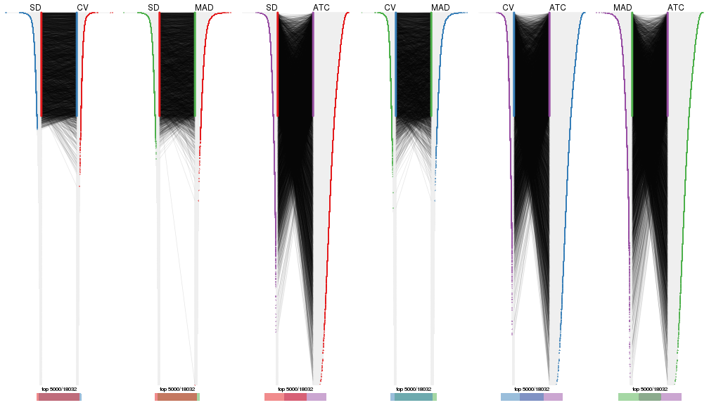</p>

</div>
</div>


Heatmaps of the top rows:


<script>
$( function() {
	$( '#tabs-top-rows-heatmap' ).tabs();
} );
</script>
<div id='tabs-top-rows-heatmap'>
<ul>
<li><a href='#tab-top-rows-heatmap-1'>top_n = 1000</a></li>
<li><a href='#tab-top-rows-heatmap-2'>top_n = 2000</a></li>
<li><a href='#tab-top-rows-heatmap-3'>top_n = 3000</a></li>
<li><a href='#tab-top-rows-heatmap-4'>top_n = 4000</a></li>
<li><a href='#tab-top-rows-heatmap-5'>top_n = 5000</a></li>
</ul>
<div id='tab-top-rows-heatmap-1'>
<pre><code class="r">top_rows_heatmap(res_list, top_n = 1000)
</code></pre>

<p></p>

</div>
<div id='tab-top-rows-heatmap-2'>
<pre><code class="r">top_rows_heatmap(res_list, top_n = 2000)
</code></pre>

<p></p>

</div>
<div id='tab-top-rows-heatmap-3'>
<pre><code class="r">top_rows_heatmap(res_list, top_n = 3000)
</code></pre>

<p></p>

</div>
<div id='tab-top-rows-heatmap-4'>
<pre><code class="r">top_rows_heatmap(res_list, top_n = 4000)
</code></pre>

<p></p>

</div>
<div id='tab-top-rows-heatmap-5'>
<pre><code class="r">top_rows_heatmap(res_list, top_n = 5000)
</code></pre>

<p></p>

</div>
</div>


### Test to known annotations


Test correlation between subgroups and known annotations. If the known
annotation is numeric, one-way ANOVA test is applied, and if the known
annotation is discrete, chi-squared contingency table test is applied.


<script>
$( function() {
	$( '#tabs-test-to-known-factors-from-consensus-partition-list' ).tabs();
} );
</script>
<div id='tabs-test-to-known-factors-from-consensus-partition-list'>
<ul>
<li><a href='#tab-test-to-known-factors-from-consensus-partition-list-1'>k = 2</a></li>
<li><a href='#tab-test-to-known-factors-from-consensus-partition-list-2'>k = 3</a></li>
<li><a href='#tab-test-to-known-factors-from-consensus-partition-list-3'>k = 4</a></li>
<li><a href='#tab-test-to-known-factors-from-consensus-partition-list-4'>k = 5</a></li>
<li><a href='#tab-test-to-known-factors-from-consensus-partition-list-5'>k = 6</a></li>
</ul>
<div id='tab-test-to-known-factors-from-consensus-partition-list-1'>
<pre><code class="r">test_to_known_factors(res_list, k = 2)
</code></pre>

<pre><code>#&gt;               n disease.state(p) k
#&gt; SD:NMF      131          0.02002 2
#&gt; CV:NMF      129          0.03973 2
#&gt; MAD:NMF     129          0.02344 2
#&gt; ATC:NMF     132          0.16354 2
#&gt; SD:skmeans  132          0.02619 2
#&gt; CV:skmeans  131          0.02851 2
#&gt; MAD:skmeans 132          0.04009 2
#&gt; ATC:skmeans 132          0.23501 2
#&gt; SD:mclust   131          0.00833 2
#&gt; CV:mclust   132          0.02284 2
#&gt; MAD:mclust  130          0.36431 2
#&gt; ATC:mclust  129          0.33126 2
#&gt; SD:kmeans   129          0.03025 2
#&gt; CV:kmeans   131          0.04192 2
#&gt; MAD:kmeans  131          0.03320 2
#&gt; ATC:kmeans  125          0.09832 2
#&gt; SD:pam      132          0.00555 2
#&gt; CV:pam      132          0.00555 2
#&gt; MAD:pam     129          0.00515 2
#&gt; ATC:pam     129          0.13282 2
#&gt; SD:hclust   119          0.62739 2
#&gt; CV:hclust    84               NA 2
#&gt; MAD:hclust  112          0.07417 2
#&gt; ATC:hclust  118          0.05716 2
</code></pre>

</div>
<div id='tab-test-to-known-factors-from-consensus-partition-list-2'>
<pre><code class="r">test_to_known_factors(res_list, k = 3)
</code></pre>

<pre><code>#&gt;               n disease.state(p) k
#&gt; SD:NMF      125          0.33705 3
#&gt; CV:NMF      125          0.24635 3
#&gt; MAD:NMF     123          0.30494 3
#&gt; ATC:NMF     111          0.24518 3
#&gt; SD:skmeans  131          0.05438 3
#&gt; CV:skmeans  132          0.04922 3
#&gt; MAD:skmeans 129          0.03133 3
#&gt; ATC:skmeans 128          0.23001 3
#&gt; SD:mclust   131          0.03227 3
#&gt; CV:mclust   129          0.05161 3
#&gt; MAD:mclust  130          0.04641 3
#&gt; ATC:mclust  126          0.01679 3
#&gt; SD:kmeans   128          0.03172 3
#&gt; CV:kmeans   130          0.04656 3
#&gt; MAD:kmeans  125          0.04045 3
#&gt; ATC:kmeans  117          0.14647 3
#&gt; SD:pam      128          0.00949 3
#&gt; CV:pam      117          0.34240 3
#&gt; MAD:pam     129          0.15821 3
#&gt; ATC:pam     116          0.22052 3
#&gt; SD:hclust   125          0.26074 3
#&gt; CV:hclust   131          0.42397 3
#&gt; MAD:hclust  117          0.27059 3
#&gt; ATC:hclust  111          0.21058 3
</code></pre>

</div>
<div id='tab-test-to-known-factors-from-consensus-partition-list-3'>
<pre><code class="r">test_to_known_factors(res_list, k = 4)
</code></pre>

<pre><code>#&gt;               n disease.state(p) k
#&gt; SD:NMF      110           0.6196 4
#&gt; CV:NMF      113           0.6645 4
#&gt; MAD:NMF     113           0.2759 4
#&gt; ATC:NMF     117           0.4352 4
#&gt; SD:skmeans  130           0.2165 4
#&gt; CV:skmeans  120           0.4038 4
#&gt; MAD:skmeans 127           0.1887 4
#&gt; ATC:skmeans 129           0.2467 4
#&gt; SD:mclust   125           0.0512 4
#&gt; CV:mclust   128           0.0406 4
#&gt; MAD:mclust  105           0.0350 4
#&gt; ATC:mclust  124           0.1711 4
#&gt; SD:kmeans    95           0.5057 4
#&gt; CV:kmeans    93           0.5625 4
#&gt; MAD:kmeans  130           0.1060 4
#&gt; ATC:kmeans  114           0.2285 4
#&gt; SD:pam      131           0.2581 4
#&gt; CV:pam      124           0.2057 4
#&gt; MAD:pam     130           0.2697 4
#&gt; ATC:pam     106           0.0625 4
#&gt; SD:hclust   121           0.2859 4
#&gt; CV:hclust   126           0.1465 4
#&gt; MAD:hclust  118           0.4242 4
#&gt; ATC:hclust   71           0.1776 4
</code></pre>

</div>
<div id='tab-test-to-known-factors-from-consensus-partition-list-4'>
<pre><code class="r">test_to_known_factors(res_list, k = 5)
</code></pre>

<pre><code>#&gt;               n disease.state(p) k
#&gt; SD:NMF       87           0.1466 5
#&gt; CV:NMF      102           0.4872 5
#&gt; MAD:NMF     111           0.2804 5
#&gt; ATC:NMF     112           0.4221 5
#&gt; SD:skmeans  108           0.7689 5
#&gt; CV:skmeans  126           0.2559 5
#&gt; MAD:skmeans 109           0.6037 5
#&gt; ATC:skmeans 118           0.2449 5
#&gt; SD:mclust   124           0.0773 5
#&gt; CV:mclust   119           0.2216 5
#&gt; MAD:mclust  105           0.1405 5
#&gt; ATC:mclust  126           0.1548 5
#&gt; SD:kmeans   104           0.7454 5
#&gt; CV:kmeans    94           0.6799 5
#&gt; MAD:kmeans   95           0.4273 5
#&gt; ATC:kmeans   66           0.1891 5
#&gt; SD:pam       99           0.3348 5
#&gt; CV:pam       94           0.2334 5
#&gt; MAD:pam     127           0.2009 5
#&gt; ATC:pam     119           0.1623 5
#&gt; SD:hclust    59           0.3479 5
#&gt; CV:hclust    79           0.6385 5
#&gt; MAD:hclust   48           0.9284 5
#&gt; ATC:hclust  111           0.0833 5
</code></pre>

</div>
<div id='tab-test-to-known-factors-from-consensus-partition-list-5'>
<pre><code class="r">test_to_known_factors(res_list, k = 6)
</code></pre>

<pre><code>#&gt;               n disease.state(p) k
#&gt; SD:NMF       94           0.1421 6
#&gt; CV:NMF       91           0.0705 6
#&gt; MAD:NMF      83           0.2023 6
#&gt; ATC:NMF      85           0.1020 6
#&gt; SD:skmeans  111           0.6016 6
#&gt; CV:skmeans  120           0.2762 6
#&gt; MAD:skmeans 100           0.2120 6
#&gt; ATC:skmeans  62           0.7033 6
#&gt; SD:mclust   116           0.0183 6
#&gt; CV:mclust   113           0.0383 6
#&gt; MAD:mclust  128           0.1163 6
#&gt; ATC:mclust  117           0.2474 6
#&gt; SD:kmeans    92           0.8777 6
#&gt; CV:kmeans    85           0.4656 6
#&gt; MAD:kmeans  100           0.5560 6
#&gt; ATC:kmeans  112           0.2979 6
#&gt; SD:pam      103           0.2330 6
#&gt; CV:pam      104           0.2235 6
#&gt; MAD:pam     119           0.1276 6
#&gt; ATC:pam     122           0.2335 6
#&gt; SD:hclust    62           0.5058 6
#&gt; CV:hclust    61           0.4285 6
#&gt; MAD:hclust   79           0.2925 6
#&gt; ATC:hclust  103           0.2945 6
</code></pre>

</div>
</div>


 
## Results for each method


---------------------------------------------------


### SD:hclust


The object with results only for a single top-value method and a single partition method 
can be extracted as:

```r
res = res_list["SD", "hclust"]
# you can also extract it by
# res = res_list["SD:hclust"]
```

A summary of `res` and all the functions that can be applied to it:

```r
res
```

```
#> A 'ConsensusPartition' object with k = 2, 3, 4, 5, 6.
#>   On a matrix with 18032 rows and 132 columns.
#>   Top rows (1000, 2000, 3000, 4000, 5000) are extracted by 'SD' method.
#>   Subgroups are detected by 'hclust' method.
#>   Performed in total 1250 partitions by row resampling.
#>   Best k for subgroups seems to be 3.
#> 
#> Following methods can be applied to this 'ConsensusPartition' object:
#>  [1] "cola_report"             "collect_classes"         "collect_plots"          
#>  [4] "collect_stats"           "colnames"                "compare_signatures"     
#>  [7] "consensus_heatmap"       "dimension_reduction"     "functional_enrichment"  
#> [10] "get_anno_col"            "get_anno"                "get_classes"            
#> [13] "get_consensus"           "get_matrix"              "get_membership"         
#> [16] "get_param"               "get_signatures"          "get_stats"              
#> [19] "is_best_k"               "is_stable_k"             "membership_heatmap"     
#> [22] "ncol"                    "nrow"                    "plot_ecdf"              
#> [25] "rownames"                "select_partition_number" "show"                   
#> [28] "suggest_best_k"          "test_to_known_factors"
```

`collect_plots()` function collects all the plots made from `res` for all `k` (number of partitions)
into one single page to provide an easy and fast comparison between different `k`.

```r
collect_plots(res)
```


The plots are:

- The first row: a plot of the ECDF (Empirical cumulative distribution
  function) curves of the consensus matrix for each `k` and the heatmap of
  predicted classes for each `k`.
- The second row: heatmaps of the consensus matrix for each `k`.
- The third row: heatmaps of the membership matrix for each `k`.
- The fouth row: heatmaps of the signatures for each `k`.

All the plots in panels can be made by individual functions and they are
plotted later in this section.

`select_partition_number()` produces several plots showing different
statistics for choosing "optimized" `k`. There are following statistics:

- ECDF curves of the consensus matrix for each `k`;
- 1-PAC. [The PAC
  score](https://en.wikipedia.org/wiki/Consensus_clustering#Over-interpretation_potential_of_consensus_clustering)
  measures the proportion of the ambiguous subgrouping.
- Mean silhouette score.
- Concordance. The mean probability of fiting the consensus class ids in all
  partitions.
- Area increased. Denote $A_k$ as the area under the ECDF curve for current
  `k`, the area increased is defined as $A_k - A_{k-1}$.
- Rand index. The percent of pairs of samples that are both in a same cluster
  or both are not in a same cluster in the partition of k and k-1.
- Jaccard index. The ratio of pairs of samples are both in a same cluster in
  the partition of k and k-1 and the pairs of samples are both in a same
  cluster in the partition k or k-1.

The detailed explanations of these statistics can be found in [the cola
vignette](http://bioconductor.org/packages/devel/bioc/vignettes/cola/inst/doc/cola.html#toc_13).

Generally speaking, lower PAC score, higher mean silhouette score or higher
concordance corresponds to better partition. Rand index and Jaccard index
measure how similar the current partition is compared to partition with `k-1`.
If they are too similar, we won't accept `k` is better than `k-1`.

```r
select_partition_number(res)
```


The numeric values for all these statistics can be obtained by `get_stats()`.

```r
get_stats(res)
```

```
#>   k 1-PAC mean_silhouette concordance area_increased  Rand Jaccard
#> 2 2 0.624           0.823       0.913          0.271 0.833   0.833
#> 3 3 0.590           0.855       0.889          0.613 0.808   0.769
#> 4 4 0.489           0.771       0.858          0.243 0.846   0.759
#> 5 5 0.484           0.526       0.701          0.251 0.744   0.503
#> 6 6 0.513           0.436       0.645          0.101 0.797   0.464
```

`suggest_best_k()` suggests the best $k$ based on these statistics. The rules are as follows:

- All $k$ with Jaccard index larger than 0.95 are removed because the increase of
  the partition number does not provides enough extra information. If all $k$ are removed,
  the best $k$ is assigned by `NA`.
- For $k$ with 1-PAC larger than 0.9, the maximal $k$ is taken as the "best k". Other $k$ is called "optional k".
- If it does not fit the second rule. The $k$ with the highest vote of highest
  1-PAC, mean silhouette and concordance is taken as the "best k".

```r
suggest_best_k(res)
```

```
#> [1] 3
```


Following shows the table of the partitions (You need to click the **show/hide
code output** link to see it). The membership matrix (columns with name `p*`)
is inferred by
[`clue::cl_consensus()`](https://www.rdocumentation.org/link/cl_consensus?package=clue)
function with the `SE` method. Basically the value in the membership matrix
represents the probability to belong to a certain group. The finall class
label for an item is determined with the group with highest probability it
belongs to.

In `get_classes()` function, the entropy is calculated from the membership
matrix and the silhouette score is calculated from the consensus matrix.


<script>
$( function() {
	$( '#tabs-SD-hclust-get-classes' ).tabs();
} );
</script>
<div id='tabs-SD-hclust-get-classes'>
<ul>
<li><a href='#tab-SD-hclust-get-classes-1'>k = 2</a></li>
<li><a href='#tab-SD-hclust-get-classes-2'>k = 3</a></li>
<li><a href='#tab-SD-hclust-get-classes-3'>k = 4</a></li>
<li><a href='#tab-SD-hclust-get-classes-4'>k = 5</a></li>
<li><a href='#tab-SD-hclust-get-classes-5'>k = 6</a></li>
</ul>

<div id='tab-SD-hclust-get-classes-1'>
<p><a id='tab-SD-hclust-get-classes-1-a' style='color:#0366d6' href='#'>show/hide code output</a></p>
<pre><code class="r">cbind(get_classes(res, k = 2), get_membership(res, k = 2))
</code></pre>

<pre><code>#&gt;           class entropy silhouette    p1    p2
#&gt; GSM289470     2  0.9881      0.386 0.436 0.564
#&gt; GSM289471     1  0.0000      0.975 1.000 0.000
#&gt; GSM289472     2  0.0000      0.900 0.000 1.000
#&gt; GSM289473     2  0.1414      0.894 0.020 0.980
#&gt; GSM289474     2  0.0376      0.899 0.004 0.996
#&gt; GSM289475     2  0.0000      0.900 0.000 1.000
#&gt; GSM289476     1  0.0000      0.975 1.000 0.000
#&gt; GSM289477     2  0.0000      0.900 0.000 1.000
#&gt; GSM289478     2  0.0000      0.900 0.000 1.000
#&gt; GSM289479     2  0.1184      0.896 0.016 0.984
#&gt; GSM289480     2  0.0000      0.900 0.000 1.000
#&gt; GSM289481     2  0.1184      0.896 0.016 0.984
#&gt; GSM289482     2  0.0000      0.900 0.000 1.000
#&gt; GSM289483     2  0.0000      0.900 0.000 1.000
#&gt; GSM289484     2  0.0000      0.900 0.000 1.000
#&gt; GSM289485     2  0.0000      0.900 0.000 1.000
#&gt; GSM289486     2  0.9954      0.346 0.460 0.540
#&gt; GSM289487     2  0.0000      0.900 0.000 1.000
#&gt; GSM289488     2  0.0000      0.900 0.000 1.000
#&gt; GSM289489     2  0.0376      0.899 0.004 0.996
#&gt; GSM289490     2  0.2236      0.887 0.036 0.964
#&gt; GSM289491     2  0.2236      0.887 0.036 0.964
#&gt; GSM289492     2  0.2236      0.887 0.036 0.964
#&gt; GSM289493     2  0.0000      0.900 0.000 1.000
#&gt; GSM289494     1  0.2603      0.964 0.956 0.044
#&gt; GSM289495     2  0.0672      0.899 0.008 0.992
#&gt; GSM289496     2  0.0000      0.900 0.000 1.000
#&gt; GSM289497     2  0.0000      0.900 0.000 1.000
#&gt; GSM289498     2  0.2236      0.887 0.036 0.964
#&gt; GSM289499     2  0.0000      0.900 0.000 1.000
#&gt; GSM289500     1  0.2603      0.964 0.956 0.044
#&gt; GSM289501     2  0.0000      0.900 0.000 1.000
#&gt; GSM289502     2  0.0000      0.900 0.000 1.000
#&gt; GSM289503     2  0.0000      0.900 0.000 1.000
#&gt; GSM289504     2  0.0000      0.900 0.000 1.000
#&gt; GSM289505     2  0.0000      0.900 0.000 1.000
#&gt; GSM289506     2  0.0000      0.900 0.000 1.000
#&gt; GSM289507     2  0.0000      0.900 0.000 1.000
#&gt; GSM289508     2  0.7376      0.761 0.208 0.792
#&gt; GSM289509     2  0.9286      0.587 0.344 0.656
#&gt; GSM289510     2  0.5178      0.838 0.116 0.884
#&gt; GSM289511     2  0.0000      0.900 0.000 1.000
#&gt; GSM289512     1  0.2603      0.964 0.956 0.044
#&gt; GSM289513     2  0.1843      0.891 0.028 0.972
#&gt; GSM289514     2  0.5294      0.835 0.120 0.880
#&gt; GSM289515     2  0.0376      0.900 0.004 0.996
#&gt; GSM289516     2  0.0376      0.900 0.004 0.996
#&gt; GSM289517     2  0.0376      0.900 0.004 0.996
#&gt; GSM289518     2  0.0376      0.900 0.004 0.996
#&gt; GSM289519     2  0.5178      0.838 0.116 0.884
#&gt; GSM289520     2  0.0000      0.900 0.000 1.000
#&gt; GSM289521     2  0.5294      0.835 0.120 0.880
#&gt; GSM289522     2  0.0376      0.900 0.004 0.996
#&gt; GSM289523     1  0.0000      0.975 1.000 0.000
#&gt; GSM289524     2  0.1843      0.891 0.028 0.972
#&gt; GSM289525     2  0.0376      0.900 0.004 0.996
#&gt; GSM289526     2  0.2948      0.880 0.052 0.948
#&gt; GSM289527     2  0.1843      0.891 0.028 0.972
#&gt; GSM289528     2  0.0000      0.900 0.000 1.000
#&gt; GSM289529     2  0.1184      0.896 0.016 0.984
#&gt; GSM289530     2  0.6148      0.810 0.152 0.848
#&gt; GSM289531     2  0.1414      0.894 0.020 0.980
#&gt; GSM289532     2  0.7883      0.728 0.236 0.764
#&gt; GSM289533     2  0.2603      0.884 0.044 0.956
#&gt; GSM289534     1  0.2603      0.964 0.956 0.044
#&gt; GSM289535     2  0.0376      0.899 0.004 0.996
#&gt; GSM289536     1  0.0000      0.975 1.000 0.000
#&gt; GSM289537     2  0.0000      0.900 0.000 1.000
#&gt; GSM289538     2  0.0000      0.900 0.000 1.000
#&gt; GSM289539     2  0.0000      0.900 0.000 1.000
#&gt; GSM289540     2  0.7883      0.728 0.236 0.764
#&gt; GSM289541     2  0.9922      0.377 0.448 0.552
#&gt; GSM289542     2  0.0938      0.898 0.012 0.988
#&gt; GSM289543     2  0.0000      0.900 0.000 1.000
#&gt; GSM289544     2  0.8144      0.712 0.252 0.748
#&gt; GSM289545     2  0.0000      0.900 0.000 1.000
#&gt; GSM289546     2  0.0000      0.900 0.000 1.000
#&gt; GSM289547     2  0.0000      0.900 0.000 1.000
#&gt; GSM289548     2  0.9850      0.417 0.428 0.572
#&gt; GSM289549     2  0.9881      0.386 0.436 0.564
#&gt; GSM289550     2  0.9983      0.305 0.476 0.524
#&gt; GSM289551     1  0.0000      0.975 1.000 0.000
#&gt; GSM289552     2  0.9983      0.304 0.476 0.524
#&gt; GSM289553     2  0.9552      0.525 0.376 0.624
#&gt; GSM289554     2  0.0000      0.900 0.000 1.000
#&gt; GSM289555     2  0.0000      0.900 0.000 1.000
#&gt; GSM289556     2  0.9608      0.511 0.384 0.616
#&gt; GSM289557     2  0.0000      0.900 0.000 1.000
#&gt; GSM289558     2  0.0000      0.900 0.000 1.000
#&gt; GSM289559     2  0.9988      0.293 0.480 0.520
#&gt; GSM289560     2  0.0000      0.900 0.000 1.000
#&gt; GSM289561     2  0.0000      0.900 0.000 1.000
#&gt; GSM289562     2  0.9850      0.417 0.428 0.572
#&gt; GSM289563     2  0.9850      0.417 0.428 0.572
#&gt; GSM289564     2  0.7056      0.772 0.192 0.808
#&gt; GSM289565     2  0.7883      0.728 0.236 0.764
#&gt; GSM289566     2  0.6801      0.791 0.180 0.820
#&gt; GSM289567     2  0.1414      0.894 0.020 0.980
#&gt; GSM289568     2  0.0000      0.900 0.000 1.000
#&gt; GSM289569     2  0.0376      0.900 0.004 0.996
#&gt; GSM289570     2  0.1414      0.894 0.020 0.980
#&gt; GSM289571     2  0.0000      0.900 0.000 1.000
#&gt; GSM289572     2  0.0000      0.900 0.000 1.000
#&gt; GSM289573     2  0.0000      0.900 0.000 1.000
#&gt; GSM289574     2  0.0000      0.900 0.000 1.000
#&gt; GSM289575     2  0.0000      0.900 0.000 1.000
#&gt; GSM289576     2  0.0000      0.900 0.000 1.000
#&gt; GSM289577     2  0.0000      0.900 0.000 1.000
#&gt; GSM289578     2  0.0000      0.900 0.000 1.000
#&gt; GSM289579     2  0.0000      0.900 0.000 1.000
#&gt; GSM289580     1  0.2603      0.964 0.956 0.044
#&gt; GSM289581     2  0.6148      0.810 0.152 0.848
#&gt; GSM289582     2  0.1184      0.896 0.016 0.984
#&gt; GSM289583     2  0.0000      0.900 0.000 1.000
#&gt; GSM289584     2  0.0000      0.900 0.000 1.000
#&gt; GSM289585     2  0.0000      0.900 0.000 1.000
#&gt; GSM289586     2  0.1414      0.894 0.020 0.980
#&gt; GSM289587     2  0.9954      0.346 0.460 0.540
#&gt; GSM289588     1  0.0000      0.975 1.000 0.000
#&gt; GSM289589     2  0.9954      0.346 0.460 0.540
#&gt; GSM289590     2  0.8327      0.695 0.264 0.736
#&gt; GSM289591     2  0.9988      0.293 0.480 0.520
#&gt; GSM289592     2  0.0000      0.900 0.000 1.000
#&gt; GSM289593     1  0.0000      0.975 1.000 0.000
#&gt; GSM289594     2  0.0000      0.900 0.000 1.000
#&gt; GSM289595     2  0.9286      0.587 0.344 0.656
#&gt; GSM289596     2  0.0000      0.900 0.000 1.000
#&gt; GSM289597     2  0.0376      0.900 0.004 0.996
#&gt; GSM289598     2  0.7376      0.761 0.208 0.792
#&gt; GSM289599     2  0.0672      0.899 0.008 0.992
#&gt; GSM289600     2  0.9552      0.525 0.376 0.624
#&gt; GSM289601     2  0.7950      0.723 0.240 0.760
</code></pre>

<script>
$('#tab-SD-hclust-get-classes-1-a').parent().next().next().hide();
$('#tab-SD-hclust-get-classes-1-a').click(function(){
  $('#tab-SD-hclust-get-classes-1-a').parent().next().next().toggle();
  return(false);
});
</script>
</div>

<div id='tab-SD-hclust-get-classes-2'>
<p><a id='tab-SD-hclust-get-classes-2-a' style='color:#0366d6' href='#'>show/hide code output</a></p>
<pre><code class="r">cbind(get_classes(res, k = 3), get_membership(res, k = 3))
</code></pre>

<pre><code>#&gt;           class entropy silhouette    p1    p2    p3
#&gt; GSM289470     1  0.3276      0.914 0.908 0.024 0.068
#&gt; GSM289471     3  0.2261      0.945 0.068 0.000 0.932
#&gt; GSM289472     2  0.1315      0.893 0.008 0.972 0.020
#&gt; GSM289473     2  0.2680      0.893 0.068 0.924 0.008
#&gt; GSM289474     2  0.1411      0.900 0.036 0.964 0.000
#&gt; GSM289475     2  0.0848      0.895 0.008 0.984 0.008
#&gt; GSM289476     3  0.2261      0.945 0.068 0.000 0.932
#&gt; GSM289477     2  0.1015      0.895 0.008 0.980 0.012
#&gt; GSM289478     2  0.1315      0.893 0.008 0.972 0.020
#&gt; GSM289479     2  0.2280      0.896 0.052 0.940 0.008
#&gt; GSM289480     2  0.1315      0.893 0.008 0.972 0.020
#&gt; GSM289481     2  0.2280      0.896 0.052 0.940 0.008
#&gt; GSM289482     2  0.0848      0.895 0.008 0.984 0.008
#&gt; GSM289483     2  0.1015      0.895 0.008 0.980 0.012
#&gt; GSM289484     2  0.1015      0.896 0.012 0.980 0.008
#&gt; GSM289485     2  0.0848      0.895 0.008 0.984 0.008
#&gt; GSM289486     1  0.3141      0.943 0.912 0.020 0.068
#&gt; GSM289487     2  0.1315      0.893 0.008 0.972 0.020
#&gt; GSM289488     2  0.1015      0.895 0.008 0.980 0.012
#&gt; GSM289489     2  0.1964      0.896 0.056 0.944 0.000
#&gt; GSM289490     2  0.3412      0.869 0.124 0.876 0.000
#&gt; GSM289491     2  0.3412      0.869 0.124 0.876 0.000
#&gt; GSM289492     2  0.3482      0.867 0.128 0.872 0.000
#&gt; GSM289493     2  0.1337      0.900 0.016 0.972 0.012
#&gt; GSM289494     3  0.3752      0.917 0.144 0.000 0.856
#&gt; GSM289495     2  0.4059      0.862 0.128 0.860 0.012
#&gt; GSM289496     2  0.1170      0.899 0.016 0.976 0.008
#&gt; GSM289497     2  0.1751      0.890 0.012 0.960 0.028
#&gt; GSM289498     2  0.3412      0.869 0.124 0.876 0.000
#&gt; GSM289499     2  0.3375      0.880 0.100 0.892 0.008
#&gt; GSM289500     3  0.3752      0.917 0.144 0.000 0.856
#&gt; GSM289501     2  0.1337      0.900 0.016 0.972 0.012
#&gt; GSM289502     2  0.1751      0.890 0.012 0.960 0.028
#&gt; GSM289503     2  0.1774      0.892 0.016 0.960 0.024
#&gt; GSM289504     2  0.2165      0.894 0.064 0.936 0.000
#&gt; GSM289505     2  0.2446      0.897 0.052 0.936 0.012
#&gt; GSM289506     2  0.1751      0.890 0.012 0.960 0.028
#&gt; GSM289507     2  0.1751      0.890 0.012 0.960 0.028
#&gt; GSM289508     2  0.6761      0.694 0.252 0.700 0.048
#&gt; GSM289509     2  0.9160      0.308 0.352 0.492 0.156
#&gt; GSM289510     2  0.6335      0.737 0.240 0.724 0.036
#&gt; GSM289511     2  0.0848      0.897 0.008 0.984 0.008
#&gt; GSM289512     3  0.3752      0.917 0.144 0.000 0.856
#&gt; GSM289513     2  0.3213      0.883 0.092 0.900 0.008
#&gt; GSM289514     2  0.6546      0.728 0.240 0.716 0.044
#&gt; GSM289515     2  0.1453      0.900 0.024 0.968 0.008
#&gt; GSM289516     2  0.1315      0.900 0.020 0.972 0.008
#&gt; GSM289517     2  0.1453      0.900 0.024 0.968 0.008
#&gt; GSM289518     2  0.1453      0.900 0.024 0.968 0.008
#&gt; GSM289519     2  0.6443      0.733 0.240 0.720 0.040
#&gt; GSM289520     2  0.0848      0.895 0.008 0.984 0.008
#&gt; GSM289521     2  0.6546      0.728 0.240 0.716 0.044
#&gt; GSM289522     2  0.1399      0.901 0.028 0.968 0.004
#&gt; GSM289523     3  0.2261      0.945 0.068 0.000 0.932
#&gt; GSM289524     2  0.3213      0.883 0.092 0.900 0.008
#&gt; GSM289525     2  0.1453      0.900 0.024 0.968 0.008
#&gt; GSM289526     2  0.4280      0.860 0.124 0.856 0.020
#&gt; GSM289527     2  0.3213      0.883 0.092 0.900 0.008
#&gt; GSM289528     2  0.1751      0.890 0.012 0.960 0.028
#&gt; GSM289529     2  0.3910      0.874 0.104 0.876 0.020
#&gt; GSM289530     2  0.6630      0.671 0.300 0.672 0.028
#&gt; GSM289531     2  0.2680      0.893 0.068 0.924 0.008
#&gt; GSM289532     2  0.7982      0.466 0.376 0.556 0.068
#&gt; GSM289533     2  0.3038      0.881 0.104 0.896 0.000
#&gt; GSM289534     3  0.4178      0.884 0.172 0.000 0.828
#&gt; GSM289535     2  0.2682      0.891 0.076 0.920 0.004
#&gt; GSM289536     3  0.2261      0.945 0.068 0.000 0.932
#&gt; GSM289537     2  0.3043      0.891 0.084 0.908 0.008
#&gt; GSM289538     2  0.3129      0.890 0.088 0.904 0.008
#&gt; GSM289539     2  0.1751      0.890 0.012 0.960 0.028
#&gt; GSM289540     2  0.7982      0.466 0.376 0.556 0.068
#&gt; GSM289541     1  0.3213      0.940 0.912 0.028 0.060
#&gt; GSM289542     2  0.3375      0.881 0.100 0.892 0.008
#&gt; GSM289543     2  0.3375      0.880 0.100 0.892 0.008
#&gt; GSM289544     2  0.6910      0.507 0.396 0.584 0.020
#&gt; GSM289545     2  0.2945      0.886 0.088 0.908 0.004
#&gt; GSM289546     2  0.2860      0.887 0.084 0.912 0.004
#&gt; GSM289547     2  0.1751      0.890 0.012 0.960 0.028
#&gt; GSM289548     1  0.3263      0.936 0.912 0.040 0.048
#&gt; GSM289549     1  0.3276      0.914 0.908 0.024 0.068
#&gt; GSM289550     1  0.2955      0.928 0.912 0.008 0.080
#&gt; GSM289551     3  0.2261      0.945 0.068 0.000 0.932
#&gt; GSM289552     1  0.3207      0.931 0.904 0.012 0.084
#&gt; GSM289553     1  0.2846      0.878 0.924 0.056 0.020
#&gt; GSM289554     2  0.2496      0.893 0.068 0.928 0.004
#&gt; GSM289555     2  0.1751      0.890 0.012 0.960 0.028
#&gt; GSM289556     1  0.2982      0.885 0.920 0.056 0.024
#&gt; GSM289557     2  0.1337      0.899 0.012 0.972 0.016
#&gt; GSM289558     2  0.1170      0.899 0.016 0.976 0.008
#&gt; GSM289559     1  0.3043      0.927 0.908 0.008 0.084
#&gt; GSM289560     2  0.1751      0.890 0.012 0.960 0.028
#&gt; GSM289561     2  0.1751      0.890 0.012 0.960 0.028
#&gt; GSM289562     1  0.3263      0.936 0.912 0.040 0.048
#&gt; GSM289563     1  0.3263      0.936 0.912 0.040 0.048
#&gt; GSM289564     2  0.6696      0.597 0.348 0.632 0.020
#&gt; GSM289565     2  0.7982      0.466 0.376 0.556 0.068
#&gt; GSM289566     2  0.6965      0.703 0.244 0.696 0.060
#&gt; GSM289567     2  0.2955      0.889 0.080 0.912 0.008
#&gt; GSM289568     2  0.0848      0.897 0.008 0.984 0.008
#&gt; GSM289569     2  0.1453      0.900 0.024 0.968 0.008
#&gt; GSM289570     2  0.2955      0.889 0.080 0.912 0.008
#&gt; GSM289571     2  0.3129      0.890 0.088 0.904 0.008
#&gt; GSM289572     2  0.2400      0.894 0.064 0.932 0.004
#&gt; GSM289573     2  0.1182      0.899 0.012 0.976 0.012
#&gt; GSM289574     2  0.1751      0.890 0.012 0.960 0.028
#&gt; GSM289575     2  0.1031      0.898 0.024 0.976 0.000
#&gt; GSM289576     2  0.1337      0.899 0.016 0.972 0.012
#&gt; GSM289577     2  0.1964      0.896 0.056 0.944 0.000
#&gt; GSM289578     2  0.1525      0.900 0.032 0.964 0.004
#&gt; GSM289579     2  0.1129      0.899 0.020 0.976 0.004
#&gt; GSM289580     3  0.3816      0.912 0.148 0.000 0.852
#&gt; GSM289581     2  0.6630      0.671 0.300 0.672 0.028
#&gt; GSM289582     2  0.2711      0.888 0.088 0.912 0.000
#&gt; GSM289583     2  0.1751      0.890 0.012 0.960 0.028
#&gt; GSM289584     2  0.1170      0.899 0.016 0.976 0.008
#&gt; GSM289585     2  0.1751      0.890 0.012 0.960 0.028
#&gt; GSM289586     2  0.3377      0.887 0.092 0.896 0.012
#&gt; GSM289587     1  0.3141      0.943 0.912 0.020 0.068
#&gt; GSM289588     3  0.2261      0.945 0.068 0.000 0.932
#&gt; GSM289589     1  0.3141      0.943 0.912 0.020 0.068
#&gt; GSM289590     2  0.7213      0.438 0.420 0.552 0.028
#&gt; GSM289591     1  0.3043      0.927 0.908 0.008 0.084
#&gt; GSM289592     2  0.1751      0.890 0.012 0.960 0.028
#&gt; GSM289593     3  0.2261      0.945 0.068 0.000 0.932
#&gt; GSM289594     2  0.1636      0.899 0.020 0.964 0.016
#&gt; GSM289595     2  0.9160      0.308 0.352 0.492 0.156
#&gt; GSM289596     2  0.1337      0.900 0.016 0.972 0.012
#&gt; GSM289597     2  0.1585      0.900 0.028 0.964 0.008
#&gt; GSM289598     2  0.6761      0.694 0.252 0.700 0.048
#&gt; GSM289599     2  0.4059      0.862 0.128 0.860 0.012
#&gt; GSM289600     1  0.2846      0.878 0.924 0.056 0.020
#&gt; GSM289601     2  0.7712      0.461 0.392 0.556 0.052
</code></pre>

<script>
$('#tab-SD-hclust-get-classes-2-a').parent().next().next().hide();
$('#tab-SD-hclust-get-classes-2-a').click(function(){
  $('#tab-SD-hclust-get-classes-2-a').parent().next().next().toggle();
  return(false);
});
</script>
</div>

<div id='tab-SD-hclust-get-classes-3'>
<p><a id='tab-SD-hclust-get-classes-3-a' style='color:#0366d6' href='#'>show/hide code output</a></p>
<pre><code class="r">cbind(get_classes(res, k = 4), get_membership(res, k = 4))
</code></pre>

<pre><code>#&gt;           class entropy silhouette    p1    p2    p3    p4
#&gt; GSM289470     1  0.0188      0.877 0.996 0.000 0.000 0.004
#&gt; GSM289471     3  0.0000      0.959 0.000 0.000 1.000 0.000
#&gt; GSM289472     2  0.1867      0.835 0.000 0.928 0.000 0.072
#&gt; GSM289473     2  0.3266      0.800 0.000 0.832 0.000 0.168
#&gt; GSM289474     2  0.2530      0.837 0.000 0.888 0.000 0.112
#&gt; GSM289475     2  0.2281      0.840 0.000 0.904 0.000 0.096
#&gt; GSM289476     3  0.0000      0.959 0.000 0.000 1.000 0.000
#&gt; GSM289477     2  0.2281      0.839 0.000 0.904 0.000 0.096
#&gt; GSM289478     2  0.2530      0.838 0.000 0.888 0.000 0.112
#&gt; GSM289479     2  0.3266      0.805 0.000 0.832 0.000 0.168
#&gt; GSM289480     2  0.1867      0.835 0.000 0.928 0.000 0.072
#&gt; GSM289481     2  0.3074      0.822 0.000 0.848 0.000 0.152
#&gt; GSM289482     2  0.2216      0.838 0.000 0.908 0.000 0.092
#&gt; GSM289483     2  0.2281      0.839 0.000 0.904 0.000 0.096
#&gt; GSM289484     2  0.1867      0.842 0.000 0.928 0.000 0.072
#&gt; GSM289485     2  0.2216      0.838 0.000 0.908 0.000 0.092
#&gt; GSM289486     1  0.2401      0.921 0.904 0.004 0.000 0.092
#&gt; GSM289487     2  0.2469      0.839 0.000 0.892 0.000 0.108
#&gt; GSM289488     2  0.2281      0.839 0.000 0.904 0.000 0.096
#&gt; GSM289489     2  0.4008      0.719 0.000 0.756 0.000 0.244
#&gt; GSM289490     2  0.3074      0.787 0.000 0.848 0.000 0.152
#&gt; GSM289491     2  0.3074      0.787 0.000 0.848 0.000 0.152
#&gt; GSM289492     2  0.3123      0.784 0.000 0.844 0.000 0.156
#&gt; GSM289493     2  0.1716      0.845 0.000 0.936 0.000 0.064
#&gt; GSM289494     3  0.1940      0.940 0.000 0.000 0.924 0.076
#&gt; GSM289495     2  0.4193      0.685 0.000 0.732 0.000 0.268
#&gt; GSM289496     2  0.1637      0.844 0.000 0.940 0.000 0.060
#&gt; GSM289497     2  0.1557      0.817 0.000 0.944 0.000 0.056
#&gt; GSM289498     2  0.3074      0.787 0.000 0.848 0.000 0.152
#&gt; GSM289499     2  0.3837      0.751 0.000 0.776 0.000 0.224
#&gt; GSM289500     3  0.1940      0.940 0.000 0.000 0.924 0.076
#&gt; GSM289501     2  0.1716      0.845 0.000 0.936 0.000 0.064
#&gt; GSM289502     2  0.1557      0.817 0.000 0.944 0.000 0.056
#&gt; GSM289503     2  0.1716      0.823 0.000 0.936 0.000 0.064
#&gt; GSM289504     2  0.2814      0.824 0.000 0.868 0.000 0.132
#&gt; GSM289505     2  0.2814      0.829 0.000 0.868 0.000 0.132
#&gt; GSM289506     2  0.1557      0.817 0.000 0.944 0.000 0.056
#&gt; GSM289507     2  0.1557      0.817 0.000 0.944 0.000 0.056
#&gt; GSM289508     2  0.6666      0.416 0.168 0.664 0.016 0.152
#&gt; GSM289509     4  0.5731      0.473 0.056 0.056 0.128 0.760
#&gt; GSM289510     4  0.5697      0.207 0.024 0.488 0.000 0.488
#&gt; GSM289511     2  0.0817      0.833 0.000 0.976 0.000 0.024
#&gt; GSM289512     3  0.1940      0.940 0.000 0.000 0.924 0.076
#&gt; GSM289513     2  0.4419      0.732 0.084 0.812 0.000 0.104
#&gt; GSM289514     4  0.5606      0.243 0.020 0.480 0.000 0.500
#&gt; GSM289515     2  0.2197      0.840 0.004 0.916 0.000 0.080
#&gt; GSM289516     2  0.2125      0.841 0.004 0.920 0.000 0.076
#&gt; GSM289517     2  0.2197      0.840 0.004 0.916 0.000 0.080
#&gt; GSM289518     2  0.2197      0.840 0.004 0.916 0.000 0.080
#&gt; GSM289519     4  0.5607      0.227 0.020 0.484 0.000 0.496
#&gt; GSM289520     2  0.2281      0.839 0.000 0.904 0.000 0.096
#&gt; GSM289521     4  0.5606      0.243 0.020 0.480 0.000 0.500
#&gt; GSM289522     2  0.2334      0.839 0.004 0.908 0.000 0.088
#&gt; GSM289523     3  0.0000      0.959 0.000 0.000 1.000 0.000
#&gt; GSM289524     2  0.4591      0.714 0.084 0.800 0.000 0.116
#&gt; GSM289525     2  0.2197      0.840 0.004 0.916 0.000 0.080
#&gt; GSM289526     2  0.5422      0.652 0.100 0.756 0.008 0.136
#&gt; GSM289527     2  0.4591      0.714 0.084 0.800 0.000 0.116
#&gt; GSM289528     2  0.1557      0.817 0.000 0.944 0.000 0.056
#&gt; GSM289529     2  0.4564      0.546 0.000 0.672 0.000 0.328
#&gt; GSM289530     4  0.4978      0.470 0.004 0.384 0.000 0.612
#&gt; GSM289531     2  0.3266      0.800 0.000 0.832 0.000 0.168
#&gt; GSM289532     4  0.1902      0.551 0.004 0.064 0.000 0.932
#&gt; GSM289533     2  0.3734      0.784 0.044 0.848 0.000 0.108
#&gt; GSM289534     3  0.2813      0.921 0.024 0.000 0.896 0.080
#&gt; GSM289535     2  0.3668      0.787 0.004 0.808 0.000 0.188
#&gt; GSM289536     3  0.0000      0.959 0.000 0.000 1.000 0.000
#&gt; GSM289537     2  0.3610      0.800 0.000 0.800 0.000 0.200
#&gt; GSM289538     2  0.3649      0.797 0.000 0.796 0.000 0.204
#&gt; GSM289539     2  0.1557      0.817 0.000 0.944 0.000 0.056
#&gt; GSM289540     4  0.1902      0.551 0.004 0.064 0.000 0.932
#&gt; GSM289541     1  0.2675      0.919 0.892 0.008 0.000 0.100
#&gt; GSM289542     2  0.3945      0.761 0.004 0.780 0.000 0.216
#&gt; GSM289543     2  0.3837      0.753 0.000 0.776 0.000 0.224
#&gt; GSM289544     4  0.7109      0.511 0.144 0.336 0.000 0.520
#&gt; GSM289545     2  0.3649      0.774 0.000 0.796 0.000 0.204
#&gt; GSM289546     2  0.3610      0.778 0.000 0.800 0.000 0.200
#&gt; GSM289547     2  0.1557      0.817 0.000 0.944 0.000 0.056
#&gt; GSM289548     1  0.3351      0.903 0.844 0.008 0.000 0.148
#&gt; GSM289549     1  0.0188      0.877 0.996 0.000 0.000 0.004
#&gt; GSM289550     1  0.1892      0.906 0.944 0.004 0.016 0.036
#&gt; GSM289551     3  0.0000      0.959 0.000 0.000 1.000 0.000
#&gt; GSM289552     1  0.2328      0.911 0.924 0.004 0.016 0.056
#&gt; GSM289553     1  0.4507      0.848 0.756 0.020 0.000 0.224
#&gt; GSM289554     2  0.2760      0.824 0.000 0.872 0.000 0.128
#&gt; GSM289555     2  0.1557      0.817 0.000 0.944 0.000 0.056
#&gt; GSM289556     1  0.4399      0.856 0.768 0.020 0.000 0.212
#&gt; GSM289557     2  0.1474      0.835 0.000 0.948 0.000 0.052
#&gt; GSM289558     2  0.1637      0.844 0.000 0.940 0.000 0.060
#&gt; GSM289559     1  0.1796      0.905 0.948 0.004 0.016 0.032
#&gt; GSM289560     2  0.1557      0.817 0.000 0.944 0.000 0.056
#&gt; GSM289561     2  0.1557      0.817 0.000 0.944 0.000 0.056
#&gt; GSM289562     1  0.3351      0.903 0.844 0.008 0.000 0.148
#&gt; GSM289563     1  0.3351      0.903 0.844 0.008 0.000 0.148
#&gt; GSM289564     4  0.2921      0.588 0.000 0.140 0.000 0.860
#&gt; GSM289565     4  0.1902      0.551 0.004 0.064 0.000 0.932
#&gt; GSM289566     2  0.7461     -0.245 0.052 0.468 0.056 0.424
#&gt; GSM289567     2  0.4134      0.688 0.000 0.740 0.000 0.260
#&gt; GSM289568     2  0.0817      0.833 0.000 0.976 0.000 0.024
#&gt; GSM289569     2  0.2125      0.842 0.004 0.920 0.000 0.076
#&gt; GSM289570     2  0.4134      0.688 0.000 0.740 0.000 0.260
#&gt; GSM289571     2  0.3649      0.797 0.000 0.796 0.000 0.204
#&gt; GSM289572     2  0.2868      0.821 0.000 0.864 0.000 0.136
#&gt; GSM289573     2  0.1389      0.834 0.000 0.952 0.000 0.048
#&gt; GSM289574     2  0.1557      0.817 0.000 0.944 0.000 0.056
#&gt; GSM289575     2  0.1637      0.844 0.000 0.940 0.000 0.060
#&gt; GSM289576     2  0.1792      0.844 0.000 0.932 0.000 0.068
#&gt; GSM289577     2  0.3123      0.814 0.000 0.844 0.000 0.156
#&gt; GSM289578     2  0.1867      0.845 0.000 0.928 0.000 0.072
#&gt; GSM289579     2  0.1637      0.845 0.000 0.940 0.000 0.060
#&gt; GSM289580     3  0.2011      0.938 0.000 0.000 0.920 0.080
#&gt; GSM289581     4  0.4978      0.470 0.004 0.384 0.000 0.612
#&gt; GSM289582     2  0.4431      0.605 0.000 0.696 0.000 0.304
#&gt; GSM289583     2  0.1557      0.817 0.000 0.944 0.000 0.056
#&gt; GSM289584     2  0.1716      0.844 0.000 0.936 0.000 0.064
#&gt; GSM289585     2  0.1557      0.817 0.000 0.944 0.000 0.056
#&gt; GSM289586     2  0.5579      0.614 0.060 0.688 0.000 0.252
#&gt; GSM289587     1  0.2401      0.921 0.904 0.004 0.000 0.092
#&gt; GSM289588     3  0.0000      0.959 0.000 0.000 1.000 0.000
#&gt; GSM289589     1  0.2401      0.921 0.904 0.004 0.000 0.092
#&gt; GSM289590     4  0.3245      0.524 0.056 0.064 0.000 0.880
#&gt; GSM289591     1  0.1796      0.905 0.948 0.004 0.016 0.032
#&gt; GSM289592     2  0.1557      0.817 0.000 0.944 0.000 0.056
#&gt; GSM289593     3  0.0000      0.959 0.000 0.000 1.000 0.000
#&gt; GSM289594     2  0.1867      0.844 0.000 0.928 0.000 0.072
#&gt; GSM289595     4  0.5731      0.473 0.056 0.056 0.128 0.760
#&gt; GSM289596     2  0.1716      0.845 0.000 0.936 0.000 0.064
#&gt; GSM289597     2  0.2197      0.841 0.004 0.916 0.000 0.080
#&gt; GSM289598     2  0.6666      0.416 0.168 0.664 0.016 0.152
#&gt; GSM289599     2  0.4193      0.685 0.000 0.732 0.000 0.268
#&gt; GSM289600     1  0.4507      0.848 0.756 0.020 0.000 0.224
#&gt; GSM289601     4  0.2489      0.551 0.020 0.068 0.000 0.912
</code></pre>

<script>
$('#tab-SD-hclust-get-classes-3-a').parent().next().next().hide();
$('#tab-SD-hclust-get-classes-3-a').click(function(){
  $('#tab-SD-hclust-get-classes-3-a').parent().next().next().toggle();
  return(false);
});
</script>
</div>

<div id='tab-SD-hclust-get-classes-4'>
<p><a id='tab-SD-hclust-get-classes-4-a' style='color:#0366d6' href='#'>show/hide code output</a></p>
<pre><code class="r">cbind(get_classes(res, k = 5), get_membership(res, k = 5))
</code></pre>

<pre><code>#&gt;           class entropy silhouette    p1    p2    p3    p4    p5
#&gt; GSM289470     1  0.1485     0.8612 0.948 0.032 0.000 0.020 0.000
#&gt; GSM289471     3  0.0000     0.9607 0.000 0.000 1.000 0.000 0.000
#&gt; GSM289472     5  0.1851     0.5505 0.000 0.088 0.000 0.000 0.912
#&gt; GSM289473     2  0.5014     0.0204 0.000 0.536 0.000 0.032 0.432
#&gt; GSM289474     5  0.4604     0.3715 0.000 0.428 0.000 0.012 0.560
#&gt; GSM289475     5  0.3816     0.5044 0.000 0.304 0.000 0.000 0.696
#&gt; GSM289476     3  0.0000     0.9607 0.000 0.000 1.000 0.000 0.000
#&gt; GSM289477     5  0.4060     0.4819 0.000 0.360 0.000 0.000 0.640
#&gt; GSM289478     5  0.3684     0.5061 0.000 0.280 0.000 0.000 0.720
#&gt; GSM289479     5  0.4659     0.2531 0.000 0.492 0.000 0.012 0.496
#&gt; GSM289480     5  0.1851     0.5505 0.000 0.088 0.000 0.000 0.912
#&gt; GSM289481     5  0.4641     0.3194 0.000 0.456 0.000 0.012 0.532
#&gt; GSM289482     5  0.4074     0.4775 0.000 0.364 0.000 0.000 0.636
#&gt; GSM289483     5  0.4060     0.4819 0.000 0.360 0.000 0.000 0.640
#&gt; GSM289484     5  0.3999     0.4906 0.000 0.344 0.000 0.000 0.656
#&gt; GSM289485     5  0.4074     0.4775 0.000 0.364 0.000 0.000 0.636
#&gt; GSM289486     1  0.1608     0.9073 0.928 0.000 0.000 0.072 0.000
#&gt; GSM289487     5  0.3661     0.5085 0.000 0.276 0.000 0.000 0.724
#&gt; GSM289488     5  0.4060     0.4819 0.000 0.360 0.000 0.000 0.640
#&gt; GSM289489     2  0.3388     0.4956 0.000 0.792 0.000 0.008 0.200
#&gt; GSM289490     2  0.4820     0.4010 0.000 0.632 0.000 0.036 0.332
#&gt; GSM289491     2  0.4820     0.4010 0.000 0.632 0.000 0.036 0.332
#&gt; GSM289492     2  0.4890     0.4022 0.000 0.628 0.000 0.040 0.332
#&gt; GSM289493     5  0.4403     0.1688 0.000 0.436 0.000 0.004 0.560
#&gt; GSM289494     3  0.2074     0.9428 0.000 0.044 0.920 0.036 0.000
#&gt; GSM289495     2  0.5651     0.4870 0.000 0.620 0.000 0.132 0.248
#&gt; GSM289496     5  0.4287     0.1343 0.000 0.460 0.000 0.000 0.540
#&gt; GSM289497     5  0.0290     0.5368 0.000 0.008 0.000 0.000 0.992
#&gt; GSM289498     2  0.4820     0.4010 0.000 0.632 0.000 0.036 0.332
#&gt; GSM289499     2  0.5260     0.4818 0.000 0.648 0.000 0.088 0.264
#&gt; GSM289500     3  0.2074     0.9428 0.000 0.044 0.920 0.036 0.000
#&gt; GSM289501     5  0.4403     0.1688 0.000 0.436 0.000 0.004 0.560
#&gt; GSM289502     5  0.0290     0.5368 0.000 0.008 0.000 0.000 0.992
#&gt; GSM289503     5  0.2068     0.5235 0.000 0.092 0.000 0.004 0.904
#&gt; GSM289504     2  0.5068     0.3085 0.000 0.572 0.000 0.040 0.388
#&gt; GSM289505     2  0.5118     0.2605 0.000 0.548 0.000 0.040 0.412
#&gt; GSM289506     5  0.0451     0.5378 0.000 0.008 0.000 0.004 0.988
#&gt; GSM289507     5  0.0324     0.5353 0.000 0.004 0.000 0.004 0.992
#&gt; GSM289508     2  0.7504     0.3647 0.196 0.492 0.012 0.044 0.256
#&gt; GSM289509     4  0.5474     0.7415 0.060 0.092 0.124 0.724 0.000
#&gt; GSM289510     2  0.6307     0.4082 0.024 0.548 0.000 0.328 0.100
#&gt; GSM289511     5  0.4029     0.4634 0.000 0.316 0.000 0.004 0.680
#&gt; GSM289512     3  0.2074     0.9428 0.000 0.044 0.920 0.036 0.000
#&gt; GSM289513     2  0.5592     0.3451 0.036 0.564 0.000 0.024 0.376
#&gt; GSM289514     2  0.6376     0.3859 0.028 0.536 0.000 0.340 0.096
#&gt; GSM289515     5  0.4497     0.3961 0.000 0.424 0.000 0.008 0.568
#&gt; GSM289516     5  0.4359     0.4097 0.000 0.412 0.000 0.004 0.584
#&gt; GSM289517     5  0.4497     0.3961 0.000 0.424 0.000 0.008 0.568
#&gt; GSM289518     5  0.4497     0.3961 0.000 0.424 0.000 0.008 0.568
#&gt; GSM289519     2  0.6364     0.3922 0.028 0.540 0.000 0.336 0.096
#&gt; GSM289520     5  0.4101     0.4715 0.000 0.372 0.000 0.000 0.628
#&gt; GSM289521     2  0.6300     0.3935 0.024 0.540 0.000 0.340 0.096
#&gt; GSM289522     5  0.4528     0.3574 0.000 0.444 0.000 0.008 0.548
#&gt; GSM289523     3  0.0000     0.9607 0.000 0.000 1.000 0.000 0.000
#&gt; GSM289524     2  0.5510     0.3856 0.036 0.592 0.000 0.024 0.348
#&gt; GSM289525     5  0.4497     0.3961 0.000 0.424 0.000 0.008 0.568
#&gt; GSM289526     2  0.5967     0.4143 0.048 0.608 0.004 0.040 0.300
#&gt; GSM289527     2  0.5510     0.3856 0.036 0.592 0.000 0.024 0.348
#&gt; GSM289528     5  0.0324     0.5387 0.000 0.004 0.000 0.004 0.992
#&gt; GSM289529     2  0.3911     0.5059 0.000 0.796 0.000 0.060 0.144
#&gt; GSM289530     2  0.4659     0.2255 0.004 0.644 0.000 0.332 0.020
#&gt; GSM289531     2  0.5014     0.0204 0.000 0.536 0.000 0.032 0.432
#&gt; GSM289532     4  0.2690     0.8069 0.000 0.156 0.000 0.844 0.000
#&gt; GSM289533     2  0.5309     0.2021 0.028 0.520 0.000 0.012 0.440
#&gt; GSM289534     3  0.2844     0.9225 0.024 0.044 0.892 0.040 0.000
#&gt; GSM289535     2  0.4887     0.4586 0.004 0.668 0.000 0.044 0.284
#&gt; GSM289536     3  0.0000     0.9607 0.000 0.000 1.000 0.000 0.000
#&gt; GSM289537     2  0.5123     0.3478 0.000 0.572 0.000 0.044 0.384
#&gt; GSM289538     2  0.5030     0.3974 0.000 0.604 0.000 0.044 0.352
#&gt; GSM289539     5  0.0324     0.5353 0.000 0.004 0.000 0.004 0.992
#&gt; GSM289540     4  0.1774     0.8551 0.016 0.052 0.000 0.932 0.000
#&gt; GSM289541     1  0.1991     0.9043 0.916 0.004 0.000 0.076 0.004
#&gt; GSM289542     2  0.5120     0.4845 0.012 0.680 0.000 0.056 0.252
#&gt; GSM289543     2  0.5112     0.4818 0.000 0.664 0.000 0.080 0.256
#&gt; GSM289544     2  0.7199    -0.0602 0.160 0.444 0.000 0.352 0.044
#&gt; GSM289545     2  0.4928     0.4567 0.000 0.660 0.000 0.056 0.284
#&gt; GSM289546     2  0.4887     0.4471 0.000 0.660 0.000 0.052 0.288
#&gt; GSM289547     5  0.0451     0.5378 0.000 0.008 0.000 0.004 0.988
#&gt; GSM289548     1  0.3106     0.8807 0.844 0.024 0.000 0.132 0.000
#&gt; GSM289549     1  0.1485     0.8612 0.948 0.032 0.000 0.020 0.000
#&gt; GSM289550     1  0.0912     0.8905 0.972 0.000 0.012 0.016 0.000
#&gt; GSM289551     3  0.0000     0.9607 0.000 0.000 1.000 0.000 0.000
#&gt; GSM289552     1  0.1364     0.8968 0.952 0.000 0.012 0.036 0.000
#&gt; GSM289553     1  0.3596     0.8259 0.776 0.012 0.000 0.212 0.000
#&gt; GSM289554     2  0.5095     0.2921 0.000 0.560 0.000 0.040 0.400
#&gt; GSM289555     5  0.1270     0.5206 0.000 0.052 0.000 0.000 0.948
#&gt; GSM289556     1  0.3496     0.8369 0.788 0.012 0.000 0.200 0.000
#&gt; GSM289557     5  0.3430     0.4564 0.000 0.220 0.000 0.004 0.776
#&gt; GSM289558     5  0.4287     0.1343 0.000 0.460 0.000 0.000 0.540
#&gt; GSM289559     1  0.0807     0.8902 0.976 0.000 0.012 0.012 0.000
#&gt; GSM289560     5  0.1270     0.5206 0.000 0.052 0.000 0.000 0.948
#&gt; GSM289561     5  0.1270     0.5206 0.000 0.052 0.000 0.000 0.948
#&gt; GSM289562     1  0.3106     0.8807 0.844 0.024 0.000 0.132 0.000
#&gt; GSM289563     1  0.3106     0.8807 0.844 0.024 0.000 0.132 0.000
#&gt; GSM289564     4  0.4028     0.7278 0.000 0.176 0.000 0.776 0.048
#&gt; GSM289565     4  0.1845     0.8549 0.016 0.056 0.000 0.928 0.000
#&gt; GSM289566     2  0.6644     0.4225 0.048 0.656 0.056 0.172 0.068
#&gt; GSM289567     2  0.4597     0.3965 0.000 0.696 0.000 0.044 0.260
#&gt; GSM289568     5  0.4029     0.4634 0.000 0.316 0.000 0.004 0.680
#&gt; GSM289569     5  0.4201     0.4188 0.000 0.408 0.000 0.000 0.592
#&gt; GSM289570     2  0.4597     0.3965 0.000 0.696 0.000 0.044 0.260
#&gt; GSM289571     2  0.5030     0.3974 0.000 0.604 0.000 0.044 0.352
#&gt; GSM289572     2  0.5133     0.3090 0.000 0.568 0.000 0.044 0.388
#&gt; GSM289573     5  0.3480     0.4419 0.000 0.248 0.000 0.000 0.752
#&gt; GSM289574     5  0.0451     0.5378 0.000 0.008 0.000 0.004 0.988
#&gt; GSM289575     5  0.4302     0.0921 0.000 0.480 0.000 0.000 0.520
#&gt; GSM289576     5  0.4182     0.2414 0.000 0.400 0.000 0.000 0.600
#&gt; GSM289577     2  0.4608     0.3937 0.000 0.640 0.000 0.024 0.336
#&gt; GSM289578     5  0.4559     0.0754 0.000 0.480 0.000 0.008 0.512
#&gt; GSM289579     5  0.4443     0.1101 0.000 0.472 0.000 0.004 0.524
#&gt; GSM289580     3  0.2153     0.9404 0.000 0.044 0.916 0.040 0.000
#&gt; GSM289581     2  0.4659     0.2255 0.004 0.644 0.000 0.332 0.020
#&gt; GSM289582     2  0.3366     0.5028 0.000 0.828 0.000 0.032 0.140
#&gt; GSM289583     5  0.0162     0.5360 0.000 0.004 0.000 0.000 0.996
#&gt; GSM289584     5  0.4235     0.1974 0.000 0.424 0.000 0.000 0.576
#&gt; GSM289585     5  0.0162     0.5360 0.000 0.004 0.000 0.000 0.996
#&gt; GSM289586     2  0.3860     0.5003 0.024 0.820 0.000 0.032 0.124
#&gt; GSM289587     1  0.1608     0.9073 0.928 0.000 0.000 0.072 0.000
#&gt; GSM289588     3  0.0000     0.9607 0.000 0.000 1.000 0.000 0.000
#&gt; GSM289589     1  0.1608     0.9073 0.928 0.000 0.000 0.072 0.000
#&gt; GSM289590     4  0.2588     0.8344 0.060 0.048 0.000 0.892 0.000
#&gt; GSM289591     1  0.0807     0.8902 0.976 0.000 0.012 0.012 0.000
#&gt; GSM289592     5  0.1270     0.5206 0.000 0.052 0.000 0.000 0.948
#&gt; GSM289593     3  0.0000     0.9607 0.000 0.000 1.000 0.000 0.000
#&gt; GSM289594     5  0.4268     0.1675 0.000 0.444 0.000 0.000 0.556
#&gt; GSM289595     4  0.5474     0.7415 0.060 0.092 0.124 0.724 0.000
#&gt; GSM289596     5  0.4211     0.3162 0.000 0.360 0.000 0.004 0.636
#&gt; GSM289597     5  0.4375     0.4058 0.000 0.420 0.000 0.004 0.576
#&gt; GSM289598     2  0.7504     0.3647 0.196 0.492 0.012 0.044 0.256
#&gt; GSM289599     2  0.5651     0.4870 0.000 0.620 0.000 0.132 0.248
#&gt; GSM289600     1  0.3596     0.8259 0.776 0.012 0.000 0.212 0.000
#&gt; GSM289601     4  0.2124     0.8519 0.028 0.056 0.000 0.916 0.000
</code></pre>

<script>
$('#tab-SD-hclust-get-classes-4-a').parent().next().next().hide();
$('#tab-SD-hclust-get-classes-4-a').click(function(){
  $('#tab-SD-hclust-get-classes-4-a').parent().next().next().toggle();
  return(false);
});
</script>
</div>

<div id='tab-SD-hclust-get-classes-5'>
<p><a id='tab-SD-hclust-get-classes-5-a' style='color:#0366d6' href='#'>show/hide code output</a></p>
<pre><code class="r">cbind(get_classes(res, k = 6), get_membership(res, k = 6))
</code></pre>

<pre><code>#&gt;           class entropy silhouette    p1    p2    p3    p4    p5    p6
#&gt; GSM289470     1  0.2433     0.8557 0.884 0.044 0.000 0.072 0.000 0.000
#&gt; GSM289471     3  0.0000     0.9578 0.000 0.000 1.000 0.000 0.000 0.000
#&gt; GSM289472     5  0.4265     0.4055 0.000 0.040 0.000 0.300 0.660 0.000
#&gt; GSM289473     5  0.5442    -0.0146 0.000 0.116 0.000 0.224 0.632 0.028
#&gt; GSM289474     5  0.3123     0.3520 0.000 0.076 0.000 0.088 0.836 0.000
#&gt; GSM289475     5  0.2176     0.4523 0.000 0.024 0.000 0.080 0.896 0.000
#&gt; GSM289476     3  0.0000     0.9578 0.000 0.000 1.000 0.000 0.000 0.000
#&gt; GSM289477     5  0.0622     0.4295 0.000 0.012 0.000 0.008 0.980 0.000
#&gt; GSM289478     5  0.2480     0.4509 0.000 0.024 0.000 0.104 0.872 0.000
#&gt; GSM289479     5  0.3742     0.2645 0.000 0.120 0.000 0.076 0.796 0.008
#&gt; GSM289480     5  0.4265     0.4055 0.000 0.040 0.000 0.300 0.660 0.000
#&gt; GSM289481     5  0.3877     0.2941 0.000 0.128 0.000 0.080 0.784 0.008
#&gt; GSM289482     5  0.0603     0.4276 0.000 0.016 0.000 0.004 0.980 0.000
#&gt; GSM289483     5  0.0622     0.4295 0.000 0.012 0.000 0.008 0.980 0.000
#&gt; GSM289484     5  0.1074     0.4443 0.000 0.012 0.000 0.028 0.960 0.000
#&gt; GSM289485     5  0.0603     0.4276 0.000 0.016 0.000 0.004 0.980 0.000
#&gt; GSM289486     1  0.0858     0.8931 0.968 0.000 0.000 0.004 0.000 0.028
#&gt; GSM289487     5  0.2527     0.4510 0.000 0.024 0.000 0.108 0.868 0.000
#&gt; GSM289488     5  0.0622     0.4295 0.000 0.012 0.000 0.008 0.980 0.000
#&gt; GSM289489     5  0.5552    -0.5110 0.000 0.136 0.000 0.404 0.460 0.000
#&gt; GSM289490     2  0.4740     0.4642 0.000 0.664 0.000 0.108 0.228 0.000
#&gt; GSM289491     2  0.4740     0.4642 0.000 0.664 0.000 0.108 0.228 0.000
#&gt; GSM289492     2  0.4699     0.4652 0.000 0.668 0.000 0.104 0.228 0.000
#&gt; GSM289493     2  0.5030     0.5515 0.000 0.480 0.000 0.060 0.456 0.004
#&gt; GSM289494     3  0.1921     0.9386 0.000 0.052 0.916 0.032 0.000 0.000
#&gt; GSM289495     2  0.5638     0.6171 0.000 0.464 0.000 0.008 0.412 0.116
#&gt; GSM289496     2  0.4704     0.5776 0.000 0.488 0.000 0.044 0.468 0.000
#&gt; GSM289497     5  0.4658     0.3712 0.000 0.048 0.000 0.384 0.568 0.000
#&gt; GSM289498     2  0.4740     0.4642 0.000 0.664 0.000 0.108 0.228 0.000
#&gt; GSM289499     2  0.5328     0.6370 0.000 0.496 0.000 0.012 0.420 0.072
#&gt; GSM289500     3  0.1921     0.9386 0.000 0.052 0.916 0.032 0.000 0.000
#&gt; GSM289501     2  0.5030     0.5515 0.000 0.480 0.000 0.060 0.456 0.004
#&gt; GSM289502     5  0.4658     0.3712 0.000 0.048 0.000 0.384 0.568 0.000
#&gt; GSM289503     5  0.5411     0.3698 0.000 0.132 0.000 0.336 0.532 0.000
#&gt; GSM289504     2  0.4827     0.6666 0.000 0.536 0.000 0.016 0.420 0.028
#&gt; GSM289505     2  0.4991     0.6561 0.000 0.512 0.000 0.024 0.436 0.028
#&gt; GSM289506     5  0.4712     0.3725 0.000 0.052 0.000 0.384 0.564 0.000
#&gt; GSM289507     5  0.4720     0.3694 0.000 0.052 0.000 0.388 0.560 0.000
#&gt; GSM289508     2  0.6319     0.2614 0.180 0.588 0.000 0.088 0.140 0.004
#&gt; GSM289509     6  0.5034     0.6867 0.004 0.076 0.120 0.076 0.000 0.724
#&gt; GSM289510     5  0.7059    -0.4524 0.004 0.056 0.000 0.256 0.364 0.320
#&gt; GSM289511     5  0.3629     0.3132 0.000 0.016 0.000 0.260 0.724 0.000
#&gt; GSM289512     3  0.1921     0.9386 0.000 0.052 0.916 0.032 0.000 0.000
#&gt; GSM289513     4  0.4766     0.5662 0.000 0.072 0.000 0.612 0.316 0.000
#&gt; GSM289514     5  0.7017    -0.4574 0.004 0.052 0.000 0.252 0.356 0.336
#&gt; GSM289515     5  0.2740     0.3738 0.000 0.028 0.000 0.120 0.852 0.000
#&gt; GSM289516     5  0.2826     0.3761 0.000 0.028 0.000 0.128 0.844 0.000
#&gt; GSM289517     5  0.2740     0.3738 0.000 0.028 0.000 0.120 0.852 0.000
#&gt; GSM289518     5  0.2740     0.3738 0.000 0.028 0.000 0.120 0.852 0.000
#&gt; GSM289519     5  0.7058    -0.4573 0.004 0.056 0.000 0.252 0.356 0.332
#&gt; GSM289520     5  0.1074     0.4206 0.000 0.028 0.000 0.012 0.960 0.000
#&gt; GSM289521     5  0.7058    -0.4566 0.004 0.056 0.000 0.252 0.356 0.332
#&gt; GSM289522     5  0.3014     0.3507 0.000 0.036 0.000 0.132 0.832 0.000
#&gt; GSM289523     3  0.0000     0.9578 0.000 0.000 1.000 0.000 0.000 0.000
#&gt; GSM289524     4  0.4634     0.6040 0.000 0.072 0.000 0.644 0.284 0.000
#&gt; GSM289525     5  0.2740     0.3738 0.000 0.028 0.000 0.120 0.852 0.000
#&gt; GSM289526     4  0.5103     0.6076 0.012 0.104 0.000 0.644 0.240 0.000
#&gt; GSM289527     4  0.4634     0.6040 0.000 0.072 0.000 0.644 0.284 0.000
#&gt; GSM289528     5  0.4703     0.3723 0.000 0.052 0.000 0.380 0.568 0.000
#&gt; GSM289529     5  0.6175    -0.5576 0.000 0.132 0.000 0.408 0.428 0.032
#&gt; GSM289530     4  0.7532     0.2826 0.004 0.148 0.000 0.368 0.196 0.284
#&gt; GSM289531     5  0.5442    -0.0146 0.000 0.116 0.000 0.224 0.632 0.028
#&gt; GSM289532     6  0.3395     0.7204 0.000 0.136 0.000 0.048 0.004 0.812
#&gt; GSM289533     4  0.5779     0.3944 0.008 0.136 0.000 0.448 0.408 0.000
#&gt; GSM289534     3  0.2839     0.9121 0.032 0.052 0.880 0.032 0.000 0.004
#&gt; GSM289535     2  0.5032     0.6391 0.004 0.520 0.000 0.016 0.428 0.032
#&gt; GSM289536     3  0.0000     0.9578 0.000 0.000 1.000 0.000 0.000 0.000
#&gt; GSM289537     5  0.5459    -0.5523 0.000 0.436 0.000 0.052 0.480 0.032
#&gt; GSM289538     5  0.5307    -0.5734 0.000 0.448 0.000 0.040 0.480 0.032
#&gt; GSM289539     5  0.4720     0.3694 0.000 0.052 0.000 0.388 0.560 0.000
#&gt; GSM289540     6  0.1524     0.7739 0.000 0.060 0.000 0.008 0.000 0.932
#&gt; GSM289541     1  0.1261     0.8905 0.956 0.008 0.000 0.004 0.004 0.028
#&gt; GSM289542     2  0.5468     0.6297 0.012 0.496 0.000 0.020 0.428 0.044
#&gt; GSM289543     2  0.5329     0.6269 0.000 0.488 0.000 0.016 0.432 0.064
#&gt; GSM289544     6  0.8258    -0.1780 0.140 0.052 0.000 0.244 0.236 0.328
#&gt; GSM289545     2  0.5096     0.6177 0.000 0.480 0.000 0.016 0.460 0.044
#&gt; GSM289546     5  0.4962    -0.6045 0.000 0.460 0.000 0.012 0.488 0.040
#&gt; GSM289547     5  0.4712     0.3725 0.000 0.052 0.000 0.384 0.564 0.000
#&gt; GSM289548     1  0.3518     0.8567 0.816 0.012 0.000 0.056 0.000 0.116
#&gt; GSM289549     1  0.2433     0.8557 0.884 0.044 0.000 0.072 0.000 0.000
#&gt; GSM289550     1  0.1515     0.8804 0.944 0.028 0.000 0.020 0.000 0.008
#&gt; GSM289551     3  0.0000     0.9578 0.000 0.000 1.000 0.000 0.000 0.000
#&gt; GSM289552     1  0.1448     0.8848 0.948 0.024 0.000 0.012 0.000 0.016
#&gt; GSM289553     1  0.4000     0.7972 0.756 0.020 0.000 0.032 0.000 0.192
#&gt; GSM289554     2  0.4880     0.6677 0.000 0.540 0.000 0.016 0.412 0.032
#&gt; GSM289555     5  0.5644     0.2510 0.000 0.288 0.000 0.188 0.524 0.000
#&gt; GSM289556     1  0.4022     0.8058 0.764 0.024 0.000 0.036 0.000 0.176
#&gt; GSM289557     5  0.5237    -0.0981 0.000 0.396 0.000 0.084 0.516 0.004
#&gt; GSM289558     2  0.4704     0.5776 0.000 0.488 0.000 0.044 0.468 0.000
#&gt; GSM289559     1  0.0806     0.8767 0.972 0.020 0.000 0.008 0.000 0.000
#&gt; GSM289560     5  0.5644     0.2510 0.000 0.288 0.000 0.188 0.524 0.000
#&gt; GSM289561     5  0.5644     0.2510 0.000 0.288 0.000 0.188 0.524 0.000
#&gt; GSM289562     1  0.3518     0.8567 0.816 0.012 0.000 0.056 0.000 0.116
#&gt; GSM289563     1  0.3518     0.8567 0.816 0.012 0.000 0.056 0.000 0.116
#&gt; GSM289564     6  0.4419     0.6467 0.000 0.152 0.000 0.044 0.052 0.752
#&gt; GSM289565     6  0.1584     0.7735 0.000 0.064 0.000 0.008 0.000 0.928
#&gt; GSM289566     4  0.8886     0.3945 0.056 0.164 0.044 0.300 0.296 0.140
#&gt; GSM289567     5  0.5958    -0.2910 0.000 0.124 0.000 0.276 0.560 0.040
#&gt; GSM289568     5  0.3629     0.3132 0.000 0.016 0.000 0.260 0.724 0.000
#&gt; GSM289569     5  0.2667     0.3816 0.000 0.020 0.000 0.128 0.852 0.000
#&gt; GSM289570     5  0.5958    -0.2910 0.000 0.124 0.000 0.276 0.560 0.040
#&gt; GSM289571     5  0.5307    -0.5734 0.000 0.448 0.000 0.040 0.480 0.032
#&gt; GSM289572     2  0.4896     0.6652 0.000 0.528 0.000 0.016 0.424 0.032
#&gt; GSM289573     5  0.5612     0.0614 0.000 0.300 0.000 0.176 0.524 0.000
#&gt; GSM289574     5  0.4712     0.3725 0.000 0.052 0.000 0.384 0.564 0.000
#&gt; GSM289575     2  0.4659     0.5942 0.000 0.504 0.000 0.032 0.460 0.004
#&gt; GSM289576     5  0.5034    -0.5062 0.000 0.460 0.000 0.072 0.468 0.000
#&gt; GSM289577     2  0.4702     0.6511 0.000 0.524 0.000 0.012 0.440 0.024
#&gt; GSM289578     2  0.4927     0.5912 0.000 0.496 0.000 0.044 0.452 0.008
#&gt; GSM289579     2  0.4778     0.5827 0.000 0.492 0.000 0.040 0.464 0.004
#&gt; GSM289580     3  0.2065     0.9361 0.000 0.052 0.912 0.032 0.000 0.004
#&gt; GSM289581     4  0.7532     0.2826 0.004 0.148 0.000 0.368 0.196 0.284
#&gt; GSM289582     4  0.5688     0.5194 0.000 0.136 0.000 0.432 0.428 0.004
#&gt; GSM289583     5  0.4712     0.3711 0.000 0.052 0.000 0.384 0.564 0.000
#&gt; GSM289584     2  0.4992     0.5328 0.000 0.472 0.000 0.068 0.460 0.000
#&gt; GSM289585     5  0.4712     0.3711 0.000 0.052 0.000 0.384 0.564 0.000
#&gt; GSM289586     4  0.5482     0.5322 0.008 0.096 0.000 0.468 0.428 0.000
#&gt; GSM289587     1  0.0858     0.8931 0.968 0.000 0.000 0.004 0.000 0.028
#&gt; GSM289588     3  0.0000     0.9578 0.000 0.000 1.000 0.000 0.000 0.000
#&gt; GSM289589     1  0.0858     0.8931 0.968 0.000 0.000 0.004 0.000 0.028
#&gt; GSM289590     6  0.2620     0.7525 0.032 0.028 0.000 0.052 0.000 0.888
#&gt; GSM289591     1  0.0806     0.8767 0.972 0.020 0.000 0.008 0.000 0.000
#&gt; GSM289592     5  0.5644     0.2510 0.000 0.288 0.000 0.188 0.524 0.000
#&gt; GSM289593     3  0.0000     0.9578 0.000 0.000 1.000 0.000 0.000 0.000
#&gt; GSM289594     5  0.4808    -0.5751 0.000 0.472 0.000 0.052 0.476 0.000
#&gt; GSM289595     6  0.5034     0.6867 0.004 0.076 0.120 0.076 0.000 0.724
#&gt; GSM289596     5  0.5101    -0.4249 0.000 0.424 0.000 0.068 0.504 0.004
#&gt; GSM289597     5  0.2581     0.3794 0.000 0.020 0.000 0.120 0.860 0.000
#&gt; GSM289598     2  0.6319     0.2614 0.180 0.588 0.000 0.088 0.140 0.004
#&gt; GSM289599     2  0.5638     0.6171 0.000 0.464 0.000 0.008 0.412 0.116
#&gt; GSM289600     1  0.4000     0.7972 0.756 0.020 0.000 0.032 0.000 0.192
#&gt; GSM289601     6  0.2195     0.7618 0.028 0.024 0.000 0.036 0.000 0.912
</code></pre>

<script>
$('#tab-SD-hclust-get-classes-5-a').parent().next().next().hide();
$('#tab-SD-hclust-get-classes-5-a').click(function(){
  $('#tab-SD-hclust-get-classes-5-a').parent().next().next().toggle();
  return(false);
});
</script>
</div>
</div>

Heatmaps for the consensus matrix. It visualizes the probability of two
samples to be in a same group.


<script>
$( function() {
	$( '#tabs-SD-hclust-consensus-heatmap' ).tabs();
} );
</script>
<div id='tabs-SD-hclust-consensus-heatmap'>
<ul>
<li><a href='#tab-SD-hclust-consensus-heatmap-1'>k = 2</a></li>
<li><a href='#tab-SD-hclust-consensus-heatmap-2'>k = 3</a></li>
<li><a href='#tab-SD-hclust-consensus-heatmap-3'>k = 4</a></li>
<li><a href='#tab-SD-hclust-consensus-heatmap-4'>k = 5</a></li>
<li><a href='#tab-SD-hclust-consensus-heatmap-5'>k = 6</a></li>
</ul>
<div id='tab-SD-hclust-consensus-heatmap-1'>
<pre><code class="r">consensus_heatmap(res, k = 2)
</code></pre>

<p></p>

</div>
<div id='tab-SD-hclust-consensus-heatmap-2'>
<pre><code class="r">consensus_heatmap(res, k = 3)
</code></pre>

<p></p>

</div>
<div id='tab-SD-hclust-consensus-heatmap-3'>
<pre><code class="r">consensus_heatmap(res, k = 4)
</code></pre>

<p>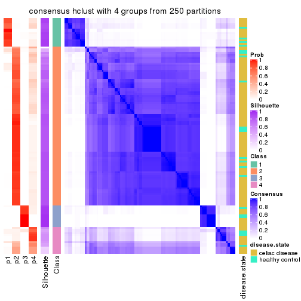</p>

</div>
<div id='tab-SD-hclust-consensus-heatmap-4'>
<pre><code class="r">consensus_heatmap(res, k = 5)
</code></pre>

<p></p>

</div>
<div id='tab-SD-hclust-consensus-heatmap-5'>
<pre><code class="r">consensus_heatmap(res, k = 6)
</code></pre>

<p></p>

</div>
</div>

Heatmaps for the membership of samples in all partitions to see how consistent they are:


<script>
$( function() {
	$( '#tabs-SD-hclust-membership-heatmap' ).tabs();
} );
</script>
<div id='tabs-SD-hclust-membership-heatmap'>
<ul>
<li><a href='#tab-SD-hclust-membership-heatmap-1'>k = 2</a></li>
<li><a href='#tab-SD-hclust-membership-heatmap-2'>k = 3</a></li>
<li><a href='#tab-SD-hclust-membership-heatmap-3'>k = 4</a></li>
<li><a href='#tab-SD-hclust-membership-heatmap-4'>k = 5</a></li>
<li><a href='#tab-SD-hclust-membership-heatmap-5'>k = 6</a></li>
</ul>
<div id='tab-SD-hclust-membership-heatmap-1'>
<pre><code class="r">membership_heatmap(res, k = 2)
</code></pre>

<p></p>

</div>
<div id='tab-SD-hclust-membership-heatmap-2'>
<pre><code class="r">membership_heatmap(res, k = 3)
</code></pre>

<p></p>

</div>
<div id='tab-SD-hclust-membership-heatmap-3'>
<pre><code class="r">membership_heatmap(res, k = 4)
</code></pre>

<p></p>

</div>
<div id='tab-SD-hclust-membership-heatmap-4'>
<pre><code class="r">membership_heatmap(res, k = 5)
</code></pre>

<p></p>

</div>
<div id='tab-SD-hclust-membership-heatmap-5'>
<pre><code class="r">membership_heatmap(res, k = 6)
</code></pre>

<p></p>

</div>
</div>

As soon as we have had the classes for columns, we can look for signatures
which are significantly different between classes which can be candidate marks
for certain classes. Following are the heatmaps for signatures.


Signature heatmaps where rows are scaled:


<script>
$( function() {
	$( '#tabs-SD-hclust-get-signatures' ).tabs();
} );
</script>
<div id='tabs-SD-hclust-get-signatures'>
<ul>
<li><a href='#tab-SD-hclust-get-signatures-1'>k = 2</a></li>
<li><a href='#tab-SD-hclust-get-signatures-2'>k = 3</a></li>
<li><a href='#tab-SD-hclust-get-signatures-3'>k = 4</a></li>
<li><a href='#tab-SD-hclust-get-signatures-4'>k = 5</a></li>
<li><a href='#tab-SD-hclust-get-signatures-5'>k = 6</a></li>
</ul>
<div id='tab-SD-hclust-get-signatures-1'>
<pre><code class="r">get_signatures(res, k = 2)
</code></pre>

<p></p>

</div>
<div id='tab-SD-hclust-get-signatures-2'>
<pre><code class="r">get_signatures(res, k = 3)
</code></pre>

<p></p>

</div>
<div id='tab-SD-hclust-get-signatures-3'>
<pre><code class="r">get_signatures(res, k = 4)
</code></pre>

<p></p>

</div>
<div id='tab-SD-hclust-get-signatures-4'>
<pre><code class="r">get_signatures(res, k = 5)
</code></pre>

<p></p>

</div>
<div id='tab-SD-hclust-get-signatures-5'>
<pre><code class="r">get_signatures(res, k = 6)
</code></pre>

<p></p>

</div>
</div>


Signature heatmaps where rows are not scaled:


<script>
$( function() {
	$( '#tabs-SD-hclust-get-signatures-no-scale' ).tabs();
} );
</script>
<div id='tabs-SD-hclust-get-signatures-no-scale'>
<ul>
<li><a href='#tab-SD-hclust-get-signatures-no-scale-1'>k = 2</a></li>
<li><a href='#tab-SD-hclust-get-signatures-no-scale-2'>k = 3</a></li>
<li><a href='#tab-SD-hclust-get-signatures-no-scale-3'>k = 4</a></li>
<li><a href='#tab-SD-hclust-get-signatures-no-scale-4'>k = 5</a></li>
<li><a href='#tab-SD-hclust-get-signatures-no-scale-5'>k = 6</a></li>
</ul>
<div id='tab-SD-hclust-get-signatures-no-scale-1'>
<pre><code class="r">get_signatures(res, k = 2, scale_rows = FALSE)
</code></pre>

<p></p>

</div>
<div id='tab-SD-hclust-get-signatures-no-scale-2'>
<pre><code class="r">get_signatures(res, k = 3, scale_rows = FALSE)
</code></pre>

<p></p>

</div>
<div id='tab-SD-hclust-get-signatures-no-scale-3'>
<pre><code class="r">get_signatures(res, k = 4, scale_rows = FALSE)
</code></pre>

<p></p>

</div>
<div id='tab-SD-hclust-get-signatures-no-scale-4'>
<pre><code class="r">get_signatures(res, k = 5, scale_rows = FALSE)
</code></pre>

<p></p>

</div>
<div id='tab-SD-hclust-get-signatures-no-scale-5'>
<pre><code class="r">get_signatures(res, k = 6, scale_rows = FALSE)
</code></pre>

<p></p>

</div>
</div>


Compare the overlap of signatures from different k:

```r
compare_signatures(res)
```


`get_signature()` returns a data frame invisibly. TO get the list of signatures, the function
call should be assigned to a variable explicitly. In following code, if `plot` argument is set
to `FALSE`, no heatmap is plotted while only the differential analysis is performed.

```r
# code only for demonstration
tb = get_signature(res, k = ..., plot = FALSE)
```

An example of the output of `tb` is:

```
#>   which_row         fdr    mean_1    mean_2 scaled_mean_1 scaled_mean_2 km
#> 1        38 0.042760348  8.373488  9.131774    -0.5533452     0.5164555  1
#> 2        40 0.018707592  7.106213  8.469186    -0.6173731     0.5762149  1
#> 3        55 0.019134737 10.221463 11.207825    -0.6159697     0.5749050  1
#> 4        59 0.006059896  5.921854  7.869574    -0.6899429     0.6439467  1
#> 5        60 0.018055526  8.928898 10.211722    -0.6204761     0.5791110  1
#> 6        98 0.009384629 15.714769 14.887706     0.6635654    -0.6193277  2
...
```

The columns in `tb` are:

1. `which_row`: row indices corresponding to the input matrix.
2. `fdr`: FDR for the differential test. 
3. `mean_x`: The mean value in group x.
4. `scaled_mean_x`: The mean value in group x after rows are scaled.
5. `km`: Row groups if k-means clustering is applied to rows.


UMAP plot which shows how samples are separated.


<script>
$( function() {
	$( '#tabs-SD-hclust-dimension-reduction' ).tabs();
} );
</script>
<div id='tabs-SD-hclust-dimension-reduction'>
<ul>
<li><a href='#tab-SD-hclust-dimension-reduction-1'>k = 2</a></li>
<li><a href='#tab-SD-hclust-dimension-reduction-2'>k = 3</a></li>
<li><a href='#tab-SD-hclust-dimension-reduction-3'>k = 4</a></li>
<li><a href='#tab-SD-hclust-dimension-reduction-4'>k = 5</a></li>
<li><a href='#tab-SD-hclust-dimension-reduction-5'>k = 6</a></li>
</ul>
<div id='tab-SD-hclust-dimension-reduction-1'>
<pre><code class="r">dimension_reduction(res, k = 2, method = &quot;UMAP&quot;)
</code></pre>

<p></p>

</div>
<div id='tab-SD-hclust-dimension-reduction-2'>
<pre><code class="r">dimension_reduction(res, k = 3, method = &quot;UMAP&quot;)
</code></pre>

<p></p>

</div>
<div id='tab-SD-hclust-dimension-reduction-3'>
<pre><code class="r">dimension_reduction(res, k = 4, method = &quot;UMAP&quot;)
</code></pre>

<p></p>

</div>
<div id='tab-SD-hclust-dimension-reduction-4'>
<pre><code class="r">dimension_reduction(res, k = 5, method = &quot;UMAP&quot;)
</code></pre>

<p></p>

</div>
<div id='tab-SD-hclust-dimension-reduction-5'>
<pre><code class="r">dimension_reduction(res, k = 6, method = &quot;UMAP&quot;)
</code></pre>

<p></p>

</div>
</div>


Following heatmap shows how subgroups are split when increasing `k`:

```r
collect_classes(res)
```


Test correlation between subgroups and known annotations. If the known
annotation is numeric, one-way ANOVA test is applied, and if the known
annotation is discrete, chi-squared contingency table test is applied.

```r
test_to_known_factors(res)
```

```
#>             n disease.state(p) k
#> SD:hclust 119            0.627 2
#> SD:hclust 125            0.261 3
#> SD:hclust 121            0.286 4
#> SD:hclust  59            0.348 5
#> SD:hclust  62            0.506 6
```


If matrix rows can be associated to genes, consider to use `GO_Enrichment(res,
...)` to perform function enrichment for the signature genes.


 

---------------------------------------------------


### SD:kmeans**


The object with results only for a single top-value method and a single partition method 
can be extracted as:

```r
res = res_list["SD", "kmeans"]
# you can also extract it by
# res = res_list["SD:kmeans"]
```

A summary of `res` and all the functions that can be applied to it:

```r
res
```

```
#> A 'ConsensusPartition' object with k = 2, 3, 4, 5, 6.
#>   On a matrix with 18032 rows and 132 columns.
#>   Top rows (1000, 2000, 3000, 4000, 5000) are extracted by 'SD' method.
#>   Subgroups are detected by 'kmeans' method.
#>   Performed in total 1250 partitions by row resampling.
#>   Best k for subgroups seems to be 2.
#> 
#> Following methods can be applied to this 'ConsensusPartition' object:
#>  [1] "cola_report"             "collect_classes"         "collect_plots"          
#>  [4] "collect_stats"           "colnames"                "compare_signatures"     
#>  [7] "consensus_heatmap"       "dimension_reduction"     "functional_enrichment"  
#> [10] "get_anno_col"            "get_anno"                "get_classes"            
#> [13] "get_consensus"           "get_matrix"              "get_membership"         
#> [16] "get_param"               "get_signatures"          "get_stats"              
#> [19] "is_best_k"               "is_stable_k"             "membership_heatmap"     
#> [22] "ncol"                    "nrow"                    "plot_ecdf"              
#> [25] "rownames"                "select_partition_number" "show"                   
#> [28] "suggest_best_k"          "test_to_known_factors"
```

`collect_plots()` function collects all the plots made from `res` for all `k` (number of partitions)
into one single page to provide an easy and fast comparison between different `k`.

```r
collect_plots(res)
```


The plots are:

- The first row: a plot of the ECDF (Empirical cumulative distribution
  function) curves of the consensus matrix for each `k` and the heatmap of
  predicted classes for each `k`.
- The second row: heatmaps of the consensus matrix for each `k`.
- The third row: heatmaps of the membership matrix for each `k`.
- The fouth row: heatmaps of the signatures for each `k`.

All the plots in panels can be made by individual functions and they are
plotted later in this section.

`select_partition_number()` produces several plots showing different
statistics for choosing "optimized" `k`. There are following statistics:

- ECDF curves of the consensus matrix for each `k`;
- 1-PAC. [The PAC
  score](https://en.wikipedia.org/wiki/Consensus_clustering#Over-interpretation_potential_of_consensus_clustering)
  measures the proportion of the ambiguous subgrouping.
- Mean silhouette score.
- Concordance. The mean probability of fiting the consensus class ids in all
  partitions.
- Area increased. Denote $A_k$ as the area under the ECDF curve for current
  `k`, the area increased is defined as $A_k - A_{k-1}$.
- Rand index. The percent of pairs of samples that are both in a same cluster
  or both are not in a same cluster in the partition of k and k-1.
- Jaccard index. The ratio of pairs of samples are both in a same cluster in
  the partition of k and k-1 and the pairs of samples are both in a same
  cluster in the partition k or k-1.

The detailed explanations of these statistics can be found in [the cola
vignette](http://bioconductor.org/packages/devel/bioc/vignettes/cola/inst/doc/cola.html#toc_13).

Generally speaking, lower PAC score, higher mean silhouette score or higher
concordance corresponds to better partition. Rand index and Jaccard index
measure how similar the current partition is compared to partition with `k-1`.
If they are too similar, we won't accept `k` is better than `k-1`.

```r
select_partition_number(res)
```


The numeric values for all these statistics can be obtained by `get_stats()`.

```r
get_stats(res)
```

```
#>   k 1-PAC mean_silhouette concordance area_increased  Rand Jaccard
#> 2 2 1.000           0.970       0.988          0.448 0.547   0.547
#> 3 3 0.564           0.819       0.838          0.248 0.901   0.827
#> 4 4 0.542           0.599       0.785          0.236 0.742   0.512
#> 5 5 0.677           0.623       0.771          0.113 0.852   0.567
#> 6 6 0.696           0.622       0.772          0.051 0.903   0.624
```

`suggest_best_k()` suggests the best $k$ based on these statistics. The rules are as follows:

- All $k$ with Jaccard index larger than 0.95 are removed because the increase of
  the partition number does not provides enough extra information. If all $k$ are removed,
  the best $k$ is assigned by `NA`.
- For $k$ with 1-PAC larger than 0.9, the maximal $k$ is taken as the "best k". Other $k$ is called "optional k".
- If it does not fit the second rule. The $k$ with the highest vote of highest
  1-PAC, mean silhouette and concordance is taken as the "best k".

```r
suggest_best_k(res)
```

```
#> [1] 2
```


Following shows the table of the partitions (You need to click the **show/hide
code output** link to see it). The membership matrix (columns with name `p*`)
is inferred by
[`clue::cl_consensus()`](https://www.rdocumentation.org/link/cl_consensus?package=clue)
function with the `SE` method. Basically the value in the membership matrix
represents the probability to belong to a certain group. The finall class
label for an item is determined with the group with highest probability it
belongs to.

In `get_classes()` function, the entropy is calculated from the membership
matrix and the silhouette score is calculated from the consensus matrix.


<script>
$( function() {
	$( '#tabs-SD-kmeans-get-classes' ).tabs();
} );
</script>
<div id='tabs-SD-kmeans-get-classes'>
<ul>
<li><a href='#tab-SD-kmeans-get-classes-1'>k = 2</a></li>
<li><a href='#tab-SD-kmeans-get-classes-2'>k = 3</a></li>
<li><a href='#tab-SD-kmeans-get-classes-3'>k = 4</a></li>
<li><a href='#tab-SD-kmeans-get-classes-4'>k = 5</a></li>
<li><a href='#tab-SD-kmeans-get-classes-5'>k = 6</a></li>
</ul>

<div id='tab-SD-kmeans-get-classes-1'>
<p><a id='tab-SD-kmeans-get-classes-1-a' style='color:#0366d6' href='#'>show/hide code output</a></p>
<pre><code class="r">cbind(get_classes(res, k = 2), get_membership(res, k = 2))
</code></pre>

<pre><code>#&gt;           class entropy silhouette    p1    p2
#&gt; GSM289470     1   0.996      0.156 0.536 0.464
#&gt; GSM289471     1   0.000      0.971 1.000 0.000
#&gt; GSM289472     2   0.000      0.997 0.000 1.000
#&gt; GSM289473     2   0.000      0.997 0.000 1.000
#&gt; GSM289474     2   0.000      0.997 0.000 1.000
#&gt; GSM289475     2   0.000      0.997 0.000 1.000
#&gt; GSM289476     1   0.000      0.971 1.000 0.000
#&gt; GSM289477     2   0.000      0.997 0.000 1.000
#&gt; GSM289478     2   0.000      0.997 0.000 1.000
#&gt; GSM289479     2   0.000      0.997 0.000 1.000
#&gt; GSM289480     2   0.000      0.997 0.000 1.000
#&gt; GSM289481     2   0.000      0.997 0.000 1.000
#&gt; GSM289482     2   0.000      0.997 0.000 1.000
#&gt; GSM289483     2   0.000      0.997 0.000 1.000
#&gt; GSM289484     2   0.000      0.997 0.000 1.000
#&gt; GSM289485     2   0.000      0.997 0.000 1.000
#&gt; GSM289486     1   0.000      0.971 1.000 0.000
#&gt; GSM289487     2   0.000      0.997 0.000 1.000
#&gt; GSM289488     2   0.000      0.997 0.000 1.000
#&gt; GSM289489     2   0.000      0.997 0.000 1.000
#&gt; GSM289490     2   0.000      0.997 0.000 1.000
#&gt; GSM289491     2   0.000      0.997 0.000 1.000
#&gt; GSM289492     1   0.969      0.365 0.604 0.396
#&gt; GSM289493     2   0.000      0.997 0.000 1.000
#&gt; GSM289494     1   0.000      0.971 1.000 0.000
#&gt; GSM289495     2   0.000      0.997 0.000 1.000
#&gt; GSM289496     2   0.000      0.997 0.000 1.000
#&gt; GSM289497     2   0.000      0.997 0.000 1.000
#&gt; GSM289498     1   0.958      0.405 0.620 0.380
#&gt; GSM289499     2   0.000      0.997 0.000 1.000
#&gt; GSM289500     1   0.000      0.971 1.000 0.000
#&gt; GSM289501     2   0.000      0.997 0.000 1.000
#&gt; GSM289502     2   0.000      0.997 0.000 1.000
#&gt; GSM289503     2   0.000      0.997 0.000 1.000
#&gt; GSM289504     2   0.000      0.997 0.000 1.000
#&gt; GSM289505     2   0.000      0.997 0.000 1.000
#&gt; GSM289506     2   0.000      0.997 0.000 1.000
#&gt; GSM289507     2   0.000      0.997 0.000 1.000
#&gt; GSM289508     1   0.000      0.971 1.000 0.000
#&gt; GSM289509     1   0.000      0.971 1.000 0.000
#&gt; GSM289510     2   0.000      0.997 0.000 1.000
#&gt; GSM289511     2   0.000      0.997 0.000 1.000
#&gt; GSM289512     1   0.000      0.971 1.000 0.000
#&gt; GSM289513     2   0.000      0.997 0.000 1.000
#&gt; GSM289514     2   0.260      0.950 0.044 0.956
#&gt; GSM289515     2   0.000      0.997 0.000 1.000
#&gt; GSM289516     2   0.000      0.997 0.000 1.000
#&gt; GSM289517     2   0.000      0.997 0.000 1.000
#&gt; GSM289518     2   0.000      0.997 0.000 1.000
#&gt; GSM289519     2   0.000      0.997 0.000 1.000
#&gt; GSM289520     2   0.000      0.997 0.000 1.000
#&gt; GSM289521     1   0.000      0.971 1.000 0.000
#&gt; GSM289522     2   0.000      0.997 0.000 1.000
#&gt; GSM289523     1   0.000      0.971 1.000 0.000
#&gt; GSM289524     2   0.000      0.997 0.000 1.000
#&gt; GSM289525     2   0.000      0.997 0.000 1.000
#&gt; GSM289526     2   0.795      0.670 0.240 0.760
#&gt; GSM289527     2   0.000      0.997 0.000 1.000
#&gt; GSM289528     2   0.000      0.997 0.000 1.000
#&gt; GSM289529     2   0.000      0.997 0.000 1.000
#&gt; GSM289530     1   0.204      0.942 0.968 0.032
#&gt; GSM289531     2   0.000      0.997 0.000 1.000
#&gt; GSM289532     1   0.000      0.971 1.000 0.000
#&gt; GSM289533     2   0.000      0.997 0.000 1.000
#&gt; GSM289534     1   0.000      0.971 1.000 0.000
#&gt; GSM289535     2   0.000      0.997 0.000 1.000
#&gt; GSM289536     1   0.000      0.971 1.000 0.000
#&gt; GSM289537     2   0.000      0.997 0.000 1.000
#&gt; GSM289538     2   0.000      0.997 0.000 1.000
#&gt; GSM289539     2   0.000      0.997 0.000 1.000
#&gt; GSM289540     1   0.000      0.971 1.000 0.000
#&gt; GSM289541     1   0.000      0.971 1.000 0.000
#&gt; GSM289542     1   0.000      0.971 1.000 0.000
#&gt; GSM289543     2   0.000      0.997 0.000 1.000
#&gt; GSM289544     1   0.000      0.971 1.000 0.000
#&gt; GSM289545     2   0.000      0.997 0.000 1.000
#&gt; GSM289546     2   0.000      0.997 0.000 1.000
#&gt; GSM289547     2   0.000      0.997 0.000 1.000
#&gt; GSM289548     1   0.000      0.971 1.000 0.000
#&gt; GSM289549     1   0.000      0.971 1.000 0.000
#&gt; GSM289550     1   0.000      0.971 1.000 0.000
#&gt; GSM289551     1   0.000      0.971 1.000 0.000
#&gt; GSM289552     1   0.000      0.971 1.000 0.000
#&gt; GSM289553     1   0.000      0.971 1.000 0.000
#&gt; GSM289554     2   0.000      0.997 0.000 1.000
#&gt; GSM289555     2   0.000      0.997 0.000 1.000
#&gt; GSM289556     1   0.000      0.971 1.000 0.000
#&gt; GSM289557     2   0.000      0.997 0.000 1.000
#&gt; GSM289558     2   0.000      0.997 0.000 1.000
#&gt; GSM289559     1   0.000      0.971 1.000 0.000
#&gt; GSM289560     2   0.000      0.997 0.000 1.000
#&gt; GSM289561     2   0.000      0.997 0.000 1.000
#&gt; GSM289562     1   0.000      0.971 1.000 0.000
#&gt; GSM289563     1   0.000      0.971 1.000 0.000
#&gt; GSM289564     2   0.000      0.997 0.000 1.000
#&gt; GSM289565     1   0.000      0.971 1.000 0.000
#&gt; GSM289566     1   0.000      0.971 1.000 0.000
#&gt; GSM289567     2   0.000      0.997 0.000 1.000
#&gt; GSM289568     2   0.000      0.997 0.000 1.000
#&gt; GSM289569     2   0.000      0.997 0.000 1.000
#&gt; GSM289570     2   0.000      0.997 0.000 1.000
#&gt; GSM289571     2   0.000      0.997 0.000 1.000
#&gt; GSM289572     2   0.000      0.997 0.000 1.000
#&gt; GSM289573     2   0.000      0.997 0.000 1.000
#&gt; GSM289574     2   0.000      0.997 0.000 1.000
#&gt; GSM289575     2   0.000      0.997 0.000 1.000
#&gt; GSM289576     2   0.000      0.997 0.000 1.000
#&gt; GSM289577     2   0.000      0.997 0.000 1.000
#&gt; GSM289578     2   0.000      0.997 0.000 1.000
#&gt; GSM289579     2   0.000      0.997 0.000 1.000
#&gt; GSM289580     1   0.000      0.971 1.000 0.000
#&gt; GSM289581     1   0.000      0.971 1.000 0.000
#&gt; GSM289582     2   0.000      0.997 0.000 1.000
#&gt; GSM289583     2   0.000      0.997 0.000 1.000
#&gt; GSM289584     2   0.000      0.997 0.000 1.000
#&gt; GSM289585     2   0.000      0.997 0.000 1.000
#&gt; GSM289586     2   0.000      0.997 0.000 1.000
#&gt; GSM289587     1   0.000      0.971 1.000 0.000
#&gt; GSM289588     1   0.000      0.971 1.000 0.000
#&gt; GSM289589     1   0.000      0.971 1.000 0.000
#&gt; GSM289590     1   0.000      0.971 1.000 0.000
#&gt; GSM289591     1   0.000      0.971 1.000 0.000
#&gt; GSM289592     2   0.000      0.997 0.000 1.000
#&gt; GSM289593     1   0.000      0.971 1.000 0.000
#&gt; GSM289594     2   0.000      0.997 0.000 1.000
#&gt; GSM289595     1   0.000      0.971 1.000 0.000
#&gt; GSM289596     2   0.000      0.997 0.000 1.000
#&gt; GSM289597     2   0.000      0.997 0.000 1.000
#&gt; GSM289598     1   0.000      0.971 1.000 0.000
#&gt; GSM289599     2   0.000      0.997 0.000 1.000
#&gt; GSM289600     1   0.000      0.971 1.000 0.000
#&gt; GSM289601     1   0.000      0.971 1.000 0.000
</code></pre>

<script>
$('#tab-SD-kmeans-get-classes-1-a').parent().next().next().hide();
$('#tab-SD-kmeans-get-classes-1-a').click(function(){
  $('#tab-SD-kmeans-get-classes-1-a').parent().next().next().toggle();
  return(false);
});
</script>
</div>

<div id='tab-SD-kmeans-get-classes-2'>
<p><a id='tab-SD-kmeans-get-classes-2-a' style='color:#0366d6' href='#'>show/hide code output</a></p>
<pre><code class="r">cbind(get_classes(res, k = 3), get_membership(res, k = 3))
</code></pre>

<pre><code>#&gt;           class entropy silhouette    p1    p2    p3
#&gt; GSM289470     1  0.8081      0.479 0.644 0.136 0.220
#&gt; GSM289471     3  0.6045      1.000 0.380 0.000 0.620
#&gt; GSM289472     2  0.3752      0.862 0.000 0.856 0.144
#&gt; GSM289473     2  0.5098      0.841 0.000 0.752 0.248
#&gt; GSM289474     2  0.4605      0.850 0.000 0.796 0.204
#&gt; GSM289475     2  0.3752      0.862 0.000 0.856 0.144
#&gt; GSM289476     3  0.6045      1.000 0.380 0.000 0.620
#&gt; GSM289477     2  0.4654      0.863 0.000 0.792 0.208
#&gt; GSM289478     2  0.3752      0.862 0.000 0.856 0.144
#&gt; GSM289479     2  0.5178      0.838 0.000 0.744 0.256
#&gt; GSM289480     2  0.3752      0.862 0.000 0.856 0.144
#&gt; GSM289481     2  0.4002      0.861 0.000 0.840 0.160
#&gt; GSM289482     2  0.4842      0.861 0.000 0.776 0.224
#&gt; GSM289483     2  0.4346      0.869 0.000 0.816 0.184
#&gt; GSM289484     2  0.3412      0.868 0.000 0.876 0.124
#&gt; GSM289485     2  0.4654      0.863 0.000 0.792 0.208
#&gt; GSM289486     1  0.0000      0.762 1.000 0.000 0.000
#&gt; GSM289487     2  0.3752      0.862 0.000 0.856 0.144
#&gt; GSM289488     2  0.3482      0.871 0.000 0.872 0.128
#&gt; GSM289489     2  0.4605      0.847 0.000 0.796 0.204
#&gt; GSM289490     2  0.4452      0.824 0.000 0.808 0.192
#&gt; GSM289491     2  0.2066      0.870 0.000 0.940 0.060
#&gt; GSM289492     2  0.5951      0.790 0.040 0.764 0.196
#&gt; GSM289493     2  0.1753      0.866 0.000 0.952 0.048
#&gt; GSM289494     3  0.6045      1.000 0.380 0.000 0.620
#&gt; GSM289495     2  0.4291      0.825 0.000 0.820 0.180
#&gt; GSM289496     2  0.2261      0.865 0.000 0.932 0.068
#&gt; GSM289497     2  0.1289      0.867 0.000 0.968 0.032
#&gt; GSM289498     2  0.6107      0.791 0.052 0.764 0.184
#&gt; GSM289499     2  0.3619      0.843 0.000 0.864 0.136
#&gt; GSM289500     3  0.6045      1.000 0.380 0.000 0.620
#&gt; GSM289501     2  0.2261      0.865 0.000 0.932 0.068
#&gt; GSM289502     2  0.1529      0.868 0.000 0.960 0.040
#&gt; GSM289503     2  0.1163      0.867 0.000 0.972 0.028
#&gt; GSM289504     2  0.3816      0.839 0.000 0.852 0.148
#&gt; GSM289505     2  0.2261      0.865 0.000 0.932 0.068
#&gt; GSM289506     2  0.1529      0.868 0.000 0.960 0.040
#&gt; GSM289507     2  0.1860      0.869 0.000 0.948 0.052
#&gt; GSM289508     1  0.2878      0.743 0.904 0.000 0.096
#&gt; GSM289509     1  0.4504      0.351 0.804 0.000 0.196
#&gt; GSM289510     2  0.5810      0.807 0.000 0.664 0.336
#&gt; GSM289511     2  0.4702      0.845 0.000 0.788 0.212
#&gt; GSM289512     3  0.6045      1.000 0.380 0.000 0.620
#&gt; GSM289513     2  0.4702      0.845 0.000 0.788 0.212
#&gt; GSM289514     1  0.7208      0.551 0.620 0.040 0.340
#&gt; GSM289515     2  0.5178      0.841 0.000 0.744 0.256
#&gt; GSM289516     2  0.5098      0.841 0.000 0.752 0.248
#&gt; GSM289517     2  0.5098      0.841 0.000 0.752 0.248
#&gt; GSM289518     2  0.5098      0.841 0.000 0.752 0.248
#&gt; GSM289519     2  0.9649      0.428 0.220 0.444 0.336
#&gt; GSM289520     2  0.4291      0.856 0.000 0.820 0.180
#&gt; GSM289521     1  0.6794      0.584 0.648 0.028 0.324
#&gt; GSM289522     2  0.5138      0.841 0.000 0.748 0.252
#&gt; GSM289523     3  0.6045      1.000 0.380 0.000 0.620
#&gt; GSM289524     2  0.4702      0.845 0.000 0.788 0.212
#&gt; GSM289525     2  0.5098      0.841 0.000 0.752 0.248
#&gt; GSM289526     2  0.5268      0.842 0.012 0.776 0.212
#&gt; GSM289527     2  0.4702      0.845 0.000 0.788 0.212
#&gt; GSM289528     2  0.3752      0.862 0.000 0.856 0.144
#&gt; GSM289529     2  0.5178      0.841 0.000 0.744 0.256
#&gt; GSM289530     1  0.6659      0.604 0.668 0.028 0.304
#&gt; GSM289531     2  0.5216      0.840 0.000 0.740 0.260
#&gt; GSM289532     1  0.5939      0.664 0.748 0.028 0.224
#&gt; GSM289533     2  0.4702      0.845 0.000 0.788 0.212
#&gt; GSM289534     3  0.6045      1.000 0.380 0.000 0.620
#&gt; GSM289535     2  0.6719      0.754 0.068 0.728 0.204
#&gt; GSM289536     3  0.6045      1.000 0.380 0.000 0.620
#&gt; GSM289537     2  0.2165      0.865 0.000 0.936 0.064
#&gt; GSM289538     2  0.1411      0.868 0.000 0.964 0.036
#&gt; GSM289539     2  0.1860      0.869 0.000 0.948 0.052
#&gt; GSM289540     1  0.5627      0.680 0.780 0.032 0.188
#&gt; GSM289541     1  0.5901      0.674 0.776 0.048 0.176
#&gt; GSM289542     1  0.8219      0.520 0.640 0.180 0.180
#&gt; GSM289543     2  0.4465      0.826 0.004 0.820 0.176
#&gt; GSM289544     1  0.3752      0.727 0.856 0.000 0.144
#&gt; GSM289545     2  0.1529      0.868 0.000 0.960 0.040
#&gt; GSM289546     2  0.1411      0.868 0.000 0.964 0.036
#&gt; GSM289547     2  0.1289      0.867 0.000 0.968 0.032
#&gt; GSM289548     1  0.0000      0.762 1.000 0.000 0.000
#&gt; GSM289549     1  0.0237      0.761 0.996 0.000 0.004
#&gt; GSM289550     1  0.0000      0.762 1.000 0.000 0.000
#&gt; GSM289551     3  0.6045      1.000 0.380 0.000 0.620
#&gt; GSM289552     1  0.0000      0.762 1.000 0.000 0.000
#&gt; GSM289553     1  0.0000      0.762 1.000 0.000 0.000
#&gt; GSM289554     2  0.4002      0.828 0.000 0.840 0.160
#&gt; GSM289555     2  0.2356      0.864 0.000 0.928 0.072
#&gt; GSM289556     1  0.0000      0.762 1.000 0.000 0.000
#&gt; GSM289557     2  0.1643      0.866 0.000 0.956 0.044
#&gt; GSM289558     2  0.1411      0.868 0.000 0.964 0.036
#&gt; GSM289559     1  0.0000      0.762 1.000 0.000 0.000
#&gt; GSM289560     2  0.2356      0.864 0.000 0.928 0.072
#&gt; GSM289561     2  0.1643      0.866 0.000 0.956 0.044
#&gt; GSM289562     1  0.0000      0.762 1.000 0.000 0.000
#&gt; GSM289563     1  0.0424      0.761 0.992 0.000 0.008
#&gt; GSM289564     2  0.4654      0.822 0.000 0.792 0.208
#&gt; GSM289565     1  0.3267      0.736 0.884 0.000 0.116
#&gt; GSM289566     1  0.0000      0.762 1.000 0.000 0.000
#&gt; GSM289567     2  0.5363      0.836 0.000 0.724 0.276
#&gt; GSM289568     2  0.4291      0.853 0.000 0.820 0.180
#&gt; GSM289569     2  0.4796      0.843 0.000 0.780 0.220
#&gt; GSM289570     2  0.5363      0.836 0.000 0.724 0.276
#&gt; GSM289571     2  0.1643      0.866 0.000 0.956 0.044
#&gt; GSM289572     2  0.3412      0.849 0.000 0.876 0.124
#&gt; GSM289573     2  0.1753      0.866 0.000 0.952 0.048
#&gt; GSM289574     2  0.1289      0.867 0.000 0.968 0.032
#&gt; GSM289575     2  0.3038      0.857 0.000 0.896 0.104
#&gt; GSM289576     2  0.1643      0.865 0.000 0.956 0.044
#&gt; GSM289577     2  0.3412      0.849 0.000 0.876 0.124
#&gt; GSM289578     2  0.4399      0.825 0.000 0.812 0.188
#&gt; GSM289579     2  0.3116      0.856 0.000 0.892 0.108
#&gt; GSM289580     3  0.6045      1.000 0.380 0.000 0.620
#&gt; GSM289581     1  0.4784      0.697 0.796 0.004 0.200
#&gt; GSM289582     2  0.4605      0.848 0.000 0.796 0.204
#&gt; GSM289583     2  0.1529      0.868 0.000 0.960 0.040
#&gt; GSM289584     2  0.1643      0.866 0.000 0.956 0.044
#&gt; GSM289585     2  0.1529      0.868 0.000 0.960 0.040
#&gt; GSM289586     1  0.9242      0.342 0.532 0.240 0.228
#&gt; GSM289587     1  0.1289      0.759 0.968 0.000 0.032
#&gt; GSM289588     3  0.6045      1.000 0.380 0.000 0.620
#&gt; GSM289589     1  0.0000      0.762 1.000 0.000 0.000
#&gt; GSM289590     1  0.1411      0.759 0.964 0.000 0.036
#&gt; GSM289591     1  0.0000      0.762 1.000 0.000 0.000
#&gt; GSM289592     2  0.1860      0.865 0.000 0.948 0.052
#&gt; GSM289593     3  0.6045      1.000 0.380 0.000 0.620
#&gt; GSM289594     2  0.2261      0.865 0.000 0.932 0.068
#&gt; GSM289595     1  0.0000      0.762 1.000 0.000 0.000
#&gt; GSM289596     2  0.1289      0.868 0.000 0.968 0.032
#&gt; GSM289597     2  0.5098      0.841 0.000 0.752 0.248
#&gt; GSM289598     1  0.0892      0.739 0.980 0.000 0.020
#&gt; GSM289599     2  0.7333      0.694 0.116 0.704 0.180
#&gt; GSM289600     1  0.0000      0.762 1.000 0.000 0.000
#&gt; GSM289601     1  0.6601      0.609 0.676 0.028 0.296
</code></pre>

<script>
$('#tab-SD-kmeans-get-classes-2-a').parent().next().next().hide();
$('#tab-SD-kmeans-get-classes-2-a').click(function(){
  $('#tab-SD-kmeans-get-classes-2-a').parent().next().next().toggle();
  return(false);
});
</script>
</div>

<div id='tab-SD-kmeans-get-classes-3'>
<p><a id='tab-SD-kmeans-get-classes-3-a' style='color:#0366d6' href='#'>show/hide code output</a></p>
<pre><code class="r">cbind(get_classes(res, k = 4), get_membership(res, k = 4))
</code></pre>

<pre><code>#&gt;           class entropy silhouette    p1    p2    p3    p4
#&gt; GSM289470     1  0.2099     0.8688 0.936 0.004 0.020 0.040
#&gt; GSM289471     3  0.1474     0.9599 0.052 0.000 0.948 0.000
#&gt; GSM289472     2  0.5746    -0.0755 0.000 0.572 0.032 0.396
#&gt; GSM289473     4  0.3982     0.6473 0.004 0.220 0.000 0.776
#&gt; GSM289474     4  0.4018     0.6484 0.000 0.224 0.004 0.772
#&gt; GSM289475     2  0.5723    -0.0579 0.000 0.580 0.032 0.388
#&gt; GSM289476     3  0.1474     0.9599 0.052 0.000 0.948 0.000
#&gt; GSM289477     4  0.4830     0.4365 0.000 0.392 0.000 0.608
#&gt; GSM289478     2  0.5712    -0.0443 0.000 0.584 0.032 0.384
#&gt; GSM289479     4  0.4137     0.6494 0.012 0.208 0.000 0.780
#&gt; GSM289480     2  0.5746    -0.0755 0.000 0.572 0.032 0.396
#&gt; GSM289481     2  0.5815    -0.1390 0.000 0.540 0.032 0.428
#&gt; GSM289482     4  0.4843     0.4328 0.000 0.396 0.000 0.604
#&gt; GSM289483     4  0.4843     0.4275 0.000 0.396 0.000 0.604
#&gt; GSM289484     2  0.5597    -0.1620 0.000 0.516 0.020 0.464
#&gt; GSM289485     4  0.4830     0.4332 0.000 0.392 0.000 0.608
#&gt; GSM289486     1  0.0469     0.9054 0.988 0.000 0.012 0.000
#&gt; GSM289487     2  0.5723    -0.0579 0.000 0.580 0.032 0.388
#&gt; GSM289488     4  0.5112     0.3505 0.000 0.436 0.004 0.560
#&gt; GSM289489     4  0.5847     0.4616 0.000 0.404 0.036 0.560
#&gt; GSM289490     2  0.5788     0.3559 0.012 0.532 0.012 0.444
#&gt; GSM289491     2  0.2965     0.6682 0.000 0.892 0.036 0.072
#&gt; GSM289492     2  0.5793     0.3464 0.012 0.528 0.012 0.448
#&gt; GSM289493     2  0.2053     0.7103 0.000 0.924 0.004 0.072
#&gt; GSM289494     3  0.1722     0.9518 0.048 0.000 0.944 0.008
#&gt; GSM289495     2  0.5740     0.3823 0.012 0.560 0.012 0.416
#&gt; GSM289496     2  0.2266     0.7081 0.000 0.912 0.004 0.084
#&gt; GSM289497     2  0.2797     0.6542 0.000 0.900 0.032 0.068
#&gt; GSM289498     2  0.5643     0.4459 0.012 0.596 0.012 0.380
#&gt; GSM289499     2  0.4999     0.4892 0.000 0.660 0.012 0.328
#&gt; GSM289500     3  0.1474     0.9599 0.052 0.000 0.948 0.000
#&gt; GSM289501     2  0.2334     0.7070 0.000 0.908 0.004 0.088
#&gt; GSM289502     2  0.3149     0.6385 0.000 0.880 0.032 0.088
#&gt; GSM289503     2  0.2124     0.6739 0.000 0.932 0.028 0.040
#&gt; GSM289504     2  0.4864     0.5626 0.012 0.736 0.012 0.240
#&gt; GSM289505     2  0.2197     0.7082 0.000 0.916 0.004 0.080
#&gt; GSM289506     2  0.3342     0.6276 0.000 0.868 0.032 0.100
#&gt; GSM289507     2  0.3464     0.6185 0.000 0.860 0.032 0.108
#&gt; GSM289508     1  0.1721     0.8854 0.952 0.012 0.008 0.028
#&gt; GSM289509     3  0.7393     0.2168 0.332 0.000 0.488 0.180
#&gt; GSM289510     4  0.1118     0.5728 0.000 0.036 0.000 0.964
#&gt; GSM289511     4  0.5784     0.4620 0.000 0.412 0.032 0.556
#&gt; GSM289512     3  0.1474     0.9599 0.052 0.000 0.948 0.000
#&gt; GSM289513     4  0.5856     0.4661 0.000 0.408 0.036 0.556
#&gt; GSM289514     4  0.2473     0.5255 0.080 0.012 0.000 0.908
#&gt; GSM289515     4  0.3528     0.6627 0.000 0.192 0.000 0.808
#&gt; GSM289516     4  0.3486     0.6636 0.000 0.188 0.000 0.812
#&gt; GSM289517     4  0.3266     0.6644 0.000 0.168 0.000 0.832
#&gt; GSM289518     4  0.3024     0.6590 0.000 0.148 0.000 0.852
#&gt; GSM289519     4  0.2413     0.5350 0.064 0.020 0.000 0.916
#&gt; GSM289520     4  0.4621     0.6145 0.000 0.284 0.008 0.708
#&gt; GSM289521     4  0.5244    -0.0980 0.388 0.012 0.000 0.600
#&gt; GSM289522     4  0.3172     0.6625 0.000 0.160 0.000 0.840
#&gt; GSM289523     3  0.1474     0.9599 0.052 0.000 0.948 0.000
#&gt; GSM289524     4  0.5856     0.4661 0.000 0.408 0.036 0.556
#&gt; GSM289525     4  0.3266     0.6644 0.000 0.168 0.000 0.832
#&gt; GSM289526     4  0.5698     0.5146 0.000 0.356 0.036 0.608
#&gt; GSM289527     4  0.5856     0.4661 0.000 0.408 0.036 0.556
#&gt; GSM289528     2  0.5723    -0.0560 0.000 0.580 0.032 0.388
#&gt; GSM289529     4  0.3400     0.6619 0.000 0.180 0.000 0.820
#&gt; GSM289530     4  0.5812     0.0229 0.328 0.048 0.000 0.624
#&gt; GSM289531     4  0.4248     0.6424 0.012 0.220 0.000 0.768
#&gt; GSM289532     4  0.6261    -0.0405 0.344 0.052 0.008 0.596
#&gt; GSM289533     4  0.5827     0.4834 0.000 0.396 0.036 0.568
#&gt; GSM289534     3  0.1474     0.9599 0.052 0.000 0.948 0.000
#&gt; GSM289535     2  0.5691     0.3243 0.012 0.520 0.008 0.460
#&gt; GSM289536     3  0.1474     0.9599 0.052 0.000 0.948 0.000
#&gt; GSM289537     2  0.2053     0.7105 0.000 0.924 0.004 0.072
#&gt; GSM289538     2  0.1902     0.7104 0.000 0.932 0.004 0.064
#&gt; GSM289539     2  0.3464     0.6185 0.000 0.860 0.032 0.108
#&gt; GSM289540     1  0.6554     0.4449 0.536 0.060 0.008 0.396
#&gt; GSM289541     1  0.1821     0.8754 0.948 0.032 0.008 0.012
#&gt; GSM289542     1  0.5411     0.7332 0.744 0.068 0.008 0.180
#&gt; GSM289543     2  0.5345     0.4119 0.004 0.584 0.008 0.404
#&gt; GSM289544     1  0.3907     0.7575 0.768 0.000 0.000 0.232
#&gt; GSM289545     2  0.1978     0.7087 0.000 0.928 0.004 0.068
#&gt; GSM289546     2  0.1902     0.7103 0.000 0.932 0.004 0.064
#&gt; GSM289547     2  0.3082     0.6428 0.000 0.884 0.032 0.084
#&gt; GSM289548     1  0.0469     0.9054 0.988 0.000 0.012 0.000
#&gt; GSM289549     1  0.0524     0.9041 0.988 0.000 0.008 0.004
#&gt; GSM289550     1  0.0469     0.9054 0.988 0.000 0.012 0.000
#&gt; GSM289551     3  0.1474     0.9599 0.052 0.000 0.948 0.000
#&gt; GSM289552     1  0.0469     0.9054 0.988 0.000 0.012 0.000
#&gt; GSM289553     1  0.0469     0.9054 0.988 0.000 0.012 0.000
#&gt; GSM289554     2  0.4988     0.5672 0.012 0.720 0.012 0.256
#&gt; GSM289555     2  0.2611     0.7043 0.000 0.896 0.008 0.096
#&gt; GSM289556     1  0.0469     0.9054 0.988 0.000 0.012 0.000
#&gt; GSM289557     2  0.1970     0.7117 0.000 0.932 0.008 0.060
#&gt; GSM289558     2  0.1743     0.7120 0.000 0.940 0.004 0.056
#&gt; GSM289559     1  0.0469     0.9054 0.988 0.000 0.012 0.000
#&gt; GSM289560     2  0.2546     0.7061 0.000 0.900 0.008 0.092
#&gt; GSM289561     2  0.2271     0.7105 0.000 0.916 0.008 0.076
#&gt; GSM289562     1  0.0469     0.9054 0.988 0.000 0.012 0.000
#&gt; GSM289563     1  0.0592     0.8990 0.984 0.000 0.000 0.016
#&gt; GSM289564     4  0.5802    -0.2245 0.012 0.456 0.012 0.520
#&gt; GSM289565     1  0.4049     0.7650 0.780 0.000 0.008 0.212
#&gt; GSM289566     1  0.1677     0.8895 0.948 0.000 0.012 0.040
#&gt; GSM289567     4  0.3428     0.6430 0.012 0.144 0.000 0.844
#&gt; GSM289568     4  0.5853     0.3703 0.000 0.460 0.032 0.508
#&gt; GSM289569     4  0.4980     0.6020 0.000 0.304 0.016 0.680
#&gt; GSM289570     4  0.3161     0.6322 0.012 0.124 0.000 0.864
#&gt; GSM289571     2  0.1661     0.7120 0.000 0.944 0.004 0.052
#&gt; GSM289572     2  0.3113     0.6928 0.004 0.876 0.012 0.108
#&gt; GSM289573     2  0.0804     0.7005 0.000 0.980 0.012 0.008
#&gt; GSM289574     2  0.3013     0.6453 0.000 0.888 0.032 0.080
#&gt; GSM289575     2  0.3317     0.6886 0.008 0.868 0.012 0.112
#&gt; GSM289576     2  0.1510     0.6841 0.000 0.956 0.028 0.016
#&gt; GSM289577     2  0.3672     0.6760 0.012 0.848 0.012 0.128
#&gt; GSM289578     2  0.5616     0.4307 0.012 0.604 0.012 0.372
#&gt; GSM289579     2  0.3317     0.6886 0.008 0.868 0.012 0.112
#&gt; GSM289580     3  0.1474     0.9599 0.052 0.000 0.948 0.000
#&gt; GSM289581     4  0.4996    -0.3319 0.484 0.000 0.000 0.516
#&gt; GSM289582     4  0.3810     0.6635 0.000 0.188 0.008 0.804
#&gt; GSM289583     2  0.3149     0.6385 0.000 0.880 0.032 0.088
#&gt; GSM289584     2  0.1837     0.6866 0.000 0.944 0.028 0.028
#&gt; GSM289585     2  0.3149     0.6385 0.000 0.880 0.032 0.088
#&gt; GSM289586     4  0.5724     0.6055 0.120 0.128 0.012 0.740
#&gt; GSM289587     1  0.0469     0.9054 0.988 0.000 0.012 0.000
#&gt; GSM289588     3  0.1474     0.9599 0.052 0.000 0.948 0.000
#&gt; GSM289589     1  0.0469     0.9054 0.988 0.000 0.012 0.000
#&gt; GSM289590     1  0.3895     0.7965 0.804 0.000 0.012 0.184
#&gt; GSM289591     1  0.0469     0.9054 0.988 0.000 0.012 0.000
#&gt; GSM289592     2  0.0779     0.6955 0.000 0.980 0.016 0.004
#&gt; GSM289593     3  0.1474     0.9599 0.052 0.000 0.948 0.000
#&gt; GSM289594     2  0.2480     0.7075 0.000 0.904 0.008 0.088
#&gt; GSM289595     1  0.2928     0.8518 0.880 0.000 0.012 0.108
#&gt; GSM289596     2  0.2198     0.7111 0.000 0.920 0.008 0.072
#&gt; GSM289597     4  0.3528     0.6627 0.000 0.192 0.000 0.808
#&gt; GSM289598     1  0.5238     0.7858 0.780 0.044 0.036 0.140
#&gt; GSM289599     2  0.5661     0.3571 0.012 0.544 0.008 0.436
#&gt; GSM289600     1  0.0469     0.9054 0.988 0.000 0.012 0.000
#&gt; GSM289601     4  0.5000    -0.3585 0.496 0.000 0.000 0.504
</code></pre>

<script>
$('#tab-SD-kmeans-get-classes-3-a').parent().next().next().hide();
$('#tab-SD-kmeans-get-classes-3-a').click(function(){
  $('#tab-SD-kmeans-get-classes-3-a').parent().next().next().toggle();
  return(false);
});
</script>
</div>

<div id='tab-SD-kmeans-get-classes-4'>
<p><a id='tab-SD-kmeans-get-classes-4-a' style='color:#0366d6' href='#'>show/hide code output</a></p>
<pre><code class="r">cbind(get_classes(res, k = 5), get_membership(res, k = 5))
</code></pre>

<pre><code>#&gt;           class entropy silhouette    p1    p2    p3    p4    p5
#&gt; GSM289470     1  0.0162    0.93332 0.996 0.000 0.000 0.000 0.004
#&gt; GSM289471     3  0.0162    0.99552 0.004 0.000 0.996 0.000 0.000
#&gt; GSM289472     4  0.6801    0.23407 0.000 0.312 0.000 0.376 0.312
#&gt; GSM289473     4  0.2144    0.67028 0.000 0.068 0.000 0.912 0.020
#&gt; GSM289474     4  0.1830    0.67782 0.000 0.040 0.000 0.932 0.028
#&gt; GSM289475     4  0.6939    0.21962 0.004 0.336 0.000 0.364 0.296
#&gt; GSM289476     3  0.0162    0.99552 0.004 0.000 0.996 0.000 0.000
#&gt; GSM289477     4  0.5653    0.43524 0.004 0.328 0.000 0.584 0.084
#&gt; GSM289478     4  0.6939    0.21962 0.004 0.336 0.000 0.364 0.296
#&gt; GSM289479     4  0.2409    0.67242 0.000 0.068 0.000 0.900 0.032
#&gt; GSM289480     4  0.6796    0.24470 0.000 0.308 0.000 0.380 0.312
#&gt; GSM289481     4  0.6765    0.30312 0.000 0.296 0.000 0.400 0.304
#&gt; GSM289482     4  0.5478    0.43286 0.004 0.336 0.000 0.592 0.068
#&gt; GSM289483     4  0.5622    0.42293 0.004 0.348 0.000 0.572 0.076
#&gt; GSM289484     4  0.6511    0.33454 0.004 0.356 0.000 0.468 0.172
#&gt; GSM289485     4  0.5609    0.42900 0.004 0.344 0.000 0.576 0.076
#&gt; GSM289486     1  0.0451    0.93813 0.988 0.000 0.008 0.004 0.000
#&gt; GSM289487     4  0.6813    0.22943 0.000 0.320 0.000 0.364 0.316
#&gt; GSM289488     4  0.5566    0.42430 0.004 0.364 0.000 0.564 0.068
#&gt; GSM289489     4  0.5213    0.61110 0.004 0.068 0.000 0.652 0.276
#&gt; GSM289490     5  0.5324    0.52593 0.000 0.380 0.004 0.048 0.568
#&gt; GSM289491     2  0.4991    0.62270 0.000 0.636 0.004 0.040 0.320
#&gt; GSM289492     5  0.4659    0.58463 0.000 0.332 0.004 0.020 0.644
#&gt; GSM289493     2  0.2130    0.68877 0.000 0.908 0.000 0.012 0.080
#&gt; GSM289494     3  0.1195    0.96348 0.000 0.000 0.960 0.012 0.028
#&gt; GSM289495     5  0.4986    0.56514 0.004 0.356 0.000 0.032 0.608
#&gt; GSM289496     2  0.1043    0.71603 0.000 0.960 0.000 0.000 0.040
#&gt; GSM289497     2  0.5063    0.58934 0.000 0.632 0.000 0.056 0.312
#&gt; GSM289498     5  0.5324    0.52593 0.000 0.380 0.004 0.048 0.568
#&gt; GSM289499     2  0.4917   -0.00529 0.004 0.588 0.000 0.024 0.384
#&gt; GSM289500     3  0.0000    0.99232 0.000 0.000 1.000 0.000 0.000
#&gt; GSM289501     2  0.2017    0.68699 0.000 0.912 0.000 0.008 0.080
#&gt; GSM289502     2  0.5139    0.58211 0.000 0.624 0.000 0.060 0.316
#&gt; GSM289503     2  0.4863    0.60689 0.000 0.656 0.000 0.048 0.296
#&gt; GSM289504     2  0.2997    0.62783 0.000 0.840 0.000 0.012 0.148
#&gt; GSM289505     2  0.2248    0.68609 0.000 0.900 0.000 0.012 0.088
#&gt; GSM289506     2  0.5139    0.58211 0.000 0.624 0.000 0.060 0.316
#&gt; GSM289507     2  0.5139    0.58211 0.000 0.624 0.000 0.060 0.316
#&gt; GSM289508     1  0.2312    0.87664 0.916 0.008 0.008 0.012 0.056
#&gt; GSM289509     5  0.6177    0.19121 0.124 0.000 0.368 0.004 0.504
#&gt; GSM289510     4  0.1732    0.59823 0.000 0.000 0.000 0.920 0.080
#&gt; GSM289511     4  0.4830    0.63001 0.000 0.060 0.000 0.684 0.256
#&gt; GSM289512     3  0.0162    0.99552 0.004 0.000 0.996 0.000 0.000
#&gt; GSM289513     4  0.4958    0.63017 0.004 0.060 0.000 0.684 0.252
#&gt; GSM289514     4  0.4074    0.05903 0.000 0.000 0.000 0.636 0.364
#&gt; GSM289515     4  0.0794    0.66906 0.000 0.028 0.000 0.972 0.000
#&gt; GSM289516     4  0.0955    0.66748 0.000 0.028 0.000 0.968 0.004
#&gt; GSM289517     4  0.0955    0.66748 0.000 0.028 0.000 0.968 0.004
#&gt; GSM289518     4  0.1195    0.66301 0.000 0.028 0.000 0.960 0.012
#&gt; GSM289519     4  0.4088    0.04214 0.000 0.000 0.000 0.632 0.368
#&gt; GSM289520     4  0.2804    0.67294 0.004 0.068 0.000 0.884 0.044
#&gt; GSM289521     4  0.4562   -0.30757 0.008 0.000 0.000 0.496 0.496
#&gt; GSM289522     4  0.1195    0.66301 0.000 0.028 0.000 0.960 0.012
#&gt; GSM289523     3  0.0162    0.99552 0.004 0.000 0.996 0.000 0.000
#&gt; GSM289524     4  0.4897    0.63106 0.004 0.056 0.000 0.688 0.252
#&gt; GSM289525     4  0.0955    0.66748 0.000 0.028 0.000 0.968 0.004
#&gt; GSM289526     4  0.4540    0.61889 0.008 0.024 0.000 0.700 0.268
#&gt; GSM289527     4  0.4897    0.63106 0.004 0.056 0.000 0.688 0.252
#&gt; GSM289528     2  0.6790   -0.04386 0.000 0.384 0.000 0.300 0.316
#&gt; GSM289529     4  0.1121    0.66405 0.000 0.044 0.000 0.956 0.000
#&gt; GSM289530     5  0.4559    0.28475 0.008 0.000 0.000 0.480 0.512
#&gt; GSM289531     4  0.2616    0.66203 0.000 0.076 0.000 0.888 0.036
#&gt; GSM289532     5  0.4804    0.45658 0.008 0.016 0.000 0.364 0.612
#&gt; GSM289533     4  0.4897    0.63106 0.004 0.056 0.000 0.688 0.252
#&gt; GSM289534     3  0.0451    0.99011 0.004 0.000 0.988 0.000 0.008
#&gt; GSM289535     5  0.5289    0.60411 0.000 0.312 0.000 0.072 0.616
#&gt; GSM289536     3  0.0162    0.99552 0.004 0.000 0.996 0.000 0.000
#&gt; GSM289537     2  0.1956    0.72098 0.000 0.916 0.000 0.008 0.076
#&gt; GSM289538     2  0.2729    0.71851 0.004 0.884 0.000 0.028 0.084
#&gt; GSM289539     2  0.5139    0.58211 0.000 0.624 0.000 0.060 0.316
#&gt; GSM289540     5  0.6414    0.61740 0.140 0.160 0.000 0.064 0.636
#&gt; GSM289541     1  0.0451    0.93043 0.988 0.008 0.000 0.004 0.000
#&gt; GSM289542     5  0.6026    0.58440 0.200 0.196 0.000 0.004 0.600
#&gt; GSM289543     5  0.4937    0.51117 0.004 0.392 0.000 0.024 0.580
#&gt; GSM289544     5  0.5557    0.11235 0.460 0.000 0.000 0.068 0.472
#&gt; GSM289545     2  0.3141    0.71578 0.004 0.860 0.000 0.040 0.096
#&gt; GSM289546     2  0.2928    0.71808 0.004 0.872 0.000 0.032 0.092
#&gt; GSM289547     2  0.4956    0.59104 0.000 0.636 0.000 0.048 0.316
#&gt; GSM289548     1  0.0162    0.93778 0.996 0.000 0.004 0.000 0.000
#&gt; GSM289549     1  0.0162    0.93778 0.996 0.000 0.004 0.000 0.000
#&gt; GSM289550     1  0.0290    0.93827 0.992 0.000 0.008 0.000 0.000
#&gt; GSM289551     3  0.0162    0.99552 0.004 0.000 0.996 0.000 0.000
#&gt; GSM289552     1  0.0290    0.93827 0.992 0.000 0.008 0.000 0.000
#&gt; GSM289553     1  0.0451    0.93733 0.988 0.000 0.008 0.000 0.004
#&gt; GSM289554     2  0.3081    0.61694 0.000 0.832 0.000 0.012 0.156
#&gt; GSM289555     2  0.2233    0.67505 0.000 0.892 0.000 0.004 0.104
#&gt; GSM289556     1  0.0451    0.93733 0.988 0.000 0.008 0.000 0.004
#&gt; GSM289557     2  0.1124    0.72447 0.000 0.960 0.000 0.004 0.036
#&gt; GSM289558     2  0.0794    0.72457 0.000 0.972 0.000 0.000 0.028
#&gt; GSM289559     1  0.0451    0.93813 0.988 0.000 0.008 0.004 0.000
#&gt; GSM289560     2  0.2011    0.68691 0.000 0.908 0.000 0.004 0.088
#&gt; GSM289561     2  0.1357    0.72020 0.000 0.948 0.000 0.004 0.048
#&gt; GSM289562     1  0.0290    0.93827 0.992 0.000 0.008 0.000 0.000
#&gt; GSM289563     1  0.0000    0.93612 1.000 0.000 0.000 0.000 0.000
#&gt; GSM289564     5  0.5535    0.51783 0.000 0.392 0.000 0.072 0.536
#&gt; GSM289565     5  0.5522    0.19710 0.424 0.000 0.004 0.056 0.516
#&gt; GSM289566     1  0.4672    0.50950 0.680 0.000 0.004 0.284 0.032
#&gt; GSM289567     4  0.1774    0.64938 0.000 0.052 0.000 0.932 0.016
#&gt; GSM289568     4  0.5544    0.57664 0.000 0.100 0.000 0.608 0.292
#&gt; GSM289569     4  0.2139    0.67905 0.000 0.052 0.000 0.916 0.032
#&gt; GSM289570     4  0.1800    0.64858 0.000 0.048 0.000 0.932 0.020
#&gt; GSM289571     2  0.1704    0.72536 0.000 0.928 0.000 0.004 0.068
#&gt; GSM289572     2  0.2929    0.62757 0.000 0.840 0.000 0.008 0.152
#&gt; GSM289573     2  0.0955    0.72781 0.000 0.968 0.000 0.004 0.028
#&gt; GSM289574     2  0.5139    0.58211 0.000 0.624 0.000 0.060 0.316
#&gt; GSM289575     2  0.2818    0.64025 0.000 0.856 0.000 0.012 0.132
#&gt; GSM289576     2  0.3812    0.67870 0.000 0.772 0.000 0.024 0.204
#&gt; GSM289577     2  0.2997    0.62287 0.000 0.840 0.000 0.012 0.148
#&gt; GSM289578     2  0.4599    0.31976 0.000 0.688 0.000 0.040 0.272
#&gt; GSM289579     2  0.2953    0.62700 0.000 0.844 0.000 0.012 0.144
#&gt; GSM289580     3  0.0162    0.99552 0.004 0.000 0.996 0.000 0.000
#&gt; GSM289581     5  0.4829    0.27582 0.020 0.000 0.000 0.484 0.496
#&gt; GSM289582     4  0.1386    0.67042 0.000 0.032 0.000 0.952 0.016
#&gt; GSM289583     2  0.5139    0.58211 0.000 0.624 0.000 0.060 0.316
#&gt; GSM289584     2  0.4090    0.65831 0.000 0.716 0.000 0.016 0.268
#&gt; GSM289585     2  0.5139    0.58211 0.000 0.624 0.000 0.060 0.316
#&gt; GSM289586     4  0.1653    0.65808 0.024 0.004 0.000 0.944 0.028
#&gt; GSM289587     1  0.0324    0.93718 0.992 0.000 0.004 0.004 0.000
#&gt; GSM289588     3  0.0162    0.99552 0.004 0.000 0.996 0.000 0.000
#&gt; GSM289589     1  0.0451    0.93813 0.988 0.000 0.008 0.004 0.000
#&gt; GSM289590     5  0.5428    0.10815 0.460 0.000 0.008 0.040 0.492
#&gt; GSM289591     1  0.0451    0.93813 0.988 0.000 0.008 0.004 0.000
#&gt; GSM289592     2  0.1892    0.72371 0.000 0.916 0.000 0.004 0.080
#&gt; GSM289593     3  0.0162    0.99552 0.004 0.000 0.996 0.000 0.000
#&gt; GSM289594     2  0.2179    0.67870 0.000 0.896 0.000 0.004 0.100
#&gt; GSM289595     1  0.4610    0.10281 0.556 0.000 0.012 0.000 0.432
#&gt; GSM289596     2  0.1522    0.72762 0.000 0.944 0.000 0.012 0.044
#&gt; GSM289597     4  0.0880    0.66831 0.000 0.032 0.000 0.968 0.000
#&gt; GSM289598     5  0.7254    0.47676 0.272 0.184 0.020 0.020 0.504
#&gt; GSM289599     5  0.4838    0.58418 0.004 0.336 0.000 0.028 0.632
#&gt; GSM289600     1  0.0290    0.93421 0.992 0.000 0.000 0.008 0.000
#&gt; GSM289601     5  0.4979    0.28319 0.028 0.000 0.000 0.480 0.492
</code></pre>

<script>
$('#tab-SD-kmeans-get-classes-4-a').parent().next().next().hide();
$('#tab-SD-kmeans-get-classes-4-a').click(function(){
  $('#tab-SD-kmeans-get-classes-4-a').parent().next().next().toggle();
  return(false);
});
</script>
</div>

<div id='tab-SD-kmeans-get-classes-5'>
<p><a id='tab-SD-kmeans-get-classes-5-a' style='color:#0366d6' href='#'>show/hide code output</a></p>
<pre><code class="r">cbind(get_classes(res, k = 6), get_membership(res, k = 6))
</code></pre>

<pre><code>#&gt;           class entropy silhouette    p1    p2    p3    p4    p5    p6
#&gt; GSM289470     1  0.0692     0.9158 0.976 0.000 0.000 0.000 0.004 0.020
#&gt; GSM289471     3  0.0000     0.9863 0.000 0.000 1.000 0.000 0.000 0.000
#&gt; GSM289472     5  0.4510     0.5036 0.000 0.044 0.000 0.268 0.676 0.012
#&gt; GSM289473     4  0.1636     0.7143 0.000 0.036 0.000 0.936 0.024 0.004
#&gt; GSM289474     4  0.1798     0.7144 0.000 0.020 0.000 0.932 0.028 0.020
#&gt; GSM289475     5  0.5944     0.3852 0.000 0.092 0.000 0.292 0.560 0.056
#&gt; GSM289476     3  0.0000     0.9863 0.000 0.000 1.000 0.000 0.000 0.000
#&gt; GSM289477     4  0.6927     0.2155 0.000 0.208 0.000 0.472 0.224 0.096
#&gt; GSM289478     5  0.5899     0.4106 0.000 0.092 0.000 0.280 0.572 0.056
#&gt; GSM289479     4  0.2507     0.7056 0.000 0.036 0.000 0.892 0.056 0.016
#&gt; GSM289480     5  0.4812     0.4789 0.000 0.044 0.000 0.280 0.652 0.024
#&gt; GSM289481     5  0.5141     0.3353 0.000 0.076 0.000 0.344 0.572 0.008
#&gt; GSM289482     4  0.6927     0.2155 0.000 0.208 0.000 0.472 0.224 0.096
#&gt; GSM289483     4  0.6940     0.2027 0.000 0.204 0.000 0.468 0.232 0.096
#&gt; GSM289484     4  0.6712     0.1042 0.000 0.148 0.000 0.452 0.324 0.076
#&gt; GSM289485     4  0.6913     0.2111 0.000 0.188 0.000 0.476 0.236 0.100
#&gt; GSM289486     1  0.0767     0.9210 0.976 0.000 0.000 0.004 0.012 0.008
#&gt; GSM289487     5  0.5833     0.3857 0.000 0.080 0.000 0.296 0.568 0.056
#&gt; GSM289488     4  0.6914     0.1792 0.000 0.188 0.000 0.464 0.256 0.092
#&gt; GSM289489     4  0.4582     0.2747 0.000 0.008 0.000 0.552 0.416 0.024
#&gt; GSM289490     6  0.6338     0.2592 0.000 0.404 0.000 0.032 0.160 0.404
#&gt; GSM289491     5  0.5961     0.1220 0.000 0.312 0.000 0.032 0.532 0.124
#&gt; GSM289492     6  0.5935     0.4001 0.000 0.328 0.000 0.016 0.152 0.504
#&gt; GSM289493     2  0.1584     0.7439 0.000 0.928 0.000 0.008 0.064 0.000
#&gt; GSM289494     3  0.3186     0.8391 0.000 0.004 0.836 0.000 0.100 0.060
#&gt; GSM289495     2  0.4748    -0.0930 0.000 0.516 0.000 0.008 0.032 0.444
#&gt; GSM289496     2  0.2482     0.7253 0.000 0.848 0.000 0.004 0.148 0.000
#&gt; GSM289497     5  0.3780     0.6879 0.000 0.244 0.000 0.016 0.732 0.008
#&gt; GSM289498     6  0.6372     0.2656 0.000 0.400 0.000 0.036 0.156 0.408
#&gt; GSM289499     2  0.3496     0.6365 0.000 0.804 0.000 0.004 0.052 0.140
#&gt; GSM289500     3  0.0000     0.9863 0.000 0.000 1.000 0.000 0.000 0.000
#&gt; GSM289501     2  0.1588     0.7431 0.000 0.924 0.000 0.004 0.072 0.000
#&gt; GSM289502     5  0.3758     0.7043 0.000 0.232 0.000 0.024 0.740 0.004
#&gt; GSM289503     5  0.3991     0.5839 0.000 0.300 0.000 0.008 0.680 0.012
#&gt; GSM289504     2  0.2750     0.7024 0.000 0.868 0.000 0.004 0.080 0.048
#&gt; GSM289505     2  0.3002     0.7203 0.000 0.848 0.000 0.004 0.100 0.048
#&gt; GSM289506     5  0.3713     0.7082 0.000 0.224 0.000 0.032 0.744 0.000
#&gt; GSM289507     5  0.3713     0.7082 0.000 0.224 0.000 0.032 0.744 0.000
#&gt; GSM289508     1  0.5315     0.6255 0.696 0.048 0.000 0.008 0.108 0.140
#&gt; GSM289509     6  0.4301     0.5507 0.072 0.000 0.188 0.008 0.000 0.732
#&gt; GSM289510     4  0.2790     0.6124 0.000 0.000 0.000 0.844 0.024 0.132
#&gt; GSM289511     4  0.3859     0.5019 0.000 0.008 0.000 0.692 0.292 0.008
#&gt; GSM289512     3  0.0000     0.9863 0.000 0.000 1.000 0.000 0.000 0.000
#&gt; GSM289513     4  0.4303     0.3991 0.000 0.008 0.000 0.616 0.360 0.016
#&gt; GSM289514     4  0.3945     0.1504 0.000 0.000 0.000 0.612 0.008 0.380
#&gt; GSM289515     4  0.0984     0.7183 0.000 0.012 0.000 0.968 0.008 0.012
#&gt; GSM289516     4  0.1180     0.7181 0.000 0.012 0.000 0.960 0.016 0.012
#&gt; GSM289517     4  0.0653     0.7172 0.000 0.012 0.000 0.980 0.004 0.004
#&gt; GSM289518     4  0.0508     0.7171 0.000 0.012 0.000 0.984 0.000 0.004
#&gt; GSM289519     4  0.4141     0.0034 0.000 0.000 0.000 0.556 0.012 0.432
#&gt; GSM289520     4  0.4748     0.5830 0.000 0.044 0.000 0.728 0.152 0.076
#&gt; GSM289521     6  0.3681     0.5883 0.004 0.004 0.000 0.272 0.004 0.716
#&gt; GSM289522     4  0.0725     0.7176 0.000 0.012 0.000 0.976 0.000 0.012
#&gt; GSM289523     3  0.0000     0.9863 0.000 0.000 1.000 0.000 0.000 0.000
#&gt; GSM289524     4  0.4278     0.4106 0.000 0.008 0.000 0.624 0.352 0.016
#&gt; GSM289525     4  0.0653     0.7172 0.000 0.012 0.000 0.980 0.004 0.004
#&gt; GSM289526     4  0.4589     0.4168 0.004 0.004 0.000 0.612 0.348 0.032
#&gt; GSM289527     4  0.4278     0.4106 0.000 0.008 0.000 0.624 0.352 0.016
#&gt; GSM289528     5  0.3956     0.6668 0.000 0.088 0.000 0.152 0.760 0.000
#&gt; GSM289529     4  0.0777     0.7167 0.000 0.024 0.000 0.972 0.004 0.000
#&gt; GSM289530     6  0.3476     0.5993 0.000 0.004 0.000 0.260 0.004 0.732
#&gt; GSM289531     4  0.2137     0.7073 0.000 0.048 0.000 0.912 0.028 0.012
#&gt; GSM289532     6  0.3788     0.6174 0.000 0.020 0.000 0.232 0.008 0.740
#&gt; GSM289533     4  0.4513     0.4344 0.000 0.016 0.000 0.636 0.324 0.024
#&gt; GSM289534     3  0.0146     0.9832 0.000 0.000 0.996 0.000 0.000 0.004
#&gt; GSM289535     6  0.5441     0.4014 0.000 0.388 0.000 0.028 0.060 0.524
#&gt; GSM289536     3  0.0000     0.9863 0.000 0.000 1.000 0.000 0.000 0.000
#&gt; GSM289537     2  0.4860     0.4871 0.000 0.624 0.000 0.008 0.304 0.064
#&gt; GSM289538     2  0.5275     0.4015 0.000 0.564 0.000 0.012 0.344 0.080
#&gt; GSM289539     5  0.3713     0.7082 0.000 0.224 0.000 0.032 0.744 0.000
#&gt; GSM289540     6  0.3596     0.6480 0.088 0.072 0.000 0.020 0.000 0.820
#&gt; GSM289541     1  0.1749     0.8932 0.932 0.004 0.000 0.004 0.016 0.044
#&gt; GSM289542     6  0.6507     0.4830 0.128 0.296 0.000 0.000 0.076 0.500
#&gt; GSM289543     2  0.5378    -0.1980 0.000 0.456 0.000 0.008 0.084 0.452
#&gt; GSM289544     6  0.4550     0.5646 0.220 0.000 0.000 0.060 0.016 0.704
#&gt; GSM289545     2  0.5524     0.3233 0.000 0.524 0.000 0.012 0.364 0.100
#&gt; GSM289546     2  0.5430     0.3777 0.000 0.552 0.000 0.012 0.340 0.096
#&gt; GSM289547     5  0.3865     0.6823 0.000 0.248 0.000 0.032 0.720 0.000
#&gt; GSM289548     1  0.0748     0.9213 0.976 0.000 0.000 0.004 0.016 0.004
#&gt; GSM289549     1  0.0692     0.9158 0.976 0.000 0.000 0.000 0.004 0.020
#&gt; GSM289550     1  0.0748     0.9210 0.976 0.000 0.000 0.004 0.016 0.004
#&gt; GSM289551     3  0.0000     0.9863 0.000 0.000 1.000 0.000 0.000 0.000
#&gt; GSM289552     1  0.0653     0.9218 0.980 0.000 0.000 0.004 0.012 0.004
#&gt; GSM289553     1  0.2255     0.8518 0.892 0.000 0.000 0.004 0.016 0.088
#&gt; GSM289554     2  0.1138     0.7301 0.000 0.960 0.000 0.004 0.012 0.024
#&gt; GSM289555     2  0.2266     0.7334 0.000 0.880 0.000 0.000 0.108 0.012
#&gt; GSM289556     1  0.0964     0.9184 0.968 0.000 0.000 0.004 0.016 0.012
#&gt; GSM289557     2  0.3025     0.7110 0.000 0.820 0.000 0.000 0.156 0.024
#&gt; GSM289558     2  0.2805     0.7061 0.000 0.812 0.000 0.004 0.184 0.000
#&gt; GSM289559     1  0.0964     0.9183 0.968 0.000 0.000 0.004 0.012 0.016
#&gt; GSM289560     2  0.2312     0.7322 0.000 0.876 0.000 0.000 0.112 0.012
#&gt; GSM289561     2  0.2821     0.7140 0.000 0.832 0.000 0.000 0.152 0.016
#&gt; GSM289562     1  0.0653     0.9218 0.980 0.000 0.000 0.004 0.012 0.004
#&gt; GSM289563     1  0.0436     0.9218 0.988 0.000 0.000 0.004 0.004 0.004
#&gt; GSM289564     2  0.3888     0.4260 0.000 0.752 0.000 0.024 0.016 0.208
#&gt; GSM289565     6  0.3487     0.5722 0.224 0.000 0.000 0.020 0.000 0.756
#&gt; GSM289566     1  0.5418     0.2587 0.520 0.000 0.000 0.396 0.052 0.032
#&gt; GSM289567     4  0.1464     0.7102 0.000 0.036 0.000 0.944 0.016 0.004
#&gt; GSM289568     4  0.4193     0.3539 0.000 0.008 0.000 0.600 0.384 0.008
#&gt; GSM289569     4  0.1983     0.7023 0.000 0.012 0.000 0.916 0.060 0.012
#&gt; GSM289570     4  0.1346     0.7126 0.000 0.024 0.000 0.952 0.016 0.008
#&gt; GSM289571     2  0.4535     0.4989 0.000 0.644 0.000 0.000 0.296 0.060
#&gt; GSM289572     2  0.2074     0.7173 0.000 0.912 0.000 0.004 0.036 0.048
#&gt; GSM289573     2  0.2838     0.7078 0.000 0.808 0.000 0.004 0.188 0.000
#&gt; GSM289574     5  0.3619     0.7050 0.000 0.232 0.000 0.024 0.744 0.000
#&gt; GSM289575     2  0.2402     0.7336 0.000 0.888 0.000 0.008 0.084 0.020
#&gt; GSM289576     2  0.3830     0.3857 0.000 0.620 0.000 0.004 0.376 0.000
#&gt; GSM289577     2  0.1832     0.7215 0.000 0.928 0.000 0.008 0.032 0.032
#&gt; GSM289578     2  0.2002     0.6953 0.000 0.916 0.000 0.008 0.020 0.056
#&gt; GSM289579     2  0.1599     0.7267 0.000 0.940 0.000 0.008 0.028 0.024
#&gt; GSM289580     3  0.0000     0.9863 0.000 0.000 1.000 0.000 0.000 0.000
#&gt; GSM289581     6  0.3628     0.5920 0.008 0.000 0.000 0.268 0.004 0.720
#&gt; GSM289582     4  0.1269     0.7176 0.000 0.020 0.000 0.956 0.012 0.012
#&gt; GSM289583     5  0.3813     0.6984 0.000 0.236 0.000 0.020 0.736 0.008
#&gt; GSM289584     2  0.4310     0.2670 0.000 0.580 0.000 0.024 0.396 0.000
#&gt; GSM289585     5  0.3619     0.7050 0.000 0.232 0.000 0.024 0.744 0.000
#&gt; GSM289586     4  0.1434     0.7115 0.008 0.000 0.000 0.948 0.020 0.024
#&gt; GSM289587     1  0.0767     0.9210 0.976 0.000 0.000 0.004 0.012 0.008
#&gt; GSM289588     3  0.0000     0.9863 0.000 0.000 1.000 0.000 0.000 0.000
#&gt; GSM289589     1  0.0767     0.9210 0.976 0.000 0.000 0.004 0.012 0.008
#&gt; GSM289590     6  0.3770     0.5561 0.244 0.000 0.000 0.028 0.000 0.728
#&gt; GSM289591     1  0.0767     0.9210 0.976 0.000 0.000 0.004 0.012 0.008
#&gt; GSM289592     2  0.3104     0.6909 0.000 0.800 0.000 0.000 0.184 0.016
#&gt; GSM289593     3  0.0000     0.9863 0.000 0.000 1.000 0.000 0.000 0.000
#&gt; GSM289594     2  0.2261     0.7321 0.000 0.884 0.000 0.004 0.104 0.008
#&gt; GSM289595     6  0.4025     0.4537 0.312 0.000 0.000 0.004 0.016 0.668
#&gt; GSM289596     2  0.3236     0.6960 0.000 0.796 0.000 0.000 0.180 0.024
#&gt; GSM289597     4  0.1173     0.7179 0.000 0.016 0.000 0.960 0.008 0.016
#&gt; GSM289598     6  0.7411     0.4587 0.140 0.240 0.012 0.000 0.164 0.444
#&gt; GSM289599     6  0.4558     0.4199 0.000 0.348 0.000 0.008 0.032 0.612
#&gt; GSM289600     1  0.0653     0.9218 0.980 0.000 0.000 0.004 0.012 0.004
#&gt; GSM289601     6  0.3767     0.5983 0.016 0.000 0.000 0.260 0.004 0.720
</code></pre>

<script>
$('#tab-SD-kmeans-get-classes-5-a').parent().next().next().hide();
$('#tab-SD-kmeans-get-classes-5-a').click(function(){
  $('#tab-SD-kmeans-get-classes-5-a').parent().next().next().toggle();
  return(false);
});
</script>
</div>
</div>

Heatmaps for the consensus matrix. It visualizes the probability of two
samples to be in a same group.


<script>
$( function() {
	$( '#tabs-SD-kmeans-consensus-heatmap' ).tabs();
} );
</script>
<div id='tabs-SD-kmeans-consensus-heatmap'>
<ul>
<li><a href='#tab-SD-kmeans-consensus-heatmap-1'>k = 2</a></li>
<li><a href='#tab-SD-kmeans-consensus-heatmap-2'>k = 3</a></li>
<li><a href='#tab-SD-kmeans-consensus-heatmap-3'>k = 4</a></li>
<li><a href='#tab-SD-kmeans-consensus-heatmap-4'>k = 5</a></li>
<li><a href='#tab-SD-kmeans-consensus-heatmap-5'>k = 6</a></li>
</ul>
<div id='tab-SD-kmeans-consensus-heatmap-1'>
<pre><code class="r">consensus_heatmap(res, k = 2)
</code></pre>

<p></p>

</div>
<div id='tab-SD-kmeans-consensus-heatmap-2'>
<pre><code class="r">consensus_heatmap(res, k = 3)
</code></pre>

<p></p>

</div>
<div id='tab-SD-kmeans-consensus-heatmap-3'>
<pre><code class="r">consensus_heatmap(res, k = 4)
</code></pre>

<p></p>

</div>
<div id='tab-SD-kmeans-consensus-heatmap-4'>
<pre><code class="r">consensus_heatmap(res, k = 5)
</code></pre>

<p></p>

</div>
<div id='tab-SD-kmeans-consensus-heatmap-5'>
<pre><code class="r">consensus_heatmap(res, k = 6)
</code></pre>

<p>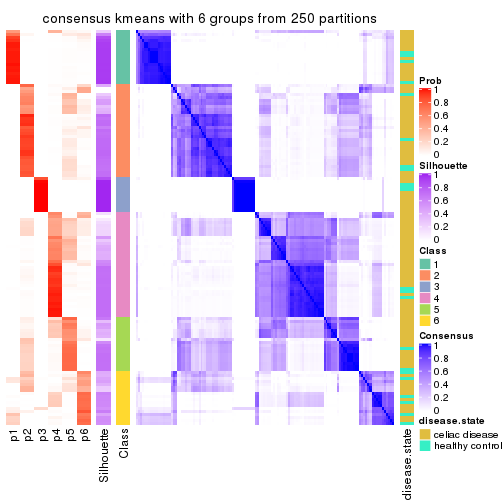</p>

</div>
</div>

Heatmaps for the membership of samples in all partitions to see how consistent they are:


<script>
$( function() {
	$( '#tabs-SD-kmeans-membership-heatmap' ).tabs();
} );
</script>
<div id='tabs-SD-kmeans-membership-heatmap'>
<ul>
<li><a href='#tab-SD-kmeans-membership-heatmap-1'>k = 2</a></li>
<li><a href='#tab-SD-kmeans-membership-heatmap-2'>k = 3</a></li>
<li><a href='#tab-SD-kmeans-membership-heatmap-3'>k = 4</a></li>
<li><a href='#tab-SD-kmeans-membership-heatmap-4'>k = 5</a></li>
<li><a href='#tab-SD-kmeans-membership-heatmap-5'>k = 6</a></li>
</ul>
<div id='tab-SD-kmeans-membership-heatmap-1'>
<pre><code class="r">membership_heatmap(res, k = 2)
</code></pre>

<p></p>

</div>
<div id='tab-SD-kmeans-membership-heatmap-2'>
<pre><code class="r">membership_heatmap(res, k = 3)
</code></pre>

<p></p>

</div>
<div id='tab-SD-kmeans-membership-heatmap-3'>
<pre><code class="r">membership_heatmap(res, k = 4)
</code></pre>

<p></p>

</div>
<div id='tab-SD-kmeans-membership-heatmap-4'>
<pre><code class="r">membership_heatmap(res, k = 5)
</code></pre>

<p></p>

</div>
<div id='tab-SD-kmeans-membership-heatmap-5'>
<pre><code class="r">membership_heatmap(res, k = 6)
</code></pre>

<p></p>

</div>
</div>

As soon as we have had the classes for columns, we can look for signatures
which are significantly different between classes which can be candidate marks
for certain classes. Following are the heatmaps for signatures.


Signature heatmaps where rows are scaled:


<script>
$( function() {
	$( '#tabs-SD-kmeans-get-signatures' ).tabs();
} );
</script>
<div id='tabs-SD-kmeans-get-signatures'>
<ul>
<li><a href='#tab-SD-kmeans-get-signatures-1'>k = 2</a></li>
<li><a href='#tab-SD-kmeans-get-signatures-2'>k = 3</a></li>
<li><a href='#tab-SD-kmeans-get-signatures-3'>k = 4</a></li>
<li><a href='#tab-SD-kmeans-get-signatures-4'>k = 5</a></li>
<li><a href='#tab-SD-kmeans-get-signatures-5'>k = 6</a></li>
</ul>
<div id='tab-SD-kmeans-get-signatures-1'>
<pre><code class="r">get_signatures(res, k = 2)
</code></pre>

<p></p>

</div>
<div id='tab-SD-kmeans-get-signatures-2'>
<pre><code class="r">get_signatures(res, k = 3)
</code></pre>

<p></p>

</div>
<div id='tab-SD-kmeans-get-signatures-3'>
<pre><code class="r">get_signatures(res, k = 4)
</code></pre>

<p></p>

</div>
<div id='tab-SD-kmeans-get-signatures-4'>
<pre><code class="r">get_signatures(res, k = 5)
</code></pre>

<p></p>

</div>
<div id='tab-SD-kmeans-get-signatures-5'>
<pre><code class="r">get_signatures(res, k = 6)
</code></pre>

<p></p>

</div>
</div>


Signature heatmaps where rows are not scaled:


<script>
$( function() {
	$( '#tabs-SD-kmeans-get-signatures-no-scale' ).tabs();
} );
</script>
<div id='tabs-SD-kmeans-get-signatures-no-scale'>
<ul>
<li><a href='#tab-SD-kmeans-get-signatures-no-scale-1'>k = 2</a></li>
<li><a href='#tab-SD-kmeans-get-signatures-no-scale-2'>k = 3</a></li>
<li><a href='#tab-SD-kmeans-get-signatures-no-scale-3'>k = 4</a></li>
<li><a href='#tab-SD-kmeans-get-signatures-no-scale-4'>k = 5</a></li>
<li><a href='#tab-SD-kmeans-get-signatures-no-scale-5'>k = 6</a></li>
</ul>
<div id='tab-SD-kmeans-get-signatures-no-scale-1'>
<pre><code class="r">get_signatures(res, k = 2, scale_rows = FALSE)
</code></pre>

<p></p>

</div>
<div id='tab-SD-kmeans-get-signatures-no-scale-2'>
<pre><code class="r">get_signatures(res, k = 3, scale_rows = FALSE)
</code></pre>

<p></p>

</div>
<div id='tab-SD-kmeans-get-signatures-no-scale-3'>
<pre><code class="r">get_signatures(res, k = 4, scale_rows = FALSE)
</code></pre>

<p></p>

</div>
<div id='tab-SD-kmeans-get-signatures-no-scale-4'>
<pre><code class="r">get_signatures(res, k = 5, scale_rows = FALSE)
</code></pre>

<p></p>

</div>
<div id='tab-SD-kmeans-get-signatures-no-scale-5'>
<pre><code class="r">get_signatures(res, k = 6, scale_rows = FALSE)
</code></pre>

<p></p>

</div>
</div>


Compare the overlap of signatures from different k:

```r
compare_signatures(res)
```


`get_signature()` returns a data frame invisibly. TO get the list of signatures, the function
call should be assigned to a variable explicitly. In following code, if `plot` argument is set
to `FALSE`, no heatmap is plotted while only the differential analysis is performed.

```r
# code only for demonstration
tb = get_signature(res, k = ..., plot = FALSE)
```

An example of the output of `tb` is:

```
#>   which_row         fdr    mean_1    mean_2 scaled_mean_1 scaled_mean_2 km
#> 1        38 0.042760348  8.373488  9.131774    -0.5533452     0.5164555  1
#> 2        40 0.018707592  7.106213  8.469186    -0.6173731     0.5762149  1
#> 3        55 0.019134737 10.221463 11.207825    -0.6159697     0.5749050  1
#> 4        59 0.006059896  5.921854  7.869574    -0.6899429     0.6439467  1
#> 5        60 0.018055526  8.928898 10.211722    -0.6204761     0.5791110  1
#> 6        98 0.009384629 15.714769 14.887706     0.6635654    -0.6193277  2
...
```

The columns in `tb` are:

1. `which_row`: row indices corresponding to the input matrix.
2. `fdr`: FDR for the differential test. 
3. `mean_x`: The mean value in group x.
4. `scaled_mean_x`: The mean value in group x after rows are scaled.
5. `km`: Row groups if k-means clustering is applied to rows.


UMAP plot which shows how samples are separated.


<script>
$( function() {
	$( '#tabs-SD-kmeans-dimension-reduction' ).tabs();
} );
</script>
<div id='tabs-SD-kmeans-dimension-reduction'>
<ul>
<li><a href='#tab-SD-kmeans-dimension-reduction-1'>k = 2</a></li>
<li><a href='#tab-SD-kmeans-dimension-reduction-2'>k = 3</a></li>
<li><a href='#tab-SD-kmeans-dimension-reduction-3'>k = 4</a></li>
<li><a href='#tab-SD-kmeans-dimension-reduction-4'>k = 5</a></li>
<li><a href='#tab-SD-kmeans-dimension-reduction-5'>k = 6</a></li>
</ul>
<div id='tab-SD-kmeans-dimension-reduction-1'>
<pre><code class="r">dimension_reduction(res, k = 2, method = &quot;UMAP&quot;)
</code></pre>

<p></p>

</div>
<div id='tab-SD-kmeans-dimension-reduction-2'>
<pre><code class="r">dimension_reduction(res, k = 3, method = &quot;UMAP&quot;)
</code></pre>

<p></p>

</div>
<div id='tab-SD-kmeans-dimension-reduction-3'>
<pre><code class="r">dimension_reduction(res, k = 4, method = &quot;UMAP&quot;)
</code></pre>

<p></p>

</div>
<div id='tab-SD-kmeans-dimension-reduction-4'>
<pre><code class="r">dimension_reduction(res, k = 5, method = &quot;UMAP&quot;)
</code></pre>

<p></p>

</div>
<div id='tab-SD-kmeans-dimension-reduction-5'>
<pre><code class="r">dimension_reduction(res, k = 6, method = &quot;UMAP&quot;)
</code></pre>

<p></p>

</div>
</div>


Following heatmap shows how subgroups are split when increasing `k`:

```r
collect_classes(res)
```


Test correlation between subgroups and known annotations. If the known
annotation is numeric, one-way ANOVA test is applied, and if the known
annotation is discrete, chi-squared contingency table test is applied.

```r
test_to_known_factors(res)
```

```
#>             n disease.state(p) k
#> SD:kmeans 129           0.0303 2
#> SD:kmeans 128           0.0317 3
#> SD:kmeans  95           0.5057 4
#> SD:kmeans 104           0.7454 5
#> SD:kmeans  92           0.8777 6
```


If matrix rows can be associated to genes, consider to use `GO_Enrichment(res,
...)` to perform function enrichment for the signature genes.


 

---------------------------------------------------


### SD:skmeans**


The object with results only for a single top-value method and a single partition method 
can be extracted as:

```r
res = res_list["SD", "skmeans"]
# you can also extract it by
# res = res_list["SD:skmeans"]
```

A summary of `res` and all the functions that can be applied to it:

```r
res
```

```
#> A 'ConsensusPartition' object with k = 2, 3, 4, 5, 6.
#>   On a matrix with 18032 rows and 132 columns.
#>   Top rows (1000, 2000, 3000, 4000, 5000) are extracted by 'SD' method.
#>   Subgroups are detected by 'skmeans' method.
#>   Performed in total 1250 partitions by row resampling.
#>   Best k for subgroups seems to be 2.
#> 
#> Following methods can be applied to this 'ConsensusPartition' object:
#>  [1] "cola_report"             "collect_classes"         "collect_plots"          
#>  [4] "collect_stats"           "colnames"                "compare_signatures"     
#>  [7] "consensus_heatmap"       "dimension_reduction"     "functional_enrichment"  
#> [10] "get_anno_col"            "get_anno"                "get_classes"            
#> [13] "get_consensus"           "get_matrix"              "get_membership"         
#> [16] "get_param"               "get_signatures"          "get_stats"              
#> [19] "is_best_k"               "is_stable_k"             "membership_heatmap"     
#> [22] "ncol"                    "nrow"                    "plot_ecdf"              
#> [25] "rownames"                "select_partition_number" "show"                   
#> [28] "suggest_best_k"          "test_to_known_factors"
```

`collect_plots()` function collects all the plots made from `res` for all `k` (number of partitions)
into one single page to provide an easy and fast comparison between different `k`.

```r
collect_plots(res)
```


The plots are:

- The first row: a plot of the ECDF (Empirical cumulative distribution
  function) curves of the consensus matrix for each `k` and the heatmap of
  predicted classes for each `k`.
- The second row: heatmaps of the consensus matrix for each `k`.
- The third row: heatmaps of the membership matrix for each `k`.
- The fouth row: heatmaps of the signatures for each `k`.

All the plots in panels can be made by individual functions and they are
plotted later in this section.

`select_partition_number()` produces several plots showing different
statistics for choosing "optimized" `k`. There are following statistics:

- ECDF curves of the consensus matrix for each `k`;
- 1-PAC. [The PAC
  score](https://en.wikipedia.org/wiki/Consensus_clustering#Over-interpretation_potential_of_consensus_clustering)
  measures the proportion of the ambiguous subgrouping.
- Mean silhouette score.
- Concordance. The mean probability of fiting the consensus class ids in all
  partitions.
- Area increased. Denote $A_k$ as the area under the ECDF curve for current
  `k`, the area increased is defined as $A_k - A_{k-1}$.
- Rand index. The percent of pairs of samples that are both in a same cluster
  or both are not in a same cluster in the partition of k and k-1.
- Jaccard index. The ratio of pairs of samples are both in a same cluster in
  the partition of k and k-1 and the pairs of samples are both in a same
  cluster in the partition k or k-1.

The detailed explanations of these statistics can be found in [the cola
vignette](http://bioconductor.org/packages/devel/bioc/vignettes/cola/inst/doc/cola.html#toc_13).

Generally speaking, lower PAC score, higher mean silhouette score or higher
concordance corresponds to better partition. Rand index and Jaccard index
measure how similar the current partition is compared to partition with `k-1`.
If they are too similar, we won't accept `k` is better than `k-1`.

```r
select_partition_number(res)
```


The numeric values for all these statistics can be obtained by `get_stats()`.

```r
get_stats(res)
```

```
#>   k 1-PAC mean_silhouette concordance area_increased  Rand Jaccard
#> 2 2 1.000           0.995       0.998         0.4843 0.516   0.516
#> 3 3 0.894           0.943       0.970         0.3782 0.749   0.542
#> 4 4 0.773           0.876       0.901         0.1012 0.923   0.771
#> 5 5 0.750           0.685       0.830         0.0810 0.869   0.558
#> 6 6 0.765           0.704       0.819         0.0451 0.915   0.624
```

`suggest_best_k()` suggests the best $k$ based on these statistics. The rules are as follows:

- All $k$ with Jaccard index larger than 0.95 are removed because the increase of
  the partition number does not provides enough extra information. If all $k$ are removed,
  the best $k$ is assigned by `NA`.
- For $k$ with 1-PAC larger than 0.9, the maximal $k$ is taken as the "best k". Other $k$ is called "optional k".
- If it does not fit the second rule. The $k$ with the highest vote of highest
  1-PAC, mean silhouette and concordance is taken as the "best k".

```r
suggest_best_k(res)
```

```
#> [1] 2
```


Following shows the table of the partitions (You need to click the **show/hide
code output** link to see it). The membership matrix (columns with name `p*`)
is inferred by
[`clue::cl_consensus()`](https://www.rdocumentation.org/link/cl_consensus?package=clue)
function with the `SE` method. Basically the value in the membership matrix
represents the probability to belong to a certain group. The finall class
label for an item is determined with the group with highest probability it
belongs to.

In `get_classes()` function, the entropy is calculated from the membership
matrix and the silhouette score is calculated from the consensus matrix.


<script>
$( function() {
	$( '#tabs-SD-skmeans-get-classes' ).tabs();
} );
</script>
<div id='tabs-SD-skmeans-get-classes'>
<ul>
<li><a href='#tab-SD-skmeans-get-classes-1'>k = 2</a></li>
<li><a href='#tab-SD-skmeans-get-classes-2'>k = 3</a></li>
<li><a href='#tab-SD-skmeans-get-classes-3'>k = 4</a></li>
<li><a href='#tab-SD-skmeans-get-classes-4'>k = 5</a></li>
<li><a href='#tab-SD-skmeans-get-classes-5'>k = 6</a></li>
</ul>

<div id='tab-SD-skmeans-get-classes-1'>
<p><a id='tab-SD-skmeans-get-classes-1-a' style='color:#0366d6' href='#'>show/hide code output</a></p>
<pre><code class="r">cbind(get_classes(res, k = 2), get_membership(res, k = 2))
</code></pre>

<pre><code>#&gt;           class entropy silhouette    p1    p2
#&gt; GSM289470     1  0.0000      0.996 1.000 0.000
#&gt; GSM289471     1  0.0000      0.996 1.000 0.000
#&gt; GSM289472     2  0.0000      0.999 0.000 1.000
#&gt; GSM289473     2  0.0000      0.999 0.000 1.000
#&gt; GSM289474     2  0.0000      0.999 0.000 1.000
#&gt; GSM289475     2  0.0000      0.999 0.000 1.000
#&gt; GSM289476     1  0.0000      0.996 1.000 0.000
#&gt; GSM289477     2  0.0000      0.999 0.000 1.000
#&gt; GSM289478     2  0.0000      0.999 0.000 1.000
#&gt; GSM289479     2  0.0000      0.999 0.000 1.000
#&gt; GSM289480     2  0.0000      0.999 0.000 1.000
#&gt; GSM289481     2  0.0000      0.999 0.000 1.000
#&gt; GSM289482     2  0.0000      0.999 0.000 1.000
#&gt; GSM289483     2  0.0000      0.999 0.000 1.000
#&gt; GSM289484     2  0.0000      0.999 0.000 1.000
#&gt; GSM289485     2  0.0000      0.999 0.000 1.000
#&gt; GSM289486     1  0.0000      0.996 1.000 0.000
#&gt; GSM289487     2  0.0000      0.999 0.000 1.000
#&gt; GSM289488     2  0.0000      0.999 0.000 1.000
#&gt; GSM289489     2  0.0000      0.999 0.000 1.000
#&gt; GSM289490     1  0.0000      0.996 1.000 0.000
#&gt; GSM289491     2  0.0000      0.999 0.000 1.000
#&gt; GSM289492     1  0.0000      0.996 1.000 0.000
#&gt; GSM289493     2  0.0000      0.999 0.000 1.000
#&gt; GSM289494     1  0.0000      0.996 1.000 0.000
#&gt; GSM289495     2  0.0000      0.999 0.000 1.000
#&gt; GSM289496     2  0.0000      0.999 0.000 1.000
#&gt; GSM289497     2  0.0000      0.999 0.000 1.000
#&gt; GSM289498     1  0.0000      0.996 1.000 0.000
#&gt; GSM289499     2  0.0000      0.999 0.000 1.000
#&gt; GSM289500     1  0.0000      0.996 1.000 0.000
#&gt; GSM289501     2  0.0000      0.999 0.000 1.000
#&gt; GSM289502     2  0.0000      0.999 0.000 1.000
#&gt; GSM289503     2  0.0000      0.999 0.000 1.000
#&gt; GSM289504     2  0.0000      0.999 0.000 1.000
#&gt; GSM289505     2  0.0000      0.999 0.000 1.000
#&gt; GSM289506     2  0.0000      0.999 0.000 1.000
#&gt; GSM289507     2  0.0000      0.999 0.000 1.000
#&gt; GSM289508     1  0.0000      0.996 1.000 0.000
#&gt; GSM289509     1  0.0000      0.996 1.000 0.000
#&gt; GSM289510     2  0.0000      0.999 0.000 1.000
#&gt; GSM289511     2  0.0000      0.999 0.000 1.000
#&gt; GSM289512     1  0.0000      0.996 1.000 0.000
#&gt; GSM289513     2  0.0000      0.999 0.000 1.000
#&gt; GSM289514     1  0.0000      0.996 1.000 0.000
#&gt; GSM289515     2  0.0000      0.999 0.000 1.000
#&gt; GSM289516     2  0.0000      0.999 0.000 1.000
#&gt; GSM289517     2  0.0000      0.999 0.000 1.000
#&gt; GSM289518     2  0.0000      0.999 0.000 1.000
#&gt; GSM289519     1  0.0000      0.996 1.000 0.000
#&gt; GSM289520     2  0.0000      0.999 0.000 1.000
#&gt; GSM289521     1  0.0000      0.996 1.000 0.000
#&gt; GSM289522     2  0.3584      0.927 0.068 0.932
#&gt; GSM289523     1  0.0000      0.996 1.000 0.000
#&gt; GSM289524     2  0.0000      0.999 0.000 1.000
#&gt; GSM289525     2  0.0000      0.999 0.000 1.000
#&gt; GSM289526     1  0.0000      0.996 1.000 0.000
#&gt; GSM289527     2  0.0000      0.999 0.000 1.000
#&gt; GSM289528     2  0.0000      0.999 0.000 1.000
#&gt; GSM289529     2  0.0000      0.999 0.000 1.000
#&gt; GSM289530     1  0.0000      0.996 1.000 0.000
#&gt; GSM289531     2  0.0000      0.999 0.000 1.000
#&gt; GSM289532     1  0.0000      0.996 1.000 0.000
#&gt; GSM289533     2  0.0000      0.999 0.000 1.000
#&gt; GSM289534     1  0.0000      0.996 1.000 0.000
#&gt; GSM289535     1  0.0000      0.996 1.000 0.000
#&gt; GSM289536     1  0.0000      0.996 1.000 0.000
#&gt; GSM289537     2  0.0000      0.999 0.000 1.000
#&gt; GSM289538     2  0.0000      0.999 0.000 1.000
#&gt; GSM289539     2  0.0000      0.999 0.000 1.000
#&gt; GSM289540     1  0.0000      0.996 1.000 0.000
#&gt; GSM289541     1  0.0000      0.996 1.000 0.000
#&gt; GSM289542     1  0.0000      0.996 1.000 0.000
#&gt; GSM289543     1  0.0376      0.992 0.996 0.004
#&gt; GSM289544     1  0.0000      0.996 1.000 0.000
#&gt; GSM289545     2  0.0000      0.999 0.000 1.000
#&gt; GSM289546     2  0.0000      0.999 0.000 1.000
#&gt; GSM289547     2  0.0000      0.999 0.000 1.000
#&gt; GSM289548     1  0.0000      0.996 1.000 0.000
#&gt; GSM289549     1  0.0000      0.996 1.000 0.000
#&gt; GSM289550     1  0.0000      0.996 1.000 0.000
#&gt; GSM289551     1  0.0000      0.996 1.000 0.000
#&gt; GSM289552     1  0.0000      0.996 1.000 0.000
#&gt; GSM289553     1  0.0000      0.996 1.000 0.000
#&gt; GSM289554     2  0.0000      0.999 0.000 1.000
#&gt; GSM289555     2  0.0000      0.999 0.000 1.000
#&gt; GSM289556     1  0.0000      0.996 1.000 0.000
#&gt; GSM289557     2  0.0000      0.999 0.000 1.000
#&gt; GSM289558     2  0.0000      0.999 0.000 1.000
#&gt; GSM289559     1  0.0000      0.996 1.000 0.000
#&gt; GSM289560     2  0.0000      0.999 0.000 1.000
#&gt; GSM289561     2  0.0000      0.999 0.000 1.000
#&gt; GSM289562     1  0.0000      0.996 1.000 0.000
#&gt; GSM289563     1  0.0000      0.996 1.000 0.000
#&gt; GSM289564     2  0.0000      0.999 0.000 1.000
#&gt; GSM289565     1  0.0000      0.996 1.000 0.000
#&gt; GSM289566     1  0.0000      0.996 1.000 0.000
#&gt; GSM289567     2  0.0000      0.999 0.000 1.000
#&gt; GSM289568     2  0.0000      0.999 0.000 1.000
#&gt; GSM289569     2  0.0000      0.999 0.000 1.000
#&gt; GSM289570     2  0.0000      0.999 0.000 1.000
#&gt; GSM289571     2  0.0000      0.999 0.000 1.000
#&gt; GSM289572     2  0.0000      0.999 0.000 1.000
#&gt; GSM289573     2  0.0000      0.999 0.000 1.000
#&gt; GSM289574     2  0.0000      0.999 0.000 1.000
#&gt; GSM289575     2  0.0000      0.999 0.000 1.000
#&gt; GSM289576     2  0.0000      0.999 0.000 1.000
#&gt; GSM289577     2  0.0000      0.999 0.000 1.000
#&gt; GSM289578     2  0.0000      0.999 0.000 1.000
#&gt; GSM289579     2  0.0000      0.999 0.000 1.000
#&gt; GSM289580     1  0.0000      0.996 1.000 0.000
#&gt; GSM289581     1  0.0000      0.996 1.000 0.000
#&gt; GSM289582     2  0.0000      0.999 0.000 1.000
#&gt; GSM289583     2  0.0000      0.999 0.000 1.000
#&gt; GSM289584     2  0.0000      0.999 0.000 1.000
#&gt; GSM289585     2  0.0000      0.999 0.000 1.000
#&gt; GSM289586     1  0.7376      0.737 0.792 0.208
#&gt; GSM289587     1  0.0000      0.996 1.000 0.000
#&gt; GSM289588     1  0.0000      0.996 1.000 0.000
#&gt; GSM289589     1  0.0000      0.996 1.000 0.000
#&gt; GSM289590     1  0.0000      0.996 1.000 0.000
#&gt; GSM289591     1  0.0000      0.996 1.000 0.000
#&gt; GSM289592     2  0.0000      0.999 0.000 1.000
#&gt; GSM289593     1  0.0000      0.996 1.000 0.000
#&gt; GSM289594     2  0.0000      0.999 0.000 1.000
#&gt; GSM289595     1  0.0000      0.996 1.000 0.000
#&gt; GSM289596     2  0.0000      0.999 0.000 1.000
#&gt; GSM289597     2  0.0000      0.999 0.000 1.000
#&gt; GSM289598     1  0.0000      0.996 1.000 0.000
#&gt; GSM289599     1  0.0376      0.992 0.996 0.004
#&gt; GSM289600     1  0.0000      0.996 1.000 0.000
#&gt; GSM289601     1  0.0000      0.996 1.000 0.000
</code></pre>

<script>
$('#tab-SD-skmeans-get-classes-1-a').parent().next().next().hide();
$('#tab-SD-skmeans-get-classes-1-a').click(function(){
  $('#tab-SD-skmeans-get-classes-1-a').parent().next().next().toggle();
  return(false);
});
</script>
</div>

<div id='tab-SD-skmeans-get-classes-2'>
<p><a id='tab-SD-skmeans-get-classes-2-a' style='color:#0366d6' href='#'>show/hide code output</a></p>
<pre><code class="r">cbind(get_classes(res, k = 3), get_membership(res, k = 3))
</code></pre>

<pre><code>#&gt;           class entropy silhouette    p1    p2    p3
#&gt; GSM289470     1  0.6045      0.401 0.620 0.000 0.380
#&gt; GSM289471     1  0.0000      0.987 1.000 0.000 0.000
#&gt; GSM289472     3  0.4702      0.805 0.000 0.212 0.788
#&gt; GSM289473     3  0.0237      0.927 0.000 0.004 0.996
#&gt; GSM289474     3  0.0000      0.928 0.000 0.000 1.000
#&gt; GSM289475     3  0.4796      0.799 0.000 0.220 0.780
#&gt; GSM289476     1  0.0000      0.987 1.000 0.000 0.000
#&gt; GSM289477     3  0.4796      0.799 0.000 0.220 0.780
#&gt; GSM289478     3  0.4796      0.799 0.000 0.220 0.780
#&gt; GSM289479     3  0.0237      0.927 0.000 0.004 0.996
#&gt; GSM289480     3  0.4750      0.803 0.000 0.216 0.784
#&gt; GSM289481     3  0.1860      0.907 0.000 0.052 0.948
#&gt; GSM289482     3  0.4796      0.799 0.000 0.220 0.780
#&gt; GSM289483     3  0.4796      0.799 0.000 0.220 0.780
#&gt; GSM289484     3  0.4796      0.799 0.000 0.220 0.780
#&gt; GSM289485     3  0.4796      0.799 0.000 0.220 0.780
#&gt; GSM289486     1  0.0000      0.987 1.000 0.000 0.000
#&gt; GSM289487     3  0.4796      0.799 0.000 0.220 0.780
#&gt; GSM289488     3  0.4796      0.799 0.000 0.220 0.780
#&gt; GSM289489     3  0.0000      0.928 0.000 0.000 1.000
#&gt; GSM289490     2  0.4654      0.725 0.208 0.792 0.000
#&gt; GSM289491     2  0.0237      0.981 0.000 0.996 0.004
#&gt; GSM289492     1  0.0000      0.987 1.000 0.000 0.000
#&gt; GSM289493     2  0.0000      0.984 0.000 1.000 0.000
#&gt; GSM289494     1  0.0000      0.987 1.000 0.000 0.000
#&gt; GSM289495     2  0.0000      0.984 0.000 1.000 0.000
#&gt; GSM289496     2  0.0000      0.984 0.000 1.000 0.000
#&gt; GSM289497     2  0.0237      0.982 0.000 0.996 0.004
#&gt; GSM289498     1  0.0000      0.987 1.000 0.000 0.000
#&gt; GSM289499     2  0.0000      0.984 0.000 1.000 0.000
#&gt; GSM289500     1  0.0000      0.987 1.000 0.000 0.000
#&gt; GSM289501     2  0.0000      0.984 0.000 1.000 0.000
#&gt; GSM289502     2  0.0237      0.982 0.000 0.996 0.004
#&gt; GSM289503     2  0.0000      0.984 0.000 1.000 0.000
#&gt; GSM289504     2  0.0000      0.984 0.000 1.000 0.000
#&gt; GSM289505     2  0.0000      0.984 0.000 1.000 0.000
#&gt; GSM289506     2  0.0424      0.979 0.000 0.992 0.008
#&gt; GSM289507     2  0.0424      0.979 0.000 0.992 0.008
#&gt; GSM289508     1  0.0000      0.987 1.000 0.000 0.000
#&gt; GSM289509     1  0.0000      0.987 1.000 0.000 0.000
#&gt; GSM289510     3  0.0000      0.928 0.000 0.000 1.000
#&gt; GSM289511     3  0.0000      0.928 0.000 0.000 1.000
#&gt; GSM289512     1  0.0000      0.987 1.000 0.000 0.000
#&gt; GSM289513     3  0.0000      0.928 0.000 0.000 1.000
#&gt; GSM289514     3  0.0592      0.922 0.012 0.000 0.988
#&gt; GSM289515     3  0.0000      0.928 0.000 0.000 1.000
#&gt; GSM289516     3  0.0000      0.928 0.000 0.000 1.000
#&gt; GSM289517     3  0.0000      0.928 0.000 0.000 1.000
#&gt; GSM289518     3  0.0000      0.928 0.000 0.000 1.000
#&gt; GSM289519     3  0.1031      0.915 0.024 0.000 0.976
#&gt; GSM289520     3  0.0892      0.921 0.000 0.020 0.980
#&gt; GSM289521     1  0.0000      0.987 1.000 0.000 0.000
#&gt; GSM289522     3  0.0000      0.928 0.000 0.000 1.000
#&gt; GSM289523     1  0.0000      0.987 1.000 0.000 0.000
#&gt; GSM289524     3  0.0000      0.928 0.000 0.000 1.000
#&gt; GSM289525     3  0.0000      0.928 0.000 0.000 1.000
#&gt; GSM289526     1  0.4887      0.725 0.772 0.000 0.228
#&gt; GSM289527     3  0.0000      0.928 0.000 0.000 1.000
#&gt; GSM289528     3  0.4702      0.805 0.000 0.212 0.788
#&gt; GSM289529     3  0.0237      0.927 0.000 0.004 0.996
#&gt; GSM289530     1  0.0000      0.987 1.000 0.000 0.000
#&gt; GSM289531     3  0.0237      0.927 0.000 0.004 0.996
#&gt; GSM289532     1  0.0000      0.987 1.000 0.000 0.000
#&gt; GSM289533     3  0.0000      0.928 0.000 0.000 1.000
#&gt; GSM289534     1  0.0000      0.987 1.000 0.000 0.000
#&gt; GSM289535     2  0.5678      0.537 0.316 0.684 0.000
#&gt; GSM289536     1  0.0000      0.987 1.000 0.000 0.000
#&gt; GSM289537     2  0.0000      0.984 0.000 1.000 0.000
#&gt; GSM289538     2  0.0237      0.982 0.000 0.996 0.004
#&gt; GSM289539     2  0.0592      0.976 0.000 0.988 0.012
#&gt; GSM289540     1  0.0000      0.987 1.000 0.000 0.000
#&gt; GSM289541     1  0.0000      0.987 1.000 0.000 0.000
#&gt; GSM289542     1  0.0000      0.987 1.000 0.000 0.000
#&gt; GSM289543     2  0.1267      0.960 0.024 0.972 0.004
#&gt; GSM289544     1  0.0000      0.987 1.000 0.000 0.000
#&gt; GSM289545     2  0.0237      0.982 0.000 0.996 0.004
#&gt; GSM289546     2  0.0237      0.982 0.000 0.996 0.004
#&gt; GSM289547     2  0.0000      0.984 0.000 1.000 0.000
#&gt; GSM289548     1  0.0000      0.987 1.000 0.000 0.000
#&gt; GSM289549     1  0.0000      0.987 1.000 0.000 0.000
#&gt; GSM289550     1  0.0000      0.987 1.000 0.000 0.000
#&gt; GSM289551     1  0.0000      0.987 1.000 0.000 0.000
#&gt; GSM289552     1  0.0000      0.987 1.000 0.000 0.000
#&gt; GSM289553     1  0.0000      0.987 1.000 0.000 0.000
#&gt; GSM289554     2  0.0000      0.984 0.000 1.000 0.000
#&gt; GSM289555     2  0.0000      0.984 0.000 1.000 0.000
#&gt; GSM289556     1  0.0000      0.987 1.000 0.000 0.000
#&gt; GSM289557     2  0.0000      0.984 0.000 1.000 0.000
#&gt; GSM289558     2  0.0000      0.984 0.000 1.000 0.000
#&gt; GSM289559     1  0.0000      0.987 1.000 0.000 0.000
#&gt; GSM289560     2  0.0000      0.984 0.000 1.000 0.000
#&gt; GSM289561     2  0.0000      0.984 0.000 1.000 0.000
#&gt; GSM289562     1  0.0000      0.987 1.000 0.000 0.000
#&gt; GSM289563     1  0.0237      0.983 0.996 0.000 0.004
#&gt; GSM289564     2  0.0000      0.984 0.000 1.000 0.000
#&gt; GSM289565     1  0.0000      0.987 1.000 0.000 0.000
#&gt; GSM289566     1  0.0000      0.987 1.000 0.000 0.000
#&gt; GSM289567     3  0.0237      0.927 0.000 0.004 0.996
#&gt; GSM289568     3  0.0000      0.928 0.000 0.000 1.000
#&gt; GSM289569     3  0.0000      0.928 0.000 0.000 1.000
#&gt; GSM289570     3  0.0237      0.927 0.000 0.004 0.996
#&gt; GSM289571     2  0.0000      0.984 0.000 1.000 0.000
#&gt; GSM289572     2  0.0000      0.984 0.000 1.000 0.000
#&gt; GSM289573     2  0.0000      0.984 0.000 1.000 0.000
#&gt; GSM289574     2  0.0237      0.982 0.000 0.996 0.004
#&gt; GSM289575     2  0.0000      0.984 0.000 1.000 0.000
#&gt; GSM289576     2  0.0000      0.984 0.000 1.000 0.000
#&gt; GSM289577     2  0.0000      0.984 0.000 1.000 0.000
#&gt; GSM289578     2  0.0000      0.984 0.000 1.000 0.000
#&gt; GSM289579     2  0.0000      0.984 0.000 1.000 0.000
#&gt; GSM289580     1  0.0000      0.987 1.000 0.000 0.000
#&gt; GSM289581     1  0.0000      0.987 1.000 0.000 0.000
#&gt; GSM289582     3  0.0000      0.928 0.000 0.000 1.000
#&gt; GSM289583     2  0.0237      0.982 0.000 0.996 0.004
#&gt; GSM289584     2  0.0000      0.984 0.000 1.000 0.000
#&gt; GSM289585     2  0.0237      0.982 0.000 0.996 0.004
#&gt; GSM289586     3  0.0000      0.928 0.000 0.000 1.000
#&gt; GSM289587     1  0.0000      0.987 1.000 0.000 0.000
#&gt; GSM289588     1  0.0000      0.987 1.000 0.000 0.000
#&gt; GSM289589     1  0.0000      0.987 1.000 0.000 0.000
#&gt; GSM289590     1  0.0000      0.987 1.000 0.000 0.000
#&gt; GSM289591     1  0.0000      0.987 1.000 0.000 0.000
#&gt; GSM289592     2  0.0000      0.984 0.000 1.000 0.000
#&gt; GSM289593     1  0.0000      0.987 1.000 0.000 0.000
#&gt; GSM289594     2  0.0000      0.984 0.000 1.000 0.000
#&gt; GSM289595     1  0.0000      0.987 1.000 0.000 0.000
#&gt; GSM289596     2  0.0000      0.984 0.000 1.000 0.000
#&gt; GSM289597     3  0.0000      0.928 0.000 0.000 1.000
#&gt; GSM289598     1  0.0000      0.987 1.000 0.000 0.000
#&gt; GSM289599     2  0.0424      0.977 0.008 0.992 0.000
#&gt; GSM289600     1  0.0000      0.987 1.000 0.000 0.000
#&gt; GSM289601     1  0.0000      0.987 1.000 0.000 0.000
</code></pre>

<script>
$('#tab-SD-skmeans-get-classes-2-a').parent().next().next().hide();
$('#tab-SD-skmeans-get-classes-2-a').click(function(){
  $('#tab-SD-skmeans-get-classes-2-a').parent().next().next().toggle();
  return(false);
});
</script>
</div>

<div id='tab-SD-skmeans-get-classes-3'>
<p><a id='tab-SD-skmeans-get-classes-3-a' style='color:#0366d6' href='#'>show/hide code output</a></p>
<pre><code class="r">cbind(get_classes(res, k = 4), get_membership(res, k = 4))
</code></pre>

<pre><code>#&gt;           class entropy silhouette    p1    p2    p3    p4
#&gt; GSM289470     1  0.0672      0.967 0.984 0.008 0.008 0.000
#&gt; GSM289471     3  0.2921      0.901 0.140 0.000 0.860 0.000
#&gt; GSM289472     2  0.6050      0.721 0.000 0.668 0.100 0.232
#&gt; GSM289473     2  0.0592      0.870 0.000 0.984 0.016 0.000
#&gt; GSM289474     2  0.0707      0.870 0.000 0.980 0.020 0.000
#&gt; GSM289475     2  0.5995      0.723 0.000 0.672 0.096 0.232
#&gt; GSM289476     3  0.2921      0.901 0.140 0.000 0.860 0.000
#&gt; GSM289477     2  0.5272      0.702 0.000 0.680 0.032 0.288
#&gt; GSM289478     2  0.5995      0.723 0.000 0.672 0.096 0.232
#&gt; GSM289479     2  0.0921      0.869 0.000 0.972 0.028 0.000
#&gt; GSM289480     2  0.6050      0.721 0.000 0.668 0.100 0.232
#&gt; GSM289481     2  0.4931      0.806 0.000 0.776 0.092 0.132
#&gt; GSM289482     2  0.5272      0.702 0.000 0.680 0.032 0.288
#&gt; GSM289483     2  0.5446      0.707 0.000 0.680 0.044 0.276
#&gt; GSM289484     2  0.5938      0.724 0.000 0.676 0.092 0.232
#&gt; GSM289485     2  0.6568      0.741 0.064 0.680 0.048 0.208
#&gt; GSM289486     1  0.0000      0.980 1.000 0.000 0.000 0.000
#&gt; GSM289487     2  0.5995      0.723 0.000 0.672 0.096 0.232
#&gt; GSM289488     2  0.5446      0.707 0.000 0.680 0.044 0.276
#&gt; GSM289489     2  0.1902      0.866 0.000 0.932 0.064 0.004
#&gt; GSM289490     3  0.2546      0.806 0.008 0.000 0.900 0.092
#&gt; GSM289491     4  0.3486      0.843 0.000 0.000 0.188 0.812
#&gt; GSM289492     3  0.3009      0.851 0.056 0.000 0.892 0.052
#&gt; GSM289493     4  0.0000      0.942 0.000 0.000 0.000 1.000
#&gt; GSM289494     3  0.2921      0.901 0.140 0.000 0.860 0.000
#&gt; GSM289495     4  0.1022      0.936 0.000 0.000 0.032 0.968
#&gt; GSM289496     4  0.0707      0.940 0.000 0.000 0.020 0.980
#&gt; GSM289497     4  0.2345      0.918 0.000 0.000 0.100 0.900
#&gt; GSM289498     3  0.3015      0.875 0.092 0.000 0.884 0.024
#&gt; GSM289499     4  0.0469      0.941 0.000 0.000 0.012 0.988
#&gt; GSM289500     3  0.2921      0.901 0.140 0.000 0.860 0.000
#&gt; GSM289501     4  0.0817      0.940 0.000 0.000 0.024 0.976
#&gt; GSM289502     4  0.2530      0.916 0.000 0.004 0.100 0.896
#&gt; GSM289503     4  0.2345      0.918 0.000 0.000 0.100 0.900
#&gt; GSM289504     4  0.0921      0.938 0.000 0.000 0.028 0.972
#&gt; GSM289505     4  0.0188      0.942 0.000 0.000 0.004 0.996
#&gt; GSM289506     4  0.2530      0.916 0.000 0.004 0.100 0.896
#&gt; GSM289507     4  0.2530      0.916 0.000 0.004 0.100 0.896
#&gt; GSM289508     1  0.0592      0.968 0.984 0.000 0.016 0.000
#&gt; GSM289509     3  0.2814      0.898 0.132 0.000 0.868 0.000
#&gt; GSM289510     2  0.0336      0.868 0.000 0.992 0.008 0.000
#&gt; GSM289511     2  0.1824      0.866 0.000 0.936 0.060 0.004
#&gt; GSM289512     3  0.2921      0.901 0.140 0.000 0.860 0.000
#&gt; GSM289513     2  0.1902      0.866 0.000 0.932 0.064 0.004
#&gt; GSM289514     2  0.1610      0.850 0.032 0.952 0.016 0.000
#&gt; GSM289515     2  0.0000      0.869 0.000 1.000 0.000 0.000
#&gt; GSM289516     2  0.0000      0.869 0.000 1.000 0.000 0.000
#&gt; GSM289517     2  0.0000      0.869 0.000 1.000 0.000 0.000
#&gt; GSM289518     2  0.0000      0.869 0.000 1.000 0.000 0.000
#&gt; GSM289519     2  0.3166      0.791 0.116 0.868 0.016 0.000
#&gt; GSM289520     2  0.3081      0.855 0.000 0.888 0.064 0.048
#&gt; GSM289521     3  0.6770      0.288 0.408 0.096 0.496 0.000
#&gt; GSM289522     2  0.0000      0.869 0.000 1.000 0.000 0.000
#&gt; GSM289523     3  0.2921      0.901 0.140 0.000 0.860 0.000
#&gt; GSM289524     2  0.1902      0.866 0.000 0.932 0.064 0.004
#&gt; GSM289525     2  0.0000      0.869 0.000 1.000 0.000 0.000
#&gt; GSM289526     3  0.3810      0.691 0.008 0.188 0.804 0.000
#&gt; GSM289527     2  0.1902      0.866 0.000 0.932 0.064 0.004
#&gt; GSM289528     2  0.6050      0.721 0.000 0.668 0.100 0.232
#&gt; GSM289529     2  0.0000      0.869 0.000 1.000 0.000 0.000
#&gt; GSM289530     3  0.3383      0.864 0.076 0.052 0.872 0.000
#&gt; GSM289531     2  0.1706      0.862 0.000 0.948 0.036 0.016
#&gt; GSM289532     3  0.2926      0.855 0.056 0.048 0.896 0.000
#&gt; GSM289533     2  0.1902      0.866 0.000 0.932 0.064 0.004
#&gt; GSM289534     3  0.2921      0.901 0.140 0.000 0.860 0.000
#&gt; GSM289535     3  0.4632      0.529 0.004 0.000 0.688 0.308
#&gt; GSM289536     3  0.2921      0.901 0.140 0.000 0.860 0.000
#&gt; GSM289537     4  0.1302      0.935 0.000 0.000 0.044 0.956
#&gt; GSM289538     4  0.1940      0.927 0.000 0.000 0.076 0.924
#&gt; GSM289539     4  0.2530      0.916 0.000 0.004 0.100 0.896
#&gt; GSM289540     1  0.2345      0.894 0.900 0.000 0.100 0.000
#&gt; GSM289541     1  0.0000      0.980 1.000 0.000 0.000 0.000
#&gt; GSM289542     1  0.0000      0.980 1.000 0.000 0.000 0.000
#&gt; GSM289543     4  0.4553      0.722 0.040 0.000 0.180 0.780
#&gt; GSM289544     1  0.0000      0.980 1.000 0.000 0.000 0.000
#&gt; GSM289545     4  0.2216      0.921 0.000 0.000 0.092 0.908
#&gt; GSM289546     4  0.1474      0.933 0.000 0.000 0.052 0.948
#&gt; GSM289547     4  0.2530      0.916 0.000 0.004 0.100 0.896
#&gt; GSM289548     1  0.0188      0.980 0.996 0.000 0.004 0.000
#&gt; GSM289549     1  0.0188      0.980 0.996 0.000 0.004 0.000
#&gt; GSM289550     1  0.0188      0.980 0.996 0.000 0.004 0.000
#&gt; GSM289551     3  0.2921      0.901 0.140 0.000 0.860 0.000
#&gt; GSM289552     1  0.0188      0.980 0.996 0.000 0.004 0.000
#&gt; GSM289553     1  0.0000      0.980 1.000 0.000 0.000 0.000
#&gt; GSM289554     4  0.0921      0.938 0.000 0.000 0.028 0.972
#&gt; GSM289555     4  0.0817      0.940 0.000 0.000 0.024 0.976
#&gt; GSM289556     1  0.0000      0.980 1.000 0.000 0.000 0.000
#&gt; GSM289557     4  0.0000      0.942 0.000 0.000 0.000 1.000
#&gt; GSM289558     4  0.0336      0.942 0.000 0.000 0.008 0.992
#&gt; GSM289559     1  0.0188      0.980 0.996 0.000 0.004 0.000
#&gt; GSM289560     4  0.0817      0.940 0.000 0.000 0.024 0.976
#&gt; GSM289561     4  0.0707      0.940 0.000 0.000 0.020 0.980
#&gt; GSM289562     1  0.0188      0.980 0.996 0.000 0.004 0.000
#&gt; GSM289563     1  0.0000      0.980 1.000 0.000 0.000 0.000
#&gt; GSM289564     4  0.1637      0.918 0.000 0.000 0.060 0.940
#&gt; GSM289565     1  0.2011      0.907 0.920 0.000 0.080 0.000
#&gt; GSM289566     3  0.3688      0.845 0.208 0.000 0.792 0.000
#&gt; GSM289567     2  0.0336      0.869 0.000 0.992 0.008 0.000
#&gt; GSM289568     2  0.1824      0.866 0.000 0.936 0.060 0.004
#&gt; GSM289569     2  0.0188      0.870 0.000 0.996 0.004 0.000
#&gt; GSM289570     2  0.0188      0.869 0.000 0.996 0.004 0.000
#&gt; GSM289571     4  0.1302      0.935 0.000 0.000 0.044 0.956
#&gt; GSM289572     4  0.0707      0.940 0.000 0.000 0.020 0.980
#&gt; GSM289573     4  0.0188      0.942 0.000 0.000 0.004 0.996
#&gt; GSM289574     4  0.2530      0.916 0.000 0.004 0.100 0.896
#&gt; GSM289575     4  0.0921      0.938 0.000 0.000 0.028 0.972
#&gt; GSM289576     4  0.1716      0.930 0.000 0.000 0.064 0.936
#&gt; GSM289577     4  0.0921      0.938 0.000 0.000 0.028 0.972
#&gt; GSM289578     4  0.1118      0.934 0.000 0.000 0.036 0.964
#&gt; GSM289579     4  0.0921      0.938 0.000 0.000 0.028 0.972
#&gt; GSM289580     3  0.2921      0.901 0.140 0.000 0.860 0.000
#&gt; GSM289581     3  0.3958      0.859 0.112 0.052 0.836 0.000
#&gt; GSM289582     2  0.0188      0.870 0.000 0.996 0.004 0.000
#&gt; GSM289583     4  0.2530      0.916 0.000 0.004 0.100 0.896
#&gt; GSM289584     4  0.1940      0.928 0.000 0.000 0.076 0.924
#&gt; GSM289585     4  0.2530      0.916 0.000 0.004 0.100 0.896
#&gt; GSM289586     2  0.0000      0.869 0.000 1.000 0.000 0.000
#&gt; GSM289587     1  0.0000      0.980 1.000 0.000 0.000 0.000
#&gt; GSM289588     3  0.2921      0.901 0.140 0.000 0.860 0.000
#&gt; GSM289589     1  0.0000      0.980 1.000 0.000 0.000 0.000
#&gt; GSM289590     3  0.4948      0.427 0.440 0.000 0.560 0.000
#&gt; GSM289591     1  0.0188      0.980 0.996 0.000 0.004 0.000
#&gt; GSM289592     4  0.0000      0.942 0.000 0.000 0.000 1.000
#&gt; GSM289593     3  0.2921      0.901 0.140 0.000 0.860 0.000
#&gt; GSM289594     4  0.0817      0.940 0.000 0.000 0.024 0.976
#&gt; GSM289595     3  0.4040      0.801 0.248 0.000 0.752 0.000
#&gt; GSM289596     4  0.0188      0.942 0.000 0.000 0.004 0.996
#&gt; GSM289597     2  0.0000      0.869 0.000 1.000 0.000 0.000
#&gt; GSM289598     3  0.2921      0.901 0.140 0.000 0.860 0.000
#&gt; GSM289599     4  0.5436      0.675 0.176 0.000 0.092 0.732
#&gt; GSM289600     1  0.0000      0.980 1.000 0.000 0.000 0.000
#&gt; GSM289601     1  0.3617      0.856 0.860 0.064 0.076 0.000
</code></pre>

<script>
$('#tab-SD-skmeans-get-classes-3-a').parent().next().next().hide();
$('#tab-SD-skmeans-get-classes-3-a').click(function(){
  $('#tab-SD-skmeans-get-classes-3-a').parent().next().next().toggle();
  return(false);
});
</script>
</div>

<div id='tab-SD-skmeans-get-classes-4'>
<p><a id='tab-SD-skmeans-get-classes-4-a' style='color:#0366d6' href='#'>show/hide code output</a></p>
<pre><code class="r">cbind(get_classes(res, k = 5), get_membership(res, k = 5))
</code></pre>

<pre><code>#&gt;           class entropy silhouette    p1    p2    p3    p4    p5
#&gt; GSM289470     1  0.0000     0.9687 1.000 0.000 0.000 0.000 0.000
#&gt; GSM289471     3  0.0000     0.9113 0.000 0.000 1.000 0.000 0.000
#&gt; GSM289472     5  0.3143     0.5306 0.000 0.000 0.000 0.204 0.796
#&gt; GSM289473     4  0.3284     0.6681 0.000 0.024 0.000 0.828 0.148
#&gt; GSM289474     4  0.2127     0.6997 0.000 0.000 0.000 0.892 0.108
#&gt; GSM289475     5  0.3727     0.5078 0.000 0.016 0.000 0.216 0.768
#&gt; GSM289476     3  0.0000     0.9113 0.000 0.000 1.000 0.000 0.000
#&gt; GSM289477     4  0.5998    -0.0403 0.000 0.112 0.000 0.464 0.424
#&gt; GSM289478     5  0.3727     0.5078 0.000 0.016 0.000 0.216 0.768
#&gt; GSM289479     4  0.4181     0.5014 0.000 0.020 0.000 0.712 0.268
#&gt; GSM289480     5  0.3300     0.5288 0.000 0.004 0.000 0.204 0.792
#&gt; GSM289481     5  0.4646     0.5196 0.000 0.060 0.000 0.228 0.712
#&gt; GSM289482     4  0.6007     0.0145 0.000 0.116 0.000 0.488 0.396
#&gt; GSM289483     5  0.5548     0.0781 0.000 0.068 0.000 0.440 0.492
#&gt; GSM289484     5  0.4090     0.4453 0.000 0.016 0.000 0.268 0.716
#&gt; GSM289485     4  0.6193    -0.0583 0.024 0.072 0.000 0.456 0.448
#&gt; GSM289486     1  0.0000     0.9687 1.000 0.000 0.000 0.000 0.000
#&gt; GSM289487     5  0.3659     0.5037 0.000 0.012 0.000 0.220 0.768
#&gt; GSM289488     5  0.5548     0.0781 0.000 0.068 0.000 0.440 0.492
#&gt; GSM289489     5  0.4297    -0.0833 0.000 0.000 0.000 0.472 0.528
#&gt; GSM289490     3  0.3774     0.5408 0.000 0.296 0.704 0.000 0.000
#&gt; GSM289491     5  0.5027     0.4085 0.000 0.188 0.112 0.000 0.700
#&gt; GSM289492     3  0.0000     0.9113 0.000 0.000 1.000 0.000 0.000
#&gt; GSM289493     2  0.3774     0.8672 0.000 0.704 0.000 0.000 0.296
#&gt; GSM289494     3  0.0000     0.9113 0.000 0.000 1.000 0.000 0.000
#&gt; GSM289495     2  0.1638     0.6286 0.000 0.932 0.000 0.004 0.064
#&gt; GSM289496     2  0.3752     0.8681 0.000 0.708 0.000 0.000 0.292
#&gt; GSM289497     5  0.1121     0.6749 0.000 0.044 0.000 0.000 0.956
#&gt; GSM289498     3  0.0000     0.9113 0.000 0.000 1.000 0.000 0.000
#&gt; GSM289499     2  0.2424     0.6978 0.000 0.868 0.000 0.000 0.132
#&gt; GSM289500     3  0.0000     0.9113 0.000 0.000 1.000 0.000 0.000
#&gt; GSM289501     2  0.3752     0.8681 0.000 0.708 0.000 0.000 0.292
#&gt; GSM289502     5  0.0963     0.6749 0.000 0.036 0.000 0.000 0.964
#&gt; GSM289503     5  0.1121     0.6749 0.000 0.044 0.000 0.000 0.956
#&gt; GSM289504     2  0.3480     0.8584 0.000 0.752 0.000 0.000 0.248
#&gt; GSM289505     2  0.3561     0.8534 0.000 0.740 0.000 0.000 0.260
#&gt; GSM289506     5  0.1121     0.6749 0.000 0.044 0.000 0.000 0.956
#&gt; GSM289507     5  0.1121     0.6749 0.000 0.044 0.000 0.000 0.956
#&gt; GSM289508     1  0.0404     0.9594 0.988 0.000 0.012 0.000 0.000
#&gt; GSM289509     3  0.0000     0.9113 0.000 0.000 1.000 0.000 0.000
#&gt; GSM289510     4  0.3336     0.6082 0.000 0.228 0.000 0.772 0.000
#&gt; GSM289511     4  0.3949     0.4886 0.000 0.000 0.000 0.668 0.332
#&gt; GSM289512     3  0.0000     0.9113 0.000 0.000 1.000 0.000 0.000
#&gt; GSM289513     4  0.4030     0.4595 0.000 0.000 0.000 0.648 0.352
#&gt; GSM289514     4  0.3607     0.5981 0.004 0.244 0.000 0.752 0.000
#&gt; GSM289515     4  0.0000     0.7355 0.000 0.000 0.000 1.000 0.000
#&gt; GSM289516     4  0.0000     0.7355 0.000 0.000 0.000 1.000 0.000
#&gt; GSM289517     4  0.0000     0.7355 0.000 0.000 0.000 1.000 0.000
#&gt; GSM289518     4  0.0000     0.7355 0.000 0.000 0.000 1.000 0.000
#&gt; GSM289519     4  0.4847     0.5639 0.068 0.240 0.000 0.692 0.000
#&gt; GSM289520     4  0.3011     0.6695 0.000 0.016 0.000 0.844 0.140
#&gt; GSM289521     4  0.7147     0.4053 0.136 0.244 0.080 0.540 0.000
#&gt; GSM289522     4  0.0000     0.7355 0.000 0.000 0.000 1.000 0.000
#&gt; GSM289523     3  0.0000     0.9113 0.000 0.000 1.000 0.000 0.000
#&gt; GSM289524     4  0.4030     0.4595 0.000 0.000 0.000 0.648 0.352
#&gt; GSM289525     4  0.0000     0.7355 0.000 0.000 0.000 1.000 0.000
#&gt; GSM289526     3  0.3336     0.7843 0.000 0.000 0.844 0.096 0.060
#&gt; GSM289527     4  0.4030     0.4595 0.000 0.000 0.000 0.648 0.352
#&gt; GSM289528     5  0.4066     0.5702 0.000 0.044 0.000 0.188 0.768
#&gt; GSM289529     4  0.0510     0.7334 0.000 0.016 0.000 0.984 0.000
#&gt; GSM289530     3  0.5216     0.6596 0.000 0.248 0.660 0.092 0.000
#&gt; GSM289531     4  0.5422     0.5122 0.000 0.144 0.000 0.660 0.196
#&gt; GSM289532     3  0.4615     0.7005 0.000 0.252 0.700 0.048 0.000
#&gt; GSM289533     4  0.4460     0.3901 0.000 0.004 0.004 0.600 0.392
#&gt; GSM289534     3  0.0000     0.9113 0.000 0.000 1.000 0.000 0.000
#&gt; GSM289535     2  0.2338     0.5649 0.000 0.884 0.112 0.000 0.004
#&gt; GSM289536     3  0.0000     0.9113 0.000 0.000 1.000 0.000 0.000
#&gt; GSM289537     5  0.4030     0.1670 0.000 0.352 0.000 0.000 0.648
#&gt; GSM289538     5  0.3752     0.3508 0.000 0.292 0.000 0.000 0.708
#&gt; GSM289539     5  0.1121     0.6749 0.000 0.044 0.000 0.000 0.956
#&gt; GSM289540     1  0.4503     0.6922 0.696 0.268 0.036 0.000 0.000
#&gt; GSM289541     1  0.0000     0.9687 1.000 0.000 0.000 0.000 0.000
#&gt; GSM289542     1  0.0794     0.9481 0.972 0.028 0.000 0.000 0.000
#&gt; GSM289543     2  0.3416     0.6403 0.016 0.840 0.020 0.000 0.124
#&gt; GSM289544     1  0.1197     0.9349 0.952 0.048 0.000 0.000 0.000
#&gt; GSM289545     5  0.3143     0.4791 0.000 0.204 0.000 0.000 0.796
#&gt; GSM289546     5  0.3932     0.1819 0.000 0.328 0.000 0.000 0.672
#&gt; GSM289547     5  0.1270     0.6703 0.000 0.052 0.000 0.000 0.948
#&gt; GSM289548     1  0.0000     0.9687 1.000 0.000 0.000 0.000 0.000
#&gt; GSM289549     1  0.0000     0.9687 1.000 0.000 0.000 0.000 0.000
#&gt; GSM289550     1  0.0000     0.9687 1.000 0.000 0.000 0.000 0.000
#&gt; GSM289551     3  0.0000     0.9113 0.000 0.000 1.000 0.000 0.000
#&gt; GSM289552     1  0.0000     0.9687 1.000 0.000 0.000 0.000 0.000
#&gt; GSM289553     1  0.0000     0.9687 1.000 0.000 0.000 0.000 0.000
#&gt; GSM289554     2  0.3480     0.8584 0.000 0.752 0.000 0.000 0.248
#&gt; GSM289555     2  0.3730     0.8693 0.000 0.712 0.000 0.000 0.288
#&gt; GSM289556     1  0.0000     0.9687 1.000 0.000 0.000 0.000 0.000
#&gt; GSM289557     2  0.3774     0.8642 0.000 0.704 0.000 0.000 0.296
#&gt; GSM289558     2  0.3837     0.8552 0.000 0.692 0.000 0.000 0.308
#&gt; GSM289559     1  0.0000     0.9687 1.000 0.000 0.000 0.000 0.000
#&gt; GSM289560     2  0.3730     0.8693 0.000 0.712 0.000 0.000 0.288
#&gt; GSM289561     2  0.3730     0.8693 0.000 0.712 0.000 0.000 0.288
#&gt; GSM289562     1  0.0000     0.9687 1.000 0.000 0.000 0.000 0.000
#&gt; GSM289563     1  0.0000     0.9687 1.000 0.000 0.000 0.000 0.000
#&gt; GSM289564     2  0.0992     0.6634 0.000 0.968 0.000 0.008 0.024
#&gt; GSM289565     1  0.4325     0.7150 0.724 0.240 0.036 0.000 0.000
#&gt; GSM289566     3  0.0703     0.8958 0.024 0.000 0.976 0.000 0.000
#&gt; GSM289567     4  0.0880     0.7306 0.000 0.032 0.000 0.968 0.000
#&gt; GSM289568     4  0.4030     0.4595 0.000 0.000 0.000 0.648 0.352
#&gt; GSM289569     4  0.1197     0.7249 0.000 0.000 0.000 0.952 0.048
#&gt; GSM289570     4  0.0794     0.7302 0.000 0.028 0.000 0.972 0.000
#&gt; GSM289571     5  0.4114     0.0777 0.000 0.376 0.000 0.000 0.624
#&gt; GSM289572     2  0.3508     0.8573 0.000 0.748 0.000 0.000 0.252
#&gt; GSM289573     2  0.3837     0.8585 0.000 0.692 0.000 0.000 0.308
#&gt; GSM289574     5  0.1121     0.6749 0.000 0.044 0.000 0.000 0.956
#&gt; GSM289575     2  0.3730     0.8677 0.000 0.712 0.000 0.000 0.288
#&gt; GSM289576     5  0.4307    -0.4946 0.000 0.500 0.000 0.000 0.500
#&gt; GSM289577     2  0.3586     0.8655 0.000 0.736 0.000 0.000 0.264
#&gt; GSM289578     2  0.3333     0.8257 0.000 0.788 0.000 0.004 0.208
#&gt; GSM289579     2  0.3730     0.8677 0.000 0.712 0.000 0.000 0.288
#&gt; GSM289580     3  0.0000     0.9113 0.000 0.000 1.000 0.000 0.000
#&gt; GSM289581     3  0.5509     0.6518 0.008 0.244 0.652 0.096 0.000
#&gt; GSM289582     4  0.1205     0.7284 0.000 0.004 0.000 0.956 0.040
#&gt; GSM289583     5  0.1121     0.6749 0.000 0.044 0.000 0.000 0.956
#&gt; GSM289584     5  0.3837     0.2064 0.000 0.308 0.000 0.000 0.692
#&gt; GSM289585     5  0.1121     0.6749 0.000 0.044 0.000 0.000 0.956
#&gt; GSM289586     4  0.0162     0.7351 0.000 0.000 0.000 0.996 0.004
#&gt; GSM289587     1  0.0000     0.9687 1.000 0.000 0.000 0.000 0.000
#&gt; GSM289588     3  0.0000     0.9113 0.000 0.000 1.000 0.000 0.000
#&gt; GSM289589     1  0.0000     0.9687 1.000 0.000 0.000 0.000 0.000
#&gt; GSM289590     3  0.6387     0.4192 0.248 0.236 0.516 0.000 0.000
#&gt; GSM289591     1  0.0000     0.9687 1.000 0.000 0.000 0.000 0.000
#&gt; GSM289592     2  0.3816     0.8629 0.000 0.696 0.000 0.000 0.304
#&gt; GSM289593     3  0.0000     0.9113 0.000 0.000 1.000 0.000 0.000
#&gt; GSM289594     2  0.3752     0.8681 0.000 0.708 0.000 0.000 0.292
#&gt; GSM289595     3  0.2852     0.7602 0.172 0.000 0.828 0.000 0.000
#&gt; GSM289596     2  0.3816     0.8633 0.000 0.696 0.000 0.000 0.304
#&gt; GSM289597     4  0.0000     0.7355 0.000 0.000 0.000 1.000 0.000
#&gt; GSM289598     3  0.0000     0.9113 0.000 0.000 1.000 0.000 0.000
#&gt; GSM289599     2  0.1731     0.6254 0.004 0.932 0.000 0.004 0.060
#&gt; GSM289600     1  0.0000     0.9687 1.000 0.000 0.000 0.000 0.000
#&gt; GSM289601     4  0.7196    -0.0512 0.364 0.244 0.020 0.372 0.000
</code></pre>

<script>
$('#tab-SD-skmeans-get-classes-4-a').parent().next().next().hide();
$('#tab-SD-skmeans-get-classes-4-a').click(function(){
  $('#tab-SD-skmeans-get-classes-4-a').parent().next().next().toggle();
  return(false);
});
</script>
</div>

<div id='tab-SD-skmeans-get-classes-5'>
<p><a id='tab-SD-skmeans-get-classes-5-a' style='color:#0366d6' href='#'>show/hide code output</a></p>
<pre><code class="r">cbind(get_classes(res, k = 6), get_membership(res, k = 6))
</code></pre>

<pre><code>#&gt;           class entropy silhouette    p1    p2    p3    p4    p5    p6
#&gt; GSM289470     1  0.0146      0.969 0.996 0.000 0.004 0.000 0.000 0.000
#&gt; GSM289471     3  0.0000      0.959 0.000 0.000 1.000 0.000 0.000 0.000
#&gt; GSM289472     5  0.3141      0.582 0.000 0.028 0.000 0.052 0.856 0.064
#&gt; GSM289473     4  0.4225      0.715 0.000 0.028 0.000 0.768 0.136 0.068
#&gt; GSM289474     4  0.4392      0.654 0.000 0.000 0.000 0.720 0.136 0.144
#&gt; GSM289475     5  0.4886      0.540 0.000 0.004 0.000 0.096 0.648 0.252
#&gt; GSM289476     3  0.0000      0.959 0.000 0.000 1.000 0.000 0.000 0.000
#&gt; GSM289477     5  0.6108      0.467 0.004 0.024 0.000 0.160 0.536 0.276
#&gt; GSM289478     5  0.4991      0.540 0.000 0.008 0.000 0.096 0.644 0.252
#&gt; GSM289479     4  0.6128      0.299 0.000 0.028 0.000 0.492 0.332 0.148
#&gt; GSM289480     5  0.3254      0.582 0.000 0.028 0.000 0.052 0.848 0.072
#&gt; GSM289481     5  0.5407      0.351 0.000 0.104 0.000 0.196 0.656 0.044
#&gt; GSM289482     5  0.6245      0.459 0.004 0.036 0.000 0.144 0.524 0.292
#&gt; GSM289483     5  0.6024      0.471 0.004 0.020 0.000 0.156 0.540 0.280
#&gt; GSM289484     5  0.5266      0.524 0.000 0.012 0.000 0.112 0.620 0.256
#&gt; GSM289485     5  0.6068      0.467 0.004 0.028 0.000 0.132 0.532 0.304
#&gt; GSM289486     1  0.0146      0.969 0.996 0.000 0.004 0.000 0.000 0.000
#&gt; GSM289487     5  0.4886      0.540 0.000 0.004 0.000 0.096 0.648 0.252
#&gt; GSM289488     5  0.5978      0.474 0.004 0.020 0.000 0.156 0.552 0.268
#&gt; GSM289489     4  0.4541      0.421 0.000 0.016 0.000 0.544 0.428 0.012
#&gt; GSM289490     3  0.3314      0.649 0.000 0.224 0.764 0.000 0.000 0.012
#&gt; GSM289491     5  0.6185      0.128 0.000 0.356 0.204 0.000 0.428 0.012
#&gt; GSM289492     3  0.0000      0.959 0.000 0.000 1.000 0.000 0.000 0.000
#&gt; GSM289493     2  0.0937      0.856 0.000 0.960 0.000 0.000 0.040 0.000
#&gt; GSM289494     3  0.0000      0.959 0.000 0.000 1.000 0.000 0.000 0.000
#&gt; GSM289495     6  0.4176      0.547 0.004 0.200 0.000 0.000 0.064 0.732
#&gt; GSM289496     2  0.0632      0.859 0.000 0.976 0.000 0.000 0.024 0.000
#&gt; GSM289497     5  0.3023      0.596 0.000 0.232 0.000 0.000 0.768 0.000
#&gt; GSM289498     3  0.0000      0.959 0.000 0.000 1.000 0.000 0.000 0.000
#&gt; GSM289499     2  0.4907      0.507 0.004 0.644 0.000 0.000 0.096 0.256
#&gt; GSM289500     3  0.0000      0.959 0.000 0.000 1.000 0.000 0.000 0.000
#&gt; GSM289501     2  0.0632      0.859 0.000 0.976 0.000 0.000 0.024 0.000
#&gt; GSM289502     5  0.2912      0.605 0.000 0.216 0.000 0.000 0.784 0.000
#&gt; GSM289503     5  0.3151      0.582 0.000 0.252 0.000 0.000 0.748 0.000
#&gt; GSM289504     2  0.2711      0.787 0.004 0.872 0.000 0.000 0.056 0.068
#&gt; GSM289505     2  0.3054      0.786 0.004 0.848 0.000 0.000 0.076 0.072
#&gt; GSM289506     5  0.3190      0.599 0.000 0.220 0.000 0.000 0.772 0.008
#&gt; GSM289507     5  0.3081      0.601 0.000 0.220 0.000 0.000 0.776 0.004
#&gt; GSM289508     1  0.0632      0.948 0.976 0.000 0.024 0.000 0.000 0.000
#&gt; GSM289509     3  0.0146      0.955 0.000 0.000 0.996 0.000 0.000 0.004
#&gt; GSM289510     4  0.3989     -0.259 0.000 0.000 0.000 0.528 0.004 0.468
#&gt; GSM289511     4  0.3348      0.697 0.000 0.000 0.000 0.768 0.216 0.016
#&gt; GSM289512     3  0.0000      0.959 0.000 0.000 1.000 0.000 0.000 0.000
#&gt; GSM289513     4  0.3797      0.641 0.000 0.000 0.000 0.692 0.292 0.016
#&gt; GSM289514     6  0.3728      0.568 0.004 0.000 0.000 0.344 0.000 0.652
#&gt; GSM289515     4  0.0000      0.746 0.000 0.000 0.000 1.000 0.000 0.000
#&gt; GSM289516     4  0.0914      0.744 0.000 0.000 0.000 0.968 0.016 0.016
#&gt; GSM289517     4  0.0520      0.744 0.000 0.000 0.000 0.984 0.008 0.008
#&gt; GSM289518     4  0.0000      0.746 0.000 0.000 0.000 1.000 0.000 0.000
#&gt; GSM289519     6  0.4320      0.587 0.020 0.004 0.000 0.332 0.004 0.640
#&gt; GSM289520     4  0.5610      0.270 0.000 0.000 0.000 0.536 0.272 0.192
#&gt; GSM289521     6  0.4536      0.625 0.036 0.000 0.012 0.300 0.000 0.652
#&gt; GSM289522     4  0.0000      0.746 0.000 0.000 0.000 1.000 0.000 0.000
#&gt; GSM289523     3  0.0000      0.959 0.000 0.000 1.000 0.000 0.000 0.000
#&gt; GSM289524     4  0.3797      0.641 0.000 0.000 0.000 0.692 0.292 0.016
#&gt; GSM289525     4  0.0520      0.744 0.000 0.000 0.000 0.984 0.008 0.008
#&gt; GSM289526     3  0.4275      0.668 0.000 0.000 0.752 0.144 0.092 0.012
#&gt; GSM289527     4  0.3797      0.641 0.000 0.000 0.000 0.692 0.292 0.016
#&gt; GSM289528     5  0.1701      0.626 0.000 0.072 0.000 0.008 0.920 0.000
#&gt; GSM289529     4  0.1606      0.726 0.000 0.008 0.000 0.932 0.004 0.056
#&gt; GSM289530     6  0.4855      0.669 0.000 0.000 0.204 0.136 0.000 0.660
#&gt; GSM289531     4  0.6078      0.443 0.000 0.300 0.000 0.544 0.088 0.068
#&gt; GSM289532     6  0.4815      0.639 0.000 0.008 0.236 0.088 0.000 0.668
#&gt; GSM289533     4  0.4533      0.505 0.000 0.016 0.000 0.588 0.380 0.016
#&gt; GSM289534     3  0.0000      0.959 0.000 0.000 1.000 0.000 0.000 0.000
#&gt; GSM289535     6  0.4362      0.545 0.000 0.276 0.020 0.004 0.016 0.684
#&gt; GSM289536     3  0.0000      0.959 0.000 0.000 1.000 0.000 0.000 0.000
#&gt; GSM289537     5  0.5022      0.301 0.000 0.396 0.000 0.000 0.528 0.076
#&gt; GSM289538     5  0.5074      0.468 0.000 0.296 0.000 0.000 0.596 0.108
#&gt; GSM289539     5  0.3287      0.599 0.000 0.220 0.000 0.000 0.768 0.012
#&gt; GSM289540     6  0.4371      0.556 0.268 0.012 0.020 0.004 0.004 0.692
#&gt; GSM289541     1  0.0000      0.965 1.000 0.000 0.000 0.000 0.000 0.000
#&gt; GSM289542     1  0.2076      0.870 0.912 0.012 0.000 0.000 0.016 0.060
#&gt; GSM289543     6  0.5618      0.289 0.012 0.312 0.008 0.000 0.100 0.568
#&gt; GSM289544     1  0.3742      0.380 0.648 0.000 0.000 0.004 0.000 0.348
#&gt; GSM289545     5  0.4990      0.557 0.000 0.132 0.000 0.000 0.636 0.232
#&gt; GSM289546     5  0.5321      0.536 0.004 0.136 0.000 0.000 0.596 0.264
#&gt; GSM289547     5  0.3934      0.344 0.000 0.376 0.000 0.000 0.616 0.008
#&gt; GSM289548     1  0.0146      0.969 0.996 0.000 0.004 0.000 0.000 0.000
#&gt; GSM289549     1  0.0146      0.969 0.996 0.000 0.004 0.000 0.000 0.000
#&gt; GSM289550     1  0.0146      0.969 0.996 0.000 0.004 0.000 0.000 0.000
#&gt; GSM289551     3  0.0000      0.959 0.000 0.000 1.000 0.000 0.000 0.000
#&gt; GSM289552     1  0.0146      0.969 0.996 0.000 0.004 0.000 0.000 0.000
#&gt; GSM289553     1  0.0508      0.959 0.984 0.000 0.004 0.000 0.000 0.012
#&gt; GSM289554     2  0.1464      0.834 0.004 0.944 0.000 0.000 0.036 0.016
#&gt; GSM289555     2  0.0405      0.860 0.000 0.988 0.000 0.000 0.008 0.004
#&gt; GSM289556     1  0.0146      0.969 0.996 0.000 0.004 0.000 0.000 0.000
#&gt; GSM289557     2  0.1124      0.855 0.000 0.956 0.000 0.000 0.036 0.008
#&gt; GSM289558     2  0.2378      0.747 0.000 0.848 0.000 0.000 0.152 0.000
#&gt; GSM289559     1  0.0146      0.969 0.996 0.000 0.004 0.000 0.000 0.000
#&gt; GSM289560     2  0.0363      0.860 0.000 0.988 0.000 0.000 0.012 0.000
#&gt; GSM289561     2  0.0458      0.860 0.000 0.984 0.000 0.000 0.016 0.000
#&gt; GSM289562     1  0.0146      0.969 0.996 0.000 0.004 0.000 0.000 0.000
#&gt; GSM289563     1  0.0146      0.969 0.996 0.000 0.004 0.000 0.000 0.000
#&gt; GSM289564     2  0.3448      0.492 0.000 0.716 0.000 0.004 0.000 0.280
#&gt; GSM289565     6  0.4078      0.467 0.340 0.000 0.020 0.000 0.000 0.640
#&gt; GSM289566     3  0.0790      0.928 0.032 0.000 0.968 0.000 0.000 0.000
#&gt; GSM289567     4  0.2039      0.705 0.000 0.020 0.000 0.904 0.000 0.076
#&gt; GSM289568     4  0.3606      0.668 0.000 0.000 0.000 0.728 0.256 0.016
#&gt; GSM289569     4  0.2350      0.747 0.000 0.000 0.000 0.880 0.100 0.020
#&gt; GSM289570     4  0.1588      0.714 0.000 0.004 0.000 0.924 0.000 0.072
#&gt; GSM289571     2  0.4947     -0.110 0.000 0.480 0.000 0.000 0.456 0.064
#&gt; GSM289572     2  0.2532      0.797 0.004 0.884 0.000 0.000 0.052 0.060
#&gt; GSM289573     2  0.1610      0.827 0.000 0.916 0.000 0.000 0.084 0.000
#&gt; GSM289574     5  0.3271      0.589 0.000 0.232 0.000 0.000 0.760 0.008
#&gt; GSM289575     2  0.0806      0.855 0.000 0.972 0.000 0.000 0.008 0.020
#&gt; GSM289576     2  0.3371      0.547 0.000 0.708 0.000 0.000 0.292 0.000
#&gt; GSM289577     2  0.0777      0.852 0.000 0.972 0.000 0.000 0.004 0.024
#&gt; GSM289578     2  0.1141      0.841 0.000 0.948 0.000 0.000 0.000 0.052
#&gt; GSM289579     2  0.0806      0.855 0.000 0.972 0.000 0.000 0.008 0.020
#&gt; GSM289580     3  0.0000      0.959 0.000 0.000 1.000 0.000 0.000 0.000
#&gt; GSM289581     6  0.5139      0.672 0.008 0.000 0.200 0.144 0.000 0.648
#&gt; GSM289582     4  0.1480      0.749 0.000 0.000 0.000 0.940 0.040 0.020
#&gt; GSM289583     5  0.2996      0.598 0.000 0.228 0.000 0.000 0.772 0.000
#&gt; GSM289584     2  0.3833      0.400 0.000 0.648 0.000 0.000 0.344 0.008
#&gt; GSM289585     5  0.2941      0.602 0.000 0.220 0.000 0.000 0.780 0.000
#&gt; GSM289586     4  0.0363      0.749 0.000 0.000 0.000 0.988 0.012 0.000
#&gt; GSM289587     1  0.0146      0.969 0.996 0.000 0.004 0.000 0.000 0.000
#&gt; GSM289588     3  0.0000      0.959 0.000 0.000 1.000 0.000 0.000 0.000
#&gt; GSM289589     1  0.0146      0.969 0.996 0.000 0.004 0.000 0.000 0.000
#&gt; GSM289590     6  0.5186      0.603 0.168 0.000 0.216 0.000 0.000 0.616
#&gt; GSM289591     1  0.0146      0.969 0.996 0.000 0.004 0.000 0.000 0.000
#&gt; GSM289592     2  0.0865      0.857 0.000 0.964 0.000 0.000 0.036 0.000
#&gt; GSM289593     3  0.0000      0.959 0.000 0.000 1.000 0.000 0.000 0.000
#&gt; GSM289594     2  0.0363      0.860 0.000 0.988 0.000 0.000 0.012 0.000
#&gt; GSM289595     3  0.2003      0.827 0.116 0.000 0.884 0.000 0.000 0.000
#&gt; GSM289596     2  0.1152      0.853 0.000 0.952 0.000 0.000 0.044 0.004
#&gt; GSM289597     4  0.1245      0.742 0.000 0.000 0.000 0.952 0.016 0.032
#&gt; GSM289598     3  0.0000      0.959 0.000 0.000 1.000 0.000 0.000 0.000
#&gt; GSM289599     6  0.3821      0.577 0.004 0.156 0.000 0.000 0.064 0.776
#&gt; GSM289600     1  0.0146      0.969 0.996 0.000 0.004 0.000 0.000 0.000
#&gt; GSM289601     6  0.4769      0.642 0.068 0.000 0.008 0.272 0.000 0.652
</code></pre>

<script>
$('#tab-SD-skmeans-get-classes-5-a').parent().next().next().hide();
$('#tab-SD-skmeans-get-classes-5-a').click(function(){
  $('#tab-SD-skmeans-get-classes-5-a').parent().next().next().toggle();
  return(false);
});
</script>
</div>
</div>

Heatmaps for the consensus matrix. It visualizes the probability of two
samples to be in a same group.


<script>
$( function() {
	$( '#tabs-SD-skmeans-consensus-heatmap' ).tabs();
} );
</script>
<div id='tabs-SD-skmeans-consensus-heatmap'>
<ul>
<li><a href='#tab-SD-skmeans-consensus-heatmap-1'>k = 2</a></li>
<li><a href='#tab-SD-skmeans-consensus-heatmap-2'>k = 3</a></li>
<li><a href='#tab-SD-skmeans-consensus-heatmap-3'>k = 4</a></li>
<li><a href='#tab-SD-skmeans-consensus-heatmap-4'>k = 5</a></li>
<li><a href='#tab-SD-skmeans-consensus-heatmap-5'>k = 6</a></li>
</ul>
<div id='tab-SD-skmeans-consensus-heatmap-1'>
<pre><code class="r">consensus_heatmap(res, k = 2)
</code></pre>

<p></p>

</div>
<div id='tab-SD-skmeans-consensus-heatmap-2'>
<pre><code class="r">consensus_heatmap(res, k = 3)
</code></pre>

<p></p>

</div>
<div id='tab-SD-skmeans-consensus-heatmap-3'>
<pre><code class="r">consensus_heatmap(res, k = 4)
</code></pre>

<p></p>

</div>
<div id='tab-SD-skmeans-consensus-heatmap-4'>
<pre><code class="r">consensus_heatmap(res, k = 5)
</code></pre>

<p></p>

</div>
<div id='tab-SD-skmeans-consensus-heatmap-5'>
<pre><code class="r">consensus_heatmap(res, k = 6)
</code></pre>

<p></p>

</div>
</div>

Heatmaps for the membership of samples in all partitions to see how consistent they are:


<script>
$( function() {
	$( '#tabs-SD-skmeans-membership-heatmap' ).tabs();
} );
</script>
<div id='tabs-SD-skmeans-membership-heatmap'>
<ul>
<li><a href='#tab-SD-skmeans-membership-heatmap-1'>k = 2</a></li>
<li><a href='#tab-SD-skmeans-membership-heatmap-2'>k = 3</a></li>
<li><a href='#tab-SD-skmeans-membership-heatmap-3'>k = 4</a></li>
<li><a href='#tab-SD-skmeans-membership-heatmap-4'>k = 5</a></li>
<li><a href='#tab-SD-skmeans-membership-heatmap-5'>k = 6</a></li>
</ul>
<div id='tab-SD-skmeans-membership-heatmap-1'>
<pre><code class="r">membership_heatmap(res, k = 2)
</code></pre>

<p></p>

</div>
<div id='tab-SD-skmeans-membership-heatmap-2'>
<pre><code class="r">membership_heatmap(res, k = 3)
</code></pre>

<p></p>

</div>
<div id='tab-SD-skmeans-membership-heatmap-3'>
<pre><code class="r">membership_heatmap(res, k = 4)
</code></pre>

<p></p>

</div>
<div id='tab-SD-skmeans-membership-heatmap-4'>
<pre><code class="r">membership_heatmap(res, k = 5)
</code></pre>

<p></p>

</div>
<div id='tab-SD-skmeans-membership-heatmap-5'>
<pre><code class="r">membership_heatmap(res, k = 6)
</code></pre>

<p></p>

</div>
</div>

As soon as we have had the classes for columns, we can look for signatures
which are significantly different between classes which can be candidate marks
for certain classes. Following are the heatmaps for signatures.


Signature heatmaps where rows are scaled:


<script>
$( function() {
	$( '#tabs-SD-skmeans-get-signatures' ).tabs();
} );
</script>
<div id='tabs-SD-skmeans-get-signatures'>
<ul>
<li><a href='#tab-SD-skmeans-get-signatures-1'>k = 2</a></li>
<li><a href='#tab-SD-skmeans-get-signatures-2'>k = 3</a></li>
<li><a href='#tab-SD-skmeans-get-signatures-3'>k = 4</a></li>
<li><a href='#tab-SD-skmeans-get-signatures-4'>k = 5</a></li>
<li><a href='#tab-SD-skmeans-get-signatures-5'>k = 6</a></li>
</ul>
<div id='tab-SD-skmeans-get-signatures-1'>
<pre><code class="r">get_signatures(res, k = 2)
</code></pre>

<p></p>

</div>
<div id='tab-SD-skmeans-get-signatures-2'>
<pre><code class="r">get_signatures(res, k = 3)
</code></pre>

<p></p>

</div>
<div id='tab-SD-skmeans-get-signatures-3'>
<pre><code class="r">get_signatures(res, k = 4)
</code></pre>

<p></p>

</div>
<div id='tab-SD-skmeans-get-signatures-4'>
<pre><code class="r">get_signatures(res, k = 5)
</code></pre>

<p>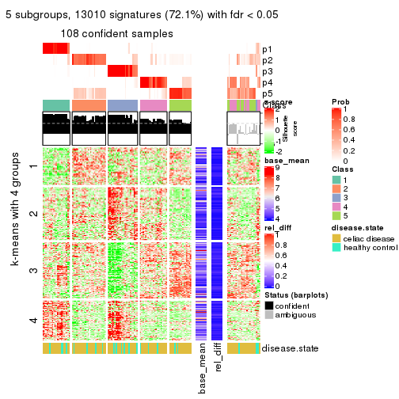</p>

</div>
<div id='tab-SD-skmeans-get-signatures-5'>
<pre><code class="r">get_signatures(res, k = 6)
</code></pre>

<p></p>

</div>
</div>


Signature heatmaps where rows are not scaled:


<script>
$( function() {
	$( '#tabs-SD-skmeans-get-signatures-no-scale' ).tabs();
} );
</script>
<div id='tabs-SD-skmeans-get-signatures-no-scale'>
<ul>
<li><a href='#tab-SD-skmeans-get-signatures-no-scale-1'>k = 2</a></li>
<li><a href='#tab-SD-skmeans-get-signatures-no-scale-2'>k = 3</a></li>
<li><a href='#tab-SD-skmeans-get-signatures-no-scale-3'>k = 4</a></li>
<li><a href='#tab-SD-skmeans-get-signatures-no-scale-4'>k = 5</a></li>
<li><a href='#tab-SD-skmeans-get-signatures-no-scale-5'>k = 6</a></li>
</ul>
<div id='tab-SD-skmeans-get-signatures-no-scale-1'>
<pre><code class="r">get_signatures(res, k = 2, scale_rows = FALSE)
</code></pre>

<p></p>

</div>
<div id='tab-SD-skmeans-get-signatures-no-scale-2'>
<pre><code class="r">get_signatures(res, k = 3, scale_rows = FALSE)
</code></pre>

<p>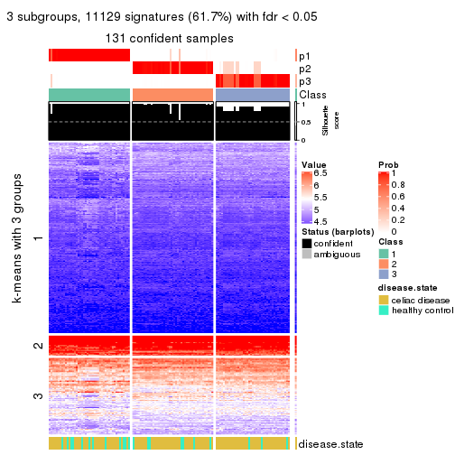</p>

</div>
<div id='tab-SD-skmeans-get-signatures-no-scale-3'>
<pre><code class="r">get_signatures(res, k = 4, scale_rows = FALSE)
</code></pre>

<p></p>

</div>
<div id='tab-SD-skmeans-get-signatures-no-scale-4'>
<pre><code class="r">get_signatures(res, k = 5, scale_rows = FALSE)
</code></pre>

<p></p>

</div>
<div id='tab-SD-skmeans-get-signatures-no-scale-5'>
<pre><code class="r">get_signatures(res, k = 6, scale_rows = FALSE)
</code></pre>

<p></p>

</div>
</div>


Compare the overlap of signatures from different k:

```r
compare_signatures(res)
```


`get_signature()` returns a data frame invisibly. TO get the list of signatures, the function
call should be assigned to a variable explicitly. In following code, if `plot` argument is set
to `FALSE`, no heatmap is plotted while only the differential analysis is performed.

```r
# code only for demonstration
tb = get_signature(res, k = ..., plot = FALSE)
```

An example of the output of `tb` is:

```
#>   which_row         fdr    mean_1    mean_2 scaled_mean_1 scaled_mean_2 km
#> 1        38 0.042760348  8.373488  9.131774    -0.5533452     0.5164555  1
#> 2        40 0.018707592  7.106213  8.469186    -0.6173731     0.5762149  1
#> 3        55 0.019134737 10.221463 11.207825    -0.6159697     0.5749050  1
#> 4        59 0.006059896  5.921854  7.869574    -0.6899429     0.6439467  1
#> 5        60 0.018055526  8.928898 10.211722    -0.6204761     0.5791110  1
#> 6        98 0.009384629 15.714769 14.887706     0.6635654    -0.6193277  2
...
```

The columns in `tb` are:

1. `which_row`: row indices corresponding to the input matrix.
2. `fdr`: FDR for the differential test. 
3. `mean_x`: The mean value in group x.
4. `scaled_mean_x`: The mean value in group x after rows are scaled.
5. `km`: Row groups if k-means clustering is applied to rows.


UMAP plot which shows how samples are separated.


<script>
$( function() {
	$( '#tabs-SD-skmeans-dimension-reduction' ).tabs();
} );
</script>
<div id='tabs-SD-skmeans-dimension-reduction'>
<ul>
<li><a href='#tab-SD-skmeans-dimension-reduction-1'>k = 2</a></li>
<li><a href='#tab-SD-skmeans-dimension-reduction-2'>k = 3</a></li>
<li><a href='#tab-SD-skmeans-dimension-reduction-3'>k = 4</a></li>
<li><a href='#tab-SD-skmeans-dimension-reduction-4'>k = 5</a></li>
<li><a href='#tab-SD-skmeans-dimension-reduction-5'>k = 6</a></li>
</ul>
<div id='tab-SD-skmeans-dimension-reduction-1'>
<pre><code class="r">dimension_reduction(res, k = 2, method = &quot;UMAP&quot;)
</code></pre>

<p></p>

</div>
<div id='tab-SD-skmeans-dimension-reduction-2'>
<pre><code class="r">dimension_reduction(res, k = 3, method = &quot;UMAP&quot;)
</code></pre>

<p></p>

</div>
<div id='tab-SD-skmeans-dimension-reduction-3'>
<pre><code class="r">dimension_reduction(res, k = 4, method = &quot;UMAP&quot;)
</code></pre>

<p></p>

</div>
<div id='tab-SD-skmeans-dimension-reduction-4'>
<pre><code class="r">dimension_reduction(res, k = 5, method = &quot;UMAP&quot;)
</code></pre>

<p></p>

</div>
<div id='tab-SD-skmeans-dimension-reduction-5'>
<pre><code class="r">dimension_reduction(res, k = 6, method = &quot;UMAP&quot;)
</code></pre>

<p></p>

</div>
</div>


Following heatmap shows how subgroups are split when increasing `k`:

```r
collect_classes(res)
```


Test correlation between subgroups and known annotations. If the known
annotation is numeric, one-way ANOVA test is applied, and if the known
annotation is discrete, chi-squared contingency table test is applied.

```r
test_to_known_factors(res)
```

```
#>              n disease.state(p) k
#> SD:skmeans 132           0.0262 2
#> SD:skmeans 131           0.0544 3
#> SD:skmeans 130           0.2165 4
#> SD:skmeans 108           0.7689 5
#> SD:skmeans 111           0.6016 6
```


If matrix rows can be associated to genes, consider to use `GO_Enrichment(res,
...)` to perform function enrichment for the signature genes.


 

---------------------------------------------------


### SD:pam**


The object with results only for a single top-value method and a single partition method 
can be extracted as:

```r
res = res_list["SD", "pam"]
# you can also extract it by
# res = res_list["SD:pam"]
```

A summary of `res` and all the functions that can be applied to it:

```r
res
```

```
#> A 'ConsensusPartition' object with k = 2, 3, 4, 5, 6.
#>   On a matrix with 18032 rows and 132 columns.
#>   Top rows (1000, 2000, 3000, 4000, 5000) are extracted by 'SD' method.
#>   Subgroups are detected by 'pam' method.
#>   Performed in total 1250 partitions by row resampling.
#>   Best k for subgroups seems to be 2.
#> 
#> Following methods can be applied to this 'ConsensusPartition' object:
#>  [1] "cola_report"             "collect_classes"         "collect_plots"          
#>  [4] "collect_stats"           "colnames"                "compare_signatures"     
#>  [7] "consensus_heatmap"       "dimension_reduction"     "functional_enrichment"  
#> [10] "get_anno_col"            "get_anno"                "get_classes"            
#> [13] "get_consensus"           "get_matrix"              "get_membership"         
#> [16] "get_param"               "get_signatures"          "get_stats"              
#> [19] "is_best_k"               "is_stable_k"             "membership_heatmap"     
#> [22] "ncol"                    "nrow"                    "plot_ecdf"              
#> [25] "rownames"                "select_partition_number" "show"                   
#> [28] "suggest_best_k"          "test_to_known_factors"
```

`collect_plots()` function collects all the plots made from `res` for all `k` (number of partitions)
into one single page to provide an easy and fast comparison between different `k`.

```r
collect_plots(res)
```


The plots are:

- The first row: a plot of the ECDF (Empirical cumulative distribution
  function) curves of the consensus matrix for each `k` and the heatmap of
  predicted classes for each `k`.
- The second row: heatmaps of the consensus matrix for each `k`.
- The third row: heatmaps of the membership matrix for each `k`.
- The fouth row: heatmaps of the signatures for each `k`.

All the plots in panels can be made by individual functions and they are
plotted later in this section.

`select_partition_number()` produces several plots showing different
statistics for choosing "optimized" `k`. There are following statistics:

- ECDF curves of the consensus matrix for each `k`;
- 1-PAC. [The PAC
  score](https://en.wikipedia.org/wiki/Consensus_clustering#Over-interpretation_potential_of_consensus_clustering)
  measures the proportion of the ambiguous subgrouping.
- Mean silhouette score.
- Concordance. The mean probability of fiting the consensus class ids in all
  partitions.
- Area increased. Denote $A_k$ as the area under the ECDF curve for current
  `k`, the area increased is defined as $A_k - A_{k-1}$.
- Rand index. The percent of pairs of samples that are both in a same cluster
  or both are not in a same cluster in the partition of k and k-1.
- Jaccard index. The ratio of pairs of samples are both in a same cluster in
  the partition of k and k-1 and the pairs of samples are both in a same
  cluster in the partition k or k-1.

The detailed explanations of these statistics can be found in [the cola
vignette](http://bioconductor.org/packages/devel/bioc/vignettes/cola/inst/doc/cola.html#toc_13).

Generally speaking, lower PAC score, higher mean silhouette score or higher
concordance corresponds to better partition. Rand index and Jaccard index
measure how similar the current partition is compared to partition with `k-1`.
If they are too similar, we won't accept `k` is better than `k-1`.

```r
select_partition_number(res)
```


The numeric values for all these statistics can be obtained by `get_stats()`.

```r
get_stats(res)
```

```
#>   k 1-PAC mean_silhouette concordance area_increased  Rand Jaccard
#> 2 2 1.000           0.992       0.996         0.4064 0.593   0.593
#> 3 3 0.545           0.769       0.859         0.2697 0.965   0.942
#> 4 4 0.868           0.925       0.966         0.2939 0.737   0.544
#> 5 5 0.722           0.640       0.788         0.1461 0.806   0.484
#> 6 6 0.748           0.672       0.860         0.0658 0.851   0.458
```

`suggest_best_k()` suggests the best $k$ based on these statistics. The rules are as follows:

- All $k$ with Jaccard index larger than 0.95 are removed because the increase of
  the partition number does not provides enough extra information. If all $k$ are removed,
  the best $k$ is assigned by `NA`.
- For $k$ with 1-PAC larger than 0.9, the maximal $k$ is taken as the "best k". Other $k$ is called "optional k".
- If it does not fit the second rule. The $k$ with the highest vote of highest
  1-PAC, mean silhouette and concordance is taken as the "best k".

```r
suggest_best_k(res)
```

```
#> [1] 2
```


Following shows the table of the partitions (You need to click the **show/hide
code output** link to see it). The membership matrix (columns with name `p*`)
is inferred by
[`clue::cl_consensus()`](https://www.rdocumentation.org/link/cl_consensus?package=clue)
function with the `SE` method. Basically the value in the membership matrix
represents the probability to belong to a certain group. The finall class
label for an item is determined with the group with highest probability it
belongs to.

In `get_classes()` function, the entropy is calculated from the membership
matrix and the silhouette score is calculated from the consensus matrix.


<script>
$( function() {
	$( '#tabs-SD-pam-get-classes' ).tabs();
} );
</script>
<div id='tabs-SD-pam-get-classes'>
<ul>
<li><a href='#tab-SD-pam-get-classes-1'>k = 2</a></li>
<li><a href='#tab-SD-pam-get-classes-2'>k = 3</a></li>
<li><a href='#tab-SD-pam-get-classes-3'>k = 4</a></li>
<li><a href='#tab-SD-pam-get-classes-4'>k = 5</a></li>
<li><a href='#tab-SD-pam-get-classes-5'>k = 6</a></li>
</ul>

<div id='tab-SD-pam-get-classes-1'>
<p><a id='tab-SD-pam-get-classes-1-a' style='color:#0366d6' href='#'>show/hide code output</a></p>
<pre><code class="r">cbind(get_classes(res, k = 2), get_membership(res, k = 2))
</code></pre>

<pre><code>#&gt;           class entropy silhouette    p1    p2
#&gt; GSM289470     1  0.0000      0.991 1.000 0.000
#&gt; GSM289471     1  0.0000      0.991 1.000 0.000
#&gt; GSM289472     2  0.0000      0.998 0.000 1.000
#&gt; GSM289473     2  0.0000      0.998 0.000 1.000
#&gt; GSM289474     2  0.0000      0.998 0.000 1.000
#&gt; GSM289475     2  0.0000      0.998 0.000 1.000
#&gt; GSM289476     1  0.0000      0.991 1.000 0.000
#&gt; GSM289477     2  0.0000      0.998 0.000 1.000
#&gt; GSM289478     2  0.0000      0.998 0.000 1.000
#&gt; GSM289479     2  0.0000      0.998 0.000 1.000
#&gt; GSM289480     2  0.0000      0.998 0.000 1.000
#&gt; GSM289481     2  0.0000      0.998 0.000 1.000
#&gt; GSM289482     2  0.0000      0.998 0.000 1.000
#&gt; GSM289483     2  0.0000      0.998 0.000 1.000
#&gt; GSM289484     2  0.0000      0.998 0.000 1.000
#&gt; GSM289485     2  0.0000      0.998 0.000 1.000
#&gt; GSM289486     1  0.0000      0.991 1.000 0.000
#&gt; GSM289487     2  0.0000      0.998 0.000 1.000
#&gt; GSM289488     2  0.0000      0.998 0.000 1.000
#&gt; GSM289489     2  0.0000      0.998 0.000 1.000
#&gt; GSM289490     2  0.0000      0.998 0.000 1.000
#&gt; GSM289491     2  0.0000      0.998 0.000 1.000
#&gt; GSM289492     2  0.0000      0.998 0.000 1.000
#&gt; GSM289493     2  0.0000      0.998 0.000 1.000
#&gt; GSM289494     2  0.0376      0.994 0.004 0.996
#&gt; GSM289495     2  0.0000      0.998 0.000 1.000
#&gt; GSM289496     2  0.0000      0.998 0.000 1.000
#&gt; GSM289497     2  0.0000      0.998 0.000 1.000
#&gt; GSM289498     2  0.0000      0.998 0.000 1.000
#&gt; GSM289499     2  0.0000      0.998 0.000 1.000
#&gt; GSM289500     1  0.0000      0.991 1.000 0.000
#&gt; GSM289501     2  0.0000      0.998 0.000 1.000
#&gt; GSM289502     2  0.0000      0.998 0.000 1.000
#&gt; GSM289503     2  0.0000      0.998 0.000 1.000
#&gt; GSM289504     2  0.0000      0.998 0.000 1.000
#&gt; GSM289505     2  0.0000      0.998 0.000 1.000
#&gt; GSM289506     2  0.0000      0.998 0.000 1.000
#&gt; GSM289507     2  0.0000      0.998 0.000 1.000
#&gt; GSM289508     2  0.2043      0.967 0.032 0.968
#&gt; GSM289509     1  0.0000      0.991 1.000 0.000
#&gt; GSM289510     2  0.0000      0.998 0.000 1.000
#&gt; GSM289511     2  0.0000      0.998 0.000 1.000
#&gt; GSM289512     1  0.0000      0.991 1.000 0.000
#&gt; GSM289513     2  0.0000      0.998 0.000 1.000
#&gt; GSM289514     2  0.0000      0.998 0.000 1.000
#&gt; GSM289515     2  0.0000      0.998 0.000 1.000
#&gt; GSM289516     2  0.0000      0.998 0.000 1.000
#&gt; GSM289517     2  0.0000      0.998 0.000 1.000
#&gt; GSM289518     2  0.0000      0.998 0.000 1.000
#&gt; GSM289519     2  0.0000      0.998 0.000 1.000
#&gt; GSM289520     2  0.0000      0.998 0.000 1.000
#&gt; GSM289521     2  0.2948      0.947 0.052 0.948
#&gt; GSM289522     2  0.0000      0.998 0.000 1.000
#&gt; GSM289523     1  0.0000      0.991 1.000 0.000
#&gt; GSM289524     2  0.0000      0.998 0.000 1.000
#&gt; GSM289525     2  0.0000      0.998 0.000 1.000
#&gt; GSM289526     1  0.6973      0.774 0.812 0.188
#&gt; GSM289527     2  0.0000      0.998 0.000 1.000
#&gt; GSM289528     2  0.0000      0.998 0.000 1.000
#&gt; GSM289529     2  0.0000      0.998 0.000 1.000
#&gt; GSM289530     2  0.0000      0.998 0.000 1.000
#&gt; GSM289531     2  0.0000      0.998 0.000 1.000
#&gt; GSM289532     2  0.0000      0.998 0.000 1.000
#&gt; GSM289533     2  0.0000      0.998 0.000 1.000
#&gt; GSM289534     1  0.0000      0.991 1.000 0.000
#&gt; GSM289535     2  0.0000      0.998 0.000 1.000
#&gt; GSM289536     1  0.0000      0.991 1.000 0.000
#&gt; GSM289537     2  0.0000      0.998 0.000 1.000
#&gt; GSM289538     2  0.0000      0.998 0.000 1.000
#&gt; GSM289539     2  0.0000      0.998 0.000 1.000
#&gt; GSM289540     2  0.2043      0.967 0.032 0.968
#&gt; GSM289541     1  0.1633      0.972 0.976 0.024
#&gt; GSM289542     2  0.1184      0.983 0.016 0.984
#&gt; GSM289543     2  0.0000      0.998 0.000 1.000
#&gt; GSM289544     1  0.0000      0.991 1.000 0.000
#&gt; GSM289545     2  0.0000      0.998 0.000 1.000
#&gt; GSM289546     2  0.0000      0.998 0.000 1.000
#&gt; GSM289547     2  0.0000      0.998 0.000 1.000
#&gt; GSM289548     1  0.0000      0.991 1.000 0.000
#&gt; GSM289549     1  0.0000      0.991 1.000 0.000
#&gt; GSM289550     1  0.0000      0.991 1.000 0.000
#&gt; GSM289551     1  0.0000      0.991 1.000 0.000
#&gt; GSM289552     1  0.0000      0.991 1.000 0.000
#&gt; GSM289553     1  0.0000      0.991 1.000 0.000
#&gt; GSM289554     2  0.0000      0.998 0.000 1.000
#&gt; GSM289555     2  0.0000      0.998 0.000 1.000
#&gt; GSM289556     1  0.0000      0.991 1.000 0.000
#&gt; GSM289557     2  0.0000      0.998 0.000 1.000
#&gt; GSM289558     2  0.0000      0.998 0.000 1.000
#&gt; GSM289559     1  0.0000      0.991 1.000 0.000
#&gt; GSM289560     2  0.0000      0.998 0.000 1.000
#&gt; GSM289561     2  0.0000      0.998 0.000 1.000
#&gt; GSM289562     1  0.0000      0.991 1.000 0.000
#&gt; GSM289563     1  0.0000      0.991 1.000 0.000
#&gt; GSM289564     2  0.0000      0.998 0.000 1.000
#&gt; GSM289565     1  0.0376      0.988 0.996 0.004
#&gt; GSM289566     1  0.0000      0.991 1.000 0.000
#&gt; GSM289567     2  0.0000      0.998 0.000 1.000
#&gt; GSM289568     2  0.0000      0.998 0.000 1.000
#&gt; GSM289569     2  0.0000      0.998 0.000 1.000
#&gt; GSM289570     2  0.0000      0.998 0.000 1.000
#&gt; GSM289571     2  0.0000      0.998 0.000 1.000
#&gt; GSM289572     2  0.0000      0.998 0.000 1.000
#&gt; GSM289573     2  0.0000      0.998 0.000 1.000
#&gt; GSM289574     2  0.0000      0.998 0.000 1.000
#&gt; GSM289575     2  0.0000      0.998 0.000 1.000
#&gt; GSM289576     2  0.0000      0.998 0.000 1.000
#&gt; GSM289577     2  0.0000      0.998 0.000 1.000
#&gt; GSM289578     2  0.0000      0.998 0.000 1.000
#&gt; GSM289579     2  0.0000      0.998 0.000 1.000
#&gt; GSM289580     1  0.0000      0.991 1.000 0.000
#&gt; GSM289581     1  0.1633      0.973 0.976 0.024
#&gt; GSM289582     2  0.0000      0.998 0.000 1.000
#&gt; GSM289583     2  0.0000      0.998 0.000 1.000
#&gt; GSM289584     2  0.0000      0.998 0.000 1.000
#&gt; GSM289585     2  0.0000      0.998 0.000 1.000
#&gt; GSM289586     1  0.2043      0.965 0.968 0.032
#&gt; GSM289587     1  0.0000      0.991 1.000 0.000
#&gt; GSM289588     1  0.0000      0.991 1.000 0.000
#&gt; GSM289589     1  0.0000      0.991 1.000 0.000
#&gt; GSM289590     1  0.0000      0.991 1.000 0.000
#&gt; GSM289591     1  0.0000      0.991 1.000 0.000
#&gt; GSM289592     2  0.0000      0.998 0.000 1.000
#&gt; GSM289593     1  0.0000      0.991 1.000 0.000
#&gt; GSM289594     2  0.0000      0.998 0.000 1.000
#&gt; GSM289595     1  0.0000      0.991 1.000 0.000
#&gt; GSM289596     2  0.0000      0.998 0.000 1.000
#&gt; GSM289597     2  0.0000      0.998 0.000 1.000
#&gt; GSM289598     2  0.4022      0.916 0.080 0.920
#&gt; GSM289599     2  0.0000      0.998 0.000 1.000
#&gt; GSM289600     1  0.0000      0.991 1.000 0.000
#&gt; GSM289601     1  0.2423      0.957 0.960 0.040
</code></pre>

<script>
$('#tab-SD-pam-get-classes-1-a').parent().next().next().hide();
$('#tab-SD-pam-get-classes-1-a').click(function(){
  $('#tab-SD-pam-get-classes-1-a').parent().next().next().toggle();
  return(false);
});
</script>
</div>

<div id='tab-SD-pam-get-classes-2'>
<p><a id='tab-SD-pam-get-classes-2-a' style='color:#0366d6' href='#'>show/hide code output</a></p>
<pre><code class="r">cbind(get_classes(res, k = 3), get_membership(res, k = 3))
</code></pre>

<pre><code>#&gt;           class entropy silhouette    p1    p2    p3
#&gt; GSM289470     1  0.3116      0.866 0.892 0.000 0.108
#&gt; GSM289471     3  0.0000      0.993 0.000 0.000 1.000
#&gt; GSM289472     2  0.5882      0.666 0.348 0.652 0.000
#&gt; GSM289473     2  0.5706      0.671 0.320 0.680 0.000
#&gt; GSM289474     2  0.5327      0.716 0.272 0.728 0.000
#&gt; GSM289475     2  0.5835      0.671 0.340 0.660 0.000
#&gt; GSM289476     3  0.0000      0.993 0.000 0.000 1.000
#&gt; GSM289477     2  0.5621      0.692 0.308 0.692 0.000
#&gt; GSM289478     2  0.6168      0.615 0.412 0.588 0.000
#&gt; GSM289479     2  0.6192      0.610 0.420 0.580 0.000
#&gt; GSM289480     2  0.5016      0.723 0.240 0.760 0.000
#&gt; GSM289481     2  0.1411      0.815 0.036 0.964 0.000
#&gt; GSM289482     2  0.6168      0.615 0.412 0.588 0.000
#&gt; GSM289483     2  0.6168      0.615 0.412 0.588 0.000
#&gt; GSM289484     2  0.5678      0.673 0.316 0.684 0.000
#&gt; GSM289485     2  0.6180      0.613 0.416 0.584 0.000
#&gt; GSM289486     1  0.3116      0.866 0.892 0.000 0.108
#&gt; GSM289487     2  0.0424      0.822 0.008 0.992 0.000
#&gt; GSM289488     2  0.4346      0.760 0.184 0.816 0.000
#&gt; GSM289489     2  0.0424      0.822 0.008 0.992 0.000
#&gt; GSM289490     2  0.0000      0.824 0.000 1.000 0.000
#&gt; GSM289491     2  0.0000      0.824 0.000 1.000 0.000
#&gt; GSM289492     2  0.0000      0.824 0.000 1.000 0.000
#&gt; GSM289493     2  0.0000      0.824 0.000 1.000 0.000
#&gt; GSM289494     2  0.6111      0.322 0.000 0.604 0.396
#&gt; GSM289495     2  0.0000      0.824 0.000 1.000 0.000
#&gt; GSM289496     2  0.0000      0.824 0.000 1.000 0.000
#&gt; GSM289497     2  0.0000      0.824 0.000 1.000 0.000
#&gt; GSM289498     2  0.0424      0.819 0.000 0.992 0.008
#&gt; GSM289499     2  0.0000      0.824 0.000 1.000 0.000
#&gt; GSM289500     3  0.0000      0.993 0.000 0.000 1.000
#&gt; GSM289501     2  0.0000      0.824 0.000 1.000 0.000
#&gt; GSM289502     2  0.0000      0.824 0.000 1.000 0.000
#&gt; GSM289503     2  0.0000      0.824 0.000 1.000 0.000
#&gt; GSM289504     2  0.0000      0.824 0.000 1.000 0.000
#&gt; GSM289505     2  0.0000      0.824 0.000 1.000 0.000
#&gt; GSM289506     2  0.0000      0.824 0.000 1.000 0.000
#&gt; GSM289507     2  0.0000      0.824 0.000 1.000 0.000
#&gt; GSM289508     2  0.2537      0.798 0.080 0.920 0.000
#&gt; GSM289509     3  0.2165      0.919 0.064 0.000 0.936
#&gt; GSM289510     2  0.6192      0.610 0.420 0.580 0.000
#&gt; GSM289511     2  0.6192      0.610 0.420 0.580 0.000
#&gt; GSM289512     3  0.0000      0.993 0.000 0.000 1.000
#&gt; GSM289513     2  0.6192      0.610 0.420 0.580 0.000
#&gt; GSM289514     2  0.6192      0.610 0.420 0.580 0.000
#&gt; GSM289515     2  0.6192      0.610 0.420 0.580 0.000
#&gt; GSM289516     2  0.6192      0.610 0.420 0.580 0.000
#&gt; GSM289517     2  0.6192      0.610 0.420 0.580 0.000
#&gt; GSM289518     2  0.6192      0.610 0.420 0.580 0.000
#&gt; GSM289519     2  0.6192      0.610 0.420 0.580 0.000
#&gt; GSM289520     2  0.6192      0.610 0.420 0.580 0.000
#&gt; GSM289521     2  0.6192      0.610 0.420 0.580 0.000
#&gt; GSM289522     2  0.6192      0.610 0.420 0.580 0.000
#&gt; GSM289523     3  0.0000      0.993 0.000 0.000 1.000
#&gt; GSM289524     2  0.6192      0.610 0.420 0.580 0.000
#&gt; GSM289525     2  0.6192      0.610 0.420 0.580 0.000
#&gt; GSM289526     1  0.3619      0.603 0.864 0.136 0.000
#&gt; GSM289527     2  0.6192      0.610 0.420 0.580 0.000
#&gt; GSM289528     2  0.5650      0.674 0.312 0.688 0.000
#&gt; GSM289529     2  0.6192      0.610 0.420 0.580 0.000
#&gt; GSM289530     2  0.0424      0.822 0.008 0.992 0.000
#&gt; GSM289531     2  0.0000      0.824 0.000 1.000 0.000
#&gt; GSM289532     2  0.6034      0.724 0.068 0.780 0.152
#&gt; GSM289533     2  0.0424      0.822 0.008 0.992 0.000
#&gt; GSM289534     3  0.0000      0.993 0.000 0.000 1.000
#&gt; GSM289535     2  0.0000      0.824 0.000 1.000 0.000
#&gt; GSM289536     3  0.0000      0.993 0.000 0.000 1.000
#&gt; GSM289537     2  0.0000      0.824 0.000 1.000 0.000
#&gt; GSM289538     2  0.0000      0.824 0.000 1.000 0.000
#&gt; GSM289539     2  0.0592      0.821 0.012 0.988 0.000
#&gt; GSM289540     2  0.1529      0.813 0.040 0.960 0.000
#&gt; GSM289541     1  0.3769      0.853 0.880 0.016 0.104
#&gt; GSM289542     2  0.3116      0.787 0.108 0.892 0.000
#&gt; GSM289543     2  0.0000      0.824 0.000 1.000 0.000
#&gt; GSM289544     1  0.0747      0.793 0.984 0.000 0.016
#&gt; GSM289545     2  0.0000      0.824 0.000 1.000 0.000
#&gt; GSM289546     2  0.5327      0.702 0.272 0.728 0.000
#&gt; GSM289547     2  0.0000      0.824 0.000 1.000 0.000
#&gt; GSM289548     1  0.3116      0.866 0.892 0.000 0.108
#&gt; GSM289549     1  0.3116      0.866 0.892 0.000 0.108
#&gt; GSM289550     1  0.5098      0.714 0.752 0.000 0.248
#&gt; GSM289551     3  0.0000      0.993 0.000 0.000 1.000
#&gt; GSM289552     1  0.6008      0.456 0.628 0.000 0.372
#&gt; GSM289553     1  0.3116      0.866 0.892 0.000 0.108
#&gt; GSM289554     2  0.0000      0.824 0.000 1.000 0.000
#&gt; GSM289555     2  0.0000      0.824 0.000 1.000 0.000
#&gt; GSM289556     1  0.3116      0.866 0.892 0.000 0.108
#&gt; GSM289557     2  0.0000      0.824 0.000 1.000 0.000
#&gt; GSM289558     2  0.0000      0.824 0.000 1.000 0.000
#&gt; GSM289559     1  0.3192      0.863 0.888 0.000 0.112
#&gt; GSM289560     2  0.0000      0.824 0.000 1.000 0.000
#&gt; GSM289561     2  0.0000      0.824 0.000 1.000 0.000
#&gt; GSM289562     1  0.3116      0.866 0.892 0.000 0.108
#&gt; GSM289563     1  0.3116      0.866 0.892 0.000 0.108
#&gt; GSM289564     2  0.0000      0.824 0.000 1.000 0.000
#&gt; GSM289565     1  0.8727      0.378 0.588 0.236 0.176
#&gt; GSM289566     1  0.3116      0.866 0.892 0.000 0.108
#&gt; GSM289567     2  0.6192      0.610 0.420 0.580 0.000
#&gt; GSM289568     2  0.6192      0.610 0.420 0.580 0.000
#&gt; GSM289569     2  0.6192      0.610 0.420 0.580 0.000
#&gt; GSM289570     2  0.6192      0.610 0.420 0.580 0.000
#&gt; GSM289571     2  0.0000      0.824 0.000 1.000 0.000
#&gt; GSM289572     2  0.0000      0.824 0.000 1.000 0.000
#&gt; GSM289573     2  0.0000      0.824 0.000 1.000 0.000
#&gt; GSM289574     2  0.0000      0.824 0.000 1.000 0.000
#&gt; GSM289575     2  0.0000      0.824 0.000 1.000 0.000
#&gt; GSM289576     2  0.0000      0.824 0.000 1.000 0.000
#&gt; GSM289577     2  0.0000      0.824 0.000 1.000 0.000
#&gt; GSM289578     2  0.0000      0.824 0.000 1.000 0.000
#&gt; GSM289579     2  0.0000      0.824 0.000 1.000 0.000
#&gt; GSM289580     3  0.0000      0.993 0.000 0.000 1.000
#&gt; GSM289581     1  0.3129      0.774 0.904 0.008 0.088
#&gt; GSM289582     2  0.3116      0.787 0.108 0.892 0.000
#&gt; GSM289583     2  0.0000      0.824 0.000 1.000 0.000
#&gt; GSM289584     2  0.0000      0.824 0.000 1.000 0.000
#&gt; GSM289585     2  0.0000      0.824 0.000 1.000 0.000
#&gt; GSM289586     1  0.0000      0.779 1.000 0.000 0.000
#&gt; GSM289587     1  0.3116      0.866 0.892 0.000 0.108
#&gt; GSM289588     3  0.0000      0.993 0.000 0.000 1.000
#&gt; GSM289589     1  0.3116      0.866 0.892 0.000 0.108
#&gt; GSM289590     1  0.5216      0.696 0.740 0.000 0.260
#&gt; GSM289591     1  0.6192      0.313 0.580 0.000 0.420
#&gt; GSM289592     2  0.0000      0.824 0.000 1.000 0.000
#&gt; GSM289593     3  0.0000      0.993 0.000 0.000 1.000
#&gt; GSM289594     2  0.0000      0.824 0.000 1.000 0.000
#&gt; GSM289595     1  0.5216      0.696 0.740 0.000 0.260
#&gt; GSM289596     2  0.0000      0.824 0.000 1.000 0.000
#&gt; GSM289597     2  0.6192      0.610 0.420 0.580 0.000
#&gt; GSM289598     2  0.4994      0.718 0.024 0.816 0.160
#&gt; GSM289599     2  0.0000      0.824 0.000 1.000 0.000
#&gt; GSM289600     1  0.3116      0.866 0.892 0.000 0.108
#&gt; GSM289601     1  0.1289      0.748 0.968 0.032 0.000
</code></pre>

<script>
$('#tab-SD-pam-get-classes-2-a').parent().next().next().hide();
$('#tab-SD-pam-get-classes-2-a').click(function(){
  $('#tab-SD-pam-get-classes-2-a').parent().next().next().toggle();
  return(false);
});
</script>
</div>

<div id='tab-SD-pam-get-classes-3'>
<p><a id='tab-SD-pam-get-classes-3-a' style='color:#0366d6' href='#'>show/hide code output</a></p>
<pre><code class="r">cbind(get_classes(res, k = 4), get_membership(res, k = 4))
</code></pre>

<pre><code>#&gt;           class entropy silhouette    p1    p2    p3    p4
#&gt; GSM289470     1  0.0000      0.981 1.000 0.000 0.000 0.000
#&gt; GSM289471     3  0.0000      0.988 0.000 0.000 1.000 0.000
#&gt; GSM289472     4  0.4356      0.598 0.000 0.292 0.000 0.708
#&gt; GSM289473     2  0.4134      0.686 0.000 0.740 0.000 0.260
#&gt; GSM289474     4  0.1022      0.900 0.000 0.032 0.000 0.968
#&gt; GSM289475     4  0.3907      0.707 0.000 0.232 0.000 0.768
#&gt; GSM289476     3  0.0000      0.988 0.000 0.000 1.000 0.000
#&gt; GSM289477     4  0.4040      0.688 0.000 0.248 0.000 0.752
#&gt; GSM289478     4  0.3688      0.732 0.000 0.208 0.000 0.792
#&gt; GSM289479     4  0.0000      0.922 0.000 0.000 0.000 1.000
#&gt; GSM289480     2  0.2973      0.841 0.000 0.856 0.000 0.144
#&gt; GSM289481     2  0.1792      0.918 0.000 0.932 0.000 0.068
#&gt; GSM289482     4  0.2868      0.811 0.000 0.136 0.000 0.864
#&gt; GSM289483     4  0.2868      0.811 0.000 0.136 0.000 0.864
#&gt; GSM289484     2  0.2814      0.849 0.000 0.868 0.000 0.132
#&gt; GSM289485     4  0.1557      0.883 0.000 0.056 0.000 0.944
#&gt; GSM289486     1  0.0000      0.981 1.000 0.000 0.000 0.000
#&gt; GSM289487     2  0.0592      0.955 0.000 0.984 0.000 0.016
#&gt; GSM289488     4  0.3726      0.731 0.000 0.212 0.000 0.788
#&gt; GSM289489     2  0.3649      0.757 0.000 0.796 0.000 0.204
#&gt; GSM289490     2  0.0000      0.966 0.000 1.000 0.000 0.000
#&gt; GSM289491     2  0.0000      0.966 0.000 1.000 0.000 0.000
#&gt; GSM289492     2  0.0000      0.966 0.000 1.000 0.000 0.000
#&gt; GSM289493     2  0.0000      0.966 0.000 1.000 0.000 0.000
#&gt; GSM289494     2  0.1302      0.935 0.000 0.956 0.044 0.000
#&gt; GSM289495     2  0.0000      0.966 0.000 1.000 0.000 0.000
#&gt; GSM289496     2  0.0000      0.966 0.000 1.000 0.000 0.000
#&gt; GSM289497     2  0.0000      0.966 0.000 1.000 0.000 0.000
#&gt; GSM289498     2  0.0000      0.966 0.000 1.000 0.000 0.000
#&gt; GSM289499     2  0.0000      0.966 0.000 1.000 0.000 0.000
#&gt; GSM289500     3  0.0000      0.988 0.000 0.000 1.000 0.000
#&gt; GSM289501     2  0.0000      0.966 0.000 1.000 0.000 0.000
#&gt; GSM289502     2  0.0000      0.966 0.000 1.000 0.000 0.000
#&gt; GSM289503     2  0.0000      0.966 0.000 1.000 0.000 0.000
#&gt; GSM289504     2  0.0000      0.966 0.000 1.000 0.000 0.000
#&gt; GSM289505     2  0.0000      0.966 0.000 1.000 0.000 0.000
#&gt; GSM289506     2  0.0000      0.966 0.000 1.000 0.000 0.000
#&gt; GSM289507     2  0.0000      0.966 0.000 1.000 0.000 0.000
#&gt; GSM289508     2  0.1211      0.938 0.000 0.960 0.000 0.040
#&gt; GSM289509     3  0.2814      0.846 0.132 0.000 0.868 0.000
#&gt; GSM289510     4  0.0000      0.922 0.000 0.000 0.000 1.000
#&gt; GSM289511     4  0.0000      0.922 0.000 0.000 0.000 1.000
#&gt; GSM289512     3  0.0000      0.988 0.000 0.000 1.000 0.000
#&gt; GSM289513     4  0.0000      0.922 0.000 0.000 0.000 1.000
#&gt; GSM289514     4  0.0000      0.922 0.000 0.000 0.000 1.000
#&gt; GSM289515     4  0.0000      0.922 0.000 0.000 0.000 1.000
#&gt; GSM289516     4  0.0000      0.922 0.000 0.000 0.000 1.000
#&gt; GSM289517     4  0.0000      0.922 0.000 0.000 0.000 1.000
#&gt; GSM289518     4  0.0000      0.922 0.000 0.000 0.000 1.000
#&gt; GSM289519     4  0.0000      0.922 0.000 0.000 0.000 1.000
#&gt; GSM289520     4  0.0000      0.922 0.000 0.000 0.000 1.000
#&gt; GSM289521     4  0.0000      0.922 0.000 0.000 0.000 1.000
#&gt; GSM289522     4  0.0000      0.922 0.000 0.000 0.000 1.000
#&gt; GSM289523     3  0.0000      0.988 0.000 0.000 1.000 0.000
#&gt; GSM289524     4  0.0000      0.922 0.000 0.000 0.000 1.000
#&gt; GSM289525     4  0.0000      0.922 0.000 0.000 0.000 1.000
#&gt; GSM289526     4  0.1940      0.868 0.076 0.000 0.000 0.924
#&gt; GSM289527     4  0.0000      0.922 0.000 0.000 0.000 1.000
#&gt; GSM289528     2  0.2760      0.854 0.000 0.872 0.000 0.128
#&gt; GSM289529     4  0.0000      0.922 0.000 0.000 0.000 1.000
#&gt; GSM289530     2  0.2868      0.843 0.000 0.864 0.000 0.136
#&gt; GSM289531     2  0.0817      0.950 0.000 0.976 0.000 0.024
#&gt; GSM289532     2  0.4661      0.451 0.000 0.652 0.000 0.348
#&gt; GSM289533     2  0.2760      0.848 0.000 0.872 0.000 0.128
#&gt; GSM289534     3  0.0000      0.988 0.000 0.000 1.000 0.000
#&gt; GSM289535     2  0.0000      0.966 0.000 1.000 0.000 0.000
#&gt; GSM289536     3  0.0000      0.988 0.000 0.000 1.000 0.000
#&gt; GSM289537     2  0.0000      0.966 0.000 1.000 0.000 0.000
#&gt; GSM289538     2  0.0000      0.966 0.000 1.000 0.000 0.000
#&gt; GSM289539     2  0.0336      0.961 0.000 0.992 0.000 0.008
#&gt; GSM289540     2  0.1211      0.938 0.000 0.960 0.000 0.040
#&gt; GSM289541     1  0.3895      0.780 0.832 0.036 0.000 0.132
#&gt; GSM289542     2  0.1557      0.925 0.000 0.944 0.000 0.056
#&gt; GSM289543     2  0.0000      0.966 0.000 1.000 0.000 0.000
#&gt; GSM289544     4  0.3649      0.734 0.204 0.000 0.000 0.796
#&gt; GSM289545     2  0.0000      0.966 0.000 1.000 0.000 0.000
#&gt; GSM289546     2  0.2589      0.866 0.000 0.884 0.000 0.116
#&gt; GSM289547     2  0.0000      0.966 0.000 1.000 0.000 0.000
#&gt; GSM289548     1  0.0000      0.981 1.000 0.000 0.000 0.000
#&gt; GSM289549     1  0.0000      0.981 1.000 0.000 0.000 0.000
#&gt; GSM289550     1  0.0000      0.981 1.000 0.000 0.000 0.000
#&gt; GSM289551     3  0.0000      0.988 0.000 0.000 1.000 0.000
#&gt; GSM289552     1  0.0000      0.981 1.000 0.000 0.000 0.000
#&gt; GSM289553     1  0.0000      0.981 1.000 0.000 0.000 0.000
#&gt; GSM289554     2  0.0000      0.966 0.000 1.000 0.000 0.000
#&gt; GSM289555     2  0.0000      0.966 0.000 1.000 0.000 0.000
#&gt; GSM289556     1  0.0000      0.981 1.000 0.000 0.000 0.000
#&gt; GSM289557     2  0.0000      0.966 0.000 1.000 0.000 0.000
#&gt; GSM289558     2  0.0000      0.966 0.000 1.000 0.000 0.000
#&gt; GSM289559     1  0.0000      0.981 1.000 0.000 0.000 0.000
#&gt; GSM289560     2  0.0000      0.966 0.000 1.000 0.000 0.000
#&gt; GSM289561     2  0.0000      0.966 0.000 1.000 0.000 0.000
#&gt; GSM289562     1  0.0000      0.981 1.000 0.000 0.000 0.000
#&gt; GSM289563     1  0.0000      0.981 1.000 0.000 0.000 0.000
#&gt; GSM289564     2  0.0000      0.966 0.000 1.000 0.000 0.000
#&gt; GSM289565     1  0.0707      0.954 0.980 0.020 0.000 0.000
#&gt; GSM289566     1  0.2081      0.882 0.916 0.000 0.000 0.084
#&gt; GSM289567     4  0.0000      0.922 0.000 0.000 0.000 1.000
#&gt; GSM289568     4  0.0000      0.922 0.000 0.000 0.000 1.000
#&gt; GSM289569     4  0.0000      0.922 0.000 0.000 0.000 1.000
#&gt; GSM289570     4  0.0000      0.922 0.000 0.000 0.000 1.000
#&gt; GSM289571     2  0.0000      0.966 0.000 1.000 0.000 0.000
#&gt; GSM289572     2  0.0000      0.966 0.000 1.000 0.000 0.000
#&gt; GSM289573     2  0.0000      0.966 0.000 1.000 0.000 0.000
#&gt; GSM289574     2  0.0000      0.966 0.000 1.000 0.000 0.000
#&gt; GSM289575     2  0.0000      0.966 0.000 1.000 0.000 0.000
#&gt; GSM289576     2  0.0000      0.966 0.000 1.000 0.000 0.000
#&gt; GSM289577     2  0.0000      0.966 0.000 1.000 0.000 0.000
#&gt; GSM289578     2  0.0000      0.966 0.000 1.000 0.000 0.000
#&gt; GSM289579     2  0.0000      0.966 0.000 1.000 0.000 0.000
#&gt; GSM289580     3  0.0000      0.988 0.000 0.000 1.000 0.000
#&gt; GSM289581     4  0.2408      0.837 0.104 0.000 0.000 0.896
#&gt; GSM289582     4  0.3528      0.743 0.000 0.192 0.000 0.808
#&gt; GSM289583     2  0.0000      0.966 0.000 1.000 0.000 0.000
#&gt; GSM289584     2  0.0000      0.966 0.000 1.000 0.000 0.000
#&gt; GSM289585     2  0.0000      0.966 0.000 1.000 0.000 0.000
#&gt; GSM289586     4  0.0000      0.922 0.000 0.000 0.000 1.000
#&gt; GSM289587     1  0.0000      0.981 1.000 0.000 0.000 0.000
#&gt; GSM289588     3  0.0000      0.988 0.000 0.000 1.000 0.000
#&gt; GSM289589     1  0.0000      0.981 1.000 0.000 0.000 0.000
#&gt; GSM289590     1  0.0000      0.981 1.000 0.000 0.000 0.000
#&gt; GSM289591     1  0.0000      0.981 1.000 0.000 0.000 0.000
#&gt; GSM289592     2  0.0000      0.966 0.000 1.000 0.000 0.000
#&gt; GSM289593     3  0.0000      0.988 0.000 0.000 1.000 0.000
#&gt; GSM289594     2  0.0000      0.966 0.000 1.000 0.000 0.000
#&gt; GSM289595     1  0.0000      0.981 1.000 0.000 0.000 0.000
#&gt; GSM289596     2  0.0000      0.966 0.000 1.000 0.000 0.000
#&gt; GSM289597     4  0.0000      0.922 0.000 0.000 0.000 1.000
#&gt; GSM289598     2  0.0592      0.955 0.016 0.984 0.000 0.000
#&gt; GSM289599     2  0.0000      0.966 0.000 1.000 0.000 0.000
#&gt; GSM289600     1  0.0000      0.981 1.000 0.000 0.000 0.000
#&gt; GSM289601     4  0.0000      0.922 0.000 0.000 0.000 1.000
</code></pre>

<script>
$('#tab-SD-pam-get-classes-3-a').parent().next().next().hide();
$('#tab-SD-pam-get-classes-3-a').click(function(){
  $('#tab-SD-pam-get-classes-3-a').parent().next().next().toggle();
  return(false);
});
</script>
</div>

<div id='tab-SD-pam-get-classes-4'>
<p><a id='tab-SD-pam-get-classes-4-a' style='color:#0366d6' href='#'>show/hide code output</a></p>
<pre><code class="r">cbind(get_classes(res, k = 5), get_membership(res, k = 5))
</code></pre>

<pre><code>#&gt;           class entropy silhouette    p1    p2    p3    p4    p5
#&gt; GSM289470     1  0.0000      0.961 1.000 0.000 0.000 0.000 0.000
#&gt; GSM289471     3  0.0000      0.962 0.000 0.000 1.000 0.000 0.000
#&gt; GSM289472     5  0.4201      0.451 0.000 0.408 0.000 0.000 0.592
#&gt; GSM289473     4  0.2722      0.763 0.000 0.108 0.000 0.872 0.020
#&gt; GSM289474     4  0.3421      0.693 0.000 0.204 0.000 0.788 0.008
#&gt; GSM289475     5  0.4201      0.451 0.000 0.408 0.000 0.000 0.592
#&gt; GSM289476     3  0.0000      0.962 0.000 0.000 1.000 0.000 0.000
#&gt; GSM289477     2  0.5297     -0.230 0.000 0.580 0.000 0.360 0.060
#&gt; GSM289478     5  0.4201      0.451 0.000 0.408 0.000 0.000 0.592
#&gt; GSM289479     4  0.4201      0.516 0.000 0.408 0.000 0.592 0.000
#&gt; GSM289480     5  0.5948      0.362 0.000 0.408 0.000 0.108 0.484
#&gt; GSM289481     5  0.6381      0.296 0.000 0.364 0.000 0.172 0.464
#&gt; GSM289482     2  0.6326     -0.189 0.000 0.528 0.000 0.248 0.224
#&gt; GSM289483     2  0.6428     -0.308 0.000 0.456 0.000 0.180 0.364
#&gt; GSM289484     5  0.4201      0.451 0.000 0.408 0.000 0.000 0.592
#&gt; GSM289485     2  0.6343     -0.242 0.000 0.516 0.000 0.200 0.284
#&gt; GSM289486     1  0.0000      0.961 1.000 0.000 0.000 0.000 0.000
#&gt; GSM289487     5  0.4219      0.450 0.000 0.416 0.000 0.000 0.584
#&gt; GSM289488     5  0.6121      0.331 0.000 0.408 0.000 0.128 0.464
#&gt; GSM289489     5  0.3452      0.317 0.000 0.000 0.000 0.244 0.756
#&gt; GSM289490     2  0.4201      0.695 0.000 0.592 0.000 0.000 0.408
#&gt; GSM289491     5  0.0000      0.598 0.000 0.000 0.000 0.000 1.000
#&gt; GSM289492     2  0.4201      0.695 0.000 0.592 0.000 0.000 0.408
#&gt; GSM289493     5  0.3177      0.439 0.000 0.208 0.000 0.000 0.792
#&gt; GSM289494     2  0.5785      0.607 0.000 0.504 0.092 0.000 0.404
#&gt; GSM289495     2  0.4201      0.695 0.000 0.592 0.000 0.000 0.408
#&gt; GSM289496     5  0.3305      0.415 0.000 0.224 0.000 0.000 0.776
#&gt; GSM289497     5  0.4201      0.451 0.000 0.408 0.000 0.000 0.592
#&gt; GSM289498     2  0.4744      0.680 0.000 0.572 0.020 0.000 0.408
#&gt; GSM289499     2  0.4283      0.614 0.000 0.544 0.000 0.000 0.456
#&gt; GSM289500     3  0.0000      0.962 0.000 0.000 1.000 0.000 0.000
#&gt; GSM289501     5  0.3305      0.415 0.000 0.224 0.000 0.000 0.776
#&gt; GSM289502     5  0.4201      0.451 0.000 0.408 0.000 0.000 0.592
#&gt; GSM289503     5  0.0000      0.598 0.000 0.000 0.000 0.000 1.000
#&gt; GSM289504     2  0.4201      0.695 0.000 0.592 0.000 0.000 0.408
#&gt; GSM289505     5  0.3561      0.336 0.000 0.260 0.000 0.000 0.740
#&gt; GSM289506     5  0.0794      0.588 0.000 0.028 0.000 0.000 0.972
#&gt; GSM289507     5  0.4201      0.451 0.000 0.408 0.000 0.000 0.592
#&gt; GSM289508     2  0.4557      0.685 0.000 0.584 0.000 0.012 0.404
#&gt; GSM289509     3  0.7040      0.529 0.104 0.128 0.576 0.192 0.000
#&gt; GSM289510     4  0.0000      0.851 0.000 0.000 0.000 1.000 0.000
#&gt; GSM289511     4  0.0000      0.851 0.000 0.000 0.000 1.000 0.000
#&gt; GSM289512     3  0.0000      0.962 0.000 0.000 1.000 0.000 0.000
#&gt; GSM289513     4  0.0000      0.851 0.000 0.000 0.000 1.000 0.000
#&gt; GSM289514     4  0.0162      0.849 0.000 0.004 0.000 0.996 0.000
#&gt; GSM289515     4  0.0000      0.851 0.000 0.000 0.000 1.000 0.000
#&gt; GSM289516     4  0.0000      0.851 0.000 0.000 0.000 1.000 0.000
#&gt; GSM289517     4  0.0000      0.851 0.000 0.000 0.000 1.000 0.000
#&gt; GSM289518     4  0.0000      0.851 0.000 0.000 0.000 1.000 0.000
#&gt; GSM289519     4  0.3586      0.659 0.000 0.264 0.000 0.736 0.000
#&gt; GSM289520     4  0.0162      0.849 0.000 0.004 0.000 0.996 0.000
#&gt; GSM289521     4  0.3274      0.701 0.000 0.220 0.000 0.780 0.000
#&gt; GSM289522     4  0.0000      0.851 0.000 0.000 0.000 1.000 0.000
#&gt; GSM289523     3  0.0000      0.962 0.000 0.000 1.000 0.000 0.000
#&gt; GSM289524     4  0.0000      0.851 0.000 0.000 0.000 1.000 0.000
#&gt; GSM289525     4  0.0000      0.851 0.000 0.000 0.000 1.000 0.000
#&gt; GSM289526     4  0.1121      0.826 0.044 0.000 0.000 0.956 0.000
#&gt; GSM289527     4  0.0000      0.851 0.000 0.000 0.000 1.000 0.000
#&gt; GSM289528     5  0.4574      0.446 0.000 0.412 0.000 0.012 0.576
#&gt; GSM289529     4  0.0000      0.851 0.000 0.000 0.000 1.000 0.000
#&gt; GSM289530     4  0.4713      0.332 0.000 0.440 0.000 0.544 0.016
#&gt; GSM289531     4  0.6715     -0.225 0.000 0.292 0.000 0.424 0.284
#&gt; GSM289532     2  0.5019     -0.106 0.000 0.532 0.000 0.436 0.032
#&gt; GSM289533     4  0.2574      0.767 0.000 0.112 0.000 0.876 0.012
#&gt; GSM289534     3  0.0963      0.929 0.000 0.036 0.964 0.000 0.000
#&gt; GSM289535     2  0.4201      0.695 0.000 0.592 0.000 0.000 0.408
#&gt; GSM289536     3  0.0000      0.962 0.000 0.000 1.000 0.000 0.000
#&gt; GSM289537     5  0.3561      0.336 0.000 0.260 0.000 0.000 0.740
#&gt; GSM289538     5  0.3534      0.346 0.000 0.256 0.000 0.000 0.744
#&gt; GSM289539     5  0.0162      0.598 0.000 0.004 0.000 0.000 0.996
#&gt; GSM289540     2  0.4464      0.690 0.000 0.584 0.000 0.008 0.408
#&gt; GSM289541     2  0.4830     -0.277 0.488 0.492 0.000 0.020 0.000
#&gt; GSM289542     2  0.4565      0.687 0.000 0.580 0.000 0.012 0.408
#&gt; GSM289543     2  0.4201      0.695 0.000 0.592 0.000 0.000 0.408
#&gt; GSM289544     4  0.6210      0.355 0.148 0.360 0.000 0.492 0.000
#&gt; GSM289545     5  0.0290      0.596 0.000 0.008 0.000 0.000 0.992
#&gt; GSM289546     5  0.4016      0.518 0.000 0.272 0.000 0.012 0.716
#&gt; GSM289547     5  0.0000      0.598 0.000 0.000 0.000 0.000 1.000
#&gt; GSM289548     1  0.0000      0.961 1.000 0.000 0.000 0.000 0.000
#&gt; GSM289549     1  0.0000      0.961 1.000 0.000 0.000 0.000 0.000
#&gt; GSM289550     1  0.0000      0.961 1.000 0.000 0.000 0.000 0.000
#&gt; GSM289551     3  0.0000      0.962 0.000 0.000 1.000 0.000 0.000
#&gt; GSM289552     1  0.0000      0.961 1.000 0.000 0.000 0.000 0.000
#&gt; GSM289553     1  0.0000      0.961 1.000 0.000 0.000 0.000 0.000
#&gt; GSM289554     2  0.4201      0.695 0.000 0.592 0.000 0.000 0.408
#&gt; GSM289555     5  0.3395      0.393 0.000 0.236 0.000 0.000 0.764
#&gt; GSM289556     1  0.0000      0.961 1.000 0.000 0.000 0.000 0.000
#&gt; GSM289557     5  0.0000      0.598 0.000 0.000 0.000 0.000 1.000
#&gt; GSM289558     5  0.2605      0.507 0.000 0.148 0.000 0.000 0.852
#&gt; GSM289559     1  0.0000      0.961 1.000 0.000 0.000 0.000 0.000
#&gt; GSM289560     5  0.3366      0.401 0.000 0.232 0.000 0.000 0.768
#&gt; GSM289561     5  0.2329      0.529 0.000 0.124 0.000 0.000 0.876
#&gt; GSM289562     1  0.0000      0.961 1.000 0.000 0.000 0.000 0.000
#&gt; GSM289563     1  0.0000      0.961 1.000 0.000 0.000 0.000 0.000
#&gt; GSM289564     2  0.4201      0.695 0.000 0.592 0.000 0.000 0.408
#&gt; GSM289565     1  0.4268      0.313 0.556 0.444 0.000 0.000 0.000
#&gt; GSM289566     1  0.2230      0.816 0.884 0.000 0.000 0.116 0.000
#&gt; GSM289567     4  0.0000      0.851 0.000 0.000 0.000 1.000 0.000
#&gt; GSM289568     4  0.4356      0.533 0.000 0.340 0.000 0.648 0.012
#&gt; GSM289569     4  0.2561      0.753 0.000 0.144 0.000 0.856 0.000
#&gt; GSM289570     4  0.0000      0.851 0.000 0.000 0.000 1.000 0.000
#&gt; GSM289571     5  0.3366      0.401 0.000 0.232 0.000 0.000 0.768
#&gt; GSM289572     2  0.4242      0.666 0.000 0.572 0.000 0.000 0.428
#&gt; GSM289573     5  0.2690      0.502 0.000 0.156 0.000 0.000 0.844
#&gt; GSM289574     5  0.0000      0.598 0.000 0.000 0.000 0.000 1.000
#&gt; GSM289575     5  0.3895      0.139 0.000 0.320 0.000 0.000 0.680
#&gt; GSM289576     5  0.0000      0.598 0.000 0.000 0.000 0.000 1.000
#&gt; GSM289577     2  0.4201      0.695 0.000 0.592 0.000 0.000 0.408
#&gt; GSM289578     2  0.4201      0.695 0.000 0.592 0.000 0.000 0.408
#&gt; GSM289579     2  0.4201      0.695 0.000 0.592 0.000 0.000 0.408
#&gt; GSM289580     3  0.0000      0.962 0.000 0.000 1.000 0.000 0.000
#&gt; GSM289581     4  0.3990      0.594 0.004 0.308 0.000 0.688 0.000
#&gt; GSM289582     4  0.1341      0.820 0.000 0.056 0.000 0.944 0.000
#&gt; GSM289583     5  0.2329      0.559 0.000 0.124 0.000 0.000 0.876
#&gt; GSM289584     5  0.2690      0.502 0.000 0.156 0.000 0.000 0.844
#&gt; GSM289585     5  0.0290      0.597 0.000 0.008 0.000 0.000 0.992
#&gt; GSM289586     4  0.0000      0.851 0.000 0.000 0.000 1.000 0.000
#&gt; GSM289587     1  0.0000      0.961 1.000 0.000 0.000 0.000 0.000
#&gt; GSM289588     3  0.0000      0.962 0.000 0.000 1.000 0.000 0.000
#&gt; GSM289589     1  0.0000      0.961 1.000 0.000 0.000 0.000 0.000
#&gt; GSM289590     1  0.0000      0.961 1.000 0.000 0.000 0.000 0.000
#&gt; GSM289591     1  0.0000      0.961 1.000 0.000 0.000 0.000 0.000
#&gt; GSM289592     5  0.0000      0.598 0.000 0.000 0.000 0.000 1.000
#&gt; GSM289593     3  0.0000      0.962 0.000 0.000 1.000 0.000 0.000
#&gt; GSM289594     5  0.2690      0.502 0.000 0.156 0.000 0.000 0.844
#&gt; GSM289595     1  0.0000      0.961 1.000 0.000 0.000 0.000 0.000
#&gt; GSM289596     5  0.2690      0.502 0.000 0.156 0.000 0.000 0.844
#&gt; GSM289597     4  0.0000      0.851 0.000 0.000 0.000 1.000 0.000
#&gt; GSM289598     2  0.4969      0.592 0.004 0.508 0.020 0.000 0.468
#&gt; GSM289599     2  0.4201      0.695 0.000 0.592 0.000 0.000 0.408
#&gt; GSM289600     1  0.0000      0.961 1.000 0.000 0.000 0.000 0.000
#&gt; GSM289601     4  0.3661      0.644 0.000 0.276 0.000 0.724 0.000
</code></pre>

<script>
$('#tab-SD-pam-get-classes-4-a').parent().next().next().hide();
$('#tab-SD-pam-get-classes-4-a').click(function(){
  $('#tab-SD-pam-get-classes-4-a').parent().next().next().toggle();
  return(false);
});
</script>
</div>

<div id='tab-SD-pam-get-classes-5'>
<p><a id='tab-SD-pam-get-classes-5-a' style='color:#0366d6' href='#'>show/hide code output</a></p>
<pre><code class="r">cbind(get_classes(res, k = 6), get_membership(res, k = 6))
</code></pre>

<pre><code>#&gt;           class entropy silhouette    p1    p2    p3    p4    p5    p6
#&gt; GSM289470     1  0.0000     0.9858 1.000 0.000 0.000 0.000 0.000 0.000
#&gt; GSM289471     3  0.0000     0.9891 0.000 0.000 1.000 0.000 0.000 0.000
#&gt; GSM289472     5  0.0146     0.6383 0.000 0.004 0.000 0.000 0.996 0.000
#&gt; GSM289473     4  0.3221     0.6033 0.000 0.264 0.000 0.736 0.000 0.000
#&gt; GSM289474     4  0.3817     0.3491 0.000 0.000 0.000 0.568 0.432 0.000
#&gt; GSM289475     5  0.0000     0.6377 0.000 0.000 0.000 0.000 1.000 0.000
#&gt; GSM289476     3  0.0000     0.9891 0.000 0.000 1.000 0.000 0.000 0.000
#&gt; GSM289477     5  0.5509     0.2463 0.000 0.368 0.000 0.136 0.496 0.000
#&gt; GSM289478     5  0.0632     0.6394 0.000 0.024 0.000 0.000 0.976 0.000
#&gt; GSM289479     4  0.5818     0.2593 0.000 0.000 0.000 0.496 0.248 0.256
#&gt; GSM289480     5  0.0458     0.6378 0.000 0.016 0.000 0.000 0.984 0.000
#&gt; GSM289481     2  0.5523     0.2015 0.000 0.552 0.000 0.180 0.268 0.000
#&gt; GSM289482     5  0.5590     0.2594 0.000 0.352 0.000 0.152 0.496 0.000
#&gt; GSM289483     5  0.4809     0.4592 0.000 0.192 0.000 0.140 0.668 0.000
#&gt; GSM289484     5  0.0713     0.6374 0.000 0.028 0.000 0.000 0.972 0.000
#&gt; GSM289485     5  0.6857     0.2861 0.000 0.196 0.000 0.156 0.508 0.140
#&gt; GSM289486     1  0.0000     0.9858 1.000 0.000 0.000 0.000 0.000 0.000
#&gt; GSM289487     5  0.2597     0.5510 0.000 0.176 0.000 0.000 0.824 0.000
#&gt; GSM289488     5  0.0713     0.6320 0.000 0.000 0.000 0.028 0.972 0.000
#&gt; GSM289489     5  0.5747     0.3152 0.000 0.200 0.000 0.300 0.500 0.000
#&gt; GSM289490     6  0.2762     0.7431 0.000 0.196 0.000 0.000 0.000 0.804
#&gt; GSM289491     5  0.3868     0.0256 0.000 0.496 0.000 0.000 0.504 0.000
#&gt; GSM289492     6  0.2883     0.7249 0.000 0.212 0.000 0.000 0.000 0.788
#&gt; GSM289493     2  0.0000     0.7254 0.000 1.000 0.000 0.000 0.000 0.000
#&gt; GSM289494     6  0.2902     0.7419 0.000 0.196 0.004 0.000 0.000 0.800
#&gt; GSM289495     2  0.3944     0.0626 0.000 0.568 0.000 0.000 0.004 0.428
#&gt; GSM289496     2  0.0000     0.7254 0.000 1.000 0.000 0.000 0.000 0.000
#&gt; GSM289497     5  0.2300     0.5803 0.000 0.144 0.000 0.000 0.856 0.000
#&gt; GSM289498     6  0.2762     0.7431 0.000 0.196 0.000 0.000 0.000 0.804
#&gt; GSM289499     2  0.0713     0.7200 0.000 0.972 0.000 0.000 0.000 0.028
#&gt; GSM289500     3  0.0000     0.9891 0.000 0.000 1.000 0.000 0.000 0.000
#&gt; GSM289501     2  0.0000     0.7254 0.000 1.000 0.000 0.000 0.000 0.000
#&gt; GSM289502     5  0.0713     0.6372 0.000 0.028 0.000 0.000 0.972 0.000
#&gt; GSM289503     2  0.3868    -0.0780 0.000 0.504 0.000 0.000 0.496 0.000
#&gt; GSM289504     2  0.3266     0.5183 0.000 0.728 0.000 0.000 0.000 0.272
#&gt; GSM289505     2  0.0000     0.7254 0.000 1.000 0.000 0.000 0.000 0.000
#&gt; GSM289506     2  0.3782     0.1632 0.000 0.588 0.000 0.000 0.412 0.000
#&gt; GSM289507     5  0.0713     0.6372 0.000 0.028 0.000 0.000 0.972 0.000
#&gt; GSM289508     6  0.2871     0.7442 0.000 0.192 0.000 0.000 0.004 0.804
#&gt; GSM289509     6  0.3607     0.2700 0.000 0.000 0.348 0.000 0.000 0.652
#&gt; GSM289510     4  0.2762     0.7438 0.000 0.000 0.000 0.804 0.000 0.196
#&gt; GSM289511     4  0.0000     0.9132 0.000 0.000 0.000 1.000 0.000 0.000
#&gt; GSM289512     3  0.0000     0.9891 0.000 0.000 1.000 0.000 0.000 0.000
#&gt; GSM289513     4  0.0000     0.9132 0.000 0.000 0.000 1.000 0.000 0.000
#&gt; GSM289514     4  0.2969     0.7103 0.000 0.000 0.000 0.776 0.000 0.224
#&gt; GSM289515     4  0.0000     0.9132 0.000 0.000 0.000 1.000 0.000 0.000
#&gt; GSM289516     4  0.0000     0.9132 0.000 0.000 0.000 1.000 0.000 0.000
#&gt; GSM289517     4  0.0000     0.9132 0.000 0.000 0.000 1.000 0.000 0.000
#&gt; GSM289518     4  0.0000     0.9132 0.000 0.000 0.000 1.000 0.000 0.000
#&gt; GSM289519     6  0.3706     0.2953 0.000 0.000 0.000 0.380 0.000 0.620
#&gt; GSM289520     4  0.0000     0.9132 0.000 0.000 0.000 1.000 0.000 0.000
#&gt; GSM289521     6  0.3695     0.2981 0.000 0.000 0.000 0.376 0.000 0.624
#&gt; GSM289522     4  0.0000     0.9132 0.000 0.000 0.000 1.000 0.000 0.000
#&gt; GSM289523     3  0.0000     0.9891 0.000 0.000 1.000 0.000 0.000 0.000
#&gt; GSM289524     4  0.0000     0.9132 0.000 0.000 0.000 1.000 0.000 0.000
#&gt; GSM289525     4  0.0000     0.9132 0.000 0.000 0.000 1.000 0.000 0.000
#&gt; GSM289526     4  0.0547     0.8994 0.020 0.000 0.000 0.980 0.000 0.000
#&gt; GSM289527     4  0.0000     0.9132 0.000 0.000 0.000 1.000 0.000 0.000
#&gt; GSM289528     5  0.2003     0.6139 0.000 0.116 0.000 0.000 0.884 0.000
#&gt; GSM289529     4  0.0000     0.9132 0.000 0.000 0.000 1.000 0.000 0.000
#&gt; GSM289530     6  0.1327     0.7124 0.000 0.000 0.000 0.064 0.000 0.936
#&gt; GSM289531     2  0.3642     0.5435 0.000 0.760 0.000 0.204 0.000 0.036
#&gt; GSM289532     6  0.0000     0.7348 0.000 0.000 0.000 0.000 0.000 1.000
#&gt; GSM289533     4  0.3266     0.5931 0.000 0.272 0.000 0.728 0.000 0.000
#&gt; GSM289534     3  0.1814     0.8793 0.000 0.000 0.900 0.000 0.000 0.100
#&gt; GSM289535     6  0.2762     0.7431 0.000 0.196 0.000 0.000 0.000 0.804
#&gt; GSM289536     3  0.0000     0.9891 0.000 0.000 1.000 0.000 0.000 0.000
#&gt; GSM289537     2  0.0713     0.7159 0.000 0.972 0.000 0.000 0.028 0.000
#&gt; GSM289538     2  0.2100     0.6598 0.000 0.884 0.000 0.000 0.004 0.112
#&gt; GSM289539     5  0.3866     0.0556 0.000 0.484 0.000 0.000 0.516 0.000
#&gt; GSM289540     6  0.0000     0.7348 0.000 0.000 0.000 0.000 0.000 1.000
#&gt; GSM289541     6  0.2915     0.6683 0.184 0.000 0.000 0.000 0.008 0.808
#&gt; GSM289542     6  0.2762     0.7431 0.000 0.196 0.000 0.000 0.000 0.804
#&gt; GSM289543     2  0.3727     0.2023 0.000 0.612 0.000 0.000 0.000 0.388
#&gt; GSM289544     6  0.0000     0.7348 0.000 0.000 0.000 0.000 0.000 1.000
#&gt; GSM289545     5  0.3810     0.1872 0.000 0.428 0.000 0.000 0.572 0.000
#&gt; GSM289546     2  0.3659     0.2573 0.000 0.636 0.000 0.000 0.364 0.000
#&gt; GSM289547     5  0.3868     0.0256 0.000 0.496 0.000 0.000 0.504 0.000
#&gt; GSM289548     1  0.0000     0.9858 1.000 0.000 0.000 0.000 0.000 0.000
#&gt; GSM289549     1  0.0000     0.9858 1.000 0.000 0.000 0.000 0.000 0.000
#&gt; GSM289550     1  0.0000     0.9858 1.000 0.000 0.000 0.000 0.000 0.000
#&gt; GSM289551     3  0.0000     0.9891 0.000 0.000 1.000 0.000 0.000 0.000
#&gt; GSM289552     1  0.0000     0.9858 1.000 0.000 0.000 0.000 0.000 0.000
#&gt; GSM289553     1  0.0000     0.9858 1.000 0.000 0.000 0.000 0.000 0.000
#&gt; GSM289554     2  0.0713     0.7200 0.000 0.972 0.000 0.000 0.000 0.028
#&gt; GSM289555     2  0.0000     0.7254 0.000 1.000 0.000 0.000 0.000 0.000
#&gt; GSM289556     1  0.0000     0.9858 1.000 0.000 0.000 0.000 0.000 0.000
#&gt; GSM289557     2  0.3868    -0.0709 0.000 0.508 0.000 0.000 0.492 0.000
#&gt; GSM289558     2  0.2730     0.5685 0.000 0.808 0.000 0.000 0.192 0.000
#&gt; GSM289559     1  0.0000     0.9858 1.000 0.000 0.000 0.000 0.000 0.000
#&gt; GSM289560     2  0.0937     0.7116 0.000 0.960 0.000 0.000 0.040 0.000
#&gt; GSM289561     2  0.3126     0.4684 0.000 0.752 0.000 0.000 0.248 0.000
#&gt; GSM289562     1  0.0000     0.9858 1.000 0.000 0.000 0.000 0.000 0.000
#&gt; GSM289563     1  0.0000     0.9858 1.000 0.000 0.000 0.000 0.000 0.000
#&gt; GSM289564     2  0.3868    -0.1080 0.000 0.508 0.000 0.000 0.000 0.492
#&gt; GSM289565     6  0.0000     0.7348 0.000 0.000 0.000 0.000 0.000 1.000
#&gt; GSM289566     1  0.0713     0.9553 0.972 0.000 0.000 0.028 0.000 0.000
#&gt; GSM289567     4  0.0000     0.9132 0.000 0.000 0.000 1.000 0.000 0.000
#&gt; GSM289568     4  0.0790     0.8920 0.000 0.000 0.000 0.968 0.032 0.000
#&gt; GSM289569     4  0.0363     0.9063 0.000 0.000 0.000 0.988 0.012 0.000
#&gt; GSM289570     4  0.0000     0.9132 0.000 0.000 0.000 1.000 0.000 0.000
#&gt; GSM289571     2  0.0632     0.7176 0.000 0.976 0.000 0.000 0.024 0.000
#&gt; GSM289572     2  0.0790     0.7188 0.000 0.968 0.000 0.000 0.000 0.032
#&gt; GSM289573     2  0.0000     0.7254 0.000 1.000 0.000 0.000 0.000 0.000
#&gt; GSM289574     5  0.3789     0.1992 0.000 0.416 0.000 0.000 0.584 0.000
#&gt; GSM289575     2  0.2378     0.6551 0.000 0.848 0.000 0.000 0.000 0.152
#&gt; GSM289576     2  0.3867    -0.0623 0.000 0.512 0.000 0.000 0.488 0.000
#&gt; GSM289577     6  0.2762     0.7431 0.000 0.196 0.000 0.000 0.000 0.804
#&gt; GSM289578     2  0.2883     0.6093 0.000 0.788 0.000 0.000 0.000 0.212
#&gt; GSM289579     2  0.0713     0.7200 0.000 0.972 0.000 0.000 0.000 0.028
#&gt; GSM289580     3  0.0000     0.9891 0.000 0.000 1.000 0.000 0.000 0.000
#&gt; GSM289581     6  0.2178     0.6763 0.000 0.000 0.000 0.132 0.000 0.868
#&gt; GSM289582     4  0.0458     0.9019 0.000 0.016 0.000 0.984 0.000 0.000
#&gt; GSM289583     5  0.3717     0.2858 0.000 0.384 0.000 0.000 0.616 0.000
#&gt; GSM289584     2  0.0146     0.7244 0.000 0.996 0.000 0.000 0.004 0.000
#&gt; GSM289585     5  0.3868     0.0366 0.000 0.492 0.000 0.000 0.508 0.000
#&gt; GSM289586     4  0.0000     0.9132 0.000 0.000 0.000 1.000 0.000 0.000
#&gt; GSM289587     1  0.0000     0.9858 1.000 0.000 0.000 0.000 0.000 0.000
#&gt; GSM289588     3  0.0000     0.9891 0.000 0.000 1.000 0.000 0.000 0.000
#&gt; GSM289589     1  0.0000     0.9858 1.000 0.000 0.000 0.000 0.000 0.000
#&gt; GSM289590     1  0.2793     0.7706 0.800 0.000 0.000 0.000 0.000 0.200
#&gt; GSM289591     1  0.0000     0.9858 1.000 0.000 0.000 0.000 0.000 0.000
#&gt; GSM289592     2  0.3869    -0.0886 0.000 0.500 0.000 0.000 0.500 0.000
#&gt; GSM289593     3  0.0000     0.9891 0.000 0.000 1.000 0.000 0.000 0.000
#&gt; GSM289594     2  0.0000     0.7254 0.000 1.000 0.000 0.000 0.000 0.000
#&gt; GSM289595     1  0.0000     0.9858 1.000 0.000 0.000 0.000 0.000 0.000
#&gt; GSM289596     2  0.0000     0.7254 0.000 1.000 0.000 0.000 0.000 0.000
#&gt; GSM289597     4  0.0000     0.9132 0.000 0.000 0.000 1.000 0.000 0.000
#&gt; GSM289598     6  0.2762     0.7431 0.000 0.196 0.000 0.000 0.000 0.804
#&gt; GSM289599     6  0.2871     0.7437 0.000 0.192 0.000 0.000 0.004 0.804
#&gt; GSM289600     1  0.0000     0.9858 1.000 0.000 0.000 0.000 0.000 0.000
#&gt; GSM289601     6  0.3531     0.4036 0.000 0.000 0.000 0.328 0.000 0.672
</code></pre>

<script>
$('#tab-SD-pam-get-classes-5-a').parent().next().next().hide();
$('#tab-SD-pam-get-classes-5-a').click(function(){
  $('#tab-SD-pam-get-classes-5-a').parent().next().next().toggle();
  return(false);
});
</script>
</div>
</div>

Heatmaps for the consensus matrix. It visualizes the probability of two
samples to be in a same group.


<script>
$( function() {
	$( '#tabs-SD-pam-consensus-heatmap' ).tabs();
} );
</script>
<div id='tabs-SD-pam-consensus-heatmap'>
<ul>
<li><a href='#tab-SD-pam-consensus-heatmap-1'>k = 2</a></li>
<li><a href='#tab-SD-pam-consensus-heatmap-2'>k = 3</a></li>
<li><a href='#tab-SD-pam-consensus-heatmap-3'>k = 4</a></li>
<li><a href='#tab-SD-pam-consensus-heatmap-4'>k = 5</a></li>
<li><a href='#tab-SD-pam-consensus-heatmap-5'>k = 6</a></li>
</ul>
<div id='tab-SD-pam-consensus-heatmap-1'>
<pre><code class="r">consensus_heatmap(res, k = 2)
</code></pre>

<p></p>

</div>
<div id='tab-SD-pam-consensus-heatmap-2'>
<pre><code class="r">consensus_heatmap(res, k = 3)
</code></pre>

<p></p>

</div>
<div id='tab-SD-pam-consensus-heatmap-3'>
<pre><code class="r">consensus_heatmap(res, k = 4)
</code></pre>

<p></p>

</div>
<div id='tab-SD-pam-consensus-heatmap-4'>
<pre><code class="r">consensus_heatmap(res, k = 5)
</code></pre>

<p></p>

</div>
<div id='tab-SD-pam-consensus-heatmap-5'>
<pre><code class="r">consensus_heatmap(res, k = 6)
</code></pre>

<p></p>

</div>
</div>

Heatmaps for the membership of samples in all partitions to see how consistent they are:


<script>
$( function() {
	$( '#tabs-SD-pam-membership-heatmap' ).tabs();
} );
</script>
<div id='tabs-SD-pam-membership-heatmap'>
<ul>
<li><a href='#tab-SD-pam-membership-heatmap-1'>k = 2</a></li>
<li><a href='#tab-SD-pam-membership-heatmap-2'>k = 3</a></li>
<li><a href='#tab-SD-pam-membership-heatmap-3'>k = 4</a></li>
<li><a href='#tab-SD-pam-membership-heatmap-4'>k = 5</a></li>
<li><a href='#tab-SD-pam-membership-heatmap-5'>k = 6</a></li>
</ul>
<div id='tab-SD-pam-membership-heatmap-1'>
<pre><code class="r">membership_heatmap(res, k = 2)
</code></pre>

<p></p>

</div>
<div id='tab-SD-pam-membership-heatmap-2'>
<pre><code class="r">membership_heatmap(res, k = 3)
</code></pre>

<p></p>

</div>
<div id='tab-SD-pam-membership-heatmap-3'>
<pre><code class="r">membership_heatmap(res, k = 4)
</code></pre>

<p></p>

</div>
<div id='tab-SD-pam-membership-heatmap-4'>
<pre><code class="r">membership_heatmap(res, k = 5)
</code></pre>

<p></p>

</div>
<div id='tab-SD-pam-membership-heatmap-5'>
<pre><code class="r">membership_heatmap(res, k = 6)
</code></pre>

<p></p>

</div>
</div>

As soon as we have had the classes for columns, we can look for signatures
which are significantly different between classes which can be candidate marks
for certain classes. Following are the heatmaps for signatures.


Signature heatmaps where rows are scaled:


<script>
$( function() {
	$( '#tabs-SD-pam-get-signatures' ).tabs();
} );
</script>
<div id='tabs-SD-pam-get-signatures'>
<ul>
<li><a href='#tab-SD-pam-get-signatures-1'>k = 2</a></li>
<li><a href='#tab-SD-pam-get-signatures-2'>k = 3</a></li>
<li><a href='#tab-SD-pam-get-signatures-3'>k = 4</a></li>
<li><a href='#tab-SD-pam-get-signatures-4'>k = 5</a></li>
<li><a href='#tab-SD-pam-get-signatures-5'>k = 6</a></li>
</ul>
<div id='tab-SD-pam-get-signatures-1'>
<pre><code class="r">get_signatures(res, k = 2)
</code></pre>

<p></p>

</div>
<div id='tab-SD-pam-get-signatures-2'>
<pre><code class="r">get_signatures(res, k = 3)
</code></pre>

<p></p>

</div>
<div id='tab-SD-pam-get-signatures-3'>
<pre><code class="r">get_signatures(res, k = 4)
</code></pre>

<p></p>

</div>
<div id='tab-SD-pam-get-signatures-4'>
<pre><code class="r">get_signatures(res, k = 5)
</code></pre>

<p></p>

</div>
<div id='tab-SD-pam-get-signatures-5'>
<pre><code class="r">get_signatures(res, k = 6)
</code></pre>

<p></p>

</div>
</div>


Signature heatmaps where rows are not scaled:


<script>
$( function() {
	$( '#tabs-SD-pam-get-signatures-no-scale' ).tabs();
} );
</script>
<div id='tabs-SD-pam-get-signatures-no-scale'>
<ul>
<li><a href='#tab-SD-pam-get-signatures-no-scale-1'>k = 2</a></li>
<li><a href='#tab-SD-pam-get-signatures-no-scale-2'>k = 3</a></li>
<li><a href='#tab-SD-pam-get-signatures-no-scale-3'>k = 4</a></li>
<li><a href='#tab-SD-pam-get-signatures-no-scale-4'>k = 5</a></li>
<li><a href='#tab-SD-pam-get-signatures-no-scale-5'>k = 6</a></li>
</ul>
<div id='tab-SD-pam-get-signatures-no-scale-1'>
<pre><code class="r">get_signatures(res, k = 2, scale_rows = FALSE)
</code></pre>

<p></p>

</div>
<div id='tab-SD-pam-get-signatures-no-scale-2'>
<pre><code class="r">get_signatures(res, k = 3, scale_rows = FALSE)
</code></pre>

<p></p>

</div>
<div id='tab-SD-pam-get-signatures-no-scale-3'>
<pre><code class="r">get_signatures(res, k = 4, scale_rows = FALSE)
</code></pre>

<p>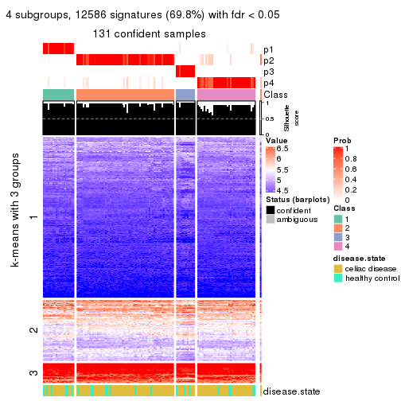</p>

</div>
<div id='tab-SD-pam-get-signatures-no-scale-4'>
<pre><code class="r">get_signatures(res, k = 5, scale_rows = FALSE)
</code></pre>

<p></p>

</div>
<div id='tab-SD-pam-get-signatures-no-scale-5'>
<pre><code class="r">get_signatures(res, k = 6, scale_rows = FALSE)
</code></pre>

<p></p>

</div>
</div>


Compare the overlap of signatures from different k:

```r
compare_signatures(res)
```


`get_signature()` returns a data frame invisibly. TO get the list of signatures, the function
call should be assigned to a variable explicitly. In following code, if `plot` argument is set
to `FALSE`, no heatmap is plotted while only the differential analysis is performed.

```r
# code only for demonstration
tb = get_signature(res, k = ..., plot = FALSE)
```

An example of the output of `tb` is:

```
#>   which_row         fdr    mean_1    mean_2 scaled_mean_1 scaled_mean_2 km
#> 1        38 0.042760348  8.373488  9.131774    -0.5533452     0.5164555  1
#> 2        40 0.018707592  7.106213  8.469186    -0.6173731     0.5762149  1
#> 3        55 0.019134737 10.221463 11.207825    -0.6159697     0.5749050  1
#> 4        59 0.006059896  5.921854  7.869574    -0.6899429     0.6439467  1
#> 5        60 0.018055526  8.928898 10.211722    -0.6204761     0.5791110  1
#> 6        98 0.009384629 15.714769 14.887706     0.6635654    -0.6193277  2
...
```

The columns in `tb` are:

1. `which_row`: row indices corresponding to the input matrix.
2. `fdr`: FDR for the differential test. 
3. `mean_x`: The mean value in group x.
4. `scaled_mean_x`: The mean value in group x after rows are scaled.
5. `km`: Row groups if k-means clustering is applied to rows.


UMAP plot which shows how samples are separated.


<script>
$( function() {
	$( '#tabs-SD-pam-dimension-reduction' ).tabs();
} );
</script>
<div id='tabs-SD-pam-dimension-reduction'>
<ul>
<li><a href='#tab-SD-pam-dimension-reduction-1'>k = 2</a></li>
<li><a href='#tab-SD-pam-dimension-reduction-2'>k = 3</a></li>
<li><a href='#tab-SD-pam-dimension-reduction-3'>k = 4</a></li>
<li><a href='#tab-SD-pam-dimension-reduction-4'>k = 5</a></li>
<li><a href='#tab-SD-pam-dimension-reduction-5'>k = 6</a></li>
</ul>
<div id='tab-SD-pam-dimension-reduction-1'>
<pre><code class="r">dimension_reduction(res, k = 2, method = &quot;UMAP&quot;)
</code></pre>

<p></p>

</div>
<div id='tab-SD-pam-dimension-reduction-2'>
<pre><code class="r">dimension_reduction(res, k = 3, method = &quot;UMAP&quot;)
</code></pre>

<p></p>

</div>
<div id='tab-SD-pam-dimension-reduction-3'>
<pre><code class="r">dimension_reduction(res, k = 4, method = &quot;UMAP&quot;)
</code></pre>

<p></p>

</div>
<div id='tab-SD-pam-dimension-reduction-4'>
<pre><code class="r">dimension_reduction(res, k = 5, method = &quot;UMAP&quot;)
</code></pre>

<p></p>

</div>
<div id='tab-SD-pam-dimension-reduction-5'>
<pre><code class="r">dimension_reduction(res, k = 6, method = &quot;UMAP&quot;)
</code></pre>

<p></p>

</div>
</div>


Following heatmap shows how subgroups are split when increasing `k`:

```r
collect_classes(res)
```


Test correlation between subgroups and known annotations. If the known
annotation is numeric, one-way ANOVA test is applied, and if the known
annotation is discrete, chi-squared contingency table test is applied.

```r
test_to_known_factors(res)
```

```
#>          n disease.state(p) k
#> SD:pam 132          0.00555 2
#> SD:pam 128          0.00949 3
#> SD:pam 131          0.25813 4
#> SD:pam  99          0.33480 5
#> SD:pam 103          0.23303 6
```


If matrix rows can be associated to genes, consider to use `GO_Enrichment(res,
...)` to perform function enrichment for the signature genes.


 

---------------------------------------------------


### SD:mclust**


The object with results only for a single top-value method and a single partition method 
can be extracted as:

```r
res = res_list["SD", "mclust"]
# you can also extract it by
# res = res_list["SD:mclust"]
```

A summary of `res` and all the functions that can be applied to it:

```r
res
```

```
#> A 'ConsensusPartition' object with k = 2, 3, 4, 5, 6.
#>   On a matrix with 18032 rows and 132 columns.
#>   Top rows (1000, 2000, 3000, 4000, 5000) are extracted by 'SD' method.
#>   Subgroups are detected by 'mclust' method.
#>   Performed in total 1250 partitions by row resampling.
#>   Best k for subgroups seems to be 3.
#> 
#> Following methods can be applied to this 'ConsensusPartition' object:
#>  [1] "cola_report"             "collect_classes"         "collect_plots"          
#>  [4] "collect_stats"           "colnames"                "compare_signatures"     
#>  [7] "consensus_heatmap"       "dimension_reduction"     "functional_enrichment"  
#> [10] "get_anno_col"            "get_anno"                "get_classes"            
#> [13] "get_consensus"           "get_matrix"              "get_membership"         
#> [16] "get_param"               "get_signatures"          "get_stats"              
#> [19] "is_best_k"               "is_stable_k"             "membership_heatmap"     
#> [22] "ncol"                    "nrow"                    "plot_ecdf"              
#> [25] "rownames"                "select_partition_number" "show"                   
#> [28] "suggest_best_k"          "test_to_known_factors"
```

`collect_plots()` function collects all the plots made from `res` for all `k` (number of partitions)
into one single page to provide an easy and fast comparison between different `k`.

```r
collect_plots(res)
```


The plots are:

- The first row: a plot of the ECDF (Empirical cumulative distribution
  function) curves of the consensus matrix for each `k` and the heatmap of
  predicted classes for each `k`.
- The second row: heatmaps of the consensus matrix for each `k`.
- The third row: heatmaps of the membership matrix for each `k`.
- The fouth row: heatmaps of the signatures for each `k`.

All the plots in panels can be made by individual functions and they are
plotted later in this section.

`select_partition_number()` produces several plots showing different
statistics for choosing "optimized" `k`. There are following statistics:

- ECDF curves of the consensus matrix for each `k`;
- 1-PAC. [The PAC
  score](https://en.wikipedia.org/wiki/Consensus_clustering#Over-interpretation_potential_of_consensus_clustering)
  measures the proportion of the ambiguous subgrouping.
- Mean silhouette score.
- Concordance. The mean probability of fiting the consensus class ids in all
  partitions.
- Area increased. Denote $A_k$ as the area under the ECDF curve for current
  `k`, the area increased is defined as $A_k - A_{k-1}$.
- Rand index. The percent of pairs of samples that are both in a same cluster
  or both are not in a same cluster in the partition of k and k-1.
- Jaccard index. The ratio of pairs of samples are both in a same cluster in
  the partition of k and k-1 and the pairs of samples are both in a same
  cluster in the partition k or k-1.

The detailed explanations of these statistics can be found in [the cola
vignette](http://bioconductor.org/packages/devel/bioc/vignettes/cola/inst/doc/cola.html#toc_13).

Generally speaking, lower PAC score, higher mean silhouette score or higher
concordance corresponds to better partition. Rand index and Jaccard index
measure how similar the current partition is compared to partition with `k-1`.
If they are too similar, we won't accept `k` is better than `k-1`.

```r
select_partition_number(res)
```


The numeric values for all these statistics can be obtained by `get_stats()`.

```r
get_stats(res)
```

```
#>   k 1-PAC mean_silhouette concordance area_increased  Rand Jaccard
#> 2 2 0.630           0.940       0.941          0.415 0.534   0.534
#> 3 3 1.000           0.971       0.989          0.154 0.871   0.782
#> 4 4 0.597           0.768       0.836          0.237 0.930   0.869
#> 5 5 0.658           0.788       0.842          0.180 0.796   0.593
#> 6 6 0.835           0.770       0.898          0.162 0.812   0.455
```

`suggest_best_k()` suggests the best $k$ based on these statistics. The rules are as follows:

- All $k$ with Jaccard index larger than 0.95 are removed because the increase of
  the partition number does not provides enough extra information. If all $k$ are removed,
  the best $k$ is assigned by `NA`.
- For $k$ with 1-PAC larger than 0.9, the maximal $k$ is taken as the "best k". Other $k$ is called "optional k".
- If it does not fit the second rule. The $k$ with the highest vote of highest
  1-PAC, mean silhouette and concordance is taken as the "best k".

```r
suggest_best_k(res)
```

```
#> [1] 3
```


Following shows the table of the partitions (You need to click the **show/hide
code output** link to see it). The membership matrix (columns with name `p*`)
is inferred by
[`clue::cl_consensus()`](https://www.rdocumentation.org/link/cl_consensus?package=clue)
function with the `SE` method. Basically the value in the membership matrix
represents the probability to belong to a certain group. The finall class
label for an item is determined with the group with highest probability it
belongs to.

In `get_classes()` function, the entropy is calculated from the membership
matrix and the silhouette score is calculated from the consensus matrix.


<script>
$( function() {
	$( '#tabs-SD-mclust-get-classes' ).tabs();
} );
</script>
<div id='tabs-SD-mclust-get-classes'>
<ul>
<li><a href='#tab-SD-mclust-get-classes-1'>k = 2</a></li>
<li><a href='#tab-SD-mclust-get-classes-2'>k = 3</a></li>
<li><a href='#tab-SD-mclust-get-classes-3'>k = 4</a></li>
<li><a href='#tab-SD-mclust-get-classes-4'>k = 5</a></li>
<li><a href='#tab-SD-mclust-get-classes-5'>k = 6</a></li>
</ul>

<div id='tab-SD-mclust-get-classes-1'>
<p><a id='tab-SD-mclust-get-classes-1-a' style='color:#0366d6' href='#'>show/hide code output</a></p>
<pre><code class="r">cbind(get_classes(res, k = 2), get_membership(res, k = 2))
</code></pre>

<pre><code>#&gt;           class entropy silhouette    p1    p2
#&gt; GSM289470     1   0.722      0.915 0.800 0.200
#&gt; GSM289471     1   0.000      0.838 1.000 0.000
#&gt; GSM289472     2   0.000      0.990 0.000 1.000
#&gt; GSM289473     2   0.000      0.990 0.000 1.000
#&gt; GSM289474     2   0.000      0.990 0.000 1.000
#&gt; GSM289475     2   0.000      0.990 0.000 1.000
#&gt; GSM289476     1   0.000      0.838 1.000 0.000
#&gt; GSM289477     2   0.000      0.990 0.000 1.000
#&gt; GSM289478     2   0.000      0.990 0.000 1.000
#&gt; GSM289479     2   0.000      0.990 0.000 1.000
#&gt; GSM289480     2   0.000      0.990 0.000 1.000
#&gt; GSM289481     2   0.000      0.990 0.000 1.000
#&gt; GSM289482     2   0.000      0.990 0.000 1.000
#&gt; GSM289483     2   0.000      0.990 0.000 1.000
#&gt; GSM289484     2   0.000      0.990 0.000 1.000
#&gt; GSM289485     2   0.000      0.990 0.000 1.000
#&gt; GSM289486     1   0.722      0.915 0.800 0.200
#&gt; GSM289487     2   0.000      0.990 0.000 1.000
#&gt; GSM289488     2   0.000      0.990 0.000 1.000
#&gt; GSM289489     2   0.000      0.990 0.000 1.000
#&gt; GSM289490     2   0.518      0.835 0.116 0.884
#&gt; GSM289491     2   0.295      0.930 0.052 0.948
#&gt; GSM289492     1   0.730      0.911 0.796 0.204
#&gt; GSM289493     2   0.000      0.990 0.000 1.000
#&gt; GSM289494     1   0.000      0.838 1.000 0.000
#&gt; GSM289495     2   0.999     -0.269 0.480 0.520
#&gt; GSM289496     2   0.000      0.990 0.000 1.000
#&gt; GSM289497     2   0.000      0.990 0.000 1.000
#&gt; GSM289498     1   0.224      0.854 0.964 0.036
#&gt; GSM289499     2   0.000      0.990 0.000 1.000
#&gt; GSM289500     1   0.000      0.838 1.000 0.000
#&gt; GSM289501     2   0.000      0.990 0.000 1.000
#&gt; GSM289502     2   0.000      0.990 0.000 1.000
#&gt; GSM289503     2   0.000      0.990 0.000 1.000
#&gt; GSM289504     2   0.000      0.990 0.000 1.000
#&gt; GSM289505     2   0.000      0.990 0.000 1.000
#&gt; GSM289506     2   0.000      0.990 0.000 1.000
#&gt; GSM289507     2   0.000      0.990 0.000 1.000
#&gt; GSM289508     1   0.722      0.915 0.800 0.200
#&gt; GSM289509     1   0.443      0.878 0.908 0.092
#&gt; GSM289510     2   0.000      0.990 0.000 1.000
#&gt; GSM289511     2   0.000      0.990 0.000 1.000
#&gt; GSM289512     1   0.000      0.838 1.000 0.000
#&gt; GSM289513     2   0.000      0.990 0.000 1.000
#&gt; GSM289514     1   0.781      0.882 0.768 0.232
#&gt; GSM289515     2   0.000      0.990 0.000 1.000
#&gt; GSM289516     2   0.000      0.990 0.000 1.000
#&gt; GSM289517     2   0.000      0.990 0.000 1.000
#&gt; GSM289518     2   0.000      0.990 0.000 1.000
#&gt; GSM289519     2   0.000      0.990 0.000 1.000
#&gt; GSM289520     2   0.000      0.990 0.000 1.000
#&gt; GSM289521     1   0.722      0.915 0.800 0.200
#&gt; GSM289522     2   0.000      0.990 0.000 1.000
#&gt; GSM289523     1   0.000      0.838 1.000 0.000
#&gt; GSM289524     2   0.000      0.990 0.000 1.000
#&gt; GSM289525     2   0.000      0.990 0.000 1.000
#&gt; GSM289526     1   0.722      0.915 0.800 0.200
#&gt; GSM289527     2   0.000      0.990 0.000 1.000
#&gt; GSM289528     2   0.000      0.990 0.000 1.000
#&gt; GSM289529     2   0.000      0.990 0.000 1.000
#&gt; GSM289530     1   0.802      0.868 0.756 0.244
#&gt; GSM289531     2   0.000      0.990 0.000 1.000
#&gt; GSM289532     1   0.722      0.915 0.800 0.200
#&gt; GSM289533     2   0.000      0.990 0.000 1.000
#&gt; GSM289534     1   0.000      0.838 1.000 0.000
#&gt; GSM289535     2   0.000      0.990 0.000 1.000
#&gt; GSM289536     1   0.000      0.838 1.000 0.000
#&gt; GSM289537     2   0.000      0.990 0.000 1.000
#&gt; GSM289538     2   0.000      0.990 0.000 1.000
#&gt; GSM289539     2   0.000      0.990 0.000 1.000
#&gt; GSM289540     1   0.722      0.915 0.800 0.200
#&gt; GSM289541     1   0.722      0.915 0.800 0.200
#&gt; GSM289542     2   0.163      0.962 0.024 0.976
#&gt; GSM289543     2   0.000      0.990 0.000 1.000
#&gt; GSM289544     1   0.722      0.915 0.800 0.200
#&gt; GSM289545     2   0.000      0.990 0.000 1.000
#&gt; GSM289546     2   0.000      0.990 0.000 1.000
#&gt; GSM289547     2   0.000      0.990 0.000 1.000
#&gt; GSM289548     1   0.722      0.915 0.800 0.200
#&gt; GSM289549     1   0.722      0.915 0.800 0.200
#&gt; GSM289550     1   0.722      0.915 0.800 0.200
#&gt; GSM289551     1   0.000      0.838 1.000 0.000
#&gt; GSM289552     1   0.714      0.914 0.804 0.196
#&gt; GSM289553     1   0.722      0.915 0.800 0.200
#&gt; GSM289554     2   0.000      0.990 0.000 1.000
#&gt; GSM289555     2   0.000      0.990 0.000 1.000
#&gt; GSM289556     1   0.722      0.915 0.800 0.200
#&gt; GSM289557     2   0.000      0.990 0.000 1.000
#&gt; GSM289558     2   0.000      0.990 0.000 1.000
#&gt; GSM289559     1   0.722      0.915 0.800 0.200
#&gt; GSM289560     2   0.000      0.990 0.000 1.000
#&gt; GSM289561     2   0.000      0.990 0.000 1.000
#&gt; GSM289562     1   0.722      0.915 0.800 0.200
#&gt; GSM289563     1   0.722      0.915 0.800 0.200
#&gt; GSM289564     2   0.224      0.948 0.036 0.964
#&gt; GSM289565     1   0.722      0.915 0.800 0.200
#&gt; GSM289566     1   0.722      0.915 0.800 0.200
#&gt; GSM289567     2   0.000      0.990 0.000 1.000
#&gt; GSM289568     2   0.000      0.990 0.000 1.000
#&gt; GSM289569     2   0.000      0.990 0.000 1.000
#&gt; GSM289570     2   0.000      0.990 0.000 1.000
#&gt; GSM289571     2   0.000      0.990 0.000 1.000
#&gt; GSM289572     2   0.000      0.990 0.000 1.000
#&gt; GSM289573     2   0.000      0.990 0.000 1.000
#&gt; GSM289574     2   0.000      0.990 0.000 1.000
#&gt; GSM289575     2   0.000      0.990 0.000 1.000
#&gt; GSM289576     2   0.000      0.990 0.000 1.000
#&gt; GSM289577     2   0.000      0.990 0.000 1.000
#&gt; GSM289578     2   0.000      0.990 0.000 1.000
#&gt; GSM289579     2   0.000      0.990 0.000 1.000
#&gt; GSM289580     1   0.000      0.838 1.000 0.000
#&gt; GSM289581     1   0.722      0.915 0.800 0.200
#&gt; GSM289582     2   0.000      0.990 0.000 1.000
#&gt; GSM289583     2   0.000      0.990 0.000 1.000
#&gt; GSM289584     2   0.000      0.990 0.000 1.000
#&gt; GSM289585     2   0.000      0.990 0.000 1.000
#&gt; GSM289586     1   0.886      0.783 0.696 0.304
#&gt; GSM289587     1   0.722      0.915 0.800 0.200
#&gt; GSM289588     1   0.000      0.838 1.000 0.000
#&gt; GSM289589     1   0.722      0.915 0.800 0.200
#&gt; GSM289590     1   0.722      0.915 0.800 0.200
#&gt; GSM289591     1   0.584      0.896 0.860 0.140
#&gt; GSM289592     2   0.000      0.990 0.000 1.000
#&gt; GSM289593     1   0.000      0.838 1.000 0.000
#&gt; GSM289594     2   0.000      0.990 0.000 1.000
#&gt; GSM289595     1   0.697      0.912 0.812 0.188
#&gt; GSM289596     2   0.000      0.990 0.000 1.000
#&gt; GSM289597     2   0.000      0.990 0.000 1.000
#&gt; GSM289598     1   0.430      0.876 0.912 0.088
#&gt; GSM289599     1   0.904      0.757 0.680 0.320
#&gt; GSM289600     1   0.722      0.915 0.800 0.200
#&gt; GSM289601     1   0.722      0.915 0.800 0.200
</code></pre>

<script>
$('#tab-SD-mclust-get-classes-1-a').parent().next().next().hide();
$('#tab-SD-mclust-get-classes-1-a').click(function(){
  $('#tab-SD-mclust-get-classes-1-a').parent().next().next().toggle();
  return(false);
});
</script>
</div>

<div id='tab-SD-mclust-get-classes-2'>
<p><a id='tab-SD-mclust-get-classes-2-a' style='color:#0366d6' href='#'>show/hide code output</a></p>
<pre><code class="r">cbind(get_classes(res, k = 3), get_membership(res, k = 3))
</code></pre>

<pre><code>#&gt;           class entropy silhouette    p1    p2    p3
#&gt; GSM289470     1  0.0000      0.960 1.000 0.000 0.000
#&gt; GSM289471     3  0.0000      0.988 0.000 0.000 1.000
#&gt; GSM289472     2  0.0000      0.993 0.000 1.000 0.000
#&gt; GSM289473     2  0.0000      0.993 0.000 1.000 0.000
#&gt; GSM289474     2  0.0000      0.993 0.000 1.000 0.000
#&gt; GSM289475     2  0.0000      0.993 0.000 1.000 0.000
#&gt; GSM289476     3  0.0000      0.988 0.000 0.000 1.000
#&gt; GSM289477     2  0.0000      0.993 0.000 1.000 0.000
#&gt; GSM289478     2  0.0000      0.993 0.000 1.000 0.000
#&gt; GSM289479     2  0.0000      0.993 0.000 1.000 0.000
#&gt; GSM289480     2  0.0000      0.993 0.000 1.000 0.000
#&gt; GSM289481     2  0.0000      0.993 0.000 1.000 0.000
#&gt; GSM289482     2  0.0000      0.993 0.000 1.000 0.000
#&gt; GSM289483     2  0.0000      0.993 0.000 1.000 0.000
#&gt; GSM289484     2  0.0000      0.993 0.000 1.000 0.000
#&gt; GSM289485     2  0.0000      0.993 0.000 1.000 0.000
#&gt; GSM289486     1  0.0000      0.960 1.000 0.000 0.000
#&gt; GSM289487     2  0.0000      0.993 0.000 1.000 0.000
#&gt; GSM289488     2  0.0000      0.993 0.000 1.000 0.000
#&gt; GSM289489     2  0.0000      0.993 0.000 1.000 0.000
#&gt; GSM289490     2  0.1031      0.971 0.024 0.976 0.000
#&gt; GSM289491     2  0.0000      0.993 0.000 1.000 0.000
#&gt; GSM289492     2  0.1267      0.968 0.024 0.972 0.004
#&gt; GSM289493     2  0.0000      0.993 0.000 1.000 0.000
#&gt; GSM289494     3  0.1031      0.982 0.024 0.000 0.976
#&gt; GSM289495     2  0.0237      0.989 0.000 0.996 0.004
#&gt; GSM289496     2  0.0000      0.993 0.000 1.000 0.000
#&gt; GSM289497     2  0.0000      0.993 0.000 1.000 0.000
#&gt; GSM289498     2  0.2056      0.951 0.024 0.952 0.024
#&gt; GSM289499     2  0.0000      0.993 0.000 1.000 0.000
#&gt; GSM289500     3  0.1031      0.982 0.024 0.000 0.976
#&gt; GSM289501     2  0.0000      0.993 0.000 1.000 0.000
#&gt; GSM289502     2  0.0000      0.993 0.000 1.000 0.000
#&gt; GSM289503     2  0.0000      0.993 0.000 1.000 0.000
#&gt; GSM289504     2  0.0000      0.993 0.000 1.000 0.000
#&gt; GSM289505     2  0.0000      0.993 0.000 1.000 0.000
#&gt; GSM289506     2  0.0000      0.993 0.000 1.000 0.000
#&gt; GSM289507     2  0.0000      0.993 0.000 1.000 0.000
#&gt; GSM289508     1  0.0592      0.946 0.988 0.012 0.000
#&gt; GSM289509     1  0.0237      0.958 0.996 0.000 0.004
#&gt; GSM289510     2  0.0000      0.993 0.000 1.000 0.000
#&gt; GSM289511     2  0.0000      0.993 0.000 1.000 0.000
#&gt; GSM289512     3  0.1031      0.982 0.024 0.000 0.976
#&gt; GSM289513     2  0.0000      0.993 0.000 1.000 0.000
#&gt; GSM289514     1  0.5988      0.350 0.632 0.368 0.000
#&gt; GSM289515     2  0.0000      0.993 0.000 1.000 0.000
#&gt; GSM289516     2  0.0000      0.993 0.000 1.000 0.000
#&gt; GSM289517     2  0.0000      0.993 0.000 1.000 0.000
#&gt; GSM289518     2  0.0000      0.993 0.000 1.000 0.000
#&gt; GSM289519     2  0.1643      0.952 0.044 0.956 0.000
#&gt; GSM289520     2  0.0000      0.993 0.000 1.000 0.000
#&gt; GSM289521     1  0.0000      0.960 1.000 0.000 0.000
#&gt; GSM289522     2  0.0000      0.993 0.000 1.000 0.000
#&gt; GSM289523     3  0.0000      0.988 0.000 0.000 1.000
#&gt; GSM289524     2  0.0000      0.993 0.000 1.000 0.000
#&gt; GSM289525     2  0.0000      0.993 0.000 1.000 0.000
#&gt; GSM289526     2  0.1031      0.971 0.024 0.976 0.000
#&gt; GSM289527     2  0.0000      0.993 0.000 1.000 0.000
#&gt; GSM289528     2  0.0000      0.993 0.000 1.000 0.000
#&gt; GSM289529     2  0.0000      0.993 0.000 1.000 0.000
#&gt; GSM289530     2  0.2200      0.936 0.056 0.940 0.004
#&gt; GSM289531     2  0.0000      0.993 0.000 1.000 0.000
#&gt; GSM289532     1  0.2711      0.828 0.912 0.088 0.000
#&gt; GSM289533     2  0.0000      0.993 0.000 1.000 0.000
#&gt; GSM289534     3  0.1031      0.982 0.024 0.000 0.976
#&gt; GSM289535     2  0.1031      0.971 0.024 0.976 0.000
#&gt; GSM289536     3  0.0000      0.988 0.000 0.000 1.000
#&gt; GSM289537     2  0.0000      0.993 0.000 1.000 0.000
#&gt; GSM289538     2  0.0000      0.993 0.000 1.000 0.000
#&gt; GSM289539     2  0.0000      0.993 0.000 1.000 0.000
#&gt; GSM289540     1  0.0237      0.958 0.996 0.000 0.004
#&gt; GSM289541     1  0.0000      0.960 1.000 0.000 0.000
#&gt; GSM289542     2  0.2711      0.902 0.088 0.912 0.000
#&gt; GSM289543     2  0.0000      0.993 0.000 1.000 0.000
#&gt; GSM289544     1  0.0000      0.960 1.000 0.000 0.000
#&gt; GSM289545     2  0.0000      0.993 0.000 1.000 0.000
#&gt; GSM289546     2  0.0000      0.993 0.000 1.000 0.000
#&gt; GSM289547     2  0.0000      0.993 0.000 1.000 0.000
#&gt; GSM289548     1  0.0000      0.960 1.000 0.000 0.000
#&gt; GSM289549     1  0.0000      0.960 1.000 0.000 0.000
#&gt; GSM289550     1  0.0000      0.960 1.000 0.000 0.000
#&gt; GSM289551     3  0.0000      0.988 0.000 0.000 1.000
#&gt; GSM289552     1  0.0000      0.960 1.000 0.000 0.000
#&gt; GSM289553     1  0.0000      0.960 1.000 0.000 0.000
#&gt; GSM289554     2  0.0000      0.993 0.000 1.000 0.000
#&gt; GSM289555     2  0.0000      0.993 0.000 1.000 0.000
#&gt; GSM289556     1  0.0000      0.960 1.000 0.000 0.000
#&gt; GSM289557     2  0.0000      0.993 0.000 1.000 0.000
#&gt; GSM289558     2  0.0000      0.993 0.000 1.000 0.000
#&gt; GSM289559     1  0.0000      0.960 1.000 0.000 0.000
#&gt; GSM289560     2  0.0000      0.993 0.000 1.000 0.000
#&gt; GSM289561     2  0.0000      0.993 0.000 1.000 0.000
#&gt; GSM289562     1  0.0000      0.960 1.000 0.000 0.000
#&gt; GSM289563     1  0.0000      0.960 1.000 0.000 0.000
#&gt; GSM289564     2  0.0000      0.993 0.000 1.000 0.000
#&gt; GSM289565     1  0.0237      0.958 0.996 0.000 0.004
#&gt; GSM289566     1  0.0000      0.960 1.000 0.000 0.000
#&gt; GSM289567     2  0.0000      0.993 0.000 1.000 0.000
#&gt; GSM289568     2  0.0000      0.993 0.000 1.000 0.000
#&gt; GSM289569     2  0.0000      0.993 0.000 1.000 0.000
#&gt; GSM289570     2  0.0000      0.993 0.000 1.000 0.000
#&gt; GSM289571     2  0.0000      0.993 0.000 1.000 0.000
#&gt; GSM289572     2  0.0000      0.993 0.000 1.000 0.000
#&gt; GSM289573     2  0.0000      0.993 0.000 1.000 0.000
#&gt; GSM289574     2  0.0000      0.993 0.000 1.000 0.000
#&gt; GSM289575     2  0.0000      0.993 0.000 1.000 0.000
#&gt; GSM289576     2  0.0000      0.993 0.000 1.000 0.000
#&gt; GSM289577     2  0.0000      0.993 0.000 1.000 0.000
#&gt; GSM289578     2  0.0000      0.993 0.000 1.000 0.000
#&gt; GSM289579     2  0.0000      0.993 0.000 1.000 0.000
#&gt; GSM289580     3  0.1031      0.982 0.024 0.000 0.976
#&gt; GSM289581     1  0.0237      0.958 0.996 0.000 0.004
#&gt; GSM289582     2  0.0000      0.993 0.000 1.000 0.000
#&gt; GSM289583     2  0.0000      0.993 0.000 1.000 0.000
#&gt; GSM289584     2  0.0000      0.993 0.000 1.000 0.000
#&gt; GSM289585     2  0.0000      0.993 0.000 1.000 0.000
#&gt; GSM289586     1  0.4399      0.656 0.812 0.188 0.000
#&gt; GSM289587     1  0.0000      0.960 1.000 0.000 0.000
#&gt; GSM289588     3  0.0000      0.988 0.000 0.000 1.000
#&gt; GSM289589     1  0.0000      0.960 1.000 0.000 0.000
#&gt; GSM289590     1  0.0237      0.958 0.996 0.000 0.004
#&gt; GSM289591     1  0.0000      0.960 1.000 0.000 0.000
#&gt; GSM289592     2  0.0000      0.993 0.000 1.000 0.000
#&gt; GSM289593     3  0.0000      0.988 0.000 0.000 1.000
#&gt; GSM289594     2  0.0000      0.993 0.000 1.000 0.000
#&gt; GSM289595     1  0.0000      0.960 1.000 0.000 0.000
#&gt; GSM289596     2  0.0000      0.993 0.000 1.000 0.000
#&gt; GSM289597     2  0.0000      0.993 0.000 1.000 0.000
#&gt; GSM289598     2  0.5903      0.666 0.232 0.744 0.024
#&gt; GSM289599     2  0.1267      0.968 0.024 0.972 0.004
#&gt; GSM289600     1  0.0000      0.960 1.000 0.000 0.000
#&gt; GSM289601     1  0.0237      0.958 0.996 0.000 0.004
</code></pre>

<script>
$('#tab-SD-mclust-get-classes-2-a').parent().next().next().hide();
$('#tab-SD-mclust-get-classes-2-a').click(function(){
  $('#tab-SD-mclust-get-classes-2-a').parent().next().next().toggle();
  return(false);
});
</script>
</div>

<div id='tab-SD-mclust-get-classes-3'>
<p><a id='tab-SD-mclust-get-classes-3-a' style='color:#0366d6' href='#'>show/hide code output</a></p>
<pre><code class="r">cbind(get_classes(res, k = 4), get_membership(res, k = 4))
</code></pre>

<pre><code>#&gt;           class entropy silhouette    p1    p2    p3    p4
#&gt; GSM289470     1  0.0000      0.982 1.000 0.000 0.000 0.000
#&gt; GSM289471     3  0.0000      0.919 0.000 0.000 1.000 0.000
#&gt; GSM289472     2  0.4916      0.664 0.000 0.576 0.000 0.424
#&gt; GSM289473     2  0.0592      0.811 0.000 0.984 0.000 0.016
#&gt; GSM289474     2  0.0707      0.811 0.000 0.980 0.000 0.020
#&gt; GSM289475     2  0.4277      0.745 0.000 0.720 0.000 0.280
#&gt; GSM289476     3  0.0000      0.919 0.000 0.000 1.000 0.000
#&gt; GSM289477     2  0.0336      0.805 0.000 0.992 0.000 0.008
#&gt; GSM289478     2  0.4356      0.739 0.000 0.708 0.000 0.292
#&gt; GSM289479     2  0.0817      0.810 0.000 0.976 0.000 0.024
#&gt; GSM289480     2  0.4356      0.739 0.000 0.708 0.000 0.292
#&gt; GSM289481     2  0.4356      0.740 0.000 0.708 0.000 0.292
#&gt; GSM289482     2  0.0336      0.805 0.000 0.992 0.000 0.008
#&gt; GSM289483     2  0.0000      0.808 0.000 1.000 0.000 0.000
#&gt; GSM289484     2  0.2647      0.804 0.000 0.880 0.000 0.120
#&gt; GSM289485     2  0.0000      0.808 0.000 1.000 0.000 0.000
#&gt; GSM289486     1  0.0000      0.982 1.000 0.000 0.000 0.000
#&gt; GSM289487     2  0.4730      0.703 0.000 0.636 0.000 0.364
#&gt; GSM289488     2  0.0817      0.811 0.000 0.976 0.000 0.024
#&gt; GSM289489     2  0.4907      0.667 0.000 0.580 0.000 0.420
#&gt; GSM289490     2  0.3047      0.713 0.116 0.872 0.000 0.012
#&gt; GSM289491     2  0.6634      0.654 0.116 0.592 0.000 0.292
#&gt; GSM289492     2  0.6612      0.133 0.132 0.612 0.000 0.256
#&gt; GSM289493     2  0.0188      0.809 0.000 0.996 0.000 0.004
#&gt; GSM289494     3  0.2814      0.863 0.132 0.000 0.868 0.000
#&gt; GSM289495     4  0.4992      0.410 0.000 0.476 0.000 0.524
#&gt; GSM289496     2  0.1637      0.811 0.000 0.940 0.000 0.060
#&gt; GSM289497     2  0.4830      0.685 0.000 0.608 0.000 0.392
#&gt; GSM289498     2  0.3142      0.699 0.132 0.860 0.000 0.008
#&gt; GSM289499     2  0.0336      0.805 0.000 0.992 0.000 0.008
#&gt; GSM289500     3  0.2589      0.877 0.116 0.000 0.884 0.000
#&gt; GSM289501     2  0.0000      0.808 0.000 1.000 0.000 0.000
#&gt; GSM289502     2  0.4916      0.664 0.000 0.576 0.000 0.424
#&gt; GSM289503     2  0.4356      0.739 0.000 0.708 0.000 0.292
#&gt; GSM289504     2  0.0336      0.805 0.000 0.992 0.000 0.008
#&gt; GSM289505     2  0.0000      0.808 0.000 1.000 0.000 0.000
#&gt; GSM289506     2  0.4916      0.664 0.000 0.576 0.000 0.424
#&gt; GSM289507     2  0.4916      0.664 0.000 0.576 0.000 0.424
#&gt; GSM289508     2  0.5758      0.469 0.160 0.712 0.000 0.128
#&gt; GSM289509     4  0.4933      0.519 0.432 0.000 0.000 0.568
#&gt; GSM289510     2  0.0336      0.805 0.000 0.992 0.000 0.008
#&gt; GSM289511     2  0.4916      0.664 0.000 0.576 0.000 0.424
#&gt; GSM289512     3  0.2589      0.877 0.116 0.000 0.884 0.000
#&gt; GSM289513     2  0.4916      0.664 0.000 0.576 0.000 0.424
#&gt; GSM289514     4  0.6813      0.661 0.132 0.292 0.000 0.576
#&gt; GSM289515     2  0.2704      0.803 0.000 0.876 0.000 0.124
#&gt; GSM289516     2  0.0336      0.810 0.000 0.992 0.000 0.008
#&gt; GSM289517     2  0.0000      0.808 0.000 1.000 0.000 0.000
#&gt; GSM289518     2  0.0188      0.807 0.000 0.996 0.000 0.004
#&gt; GSM289519     2  0.5457      0.464 0.088 0.728 0.000 0.184
#&gt; GSM289520     2  0.1716      0.811 0.000 0.936 0.000 0.064
#&gt; GSM289521     4  0.7065      0.648 0.212 0.216 0.000 0.572
#&gt; GSM289522     2  0.0000      0.808 0.000 1.000 0.000 0.000
#&gt; GSM289523     3  0.0000      0.919 0.000 0.000 1.000 0.000
#&gt; GSM289524     2  0.4916      0.664 0.000 0.576 0.000 0.424
#&gt; GSM289525     2  0.0000      0.808 0.000 1.000 0.000 0.000
#&gt; GSM289526     2  0.6793      0.638 0.132 0.580 0.000 0.288
#&gt; GSM289527     2  0.4916      0.664 0.000 0.576 0.000 0.424
#&gt; GSM289528     2  0.4916      0.664 0.000 0.576 0.000 0.424
#&gt; GSM289529     2  0.0188      0.809 0.000 0.996 0.000 0.004
#&gt; GSM289530     4  0.6813      0.661 0.132 0.292 0.000 0.576
#&gt; GSM289531     2  0.0336      0.805 0.000 0.992 0.000 0.008
#&gt; GSM289532     4  0.6813      0.661 0.132 0.292 0.000 0.576
#&gt; GSM289533     2  0.3764      0.774 0.000 0.784 0.000 0.216
#&gt; GSM289534     3  0.2814      0.863 0.132 0.000 0.868 0.000
#&gt; GSM289535     2  0.1637      0.764 0.000 0.940 0.000 0.060
#&gt; GSM289536     3  0.0000      0.919 0.000 0.000 1.000 0.000
#&gt; GSM289537     2  0.0707      0.811 0.000 0.980 0.000 0.020
#&gt; GSM289538     2  0.2149      0.809 0.000 0.912 0.000 0.088
#&gt; GSM289539     2  0.4916      0.664 0.000 0.576 0.000 0.424
#&gt; GSM289540     4  0.6813      0.661 0.132 0.292 0.000 0.576
#&gt; GSM289541     1  0.2408      0.822 0.896 0.000 0.000 0.104
#&gt; GSM289542     2  0.5674      0.462 0.132 0.720 0.000 0.148
#&gt; GSM289543     2  0.0336      0.805 0.000 0.992 0.000 0.008
#&gt; GSM289544     4  0.4933      0.519 0.432 0.000 0.000 0.568
#&gt; GSM289545     2  0.1792      0.811 0.000 0.932 0.000 0.068
#&gt; GSM289546     2  0.1474      0.812 0.000 0.948 0.000 0.052
#&gt; GSM289547     2  0.4916      0.664 0.000 0.576 0.000 0.424
#&gt; GSM289548     1  0.0000      0.982 1.000 0.000 0.000 0.000
#&gt; GSM289549     1  0.0000      0.982 1.000 0.000 0.000 0.000
#&gt; GSM289550     1  0.0000      0.982 1.000 0.000 0.000 0.000
#&gt; GSM289551     3  0.0000      0.919 0.000 0.000 1.000 0.000
#&gt; GSM289552     1  0.0000      0.982 1.000 0.000 0.000 0.000
#&gt; GSM289553     1  0.0188      0.977 0.996 0.000 0.000 0.004
#&gt; GSM289554     2  0.0336      0.805 0.000 0.992 0.000 0.008
#&gt; GSM289555     2  0.0336      0.805 0.000 0.992 0.000 0.008
#&gt; GSM289556     1  0.0000      0.982 1.000 0.000 0.000 0.000
#&gt; GSM289557     2  0.2530      0.805 0.000 0.888 0.000 0.112
#&gt; GSM289558     2  0.2973      0.797 0.000 0.856 0.000 0.144
#&gt; GSM289559     1  0.0000      0.982 1.000 0.000 0.000 0.000
#&gt; GSM289560     2  0.0188      0.807 0.000 0.996 0.000 0.004
#&gt; GSM289561     2  0.2647      0.804 0.000 0.880 0.000 0.120
#&gt; GSM289562     1  0.0000      0.982 1.000 0.000 0.000 0.000
#&gt; GSM289563     1  0.0000      0.982 1.000 0.000 0.000 0.000
#&gt; GSM289564     2  0.0336      0.805 0.000 0.992 0.000 0.008
#&gt; GSM289565     4  0.4925      0.525 0.428 0.000 0.000 0.572
#&gt; GSM289566     1  0.0000      0.982 1.000 0.000 0.000 0.000
#&gt; GSM289567     2  0.0336      0.805 0.000 0.992 0.000 0.008
#&gt; GSM289568     2  0.4916      0.664 0.000 0.576 0.000 0.424
#&gt; GSM289569     2  0.3649      0.778 0.000 0.796 0.000 0.204
#&gt; GSM289570     2  0.0336      0.805 0.000 0.992 0.000 0.008
#&gt; GSM289571     2  0.2760      0.801 0.000 0.872 0.000 0.128
#&gt; GSM289572     2  0.0336      0.805 0.000 0.992 0.000 0.008
#&gt; GSM289573     2  0.3837      0.771 0.000 0.776 0.000 0.224
#&gt; GSM289574     2  0.4916      0.664 0.000 0.576 0.000 0.424
#&gt; GSM289575     2  0.0336      0.805 0.000 0.992 0.000 0.008
#&gt; GSM289576     2  0.4356      0.739 0.000 0.708 0.000 0.292
#&gt; GSM289577     2  0.0336      0.805 0.000 0.992 0.000 0.008
#&gt; GSM289578     2  0.0336      0.805 0.000 0.992 0.000 0.008
#&gt; GSM289579     2  0.0336      0.805 0.000 0.992 0.000 0.008
#&gt; GSM289580     3  0.2814      0.863 0.132 0.000 0.868 0.000
#&gt; GSM289581     4  0.5088      0.529 0.424 0.004 0.000 0.572
#&gt; GSM289582     2  0.1637      0.811 0.000 0.940 0.000 0.060
#&gt; GSM289583     2  0.4916      0.664 0.000 0.576 0.000 0.424
#&gt; GSM289584     2  0.3975      0.764 0.000 0.760 0.000 0.240
#&gt; GSM289585     2  0.4916      0.664 0.000 0.576 0.000 0.424
#&gt; GSM289586     1  0.2255      0.839 0.920 0.012 0.000 0.068
#&gt; GSM289587     1  0.0000      0.982 1.000 0.000 0.000 0.000
#&gt; GSM289588     3  0.0000      0.919 0.000 0.000 1.000 0.000
#&gt; GSM289589     1  0.0000      0.982 1.000 0.000 0.000 0.000
#&gt; GSM289590     4  0.4933      0.519 0.432 0.000 0.000 0.568
#&gt; GSM289591     1  0.0000      0.982 1.000 0.000 0.000 0.000
#&gt; GSM289592     2  0.4356      0.739 0.000 0.708 0.000 0.292
#&gt; GSM289593     3  0.0000      0.919 0.000 0.000 1.000 0.000
#&gt; GSM289594     2  0.0000      0.808 0.000 1.000 0.000 0.000
#&gt; GSM289595     4  0.4972      0.471 0.456 0.000 0.000 0.544
#&gt; GSM289596     2  0.3123      0.794 0.000 0.844 0.000 0.156
#&gt; GSM289597     2  0.0000      0.808 0.000 1.000 0.000 0.000
#&gt; GSM289598     2  0.5905      0.429 0.144 0.700 0.000 0.156
#&gt; GSM289599     4  0.6682      0.643 0.112 0.312 0.000 0.576
#&gt; GSM289600     1  0.0000      0.982 1.000 0.000 0.000 0.000
#&gt; GSM289601     4  0.4925      0.525 0.428 0.000 0.000 0.572
</code></pre>

<script>
$('#tab-SD-mclust-get-classes-3-a').parent().next().next().hide();
$('#tab-SD-mclust-get-classes-3-a').click(function(){
  $('#tab-SD-mclust-get-classes-3-a').parent().next().next().toggle();
  return(false);
});
</script>
</div>

<div id='tab-SD-mclust-get-classes-4'>
<p><a id='tab-SD-mclust-get-classes-4-a' style='color:#0366d6' href='#'>show/hide code output</a></p>
<pre><code class="r">cbind(get_classes(res, k = 5), get_membership(res, k = 5))
</code></pre>

<pre><code>#&gt;           class entropy silhouette    p1    p2    p3    p4    p5
#&gt; GSM289470     1  0.0000     0.9770 1.000 0.000 0.000 0.000 0.000
#&gt; GSM289471     3  0.0000     0.8557 0.000 0.000 1.000 0.000 0.000
#&gt; GSM289472     5  0.0162     0.8425 0.000 0.004 0.000 0.000 0.996
#&gt; GSM289473     2  0.3266     0.8109 0.000 0.796 0.000 0.200 0.004
#&gt; GSM289474     2  0.3366     0.8088 0.000 0.784 0.000 0.212 0.004
#&gt; GSM289475     2  0.5447     0.7119 0.000 0.640 0.000 0.248 0.112
#&gt; GSM289476     3  0.0000     0.8557 0.000 0.000 1.000 0.000 0.000
#&gt; GSM289477     2  0.3715     0.7992 0.000 0.736 0.000 0.260 0.004
#&gt; GSM289478     5  0.5794     0.1741 0.000 0.384 0.000 0.096 0.520
#&gt; GSM289479     2  0.3205     0.8144 0.004 0.816 0.000 0.176 0.004
#&gt; GSM289480     5  0.3983     0.4638 0.000 0.340 0.000 0.000 0.660
#&gt; GSM289481     5  0.2891     0.7143 0.000 0.176 0.000 0.000 0.824
#&gt; GSM289482     2  0.4728     0.7680 0.164 0.740 0.000 0.092 0.004
#&gt; GSM289483     2  0.3715     0.7992 0.000 0.736 0.000 0.260 0.004
#&gt; GSM289484     2  0.3715     0.7992 0.000 0.736 0.000 0.260 0.004
#&gt; GSM289485     2  0.4557     0.7452 0.204 0.736 0.000 0.056 0.004
#&gt; GSM289486     1  0.0000     0.9770 1.000 0.000 0.000 0.000 0.000
#&gt; GSM289487     5  0.5325     0.0798 0.000 0.428 0.000 0.052 0.520
#&gt; GSM289488     2  0.3715     0.7992 0.000 0.736 0.000 0.260 0.004
#&gt; GSM289489     5  0.1965     0.7703 0.000 0.096 0.000 0.000 0.904
#&gt; GSM289490     2  0.3689     0.7075 0.256 0.740 0.000 0.000 0.004
#&gt; GSM289491     5  0.5028     0.3821 0.260 0.072 0.000 0.000 0.668
#&gt; GSM289492     2  0.3989     0.6968 0.260 0.728 0.000 0.008 0.004
#&gt; GSM289493     2  0.0000     0.8147 0.000 1.000 0.000 0.000 0.000
#&gt; GSM289494     3  0.3561     0.5939 0.260 0.000 0.740 0.000 0.000
#&gt; GSM289495     2  0.3662     0.7104 0.252 0.744 0.000 0.004 0.000
#&gt; GSM289496     2  0.0000     0.8147 0.000 1.000 0.000 0.000 0.000
#&gt; GSM289497     5  0.0510     0.8360 0.000 0.016 0.000 0.000 0.984
#&gt; GSM289498     2  0.3715     0.7036 0.260 0.736 0.000 0.000 0.004
#&gt; GSM289499     2  0.1043     0.8186 0.000 0.960 0.000 0.040 0.000
#&gt; GSM289500     3  0.2179     0.7982 0.112 0.000 0.888 0.000 0.000
#&gt; GSM289501     2  0.0000     0.8147 0.000 1.000 0.000 0.000 0.000
#&gt; GSM289502     5  0.0162     0.8425 0.000 0.004 0.000 0.000 0.996
#&gt; GSM289503     5  0.2813     0.7084 0.000 0.168 0.000 0.000 0.832
#&gt; GSM289504     2  0.0000     0.8147 0.000 1.000 0.000 0.000 0.000
#&gt; GSM289505     2  0.0000     0.8147 0.000 1.000 0.000 0.000 0.000
#&gt; GSM289506     5  0.0162     0.8425 0.000 0.004 0.000 0.000 0.996
#&gt; GSM289507     5  0.0162     0.8425 0.000 0.004 0.000 0.000 0.996
#&gt; GSM289508     2  0.5866     0.5321 0.260 0.604 0.000 0.132 0.004
#&gt; GSM289509     4  0.3561     0.9828 0.260 0.000 0.000 0.740 0.000
#&gt; GSM289510     2  0.4680     0.7828 0.128 0.740 0.000 0.132 0.000
#&gt; GSM289511     5  0.0290     0.8406 0.000 0.008 0.000 0.000 0.992
#&gt; GSM289512     3  0.2230     0.7948 0.116 0.000 0.884 0.000 0.000
#&gt; GSM289513     5  0.0162     0.8425 0.000 0.004 0.000 0.000 0.996
#&gt; GSM289514     2  0.6556     0.2063 0.260 0.476 0.000 0.264 0.000
#&gt; GSM289515     2  0.3715     0.7992 0.000 0.736 0.000 0.260 0.004
#&gt; GSM289516     2  0.3715     0.7992 0.000 0.736 0.000 0.260 0.004
#&gt; GSM289517     2  0.3715     0.7992 0.000 0.736 0.000 0.260 0.004
#&gt; GSM289518     2  0.3715     0.7992 0.000 0.736 0.000 0.260 0.004
#&gt; GSM289519     2  0.4132     0.6904 0.260 0.720 0.000 0.020 0.000
#&gt; GSM289520     2  0.4125     0.8032 0.020 0.740 0.000 0.236 0.004
#&gt; GSM289521     4  0.3561     0.9828 0.260 0.000 0.000 0.740 0.000
#&gt; GSM289522     2  0.3817     0.7129 0.252 0.740 0.000 0.004 0.004
#&gt; GSM289523     3  0.0000     0.8557 0.000 0.000 1.000 0.000 0.000
#&gt; GSM289524     5  0.0162     0.8425 0.000 0.004 0.000 0.000 0.996
#&gt; GSM289525     2  0.3715     0.7992 0.000 0.736 0.000 0.260 0.004
#&gt; GSM289526     2  0.6728     0.1590 0.260 0.404 0.000 0.000 0.336
#&gt; GSM289527     5  0.0162     0.8425 0.000 0.004 0.000 0.000 0.996
#&gt; GSM289528     5  0.0162     0.8425 0.000 0.004 0.000 0.000 0.996
#&gt; GSM289529     2  0.3715     0.7992 0.000 0.736 0.000 0.260 0.004
#&gt; GSM289530     4  0.4730     0.8785 0.260 0.052 0.000 0.688 0.000
#&gt; GSM289531     2  0.0000     0.8147 0.000 1.000 0.000 0.000 0.000
#&gt; GSM289532     4  0.3561     0.9828 0.260 0.000 0.000 0.740 0.000
#&gt; GSM289533     2  0.3809     0.7079 0.256 0.736 0.000 0.000 0.008
#&gt; GSM289534     3  0.3561     0.5939 0.260 0.000 0.740 0.000 0.000
#&gt; GSM289535     2  0.3689     0.7076 0.256 0.740 0.000 0.000 0.004
#&gt; GSM289536     3  0.0000     0.8557 0.000 0.000 1.000 0.000 0.000
#&gt; GSM289537     2  0.3491     0.8072 0.000 0.768 0.000 0.228 0.004
#&gt; GSM289538     2  0.3715     0.7992 0.000 0.736 0.000 0.260 0.004
#&gt; GSM289539     5  0.0162     0.8425 0.000 0.004 0.000 0.000 0.996
#&gt; GSM289540     4  0.3561     0.9828 0.260 0.000 0.000 0.740 0.000
#&gt; GSM289541     1  0.3318     0.6668 0.808 0.012 0.000 0.180 0.000
#&gt; GSM289542     2  0.4219     0.6855 0.260 0.716 0.000 0.024 0.000
#&gt; GSM289543     2  0.4029     0.7279 0.232 0.744 0.000 0.024 0.000
#&gt; GSM289544     4  0.3561     0.9828 0.260 0.000 0.000 0.740 0.000
#&gt; GSM289545     2  0.3689     0.8002 0.000 0.740 0.000 0.256 0.004
#&gt; GSM289546     2  0.3715     0.7992 0.000 0.736 0.000 0.260 0.004
#&gt; GSM289547     5  0.0162     0.8425 0.000 0.004 0.000 0.000 0.996
#&gt; GSM289548     1  0.0000     0.9770 1.000 0.000 0.000 0.000 0.000
#&gt; GSM289549     1  0.0000     0.9770 1.000 0.000 0.000 0.000 0.000
#&gt; GSM289550     1  0.0000     0.9770 1.000 0.000 0.000 0.000 0.000
#&gt; GSM289551     3  0.0000     0.8557 0.000 0.000 1.000 0.000 0.000
#&gt; GSM289552     1  0.0000     0.9770 1.000 0.000 0.000 0.000 0.000
#&gt; GSM289553     1  0.1851     0.8613 0.912 0.000 0.000 0.088 0.000
#&gt; GSM289554     2  0.0000     0.8147 0.000 1.000 0.000 0.000 0.000
#&gt; GSM289555     2  0.0000     0.8147 0.000 1.000 0.000 0.000 0.000
#&gt; GSM289556     1  0.0000     0.9770 1.000 0.000 0.000 0.000 0.000
#&gt; GSM289557     2  0.0963     0.7937 0.000 0.964 0.000 0.000 0.036
#&gt; GSM289558     2  0.0162     0.8147 0.000 0.996 0.000 0.000 0.004
#&gt; GSM289559     1  0.0000     0.9770 1.000 0.000 0.000 0.000 0.000
#&gt; GSM289560     2  0.0000     0.8147 0.000 1.000 0.000 0.000 0.000
#&gt; GSM289561     2  0.0404     0.8093 0.000 0.988 0.000 0.000 0.012
#&gt; GSM289562     1  0.0000     0.9770 1.000 0.000 0.000 0.000 0.000
#&gt; GSM289563     1  0.0000     0.9770 1.000 0.000 0.000 0.000 0.000
#&gt; GSM289564     2  0.0162     0.8139 0.000 0.996 0.000 0.000 0.004
#&gt; GSM289565     4  0.3561     0.9828 0.260 0.000 0.000 0.740 0.000
#&gt; GSM289566     1  0.0000     0.9770 1.000 0.000 0.000 0.000 0.000
#&gt; GSM289567     2  0.2471     0.8181 0.000 0.864 0.000 0.136 0.000
#&gt; GSM289568     5  0.0162     0.8425 0.000 0.004 0.000 0.000 0.996
#&gt; GSM289569     2  0.3715     0.7992 0.000 0.736 0.000 0.260 0.004
#&gt; GSM289570     2  0.0162     0.8139 0.000 0.996 0.000 0.000 0.004
#&gt; GSM289571     2  0.1704     0.8198 0.000 0.928 0.000 0.068 0.004
#&gt; GSM289572     2  0.0000     0.8147 0.000 1.000 0.000 0.000 0.000
#&gt; GSM289573     2  0.0404     0.8117 0.000 0.988 0.000 0.000 0.012
#&gt; GSM289574     5  0.0162     0.8425 0.000 0.004 0.000 0.000 0.996
#&gt; GSM289575     2  0.0000     0.8147 0.000 1.000 0.000 0.000 0.000
#&gt; GSM289576     5  0.4074     0.5245 0.000 0.364 0.000 0.000 0.636
#&gt; GSM289577     2  0.0162     0.8139 0.000 0.996 0.000 0.000 0.004
#&gt; GSM289578     2  0.0162     0.8139 0.000 0.996 0.000 0.000 0.004
#&gt; GSM289579     2  0.0162     0.8139 0.000 0.996 0.000 0.000 0.004
#&gt; GSM289580     3  0.3561     0.5939 0.260 0.000 0.740 0.000 0.000
#&gt; GSM289581     4  0.3561     0.9828 0.260 0.000 0.000 0.740 0.000
#&gt; GSM289582     2  0.2300     0.8156 0.000 0.908 0.000 0.052 0.040
#&gt; GSM289583     5  0.0162     0.8425 0.000 0.004 0.000 0.000 0.996
#&gt; GSM289584     2  0.1043     0.8047 0.000 0.960 0.000 0.000 0.040
#&gt; GSM289585     5  0.0162     0.8425 0.000 0.004 0.000 0.000 0.996
#&gt; GSM289586     1  0.0162     0.9723 0.996 0.000 0.000 0.000 0.004
#&gt; GSM289587     1  0.0000     0.9770 1.000 0.000 0.000 0.000 0.000
#&gt; GSM289588     3  0.0000     0.8557 0.000 0.000 1.000 0.000 0.000
#&gt; GSM289589     1  0.0000     0.9770 1.000 0.000 0.000 0.000 0.000
#&gt; GSM289590     4  0.3561     0.9828 0.260 0.000 0.000 0.740 0.000
#&gt; GSM289591     1  0.0000     0.9770 1.000 0.000 0.000 0.000 0.000
#&gt; GSM289592     2  0.4306    -0.3155 0.000 0.508 0.000 0.000 0.492
#&gt; GSM289593     3  0.0000     0.8557 0.000 0.000 1.000 0.000 0.000
#&gt; GSM289594     2  0.0000     0.8147 0.000 1.000 0.000 0.000 0.000
#&gt; GSM289595     4  0.3774     0.9390 0.296 0.000 0.000 0.704 0.000
#&gt; GSM289596     2  0.0162     0.8147 0.000 0.996 0.000 0.000 0.004
#&gt; GSM289597     2  0.3715     0.7992 0.000 0.736 0.000 0.260 0.004
#&gt; GSM289598     2  0.5622     0.5721 0.260 0.628 0.000 0.108 0.004
#&gt; GSM289599     2  0.6219     0.3971 0.260 0.544 0.000 0.196 0.000
#&gt; GSM289600     1  0.0000     0.9770 1.000 0.000 0.000 0.000 0.000
#&gt; GSM289601     4  0.3561     0.9828 0.260 0.000 0.000 0.740 0.000
</code></pre>

<script>
$('#tab-SD-mclust-get-classes-4-a').parent().next().next().hide();
$('#tab-SD-mclust-get-classes-4-a').click(function(){
  $('#tab-SD-mclust-get-classes-4-a').parent().next().next().toggle();
  return(false);
});
</script>
</div>

<div id='tab-SD-mclust-get-classes-5'>
<p><a id='tab-SD-mclust-get-classes-5-a' style='color:#0366d6' href='#'>show/hide code output</a></p>
<pre><code class="r">cbind(get_classes(res, k = 6), get_membership(res, k = 6))
</code></pre>

<pre><code>#&gt;           class entropy silhouette    p1    p2    p3    p4    p5    p6
#&gt; GSM289470     1  0.1444   0.899733 0.928 0.000 0.000 0.000 0.000 0.072
#&gt; GSM289471     3  0.0000   0.895333 0.000 0.000 1.000 0.000 0.000 0.000
#&gt; GSM289472     5  0.0000   0.929766 0.000 0.000 0.000 0.000 1.000 0.000
#&gt; GSM289473     4  0.1556   0.843568 0.000 0.080 0.000 0.920 0.000 0.000
#&gt; GSM289474     4  0.0790   0.874220 0.000 0.032 0.000 0.968 0.000 0.000
#&gt; GSM289475     4  0.0146   0.884225 0.000 0.000 0.000 0.996 0.004 0.000
#&gt; GSM289476     3  0.0000   0.895333 0.000 0.000 1.000 0.000 0.000 0.000
#&gt; GSM289477     4  0.0000   0.885648 0.000 0.000 0.000 1.000 0.000 0.000
#&gt; GSM289478     4  0.1714   0.827106 0.000 0.000 0.000 0.908 0.092 0.000
#&gt; GSM289479     4  0.1663   0.836041 0.000 0.088 0.000 0.912 0.000 0.000
#&gt; GSM289480     5  0.0937   0.891531 0.000 0.000 0.000 0.040 0.960 0.000
#&gt; GSM289481     5  0.2520   0.766570 0.000 0.152 0.000 0.004 0.844 0.000
#&gt; GSM289482     4  0.0865   0.866409 0.000 0.000 0.000 0.964 0.000 0.036
#&gt; GSM289483     4  0.0000   0.885648 0.000 0.000 0.000 1.000 0.000 0.000
#&gt; GSM289484     4  0.0000   0.885648 0.000 0.000 0.000 1.000 0.000 0.000
#&gt; GSM289485     4  0.1204   0.851146 0.000 0.000 0.000 0.944 0.000 0.056
#&gt; GSM289486     1  0.0146   0.914109 0.996 0.000 0.000 0.000 0.000 0.004
#&gt; GSM289487     4  0.3464   0.570206 0.000 0.000 0.000 0.688 0.312 0.000
#&gt; GSM289488     4  0.0000   0.885648 0.000 0.000 0.000 1.000 0.000 0.000
#&gt; GSM289489     5  0.0146   0.927123 0.000 0.004 0.000 0.000 0.996 0.000
#&gt; GSM289490     2  0.3490   0.573224 0.000 0.724 0.000 0.008 0.000 0.268
#&gt; GSM289491     2  0.5523   0.373774 0.000 0.552 0.000 0.000 0.180 0.268
#&gt; GSM289492     2  0.3244   0.567618 0.000 0.732 0.000 0.000 0.000 0.268
#&gt; GSM289493     2  0.0458   0.822699 0.000 0.984 0.000 0.016 0.000 0.000
#&gt; GSM289494     3  0.3586   0.619502 0.000 0.012 0.720 0.000 0.000 0.268
#&gt; GSM289495     6  0.5353   0.216391 0.000 0.112 0.000 0.388 0.000 0.500
#&gt; GSM289496     2  0.0363   0.823300 0.000 0.988 0.000 0.012 0.000 0.000
#&gt; GSM289497     5  0.0000   0.929766 0.000 0.000 0.000 0.000 1.000 0.000
#&gt; GSM289498     2  0.3244   0.567618 0.000 0.732 0.000 0.000 0.000 0.268
#&gt; GSM289499     2  0.2664   0.718578 0.000 0.816 0.000 0.184 0.000 0.000
#&gt; GSM289500     3  0.1444   0.864751 0.000 0.000 0.928 0.000 0.000 0.072
#&gt; GSM289501     2  0.0363   0.823300 0.000 0.988 0.000 0.012 0.000 0.000
#&gt; GSM289502     5  0.0000   0.929766 0.000 0.000 0.000 0.000 1.000 0.000
#&gt; GSM289503     5  0.0363   0.921147 0.000 0.000 0.000 0.012 0.988 0.000
#&gt; GSM289504     4  0.3288   0.638419 0.000 0.276 0.000 0.724 0.000 0.000
#&gt; GSM289505     2  0.3868  -0.027979 0.000 0.504 0.000 0.496 0.000 0.000
#&gt; GSM289506     5  0.0000   0.929766 0.000 0.000 0.000 0.000 1.000 0.000
#&gt; GSM289507     5  0.0000   0.929766 0.000 0.000 0.000 0.000 1.000 0.000
#&gt; GSM289508     6  0.5994   0.285865 0.276 0.000 0.000 0.284 0.000 0.440
#&gt; GSM289509     6  0.0000   0.817867 0.000 0.000 0.000 0.000 0.000 1.000
#&gt; GSM289510     4  0.1765   0.812390 0.000 0.000 0.000 0.904 0.000 0.096
#&gt; GSM289511     5  0.0458   0.916950 0.000 0.000 0.000 0.016 0.984 0.000
#&gt; GSM289512     3  0.1444   0.864751 0.000 0.000 0.928 0.000 0.000 0.072
#&gt; GSM289513     5  0.0000   0.929766 0.000 0.000 0.000 0.000 1.000 0.000
#&gt; GSM289514     6  0.3547   0.462855 0.000 0.000 0.000 0.332 0.000 0.668
#&gt; GSM289515     4  0.0000   0.885648 0.000 0.000 0.000 1.000 0.000 0.000
#&gt; GSM289516     4  0.0000   0.885648 0.000 0.000 0.000 1.000 0.000 0.000
#&gt; GSM289517     4  0.0000   0.885648 0.000 0.000 0.000 1.000 0.000 0.000
#&gt; GSM289518     4  0.0000   0.885648 0.000 0.000 0.000 1.000 0.000 0.000
#&gt; GSM289519     4  0.3695   0.366521 0.000 0.000 0.000 0.624 0.000 0.376
#&gt; GSM289520     4  0.0260   0.882678 0.000 0.000 0.000 0.992 0.000 0.008
#&gt; GSM289521     6  0.0000   0.817867 0.000 0.000 0.000 0.000 0.000 1.000
#&gt; GSM289522     4  0.2883   0.664622 0.000 0.000 0.000 0.788 0.000 0.212
#&gt; GSM289523     3  0.0000   0.895333 0.000 0.000 1.000 0.000 0.000 0.000
#&gt; GSM289524     5  0.0000   0.929766 0.000 0.000 0.000 0.000 1.000 0.000
#&gt; GSM289525     4  0.0000   0.885648 0.000 0.000 0.000 1.000 0.000 0.000
#&gt; GSM289526     5  0.5655   0.272581 0.004 0.180 0.000 0.000 0.548 0.268
#&gt; GSM289527     5  0.0000   0.929766 0.000 0.000 0.000 0.000 1.000 0.000
#&gt; GSM289528     5  0.0000   0.929766 0.000 0.000 0.000 0.000 1.000 0.000
#&gt; GSM289529     4  0.0000   0.885648 0.000 0.000 0.000 1.000 0.000 0.000
#&gt; GSM289530     6  0.1049   0.798186 0.000 0.032 0.000 0.008 0.000 0.960
#&gt; GSM289531     2  0.0458   0.822711 0.000 0.984 0.000 0.016 0.000 0.000
#&gt; GSM289532     6  0.1007   0.792105 0.000 0.044 0.000 0.000 0.000 0.956
#&gt; GSM289533     5  0.6300  -0.000792 0.000 0.324 0.000 0.012 0.416 0.248
#&gt; GSM289534     3  0.3490   0.622674 0.000 0.008 0.724 0.000 0.000 0.268
#&gt; GSM289535     2  0.3586   0.575865 0.000 0.720 0.000 0.012 0.000 0.268
#&gt; GSM289536     3  0.0000   0.895333 0.000 0.000 1.000 0.000 0.000 0.000
#&gt; GSM289537     4  0.0632   0.877511 0.000 0.024 0.000 0.976 0.000 0.000
#&gt; GSM289538     4  0.0000   0.885648 0.000 0.000 0.000 1.000 0.000 0.000
#&gt; GSM289539     5  0.0000   0.929766 0.000 0.000 0.000 0.000 1.000 0.000
#&gt; GSM289540     6  0.0000   0.817867 0.000 0.000 0.000 0.000 0.000 1.000
#&gt; GSM289541     6  0.5930   0.266961 0.304 0.000 0.000 0.240 0.000 0.456
#&gt; GSM289542     4  0.3993   0.283975 0.000 0.008 0.000 0.592 0.000 0.400
#&gt; GSM289543     4  0.5551   0.304140 0.000 0.220 0.000 0.556 0.000 0.224
#&gt; GSM289544     6  0.0146   0.816297 0.004 0.000 0.000 0.000 0.000 0.996
#&gt; GSM289545     4  0.0146   0.884514 0.000 0.004 0.000 0.996 0.000 0.000
#&gt; GSM289546     4  0.0000   0.885648 0.000 0.000 0.000 1.000 0.000 0.000
#&gt; GSM289547     5  0.0458   0.917589 0.000 0.016 0.000 0.000 0.984 0.000
#&gt; GSM289548     1  0.1007   0.909347 0.956 0.000 0.000 0.000 0.000 0.044
#&gt; GSM289549     1  0.1444   0.899733 0.928 0.000 0.000 0.000 0.000 0.072
#&gt; GSM289550     1  0.0146   0.914109 0.996 0.000 0.000 0.000 0.000 0.004
#&gt; GSM289551     3  0.0000   0.895333 0.000 0.000 1.000 0.000 0.000 0.000
#&gt; GSM289552     1  0.0146   0.914109 0.996 0.000 0.000 0.000 0.000 0.004
#&gt; GSM289553     1  0.2135   0.819976 0.872 0.000 0.000 0.000 0.000 0.128
#&gt; GSM289554     2  0.0363   0.823300 0.000 0.988 0.000 0.012 0.000 0.000
#&gt; GSM289555     2  0.0363   0.823300 0.000 0.988 0.000 0.012 0.000 0.000
#&gt; GSM289556     1  0.0146   0.914109 0.996 0.000 0.000 0.000 0.000 0.004
#&gt; GSM289557     2  0.3118   0.750172 0.000 0.836 0.000 0.072 0.092 0.000
#&gt; GSM289558     2  0.2912   0.769112 0.000 0.852 0.000 0.076 0.072 0.000
#&gt; GSM289559     1  0.1444   0.899733 0.928 0.000 0.000 0.000 0.000 0.072
#&gt; GSM289560     2  0.0363   0.823300 0.000 0.988 0.000 0.012 0.000 0.000
#&gt; GSM289561     2  0.0820   0.818765 0.000 0.972 0.000 0.012 0.016 0.000
#&gt; GSM289562     1  0.0146   0.914109 0.996 0.000 0.000 0.000 0.000 0.004
#&gt; GSM289563     1  0.1444   0.899733 0.928 0.000 0.000 0.000 0.000 0.072
#&gt; GSM289564     2  0.1367   0.802918 0.000 0.944 0.000 0.012 0.000 0.044
#&gt; GSM289565     6  0.0000   0.817867 0.000 0.000 0.000 0.000 0.000 1.000
#&gt; GSM289566     1  0.5830   0.104066 0.488 0.000 0.000 0.228 0.000 0.284
#&gt; GSM289567     4  0.2793   0.728932 0.000 0.200 0.000 0.800 0.000 0.000
#&gt; GSM289568     5  0.0000   0.929766 0.000 0.000 0.000 0.000 1.000 0.000
#&gt; GSM289569     4  0.0000   0.885648 0.000 0.000 0.000 1.000 0.000 0.000
#&gt; GSM289570     2  0.1556   0.794098 0.000 0.920 0.000 0.080 0.000 0.000
#&gt; GSM289571     4  0.3784   0.531452 0.000 0.308 0.000 0.680 0.012 0.000
#&gt; GSM289572     2  0.0458   0.822651 0.000 0.984 0.000 0.016 0.000 0.000
#&gt; GSM289573     2  0.0520   0.820938 0.000 0.984 0.000 0.008 0.008 0.000
#&gt; GSM289574     5  0.0000   0.929766 0.000 0.000 0.000 0.000 1.000 0.000
#&gt; GSM289575     2  0.0363   0.823300 0.000 0.988 0.000 0.012 0.000 0.000
#&gt; GSM289576     2  0.3607   0.471410 0.000 0.652 0.000 0.000 0.348 0.000
#&gt; GSM289577     2  0.0363   0.823300 0.000 0.988 0.000 0.012 0.000 0.000
#&gt; GSM289578     2  0.0363   0.823300 0.000 0.988 0.000 0.012 0.000 0.000
#&gt; GSM289579     2  0.0363   0.823300 0.000 0.988 0.000 0.012 0.000 0.000
#&gt; GSM289580     3  0.2664   0.757165 0.000 0.000 0.816 0.000 0.000 0.184
#&gt; GSM289581     6  0.0000   0.817867 0.000 0.000 0.000 0.000 0.000 1.000
#&gt; GSM289582     2  0.3925   0.635112 0.000 0.724 0.000 0.236 0.040 0.000
#&gt; GSM289583     5  0.0000   0.929766 0.000 0.000 0.000 0.000 1.000 0.000
#&gt; GSM289584     2  0.2915   0.714014 0.000 0.808 0.000 0.008 0.184 0.000
#&gt; GSM289585     5  0.0000   0.929766 0.000 0.000 0.000 0.000 1.000 0.000
#&gt; GSM289586     1  0.2126   0.887194 0.904 0.000 0.000 0.020 0.004 0.072
#&gt; GSM289587     1  0.0146   0.914109 0.996 0.000 0.000 0.000 0.000 0.004
#&gt; GSM289588     3  0.0000   0.895333 0.000 0.000 1.000 0.000 0.000 0.000
#&gt; GSM289589     1  0.0146   0.914109 0.996 0.000 0.000 0.000 0.000 0.004
#&gt; GSM289590     6  0.1007   0.786439 0.044 0.000 0.000 0.000 0.000 0.956
#&gt; GSM289591     1  0.1444   0.901690 0.928 0.000 0.000 0.000 0.000 0.072
#&gt; GSM289592     2  0.3684   0.472194 0.000 0.664 0.000 0.004 0.332 0.000
#&gt; GSM289593     3  0.0000   0.895333 0.000 0.000 1.000 0.000 0.000 0.000
#&gt; GSM289594     2  0.0363   0.823300 0.000 0.988 0.000 0.012 0.000 0.000
#&gt; GSM289595     6  0.1387   0.774029 0.068 0.000 0.000 0.000 0.000 0.932
#&gt; GSM289596     2  0.3915   0.267435 0.000 0.584 0.000 0.412 0.004 0.000
#&gt; GSM289597     4  0.0000   0.885648 0.000 0.000 0.000 1.000 0.000 0.000
#&gt; GSM289598     2  0.4192   0.281007 0.000 0.572 0.016 0.000 0.000 0.412
#&gt; GSM289599     6  0.0713   0.807111 0.000 0.000 0.000 0.028 0.000 0.972
#&gt; GSM289600     1  0.0146   0.914109 0.996 0.000 0.000 0.000 0.000 0.004
#&gt; GSM289601     6  0.0000   0.817867 0.000 0.000 0.000 0.000 0.000 1.000
</code></pre>

<script>
$('#tab-SD-mclust-get-classes-5-a').parent().next().next().hide();
$('#tab-SD-mclust-get-classes-5-a').click(function(){
  $('#tab-SD-mclust-get-classes-5-a').parent().next().next().toggle();
  return(false);
});
</script>
</div>
</div>

Heatmaps for the consensus matrix. It visualizes the probability of two
samples to be in a same group.


<script>
$( function() {
	$( '#tabs-SD-mclust-consensus-heatmap' ).tabs();
} );
</script>
<div id='tabs-SD-mclust-consensus-heatmap'>
<ul>
<li><a href='#tab-SD-mclust-consensus-heatmap-1'>k = 2</a></li>
<li><a href='#tab-SD-mclust-consensus-heatmap-2'>k = 3</a></li>
<li><a href='#tab-SD-mclust-consensus-heatmap-3'>k = 4</a></li>
<li><a href='#tab-SD-mclust-consensus-heatmap-4'>k = 5</a></li>
<li><a href='#tab-SD-mclust-consensus-heatmap-5'>k = 6</a></li>
</ul>
<div id='tab-SD-mclust-consensus-heatmap-1'>
<pre><code class="r">consensus_heatmap(res, k = 2)
</code></pre>

<p></p>

</div>
<div id='tab-SD-mclust-consensus-heatmap-2'>
<pre><code class="r">consensus_heatmap(res, k = 3)
</code></pre>

<p></p>

</div>
<div id='tab-SD-mclust-consensus-heatmap-3'>
<pre><code class="r">consensus_heatmap(res, k = 4)
</code></pre>

<p></p>

</div>
<div id='tab-SD-mclust-consensus-heatmap-4'>
<pre><code class="r">consensus_heatmap(res, k = 5)
</code></pre>

<p></p>

</div>
<div id='tab-SD-mclust-consensus-heatmap-5'>
<pre><code class="r">consensus_heatmap(res, k = 6)
</code></pre>

<p></p>

</div>
</div>

Heatmaps for the membership of samples in all partitions to see how consistent they are:


<script>
$( function() {
	$( '#tabs-SD-mclust-membership-heatmap' ).tabs();
} );
</script>
<div id='tabs-SD-mclust-membership-heatmap'>
<ul>
<li><a href='#tab-SD-mclust-membership-heatmap-1'>k = 2</a></li>
<li><a href='#tab-SD-mclust-membership-heatmap-2'>k = 3</a></li>
<li><a href='#tab-SD-mclust-membership-heatmap-3'>k = 4</a></li>
<li><a href='#tab-SD-mclust-membership-heatmap-4'>k = 5</a></li>
<li><a href='#tab-SD-mclust-membership-heatmap-5'>k = 6</a></li>
</ul>
<div id='tab-SD-mclust-membership-heatmap-1'>
<pre><code class="r">membership_heatmap(res, k = 2)
</code></pre>

<p></p>

</div>
<div id='tab-SD-mclust-membership-heatmap-2'>
<pre><code class="r">membership_heatmap(res, k = 3)
</code></pre>

<p></p>

</div>
<div id='tab-SD-mclust-membership-heatmap-3'>
<pre><code class="r">membership_heatmap(res, k = 4)
</code></pre>

<p></p>

</div>
<div id='tab-SD-mclust-membership-heatmap-4'>
<pre><code class="r">membership_heatmap(res, k = 5)
</code></pre>

<p></p>

</div>
<div id='tab-SD-mclust-membership-heatmap-5'>
<pre><code class="r">membership_heatmap(res, k = 6)
</code></pre>

<p></p>

</div>
</div>

As soon as we have had the classes for columns, we can look for signatures
which are significantly different between classes which can be candidate marks
for certain classes. Following are the heatmaps for signatures.


Signature heatmaps where rows are scaled:


<script>
$( function() {
	$( '#tabs-SD-mclust-get-signatures' ).tabs();
} );
</script>
<div id='tabs-SD-mclust-get-signatures'>
<ul>
<li><a href='#tab-SD-mclust-get-signatures-1'>k = 2</a></li>
<li><a href='#tab-SD-mclust-get-signatures-2'>k = 3</a></li>
<li><a href='#tab-SD-mclust-get-signatures-3'>k = 4</a></li>
<li><a href='#tab-SD-mclust-get-signatures-4'>k = 5</a></li>
<li><a href='#tab-SD-mclust-get-signatures-5'>k = 6</a></li>
</ul>
<div id='tab-SD-mclust-get-signatures-1'>
<pre><code class="r">get_signatures(res, k = 2)
</code></pre>

<p></p>

</div>
<div id='tab-SD-mclust-get-signatures-2'>
<pre><code class="r">get_signatures(res, k = 3)
</code></pre>

<p></p>

</div>
<div id='tab-SD-mclust-get-signatures-3'>
<pre><code class="r">get_signatures(res, k = 4)
</code></pre>

<p></p>

</div>
<div id='tab-SD-mclust-get-signatures-4'>
<pre><code class="r">get_signatures(res, k = 5)
</code></pre>

<p></p>

</div>
<div id='tab-SD-mclust-get-signatures-5'>
<pre><code class="r">get_signatures(res, k = 6)
</code></pre>

<p></p>

</div>
</div>


Signature heatmaps where rows are not scaled:


<script>
$( function() {
	$( '#tabs-SD-mclust-get-signatures-no-scale' ).tabs();
} );
</script>
<div id='tabs-SD-mclust-get-signatures-no-scale'>
<ul>
<li><a href='#tab-SD-mclust-get-signatures-no-scale-1'>k = 2</a></li>
<li><a href='#tab-SD-mclust-get-signatures-no-scale-2'>k = 3</a></li>
<li><a href='#tab-SD-mclust-get-signatures-no-scale-3'>k = 4</a></li>
<li><a href='#tab-SD-mclust-get-signatures-no-scale-4'>k = 5</a></li>
<li><a href='#tab-SD-mclust-get-signatures-no-scale-5'>k = 6</a></li>
</ul>
<div id='tab-SD-mclust-get-signatures-no-scale-1'>
<pre><code class="r">get_signatures(res, k = 2, scale_rows = FALSE)
</code></pre>

<p></p>

</div>
<div id='tab-SD-mclust-get-signatures-no-scale-2'>
<pre><code class="r">get_signatures(res, k = 3, scale_rows = FALSE)
</code></pre>

<p></p>

</div>
<div id='tab-SD-mclust-get-signatures-no-scale-3'>
<pre><code class="r">get_signatures(res, k = 4, scale_rows = FALSE)
</code></pre>

<p></p>

</div>
<div id='tab-SD-mclust-get-signatures-no-scale-4'>
<pre><code class="r">get_signatures(res, k = 5, scale_rows = FALSE)
</code></pre>

<p></p>

</div>
<div id='tab-SD-mclust-get-signatures-no-scale-5'>
<pre><code class="r">get_signatures(res, k = 6, scale_rows = FALSE)
</code></pre>

<p></p>

</div>
</div>


Compare the overlap of signatures from different k:

```r
compare_signatures(res)
```


`get_signature()` returns a data frame invisibly. TO get the list of signatures, the function
call should be assigned to a variable explicitly. In following code, if `plot` argument is set
to `FALSE`, no heatmap is plotted while only the differential analysis is performed.

```r
# code only for demonstration
tb = get_signature(res, k = ..., plot = FALSE)
```

An example of the output of `tb` is:

```
#>   which_row         fdr    mean_1    mean_2 scaled_mean_1 scaled_mean_2 km
#> 1        38 0.042760348  8.373488  9.131774    -0.5533452     0.5164555  1
#> 2        40 0.018707592  7.106213  8.469186    -0.6173731     0.5762149  1
#> 3        55 0.019134737 10.221463 11.207825    -0.6159697     0.5749050  1
#> 4        59 0.006059896  5.921854  7.869574    -0.6899429     0.6439467  1
#> 5        60 0.018055526  8.928898 10.211722    -0.6204761     0.5791110  1
#> 6        98 0.009384629 15.714769 14.887706     0.6635654    -0.6193277  2
...
```

The columns in `tb` are:

1. `which_row`: row indices corresponding to the input matrix.
2. `fdr`: FDR for the differential test. 
3. `mean_x`: The mean value in group x.
4. `scaled_mean_x`: The mean value in group x after rows are scaled.
5. `km`: Row groups if k-means clustering is applied to rows.


UMAP plot which shows how samples are separated.


<script>
$( function() {
	$( '#tabs-SD-mclust-dimension-reduction' ).tabs();
} );
</script>
<div id='tabs-SD-mclust-dimension-reduction'>
<ul>
<li><a href='#tab-SD-mclust-dimension-reduction-1'>k = 2</a></li>
<li><a href='#tab-SD-mclust-dimension-reduction-2'>k = 3</a></li>
<li><a href='#tab-SD-mclust-dimension-reduction-3'>k = 4</a></li>
<li><a href='#tab-SD-mclust-dimension-reduction-4'>k = 5</a></li>
<li><a href='#tab-SD-mclust-dimension-reduction-5'>k = 6</a></li>
</ul>
<div id='tab-SD-mclust-dimension-reduction-1'>
<pre><code class="r">dimension_reduction(res, k = 2, method = &quot;UMAP&quot;)
</code></pre>

<p></p>

</div>
<div id='tab-SD-mclust-dimension-reduction-2'>
<pre><code class="r">dimension_reduction(res, k = 3, method = &quot;UMAP&quot;)
</code></pre>

<p></p>

</div>
<div id='tab-SD-mclust-dimension-reduction-3'>
<pre><code class="r">dimension_reduction(res, k = 4, method = &quot;UMAP&quot;)
</code></pre>

<p></p>

</div>
<div id='tab-SD-mclust-dimension-reduction-4'>
<pre><code class="r">dimension_reduction(res, k = 5, method = &quot;UMAP&quot;)
</code></pre>

<p></p>

</div>
<div id='tab-SD-mclust-dimension-reduction-5'>
<pre><code class="r">dimension_reduction(res, k = 6, method = &quot;UMAP&quot;)
</code></pre>

<p></p>

</div>
</div>


Following heatmap shows how subgroups are split when increasing `k`:

```r
collect_classes(res)
```


Test correlation between subgroups and known annotations. If the known
annotation is numeric, one-way ANOVA test is applied, and if the known
annotation is discrete, chi-squared contingency table test is applied.

```r
test_to_known_factors(res)
```

```
#>             n disease.state(p) k
#> SD:mclust 131          0.00833 2
#> SD:mclust 131          0.03227 3
#> SD:mclust 125          0.05118 4
#> SD:mclust 124          0.07734 5
#> SD:mclust 116          0.01833 6
```


If matrix rows can be associated to genes, consider to use `GO_Enrichment(res,
...)` to perform function enrichment for the signature genes.


 

---------------------------------------------------


### SD:NMF**


The object with results only for a single top-value method and a single partition method 
can be extracted as:

```r
res = res_list["SD", "NMF"]
# you can also extract it by
# res = res_list["SD:NMF"]
```

A summary of `res` and all the functions that can be applied to it:

```r
res
```

```
#> A 'ConsensusPartition' object with k = 2, 3, 4, 5, 6.
#>   On a matrix with 18032 rows and 132 columns.
#>   Top rows (1000, 2000, 3000, 4000, 5000) are extracted by 'SD' method.
#>   Subgroups are detected by 'NMF' method.
#>   Performed in total 1250 partitions by row resampling.
#>   Best k for subgroups seems to be 2.
#> 
#> Following methods can be applied to this 'ConsensusPartition' object:
#>  [1] "cola_report"             "collect_classes"         "collect_plots"          
#>  [4] "collect_stats"           "colnames"                "compare_signatures"     
#>  [7] "consensus_heatmap"       "dimension_reduction"     "functional_enrichment"  
#> [10] "get_anno_col"            "get_anno"                "get_classes"            
#> [13] "get_consensus"           "get_matrix"              "get_membership"         
#> [16] "get_param"               "get_signatures"          "get_stats"              
#> [19] "is_best_k"               "is_stable_k"             "membership_heatmap"     
#> [22] "ncol"                    "nrow"                    "plot_ecdf"              
#> [25] "rownames"                "select_partition_number" "show"                   
#> [28] "suggest_best_k"          "test_to_known_factors"
```

`collect_plots()` function collects all the plots made from `res` for all `k` (number of partitions)
into one single page to provide an easy and fast comparison between different `k`.

```r
collect_plots(res)
```


The plots are:

- The first row: a plot of the ECDF (Empirical cumulative distribution
  function) curves of the consensus matrix for each `k` and the heatmap of
  predicted classes for each `k`.
- The second row: heatmaps of the consensus matrix for each `k`.
- The third row: heatmaps of the membership matrix for each `k`.
- The fouth row: heatmaps of the signatures for each `k`.

All the plots in panels can be made by individual functions and they are
plotted later in this section.

`select_partition_number()` produces several plots showing different
statistics for choosing "optimized" `k`. There are following statistics:

- ECDF curves of the consensus matrix for each `k`;
- 1-PAC. [The PAC
  score](https://en.wikipedia.org/wiki/Consensus_clustering#Over-interpretation_potential_of_consensus_clustering)
  measures the proportion of the ambiguous subgrouping.
- Mean silhouette score.
- Concordance. The mean probability of fiting the consensus class ids in all
  partitions.
- Area increased. Denote $A_k$ as the area under the ECDF curve for current
  `k`, the area increased is defined as $A_k - A_{k-1}$.
- Rand index. The percent of pairs of samples that are both in a same cluster
  or both are not in a same cluster in the partition of k and k-1.
- Jaccard index. The ratio of pairs of samples are both in a same cluster in
  the partition of k and k-1 and the pairs of samples are both in a same
  cluster in the partition k or k-1.

The detailed explanations of these statistics can be found in [the cola
vignette](http://bioconductor.org/packages/devel/bioc/vignettes/cola/inst/doc/cola.html#toc_13).

Generally speaking, lower PAC score, higher mean silhouette score or higher
concordance corresponds to better partition. Rand index and Jaccard index
measure how similar the current partition is compared to partition with `k-1`.
If they are too similar, we won't accept `k` is better than `k-1`.

```r
select_partition_number(res)
```


The numeric values for all these statistics can be obtained by `get_stats()`.

```r
get_stats(res)
```

```
#>   k 1-PAC mean_silhouette concordance area_increased  Rand Jaccard
#> 2 2 0.984           0.962       0.983         0.4300 0.568   0.568
#> 3 3 0.757           0.850       0.926         0.3983 0.749   0.589
#> 4 4 0.561           0.663       0.799         0.1868 0.778   0.513
#> 5 5 0.675           0.562       0.774         0.0845 0.789   0.421
#> 6 6 0.652           0.585       0.782         0.0342 0.924   0.700
```

`suggest_best_k()` suggests the best $k$ based on these statistics. The rules are as follows:

- All $k$ with Jaccard index larger than 0.95 are removed because the increase of
  the partition number does not provides enough extra information. If all $k$ are removed,
  the best $k$ is assigned by `NA`.
- For $k$ with 1-PAC larger than 0.9, the maximal $k$ is taken as the "best k". Other $k$ is called "optional k".
- If it does not fit the second rule. The $k$ with the highest vote of highest
  1-PAC, mean silhouette and concordance is taken as the "best k".

```r
suggest_best_k(res)
```

```
#> [1] 2
```


Following shows the table of the partitions (You need to click the **show/hide
code output** link to see it). The membership matrix (columns with name `p*`)
is inferred by
[`clue::cl_consensus()`](https://www.rdocumentation.org/link/cl_consensus?package=clue)
function with the `SE` method. Basically the value in the membership matrix
represents the probability to belong to a certain group. The finall class
label for an item is determined with the group with highest probability it
belongs to.

In `get_classes()` function, the entropy is calculated from the membership
matrix and the silhouette score is calculated from the consensus matrix.


<script>
$( function() {
	$( '#tabs-SD-NMF-get-classes' ).tabs();
} );
</script>
<div id='tabs-SD-NMF-get-classes'>
<ul>
<li><a href='#tab-SD-NMF-get-classes-1'>k = 2</a></li>
<li><a href='#tab-SD-NMF-get-classes-2'>k = 3</a></li>
<li><a href='#tab-SD-NMF-get-classes-3'>k = 4</a></li>
<li><a href='#tab-SD-NMF-get-classes-4'>k = 5</a></li>
<li><a href='#tab-SD-NMF-get-classes-5'>k = 6</a></li>
</ul>

<div id='tab-SD-NMF-get-classes-1'>
<p><a id='tab-SD-NMF-get-classes-1-a' style='color:#0366d6' href='#'>show/hide code output</a></p>
<pre><code class="r">cbind(get_classes(res, k = 2), get_membership(res, k = 2))
</code></pre>

<pre><code>#&gt;           class entropy silhouette    p1    p2
#&gt; GSM289470     2  0.0000      0.988 0.000 1.000
#&gt; GSM289471     1  0.0000      0.969 1.000 0.000
#&gt; GSM289472     2  0.0000      0.988 0.000 1.000
#&gt; GSM289473     2  0.0000      0.988 0.000 1.000
#&gt; GSM289474     2  0.0000      0.988 0.000 1.000
#&gt; GSM289475     2  0.0000      0.988 0.000 1.000
#&gt; GSM289476     1  0.0000      0.969 1.000 0.000
#&gt; GSM289477     2  0.0000      0.988 0.000 1.000
#&gt; GSM289478     2  0.0000      0.988 0.000 1.000
#&gt; GSM289479     2  0.0000      0.988 0.000 1.000
#&gt; GSM289480     2  0.0000      0.988 0.000 1.000
#&gt; GSM289481     2  0.0000      0.988 0.000 1.000
#&gt; GSM289482     2  0.0000      0.988 0.000 1.000
#&gt; GSM289483     2  0.0000      0.988 0.000 1.000
#&gt; GSM289484     2  0.0000      0.988 0.000 1.000
#&gt; GSM289485     2  0.0000      0.988 0.000 1.000
#&gt; GSM289486     1  0.0672      0.965 0.992 0.008
#&gt; GSM289487     2  0.0000      0.988 0.000 1.000
#&gt; GSM289488     2  0.0000      0.988 0.000 1.000
#&gt; GSM289489     2  0.0000      0.988 0.000 1.000
#&gt; GSM289490     2  0.6531      0.789 0.168 0.832
#&gt; GSM289491     2  0.0000      0.988 0.000 1.000
#&gt; GSM289492     1  0.2043      0.950 0.968 0.032
#&gt; GSM289493     2  0.0000      0.988 0.000 1.000
#&gt; GSM289494     1  0.0000      0.969 1.000 0.000
#&gt; GSM289495     2  0.0000      0.988 0.000 1.000
#&gt; GSM289496     2  0.0000      0.988 0.000 1.000
#&gt; GSM289497     2  0.0000      0.988 0.000 1.000
#&gt; GSM289498     1  0.5737      0.851 0.864 0.136
#&gt; GSM289499     2  0.0000      0.988 0.000 1.000
#&gt; GSM289500     1  0.0000      0.969 1.000 0.000
#&gt; GSM289501     2  0.0000      0.988 0.000 1.000
#&gt; GSM289502     2  0.0000      0.988 0.000 1.000
#&gt; GSM289503     2  0.0000      0.988 0.000 1.000
#&gt; GSM289504     2  0.0000      0.988 0.000 1.000
#&gt; GSM289505     2  0.0000      0.988 0.000 1.000
#&gt; GSM289506     2  0.0000      0.988 0.000 1.000
#&gt; GSM289507     2  0.0000      0.988 0.000 1.000
#&gt; GSM289508     1  0.2603      0.940 0.956 0.044
#&gt; GSM289509     1  0.0000      0.969 1.000 0.000
#&gt; GSM289510     2  0.0000      0.988 0.000 1.000
#&gt; GSM289511     2  0.0000      0.988 0.000 1.000
#&gt; GSM289512     1  0.0000      0.969 1.000 0.000
#&gt; GSM289513     2  0.0000      0.988 0.000 1.000
#&gt; GSM289514     2  0.3274      0.927 0.060 0.940
#&gt; GSM289515     2  0.0000      0.988 0.000 1.000
#&gt; GSM289516     2  0.0000      0.988 0.000 1.000
#&gt; GSM289517     2  0.0000      0.988 0.000 1.000
#&gt; GSM289518     2  0.0000      0.988 0.000 1.000
#&gt; GSM289519     2  0.0000      0.988 0.000 1.000
#&gt; GSM289520     2  0.0000      0.988 0.000 1.000
#&gt; GSM289521     1  0.9286      0.503 0.656 0.344
#&gt; GSM289522     2  0.0000      0.988 0.000 1.000
#&gt; GSM289523     1  0.0000      0.969 1.000 0.000
#&gt; GSM289524     2  0.0000      0.988 0.000 1.000
#&gt; GSM289525     2  0.0000      0.988 0.000 1.000
#&gt; GSM289526     2  0.8499      0.605 0.276 0.724
#&gt; GSM289527     2  0.0000      0.988 0.000 1.000
#&gt; GSM289528     2  0.0000      0.988 0.000 1.000
#&gt; GSM289529     2  0.0000      0.988 0.000 1.000
#&gt; GSM289530     1  0.6343      0.820 0.840 0.160
#&gt; GSM289531     2  0.0000      0.988 0.000 1.000
#&gt; GSM289532     1  0.0000      0.969 1.000 0.000
#&gt; GSM289533     2  0.0000      0.988 0.000 1.000
#&gt; GSM289534     1  0.0000      0.969 1.000 0.000
#&gt; GSM289535     2  0.0000      0.988 0.000 1.000
#&gt; GSM289536     1  0.0000      0.969 1.000 0.000
#&gt; GSM289537     2  0.0000      0.988 0.000 1.000
#&gt; GSM289538     2  0.0000      0.988 0.000 1.000
#&gt; GSM289539     2  0.0000      0.988 0.000 1.000
#&gt; GSM289540     1  0.2948      0.934 0.948 0.052
#&gt; GSM289541     2  0.1633      0.966 0.024 0.976
#&gt; GSM289542     2  0.1633      0.966 0.024 0.976
#&gt; GSM289543     2  0.0000      0.988 0.000 1.000
#&gt; GSM289544     1  0.0376      0.968 0.996 0.004
#&gt; GSM289545     2  0.0000      0.988 0.000 1.000
#&gt; GSM289546     2  0.0000      0.988 0.000 1.000
#&gt; GSM289547     2  0.0000      0.988 0.000 1.000
#&gt; GSM289548     1  0.0000      0.969 1.000 0.000
#&gt; GSM289549     1  0.5519      0.858 0.872 0.128
#&gt; GSM289550     1  0.0000      0.969 1.000 0.000
#&gt; GSM289551     1  0.0000      0.969 1.000 0.000
#&gt; GSM289552     1  0.0000      0.969 1.000 0.000
#&gt; GSM289553     1  0.0000      0.969 1.000 0.000
#&gt; GSM289554     2  0.0000      0.988 0.000 1.000
#&gt; GSM289555     2  0.0000      0.988 0.000 1.000
#&gt; GSM289556     1  0.0000      0.969 1.000 0.000
#&gt; GSM289557     2  0.0000      0.988 0.000 1.000
#&gt; GSM289558     2  0.0000      0.988 0.000 1.000
#&gt; GSM289559     1  0.0000      0.969 1.000 0.000
#&gt; GSM289560     2  0.0000      0.988 0.000 1.000
#&gt; GSM289561     2  0.0000      0.988 0.000 1.000
#&gt; GSM289562     1  0.0000      0.969 1.000 0.000
#&gt; GSM289563     2  0.9896      0.174 0.440 0.560
#&gt; GSM289564     2  0.0000      0.988 0.000 1.000
#&gt; GSM289565     1  0.0000      0.969 1.000 0.000
#&gt; GSM289566     1  0.0376      0.968 0.996 0.004
#&gt; GSM289567     2  0.0000      0.988 0.000 1.000
#&gt; GSM289568     2  0.0000      0.988 0.000 1.000
#&gt; GSM289569     2  0.0000      0.988 0.000 1.000
#&gt; GSM289570     2  0.0000      0.988 0.000 1.000
#&gt; GSM289571     2  0.0000      0.988 0.000 1.000
#&gt; GSM289572     2  0.0000      0.988 0.000 1.000
#&gt; GSM289573     2  0.0000      0.988 0.000 1.000
#&gt; GSM289574     2  0.0000      0.988 0.000 1.000
#&gt; GSM289575     2  0.0000      0.988 0.000 1.000
#&gt; GSM289576     2  0.0000      0.988 0.000 1.000
#&gt; GSM289577     2  0.0000      0.988 0.000 1.000
#&gt; GSM289578     2  0.0000      0.988 0.000 1.000
#&gt; GSM289579     2  0.0000      0.988 0.000 1.000
#&gt; GSM289580     1  0.0000      0.969 1.000 0.000
#&gt; GSM289581     1  0.0000      0.969 1.000 0.000
#&gt; GSM289582     2  0.0000      0.988 0.000 1.000
#&gt; GSM289583     2  0.0000      0.988 0.000 1.000
#&gt; GSM289584     2  0.0000      0.988 0.000 1.000
#&gt; GSM289585     2  0.0000      0.988 0.000 1.000
#&gt; GSM289586     2  0.0000      0.988 0.000 1.000
#&gt; GSM289587     1  0.8386      0.656 0.732 0.268
#&gt; GSM289588     1  0.0000      0.969 1.000 0.000
#&gt; GSM289589     1  0.0000      0.969 1.000 0.000
#&gt; GSM289590     1  0.0000      0.969 1.000 0.000
#&gt; GSM289591     1  0.0000      0.969 1.000 0.000
#&gt; GSM289592     2  0.0000      0.988 0.000 1.000
#&gt; GSM289593     1  0.0000      0.969 1.000 0.000
#&gt; GSM289594     2  0.0000      0.988 0.000 1.000
#&gt; GSM289595     1  0.0000      0.969 1.000 0.000
#&gt; GSM289596     2  0.0000      0.988 0.000 1.000
#&gt; GSM289597     2  0.0000      0.988 0.000 1.000
#&gt; GSM289598     1  0.0000      0.969 1.000 0.000
#&gt; GSM289599     2  0.0000      0.988 0.000 1.000
#&gt; GSM289600     1  0.0672      0.965 0.992 0.008
#&gt; GSM289601     1  0.1633      0.955 0.976 0.024
</code></pre>

<script>
$('#tab-SD-NMF-get-classes-1-a').parent().next().next().hide();
$('#tab-SD-NMF-get-classes-1-a').click(function(){
  $('#tab-SD-NMF-get-classes-1-a').parent().next().next().toggle();
  return(false);
});
</script>
</div>

<div id='tab-SD-NMF-get-classes-2'>
<p><a id='tab-SD-NMF-get-classes-2-a' style='color:#0366d6' href='#'>show/hide code output</a></p>
<pre><code class="r">cbind(get_classes(res, k = 3), get_membership(res, k = 3))
</code></pre>

<pre><code>#&gt;           class entropy silhouette    p1    p2    p3
#&gt; GSM289470     1  0.0829    0.87388 0.984 0.012 0.004
#&gt; GSM289471     3  0.1529    0.89762 0.040 0.000 0.960
#&gt; GSM289472     2  0.1031    0.93994 0.024 0.976 0.000
#&gt; GSM289473     2  0.0892    0.94211 0.020 0.980 0.000
#&gt; GSM289474     2  0.0892    0.94107 0.020 0.980 0.000
#&gt; GSM289475     2  0.3340    0.87583 0.120 0.880 0.000
#&gt; GSM289476     3  0.1529    0.89762 0.040 0.000 0.960
#&gt; GSM289477     2  0.5529    0.62650 0.296 0.704 0.000
#&gt; GSM289478     2  0.3340    0.87646 0.120 0.880 0.000
#&gt; GSM289479     2  0.3030    0.90276 0.092 0.904 0.004
#&gt; GSM289480     2  0.1529    0.93375 0.040 0.960 0.000
#&gt; GSM289481     2  0.0747    0.93750 0.000 0.984 0.016
#&gt; GSM289482     1  0.1643    0.86435 0.956 0.044 0.000
#&gt; GSM289483     2  0.5363    0.67076 0.276 0.724 0.000
#&gt; GSM289484     2  0.1529    0.93361 0.040 0.960 0.000
#&gt; GSM289485     1  0.1529    0.86644 0.960 0.040 0.000
#&gt; GSM289486     1  0.0592    0.87326 0.988 0.000 0.012
#&gt; GSM289487     2  0.1753    0.92961 0.048 0.952 0.000
#&gt; GSM289488     2  0.3941    0.84416 0.156 0.844 0.000
#&gt; GSM289489     2  0.0592    0.94250 0.012 0.988 0.000
#&gt; GSM289490     2  0.5070    0.72324 0.004 0.772 0.224
#&gt; GSM289491     2  0.1529    0.92353 0.000 0.960 0.040
#&gt; GSM289492     3  0.2200    0.85567 0.004 0.056 0.940
#&gt; GSM289493     2  0.0000    0.94277 0.000 1.000 0.000
#&gt; GSM289494     3  0.0747    0.88598 0.000 0.016 0.984
#&gt; GSM289495     2  0.2261    0.92222 0.068 0.932 0.000
#&gt; GSM289496     2  0.0000    0.94277 0.000 1.000 0.000
#&gt; GSM289497     2  0.0000    0.94277 0.000 1.000 0.000
#&gt; GSM289498     3  0.2537    0.83422 0.000 0.080 0.920
#&gt; GSM289499     2  0.1031    0.93916 0.024 0.976 0.000
#&gt; GSM289500     3  0.0237    0.89537 0.004 0.000 0.996
#&gt; GSM289501     2  0.0000    0.94277 0.000 1.000 0.000
#&gt; GSM289502     2  0.0424    0.94297 0.008 0.992 0.000
#&gt; GSM289503     2  0.0424    0.94297 0.008 0.992 0.000
#&gt; GSM289504     2  0.1411    0.93850 0.036 0.964 0.000
#&gt; GSM289505     2  0.0592    0.94307 0.012 0.988 0.000
#&gt; GSM289506     2  0.0237    0.94302 0.004 0.996 0.000
#&gt; GSM289507     2  0.0892    0.94107 0.020 0.980 0.000
#&gt; GSM289508     3  0.6180    0.34825 0.416 0.000 0.584
#&gt; GSM289509     3  0.1529    0.89762 0.040 0.000 0.960
#&gt; GSM289510     1  0.1529    0.86644 0.960 0.040 0.000
#&gt; GSM289511     2  0.1529    0.93375 0.040 0.960 0.000
#&gt; GSM289512     3  0.0237    0.89537 0.004 0.000 0.996
#&gt; GSM289513     2  0.4346    0.80384 0.184 0.816 0.000
#&gt; GSM289514     1  0.1529    0.86644 0.960 0.040 0.000
#&gt; GSM289515     2  0.3340    0.87629 0.120 0.880 0.000
#&gt; GSM289516     1  0.1753    0.86226 0.952 0.048 0.000
#&gt; GSM289517     1  0.3192    0.80434 0.888 0.112 0.000
#&gt; GSM289518     1  0.5810    0.48910 0.664 0.336 0.000
#&gt; GSM289519     1  0.1529    0.86644 0.960 0.040 0.000
#&gt; GSM289520     1  0.2066    0.85304 0.940 0.060 0.000
#&gt; GSM289521     1  0.1163    0.86903 0.972 0.000 0.028
#&gt; GSM289522     1  0.4346    0.72397 0.816 0.184 0.000
#&gt; GSM289523     3  0.0592    0.89785 0.012 0.000 0.988
#&gt; GSM289524     2  0.0747    0.94213 0.016 0.984 0.000
#&gt; GSM289525     1  0.6235    0.20431 0.564 0.436 0.000
#&gt; GSM289526     3  0.4609    0.77852 0.028 0.128 0.844
#&gt; GSM289527     2  0.2356    0.91482 0.072 0.928 0.000
#&gt; GSM289528     2  0.1643    0.93160 0.044 0.956 0.000
#&gt; GSM289529     1  0.5785    0.51838 0.668 0.332 0.000
#&gt; GSM289530     3  0.1337    0.88984 0.016 0.012 0.972
#&gt; GSM289531     2  0.0424    0.94112 0.000 0.992 0.008
#&gt; GSM289532     3  0.0747    0.89311 0.016 0.000 0.984
#&gt; GSM289533     2  0.0237    0.94213 0.000 0.996 0.004
#&gt; GSM289534     3  0.0747    0.89844 0.016 0.000 0.984
#&gt; GSM289535     2  0.4209    0.84804 0.020 0.860 0.120
#&gt; GSM289536     3  0.1031    0.89881 0.024 0.000 0.976
#&gt; GSM289537     2  0.1163    0.94067 0.028 0.972 0.000
#&gt; GSM289538     2  0.1411    0.93526 0.036 0.964 0.000
#&gt; GSM289539     2  0.0424    0.94297 0.008 0.992 0.000
#&gt; GSM289540     3  0.6598    0.30325 0.428 0.008 0.564
#&gt; GSM289541     1  0.0237    0.87345 0.996 0.004 0.000
#&gt; GSM289542     1  0.2681    0.86589 0.932 0.040 0.028
#&gt; GSM289543     2  0.4062    0.81960 0.164 0.836 0.000
#&gt; GSM289544     1  0.0892    0.87023 0.980 0.000 0.020
#&gt; GSM289545     2  0.3551    0.86476 0.132 0.868 0.000
#&gt; GSM289546     1  0.3941    0.75969 0.844 0.156 0.000
#&gt; GSM289547     2  0.0237    0.94213 0.000 0.996 0.004
#&gt; GSM289548     1  0.1529    0.86283 0.960 0.000 0.040
#&gt; GSM289549     1  0.0592    0.87307 0.988 0.000 0.012
#&gt; GSM289550     1  0.1860    0.85545 0.948 0.000 0.052
#&gt; GSM289551     3  0.1529    0.89762 0.040 0.000 0.960
#&gt; GSM289552     1  0.2878    0.82062 0.904 0.000 0.096
#&gt; GSM289553     1  0.1643    0.85839 0.956 0.000 0.044
#&gt; GSM289554     2  0.0829    0.94133 0.012 0.984 0.004
#&gt; GSM289555     2  0.0661    0.94205 0.008 0.988 0.004
#&gt; GSM289556     1  0.0747    0.87193 0.984 0.000 0.016
#&gt; GSM289557     2  0.0000    0.94277 0.000 1.000 0.000
#&gt; GSM289558     2  0.0000    0.94277 0.000 1.000 0.000
#&gt; GSM289559     1  0.2165    0.84923 0.936 0.000 0.064
#&gt; GSM289560     2  0.0661    0.94205 0.008 0.988 0.004
#&gt; GSM289561     2  0.0237    0.94213 0.000 0.996 0.004
#&gt; GSM289562     1  0.1753    0.85799 0.952 0.000 0.048
#&gt; GSM289563     1  0.0661    0.87395 0.988 0.004 0.008
#&gt; GSM289564     2  0.2116    0.92210 0.012 0.948 0.040
#&gt; GSM289565     1  0.3551    0.78108 0.868 0.000 0.132
#&gt; GSM289566     3  0.6244    0.27842 0.440 0.000 0.560
#&gt; GSM289567     2  0.1905    0.93863 0.028 0.956 0.016
#&gt; GSM289568     2  0.0747    0.94213 0.016 0.984 0.000
#&gt; GSM289569     2  0.6309    0.00161 0.496 0.504 0.000
#&gt; GSM289570     2  0.1337    0.93656 0.012 0.972 0.016
#&gt; GSM289571     2  0.0424    0.94297 0.008 0.992 0.000
#&gt; GSM289572     2  0.0592    0.94192 0.012 0.988 0.000
#&gt; GSM289573     2  0.0237    0.94213 0.000 0.996 0.004
#&gt; GSM289574     2  0.0000    0.94277 0.000 1.000 0.000
#&gt; GSM289575     2  0.1765    0.92327 0.004 0.956 0.040
#&gt; GSM289576     2  0.0237    0.94213 0.000 0.996 0.004
#&gt; GSM289577     2  0.1399    0.93127 0.004 0.968 0.028
#&gt; GSM289578     2  0.1950    0.92299 0.008 0.952 0.040
#&gt; GSM289579     2  0.1529    0.92353 0.000 0.960 0.040
#&gt; GSM289580     3  0.0592    0.89792 0.012 0.000 0.988
#&gt; GSM289581     1  0.6308   -0.09653 0.508 0.000 0.492
#&gt; GSM289582     2  0.0000    0.94277 0.000 1.000 0.000
#&gt; GSM289583     2  0.0747    0.94195 0.016 0.984 0.000
#&gt; GSM289584     2  0.0000    0.94277 0.000 1.000 0.000
#&gt; GSM289585     2  0.0747    0.94213 0.016 0.984 0.000
#&gt; GSM289586     1  0.1860    0.86284 0.948 0.052 0.000
#&gt; GSM289587     1  0.0000    0.87354 1.000 0.000 0.000
#&gt; GSM289588     3  0.1529    0.89762 0.040 0.000 0.960
#&gt; GSM289589     1  0.1163    0.86810 0.972 0.000 0.028
#&gt; GSM289590     1  0.3038    0.81182 0.896 0.000 0.104
#&gt; GSM289591     1  0.3551    0.78396 0.868 0.000 0.132
#&gt; GSM289592     2  0.0237    0.94213 0.000 0.996 0.004
#&gt; GSM289593     3  0.1529    0.89762 0.040 0.000 0.960
#&gt; GSM289594     2  0.0237    0.94213 0.000 0.996 0.004
#&gt; GSM289595     3  0.4702    0.73676 0.212 0.000 0.788
#&gt; GSM289596     2  0.0000    0.94277 0.000 1.000 0.000
#&gt; GSM289597     2  0.4002    0.84072 0.160 0.840 0.000
#&gt; GSM289598     3  0.1529    0.89762 0.040 0.000 0.960
#&gt; GSM289599     2  0.5760    0.57202 0.328 0.672 0.000
#&gt; GSM289600     1  0.0592    0.87324 0.988 0.000 0.012
#&gt; GSM289601     1  0.0592    0.87266 0.988 0.000 0.012
</code></pre>

<script>
$('#tab-SD-NMF-get-classes-2-a').parent().next().next().hide();
$('#tab-SD-NMF-get-classes-2-a').click(function(){
  $('#tab-SD-NMF-get-classes-2-a').parent().next().next().toggle();
  return(false);
});
</script>
</div>

<div id='tab-SD-NMF-get-classes-3'>
<p><a id='tab-SD-NMF-get-classes-3-a' style='color:#0366d6' href='#'>show/hide code output</a></p>
<pre><code class="r">cbind(get_classes(res, k = 4), get_membership(res, k = 4))
</code></pre>

<pre><code>#&gt;           class entropy silhouette    p1    p2    p3    p4
#&gt; GSM289470     1  0.4327   0.627749 0.836 0.016 0.084 0.064
#&gt; GSM289471     3  0.0188   0.864402 0.000 0.000 0.996 0.004
#&gt; GSM289472     2  0.4356   0.582099 0.292 0.708 0.000 0.000
#&gt; GSM289473     2  0.3025   0.823123 0.044 0.896 0.004 0.056
#&gt; GSM289474     2  0.1940   0.813116 0.076 0.924 0.000 0.000
#&gt; GSM289475     1  0.4981   0.108401 0.536 0.464 0.000 0.000
#&gt; GSM289476     3  0.0188   0.864402 0.000 0.000 0.996 0.004
#&gt; GSM289477     4  0.4225   0.712070 0.024 0.184 0.000 0.792
#&gt; GSM289478     1  0.5168   0.009950 0.504 0.492 0.000 0.004
#&gt; GSM289479     1  0.6604   0.193492 0.516 0.424 0.032 0.028
#&gt; GSM289480     2  0.4790   0.389954 0.380 0.620 0.000 0.000
#&gt; GSM289481     2  0.2773   0.789849 0.116 0.880 0.004 0.000
#&gt; GSM289482     4  0.2224   0.788489 0.032 0.040 0.000 0.928
#&gt; GSM289483     2  0.6844   0.071896 0.104 0.500 0.000 0.396
#&gt; GSM289484     2  0.1624   0.826152 0.028 0.952 0.000 0.020
#&gt; GSM289485     1  0.4950   0.376845 0.620 0.004 0.000 0.376
#&gt; GSM289486     1  0.5947   0.574449 0.688 0.000 0.112 0.200
#&gt; GSM289487     2  0.2647   0.788969 0.120 0.880 0.000 0.000
#&gt; GSM289488     2  0.4720   0.697617 0.044 0.768 0.000 0.188
#&gt; GSM289489     2  0.3569   0.719177 0.196 0.804 0.000 0.000
#&gt; GSM289490     2  0.6750   0.620327 0.116 0.688 0.148 0.048
#&gt; GSM289491     2  0.1807   0.815369 0.008 0.940 0.052 0.000
#&gt; GSM289492     3  0.6605   0.608480 0.124 0.184 0.672 0.020
#&gt; GSM289493     2  0.1452   0.821474 0.008 0.956 0.000 0.036
#&gt; GSM289494     3  0.3519   0.791035 0.128 0.016 0.852 0.004
#&gt; GSM289495     4  0.2593   0.763718 0.004 0.104 0.000 0.892
#&gt; GSM289496     2  0.1356   0.821331 0.008 0.960 0.000 0.032
#&gt; GSM289497     2  0.1211   0.821590 0.040 0.960 0.000 0.000
#&gt; GSM289498     3  0.4292   0.756027 0.100 0.080 0.820 0.000
#&gt; GSM289499     2  0.4998   0.037397 0.000 0.512 0.000 0.488
#&gt; GSM289500     3  0.2408   0.815743 0.104 0.000 0.896 0.000
#&gt; GSM289501     2  0.1584   0.820156 0.012 0.952 0.000 0.036
#&gt; GSM289502     2  0.3024   0.765843 0.148 0.852 0.000 0.000
#&gt; GSM289503     2  0.1022   0.823034 0.032 0.968 0.000 0.000
#&gt; GSM289504     4  0.4072   0.645198 0.000 0.252 0.000 0.748
#&gt; GSM289505     2  0.3172   0.763929 0.000 0.840 0.000 0.160
#&gt; GSM289506     2  0.2704   0.785143 0.124 0.876 0.000 0.000
#&gt; GSM289507     2  0.3942   0.667790 0.236 0.764 0.000 0.000
#&gt; GSM289508     3  0.3156   0.798819 0.068 0.000 0.884 0.048
#&gt; GSM289509     3  0.1833   0.853879 0.032 0.000 0.944 0.024
#&gt; GSM289510     4  0.2466   0.755752 0.096 0.004 0.000 0.900
#&gt; GSM289511     2  0.4699   0.525563 0.320 0.676 0.000 0.004
#&gt; GSM289512     3  0.0376   0.863044 0.004 0.000 0.992 0.004
#&gt; GSM289513     1  0.4713   0.382935 0.640 0.360 0.000 0.000
#&gt; GSM289514     4  0.1118   0.781603 0.036 0.000 0.000 0.964
#&gt; GSM289515     1  0.5384   0.444670 0.648 0.324 0.000 0.028
#&gt; GSM289516     1  0.3668   0.568662 0.808 0.004 0.000 0.188
#&gt; GSM289517     4  0.4121   0.711160 0.184 0.020 0.000 0.796
#&gt; GSM289518     4  0.5860   0.354976 0.380 0.040 0.000 0.580
#&gt; GSM289519     4  0.1109   0.783302 0.028 0.004 0.000 0.968
#&gt; GSM289520     4  0.5727   0.627727 0.228 0.080 0.000 0.692
#&gt; GSM289521     4  0.1118   0.780289 0.036 0.000 0.000 0.964
#&gt; GSM289522     1  0.4535   0.604216 0.804 0.112 0.000 0.084
#&gt; GSM289523     3  0.0000   0.864056 0.000 0.000 1.000 0.000
#&gt; GSM289524     2  0.4925   0.249011 0.428 0.572 0.000 0.000
#&gt; GSM289525     4  0.2892   0.775454 0.036 0.068 0.000 0.896
#&gt; GSM289526     3  0.7080   0.322432 0.236 0.196 0.568 0.000
#&gt; GSM289527     1  0.4746   0.367945 0.632 0.368 0.000 0.000
#&gt; GSM289528     1  0.5000   0.000981 0.504 0.496 0.000 0.000
#&gt; GSM289529     1  0.6778   0.290284 0.552 0.112 0.000 0.336
#&gt; GSM289530     4  0.3122   0.772420 0.024 0.036 0.040 0.900
#&gt; GSM289531     2  0.2652   0.807540 0.056 0.912 0.004 0.028
#&gt; GSM289532     4  0.5335   0.697312 0.116 0.028 0.076 0.780
#&gt; GSM289533     2  0.3032   0.782277 0.124 0.868 0.008 0.000
#&gt; GSM289534     3  0.0000   0.864056 0.000 0.000 1.000 0.000
#&gt; GSM289535     4  0.4599   0.674341 0.028 0.212 0.000 0.760
#&gt; GSM289536     3  0.0000   0.864056 0.000 0.000 1.000 0.000
#&gt; GSM289537     2  0.3335   0.793242 0.020 0.860 0.000 0.120
#&gt; GSM289538     2  0.1209   0.824080 0.032 0.964 0.000 0.004
#&gt; GSM289539     2  0.4040   0.650470 0.248 0.752 0.000 0.000
#&gt; GSM289540     4  0.0188   0.786815 0.000 0.004 0.000 0.996
#&gt; GSM289541     1  0.4907   0.298375 0.580 0.000 0.000 0.420
#&gt; GSM289542     4  0.4998   0.629398 0.176 0.008 0.048 0.768
#&gt; GSM289543     2  0.5292   0.653615 0.060 0.724 0.000 0.216
#&gt; GSM289544     4  0.3355   0.676208 0.160 0.000 0.004 0.836
#&gt; GSM289545     2  0.2888   0.796408 0.124 0.872 0.000 0.004
#&gt; GSM289546     2  0.6279   0.542593 0.180 0.664 0.000 0.156
#&gt; GSM289547     2  0.1867   0.810885 0.072 0.928 0.000 0.000
#&gt; GSM289548     1  0.5470   0.586528 0.736 0.000 0.148 0.116
#&gt; GSM289549     1  0.3606   0.607497 0.856 0.008 0.116 0.020
#&gt; GSM289550     1  0.5710   0.548954 0.708 0.000 0.192 0.100
#&gt; GSM289551     3  0.0188   0.864402 0.000 0.000 0.996 0.004
#&gt; GSM289552     3  0.7091   0.189303 0.356 0.000 0.508 0.136
#&gt; GSM289553     4  0.6429   0.244670 0.324 0.000 0.088 0.588
#&gt; GSM289554     2  0.5466   0.521518 0.040 0.668 0.000 0.292
#&gt; GSM289555     2  0.3853   0.746129 0.020 0.820 0.000 0.160
#&gt; GSM289556     1  0.5408   0.319320 0.576 0.000 0.016 0.408
#&gt; GSM289557     2  0.1305   0.822381 0.004 0.960 0.000 0.036
#&gt; GSM289558     2  0.0895   0.825022 0.020 0.976 0.000 0.004
#&gt; GSM289559     1  0.4994   0.541625 0.744 0.000 0.208 0.048
#&gt; GSM289560     2  0.3447   0.772694 0.020 0.852 0.000 0.128
#&gt; GSM289561     2  0.1635   0.819882 0.008 0.948 0.000 0.044
#&gt; GSM289562     1  0.5647   0.574376 0.720 0.000 0.164 0.116
#&gt; GSM289563     1  0.5260   0.615755 0.760 0.004 0.092 0.144
#&gt; GSM289564     4  0.6663   0.542910 0.124 0.280 0.000 0.596
#&gt; GSM289565     4  0.0921   0.780854 0.028 0.000 0.000 0.972
#&gt; GSM289566     3  0.3355   0.746625 0.160 0.000 0.836 0.004
#&gt; GSM289567     4  0.6204   0.601068 0.092 0.244 0.004 0.660
#&gt; GSM289568     2  0.2921   0.774729 0.140 0.860 0.000 0.000
#&gt; GSM289569     1  0.4610   0.566305 0.744 0.236 0.000 0.020
#&gt; GSM289570     4  0.7095   0.419565 0.128 0.328 0.004 0.540
#&gt; GSM289571     2  0.1174   0.825684 0.020 0.968 0.000 0.012
#&gt; GSM289572     2  0.3172   0.756982 0.000 0.840 0.000 0.160
#&gt; GSM289573     2  0.0927   0.823827 0.008 0.976 0.000 0.016
#&gt; GSM289574     2  0.2216   0.802569 0.092 0.908 0.000 0.000
#&gt; GSM289575     2  0.4168   0.755883 0.092 0.828 0.000 0.080
#&gt; GSM289576     2  0.0592   0.825154 0.016 0.984 0.000 0.000
#&gt; GSM289577     2  0.4235   0.752942 0.092 0.824 0.000 0.084
#&gt; GSM289578     2  0.5952   0.599164 0.124 0.692 0.000 0.184
#&gt; GSM289579     2  0.3873   0.766835 0.096 0.844 0.000 0.060
#&gt; GSM289580     3  0.1305   0.856101 0.036 0.000 0.960 0.004
#&gt; GSM289581     4  0.1798   0.781362 0.040 0.000 0.016 0.944
#&gt; GSM289582     2  0.1807   0.823521 0.052 0.940 0.000 0.008
#&gt; GSM289583     2  0.1716   0.815429 0.064 0.936 0.000 0.000
#&gt; GSM289584     2  0.0524   0.825708 0.008 0.988 0.004 0.000
#&gt; GSM289585     2  0.2814   0.779305 0.132 0.868 0.000 0.000
#&gt; GSM289586     1  0.3617   0.619808 0.860 0.076 0.000 0.064
#&gt; GSM289587     1  0.5698   0.464318 0.636 0.000 0.044 0.320
#&gt; GSM289588     3  0.0188   0.864402 0.000 0.000 0.996 0.004
#&gt; GSM289589     1  0.6386   0.534481 0.640 0.000 0.124 0.236
#&gt; GSM289590     4  0.2081   0.747179 0.084 0.000 0.000 0.916
#&gt; GSM289591     3  0.6548   0.415857 0.276 0.000 0.608 0.116
#&gt; GSM289592     2  0.0895   0.824014 0.004 0.976 0.000 0.020
#&gt; GSM289593     3  0.0188   0.864402 0.000 0.000 0.996 0.004
#&gt; GSM289594     2  0.2131   0.814159 0.032 0.932 0.000 0.036
#&gt; GSM289595     3  0.3617   0.771484 0.064 0.000 0.860 0.076
#&gt; GSM289596     2  0.1635   0.823922 0.008 0.948 0.000 0.044
#&gt; GSM289597     4  0.3749   0.749680 0.032 0.128 0.000 0.840
#&gt; GSM289598     3  0.0188   0.864402 0.000 0.000 0.996 0.004
#&gt; GSM289599     4  0.1109   0.788386 0.004 0.028 0.000 0.968
#&gt; GSM289600     1  0.5836   0.583463 0.700 0.000 0.112 0.188
#&gt; GSM289601     4  0.1302   0.774175 0.044 0.000 0.000 0.956
</code></pre>

<script>
$('#tab-SD-NMF-get-classes-3-a').parent().next().next().hide();
$('#tab-SD-NMF-get-classes-3-a').click(function(){
  $('#tab-SD-NMF-get-classes-3-a').parent().next().next().toggle();
  return(false);
});
</script>
</div>

<div id='tab-SD-NMF-get-classes-4'>
<p><a id='tab-SD-NMF-get-classes-4-a' style='color:#0366d6' href='#'>show/hide code output</a></p>
<pre><code class="r">cbind(get_classes(res, k = 5), get_membership(res, k = 5))
</code></pre>

<pre><code>#&gt;           class entropy silhouette    p1    p2    p3    p4    p5
#&gt; GSM289470     5  0.5144     0.0403 0.472 0.008 0.004 0.016 0.500
#&gt; GSM289471     3  0.0290     0.8244 0.008 0.000 0.992 0.000 0.000
#&gt; GSM289472     5  0.3098     0.6398 0.000 0.148 0.000 0.016 0.836
#&gt; GSM289473     5  0.3992     0.5650 0.004 0.004 0.000 0.280 0.712
#&gt; GSM289474     5  0.2233     0.6665 0.000 0.004 0.000 0.104 0.892
#&gt; GSM289475     5  0.4849     0.2894 0.004 0.432 0.000 0.016 0.548
#&gt; GSM289476     3  0.0290     0.8244 0.008 0.000 0.992 0.000 0.000
#&gt; GSM289477     1  0.6219    -0.4633 0.440 0.140 0.000 0.420 0.000
#&gt; GSM289478     5  0.4528     0.2783 0.000 0.444 0.000 0.008 0.548
#&gt; GSM289479     5  0.3554     0.6128 0.000 0.004 0.004 0.216 0.776
#&gt; GSM289480     5  0.4194     0.5673 0.004 0.260 0.000 0.016 0.720
#&gt; GSM289481     5  0.5863     0.4758 0.000 0.312 0.004 0.108 0.576
#&gt; GSM289482     1  0.4904    -0.5006 0.504 0.024 0.000 0.472 0.000
#&gt; GSM289483     2  0.5086     0.3202 0.396 0.564 0.000 0.040 0.000
#&gt; GSM289484     2  0.3360     0.7366 0.012 0.816 0.000 0.004 0.168
#&gt; GSM289485     1  0.1799     0.3535 0.940 0.028 0.000 0.012 0.020
#&gt; GSM289486     1  0.5010     0.3628 0.592 0.000 0.376 0.008 0.024
#&gt; GSM289487     5  0.4297     0.1913 0.000 0.472 0.000 0.000 0.528
#&gt; GSM289488     2  0.4083     0.6739 0.228 0.744 0.000 0.000 0.028
#&gt; GSM289489     5  0.1469     0.6835 0.000 0.036 0.000 0.016 0.948
#&gt; GSM289490     2  0.3610     0.8242 0.020 0.844 0.048 0.088 0.000
#&gt; GSM289491     2  0.2522     0.8779 0.024 0.912 0.028 0.004 0.032
#&gt; GSM289492     3  0.5475     0.4350 0.032 0.336 0.604 0.028 0.000
#&gt; GSM289493     2  0.0404     0.9077 0.012 0.988 0.000 0.000 0.000
#&gt; GSM289494     3  0.4718     0.6094 0.028 0.000 0.628 0.344 0.000
#&gt; GSM289495     1  0.5736    -0.4804 0.468 0.084 0.000 0.448 0.000
#&gt; GSM289496     2  0.0000     0.9074 0.000 1.000 0.000 0.000 0.000
#&gt; GSM289497     2  0.0404     0.9051 0.000 0.988 0.000 0.000 0.012
#&gt; GSM289498     3  0.6205     0.4946 0.028 0.256 0.604 0.112 0.000
#&gt; GSM289499     2  0.1981     0.8732 0.064 0.920 0.000 0.016 0.000
#&gt; GSM289500     3  0.1670     0.8145 0.012 0.000 0.936 0.052 0.000
#&gt; GSM289501     2  0.0451     0.9078 0.008 0.988 0.000 0.004 0.000
#&gt; GSM289502     2  0.1671     0.8673 0.000 0.924 0.000 0.000 0.076
#&gt; GSM289503     2  0.0290     0.9062 0.000 0.992 0.000 0.000 0.008
#&gt; GSM289504     2  0.5538     0.3559 0.324 0.588 0.000 0.088 0.000
#&gt; GSM289505     2  0.0510     0.9059 0.016 0.984 0.000 0.000 0.000
#&gt; GSM289506     2  0.2930     0.7777 0.004 0.832 0.000 0.000 0.164
#&gt; GSM289507     5  0.4533     0.2163 0.000 0.448 0.000 0.008 0.544
#&gt; GSM289508     1  0.5116     0.2411 0.508 0.028 0.460 0.004 0.000
#&gt; GSM289509     3  0.4832     0.6550 0.064 0.000 0.720 0.208 0.008
#&gt; GSM289510     4  0.5559     0.6492 0.380 0.000 0.000 0.544 0.076
#&gt; GSM289511     5  0.0798     0.6863 0.000 0.008 0.000 0.016 0.976
#&gt; GSM289512     3  0.4165     0.6415 0.008 0.000 0.672 0.320 0.000
#&gt; GSM289513     5  0.0290     0.6859 0.000 0.008 0.000 0.000 0.992
#&gt; GSM289514     4  0.5300     0.6727 0.328 0.000 0.000 0.604 0.068
#&gt; GSM289515     5  0.2233     0.6611 0.004 0.000 0.000 0.104 0.892
#&gt; GSM289516     5  0.3037     0.6420 0.040 0.000 0.000 0.100 0.860
#&gt; GSM289517     5  0.4468     0.5187 0.044 0.000 0.000 0.240 0.716
#&gt; GSM289518     5  0.3910     0.5821 0.032 0.000 0.000 0.196 0.772
#&gt; GSM289519     4  0.5010     0.6397 0.392 0.000 0.000 0.572 0.036
#&gt; GSM289520     5  0.6580    -0.0156 0.336 0.008 0.000 0.172 0.484
#&gt; GSM289521     4  0.5026     0.6576 0.372 0.000 0.000 0.588 0.040
#&gt; GSM289522     5  0.2488     0.6504 0.004 0.000 0.000 0.124 0.872
#&gt; GSM289523     3  0.1270     0.8196 0.000 0.000 0.948 0.052 0.000
#&gt; GSM289524     5  0.0404     0.6856 0.000 0.012 0.000 0.000 0.988
#&gt; GSM289525     5  0.5680    -0.0035 0.080 0.000 0.000 0.428 0.492
#&gt; GSM289526     5  0.1518     0.6859 0.000 0.012 0.016 0.020 0.952
#&gt; GSM289527     5  0.0290     0.6859 0.000 0.008 0.000 0.000 0.992
#&gt; GSM289528     5  0.2747     0.6650 0.012 0.088 0.000 0.016 0.884
#&gt; GSM289529     5  0.4677     0.4537 0.036 0.000 0.000 0.300 0.664
#&gt; GSM289530     4  0.4441     0.6725 0.236 0.000 0.000 0.720 0.044
#&gt; GSM289531     4  0.6732    -0.0858 0.004 0.192 0.012 0.524 0.268
#&gt; GSM289532     4  0.2388     0.6072 0.072 0.000 0.000 0.900 0.028
#&gt; GSM289533     5  0.3605     0.6657 0.000 0.060 0.016 0.080 0.844
#&gt; GSM289534     3  0.0162     0.8253 0.004 0.000 0.996 0.000 0.000
#&gt; GSM289535     2  0.6564    -0.0717 0.344 0.444 0.000 0.212 0.000
#&gt; GSM289536     3  0.0162     0.8253 0.004 0.000 0.996 0.000 0.000
#&gt; GSM289537     2  0.0566     0.9075 0.012 0.984 0.000 0.004 0.000
#&gt; GSM289538     2  0.0324     0.9081 0.004 0.992 0.000 0.000 0.004
#&gt; GSM289539     5  0.4341     0.4211 0.000 0.364 0.000 0.008 0.628
#&gt; GSM289540     4  0.4907     0.4611 0.488 0.024 0.000 0.488 0.000
#&gt; GSM289541     1  0.2606     0.4051 0.900 0.032 0.056 0.012 0.000
#&gt; GSM289542     1  0.5849     0.3505 0.640 0.224 0.120 0.016 0.000
#&gt; GSM289543     2  0.1768     0.8800 0.072 0.924 0.000 0.004 0.000
#&gt; GSM289544     1  0.4747    -0.5236 0.500 0.000 0.000 0.484 0.016
#&gt; GSM289545     2  0.2719     0.8027 0.144 0.852 0.000 0.000 0.004
#&gt; GSM289546     2  0.2629     0.8291 0.136 0.860 0.000 0.004 0.000
#&gt; GSM289547     2  0.2193     0.8517 0.008 0.900 0.000 0.000 0.092
#&gt; GSM289548     1  0.6678     0.3366 0.516 0.000 0.288 0.016 0.180
#&gt; GSM289549     5  0.5310     0.1012 0.428 0.000 0.024 0.016 0.532
#&gt; GSM289550     1  0.5071     0.2889 0.532 0.000 0.440 0.016 0.012
#&gt; GSM289551     3  0.0290     0.8244 0.008 0.000 0.992 0.000 0.000
#&gt; GSM289552     1  0.4300     0.2433 0.524 0.000 0.476 0.000 0.000
#&gt; GSM289553     1  0.3009     0.3768 0.876 0.000 0.064 0.052 0.008
#&gt; GSM289554     2  0.1764     0.8773 0.064 0.928 0.000 0.008 0.000
#&gt; GSM289555     2  0.0510     0.9059 0.016 0.984 0.000 0.000 0.000
#&gt; GSM289556     1  0.2429     0.4078 0.900 0.000 0.076 0.020 0.004
#&gt; GSM289557     2  0.0404     0.9067 0.012 0.988 0.000 0.000 0.000
#&gt; GSM289558     2  0.0162     0.9068 0.000 0.996 0.000 0.000 0.004
#&gt; GSM289559     1  0.5601     0.2710 0.504 0.000 0.440 0.016 0.040
#&gt; GSM289560     2  0.0404     0.9067 0.012 0.988 0.000 0.000 0.000
#&gt; GSM289561     2  0.0404     0.9067 0.012 0.988 0.000 0.000 0.000
#&gt; GSM289562     1  0.5579     0.3008 0.524 0.000 0.420 0.016 0.040
#&gt; GSM289563     1  0.5774     0.1914 0.556 0.000 0.060 0.016 0.368
#&gt; GSM289564     4  0.3694     0.5422 0.084 0.084 0.000 0.828 0.004
#&gt; GSM289565     1  0.4446    -0.4932 0.520 0.004 0.000 0.476 0.000
#&gt; GSM289566     5  0.4767     0.2114 0.000 0.000 0.420 0.020 0.560
#&gt; GSM289567     4  0.2286     0.5571 0.000 0.000 0.004 0.888 0.108
#&gt; GSM289568     5  0.1310     0.6886 0.000 0.024 0.000 0.020 0.956
#&gt; GSM289569     5  0.0671     0.6840 0.004 0.000 0.000 0.016 0.980
#&gt; GSM289570     4  0.2284     0.5572 0.004 0.000 0.004 0.896 0.096
#&gt; GSM289571     2  0.0000     0.9074 0.000 1.000 0.000 0.000 0.000
#&gt; GSM289572     2  0.0510     0.9059 0.016 0.984 0.000 0.000 0.000
#&gt; GSM289573     2  0.0324     0.9068 0.004 0.992 0.000 0.000 0.004
#&gt; GSM289574     2  0.1831     0.8665 0.004 0.920 0.000 0.000 0.076
#&gt; GSM289575     2  0.1106     0.9023 0.024 0.964 0.000 0.012 0.000
#&gt; GSM289576     2  0.0566     0.9060 0.012 0.984 0.000 0.000 0.004
#&gt; GSM289577     2  0.0693     0.9064 0.008 0.980 0.000 0.012 0.000
#&gt; GSM289578     2  0.3146     0.8279 0.028 0.844 0.000 0.128 0.000
#&gt; GSM289579     2  0.1106     0.9023 0.024 0.964 0.000 0.012 0.000
#&gt; GSM289580     3  0.1638     0.8143 0.004 0.000 0.932 0.064 0.000
#&gt; GSM289581     4  0.5086     0.6779 0.304 0.000 0.000 0.636 0.060
#&gt; GSM289582     5  0.4118     0.4918 0.000 0.000 0.004 0.336 0.660
#&gt; GSM289583     2  0.0794     0.8986 0.000 0.972 0.000 0.000 0.028
#&gt; GSM289584     2  0.1300     0.8967 0.016 0.956 0.000 0.000 0.028
#&gt; GSM289585     2  0.1965     0.8508 0.000 0.904 0.000 0.000 0.096
#&gt; GSM289586     5  0.1331     0.6780 0.008 0.000 0.000 0.040 0.952
#&gt; GSM289587     1  0.2748     0.4354 0.880 0.008 0.096 0.000 0.016
#&gt; GSM289588     3  0.1043     0.8222 0.000 0.000 0.960 0.040 0.000
#&gt; GSM289589     1  0.4251     0.3695 0.624 0.004 0.372 0.000 0.000
#&gt; GSM289590     1  0.4822    -0.4555 0.540 0.004 0.004 0.444 0.008
#&gt; GSM289591     1  0.4300     0.2443 0.524 0.000 0.476 0.000 0.000
#&gt; GSM289592     2  0.0324     0.9068 0.004 0.992 0.000 0.000 0.004
#&gt; GSM289593     3  0.0290     0.8244 0.008 0.000 0.992 0.000 0.000
#&gt; GSM289594     2  0.0693     0.9064 0.008 0.980 0.000 0.012 0.000
#&gt; GSM289595     3  0.1732     0.7469 0.080 0.000 0.920 0.000 0.000
#&gt; GSM289596     2  0.0290     0.9072 0.008 0.992 0.000 0.000 0.000
#&gt; GSM289597     5  0.6413    -0.1743 0.172 0.000 0.000 0.396 0.432
#&gt; GSM289598     3  0.0451     0.8244 0.008 0.004 0.988 0.000 0.000
#&gt; GSM289599     1  0.5414    -0.4143 0.528 0.060 0.000 0.412 0.000
#&gt; GSM289600     1  0.5158     0.2701 0.636 0.000 0.028 0.020 0.316
#&gt; GSM289601     4  0.4767     0.6036 0.420 0.000 0.000 0.560 0.020
</code></pre>

<script>
$('#tab-SD-NMF-get-classes-4-a').parent().next().next().hide();
$('#tab-SD-NMF-get-classes-4-a').click(function(){
  $('#tab-SD-NMF-get-classes-4-a').parent().next().next().toggle();
  return(false);
});
</script>
</div>

<div id='tab-SD-NMF-get-classes-5'>
<p><a id='tab-SD-NMF-get-classes-5-a' style='color:#0366d6' href='#'>show/hide code output</a></p>
<pre><code class="r">cbind(get_classes(res, k = 6), get_membership(res, k = 6))
</code></pre>

<pre><code>#&gt;           class entropy silhouette    p1    p2    p3    p4    p5    p6
#&gt; GSM289470     1  0.4528     0.3256 0.544 0.008 0.000 0.428 0.020 0.000
#&gt; GSM289471     3  0.0146     0.8037 0.000 0.000 0.996 0.000 0.004 0.000
#&gt; GSM289472     4  0.2313     0.6284 0.004 0.100 0.000 0.884 0.012 0.000
#&gt; GSM289473     4  0.5866     0.3294 0.056 0.040 0.000 0.612 0.260 0.032
#&gt; GSM289474     4  0.4124     0.4567 0.004 0.004 0.000 0.656 0.012 0.324
#&gt; GSM289475     4  0.4929     0.1926 0.012 0.436 0.000 0.520 0.024 0.008
#&gt; GSM289476     3  0.0000     0.8034 0.000 0.000 1.000 0.000 0.000 0.000
#&gt; GSM289477     6  0.4704     0.4185 0.108 0.144 0.000 0.000 0.024 0.724
#&gt; GSM289478     4  0.5651     0.3629 0.036 0.308 0.000 0.592 0.036 0.028
#&gt; GSM289479     5  0.6543     0.4239 0.236 0.020 0.000 0.216 0.508 0.020
#&gt; GSM289480     4  0.3721     0.5335 0.012 0.220 0.000 0.752 0.016 0.000
#&gt; GSM289481     4  0.4944     0.4280 0.016 0.220 0.000 0.672 0.092 0.000
#&gt; GSM289482     6  0.4789     0.4155 0.216 0.044 0.000 0.000 0.044 0.696
#&gt; GSM289483     6  0.4921     0.1481 0.036 0.364 0.000 0.000 0.020 0.580
#&gt; GSM289484     2  0.5444     0.5317 0.016 0.652 0.000 0.212 0.016 0.104
#&gt; GSM289485     1  0.4049     0.5286 0.772 0.012 0.000 0.008 0.044 0.164
#&gt; GSM289486     1  0.2301     0.6808 0.884 0.000 0.096 0.020 0.000 0.000
#&gt; GSM289487     4  0.5839     0.3225 0.004 0.360 0.000 0.512 0.020 0.104
#&gt; GSM289488     2  0.5585     0.2943 0.024 0.536 0.000 0.036 0.024 0.380
#&gt; GSM289489     4  0.1194     0.6411 0.000 0.032 0.000 0.956 0.004 0.008
#&gt; GSM289490     2  0.1923     0.8323 0.008 0.928 0.036 0.000 0.020 0.008
#&gt; GSM289491     2  0.3392     0.8030 0.036 0.856 0.024 0.048 0.036 0.000
#&gt; GSM289492     3  0.5835     0.1830 0.072 0.384 0.508 0.000 0.016 0.020
#&gt; GSM289493     2  0.0547     0.8503 0.000 0.980 0.000 0.000 0.020 0.000
#&gt; GSM289494     3  0.4406     0.5649 0.028 0.008 0.640 0.000 0.324 0.000
#&gt; GSM289495     6  0.4938     0.4066 0.124 0.136 0.000 0.000 0.032 0.708
#&gt; GSM289496     2  0.0000     0.8495 0.000 1.000 0.000 0.000 0.000 0.000
#&gt; GSM289497     2  0.1180     0.8500 0.004 0.960 0.000 0.024 0.008 0.004
#&gt; GSM289498     3  0.6050     0.2817 0.016 0.236 0.520 0.000 0.228 0.000
#&gt; GSM289499     2  0.4622     0.4519 0.024 0.624 0.000 0.000 0.020 0.332
#&gt; GSM289500     3  0.2562     0.7472 0.000 0.000 0.828 0.000 0.172 0.000
#&gt; GSM289501     2  0.0363     0.8496 0.000 0.988 0.000 0.000 0.012 0.000
#&gt; GSM289502     2  0.2500     0.8016 0.004 0.868 0.000 0.116 0.012 0.000
#&gt; GSM289503     2  0.1680     0.8442 0.004 0.936 0.000 0.040 0.016 0.004
#&gt; GSM289504     2  0.5507     0.4522 0.268 0.612 0.000 0.000 0.044 0.076
#&gt; GSM289505     2  0.1434     0.8446 0.008 0.948 0.000 0.000 0.020 0.024
#&gt; GSM289506     2  0.4353     0.4419 0.004 0.612 0.000 0.360 0.024 0.000
#&gt; GSM289507     4  0.3827     0.4179 0.004 0.256 0.000 0.720 0.020 0.000
#&gt; GSM289508     1  0.3258     0.6722 0.832 0.032 0.120 0.000 0.016 0.000
#&gt; GSM289509     3  0.4601     0.3334 0.028 0.000 0.588 0.004 0.004 0.376
#&gt; GSM289510     6  0.1531     0.5810 0.004 0.000 0.000 0.068 0.000 0.928
#&gt; GSM289511     4  0.2558     0.6346 0.004 0.000 0.000 0.840 0.000 0.156
#&gt; GSM289512     3  0.3970     0.6308 0.028 0.000 0.692 0.000 0.280 0.000
#&gt; GSM289513     4  0.1644     0.6585 0.004 0.000 0.000 0.920 0.000 0.076
#&gt; GSM289514     6  0.2772     0.5577 0.004 0.000 0.000 0.040 0.092 0.864
#&gt; GSM289515     4  0.3390     0.5065 0.000 0.000 0.000 0.704 0.000 0.296
#&gt; GSM289516     4  0.2892     0.6229 0.020 0.000 0.000 0.840 0.004 0.136
#&gt; GSM289517     6  0.3847     0.0168 0.000 0.000 0.000 0.456 0.000 0.544
#&gt; GSM289518     6  0.3868    -0.1019 0.000 0.000 0.000 0.492 0.000 0.508
#&gt; GSM289519     6  0.3542     0.5134 0.156 0.000 0.000 0.028 0.016 0.800
#&gt; GSM289520     6  0.2979     0.5454 0.004 0.000 0.000 0.188 0.004 0.804
#&gt; GSM289521     6  0.2515     0.5664 0.016 0.000 0.000 0.024 0.072 0.888
#&gt; GSM289522     4  0.4141     0.2329 0.012 0.000 0.000 0.556 0.000 0.432
#&gt; GSM289523     3  0.2135     0.7779 0.000 0.000 0.872 0.000 0.128 0.000
#&gt; GSM289524     4  0.1411     0.6589 0.004 0.000 0.000 0.936 0.000 0.060
#&gt; GSM289525     6  0.3464     0.3737 0.000 0.000 0.000 0.312 0.000 0.688
#&gt; GSM289526     4  0.4737     0.5751 0.032 0.000 0.136 0.736 0.004 0.092
#&gt; GSM289527     4  0.1204     0.6573 0.000 0.000 0.000 0.944 0.000 0.056
#&gt; GSM289528     4  0.3063     0.5905 0.064 0.052 0.000 0.860 0.024 0.000
#&gt; GSM289529     4  0.6186     0.3295 0.040 0.004 0.000 0.540 0.132 0.284
#&gt; GSM289530     6  0.2214     0.5593 0.000 0.000 0.000 0.016 0.096 0.888
#&gt; GSM289531     5  0.6048     0.4806 0.000 0.236 0.008 0.152 0.576 0.028
#&gt; GSM289532     5  0.2584     0.5961 0.004 0.004 0.000 0.000 0.848 0.144
#&gt; GSM289533     4  0.5059     0.6264 0.032 0.036 0.060 0.756 0.016 0.100
#&gt; GSM289534     3  0.2135     0.7775 0.000 0.000 0.872 0.000 0.128 0.000
#&gt; GSM289535     2  0.6718     0.0885 0.288 0.476 0.000 0.000 0.156 0.080
#&gt; GSM289536     3  0.0146     0.8043 0.000 0.000 0.996 0.000 0.004 0.000
#&gt; GSM289537     2  0.4162     0.6547 0.200 0.744 0.000 0.012 0.040 0.004
#&gt; GSM289538     2  0.4873     0.6455 0.168 0.716 0.000 0.080 0.032 0.004
#&gt; GSM289539     4  0.3122     0.5346 0.004 0.160 0.000 0.816 0.020 0.000
#&gt; GSM289540     1  0.6164    -0.0281 0.436 0.012 0.000 0.000 0.200 0.352
#&gt; GSM289541     1  0.2239     0.6514 0.908 0.020 0.024 0.000 0.000 0.048
#&gt; GSM289542     1  0.3682     0.5794 0.828 0.096 0.020 0.000 0.028 0.028
#&gt; GSM289543     2  0.5818     0.4517 0.040 0.604 0.052 0.000 0.028 0.276
#&gt; GSM289544     1  0.4800     0.4142 0.688 0.008 0.000 0.000 0.188 0.116
#&gt; GSM289545     2  0.2366     0.8294 0.056 0.900 0.000 0.000 0.020 0.024
#&gt; GSM289546     2  0.4286     0.7106 0.124 0.764 0.000 0.000 0.024 0.088
#&gt; GSM289547     2  0.3200     0.7205 0.000 0.788 0.000 0.196 0.016 0.000
#&gt; GSM289548     1  0.4423     0.5370 0.552 0.000 0.420 0.028 0.000 0.000
#&gt; GSM289549     1  0.4932     0.2499 0.476 0.000 0.044 0.472 0.008 0.000
#&gt; GSM289550     1  0.3650     0.6572 0.716 0.000 0.272 0.004 0.008 0.000
#&gt; GSM289551     3  0.0146     0.8037 0.000 0.000 0.996 0.000 0.004 0.000
#&gt; GSM289552     1  0.3944     0.5370 0.568 0.000 0.428 0.000 0.004 0.000
#&gt; GSM289553     1  0.2462     0.6561 0.892 0.000 0.032 0.000 0.012 0.064
#&gt; GSM289554     2  0.1382     0.8421 0.008 0.948 0.000 0.000 0.008 0.036
#&gt; GSM289555     2  0.0665     0.8493 0.008 0.980 0.000 0.000 0.004 0.008
#&gt; GSM289556     1  0.3159     0.6621 0.840 0.000 0.072 0.000 0.004 0.084
#&gt; GSM289557     2  0.0964     0.8474 0.004 0.968 0.000 0.000 0.016 0.012
#&gt; GSM289558     2  0.0777     0.8483 0.000 0.972 0.000 0.024 0.004 0.000
#&gt; GSM289559     1  0.4326     0.5578 0.572 0.000 0.404 0.024 0.000 0.000
#&gt; GSM289560     2  0.0405     0.8505 0.008 0.988 0.000 0.000 0.004 0.000
#&gt; GSM289561     2  0.0436     0.8495 0.004 0.988 0.000 0.000 0.004 0.004
#&gt; GSM289562     1  0.4292     0.5738 0.588 0.000 0.388 0.024 0.000 0.000
#&gt; GSM289563     1  0.5418     0.5988 0.648 0.000 0.156 0.168 0.000 0.028
#&gt; GSM289564     5  0.3792     0.6262 0.012 0.156 0.000 0.000 0.784 0.048
#&gt; GSM289565     6  0.5633     0.0316 0.420 0.004 0.000 0.000 0.128 0.448
#&gt; GSM289566     4  0.6221     0.2830 0.136 0.000 0.172 0.592 0.100 0.000
#&gt; GSM289567     5  0.3973     0.5743 0.000 0.004 0.000 0.084 0.768 0.144
#&gt; GSM289568     4  0.2805     0.6185 0.004 0.000 0.000 0.812 0.000 0.184
#&gt; GSM289569     4  0.1982     0.6483 0.016 0.000 0.000 0.912 0.004 0.068
#&gt; GSM289570     6  0.5922     0.0650 0.008 0.000 0.000 0.164 0.372 0.456
#&gt; GSM289571     2  0.1871     0.8424 0.032 0.928 0.000 0.024 0.016 0.000
#&gt; GSM289572     2  0.1313     0.8425 0.004 0.952 0.000 0.000 0.016 0.028
#&gt; GSM289573     2  0.0767     0.8500 0.004 0.976 0.000 0.008 0.012 0.000
#&gt; GSM289574     2  0.2744     0.7782 0.000 0.840 0.000 0.144 0.016 0.000
#&gt; GSM289575     2  0.0713     0.8489 0.000 0.972 0.000 0.000 0.028 0.000
#&gt; GSM289576     2  0.1065     0.8500 0.020 0.964 0.000 0.008 0.008 0.000
#&gt; GSM289577     2  0.1856     0.8340 0.032 0.920 0.000 0.000 0.048 0.000
#&gt; GSM289578     2  0.2398     0.7958 0.000 0.876 0.000 0.000 0.104 0.020
#&gt; GSM289579     2  0.0405     0.8498 0.008 0.988 0.000 0.000 0.004 0.000
#&gt; GSM289580     3  0.1327     0.7985 0.000 0.000 0.936 0.000 0.064 0.000
#&gt; GSM289581     6  0.2209     0.5702 0.004 0.000 0.000 0.040 0.052 0.904
#&gt; GSM289582     6  0.5457    -0.0411 0.032 0.000 0.000 0.432 0.052 0.484
#&gt; GSM289583     2  0.2039     0.8282 0.004 0.908 0.000 0.072 0.016 0.000
#&gt; GSM289584     2  0.1584     0.8353 0.000 0.928 0.000 0.064 0.008 0.000
#&gt; GSM289585     2  0.3231     0.7231 0.000 0.784 0.000 0.200 0.016 0.000
#&gt; GSM289586     4  0.3819     0.3729 0.000 0.000 0.000 0.624 0.004 0.372
#&gt; GSM289587     1  0.2430     0.6705 0.900 0.004 0.048 0.012 0.000 0.036
#&gt; GSM289588     3  0.0632     0.8046 0.000 0.000 0.976 0.000 0.024 0.000
#&gt; GSM289589     1  0.3201     0.6791 0.780 0.000 0.208 0.000 0.000 0.012
#&gt; GSM289590     6  0.2729     0.5424 0.088 0.000 0.024 0.000 0.016 0.872
#&gt; GSM289591     1  0.3944     0.5392 0.568 0.000 0.428 0.000 0.004 0.000
#&gt; GSM289592     2  0.0810     0.8504 0.008 0.976 0.000 0.004 0.008 0.004
#&gt; GSM289593     3  0.0000     0.8034 0.000 0.000 1.000 0.000 0.000 0.000
#&gt; GSM289594     2  0.0665     0.8497 0.008 0.980 0.000 0.000 0.008 0.004
#&gt; GSM289595     3  0.0632     0.7855 0.024 0.000 0.976 0.000 0.000 0.000
#&gt; GSM289596     2  0.0912     0.8495 0.004 0.972 0.000 0.004 0.008 0.012
#&gt; GSM289597     6  0.3499     0.3593 0.000 0.000 0.000 0.320 0.000 0.680
#&gt; GSM289598     3  0.0632     0.7951 0.000 0.024 0.976 0.000 0.000 0.000
#&gt; GSM289599     6  0.5108     0.3820 0.224 0.084 0.000 0.000 0.028 0.664
#&gt; GSM289600     1  0.3161     0.6256 0.828 0.000 0.028 0.136 0.008 0.000
#&gt; GSM289601     6  0.2830     0.5434 0.064 0.000 0.000 0.004 0.068 0.864
</code></pre>

<script>
$('#tab-SD-NMF-get-classes-5-a').parent().next().next().hide();
$('#tab-SD-NMF-get-classes-5-a').click(function(){
  $('#tab-SD-NMF-get-classes-5-a').parent().next().next().toggle();
  return(false);
});
</script>
</div>
</div>

Heatmaps for the consensus matrix. It visualizes the probability of two
samples to be in a same group.


<script>
$( function() {
	$( '#tabs-SD-NMF-consensus-heatmap' ).tabs();
} );
</script>
<div id='tabs-SD-NMF-consensus-heatmap'>
<ul>
<li><a href='#tab-SD-NMF-consensus-heatmap-1'>k = 2</a></li>
<li><a href='#tab-SD-NMF-consensus-heatmap-2'>k = 3</a></li>
<li><a href='#tab-SD-NMF-consensus-heatmap-3'>k = 4</a></li>
<li><a href='#tab-SD-NMF-consensus-heatmap-4'>k = 5</a></li>
<li><a href='#tab-SD-NMF-consensus-heatmap-5'>k = 6</a></li>
</ul>
<div id='tab-SD-NMF-consensus-heatmap-1'>
<pre><code class="r">consensus_heatmap(res, k = 2)
</code></pre>

<p></p>

</div>
<div id='tab-SD-NMF-consensus-heatmap-2'>
<pre><code class="r">consensus_heatmap(res, k = 3)
</code></pre>

<p></p>

</div>
<div id='tab-SD-NMF-consensus-heatmap-3'>
<pre><code class="r">consensus_heatmap(res, k = 4)
</code></pre>

<p></p>

</div>
<div id='tab-SD-NMF-consensus-heatmap-4'>
<pre><code class="r">consensus_heatmap(res, k = 5)
</code></pre>

<p></p>

</div>
<div id='tab-SD-NMF-consensus-heatmap-5'>
<pre><code class="r">consensus_heatmap(res, k = 6)
</code></pre>

<p></p>

</div>
</div>

Heatmaps for the membership of samples in all partitions to see how consistent they are:


<script>
$( function() {
	$( '#tabs-SD-NMF-membership-heatmap' ).tabs();
} );
</script>
<div id='tabs-SD-NMF-membership-heatmap'>
<ul>
<li><a href='#tab-SD-NMF-membership-heatmap-1'>k = 2</a></li>
<li><a href='#tab-SD-NMF-membership-heatmap-2'>k = 3</a></li>
<li><a href='#tab-SD-NMF-membership-heatmap-3'>k = 4</a></li>
<li><a href='#tab-SD-NMF-membership-heatmap-4'>k = 5</a></li>
<li><a href='#tab-SD-NMF-membership-heatmap-5'>k = 6</a></li>
</ul>
<div id='tab-SD-NMF-membership-heatmap-1'>
<pre><code class="r">membership_heatmap(res, k = 2)
</code></pre>

<p></p>

</div>
<div id='tab-SD-NMF-membership-heatmap-2'>
<pre><code class="r">membership_heatmap(res, k = 3)
</code></pre>

<p></p>

</div>
<div id='tab-SD-NMF-membership-heatmap-3'>
<pre><code class="r">membership_heatmap(res, k = 4)
</code></pre>

<p></p>

</div>
<div id='tab-SD-NMF-membership-heatmap-4'>
<pre><code class="r">membership_heatmap(res, k = 5)
</code></pre>

<p></p>

</div>
<div id='tab-SD-NMF-membership-heatmap-5'>
<pre><code class="r">membership_heatmap(res, k = 6)
</code></pre>

<p></p>

</div>
</div>

As soon as we have had the classes for columns, we can look for signatures
which are significantly different between classes which can be candidate marks
for certain classes. Following are the heatmaps for signatures.


Signature heatmaps where rows are scaled:


<script>
$( function() {
	$( '#tabs-SD-NMF-get-signatures' ).tabs();
} );
</script>
<div id='tabs-SD-NMF-get-signatures'>
<ul>
<li><a href='#tab-SD-NMF-get-signatures-1'>k = 2</a></li>
<li><a href='#tab-SD-NMF-get-signatures-2'>k = 3</a></li>
<li><a href='#tab-SD-NMF-get-signatures-3'>k = 4</a></li>
<li><a href='#tab-SD-NMF-get-signatures-4'>k = 5</a></li>
<li><a href='#tab-SD-NMF-get-signatures-5'>k = 6</a></li>
</ul>
<div id='tab-SD-NMF-get-signatures-1'>
<pre><code class="r">get_signatures(res, k = 2)
</code></pre>

<p></p>

</div>
<div id='tab-SD-NMF-get-signatures-2'>
<pre><code class="r">get_signatures(res, k = 3)
</code></pre>

<p></p>

</div>
<div id='tab-SD-NMF-get-signatures-3'>
<pre><code class="r">get_signatures(res, k = 4)
</code></pre>

<p></p>

</div>
<div id='tab-SD-NMF-get-signatures-4'>
<pre><code class="r">get_signatures(res, k = 5)
</code></pre>

<p></p>

</div>
<div id='tab-SD-NMF-get-signatures-5'>
<pre><code class="r">get_signatures(res, k = 6)
</code></pre>

<p></p>

</div>
</div>


Signature heatmaps where rows are not scaled:


<script>
$( function() {
	$( '#tabs-SD-NMF-get-signatures-no-scale' ).tabs();
} );
</script>
<div id='tabs-SD-NMF-get-signatures-no-scale'>
<ul>
<li><a href='#tab-SD-NMF-get-signatures-no-scale-1'>k = 2</a></li>
<li><a href='#tab-SD-NMF-get-signatures-no-scale-2'>k = 3</a></li>
<li><a href='#tab-SD-NMF-get-signatures-no-scale-3'>k = 4</a></li>
<li><a href='#tab-SD-NMF-get-signatures-no-scale-4'>k = 5</a></li>
<li><a href='#tab-SD-NMF-get-signatures-no-scale-5'>k = 6</a></li>
</ul>
<div id='tab-SD-NMF-get-signatures-no-scale-1'>
<pre><code class="r">get_signatures(res, k = 2, scale_rows = FALSE)
</code></pre>

<p></p>

</div>
<div id='tab-SD-NMF-get-signatures-no-scale-2'>
<pre><code class="r">get_signatures(res, k = 3, scale_rows = FALSE)
</code></pre>

<p></p>

</div>
<div id='tab-SD-NMF-get-signatures-no-scale-3'>
<pre><code class="r">get_signatures(res, k = 4, scale_rows = FALSE)
</code></pre>

<p></p>

</div>
<div id='tab-SD-NMF-get-signatures-no-scale-4'>
<pre><code class="r">get_signatures(res, k = 5, scale_rows = FALSE)
</code></pre>

<p></p>

</div>
<div id='tab-SD-NMF-get-signatures-no-scale-5'>
<pre><code class="r">get_signatures(res, k = 6, scale_rows = FALSE)
</code></pre>

<p></p>

</div>
</div>


Compare the overlap of signatures from different k:

```r
compare_signatures(res)
```


`get_signature()` returns a data frame invisibly. TO get the list of signatures, the function
call should be assigned to a variable explicitly. In following code, if `plot` argument is set
to `FALSE`, no heatmap is plotted while only the differential analysis is performed.

```r
# code only for demonstration
tb = get_signature(res, k = ..., plot = FALSE)
```

An example of the output of `tb` is:

```
#>   which_row         fdr    mean_1    mean_2 scaled_mean_1 scaled_mean_2 km
#> 1        38 0.042760348  8.373488  9.131774    -0.5533452     0.5164555  1
#> 2        40 0.018707592  7.106213  8.469186    -0.6173731     0.5762149  1
#> 3        55 0.019134737 10.221463 11.207825    -0.6159697     0.5749050  1
#> 4        59 0.006059896  5.921854  7.869574    -0.6899429     0.6439467  1
#> 5        60 0.018055526  8.928898 10.211722    -0.6204761     0.5791110  1
#> 6        98 0.009384629 15.714769 14.887706     0.6635654    -0.6193277  2
...
```

The columns in `tb` are:

1. `which_row`: row indices corresponding to the input matrix.
2. `fdr`: FDR for the differential test. 
3. `mean_x`: The mean value in group x.
4. `scaled_mean_x`: The mean value in group x after rows are scaled.
5. `km`: Row groups if k-means clustering is applied to rows.


UMAP plot which shows how samples are separated.


<script>
$( function() {
	$( '#tabs-SD-NMF-dimension-reduction' ).tabs();
} );
</script>
<div id='tabs-SD-NMF-dimension-reduction'>
<ul>
<li><a href='#tab-SD-NMF-dimension-reduction-1'>k = 2</a></li>
<li><a href='#tab-SD-NMF-dimension-reduction-2'>k = 3</a></li>
<li><a href='#tab-SD-NMF-dimension-reduction-3'>k = 4</a></li>
<li><a href='#tab-SD-NMF-dimension-reduction-4'>k = 5</a></li>
<li><a href='#tab-SD-NMF-dimension-reduction-5'>k = 6</a></li>
</ul>
<div id='tab-SD-NMF-dimension-reduction-1'>
<pre><code class="r">dimension_reduction(res, k = 2, method = &quot;UMAP&quot;)
</code></pre>

<p></p>

</div>
<div id='tab-SD-NMF-dimension-reduction-2'>
<pre><code class="r">dimension_reduction(res, k = 3, method = &quot;UMAP&quot;)
</code></pre>

<p></p>

</div>
<div id='tab-SD-NMF-dimension-reduction-3'>
<pre><code class="r">dimension_reduction(res, k = 4, method = &quot;UMAP&quot;)
</code></pre>

<p></p>

</div>
<div id='tab-SD-NMF-dimension-reduction-4'>
<pre><code class="r">dimension_reduction(res, k = 5, method = &quot;UMAP&quot;)
</code></pre>

<p></p>

</div>
<div id='tab-SD-NMF-dimension-reduction-5'>
<pre><code class="r">dimension_reduction(res, k = 6, method = &quot;UMAP&quot;)
</code></pre>

<p>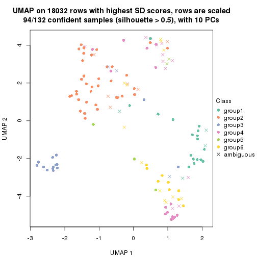</p>

</div>
</div>


Following heatmap shows how subgroups are split when increasing `k`:

```r
collect_classes(res)
```


Test correlation between subgroups and known annotations. If the known
annotation is numeric, one-way ANOVA test is applied, and if the known
annotation is discrete, chi-squared contingency table test is applied.

```r
test_to_known_factors(res)
```

```
#>          n disease.state(p) k
#> SD:NMF 131            0.020 2
#> SD:NMF 125            0.337 3
#> SD:NMF 110            0.620 4
#> SD:NMF  87            0.147 5
#> SD:NMF  94            0.142 6
```


If matrix rows can be associated to genes, consider to use `GO_Enrichment(res,
...)` to perform function enrichment for the signature genes.


 

---------------------------------------------------


### CV:hclust


The object with results only for a single top-value method and a single partition method 
can be extracted as:

```r
res = res_list["CV", "hclust"]
# you can also extract it by
# res = res_list["CV:hclust"]
```

A summary of `res` and all the functions that can be applied to it:

```r
res
```

```
#> A 'ConsensusPartition' object with k = 2, 3, 4, 5, 6.
#>   On a matrix with 18032 rows and 132 columns.
#>   Top rows (1000, 2000, 3000, 4000, 5000) are extracted by 'CV' method.
#>   Subgroups are detected by 'hclust' method.
#>   Performed in total 1250 partitions by row resampling.
#>   Best k for subgroups seems to be 3.
#> 
#> Following methods can be applied to this 'ConsensusPartition' object:
#>  [1] "cola_report"             "collect_classes"         "collect_plots"          
#>  [4] "collect_stats"           "colnames"                "compare_signatures"     
#>  [7] "consensus_heatmap"       "dimension_reduction"     "functional_enrichment"  
#> [10] "get_anno_col"            "get_anno"                "get_classes"            
#> [13] "get_consensus"           "get_matrix"              "get_membership"         
#> [16] "get_param"               "get_signatures"          "get_stats"              
#> [19] "is_best_k"               "is_stable_k"             "membership_heatmap"     
#> [22] "ncol"                    "nrow"                    "plot_ecdf"              
#> [25] "rownames"                "select_partition_number" "show"                   
#> [28] "suggest_best_k"          "test_to_known_factors"
```

`collect_plots()` function collects all the plots made from `res` for all `k` (number of partitions)
into one single page to provide an easy and fast comparison between different `k`.

```r
collect_plots(res)
```


The plots are:

- The first row: a plot of the ECDF (Empirical cumulative distribution
  function) curves of the consensus matrix for each `k` and the heatmap of
  predicted classes for each `k`.
- The second row: heatmaps of the consensus matrix for each `k`.
- The third row: heatmaps of the membership matrix for each `k`.
- The fouth row: heatmaps of the signatures for each `k`.

All the plots in panels can be made by individual functions and they are
plotted later in this section.

`select_partition_number()` produces several plots showing different
statistics for choosing "optimized" `k`. There are following statistics:

- ECDF curves of the consensus matrix for each `k`;
- 1-PAC. [The PAC
  score](https://en.wikipedia.org/wiki/Consensus_clustering#Over-interpretation_potential_of_consensus_clustering)
  measures the proportion of the ambiguous subgrouping.
- Mean silhouette score.
- Concordance. The mean probability of fiting the consensus class ids in all
  partitions.
- Area increased. Denote $A_k$ as the area under the ECDF curve for current
  `k`, the area increased is defined as $A_k - A_{k-1}$.
- Rand index. The percent of pairs of samples that are both in a same cluster
  or both are not in a same cluster in the partition of k and k-1.
- Jaccard index. The ratio of pairs of samples are both in a same cluster in
  the partition of k and k-1 and the pairs of samples are both in a same
  cluster in the partition k or k-1.

The detailed explanations of these statistics can be found in [the cola
vignette](http://bioconductor.org/packages/devel/bioc/vignettes/cola/inst/doc/cola.html#toc_13).

Generally speaking, lower PAC score, higher mean silhouette score or higher
concordance corresponds to better partition. Rand index and Jaccard index
measure how similar the current partition is compared to partition with `k-1`.
If they are too similar, we won't accept `k` is better than `k-1`.

```r
select_partition_number(res)
```


The numeric values for all these statistics can be obtained by `get_stats()`.

```r
get_stats(res)
```

```
#>   k 1-PAC mean_silhouette concordance area_increased  Rand Jaccard
#> 2 2 0.604           0.616       0.804          0.273 0.534   0.534
#> 3 3 0.760           0.894       0.920          0.512 0.719   0.614
#> 4 4 0.701           0.843       0.910          0.284 0.854   0.773
#> 5 5 0.489           0.525       0.721          0.301 0.759   0.519
#> 6 6 0.524           0.432       0.702          0.078 0.920   0.732
```

`suggest_best_k()` suggests the best $k$ based on these statistics. The rules are as follows:

- All $k$ with Jaccard index larger than 0.95 are removed because the increase of
  the partition number does not provides enough extra information. If all $k$ are removed,
  the best $k$ is assigned by `NA`.
- For $k$ with 1-PAC larger than 0.9, the maximal $k$ is taken as the "best k". Other $k$ is called "optional k".
- If it does not fit the second rule. The $k$ with the highest vote of highest
  1-PAC, mean silhouette and concordance is taken as the "best k".

```r
suggest_best_k(res)
```

```
#> [1] 3
```


Following shows the table of the partitions (You need to click the **show/hide
code output** link to see it). The membership matrix (columns with name `p*`)
is inferred by
[`clue::cl_consensus()`](https://www.rdocumentation.org/link/cl_consensus?package=clue)
function with the `SE` method. Basically the value in the membership matrix
represents the probability to belong to a certain group. The finall class
label for an item is determined with the group with highest probability it
belongs to.

In `get_classes()` function, the entropy is calculated from the membership
matrix and the silhouette score is calculated from the consensus matrix.


<script>
$( function() {
	$( '#tabs-CV-hclust-get-classes' ).tabs();
} );
</script>
<div id='tabs-CV-hclust-get-classes'>
<ul>
<li><a href='#tab-CV-hclust-get-classes-1'>k = 2</a></li>
<li><a href='#tab-CV-hclust-get-classes-2'>k = 3</a></li>
<li><a href='#tab-CV-hclust-get-classes-3'>k = 4</a></li>
<li><a href='#tab-CV-hclust-get-classes-4'>k = 5</a></li>
<li><a href='#tab-CV-hclust-get-classes-5'>k = 6</a></li>
</ul>

<div id='tab-CV-hclust-get-classes-1'>
<p><a id='tab-CV-hclust-get-classes-1-a' style='color:#0366d6' href='#'>show/hide code output</a></p>
<pre><code class="r">cbind(get_classes(res, k = 2), get_membership(res, k = 2))
</code></pre>

<pre><code>#&gt;           class entropy silhouette    p1    p2
#&gt; GSM289470     1  0.0376      0.409 0.996 0.004
#&gt; GSM289471     1  0.9983      0.431 0.524 0.476
#&gt; GSM289472     2  0.9983      0.993 0.476 0.524
#&gt; GSM289473     2  0.9983      0.993 0.476 0.524
#&gt; GSM289474     2  0.9983      0.993 0.476 0.524
#&gt; GSM289475     2  0.9983      0.993 0.476 0.524
#&gt; GSM289476     1  0.9983      0.431 0.524 0.476
#&gt; GSM289477     2  0.9983      0.993 0.476 0.524
#&gt; GSM289478     2  0.9983      0.993 0.476 0.524
#&gt; GSM289479     2  0.9983      0.993 0.476 0.524
#&gt; GSM289480     2  0.9983      0.993 0.476 0.524
#&gt; GSM289481     2  0.9983      0.993 0.476 0.524
#&gt; GSM289482     2  0.9983      0.993 0.476 0.524
#&gt; GSM289483     2  0.9983      0.993 0.476 0.524
#&gt; GSM289484     2  0.9983      0.993 0.476 0.524
#&gt; GSM289485     2  0.9983      0.993 0.476 0.524
#&gt; GSM289486     1  0.0000      0.411 1.000 0.000
#&gt; GSM289487     2  0.9983      0.993 0.476 0.524
#&gt; GSM289488     2  0.9983      0.993 0.476 0.524
#&gt; GSM289489     2  0.9983      0.993 0.476 0.524
#&gt; GSM289490     2  0.9977      0.986 0.472 0.528
#&gt; GSM289491     2  0.9977      0.986 0.472 0.528
#&gt; GSM289492     2  0.9977      0.986 0.472 0.528
#&gt; GSM289493     2  0.9983      0.993 0.476 0.524
#&gt; GSM289494     1  0.9922      0.436 0.552 0.448
#&gt; GSM289495     2  0.9983      0.993 0.476 0.524
#&gt; GSM289496     2  0.9983      0.993 0.476 0.524
#&gt; GSM289497     2  0.9983      0.993 0.476 0.524
#&gt; GSM289498     2  0.9977      0.986 0.472 0.528
#&gt; GSM289499     2  0.9983      0.993 0.476 0.524
#&gt; GSM289500     1  0.9933      0.435 0.548 0.452
#&gt; GSM289501     2  0.9983      0.993 0.476 0.524
#&gt; GSM289502     2  0.9983      0.993 0.476 0.524
#&gt; GSM289503     2  0.9983      0.993 0.476 0.524
#&gt; GSM289504     2  0.9983      0.993 0.476 0.524
#&gt; GSM289505     2  0.9983      0.993 0.476 0.524
#&gt; GSM289506     2  0.9983      0.993 0.476 0.524
#&gt; GSM289507     2  0.9983      0.993 0.476 0.524
#&gt; GSM289508     1  0.8327     -0.183 0.736 0.264
#&gt; GSM289509     1  0.9909     -0.294 0.556 0.444
#&gt; GSM289510     1  0.9993     -0.906 0.516 0.484
#&gt; GSM289511     2  0.9983      0.993 0.476 0.524
#&gt; GSM289512     1  0.9922      0.436 0.552 0.448
#&gt; GSM289513     2  1.0000      0.953 0.496 0.504
#&gt; GSM289514     1  0.9881     -0.717 0.564 0.436
#&gt; GSM289515     2  0.9993      0.979 0.484 0.516
#&gt; GSM289516     2  0.9983      0.993 0.476 0.524
#&gt; GSM289517     2  0.9993      0.979 0.484 0.516
#&gt; GSM289518     2  0.9993      0.979 0.484 0.516
#&gt; GSM289519     1  0.9933     -0.803 0.548 0.452
#&gt; GSM289520     2  0.9983      0.993 0.476 0.524
#&gt; GSM289521     1  0.9881     -0.717 0.564 0.436
#&gt; GSM289522     2  0.9988      0.986 0.480 0.520
#&gt; GSM289523     1  0.9983      0.431 0.524 0.476
#&gt; GSM289524     2  1.0000      0.953 0.496 0.504
#&gt; GSM289525     2  0.9993      0.979 0.484 0.516
#&gt; GSM289526     2  0.9922      0.644 0.448 0.552
#&gt; GSM289527     2  1.0000      0.953 0.496 0.504
#&gt; GSM289528     2  0.9983      0.993 0.476 0.524
#&gt; GSM289529     2  0.9988      0.986 0.480 0.520
#&gt; GSM289530     1  0.9815     -0.710 0.580 0.420
#&gt; GSM289531     2  0.9983      0.993 0.476 0.524
#&gt; GSM289532     1  1.0000     -0.882 0.504 0.496
#&gt; GSM289533     1  0.9996     -0.917 0.512 0.488
#&gt; GSM289534     1  0.9909      0.435 0.556 0.444
#&gt; GSM289535     2  0.9983      0.993 0.476 0.524
#&gt; GSM289536     1  0.9983      0.431 0.524 0.476
#&gt; GSM289537     2  0.9983      0.993 0.476 0.524
#&gt; GSM289538     2  0.9983      0.993 0.476 0.524
#&gt; GSM289539     2  0.9983      0.993 0.476 0.524
#&gt; GSM289540     1  1.0000     -0.882 0.504 0.496
#&gt; GSM289541     1  0.1414      0.398 0.980 0.020
#&gt; GSM289542     1  1.0000     -0.935 0.504 0.496
#&gt; GSM289543     2  0.9983      0.993 0.476 0.524
#&gt; GSM289544     1  0.8081     -0.126 0.752 0.248
#&gt; GSM289545     2  0.9983      0.993 0.476 0.524
#&gt; GSM289546     2  0.9983      0.993 0.476 0.524
#&gt; GSM289547     2  0.9983      0.993 0.476 0.524
#&gt; GSM289548     1  0.2603      0.374 0.956 0.044
#&gt; GSM289549     1  0.0376      0.409 0.996 0.004
#&gt; GSM289550     1  0.0672      0.406 0.992 0.008
#&gt; GSM289551     1  0.9983      0.431 0.524 0.476
#&gt; GSM289552     1  0.2236      0.382 0.964 0.036
#&gt; GSM289553     1  0.5178      0.259 0.884 0.116
#&gt; GSM289554     2  0.9983      0.993 0.476 0.524
#&gt; GSM289555     2  0.9983      0.993 0.476 0.524
#&gt; GSM289556     1  0.3733      0.335 0.928 0.072
#&gt; GSM289557     2  0.9983      0.993 0.476 0.524
#&gt; GSM289558     2  0.9983      0.993 0.476 0.524
#&gt; GSM289559     1  0.0000      0.411 1.000 0.000
#&gt; GSM289560     2  0.9983      0.993 0.476 0.524
#&gt; GSM289561     2  0.9983      0.993 0.476 0.524
#&gt; GSM289562     1  0.2603      0.374 0.956 0.044
#&gt; GSM289563     1  0.2603      0.374 0.956 0.044
#&gt; GSM289564     1  1.0000     -0.892 0.500 0.500
#&gt; GSM289565     1  0.9998     -0.873 0.508 0.492
#&gt; GSM289566     1  0.9732     -0.497 0.596 0.404
#&gt; GSM289567     2  0.9983      0.993 0.476 0.524
#&gt; GSM289568     2  0.9983      0.993 0.476 0.524
#&gt; GSM289569     2  0.9983      0.993 0.476 0.524
#&gt; GSM289570     2  0.9983      0.993 0.476 0.524
#&gt; GSM289571     2  0.9983      0.993 0.476 0.524
#&gt; GSM289572     2  0.9983      0.993 0.476 0.524
#&gt; GSM289573     2  0.9983      0.993 0.476 0.524
#&gt; GSM289574     2  0.9983      0.993 0.476 0.524
#&gt; GSM289575     2  0.9983      0.993 0.476 0.524
#&gt; GSM289576     2  0.9983      0.993 0.476 0.524
#&gt; GSM289577     2  0.9983      0.993 0.476 0.524
#&gt; GSM289578     2  0.9983      0.993 0.476 0.524
#&gt; GSM289579     2  0.9983      0.993 0.476 0.524
#&gt; GSM289580     1  0.9922      0.436 0.552 0.448
#&gt; GSM289581     1  0.9815     -0.710 0.580 0.420
#&gt; GSM289582     2  0.9988      0.986 0.480 0.520
#&gt; GSM289583     2  0.9983      0.993 0.476 0.524
#&gt; GSM289584     2  0.9983      0.993 0.476 0.524
#&gt; GSM289585     2  0.9983      0.993 0.476 0.524
#&gt; GSM289586     2  0.9983      0.993 0.476 0.524
#&gt; GSM289587     1  0.0000      0.411 1.000 0.000
#&gt; GSM289588     1  0.9983      0.431 0.524 0.476
#&gt; GSM289589     1  0.0000      0.411 1.000 0.000
#&gt; GSM289590     1  0.9491     -0.534 0.632 0.368
#&gt; GSM289591     1  0.0000      0.411 1.000 0.000
#&gt; GSM289592     2  0.9983      0.993 0.476 0.524
#&gt; GSM289593     1  0.9983      0.431 0.524 0.476
#&gt; GSM289594     2  0.9983      0.993 0.476 0.524
#&gt; GSM289595     1  0.9909     -0.294 0.556 0.444
#&gt; GSM289596     2  0.9983      0.993 0.476 0.524
#&gt; GSM289597     2  0.9988      0.986 0.480 0.520
#&gt; GSM289598     1  0.8327     -0.183 0.736 0.264
#&gt; GSM289599     2  0.9983      0.993 0.476 0.524
#&gt; GSM289600     1  0.5294      0.250 0.880 0.120
#&gt; GSM289601     1  0.9815     -0.671 0.580 0.420
</code></pre>

<script>
$('#tab-CV-hclust-get-classes-1-a').parent().next().next().hide();
$('#tab-CV-hclust-get-classes-1-a').click(function(){
  $('#tab-CV-hclust-get-classes-1-a').parent().next().next().toggle();
  return(false);
});
</script>
</div>

<div id='tab-CV-hclust-get-classes-2'>
<p><a id='tab-CV-hclust-get-classes-2-a' style='color:#0366d6' href='#'>show/hide code output</a></p>
<pre><code class="r">cbind(get_classes(res, k = 3), get_membership(res, k = 3))
</code></pre>

<pre><code>#&gt;           class entropy silhouette    p1    p2    p3
#&gt; GSM289470     1  0.0829      0.926 0.984 0.004 0.012
#&gt; GSM289471     3  0.3551      0.964 0.132 0.000 0.868
#&gt; GSM289472     2  0.0661      0.930 0.004 0.988 0.008
#&gt; GSM289473     2  0.2682      0.906 0.004 0.920 0.076
#&gt; GSM289474     2  0.1170      0.930 0.008 0.976 0.016
#&gt; GSM289475     2  0.0475      0.930 0.004 0.992 0.004
#&gt; GSM289476     3  0.3551      0.964 0.132 0.000 0.868
#&gt; GSM289477     2  0.0661      0.930 0.004 0.988 0.008
#&gt; GSM289478     2  0.0424      0.929 0.000 0.992 0.008
#&gt; GSM289479     2  0.2682      0.906 0.004 0.920 0.076
#&gt; GSM289480     2  0.0661      0.930 0.004 0.988 0.008
#&gt; GSM289481     2  0.2682      0.906 0.004 0.920 0.076
#&gt; GSM289482     2  0.0237      0.930 0.000 0.996 0.004
#&gt; GSM289483     2  0.0661      0.930 0.004 0.988 0.008
#&gt; GSM289484     2  0.0475      0.930 0.004 0.992 0.004
#&gt; GSM289485     2  0.0237      0.930 0.000 0.996 0.004
#&gt; GSM289486     1  0.0592      0.925 0.988 0.000 0.012
#&gt; GSM289487     2  0.0424      0.929 0.000 0.992 0.008
#&gt; GSM289488     2  0.0661      0.930 0.004 0.988 0.008
#&gt; GSM289489     2  0.1525      0.928 0.032 0.964 0.004
#&gt; GSM289490     2  0.1711      0.928 0.032 0.960 0.008
#&gt; GSM289491     2  0.1711      0.928 0.032 0.960 0.008
#&gt; GSM289492     2  0.1711      0.928 0.032 0.960 0.008
#&gt; GSM289493     2  0.0475      0.931 0.004 0.992 0.004
#&gt; GSM289494     3  0.4002      0.951 0.160 0.000 0.840
#&gt; GSM289495     2  0.2280      0.921 0.052 0.940 0.008
#&gt; GSM289496     2  0.0983      0.931 0.016 0.980 0.004
#&gt; GSM289497     2  0.0424      0.929 0.000 0.992 0.008
#&gt; GSM289498     2  0.1711      0.928 0.032 0.960 0.008
#&gt; GSM289499     2  0.2446      0.922 0.052 0.936 0.012
#&gt; GSM289500     3  0.3941      0.954 0.156 0.000 0.844
#&gt; GSM289501     2  0.0475      0.931 0.004 0.992 0.004
#&gt; GSM289502     2  0.0424      0.929 0.000 0.992 0.008
#&gt; GSM289503     2  0.0424      0.929 0.000 0.992 0.008
#&gt; GSM289504     2  0.2339      0.923 0.048 0.940 0.012
#&gt; GSM289505     2  0.2063      0.925 0.044 0.948 0.008
#&gt; GSM289506     2  0.0424      0.929 0.000 0.992 0.008
#&gt; GSM289507     2  0.0424      0.929 0.000 0.992 0.008
#&gt; GSM289508     2  0.6339      0.536 0.360 0.632 0.008
#&gt; GSM289509     2  0.8048      0.577 0.264 0.628 0.108
#&gt; GSM289510     2  0.3129      0.901 0.088 0.904 0.008
#&gt; GSM289511     2  0.0237      0.930 0.004 0.996 0.000
#&gt; GSM289512     3  0.4002      0.951 0.160 0.000 0.840
#&gt; GSM289513     2  0.2590      0.903 0.072 0.924 0.004
#&gt; GSM289514     2  0.6576      0.759 0.192 0.740 0.068
#&gt; GSM289515     2  0.0983      0.930 0.016 0.980 0.004
#&gt; GSM289516     2  0.0475      0.930 0.004 0.992 0.004
#&gt; GSM289517     2  0.0983      0.930 0.016 0.980 0.004
#&gt; GSM289518     2  0.0983      0.930 0.016 0.980 0.004
#&gt; GSM289519     2  0.5757      0.814 0.152 0.792 0.056
#&gt; GSM289520     2  0.0237      0.930 0.000 0.996 0.004
#&gt; GSM289521     2  0.6576      0.759 0.192 0.740 0.068
#&gt; GSM289522     2  0.0983      0.932 0.016 0.980 0.004
#&gt; GSM289523     3  0.3551      0.964 0.132 0.000 0.868
#&gt; GSM289524     2  0.2590      0.903 0.072 0.924 0.004
#&gt; GSM289525     2  0.0983      0.930 0.016 0.980 0.004
#&gt; GSM289526     2  0.6286      0.778 0.136 0.772 0.092
#&gt; GSM289527     2  0.2590      0.903 0.072 0.924 0.004
#&gt; GSM289528     2  0.0424      0.929 0.000 0.992 0.008
#&gt; GSM289529     2  0.3780      0.902 0.044 0.892 0.064
#&gt; GSM289530     2  0.6208      0.771 0.200 0.752 0.048
#&gt; GSM289531     2  0.2682      0.906 0.004 0.920 0.076
#&gt; GSM289532     2  0.6500      0.795 0.100 0.760 0.140
#&gt; GSM289533     2  0.2492      0.917 0.048 0.936 0.016
#&gt; GSM289534     3  0.6335      0.789 0.240 0.036 0.724
#&gt; GSM289535     2  0.2743      0.918 0.052 0.928 0.020
#&gt; GSM289536     3  0.3551      0.964 0.132 0.000 0.868
#&gt; GSM289537     2  0.1129      0.931 0.020 0.976 0.004
#&gt; GSM289538     2  0.1399      0.930 0.028 0.968 0.004
#&gt; GSM289539     2  0.0424      0.929 0.000 0.992 0.008
#&gt; GSM289540     2  0.6500      0.795 0.100 0.760 0.140
#&gt; GSM289541     1  0.1877      0.910 0.956 0.032 0.012
#&gt; GSM289542     2  0.2955      0.909 0.080 0.912 0.008
#&gt; GSM289543     2  0.2446      0.922 0.052 0.936 0.012
#&gt; GSM289544     2  0.8084      0.371 0.384 0.544 0.072
#&gt; GSM289545     2  0.1832      0.928 0.036 0.956 0.008
#&gt; GSM289546     2  0.1832      0.928 0.036 0.956 0.008
#&gt; GSM289547     2  0.0424      0.929 0.000 0.992 0.008
#&gt; GSM289548     1  0.2063      0.915 0.948 0.044 0.008
#&gt; GSM289549     1  0.0829      0.926 0.984 0.004 0.012
#&gt; GSM289550     1  0.0237      0.923 0.996 0.000 0.004
#&gt; GSM289551     3  0.3551      0.964 0.132 0.000 0.868
#&gt; GSM289552     1  0.2116      0.919 0.948 0.040 0.012
#&gt; GSM289553     1  0.3983      0.844 0.884 0.068 0.048
#&gt; GSM289554     2  0.2063      0.925 0.044 0.948 0.008
#&gt; GSM289555     2  0.0424      0.929 0.000 0.992 0.008
#&gt; GSM289556     1  0.2384      0.891 0.936 0.056 0.008
#&gt; GSM289557     2  0.0424      0.929 0.000 0.992 0.008
#&gt; GSM289558     2  0.0983      0.931 0.016 0.980 0.004
#&gt; GSM289559     1  0.0592      0.925 0.988 0.000 0.012
#&gt; GSM289560     2  0.0424      0.929 0.000 0.992 0.008
#&gt; GSM289561     2  0.0424      0.929 0.000 0.992 0.008
#&gt; GSM289562     1  0.2063      0.915 0.948 0.044 0.008
#&gt; GSM289563     1  0.2063      0.915 0.948 0.044 0.008
#&gt; GSM289564     2  0.6363      0.800 0.096 0.768 0.136
#&gt; GSM289565     2  0.6573      0.791 0.104 0.756 0.140
#&gt; GSM289566     2  0.7431      0.678 0.212 0.688 0.100
#&gt; GSM289567     2  0.3461      0.902 0.024 0.900 0.076
#&gt; GSM289568     2  0.0237      0.930 0.004 0.996 0.000
#&gt; GSM289569     2  0.0237      0.930 0.004 0.996 0.000
#&gt; GSM289570     2  0.3461      0.902 0.024 0.900 0.076
#&gt; GSM289571     2  0.1399      0.930 0.028 0.968 0.004
#&gt; GSM289572     2  0.2173      0.924 0.048 0.944 0.008
#&gt; GSM289573     2  0.0661      0.930 0.004 0.988 0.008
#&gt; GSM289574     2  0.0424      0.929 0.000 0.992 0.008
#&gt; GSM289575     2  0.1620      0.929 0.024 0.964 0.012
#&gt; GSM289576     2  0.1015      0.931 0.012 0.980 0.008
#&gt; GSM289577     2  0.1832      0.928 0.036 0.956 0.008
#&gt; GSM289578     2  0.1620      0.929 0.024 0.964 0.012
#&gt; GSM289579     2  0.1453      0.930 0.024 0.968 0.008
#&gt; GSM289580     3  0.4002      0.951 0.160 0.000 0.840
#&gt; GSM289581     2  0.6208      0.771 0.200 0.752 0.048
#&gt; GSM289582     2  0.2793      0.920 0.044 0.928 0.028
#&gt; GSM289583     2  0.0424      0.929 0.000 0.992 0.008
#&gt; GSM289584     2  0.0475      0.931 0.004 0.992 0.004
#&gt; GSM289585     2  0.0424      0.929 0.000 0.992 0.008
#&gt; GSM289586     2  0.2200      0.922 0.056 0.940 0.004
#&gt; GSM289587     1  0.0592      0.925 0.988 0.000 0.012
#&gt; GSM289588     3  0.3551      0.964 0.132 0.000 0.868
#&gt; GSM289589     1  0.0592      0.925 0.988 0.000 0.012
#&gt; GSM289590     2  0.6217      0.708 0.264 0.712 0.024
#&gt; GSM289591     1  0.0592      0.925 0.988 0.000 0.012
#&gt; GSM289592     2  0.0424      0.929 0.000 0.992 0.008
#&gt; GSM289593     3  0.3551      0.964 0.132 0.000 0.868
#&gt; GSM289594     2  0.1170      0.931 0.016 0.976 0.008
#&gt; GSM289595     2  0.8079      0.570 0.268 0.624 0.108
#&gt; GSM289596     2  0.0237      0.929 0.000 0.996 0.004
#&gt; GSM289597     2  0.0424      0.931 0.008 0.992 0.000
#&gt; GSM289598     2  0.6339      0.536 0.360 0.632 0.008
#&gt; GSM289599     2  0.2280      0.921 0.052 0.940 0.008
#&gt; GSM289600     1  0.4075      0.837 0.880 0.072 0.048
#&gt; GSM289601     2  0.6968      0.730 0.204 0.716 0.080
</code></pre>

<script>
$('#tab-CV-hclust-get-classes-2-a').parent().next().next().hide();
$('#tab-CV-hclust-get-classes-2-a').click(function(){
  $('#tab-CV-hclust-get-classes-2-a').parent().next().next().toggle();
  return(false);
});
</script>
</div>

<div id='tab-CV-hclust-get-classes-3'>
<p><a id='tab-CV-hclust-get-classes-3-a' style='color:#0366d6' href='#'>show/hide code output</a></p>
<pre><code class="r">cbind(get_classes(res, k = 4), get_membership(res, k = 4))
</code></pre>

<pre><code>#&gt;           class entropy silhouette    p1    p2    p3    p4
#&gt; GSM289470     1  0.0188     0.9543 0.996 0.004 0.000 0.000
#&gt; GSM289471     3  0.0000     0.9698 0.000 0.000 1.000 0.000
#&gt; GSM289472     2  0.0592     0.9132 0.000 0.984 0.000 0.016
#&gt; GSM289473     2  0.2345     0.8618 0.000 0.900 0.000 0.100
#&gt; GSM289474     2  0.1022     0.9108 0.000 0.968 0.000 0.032
#&gt; GSM289475     2  0.0469     0.9140 0.000 0.988 0.000 0.012
#&gt; GSM289476     3  0.0000     0.9698 0.000 0.000 1.000 0.000
#&gt; GSM289477     2  0.0469     0.9135 0.000 0.988 0.000 0.012
#&gt; GSM289478     2  0.0469     0.9126 0.000 0.988 0.000 0.012
#&gt; GSM289479     2  0.2281     0.8654 0.000 0.904 0.000 0.096
#&gt; GSM289480     2  0.0592     0.9132 0.000 0.984 0.000 0.016
#&gt; GSM289481     2  0.2281     0.8654 0.000 0.904 0.000 0.096
#&gt; GSM289482     2  0.0188     0.9135 0.000 0.996 0.000 0.004
#&gt; GSM289483     2  0.0469     0.9135 0.000 0.988 0.000 0.012
#&gt; GSM289484     2  0.0336     0.9132 0.000 0.992 0.000 0.008
#&gt; GSM289485     2  0.0188     0.9135 0.000 0.996 0.000 0.004
#&gt; GSM289486     1  0.0000     0.9568 1.000 0.000 0.000 0.000
#&gt; GSM289487     2  0.0469     0.9126 0.000 0.988 0.000 0.012
#&gt; GSM289488     2  0.0469     0.9135 0.000 0.988 0.000 0.012
#&gt; GSM289489     2  0.2281     0.8870 0.000 0.904 0.000 0.096
#&gt; GSM289490     2  0.1474     0.9076 0.000 0.948 0.000 0.052
#&gt; GSM289491     2  0.1474     0.9076 0.000 0.948 0.000 0.052
#&gt; GSM289492     2  0.1474     0.9076 0.000 0.948 0.000 0.052
#&gt; GSM289493     2  0.1211     0.9128 0.000 0.960 0.000 0.040
#&gt; GSM289494     3  0.1118     0.9559 0.000 0.000 0.964 0.036
#&gt; GSM289495     2  0.3311     0.8182 0.000 0.828 0.000 0.172
#&gt; GSM289496     2  0.1474     0.9099 0.000 0.948 0.000 0.052
#&gt; GSM289497     2  0.0592     0.9120 0.000 0.984 0.000 0.016
#&gt; GSM289498     2  0.1474     0.9076 0.000 0.948 0.000 0.052
#&gt; GSM289499     2  0.3311     0.8232 0.000 0.828 0.000 0.172
#&gt; GSM289500     3  0.0817     0.9608 0.000 0.000 0.976 0.024
#&gt; GSM289501     2  0.1211     0.9128 0.000 0.960 0.000 0.040
#&gt; GSM289502     2  0.0592     0.9120 0.000 0.984 0.000 0.016
#&gt; GSM289503     2  0.0592     0.9120 0.000 0.984 0.000 0.016
#&gt; GSM289504     2  0.2868     0.8609 0.000 0.864 0.000 0.136
#&gt; GSM289505     2  0.2647     0.8728 0.000 0.880 0.000 0.120
#&gt; GSM289506     2  0.0592     0.9120 0.000 0.984 0.000 0.016
#&gt; GSM289507     2  0.0592     0.9120 0.000 0.984 0.000 0.016
#&gt; GSM289508     2  0.5830     0.3568 0.332 0.620 0.000 0.048
#&gt; GSM289509     4  0.5715     0.5156 0.172 0.012 0.084 0.732
#&gt; GSM289510     2  0.5735     0.1079 0.032 0.576 0.000 0.392
#&gt; GSM289511     2  0.0469     0.9138 0.000 0.988 0.000 0.012
#&gt; GSM289512     3  0.1118     0.9559 0.000 0.000 0.964 0.036
#&gt; GSM289513     2  0.2376     0.8787 0.068 0.916 0.000 0.016
#&gt; GSM289514     4  0.6733     0.5825 0.112 0.324 0.000 0.564
#&gt; GSM289515     2  0.0804     0.9133 0.012 0.980 0.000 0.008
#&gt; GSM289516     2  0.0336     0.9138 0.000 0.992 0.000 0.008
#&gt; GSM289517     2  0.0804     0.9133 0.012 0.980 0.000 0.008
#&gt; GSM289518     2  0.0804     0.9133 0.012 0.980 0.000 0.008
#&gt; GSM289519     4  0.6707     0.3382 0.088 0.444 0.000 0.468
#&gt; GSM289520     2  0.0188     0.9135 0.000 0.996 0.000 0.004
#&gt; GSM289521     4  0.6716     0.5845 0.112 0.320 0.000 0.568
#&gt; GSM289522     2  0.1576     0.9085 0.004 0.948 0.000 0.048
#&gt; GSM289523     3  0.0000     0.9698 0.000 0.000 1.000 0.000
#&gt; GSM289524     2  0.2376     0.8787 0.068 0.916 0.000 0.016
#&gt; GSM289525     2  0.0804     0.9133 0.012 0.980 0.000 0.008
#&gt; GSM289526     2  0.5766     0.7058 0.100 0.764 0.080 0.056
#&gt; GSM289527     2  0.2376     0.8787 0.068 0.916 0.000 0.016
#&gt; GSM289528     2  0.0592     0.9120 0.000 0.984 0.000 0.016
#&gt; GSM289529     2  0.3801     0.7549 0.000 0.780 0.000 0.220
#&gt; GSM289530     4  0.6748     0.5785 0.112 0.328 0.000 0.560
#&gt; GSM289531     2  0.2345     0.8618 0.000 0.900 0.000 0.100
#&gt; GSM289532     4  0.0779     0.5906 0.004 0.016 0.000 0.980
#&gt; GSM289533     2  0.2408     0.8952 0.036 0.920 0.000 0.044
#&gt; GSM289534     3  0.4207     0.8380 0.076 0.032 0.848 0.044
#&gt; GSM289535     2  0.2921     0.8552 0.000 0.860 0.000 0.140
#&gt; GSM289536     3  0.0000     0.9698 0.000 0.000 1.000 0.000
#&gt; GSM289537     2  0.1867     0.8988 0.000 0.928 0.000 0.072
#&gt; GSM289538     2  0.2011     0.8945 0.000 0.920 0.000 0.080
#&gt; GSM289539     2  0.0592     0.9120 0.000 0.984 0.000 0.016
#&gt; GSM289540     4  0.0779     0.5906 0.004 0.016 0.000 0.980
#&gt; GSM289541     1  0.1022     0.9155 0.968 0.032 0.000 0.000
#&gt; GSM289542     2  0.3707     0.8371 0.028 0.840 0.000 0.132
#&gt; GSM289543     2  0.3356     0.8185 0.000 0.824 0.000 0.176
#&gt; GSM289544     4  0.7902     0.3724 0.336 0.300 0.000 0.364
#&gt; GSM289545     2  0.2345     0.8859 0.000 0.900 0.000 0.100
#&gt; GSM289546     2  0.2345     0.8859 0.000 0.900 0.000 0.100
#&gt; GSM289547     2  0.0592     0.9120 0.000 0.984 0.000 0.016
#&gt; GSM289548     1  0.1389     0.9477 0.952 0.000 0.000 0.048
#&gt; GSM289549     1  0.0188     0.9543 0.996 0.004 0.000 0.000
#&gt; GSM289550     1  0.0336     0.9563 0.992 0.000 0.000 0.008
#&gt; GSM289551     3  0.0000     0.9698 0.000 0.000 1.000 0.000
#&gt; GSM289552     1  0.1211     0.9501 0.960 0.000 0.000 0.040
#&gt; GSM289553     1  0.2888     0.8860 0.872 0.004 0.000 0.124
#&gt; GSM289554     2  0.2704     0.8693 0.000 0.876 0.000 0.124
#&gt; GSM289555     2  0.0707     0.9123 0.000 0.980 0.000 0.020
#&gt; GSM289556     1  0.2053     0.9288 0.924 0.004 0.000 0.072
#&gt; GSM289557     2  0.0817     0.9130 0.000 0.976 0.000 0.024
#&gt; GSM289558     2  0.1474     0.9099 0.000 0.948 0.000 0.052
#&gt; GSM289559     1  0.0000     0.9568 1.000 0.000 0.000 0.000
#&gt; GSM289560     2  0.0707     0.9123 0.000 0.980 0.000 0.020
#&gt; GSM289561     2  0.0707     0.9123 0.000 0.980 0.000 0.020
#&gt; GSM289562     1  0.1389     0.9477 0.952 0.000 0.000 0.048
#&gt; GSM289563     1  0.1389     0.9477 0.952 0.000 0.000 0.048
#&gt; GSM289564     4  0.1576     0.5990 0.004 0.048 0.000 0.948
#&gt; GSM289565     4  0.0804     0.5892 0.008 0.012 0.000 0.980
#&gt; GSM289566     2  0.7854     0.0657 0.172 0.536 0.028 0.264
#&gt; GSM289567     2  0.3649     0.7417 0.000 0.796 0.000 0.204
#&gt; GSM289568     2  0.0469     0.9138 0.000 0.988 0.000 0.012
#&gt; GSM289569     2  0.0188     0.9131 0.000 0.996 0.000 0.004
#&gt; GSM289570     2  0.3649     0.7417 0.000 0.796 0.000 0.204
#&gt; GSM289571     2  0.2011     0.8945 0.000 0.920 0.000 0.080
#&gt; GSM289572     2  0.2814     0.8626 0.000 0.868 0.000 0.132
#&gt; GSM289573     2  0.0921     0.9137 0.000 0.972 0.000 0.028
#&gt; GSM289574     2  0.0592     0.9120 0.000 0.984 0.000 0.016
#&gt; GSM289575     2  0.1792     0.9064 0.000 0.932 0.000 0.068
#&gt; GSM289576     2  0.1302     0.9132 0.000 0.956 0.000 0.044
#&gt; GSM289577     2  0.2345     0.8849 0.000 0.900 0.000 0.100
#&gt; GSM289578     2  0.1792     0.9064 0.000 0.932 0.000 0.068
#&gt; GSM289579     2  0.1716     0.9073 0.000 0.936 0.000 0.064
#&gt; GSM289580     3  0.1118     0.9559 0.000 0.000 0.964 0.036
#&gt; GSM289581     4  0.6748     0.5785 0.112 0.328 0.000 0.560
#&gt; GSM289582     2  0.3837     0.7386 0.000 0.776 0.000 0.224
#&gt; GSM289583     2  0.0592     0.9120 0.000 0.984 0.000 0.016
#&gt; GSM289584     2  0.1211     0.9128 0.000 0.960 0.000 0.040
#&gt; GSM289585     2  0.0592     0.9120 0.000 0.984 0.000 0.016
#&gt; GSM289586     2  0.3080     0.8695 0.024 0.880 0.000 0.096
#&gt; GSM289587     1  0.0000     0.9568 1.000 0.000 0.000 0.000
#&gt; GSM289588     3  0.0000     0.9698 0.000 0.000 1.000 0.000
#&gt; GSM289589     1  0.0000     0.9568 1.000 0.000 0.000 0.000
#&gt; GSM289590     4  0.3764     0.5396 0.172 0.012 0.000 0.816
#&gt; GSM289591     1  0.0000     0.9568 1.000 0.000 0.000 0.000
#&gt; GSM289592     2  0.0707     0.9123 0.000 0.980 0.000 0.020
#&gt; GSM289593     3  0.0000     0.9698 0.000 0.000 1.000 0.000
#&gt; GSM289594     2  0.1557     0.9102 0.000 0.944 0.000 0.056
#&gt; GSM289595     4  0.5756     0.5119 0.176 0.012 0.084 0.728
#&gt; GSM289596     2  0.1022     0.9137 0.000 0.968 0.000 0.032
#&gt; GSM289597     2  0.0376     0.9140 0.004 0.992 0.000 0.004
#&gt; GSM289598     2  0.5830     0.3568 0.332 0.620 0.000 0.048
#&gt; GSM289599     2  0.3311     0.8182 0.000 0.828 0.000 0.172
#&gt; GSM289600     1  0.3105     0.8819 0.868 0.012 0.000 0.120
#&gt; GSM289601     4  0.2988     0.5748 0.112 0.012 0.000 0.876
</code></pre>

<script>
$('#tab-CV-hclust-get-classes-3-a').parent().next().next().hide();
$('#tab-CV-hclust-get-classes-3-a').click(function(){
  $('#tab-CV-hclust-get-classes-3-a').parent().next().next().toggle();
  return(false);
});
</script>
</div>

<div id='tab-CV-hclust-get-classes-4'>
<p><a id='tab-CV-hclust-get-classes-4-a' style='color:#0366d6' href='#'>show/hide code output</a></p>
<pre><code class="r">cbind(get_classes(res, k = 5), get_membership(res, k = 5))
</code></pre>

<pre><code>#&gt;           class entropy silhouette    p1    p2    p3    p4    p5
#&gt; GSM289470     1  0.1662     0.9251 0.936 0.056 0.000 0.004 0.004
#&gt; GSM289471     3  0.0000     0.9685 0.000 0.000 1.000 0.000 0.000
#&gt; GSM289472     5  0.2377     0.6131 0.000 0.128 0.000 0.000 0.872
#&gt; GSM289473     5  0.5771    -0.1303 0.000 0.432 0.000 0.088 0.480
#&gt; GSM289474     5  0.4825     0.1203 0.000 0.408 0.000 0.024 0.568
#&gt; GSM289475     5  0.3366     0.5390 0.000 0.232 0.000 0.000 0.768
#&gt; GSM289476     3  0.0000     0.9685 0.000 0.000 1.000 0.000 0.000
#&gt; GSM289477     5  0.3586     0.5055 0.000 0.264 0.000 0.000 0.736
#&gt; GSM289478     5  0.2732     0.5996 0.000 0.160 0.000 0.000 0.840
#&gt; GSM289479     5  0.5391     0.3132 0.000 0.300 0.000 0.084 0.616
#&gt; GSM289480     5  0.2377     0.6131 0.000 0.128 0.000 0.000 0.872
#&gt; GSM289481     5  0.5409     0.3040 0.000 0.304 0.000 0.084 0.612
#&gt; GSM289482     5  0.3876     0.4153 0.000 0.316 0.000 0.000 0.684
#&gt; GSM289483     5  0.3586     0.5055 0.000 0.264 0.000 0.000 0.736
#&gt; GSM289484     5  0.4074     0.2813 0.000 0.364 0.000 0.000 0.636
#&gt; GSM289485     5  0.3876     0.4153 0.000 0.316 0.000 0.000 0.684
#&gt; GSM289486     1  0.0000     0.9449 1.000 0.000 0.000 0.000 0.000
#&gt; GSM289487     5  0.2732     0.5996 0.000 0.160 0.000 0.000 0.840
#&gt; GSM289488     5  0.3586     0.5055 0.000 0.264 0.000 0.000 0.736
#&gt; GSM289489     2  0.2997     0.5543 0.000 0.840 0.000 0.012 0.148
#&gt; GSM289490     2  0.3687     0.5555 0.000 0.792 0.000 0.028 0.180
#&gt; GSM289491     2  0.3687     0.5555 0.000 0.792 0.000 0.028 0.180
#&gt; GSM289492     2  0.3687     0.5555 0.000 0.792 0.000 0.028 0.180
#&gt; GSM289493     5  0.4464     0.1272 0.000 0.408 0.000 0.008 0.584
#&gt; GSM289494     3  0.1661     0.9539 0.000 0.024 0.940 0.036 0.000
#&gt; GSM289495     2  0.5268     0.5301 0.000 0.668 0.000 0.112 0.220
#&gt; GSM289496     5  0.4559    -0.1097 0.000 0.480 0.000 0.008 0.512
#&gt; GSM289497     5  0.0290     0.6317 0.000 0.008 0.000 0.000 0.992
#&gt; GSM289498     2  0.3687     0.5555 0.000 0.792 0.000 0.028 0.180
#&gt; GSM289499     2  0.5354     0.5242 0.000 0.652 0.000 0.108 0.240
#&gt; GSM289500     3  0.1300     0.9587 0.000 0.016 0.956 0.028 0.000
#&gt; GSM289501     5  0.4464     0.1272 0.000 0.408 0.000 0.008 0.584
#&gt; GSM289502     5  0.0290     0.6317 0.000 0.008 0.000 0.000 0.992
#&gt; GSM289503     5  0.1197     0.6322 0.000 0.048 0.000 0.000 0.952
#&gt; GSM289504     2  0.5441     0.4478 0.000 0.596 0.000 0.080 0.324
#&gt; GSM289505     2  0.5447     0.4071 0.000 0.572 0.000 0.072 0.356
#&gt; GSM289506     5  0.0000     0.6294 0.000 0.000 0.000 0.000 1.000
#&gt; GSM289507     5  0.0000     0.6294 0.000 0.000 0.000 0.000 1.000
#&gt; GSM289508     2  0.6476     0.2687 0.332 0.532 0.000 0.028 0.108
#&gt; GSM289509     4  0.5515     0.6131 0.148 0.068 0.068 0.716 0.000
#&gt; GSM289510     2  0.6893     0.0592 0.020 0.456 0.000 0.348 0.176
#&gt; GSM289511     2  0.4249     0.3208 0.000 0.568 0.000 0.000 0.432
#&gt; GSM289512     3  0.1661     0.9539 0.000 0.024 0.940 0.036 0.000
#&gt; GSM289513     2  0.4317     0.4285 0.008 0.668 0.000 0.004 0.320
#&gt; GSM289514     4  0.6160     0.5988 0.088 0.388 0.000 0.508 0.016
#&gt; GSM289515     2  0.4695     0.2451 0.008 0.524 0.000 0.004 0.464
#&gt; GSM289516     2  0.4437     0.2503 0.000 0.532 0.000 0.004 0.464
#&gt; GSM289517     2  0.4695     0.2451 0.008 0.524 0.000 0.004 0.464
#&gt; GSM289518     2  0.4695     0.2451 0.008 0.524 0.000 0.004 0.464
#&gt; GSM289519     4  0.7090     0.3268 0.064 0.416 0.000 0.416 0.104
#&gt; GSM289520     5  0.3895     0.4060 0.000 0.320 0.000 0.000 0.680
#&gt; GSM289521     4  0.6153     0.6056 0.088 0.384 0.000 0.512 0.016
#&gt; GSM289522     2  0.5334     0.3006 0.000 0.512 0.000 0.052 0.436
#&gt; GSM289523     3  0.0000     0.9685 0.000 0.000 1.000 0.000 0.000
#&gt; GSM289524     2  0.4317     0.4285 0.008 0.668 0.000 0.004 0.320
#&gt; GSM289525     2  0.4695     0.2451 0.008 0.524 0.000 0.004 0.464
#&gt; GSM289526     2  0.5576     0.4761 0.040 0.744 0.056 0.044 0.116
#&gt; GSM289527     2  0.4317     0.4285 0.008 0.668 0.000 0.004 0.320
#&gt; GSM289528     5  0.0162     0.6311 0.000 0.004 0.000 0.000 0.996
#&gt; GSM289529     2  0.4723     0.5251 0.000 0.736 0.000 0.132 0.132
#&gt; GSM289530     4  0.6124     0.5676 0.088 0.448 0.000 0.452 0.012
#&gt; GSM289531     5  0.5771    -0.1303 0.000 0.432 0.000 0.088 0.480
#&gt; GSM289532     4  0.1544     0.6888 0.000 0.068 0.000 0.932 0.000
#&gt; GSM289533     2  0.5576     0.3342 0.024 0.544 0.000 0.032 0.400
#&gt; GSM289534     3  0.4195     0.8443 0.076 0.056 0.824 0.036 0.008
#&gt; GSM289535     2  0.5010     0.5267 0.000 0.676 0.000 0.076 0.248
#&gt; GSM289536     3  0.0000     0.9685 0.000 0.000 1.000 0.000 0.000
#&gt; GSM289537     5  0.5114    -0.1891 0.000 0.476 0.000 0.036 0.488
#&gt; GSM289538     2  0.5059     0.3499 0.000 0.548 0.000 0.036 0.416
#&gt; GSM289539     5  0.0000     0.6294 0.000 0.000 0.000 0.000 1.000
#&gt; GSM289540     4  0.1043     0.6878 0.000 0.040 0.000 0.960 0.000
#&gt; GSM289541     1  0.1018     0.9201 0.968 0.016 0.000 0.000 0.016
#&gt; GSM289542     2  0.5296     0.5467 0.028 0.700 0.000 0.064 0.208
#&gt; GSM289543     2  0.5322     0.5297 0.000 0.660 0.000 0.112 0.228
#&gt; GSM289544     2  0.7134    -0.4984 0.320 0.360 0.000 0.308 0.012
#&gt; GSM289545     2  0.4857     0.4726 0.000 0.636 0.000 0.040 0.324
#&gt; GSM289546     2  0.4905     0.4590 0.000 0.624 0.000 0.040 0.336
#&gt; GSM289547     5  0.0000     0.6294 0.000 0.000 0.000 0.000 1.000
#&gt; GSM289548     1  0.1800     0.9349 0.932 0.048 0.000 0.020 0.000
#&gt; GSM289549     1  0.1662     0.9251 0.936 0.056 0.000 0.004 0.004
#&gt; GSM289550     1  0.0290     0.9444 0.992 0.000 0.000 0.008 0.000
#&gt; GSM289551     3  0.0000     0.9685 0.000 0.000 1.000 0.000 0.000
#&gt; GSM289552     1  0.1211     0.9411 0.960 0.024 0.000 0.016 0.000
#&gt; GSM289553     1  0.3112     0.8805 0.856 0.044 0.000 0.100 0.000
#&gt; GSM289554     2  0.5509     0.4015 0.000 0.564 0.000 0.076 0.360
#&gt; GSM289555     5  0.0794     0.6206 0.000 0.028 0.000 0.000 0.972
#&gt; GSM289556     1  0.2378     0.9195 0.904 0.048 0.000 0.048 0.000
#&gt; GSM289557     5  0.2929     0.5603 0.000 0.180 0.000 0.000 0.820
#&gt; GSM289558     5  0.4559    -0.1097 0.000 0.480 0.000 0.008 0.512
#&gt; GSM289559     1  0.0000     0.9449 1.000 0.000 0.000 0.000 0.000
#&gt; GSM289560     5  0.0794     0.6206 0.000 0.028 0.000 0.000 0.972
#&gt; GSM289561     5  0.0794     0.6206 0.000 0.028 0.000 0.000 0.972
#&gt; GSM289562     1  0.1800     0.9349 0.932 0.048 0.000 0.020 0.000
#&gt; GSM289563     1  0.1800     0.9349 0.932 0.048 0.000 0.020 0.000
#&gt; GSM289564     4  0.2293     0.6854 0.000 0.084 0.000 0.900 0.016
#&gt; GSM289565     4  0.1124     0.6863 0.004 0.036 0.000 0.960 0.000
#&gt; GSM289566     2  0.7718     0.0383 0.172 0.528 0.020 0.200 0.080
#&gt; GSM289567     2  0.6097     0.4179 0.000 0.556 0.000 0.168 0.276
#&gt; GSM289568     2  0.4249     0.3208 0.000 0.568 0.000 0.000 0.432
#&gt; GSM289569     2  0.4294     0.2428 0.000 0.532 0.000 0.000 0.468
#&gt; GSM289570     2  0.6097     0.4179 0.000 0.556 0.000 0.168 0.276
#&gt; GSM289571     2  0.5059     0.3499 0.000 0.548 0.000 0.036 0.416
#&gt; GSM289572     2  0.5484     0.4305 0.000 0.584 0.000 0.080 0.336
#&gt; GSM289573     5  0.2852     0.5579 0.000 0.172 0.000 0.000 0.828
#&gt; GSM289574     5  0.0000     0.6294 0.000 0.000 0.000 0.000 1.000
#&gt; GSM289575     2  0.4743     0.1735 0.000 0.512 0.000 0.016 0.472
#&gt; GSM289576     5  0.4150     0.1815 0.000 0.388 0.000 0.000 0.612
#&gt; GSM289577     2  0.5226     0.3842 0.000 0.572 0.000 0.052 0.376
#&gt; GSM289578     2  0.4743     0.1735 0.000 0.512 0.000 0.016 0.472
#&gt; GSM289579     2  0.4655     0.1607 0.000 0.512 0.000 0.012 0.476
#&gt; GSM289580     3  0.1661     0.9539 0.000 0.024 0.940 0.036 0.000
#&gt; GSM289581     4  0.6124     0.5676 0.088 0.448 0.000 0.452 0.012
#&gt; GSM289582     2  0.4498     0.5180 0.000 0.756 0.000 0.132 0.112
#&gt; GSM289583     5  0.0000     0.6294 0.000 0.000 0.000 0.000 1.000
#&gt; GSM289584     5  0.4392     0.1952 0.000 0.380 0.000 0.008 0.612
#&gt; GSM289585     5  0.0000     0.6294 0.000 0.000 0.000 0.000 1.000
#&gt; GSM289586     2  0.2674     0.5457 0.000 0.868 0.000 0.012 0.120
#&gt; GSM289587     1  0.0000     0.9449 1.000 0.000 0.000 0.000 0.000
#&gt; GSM289588     3  0.0000     0.9685 0.000 0.000 1.000 0.000 0.000
#&gt; GSM289589     1  0.0000     0.9449 1.000 0.000 0.000 0.000 0.000
#&gt; GSM289590     4  0.4254     0.6498 0.148 0.080 0.000 0.772 0.000
#&gt; GSM289591     1  0.0000     0.9449 1.000 0.000 0.000 0.000 0.000
#&gt; GSM289592     5  0.0794     0.6206 0.000 0.028 0.000 0.000 0.972
#&gt; GSM289593     3  0.0000     0.9685 0.000 0.000 1.000 0.000 0.000
#&gt; GSM289594     5  0.4560    -0.1058 0.000 0.484 0.000 0.008 0.508
#&gt; GSM289595     4  0.5553     0.6096 0.152 0.068 0.068 0.712 0.000
#&gt; GSM289596     5  0.3561     0.4538 0.000 0.260 0.000 0.000 0.740
#&gt; GSM289597     2  0.4443     0.2317 0.004 0.524 0.000 0.000 0.472
#&gt; GSM289598     2  0.6476     0.2687 0.332 0.532 0.000 0.028 0.108
#&gt; GSM289599     2  0.5268     0.5301 0.000 0.668 0.000 0.112 0.220
#&gt; GSM289600     1  0.3201     0.8775 0.852 0.052 0.000 0.096 0.000
#&gt; GSM289601     4  0.3648     0.6805 0.092 0.084 0.000 0.824 0.000
</code></pre>

<script>
$('#tab-CV-hclust-get-classes-4-a').parent().next().next().hide();
$('#tab-CV-hclust-get-classes-4-a').click(function(){
  $('#tab-CV-hclust-get-classes-4-a').parent().next().next().toggle();
  return(false);
});
</script>
</div>

<div id='tab-CV-hclust-get-classes-5'>
<p><a id='tab-CV-hclust-get-classes-5-a' style='color:#0366d6' href='#'>show/hide code output</a></p>
<pre><code class="r">cbind(get_classes(res, k = 6), get_membership(res, k = 6))
</code></pre>

<pre><code>#&gt;           class entropy silhouette    p1    p2    p3    p4    p5    p6
#&gt; GSM289470     1  0.1890     0.8763 0.924 0.024 0.000 0.044 0.000 0.008
#&gt; GSM289471     3  0.0000     0.9477 0.000 0.000 1.000 0.000 0.000 0.000
#&gt; GSM289472     5  0.2858     0.6338 0.000 0.124 0.000 0.032 0.844 0.000
#&gt; GSM289473     5  0.6041    -0.0395 0.000 0.312 0.000 0.272 0.416 0.000
#&gt; GSM289474     5  0.5343     0.0867 0.000 0.408 0.000 0.108 0.484 0.000
#&gt; GSM289475     5  0.4024     0.5043 0.000 0.264 0.000 0.036 0.700 0.000
#&gt; GSM289476     3  0.0000     0.9477 0.000 0.000 1.000 0.000 0.000 0.000
#&gt; GSM289477     5  0.4284     0.5083 0.000 0.256 0.000 0.056 0.688 0.000
#&gt; GSM289478     5  0.3351     0.6092 0.000 0.160 0.000 0.040 0.800 0.000
#&gt; GSM289479     5  0.5507     0.2895 0.000 0.284 0.000 0.168 0.548 0.000
#&gt; GSM289480     5  0.2858     0.6338 0.000 0.124 0.000 0.032 0.844 0.000
#&gt; GSM289481     5  0.5519     0.2887 0.000 0.280 0.000 0.172 0.548 0.000
#&gt; GSM289482     5  0.4635     0.3633 0.000 0.336 0.000 0.056 0.608 0.000
#&gt; GSM289483     5  0.4284     0.5083 0.000 0.256 0.000 0.056 0.688 0.000
#&gt; GSM289484     5  0.5035     0.2407 0.000 0.360 0.000 0.084 0.556 0.000
#&gt; GSM289485     5  0.4635     0.3633 0.000 0.336 0.000 0.056 0.608 0.000
#&gt; GSM289486     1  0.0146     0.9030 0.996 0.000 0.000 0.000 0.000 0.004
#&gt; GSM289487     5  0.3351     0.6092 0.000 0.160 0.000 0.040 0.800 0.000
#&gt; GSM289488     5  0.4284     0.5083 0.000 0.256 0.000 0.056 0.688 0.000
#&gt; GSM289489     2  0.4621    -0.2251 0.000 0.612 0.000 0.332 0.056 0.000
#&gt; GSM289490     2  0.3642     0.1234 0.000 0.760 0.000 0.204 0.036 0.000
#&gt; GSM289491     2  0.3642     0.1234 0.000 0.760 0.000 0.204 0.036 0.000
#&gt; GSM289492     2  0.3642     0.1234 0.000 0.760 0.000 0.204 0.036 0.000
#&gt; GSM289493     2  0.4096     0.0997 0.000 0.508 0.000 0.008 0.484 0.000
#&gt; GSM289494     3  0.2003     0.9192 0.000 0.000 0.884 0.116 0.000 0.000
#&gt; GSM289495     2  0.3740     0.3675 0.000 0.808 0.000 0.020 0.100 0.072
#&gt; GSM289496     2  0.4018     0.2523 0.000 0.580 0.000 0.008 0.412 0.000
#&gt; GSM289497     5  0.0363     0.6623 0.000 0.012 0.000 0.000 0.988 0.000
#&gt; GSM289498     2  0.3642     0.1234 0.000 0.760 0.000 0.204 0.036 0.000
#&gt; GSM289499     2  0.3962     0.3762 0.000 0.788 0.000 0.020 0.120 0.072
#&gt; GSM289500     3  0.1663     0.9278 0.000 0.000 0.912 0.088 0.000 0.000
#&gt; GSM289501     2  0.4096     0.0997 0.000 0.508 0.000 0.008 0.484 0.000
#&gt; GSM289502     5  0.0363     0.6623 0.000 0.012 0.000 0.000 0.988 0.000
#&gt; GSM289503     5  0.1391     0.6589 0.000 0.040 0.000 0.016 0.944 0.000
#&gt; GSM289504     2  0.4214     0.4212 0.000 0.732 0.000 0.020 0.212 0.036
#&gt; GSM289505     2  0.4339     0.4229 0.000 0.696 0.000 0.016 0.256 0.032
#&gt; GSM289506     5  0.0000     0.6599 0.000 0.000 0.000 0.000 1.000 0.000
#&gt; GSM289507     5  0.0000     0.6599 0.000 0.000 0.000 0.000 1.000 0.000
#&gt; GSM289508     2  0.5971    -0.2467 0.332 0.496 0.000 0.156 0.016 0.000
#&gt; GSM289509     6  0.3355     0.5533 0.040 0.000 0.016 0.116 0.000 0.828
#&gt; GSM289510     6  0.7200    -0.3379 0.000 0.328 0.000 0.184 0.112 0.376
#&gt; GSM289511     2  0.5772     0.1695 0.000 0.468 0.000 0.184 0.348 0.000
#&gt; GSM289512     3  0.2003     0.9192 0.000 0.000 0.884 0.116 0.000 0.000
#&gt; GSM289513     2  0.6128    -0.0902 0.000 0.464 0.000 0.268 0.260 0.008
#&gt; GSM289514     6  0.5858     0.3474 0.016 0.168 0.000 0.204 0.012 0.600
#&gt; GSM289515     2  0.5974     0.1921 0.000 0.464 0.000 0.160 0.364 0.012
#&gt; GSM289516     2  0.5667     0.1975 0.000 0.472 0.000 0.160 0.368 0.000
#&gt; GSM289517     2  0.5974     0.1921 0.000 0.464 0.000 0.160 0.364 0.012
#&gt; GSM289518     2  0.5974     0.1921 0.000 0.464 0.000 0.160 0.364 0.012
#&gt; GSM289519     6  0.7044    -0.0144 0.012 0.232 0.000 0.200 0.076 0.480
#&gt; GSM289520     5  0.4687     0.3534 0.000 0.336 0.000 0.060 0.604 0.000
#&gt; GSM289521     6  0.5830     0.3560 0.016 0.164 0.000 0.204 0.012 0.604
#&gt; GSM289522     2  0.6372     0.2085 0.000 0.464 0.000 0.156 0.340 0.040
#&gt; GSM289523     3  0.0000     0.9477 0.000 0.000 1.000 0.000 0.000 0.000
#&gt; GSM289524     2  0.6128    -0.0902 0.000 0.464 0.000 0.268 0.260 0.008
#&gt; GSM289525     2  0.5974     0.1921 0.000 0.464 0.000 0.160 0.364 0.012
#&gt; GSM289526     4  0.5845     0.3867 0.028 0.424 0.000 0.472 0.064 0.012
#&gt; GSM289527     2  0.6128    -0.0902 0.000 0.464 0.000 0.268 0.260 0.008
#&gt; GSM289528     5  0.0146     0.6614 0.000 0.004 0.000 0.000 0.996 0.000
#&gt; GSM289529     2  0.5185    -0.3655 0.000 0.500 0.000 0.432 0.052 0.016
#&gt; GSM289530     6  0.6151     0.3172 0.016 0.204 0.000 0.296 0.000 0.484
#&gt; GSM289531     5  0.6041    -0.0395 0.000 0.312 0.000 0.272 0.416 0.000
#&gt; GSM289532     6  0.4026     0.5260 0.000 0.016 0.000 0.348 0.000 0.636
#&gt; GSM289533     2  0.6409     0.0593 0.012 0.420 0.000 0.244 0.320 0.004
#&gt; GSM289534     3  0.4216     0.8155 0.076 0.024 0.768 0.132 0.000 0.000
#&gt; GSM289535     2  0.3778     0.3886 0.000 0.800 0.000 0.048 0.128 0.024
#&gt; GSM289536     3  0.0000     0.9477 0.000 0.000 1.000 0.000 0.000 0.000
#&gt; GSM289537     2  0.4435     0.2639 0.000 0.580 0.000 0.024 0.392 0.004
#&gt; GSM289538     2  0.4214     0.3824 0.000 0.652 0.000 0.024 0.320 0.004
#&gt; GSM289539     5  0.0000     0.6599 0.000 0.000 0.000 0.000 1.000 0.000
#&gt; GSM289540     6  0.3884     0.5421 0.000 0.036 0.000 0.240 0.000 0.724
#&gt; GSM289541     1  0.1053     0.8862 0.964 0.020 0.000 0.000 0.012 0.004
#&gt; GSM289542     2  0.3956     0.3420 0.028 0.816 0.000 0.040 0.088 0.028
#&gt; GSM289543     2  0.3832     0.3660 0.000 0.800 0.000 0.020 0.108 0.072
#&gt; GSM289544     6  0.7506     0.1035 0.248 0.120 0.000 0.232 0.008 0.392
#&gt; GSM289545     2  0.3855     0.4202 0.000 0.748 0.000 0.024 0.216 0.012
#&gt; GSM289546     2  0.3987     0.4191 0.000 0.728 0.000 0.024 0.236 0.012
#&gt; GSM289547     5  0.0000     0.6599 0.000 0.000 0.000 0.000 1.000 0.000
#&gt; GSM289548     1  0.2595     0.8614 0.836 0.000 0.000 0.004 0.000 0.160
#&gt; GSM289549     1  0.1890     0.8763 0.924 0.024 0.000 0.044 0.000 0.008
#&gt; GSM289550     1  0.0820     0.9013 0.972 0.000 0.000 0.016 0.000 0.012
#&gt; GSM289551     3  0.0000     0.9477 0.000 0.000 1.000 0.000 0.000 0.000
#&gt; GSM289552     1  0.1007     0.9004 0.956 0.000 0.000 0.000 0.000 0.044
#&gt; GSM289553     1  0.3587     0.8154 0.772 0.000 0.000 0.040 0.000 0.188
#&gt; GSM289554     2  0.4419     0.4294 0.000 0.700 0.000 0.020 0.244 0.036
#&gt; GSM289555     5  0.1701     0.6338 0.000 0.072 0.000 0.008 0.920 0.000
#&gt; GSM289556     1  0.3189     0.8378 0.796 0.000 0.000 0.020 0.000 0.184
#&gt; GSM289557     5  0.3217     0.5115 0.000 0.224 0.000 0.008 0.768 0.000
#&gt; GSM289558     2  0.4018     0.2523 0.000 0.580 0.000 0.008 0.412 0.000
#&gt; GSM289559     1  0.0000     0.9018 1.000 0.000 0.000 0.000 0.000 0.000
#&gt; GSM289560     5  0.1701     0.6338 0.000 0.072 0.000 0.008 0.920 0.000
#&gt; GSM289561     5  0.1701     0.6338 0.000 0.072 0.000 0.008 0.920 0.000
#&gt; GSM289562     1  0.2595     0.8614 0.836 0.000 0.000 0.004 0.000 0.160
#&gt; GSM289563     1  0.2595     0.8614 0.836 0.000 0.000 0.004 0.000 0.160
#&gt; GSM289564     6  0.4734     0.5105 0.000 0.032 0.000 0.348 0.016 0.604
#&gt; GSM289565     6  0.3487     0.5467 0.000 0.020 0.000 0.224 0.000 0.756
#&gt; GSM289566     4  0.7983     0.3244 0.168 0.284 0.012 0.384 0.024 0.128
#&gt; GSM289567     2  0.7007    -0.1898 0.000 0.368 0.000 0.344 0.216 0.072
#&gt; GSM289568     2  0.5772     0.1695 0.000 0.468 0.000 0.184 0.348 0.000
#&gt; GSM289569     2  0.5653     0.1858 0.000 0.468 0.000 0.156 0.376 0.000
#&gt; GSM289570     2  0.7007    -0.1898 0.000 0.368 0.000 0.344 0.216 0.072
#&gt; GSM289571     2  0.4214     0.3824 0.000 0.652 0.000 0.024 0.320 0.004
#&gt; GSM289572     2  0.4295     0.4224 0.000 0.720 0.000 0.020 0.224 0.036
#&gt; GSM289573     5  0.2964     0.5224 0.000 0.204 0.000 0.004 0.792 0.000
#&gt; GSM289574     5  0.0000     0.6599 0.000 0.000 0.000 0.000 1.000 0.000
#&gt; GSM289575     2  0.4199     0.3259 0.000 0.620 0.000 0.016 0.360 0.004
#&gt; GSM289576     5  0.3975     0.0336 0.000 0.452 0.000 0.004 0.544 0.000
#&gt; GSM289577     2  0.4052     0.4307 0.000 0.708 0.000 0.012 0.260 0.020
#&gt; GSM289578     2  0.4199     0.3259 0.000 0.620 0.000 0.016 0.360 0.004
#&gt; GSM289579     2  0.4127     0.3203 0.000 0.620 0.000 0.012 0.364 0.004
#&gt; GSM289580     3  0.2003     0.9192 0.000 0.000 0.884 0.116 0.000 0.000
#&gt; GSM289581     6  0.6151     0.3172 0.016 0.204 0.000 0.296 0.000 0.484
#&gt; GSM289582     2  0.5460    -0.4001 0.000 0.496 0.000 0.420 0.044 0.040
#&gt; GSM289583     5  0.0000     0.6599 0.000 0.000 0.000 0.000 1.000 0.000
#&gt; GSM289584     5  0.4093    -0.0632 0.000 0.476 0.000 0.008 0.516 0.000
#&gt; GSM289585     5  0.0000     0.6599 0.000 0.000 0.000 0.000 1.000 0.000
#&gt; GSM289586     2  0.4249    -0.2812 0.000 0.640 0.000 0.328 0.032 0.000
#&gt; GSM289587     1  0.0146     0.9030 0.996 0.000 0.000 0.000 0.000 0.004
#&gt; GSM289588     3  0.0000     0.9477 0.000 0.000 1.000 0.000 0.000 0.000
#&gt; GSM289589     1  0.0146     0.9030 0.996 0.000 0.000 0.000 0.000 0.004
#&gt; GSM289590     6  0.1480     0.5770 0.040 0.000 0.000 0.020 0.000 0.940
#&gt; GSM289591     1  0.0000     0.9018 1.000 0.000 0.000 0.000 0.000 0.000
#&gt; GSM289592     5  0.1701     0.6338 0.000 0.072 0.000 0.008 0.920 0.000
#&gt; GSM289593     3  0.0000     0.9477 0.000 0.000 1.000 0.000 0.000 0.000
#&gt; GSM289594     2  0.3993     0.2658 0.000 0.592 0.000 0.008 0.400 0.000
#&gt; GSM289595     6  0.3421     0.5523 0.044 0.000 0.016 0.116 0.000 0.824
#&gt; GSM289596     5  0.3725     0.3592 0.000 0.316 0.000 0.008 0.676 0.000
#&gt; GSM289597     2  0.5777     0.1829 0.000 0.468 0.000 0.156 0.372 0.004
#&gt; GSM289598     2  0.5971    -0.2467 0.332 0.496 0.000 0.156 0.016 0.000
#&gt; GSM289599     2  0.3740     0.3675 0.000 0.808 0.000 0.020 0.100 0.072
#&gt; GSM289600     1  0.3769     0.8112 0.768 0.008 0.000 0.036 0.000 0.188
#&gt; GSM289601     6  0.1168     0.5834 0.016 0.000 0.000 0.028 0.000 0.956
</code></pre>

<script>
$('#tab-CV-hclust-get-classes-5-a').parent().next().next().hide();
$('#tab-CV-hclust-get-classes-5-a').click(function(){
  $('#tab-CV-hclust-get-classes-5-a').parent().next().next().toggle();
  return(false);
});
</script>
</div>
</div>

Heatmaps for the consensus matrix. It visualizes the probability of two
samples to be in a same group.


<script>
$( function() {
	$( '#tabs-CV-hclust-consensus-heatmap' ).tabs();
} );
</script>
<div id='tabs-CV-hclust-consensus-heatmap'>
<ul>
<li><a href='#tab-CV-hclust-consensus-heatmap-1'>k = 2</a></li>
<li><a href='#tab-CV-hclust-consensus-heatmap-2'>k = 3</a></li>
<li><a href='#tab-CV-hclust-consensus-heatmap-3'>k = 4</a></li>
<li><a href='#tab-CV-hclust-consensus-heatmap-4'>k = 5</a></li>
<li><a href='#tab-CV-hclust-consensus-heatmap-5'>k = 6</a></li>
</ul>
<div id='tab-CV-hclust-consensus-heatmap-1'>
<pre><code class="r">consensus_heatmap(res, k = 2)
</code></pre>

<p></p>

</div>
<div id='tab-CV-hclust-consensus-heatmap-2'>
<pre><code class="r">consensus_heatmap(res, k = 3)
</code></pre>

<p></p>

</div>
<div id='tab-CV-hclust-consensus-heatmap-3'>
<pre><code class="r">consensus_heatmap(res, k = 4)
</code></pre>

<p></p>

</div>
<div id='tab-CV-hclust-consensus-heatmap-4'>
<pre><code class="r">consensus_heatmap(res, k = 5)
</code></pre>

<p></p>

</div>
<div id='tab-CV-hclust-consensus-heatmap-5'>
<pre><code class="r">consensus_heatmap(res, k = 6)
</code></pre>

<p></p>

</div>
</div>

Heatmaps for the membership of samples in all partitions to see how consistent they are:


<script>
$( function() {
	$( '#tabs-CV-hclust-membership-heatmap' ).tabs();
} );
</script>
<div id='tabs-CV-hclust-membership-heatmap'>
<ul>
<li><a href='#tab-CV-hclust-membership-heatmap-1'>k = 2</a></li>
<li><a href='#tab-CV-hclust-membership-heatmap-2'>k = 3</a></li>
<li><a href='#tab-CV-hclust-membership-heatmap-3'>k = 4</a></li>
<li><a href='#tab-CV-hclust-membership-heatmap-4'>k = 5</a></li>
<li><a href='#tab-CV-hclust-membership-heatmap-5'>k = 6</a></li>
</ul>
<div id='tab-CV-hclust-membership-heatmap-1'>
<pre><code class="r">membership_heatmap(res, k = 2)
</code></pre>

<p></p>

</div>
<div id='tab-CV-hclust-membership-heatmap-2'>
<pre><code class="r">membership_heatmap(res, k = 3)
</code></pre>

<p></p>

</div>
<div id='tab-CV-hclust-membership-heatmap-3'>
<pre><code class="r">membership_heatmap(res, k = 4)
</code></pre>

<p></p>

</div>
<div id='tab-CV-hclust-membership-heatmap-4'>
<pre><code class="r">membership_heatmap(res, k = 5)
</code></pre>

<p></p>

</div>
<div id='tab-CV-hclust-membership-heatmap-5'>
<pre><code class="r">membership_heatmap(res, k = 6)
</code></pre>

<p></p>

</div>
</div>

As soon as we have had the classes for columns, we can look for signatures
which are significantly different between classes which can be candidate marks
for certain classes. Following are the heatmaps for signatures.


Signature heatmaps where rows are scaled:


<script>
$( function() {
	$( '#tabs-CV-hclust-get-signatures' ).tabs();
} );
</script>
<div id='tabs-CV-hclust-get-signatures'>
<ul>
<li><a href='#tab-CV-hclust-get-signatures-1'>k = 2</a></li>
<li><a href='#tab-CV-hclust-get-signatures-2'>k = 3</a></li>
<li><a href='#tab-CV-hclust-get-signatures-3'>k = 4</a></li>
<li><a href='#tab-CV-hclust-get-signatures-4'>k = 5</a></li>
<li><a href='#tab-CV-hclust-get-signatures-5'>k = 6</a></li>
</ul>
<div id='tab-CV-hclust-get-signatures-1'>
<pre><code class="r">get_signatures(res, k = 2)
</code></pre>

<p></p>

</div>
<div id='tab-CV-hclust-get-signatures-2'>
<pre><code class="r">get_signatures(res, k = 3)
</code></pre>

<p></p>

</div>
<div id='tab-CV-hclust-get-signatures-3'>
<pre><code class="r">get_signatures(res, k = 4)
</code></pre>

<p></p>

</div>
<div id='tab-CV-hclust-get-signatures-4'>
<pre><code class="r">get_signatures(res, k = 5)
</code></pre>

<p></p>

</div>
<div id='tab-CV-hclust-get-signatures-5'>
<pre><code class="r">get_signatures(res, k = 6)
</code></pre>

<p></p>

</div>
</div>


Signature heatmaps where rows are not scaled:


<script>
$( function() {
	$( '#tabs-CV-hclust-get-signatures-no-scale' ).tabs();
} );
</script>
<div id='tabs-CV-hclust-get-signatures-no-scale'>
<ul>
<li><a href='#tab-CV-hclust-get-signatures-no-scale-1'>k = 2</a></li>
<li><a href='#tab-CV-hclust-get-signatures-no-scale-2'>k = 3</a></li>
<li><a href='#tab-CV-hclust-get-signatures-no-scale-3'>k = 4</a></li>
<li><a href='#tab-CV-hclust-get-signatures-no-scale-4'>k = 5</a></li>
<li><a href='#tab-CV-hclust-get-signatures-no-scale-5'>k = 6</a></li>
</ul>
<div id='tab-CV-hclust-get-signatures-no-scale-1'>
<pre><code class="r">get_signatures(res, k = 2, scale_rows = FALSE)
</code></pre>

<p></p>

</div>
<div id='tab-CV-hclust-get-signatures-no-scale-2'>
<pre><code class="r">get_signatures(res, k = 3, scale_rows = FALSE)
</code></pre>

<p></p>

</div>
<div id='tab-CV-hclust-get-signatures-no-scale-3'>
<pre><code class="r">get_signatures(res, k = 4, scale_rows = FALSE)
</code></pre>

<p></p>

</div>
<div id='tab-CV-hclust-get-signatures-no-scale-4'>
<pre><code class="r">get_signatures(res, k = 5, scale_rows = FALSE)
</code></pre>

<p></p>

</div>
<div id='tab-CV-hclust-get-signatures-no-scale-5'>
<pre><code class="r">get_signatures(res, k = 6, scale_rows = FALSE)
</code></pre>

<p></p>

</div>
</div>


Compare the overlap of signatures from different k:

```r
compare_signatures(res)
```


`get_signature()` returns a data frame invisibly. TO get the list of signatures, the function
call should be assigned to a variable explicitly. In following code, if `plot` argument is set
to `FALSE`, no heatmap is plotted while only the differential analysis is performed.

```r
# code only for demonstration
tb = get_signature(res, k = ..., plot = FALSE)
```

An example of the output of `tb` is:

```
#>   which_row         fdr    mean_1    mean_2 scaled_mean_1 scaled_mean_2 km
#> 1        38 0.042760348  8.373488  9.131774    -0.5533452     0.5164555  1
#> 2        40 0.018707592  7.106213  8.469186    -0.6173731     0.5762149  1
#> 3        55 0.019134737 10.221463 11.207825    -0.6159697     0.5749050  1
#> 4        59 0.006059896  5.921854  7.869574    -0.6899429     0.6439467  1
#> 5        60 0.018055526  8.928898 10.211722    -0.6204761     0.5791110  1
#> 6        98 0.009384629 15.714769 14.887706     0.6635654    -0.6193277  2
...
```

The columns in `tb` are:

1. `which_row`: row indices corresponding to the input matrix.
2. `fdr`: FDR for the differential test. 
3. `mean_x`: The mean value in group x.
4. `scaled_mean_x`: The mean value in group x after rows are scaled.
5. `km`: Row groups if k-means clustering is applied to rows.


UMAP plot which shows how samples are separated.


<script>
$( function() {
	$( '#tabs-CV-hclust-dimension-reduction' ).tabs();
} );
</script>
<div id='tabs-CV-hclust-dimension-reduction'>
<ul>
<li><a href='#tab-CV-hclust-dimension-reduction-1'>k = 2</a></li>
<li><a href='#tab-CV-hclust-dimension-reduction-2'>k = 3</a></li>
<li><a href='#tab-CV-hclust-dimension-reduction-3'>k = 4</a></li>
<li><a href='#tab-CV-hclust-dimension-reduction-4'>k = 5</a></li>
<li><a href='#tab-CV-hclust-dimension-reduction-5'>k = 6</a></li>
</ul>
<div id='tab-CV-hclust-dimension-reduction-1'>
<pre><code class="r">dimension_reduction(res, k = 2, method = &quot;UMAP&quot;)
</code></pre>

<p>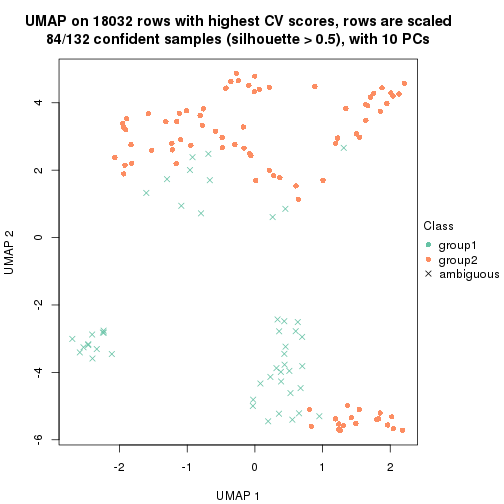</p>

</div>
<div id='tab-CV-hclust-dimension-reduction-2'>
<pre><code class="r">dimension_reduction(res, k = 3, method = &quot;UMAP&quot;)
</code></pre>

<p></p>

</div>
<div id='tab-CV-hclust-dimension-reduction-3'>
<pre><code class="r">dimension_reduction(res, k = 4, method = &quot;UMAP&quot;)
</code></pre>

<p></p>

</div>
<div id='tab-CV-hclust-dimension-reduction-4'>
<pre><code class="r">dimension_reduction(res, k = 5, method = &quot;UMAP&quot;)
</code></pre>

<p></p>

</div>
<div id='tab-CV-hclust-dimension-reduction-5'>
<pre><code class="r">dimension_reduction(res, k = 6, method = &quot;UMAP&quot;)
</code></pre>

<p></p>

</div>
</div>


Following heatmap shows how subgroups are split when increasing `k`:

```r
collect_classes(res)
```


Test correlation between subgroups and known annotations. If the known
annotation is numeric, one-way ANOVA test is applied, and if the known
annotation is discrete, chi-squared contingency table test is applied.

```r
test_to_known_factors(res)
```

```
#>             n disease.state(p) k
#> CV:hclust  84               NA 2
#> CV:hclust 131            0.424 3
#> CV:hclust 126            0.146 4
#> CV:hclust  79            0.639 5
#> CV:hclust  61            0.428 6
```


If matrix rows can be associated to genes, consider to use `GO_Enrichment(res,
...)` to perform function enrichment for the signature genes.


 

---------------------------------------------------


### CV:kmeans**


The object with results only for a single top-value method and a single partition method 
can be extracted as:

```r
res = res_list["CV", "kmeans"]
# you can also extract it by
# res = res_list["CV:kmeans"]
```

A summary of `res` and all the functions that can be applied to it:

```r
res
```

```
#> A 'ConsensusPartition' object with k = 2, 3, 4, 5, 6.
#>   On a matrix with 18032 rows and 132 columns.
#>   Top rows (1000, 2000, 3000, 4000, 5000) are extracted by 'CV' method.
#>   Subgroups are detected by 'kmeans' method.
#>   Performed in total 1250 partitions by row resampling.
#>   Best k for subgroups seems to be 2.
#> 
#> Following methods can be applied to this 'ConsensusPartition' object:
#>  [1] "cola_report"             "collect_classes"         "collect_plots"          
#>  [4] "collect_stats"           "colnames"                "compare_signatures"     
#>  [7] "consensus_heatmap"       "dimension_reduction"     "functional_enrichment"  
#> [10] "get_anno_col"            "get_anno"                "get_classes"            
#> [13] "get_consensus"           "get_matrix"              "get_membership"         
#> [16] "get_param"               "get_signatures"          "get_stats"              
#> [19] "is_best_k"               "is_stable_k"             "membership_heatmap"     
#> [22] "ncol"                    "nrow"                    "plot_ecdf"              
#> [25] "rownames"                "select_partition_number" "show"                   
#> [28] "suggest_best_k"          "test_to_known_factors"
```

`collect_plots()` function collects all the plots made from `res` for all `k` (number of partitions)
into one single page to provide an easy and fast comparison between different `k`.

```r
collect_plots(res)
```


The plots are:

- The first row: a plot of the ECDF (Empirical cumulative distribution
  function) curves of the consensus matrix for each `k` and the heatmap of
  predicted classes for each `k`.
- The second row: heatmaps of the consensus matrix for each `k`.
- The third row: heatmaps of the membership matrix for each `k`.
- The fouth row: heatmaps of the signatures for each `k`.

All the plots in panels can be made by individual functions and they are
plotted later in this section.

`select_partition_number()` produces several plots showing different
statistics for choosing "optimized" `k`. There are following statistics:

- ECDF curves of the consensus matrix for each `k`;
- 1-PAC. [The PAC
  score](https://en.wikipedia.org/wiki/Consensus_clustering#Over-interpretation_potential_of_consensus_clustering)
  measures the proportion of the ambiguous subgrouping.
- Mean silhouette score.
- Concordance. The mean probability of fiting the consensus class ids in all
  partitions.
- Area increased. Denote $A_k$ as the area under the ECDF curve for current
  `k`, the area increased is defined as $A_k - A_{k-1}$.
- Rand index. The percent of pairs of samples that are both in a same cluster
  or both are not in a same cluster in the partition of k and k-1.
- Jaccard index. The ratio of pairs of samples are both in a same cluster in
  the partition of k and k-1 and the pairs of samples are both in a same
  cluster in the partition k or k-1.

The detailed explanations of these statistics can be found in [the cola
vignette](http://bioconductor.org/packages/devel/bioc/vignettes/cola/inst/doc/cola.html#toc_13).

Generally speaking, lower PAC score, higher mean silhouette score or higher
concordance corresponds to better partition. Rand index and Jaccard index
measure how similar the current partition is compared to partition with `k-1`.
If they are too similar, we won't accept `k` is better than `k-1`.

```r
select_partition_number(res)
```


The numeric values for all these statistics can be obtained by `get_stats()`.

```r
get_stats(res)
```

```
#>   k 1-PAC mean_silhouette concordance area_increased  Rand Jaccard
#> 2 2 1.000           0.978       0.990         0.4467 0.547   0.547
#> 3 3 0.593           0.841       0.864         0.2355 0.875   0.787
#> 4 4 0.552           0.595       0.780         0.2483 0.745   0.518
#> 5 5 0.638           0.605       0.783         0.1105 0.903   0.696
#> 6 6 0.686           0.552       0.753         0.0556 0.863   0.515
```

`suggest_best_k()` suggests the best $k$ based on these statistics. The rules are as follows:

- All $k$ with Jaccard index larger than 0.95 are removed because the increase of
  the partition number does not provides enough extra information. If all $k$ are removed,
  the best $k$ is assigned by `NA`.
- For $k$ with 1-PAC larger than 0.9, the maximal $k$ is taken as the "best k". Other $k$ is called "optional k".
- If it does not fit the second rule. The $k$ with the highest vote of highest
  1-PAC, mean silhouette and concordance is taken as the "best k".

```r
suggest_best_k(res)
```

```
#> [1] 2
```


Following shows the table of the partitions (You need to click the **show/hide
code output** link to see it). The membership matrix (columns with name `p*`)
is inferred by
[`clue::cl_consensus()`](https://www.rdocumentation.org/link/cl_consensus?package=clue)
function with the `SE` method. Basically the value in the membership matrix
represents the probability to belong to a certain group. The finall class
label for an item is determined with the group with highest probability it
belongs to.

In `get_classes()` function, the entropy is calculated from the membership
matrix and the silhouette score is calculated from the consensus matrix.


<script>
$( function() {
	$( '#tabs-CV-kmeans-get-classes' ).tabs();
} );
</script>
<div id='tabs-CV-kmeans-get-classes'>
<ul>
<li><a href='#tab-CV-kmeans-get-classes-1'>k = 2</a></li>
<li><a href='#tab-CV-kmeans-get-classes-2'>k = 3</a></li>
<li><a href='#tab-CV-kmeans-get-classes-3'>k = 4</a></li>
<li><a href='#tab-CV-kmeans-get-classes-4'>k = 5</a></li>
<li><a href='#tab-CV-kmeans-get-classes-5'>k = 6</a></li>
</ul>

<div id='tab-CV-kmeans-get-classes-1'>
<p><a id='tab-CV-kmeans-get-classes-1-a' style='color:#0366d6' href='#'>show/hide code output</a></p>
<pre><code class="r">cbind(get_classes(res, k = 2), get_membership(res, k = 2))
</code></pre>

<pre><code>#&gt;           class entropy silhouette    p1    p2
#&gt; GSM289470     2  0.0000      1.000 0.000 1.000
#&gt; GSM289471     1  0.0000      0.971 1.000 0.000
#&gt; GSM289472     2  0.0000      1.000 0.000 1.000
#&gt; GSM289473     2  0.0000      1.000 0.000 1.000
#&gt; GSM289474     2  0.0000      1.000 0.000 1.000
#&gt; GSM289475     2  0.0000      1.000 0.000 1.000
#&gt; GSM289476     1  0.0000      0.971 1.000 0.000
#&gt; GSM289477     2  0.0000      1.000 0.000 1.000
#&gt; GSM289478     2  0.0000      1.000 0.000 1.000
#&gt; GSM289479     2  0.0000      1.000 0.000 1.000
#&gt; GSM289480     2  0.0000      1.000 0.000 1.000
#&gt; GSM289481     2  0.0000      1.000 0.000 1.000
#&gt; GSM289482     2  0.0000      1.000 0.000 1.000
#&gt; GSM289483     2  0.0000      1.000 0.000 1.000
#&gt; GSM289484     2  0.0000      1.000 0.000 1.000
#&gt; GSM289485     2  0.0000      1.000 0.000 1.000
#&gt; GSM289486     1  0.0000      0.971 1.000 0.000
#&gt; GSM289487     2  0.0000      1.000 0.000 1.000
#&gt; GSM289488     2  0.0000      1.000 0.000 1.000
#&gt; GSM289489     2  0.0000      1.000 0.000 1.000
#&gt; GSM289490     2  0.0376      0.996 0.004 0.996
#&gt; GSM289491     2  0.0000      1.000 0.000 1.000
#&gt; GSM289492     1  0.7674      0.730 0.776 0.224
#&gt; GSM289493     2  0.0000      1.000 0.000 1.000
#&gt; GSM289494     1  0.0000      0.971 1.000 0.000
#&gt; GSM289495     2  0.0000      1.000 0.000 1.000
#&gt; GSM289496     2  0.0000      1.000 0.000 1.000
#&gt; GSM289497     2  0.0000      1.000 0.000 1.000
#&gt; GSM289498     1  0.5629      0.846 0.868 0.132
#&gt; GSM289499     2  0.0000      1.000 0.000 1.000
#&gt; GSM289500     1  0.0000      0.971 1.000 0.000
#&gt; GSM289501     2  0.0000      1.000 0.000 1.000
#&gt; GSM289502     2  0.0000      1.000 0.000 1.000
#&gt; GSM289503     2  0.0000      1.000 0.000 1.000
#&gt; GSM289504     2  0.0000      1.000 0.000 1.000
#&gt; GSM289505     2  0.0000      1.000 0.000 1.000
#&gt; GSM289506     2  0.0000      1.000 0.000 1.000
#&gt; GSM289507     2  0.0000      1.000 0.000 1.000
#&gt; GSM289508     1  0.0000      0.971 1.000 0.000
#&gt; GSM289509     1  0.0000      0.971 1.000 0.000
#&gt; GSM289510     2  0.0000      1.000 0.000 1.000
#&gt; GSM289511     2  0.0000      1.000 0.000 1.000
#&gt; GSM289512     1  0.0000      0.971 1.000 0.000
#&gt; GSM289513     2  0.0000      1.000 0.000 1.000
#&gt; GSM289514     2  0.1633      0.975 0.024 0.976
#&gt; GSM289515     2  0.0000      1.000 0.000 1.000
#&gt; GSM289516     2  0.0000      1.000 0.000 1.000
#&gt; GSM289517     2  0.0000      1.000 0.000 1.000
#&gt; GSM289518     2  0.0000      1.000 0.000 1.000
#&gt; GSM289519     2  0.0000      1.000 0.000 1.000
#&gt; GSM289520     2  0.0000      1.000 0.000 1.000
#&gt; GSM289521     1  0.0376      0.968 0.996 0.004
#&gt; GSM289522     2  0.0000      1.000 0.000 1.000
#&gt; GSM289523     1  0.0000      0.971 1.000 0.000
#&gt; GSM289524     2  0.0000      1.000 0.000 1.000
#&gt; GSM289525     2  0.0000      1.000 0.000 1.000
#&gt; GSM289526     1  0.9393      0.486 0.644 0.356
#&gt; GSM289527     2  0.0000      1.000 0.000 1.000
#&gt; GSM289528     2  0.0000      1.000 0.000 1.000
#&gt; GSM289529     2  0.0000      1.000 0.000 1.000
#&gt; GSM289530     1  0.1633      0.952 0.976 0.024
#&gt; GSM289531     2  0.0000      1.000 0.000 1.000
#&gt; GSM289532     1  0.0000      0.971 1.000 0.000
#&gt; GSM289533     2  0.0000      1.000 0.000 1.000
#&gt; GSM289534     1  0.0000      0.971 1.000 0.000
#&gt; GSM289535     2  0.0000      1.000 0.000 1.000
#&gt; GSM289536     1  0.0000      0.971 1.000 0.000
#&gt; GSM289537     2  0.0000      1.000 0.000 1.000
#&gt; GSM289538     2  0.0000      1.000 0.000 1.000
#&gt; GSM289539     2  0.0000      1.000 0.000 1.000
#&gt; GSM289540     1  0.0000      0.971 1.000 0.000
#&gt; GSM289541     1  0.7883      0.712 0.764 0.236
#&gt; GSM289542     1  0.8909      0.588 0.692 0.308
#&gt; GSM289543     2  0.0000      1.000 0.000 1.000
#&gt; GSM289544     1  0.0000      0.971 1.000 0.000
#&gt; GSM289545     2  0.0000      1.000 0.000 1.000
#&gt; GSM289546     2  0.0000      1.000 0.000 1.000
#&gt; GSM289547     2  0.0000      1.000 0.000 1.000
#&gt; GSM289548     1  0.0000      0.971 1.000 0.000
#&gt; GSM289549     1  0.0000      0.971 1.000 0.000
#&gt; GSM289550     1  0.0000      0.971 1.000 0.000
#&gt; GSM289551     1  0.0000      0.971 1.000 0.000
#&gt; GSM289552     1  0.0000      0.971 1.000 0.000
#&gt; GSM289553     1  0.0000      0.971 1.000 0.000
#&gt; GSM289554     2  0.0000      1.000 0.000 1.000
#&gt; GSM289555     2  0.0000      1.000 0.000 1.000
#&gt; GSM289556     1  0.0000      0.971 1.000 0.000
#&gt; GSM289557     2  0.0000      1.000 0.000 1.000
#&gt; GSM289558     2  0.0000      1.000 0.000 1.000
#&gt; GSM289559     1  0.0000      0.971 1.000 0.000
#&gt; GSM289560     2  0.0000      1.000 0.000 1.000
#&gt; GSM289561     2  0.0000      1.000 0.000 1.000
#&gt; GSM289562     1  0.0000      0.971 1.000 0.000
#&gt; GSM289563     1  0.0000      0.971 1.000 0.000
#&gt; GSM289564     2  0.0000      1.000 0.000 1.000
#&gt; GSM289565     1  0.0000      0.971 1.000 0.000
#&gt; GSM289566     1  0.0000      0.971 1.000 0.000
#&gt; GSM289567     2  0.0000      1.000 0.000 1.000
#&gt; GSM289568     2  0.0000      1.000 0.000 1.000
#&gt; GSM289569     2  0.0000      1.000 0.000 1.000
#&gt; GSM289570     2  0.0000      1.000 0.000 1.000
#&gt; GSM289571     2  0.0000      1.000 0.000 1.000
#&gt; GSM289572     2  0.0000      1.000 0.000 1.000
#&gt; GSM289573     2  0.0000      1.000 0.000 1.000
#&gt; GSM289574     2  0.0000      1.000 0.000 1.000
#&gt; GSM289575     2  0.0000      1.000 0.000 1.000
#&gt; GSM289576     2  0.0000      1.000 0.000 1.000
#&gt; GSM289577     2  0.0000      1.000 0.000 1.000
#&gt; GSM289578     2  0.0000      1.000 0.000 1.000
#&gt; GSM289579     2  0.0000      1.000 0.000 1.000
#&gt; GSM289580     1  0.0000      0.971 1.000 0.000
#&gt; GSM289581     1  0.0000      0.971 1.000 0.000
#&gt; GSM289582     2  0.0000      1.000 0.000 1.000
#&gt; GSM289583     2  0.0000      1.000 0.000 1.000
#&gt; GSM289584     2  0.0000      1.000 0.000 1.000
#&gt; GSM289585     2  0.0000      1.000 0.000 1.000
#&gt; GSM289586     2  0.0000      1.000 0.000 1.000
#&gt; GSM289587     1  0.0000      0.971 1.000 0.000
#&gt; GSM289588     1  0.0000      0.971 1.000 0.000
#&gt; GSM289589     1  0.0000      0.971 1.000 0.000
#&gt; GSM289590     1  0.0000      0.971 1.000 0.000
#&gt; GSM289591     1  0.0000      0.971 1.000 0.000
#&gt; GSM289592     2  0.0000      1.000 0.000 1.000
#&gt; GSM289593     1  0.0000      0.971 1.000 0.000
#&gt; GSM289594     2  0.0000      1.000 0.000 1.000
#&gt; GSM289595     1  0.0000      0.971 1.000 0.000
#&gt; GSM289596     2  0.0000      1.000 0.000 1.000
#&gt; GSM289597     2  0.0000      1.000 0.000 1.000
#&gt; GSM289598     1  0.0000      0.971 1.000 0.000
#&gt; GSM289599     2  0.0000      1.000 0.000 1.000
#&gt; GSM289600     1  0.0000      0.971 1.000 0.000
#&gt; GSM289601     1  0.0000      0.971 1.000 0.000
</code></pre>

<script>
$('#tab-CV-kmeans-get-classes-1-a').parent().next().next().hide();
$('#tab-CV-kmeans-get-classes-1-a').click(function(){
  $('#tab-CV-kmeans-get-classes-1-a').parent().next().next().toggle();
  return(false);
});
</script>
</div>

<div id='tab-CV-kmeans-get-classes-2'>
<p><a id='tab-CV-kmeans-get-classes-2-a' style='color:#0366d6' href='#'>show/hide code output</a></p>
<pre><code class="r">cbind(get_classes(res, k = 3), get_membership(res, k = 3))
</code></pre>

<pre><code>#&gt;           class entropy silhouette    p1    p2    p3
#&gt; GSM289470     1  0.7265      0.570 0.684 0.240 0.076
#&gt; GSM289471     3  0.5678      0.999 0.316 0.000 0.684
#&gt; GSM289472     2  0.0747      0.877 0.000 0.984 0.016
#&gt; GSM289473     2  0.2959      0.858 0.000 0.900 0.100
#&gt; GSM289474     2  0.2165      0.866 0.000 0.936 0.064
#&gt; GSM289475     2  0.0747      0.877 0.000 0.984 0.016
#&gt; GSM289476     3  0.5678      0.999 0.316 0.000 0.684
#&gt; GSM289477     2  0.0892      0.880 0.000 0.980 0.020
#&gt; GSM289478     2  0.0747      0.877 0.000 0.984 0.016
#&gt; GSM289479     2  0.3192      0.853 0.000 0.888 0.112
#&gt; GSM289480     2  0.0747      0.877 0.000 0.984 0.016
#&gt; GSM289481     2  0.1411      0.878 0.000 0.964 0.036
#&gt; GSM289482     2  0.1163      0.881 0.000 0.972 0.028
#&gt; GSM289483     2  0.0892      0.880 0.000 0.980 0.020
#&gt; GSM289484     2  0.0000      0.880 0.000 1.000 0.000
#&gt; GSM289485     2  0.0892      0.880 0.000 0.980 0.020
#&gt; GSM289486     1  0.0237      0.812 0.996 0.004 0.000
#&gt; GSM289487     2  0.0747      0.877 0.000 0.984 0.016
#&gt; GSM289488     2  0.0000      0.880 0.000 1.000 0.000
#&gt; GSM289489     2  0.2165      0.867 0.000 0.936 0.064
#&gt; GSM289490     2  0.5553      0.839 0.004 0.724 0.272
#&gt; GSM289491     2  0.4002      0.886 0.000 0.840 0.160
#&gt; GSM289492     2  0.8700      0.667 0.148 0.576 0.276
#&gt; GSM289493     2  0.3686      0.882 0.000 0.860 0.140
#&gt; GSM289494     3  0.5650      0.993 0.312 0.000 0.688
#&gt; GSM289495     2  0.5178      0.845 0.000 0.744 0.256
#&gt; GSM289496     2  0.3686      0.882 0.000 0.860 0.140
#&gt; GSM289497     2  0.3619      0.884 0.000 0.864 0.136
#&gt; GSM289498     2  0.7770      0.757 0.088 0.640 0.272
#&gt; GSM289499     2  0.4504      0.868 0.000 0.804 0.196
#&gt; GSM289500     3  0.5678      0.999 0.316 0.000 0.684
#&gt; GSM289501     2  0.3686      0.882 0.000 0.860 0.140
#&gt; GSM289502     2  0.3619      0.884 0.000 0.864 0.136
#&gt; GSM289503     2  0.3619      0.884 0.000 0.864 0.136
#&gt; GSM289504     2  0.4887      0.853 0.000 0.772 0.228
#&gt; GSM289505     2  0.3686      0.882 0.000 0.860 0.140
#&gt; GSM289506     2  0.3619      0.884 0.000 0.864 0.136
#&gt; GSM289507     2  0.3551      0.884 0.000 0.868 0.132
#&gt; GSM289508     1  0.2625      0.796 0.916 0.000 0.084
#&gt; GSM289509     1  0.3412      0.633 0.876 0.000 0.124
#&gt; GSM289510     2  0.5371      0.802 0.048 0.812 0.140
#&gt; GSM289511     2  0.2066      0.868 0.000 0.940 0.060
#&gt; GSM289512     3  0.5678      0.999 0.316 0.000 0.684
#&gt; GSM289513     2  0.2261      0.866 0.000 0.932 0.068
#&gt; GSM289514     1  0.7653      0.647 0.684 0.140 0.176
#&gt; GSM289515     2  0.2959      0.860 0.000 0.900 0.100
#&gt; GSM289516     2  0.2625      0.861 0.000 0.916 0.084
#&gt; GSM289517     2  0.2711      0.860 0.000 0.912 0.088
#&gt; GSM289518     2  0.2796      0.858 0.000 0.908 0.092
#&gt; GSM289519     2  0.8911      0.373 0.260 0.564 0.176
#&gt; GSM289520     2  0.1529      0.873 0.000 0.960 0.040
#&gt; GSM289521     1  0.7585      0.653 0.688 0.132 0.180
#&gt; GSM289522     2  0.4505      0.826 0.048 0.860 0.092
#&gt; GSM289523     3  0.5678      0.999 0.316 0.000 0.684
#&gt; GSM289524     2  0.2261      0.866 0.000 0.932 0.068
#&gt; GSM289525     2  0.2711      0.860 0.000 0.912 0.088
#&gt; GSM289526     2  0.5875      0.761 0.136 0.792 0.072
#&gt; GSM289527     2  0.2261      0.866 0.000 0.932 0.068
#&gt; GSM289528     2  0.0747      0.877 0.000 0.984 0.016
#&gt; GSM289529     2  0.2796      0.860 0.000 0.908 0.092
#&gt; GSM289530     1  0.7267      0.674 0.708 0.112 0.180
#&gt; GSM289531     2  0.3340      0.853 0.000 0.880 0.120
#&gt; GSM289532     1  0.4953      0.748 0.808 0.016 0.176
#&gt; GSM289533     2  0.2356      0.865 0.000 0.928 0.072
#&gt; GSM289534     3  0.5678      0.999 0.316 0.000 0.684
#&gt; GSM289535     2  0.8869      0.644 0.160 0.560 0.280
#&gt; GSM289536     3  0.5678      0.999 0.316 0.000 0.684
#&gt; GSM289537     2  0.3619      0.883 0.000 0.864 0.136
#&gt; GSM289538     2  0.3551      0.884 0.000 0.868 0.132
#&gt; GSM289539     2  0.3551      0.884 0.000 0.868 0.132
#&gt; GSM289540     1  0.4840      0.753 0.816 0.016 0.168
#&gt; GSM289541     1  0.6437      0.666 0.732 0.048 0.220
#&gt; GSM289542     1  0.6964      0.602 0.684 0.052 0.264
#&gt; GSM289543     2  0.7147      0.805 0.076 0.696 0.228
#&gt; GSM289544     1  0.4047      0.774 0.848 0.004 0.148
#&gt; GSM289545     2  0.3551      0.884 0.000 0.868 0.132
#&gt; GSM289546     2  0.3619      0.883 0.000 0.864 0.136
#&gt; GSM289547     2  0.3619      0.884 0.000 0.864 0.136
#&gt; GSM289548     1  0.0000      0.811 1.000 0.000 0.000
#&gt; GSM289549     1  0.0424      0.812 0.992 0.008 0.000
#&gt; GSM289550     1  0.0000      0.811 1.000 0.000 0.000
#&gt; GSM289551     3  0.5678      0.999 0.316 0.000 0.684
#&gt; GSM289552     1  0.0000      0.811 1.000 0.000 0.000
#&gt; GSM289553     1  0.0000      0.811 1.000 0.000 0.000
#&gt; GSM289554     2  0.4931      0.851 0.000 0.768 0.232
#&gt; GSM289555     2  0.4062      0.877 0.000 0.836 0.164
#&gt; GSM289556     1  0.0000      0.811 1.000 0.000 0.000
#&gt; GSM289557     2  0.3686      0.882 0.000 0.860 0.140
#&gt; GSM289558     2  0.3752      0.883 0.000 0.856 0.144
#&gt; GSM289559     1  0.0000      0.811 1.000 0.000 0.000
#&gt; GSM289560     2  0.4062      0.877 0.000 0.836 0.164
#&gt; GSM289561     2  0.3686      0.882 0.000 0.860 0.140
#&gt; GSM289562     1  0.0000      0.811 1.000 0.000 0.000
#&gt; GSM289563     1  0.1647      0.801 0.960 0.036 0.004
#&gt; GSM289564     2  0.5529      0.838 0.000 0.704 0.296
#&gt; GSM289565     1  0.3116      0.788 0.892 0.000 0.108
#&gt; GSM289566     1  0.0475      0.813 0.992 0.004 0.004
#&gt; GSM289567     2  0.3816      0.841 0.000 0.852 0.148
#&gt; GSM289568     2  0.1529      0.872 0.000 0.960 0.040
#&gt; GSM289569     2  0.2261      0.866 0.000 0.932 0.068
#&gt; GSM289570     2  0.4121      0.829 0.000 0.832 0.168
#&gt; GSM289571     2  0.3686      0.882 0.000 0.860 0.140
#&gt; GSM289572     2  0.4235      0.873 0.000 0.824 0.176
#&gt; GSM289573     2  0.3752      0.883 0.000 0.856 0.144
#&gt; GSM289574     2  0.3619      0.884 0.000 0.864 0.136
#&gt; GSM289575     2  0.4399      0.871 0.000 0.812 0.188
#&gt; GSM289576     2  0.3752      0.883 0.000 0.856 0.144
#&gt; GSM289577     2  0.4842      0.854 0.000 0.776 0.224
#&gt; GSM289578     2  0.5327      0.841 0.000 0.728 0.272
#&gt; GSM289579     2  0.4605      0.865 0.000 0.796 0.204
#&gt; GSM289580     3  0.5678      0.999 0.316 0.000 0.684
#&gt; GSM289581     1  0.4002      0.769 0.840 0.000 0.160
#&gt; GSM289582     2  0.2711      0.862 0.000 0.912 0.088
#&gt; GSM289583     2  0.3619      0.884 0.000 0.864 0.136
#&gt; GSM289584     2  0.3686      0.883 0.000 0.860 0.140
#&gt; GSM289585     2  0.3619      0.884 0.000 0.864 0.136
#&gt; GSM289586     1  0.8288      0.415 0.572 0.332 0.096
#&gt; GSM289587     1  0.1711      0.811 0.960 0.008 0.032
#&gt; GSM289588     3  0.5678      0.999 0.316 0.000 0.684
#&gt; GSM289589     1  0.0000      0.811 1.000 0.000 0.000
#&gt; GSM289590     1  0.0592      0.813 0.988 0.000 0.012
#&gt; GSM289591     1  0.0000      0.811 1.000 0.000 0.000
#&gt; GSM289592     2  0.3752      0.883 0.000 0.856 0.144
#&gt; GSM289593     3  0.5678      0.999 0.316 0.000 0.684
#&gt; GSM289594     2  0.3686      0.882 0.000 0.860 0.140
#&gt; GSM289595     1  0.0000      0.811 1.000 0.000 0.000
#&gt; GSM289596     2  0.3412      0.884 0.000 0.876 0.124
#&gt; GSM289597     2  0.2625      0.861 0.000 0.916 0.084
#&gt; GSM289598     1  0.0000      0.811 1.000 0.000 0.000
#&gt; GSM289599     2  0.8868      0.632 0.172 0.568 0.260
#&gt; GSM289600     1  0.0475      0.813 0.992 0.004 0.004
#&gt; GSM289601     1  0.7216      0.676 0.712 0.112 0.176
</code></pre>

<script>
$('#tab-CV-kmeans-get-classes-2-a').parent().next().next().hide();
$('#tab-CV-kmeans-get-classes-2-a').click(function(){
  $('#tab-CV-kmeans-get-classes-2-a').parent().next().next().toggle();
  return(false);
});
</script>
</div>

<div id='tab-CV-kmeans-get-classes-3'>
<p><a id='tab-CV-kmeans-get-classes-3-a' style='color:#0366d6' href='#'>show/hide code output</a></p>
<pre><code class="r">cbind(get_classes(res, k = 4), get_membership(res, k = 4))
</code></pre>

<pre><code>#&gt;           class entropy silhouette    p1    p2    p3    p4
#&gt; GSM289470     1  0.1739    0.88915 0.952 0.008 0.016 0.024
#&gt; GSM289471     3  0.1118    0.95341 0.036 0.000 0.964 0.000
#&gt; GSM289472     2  0.5149    0.37165 0.000 0.648 0.016 0.336
#&gt; GSM289473     4  0.4923    0.54222 0.008 0.264 0.012 0.716
#&gt; GSM289474     4  0.4456    0.52743 0.000 0.280 0.004 0.716
#&gt; GSM289475     2  0.5149    0.37165 0.000 0.648 0.016 0.336
#&gt; GSM289476     3  0.1118    0.95341 0.036 0.000 0.964 0.000
#&gt; GSM289477     2  0.5172    0.28881 0.000 0.588 0.008 0.404
#&gt; GSM289478     2  0.5149    0.37165 0.000 0.648 0.016 0.336
#&gt; GSM289479     4  0.4923    0.53851 0.008 0.264 0.012 0.716
#&gt; GSM289480     2  0.5149    0.37165 0.000 0.648 0.016 0.336
#&gt; GSM289481     2  0.5611    0.19315 0.000 0.564 0.024 0.412
#&gt; GSM289482     2  0.5172    0.28153 0.000 0.588 0.008 0.404
#&gt; GSM289483     2  0.5161    0.30461 0.000 0.592 0.008 0.400
#&gt; GSM289484     2  0.5269    0.36450 0.000 0.620 0.016 0.364
#&gt; GSM289485     2  0.5138    0.31764 0.000 0.600 0.008 0.392
#&gt; GSM289486     1  0.0336    0.91347 0.992 0.000 0.008 0.000
#&gt; GSM289487     2  0.5149    0.37165 0.000 0.648 0.016 0.336
#&gt; GSM289488     2  0.4920    0.36967 0.000 0.628 0.004 0.368
#&gt; GSM289489     4  0.5376    0.36489 0.000 0.396 0.016 0.588
#&gt; GSM289490     4  0.5919   -0.02621 0.012 0.480 0.016 0.492
#&gt; GSM289491     2  0.3441    0.65719 0.000 0.856 0.024 0.120
#&gt; GSM289492     4  0.6085    0.06023 0.016 0.436 0.020 0.528
#&gt; GSM289493     2  0.1305    0.71823 0.000 0.960 0.004 0.036
#&gt; GSM289494     3  0.1388    0.94173 0.028 0.000 0.960 0.012
#&gt; GSM289495     2  0.5598    0.19097 0.004 0.564 0.016 0.416
#&gt; GSM289496     2  0.1807    0.71069 0.000 0.940 0.008 0.052
#&gt; GSM289497     2  0.2522    0.70462 0.000 0.908 0.016 0.076
#&gt; GSM289498     4  0.6018    0.00334 0.016 0.468 0.016 0.500
#&gt; GSM289499     2  0.4516    0.47481 0.000 0.736 0.012 0.252
#&gt; GSM289500     3  0.1118    0.95341 0.036 0.000 0.964 0.000
#&gt; GSM289501     2  0.1890    0.70853 0.000 0.936 0.008 0.056
#&gt; GSM289502     2  0.2730    0.69859 0.000 0.896 0.016 0.088
#&gt; GSM289503     2  0.2222    0.71004 0.000 0.924 0.016 0.060
#&gt; GSM289504     2  0.4292    0.58713 0.008 0.796 0.016 0.180
#&gt; GSM289505     2  0.1305    0.71823 0.000 0.960 0.004 0.036
#&gt; GSM289506     2  0.2730    0.69859 0.000 0.896 0.016 0.088
#&gt; GSM289507     2  0.2730    0.69859 0.000 0.896 0.016 0.088
#&gt; GSM289508     1  0.1892    0.88963 0.944 0.004 0.016 0.036
#&gt; GSM289509     3  0.7521   -0.02613 0.396 0.000 0.420 0.184
#&gt; GSM289510     4  0.2197    0.57487 0.000 0.080 0.004 0.916
#&gt; GSM289511     4  0.5444    0.30608 0.000 0.424 0.016 0.560
#&gt; GSM289512     3  0.1118    0.95341 0.036 0.000 0.964 0.000
#&gt; GSM289513     4  0.5398    0.35596 0.000 0.404 0.016 0.580
#&gt; GSM289514     4  0.2546    0.53121 0.092 0.008 0.000 0.900
#&gt; GSM289515     4  0.3801    0.58850 0.000 0.220 0.000 0.780
#&gt; GSM289516     4  0.4122    0.57611 0.000 0.236 0.004 0.760
#&gt; GSM289517     4  0.3610    0.59797 0.000 0.200 0.000 0.800
#&gt; GSM289518     4  0.3486    0.60036 0.000 0.188 0.000 0.812
#&gt; GSM289519     4  0.2125    0.54156 0.052 0.012 0.004 0.932
#&gt; GSM289520     4  0.4978    0.35936 0.000 0.384 0.004 0.612
#&gt; GSM289521     4  0.5311   -0.05662 0.392 0.008 0.004 0.596
#&gt; GSM289522     4  0.3400    0.60074 0.000 0.180 0.000 0.820
#&gt; GSM289523     3  0.1118    0.95341 0.036 0.000 0.964 0.000
#&gt; GSM289524     4  0.5398    0.35596 0.000 0.404 0.016 0.580
#&gt; GSM289525     4  0.3649    0.59629 0.000 0.204 0.000 0.796
#&gt; GSM289526     4  0.4886    0.56489 0.008 0.244 0.016 0.732
#&gt; GSM289527     4  0.5398    0.35596 0.000 0.404 0.016 0.580
#&gt; GSM289528     2  0.5110    0.38671 0.000 0.656 0.016 0.328
#&gt; GSM289529     4  0.4018    0.58564 0.004 0.224 0.000 0.772
#&gt; GSM289530     4  0.5811    0.09829 0.308 0.044 0.004 0.644
#&gt; GSM289531     4  0.4923    0.54662 0.008 0.264 0.012 0.716
#&gt; GSM289532     4  0.6223    0.11188 0.296 0.056 0.012 0.636
#&gt; GSM289533     4  0.5149    0.46871 0.000 0.336 0.016 0.648
#&gt; GSM289534     3  0.1118    0.95341 0.036 0.000 0.964 0.000
#&gt; GSM289535     4  0.6182    0.06598 0.020 0.436 0.020 0.524
#&gt; GSM289536     3  0.1118    0.95341 0.036 0.000 0.964 0.000
#&gt; GSM289537     2  0.1489    0.72455 0.000 0.952 0.004 0.044
#&gt; GSM289538     2  0.1637    0.72329 0.000 0.940 0.000 0.060
#&gt; GSM289539     2  0.2730    0.69859 0.000 0.896 0.016 0.088
#&gt; GSM289540     1  0.6499    0.47808 0.556 0.040 0.020 0.384
#&gt; GSM289541     1  0.1284    0.89502 0.964 0.024 0.012 0.000
#&gt; GSM289542     1  0.5362    0.73739 0.748 0.048 0.016 0.188
#&gt; GSM289543     2  0.5500    0.18011 0.004 0.564 0.012 0.420
#&gt; GSM289544     1  0.4018    0.75775 0.772 0.000 0.004 0.224
#&gt; GSM289545     2  0.1792    0.72211 0.000 0.932 0.000 0.068
#&gt; GSM289546     2  0.1637    0.72329 0.000 0.940 0.000 0.060
#&gt; GSM289547     2  0.2522    0.70462 0.000 0.908 0.016 0.076
#&gt; GSM289548     1  0.0336    0.91347 0.992 0.000 0.008 0.000
#&gt; GSM289549     1  0.0469    0.90978 0.988 0.000 0.000 0.012
#&gt; GSM289550     1  0.0336    0.91347 0.992 0.000 0.008 0.000
#&gt; GSM289551     3  0.1118    0.95341 0.036 0.000 0.964 0.000
#&gt; GSM289552     1  0.0336    0.91347 0.992 0.000 0.008 0.000
#&gt; GSM289553     1  0.0336    0.91347 0.992 0.000 0.008 0.000
#&gt; GSM289554     2  0.4579    0.52876 0.004 0.756 0.016 0.224
#&gt; GSM289555     2  0.2676    0.68278 0.000 0.896 0.012 0.092
#&gt; GSM289556     1  0.0336    0.91347 0.992 0.000 0.008 0.000
#&gt; GSM289557     2  0.1109    0.72011 0.000 0.968 0.004 0.028
#&gt; GSM289558     2  0.1576    0.71754 0.000 0.948 0.004 0.048
#&gt; GSM289559     1  0.0336    0.91347 0.992 0.000 0.008 0.000
#&gt; GSM289560     2  0.2676    0.68278 0.000 0.896 0.012 0.092
#&gt; GSM289561     2  0.1743    0.70969 0.000 0.940 0.004 0.056
#&gt; GSM289562     1  0.0336    0.91347 0.992 0.000 0.008 0.000
#&gt; GSM289563     1  0.0592    0.90813 0.984 0.000 0.000 0.016
#&gt; GSM289564     4  0.5577    0.20534 0.008 0.364 0.016 0.612
#&gt; GSM289565     1  0.4228    0.74237 0.760 0.000 0.008 0.232
#&gt; GSM289566     1  0.2480    0.86379 0.904 0.000 0.008 0.088
#&gt; GSM289567     4  0.3584    0.58588 0.008 0.152 0.004 0.836
#&gt; GSM289568     2  0.5472    0.06694 0.000 0.544 0.016 0.440
#&gt; GSM289569     4  0.5326    0.40045 0.000 0.380 0.016 0.604
#&gt; GSM289570     4  0.2665    0.56991 0.008 0.088 0.004 0.900
#&gt; GSM289571     2  0.0921    0.72258 0.000 0.972 0.000 0.028
#&gt; GSM289572     2  0.2730    0.68360 0.000 0.896 0.016 0.088
#&gt; GSM289573     2  0.0779    0.72164 0.000 0.980 0.004 0.016
#&gt; GSM289574     2  0.2522    0.70462 0.000 0.908 0.016 0.076
#&gt; GSM289575     2  0.3822    0.63119 0.008 0.836 0.016 0.140
#&gt; GSM289576     2  0.1406    0.71790 0.000 0.960 0.016 0.024
#&gt; GSM289577     2  0.4178    0.60455 0.008 0.812 0.020 0.160
#&gt; GSM289578     4  0.5806   -0.00689 0.008 0.480 0.016 0.496
#&gt; GSM289579     2  0.4020    0.61357 0.008 0.820 0.016 0.156
#&gt; GSM289580     3  0.1118    0.95341 0.036 0.000 0.964 0.000
#&gt; GSM289581     4  0.4925   -0.14204 0.428 0.000 0.000 0.572
#&gt; GSM289582     4  0.3528    0.59956 0.000 0.192 0.000 0.808
#&gt; GSM289583     2  0.2730    0.69859 0.000 0.896 0.016 0.088
#&gt; GSM289584     2  0.1182    0.72050 0.000 0.968 0.016 0.016
#&gt; GSM289585     2  0.2730    0.69859 0.000 0.896 0.016 0.088
#&gt; GSM289586     4  0.4849    0.59095 0.064 0.164 0.000 0.772
#&gt; GSM289587     1  0.0336    0.91347 0.992 0.000 0.008 0.000
#&gt; GSM289588     3  0.1118    0.95341 0.036 0.000 0.964 0.000
#&gt; GSM289589     1  0.0336    0.91347 0.992 0.000 0.008 0.000
#&gt; GSM289590     1  0.3725    0.79669 0.812 0.000 0.008 0.180
#&gt; GSM289591     1  0.0336    0.91347 0.992 0.000 0.008 0.000
#&gt; GSM289592     2  0.0657    0.72109 0.000 0.984 0.004 0.012
#&gt; GSM289593     3  0.1118    0.95341 0.036 0.000 0.964 0.000
#&gt; GSM289594     2  0.2412    0.69180 0.000 0.908 0.008 0.084
#&gt; GSM289595     1  0.2048    0.88765 0.928 0.000 0.008 0.064
#&gt; GSM289596     2  0.1211    0.72377 0.000 0.960 0.000 0.040
#&gt; GSM289597     4  0.4018    0.58596 0.000 0.224 0.004 0.772
#&gt; GSM289598     1  0.3060    0.86600 0.888 0.016 0.008 0.088
#&gt; GSM289599     2  0.6010    0.07572 0.016 0.512 0.016 0.456
#&gt; GSM289600     1  0.0188    0.91285 0.996 0.000 0.004 0.000
#&gt; GSM289601     4  0.5119   -0.17704 0.440 0.000 0.004 0.556
</code></pre>

<script>
$('#tab-CV-kmeans-get-classes-3-a').parent().next().next().hide();
$('#tab-CV-kmeans-get-classes-3-a').click(function(){
  $('#tab-CV-kmeans-get-classes-3-a').parent().next().next().toggle();
  return(false);
});
</script>
</div>

<div id='tab-CV-kmeans-get-classes-4'>
<p><a id='tab-CV-kmeans-get-classes-4-a' style='color:#0366d6' href='#'>show/hide code output</a></p>
<pre><code class="r">cbind(get_classes(res, k = 5), get_membership(res, k = 5))
</code></pre>

<pre><code>#&gt;           class entropy silhouette    p1    p2    p3    p4    p5
#&gt; GSM289470     1  0.0324    0.89135 0.992 0.004 0.000 0.004 0.000
#&gt; GSM289471     3  0.0000    0.99354 0.000 0.000 1.000 0.000 0.000
#&gt; GSM289472     5  0.3861    0.39750 0.000 0.004 0.000 0.284 0.712
#&gt; GSM289473     4  0.3075    0.77199 0.000 0.048 0.000 0.860 0.092
#&gt; GSM289474     4  0.2179    0.77750 0.000 0.004 0.000 0.896 0.100
#&gt; GSM289475     5  0.3884    0.40476 0.000 0.004 0.000 0.288 0.708
#&gt; GSM289476     3  0.0000    0.99354 0.000 0.000 1.000 0.000 0.000
#&gt; GSM289477     5  0.6129    0.27413 0.000 0.128 0.000 0.420 0.452
#&gt; GSM289478     5  0.3838    0.41639 0.000 0.004 0.000 0.280 0.716
#&gt; GSM289479     4  0.3749    0.75617 0.000 0.080 0.000 0.816 0.104
#&gt; GSM289480     5  0.3884    0.39297 0.000 0.004 0.000 0.288 0.708
#&gt; GSM289481     5  0.5420    0.28405 0.000 0.076 0.000 0.332 0.592
#&gt; GSM289482     5  0.6037    0.25166 0.000 0.116 0.000 0.436 0.448
#&gt; GSM289483     5  0.5959    0.28042 0.000 0.108 0.000 0.420 0.472
#&gt; GSM289484     5  0.4329    0.40442 0.000 0.016 0.000 0.312 0.672
#&gt; GSM289485     5  0.5872    0.28384 0.000 0.100 0.000 0.408 0.492
#&gt; GSM289486     1  0.0566    0.89084 0.984 0.004 0.000 0.012 0.000
#&gt; GSM289487     5  0.3752    0.40010 0.000 0.000 0.000 0.292 0.708
#&gt; GSM289488     5  0.5632    0.34938 0.000 0.080 0.000 0.392 0.528
#&gt; GSM289489     4  0.4565    0.62612 0.000 0.028 0.000 0.664 0.308
#&gt; GSM289490     2  0.2654    0.62193 0.000 0.884 0.000 0.032 0.084
#&gt; GSM289491     5  0.4475    0.47488 0.000 0.276 0.000 0.032 0.692
#&gt; GSM289492     2  0.1168    0.64679 0.000 0.960 0.000 0.032 0.008
#&gt; GSM289493     5  0.4546    0.54430 0.000 0.304 0.000 0.028 0.668
#&gt; GSM289494     3  0.1638    0.94270 0.000 0.064 0.932 0.004 0.000
#&gt; GSM289495     2  0.3586    0.59899 0.000 0.828 0.000 0.076 0.096
#&gt; GSM289496     5  0.4250    0.59080 0.000 0.252 0.000 0.028 0.720
#&gt; GSM289497     5  0.0703    0.65528 0.000 0.000 0.000 0.024 0.976
#&gt; GSM289498     2  0.2595    0.62396 0.000 0.888 0.000 0.032 0.080
#&gt; GSM289499     2  0.5143   -0.08946 0.000 0.532 0.000 0.040 0.428
#&gt; GSM289500     3  0.0000    0.99354 0.000 0.000 1.000 0.000 0.000
#&gt; GSM289501     5  0.4687    0.51055 0.000 0.336 0.000 0.028 0.636
#&gt; GSM289502     5  0.0703    0.65528 0.000 0.000 0.000 0.024 0.976
#&gt; GSM289503     5  0.0324    0.65600 0.000 0.004 0.000 0.004 0.992
#&gt; GSM289504     5  0.4961    0.31329 0.000 0.448 0.000 0.028 0.524
#&gt; GSM289505     5  0.4546    0.54683 0.000 0.304 0.000 0.028 0.668
#&gt; GSM289506     5  0.0703    0.65528 0.000 0.000 0.000 0.024 0.976
#&gt; GSM289507     5  0.0703    0.65528 0.000 0.000 0.000 0.024 0.976
#&gt; GSM289508     1  0.3123    0.76450 0.828 0.160 0.000 0.012 0.000
#&gt; GSM289509     2  0.6974   -0.00781 0.160 0.440 0.372 0.028 0.000
#&gt; GSM289510     4  0.1638    0.75005 0.000 0.064 0.000 0.932 0.004
#&gt; GSM289511     4  0.3928    0.65451 0.000 0.004 0.000 0.700 0.296
#&gt; GSM289512     3  0.0000    0.99354 0.000 0.000 1.000 0.000 0.000
#&gt; GSM289513     4  0.4086    0.66596 0.000 0.012 0.000 0.704 0.284
#&gt; GSM289514     4  0.3895    0.44441 0.000 0.320 0.000 0.680 0.000
#&gt; GSM289515     4  0.1121    0.79038 0.000 0.000 0.000 0.956 0.044
#&gt; GSM289516     4  0.1197    0.79026 0.000 0.000 0.000 0.952 0.048
#&gt; GSM289517     4  0.0865    0.78676 0.000 0.004 0.000 0.972 0.024
#&gt; GSM289518     4  0.0992    0.78621 0.000 0.008 0.000 0.968 0.024
#&gt; GSM289519     4  0.3895    0.44106 0.000 0.320 0.000 0.680 0.000
#&gt; GSM289520     4  0.3177    0.71058 0.000 0.000 0.000 0.792 0.208
#&gt; GSM289521     4  0.4821    0.08818 0.020 0.464 0.000 0.516 0.000
#&gt; GSM289522     4  0.1403    0.78116 0.000 0.024 0.000 0.952 0.024
#&gt; GSM289523     3  0.0000    0.99354 0.000 0.000 1.000 0.000 0.000
#&gt; GSM289524     4  0.4161    0.66888 0.000 0.016 0.000 0.704 0.280
#&gt; GSM289525     4  0.0865    0.78676 0.000 0.004 0.000 0.972 0.024
#&gt; GSM289526     4  0.4444    0.72224 0.012 0.052 0.000 0.764 0.172
#&gt; GSM289527     4  0.4090    0.68121 0.000 0.016 0.000 0.716 0.268
#&gt; GSM289528     5  0.3074    0.53556 0.000 0.000 0.000 0.196 0.804
#&gt; GSM289529     4  0.1893    0.78396 0.000 0.024 0.000 0.928 0.048
#&gt; GSM289530     2  0.4727    0.01734 0.016 0.532 0.000 0.452 0.000
#&gt; GSM289531     4  0.3810    0.74274 0.000 0.100 0.000 0.812 0.088
#&gt; GSM289532     2  0.4339    0.37436 0.020 0.684 0.000 0.296 0.000
#&gt; GSM289533     4  0.3849    0.71293 0.000 0.016 0.000 0.752 0.232
#&gt; GSM289534     3  0.0566    0.98241 0.000 0.012 0.984 0.004 0.000
#&gt; GSM289535     2  0.2293    0.64786 0.000 0.900 0.000 0.084 0.016
#&gt; GSM289536     3  0.0000    0.99354 0.000 0.000 1.000 0.000 0.000
#&gt; GSM289537     5  0.3639    0.63544 0.000 0.184 0.000 0.024 0.792
#&gt; GSM289538     5  0.3449    0.64694 0.000 0.164 0.000 0.024 0.812
#&gt; GSM289539     5  0.0865    0.65395 0.000 0.004 0.000 0.024 0.972
#&gt; GSM289540     2  0.4010    0.54855 0.116 0.796 0.000 0.088 0.000
#&gt; GSM289541     1  0.0566    0.89084 0.984 0.004 0.000 0.012 0.000
#&gt; GSM289542     2  0.4095    0.46905 0.228 0.748 0.000 0.008 0.016
#&gt; GSM289543     2  0.4258    0.54654 0.000 0.768 0.000 0.072 0.160
#&gt; GSM289544     1  0.6034    0.13885 0.456 0.428 0.000 0.116 0.000
#&gt; GSM289545     5  0.3577    0.65016 0.000 0.160 0.000 0.032 0.808
#&gt; GSM289546     5  0.3488    0.64618 0.000 0.168 0.000 0.024 0.808
#&gt; GSM289547     5  0.0510    0.65528 0.000 0.000 0.000 0.016 0.984
#&gt; GSM289548     1  0.0451    0.89091 0.988 0.004 0.000 0.008 0.000
#&gt; GSM289549     1  0.0324    0.89135 0.992 0.004 0.000 0.004 0.000
#&gt; GSM289550     1  0.0290    0.89140 0.992 0.000 0.000 0.008 0.000
#&gt; GSM289551     3  0.0000    0.99354 0.000 0.000 1.000 0.000 0.000
#&gt; GSM289552     1  0.0290    0.89140 0.992 0.000 0.000 0.008 0.000
#&gt; GSM289553     1  0.0798    0.88408 0.976 0.016 0.000 0.008 0.000
#&gt; GSM289554     5  0.4979    0.22863 0.000 0.480 0.000 0.028 0.492
#&gt; GSM289555     5  0.4812    0.45601 0.000 0.372 0.000 0.028 0.600
#&gt; GSM289556     1  0.0290    0.89140 0.992 0.000 0.000 0.008 0.000
#&gt; GSM289557     5  0.3929    0.62028 0.000 0.208 0.000 0.028 0.764
#&gt; GSM289558     5  0.4223    0.59663 0.000 0.248 0.000 0.028 0.724
#&gt; GSM289559     1  0.0693    0.89014 0.980 0.008 0.000 0.012 0.000
#&gt; GSM289560     5  0.4787    0.46862 0.000 0.364 0.000 0.028 0.608
#&gt; GSM289561     5  0.4113    0.60463 0.000 0.232 0.000 0.028 0.740
#&gt; GSM289562     1  0.0451    0.89091 0.988 0.004 0.000 0.008 0.000
#&gt; GSM289563     1  0.0324    0.89135 0.992 0.004 0.000 0.004 0.000
#&gt; GSM289564     2  0.2932    0.64238 0.000 0.864 0.000 0.104 0.032
#&gt; GSM289565     2  0.5461   -0.05015 0.408 0.528 0.000 0.064 0.000
#&gt; GSM289566     1  0.5028    0.55203 0.668 0.072 0.000 0.260 0.000
#&gt; GSM289567     4  0.1992    0.77030 0.000 0.044 0.000 0.924 0.032
#&gt; GSM289568     4  0.4383    0.43027 0.000 0.004 0.000 0.572 0.424
#&gt; GSM289569     4  0.2891    0.75151 0.000 0.000 0.000 0.824 0.176
#&gt; GSM289570     4  0.1943    0.76107 0.000 0.056 0.000 0.924 0.020
#&gt; GSM289571     5  0.3419    0.63970 0.000 0.180 0.000 0.016 0.804
#&gt; GSM289572     5  0.4968    0.29467 0.000 0.456 0.000 0.028 0.516
#&gt; GSM289573     5  0.3527    0.63324 0.000 0.192 0.000 0.016 0.792
#&gt; GSM289574     5  0.0703    0.65528 0.000 0.000 0.000 0.024 0.976
#&gt; GSM289575     5  0.5047    0.24737 0.000 0.472 0.000 0.032 0.496
#&gt; GSM289576     5  0.2660    0.64837 0.000 0.128 0.000 0.008 0.864
#&gt; GSM289577     2  0.5047   -0.24303 0.000 0.496 0.000 0.032 0.472
#&gt; GSM289578     2  0.5136    0.37653 0.000 0.660 0.000 0.080 0.260
#&gt; GSM289579     2  0.5049   -0.27092 0.000 0.484 0.000 0.032 0.484
#&gt; GSM289580     3  0.0000    0.99354 0.000 0.000 1.000 0.000 0.000
#&gt; GSM289581     4  0.4824    0.08227 0.020 0.468 0.000 0.512 0.000
#&gt; GSM289582     4  0.1195    0.78770 0.000 0.012 0.000 0.960 0.028
#&gt; GSM289583     5  0.0703    0.65528 0.000 0.000 0.000 0.024 0.976
#&gt; GSM289584     5  0.3012    0.64854 0.000 0.124 0.000 0.024 0.852
#&gt; GSM289585     5  0.0703    0.65528 0.000 0.000 0.000 0.024 0.976
#&gt; GSM289586     4  0.1967    0.77702 0.020 0.012 0.000 0.932 0.036
#&gt; GSM289587     1  0.0566    0.89084 0.984 0.004 0.000 0.012 0.000
#&gt; GSM289588     3  0.0000    0.99354 0.000 0.000 1.000 0.000 0.000
#&gt; GSM289589     1  0.0566    0.89084 0.984 0.004 0.000 0.012 0.000
#&gt; GSM289590     1  0.5461    0.27679 0.528 0.408 0.000 0.064 0.000
#&gt; GSM289591     1  0.0566    0.89084 0.984 0.004 0.000 0.012 0.000
#&gt; GSM289592     5  0.3602    0.63535 0.000 0.180 0.000 0.024 0.796
#&gt; GSM289593     3  0.0000    0.99354 0.000 0.000 1.000 0.000 0.000
#&gt; GSM289594     5  0.4835    0.44496 0.000 0.380 0.000 0.028 0.592
#&gt; GSM289595     1  0.4249    0.56431 0.688 0.296 0.000 0.016 0.000
#&gt; GSM289596     5  0.3724    0.63439 0.000 0.184 0.000 0.028 0.788
#&gt; GSM289597     4  0.0963    0.78877 0.000 0.000 0.000 0.964 0.036
#&gt; GSM289598     2  0.5083   -0.17458 0.476 0.496 0.000 0.020 0.008
#&gt; GSM289599     2  0.2673    0.63973 0.004 0.892 0.000 0.060 0.044
#&gt; GSM289600     1  0.0290    0.89140 0.992 0.000 0.000 0.008 0.000
#&gt; GSM289601     4  0.4974    0.07563 0.028 0.464 0.000 0.508 0.000
</code></pre>

<script>
$('#tab-CV-kmeans-get-classes-4-a').parent().next().next().hide();
$('#tab-CV-kmeans-get-classes-4-a').click(function(){
  $('#tab-CV-kmeans-get-classes-4-a').parent().next().next().toggle();
  return(false);
});
</script>
</div>

<div id='tab-CV-kmeans-get-classes-5'>
<p><a id='tab-CV-kmeans-get-classes-5-a' style='color:#0366d6' href='#'>show/hide code output</a></p>
<pre><code class="r">cbind(get_classes(res, k = 6), get_membership(res, k = 6))
</code></pre>

<pre><code>#&gt;           class entropy silhouette    p1    p2    p3    p4    p5    p6
#&gt; GSM289470     1  0.1088    0.90706 0.960 0.016 0.000 0.000 0.000 0.024
#&gt; GSM289471     3  0.0000    0.97344 0.000 0.000 1.000 0.000 0.000 0.000
#&gt; GSM289472     5  0.3971    0.45051 0.000 0.020 0.000 0.208 0.748 0.024
#&gt; GSM289473     4  0.2933    0.70207 0.000 0.068 0.000 0.868 0.028 0.036
#&gt; GSM289474     4  0.1542    0.73167 0.000 0.016 0.000 0.944 0.024 0.016
#&gt; GSM289475     5  0.4822    0.43354 0.000 0.056 0.000 0.224 0.688 0.032
#&gt; GSM289476     3  0.0000    0.97344 0.000 0.000 1.000 0.000 0.000 0.000
#&gt; GSM289477     4  0.6979   -0.06545 0.000 0.212 0.000 0.392 0.324 0.072
#&gt; GSM289478     5  0.4205    0.55144 0.000 0.056 0.000 0.144 0.768 0.032
#&gt; GSM289479     4  0.3959    0.67475 0.000 0.092 0.000 0.796 0.028 0.084
#&gt; GSM289480     5  0.4234    0.42370 0.000 0.024 0.000 0.224 0.724 0.028
#&gt; GSM289481     5  0.5773    0.29174 0.000 0.084 0.000 0.248 0.604 0.064
#&gt; GSM289482     4  0.6997   -0.06622 0.000 0.220 0.000 0.392 0.316 0.072
#&gt; GSM289483     4  0.6948   -0.07025 0.000 0.200 0.000 0.392 0.336 0.072
#&gt; GSM289484     5  0.6492    0.21054 0.000 0.144 0.000 0.336 0.464 0.056
#&gt; GSM289485     4  0.6943   -0.10376 0.000 0.196 0.000 0.380 0.352 0.072
#&gt; GSM289486     1  0.0603    0.91660 0.980 0.016 0.000 0.004 0.000 0.000
#&gt; GSM289487     5  0.4740    0.43991 0.000 0.052 0.000 0.220 0.696 0.032
#&gt; GSM289488     4  0.6902   -0.13273 0.000 0.184 0.000 0.372 0.372 0.072
#&gt; GSM289489     4  0.5556    0.54431 0.000 0.048 0.000 0.596 0.288 0.068
#&gt; GSM289490     2  0.4854    0.23535 0.000 0.588 0.000 0.028 0.024 0.360
#&gt; GSM289491     2  0.6125    0.19345 0.000 0.484 0.000 0.028 0.344 0.144
#&gt; GSM289492     2  0.4234    0.09521 0.000 0.544 0.000 0.016 0.000 0.440
#&gt; GSM289493     2  0.3923    0.36847 0.000 0.620 0.000 0.008 0.372 0.000
#&gt; GSM289494     3  0.4449    0.72554 0.000 0.124 0.732 0.008 0.000 0.136
#&gt; GSM289495     2  0.4979    0.44767 0.000 0.636 0.000 0.028 0.048 0.288
#&gt; GSM289496     2  0.4122    0.13194 0.000 0.520 0.000 0.004 0.472 0.004
#&gt; GSM289497     5  0.0405    0.63045 0.000 0.008 0.000 0.004 0.988 0.000
#&gt; GSM289498     2  0.4864    0.22495 0.000 0.584 0.000 0.028 0.024 0.364
#&gt; GSM289499     2  0.4630    0.50063 0.000 0.700 0.000 0.016 0.216 0.068
#&gt; GSM289500     3  0.0146    0.97237 0.000 0.000 0.996 0.000 0.000 0.004
#&gt; GSM289501     2  0.3983    0.40760 0.000 0.640 0.000 0.008 0.348 0.004
#&gt; GSM289502     5  0.0405    0.63100 0.000 0.004 0.000 0.008 0.988 0.000
#&gt; GSM289503     5  0.0632    0.62386 0.000 0.024 0.000 0.000 0.976 0.000
#&gt; GSM289504     2  0.4055    0.50845 0.000 0.728 0.000 0.008 0.228 0.036
#&gt; GSM289505     2  0.4893    0.17723 0.000 0.532 0.000 0.008 0.416 0.044
#&gt; GSM289506     5  0.0260    0.63127 0.000 0.000 0.000 0.008 0.992 0.000
#&gt; GSM289507     5  0.0260    0.63127 0.000 0.000 0.000 0.008 0.992 0.000
#&gt; GSM289508     1  0.5200    0.45639 0.632 0.192 0.000 0.004 0.000 0.172
#&gt; GSM289509     6  0.4772    0.62434 0.088 0.008 0.192 0.008 0.000 0.704
#&gt; GSM289510     4  0.1124    0.71293 0.000 0.008 0.000 0.956 0.000 0.036
#&gt; GSM289511     4  0.3698    0.67050 0.000 0.004 0.000 0.756 0.212 0.028
#&gt; GSM289512     3  0.0363    0.96929 0.000 0.000 0.988 0.000 0.000 0.012
#&gt; GSM289513     4  0.4154    0.64445 0.000 0.008 0.000 0.712 0.244 0.036
#&gt; GSM289514     4  0.3881    0.03259 0.000 0.004 0.000 0.600 0.000 0.396
#&gt; GSM289515     4  0.0779    0.72655 0.000 0.008 0.000 0.976 0.008 0.008
#&gt; GSM289516     4  0.0984    0.72681 0.000 0.008 0.000 0.968 0.012 0.012
#&gt; GSM289517     4  0.0870    0.72469 0.000 0.012 0.000 0.972 0.004 0.012
#&gt; GSM289518     4  0.0653    0.72473 0.000 0.004 0.000 0.980 0.004 0.012
#&gt; GSM289519     4  0.3883    0.23917 0.000 0.012 0.000 0.656 0.000 0.332
#&gt; GSM289520     4  0.3913    0.67939 0.000 0.060 0.000 0.804 0.092 0.044
#&gt; GSM289521     6  0.3703    0.68427 0.004 0.004 0.000 0.304 0.000 0.688
#&gt; GSM289522     4  0.0748    0.72375 0.000 0.004 0.000 0.976 0.004 0.016
#&gt; GSM289523     3  0.0000    0.97344 0.000 0.000 1.000 0.000 0.000 0.000
#&gt; GSM289524     4  0.4130    0.64651 0.000 0.008 0.000 0.716 0.240 0.036
#&gt; GSM289525     4  0.0870    0.72469 0.000 0.012 0.000 0.972 0.004 0.012
#&gt; GSM289526     4  0.5221    0.62023 0.004 0.052 0.000 0.692 0.172 0.080
#&gt; GSM289527     4  0.4130    0.64651 0.000 0.008 0.000 0.716 0.240 0.036
#&gt; GSM289528     5  0.2612    0.58502 0.000 0.008 0.000 0.108 0.868 0.016
#&gt; GSM289529     4  0.1693    0.72117 0.000 0.020 0.000 0.936 0.012 0.032
#&gt; GSM289530     6  0.3841    0.71049 0.000 0.028 0.000 0.256 0.000 0.716
#&gt; GSM289531     4  0.3387    0.68203 0.000 0.088 0.000 0.836 0.024 0.052
#&gt; GSM289532     6  0.4226    0.68453 0.000 0.112 0.000 0.152 0.000 0.736
#&gt; GSM289533     4  0.4173    0.66564 0.000 0.012 0.000 0.748 0.180 0.060
#&gt; GSM289534     3  0.0891    0.95540 0.000 0.008 0.968 0.000 0.000 0.024
#&gt; GSM289535     2  0.4705    0.05699 0.000 0.484 0.000 0.044 0.000 0.472
#&gt; GSM289536     3  0.0000    0.97344 0.000 0.000 1.000 0.000 0.000 0.000
#&gt; GSM289537     5  0.4596    0.29860 0.000 0.340 0.000 0.008 0.616 0.036
#&gt; GSM289538     5  0.4910    0.35986 0.000 0.312 0.000 0.016 0.620 0.052
#&gt; GSM289539     5  0.0767    0.62493 0.000 0.004 0.000 0.008 0.976 0.012
#&gt; GSM289540     6  0.4046    0.63862 0.048 0.140 0.000 0.032 0.000 0.780
#&gt; GSM289541     1  0.1138    0.90517 0.960 0.024 0.000 0.004 0.000 0.012
#&gt; GSM289542     2  0.5644   -0.05940 0.116 0.452 0.000 0.008 0.000 0.424
#&gt; GSM289543     2  0.5753    0.37181 0.000 0.536 0.000 0.032 0.092 0.340
#&gt; GSM289544     6  0.4492    0.65946 0.260 0.008 0.000 0.052 0.000 0.680
#&gt; GSM289545     5  0.5271    0.26843 0.000 0.372 0.000 0.020 0.548 0.060
#&gt; GSM289546     5  0.5165    0.33684 0.000 0.332 0.000 0.020 0.588 0.060
#&gt; GSM289547     5  0.0000    0.62845 0.000 0.000 0.000 0.000 1.000 0.000
#&gt; GSM289548     1  0.0622    0.91597 0.980 0.008 0.000 0.000 0.000 0.012
#&gt; GSM289549     1  0.1088    0.90706 0.960 0.016 0.000 0.000 0.000 0.024
#&gt; GSM289550     1  0.0405    0.91590 0.988 0.008 0.000 0.000 0.000 0.004
#&gt; GSM289551     3  0.0000    0.97344 0.000 0.000 1.000 0.000 0.000 0.000
#&gt; GSM289552     1  0.0405    0.91590 0.988 0.008 0.000 0.000 0.000 0.004
#&gt; GSM289553     1  0.2118    0.82312 0.888 0.008 0.000 0.000 0.000 0.104
#&gt; GSM289554     2  0.3651    0.53514 0.000 0.752 0.000 0.008 0.224 0.016
#&gt; GSM289555     2  0.4134    0.41964 0.000 0.640 0.000 0.004 0.340 0.016
#&gt; GSM289556     1  0.0972    0.90208 0.964 0.008 0.000 0.000 0.000 0.028
#&gt; GSM289557     5  0.4370    0.02674 0.000 0.444 0.000 0.004 0.536 0.016
#&gt; GSM289558     2  0.4222    0.13093 0.000 0.516 0.000 0.008 0.472 0.004
#&gt; GSM289559     1  0.1036    0.91388 0.964 0.024 0.000 0.004 0.000 0.008
#&gt; GSM289560     2  0.4223    0.37398 0.000 0.612 0.000 0.004 0.368 0.016
#&gt; GSM289561     5  0.4394   -0.11604 0.000 0.488 0.000 0.004 0.492 0.016
#&gt; GSM289562     1  0.0622    0.91597 0.980 0.008 0.000 0.000 0.000 0.012
#&gt; GSM289563     1  0.0405    0.91682 0.988 0.004 0.000 0.000 0.000 0.008
#&gt; GSM289564     2  0.4518    0.48347 0.000 0.708 0.000 0.052 0.020 0.220
#&gt; GSM289565     6  0.4371    0.68362 0.216 0.044 0.000 0.020 0.000 0.720
#&gt; GSM289566     1  0.5870    0.24048 0.556 0.040 0.000 0.300 0.000 0.104
#&gt; GSM289567     4  0.2401    0.69238 0.000 0.060 0.000 0.892 0.004 0.044
#&gt; GSM289568     4  0.4088    0.58205 0.000 0.004 0.000 0.668 0.308 0.020
#&gt; GSM289569     4  0.1946    0.72860 0.000 0.004 0.000 0.912 0.072 0.012
#&gt; GSM289570     4  0.2078    0.70123 0.000 0.044 0.000 0.912 0.004 0.040
#&gt; GSM289571     5  0.4323    0.33417 0.000 0.312 0.000 0.004 0.652 0.032
#&gt; GSM289572     2  0.4068    0.51688 0.000 0.732 0.000 0.008 0.220 0.040
#&gt; GSM289573     5  0.3979   -0.00188 0.000 0.456 0.000 0.004 0.540 0.000
#&gt; GSM289574     5  0.0146    0.63017 0.000 0.000 0.000 0.004 0.996 0.000
#&gt; GSM289575     2  0.4342    0.53500 0.000 0.716 0.000 0.016 0.224 0.044
#&gt; GSM289576     5  0.3409    0.31175 0.000 0.300 0.000 0.000 0.700 0.000
#&gt; GSM289577     2  0.4232    0.55366 0.000 0.744 0.000 0.020 0.188 0.048
#&gt; GSM289578     2  0.4743    0.55647 0.000 0.724 0.000 0.032 0.152 0.092
#&gt; GSM289579     2  0.4378    0.54448 0.000 0.724 0.000 0.020 0.208 0.048
#&gt; GSM289580     3  0.0363    0.96929 0.000 0.000 0.988 0.000 0.000 0.012
#&gt; GSM289581     6  0.3713    0.69654 0.008 0.004 0.000 0.284 0.000 0.704
#&gt; GSM289582     4  0.1138    0.72502 0.000 0.012 0.000 0.960 0.004 0.024
#&gt; GSM289583     5  0.0405    0.63045 0.000 0.008 0.000 0.004 0.988 0.000
#&gt; GSM289584     5  0.4235    0.32906 0.000 0.280 0.000 0.024 0.684 0.012
#&gt; GSM289585     5  0.0260    0.63127 0.000 0.000 0.000 0.008 0.992 0.000
#&gt; GSM289586     4  0.1621    0.71708 0.008 0.004 0.000 0.936 0.004 0.048
#&gt; GSM289587     1  0.0603    0.91660 0.980 0.016 0.000 0.004 0.000 0.000
#&gt; GSM289588     3  0.0000    0.97344 0.000 0.000 1.000 0.000 0.000 0.000
#&gt; GSM289589     1  0.0603    0.91660 0.980 0.016 0.000 0.004 0.000 0.000
#&gt; GSM289590     6  0.3885    0.61036 0.300 0.004 0.000 0.012 0.000 0.684
#&gt; GSM289591     1  0.0508    0.91686 0.984 0.012 0.000 0.004 0.000 0.000
#&gt; GSM289592     5  0.4199    0.09220 0.000 0.416 0.000 0.000 0.568 0.016
#&gt; GSM289593     3  0.0000    0.97344 0.000 0.000 1.000 0.000 0.000 0.000
#&gt; GSM289594     2  0.4071    0.46881 0.000 0.672 0.000 0.004 0.304 0.020
#&gt; GSM289595     6  0.4437    0.31928 0.436 0.020 0.000 0.004 0.000 0.540
#&gt; GSM289596     5  0.4325    0.12420 0.000 0.412 0.000 0.004 0.568 0.016
#&gt; GSM289597     4  0.1078    0.72684 0.000 0.012 0.000 0.964 0.008 0.016
#&gt; GSM289598     2  0.6143   -0.14637 0.260 0.420 0.000 0.004 0.000 0.316
#&gt; GSM289599     2  0.4661    0.10455 0.000 0.500 0.000 0.032 0.004 0.464
#&gt; GSM289600     1  0.0405    0.91590 0.988 0.008 0.000 0.000 0.000 0.004
#&gt; GSM289601     6  0.3935    0.69921 0.016 0.004 0.000 0.292 0.000 0.688
</code></pre>

<script>
$('#tab-CV-kmeans-get-classes-5-a').parent().next().next().hide();
$('#tab-CV-kmeans-get-classes-5-a').click(function(){
  $('#tab-CV-kmeans-get-classes-5-a').parent().next().next().toggle();
  return(false);
});
</script>
</div>
</div>

Heatmaps for the consensus matrix. It visualizes the probability of two
samples to be in a same group.


<script>
$( function() {
	$( '#tabs-CV-kmeans-consensus-heatmap' ).tabs();
} );
</script>
<div id='tabs-CV-kmeans-consensus-heatmap'>
<ul>
<li><a href='#tab-CV-kmeans-consensus-heatmap-1'>k = 2</a></li>
<li><a href='#tab-CV-kmeans-consensus-heatmap-2'>k = 3</a></li>
<li><a href='#tab-CV-kmeans-consensus-heatmap-3'>k = 4</a></li>
<li><a href='#tab-CV-kmeans-consensus-heatmap-4'>k = 5</a></li>
<li><a href='#tab-CV-kmeans-consensus-heatmap-5'>k = 6</a></li>
</ul>
<div id='tab-CV-kmeans-consensus-heatmap-1'>
<pre><code class="r">consensus_heatmap(res, k = 2)
</code></pre>

<p></p>

</div>
<div id='tab-CV-kmeans-consensus-heatmap-2'>
<pre><code class="r">consensus_heatmap(res, k = 3)
</code></pre>

<p></p>

</div>
<div id='tab-CV-kmeans-consensus-heatmap-3'>
<pre><code class="r">consensus_heatmap(res, k = 4)
</code></pre>

<p></p>

</div>
<div id='tab-CV-kmeans-consensus-heatmap-4'>
<pre><code class="r">consensus_heatmap(res, k = 5)
</code></pre>

<p></p>

</div>
<div id='tab-CV-kmeans-consensus-heatmap-5'>
<pre><code class="r">consensus_heatmap(res, k = 6)
</code></pre>

<p></p>

</div>
</div>

Heatmaps for the membership of samples in all partitions to see how consistent they are:


<script>
$( function() {
	$( '#tabs-CV-kmeans-membership-heatmap' ).tabs();
} );
</script>
<div id='tabs-CV-kmeans-membership-heatmap'>
<ul>
<li><a href='#tab-CV-kmeans-membership-heatmap-1'>k = 2</a></li>
<li><a href='#tab-CV-kmeans-membership-heatmap-2'>k = 3</a></li>
<li><a href='#tab-CV-kmeans-membership-heatmap-3'>k = 4</a></li>
<li><a href='#tab-CV-kmeans-membership-heatmap-4'>k = 5</a></li>
<li><a href='#tab-CV-kmeans-membership-heatmap-5'>k = 6</a></li>
</ul>
<div id='tab-CV-kmeans-membership-heatmap-1'>
<pre><code class="r">membership_heatmap(res, k = 2)
</code></pre>

<p></p>

</div>
<div id='tab-CV-kmeans-membership-heatmap-2'>
<pre><code class="r">membership_heatmap(res, k = 3)
</code></pre>

<p></p>

</div>
<div id='tab-CV-kmeans-membership-heatmap-3'>
<pre><code class="r">membership_heatmap(res, k = 4)
</code></pre>

<p></p>

</div>
<div id='tab-CV-kmeans-membership-heatmap-4'>
<pre><code class="r">membership_heatmap(res, k = 5)
</code></pre>

<p></p>

</div>
<div id='tab-CV-kmeans-membership-heatmap-5'>
<pre><code class="r">membership_heatmap(res, k = 6)
</code></pre>

<p></p>

</div>
</div>

As soon as we have had the classes for columns, we can look for signatures
which are significantly different between classes which can be candidate marks
for certain classes. Following are the heatmaps for signatures.


Signature heatmaps where rows are scaled:


<script>
$( function() {
	$( '#tabs-CV-kmeans-get-signatures' ).tabs();
} );
</script>
<div id='tabs-CV-kmeans-get-signatures'>
<ul>
<li><a href='#tab-CV-kmeans-get-signatures-1'>k = 2</a></li>
<li><a href='#tab-CV-kmeans-get-signatures-2'>k = 3</a></li>
<li><a href='#tab-CV-kmeans-get-signatures-3'>k = 4</a></li>
<li><a href='#tab-CV-kmeans-get-signatures-4'>k = 5</a></li>
<li><a href='#tab-CV-kmeans-get-signatures-5'>k = 6</a></li>
</ul>
<div id='tab-CV-kmeans-get-signatures-1'>
<pre><code class="r">get_signatures(res, k = 2)
</code></pre>

<p></p>

</div>
<div id='tab-CV-kmeans-get-signatures-2'>
<pre><code class="r">get_signatures(res, k = 3)
</code></pre>

<p></p>

</div>
<div id='tab-CV-kmeans-get-signatures-3'>
<pre><code class="r">get_signatures(res, k = 4)
</code></pre>

<p></p>

</div>
<div id='tab-CV-kmeans-get-signatures-4'>
<pre><code class="r">get_signatures(res, k = 5)
</code></pre>

<p></p>

</div>
<div id='tab-CV-kmeans-get-signatures-5'>
<pre><code class="r">get_signatures(res, k = 6)
</code></pre>

<p></p>

</div>
</div>


Signature heatmaps where rows are not scaled:


<script>
$( function() {
	$( '#tabs-CV-kmeans-get-signatures-no-scale' ).tabs();
} );
</script>
<div id='tabs-CV-kmeans-get-signatures-no-scale'>
<ul>
<li><a href='#tab-CV-kmeans-get-signatures-no-scale-1'>k = 2</a></li>
<li><a href='#tab-CV-kmeans-get-signatures-no-scale-2'>k = 3</a></li>
<li><a href='#tab-CV-kmeans-get-signatures-no-scale-3'>k = 4</a></li>
<li><a href='#tab-CV-kmeans-get-signatures-no-scale-4'>k = 5</a></li>
<li><a href='#tab-CV-kmeans-get-signatures-no-scale-5'>k = 6</a></li>
</ul>
<div id='tab-CV-kmeans-get-signatures-no-scale-1'>
<pre><code class="r">get_signatures(res, k = 2, scale_rows = FALSE)
</code></pre>

<p></p>

</div>
<div id='tab-CV-kmeans-get-signatures-no-scale-2'>
<pre><code class="r">get_signatures(res, k = 3, scale_rows = FALSE)
</code></pre>

<p></p>

</div>
<div id='tab-CV-kmeans-get-signatures-no-scale-3'>
<pre><code class="r">get_signatures(res, k = 4, scale_rows = FALSE)
</code></pre>

<p></p>

</div>
<div id='tab-CV-kmeans-get-signatures-no-scale-4'>
<pre><code class="r">get_signatures(res, k = 5, scale_rows = FALSE)
</code></pre>

<p></p>

</div>
<div id='tab-CV-kmeans-get-signatures-no-scale-5'>
<pre><code class="r">get_signatures(res, k = 6, scale_rows = FALSE)
</code></pre>

<p></p>

</div>
</div>


Compare the overlap of signatures from different k:

```r
compare_signatures(res)
```


`get_signature()` returns a data frame invisibly. TO get the list of signatures, the function
call should be assigned to a variable explicitly. In following code, if `plot` argument is set
to `FALSE`, no heatmap is plotted while only the differential analysis is performed.

```r
# code only for demonstration
tb = get_signature(res, k = ..., plot = FALSE)
```

An example of the output of `tb` is:

```
#>   which_row         fdr    mean_1    mean_2 scaled_mean_1 scaled_mean_2 km
#> 1        38 0.042760348  8.373488  9.131774    -0.5533452     0.5164555  1
#> 2        40 0.018707592  7.106213  8.469186    -0.6173731     0.5762149  1
#> 3        55 0.019134737 10.221463 11.207825    -0.6159697     0.5749050  1
#> 4        59 0.006059896  5.921854  7.869574    -0.6899429     0.6439467  1
#> 5        60 0.018055526  8.928898 10.211722    -0.6204761     0.5791110  1
#> 6        98 0.009384629 15.714769 14.887706     0.6635654    -0.6193277  2
...
```

The columns in `tb` are:

1. `which_row`: row indices corresponding to the input matrix.
2. `fdr`: FDR for the differential test. 
3. `mean_x`: The mean value in group x.
4. `scaled_mean_x`: The mean value in group x after rows are scaled.
5. `km`: Row groups if k-means clustering is applied to rows.


UMAP plot which shows how samples are separated.


<script>
$( function() {
	$( '#tabs-CV-kmeans-dimension-reduction' ).tabs();
} );
</script>
<div id='tabs-CV-kmeans-dimension-reduction'>
<ul>
<li><a href='#tab-CV-kmeans-dimension-reduction-1'>k = 2</a></li>
<li><a href='#tab-CV-kmeans-dimension-reduction-2'>k = 3</a></li>
<li><a href='#tab-CV-kmeans-dimension-reduction-3'>k = 4</a></li>
<li><a href='#tab-CV-kmeans-dimension-reduction-4'>k = 5</a></li>
<li><a href='#tab-CV-kmeans-dimension-reduction-5'>k = 6</a></li>
</ul>
<div id='tab-CV-kmeans-dimension-reduction-1'>
<pre><code class="r">dimension_reduction(res, k = 2, method = &quot;UMAP&quot;)
</code></pre>

<p></p>

</div>
<div id='tab-CV-kmeans-dimension-reduction-2'>
<pre><code class="r">dimension_reduction(res, k = 3, method = &quot;UMAP&quot;)
</code></pre>

<p></p>

</div>
<div id='tab-CV-kmeans-dimension-reduction-3'>
<pre><code class="r">dimension_reduction(res, k = 4, method = &quot;UMAP&quot;)
</code></pre>

<p></p>

</div>
<div id='tab-CV-kmeans-dimension-reduction-4'>
<pre><code class="r">dimension_reduction(res, k = 5, method = &quot;UMAP&quot;)
</code></pre>

<p></p>

</div>
<div id='tab-CV-kmeans-dimension-reduction-5'>
<pre><code class="r">dimension_reduction(res, k = 6, method = &quot;UMAP&quot;)
</code></pre>

<p></p>

</div>
</div>


Following heatmap shows how subgroups are split when increasing `k`:

```r
collect_classes(res)
```


Test correlation between subgroups and known annotations. If the known
annotation is numeric, one-way ANOVA test is applied, and if the known
annotation is discrete, chi-squared contingency table test is applied.

```r
test_to_known_factors(res)
```

```
#>             n disease.state(p) k
#> CV:kmeans 131           0.0419 2
#> CV:kmeans 130           0.0466 3
#> CV:kmeans  93           0.5625 4
#> CV:kmeans  94           0.6799 5
#> CV:kmeans  85           0.4656 6
```


If matrix rows can be associated to genes, consider to use `GO_Enrichment(res,
...)` to perform function enrichment for the signature genes.


 

---------------------------------------------------


### CV:skmeans**


The object with results only for a single top-value method and a single partition method 
can be extracted as:

```r
res = res_list["CV", "skmeans"]
# you can also extract it by
# res = res_list["CV:skmeans"]
```

A summary of `res` and all the functions that can be applied to it:

```r
res
```

```
#> A 'ConsensusPartition' object with k = 2, 3, 4, 5, 6.
#>   On a matrix with 18032 rows and 132 columns.
#>   Top rows (1000, 2000, 3000, 4000, 5000) are extracted by 'CV' method.
#>   Subgroups are detected by 'skmeans' method.
#>   Performed in total 1250 partitions by row resampling.
#>   Best k for subgroups seems to be 2.
#> 
#> Following methods can be applied to this 'ConsensusPartition' object:
#>  [1] "cola_report"             "collect_classes"         "collect_plots"          
#>  [4] "collect_stats"           "colnames"                "compare_signatures"     
#>  [7] "consensus_heatmap"       "dimension_reduction"     "functional_enrichment"  
#> [10] "get_anno_col"            "get_anno"                "get_classes"            
#> [13] "get_consensus"           "get_matrix"              "get_membership"         
#> [16] "get_param"               "get_signatures"          "get_stats"              
#> [19] "is_best_k"               "is_stable_k"             "membership_heatmap"     
#> [22] "ncol"                    "nrow"                    "plot_ecdf"              
#> [25] "rownames"                "select_partition_number" "show"                   
#> [28] "suggest_best_k"          "test_to_known_factors"
```

`collect_plots()` function collects all the plots made from `res` for all `k` (number of partitions)
into one single page to provide an easy and fast comparison between different `k`.

```r
collect_plots(res)
```


The plots are:

- The first row: a plot of the ECDF (Empirical cumulative distribution
  function) curves of the consensus matrix for each `k` and the heatmap of
  predicted classes for each `k`.
- The second row: heatmaps of the consensus matrix for each `k`.
- The third row: heatmaps of the membership matrix for each `k`.
- The fouth row: heatmaps of the signatures for each `k`.

All the plots in panels can be made by individual functions and they are
plotted later in this section.

`select_partition_number()` produces several plots showing different
statistics for choosing "optimized" `k`. There are following statistics:

- ECDF curves of the consensus matrix for each `k`;
- 1-PAC. [The PAC
  score](https://en.wikipedia.org/wiki/Consensus_clustering#Over-interpretation_potential_of_consensus_clustering)
  measures the proportion of the ambiguous subgrouping.
- Mean silhouette score.
- Concordance. The mean probability of fiting the consensus class ids in all
  partitions.
- Area increased. Denote $A_k$ as the area under the ECDF curve for current
  `k`, the area increased is defined as $A_k - A_{k-1}$.
- Rand index. The percent of pairs of samples that are both in a same cluster
  or both are not in a same cluster in the partition of k and k-1.
- Jaccard index. The ratio of pairs of samples are both in a same cluster in
  the partition of k and k-1 and the pairs of samples are both in a same
  cluster in the partition k or k-1.

The detailed explanations of these statistics can be found in [the cola
vignette](http://bioconductor.org/packages/devel/bioc/vignettes/cola/inst/doc/cola.html#toc_13).

Generally speaking, lower PAC score, higher mean silhouette score or higher
concordance corresponds to better partition. Rand index and Jaccard index
measure how similar the current partition is compared to partition with `k-1`.
If they are too similar, we won't accept `k` is better than `k-1`.

```r
select_partition_number(res)
```

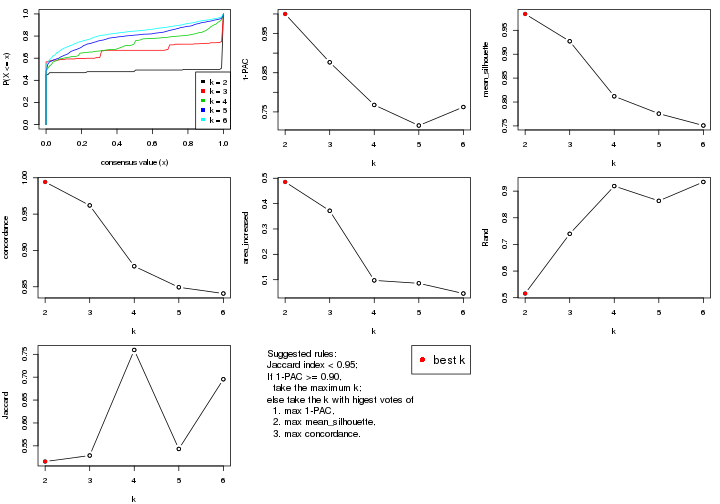

The numeric values for all these statistics can be obtained by `get_stats()`.

```r
get_stats(res)
```

```
#>   k 1-PAC mean_silhouette concordance area_increased  Rand Jaccard
#> 2 2 1.000           0.984       0.994         0.4854 0.516   0.516
#> 3 3 0.877           0.927       0.962         0.3719 0.740   0.529
#> 4 4 0.768           0.812       0.878         0.0972 0.919   0.759
#> 5 5 0.715           0.776       0.849         0.0857 0.864   0.543
#> 6 6 0.762           0.751       0.841         0.0454 0.934   0.695
```

`suggest_best_k()` suggests the best $k$ based on these statistics. The rules are as follows:

- All $k$ with Jaccard index larger than 0.95 are removed because the increase of
  the partition number does not provides enough extra information. If all $k$ are removed,
  the best $k$ is assigned by `NA`.
- For $k$ with 1-PAC larger than 0.9, the maximal $k$ is taken as the "best k". Other $k$ is called "optional k".
- If it does not fit the second rule. The $k$ with the highest vote of highest
  1-PAC, mean silhouette and concordance is taken as the "best k".

```r
suggest_best_k(res)
```

```
#> [1] 2
```


Following shows the table of the partitions (You need to click the **show/hide
code output** link to see it). The membership matrix (columns with name `p*`)
is inferred by
[`clue::cl_consensus()`](https://www.rdocumentation.org/link/cl_consensus?package=clue)
function with the `SE` method. Basically the value in the membership matrix
represents the probability to belong to a certain group. The finall class
label for an item is determined with the group with highest probability it
belongs to.

In `get_classes()` function, the entropy is calculated from the membership
matrix and the silhouette score is calculated from the consensus matrix.


<script>
$( function() {
	$( '#tabs-CV-skmeans-get-classes' ).tabs();
} );
</script>
<div id='tabs-CV-skmeans-get-classes'>
<ul>
<li><a href='#tab-CV-skmeans-get-classes-1'>k = 2</a></li>
<li><a href='#tab-CV-skmeans-get-classes-2'>k = 3</a></li>
<li><a href='#tab-CV-skmeans-get-classes-3'>k = 4</a></li>
<li><a href='#tab-CV-skmeans-get-classes-4'>k = 5</a></li>
<li><a href='#tab-CV-skmeans-get-classes-5'>k = 6</a></li>
</ul>

<div id='tab-CV-skmeans-get-classes-1'>
<p><a id='tab-CV-skmeans-get-classes-1-a' style='color:#0366d6' href='#'>show/hide code output</a></p>
<pre><code class="r">cbind(get_classes(res, k = 2), get_membership(res, k = 2))
</code></pre>

<pre><code>#&gt;           class entropy silhouette    p1    p2
#&gt; GSM289470     1   0.000    0.99495 1.000 0.000
#&gt; GSM289471     1   0.000    0.99495 1.000 0.000
#&gt; GSM289472     2   0.000    0.99357 0.000 1.000
#&gt; GSM289473     2   0.000    0.99357 0.000 1.000
#&gt; GSM289474     2   0.000    0.99357 0.000 1.000
#&gt; GSM289475     2   0.000    0.99357 0.000 1.000
#&gt; GSM289476     1   0.000    0.99495 1.000 0.000
#&gt; GSM289477     2   0.000    0.99357 0.000 1.000
#&gt; GSM289478     2   0.000    0.99357 0.000 1.000
#&gt; GSM289479     2   0.000    0.99357 0.000 1.000
#&gt; GSM289480     2   0.000    0.99357 0.000 1.000
#&gt; GSM289481     2   0.000    0.99357 0.000 1.000
#&gt; GSM289482     2   0.000    0.99357 0.000 1.000
#&gt; GSM289483     2   0.000    0.99357 0.000 1.000
#&gt; GSM289484     2   0.000    0.99357 0.000 1.000
#&gt; GSM289485     2   0.000    0.99357 0.000 1.000
#&gt; GSM289486     1   0.000    0.99495 1.000 0.000
#&gt; GSM289487     2   0.000    0.99357 0.000 1.000
#&gt; GSM289488     2   0.000    0.99357 0.000 1.000
#&gt; GSM289489     2   0.000    0.99357 0.000 1.000
#&gt; GSM289490     1   0.000    0.99495 1.000 0.000
#&gt; GSM289491     2   0.000    0.99357 0.000 1.000
#&gt; GSM289492     1   0.000    0.99495 1.000 0.000
#&gt; GSM289493     2   0.000    0.99357 0.000 1.000
#&gt; GSM289494     1   0.000    0.99495 1.000 0.000
#&gt; GSM289495     2   0.000    0.99357 0.000 1.000
#&gt; GSM289496     2   0.000    0.99357 0.000 1.000
#&gt; GSM289497     2   0.000    0.99357 0.000 1.000
#&gt; GSM289498     1   0.000    0.99495 1.000 0.000
#&gt; GSM289499     2   0.000    0.99357 0.000 1.000
#&gt; GSM289500     1   0.000    0.99495 1.000 0.000
#&gt; GSM289501     2   0.000    0.99357 0.000 1.000
#&gt; GSM289502     2   0.000    0.99357 0.000 1.000
#&gt; GSM289503     2   0.000    0.99357 0.000 1.000
#&gt; GSM289504     2   0.000    0.99357 0.000 1.000
#&gt; GSM289505     2   0.000    0.99357 0.000 1.000
#&gt; GSM289506     2   0.000    0.99357 0.000 1.000
#&gt; GSM289507     2   0.000    0.99357 0.000 1.000
#&gt; GSM289508     1   0.000    0.99495 1.000 0.000
#&gt; GSM289509     1   0.000    0.99495 1.000 0.000
#&gt; GSM289510     2   0.000    0.99357 0.000 1.000
#&gt; GSM289511     2   0.000    0.99357 0.000 1.000
#&gt; GSM289512     1   0.000    0.99495 1.000 0.000
#&gt; GSM289513     2   0.000    0.99357 0.000 1.000
#&gt; GSM289514     1   0.000    0.99495 1.000 0.000
#&gt; GSM289515     2   0.000    0.99357 0.000 1.000
#&gt; GSM289516     2   0.000    0.99357 0.000 1.000
#&gt; GSM289517     2   0.000    0.99357 0.000 1.000
#&gt; GSM289518     2   0.000    0.99357 0.000 1.000
#&gt; GSM289519     1   0.000    0.99495 1.000 0.000
#&gt; GSM289520     2   0.000    0.99357 0.000 1.000
#&gt; GSM289521     1   0.000    0.99495 1.000 0.000
#&gt; GSM289522     2   1.000    0.00244 0.496 0.504
#&gt; GSM289523     1   0.000    0.99495 1.000 0.000
#&gt; GSM289524     2   0.000    0.99357 0.000 1.000
#&gt; GSM289525     2   0.000    0.99357 0.000 1.000
#&gt; GSM289526     1   0.000    0.99495 1.000 0.000
#&gt; GSM289527     2   0.000    0.99357 0.000 1.000
#&gt; GSM289528     2   0.000    0.99357 0.000 1.000
#&gt; GSM289529     2   0.000    0.99357 0.000 1.000
#&gt; GSM289530     1   0.000    0.99495 1.000 0.000
#&gt; GSM289531     2   0.000    0.99357 0.000 1.000
#&gt; GSM289532     1   0.000    0.99495 1.000 0.000
#&gt; GSM289533     2   0.000    0.99357 0.000 1.000
#&gt; GSM289534     1   0.000    0.99495 1.000 0.000
#&gt; GSM289535     1   0.000    0.99495 1.000 0.000
#&gt; GSM289536     1   0.000    0.99495 1.000 0.000
#&gt; GSM289537     2   0.000    0.99357 0.000 1.000
#&gt; GSM289538     2   0.000    0.99357 0.000 1.000
#&gt; GSM289539     2   0.000    0.99357 0.000 1.000
#&gt; GSM289540     1   0.000    0.99495 1.000 0.000
#&gt; GSM289541     1   0.000    0.99495 1.000 0.000
#&gt; GSM289542     1   0.000    0.99495 1.000 0.000
#&gt; GSM289543     1   0.118    0.97997 0.984 0.016
#&gt; GSM289544     1   0.000    0.99495 1.000 0.000
#&gt; GSM289545     2   0.000    0.99357 0.000 1.000
#&gt; GSM289546     2   0.000    0.99357 0.000 1.000
#&gt; GSM289547     2   0.000    0.99357 0.000 1.000
#&gt; GSM289548     1   0.000    0.99495 1.000 0.000
#&gt; GSM289549     1   0.000    0.99495 1.000 0.000
#&gt; GSM289550     1   0.000    0.99495 1.000 0.000
#&gt; GSM289551     1   0.000    0.99495 1.000 0.000
#&gt; GSM289552     1   0.000    0.99495 1.000 0.000
#&gt; GSM289553     1   0.000    0.99495 1.000 0.000
#&gt; GSM289554     2   0.000    0.99357 0.000 1.000
#&gt; GSM289555     2   0.000    0.99357 0.000 1.000
#&gt; GSM289556     1   0.000    0.99495 1.000 0.000
#&gt; GSM289557     2   0.000    0.99357 0.000 1.000
#&gt; GSM289558     2   0.000    0.99357 0.000 1.000
#&gt; GSM289559     1   0.000    0.99495 1.000 0.000
#&gt; GSM289560     2   0.000    0.99357 0.000 1.000
#&gt; GSM289561     2   0.000    0.99357 0.000 1.000
#&gt; GSM289562     1   0.000    0.99495 1.000 0.000
#&gt; GSM289563     1   0.000    0.99495 1.000 0.000
#&gt; GSM289564     2   0.000    0.99357 0.000 1.000
#&gt; GSM289565     1   0.000    0.99495 1.000 0.000
#&gt; GSM289566     1   0.000    0.99495 1.000 0.000
#&gt; GSM289567     2   0.000    0.99357 0.000 1.000
#&gt; GSM289568     2   0.000    0.99357 0.000 1.000
#&gt; GSM289569     2   0.000    0.99357 0.000 1.000
#&gt; GSM289570     2   0.000    0.99357 0.000 1.000
#&gt; GSM289571     2   0.000    0.99357 0.000 1.000
#&gt; GSM289572     2   0.000    0.99357 0.000 1.000
#&gt; GSM289573     2   0.000    0.99357 0.000 1.000
#&gt; GSM289574     2   0.000    0.99357 0.000 1.000
#&gt; GSM289575     2   0.000    0.99357 0.000 1.000
#&gt; GSM289576     2   0.000    0.99357 0.000 1.000
#&gt; GSM289577     2   0.000    0.99357 0.000 1.000
#&gt; GSM289578     2   0.000    0.99357 0.000 1.000
#&gt; GSM289579     2   0.000    0.99357 0.000 1.000
#&gt; GSM289580     1   0.000    0.99495 1.000 0.000
#&gt; GSM289581     1   0.000    0.99495 1.000 0.000
#&gt; GSM289582     2   0.000    0.99357 0.000 1.000
#&gt; GSM289583     2   0.000    0.99357 0.000 1.000
#&gt; GSM289584     2   0.000    0.99357 0.000 1.000
#&gt; GSM289585     2   0.000    0.99357 0.000 1.000
#&gt; GSM289586     1   0.767    0.70984 0.776 0.224
#&gt; GSM289587     1   0.000    0.99495 1.000 0.000
#&gt; GSM289588     1   0.000    0.99495 1.000 0.000
#&gt; GSM289589     1   0.000    0.99495 1.000 0.000
#&gt; GSM289590     1   0.000    0.99495 1.000 0.000
#&gt; GSM289591     1   0.000    0.99495 1.000 0.000
#&gt; GSM289592     2   0.000    0.99357 0.000 1.000
#&gt; GSM289593     1   0.000    0.99495 1.000 0.000
#&gt; GSM289594     2   0.000    0.99357 0.000 1.000
#&gt; GSM289595     1   0.000    0.99495 1.000 0.000
#&gt; GSM289596     2   0.000    0.99357 0.000 1.000
#&gt; GSM289597     2   0.000    0.99357 0.000 1.000
#&gt; GSM289598     1   0.000    0.99495 1.000 0.000
#&gt; GSM289599     1   0.141    0.97609 0.980 0.020
#&gt; GSM289600     1   0.000    0.99495 1.000 0.000
#&gt; GSM289601     1   0.000    0.99495 1.000 0.000
</code></pre>

<script>
$('#tab-CV-skmeans-get-classes-1-a').parent().next().next().hide();
$('#tab-CV-skmeans-get-classes-1-a').click(function(){
  $('#tab-CV-skmeans-get-classes-1-a').parent().next().next().toggle();
  return(false);
});
</script>
</div>

<div id='tab-CV-skmeans-get-classes-2'>
<p><a id='tab-CV-skmeans-get-classes-2-a' style='color:#0366d6' href='#'>show/hide code output</a></p>
<pre><code class="r">cbind(get_classes(res, k = 3), get_membership(res, k = 3))
</code></pre>

<pre><code>#&gt;           class entropy silhouette    p1    p2    p3
#&gt; GSM289470     3  0.3038      0.822 0.104 0.000 0.896
#&gt; GSM289471     1  0.0000      0.993 1.000 0.000 0.000
#&gt; GSM289472     3  0.5621      0.688 0.000 0.308 0.692
#&gt; GSM289473     3  0.0000      0.896 0.000 0.000 1.000
#&gt; GSM289474     3  0.0000      0.896 0.000 0.000 1.000
#&gt; GSM289475     3  0.5621      0.688 0.000 0.308 0.692
#&gt; GSM289476     1  0.0000      0.993 1.000 0.000 0.000
#&gt; GSM289477     3  0.5621      0.688 0.000 0.308 0.692
#&gt; GSM289478     3  0.5621      0.688 0.000 0.308 0.692
#&gt; GSM289479     3  0.0000      0.896 0.000 0.000 1.000
#&gt; GSM289480     3  0.5621      0.688 0.000 0.308 0.692
#&gt; GSM289481     3  0.4121      0.802 0.000 0.168 0.832
#&gt; GSM289482     3  0.5621      0.688 0.000 0.308 0.692
#&gt; GSM289483     3  0.5621      0.688 0.000 0.308 0.692
#&gt; GSM289484     3  0.5621      0.688 0.000 0.308 0.692
#&gt; GSM289485     3  0.5621      0.688 0.000 0.308 0.692
#&gt; GSM289486     1  0.0000      0.993 1.000 0.000 0.000
#&gt; GSM289487     3  0.5621      0.688 0.000 0.308 0.692
#&gt; GSM289488     3  0.5621      0.688 0.000 0.308 0.692
#&gt; GSM289489     3  0.0000      0.896 0.000 0.000 1.000
#&gt; GSM289490     2  0.5397      0.598 0.280 0.720 0.000
#&gt; GSM289491     2  0.0000      0.980 0.000 1.000 0.000
#&gt; GSM289492     1  0.0000      0.993 1.000 0.000 0.000
#&gt; GSM289493     2  0.0000      0.980 0.000 1.000 0.000
#&gt; GSM289494     1  0.0000      0.993 1.000 0.000 0.000
#&gt; GSM289495     2  0.0000      0.980 0.000 1.000 0.000
#&gt; GSM289496     2  0.0000      0.980 0.000 1.000 0.000
#&gt; GSM289497     2  0.0000      0.980 0.000 1.000 0.000
#&gt; GSM289498     1  0.0000      0.993 1.000 0.000 0.000
#&gt; GSM289499     2  0.0000      0.980 0.000 1.000 0.000
#&gt; GSM289500     1  0.0000      0.993 1.000 0.000 0.000
#&gt; GSM289501     2  0.0000      0.980 0.000 1.000 0.000
#&gt; GSM289502     2  0.0000      0.980 0.000 1.000 0.000
#&gt; GSM289503     2  0.0000      0.980 0.000 1.000 0.000
#&gt; GSM289504     2  0.0000      0.980 0.000 1.000 0.000
#&gt; GSM289505     2  0.0000      0.980 0.000 1.000 0.000
#&gt; GSM289506     2  0.0000      0.980 0.000 1.000 0.000
#&gt; GSM289507     2  0.0000      0.980 0.000 1.000 0.000
#&gt; GSM289508     1  0.0000      0.993 1.000 0.000 0.000
#&gt; GSM289509     1  0.0000      0.993 1.000 0.000 0.000
#&gt; GSM289510     3  0.0000      0.896 0.000 0.000 1.000
#&gt; GSM289511     3  0.0000      0.896 0.000 0.000 1.000
#&gt; GSM289512     1  0.0000      0.993 1.000 0.000 0.000
#&gt; GSM289513     3  0.0000      0.896 0.000 0.000 1.000
#&gt; GSM289514     3  0.0000      0.896 0.000 0.000 1.000
#&gt; GSM289515     3  0.0000      0.896 0.000 0.000 1.000
#&gt; GSM289516     3  0.0000      0.896 0.000 0.000 1.000
#&gt; GSM289517     3  0.0000      0.896 0.000 0.000 1.000
#&gt; GSM289518     3  0.0000      0.896 0.000 0.000 1.000
#&gt; GSM289519     3  0.0592      0.890 0.012 0.000 0.988
#&gt; GSM289520     3  0.1289      0.882 0.000 0.032 0.968
#&gt; GSM289521     1  0.0000      0.993 1.000 0.000 0.000
#&gt; GSM289522     3  0.0000      0.896 0.000 0.000 1.000
#&gt; GSM289523     1  0.0000      0.993 1.000 0.000 0.000
#&gt; GSM289524     3  0.0000      0.896 0.000 0.000 1.000
#&gt; GSM289525     3  0.0000      0.896 0.000 0.000 1.000
#&gt; GSM289526     1  0.5621      0.587 0.692 0.000 0.308
#&gt; GSM289527     3  0.0000      0.896 0.000 0.000 1.000
#&gt; GSM289528     3  0.5621      0.688 0.000 0.308 0.692
#&gt; GSM289529     3  0.0000      0.896 0.000 0.000 1.000
#&gt; GSM289530     1  0.0000      0.993 1.000 0.000 0.000
#&gt; GSM289531     3  0.0000      0.896 0.000 0.000 1.000
#&gt; GSM289532     1  0.0000      0.993 1.000 0.000 0.000
#&gt; GSM289533     3  0.0000      0.896 0.000 0.000 1.000
#&gt; GSM289534     1  0.0000      0.993 1.000 0.000 0.000
#&gt; GSM289535     2  0.5760      0.501 0.328 0.672 0.000
#&gt; GSM289536     1  0.0000      0.993 1.000 0.000 0.000
#&gt; GSM289537     2  0.0000      0.980 0.000 1.000 0.000
#&gt; GSM289538     2  0.0000      0.980 0.000 1.000 0.000
#&gt; GSM289539     2  0.0000      0.980 0.000 1.000 0.000
#&gt; GSM289540     1  0.0000      0.993 1.000 0.000 0.000
#&gt; GSM289541     1  0.0000      0.993 1.000 0.000 0.000
#&gt; GSM289542     1  0.0000      0.993 1.000 0.000 0.000
#&gt; GSM289543     2  0.2537      0.888 0.080 0.920 0.000
#&gt; GSM289544     1  0.0000      0.993 1.000 0.000 0.000
#&gt; GSM289545     2  0.0000      0.980 0.000 1.000 0.000
#&gt; GSM289546     2  0.0000      0.980 0.000 1.000 0.000
#&gt; GSM289547     2  0.0000      0.980 0.000 1.000 0.000
#&gt; GSM289548     1  0.0000      0.993 1.000 0.000 0.000
#&gt; GSM289549     1  0.0000      0.993 1.000 0.000 0.000
#&gt; GSM289550     1  0.0000      0.993 1.000 0.000 0.000
#&gt; GSM289551     1  0.0000      0.993 1.000 0.000 0.000
#&gt; GSM289552     1  0.0000      0.993 1.000 0.000 0.000
#&gt; GSM289553     1  0.0000      0.993 1.000 0.000 0.000
#&gt; GSM289554     2  0.0000      0.980 0.000 1.000 0.000
#&gt; GSM289555     2  0.0000      0.980 0.000 1.000 0.000
#&gt; GSM289556     1  0.0000      0.993 1.000 0.000 0.000
#&gt; GSM289557     2  0.0000      0.980 0.000 1.000 0.000
#&gt; GSM289558     2  0.0000      0.980 0.000 1.000 0.000
#&gt; GSM289559     1  0.0000      0.993 1.000 0.000 0.000
#&gt; GSM289560     2  0.0000      0.980 0.000 1.000 0.000
#&gt; GSM289561     2  0.0000      0.980 0.000 1.000 0.000
#&gt; GSM289562     1  0.0000      0.993 1.000 0.000 0.000
#&gt; GSM289563     1  0.0000      0.993 1.000 0.000 0.000
#&gt; GSM289564     2  0.0592      0.968 0.000 0.988 0.012
#&gt; GSM289565     1  0.0000      0.993 1.000 0.000 0.000
#&gt; GSM289566     1  0.0000      0.993 1.000 0.000 0.000
#&gt; GSM289567     3  0.0000      0.896 0.000 0.000 1.000
#&gt; GSM289568     3  0.0000      0.896 0.000 0.000 1.000
#&gt; GSM289569     3  0.0000      0.896 0.000 0.000 1.000
#&gt; GSM289570     3  0.0000      0.896 0.000 0.000 1.000
#&gt; GSM289571     2  0.0000      0.980 0.000 1.000 0.000
#&gt; GSM289572     2  0.0000      0.980 0.000 1.000 0.000
#&gt; GSM289573     2  0.0000      0.980 0.000 1.000 0.000
#&gt; GSM289574     2  0.0000      0.980 0.000 1.000 0.000
#&gt; GSM289575     2  0.0000      0.980 0.000 1.000 0.000
#&gt; GSM289576     2  0.0000      0.980 0.000 1.000 0.000
#&gt; GSM289577     2  0.0000      0.980 0.000 1.000 0.000
#&gt; GSM289578     2  0.0000      0.980 0.000 1.000 0.000
#&gt; GSM289579     2  0.0000      0.980 0.000 1.000 0.000
#&gt; GSM289580     1  0.0000      0.993 1.000 0.000 0.000
#&gt; GSM289581     1  0.0000      0.993 1.000 0.000 0.000
#&gt; GSM289582     3  0.0000      0.896 0.000 0.000 1.000
#&gt; GSM289583     2  0.0000      0.980 0.000 1.000 0.000
#&gt; GSM289584     2  0.0000      0.980 0.000 1.000 0.000
#&gt; GSM289585     2  0.0000      0.980 0.000 1.000 0.000
#&gt; GSM289586     3  0.0000      0.896 0.000 0.000 1.000
#&gt; GSM289587     1  0.0000      0.993 1.000 0.000 0.000
#&gt; GSM289588     1  0.0000      0.993 1.000 0.000 0.000
#&gt; GSM289589     1  0.0000      0.993 1.000 0.000 0.000
#&gt; GSM289590     1  0.0000      0.993 1.000 0.000 0.000
#&gt; GSM289591     1  0.0000      0.993 1.000 0.000 0.000
#&gt; GSM289592     2  0.0000      0.980 0.000 1.000 0.000
#&gt; GSM289593     1  0.0000      0.993 1.000 0.000 0.000
#&gt; GSM289594     2  0.0000      0.980 0.000 1.000 0.000
#&gt; GSM289595     1  0.0000      0.993 1.000 0.000 0.000
#&gt; GSM289596     2  0.0000      0.980 0.000 1.000 0.000
#&gt; GSM289597     3  0.0000      0.896 0.000 0.000 1.000
#&gt; GSM289598     1  0.0000      0.993 1.000 0.000 0.000
#&gt; GSM289599     2  0.0000      0.980 0.000 1.000 0.000
#&gt; GSM289600     1  0.0000      0.993 1.000 0.000 0.000
#&gt; GSM289601     1  0.0000      0.993 1.000 0.000 0.000
</code></pre>

<script>
$('#tab-CV-skmeans-get-classes-2-a').parent().next().next().hide();
$('#tab-CV-skmeans-get-classes-2-a').click(function(){
  $('#tab-CV-skmeans-get-classes-2-a').parent().next().next().toggle();
  return(false);
});
</script>
</div>

<div id='tab-CV-skmeans-get-classes-3'>
<p><a id='tab-CV-skmeans-get-classes-3-a' style='color:#0366d6' href='#'>show/hide code output</a></p>
<pre><code class="r">cbind(get_classes(res, k = 4), get_membership(res, k = 4))
</code></pre>

<pre><code>#&gt;           class entropy silhouette    p1    p2    p3    p4
#&gt; GSM289470     1  0.1042      0.911 0.972 0.020 0.008 0.000
#&gt; GSM289471     3  0.3444      0.900 0.184 0.000 0.816 0.000
#&gt; GSM289472     2  0.5833      0.403 0.000 0.528 0.032 0.440
#&gt; GSM289473     2  0.2647      0.765 0.000 0.880 0.120 0.000
#&gt; GSM289474     2  0.0000      0.793 0.000 1.000 0.000 0.000
#&gt; GSM289475     2  0.5833      0.403 0.000 0.528 0.032 0.440
#&gt; GSM289476     3  0.3444      0.900 0.184 0.000 0.816 0.000
#&gt; GSM289477     2  0.5678      0.394 0.000 0.524 0.024 0.452
#&gt; GSM289478     2  0.5833      0.403 0.000 0.528 0.032 0.440
#&gt; GSM289479     2  0.2944      0.763 0.000 0.868 0.128 0.004
#&gt; GSM289480     2  0.5833      0.403 0.000 0.528 0.032 0.440
#&gt; GSM289481     2  0.6874      0.511 0.000 0.568 0.136 0.296
#&gt; GSM289482     2  0.5764      0.396 0.000 0.520 0.028 0.452
#&gt; GSM289483     2  0.5833      0.403 0.000 0.528 0.032 0.440
#&gt; GSM289484     2  0.5833      0.403 0.000 0.528 0.032 0.440
#&gt; GSM289485     2  0.5833      0.403 0.000 0.528 0.032 0.440
#&gt; GSM289486     1  0.0000      0.943 1.000 0.000 0.000 0.000
#&gt; GSM289487     2  0.5833      0.403 0.000 0.528 0.032 0.440
#&gt; GSM289488     2  0.5755      0.401 0.000 0.528 0.028 0.444
#&gt; GSM289489     2  0.0336      0.793 0.000 0.992 0.008 0.000
#&gt; GSM289490     3  0.1637      0.774 0.000 0.000 0.940 0.060
#&gt; GSM289491     4  0.3925      0.825 0.000 0.016 0.176 0.808
#&gt; GSM289492     3  0.3659      0.879 0.136 0.000 0.840 0.024
#&gt; GSM289493     4  0.0336      0.931 0.000 0.000 0.008 0.992
#&gt; GSM289494     3  0.2589      0.868 0.116 0.000 0.884 0.000
#&gt; GSM289495     4  0.0921      0.929 0.000 0.000 0.028 0.972
#&gt; GSM289496     4  0.1022      0.929 0.000 0.000 0.032 0.968
#&gt; GSM289497     4  0.1936      0.917 0.000 0.028 0.032 0.940
#&gt; GSM289498     3  0.2124      0.837 0.068 0.000 0.924 0.008
#&gt; GSM289499     4  0.0469      0.931 0.000 0.000 0.012 0.988
#&gt; GSM289500     3  0.3444      0.900 0.184 0.000 0.816 0.000
#&gt; GSM289501     4  0.1022      0.929 0.000 0.000 0.032 0.968
#&gt; GSM289502     4  0.1936      0.917 0.000 0.028 0.032 0.940
#&gt; GSM289503     4  0.1936      0.917 0.000 0.028 0.032 0.940
#&gt; GSM289504     4  0.1211      0.926 0.000 0.000 0.040 0.960
#&gt; GSM289505     4  0.0336      0.931 0.000 0.000 0.008 0.992
#&gt; GSM289506     4  0.1936      0.917 0.000 0.028 0.032 0.940
#&gt; GSM289507     4  0.1936      0.917 0.000 0.028 0.032 0.940
#&gt; GSM289508     1  0.1389      0.894 0.952 0.000 0.048 0.000
#&gt; GSM289509     3  0.3400      0.898 0.180 0.000 0.820 0.000
#&gt; GSM289510     2  0.1022      0.787 0.000 0.968 0.032 0.000
#&gt; GSM289511     2  0.0336      0.793 0.000 0.992 0.008 0.000
#&gt; GSM289512     3  0.3444      0.900 0.184 0.000 0.816 0.000
#&gt; GSM289513     2  0.0336      0.793 0.000 0.992 0.008 0.000
#&gt; GSM289514     2  0.1302      0.786 0.000 0.956 0.044 0.000
#&gt; GSM289515     2  0.0921      0.789 0.000 0.972 0.028 0.000
#&gt; GSM289516     2  0.0921      0.789 0.000 0.972 0.028 0.000
#&gt; GSM289517     2  0.0921      0.789 0.000 0.972 0.028 0.000
#&gt; GSM289518     2  0.0921      0.789 0.000 0.972 0.028 0.000
#&gt; GSM289519     2  0.2926      0.758 0.056 0.896 0.048 0.000
#&gt; GSM289520     2  0.2089      0.784 0.000 0.932 0.020 0.048
#&gt; GSM289521     3  0.4745      0.807 0.208 0.036 0.756 0.000
#&gt; GSM289522     2  0.0921      0.789 0.000 0.972 0.028 0.000
#&gt; GSM289523     3  0.3444      0.900 0.184 0.000 0.816 0.000
#&gt; GSM289524     2  0.0336      0.793 0.000 0.992 0.008 0.000
#&gt; GSM289525     2  0.0921      0.789 0.000 0.972 0.028 0.000
#&gt; GSM289526     3  0.5746      0.528 0.040 0.348 0.612 0.000
#&gt; GSM289527     2  0.0336      0.793 0.000 0.992 0.008 0.000
#&gt; GSM289528     2  0.5838      0.394 0.000 0.524 0.032 0.444
#&gt; GSM289529     2  0.2408      0.771 0.000 0.896 0.104 0.000
#&gt; GSM289530     3  0.2048      0.839 0.064 0.008 0.928 0.000
#&gt; GSM289531     2  0.3161      0.760 0.000 0.864 0.124 0.012
#&gt; GSM289532     3  0.1545      0.820 0.040 0.008 0.952 0.000
#&gt; GSM289533     2  0.0336      0.793 0.000 0.992 0.008 0.000
#&gt; GSM289534     3  0.3444      0.900 0.184 0.000 0.816 0.000
#&gt; GSM289535     3  0.2216      0.744 0.000 0.000 0.908 0.092
#&gt; GSM289536     3  0.3444      0.900 0.184 0.000 0.816 0.000
#&gt; GSM289537     4  0.1510      0.923 0.000 0.016 0.028 0.956
#&gt; GSM289538     4  0.1610      0.922 0.000 0.016 0.032 0.952
#&gt; GSM289539     4  0.1936      0.917 0.000 0.028 0.032 0.940
#&gt; GSM289540     1  0.4406      0.513 0.700 0.000 0.300 0.000
#&gt; GSM289541     1  0.0000      0.943 1.000 0.000 0.000 0.000
#&gt; GSM289542     1  0.0000      0.943 1.000 0.000 0.000 0.000
#&gt; GSM289543     4  0.5497      0.524 0.044 0.000 0.284 0.672
#&gt; GSM289544     1  0.0188      0.939 0.996 0.000 0.004 0.000
#&gt; GSM289545     4  0.1610      0.922 0.000 0.016 0.032 0.952
#&gt; GSM289546     4  0.1610      0.922 0.000 0.016 0.032 0.952
#&gt; GSM289547     4  0.2124      0.919 0.000 0.028 0.040 0.932
#&gt; GSM289548     1  0.0000      0.943 1.000 0.000 0.000 0.000
#&gt; GSM289549     1  0.0000      0.943 1.000 0.000 0.000 0.000
#&gt; GSM289550     1  0.0000      0.943 1.000 0.000 0.000 0.000
#&gt; GSM289551     3  0.3444      0.900 0.184 0.000 0.816 0.000
#&gt; GSM289552     1  0.0000      0.943 1.000 0.000 0.000 0.000
#&gt; GSM289553     1  0.0000      0.943 1.000 0.000 0.000 0.000
#&gt; GSM289554     4  0.1211      0.926 0.000 0.000 0.040 0.960
#&gt; GSM289555     4  0.1118      0.927 0.000 0.000 0.036 0.964
#&gt; GSM289556     1  0.0000      0.943 1.000 0.000 0.000 0.000
#&gt; GSM289557     4  0.0188      0.931 0.000 0.000 0.004 0.996
#&gt; GSM289558     4  0.0921      0.930 0.000 0.000 0.028 0.972
#&gt; GSM289559     1  0.0000      0.943 1.000 0.000 0.000 0.000
#&gt; GSM289560     4  0.1211      0.926 0.000 0.000 0.040 0.960
#&gt; GSM289561     4  0.0921      0.930 0.000 0.000 0.028 0.972
#&gt; GSM289562     1  0.0000      0.943 1.000 0.000 0.000 0.000
#&gt; GSM289563     1  0.0000      0.943 1.000 0.000 0.000 0.000
#&gt; GSM289564     4  0.4019      0.784 0.000 0.012 0.196 0.792
#&gt; GSM289565     1  0.4331      0.525 0.712 0.000 0.288 0.000
#&gt; GSM289566     3  0.4907      0.531 0.420 0.000 0.580 0.000
#&gt; GSM289567     2  0.2530      0.768 0.000 0.888 0.112 0.000
#&gt; GSM289568     2  0.0336      0.793 0.000 0.992 0.008 0.000
#&gt; GSM289569     2  0.0188      0.792 0.000 0.996 0.004 0.000
#&gt; GSM289570     2  0.2408      0.771 0.000 0.896 0.104 0.000
#&gt; GSM289571     4  0.1488      0.923 0.000 0.012 0.032 0.956
#&gt; GSM289572     4  0.0921      0.930 0.000 0.000 0.028 0.972
#&gt; GSM289573     4  0.0336      0.931 0.000 0.000 0.008 0.992
#&gt; GSM289574     4  0.1936      0.917 0.000 0.028 0.032 0.940
#&gt; GSM289575     4  0.2530      0.876 0.000 0.000 0.112 0.888
#&gt; GSM289576     4  0.0657      0.930 0.000 0.004 0.012 0.984
#&gt; GSM289577     4  0.2530      0.876 0.000 0.000 0.112 0.888
#&gt; GSM289578     4  0.2973      0.850 0.000 0.000 0.144 0.856
#&gt; GSM289579     4  0.2530      0.876 0.000 0.000 0.112 0.888
#&gt; GSM289580     3  0.3444      0.900 0.184 0.000 0.816 0.000
#&gt; GSM289581     3  0.3142      0.878 0.132 0.008 0.860 0.000
#&gt; GSM289582     2  0.0921      0.789 0.000 0.972 0.028 0.000
#&gt; GSM289583     4  0.1936      0.917 0.000 0.028 0.032 0.940
#&gt; GSM289584     4  0.1209      0.931 0.000 0.004 0.032 0.964
#&gt; GSM289585     4  0.1936      0.917 0.000 0.028 0.032 0.940
#&gt; GSM289586     2  0.0921      0.789 0.000 0.972 0.028 0.000
#&gt; GSM289587     1  0.0000      0.943 1.000 0.000 0.000 0.000
#&gt; GSM289588     3  0.3444      0.900 0.184 0.000 0.816 0.000
#&gt; GSM289589     1  0.0000      0.943 1.000 0.000 0.000 0.000
#&gt; GSM289590     3  0.4193      0.817 0.268 0.000 0.732 0.000
#&gt; GSM289591     1  0.0000      0.943 1.000 0.000 0.000 0.000
#&gt; GSM289592     4  0.0188      0.931 0.000 0.000 0.004 0.996
#&gt; GSM289593     3  0.3444      0.900 0.184 0.000 0.816 0.000
#&gt; GSM289594     4  0.1118      0.927 0.000 0.000 0.036 0.964
#&gt; GSM289595     3  0.4164      0.826 0.264 0.000 0.736 0.000
#&gt; GSM289596     4  0.0188      0.931 0.000 0.000 0.004 0.996
#&gt; GSM289597     2  0.0921      0.789 0.000 0.972 0.028 0.000
#&gt; GSM289598     3  0.3444      0.900 0.184 0.000 0.816 0.000
#&gt; GSM289599     4  0.5109      0.678 0.060 0.000 0.196 0.744
#&gt; GSM289600     1  0.0000      0.943 1.000 0.000 0.000 0.000
#&gt; GSM289601     1  0.4746      0.532 0.688 0.008 0.304 0.000
</code></pre>

<script>
$('#tab-CV-skmeans-get-classes-3-a').parent().next().next().hide();
$('#tab-CV-skmeans-get-classes-3-a').click(function(){
  $('#tab-CV-skmeans-get-classes-3-a').parent().next().next().toggle();
  return(false);
});
</script>
</div>

<div id='tab-CV-skmeans-get-classes-4'>
<p><a id='tab-CV-skmeans-get-classes-4-a' style='color:#0366d6' href='#'>show/hide code output</a></p>
<pre><code class="r">cbind(get_classes(res, k = 5), get_membership(res, k = 5))
</code></pre>

<pre><code>#&gt;           class entropy silhouette    p1    p2    p3    p4    p5
#&gt; GSM289470     1  0.0000     0.9533 1.000 0.000 0.000 0.000 0.000
#&gt; GSM289471     3  0.0290     0.9082 0.008 0.000 0.992 0.000 0.000
#&gt; GSM289472     5  0.2377     0.7783 0.000 0.000 0.000 0.128 0.872
#&gt; GSM289473     4  0.3622     0.7796 0.000 0.096 0.004 0.832 0.068
#&gt; GSM289474     4  0.2280     0.7738 0.000 0.000 0.000 0.880 0.120
#&gt; GSM289475     5  0.2929     0.7758 0.000 0.012 0.004 0.128 0.856
#&gt; GSM289476     3  0.0290     0.9082 0.008 0.000 0.992 0.000 0.000
#&gt; GSM289477     5  0.4457     0.7224 0.000 0.048 0.004 0.208 0.740
#&gt; GSM289478     5  0.2929     0.7758 0.000 0.012 0.004 0.128 0.856
#&gt; GSM289479     4  0.6050     0.1380 0.000 0.104 0.004 0.488 0.404
#&gt; GSM289480     5  0.2377     0.7783 0.000 0.000 0.000 0.128 0.872
#&gt; GSM289481     5  0.4698     0.6845 0.000 0.096 0.000 0.172 0.732
#&gt; GSM289482     5  0.4883     0.6639 0.000 0.052 0.004 0.260 0.684
#&gt; GSM289483     5  0.4019     0.7334 0.000 0.028 0.004 0.200 0.768
#&gt; GSM289484     5  0.2929     0.7758 0.000 0.012 0.004 0.128 0.856
#&gt; GSM289485     5  0.4397     0.7241 0.004 0.036 0.004 0.208 0.748
#&gt; GSM289486     1  0.0000     0.9533 1.000 0.000 0.000 0.000 0.000
#&gt; GSM289487     5  0.2771     0.7756 0.000 0.012 0.000 0.128 0.860
#&gt; GSM289488     5  0.4019     0.7334 0.000 0.028 0.004 0.200 0.768
#&gt; GSM289489     4  0.4448     0.1323 0.000 0.004 0.000 0.516 0.480
#&gt; GSM289490     3  0.3730     0.5739 0.000 0.288 0.712 0.000 0.000
#&gt; GSM289491     5  0.5659     0.4360 0.000 0.164 0.204 0.000 0.632
#&gt; GSM289492     3  0.0451     0.9068 0.008 0.004 0.988 0.000 0.000
#&gt; GSM289493     2  0.3816     0.8666 0.000 0.696 0.000 0.000 0.304
#&gt; GSM289494     3  0.0290     0.9082 0.008 0.000 0.992 0.000 0.000
#&gt; GSM289495     2  0.2488     0.7178 0.000 0.872 0.004 0.000 0.124
#&gt; GSM289496     2  0.3684     0.8756 0.000 0.720 0.000 0.000 0.280
#&gt; GSM289497     5  0.0609     0.7945 0.000 0.020 0.000 0.000 0.980
#&gt; GSM289498     3  0.0693     0.9034 0.008 0.012 0.980 0.000 0.000
#&gt; GSM289499     2  0.3838     0.8301 0.000 0.716 0.004 0.000 0.280
#&gt; GSM289500     3  0.0290     0.9082 0.008 0.000 0.992 0.000 0.000
#&gt; GSM289501     2  0.3636     0.8782 0.000 0.728 0.000 0.000 0.272
#&gt; GSM289502     5  0.0404     0.7949 0.000 0.012 0.000 0.000 0.988
#&gt; GSM289503     5  0.0609     0.7945 0.000 0.020 0.000 0.000 0.980
#&gt; GSM289504     2  0.3508     0.8775 0.000 0.748 0.000 0.000 0.252
#&gt; GSM289505     2  0.3816     0.8522 0.000 0.696 0.000 0.000 0.304
#&gt; GSM289506     5  0.0609     0.7945 0.000 0.020 0.000 0.000 0.980
#&gt; GSM289507     5  0.0609     0.7945 0.000 0.020 0.000 0.000 0.980
#&gt; GSM289508     1  0.2020     0.8647 0.900 0.000 0.100 0.000 0.000
#&gt; GSM289509     3  0.0290     0.9082 0.008 0.000 0.992 0.000 0.000
#&gt; GSM289510     4  0.2773     0.7326 0.000 0.164 0.000 0.836 0.000
#&gt; GSM289511     4  0.2966     0.7365 0.000 0.000 0.000 0.816 0.184
#&gt; GSM289512     3  0.0290     0.9082 0.008 0.000 0.992 0.000 0.000
#&gt; GSM289513     4  0.3210     0.7156 0.000 0.000 0.000 0.788 0.212
#&gt; GSM289514     4  0.3826     0.6863 0.004 0.236 0.008 0.752 0.000
#&gt; GSM289515     4  0.0000     0.8097 0.000 0.000 0.000 1.000 0.000
#&gt; GSM289516     4  0.0000     0.8097 0.000 0.000 0.000 1.000 0.000
#&gt; GSM289517     4  0.0000     0.8097 0.000 0.000 0.000 1.000 0.000
#&gt; GSM289518     4  0.0000     0.8097 0.000 0.000 0.000 1.000 0.000
#&gt; GSM289519     4  0.5335     0.6173 0.088 0.232 0.008 0.672 0.000
#&gt; GSM289520     4  0.2930     0.7328 0.000 0.000 0.004 0.832 0.164
#&gt; GSM289521     4  0.7859     0.2415 0.100 0.224 0.232 0.444 0.000
#&gt; GSM289522     4  0.0000     0.8097 0.000 0.000 0.000 1.000 0.000
#&gt; GSM289523     3  0.0290     0.9082 0.008 0.000 0.992 0.000 0.000
#&gt; GSM289524     4  0.3210     0.7156 0.000 0.000 0.000 0.788 0.212
#&gt; GSM289525     4  0.0000     0.8097 0.000 0.000 0.000 1.000 0.000
#&gt; GSM289526     3  0.3812     0.6910 0.000 0.000 0.772 0.204 0.024
#&gt; GSM289527     4  0.3210     0.7156 0.000 0.000 0.000 0.788 0.212
#&gt; GSM289528     5  0.2825     0.7837 0.000 0.016 0.000 0.124 0.860
#&gt; GSM289529     4  0.2011     0.7902 0.000 0.088 0.004 0.908 0.000
#&gt; GSM289530     3  0.5218     0.6701 0.004 0.240 0.672 0.084 0.000
#&gt; GSM289531     4  0.5156     0.6695 0.000 0.216 0.004 0.688 0.092
#&gt; GSM289532     3  0.4808     0.6986 0.004 0.248 0.696 0.052 0.000
#&gt; GSM289533     4  0.3395     0.6915 0.000 0.000 0.000 0.764 0.236
#&gt; GSM289534     3  0.0290     0.9082 0.008 0.000 0.992 0.000 0.000
#&gt; GSM289535     2  0.1965     0.5992 0.000 0.904 0.096 0.000 0.000
#&gt; GSM289536     3  0.0290     0.9082 0.008 0.000 0.992 0.000 0.000
#&gt; GSM289537     5  0.2852     0.6290 0.000 0.172 0.000 0.000 0.828
#&gt; GSM289538     5  0.2674     0.6946 0.000 0.140 0.004 0.000 0.856
#&gt; GSM289539     5  0.0609     0.7945 0.000 0.020 0.000 0.000 0.980
#&gt; GSM289540     1  0.5726     0.5757 0.612 0.248 0.140 0.000 0.000
#&gt; GSM289541     1  0.0162     0.9503 0.996 0.000 0.004 0.000 0.000
#&gt; GSM289542     1  0.0290     0.9486 0.992 0.008 0.000 0.000 0.000
#&gt; GSM289543     2  0.5060     0.7190 0.056 0.700 0.016 0.000 0.228
#&gt; GSM289544     1  0.2574     0.8626 0.876 0.112 0.012 0.000 0.000
#&gt; GSM289545     5  0.2439     0.7070 0.000 0.120 0.004 0.000 0.876
#&gt; GSM289546     5  0.2848     0.6558 0.000 0.156 0.004 0.000 0.840
#&gt; GSM289547     5  0.1608     0.7614 0.000 0.072 0.000 0.000 0.928
#&gt; GSM289548     1  0.0000     0.9533 1.000 0.000 0.000 0.000 0.000
#&gt; GSM289549     1  0.0000     0.9533 1.000 0.000 0.000 0.000 0.000
#&gt; GSM289550     1  0.0162     0.9509 0.996 0.000 0.004 0.000 0.000
#&gt; GSM289551     3  0.0290     0.9082 0.008 0.000 0.992 0.000 0.000
#&gt; GSM289552     1  0.0000     0.9533 1.000 0.000 0.000 0.000 0.000
#&gt; GSM289553     1  0.0162     0.9510 0.996 0.000 0.004 0.000 0.000
#&gt; GSM289554     2  0.3508     0.8775 0.000 0.748 0.000 0.000 0.252
#&gt; GSM289555     2  0.3612     0.8785 0.000 0.732 0.000 0.000 0.268
#&gt; GSM289556     1  0.0000     0.9533 1.000 0.000 0.000 0.000 0.000
#&gt; GSM289557     2  0.3949     0.8474 0.000 0.668 0.000 0.000 0.332
#&gt; GSM289558     2  0.3774     0.8672 0.000 0.704 0.000 0.000 0.296
#&gt; GSM289559     1  0.0162     0.9509 0.996 0.000 0.004 0.000 0.000
#&gt; GSM289560     2  0.3612     0.8785 0.000 0.732 0.000 0.000 0.268
#&gt; GSM289561     2  0.3636     0.8782 0.000 0.728 0.000 0.000 0.272
#&gt; GSM289562     1  0.0000     0.9533 1.000 0.000 0.000 0.000 0.000
#&gt; GSM289563     1  0.0000     0.9533 1.000 0.000 0.000 0.000 0.000
#&gt; GSM289564     2  0.0833     0.6767 0.000 0.976 0.004 0.004 0.016
#&gt; GSM289565     1  0.5581     0.5999 0.636 0.224 0.140 0.000 0.000
#&gt; GSM289566     3  0.1671     0.8579 0.076 0.000 0.924 0.000 0.000
#&gt; GSM289567     4  0.2629     0.7747 0.000 0.136 0.004 0.860 0.000
#&gt; GSM289568     4  0.3242     0.7116 0.000 0.000 0.000 0.784 0.216
#&gt; GSM289569     4  0.1478     0.7939 0.000 0.000 0.000 0.936 0.064
#&gt; GSM289570     4  0.2536     0.7744 0.000 0.128 0.004 0.868 0.000
#&gt; GSM289571     5  0.3109     0.5703 0.000 0.200 0.000 0.000 0.800
#&gt; GSM289572     2  0.3534     0.8776 0.000 0.744 0.000 0.000 0.256
#&gt; GSM289573     2  0.3932     0.8508 0.000 0.672 0.000 0.000 0.328
#&gt; GSM289574     5  0.0703     0.7917 0.000 0.024 0.000 0.000 0.976
#&gt; GSM289575     2  0.3424     0.8681 0.000 0.760 0.000 0.000 0.240
#&gt; GSM289576     2  0.4235     0.7162 0.000 0.576 0.000 0.000 0.424
#&gt; GSM289577     2  0.3424     0.8681 0.000 0.760 0.000 0.000 0.240
#&gt; GSM289578     2  0.2127     0.7665 0.000 0.892 0.000 0.000 0.108
#&gt; GSM289579     2  0.3424     0.8681 0.000 0.760 0.000 0.000 0.240
#&gt; GSM289580     3  0.0290     0.9082 0.008 0.000 0.992 0.000 0.000
#&gt; GSM289581     3  0.5229     0.6814 0.008 0.224 0.684 0.084 0.000
#&gt; GSM289582     4  0.0162     0.8091 0.000 0.004 0.000 0.996 0.000
#&gt; GSM289583     5  0.0609     0.7945 0.000 0.020 0.000 0.000 0.980
#&gt; GSM289584     5  0.4300    -0.4423 0.000 0.476 0.000 0.000 0.524
#&gt; GSM289585     5  0.0609     0.7945 0.000 0.020 0.000 0.000 0.980
#&gt; GSM289586     4  0.0000     0.8097 0.000 0.000 0.000 1.000 0.000
#&gt; GSM289587     1  0.0000     0.9533 1.000 0.000 0.000 0.000 0.000
#&gt; GSM289588     3  0.0290     0.9082 0.008 0.000 0.992 0.000 0.000
#&gt; GSM289589     1  0.0000     0.9533 1.000 0.000 0.000 0.000 0.000
#&gt; GSM289590     3  0.5970     0.5368 0.228 0.184 0.588 0.000 0.000
#&gt; GSM289591     1  0.0000     0.9533 1.000 0.000 0.000 0.000 0.000
#&gt; GSM289592     2  0.3913     0.8539 0.000 0.676 0.000 0.000 0.324
#&gt; GSM289593     3  0.0290     0.9082 0.008 0.000 0.992 0.000 0.000
#&gt; GSM289594     2  0.3636     0.8782 0.000 0.728 0.000 0.000 0.272
#&gt; GSM289595     3  0.2966     0.7568 0.184 0.000 0.816 0.000 0.000
#&gt; GSM289596     2  0.3949     0.8474 0.000 0.668 0.000 0.000 0.332
#&gt; GSM289597     4  0.0000     0.8097 0.000 0.000 0.000 1.000 0.000
#&gt; GSM289598     3  0.0404     0.9061 0.012 0.000 0.988 0.000 0.000
#&gt; GSM289599     2  0.2995     0.6843 0.032 0.872 0.008 0.000 0.088
#&gt; GSM289600     1  0.0000     0.9533 1.000 0.000 0.000 0.000 0.000
#&gt; GSM289601     4  0.7895     0.0307 0.328 0.224 0.080 0.368 0.000
</code></pre>

<script>
$('#tab-CV-skmeans-get-classes-4-a').parent().next().next().hide();
$('#tab-CV-skmeans-get-classes-4-a').click(function(){
  $('#tab-CV-skmeans-get-classes-4-a').parent().next().next().toggle();
  return(false);
});
</script>
</div>

<div id='tab-CV-skmeans-get-classes-5'>
<p><a id='tab-CV-skmeans-get-classes-5-a' style='color:#0366d6' href='#'>show/hide code output</a></p>
<pre><code class="r">cbind(get_classes(res, k = 6), get_membership(res, k = 6))
</code></pre>

<pre><code>#&gt;           class entropy silhouette    p1    p2    p3    p4    p5    p6
#&gt; GSM289470     1  0.0000     0.9774 1.000 0.000 0.000 0.000 0.000 0.000
#&gt; GSM289471     3  0.0000     0.9268 0.000 0.000 1.000 0.000 0.000 0.000
#&gt; GSM289472     5  0.2668     0.7244 0.000 0.028 0.000 0.028 0.884 0.060
#&gt; GSM289473     4  0.4778     0.7372 0.000 0.076 0.000 0.740 0.104 0.080
#&gt; GSM289474     4  0.4338     0.7059 0.000 0.004 0.000 0.732 0.164 0.100
#&gt; GSM289475     5  0.3602     0.7005 0.000 0.000 0.000 0.056 0.784 0.160
#&gt; GSM289476     3  0.0000     0.9268 0.000 0.000 1.000 0.000 0.000 0.000
#&gt; GSM289477     5  0.5007     0.6607 0.000 0.036 0.000 0.092 0.696 0.176
#&gt; GSM289478     5  0.3742     0.7005 0.000 0.004 0.000 0.056 0.780 0.160
#&gt; GSM289479     5  0.6622     0.1331 0.000 0.076 0.000 0.332 0.460 0.132
#&gt; GSM289480     5  0.2668     0.7244 0.000 0.028 0.000 0.028 0.884 0.060
#&gt; GSM289481     5  0.4830     0.5983 0.000 0.152 0.000 0.088 0.720 0.040
#&gt; GSM289482     5  0.5608     0.6086 0.000 0.044 0.000 0.100 0.620 0.236
#&gt; GSM289483     5  0.4621     0.6704 0.000 0.016 0.000 0.088 0.716 0.180
#&gt; GSM289484     5  0.3825     0.6939 0.000 0.000 0.000 0.072 0.768 0.160
#&gt; GSM289485     5  0.5196     0.6277 0.000 0.024 0.000 0.092 0.648 0.236
#&gt; GSM289486     1  0.0000     0.9774 1.000 0.000 0.000 0.000 0.000 0.000
#&gt; GSM289487     5  0.3660     0.6989 0.000 0.000 0.000 0.060 0.780 0.160
#&gt; GSM289488     5  0.4558     0.6733 0.000 0.016 0.000 0.088 0.724 0.172
#&gt; GSM289489     4  0.4726     0.5662 0.000 0.012 0.000 0.600 0.352 0.036
#&gt; GSM289490     3  0.2904     0.7878 0.000 0.112 0.852 0.000 0.008 0.028
#&gt; GSM289491     3  0.6773    -0.0562 0.000 0.268 0.376 0.000 0.316 0.040
#&gt; GSM289492     3  0.0806     0.9122 0.000 0.000 0.972 0.000 0.008 0.020
#&gt; GSM289493     2  0.2006     0.8643 0.000 0.892 0.000 0.000 0.104 0.004
#&gt; GSM289494     3  0.0000     0.9268 0.000 0.000 1.000 0.000 0.000 0.000
#&gt; GSM289495     6  0.4863     0.3372 0.000 0.284 0.000 0.000 0.092 0.624
#&gt; GSM289496     2  0.1327     0.8758 0.000 0.936 0.000 0.000 0.064 0.000
#&gt; GSM289497     5  0.2631     0.7160 0.000 0.180 0.000 0.000 0.820 0.000
#&gt; GSM289498     3  0.0951     0.9098 0.000 0.004 0.968 0.000 0.008 0.020
#&gt; GSM289499     2  0.4432     0.6815 0.000 0.708 0.000 0.000 0.104 0.188
#&gt; GSM289500     3  0.0000     0.9268 0.000 0.000 1.000 0.000 0.000 0.000
#&gt; GSM289501     2  0.1387     0.8755 0.000 0.932 0.000 0.000 0.068 0.000
#&gt; GSM289502     5  0.2491     0.7221 0.000 0.164 0.000 0.000 0.836 0.000
#&gt; GSM289503     5  0.2730     0.7109 0.000 0.192 0.000 0.000 0.808 0.000
#&gt; GSM289504     2  0.2979     0.7981 0.000 0.840 0.000 0.000 0.044 0.116
#&gt; GSM289505     2  0.3834     0.7708 0.000 0.776 0.000 0.000 0.108 0.116
#&gt; GSM289506     5  0.2915     0.7092 0.000 0.184 0.000 0.000 0.808 0.008
#&gt; GSM289507     5  0.2848     0.7144 0.000 0.176 0.000 0.000 0.816 0.008
#&gt; GSM289508     1  0.2191     0.8301 0.876 0.000 0.120 0.000 0.000 0.004
#&gt; GSM289509     3  0.0000     0.9268 0.000 0.000 1.000 0.000 0.000 0.000
#&gt; GSM289510     4  0.3620     0.2261 0.000 0.000 0.000 0.648 0.000 0.352
#&gt; GSM289511     4  0.2901     0.7876 0.000 0.000 0.000 0.840 0.128 0.032
#&gt; GSM289512     3  0.0000     0.9268 0.000 0.000 1.000 0.000 0.000 0.000
#&gt; GSM289513     4  0.3385     0.7650 0.000 0.000 0.000 0.788 0.180 0.032
#&gt; GSM289514     6  0.3607     0.4977 0.000 0.000 0.000 0.348 0.000 0.652
#&gt; GSM289515     4  0.0000     0.8087 0.000 0.000 0.000 1.000 0.000 0.000
#&gt; GSM289516     4  0.0405     0.8096 0.000 0.000 0.000 0.988 0.004 0.008
#&gt; GSM289517     4  0.0146     0.8087 0.000 0.000 0.000 0.996 0.004 0.000
#&gt; GSM289518     4  0.0000     0.8087 0.000 0.000 0.000 1.000 0.000 0.000
#&gt; GSM289519     6  0.3756     0.4958 0.004 0.000 0.000 0.352 0.000 0.644
#&gt; GSM289520     4  0.4495     0.6002 0.000 0.004 0.000 0.708 0.196 0.092
#&gt; GSM289521     6  0.4613     0.5982 0.028 0.000 0.032 0.264 0.000 0.676
#&gt; GSM289522     4  0.0458     0.8098 0.000 0.000 0.000 0.984 0.000 0.016
#&gt; GSM289523     3  0.0000     0.9268 0.000 0.000 1.000 0.000 0.000 0.000
#&gt; GSM289524     4  0.3385     0.7650 0.000 0.000 0.000 0.788 0.180 0.032
#&gt; GSM289525     4  0.0146     0.8087 0.000 0.000 0.000 0.996 0.004 0.000
#&gt; GSM289526     3  0.3999     0.6851 0.000 0.000 0.776 0.156 0.036 0.032
#&gt; GSM289527     4  0.3352     0.7671 0.000 0.000 0.000 0.792 0.176 0.032
#&gt; GSM289528     5  0.1692     0.7360 0.000 0.048 0.000 0.012 0.932 0.008
#&gt; GSM289529     4  0.3275     0.7403 0.000 0.064 0.000 0.844 0.020 0.072
#&gt; GSM289530     6  0.4454     0.6186 0.000 0.004 0.252 0.060 0.000 0.684
#&gt; GSM289531     4  0.6327     0.4345 0.000 0.312 0.000 0.512 0.092 0.084
#&gt; GSM289532     6  0.4224     0.6101 0.000 0.008 0.256 0.036 0.000 0.700
#&gt; GSM289533     4  0.4806     0.6784 0.000 0.028 0.000 0.664 0.264 0.044
#&gt; GSM289534     3  0.0000     0.9268 0.000 0.000 1.000 0.000 0.000 0.000
#&gt; GSM289535     6  0.3652     0.6105 0.000 0.196 0.032 0.000 0.004 0.768
#&gt; GSM289536     3  0.0000     0.9268 0.000 0.000 1.000 0.000 0.000 0.000
#&gt; GSM289537     5  0.5083     0.5783 0.000 0.280 0.000 0.000 0.604 0.116
#&gt; GSM289538     5  0.5046     0.6401 0.000 0.224 0.000 0.000 0.632 0.144
#&gt; GSM289539     5  0.2848     0.7144 0.000 0.176 0.000 0.000 0.816 0.008
#&gt; GSM289540     6  0.3979     0.6454 0.160 0.016 0.052 0.000 0.000 0.772
#&gt; GSM289541     1  0.0000     0.9774 1.000 0.000 0.000 0.000 0.000 0.000
#&gt; GSM289542     1  0.2313     0.8496 0.884 0.012 0.000 0.000 0.004 0.100
#&gt; GSM289543     6  0.6247    -0.1211 0.024 0.404 0.008 0.000 0.128 0.436
#&gt; GSM289544     6  0.3847     0.2147 0.456 0.000 0.000 0.000 0.000 0.544
#&gt; GSM289545     5  0.4752     0.6704 0.000 0.140 0.000 0.000 0.676 0.184
#&gt; GSM289546     5  0.4969     0.6528 0.000 0.156 0.000 0.000 0.648 0.196
#&gt; GSM289547     5  0.3833     0.4806 0.000 0.344 0.000 0.000 0.648 0.008
#&gt; GSM289548     1  0.0000     0.9774 1.000 0.000 0.000 0.000 0.000 0.000
#&gt; GSM289549     1  0.0000     0.9774 1.000 0.000 0.000 0.000 0.000 0.000
#&gt; GSM289550     1  0.0000     0.9774 1.000 0.000 0.000 0.000 0.000 0.000
#&gt; GSM289551     3  0.0000     0.9268 0.000 0.000 1.000 0.000 0.000 0.000
#&gt; GSM289552     1  0.0000     0.9774 1.000 0.000 0.000 0.000 0.000 0.000
#&gt; GSM289553     1  0.1501     0.8988 0.924 0.000 0.000 0.000 0.000 0.076
#&gt; GSM289554     2  0.1575     0.8585 0.000 0.936 0.000 0.000 0.032 0.032
#&gt; GSM289555     2  0.0909     0.8783 0.000 0.968 0.000 0.000 0.020 0.012
#&gt; GSM289556     1  0.0000     0.9774 1.000 0.000 0.000 0.000 0.000 0.000
#&gt; GSM289557     2  0.2070     0.8643 0.000 0.892 0.000 0.000 0.100 0.008
#&gt; GSM289558     2  0.2135     0.8367 0.000 0.872 0.000 0.000 0.128 0.000
#&gt; GSM289559     1  0.0000     0.9774 1.000 0.000 0.000 0.000 0.000 0.000
#&gt; GSM289560     2  0.0891     0.8789 0.000 0.968 0.000 0.000 0.024 0.008
#&gt; GSM289561     2  0.1082     0.8794 0.000 0.956 0.000 0.000 0.040 0.004
#&gt; GSM289562     1  0.0000     0.9774 1.000 0.000 0.000 0.000 0.000 0.000
#&gt; GSM289563     1  0.0000     0.9774 1.000 0.000 0.000 0.000 0.000 0.000
#&gt; GSM289564     2  0.3555     0.4822 0.000 0.712 0.000 0.000 0.008 0.280
#&gt; GSM289565     6  0.4368     0.5590 0.272 0.000 0.056 0.000 0.000 0.672
#&gt; GSM289566     3  0.0632     0.9078 0.024 0.000 0.976 0.000 0.000 0.000
#&gt; GSM289567     4  0.3307     0.7271 0.000 0.064 0.000 0.832 0.008 0.096
#&gt; GSM289568     4  0.3385     0.7638 0.000 0.000 0.000 0.788 0.180 0.032
#&gt; GSM289569     4  0.1462     0.8103 0.000 0.000 0.000 0.936 0.056 0.008
#&gt; GSM289570     4  0.2741     0.7493 0.000 0.032 0.000 0.868 0.008 0.092
#&gt; GSM289571     5  0.5108     0.4487 0.000 0.356 0.000 0.000 0.552 0.092
#&gt; GSM289572     2  0.2948     0.8126 0.000 0.848 0.000 0.000 0.060 0.092
#&gt; GSM289573     2  0.2092     0.8520 0.000 0.876 0.000 0.000 0.124 0.000
#&gt; GSM289574     5  0.3043     0.6948 0.000 0.200 0.000 0.000 0.792 0.008
#&gt; GSM289575     2  0.0820     0.8648 0.000 0.972 0.000 0.000 0.012 0.016
#&gt; GSM289576     2  0.3198     0.6896 0.000 0.740 0.000 0.000 0.260 0.000
#&gt; GSM289577     2  0.0790     0.8625 0.000 0.968 0.000 0.000 0.000 0.032
#&gt; GSM289578     2  0.1584     0.8266 0.000 0.928 0.000 0.000 0.008 0.064
#&gt; GSM289579     2  0.0820     0.8670 0.000 0.972 0.000 0.000 0.016 0.012
#&gt; GSM289580     3  0.0000     0.9268 0.000 0.000 1.000 0.000 0.000 0.000
#&gt; GSM289581     6  0.4582     0.6164 0.008 0.000 0.256 0.060 0.000 0.676
#&gt; GSM289582     4  0.1737     0.8070 0.000 0.008 0.000 0.932 0.020 0.040
#&gt; GSM289583     5  0.2631     0.7160 0.000 0.180 0.000 0.000 0.820 0.000
#&gt; GSM289584     2  0.3271     0.6816 0.000 0.760 0.000 0.000 0.232 0.008
#&gt; GSM289585     5  0.2738     0.7157 0.000 0.176 0.000 0.000 0.820 0.004
#&gt; GSM289586     4  0.0458     0.8098 0.000 0.000 0.000 0.984 0.000 0.016
#&gt; GSM289587     1  0.0000     0.9774 1.000 0.000 0.000 0.000 0.000 0.000
#&gt; GSM289588     3  0.0000     0.9268 0.000 0.000 1.000 0.000 0.000 0.000
#&gt; GSM289589     1  0.0000     0.9774 1.000 0.000 0.000 0.000 0.000 0.000
#&gt; GSM289590     6  0.5081     0.5741 0.128 0.000 0.256 0.000 0.000 0.616
#&gt; GSM289591     1  0.0000     0.9774 1.000 0.000 0.000 0.000 0.000 0.000
#&gt; GSM289592     2  0.1908     0.8674 0.000 0.900 0.000 0.000 0.096 0.004
#&gt; GSM289593     3  0.0000     0.9268 0.000 0.000 1.000 0.000 0.000 0.000
#&gt; GSM289594     2  0.0713     0.8763 0.000 0.972 0.000 0.000 0.028 0.000
#&gt; GSM289595     3  0.2378     0.7602 0.152 0.000 0.848 0.000 0.000 0.000
#&gt; GSM289596     2  0.2053     0.8619 0.000 0.888 0.000 0.000 0.108 0.004
#&gt; GSM289597     4  0.0508     0.8086 0.000 0.000 0.000 0.984 0.012 0.004
#&gt; GSM289598     3  0.0146     0.9247 0.000 0.000 0.996 0.000 0.000 0.004
#&gt; GSM289599     6  0.3490     0.5713 0.000 0.176 0.000 0.000 0.040 0.784
#&gt; GSM289600     1  0.0000     0.9774 1.000 0.000 0.000 0.000 0.000 0.000
#&gt; GSM289601     6  0.4792     0.6150 0.076 0.000 0.012 0.240 0.000 0.672
</code></pre>

<script>
$('#tab-CV-skmeans-get-classes-5-a').parent().next().next().hide();
$('#tab-CV-skmeans-get-classes-5-a').click(function(){
  $('#tab-CV-skmeans-get-classes-5-a').parent().next().next().toggle();
  return(false);
});
</script>
</div>
</div>

Heatmaps for the consensus matrix. It visualizes the probability of two
samples to be in a same group.


<script>
$( function() {
	$( '#tabs-CV-skmeans-consensus-heatmap' ).tabs();
} );
</script>
<div id='tabs-CV-skmeans-consensus-heatmap'>
<ul>
<li><a href='#tab-CV-skmeans-consensus-heatmap-1'>k = 2</a></li>
<li><a href='#tab-CV-skmeans-consensus-heatmap-2'>k = 3</a></li>
<li><a href='#tab-CV-skmeans-consensus-heatmap-3'>k = 4</a></li>
<li><a href='#tab-CV-skmeans-consensus-heatmap-4'>k = 5</a></li>
<li><a href='#tab-CV-skmeans-consensus-heatmap-5'>k = 6</a></li>
</ul>
<div id='tab-CV-skmeans-consensus-heatmap-1'>
<pre><code class="r">consensus_heatmap(res, k = 2)
</code></pre>

<p></p>

</div>
<div id='tab-CV-skmeans-consensus-heatmap-2'>
<pre><code class="r">consensus_heatmap(res, k = 3)
</code></pre>

<p></p>

</div>
<div id='tab-CV-skmeans-consensus-heatmap-3'>
<pre><code class="r">consensus_heatmap(res, k = 4)
</code></pre>

<p></p>

</div>
<div id='tab-CV-skmeans-consensus-heatmap-4'>
<pre><code class="r">consensus_heatmap(res, k = 5)
</code></pre>

<p></p>

</div>
<div id='tab-CV-skmeans-consensus-heatmap-5'>
<pre><code class="r">consensus_heatmap(res, k = 6)
</code></pre>

<p></p>

</div>
</div>

Heatmaps for the membership of samples in all partitions to see how consistent they are:


<script>
$( function() {
	$( '#tabs-CV-skmeans-membership-heatmap' ).tabs();
} );
</script>
<div id='tabs-CV-skmeans-membership-heatmap'>
<ul>
<li><a href='#tab-CV-skmeans-membership-heatmap-1'>k = 2</a></li>
<li><a href='#tab-CV-skmeans-membership-heatmap-2'>k = 3</a></li>
<li><a href='#tab-CV-skmeans-membership-heatmap-3'>k = 4</a></li>
<li><a href='#tab-CV-skmeans-membership-heatmap-4'>k = 5</a></li>
<li><a href='#tab-CV-skmeans-membership-heatmap-5'>k = 6</a></li>
</ul>
<div id='tab-CV-skmeans-membership-heatmap-1'>
<pre><code class="r">membership_heatmap(res, k = 2)
</code></pre>

<p></p>

</div>
<div id='tab-CV-skmeans-membership-heatmap-2'>
<pre><code class="r">membership_heatmap(res, k = 3)
</code></pre>

<p></p>

</div>
<div id='tab-CV-skmeans-membership-heatmap-3'>
<pre><code class="r">membership_heatmap(res, k = 4)
</code></pre>

<p></p>

</div>
<div id='tab-CV-skmeans-membership-heatmap-4'>
<pre><code class="r">membership_heatmap(res, k = 5)
</code></pre>

<p></p>

</div>
<div id='tab-CV-skmeans-membership-heatmap-5'>
<pre><code class="r">membership_heatmap(res, k = 6)
</code></pre>

<p></p>

</div>
</div>

As soon as we have had the classes for columns, we can look for signatures
which are significantly different between classes which can be candidate marks
for certain classes. Following are the heatmaps for signatures.


Signature heatmaps where rows are scaled:


<script>
$( function() {
	$( '#tabs-CV-skmeans-get-signatures' ).tabs();
} );
</script>
<div id='tabs-CV-skmeans-get-signatures'>
<ul>
<li><a href='#tab-CV-skmeans-get-signatures-1'>k = 2</a></li>
<li><a href='#tab-CV-skmeans-get-signatures-2'>k = 3</a></li>
<li><a href='#tab-CV-skmeans-get-signatures-3'>k = 4</a></li>
<li><a href='#tab-CV-skmeans-get-signatures-4'>k = 5</a></li>
<li><a href='#tab-CV-skmeans-get-signatures-5'>k = 6</a></li>
</ul>
<div id='tab-CV-skmeans-get-signatures-1'>
<pre><code class="r">get_signatures(res, k = 2)
</code></pre>

<p></p>

</div>
<div id='tab-CV-skmeans-get-signatures-2'>
<pre><code class="r">get_signatures(res, k = 3)
</code></pre>

<p></p>

</div>
<div id='tab-CV-skmeans-get-signatures-3'>
<pre><code class="r">get_signatures(res, k = 4)
</code></pre>

<p></p>

</div>
<div id='tab-CV-skmeans-get-signatures-4'>
<pre><code class="r">get_signatures(res, k = 5)
</code></pre>

<p></p>

</div>
<div id='tab-CV-skmeans-get-signatures-5'>
<pre><code class="r">get_signatures(res, k = 6)
</code></pre>

<p></p>

</div>
</div>


Signature heatmaps where rows are not scaled:


<script>
$( function() {
	$( '#tabs-CV-skmeans-get-signatures-no-scale' ).tabs();
} );
</script>
<div id='tabs-CV-skmeans-get-signatures-no-scale'>
<ul>
<li><a href='#tab-CV-skmeans-get-signatures-no-scale-1'>k = 2</a></li>
<li><a href='#tab-CV-skmeans-get-signatures-no-scale-2'>k = 3</a></li>
<li><a href='#tab-CV-skmeans-get-signatures-no-scale-3'>k = 4</a></li>
<li><a href='#tab-CV-skmeans-get-signatures-no-scale-4'>k = 5</a></li>
<li><a href='#tab-CV-skmeans-get-signatures-no-scale-5'>k = 6</a></li>
</ul>
<div id='tab-CV-skmeans-get-signatures-no-scale-1'>
<pre><code class="r">get_signatures(res, k = 2, scale_rows = FALSE)
</code></pre>

<p></p>

</div>
<div id='tab-CV-skmeans-get-signatures-no-scale-2'>
<pre><code class="r">get_signatures(res, k = 3, scale_rows = FALSE)
</code></pre>

<p></p>

</div>
<div id='tab-CV-skmeans-get-signatures-no-scale-3'>
<pre><code class="r">get_signatures(res, k = 4, scale_rows = FALSE)
</code></pre>

<p></p>

</div>
<div id='tab-CV-skmeans-get-signatures-no-scale-4'>
<pre><code class="r">get_signatures(res, k = 5, scale_rows = FALSE)
</code></pre>

<p></p>

</div>
<div id='tab-CV-skmeans-get-signatures-no-scale-5'>
<pre><code class="r">get_signatures(res, k = 6, scale_rows = FALSE)
</code></pre>

<p>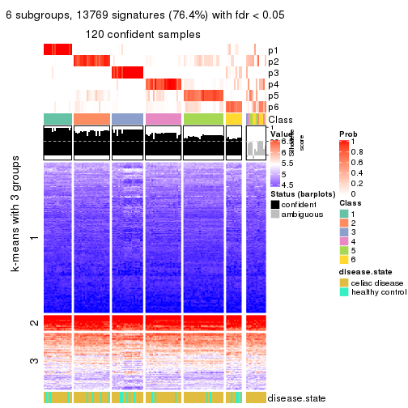</p>

</div>
</div>


Compare the overlap of signatures from different k:

```r
compare_signatures(res)
```


`get_signature()` returns a data frame invisibly. TO get the list of signatures, the function
call should be assigned to a variable explicitly. In following code, if `plot` argument is set
to `FALSE`, no heatmap is plotted while only the differential analysis is performed.

```r
# code only for demonstration
tb = get_signature(res, k = ..., plot = FALSE)
```

An example of the output of `tb` is:

```
#>   which_row         fdr    mean_1    mean_2 scaled_mean_1 scaled_mean_2 km
#> 1        38 0.042760348  8.373488  9.131774    -0.5533452     0.5164555  1
#> 2        40 0.018707592  7.106213  8.469186    -0.6173731     0.5762149  1
#> 3        55 0.019134737 10.221463 11.207825    -0.6159697     0.5749050  1
#> 4        59 0.006059896  5.921854  7.869574    -0.6899429     0.6439467  1
#> 5        60 0.018055526  8.928898 10.211722    -0.6204761     0.5791110  1
#> 6        98 0.009384629 15.714769 14.887706     0.6635654    -0.6193277  2
...
```

The columns in `tb` are:

1. `which_row`: row indices corresponding to the input matrix.
2. `fdr`: FDR for the differential test. 
3. `mean_x`: The mean value in group x.
4. `scaled_mean_x`: The mean value in group x after rows are scaled.
5. `km`: Row groups if k-means clustering is applied to rows.


UMAP plot which shows how samples are separated.


<script>
$( function() {
	$( '#tabs-CV-skmeans-dimension-reduction' ).tabs();
} );
</script>
<div id='tabs-CV-skmeans-dimension-reduction'>
<ul>
<li><a href='#tab-CV-skmeans-dimension-reduction-1'>k = 2</a></li>
<li><a href='#tab-CV-skmeans-dimension-reduction-2'>k = 3</a></li>
<li><a href='#tab-CV-skmeans-dimension-reduction-3'>k = 4</a></li>
<li><a href='#tab-CV-skmeans-dimension-reduction-4'>k = 5</a></li>
<li><a href='#tab-CV-skmeans-dimension-reduction-5'>k = 6</a></li>
</ul>
<div id='tab-CV-skmeans-dimension-reduction-1'>
<pre><code class="r">dimension_reduction(res, k = 2, method = &quot;UMAP&quot;)
</code></pre>

<p></p>

</div>
<div id='tab-CV-skmeans-dimension-reduction-2'>
<pre><code class="r">dimension_reduction(res, k = 3, method = &quot;UMAP&quot;)
</code></pre>

<p></p>

</div>
<div id='tab-CV-skmeans-dimension-reduction-3'>
<pre><code class="r">dimension_reduction(res, k = 4, method = &quot;UMAP&quot;)
</code></pre>

<p></p>

</div>
<div id='tab-CV-skmeans-dimension-reduction-4'>
<pre><code class="r">dimension_reduction(res, k = 5, method = &quot;UMAP&quot;)
</code></pre>

<p></p>

</div>
<div id='tab-CV-skmeans-dimension-reduction-5'>
<pre><code class="r">dimension_reduction(res, k = 6, method = &quot;UMAP&quot;)
</code></pre>

<p></p>

</div>
</div>


Following heatmap shows how subgroups are split when increasing `k`:

```r
collect_classes(res)
```


Test correlation between subgroups and known annotations. If the known
annotation is numeric, one-way ANOVA test is applied, and if the known
annotation is discrete, chi-squared contingency table test is applied.

```r
test_to_known_factors(res)
```

```
#>              n disease.state(p) k
#> CV:skmeans 131           0.0285 2
#> CV:skmeans 132           0.0492 3
#> CV:skmeans 120           0.4038 4
#> CV:skmeans 126           0.2559 5
#> CV:skmeans 120           0.2762 6
```


If matrix rows can be associated to genes, consider to use `GO_Enrichment(res,
...)` to perform function enrichment for the signature genes.


 

---------------------------------------------------


### CV:pam**


The object with results only for a single top-value method and a single partition method 
can be extracted as:

```r
res = res_list["CV", "pam"]
# you can also extract it by
# res = res_list["CV:pam"]
```

A summary of `res` and all the functions that can be applied to it:

```r
res
```

```
#> A 'ConsensusPartition' object with k = 2, 3, 4, 5, 6.
#>   On a matrix with 18032 rows and 132 columns.
#>   Top rows (1000, 2000, 3000, 4000, 5000) are extracted by 'CV' method.
#>   Subgroups are detected by 'pam' method.
#>   Performed in total 1250 partitions by row resampling.
#>   Best k for subgroups seems to be 2.
#> 
#> Following methods can be applied to this 'ConsensusPartition' object:
#>  [1] "cola_report"             "collect_classes"         "collect_plots"          
#>  [4] "collect_stats"           "colnames"                "compare_signatures"     
#>  [7] "consensus_heatmap"       "dimension_reduction"     "functional_enrichment"  
#> [10] "get_anno_col"            "get_anno"                "get_classes"            
#> [13] "get_consensus"           "get_matrix"              "get_membership"         
#> [16] "get_param"               "get_signatures"          "get_stats"              
#> [19] "is_best_k"               "is_stable_k"             "membership_heatmap"     
#> [22] "ncol"                    "nrow"                    "plot_ecdf"              
#> [25] "rownames"                "select_partition_number" "show"                   
#> [28] "suggest_best_k"          "test_to_known_factors"
```

`collect_plots()` function collects all the plots made from `res` for all `k` (number of partitions)
into one single page to provide an easy and fast comparison between different `k`.

```r
collect_plots(res)
```


The plots are:

- The first row: a plot of the ECDF (Empirical cumulative distribution
  function) curves of the consensus matrix for each `k` and the heatmap of
  predicted classes for each `k`.
- The second row: heatmaps of the consensus matrix for each `k`.
- The third row: heatmaps of the membership matrix for each `k`.
- The fouth row: heatmaps of the signatures for each `k`.

All the plots in panels can be made by individual functions and they are
plotted later in this section.

`select_partition_number()` produces several plots showing different
statistics for choosing "optimized" `k`. There are following statistics:

- ECDF curves of the consensus matrix for each `k`;
- 1-PAC. [The PAC
  score](https://en.wikipedia.org/wiki/Consensus_clustering#Over-interpretation_potential_of_consensus_clustering)
  measures the proportion of the ambiguous subgrouping.
- Mean silhouette score.
- Concordance. The mean probability of fiting the consensus class ids in all
  partitions.
- Area increased. Denote $A_k$ as the area under the ECDF curve for current
  `k`, the area increased is defined as $A_k - A_{k-1}$.
- Rand index. The percent of pairs of samples that are both in a same cluster
  or both are not in a same cluster in the partition of k and k-1.
- Jaccard index. The ratio of pairs of samples are both in a same cluster in
  the partition of k and k-1 and the pairs of samples are both in a same
  cluster in the partition k or k-1.

The detailed explanations of these statistics can be found in [the cola
vignette](http://bioconductor.org/packages/devel/bioc/vignettes/cola/inst/doc/cola.html#toc_13).

Generally speaking, lower PAC score, higher mean silhouette score or higher
concordance corresponds to better partition. Rand index and Jaccard index
measure how similar the current partition is compared to partition with `k-1`.
If they are too similar, we won't accept `k` is better than `k-1`.

```r
select_partition_number(res)
```


The numeric values for all these statistics can be obtained by `get_stats()`.

```r
get_stats(res)
```

```
#>   k 1-PAC mean_silhouette concordance area_increased  Rand Jaccard
#> 2 2 1.000           0.988       0.990         0.4008 0.593   0.593
#> 3 3 0.591           0.687       0.852         0.3651 0.651   0.484
#> 4 4 0.894           0.893       0.956         0.2235 0.839   0.646
#> 5 5 0.734           0.614       0.848         0.1433 0.817   0.505
#> 6 6 0.751           0.676       0.853         0.0675 0.874   0.519
```

`suggest_best_k()` suggests the best $k$ based on these statistics. The rules are as follows:

- All $k$ with Jaccard index larger than 0.95 are removed because the increase of
  the partition number does not provides enough extra information. If all $k$ are removed,
  the best $k$ is assigned by `NA`.
- For $k$ with 1-PAC larger than 0.9, the maximal $k$ is taken as the "best k". Other $k$ is called "optional k".
- If it does not fit the second rule. The $k$ with the highest vote of highest
  1-PAC, mean silhouette and concordance is taken as the "best k".

```r
suggest_best_k(res)
```

```
#> [1] 2
```


Following shows the table of the partitions (You need to click the **show/hide
code output** link to see it). The membership matrix (columns with name `p*`)
is inferred by
[`clue::cl_consensus()`](https://www.rdocumentation.org/link/cl_consensus?package=clue)
function with the `SE` method. Basically the value in the membership matrix
represents the probability to belong to a certain group. The finall class
label for an item is determined with the group with highest probability it
belongs to.

In `get_classes()` function, the entropy is calculated from the membership
matrix and the silhouette score is calculated from the consensus matrix.


<script>
$( function() {
	$( '#tabs-CV-pam-get-classes' ).tabs();
} );
</script>
<div id='tabs-CV-pam-get-classes'>
<ul>
<li><a href='#tab-CV-pam-get-classes-1'>k = 2</a></li>
<li><a href='#tab-CV-pam-get-classes-2'>k = 3</a></li>
<li><a href='#tab-CV-pam-get-classes-3'>k = 4</a></li>
<li><a href='#tab-CV-pam-get-classes-4'>k = 5</a></li>
<li><a href='#tab-CV-pam-get-classes-5'>k = 6</a></li>
</ul>

<div id='tab-CV-pam-get-classes-1'>
<p><a id='tab-CV-pam-get-classes-1-a' style='color:#0366d6' href='#'>show/hide code output</a></p>
<pre><code class="r">cbind(get_classes(res, k = 2), get_membership(res, k = 2))
</code></pre>

<pre><code>#&gt;           class entropy silhouette    p1    p2
#&gt; GSM289470     1   0.311      0.967 0.944 0.056
#&gt; GSM289471     1   0.000      0.973 1.000 0.000
#&gt; GSM289472     2   0.000      0.997 0.000 1.000
#&gt; GSM289473     2   0.000      0.997 0.000 1.000
#&gt; GSM289474     2   0.000      0.997 0.000 1.000
#&gt; GSM289475     2   0.000      0.997 0.000 1.000
#&gt; GSM289476     1   0.000      0.973 1.000 0.000
#&gt; GSM289477     2   0.000      0.997 0.000 1.000
#&gt; GSM289478     2   0.000      0.997 0.000 1.000
#&gt; GSM289479     2   0.000      0.997 0.000 1.000
#&gt; GSM289480     2   0.000      0.997 0.000 1.000
#&gt; GSM289481     2   0.000      0.997 0.000 1.000
#&gt; GSM289482     2   0.000      0.997 0.000 1.000
#&gt; GSM289483     2   0.000      0.997 0.000 1.000
#&gt; GSM289484     2   0.000      0.997 0.000 1.000
#&gt; GSM289485     2   0.000      0.997 0.000 1.000
#&gt; GSM289486     1   0.224      0.981 0.964 0.036
#&gt; GSM289487     2   0.000      0.997 0.000 1.000
#&gt; GSM289488     2   0.000      0.997 0.000 1.000
#&gt; GSM289489     2   0.000      0.997 0.000 1.000
#&gt; GSM289490     2   0.000      0.997 0.000 1.000
#&gt; GSM289491     2   0.000      0.997 0.000 1.000
#&gt; GSM289492     2   0.000      0.997 0.000 1.000
#&gt; GSM289493     2   0.000      0.997 0.000 1.000
#&gt; GSM289494     2   0.278      0.951 0.048 0.952
#&gt; GSM289495     2   0.000      0.997 0.000 1.000
#&gt; GSM289496     2   0.000      0.997 0.000 1.000
#&gt; GSM289497     2   0.000      0.997 0.000 1.000
#&gt; GSM289498     2   0.000      0.997 0.000 1.000
#&gt; GSM289499     2   0.000      0.997 0.000 1.000
#&gt; GSM289500     1   0.000      0.973 1.000 0.000
#&gt; GSM289501     2   0.000      0.997 0.000 1.000
#&gt; GSM289502     2   0.000      0.997 0.000 1.000
#&gt; GSM289503     2   0.000      0.997 0.000 1.000
#&gt; GSM289504     2   0.000      0.997 0.000 1.000
#&gt; GSM289505     2   0.000      0.997 0.000 1.000
#&gt; GSM289506     2   0.000      0.997 0.000 1.000
#&gt; GSM289507     2   0.000      0.997 0.000 1.000
#&gt; GSM289508     2   0.163      0.974 0.024 0.976
#&gt; GSM289509     1   0.000      0.973 1.000 0.000
#&gt; GSM289510     2   0.000      0.997 0.000 1.000
#&gt; GSM289511     2   0.000      0.997 0.000 1.000
#&gt; GSM289512     1   0.000      0.973 1.000 0.000
#&gt; GSM289513     2   0.000      0.997 0.000 1.000
#&gt; GSM289514     2   0.000      0.997 0.000 1.000
#&gt; GSM289515     2   0.000      0.997 0.000 1.000
#&gt; GSM289516     2   0.000      0.997 0.000 1.000
#&gt; GSM289517     2   0.000      0.997 0.000 1.000
#&gt; GSM289518     2   0.000      0.997 0.000 1.000
#&gt; GSM289519     2   0.000      0.997 0.000 1.000
#&gt; GSM289520     2   0.000      0.997 0.000 1.000
#&gt; GSM289521     2   0.295      0.944 0.052 0.948
#&gt; GSM289522     2   0.000      0.997 0.000 1.000
#&gt; GSM289523     1   0.000      0.973 1.000 0.000
#&gt; GSM289524     2   0.000      0.997 0.000 1.000
#&gt; GSM289525     2   0.000      0.997 0.000 1.000
#&gt; GSM289526     1   0.327      0.963 0.940 0.060
#&gt; GSM289527     2   0.000      0.997 0.000 1.000
#&gt; GSM289528     2   0.000      0.997 0.000 1.000
#&gt; GSM289529     2   0.000      0.997 0.000 1.000
#&gt; GSM289530     2   0.000      0.997 0.000 1.000
#&gt; GSM289531     2   0.000      0.997 0.000 1.000
#&gt; GSM289532     2   0.000      0.997 0.000 1.000
#&gt; GSM289533     2   0.000      0.997 0.000 1.000
#&gt; GSM289534     1   0.000      0.973 1.000 0.000
#&gt; GSM289535     2   0.000      0.997 0.000 1.000
#&gt; GSM289536     1   0.000      0.973 1.000 0.000
#&gt; GSM289537     2   0.000      0.997 0.000 1.000
#&gt; GSM289538     2   0.000      0.997 0.000 1.000
#&gt; GSM289539     2   0.000      0.997 0.000 1.000
#&gt; GSM289540     2   0.118      0.981 0.016 0.984
#&gt; GSM289541     1   0.416      0.939 0.916 0.084
#&gt; GSM289542     2   0.000      0.997 0.000 1.000
#&gt; GSM289543     2   0.000      0.997 0.000 1.000
#&gt; GSM289544     1   0.224      0.981 0.964 0.036
#&gt; GSM289545     2   0.000      0.997 0.000 1.000
#&gt; GSM289546     2   0.000      0.997 0.000 1.000
#&gt; GSM289547     2   0.000      0.997 0.000 1.000
#&gt; GSM289548     1   0.224      0.981 0.964 0.036
#&gt; GSM289549     1   0.224      0.981 0.964 0.036
#&gt; GSM289550     1   0.224      0.981 0.964 0.036
#&gt; GSM289551     1   0.000      0.973 1.000 0.000
#&gt; GSM289552     1   0.000      0.973 1.000 0.000
#&gt; GSM289553     1   0.224      0.981 0.964 0.036
#&gt; GSM289554     2   0.000      0.997 0.000 1.000
#&gt; GSM289555     2   0.000      0.997 0.000 1.000
#&gt; GSM289556     1   0.224      0.981 0.964 0.036
#&gt; GSM289557     2   0.000      0.997 0.000 1.000
#&gt; GSM289558     2   0.000      0.997 0.000 1.000
#&gt; GSM289559     1   0.224      0.981 0.964 0.036
#&gt; GSM289560     2   0.000      0.997 0.000 1.000
#&gt; GSM289561     2   0.000      0.997 0.000 1.000
#&gt; GSM289562     1   0.224      0.981 0.964 0.036
#&gt; GSM289563     1   0.224      0.981 0.964 0.036
#&gt; GSM289564     2   0.000      0.997 0.000 1.000
#&gt; GSM289565     1   0.224      0.981 0.964 0.036
#&gt; GSM289566     1   0.224      0.981 0.964 0.036
#&gt; GSM289567     2   0.000      0.997 0.000 1.000
#&gt; GSM289568     2   0.000      0.997 0.000 1.000
#&gt; GSM289569     2   0.000      0.997 0.000 1.000
#&gt; GSM289570     2   0.000      0.997 0.000 1.000
#&gt; GSM289571     2   0.000      0.997 0.000 1.000
#&gt; GSM289572     2   0.000      0.997 0.000 1.000
#&gt; GSM289573     2   0.000      0.997 0.000 1.000
#&gt; GSM289574     2   0.000      0.997 0.000 1.000
#&gt; GSM289575     2   0.000      0.997 0.000 1.000
#&gt; GSM289576     2   0.000      0.997 0.000 1.000
#&gt; GSM289577     2   0.000      0.997 0.000 1.000
#&gt; GSM289578     2   0.000      0.997 0.000 1.000
#&gt; GSM289579     2   0.000      0.997 0.000 1.000
#&gt; GSM289580     1   0.000      0.973 1.000 0.000
#&gt; GSM289581     1   0.260      0.976 0.956 0.044
#&gt; GSM289582     2   0.000      0.997 0.000 1.000
#&gt; GSM289583     2   0.000      0.997 0.000 1.000
#&gt; GSM289584     2   0.000      0.997 0.000 1.000
#&gt; GSM289585     2   0.000      0.997 0.000 1.000
#&gt; GSM289586     1   0.388      0.948 0.924 0.076
#&gt; GSM289587     1   0.224      0.981 0.964 0.036
#&gt; GSM289588     1   0.000      0.973 1.000 0.000
#&gt; GSM289589     1   0.224      0.981 0.964 0.036
#&gt; GSM289590     1   0.224      0.981 0.964 0.036
#&gt; GSM289591     1   0.000      0.973 1.000 0.000
#&gt; GSM289592     2   0.000      0.997 0.000 1.000
#&gt; GSM289593     1   0.000      0.973 1.000 0.000
#&gt; GSM289594     2   0.000      0.997 0.000 1.000
#&gt; GSM289595     1   0.224      0.981 0.964 0.036
#&gt; GSM289596     2   0.000      0.997 0.000 1.000
#&gt; GSM289597     2   0.000      0.997 0.000 1.000
#&gt; GSM289598     2   0.689      0.771 0.184 0.816
#&gt; GSM289599     2   0.000      0.997 0.000 1.000
#&gt; GSM289600     1   0.224      0.981 0.964 0.036
#&gt; GSM289601     1   0.260      0.976 0.956 0.044
</code></pre>

<script>
$('#tab-CV-pam-get-classes-1-a').parent().next().next().hide();
$('#tab-CV-pam-get-classes-1-a').click(function(){
  $('#tab-CV-pam-get-classes-1-a').parent().next().next().toggle();
  return(false);
});
</script>
</div>

<div id='tab-CV-pam-get-classes-2'>
<p><a id='tab-CV-pam-get-classes-2-a' style='color:#0366d6' href='#'>show/hide code output</a></p>
<pre><code class="r">cbind(get_classes(res, k = 3), get_membership(res, k = 3))
</code></pre>

<pre><code>#&gt;           class entropy silhouette    p1    p2    p3
#&gt; GSM289470     1  0.0747     0.5284 0.984 0.000 0.016
#&gt; GSM289471     3  0.0000     0.9447 0.000 0.000 1.000
#&gt; GSM289472     2  0.6308    -0.3984 0.492 0.508 0.000
#&gt; GSM289473     1  0.6180     0.6041 0.584 0.416 0.000
#&gt; GSM289474     2  0.5968     0.1288 0.364 0.636 0.000
#&gt; GSM289475     1  0.6295     0.4742 0.528 0.472 0.000
#&gt; GSM289476     3  0.0000     0.9447 0.000 0.000 1.000
#&gt; GSM289477     2  0.6140    -0.0712 0.404 0.596 0.000
#&gt; GSM289478     1  0.6126     0.6272 0.600 0.400 0.000
#&gt; GSM289479     1  0.6126     0.6272 0.600 0.400 0.000
#&gt; GSM289480     2  0.5560     0.3485 0.300 0.700 0.000
#&gt; GSM289481     2  0.2261     0.8309 0.068 0.932 0.000
#&gt; GSM289482     1  0.6126     0.6272 0.600 0.400 0.000
#&gt; GSM289483     1  0.6154     0.6142 0.592 0.408 0.000
#&gt; GSM289484     1  0.6180     0.6041 0.584 0.416 0.000
#&gt; GSM289485     1  0.6126     0.6272 0.600 0.400 0.000
#&gt; GSM289486     1  0.0747     0.5284 0.984 0.000 0.016
#&gt; GSM289487     2  0.0000     0.9024 0.000 1.000 0.000
#&gt; GSM289488     2  0.3038     0.7834 0.104 0.896 0.000
#&gt; GSM289489     2  0.0237     0.8994 0.004 0.996 0.000
#&gt; GSM289490     2  0.0000     0.9024 0.000 1.000 0.000
#&gt; GSM289491     2  0.0000     0.9024 0.000 1.000 0.000
#&gt; GSM289492     2  0.0000     0.9024 0.000 1.000 0.000
#&gt; GSM289493     2  0.0000     0.9024 0.000 1.000 0.000
#&gt; GSM289494     2  0.6280     0.2505 0.000 0.540 0.460
#&gt; GSM289495     2  0.0000     0.9024 0.000 1.000 0.000
#&gt; GSM289496     2  0.0000     0.9024 0.000 1.000 0.000
#&gt; GSM289497     2  0.0000     0.9024 0.000 1.000 0.000
#&gt; GSM289498     2  0.0237     0.8996 0.000 0.996 0.004
#&gt; GSM289499     2  0.0000     0.9024 0.000 1.000 0.000
#&gt; GSM289500     3  0.0000     0.9447 0.000 0.000 1.000
#&gt; GSM289501     2  0.0000     0.9024 0.000 1.000 0.000
#&gt; GSM289502     2  0.0000     0.9024 0.000 1.000 0.000
#&gt; GSM289503     2  0.0000     0.9024 0.000 1.000 0.000
#&gt; GSM289504     2  0.0000     0.9024 0.000 1.000 0.000
#&gt; GSM289505     2  0.0000     0.9024 0.000 1.000 0.000
#&gt; GSM289506     2  0.0000     0.9024 0.000 1.000 0.000
#&gt; GSM289507     2  0.0000     0.9024 0.000 1.000 0.000
#&gt; GSM289508     2  0.4110     0.6971 0.152 0.844 0.004
#&gt; GSM289509     3  0.1289     0.9259 0.032 0.000 0.968
#&gt; GSM289510     1  0.6126     0.6272 0.600 0.400 0.000
#&gt; GSM289511     1  0.6126     0.6272 0.600 0.400 0.000
#&gt; GSM289512     3  0.0000     0.9447 0.000 0.000 1.000
#&gt; GSM289513     1  0.6126     0.6272 0.600 0.400 0.000
#&gt; GSM289514     1  0.6126     0.6272 0.600 0.400 0.000
#&gt; GSM289515     1  0.6126     0.6272 0.600 0.400 0.000
#&gt; GSM289516     1  0.6126     0.6272 0.600 0.400 0.000
#&gt; GSM289517     1  0.6126     0.6272 0.600 0.400 0.000
#&gt; GSM289518     1  0.6126     0.6272 0.600 0.400 0.000
#&gt; GSM289519     1  0.6126     0.6272 0.600 0.400 0.000
#&gt; GSM289520     1  0.6126     0.6272 0.600 0.400 0.000
#&gt; GSM289521     1  0.6126     0.6272 0.600 0.400 0.000
#&gt; GSM289522     1  0.6126     0.6272 0.600 0.400 0.000
#&gt; GSM289523     3  0.0000     0.9447 0.000 0.000 1.000
#&gt; GSM289524     1  0.6126     0.6272 0.600 0.400 0.000
#&gt; GSM289525     1  0.6126     0.6272 0.600 0.400 0.000
#&gt; GSM289526     1  0.0000     0.5344 1.000 0.000 0.000
#&gt; GSM289527     1  0.6126     0.6272 0.600 0.400 0.000
#&gt; GSM289528     1  0.6180     0.6041 0.584 0.416 0.000
#&gt; GSM289529     1  0.6299     0.4612 0.524 0.476 0.000
#&gt; GSM289530     2  0.0237     0.8994 0.004 0.996 0.000
#&gt; GSM289531     2  0.0424     0.8958 0.008 0.992 0.000
#&gt; GSM289532     2  0.6869     0.3140 0.016 0.560 0.424
#&gt; GSM289533     2  0.0000     0.9024 0.000 1.000 0.000
#&gt; GSM289534     3  0.0000     0.9447 0.000 0.000 1.000
#&gt; GSM289535     2  0.0000     0.9024 0.000 1.000 0.000
#&gt; GSM289536     3  0.0000     0.9447 0.000 0.000 1.000
#&gt; GSM289537     2  0.1031     0.8798 0.024 0.976 0.000
#&gt; GSM289538     2  0.0000     0.9024 0.000 1.000 0.000
#&gt; GSM289539     2  0.3116     0.7709 0.108 0.892 0.000
#&gt; GSM289540     2  0.1989     0.8519 0.048 0.948 0.004
#&gt; GSM289541     1  0.1170     0.5339 0.976 0.008 0.016
#&gt; GSM289542     2  0.4974     0.5262 0.236 0.764 0.000
#&gt; GSM289543     2  0.0000     0.9024 0.000 1.000 0.000
#&gt; GSM289544     1  0.0000     0.5344 1.000 0.000 0.000
#&gt; GSM289545     2  0.0424     0.8957 0.008 0.992 0.000
#&gt; GSM289546     2  0.6095    -0.0229 0.392 0.608 0.000
#&gt; GSM289547     2  0.0000     0.9024 0.000 1.000 0.000
#&gt; GSM289548     1  0.0747     0.5284 0.984 0.000 0.016
#&gt; GSM289549     1  0.0747     0.5284 0.984 0.000 0.016
#&gt; GSM289550     1  0.6225    -0.3592 0.568 0.000 0.432
#&gt; GSM289551     3  0.0000     0.9447 0.000 0.000 1.000
#&gt; GSM289552     3  0.6126     0.6239 0.400 0.000 0.600
#&gt; GSM289553     1  0.1163     0.5160 0.972 0.000 0.028
#&gt; GSM289554     2  0.0000     0.9024 0.000 1.000 0.000
#&gt; GSM289555     2  0.0000     0.9024 0.000 1.000 0.000
#&gt; GSM289556     1  0.0747     0.5284 0.984 0.000 0.016
#&gt; GSM289557     2  0.0000     0.9024 0.000 1.000 0.000
#&gt; GSM289558     2  0.0000     0.9024 0.000 1.000 0.000
#&gt; GSM289559     1  0.0892     0.5247 0.980 0.000 0.020
#&gt; GSM289560     2  0.0000     0.9024 0.000 1.000 0.000
#&gt; GSM289561     2  0.0000     0.9024 0.000 1.000 0.000
#&gt; GSM289562     1  0.0747     0.5284 0.984 0.000 0.016
#&gt; GSM289563     1  0.0747     0.5284 0.984 0.000 0.016
#&gt; GSM289564     2  0.0000     0.9024 0.000 1.000 0.000
#&gt; GSM289565     2  0.9293    -0.1158 0.400 0.440 0.160
#&gt; GSM289566     1  0.0747     0.5284 0.984 0.000 0.016
#&gt; GSM289567     1  0.6126     0.6272 0.600 0.400 0.000
#&gt; GSM289568     1  0.6126     0.6272 0.600 0.400 0.000
#&gt; GSM289569     1  0.6126     0.6272 0.600 0.400 0.000
#&gt; GSM289570     1  0.6126     0.6272 0.600 0.400 0.000
#&gt; GSM289571     2  0.0000     0.9024 0.000 1.000 0.000
#&gt; GSM289572     2  0.0000     0.9024 0.000 1.000 0.000
#&gt; GSM289573     2  0.0000     0.9024 0.000 1.000 0.000
#&gt; GSM289574     2  0.0000     0.9024 0.000 1.000 0.000
#&gt; GSM289575     2  0.0000     0.9024 0.000 1.000 0.000
#&gt; GSM289576     2  0.0000     0.9024 0.000 1.000 0.000
#&gt; GSM289577     2  0.0000     0.9024 0.000 1.000 0.000
#&gt; GSM289578     2  0.0000     0.9024 0.000 1.000 0.000
#&gt; GSM289579     2  0.0000     0.9024 0.000 1.000 0.000
#&gt; GSM289580     3  0.0000     0.9447 0.000 0.000 1.000
#&gt; GSM289581     1  0.5404     0.0896 0.740 0.004 0.256
#&gt; GSM289582     2  0.0747     0.8888 0.016 0.984 0.000
#&gt; GSM289583     2  0.0000     0.9024 0.000 1.000 0.000
#&gt; GSM289584     2  0.0000     0.9024 0.000 1.000 0.000
#&gt; GSM289585     2  0.0000     0.9024 0.000 1.000 0.000
#&gt; GSM289586     1  0.0000     0.5344 1.000 0.000 0.000
#&gt; GSM289587     1  0.0747     0.5284 0.984 0.000 0.016
#&gt; GSM289588     3  0.0000     0.9447 0.000 0.000 1.000
#&gt; GSM289589     1  0.0747     0.5284 0.984 0.000 0.016
#&gt; GSM289590     1  0.6235    -0.3681 0.564 0.000 0.436
#&gt; GSM289591     3  0.6126     0.6239 0.400 0.000 0.600
#&gt; GSM289592     2  0.0000     0.9024 0.000 1.000 0.000
#&gt; GSM289593     3  0.0000     0.9447 0.000 0.000 1.000
#&gt; GSM289594     2  0.0000     0.9024 0.000 1.000 0.000
#&gt; GSM289595     1  0.6244    -0.3757 0.560 0.000 0.440
#&gt; GSM289596     2  0.0000     0.9024 0.000 1.000 0.000
#&gt; GSM289597     1  0.6126     0.6272 0.600 0.400 0.000
#&gt; GSM289598     2  0.7329     0.2699 0.032 0.544 0.424
#&gt; GSM289599     2  0.0000     0.9024 0.000 1.000 0.000
#&gt; GSM289600     1  0.0747     0.5284 0.984 0.000 0.016
#&gt; GSM289601     1  0.0000     0.5344 1.000 0.000 0.000
</code></pre>

<script>
$('#tab-CV-pam-get-classes-2-a').parent().next().next().hide();
$('#tab-CV-pam-get-classes-2-a').click(function(){
  $('#tab-CV-pam-get-classes-2-a').parent().next().next().toggle();
  return(false);
});
</script>
</div>

<div id='tab-CV-pam-get-classes-3'>
<p><a id='tab-CV-pam-get-classes-3-a' style='color:#0366d6' href='#'>show/hide code output</a></p>
<pre><code class="r">cbind(get_classes(res, k = 4), get_membership(res, k = 4))
</code></pre>

<pre><code>#&gt;           class entropy silhouette    p1    p2    p3    p4
#&gt; GSM289470     1  0.0000      0.964 1.000 0.000 0.000 0.000
#&gt; GSM289471     3  0.0000      0.982 0.000 0.000 1.000 0.000
#&gt; GSM289472     2  0.4855      0.371 0.000 0.600 0.000 0.400
#&gt; GSM289473     2  0.4830      0.423 0.000 0.608 0.000 0.392
#&gt; GSM289474     4  0.0921      0.913 0.000 0.028 0.000 0.972
#&gt; GSM289475     4  0.3074      0.784 0.000 0.152 0.000 0.848
#&gt; GSM289476     3  0.0000      0.982 0.000 0.000 1.000 0.000
#&gt; GSM289477     4  0.4040      0.652 0.000 0.248 0.000 0.752
#&gt; GSM289478     4  0.2149      0.853 0.000 0.088 0.000 0.912
#&gt; GSM289479     4  0.0000      0.932 0.000 0.000 0.000 1.000
#&gt; GSM289480     2  0.4040      0.689 0.000 0.752 0.000 0.248
#&gt; GSM289481     2  0.2216      0.873 0.000 0.908 0.000 0.092
#&gt; GSM289482     4  0.0921      0.913 0.000 0.028 0.000 0.972
#&gt; GSM289483     4  0.1211      0.905 0.000 0.040 0.000 0.960
#&gt; GSM289484     2  0.4746      0.470 0.000 0.632 0.000 0.368
#&gt; GSM289485     4  0.0817      0.917 0.000 0.024 0.000 0.976
#&gt; GSM289486     1  0.0000      0.964 1.000 0.000 0.000 0.000
#&gt; GSM289487     2  0.0000      0.940 0.000 1.000 0.000 0.000
#&gt; GSM289488     4  0.4679      0.481 0.000 0.352 0.000 0.648
#&gt; GSM289489     2  0.1557      0.900 0.000 0.944 0.000 0.056
#&gt; GSM289490     2  0.0000      0.940 0.000 1.000 0.000 0.000
#&gt; GSM289491     2  0.0000      0.940 0.000 1.000 0.000 0.000
#&gt; GSM289492     2  0.0000      0.940 0.000 1.000 0.000 0.000
#&gt; GSM289493     2  0.0000      0.940 0.000 1.000 0.000 0.000
#&gt; GSM289494     2  0.1557      0.901 0.000 0.944 0.056 0.000
#&gt; GSM289495     2  0.0000      0.940 0.000 1.000 0.000 0.000
#&gt; GSM289496     2  0.0000      0.940 0.000 1.000 0.000 0.000
#&gt; GSM289497     2  0.0000      0.940 0.000 1.000 0.000 0.000
#&gt; GSM289498     2  0.0000      0.940 0.000 1.000 0.000 0.000
#&gt; GSM289499     2  0.0000      0.940 0.000 1.000 0.000 0.000
#&gt; GSM289500     3  0.0000      0.982 0.000 0.000 1.000 0.000
#&gt; GSM289501     2  0.0000      0.940 0.000 1.000 0.000 0.000
#&gt; GSM289502     2  0.0000      0.940 0.000 1.000 0.000 0.000
#&gt; GSM289503     2  0.0000      0.940 0.000 1.000 0.000 0.000
#&gt; GSM289504     2  0.0000      0.940 0.000 1.000 0.000 0.000
#&gt; GSM289505     2  0.0000      0.940 0.000 1.000 0.000 0.000
#&gt; GSM289506     2  0.0000      0.940 0.000 1.000 0.000 0.000
#&gt; GSM289507     2  0.0000      0.940 0.000 1.000 0.000 0.000
#&gt; GSM289508     2  0.3266      0.794 0.000 0.832 0.000 0.168
#&gt; GSM289509     3  0.3610      0.751 0.200 0.000 0.800 0.000
#&gt; GSM289510     4  0.0000      0.932 0.000 0.000 0.000 1.000
#&gt; GSM289511     4  0.0000      0.932 0.000 0.000 0.000 1.000
#&gt; GSM289512     3  0.0000      0.982 0.000 0.000 1.000 0.000
#&gt; GSM289513     4  0.0000      0.932 0.000 0.000 0.000 1.000
#&gt; GSM289514     4  0.0000      0.932 0.000 0.000 0.000 1.000
#&gt; GSM289515     4  0.0000      0.932 0.000 0.000 0.000 1.000
#&gt; GSM289516     4  0.0000      0.932 0.000 0.000 0.000 1.000
#&gt; GSM289517     4  0.0000      0.932 0.000 0.000 0.000 1.000
#&gt; GSM289518     4  0.0000      0.932 0.000 0.000 0.000 1.000
#&gt; GSM289519     4  0.0000      0.932 0.000 0.000 0.000 1.000
#&gt; GSM289520     4  0.0000      0.932 0.000 0.000 0.000 1.000
#&gt; GSM289521     4  0.0000      0.932 0.000 0.000 0.000 1.000
#&gt; GSM289522     4  0.0000      0.932 0.000 0.000 0.000 1.000
#&gt; GSM289523     3  0.0000      0.982 0.000 0.000 1.000 0.000
#&gt; GSM289524     4  0.0000      0.932 0.000 0.000 0.000 1.000
#&gt; GSM289525     4  0.0000      0.932 0.000 0.000 0.000 1.000
#&gt; GSM289526     4  0.0921      0.914 0.028 0.000 0.000 0.972
#&gt; GSM289527     4  0.0000      0.932 0.000 0.000 0.000 1.000
#&gt; GSM289528     2  0.4761      0.462 0.000 0.628 0.000 0.372
#&gt; GSM289529     4  0.2011      0.859 0.000 0.080 0.000 0.920
#&gt; GSM289530     2  0.1118      0.916 0.000 0.964 0.000 0.036
#&gt; GSM289531     2  0.0817      0.926 0.000 0.976 0.000 0.024
#&gt; GSM289532     2  0.4661      0.446 0.000 0.652 0.000 0.348
#&gt; GSM289533     2  0.0469      0.933 0.000 0.988 0.000 0.012
#&gt; GSM289534     3  0.0000      0.982 0.000 0.000 1.000 0.000
#&gt; GSM289535     2  0.0000      0.940 0.000 1.000 0.000 0.000
#&gt; GSM289536     3  0.0000      0.982 0.000 0.000 1.000 0.000
#&gt; GSM289537     2  0.0817      0.925 0.000 0.976 0.000 0.024
#&gt; GSM289538     2  0.0000      0.940 0.000 1.000 0.000 0.000
#&gt; GSM289539     2  0.2408      0.857 0.000 0.896 0.000 0.104
#&gt; GSM289540     2  0.1792      0.892 0.000 0.932 0.000 0.068
#&gt; GSM289541     1  0.4936      0.387 0.624 0.004 0.000 0.372
#&gt; GSM289542     2  0.4008      0.695 0.000 0.756 0.000 0.244
#&gt; GSM289543     2  0.0000      0.940 0.000 1.000 0.000 0.000
#&gt; GSM289544     4  0.1716      0.884 0.064 0.000 0.000 0.936
#&gt; GSM289545     2  0.0188      0.938 0.000 0.996 0.000 0.004
#&gt; GSM289546     2  0.4304      0.626 0.000 0.716 0.000 0.284
#&gt; GSM289547     2  0.0000      0.940 0.000 1.000 0.000 0.000
#&gt; GSM289548     1  0.0000      0.964 1.000 0.000 0.000 0.000
#&gt; GSM289549     1  0.0000      0.964 1.000 0.000 0.000 0.000
#&gt; GSM289550     1  0.0000      0.964 1.000 0.000 0.000 0.000
#&gt; GSM289551     3  0.0000      0.982 0.000 0.000 1.000 0.000
#&gt; GSM289552     1  0.0000      0.964 1.000 0.000 0.000 0.000
#&gt; GSM289553     1  0.0000      0.964 1.000 0.000 0.000 0.000
#&gt; GSM289554     2  0.0000      0.940 0.000 1.000 0.000 0.000
#&gt; GSM289555     2  0.0000      0.940 0.000 1.000 0.000 0.000
#&gt; GSM289556     1  0.0000      0.964 1.000 0.000 0.000 0.000
#&gt; GSM289557     2  0.0000      0.940 0.000 1.000 0.000 0.000
#&gt; GSM289558     2  0.0000      0.940 0.000 1.000 0.000 0.000
#&gt; GSM289559     1  0.0000      0.964 1.000 0.000 0.000 0.000
#&gt; GSM289560     2  0.0000      0.940 0.000 1.000 0.000 0.000
#&gt; GSM289561     2  0.0000      0.940 0.000 1.000 0.000 0.000
#&gt; GSM289562     1  0.0000      0.964 1.000 0.000 0.000 0.000
#&gt; GSM289563     1  0.0000      0.964 1.000 0.000 0.000 0.000
#&gt; GSM289564     2  0.0000      0.940 0.000 1.000 0.000 0.000
#&gt; GSM289565     1  0.1557      0.885 0.944 0.056 0.000 0.000
#&gt; GSM289566     1  0.1557      0.899 0.944 0.000 0.000 0.056
#&gt; GSM289567     4  0.0000      0.932 0.000 0.000 0.000 1.000
#&gt; GSM289568     4  0.0000      0.932 0.000 0.000 0.000 1.000
#&gt; GSM289569     4  0.0000      0.932 0.000 0.000 0.000 1.000
#&gt; GSM289570     4  0.0000      0.932 0.000 0.000 0.000 1.000
#&gt; GSM289571     2  0.0000      0.940 0.000 1.000 0.000 0.000
#&gt; GSM289572     2  0.0000      0.940 0.000 1.000 0.000 0.000
#&gt; GSM289573     2  0.0000      0.940 0.000 1.000 0.000 0.000
#&gt; GSM289574     2  0.0000      0.940 0.000 1.000 0.000 0.000
#&gt; GSM289575     2  0.0000      0.940 0.000 1.000 0.000 0.000
#&gt; GSM289576     2  0.0000      0.940 0.000 1.000 0.000 0.000
#&gt; GSM289577     2  0.0000      0.940 0.000 1.000 0.000 0.000
#&gt; GSM289578     2  0.0000      0.940 0.000 1.000 0.000 0.000
#&gt; GSM289579     2  0.0000      0.940 0.000 1.000 0.000 0.000
#&gt; GSM289580     3  0.0000      0.982 0.000 0.000 1.000 0.000
#&gt; GSM289581     4  0.4250      0.591 0.276 0.000 0.000 0.724
#&gt; GSM289582     4  0.4830      0.394 0.000 0.392 0.000 0.608
#&gt; GSM289583     2  0.0000      0.940 0.000 1.000 0.000 0.000
#&gt; GSM289584     2  0.0000      0.940 0.000 1.000 0.000 0.000
#&gt; GSM289585     2  0.0000      0.940 0.000 1.000 0.000 0.000
#&gt; GSM289586     4  0.0000      0.932 0.000 0.000 0.000 1.000
#&gt; GSM289587     1  0.0000      0.964 1.000 0.000 0.000 0.000
#&gt; GSM289588     3  0.0000      0.982 0.000 0.000 1.000 0.000
#&gt; GSM289589     1  0.0000      0.964 1.000 0.000 0.000 0.000
#&gt; GSM289590     1  0.0000      0.964 1.000 0.000 0.000 0.000
#&gt; GSM289591     1  0.0000      0.964 1.000 0.000 0.000 0.000
#&gt; GSM289592     2  0.0000      0.940 0.000 1.000 0.000 0.000
#&gt; GSM289593     3  0.0000      0.982 0.000 0.000 1.000 0.000
#&gt; GSM289594     2  0.0000      0.940 0.000 1.000 0.000 0.000
#&gt; GSM289595     1  0.0000      0.964 1.000 0.000 0.000 0.000
#&gt; GSM289596     2  0.0000      0.940 0.000 1.000 0.000 0.000
#&gt; GSM289597     4  0.0000      0.932 0.000 0.000 0.000 1.000
#&gt; GSM289598     2  0.1557      0.899 0.056 0.944 0.000 0.000
#&gt; GSM289599     2  0.0000      0.940 0.000 1.000 0.000 0.000
#&gt; GSM289600     1  0.0000      0.964 1.000 0.000 0.000 0.000
#&gt; GSM289601     4  0.0000      0.932 0.000 0.000 0.000 1.000
</code></pre>

<script>
$('#tab-CV-pam-get-classes-3-a').parent().next().next().hide();
$('#tab-CV-pam-get-classes-3-a').click(function(){
  $('#tab-CV-pam-get-classes-3-a').parent().next().next().toggle();
  return(false);
});
</script>
</div>

<div id='tab-CV-pam-get-classes-4'>
<p><a id='tab-CV-pam-get-classes-4-a' style='color:#0366d6' href='#'>show/hide code output</a></p>
<pre><code class="r">cbind(get_classes(res, k = 5), get_membership(res, k = 5))
</code></pre>

<pre><code>#&gt;           class entropy silhouette    p1    p2    p3    p4    p5
#&gt; GSM289470     1  0.0000    0.96135 1.000 0.000 0.000 0.000 0.000
#&gt; GSM289471     3  0.0000    0.96393 0.000 0.000 1.000 0.000 0.000
#&gt; GSM289472     5  0.0000    0.61597 0.000 0.000 0.000 0.000 1.000
#&gt; GSM289473     4  0.1197    0.85667 0.000 0.048 0.000 0.952 0.000
#&gt; GSM289474     4  0.2516    0.77630 0.000 0.000 0.000 0.860 0.140
#&gt; GSM289475     5  0.0000    0.61597 0.000 0.000 0.000 0.000 1.000
#&gt; GSM289476     3  0.0000    0.96393 0.000 0.000 1.000 0.000 0.000
#&gt; GSM289477     5  0.4967    0.45631 0.000 0.104 0.000 0.192 0.704
#&gt; GSM289478     5  0.0000    0.61597 0.000 0.000 0.000 0.000 1.000
#&gt; GSM289479     5  0.6431   -0.20560 0.000 0.176 0.000 0.388 0.436
#&gt; GSM289480     5  0.1270    0.59872 0.000 0.000 0.000 0.052 0.948
#&gt; GSM289481     5  0.5162    0.46458 0.000 0.148 0.000 0.160 0.692
#&gt; GSM289482     5  0.4646    0.42446 0.000 0.060 0.000 0.228 0.712
#&gt; GSM289483     5  0.2970    0.53033 0.000 0.004 0.000 0.168 0.828
#&gt; GSM289484     5  0.0771    0.61319 0.000 0.004 0.000 0.020 0.976
#&gt; GSM289485     5  0.2661    0.57861 0.000 0.056 0.000 0.056 0.888
#&gt; GSM289486     1  0.0000    0.96135 1.000 0.000 0.000 0.000 0.000
#&gt; GSM289487     5  0.0162    0.61537 0.000 0.004 0.000 0.000 0.996
#&gt; GSM289488     5  0.2648    0.53104 0.000 0.000 0.000 0.152 0.848
#&gt; GSM289489     2  0.6545    0.07686 0.000 0.448 0.000 0.208 0.344
#&gt; GSM289490     2  0.0000    0.65836 0.000 1.000 0.000 0.000 0.000
#&gt; GSM289491     5  0.4297    0.01827 0.000 0.472 0.000 0.000 0.528
#&gt; GSM289492     2  0.0000    0.65836 0.000 1.000 0.000 0.000 0.000
#&gt; GSM289493     2  0.4268    0.20477 0.000 0.556 0.000 0.000 0.444
#&gt; GSM289494     2  0.1544    0.62036 0.000 0.932 0.068 0.000 0.000
#&gt; GSM289495     2  0.0290    0.65676 0.000 0.992 0.000 0.000 0.008
#&gt; GSM289496     2  0.4235    0.25010 0.000 0.576 0.000 0.000 0.424
#&gt; GSM289497     5  0.0000    0.61597 0.000 0.000 0.000 0.000 1.000
#&gt; GSM289498     2  0.0000    0.65836 0.000 1.000 0.000 0.000 0.000
#&gt; GSM289499     2  0.2127    0.60257 0.000 0.892 0.000 0.000 0.108
#&gt; GSM289500     3  0.0000    0.96393 0.000 0.000 1.000 0.000 0.000
#&gt; GSM289501     2  0.4219    0.26408 0.000 0.584 0.000 0.000 0.416
#&gt; GSM289502     5  0.0000    0.61597 0.000 0.000 0.000 0.000 1.000
#&gt; GSM289503     5  0.4294    0.02820 0.000 0.468 0.000 0.000 0.532
#&gt; GSM289504     2  0.0000    0.65836 0.000 1.000 0.000 0.000 0.000
#&gt; GSM289505     2  0.4074    0.34705 0.000 0.636 0.000 0.000 0.364
#&gt; GSM289506     5  0.4305   -0.03946 0.000 0.488 0.000 0.000 0.512
#&gt; GSM289507     5  0.0000    0.61597 0.000 0.000 0.000 0.000 1.000
#&gt; GSM289508     2  0.0703    0.64386 0.000 0.976 0.000 0.024 0.000
#&gt; GSM289509     3  0.5993    0.63649 0.184 0.048 0.664 0.104 0.000
#&gt; GSM289510     4  0.0000    0.88220 0.000 0.000 0.000 1.000 0.000
#&gt; GSM289511     4  0.0000    0.88220 0.000 0.000 0.000 1.000 0.000
#&gt; GSM289512     3  0.0000    0.96393 0.000 0.000 1.000 0.000 0.000
#&gt; GSM289513     4  0.0000    0.88220 0.000 0.000 0.000 1.000 0.000
#&gt; GSM289514     4  0.0000    0.88220 0.000 0.000 0.000 1.000 0.000
#&gt; GSM289515     4  0.0000    0.88220 0.000 0.000 0.000 1.000 0.000
#&gt; GSM289516     4  0.0000    0.88220 0.000 0.000 0.000 1.000 0.000
#&gt; GSM289517     4  0.0000    0.88220 0.000 0.000 0.000 1.000 0.000
#&gt; GSM289518     4  0.0000    0.88220 0.000 0.000 0.000 1.000 0.000
#&gt; GSM289519     4  0.3003    0.74606 0.000 0.188 0.000 0.812 0.000
#&gt; GSM289520     4  0.0162    0.88044 0.000 0.000 0.000 0.996 0.004
#&gt; GSM289521     4  0.2516    0.78721 0.000 0.140 0.000 0.860 0.000
#&gt; GSM289522     4  0.0000    0.88220 0.000 0.000 0.000 1.000 0.000
#&gt; GSM289523     3  0.0000    0.96393 0.000 0.000 1.000 0.000 0.000
#&gt; GSM289524     4  0.0000    0.88220 0.000 0.000 0.000 1.000 0.000
#&gt; GSM289525     4  0.0000    0.88220 0.000 0.000 0.000 1.000 0.000
#&gt; GSM289526     4  0.1121    0.85607 0.044 0.000 0.000 0.956 0.000
#&gt; GSM289527     4  0.0000    0.88220 0.000 0.000 0.000 1.000 0.000
#&gt; GSM289528     5  0.1197    0.60629 0.000 0.000 0.000 0.048 0.952
#&gt; GSM289529     4  0.0510    0.87433 0.000 0.016 0.000 0.984 0.000
#&gt; GSM289530     4  0.4304    0.36030 0.000 0.484 0.000 0.516 0.000
#&gt; GSM289531     2  0.3452    0.47064 0.000 0.756 0.000 0.244 0.000
#&gt; GSM289532     2  0.4278   -0.26762 0.000 0.548 0.000 0.452 0.000
#&gt; GSM289533     4  0.1671    0.83111 0.000 0.076 0.000 0.924 0.000
#&gt; GSM289534     3  0.1908    0.87504 0.000 0.092 0.908 0.000 0.000
#&gt; GSM289535     2  0.0000    0.65836 0.000 1.000 0.000 0.000 0.000
#&gt; GSM289536     3  0.0000    0.96393 0.000 0.000 1.000 0.000 0.000
#&gt; GSM289537     2  0.4108    0.41575 0.000 0.684 0.000 0.008 0.308
#&gt; GSM289538     2  0.4201    0.27835 0.000 0.592 0.000 0.000 0.408
#&gt; GSM289539     5  0.4256    0.09716 0.000 0.436 0.000 0.000 0.564
#&gt; GSM289540     2  0.0000    0.65836 0.000 1.000 0.000 0.000 0.000
#&gt; GSM289541     2  0.7147   -0.00742 0.148 0.468 0.000 0.048 0.336
#&gt; GSM289542     2  0.1043    0.63133 0.000 0.960 0.000 0.040 0.000
#&gt; GSM289543     2  0.0000    0.65836 0.000 1.000 0.000 0.000 0.000
#&gt; GSM289544     4  0.5513    0.42383 0.068 0.408 0.000 0.524 0.000
#&gt; GSM289545     5  0.4297    0.01827 0.000 0.472 0.000 0.000 0.528
#&gt; GSM289546     5  0.3193    0.55111 0.000 0.132 0.000 0.028 0.840
#&gt; GSM289547     5  0.4297    0.01827 0.000 0.472 0.000 0.000 0.528
#&gt; GSM289548     1  0.0000    0.96135 1.000 0.000 0.000 0.000 0.000
#&gt; GSM289549     1  0.0000    0.96135 1.000 0.000 0.000 0.000 0.000
#&gt; GSM289550     1  0.0000    0.96135 1.000 0.000 0.000 0.000 0.000
#&gt; GSM289551     3  0.0000    0.96393 0.000 0.000 1.000 0.000 0.000
#&gt; GSM289552     1  0.0000    0.96135 1.000 0.000 0.000 0.000 0.000
#&gt; GSM289553     1  0.0000    0.96135 1.000 0.000 0.000 0.000 0.000
#&gt; GSM289554     2  0.0000    0.65836 0.000 1.000 0.000 0.000 0.000
#&gt; GSM289555     2  0.4192    0.28529 0.000 0.596 0.000 0.000 0.404
#&gt; GSM289556     1  0.0000    0.96135 1.000 0.000 0.000 0.000 0.000
#&gt; GSM289557     5  0.4297    0.01827 0.000 0.472 0.000 0.000 0.528
#&gt; GSM289558     2  0.4291    0.15588 0.000 0.536 0.000 0.000 0.464
#&gt; GSM289559     1  0.0000    0.96135 1.000 0.000 0.000 0.000 0.000
#&gt; GSM289560     2  0.4201    0.27835 0.000 0.592 0.000 0.000 0.408
#&gt; GSM289561     2  0.4278    0.17617 0.000 0.548 0.000 0.000 0.452
#&gt; GSM289562     1  0.0000    0.96135 1.000 0.000 0.000 0.000 0.000
#&gt; GSM289563     1  0.0000    0.96135 1.000 0.000 0.000 0.000 0.000
#&gt; GSM289564     2  0.0000    0.65836 0.000 1.000 0.000 0.000 0.000
#&gt; GSM289565     1  0.4302    0.31909 0.520 0.480 0.000 0.000 0.000
#&gt; GSM289566     1  0.1671    0.87006 0.924 0.000 0.000 0.076 0.000
#&gt; GSM289567     4  0.0000    0.88220 0.000 0.000 0.000 1.000 0.000
#&gt; GSM289568     4  0.4227    0.38526 0.000 0.000 0.000 0.580 0.420
#&gt; GSM289569     4  0.3612    0.62954 0.000 0.000 0.000 0.732 0.268
#&gt; GSM289570     4  0.0000    0.88220 0.000 0.000 0.000 1.000 0.000
#&gt; GSM289571     2  0.4201    0.27835 0.000 0.592 0.000 0.000 0.408
#&gt; GSM289572     2  0.0794    0.65070 0.000 0.972 0.000 0.000 0.028
#&gt; GSM289573     2  0.4287    0.16562 0.000 0.540 0.000 0.000 0.460
#&gt; GSM289574     5  0.4291    0.03679 0.000 0.464 0.000 0.000 0.536
#&gt; GSM289575     2  0.3003    0.54763 0.000 0.812 0.000 0.000 0.188
#&gt; GSM289576     5  0.4297    0.01827 0.000 0.472 0.000 0.000 0.528
#&gt; GSM289577     2  0.0000    0.65836 0.000 1.000 0.000 0.000 0.000
#&gt; GSM289578     2  0.0000    0.65836 0.000 1.000 0.000 0.000 0.000
#&gt; GSM289579     2  0.0000    0.65836 0.000 1.000 0.000 0.000 0.000
#&gt; GSM289580     3  0.0000    0.96393 0.000 0.000 1.000 0.000 0.000
#&gt; GSM289581     4  0.4835    0.50377 0.028 0.380 0.000 0.592 0.000
#&gt; GSM289582     4  0.1410    0.84445 0.000 0.060 0.000 0.940 0.000
#&gt; GSM289583     5  0.2561    0.53652 0.000 0.144 0.000 0.000 0.856
#&gt; GSM289584     2  0.4287    0.16562 0.000 0.540 0.000 0.000 0.460
#&gt; GSM289585     5  0.4227    0.12719 0.000 0.420 0.000 0.000 0.580
#&gt; GSM289586     4  0.0000    0.88220 0.000 0.000 0.000 1.000 0.000
#&gt; GSM289587     1  0.0000    0.96135 1.000 0.000 0.000 0.000 0.000
#&gt; GSM289588     3  0.0000    0.96393 0.000 0.000 1.000 0.000 0.000
#&gt; GSM289589     1  0.0000    0.96135 1.000 0.000 0.000 0.000 0.000
#&gt; GSM289590     1  0.0000    0.96135 1.000 0.000 0.000 0.000 0.000
#&gt; GSM289591     1  0.0000    0.96135 1.000 0.000 0.000 0.000 0.000
#&gt; GSM289592     5  0.4297    0.01827 0.000 0.472 0.000 0.000 0.528
#&gt; GSM289593     3  0.0000    0.96393 0.000 0.000 1.000 0.000 0.000
#&gt; GSM289594     2  0.4287    0.16562 0.000 0.540 0.000 0.000 0.460
#&gt; GSM289595     1  0.0000    0.96135 1.000 0.000 0.000 0.000 0.000
#&gt; GSM289596     2  0.4287    0.16562 0.000 0.540 0.000 0.000 0.460
#&gt; GSM289597     4  0.0000    0.88220 0.000 0.000 0.000 1.000 0.000
#&gt; GSM289598     2  0.1410    0.62376 0.060 0.940 0.000 0.000 0.000
#&gt; GSM289599     2  0.0000    0.65836 0.000 1.000 0.000 0.000 0.000
#&gt; GSM289600     1  0.0000    0.96135 1.000 0.000 0.000 0.000 0.000
#&gt; GSM289601     4  0.3508    0.67999 0.000 0.252 0.000 0.748 0.000
</code></pre>

<script>
$('#tab-CV-pam-get-classes-4-a').parent().next().next().hide();
$('#tab-CV-pam-get-classes-4-a').click(function(){
  $('#tab-CV-pam-get-classes-4-a').parent().next().next().toggle();
  return(false);
});
</script>
</div>

<div id='tab-CV-pam-get-classes-5'>
<p><a id='tab-CV-pam-get-classes-5-a' style='color:#0366d6' href='#'>show/hide code output</a></p>
<pre><code class="r">cbind(get_classes(res, k = 6), get_membership(res, k = 6))
</code></pre>

<pre><code>#&gt;           class entropy silhouette    p1    p2    p3    p4    p5    p6
#&gt; GSM289470     1  0.0000     0.9886 1.000 0.000 0.000 0.000 0.000 0.000
#&gt; GSM289471     3  0.0000     0.9802 0.000 0.000 1.000 0.000 0.000 0.000
#&gt; GSM289472     5  0.0458     0.6491 0.000 0.016 0.000 0.000 0.984 0.000
#&gt; GSM289473     4  0.2378     0.7755 0.000 0.152 0.000 0.848 0.000 0.000
#&gt; GSM289474     4  0.3851     0.2307 0.000 0.000 0.000 0.540 0.460 0.000
#&gt; GSM289475     5  0.0000     0.6468 0.000 0.000 0.000 0.000 1.000 0.000
#&gt; GSM289476     3  0.0000     0.9802 0.000 0.000 1.000 0.000 0.000 0.000
#&gt; GSM289477     5  0.4456     0.2219 0.000 0.448 0.000 0.028 0.524 0.000
#&gt; GSM289478     5  0.1141     0.6462 0.000 0.052 0.000 0.000 0.948 0.000
#&gt; GSM289479     5  0.6079    -0.0467 0.000 0.000 0.000 0.280 0.392 0.328
#&gt; GSM289480     5  0.0790     0.6469 0.000 0.032 0.000 0.000 0.968 0.000
#&gt; GSM289481     2  0.5144     0.1328 0.000 0.560 0.000 0.100 0.340 0.000
#&gt; GSM289482     5  0.5257     0.3000 0.000 0.372 0.000 0.104 0.524 0.000
#&gt; GSM289483     5  0.4238     0.5483 0.000 0.180 0.000 0.092 0.728 0.000
#&gt; GSM289484     5  0.1753     0.6378 0.000 0.084 0.000 0.004 0.912 0.000
#&gt; GSM289485     5  0.3953     0.5490 0.000 0.196 0.000 0.060 0.744 0.000
#&gt; GSM289486     1  0.0000     0.9886 1.000 0.000 0.000 0.000 0.000 0.000
#&gt; GSM289487     5  0.2527     0.5933 0.000 0.168 0.000 0.000 0.832 0.000
#&gt; GSM289488     5  0.1010     0.6422 0.000 0.004 0.000 0.036 0.960 0.000
#&gt; GSM289489     5  0.5696     0.2410 0.000 0.160 0.000 0.396 0.444 0.000
#&gt; GSM289490     6  0.2631     0.7673 0.000 0.180 0.000 0.000 0.000 0.820
#&gt; GSM289491     2  0.3862     0.1717 0.000 0.524 0.000 0.000 0.476 0.000
#&gt; GSM289492     6  0.2664     0.7638 0.000 0.184 0.000 0.000 0.000 0.816
#&gt; GSM289493     2  0.0000     0.6800 0.000 1.000 0.000 0.000 0.000 0.000
#&gt; GSM289494     6  0.2814     0.7687 0.000 0.172 0.008 0.000 0.000 0.820
#&gt; GSM289495     2  0.4648     0.1672 0.000 0.604 0.000 0.000 0.056 0.340
#&gt; GSM289496     2  0.1387     0.6617 0.000 0.932 0.000 0.000 0.068 0.000
#&gt; GSM289497     5  0.3309     0.4536 0.000 0.280 0.000 0.000 0.720 0.000
#&gt; GSM289498     6  0.2631     0.7673 0.000 0.180 0.000 0.000 0.000 0.820
#&gt; GSM289499     2  0.2170     0.6435 0.000 0.888 0.000 0.000 0.012 0.100
#&gt; GSM289500     3  0.0000     0.9802 0.000 0.000 1.000 0.000 0.000 0.000
#&gt; GSM289501     2  0.0000     0.6800 0.000 1.000 0.000 0.000 0.000 0.000
#&gt; GSM289502     5  0.2003     0.6257 0.000 0.116 0.000 0.000 0.884 0.000
#&gt; GSM289503     2  0.3860     0.1792 0.000 0.528 0.000 0.000 0.472 0.000
#&gt; GSM289504     2  0.3126     0.5279 0.000 0.752 0.000 0.000 0.000 0.248
#&gt; GSM289505     2  0.0000     0.6800 0.000 1.000 0.000 0.000 0.000 0.000
#&gt; GSM289506     2  0.3843     0.2184 0.000 0.548 0.000 0.000 0.452 0.000
#&gt; GSM289507     5  0.2003     0.6257 0.000 0.116 0.000 0.000 0.884 0.000
#&gt; GSM289508     6  0.2738     0.7680 0.000 0.176 0.000 0.000 0.004 0.820
#&gt; GSM289509     6  0.5746    -0.1290 0.172 0.000 0.376 0.000 0.000 0.452
#&gt; GSM289510     4  0.2631     0.7818 0.000 0.000 0.000 0.820 0.000 0.180
#&gt; GSM289511     4  0.0000     0.9173 0.000 0.000 0.000 1.000 0.000 0.000
#&gt; GSM289512     3  0.0000     0.9802 0.000 0.000 1.000 0.000 0.000 0.000
#&gt; GSM289513     4  0.0000     0.9173 0.000 0.000 0.000 1.000 0.000 0.000
#&gt; GSM289514     4  0.2631     0.7818 0.000 0.000 0.000 0.820 0.000 0.180
#&gt; GSM289515     4  0.0000     0.9173 0.000 0.000 0.000 1.000 0.000 0.000
#&gt; GSM289516     4  0.0000     0.9173 0.000 0.000 0.000 1.000 0.000 0.000
#&gt; GSM289517     4  0.0000     0.9173 0.000 0.000 0.000 1.000 0.000 0.000
#&gt; GSM289518     4  0.0000     0.9173 0.000 0.000 0.000 1.000 0.000 0.000
#&gt; GSM289519     4  0.4829     0.1412 0.000 0.000 0.000 0.520 0.056 0.424
#&gt; GSM289520     4  0.0000     0.9173 0.000 0.000 0.000 1.000 0.000 0.000
#&gt; GSM289521     6  0.3857    -0.0393 0.000 0.000 0.000 0.468 0.000 0.532
#&gt; GSM289522     4  0.0000     0.9173 0.000 0.000 0.000 1.000 0.000 0.000
#&gt; GSM289523     3  0.0000     0.9802 0.000 0.000 1.000 0.000 0.000 0.000
#&gt; GSM289524     4  0.0000     0.9173 0.000 0.000 0.000 1.000 0.000 0.000
#&gt; GSM289525     4  0.0000     0.9173 0.000 0.000 0.000 1.000 0.000 0.000
#&gt; GSM289526     4  0.0790     0.8979 0.032 0.000 0.000 0.968 0.000 0.000
#&gt; GSM289527     4  0.0000     0.9173 0.000 0.000 0.000 1.000 0.000 0.000
#&gt; GSM289528     5  0.2362     0.6292 0.000 0.136 0.000 0.004 0.860 0.000
#&gt; GSM289529     4  0.1501     0.8639 0.000 0.076 0.000 0.924 0.000 0.000
#&gt; GSM289530     6  0.1610     0.7021 0.000 0.000 0.000 0.084 0.000 0.916
#&gt; GSM289531     2  0.4060     0.4354 0.000 0.684 0.000 0.284 0.000 0.032
#&gt; GSM289532     6  0.0000     0.7407 0.000 0.000 0.000 0.000 0.000 1.000
#&gt; GSM289533     4  0.2491     0.7620 0.000 0.164 0.000 0.836 0.000 0.000
#&gt; GSM289534     3  0.2631     0.7607 0.000 0.000 0.820 0.000 0.000 0.180
#&gt; GSM289535     6  0.2631     0.7673 0.000 0.180 0.000 0.000 0.000 0.820
#&gt; GSM289536     3  0.0000     0.9802 0.000 0.000 1.000 0.000 0.000 0.000
#&gt; GSM289537     2  0.1297     0.6726 0.000 0.948 0.000 0.000 0.040 0.012
#&gt; GSM289538     2  0.2664     0.6027 0.000 0.848 0.000 0.000 0.016 0.136
#&gt; GSM289539     5  0.3857    -0.0710 0.000 0.468 0.000 0.000 0.532 0.000
#&gt; GSM289540     6  0.0000     0.7407 0.000 0.000 0.000 0.000 0.000 1.000
#&gt; GSM289541     6  0.3352     0.6963 0.072 0.000 0.000 0.000 0.112 0.816
#&gt; GSM289542     6  0.2631     0.7673 0.000 0.180 0.000 0.000 0.000 0.820
#&gt; GSM289543     2  0.3727     0.1393 0.000 0.612 0.000 0.000 0.000 0.388
#&gt; GSM289544     6  0.0146     0.7403 0.000 0.000 0.000 0.004 0.000 0.996
#&gt; GSM289545     5  0.3695     0.2597 0.000 0.376 0.000 0.000 0.624 0.000
#&gt; GSM289546     5  0.3966     0.3327 0.000 0.444 0.000 0.004 0.552 0.000
#&gt; GSM289547     2  0.3860     0.1786 0.000 0.528 0.000 0.000 0.472 0.000
#&gt; GSM289548     1  0.0000     0.9886 1.000 0.000 0.000 0.000 0.000 0.000
#&gt; GSM289549     1  0.0000     0.9886 1.000 0.000 0.000 0.000 0.000 0.000
#&gt; GSM289550     1  0.0000     0.9886 1.000 0.000 0.000 0.000 0.000 0.000
#&gt; GSM289551     3  0.0000     0.9802 0.000 0.000 1.000 0.000 0.000 0.000
#&gt; GSM289552     1  0.0000     0.9886 1.000 0.000 0.000 0.000 0.000 0.000
#&gt; GSM289553     1  0.0000     0.9886 1.000 0.000 0.000 0.000 0.000 0.000
#&gt; GSM289554     2  0.1957     0.6435 0.000 0.888 0.000 0.000 0.000 0.112
#&gt; GSM289555     2  0.0000     0.6800 0.000 1.000 0.000 0.000 0.000 0.000
#&gt; GSM289556     1  0.0000     0.9886 1.000 0.000 0.000 0.000 0.000 0.000
#&gt; GSM289557     2  0.3851     0.1948 0.000 0.540 0.000 0.000 0.460 0.000
#&gt; GSM289558     2  0.2793     0.5611 0.000 0.800 0.000 0.000 0.200 0.000
#&gt; GSM289559     1  0.0000     0.9886 1.000 0.000 0.000 0.000 0.000 0.000
#&gt; GSM289560     2  0.1204     0.6686 0.000 0.944 0.000 0.000 0.056 0.000
#&gt; GSM289561     2  0.2793     0.5254 0.000 0.800 0.000 0.000 0.200 0.000
#&gt; GSM289562     1  0.0000     0.9886 1.000 0.000 0.000 0.000 0.000 0.000
#&gt; GSM289563     1  0.0000     0.9886 1.000 0.000 0.000 0.000 0.000 0.000
#&gt; GSM289564     6  0.3797     0.3628 0.000 0.420 0.000 0.000 0.000 0.580
#&gt; GSM289565     6  0.0000     0.7407 0.000 0.000 0.000 0.000 0.000 1.000
#&gt; GSM289566     1  0.0260     0.9798 0.992 0.000 0.000 0.008 0.000 0.000
#&gt; GSM289567     4  0.0000     0.9173 0.000 0.000 0.000 1.000 0.000 0.000
#&gt; GSM289568     4  0.1141     0.8857 0.000 0.000 0.000 0.948 0.052 0.000
#&gt; GSM289569     4  0.0937     0.8942 0.000 0.000 0.000 0.960 0.040 0.000
#&gt; GSM289570     4  0.0000     0.9173 0.000 0.000 0.000 1.000 0.000 0.000
#&gt; GSM289571     2  0.1075     0.6695 0.000 0.952 0.000 0.000 0.048 0.000
#&gt; GSM289572     2  0.1957     0.6435 0.000 0.888 0.000 0.000 0.000 0.112
#&gt; GSM289573     2  0.0146     0.6803 0.000 0.996 0.000 0.000 0.004 0.000
#&gt; GSM289574     5  0.3717     0.1924 0.000 0.384 0.000 0.000 0.616 0.000
#&gt; GSM289575     2  0.2823     0.5921 0.000 0.796 0.000 0.000 0.000 0.204
#&gt; GSM289576     2  0.3833     0.2159 0.000 0.556 0.000 0.000 0.444 0.000
#&gt; GSM289577     6  0.2631     0.7673 0.000 0.180 0.000 0.000 0.000 0.820
#&gt; GSM289578     2  0.3446     0.4268 0.000 0.692 0.000 0.000 0.000 0.308
#&gt; GSM289579     2  0.1957     0.6435 0.000 0.888 0.000 0.000 0.000 0.112
#&gt; GSM289580     3  0.0000     0.9802 0.000 0.000 1.000 0.000 0.000 0.000
#&gt; GSM289581     6  0.1765     0.6953 0.000 0.000 0.000 0.096 0.000 0.904
#&gt; GSM289582     4  0.1267     0.8791 0.000 0.060 0.000 0.940 0.000 0.000
#&gt; GSM289583     5  0.3607     0.3175 0.000 0.348 0.000 0.000 0.652 0.000
#&gt; GSM289584     2  0.0363     0.6788 0.000 0.988 0.000 0.000 0.012 0.000
#&gt; GSM289585     2  0.3867     0.1384 0.000 0.512 0.000 0.000 0.488 0.000
#&gt; GSM289586     4  0.0000     0.9173 0.000 0.000 0.000 1.000 0.000 0.000
#&gt; GSM289587     1  0.0000     0.9886 1.000 0.000 0.000 0.000 0.000 0.000
#&gt; GSM289588     3  0.0000     0.9802 0.000 0.000 1.000 0.000 0.000 0.000
#&gt; GSM289589     1  0.0000     0.9886 1.000 0.000 0.000 0.000 0.000 0.000
#&gt; GSM289590     1  0.2631     0.7979 0.820 0.000 0.000 0.000 0.000 0.180
#&gt; GSM289591     1  0.0000     0.9886 1.000 0.000 0.000 0.000 0.000 0.000
#&gt; GSM289592     2  0.3847     0.2013 0.000 0.544 0.000 0.000 0.456 0.000
#&gt; GSM289593     3  0.0000     0.9802 0.000 0.000 1.000 0.000 0.000 0.000
#&gt; GSM289594     2  0.0000     0.6800 0.000 1.000 0.000 0.000 0.000 0.000
#&gt; GSM289595     1  0.0000     0.9886 1.000 0.000 0.000 0.000 0.000 0.000
#&gt; GSM289596     2  0.0363     0.6796 0.000 0.988 0.000 0.000 0.012 0.000
#&gt; GSM289597     4  0.0000     0.9173 0.000 0.000 0.000 1.000 0.000 0.000
#&gt; GSM289598     6  0.2631     0.7673 0.000 0.180 0.000 0.000 0.000 0.820
#&gt; GSM289599     6  0.3679     0.7431 0.000 0.176 0.000 0.000 0.052 0.772
#&gt; GSM289600     1  0.0000     0.9886 1.000 0.000 0.000 0.000 0.000 0.000
#&gt; GSM289601     6  0.3126     0.5305 0.000 0.000 0.000 0.248 0.000 0.752
</code></pre>

<script>
$('#tab-CV-pam-get-classes-5-a').parent().next().next().hide();
$('#tab-CV-pam-get-classes-5-a').click(function(){
  $('#tab-CV-pam-get-classes-5-a').parent().next().next().toggle();
  return(false);
});
</script>
</div>
</div>

Heatmaps for the consensus matrix. It visualizes the probability of two
samples to be in a same group.


<script>
$( function() {
	$( '#tabs-CV-pam-consensus-heatmap' ).tabs();
} );
</script>
<div id='tabs-CV-pam-consensus-heatmap'>
<ul>
<li><a href='#tab-CV-pam-consensus-heatmap-1'>k = 2</a></li>
<li><a href='#tab-CV-pam-consensus-heatmap-2'>k = 3</a></li>
<li><a href='#tab-CV-pam-consensus-heatmap-3'>k = 4</a></li>
<li><a href='#tab-CV-pam-consensus-heatmap-4'>k = 5</a></li>
<li><a href='#tab-CV-pam-consensus-heatmap-5'>k = 6</a></li>
</ul>
<div id='tab-CV-pam-consensus-heatmap-1'>
<pre><code class="r">consensus_heatmap(res, k = 2)
</code></pre>

<p></p>

</div>
<div id='tab-CV-pam-consensus-heatmap-2'>
<pre><code class="r">consensus_heatmap(res, k = 3)
</code></pre>

<p></p>

</div>
<div id='tab-CV-pam-consensus-heatmap-3'>
<pre><code class="r">consensus_heatmap(res, k = 4)
</code></pre>

<p></p>

</div>
<div id='tab-CV-pam-consensus-heatmap-4'>
<pre><code class="r">consensus_heatmap(res, k = 5)
</code></pre>

<p></p>

</div>
<div id='tab-CV-pam-consensus-heatmap-5'>
<pre><code class="r">consensus_heatmap(res, k = 6)
</code></pre>

<p></p>

</div>
</div>

Heatmaps for the membership of samples in all partitions to see how consistent they are:


<script>
$( function() {
	$( '#tabs-CV-pam-membership-heatmap' ).tabs();
} );
</script>
<div id='tabs-CV-pam-membership-heatmap'>
<ul>
<li><a href='#tab-CV-pam-membership-heatmap-1'>k = 2</a></li>
<li><a href='#tab-CV-pam-membership-heatmap-2'>k = 3</a></li>
<li><a href='#tab-CV-pam-membership-heatmap-3'>k = 4</a></li>
<li><a href='#tab-CV-pam-membership-heatmap-4'>k = 5</a></li>
<li><a href='#tab-CV-pam-membership-heatmap-5'>k = 6</a></li>
</ul>
<div id='tab-CV-pam-membership-heatmap-1'>
<pre><code class="r">membership_heatmap(res, k = 2)
</code></pre>

<p></p>

</div>
<div id='tab-CV-pam-membership-heatmap-2'>
<pre><code class="r">membership_heatmap(res, k = 3)
</code></pre>

<p></p>

</div>
<div id='tab-CV-pam-membership-heatmap-3'>
<pre><code class="r">membership_heatmap(res, k = 4)
</code></pre>

<p></p>

</div>
<div id='tab-CV-pam-membership-heatmap-4'>
<pre><code class="r">membership_heatmap(res, k = 5)
</code></pre>

<p></p>

</div>
<div id='tab-CV-pam-membership-heatmap-5'>
<pre><code class="r">membership_heatmap(res, k = 6)
</code></pre>

<p></p>

</div>
</div>

As soon as we have had the classes for columns, we can look for signatures
which are significantly different between classes which can be candidate marks
for certain classes. Following are the heatmaps for signatures.


Signature heatmaps where rows are scaled:


<script>
$( function() {
	$( '#tabs-CV-pam-get-signatures' ).tabs();
} );
</script>
<div id='tabs-CV-pam-get-signatures'>
<ul>
<li><a href='#tab-CV-pam-get-signatures-1'>k = 2</a></li>
<li><a href='#tab-CV-pam-get-signatures-2'>k = 3</a></li>
<li><a href='#tab-CV-pam-get-signatures-3'>k = 4</a></li>
<li><a href='#tab-CV-pam-get-signatures-4'>k = 5</a></li>
<li><a href='#tab-CV-pam-get-signatures-5'>k = 6</a></li>
</ul>
<div id='tab-CV-pam-get-signatures-1'>
<pre><code class="r">get_signatures(res, k = 2)
</code></pre>

<p></p>

</div>
<div id='tab-CV-pam-get-signatures-2'>
<pre><code class="r">get_signatures(res, k = 3)
</code></pre>

<p></p>

</div>
<div id='tab-CV-pam-get-signatures-3'>
<pre><code class="r">get_signatures(res, k = 4)
</code></pre>

<p></p>

</div>
<div id='tab-CV-pam-get-signatures-4'>
<pre><code class="r">get_signatures(res, k = 5)
</code></pre>

<p></p>

</div>
<div id='tab-CV-pam-get-signatures-5'>
<pre><code class="r">get_signatures(res, k = 6)
</code></pre>

<p></p>

</div>
</div>


Signature heatmaps where rows are not scaled:


<script>
$( function() {
	$( '#tabs-CV-pam-get-signatures-no-scale' ).tabs();
} );
</script>
<div id='tabs-CV-pam-get-signatures-no-scale'>
<ul>
<li><a href='#tab-CV-pam-get-signatures-no-scale-1'>k = 2</a></li>
<li><a href='#tab-CV-pam-get-signatures-no-scale-2'>k = 3</a></li>
<li><a href='#tab-CV-pam-get-signatures-no-scale-3'>k = 4</a></li>
<li><a href='#tab-CV-pam-get-signatures-no-scale-4'>k = 5</a></li>
<li><a href='#tab-CV-pam-get-signatures-no-scale-5'>k = 6</a></li>
</ul>
<div id='tab-CV-pam-get-signatures-no-scale-1'>
<pre><code class="r">get_signatures(res, k = 2, scale_rows = FALSE)
</code></pre>

<p></p>

</div>
<div id='tab-CV-pam-get-signatures-no-scale-2'>
<pre><code class="r">get_signatures(res, k = 3, scale_rows = FALSE)
</code></pre>

<p></p>

</div>
<div id='tab-CV-pam-get-signatures-no-scale-3'>
<pre><code class="r">get_signatures(res, k = 4, scale_rows = FALSE)
</code></pre>

<p></p>

</div>
<div id='tab-CV-pam-get-signatures-no-scale-4'>
<pre><code class="r">get_signatures(res, k = 5, scale_rows = FALSE)
</code></pre>

<p></p>

</div>
<div id='tab-CV-pam-get-signatures-no-scale-5'>
<pre><code class="r">get_signatures(res, k = 6, scale_rows = FALSE)
</code></pre>

<p></p>

</div>
</div>


Compare the overlap of signatures from different k:

```r
compare_signatures(res)
```


`get_signature()` returns a data frame invisibly. TO get the list of signatures, the function
call should be assigned to a variable explicitly. In following code, if `plot` argument is set
to `FALSE`, no heatmap is plotted while only the differential analysis is performed.

```r
# code only for demonstration
tb = get_signature(res, k = ..., plot = FALSE)
```

An example of the output of `tb` is:

```
#>   which_row         fdr    mean_1    mean_2 scaled_mean_1 scaled_mean_2 km
#> 1        38 0.042760348  8.373488  9.131774    -0.5533452     0.5164555  1
#> 2        40 0.018707592  7.106213  8.469186    -0.6173731     0.5762149  1
#> 3        55 0.019134737 10.221463 11.207825    -0.6159697     0.5749050  1
#> 4        59 0.006059896  5.921854  7.869574    -0.6899429     0.6439467  1
#> 5        60 0.018055526  8.928898 10.211722    -0.6204761     0.5791110  1
#> 6        98 0.009384629 15.714769 14.887706     0.6635654    -0.6193277  2
...
```

The columns in `tb` are:

1. `which_row`: row indices corresponding to the input matrix.
2. `fdr`: FDR for the differential test. 
3. `mean_x`: The mean value in group x.
4. `scaled_mean_x`: The mean value in group x after rows are scaled.
5. `km`: Row groups if k-means clustering is applied to rows.


UMAP plot which shows how samples are separated.


<script>
$( function() {
	$( '#tabs-CV-pam-dimension-reduction' ).tabs();
} );
</script>
<div id='tabs-CV-pam-dimension-reduction'>
<ul>
<li><a href='#tab-CV-pam-dimension-reduction-1'>k = 2</a></li>
<li><a href='#tab-CV-pam-dimension-reduction-2'>k = 3</a></li>
<li><a href='#tab-CV-pam-dimension-reduction-3'>k = 4</a></li>
<li><a href='#tab-CV-pam-dimension-reduction-4'>k = 5</a></li>
<li><a href='#tab-CV-pam-dimension-reduction-5'>k = 6</a></li>
</ul>
<div id='tab-CV-pam-dimension-reduction-1'>
<pre><code class="r">dimension_reduction(res, k = 2, method = &quot;UMAP&quot;)
</code></pre>

<p></p>

</div>
<div id='tab-CV-pam-dimension-reduction-2'>
<pre><code class="r">dimension_reduction(res, k = 3, method = &quot;UMAP&quot;)
</code></pre>

<p></p>

</div>
<div id='tab-CV-pam-dimension-reduction-3'>
<pre><code class="r">dimension_reduction(res, k = 4, method = &quot;UMAP&quot;)
</code></pre>

<p></p>

</div>
<div id='tab-CV-pam-dimension-reduction-4'>
<pre><code class="r">dimension_reduction(res, k = 5, method = &quot;UMAP&quot;)
</code></pre>

<p></p>

</div>
<div id='tab-CV-pam-dimension-reduction-5'>
<pre><code class="r">dimension_reduction(res, k = 6, method = &quot;UMAP&quot;)
</code></pre>

<p></p>

</div>
</div>


Following heatmap shows how subgroups are split when increasing `k`:

```r
collect_classes(res)
```


Test correlation between subgroups and known annotations. If the known
annotation is numeric, one-way ANOVA test is applied, and if the known
annotation is discrete, chi-squared contingency table test is applied.

```r
test_to_known_factors(res)
```

```
#>          n disease.state(p) k
#> CV:pam 132          0.00555 2
#> CV:pam 117          0.34240 3
#> CV:pam 124          0.20567 4
#> CV:pam  94          0.23343 5
#> CV:pam 104          0.22351 6
```


If matrix rows can be associated to genes, consider to use `GO_Enrichment(res,
...)` to perform function enrichment for the signature genes.


 

---------------------------------------------------


### CV:mclust**


The object with results only for a single top-value method and a single partition method 
can be extracted as:

```r
res = res_list["CV", "mclust"]
# you can also extract it by
# res = res_list["CV:mclust"]
```

A summary of `res` and all the functions that can be applied to it:

```r
res
```

```
#> A 'ConsensusPartition' object with k = 2, 3, 4, 5, 6.
#>   On a matrix with 18032 rows and 132 columns.
#>   Top rows (1000, 2000, 3000, 4000, 5000) are extracted by 'CV' method.
#>   Subgroups are detected by 'mclust' method.
#>   Performed in total 1250 partitions by row resampling.
#>   Best k for subgroups seems to be 3.
#> 
#> Following methods can be applied to this 'ConsensusPartition' object:
#>  [1] "cola_report"             "collect_classes"         "collect_plots"          
#>  [4] "collect_stats"           "colnames"                "compare_signatures"     
#>  [7] "consensus_heatmap"       "dimension_reduction"     "functional_enrichment"  
#> [10] "get_anno_col"            "get_anno"                "get_classes"            
#> [13] "get_consensus"           "get_matrix"              "get_membership"         
#> [16] "get_param"               "get_signatures"          "get_stats"              
#> [19] "is_best_k"               "is_stable_k"             "membership_heatmap"     
#> [22] "ncol"                    "nrow"                    "plot_ecdf"              
#> [25] "rownames"                "select_partition_number" "show"                   
#> [28] "suggest_best_k"          "test_to_known_factors"
```

`collect_plots()` function collects all the plots made from `res` for all `k` (number of partitions)
into one single page to provide an easy and fast comparison between different `k`.

```r
collect_plots(res)
```


The plots are:

- The first row: a plot of the ECDF (Empirical cumulative distribution
  function) curves of the consensus matrix for each `k` and the heatmap of
  predicted classes for each `k`.
- The second row: heatmaps of the consensus matrix for each `k`.
- The third row: heatmaps of the membership matrix for each `k`.
- The fouth row: heatmaps of the signatures for each `k`.

All the plots in panels can be made by individual functions and they are
plotted later in this section.

`select_partition_number()` produces several plots showing different
statistics for choosing "optimized" `k`. There are following statistics:

- ECDF curves of the consensus matrix for each `k`;
- 1-PAC. [The PAC
  score](https://en.wikipedia.org/wiki/Consensus_clustering#Over-interpretation_potential_of_consensus_clustering)
  measures the proportion of the ambiguous subgrouping.
- Mean silhouette score.
- Concordance. The mean probability of fiting the consensus class ids in all
  partitions.
- Area increased. Denote $A_k$ as the area under the ECDF curve for current
  `k`, the area increased is defined as $A_k - A_{k-1}$.
- Rand index. The percent of pairs of samples that are both in a same cluster
  or both are not in a same cluster in the partition of k and k-1.
- Jaccard index. The ratio of pairs of samples are both in a same cluster in
  the partition of k and k-1 and the pairs of samples are both in a same
  cluster in the partition k or k-1.

The detailed explanations of these statistics can be found in [the cola
vignette](http://bioconductor.org/packages/devel/bioc/vignettes/cola/inst/doc/cola.html#toc_13).

Generally speaking, lower PAC score, higher mean silhouette score or higher
concordance corresponds to better partition. Rand index and Jaccard index
measure how similar the current partition is compared to partition with `k-1`.
If they are too similar, we won't accept `k` is better than `k-1`.

```r
select_partition_number(res)
```


The numeric values for all these statistics can be obtained by `get_stats()`.

```r
get_stats(res)
```

```
#>   k 1-PAC mean_silhouette concordance area_increased  Rand Jaccard
#> 2 2 0.589           0.905       0.923          0.395 0.538   0.538
#> 3 3 1.000           0.955       0.983          0.221 0.898   0.823
#> 4 4 0.878           0.896       0.942          0.125 0.918   0.848
#> 5 5 0.629           0.755       0.836          0.304 0.789   0.578
#> 6 6 0.736           0.722       0.838          0.105 0.813   0.456
```

`suggest_best_k()` suggests the best $k$ based on these statistics. The rules are as follows:

- All $k$ with Jaccard index larger than 0.95 are removed because the increase of
  the partition number does not provides enough extra information. If all $k$ are removed,
  the best $k$ is assigned by `NA`.
- For $k$ with 1-PAC larger than 0.9, the maximal $k$ is taken as the "best k". Other $k$ is called "optional k".
- If it does not fit the second rule. The $k$ with the highest vote of highest
  1-PAC, mean silhouette and concordance is taken as the "best k".

```r
suggest_best_k(res)
```

```
#> [1] 3
```


Following shows the table of the partitions (You need to click the **show/hide
code output** link to see it). The membership matrix (columns with name `p*`)
is inferred by
[`clue::cl_consensus()`](https://www.rdocumentation.org/link/cl_consensus?package=clue)
function with the `SE` method. Basically the value in the membership matrix
represents the probability to belong to a certain group. The finall class
label for an item is determined with the group with highest probability it
belongs to.

In `get_classes()` function, the entropy is calculated from the membership
matrix and the silhouette score is calculated from the consensus matrix.


<script>
$( function() {
	$( '#tabs-CV-mclust-get-classes' ).tabs();
} );
</script>
<div id='tabs-CV-mclust-get-classes'>
<ul>
<li><a href='#tab-CV-mclust-get-classes-1'>k = 2</a></li>
<li><a href='#tab-CV-mclust-get-classes-2'>k = 3</a></li>
<li><a href='#tab-CV-mclust-get-classes-3'>k = 4</a></li>
<li><a href='#tab-CV-mclust-get-classes-4'>k = 5</a></li>
<li><a href='#tab-CV-mclust-get-classes-5'>k = 6</a></li>
</ul>

<div id='tab-CV-mclust-get-classes-1'>
<p><a id='tab-CV-mclust-get-classes-1-a' style='color:#0366d6' href='#'>show/hide code output</a></p>
<pre><code class="r">cbind(get_classes(res, k = 2), get_membership(res, k = 2))
</code></pre>

<pre><code>#&gt;           class entropy silhouette    p1    p2
#&gt; GSM289470     1  0.7602      0.848 0.780 0.220
#&gt; GSM289471     1  0.0000      0.779 1.000 0.000
#&gt; GSM289472     2  0.0000      0.990 0.000 1.000
#&gt; GSM289473     2  0.0000      0.990 0.000 1.000
#&gt; GSM289474     2  0.0000      0.990 0.000 1.000
#&gt; GSM289475     2  0.0000      0.990 0.000 1.000
#&gt; GSM289476     1  0.0000      0.779 1.000 0.000
#&gt; GSM289477     2  0.0000      0.990 0.000 1.000
#&gt; GSM289478     2  0.0000      0.990 0.000 1.000
#&gt; GSM289479     2  0.0000      0.990 0.000 1.000
#&gt; GSM289480     2  0.0000      0.990 0.000 1.000
#&gt; GSM289481     2  0.0000      0.990 0.000 1.000
#&gt; GSM289482     2  0.0000      0.990 0.000 1.000
#&gt; GSM289483     2  0.0000      0.990 0.000 1.000
#&gt; GSM289484     2  0.0000      0.990 0.000 1.000
#&gt; GSM289485     2  0.0000      0.990 0.000 1.000
#&gt; GSM289486     1  0.7602      0.848 0.780 0.220
#&gt; GSM289487     2  0.0000      0.990 0.000 1.000
#&gt; GSM289488     2  0.0000      0.990 0.000 1.000
#&gt; GSM289489     2  0.0000      0.990 0.000 1.000
#&gt; GSM289490     2  0.5294      0.813 0.120 0.880
#&gt; GSM289491     2  0.8661      0.535 0.288 0.712
#&gt; GSM289492     1  0.8443      0.808 0.728 0.272
#&gt; GSM289493     2  0.0000      0.990 0.000 1.000
#&gt; GSM289494     1  0.0000      0.779 1.000 0.000
#&gt; GSM289495     2  0.0000      0.990 0.000 1.000
#&gt; GSM289496     2  0.0000      0.990 0.000 1.000
#&gt; GSM289497     2  0.0000      0.990 0.000 1.000
#&gt; GSM289498     1  0.1633      0.787 0.976 0.024
#&gt; GSM289499     2  0.0000      0.990 0.000 1.000
#&gt; GSM289500     1  0.0000      0.779 1.000 0.000
#&gt; GSM289501     2  0.0000      0.990 0.000 1.000
#&gt; GSM289502     2  0.0000      0.990 0.000 1.000
#&gt; GSM289503     2  0.0000      0.990 0.000 1.000
#&gt; GSM289504     2  0.0000      0.990 0.000 1.000
#&gt; GSM289505     2  0.0000      0.990 0.000 1.000
#&gt; GSM289506     2  0.0000      0.990 0.000 1.000
#&gt; GSM289507     2  0.0000      0.990 0.000 1.000
#&gt; GSM289508     1  0.7602      0.848 0.780 0.220
#&gt; GSM289509     1  0.5737      0.825 0.864 0.136
#&gt; GSM289510     2  0.0000      0.990 0.000 1.000
#&gt; GSM289511     2  0.0000      0.990 0.000 1.000
#&gt; GSM289512     1  0.0000      0.779 1.000 0.000
#&gt; GSM289513     2  0.0000      0.990 0.000 1.000
#&gt; GSM289514     1  0.9963      0.523 0.536 0.464
#&gt; GSM289515     2  0.0000      0.990 0.000 1.000
#&gt; GSM289516     2  0.0000      0.990 0.000 1.000
#&gt; GSM289517     2  0.0000      0.990 0.000 1.000
#&gt; GSM289518     2  0.0000      0.990 0.000 1.000
#&gt; GSM289519     2  0.0376      0.985 0.004 0.996
#&gt; GSM289520     2  0.0000      0.990 0.000 1.000
#&gt; GSM289521     1  0.9954      0.533 0.540 0.460
#&gt; GSM289522     2  0.0000      0.990 0.000 1.000
#&gt; GSM289523     1  0.0000      0.779 1.000 0.000
#&gt; GSM289524     2  0.0000      0.990 0.000 1.000
#&gt; GSM289525     2  0.0000      0.990 0.000 1.000
#&gt; GSM289526     1  0.7602      0.848 0.780 0.220
#&gt; GSM289527     2  0.0000      0.990 0.000 1.000
#&gt; GSM289528     2  0.0000      0.990 0.000 1.000
#&gt; GSM289529     2  0.0000      0.990 0.000 1.000
#&gt; GSM289530     1  0.9954      0.533 0.540 0.460
#&gt; GSM289531     2  0.0000      0.990 0.000 1.000
#&gt; GSM289532     1  0.9686      0.662 0.604 0.396
#&gt; GSM289533     2  0.0000      0.990 0.000 1.000
#&gt; GSM289534     1  0.0000      0.779 1.000 0.000
#&gt; GSM289535     2  0.0000      0.990 0.000 1.000
#&gt; GSM289536     1  0.0000      0.779 1.000 0.000
#&gt; GSM289537     2  0.0000      0.990 0.000 1.000
#&gt; GSM289538     2  0.0000      0.990 0.000 1.000
#&gt; GSM289539     2  0.0000      0.990 0.000 1.000
#&gt; GSM289540     1  0.9954      0.533 0.540 0.460
#&gt; GSM289541     1  0.9608      0.680 0.616 0.384
#&gt; GSM289542     2  0.0672      0.980 0.008 0.992
#&gt; GSM289543     2  0.0000      0.990 0.000 1.000
#&gt; GSM289544     1  0.9686      0.662 0.604 0.396
#&gt; GSM289545     2  0.0000      0.990 0.000 1.000
#&gt; GSM289546     2  0.0000      0.990 0.000 1.000
#&gt; GSM289547     2  0.0000      0.990 0.000 1.000
#&gt; GSM289548     1  0.7602      0.848 0.780 0.220
#&gt; GSM289549     1  0.7602      0.848 0.780 0.220
#&gt; GSM289550     1  0.7602      0.848 0.780 0.220
#&gt; GSM289551     1  0.0000      0.779 1.000 0.000
#&gt; GSM289552     1  0.7602      0.848 0.780 0.220
#&gt; GSM289553     1  0.7602      0.848 0.780 0.220
#&gt; GSM289554     2  0.0000      0.990 0.000 1.000
#&gt; GSM289555     2  0.0000      0.990 0.000 1.000
#&gt; GSM289556     1  0.7602      0.848 0.780 0.220
#&gt; GSM289557     2  0.0000      0.990 0.000 1.000
#&gt; GSM289558     2  0.0000      0.990 0.000 1.000
#&gt; GSM289559     1  0.7602      0.848 0.780 0.220
#&gt; GSM289560     2  0.0000      0.990 0.000 1.000
#&gt; GSM289561     2  0.0000      0.990 0.000 1.000
#&gt; GSM289562     1  0.7602      0.848 0.780 0.220
#&gt; GSM289563     1  0.7602      0.848 0.780 0.220
#&gt; GSM289564     2  0.5178      0.820 0.116 0.884
#&gt; GSM289565     1  0.9686      0.662 0.604 0.396
#&gt; GSM289566     1  0.7602      0.848 0.780 0.220
#&gt; GSM289567     2  0.0000      0.990 0.000 1.000
#&gt; GSM289568     2  0.0000      0.990 0.000 1.000
#&gt; GSM289569     2  0.0000      0.990 0.000 1.000
#&gt; GSM289570     2  0.0000      0.990 0.000 1.000
#&gt; GSM289571     2  0.0000      0.990 0.000 1.000
#&gt; GSM289572     2  0.0000      0.990 0.000 1.000
#&gt; GSM289573     2  0.0000      0.990 0.000 1.000
#&gt; GSM289574     2  0.0000      0.990 0.000 1.000
#&gt; GSM289575     2  0.0000      0.990 0.000 1.000
#&gt; GSM289576     2  0.0000      0.990 0.000 1.000
#&gt; GSM289577     2  0.0000      0.990 0.000 1.000
#&gt; GSM289578     2  0.0000      0.990 0.000 1.000
#&gt; GSM289579     2  0.0000      0.990 0.000 1.000
#&gt; GSM289580     1  0.0000      0.779 1.000 0.000
#&gt; GSM289581     1  0.9686      0.662 0.604 0.396
#&gt; GSM289582     2  0.0000      0.990 0.000 1.000
#&gt; GSM289583     2  0.0000      0.990 0.000 1.000
#&gt; GSM289584     2  0.0000      0.990 0.000 1.000
#&gt; GSM289585     2  0.0000      0.990 0.000 1.000
#&gt; GSM289586     1  0.9460      0.690 0.636 0.364
#&gt; GSM289587     1  0.7602      0.848 0.780 0.220
#&gt; GSM289588     1  0.0000      0.779 1.000 0.000
#&gt; GSM289589     1  0.7602      0.848 0.780 0.220
#&gt; GSM289590     1  0.7674      0.845 0.776 0.224
#&gt; GSM289591     1  0.7528      0.847 0.784 0.216
#&gt; GSM289592     2  0.0000      0.990 0.000 1.000
#&gt; GSM289593     1  0.0000      0.779 1.000 0.000
#&gt; GSM289594     2  0.0000      0.990 0.000 1.000
#&gt; GSM289595     1  0.7602      0.848 0.780 0.220
#&gt; GSM289596     2  0.0000      0.990 0.000 1.000
#&gt; GSM289597     2  0.0000      0.990 0.000 1.000
#&gt; GSM289598     1  0.4298      0.810 0.912 0.088
#&gt; GSM289599     2  0.5408      0.805 0.124 0.876
#&gt; GSM289600     1  0.7602      0.848 0.780 0.220
#&gt; GSM289601     1  0.9686      0.662 0.604 0.396
</code></pre>

<script>
$('#tab-CV-mclust-get-classes-1-a').parent().next().next().hide();
$('#tab-CV-mclust-get-classes-1-a').click(function(){
  $('#tab-CV-mclust-get-classes-1-a').parent().next().next().toggle();
  return(false);
});
</script>
</div>

<div id='tab-CV-mclust-get-classes-2'>
<p><a id='tab-CV-mclust-get-classes-2-a' style='color:#0366d6' href='#'>show/hide code output</a></p>
<pre><code class="r">cbind(get_classes(res, k = 3), get_membership(res, k = 3))
</code></pre>

<pre><code>#&gt;           class entropy silhouette    p1    p2    p3
#&gt; GSM289470     1  0.0000      0.928 1.000 0.000 0.000
#&gt; GSM289471     3  0.0000      0.986 0.000 0.000 1.000
#&gt; GSM289472     2  0.0000      0.991 0.000 1.000 0.000
#&gt; GSM289473     2  0.0000      0.991 0.000 1.000 0.000
#&gt; GSM289474     2  0.0000      0.991 0.000 1.000 0.000
#&gt; GSM289475     2  0.0000      0.991 0.000 1.000 0.000
#&gt; GSM289476     3  0.0000      0.986 0.000 0.000 1.000
#&gt; GSM289477     2  0.0000      0.991 0.000 1.000 0.000
#&gt; GSM289478     2  0.0000      0.991 0.000 1.000 0.000
#&gt; GSM289479     2  0.0000      0.991 0.000 1.000 0.000
#&gt; GSM289480     2  0.0000      0.991 0.000 1.000 0.000
#&gt; GSM289481     2  0.0000      0.991 0.000 1.000 0.000
#&gt; GSM289482     2  0.0000      0.991 0.000 1.000 0.000
#&gt; GSM289483     2  0.0000      0.991 0.000 1.000 0.000
#&gt; GSM289484     2  0.0000      0.991 0.000 1.000 0.000
#&gt; GSM289485     2  0.0000      0.991 0.000 1.000 0.000
#&gt; GSM289486     1  0.0000      0.928 1.000 0.000 0.000
#&gt; GSM289487     2  0.0000      0.991 0.000 1.000 0.000
#&gt; GSM289488     2  0.0000      0.991 0.000 1.000 0.000
#&gt; GSM289489     2  0.0000      0.991 0.000 1.000 0.000
#&gt; GSM289490     2  0.1031      0.969 0.024 0.976 0.000
#&gt; GSM289491     2  0.0237      0.988 0.000 0.996 0.004
#&gt; GSM289492     2  0.1751      0.956 0.028 0.960 0.012
#&gt; GSM289493     2  0.0000      0.991 0.000 1.000 0.000
#&gt; GSM289494     3  0.1163      0.978 0.028 0.000 0.972
#&gt; GSM289495     2  0.0237      0.988 0.000 0.996 0.004
#&gt; GSM289496     2  0.0000      0.991 0.000 1.000 0.000
#&gt; GSM289497     2  0.0000      0.991 0.000 1.000 0.000
#&gt; GSM289498     2  0.3112      0.912 0.028 0.916 0.056
#&gt; GSM289499     2  0.0000      0.991 0.000 1.000 0.000
#&gt; GSM289500     3  0.1031      0.981 0.024 0.000 0.976
#&gt; GSM289501     2  0.0000      0.991 0.000 1.000 0.000
#&gt; GSM289502     2  0.0000      0.991 0.000 1.000 0.000
#&gt; GSM289503     2  0.0000      0.991 0.000 1.000 0.000
#&gt; GSM289504     2  0.0000      0.991 0.000 1.000 0.000
#&gt; GSM289505     2  0.0000      0.991 0.000 1.000 0.000
#&gt; GSM289506     2  0.0000      0.991 0.000 1.000 0.000
#&gt; GSM289507     2  0.0000      0.991 0.000 1.000 0.000
#&gt; GSM289508     1  0.0892      0.913 0.980 0.020 0.000
#&gt; GSM289509     1  0.0592      0.923 0.988 0.000 0.012
#&gt; GSM289510     2  0.0000      0.991 0.000 1.000 0.000
#&gt; GSM289511     2  0.0000      0.991 0.000 1.000 0.000
#&gt; GSM289512     3  0.1031      0.981 0.024 0.000 0.976
#&gt; GSM289513     2  0.0000      0.991 0.000 1.000 0.000
#&gt; GSM289514     1  0.4931      0.599 0.768 0.232 0.000
#&gt; GSM289515     2  0.0000      0.991 0.000 1.000 0.000
#&gt; GSM289516     2  0.0000      0.991 0.000 1.000 0.000
#&gt; GSM289517     2  0.0000      0.991 0.000 1.000 0.000
#&gt; GSM289518     2  0.0000      0.991 0.000 1.000 0.000
#&gt; GSM289519     2  0.1753      0.946 0.048 0.952 0.000
#&gt; GSM289520     2  0.0000      0.991 0.000 1.000 0.000
#&gt; GSM289521     1  0.2096      0.878 0.944 0.052 0.004
#&gt; GSM289522     2  0.0000      0.991 0.000 1.000 0.000
#&gt; GSM289523     3  0.0000      0.986 0.000 0.000 1.000
#&gt; GSM289524     2  0.0000      0.991 0.000 1.000 0.000
#&gt; GSM289525     2  0.0000      0.991 0.000 1.000 0.000
#&gt; GSM289526     2  0.3009      0.916 0.028 0.920 0.052
#&gt; GSM289527     2  0.0000      0.991 0.000 1.000 0.000
#&gt; GSM289528     2  0.0000      0.991 0.000 1.000 0.000
#&gt; GSM289529     2  0.0000      0.991 0.000 1.000 0.000
#&gt; GSM289530     2  0.6404      0.425 0.344 0.644 0.012
#&gt; GSM289531     2  0.0000      0.991 0.000 1.000 0.000
#&gt; GSM289532     1  0.1860      0.878 0.948 0.052 0.000
#&gt; GSM289533     2  0.0000      0.991 0.000 1.000 0.000
#&gt; GSM289534     3  0.1163      0.978 0.028 0.000 0.972
#&gt; GSM289535     2  0.1031      0.969 0.024 0.976 0.000
#&gt; GSM289536     3  0.0000      0.986 0.000 0.000 1.000
#&gt; GSM289537     2  0.0000      0.991 0.000 1.000 0.000
#&gt; GSM289538     2  0.0000      0.991 0.000 1.000 0.000
#&gt; GSM289539     2  0.0000      0.991 0.000 1.000 0.000
#&gt; GSM289540     1  0.2446      0.875 0.936 0.052 0.012
#&gt; GSM289541     1  0.0424      0.923 0.992 0.008 0.000
#&gt; GSM289542     2  0.1964      0.937 0.056 0.944 0.000
#&gt; GSM289543     2  0.0000      0.991 0.000 1.000 0.000
#&gt; GSM289544     1  0.0000      0.928 1.000 0.000 0.000
#&gt; GSM289545     2  0.0000      0.991 0.000 1.000 0.000
#&gt; GSM289546     2  0.0000      0.991 0.000 1.000 0.000
#&gt; GSM289547     2  0.0000      0.991 0.000 1.000 0.000
#&gt; GSM289548     1  0.0000      0.928 1.000 0.000 0.000
#&gt; GSM289549     1  0.0000      0.928 1.000 0.000 0.000
#&gt; GSM289550     1  0.0000      0.928 1.000 0.000 0.000
#&gt; GSM289551     3  0.0000      0.986 0.000 0.000 1.000
#&gt; GSM289552     1  0.0000      0.928 1.000 0.000 0.000
#&gt; GSM289553     1  0.0000      0.928 1.000 0.000 0.000
#&gt; GSM289554     2  0.0000      0.991 0.000 1.000 0.000
#&gt; GSM289555     2  0.0000      0.991 0.000 1.000 0.000
#&gt; GSM289556     1  0.0000      0.928 1.000 0.000 0.000
#&gt; GSM289557     2  0.0000      0.991 0.000 1.000 0.000
#&gt; GSM289558     2  0.0000      0.991 0.000 1.000 0.000
#&gt; GSM289559     1  0.0000      0.928 1.000 0.000 0.000
#&gt; GSM289560     2  0.0000      0.991 0.000 1.000 0.000
#&gt; GSM289561     2  0.0000      0.991 0.000 1.000 0.000
#&gt; GSM289562     1  0.0000      0.928 1.000 0.000 0.000
#&gt; GSM289563     1  0.0000      0.928 1.000 0.000 0.000
#&gt; GSM289564     2  0.0424      0.984 0.008 0.992 0.000
#&gt; GSM289565     1  0.0592      0.923 0.988 0.000 0.012
#&gt; GSM289566     1  0.0000      0.928 1.000 0.000 0.000
#&gt; GSM289567     2  0.0000      0.991 0.000 1.000 0.000
#&gt; GSM289568     2  0.0000      0.991 0.000 1.000 0.000
#&gt; GSM289569     2  0.0000      0.991 0.000 1.000 0.000
#&gt; GSM289570     2  0.0000      0.991 0.000 1.000 0.000
#&gt; GSM289571     2  0.0000      0.991 0.000 1.000 0.000
#&gt; GSM289572     2  0.0000      0.991 0.000 1.000 0.000
#&gt; GSM289573     2  0.0000      0.991 0.000 1.000 0.000
#&gt; GSM289574     2  0.0000      0.991 0.000 1.000 0.000
#&gt; GSM289575     2  0.0000      0.991 0.000 1.000 0.000
#&gt; GSM289576     2  0.0000      0.991 0.000 1.000 0.000
#&gt; GSM289577     2  0.0000      0.991 0.000 1.000 0.000
#&gt; GSM289578     2  0.0000      0.991 0.000 1.000 0.000
#&gt; GSM289579     2  0.0000      0.991 0.000 1.000 0.000
#&gt; GSM289580     3  0.1163      0.978 0.028 0.000 0.972
#&gt; GSM289581     1  0.0592      0.923 0.988 0.000 0.012
#&gt; GSM289582     2  0.0000      0.991 0.000 1.000 0.000
#&gt; GSM289583     2  0.0000      0.991 0.000 1.000 0.000
#&gt; GSM289584     2  0.0000      0.991 0.000 1.000 0.000
#&gt; GSM289585     2  0.0000      0.991 0.000 1.000 0.000
#&gt; GSM289586     1  0.5760      0.433 0.672 0.328 0.000
#&gt; GSM289587     1  0.0000      0.928 1.000 0.000 0.000
#&gt; GSM289588     3  0.0000      0.986 0.000 0.000 1.000
#&gt; GSM289589     1  0.0000      0.928 1.000 0.000 0.000
#&gt; GSM289590     1  0.0592      0.923 0.988 0.000 0.012
#&gt; GSM289591     1  0.0000      0.928 1.000 0.000 0.000
#&gt; GSM289592     2  0.0000      0.991 0.000 1.000 0.000
#&gt; GSM289593     3  0.0000      0.986 0.000 0.000 1.000
#&gt; GSM289594     2  0.0000      0.991 0.000 1.000 0.000
#&gt; GSM289595     1  0.0000      0.928 1.000 0.000 0.000
#&gt; GSM289596     2  0.0000      0.991 0.000 1.000 0.000
#&gt; GSM289597     2  0.0000      0.991 0.000 1.000 0.000
#&gt; GSM289598     1  0.7851      0.257 0.532 0.412 0.056
#&gt; GSM289599     2  0.1585      0.959 0.028 0.964 0.008
#&gt; GSM289600     1  0.0000      0.928 1.000 0.000 0.000
#&gt; GSM289601     1  0.2446      0.875 0.936 0.052 0.012
</code></pre>

<script>
$('#tab-CV-mclust-get-classes-2-a').parent().next().next().hide();
$('#tab-CV-mclust-get-classes-2-a').click(function(){
  $('#tab-CV-mclust-get-classes-2-a').parent().next().next().toggle();
  return(false);
});
</script>
</div>

<div id='tab-CV-mclust-get-classes-3'>
<p><a id='tab-CV-mclust-get-classes-3-a' style='color:#0366d6' href='#'>show/hide code output</a></p>
<pre><code class="r">cbind(get_classes(res, k = 4), get_membership(res, k = 4))
</code></pre>

<pre><code>#&gt;           class entropy silhouette    p1    p2    p3    p4
#&gt; GSM289470     1  0.0000     0.9398 1.000 0.000 0.000 0.000
#&gt; GSM289471     3  0.0000     0.9364 0.000 0.000 1.000 0.000
#&gt; GSM289472     2  0.2081     0.9181 0.000 0.916 0.000 0.084
#&gt; GSM289473     2  0.0000     0.9512 0.000 1.000 0.000 0.000
#&gt; GSM289474     2  0.0000     0.9512 0.000 1.000 0.000 0.000
#&gt; GSM289475     2  0.0188     0.9509 0.000 0.996 0.000 0.004
#&gt; GSM289476     3  0.0000     0.9364 0.000 0.000 1.000 0.000
#&gt; GSM289477     2  0.0000     0.9512 0.000 1.000 0.000 0.000
#&gt; GSM289478     2  0.1389     0.9363 0.000 0.952 0.000 0.048
#&gt; GSM289479     2  0.0336     0.9490 0.000 0.992 0.000 0.008
#&gt; GSM289480     2  0.0188     0.9509 0.000 0.996 0.000 0.004
#&gt; GSM289481     2  0.0000     0.9512 0.000 1.000 0.000 0.000
#&gt; GSM289482     2  0.0000     0.9512 0.000 1.000 0.000 0.000
#&gt; GSM289483     2  0.0188     0.9508 0.000 0.996 0.000 0.004
#&gt; GSM289484     2  0.0188     0.9509 0.000 0.996 0.000 0.004
#&gt; GSM289485     2  0.0000     0.9512 0.000 1.000 0.000 0.000
#&gt; GSM289486     1  0.0000     0.9398 1.000 0.000 0.000 0.000
#&gt; GSM289487     2  0.1792     0.9273 0.000 0.932 0.000 0.068
#&gt; GSM289488     2  0.0000     0.9512 0.000 1.000 0.000 0.000
#&gt; GSM289489     2  0.0921     0.9444 0.000 0.972 0.000 0.028
#&gt; GSM289490     2  0.4547     0.7855 0.092 0.804 0.000 0.104
#&gt; GSM289491     2  0.1978     0.9109 0.068 0.928 0.000 0.004
#&gt; GSM289492     4  0.6743     0.2641 0.096 0.392 0.000 0.512
#&gt; GSM289493     2  0.0000     0.9512 0.000 1.000 0.000 0.000
#&gt; GSM289494     3  0.2861     0.8887 0.096 0.000 0.888 0.016
#&gt; GSM289495     2  0.2408     0.8771 0.000 0.896 0.000 0.104
#&gt; GSM289496     2  0.0000     0.9512 0.000 1.000 0.000 0.000
#&gt; GSM289497     2  0.1867     0.9248 0.000 0.928 0.000 0.072
#&gt; GSM289498     2  0.4608     0.7806 0.096 0.800 0.000 0.104
#&gt; GSM289499     2  0.0000     0.9512 0.000 1.000 0.000 0.000
#&gt; GSM289500     3  0.2216     0.9051 0.092 0.000 0.908 0.000
#&gt; GSM289501     2  0.0000     0.9512 0.000 1.000 0.000 0.000
#&gt; GSM289502     2  0.2281     0.9107 0.000 0.904 0.000 0.096
#&gt; GSM289503     2  0.0921     0.9442 0.000 0.972 0.000 0.028
#&gt; GSM289504     2  0.0336     0.9490 0.000 0.992 0.000 0.008
#&gt; GSM289505     2  0.0000     0.9512 0.000 1.000 0.000 0.000
#&gt; GSM289506     2  0.2281     0.9107 0.000 0.904 0.000 0.096
#&gt; GSM289507     2  0.2281     0.9107 0.000 0.904 0.000 0.096
#&gt; GSM289508     2  0.6528     0.3906 0.104 0.596 0.000 0.300
#&gt; GSM289509     4  0.3649     0.7872 0.204 0.000 0.000 0.796
#&gt; GSM289510     2  0.0000     0.9512 0.000 1.000 0.000 0.000
#&gt; GSM289511     2  0.1716     0.9287 0.000 0.936 0.000 0.064
#&gt; GSM289512     3  0.2281     0.9025 0.096 0.000 0.904 0.000
#&gt; GSM289513     2  0.1716     0.9287 0.000 0.936 0.000 0.064
#&gt; GSM289514     4  0.2466     0.8857 0.096 0.004 0.000 0.900
#&gt; GSM289515     2  0.0000     0.9512 0.000 1.000 0.000 0.000
#&gt; GSM289516     2  0.0188     0.9508 0.000 0.996 0.000 0.004
#&gt; GSM289517     2  0.0188     0.9508 0.000 0.996 0.000 0.004
#&gt; GSM289518     2  0.0000     0.9512 0.000 1.000 0.000 0.000
#&gt; GSM289519     2  0.5742     0.5348 0.060 0.664 0.000 0.276
#&gt; GSM289520     2  0.0188     0.9509 0.000 0.996 0.000 0.004
#&gt; GSM289521     4  0.2408     0.8860 0.104 0.000 0.000 0.896
#&gt; GSM289522     2  0.0000     0.9512 0.000 1.000 0.000 0.000
#&gt; GSM289523     3  0.0000     0.9364 0.000 0.000 1.000 0.000
#&gt; GSM289524     2  0.1716     0.9287 0.000 0.936 0.000 0.064
#&gt; GSM289525     2  0.0188     0.9508 0.000 0.996 0.000 0.004
#&gt; GSM289526     2  0.2714     0.8692 0.112 0.884 0.000 0.004
#&gt; GSM289527     2  0.1637     0.9308 0.000 0.940 0.000 0.060
#&gt; GSM289528     2  0.2281     0.9107 0.000 0.904 0.000 0.096
#&gt; GSM289529     2  0.0000     0.9512 0.000 1.000 0.000 0.000
#&gt; GSM289530     4  0.2466     0.8857 0.096 0.004 0.000 0.900
#&gt; GSM289531     2  0.0336     0.9490 0.000 0.992 0.000 0.008
#&gt; GSM289532     4  0.2466     0.8857 0.096 0.004 0.000 0.900
#&gt; GSM289533     2  0.0188     0.9509 0.000 0.996 0.000 0.004
#&gt; GSM289534     3  0.2281     0.9025 0.096 0.000 0.904 0.000
#&gt; GSM289535     2  0.3695     0.8029 0.016 0.828 0.000 0.156
#&gt; GSM289536     3  0.0000     0.9364 0.000 0.000 1.000 0.000
#&gt; GSM289537     2  0.0000     0.9512 0.000 1.000 0.000 0.000
#&gt; GSM289538     2  0.0188     0.9509 0.000 0.996 0.000 0.004
#&gt; GSM289539     2  0.2281     0.9107 0.000 0.904 0.000 0.096
#&gt; GSM289540     4  0.2466     0.8857 0.096 0.004 0.000 0.900
#&gt; GSM289541     1  0.5208     0.5920 0.748 0.080 0.000 0.172
#&gt; GSM289542     2  0.5499     0.6383 0.072 0.712 0.000 0.216
#&gt; GSM289543     2  0.0000     0.9512 0.000 1.000 0.000 0.000
#&gt; GSM289544     4  0.2704     0.8730 0.124 0.000 0.000 0.876
#&gt; GSM289545     2  0.0188     0.9509 0.000 0.996 0.000 0.004
#&gt; GSM289546     2  0.0188     0.9509 0.000 0.996 0.000 0.004
#&gt; GSM289547     2  0.1637     0.9308 0.000 0.940 0.000 0.060
#&gt; GSM289548     1  0.0000     0.9398 1.000 0.000 0.000 0.000
#&gt; GSM289549     1  0.0000     0.9398 1.000 0.000 0.000 0.000
#&gt; GSM289550     1  0.0000     0.9398 1.000 0.000 0.000 0.000
#&gt; GSM289551     3  0.0000     0.9364 0.000 0.000 1.000 0.000
#&gt; GSM289552     1  0.0000     0.9398 1.000 0.000 0.000 0.000
#&gt; GSM289553     1  0.0000     0.9398 1.000 0.000 0.000 0.000
#&gt; GSM289554     2  0.0921     0.9394 0.000 0.972 0.000 0.028
#&gt; GSM289555     2  0.0188     0.9503 0.000 0.996 0.000 0.004
#&gt; GSM289556     1  0.0000     0.9398 1.000 0.000 0.000 0.000
#&gt; GSM289557     2  0.0188     0.9509 0.000 0.996 0.000 0.004
#&gt; GSM289558     2  0.0000     0.9512 0.000 1.000 0.000 0.000
#&gt; GSM289559     1  0.0000     0.9398 1.000 0.000 0.000 0.000
#&gt; GSM289560     2  0.0000     0.9512 0.000 1.000 0.000 0.000
#&gt; GSM289561     2  0.0188     0.9509 0.000 0.996 0.000 0.004
#&gt; GSM289562     1  0.0000     0.9398 1.000 0.000 0.000 0.000
#&gt; GSM289563     1  0.0000     0.9398 1.000 0.000 0.000 0.000
#&gt; GSM289564     2  0.2675     0.8760 0.008 0.892 0.000 0.100
#&gt; GSM289565     4  0.2408     0.8858 0.104 0.000 0.000 0.896
#&gt; GSM289566     1  0.0000     0.9398 1.000 0.000 0.000 0.000
#&gt; GSM289567     2  0.0817     0.9416 0.000 0.976 0.000 0.024
#&gt; GSM289568     2  0.2281     0.9107 0.000 0.904 0.000 0.096
#&gt; GSM289569     2  0.0188     0.9509 0.000 0.996 0.000 0.004
#&gt; GSM289570     2  0.1211     0.9322 0.000 0.960 0.000 0.040
#&gt; GSM289571     2  0.0188     0.9509 0.000 0.996 0.000 0.004
#&gt; GSM289572     2  0.0000     0.9512 0.000 1.000 0.000 0.000
#&gt; GSM289573     2  0.0188     0.9509 0.000 0.996 0.000 0.004
#&gt; GSM289574     2  0.2281     0.9107 0.000 0.904 0.000 0.096
#&gt; GSM289575     2  0.0336     0.9490 0.000 0.992 0.000 0.008
#&gt; GSM289576     2  0.1211     0.9396 0.000 0.960 0.000 0.040
#&gt; GSM289577     2  0.1118     0.9346 0.000 0.964 0.000 0.036
#&gt; GSM289578     2  0.1716     0.9140 0.000 0.936 0.000 0.064
#&gt; GSM289579     2  0.0469     0.9474 0.000 0.988 0.000 0.012
#&gt; GSM289580     3  0.2281     0.9025 0.096 0.000 0.904 0.000
#&gt; GSM289581     4  0.2469     0.8850 0.108 0.000 0.000 0.892
#&gt; GSM289582     2  0.0000     0.9512 0.000 1.000 0.000 0.000
#&gt; GSM289583     2  0.2281     0.9107 0.000 0.904 0.000 0.096
#&gt; GSM289584     2  0.0000     0.9512 0.000 1.000 0.000 0.000
#&gt; GSM289585     2  0.2281     0.9107 0.000 0.904 0.000 0.096
#&gt; GSM289586     1  0.2831     0.7217 0.876 0.120 0.000 0.004
#&gt; GSM289587     1  0.0000     0.9398 1.000 0.000 0.000 0.000
#&gt; GSM289588     3  0.0000     0.9364 0.000 0.000 1.000 0.000
#&gt; GSM289589     1  0.0000     0.9398 1.000 0.000 0.000 0.000
#&gt; GSM289590     4  0.3649     0.7872 0.204 0.000 0.000 0.796
#&gt; GSM289591     1  0.0000     0.9398 1.000 0.000 0.000 0.000
#&gt; GSM289592     2  0.0336     0.9503 0.000 0.992 0.000 0.008
#&gt; GSM289593     3  0.0000     0.9364 0.000 0.000 1.000 0.000
#&gt; GSM289594     2  0.0000     0.9512 0.000 1.000 0.000 0.000
#&gt; GSM289595     1  0.4967     0.0214 0.548 0.000 0.000 0.452
#&gt; GSM289596     2  0.0188     0.9509 0.000 0.996 0.000 0.004
#&gt; GSM289597     2  0.0188     0.9508 0.000 0.996 0.000 0.004
#&gt; GSM289598     2  0.7016     0.2244 0.140 0.540 0.000 0.320
#&gt; GSM289599     4  0.2773     0.7813 0.028 0.072 0.000 0.900
#&gt; GSM289600     1  0.0000     0.9398 1.000 0.000 0.000 0.000
#&gt; GSM289601     4  0.2469     0.8850 0.108 0.000 0.000 0.892
</code></pre>

<script>
$('#tab-CV-mclust-get-classes-3-a').parent().next().next().hide();
$('#tab-CV-mclust-get-classes-3-a').click(function(){
  $('#tab-CV-mclust-get-classes-3-a').parent().next().next().toggle();
  return(false);
});
</script>
</div>

<div id='tab-CV-mclust-get-classes-4'>
<p><a id='tab-CV-mclust-get-classes-4-a' style='color:#0366d6' href='#'>show/hide code output</a></p>
<pre><code class="r">cbind(get_classes(res, k = 5), get_membership(res, k = 5))
</code></pre>

<pre><code>#&gt;           class entropy silhouette    p1    p2    p3    p4    p5
#&gt; GSM289470     1  0.0162      0.911 0.996 0.000 0.000 0.004 0.000
#&gt; GSM289471     3  0.0000      0.813 0.000 0.000 1.000 0.000 0.000
#&gt; GSM289472     5  0.0162      0.862 0.000 0.004 0.000 0.000 0.996
#&gt; GSM289473     2  0.2462      0.791 0.000 0.880 0.000 0.112 0.008
#&gt; GSM289474     2  0.2462      0.791 0.000 0.880 0.000 0.112 0.008
#&gt; GSM289475     5  0.5620      0.486 0.000 0.264 0.000 0.120 0.616
#&gt; GSM289476     3  0.0000      0.813 0.000 0.000 1.000 0.000 0.000
#&gt; GSM289477     2  0.4306      0.741 0.000 0.660 0.000 0.328 0.012
#&gt; GSM289478     5  0.0963      0.866 0.000 0.036 0.000 0.000 0.964
#&gt; GSM289479     2  0.3282      0.781 0.000 0.804 0.000 0.188 0.008
#&gt; GSM289480     5  0.3480      0.663 0.000 0.248 0.000 0.000 0.752
#&gt; GSM289481     5  0.3305      0.726 0.000 0.224 0.000 0.000 0.776
#&gt; GSM289482     2  0.4949      0.762 0.072 0.712 0.000 0.208 0.008
#&gt; GSM289483     2  0.4306      0.741 0.000 0.660 0.000 0.328 0.012
#&gt; GSM289484     2  0.4086      0.759 0.000 0.704 0.000 0.284 0.012
#&gt; GSM289485     2  0.5394      0.727 0.160 0.688 0.000 0.144 0.008
#&gt; GSM289486     1  0.0609      0.913 0.980 0.000 0.000 0.020 0.000
#&gt; GSM289487     5  0.1792      0.839 0.000 0.084 0.000 0.000 0.916
#&gt; GSM289488     2  0.4147      0.748 0.000 0.676 0.000 0.316 0.008
#&gt; GSM289489     5  0.3752      0.576 0.000 0.292 0.000 0.000 0.708
#&gt; GSM289490     2  0.4147      0.604 0.316 0.676 0.000 0.008 0.000
#&gt; GSM289491     5  0.5892      0.185 0.332 0.104 0.000 0.004 0.560
#&gt; GSM289492     2  0.4283      0.561 0.348 0.644 0.000 0.008 0.000
#&gt; GSM289493     2  0.0290      0.787 0.000 0.992 0.000 0.000 0.008
#&gt; GSM289494     3  0.4283      0.374 0.348 0.000 0.644 0.008 0.000
#&gt; GSM289495     2  0.3086      0.732 0.180 0.816 0.000 0.004 0.000
#&gt; GSM289496     2  0.1197      0.764 0.000 0.952 0.000 0.000 0.048
#&gt; GSM289497     5  0.0510      0.865 0.000 0.016 0.000 0.000 0.984
#&gt; GSM289498     2  0.4283      0.561 0.348 0.644 0.000 0.008 0.000
#&gt; GSM289499     2  0.2280      0.788 0.000 0.880 0.000 0.120 0.000
#&gt; GSM289500     3  0.2763      0.725 0.148 0.000 0.848 0.004 0.000
#&gt; GSM289501     2  0.0290      0.787 0.000 0.992 0.000 0.000 0.008
#&gt; GSM289502     5  0.0162      0.862 0.000 0.004 0.000 0.000 0.996
#&gt; GSM289503     5  0.1043      0.865 0.000 0.040 0.000 0.000 0.960
#&gt; GSM289504     2  0.0290      0.787 0.000 0.992 0.000 0.000 0.008
#&gt; GSM289505     2  0.0290      0.787 0.000 0.992 0.000 0.000 0.008
#&gt; GSM289506     5  0.0162      0.862 0.000 0.004 0.000 0.000 0.996
#&gt; GSM289507     5  0.0162      0.862 0.000 0.004 0.000 0.000 0.996
#&gt; GSM289508     2  0.4880      0.524 0.348 0.616 0.000 0.036 0.000
#&gt; GSM289509     4  0.4088      0.959 0.368 0.000 0.000 0.632 0.000
#&gt; GSM289510     2  0.5148      0.706 0.192 0.688 0.000 0.120 0.000
#&gt; GSM289511     5  0.1478      0.854 0.000 0.064 0.000 0.000 0.936
#&gt; GSM289512     3  0.2806      0.721 0.152 0.000 0.844 0.004 0.000
#&gt; GSM289513     5  0.1732      0.843 0.000 0.080 0.000 0.000 0.920
#&gt; GSM289514     2  0.5949      0.370 0.348 0.532 0.000 0.120 0.000
#&gt; GSM289515     2  0.4108      0.751 0.000 0.684 0.000 0.308 0.008
#&gt; GSM289516     2  0.4147      0.748 0.000 0.676 0.000 0.316 0.008
#&gt; GSM289517     2  0.4165      0.747 0.000 0.672 0.000 0.320 0.008
#&gt; GSM289518     2  0.3752      0.758 0.000 0.708 0.000 0.292 0.000
#&gt; GSM289519     2  0.4084      0.596 0.328 0.668 0.000 0.004 0.000
#&gt; GSM289520     2  0.4410      0.760 0.008 0.700 0.000 0.276 0.016
#&gt; GSM289521     4  0.4015      0.980 0.348 0.000 0.000 0.652 0.000
#&gt; GSM289522     2  0.3816      0.631 0.304 0.696 0.000 0.000 0.000
#&gt; GSM289523     3  0.0000      0.813 0.000 0.000 1.000 0.000 0.000
#&gt; GSM289524     5  0.1121      0.864 0.000 0.044 0.000 0.000 0.956
#&gt; GSM289525     2  0.4306      0.741 0.000 0.660 0.000 0.328 0.012
#&gt; GSM289526     2  0.4956      0.424 0.428 0.548 0.000 0.008 0.016
#&gt; GSM289527     5  0.1043      0.865 0.000 0.040 0.000 0.000 0.960
#&gt; GSM289528     5  0.0162      0.862 0.000 0.004 0.000 0.000 0.996
#&gt; GSM289529     2  0.3916      0.768 0.000 0.732 0.000 0.256 0.012
#&gt; GSM289530     4  0.4654      0.933 0.348 0.024 0.000 0.628 0.000
#&gt; GSM289531     2  0.0290      0.787 0.000 0.992 0.000 0.000 0.008
#&gt; GSM289532     4  0.4015      0.980 0.348 0.000 0.000 0.652 0.000
#&gt; GSM289533     2  0.3809      0.682 0.256 0.736 0.000 0.000 0.008
#&gt; GSM289534     3  0.4283      0.374 0.348 0.000 0.644 0.008 0.000
#&gt; GSM289535     2  0.3814      0.657 0.276 0.720 0.000 0.004 0.000
#&gt; GSM289536     3  0.0000      0.813 0.000 0.000 1.000 0.000 0.000
#&gt; GSM289537     2  0.1830      0.793 0.000 0.924 0.000 0.068 0.008
#&gt; GSM289538     2  0.4109      0.759 0.000 0.700 0.000 0.288 0.012
#&gt; GSM289539     5  0.0162      0.862 0.000 0.004 0.000 0.000 0.996
#&gt; GSM289540     4  0.4015      0.980 0.348 0.000 0.000 0.652 0.000
#&gt; GSM289541     1  0.3621      0.422 0.788 0.192 0.000 0.020 0.000
#&gt; GSM289542     2  0.4084      0.596 0.328 0.668 0.000 0.004 0.000
#&gt; GSM289543     2  0.4243      0.668 0.264 0.712 0.000 0.024 0.000
#&gt; GSM289544     4  0.4015      0.980 0.348 0.000 0.000 0.652 0.000
#&gt; GSM289545     2  0.4509      0.763 0.000 0.716 0.000 0.236 0.048
#&gt; GSM289546     2  0.4485      0.752 0.000 0.680 0.000 0.292 0.028
#&gt; GSM289547     5  0.0963      0.865 0.000 0.036 0.000 0.000 0.964
#&gt; GSM289548     1  0.0162      0.913 0.996 0.000 0.000 0.004 0.000
#&gt; GSM289549     1  0.0162      0.911 0.996 0.000 0.000 0.004 0.000
#&gt; GSM289550     1  0.0609      0.913 0.980 0.000 0.000 0.020 0.000
#&gt; GSM289551     3  0.0000      0.813 0.000 0.000 1.000 0.000 0.000
#&gt; GSM289552     1  0.0609      0.913 0.980 0.000 0.000 0.020 0.000
#&gt; GSM289553     1  0.1341      0.876 0.944 0.000 0.000 0.056 0.000
#&gt; GSM289554     2  0.0000      0.787 0.000 1.000 0.000 0.000 0.000
#&gt; GSM289555     2  0.0290      0.787 0.000 0.992 0.000 0.000 0.008
#&gt; GSM289556     1  0.0609      0.913 0.980 0.000 0.000 0.020 0.000
#&gt; GSM289557     2  0.3876      0.325 0.000 0.684 0.000 0.000 0.316
#&gt; GSM289558     2  0.0404      0.785 0.000 0.988 0.000 0.000 0.012
#&gt; GSM289559     1  0.0162      0.911 0.996 0.000 0.000 0.004 0.000
#&gt; GSM289560     2  0.0794      0.777 0.000 0.972 0.000 0.000 0.028
#&gt; GSM289561     2  0.3612      0.442 0.000 0.732 0.000 0.000 0.268
#&gt; GSM289562     1  0.0609      0.913 0.980 0.000 0.000 0.020 0.000
#&gt; GSM289563     1  0.0162      0.911 0.996 0.000 0.000 0.004 0.000
#&gt; GSM289564     2  0.0566      0.784 0.012 0.984 0.000 0.004 0.000
#&gt; GSM289565     4  0.4015      0.980 0.348 0.000 0.000 0.652 0.000
#&gt; GSM289566     1  0.0290      0.907 0.992 0.000 0.000 0.008 0.000
#&gt; GSM289567     2  0.0794      0.792 0.000 0.972 0.000 0.028 0.000
#&gt; GSM289568     5  0.0290      0.863 0.000 0.008 0.000 0.000 0.992
#&gt; GSM289569     2  0.4456      0.743 0.000 0.660 0.000 0.320 0.020
#&gt; GSM289570     2  0.0000      0.787 0.000 1.000 0.000 0.000 0.000
#&gt; GSM289571     2  0.3595      0.682 0.000 0.816 0.000 0.044 0.140
#&gt; GSM289572     2  0.0000      0.787 0.000 1.000 0.000 0.000 0.000
#&gt; GSM289573     2  0.3480      0.495 0.000 0.752 0.000 0.000 0.248
#&gt; GSM289574     5  0.0162      0.862 0.000 0.004 0.000 0.000 0.996
#&gt; GSM289575     2  0.0000      0.787 0.000 1.000 0.000 0.000 0.000
#&gt; GSM289576     5  0.3177      0.749 0.000 0.208 0.000 0.000 0.792
#&gt; GSM289577     2  0.0000      0.787 0.000 1.000 0.000 0.000 0.000
#&gt; GSM289578     2  0.0000      0.787 0.000 1.000 0.000 0.000 0.000
#&gt; GSM289579     2  0.0000      0.787 0.000 1.000 0.000 0.000 0.000
#&gt; GSM289580     3  0.4166      0.381 0.348 0.000 0.648 0.004 0.000
#&gt; GSM289581     4  0.4015      0.980 0.348 0.000 0.000 0.652 0.000
#&gt; GSM289582     2  0.0162      0.788 0.000 0.996 0.000 0.004 0.000
#&gt; GSM289583     5  0.0162      0.862 0.000 0.004 0.000 0.000 0.996
#&gt; GSM289584     2  0.3177      0.566 0.000 0.792 0.000 0.000 0.208
#&gt; GSM289585     5  0.0162      0.862 0.000 0.004 0.000 0.000 0.996
#&gt; GSM289586     1  0.0613      0.902 0.984 0.004 0.000 0.004 0.008
#&gt; GSM289587     1  0.0609      0.913 0.980 0.000 0.000 0.020 0.000
#&gt; GSM289588     3  0.0000      0.813 0.000 0.000 1.000 0.000 0.000
#&gt; GSM289589     1  0.0609      0.913 0.980 0.000 0.000 0.020 0.000
#&gt; GSM289590     4  0.4088      0.911 0.368 0.000 0.000 0.632 0.000
#&gt; GSM289591     1  0.0162      0.911 0.996 0.000 0.000 0.004 0.000
#&gt; GSM289592     5  0.3932      0.607 0.000 0.328 0.000 0.000 0.672
#&gt; GSM289593     3  0.0000      0.813 0.000 0.000 1.000 0.000 0.000
#&gt; GSM289594     2  0.0162      0.787 0.000 0.996 0.000 0.000 0.004
#&gt; GSM289595     1  0.4182     -0.294 0.600 0.000 0.000 0.400 0.000
#&gt; GSM289596     2  0.1965      0.725 0.000 0.904 0.000 0.000 0.096
#&gt; GSM289597     2  0.4306      0.741 0.000 0.660 0.000 0.328 0.012
#&gt; GSM289598     2  0.4686      0.490 0.384 0.596 0.000 0.020 0.000
#&gt; GSM289599     2  0.4047      0.607 0.320 0.676 0.000 0.004 0.000
#&gt; GSM289600     1  0.0609      0.913 0.980 0.000 0.000 0.020 0.000
#&gt; GSM289601     4  0.4015      0.980 0.348 0.000 0.000 0.652 0.000
</code></pre>

<script>
$('#tab-CV-mclust-get-classes-4-a').parent().next().next().hide();
$('#tab-CV-mclust-get-classes-4-a').click(function(){
  $('#tab-CV-mclust-get-classes-4-a').parent().next().next().toggle();
  return(false);
});
</script>
</div>

<div id='tab-CV-mclust-get-classes-5'>
<p><a id='tab-CV-mclust-get-classes-5-a' style='color:#0366d6' href='#'>show/hide code output</a></p>
<pre><code class="r">cbind(get_classes(res, k = 6), get_membership(res, k = 6))
</code></pre>

<pre><code>#&gt;           class entropy silhouette    p1    p2    p3    p4    p5    p6
#&gt; GSM289470     1  0.0547     0.9653 0.980 0.000 0.000 0.000 0.000 0.020
#&gt; GSM289471     3  0.0000     0.9182 0.000 0.000 1.000 0.000 0.000 0.000
#&gt; GSM289472     5  0.0146     0.8720 0.000 0.000 0.000 0.004 0.996 0.000
#&gt; GSM289473     4  0.1610     0.7434 0.000 0.084 0.000 0.916 0.000 0.000
#&gt; GSM289474     4  0.1204     0.7664 0.000 0.056 0.000 0.944 0.000 0.000
#&gt; GSM289475     4  0.3244     0.5367 0.000 0.000 0.000 0.732 0.268 0.000
#&gt; GSM289476     3  0.0000     0.9182 0.000 0.000 1.000 0.000 0.000 0.000
#&gt; GSM289477     4  0.0547     0.7908 0.000 0.020 0.000 0.980 0.000 0.000
#&gt; GSM289478     4  0.3866     0.0523 0.000 0.000 0.000 0.516 0.484 0.000
#&gt; GSM289479     4  0.1387     0.7542 0.000 0.068 0.000 0.932 0.000 0.000
#&gt; GSM289480     5  0.0937     0.8549 0.000 0.000 0.000 0.040 0.960 0.000
#&gt; GSM289481     5  0.3508     0.6782 0.000 0.068 0.000 0.132 0.800 0.000
#&gt; GSM289482     4  0.0000     0.7954 0.000 0.000 0.000 1.000 0.000 0.000
#&gt; GSM289483     4  0.0547     0.7908 0.000 0.020 0.000 0.980 0.000 0.000
#&gt; GSM289484     4  0.0000     0.7954 0.000 0.000 0.000 1.000 0.000 0.000
#&gt; GSM289485     4  0.0000     0.7954 0.000 0.000 0.000 1.000 0.000 0.000
#&gt; GSM289486     1  0.0458     0.9703 0.984 0.000 0.000 0.000 0.000 0.016
#&gt; GSM289487     4  0.3862     0.1002 0.000 0.000 0.000 0.524 0.476 0.000
#&gt; GSM289488     4  0.0260     0.7951 0.000 0.008 0.000 0.992 0.000 0.000
#&gt; GSM289489     5  0.1075     0.8453 0.000 0.000 0.000 0.048 0.952 0.000
#&gt; GSM289490     2  0.4756     0.6469 0.000 0.664 0.000 0.224 0.000 0.112
#&gt; GSM289491     5  0.5879     0.2156 0.000 0.412 0.000 0.024 0.456 0.108
#&gt; GSM289492     2  0.2212     0.3568 0.000 0.880 0.000 0.008 0.000 0.112
#&gt; GSM289493     2  0.3695     0.7836 0.000 0.624 0.000 0.376 0.000 0.000
#&gt; GSM289494     3  0.5244     0.5818 0.000 0.336 0.552 0.000 0.000 0.112
#&gt; GSM289495     6  0.4300     0.1647 0.000 0.020 0.000 0.432 0.000 0.548
#&gt; GSM289496     2  0.4078     0.7928 0.000 0.640 0.000 0.340 0.020 0.000
#&gt; GSM289497     5  0.0146     0.8720 0.000 0.000 0.000 0.004 0.996 0.000
#&gt; GSM289498     2  0.1957     0.3431 0.000 0.888 0.000 0.000 0.000 0.112
#&gt; GSM289499     2  0.3810     0.7136 0.000 0.572 0.000 0.428 0.000 0.000
#&gt; GSM289500     3  0.0937     0.9026 0.000 0.000 0.960 0.000 0.000 0.040
#&gt; GSM289501     2  0.3634     0.7990 0.000 0.644 0.000 0.356 0.000 0.000
#&gt; GSM289502     5  0.0000     0.8717 0.000 0.000 0.000 0.000 1.000 0.000
#&gt; GSM289503     5  0.0547     0.8669 0.000 0.000 0.000 0.020 0.980 0.000
#&gt; GSM289504     4  0.2048     0.7043 0.000 0.120 0.000 0.880 0.000 0.000
#&gt; GSM289505     4  0.3684    -0.1379 0.000 0.372 0.000 0.628 0.000 0.000
#&gt; GSM289506     5  0.0000     0.8717 0.000 0.000 0.000 0.000 1.000 0.000
#&gt; GSM289507     5  0.0000     0.8717 0.000 0.000 0.000 0.000 1.000 0.000
#&gt; GSM289508     4  0.5765     0.3624 0.136 0.028 0.000 0.584 0.000 0.252
#&gt; GSM289509     6  0.0632     0.8050 0.024 0.000 0.000 0.000 0.000 0.976
#&gt; GSM289510     4  0.0865     0.7826 0.000 0.000 0.000 0.964 0.000 0.036
#&gt; GSM289511     5  0.1910     0.7840 0.000 0.000 0.000 0.108 0.892 0.000
#&gt; GSM289512     3  0.0937     0.9026 0.000 0.000 0.960 0.000 0.000 0.040
#&gt; GSM289513     5  0.0363     0.8706 0.000 0.000 0.000 0.012 0.988 0.000
#&gt; GSM289514     6  0.3151     0.5846 0.000 0.000 0.000 0.252 0.000 0.748
#&gt; GSM289515     4  0.0146     0.7956 0.000 0.004 0.000 0.996 0.000 0.000
#&gt; GSM289516     4  0.0146     0.7956 0.000 0.004 0.000 0.996 0.000 0.000
#&gt; GSM289517     4  0.0260     0.7951 0.000 0.008 0.000 0.992 0.000 0.000
#&gt; GSM289518     4  0.0000     0.7954 0.000 0.000 0.000 1.000 0.000 0.000
#&gt; GSM289519     4  0.2454     0.6927 0.000 0.000 0.000 0.840 0.000 0.160
#&gt; GSM289520     4  0.0000     0.7954 0.000 0.000 0.000 1.000 0.000 0.000
#&gt; GSM289521     6  0.0000     0.8150 0.000 0.000 0.000 0.000 0.000 1.000
#&gt; GSM289522     4  0.1700     0.7506 0.000 0.004 0.000 0.916 0.000 0.080
#&gt; GSM289523     3  0.0000     0.9182 0.000 0.000 1.000 0.000 0.000 0.000
#&gt; GSM289524     5  0.0260     0.8714 0.000 0.000 0.000 0.008 0.992 0.000
#&gt; GSM289525     4  0.0547     0.7908 0.000 0.020 0.000 0.980 0.000 0.000
#&gt; GSM289526     5  0.6563     0.3557 0.108 0.260 0.000 0.000 0.520 0.112
#&gt; GSM289527     5  0.0363     0.8703 0.000 0.000 0.000 0.012 0.988 0.000
#&gt; GSM289528     5  0.0000     0.8717 0.000 0.000 0.000 0.000 1.000 0.000
#&gt; GSM289529     4  0.0146     0.7944 0.000 0.004 0.000 0.996 0.000 0.000
#&gt; GSM289530     6  0.0717     0.8027 0.000 0.008 0.000 0.016 0.000 0.976
#&gt; GSM289531     2  0.3634     0.7990 0.000 0.644 0.000 0.356 0.000 0.000
#&gt; GSM289532     6  0.0632     0.8045 0.000 0.024 0.000 0.000 0.000 0.976
#&gt; GSM289533     5  0.6049     0.0113 0.000 0.056 0.000 0.360 0.500 0.084
#&gt; GSM289534     3  0.4871     0.6671 0.000 0.244 0.644 0.000 0.000 0.112
#&gt; GSM289535     2  0.5067     0.7281 0.000 0.556 0.000 0.356 0.000 0.088
#&gt; GSM289536     3  0.0000     0.9182 0.000 0.000 1.000 0.000 0.000 0.000
#&gt; GSM289537     4  0.1588     0.7554 0.000 0.072 0.000 0.924 0.004 0.000
#&gt; GSM289538     4  0.0508     0.7952 0.000 0.012 0.000 0.984 0.004 0.000
#&gt; GSM289539     5  0.0000     0.8717 0.000 0.000 0.000 0.000 1.000 0.000
#&gt; GSM289540     6  0.0000     0.8150 0.000 0.000 0.000 0.000 0.000 1.000
#&gt; GSM289541     4  0.5694     0.1956 0.312 0.000 0.000 0.504 0.000 0.184
#&gt; GSM289542     4  0.1908     0.7384 0.000 0.004 0.000 0.900 0.000 0.096
#&gt; GSM289543     4  0.1802     0.7520 0.000 0.012 0.000 0.916 0.000 0.072
#&gt; GSM289544     6  0.0000     0.8150 0.000 0.000 0.000 0.000 0.000 1.000
#&gt; GSM289545     4  0.0603     0.7894 0.000 0.016 0.000 0.980 0.004 0.000
#&gt; GSM289546     4  0.0146     0.7958 0.000 0.000 0.000 0.996 0.004 0.000
#&gt; GSM289547     5  0.0717     0.8660 0.000 0.008 0.000 0.016 0.976 0.000
#&gt; GSM289548     1  0.0363     0.9663 0.988 0.000 0.000 0.000 0.000 0.012
#&gt; GSM289549     1  0.0632     0.9627 0.976 0.000 0.000 0.000 0.000 0.024
#&gt; GSM289550     1  0.0458     0.9703 0.984 0.000 0.000 0.000 0.000 0.016
#&gt; GSM289551     3  0.0000     0.9182 0.000 0.000 1.000 0.000 0.000 0.000
#&gt; GSM289552     1  0.0547     0.9701 0.980 0.000 0.000 0.000 0.000 0.020
#&gt; GSM289553     1  0.2697     0.7983 0.812 0.000 0.000 0.000 0.000 0.188
#&gt; GSM289554     2  0.3634     0.7990 0.000 0.644 0.000 0.356 0.000 0.000
#&gt; GSM289555     2  0.3634     0.7990 0.000 0.644 0.000 0.356 0.000 0.000
#&gt; GSM289556     1  0.0458     0.9703 0.984 0.000 0.000 0.000 0.000 0.016
#&gt; GSM289557     2  0.5351     0.6751 0.000 0.588 0.000 0.236 0.176 0.000
#&gt; GSM289558     4  0.6116    -0.4489 0.000 0.340 0.000 0.360 0.300 0.000
#&gt; GSM289559     1  0.0547     0.9653 0.980 0.000 0.000 0.000 0.000 0.020
#&gt; GSM289560     2  0.3769     0.7977 0.000 0.640 0.000 0.356 0.004 0.000
#&gt; GSM289561     2  0.4914     0.7369 0.000 0.628 0.000 0.268 0.104 0.000
#&gt; GSM289562     1  0.0458     0.9703 0.984 0.000 0.000 0.000 0.000 0.016
#&gt; GSM289563     1  0.0547     0.9653 0.980 0.000 0.000 0.000 0.000 0.020
#&gt; GSM289564     2  0.4563     0.7698 0.000 0.604 0.000 0.348 0.000 0.048
#&gt; GSM289565     6  0.0000     0.8150 0.000 0.000 0.000 0.000 0.000 1.000
#&gt; GSM289566     4  0.5964     0.0721 0.380 0.020 0.000 0.468 0.000 0.132
#&gt; GSM289567     4  0.2003     0.7107 0.000 0.116 0.000 0.884 0.000 0.000
#&gt; GSM289568     5  0.0000     0.8717 0.000 0.000 0.000 0.000 1.000 0.000
#&gt; GSM289569     4  0.0260     0.7951 0.000 0.008 0.000 0.992 0.000 0.000
#&gt; GSM289570     2  0.3930     0.7104 0.000 0.576 0.000 0.420 0.000 0.004
#&gt; GSM289571     4  0.3953     0.5938 0.000 0.132 0.000 0.764 0.104 0.000
#&gt; GSM289572     2  0.3684     0.7872 0.000 0.628 0.000 0.372 0.000 0.000
#&gt; GSM289573     2  0.5249     0.6983 0.000 0.600 0.000 0.244 0.156 0.000
#&gt; GSM289574     5  0.0000     0.8717 0.000 0.000 0.000 0.000 1.000 0.000
#&gt; GSM289575     2  0.3634     0.7990 0.000 0.644 0.000 0.356 0.000 0.000
#&gt; GSM289576     5  0.4177     0.1069 0.000 0.468 0.000 0.012 0.520 0.000
#&gt; GSM289577     2  0.3634     0.7990 0.000 0.644 0.000 0.356 0.000 0.000
#&gt; GSM289578     2  0.3634     0.7990 0.000 0.644 0.000 0.356 0.000 0.000
#&gt; GSM289579     2  0.3634     0.7990 0.000 0.644 0.000 0.356 0.000 0.000
#&gt; GSM289580     3  0.1663     0.8594 0.000 0.000 0.912 0.000 0.000 0.088
#&gt; GSM289581     6  0.0000     0.8150 0.000 0.000 0.000 0.000 0.000 1.000
#&gt; GSM289582     4  0.3742     0.0407 0.000 0.348 0.000 0.648 0.004 0.000
#&gt; GSM289583     5  0.0000     0.8717 0.000 0.000 0.000 0.000 1.000 0.000
#&gt; GSM289584     2  0.5961     0.4560 0.000 0.432 0.000 0.232 0.336 0.000
#&gt; GSM289585     5  0.0000     0.8717 0.000 0.000 0.000 0.000 1.000 0.000
#&gt; GSM289586     1  0.1794     0.9302 0.932 0.000 0.000 0.024 0.016 0.028
#&gt; GSM289587     1  0.0458     0.9703 0.984 0.000 0.000 0.000 0.000 0.016
#&gt; GSM289588     3  0.0000     0.9182 0.000 0.000 1.000 0.000 0.000 0.000
#&gt; GSM289589     1  0.0458     0.9703 0.984 0.000 0.000 0.000 0.000 0.016
#&gt; GSM289590     6  0.2340     0.7227 0.148 0.000 0.000 0.000 0.000 0.852
#&gt; GSM289591     1  0.0865     0.9651 0.964 0.000 0.000 0.000 0.000 0.036
#&gt; GSM289592     2  0.4379     0.2083 0.000 0.576 0.000 0.028 0.396 0.000
#&gt; GSM289593     3  0.0000     0.9182 0.000 0.000 1.000 0.000 0.000 0.000
#&gt; GSM289594     2  0.3634     0.7990 0.000 0.644 0.000 0.356 0.000 0.000
#&gt; GSM289595     6  0.3050     0.6218 0.236 0.000 0.000 0.000 0.000 0.764
#&gt; GSM289596     2  0.4199     0.7302 0.000 0.568 0.000 0.416 0.016 0.000
#&gt; GSM289597     4  0.0547     0.7908 0.000 0.020 0.000 0.980 0.000 0.000
#&gt; GSM289598     2  0.3864     0.2520 0.052 0.800 0.032 0.000 0.000 0.116
#&gt; GSM289599     6  0.3774     0.2524 0.000 0.000 0.000 0.408 0.000 0.592
#&gt; GSM289600     1  0.0547     0.9689 0.980 0.000 0.000 0.000 0.000 0.020
#&gt; GSM289601     6  0.0000     0.8150 0.000 0.000 0.000 0.000 0.000 1.000
</code></pre>

<script>
$('#tab-CV-mclust-get-classes-5-a').parent().next().next().hide();
$('#tab-CV-mclust-get-classes-5-a').click(function(){
  $('#tab-CV-mclust-get-classes-5-a').parent().next().next().toggle();
  return(false);
});
</script>
</div>
</div>

Heatmaps for the consensus matrix. It visualizes the probability of two
samples to be in a same group.


<script>
$( function() {
	$( '#tabs-CV-mclust-consensus-heatmap' ).tabs();
} );
</script>
<div id='tabs-CV-mclust-consensus-heatmap'>
<ul>
<li><a href='#tab-CV-mclust-consensus-heatmap-1'>k = 2</a></li>
<li><a href='#tab-CV-mclust-consensus-heatmap-2'>k = 3</a></li>
<li><a href='#tab-CV-mclust-consensus-heatmap-3'>k = 4</a></li>
<li><a href='#tab-CV-mclust-consensus-heatmap-4'>k = 5</a></li>
<li><a href='#tab-CV-mclust-consensus-heatmap-5'>k = 6</a></li>
</ul>
<div id='tab-CV-mclust-consensus-heatmap-1'>
<pre><code class="r">consensus_heatmap(res, k = 2)
</code></pre>

<p></p>

</div>
<div id='tab-CV-mclust-consensus-heatmap-2'>
<pre><code class="r">consensus_heatmap(res, k = 3)
</code></pre>

<p></p>

</div>
<div id='tab-CV-mclust-consensus-heatmap-3'>
<pre><code class="r">consensus_heatmap(res, k = 4)
</code></pre>

<p></p>

</div>
<div id='tab-CV-mclust-consensus-heatmap-4'>
<pre><code class="r">consensus_heatmap(res, k = 5)
</code></pre>

<p></p>

</div>
<div id='tab-CV-mclust-consensus-heatmap-5'>
<pre><code class="r">consensus_heatmap(res, k = 6)
</code></pre>

<p></p>

</div>
</div>

Heatmaps for the membership of samples in all partitions to see how consistent they are:


<script>
$( function() {
	$( '#tabs-CV-mclust-membership-heatmap' ).tabs();
} );
</script>
<div id='tabs-CV-mclust-membership-heatmap'>
<ul>
<li><a href='#tab-CV-mclust-membership-heatmap-1'>k = 2</a></li>
<li><a href='#tab-CV-mclust-membership-heatmap-2'>k = 3</a></li>
<li><a href='#tab-CV-mclust-membership-heatmap-3'>k = 4</a></li>
<li><a href='#tab-CV-mclust-membership-heatmap-4'>k = 5</a></li>
<li><a href='#tab-CV-mclust-membership-heatmap-5'>k = 6</a></li>
</ul>
<div id='tab-CV-mclust-membership-heatmap-1'>
<pre><code class="r">membership_heatmap(res, k = 2)
</code></pre>

<p>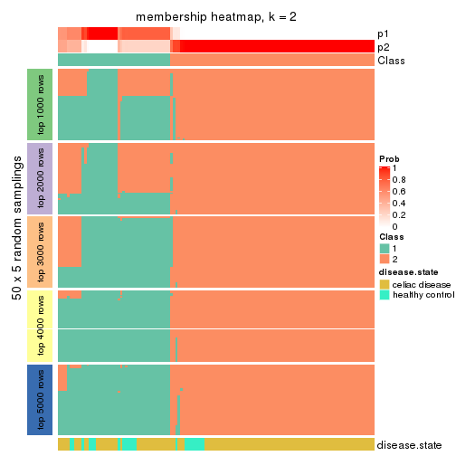</p>

</div>
<div id='tab-CV-mclust-membership-heatmap-2'>
<pre><code class="r">membership_heatmap(res, k = 3)
</code></pre>

<p></p>

</div>
<div id='tab-CV-mclust-membership-heatmap-3'>
<pre><code class="r">membership_heatmap(res, k = 4)
</code></pre>

<p></p>

</div>
<div id='tab-CV-mclust-membership-heatmap-4'>
<pre><code class="r">membership_heatmap(res, k = 5)
</code></pre>

<p></p>

</div>
<div id='tab-CV-mclust-membership-heatmap-5'>
<pre><code class="r">membership_heatmap(res, k = 6)
</code></pre>

<p></p>

</div>
</div>

As soon as we have had the classes for columns, we can look for signatures
which are significantly different between classes which can be candidate marks
for certain classes. Following are the heatmaps for signatures.


Signature heatmaps where rows are scaled:


<script>
$( function() {
	$( '#tabs-CV-mclust-get-signatures' ).tabs();
} );
</script>
<div id='tabs-CV-mclust-get-signatures'>
<ul>
<li><a href='#tab-CV-mclust-get-signatures-1'>k = 2</a></li>
<li><a href='#tab-CV-mclust-get-signatures-2'>k = 3</a></li>
<li><a href='#tab-CV-mclust-get-signatures-3'>k = 4</a></li>
<li><a href='#tab-CV-mclust-get-signatures-4'>k = 5</a></li>
<li><a href='#tab-CV-mclust-get-signatures-5'>k = 6</a></li>
</ul>
<div id='tab-CV-mclust-get-signatures-1'>
<pre><code class="r">get_signatures(res, k = 2)
</code></pre>

<p></p>

</div>
<div id='tab-CV-mclust-get-signatures-2'>
<pre><code class="r">get_signatures(res, k = 3)
</code></pre>

<p></p>

</div>
<div id='tab-CV-mclust-get-signatures-3'>
<pre><code class="r">get_signatures(res, k = 4)
</code></pre>

<p></p>

</div>
<div id='tab-CV-mclust-get-signatures-4'>
<pre><code class="r">get_signatures(res, k = 5)
</code></pre>

<p></p>

</div>
<div id='tab-CV-mclust-get-signatures-5'>
<pre><code class="r">get_signatures(res, k = 6)
</code></pre>

<p></p>

</div>
</div>


Signature heatmaps where rows are not scaled:


<script>
$( function() {
	$( '#tabs-CV-mclust-get-signatures-no-scale' ).tabs();
} );
</script>
<div id='tabs-CV-mclust-get-signatures-no-scale'>
<ul>
<li><a href='#tab-CV-mclust-get-signatures-no-scale-1'>k = 2</a></li>
<li><a href='#tab-CV-mclust-get-signatures-no-scale-2'>k = 3</a></li>
<li><a href='#tab-CV-mclust-get-signatures-no-scale-3'>k = 4</a></li>
<li><a href='#tab-CV-mclust-get-signatures-no-scale-4'>k = 5</a></li>
<li><a href='#tab-CV-mclust-get-signatures-no-scale-5'>k = 6</a></li>
</ul>
<div id='tab-CV-mclust-get-signatures-no-scale-1'>
<pre><code class="r">get_signatures(res, k = 2, scale_rows = FALSE)
</code></pre>

<p></p>

</div>
<div id='tab-CV-mclust-get-signatures-no-scale-2'>
<pre><code class="r">get_signatures(res, k = 3, scale_rows = FALSE)
</code></pre>

<p></p>

</div>
<div id='tab-CV-mclust-get-signatures-no-scale-3'>
<pre><code class="r">get_signatures(res, k = 4, scale_rows = FALSE)
</code></pre>

<p></p>

</div>
<div id='tab-CV-mclust-get-signatures-no-scale-4'>
<pre><code class="r">get_signatures(res, k = 5, scale_rows = FALSE)
</code></pre>

<p></p>

</div>
<div id='tab-CV-mclust-get-signatures-no-scale-5'>
<pre><code class="r">get_signatures(res, k = 6, scale_rows = FALSE)
</code></pre>

<p></p>

</div>
</div>


Compare the overlap of signatures from different k:

```r
compare_signatures(res)
```


`get_signature()` returns a data frame invisibly. TO get the list of signatures, the function
call should be assigned to a variable explicitly. In following code, if `plot` argument is set
to `FALSE`, no heatmap is plotted while only the differential analysis is performed.

```r
# code only for demonstration
tb = get_signature(res, k = ..., plot = FALSE)
```

An example of the output of `tb` is:

```
#>   which_row         fdr    mean_1    mean_2 scaled_mean_1 scaled_mean_2 km
#> 1        38 0.042760348  8.373488  9.131774    -0.5533452     0.5164555  1
#> 2        40 0.018707592  7.106213  8.469186    -0.6173731     0.5762149  1
#> 3        55 0.019134737 10.221463 11.207825    -0.6159697     0.5749050  1
#> 4        59 0.006059896  5.921854  7.869574    -0.6899429     0.6439467  1
#> 5        60 0.018055526  8.928898 10.211722    -0.6204761     0.5791110  1
#> 6        98 0.009384629 15.714769 14.887706     0.6635654    -0.6193277  2
...
```

The columns in `tb` are:

1. `which_row`: row indices corresponding to the input matrix.
2. `fdr`: FDR for the differential test. 
3. `mean_x`: The mean value in group x.
4. `scaled_mean_x`: The mean value in group x after rows are scaled.
5. `km`: Row groups if k-means clustering is applied to rows.


UMAP plot which shows how samples are separated.


<script>
$( function() {
	$( '#tabs-CV-mclust-dimension-reduction' ).tabs();
} );
</script>
<div id='tabs-CV-mclust-dimension-reduction'>
<ul>
<li><a href='#tab-CV-mclust-dimension-reduction-1'>k = 2</a></li>
<li><a href='#tab-CV-mclust-dimension-reduction-2'>k = 3</a></li>
<li><a href='#tab-CV-mclust-dimension-reduction-3'>k = 4</a></li>
<li><a href='#tab-CV-mclust-dimension-reduction-4'>k = 5</a></li>
<li><a href='#tab-CV-mclust-dimension-reduction-5'>k = 6</a></li>
</ul>
<div id='tab-CV-mclust-dimension-reduction-1'>
<pre><code class="r">dimension_reduction(res, k = 2, method = &quot;UMAP&quot;)
</code></pre>

<p></p>

</div>
<div id='tab-CV-mclust-dimension-reduction-2'>
<pre><code class="r">dimension_reduction(res, k = 3, method = &quot;UMAP&quot;)
</code></pre>

<p></p>

</div>
<div id='tab-CV-mclust-dimension-reduction-3'>
<pre><code class="r">dimension_reduction(res, k = 4, method = &quot;UMAP&quot;)
</code></pre>

<p></p>

</div>
<div id='tab-CV-mclust-dimension-reduction-4'>
<pre><code class="r">dimension_reduction(res, k = 5, method = &quot;UMAP&quot;)
</code></pre>

<p></p>

</div>
<div id='tab-CV-mclust-dimension-reduction-5'>
<pre><code class="r">dimension_reduction(res, k = 6, method = &quot;UMAP&quot;)
</code></pre>

<p></p>

</div>
</div>


Following heatmap shows how subgroups are split when increasing `k`:

```r
collect_classes(res)
```


Test correlation between subgroups and known annotations. If the known
annotation is numeric, one-way ANOVA test is applied, and if the known
annotation is discrete, chi-squared contingency table test is applied.

```r
test_to_known_factors(res)
```

```
#>             n disease.state(p) k
#> CV:mclust 132           0.0228 2
#> CV:mclust 129           0.0516 3
#> CV:mclust 128           0.0406 4
#> CV:mclust 119           0.2216 5
#> CV:mclust 113           0.0383 6
```


If matrix rows can be associated to genes, consider to use `GO_Enrichment(res,
...)` to perform function enrichment for the signature genes.


 

---------------------------------------------------


### CV:NMF**


The object with results only for a single top-value method and a single partition method 
can be extracted as:

```r
res = res_list["CV", "NMF"]
# you can also extract it by
# res = res_list["CV:NMF"]
```

A summary of `res` and all the functions that can be applied to it:

```r
res
```

```
#> A 'ConsensusPartition' object with k = 2, 3, 4, 5, 6.
#>   On a matrix with 18032 rows and 132 columns.
#>   Top rows (1000, 2000, 3000, 4000, 5000) are extracted by 'CV' method.
#>   Subgroups are detected by 'NMF' method.
#>   Performed in total 1250 partitions by row resampling.
#>   Best k for subgroups seems to be 2.
#> 
#> Following methods can be applied to this 'ConsensusPartition' object:
#>  [1] "cola_report"             "collect_classes"         "collect_plots"          
#>  [4] "collect_stats"           "colnames"                "compare_signatures"     
#>  [7] "consensus_heatmap"       "dimension_reduction"     "functional_enrichment"  
#> [10] "get_anno_col"            "get_anno"                "get_classes"            
#> [13] "get_consensus"           "get_matrix"              "get_membership"         
#> [16] "get_param"               "get_signatures"          "get_stats"              
#> [19] "is_best_k"               "is_stable_k"             "membership_heatmap"     
#> [22] "ncol"                    "nrow"                    "plot_ecdf"              
#> [25] "rownames"                "select_partition_number" "show"                   
#> [28] "suggest_best_k"          "test_to_known_factors"
```

`collect_plots()` function collects all the plots made from `res` for all `k` (number of partitions)
into one single page to provide an easy and fast comparison between different `k`.

```r
collect_plots(res)
```


The plots are:

- The first row: a plot of the ECDF (Empirical cumulative distribution
  function) curves of the consensus matrix for each `k` and the heatmap of
  predicted classes for each `k`.
- The second row: heatmaps of the consensus matrix for each `k`.
- The third row: heatmaps of the membership matrix for each `k`.
- The fouth row: heatmaps of the signatures for each `k`.

All the plots in panels can be made by individual functions and they are
plotted later in this section.

`select_partition_number()` produces several plots showing different
statistics for choosing "optimized" `k`. There are following statistics:

- ECDF curves of the consensus matrix for each `k`;
- 1-PAC. [The PAC
  score](https://en.wikipedia.org/wiki/Consensus_clustering#Over-interpretation_potential_of_consensus_clustering)
  measures the proportion of the ambiguous subgrouping.
- Mean silhouette score.
- Concordance. The mean probability of fiting the consensus class ids in all
  partitions.
- Area increased. Denote $A_k$ as the area under the ECDF curve for current
  `k`, the area increased is defined as $A_k - A_{k-1}$.
- Rand index. The percent of pairs of samples that are both in a same cluster
  or both are not in a same cluster in the partition of k and k-1.
- Jaccard index. The ratio of pairs of samples are both in a same cluster in
  the partition of k and k-1 and the pairs of samples are both in a same
  cluster in the partition k or k-1.

The detailed explanations of these statistics can be found in [the cola
vignette](http://bioconductor.org/packages/devel/bioc/vignettes/cola/inst/doc/cola.html#toc_13).

Generally speaking, lower PAC score, higher mean silhouette score or higher
concordance corresponds to better partition. Rand index and Jaccard index
measure how similar the current partition is compared to partition with `k-1`.
If they are too similar, we won't accept `k` is better than `k-1`.

```r
select_partition_number(res)
```


The numeric values for all these statistics can be obtained by `get_stats()`.

```r
get_stats(res)
```

```
#>   k 1-PAC mean_silhouette concordance area_increased  Rand Jaccard
#> 2 2 0.984           0.958       0.983         0.4314 0.568   0.568
#> 3 3 0.737           0.835       0.915         0.3961 0.758   0.602
#> 4 4 0.601           0.692       0.823         0.1842 0.793   0.545
#> 5 5 0.730           0.647       0.788         0.0763 0.834   0.521
#> 6 6 0.658           0.579       0.767         0.0383 0.916   0.679
```

`suggest_best_k()` suggests the best $k$ based on these statistics. The rules are as follows:

- All $k$ with Jaccard index larger than 0.95 are removed because the increase of
  the partition number does not provides enough extra information. If all $k$ are removed,
  the best $k$ is assigned by `NA`.
- For $k$ with 1-PAC larger than 0.9, the maximal $k$ is taken as the "best k". Other $k$ is called "optional k".
- If it does not fit the second rule. The $k$ with the highest vote of highest
  1-PAC, mean silhouette and concordance is taken as the "best k".

```r
suggest_best_k(res)
```

```
#> [1] 2
```


Following shows the table of the partitions (You need to click the **show/hide
code output** link to see it). The membership matrix (columns with name `p*`)
is inferred by
[`clue::cl_consensus()`](https://www.rdocumentation.org/link/cl_consensus?package=clue)
function with the `SE` method. Basically the value in the membership matrix
represents the probability to belong to a certain group. The finall class
label for an item is determined with the group with highest probability it
belongs to.

In `get_classes()` function, the entropy is calculated from the membership
matrix and the silhouette score is calculated from the consensus matrix.


<script>
$( function() {
	$( '#tabs-CV-NMF-get-classes' ).tabs();
} );
</script>
<div id='tabs-CV-NMF-get-classes'>
<ul>
<li><a href='#tab-CV-NMF-get-classes-1'>k = 2</a></li>
<li><a href='#tab-CV-NMF-get-classes-2'>k = 3</a></li>
<li><a href='#tab-CV-NMF-get-classes-3'>k = 4</a></li>
<li><a href='#tab-CV-NMF-get-classes-4'>k = 5</a></li>
<li><a href='#tab-CV-NMF-get-classes-5'>k = 6</a></li>
</ul>

<div id='tab-CV-NMF-get-classes-1'>
<p><a id='tab-CV-NMF-get-classes-1-a' style='color:#0366d6' href='#'>show/hide code output</a></p>
<pre><code class="r">cbind(get_classes(res, k = 2), get_membership(res, k = 2))
</code></pre>

<pre><code>#&gt;           class entropy silhouette    p1    p2
#&gt; GSM289470     2  0.0000     0.9868 0.000 1.000
#&gt; GSM289471     1  0.0000     0.9716 1.000 0.000
#&gt; GSM289472     2  0.0000     0.9868 0.000 1.000
#&gt; GSM289473     2  0.0000     0.9868 0.000 1.000
#&gt; GSM289474     2  0.0000     0.9868 0.000 1.000
#&gt; GSM289475     2  0.0000     0.9868 0.000 1.000
#&gt; GSM289476     1  0.0000     0.9716 1.000 0.000
#&gt; GSM289477     2  0.0000     0.9868 0.000 1.000
#&gt; GSM289478     2  0.0000     0.9868 0.000 1.000
#&gt; GSM289479     2  0.0000     0.9868 0.000 1.000
#&gt; GSM289480     2  0.0000     0.9868 0.000 1.000
#&gt; GSM289481     2  0.0000     0.9868 0.000 1.000
#&gt; GSM289482     2  0.0000     0.9868 0.000 1.000
#&gt; GSM289483     2  0.0000     0.9868 0.000 1.000
#&gt; GSM289484     2  0.0000     0.9868 0.000 1.000
#&gt; GSM289485     2  0.0000     0.9868 0.000 1.000
#&gt; GSM289486     1  0.0000     0.9716 1.000 0.000
#&gt; GSM289487     2  0.0000     0.9868 0.000 1.000
#&gt; GSM289488     2  0.0000     0.9868 0.000 1.000
#&gt; GSM289489     2  0.0000     0.9868 0.000 1.000
#&gt; GSM289490     2  0.6801     0.7695 0.180 0.820
#&gt; GSM289491     2  0.0000     0.9868 0.000 1.000
#&gt; GSM289492     1  0.0938     0.9639 0.988 0.012
#&gt; GSM289493     2  0.0000     0.9868 0.000 1.000
#&gt; GSM289494     1  0.0000     0.9716 1.000 0.000
#&gt; GSM289495     2  0.0000     0.9868 0.000 1.000
#&gt; GSM289496     2  0.0000     0.9868 0.000 1.000
#&gt; GSM289497     2  0.0000     0.9868 0.000 1.000
#&gt; GSM289498     1  0.3274     0.9260 0.940 0.060
#&gt; GSM289499     2  0.0000     0.9868 0.000 1.000
#&gt; GSM289500     1  0.0000     0.9716 1.000 0.000
#&gt; GSM289501     2  0.0000     0.9868 0.000 1.000
#&gt; GSM289502     2  0.0000     0.9868 0.000 1.000
#&gt; GSM289503     2  0.0000     0.9868 0.000 1.000
#&gt; GSM289504     2  0.0000     0.9868 0.000 1.000
#&gt; GSM289505     2  0.0000     0.9868 0.000 1.000
#&gt; GSM289506     2  0.0000     0.9868 0.000 1.000
#&gt; GSM289507     2  0.0000     0.9868 0.000 1.000
#&gt; GSM289508     1  0.3879     0.9106 0.924 0.076
#&gt; GSM289509     1  0.0000     0.9716 1.000 0.000
#&gt; GSM289510     2  0.0000     0.9868 0.000 1.000
#&gt; GSM289511     2  0.0000     0.9868 0.000 1.000
#&gt; GSM289512     1  0.0000     0.9716 1.000 0.000
#&gt; GSM289513     2  0.0000     0.9868 0.000 1.000
#&gt; GSM289514     2  0.5059     0.8628 0.112 0.888
#&gt; GSM289515     2  0.0000     0.9868 0.000 1.000
#&gt; GSM289516     2  0.0000     0.9868 0.000 1.000
#&gt; GSM289517     2  0.0000     0.9868 0.000 1.000
#&gt; GSM289518     2  0.0000     0.9868 0.000 1.000
#&gt; GSM289519     2  0.0000     0.9868 0.000 1.000
#&gt; GSM289520     2  0.0000     0.9868 0.000 1.000
#&gt; GSM289521     1  0.8327     0.6576 0.736 0.264
#&gt; GSM289522     2  0.0000     0.9868 0.000 1.000
#&gt; GSM289523     1  0.0000     0.9716 1.000 0.000
#&gt; GSM289524     2  0.0000     0.9868 0.000 1.000
#&gt; GSM289525     2  0.0000     0.9868 0.000 1.000
#&gt; GSM289526     2  0.9963     0.0951 0.464 0.536
#&gt; GSM289527     2  0.0000     0.9868 0.000 1.000
#&gt; GSM289528     2  0.0000     0.9868 0.000 1.000
#&gt; GSM289529     2  0.0000     0.9868 0.000 1.000
#&gt; GSM289530     1  0.4815     0.8815 0.896 0.104
#&gt; GSM289531     2  0.0000     0.9868 0.000 1.000
#&gt; GSM289532     1  0.0000     0.9716 1.000 0.000
#&gt; GSM289533     2  0.0000     0.9868 0.000 1.000
#&gt; GSM289534     1  0.0000     0.9716 1.000 0.000
#&gt; GSM289535     2  0.0000     0.9868 0.000 1.000
#&gt; GSM289536     1  0.0000     0.9716 1.000 0.000
#&gt; GSM289537     2  0.0000     0.9868 0.000 1.000
#&gt; GSM289538     2  0.0000     0.9868 0.000 1.000
#&gt; GSM289539     2  0.0000     0.9868 0.000 1.000
#&gt; GSM289540     1  0.1633     0.9556 0.976 0.024
#&gt; GSM289541     2  0.0376     0.9830 0.004 0.996
#&gt; GSM289542     2  0.0000     0.9868 0.000 1.000
#&gt; GSM289543     2  0.0000     0.9868 0.000 1.000
#&gt; GSM289544     1  0.0000     0.9716 1.000 0.000
#&gt; GSM289545     2  0.0000     0.9868 0.000 1.000
#&gt; GSM289546     2  0.0000     0.9868 0.000 1.000
#&gt; GSM289547     2  0.0000     0.9868 0.000 1.000
#&gt; GSM289548     1  0.0000     0.9716 1.000 0.000
#&gt; GSM289549     1  0.6887     0.7817 0.816 0.184
#&gt; GSM289550     1  0.0000     0.9716 1.000 0.000
#&gt; GSM289551     1  0.0000     0.9716 1.000 0.000
#&gt; GSM289552     1  0.0000     0.9716 1.000 0.000
#&gt; GSM289553     1  0.0000     0.9716 1.000 0.000
#&gt; GSM289554     2  0.0000     0.9868 0.000 1.000
#&gt; GSM289555     2  0.0000     0.9868 0.000 1.000
#&gt; GSM289556     1  0.0000     0.9716 1.000 0.000
#&gt; GSM289557     2  0.0000     0.9868 0.000 1.000
#&gt; GSM289558     2  0.0000     0.9868 0.000 1.000
#&gt; GSM289559     1  0.0000     0.9716 1.000 0.000
#&gt; GSM289560     2  0.0000     0.9868 0.000 1.000
#&gt; GSM289561     2  0.0000     0.9868 0.000 1.000
#&gt; GSM289562     1  0.0000     0.9716 1.000 0.000
#&gt; GSM289563     2  0.9552     0.3740 0.376 0.624
#&gt; GSM289564     2  0.0000     0.9868 0.000 1.000
#&gt; GSM289565     1  0.0000     0.9716 1.000 0.000
#&gt; GSM289566     1  0.0000     0.9716 1.000 0.000
#&gt; GSM289567     2  0.0000     0.9868 0.000 1.000
#&gt; GSM289568     2  0.0000     0.9868 0.000 1.000
#&gt; GSM289569     2  0.0000     0.9868 0.000 1.000
#&gt; GSM289570     2  0.0000     0.9868 0.000 1.000
#&gt; GSM289571     2  0.0000     0.9868 0.000 1.000
#&gt; GSM289572     2  0.0000     0.9868 0.000 1.000
#&gt; GSM289573     2  0.0000     0.9868 0.000 1.000
#&gt; GSM289574     2  0.0000     0.9868 0.000 1.000
#&gt; GSM289575     2  0.0000     0.9868 0.000 1.000
#&gt; GSM289576     2  0.0000     0.9868 0.000 1.000
#&gt; GSM289577     2  0.0000     0.9868 0.000 1.000
#&gt; GSM289578     2  0.0000     0.9868 0.000 1.000
#&gt; GSM289579     2  0.0000     0.9868 0.000 1.000
#&gt; GSM289580     1  0.0000     0.9716 1.000 0.000
#&gt; GSM289581     1  0.0000     0.9716 1.000 0.000
#&gt; GSM289582     2  0.0000     0.9868 0.000 1.000
#&gt; GSM289583     2  0.0000     0.9868 0.000 1.000
#&gt; GSM289584     2  0.0000     0.9868 0.000 1.000
#&gt; GSM289585     2  0.0000     0.9868 0.000 1.000
#&gt; GSM289586     2  0.0000     0.9868 0.000 1.000
#&gt; GSM289587     1  0.9491     0.4365 0.632 0.368
#&gt; GSM289588     1  0.0000     0.9716 1.000 0.000
#&gt; GSM289589     1  0.0000     0.9716 1.000 0.000
#&gt; GSM289590     1  0.0000     0.9716 1.000 0.000
#&gt; GSM289591     1  0.0000     0.9716 1.000 0.000
#&gt; GSM289592     2  0.0000     0.9868 0.000 1.000
#&gt; GSM289593     1  0.0000     0.9716 1.000 0.000
#&gt; GSM289594     2  0.0000     0.9868 0.000 1.000
#&gt; GSM289595     1  0.0000     0.9716 1.000 0.000
#&gt; GSM289596     2  0.0000     0.9868 0.000 1.000
#&gt; GSM289597     2  0.0000     0.9868 0.000 1.000
#&gt; GSM289598     1  0.0000     0.9716 1.000 0.000
#&gt; GSM289599     2  0.0000     0.9868 0.000 1.000
#&gt; GSM289600     1  0.0000     0.9716 1.000 0.000
#&gt; GSM289601     1  0.1633     0.9556 0.976 0.024
</code></pre>

<script>
$('#tab-CV-NMF-get-classes-1-a').parent().next().next().hide();
$('#tab-CV-NMF-get-classes-1-a').click(function(){
  $('#tab-CV-NMF-get-classes-1-a').parent().next().next().toggle();
  return(false);
});
</script>
</div>

<div id='tab-CV-NMF-get-classes-2'>
<p><a id='tab-CV-NMF-get-classes-2-a' style='color:#0366d6' href='#'>show/hide code output</a></p>
<pre><code class="r">cbind(get_classes(res, k = 3), get_membership(res, k = 3))
</code></pre>

<pre><code>#&gt;           class entropy silhouette    p1    p2    p3
#&gt; GSM289470     1  0.1964     0.8567 0.944 0.056 0.000
#&gt; GSM289471     3  0.2261     0.9171 0.068 0.000 0.932
#&gt; GSM289472     2  0.0747     0.9251 0.016 0.984 0.000
#&gt; GSM289473     2  0.1315     0.9268 0.020 0.972 0.008
#&gt; GSM289474     2  0.0747     0.9251 0.016 0.984 0.000
#&gt; GSM289475     2  0.3879     0.8171 0.152 0.848 0.000
#&gt; GSM289476     3  0.2261     0.9171 0.068 0.000 0.932
#&gt; GSM289477     2  0.3941     0.8183 0.156 0.844 0.000
#&gt; GSM289478     2  0.2165     0.9002 0.064 0.936 0.000
#&gt; GSM289479     2  0.2527     0.9184 0.044 0.936 0.020
#&gt; GSM289480     2  0.1031     0.9230 0.024 0.976 0.000
#&gt; GSM289481     2  0.0983     0.9256 0.004 0.980 0.016
#&gt; GSM289482     1  0.2878     0.8341 0.904 0.096 0.000
#&gt; GSM289483     2  0.5465     0.6159 0.288 0.712 0.000
#&gt; GSM289484     2  0.0747     0.9251 0.016 0.984 0.000
#&gt; GSM289485     1  0.2448     0.8474 0.924 0.076 0.000
#&gt; GSM289486     1  0.0424     0.8595 0.992 0.000 0.008
#&gt; GSM289487     2  0.0892     0.9243 0.020 0.980 0.000
#&gt; GSM289488     2  0.3116     0.8647 0.108 0.892 0.000
#&gt; GSM289489     2  0.0237     0.9272 0.004 0.996 0.000
#&gt; GSM289490     2  0.5335     0.7197 0.008 0.760 0.232
#&gt; GSM289491     2  0.2261     0.8977 0.000 0.932 0.068
#&gt; GSM289492     3  0.1647     0.8797 0.004 0.036 0.960
#&gt; GSM289493     2  0.0661     0.9267 0.004 0.988 0.008
#&gt; GSM289494     3  0.0424     0.8981 0.000 0.008 0.992
#&gt; GSM289495     2  0.2486     0.9097 0.060 0.932 0.008
#&gt; GSM289496     2  0.0829     0.9260 0.004 0.984 0.012
#&gt; GSM289497     2  0.0000     0.9272 0.000 1.000 0.000
#&gt; GSM289498     3  0.2096     0.8654 0.004 0.052 0.944
#&gt; GSM289499     2  0.1031     0.9230 0.024 0.976 0.000
#&gt; GSM289500     3  0.0592     0.9062 0.012 0.000 0.988
#&gt; GSM289501     2  0.1015     0.9254 0.008 0.980 0.012
#&gt; GSM289502     2  0.0424     0.9267 0.008 0.992 0.000
#&gt; GSM289503     2  0.0000     0.9272 0.000 1.000 0.000
#&gt; GSM289504     2  0.2173     0.9165 0.048 0.944 0.008
#&gt; GSM289505     2  0.0424     0.9272 0.000 0.992 0.008
#&gt; GSM289506     2  0.0000     0.9272 0.000 1.000 0.000
#&gt; GSM289507     2  0.0592     0.9260 0.012 0.988 0.000
#&gt; GSM289508     3  0.6379     0.4655 0.368 0.008 0.624
#&gt; GSM289509     3  0.2261     0.9171 0.068 0.000 0.932
#&gt; GSM289510     1  0.2356     0.8482 0.928 0.072 0.000
#&gt; GSM289511     2  0.1031     0.9229 0.024 0.976 0.000
#&gt; GSM289512     3  0.1163     0.9122 0.028 0.000 0.972
#&gt; GSM289513     2  0.6280     0.1424 0.460 0.540 0.000
#&gt; GSM289514     1  0.3888     0.8385 0.888 0.048 0.064
#&gt; GSM289515     2  0.4842     0.7248 0.224 0.776 0.000
#&gt; GSM289516     1  0.2537     0.8457 0.920 0.080 0.000
#&gt; GSM289517     1  0.4346     0.7399 0.816 0.184 0.000
#&gt; GSM289518     1  0.5733     0.5315 0.676 0.324 0.000
#&gt; GSM289519     1  0.2486     0.8487 0.932 0.060 0.008
#&gt; GSM289520     1  0.2878     0.8343 0.904 0.096 0.000
#&gt; GSM289521     1  0.2339     0.8527 0.940 0.012 0.048
#&gt; GSM289522     1  0.3941     0.7773 0.844 0.156 0.000
#&gt; GSM289523     3  0.2066     0.9182 0.060 0.000 0.940
#&gt; GSM289524     2  0.1289     0.9197 0.032 0.968 0.000
#&gt; GSM289525     2  0.6305     0.0658 0.484 0.516 0.000
#&gt; GSM289526     3  0.6804     0.7079 0.204 0.072 0.724
#&gt; GSM289527     2  0.4796     0.7216 0.220 0.780 0.000
#&gt; GSM289528     2  0.0892     0.9241 0.020 0.980 0.000
#&gt; GSM289529     1  0.6641     0.1718 0.544 0.448 0.008
#&gt; GSM289530     3  0.2063     0.8899 0.044 0.008 0.948
#&gt; GSM289531     2  0.1315     0.9230 0.008 0.972 0.020
#&gt; GSM289532     3  0.1289     0.8923 0.032 0.000 0.968
#&gt; GSM289533     2  0.0000     0.9272 0.000 1.000 0.000
#&gt; GSM289534     3  0.2066     0.9182 0.060 0.000 0.940
#&gt; GSM289535     2  0.5058     0.8094 0.032 0.820 0.148
#&gt; GSM289536     3  0.2165     0.9182 0.064 0.000 0.936
#&gt; GSM289537     2  0.1129     0.9271 0.020 0.976 0.004
#&gt; GSM289538     2  0.0747     0.9251 0.016 0.984 0.000
#&gt; GSM289539     2  0.0424     0.9267 0.008 0.992 0.000
#&gt; GSM289540     3  0.3500     0.8606 0.116 0.004 0.880
#&gt; GSM289541     1  0.1267     0.8620 0.972 0.024 0.004
#&gt; GSM289542     1  0.3083     0.8556 0.916 0.060 0.024
#&gt; GSM289543     2  0.3941     0.8100 0.156 0.844 0.000
#&gt; GSM289544     1  0.0592     0.8564 0.988 0.000 0.012
#&gt; GSM289545     2  0.3879     0.8155 0.152 0.848 0.000
#&gt; GSM289546     1  0.5529     0.6101 0.704 0.296 0.000
#&gt; GSM289547     2  0.0000     0.9272 0.000 1.000 0.000
#&gt; GSM289548     1  0.1529     0.8479 0.960 0.000 0.040
#&gt; GSM289549     1  0.1289     0.8525 0.968 0.000 0.032
#&gt; GSM289550     1  0.1753     0.8435 0.952 0.000 0.048
#&gt; GSM289551     3  0.2165     0.9182 0.064 0.000 0.936
#&gt; GSM289552     1  0.2356     0.8270 0.928 0.000 0.072
#&gt; GSM289553     1  0.1031     0.8527 0.976 0.000 0.024
#&gt; GSM289554     2  0.1774     0.9211 0.024 0.960 0.016
#&gt; GSM289555     2  0.1170     0.9243 0.008 0.976 0.016
#&gt; GSM289556     1  0.0592     0.8585 0.988 0.000 0.012
#&gt; GSM289557     2  0.0424     0.9272 0.000 0.992 0.008
#&gt; GSM289558     2  0.0424     0.9272 0.000 0.992 0.008
#&gt; GSM289559     1  0.2066     0.8355 0.940 0.000 0.060
#&gt; GSM289560     2  0.1015     0.9254 0.008 0.980 0.012
#&gt; GSM289561     2  0.0829     0.9260 0.004 0.984 0.012
#&gt; GSM289562     1  0.1643     0.8458 0.956 0.000 0.044
#&gt; GSM289563     1  0.1129     0.8617 0.976 0.020 0.004
#&gt; GSM289564     2  0.3406     0.8882 0.028 0.904 0.068
#&gt; GSM289565     1  0.6062     0.2704 0.616 0.000 0.384
#&gt; GSM289566     1  0.6307    -0.0731 0.512 0.000 0.488
#&gt; GSM289567     2  0.3472     0.8959 0.040 0.904 0.056
#&gt; GSM289568     2  0.0592     0.9260 0.012 0.988 0.000
#&gt; GSM289569     2  0.6308    -0.0297 0.492 0.508 0.000
#&gt; GSM289570     2  0.3028     0.9001 0.032 0.920 0.048
#&gt; GSM289571     2  0.0000     0.9272 0.000 1.000 0.000
#&gt; GSM289572     2  0.0848     0.9262 0.008 0.984 0.008
#&gt; GSM289573     2  0.0592     0.9267 0.000 0.988 0.012
#&gt; GSM289574     2  0.0000     0.9272 0.000 1.000 0.000
#&gt; GSM289575     2  0.2173     0.9083 0.008 0.944 0.048
#&gt; GSM289576     2  0.0424     0.9268 0.000 0.992 0.008
#&gt; GSM289577     2  0.1585     0.9196 0.008 0.964 0.028
#&gt; GSM289578     2  0.2845     0.8939 0.012 0.920 0.068
#&gt; GSM289579     2  0.2486     0.9006 0.008 0.932 0.060
#&gt; GSM289580     3  0.1163     0.9122 0.028 0.000 0.972
#&gt; GSM289581     3  0.5363     0.6925 0.276 0.000 0.724
#&gt; GSM289582     2  0.0661     0.9267 0.004 0.988 0.008
#&gt; GSM289583     2  0.0592     0.9260 0.012 0.988 0.000
#&gt; GSM289584     2  0.0424     0.9272 0.000 0.992 0.008
#&gt; GSM289585     2  0.0592     0.9260 0.012 0.988 0.000
#&gt; GSM289586     1  0.2448     0.8474 0.924 0.076 0.000
#&gt; GSM289587     1  0.0424     0.8595 0.992 0.000 0.008
#&gt; GSM289588     3  0.2165     0.9182 0.064 0.000 0.936
#&gt; GSM289589     1  0.0592     0.8585 0.988 0.000 0.012
#&gt; GSM289590     1  0.2448     0.8199 0.924 0.000 0.076
#&gt; GSM289591     1  0.3482     0.7738 0.872 0.000 0.128
#&gt; GSM289592     2  0.0237     0.9272 0.000 0.996 0.004
#&gt; GSM289593     3  0.2261     0.9171 0.068 0.000 0.932
#&gt; GSM289594     2  0.0983     0.9251 0.004 0.980 0.016
#&gt; GSM289595     3  0.4750     0.7805 0.216 0.000 0.784
#&gt; GSM289596     2  0.0237     0.9274 0.000 0.996 0.004
#&gt; GSM289597     2  0.4399     0.7826 0.188 0.812 0.000
#&gt; GSM289598     3  0.2165     0.9178 0.064 0.000 0.936
#&gt; GSM289599     2  0.5109     0.7600 0.212 0.780 0.008
#&gt; GSM289600     1  0.0424     0.8595 0.992 0.000 0.008
#&gt; GSM289601     1  0.1182     0.8614 0.976 0.012 0.012
</code></pre>

<script>
$('#tab-CV-NMF-get-classes-2-a').parent().next().next().hide();
$('#tab-CV-NMF-get-classes-2-a').click(function(){
  $('#tab-CV-NMF-get-classes-2-a').parent().next().next().toggle();
  return(false);
});
</script>
</div>

<div id='tab-CV-NMF-get-classes-3'>
<p><a id='tab-CV-NMF-get-classes-3-a' style='color:#0366d6' href='#'>show/hide code output</a></p>
<pre><code class="r">cbind(get_classes(res, k = 4), get_membership(res, k = 4))
</code></pre>

<pre><code>#&gt;           class entropy silhouette    p1    p2    p3    p4
#&gt; GSM289470     1  0.1191     0.7030 0.968 0.004 0.004 0.024
#&gt; GSM289471     3  0.2814     0.8894 0.132 0.000 0.868 0.000
#&gt; GSM289472     2  0.4327     0.7096 0.216 0.768 0.000 0.016
#&gt; GSM289473     2  0.4971     0.7417 0.028 0.776 0.024 0.172
#&gt; GSM289474     2  0.2174     0.8375 0.052 0.928 0.000 0.020
#&gt; GSM289475     2  0.5511     0.1209 0.484 0.500 0.000 0.016
#&gt; GSM289476     3  0.2814     0.8894 0.132 0.000 0.868 0.000
#&gt; GSM289477     4  0.6338     0.5605 0.120 0.236 0.000 0.644
#&gt; GSM289478     2  0.5300     0.3722 0.408 0.580 0.000 0.012
#&gt; GSM289479     1  0.8724     0.0940 0.408 0.368 0.072 0.152
#&gt; GSM289480     2  0.5026     0.5724 0.312 0.672 0.000 0.016
#&gt; GSM289481     2  0.2101     0.8371 0.060 0.928 0.000 0.012
#&gt; GSM289482     4  0.3760     0.7514 0.136 0.028 0.000 0.836
#&gt; GSM289483     2  0.7413     0.0484 0.352 0.472 0.000 0.176
#&gt; GSM289484     2  0.0895     0.8464 0.020 0.976 0.000 0.004
#&gt; GSM289485     1  0.4018     0.6205 0.772 0.004 0.000 0.224
#&gt; GSM289486     1  0.2796     0.6996 0.892 0.000 0.016 0.092
#&gt; GSM289487     2  0.2924     0.8171 0.100 0.884 0.000 0.016
#&gt; GSM289488     2  0.6501     0.4564 0.268 0.616 0.000 0.116
#&gt; GSM289489     2  0.2924     0.8158 0.100 0.884 0.000 0.016
#&gt; GSM289490     2  0.5223     0.6011 0.008 0.684 0.292 0.016
#&gt; GSM289491     2  0.1191     0.8445 0.004 0.968 0.024 0.004
#&gt; GSM289492     3  0.3172     0.7463 0.008 0.088 0.884 0.020
#&gt; GSM289493     2  0.0336     0.8452 0.000 0.992 0.000 0.008
#&gt; GSM289494     3  0.1339     0.8099 0.008 0.004 0.964 0.024
#&gt; GSM289495     4  0.2563     0.7782 0.020 0.072 0.000 0.908
#&gt; GSM289496     2  0.0336     0.8452 0.000 0.992 0.000 0.008
#&gt; GSM289497     2  0.0336     0.8463 0.008 0.992 0.000 0.000
#&gt; GSM289498     3  0.2088     0.7839 0.004 0.064 0.928 0.004
#&gt; GSM289499     2  0.4406     0.5544 0.000 0.700 0.000 0.300
#&gt; GSM289500     3  0.0188     0.8279 0.000 0.000 0.996 0.004
#&gt; GSM289501     2  0.0336     0.8452 0.000 0.992 0.000 0.008
#&gt; GSM289502     2  0.2281     0.8259 0.096 0.904 0.000 0.000
#&gt; GSM289503     2  0.0592     0.8463 0.016 0.984 0.000 0.000
#&gt; GSM289504     4  0.3873     0.6424 0.000 0.228 0.000 0.772
#&gt; GSM289505     2  0.1661     0.8328 0.004 0.944 0.000 0.052
#&gt; GSM289506     2  0.1867     0.8355 0.072 0.928 0.000 0.000
#&gt; GSM289507     2  0.3161     0.8019 0.124 0.864 0.000 0.012
#&gt; GSM289508     3  0.4204     0.8385 0.192 0.000 0.788 0.020
#&gt; GSM289509     3  0.3821     0.8751 0.120 0.000 0.840 0.040
#&gt; GSM289510     4  0.2999     0.7318 0.132 0.004 0.000 0.864
#&gt; GSM289511     2  0.5130     0.5653 0.312 0.668 0.000 0.020
#&gt; GSM289512     3  0.2999     0.8886 0.132 0.000 0.864 0.004
#&gt; GSM289513     1  0.5453     0.2177 0.592 0.388 0.000 0.020
#&gt; GSM289514     4  0.1022     0.7891 0.032 0.000 0.000 0.968
#&gt; GSM289515     1  0.6944     0.4247 0.588 0.196 0.000 0.216
#&gt; GSM289516     1  0.3636     0.6407 0.820 0.008 0.000 0.172
#&gt; GSM289517     4  0.4673     0.5566 0.292 0.008 0.000 0.700
#&gt; GSM289518     4  0.5093     0.4488 0.348 0.012 0.000 0.640
#&gt; GSM289519     4  0.1489     0.7889 0.044 0.004 0.000 0.952
#&gt; GSM289520     4  0.6003     0.1127 0.456 0.040 0.000 0.504
#&gt; GSM289521     4  0.1305     0.7893 0.036 0.000 0.004 0.960
#&gt; GSM289522     1  0.4852     0.6194 0.776 0.072 0.000 0.152
#&gt; GSM289523     3  0.2999     0.8886 0.132 0.000 0.864 0.004
#&gt; GSM289524     2  0.5371     0.4625 0.364 0.616 0.000 0.020
#&gt; GSM289525     4  0.2385     0.7848 0.052 0.028 0.000 0.920
#&gt; GSM289526     3  0.6574     0.5566 0.192 0.124 0.668 0.016
#&gt; GSM289527     1  0.5581     0.0123 0.532 0.448 0.000 0.020
#&gt; GSM289528     2  0.5237     0.4841 0.356 0.628 0.000 0.016
#&gt; GSM289529     4  0.6614     0.2725 0.376 0.076 0.004 0.544
#&gt; GSM289530     4  0.2561     0.7718 0.004 0.016 0.068 0.912
#&gt; GSM289531     2  0.3168     0.8054 0.000 0.884 0.060 0.056
#&gt; GSM289532     4  0.4216     0.6918 0.008 0.008 0.196 0.788
#&gt; GSM289533     2  0.2408     0.8323 0.060 0.920 0.004 0.016
#&gt; GSM289534     3  0.2814     0.8894 0.132 0.000 0.868 0.000
#&gt; GSM289535     4  0.4478     0.7190 0.008 0.132 0.048 0.812
#&gt; GSM289536     3  0.2814     0.8894 0.132 0.000 0.868 0.000
#&gt; GSM289537     2  0.2546     0.8147 0.008 0.900 0.000 0.092
#&gt; GSM289538     2  0.0707     0.8461 0.020 0.980 0.000 0.000
#&gt; GSM289539     2  0.3271     0.7957 0.132 0.856 0.000 0.012
#&gt; GSM289540     4  0.1209     0.7906 0.032 0.004 0.000 0.964
#&gt; GSM289541     1  0.4343     0.5771 0.732 0.000 0.004 0.264
#&gt; GSM289542     4  0.7734     0.2319 0.340 0.048 0.092 0.520
#&gt; GSM289543     2  0.5151     0.6822 0.100 0.760 0.000 0.140
#&gt; GSM289544     4  0.3710     0.6797 0.192 0.000 0.004 0.804
#&gt; GSM289545     2  0.2271     0.8363 0.076 0.916 0.000 0.008
#&gt; GSM289546     2  0.5085     0.6139 0.260 0.708 0.000 0.032
#&gt; GSM289547     2  0.0707     0.8464 0.020 0.980 0.000 0.000
#&gt; GSM289548     1  0.2670     0.6896 0.908 0.000 0.040 0.052
#&gt; GSM289549     1  0.1520     0.6910 0.956 0.000 0.024 0.020
#&gt; GSM289550     1  0.3383     0.6580 0.872 0.000 0.076 0.052
#&gt; GSM289551     3  0.2814     0.8894 0.132 0.000 0.868 0.000
#&gt; GSM289552     1  0.6315    -0.1302 0.540 0.000 0.396 0.064
#&gt; GSM289553     1  0.5168    -0.0457 0.500 0.000 0.004 0.496
#&gt; GSM289554     2  0.5395     0.4181 0.004 0.628 0.016 0.352
#&gt; GSM289555     2  0.2760     0.7881 0.000 0.872 0.000 0.128
#&gt; GSM289556     1  0.4770     0.5392 0.700 0.000 0.012 0.288
#&gt; GSM289557     2  0.0336     0.8452 0.000 0.992 0.000 0.008
#&gt; GSM289558     2  0.0188     0.8461 0.004 0.996 0.000 0.000
#&gt; GSM289559     1  0.3182     0.6415 0.876 0.000 0.096 0.028
#&gt; GSM289560     2  0.2760     0.7891 0.000 0.872 0.000 0.128
#&gt; GSM289561     2  0.0336     0.8452 0.000 0.992 0.000 0.008
#&gt; GSM289562     1  0.2759     0.6864 0.904 0.000 0.044 0.052
#&gt; GSM289563     1  0.2334     0.7052 0.908 0.000 0.004 0.088
#&gt; GSM289564     4  0.5802     0.6616 0.008 0.132 0.132 0.728
#&gt; GSM289565     4  0.1489     0.7881 0.044 0.000 0.004 0.952
#&gt; GSM289566     3  0.4718     0.7558 0.280 0.000 0.708 0.012
#&gt; GSM289567     4  0.4100     0.7311 0.000 0.076 0.092 0.832
#&gt; GSM289568     2  0.2843     0.8215 0.088 0.892 0.000 0.020
#&gt; GSM289569     1  0.5664     0.5279 0.696 0.228 0.000 0.076
#&gt; GSM289570     4  0.5387     0.6809 0.008 0.120 0.112 0.760
#&gt; GSM289571     2  0.0336     0.8463 0.008 0.992 0.000 0.000
#&gt; GSM289572     2  0.1474     0.8318 0.000 0.948 0.000 0.052
#&gt; GSM289573     2  0.0188     0.8455 0.000 0.996 0.000 0.004
#&gt; GSM289574     2  0.1474     0.8409 0.052 0.948 0.000 0.000
#&gt; GSM289575     2  0.4300     0.7535 0.000 0.820 0.088 0.092
#&gt; GSM289576     2  0.0000     0.8457 0.000 1.000 0.000 0.000
#&gt; GSM289577     2  0.3778     0.7764 0.000 0.848 0.100 0.052
#&gt; GSM289578     2  0.7098     0.3594 0.008 0.572 0.132 0.288
#&gt; GSM289579     2  0.3160     0.7906 0.000 0.872 0.108 0.020
#&gt; GSM289580     3  0.2174     0.8517 0.052 0.000 0.928 0.020
#&gt; GSM289581     4  0.2111     0.7855 0.024 0.000 0.044 0.932
#&gt; GSM289582     2  0.2773     0.8305 0.028 0.900 0.000 0.072
#&gt; GSM289583     2  0.1022     0.8452 0.032 0.968 0.000 0.000
#&gt; GSM289584     2  0.0188     0.8463 0.004 0.996 0.000 0.000
#&gt; GSM289585     2  0.1867     0.8355 0.072 0.928 0.000 0.000
#&gt; GSM289586     1  0.3818     0.6566 0.844 0.048 0.000 0.108
#&gt; GSM289587     1  0.3539     0.6645 0.820 0.000 0.004 0.176
#&gt; GSM289588     3  0.2814     0.8894 0.132 0.000 0.868 0.000
#&gt; GSM289589     1  0.3342     0.6896 0.868 0.000 0.032 0.100
#&gt; GSM289590     4  0.3105     0.7269 0.140 0.000 0.004 0.856
#&gt; GSM289591     3  0.6330     0.3495 0.448 0.000 0.492 0.060
#&gt; GSM289592     2  0.0000     0.8457 0.000 1.000 0.000 0.000
#&gt; GSM289593     3  0.2814     0.8894 0.132 0.000 0.868 0.000
#&gt; GSM289594     2  0.0469     0.8445 0.000 0.988 0.000 0.012
#&gt; GSM289595     3  0.4956     0.7770 0.232 0.000 0.732 0.036
#&gt; GSM289596     2  0.0336     0.8452 0.000 0.992 0.000 0.008
#&gt; GSM289597     4  0.2844     0.7857 0.052 0.048 0.000 0.900
#&gt; GSM289598     3  0.2999     0.8877 0.132 0.000 0.864 0.004
#&gt; GSM289599     4  0.1733     0.7922 0.028 0.024 0.000 0.948
#&gt; GSM289600     1  0.3224     0.6948 0.864 0.000 0.016 0.120
#&gt; GSM289601     4  0.1576     0.7862 0.048 0.000 0.004 0.948
</code></pre>

<script>
$('#tab-CV-NMF-get-classes-3-a').parent().next().next().hide();
$('#tab-CV-NMF-get-classes-3-a').click(function(){
  $('#tab-CV-NMF-get-classes-3-a').parent().next().next().toggle();
  return(false);
});
</script>
</div>

<div id='tab-CV-NMF-get-classes-4'>
<p><a id='tab-CV-NMF-get-classes-4-a' style='color:#0366d6' href='#'>show/hide code output</a></p>
<pre><code class="r">cbind(get_classes(res, k = 5), get_membership(res, k = 5))
</code></pre>

<pre><code>#&gt;           class entropy silhouette    p1    p2    p3    p4    p5
#&gt; GSM289470     4  0.4278     0.0701 0.452 0.000 0.000 0.548 0.000
#&gt; GSM289471     3  0.4242     0.7221 0.428 0.000 0.572 0.000 0.000
#&gt; GSM289472     4  0.2732     0.6806 0.000 0.160 0.000 0.840 0.000
#&gt; GSM289473     4  0.5604     0.6238 0.000 0.008 0.148 0.664 0.180
#&gt; GSM289474     4  0.1502     0.7751 0.000 0.000 0.004 0.940 0.056
#&gt; GSM289475     2  0.4437     0.1552 0.004 0.532 0.000 0.464 0.000
#&gt; GSM289476     3  0.4242     0.7221 0.428 0.000 0.572 0.000 0.000
#&gt; GSM289477     5  0.5071     0.2172 0.036 0.424 0.000 0.000 0.540
#&gt; GSM289478     2  0.4504     0.2598 0.008 0.564 0.000 0.428 0.000
#&gt; GSM289479     4  0.5128     0.6659 0.004 0.008 0.184 0.716 0.088
#&gt; GSM289480     4  0.4238     0.3582 0.004 0.368 0.000 0.628 0.000
#&gt; GSM289481     2  0.5751     0.2951 0.000 0.548 0.072 0.372 0.008
#&gt; GSM289482     5  0.3192     0.6886 0.112 0.040 0.000 0.000 0.848
#&gt; GSM289483     2  0.5028     0.4965 0.072 0.668 0.000 0.000 0.260
#&gt; GSM289484     2  0.2286     0.8374 0.000 0.888 0.000 0.108 0.004
#&gt; GSM289485     1  0.4630     0.3145 0.572 0.004 0.000 0.008 0.416
#&gt; GSM289486     1  0.0807     0.6007 0.976 0.000 0.000 0.012 0.012
#&gt; GSM289487     2  0.4307     0.0488 0.000 0.504 0.000 0.496 0.000
#&gt; GSM289488     2  0.3620     0.7822 0.008 0.832 0.000 0.048 0.112
#&gt; GSM289489     4  0.1410     0.7521 0.000 0.060 0.000 0.940 0.000
#&gt; GSM289490     2  0.2732     0.7939 0.000 0.840 0.160 0.000 0.000
#&gt; GSM289491     2  0.1750     0.8792 0.000 0.936 0.036 0.028 0.000
#&gt; GSM289492     3  0.5086     0.3392 0.040 0.396 0.564 0.000 0.000
#&gt; GSM289493     2  0.0162     0.8954 0.000 0.996 0.004 0.000 0.000
#&gt; GSM289494     3  0.0880     0.4992 0.032 0.000 0.968 0.000 0.000
#&gt; GSM289495     5  0.3119     0.6999 0.072 0.068 0.000 0.000 0.860
#&gt; GSM289496     2  0.0162     0.8954 0.000 0.996 0.004 0.000 0.000
#&gt; GSM289497     2  0.0404     0.8941 0.000 0.988 0.000 0.012 0.000
#&gt; GSM289498     3  0.4323     0.3821 0.012 0.332 0.656 0.000 0.000
#&gt; GSM289499     2  0.1043     0.8771 0.000 0.960 0.000 0.000 0.040
#&gt; GSM289500     3  0.4182     0.7207 0.400 0.000 0.600 0.000 0.000
#&gt; GSM289501     2  0.0162     0.8954 0.000 0.996 0.004 0.000 0.000
#&gt; GSM289502     2  0.1341     0.8768 0.000 0.944 0.000 0.056 0.000
#&gt; GSM289503     2  0.0162     0.8953 0.000 0.996 0.000 0.004 0.000
#&gt; GSM289504     2  0.4225     0.3855 0.004 0.632 0.000 0.000 0.364
#&gt; GSM289505     2  0.0162     0.8943 0.000 0.996 0.000 0.000 0.004
#&gt; GSM289506     2  0.1792     0.8607 0.000 0.916 0.000 0.084 0.000
#&gt; GSM289507     2  0.3913     0.5424 0.000 0.676 0.000 0.324 0.000
#&gt; GSM289508     1  0.1943     0.5446 0.924 0.020 0.056 0.000 0.000
#&gt; GSM289509     3  0.4302     0.6428 0.248 0.000 0.720 0.000 0.032
#&gt; GSM289510     5  0.2462     0.7002 0.008 0.000 0.000 0.112 0.880
#&gt; GSM289511     4  0.0162     0.7741 0.000 0.000 0.000 0.996 0.004
#&gt; GSM289512     3  0.1851     0.5414 0.088 0.000 0.912 0.000 0.000
#&gt; GSM289513     4  0.0000     0.7732 0.000 0.000 0.000 1.000 0.000
#&gt; GSM289514     5  0.1809     0.7287 0.000 0.000 0.012 0.060 0.928
#&gt; GSM289515     4  0.1544     0.7720 0.000 0.000 0.000 0.932 0.068
#&gt; GSM289516     4  0.1357     0.7731 0.004 0.000 0.000 0.948 0.048
#&gt; GSM289517     4  0.2561     0.7415 0.000 0.000 0.000 0.856 0.144
#&gt; GSM289518     4  0.2732     0.7353 0.000 0.000 0.000 0.840 0.160
#&gt; GSM289519     5  0.0693     0.7433 0.008 0.000 0.000 0.012 0.980
#&gt; GSM289520     4  0.4147     0.4972 0.008 0.000 0.000 0.676 0.316
#&gt; GSM289521     5  0.0693     0.7431 0.000 0.000 0.008 0.012 0.980
#&gt; GSM289522     4  0.1671     0.7699 0.000 0.000 0.000 0.924 0.076
#&gt; GSM289523     3  0.4045     0.7057 0.356 0.000 0.644 0.000 0.000
#&gt; GSM289524     4  0.0000     0.7732 0.000 0.000 0.000 1.000 0.000
#&gt; GSM289525     4  0.4126     0.4711 0.000 0.000 0.000 0.620 0.380
#&gt; GSM289526     4  0.0510     0.7733 0.000 0.000 0.016 0.984 0.000
#&gt; GSM289527     4  0.0000     0.7732 0.000 0.000 0.000 1.000 0.000
#&gt; GSM289528     4  0.3123     0.6575 0.004 0.184 0.000 0.812 0.000
#&gt; GSM289529     4  0.3890     0.6565 0.000 0.000 0.012 0.736 0.252
#&gt; GSM289530     5  0.2674     0.7173 0.000 0.000 0.120 0.012 0.868
#&gt; GSM289531     3  0.7960    -0.1626 0.000 0.344 0.380 0.132 0.144
#&gt; GSM289532     5  0.4045     0.5780 0.000 0.000 0.356 0.000 0.644
#&gt; GSM289533     4  0.3390     0.7223 0.000 0.100 0.060 0.840 0.000
#&gt; GSM289534     3  0.4242     0.7221 0.428 0.000 0.572 0.000 0.000
#&gt; GSM289535     5  0.4870     0.1588 0.004 0.448 0.016 0.000 0.532
#&gt; GSM289536     3  0.4242     0.7221 0.428 0.000 0.572 0.000 0.000
#&gt; GSM289537     2  0.0510     0.8907 0.000 0.984 0.000 0.000 0.016
#&gt; GSM289538     2  0.0162     0.8955 0.000 0.996 0.000 0.004 0.000
#&gt; GSM289539     4  0.4307    -0.0853 0.000 0.496 0.000 0.504 0.000
#&gt; GSM289540     5  0.2233     0.7212 0.080 0.016 0.000 0.000 0.904
#&gt; GSM289541     1  0.4211     0.4177 0.636 0.004 0.000 0.000 0.360
#&gt; GSM289542     1  0.5164     0.4098 0.660 0.256 0.000 0.000 0.084
#&gt; GSM289543     2  0.2236     0.8456 0.068 0.908 0.000 0.000 0.024
#&gt; GSM289544     5  0.1892     0.7257 0.080 0.000 0.000 0.004 0.916
#&gt; GSM289545     2  0.2471     0.8020 0.136 0.864 0.000 0.000 0.000
#&gt; GSM289546     2  0.2012     0.8571 0.060 0.920 0.000 0.000 0.020
#&gt; GSM289547     2  0.1197     0.8809 0.000 0.952 0.000 0.048 0.000
#&gt; GSM289548     1  0.2583     0.5642 0.864 0.000 0.004 0.132 0.000
#&gt; GSM289549     4  0.4283     0.0673 0.456 0.000 0.000 0.544 0.000
#&gt; GSM289550     1  0.1043     0.5630 0.960 0.000 0.040 0.000 0.000
#&gt; GSM289551     3  0.4242     0.7221 0.428 0.000 0.572 0.000 0.000
#&gt; GSM289552     1  0.1270     0.5484 0.948 0.000 0.052 0.000 0.000
#&gt; GSM289553     1  0.4276     0.3840 0.616 0.000 0.000 0.004 0.380
#&gt; GSM289554     2  0.1608     0.8547 0.000 0.928 0.000 0.000 0.072
#&gt; GSM289555     2  0.0324     0.8949 0.000 0.992 0.004 0.000 0.004
#&gt; GSM289556     1  0.4438     0.3767 0.608 0.004 0.000 0.004 0.384
#&gt; GSM289557     2  0.0000     0.8951 0.000 1.000 0.000 0.000 0.000
#&gt; GSM289558     2  0.0162     0.8953 0.000 0.996 0.000 0.004 0.000
#&gt; GSM289559     1  0.1331     0.5612 0.952 0.000 0.040 0.008 0.000
#&gt; GSM289560     2  0.0324     0.8949 0.000 0.992 0.004 0.000 0.004
#&gt; GSM289561     2  0.0162     0.8954 0.000 0.996 0.004 0.000 0.000
#&gt; GSM289562     1  0.1750     0.5721 0.936 0.000 0.028 0.036 0.000
#&gt; GSM289563     1  0.4949     0.2339 0.572 0.000 0.000 0.396 0.032
#&gt; GSM289564     5  0.4824     0.5566 0.000 0.028 0.376 0.000 0.596
#&gt; GSM289565     5  0.2068     0.7152 0.092 0.004 0.000 0.000 0.904
#&gt; GSM289566     4  0.4415     0.3592 0.008 0.000 0.388 0.604 0.000
#&gt; GSM289567     5  0.5793     0.4961 0.000 0.000 0.364 0.100 0.536
#&gt; GSM289568     4  0.0404     0.7723 0.000 0.012 0.000 0.988 0.000
#&gt; GSM289569     4  0.0794     0.7757 0.000 0.000 0.000 0.972 0.028
#&gt; GSM289570     5  0.5492     0.5132 0.000 0.000 0.396 0.068 0.536
#&gt; GSM289571     2  0.0000     0.8951 0.000 1.000 0.000 0.000 0.000
#&gt; GSM289572     2  0.0162     0.8943 0.000 0.996 0.000 0.000 0.004
#&gt; GSM289573     2  0.0162     0.8954 0.000 0.996 0.004 0.000 0.000
#&gt; GSM289574     2  0.1121     0.8828 0.000 0.956 0.000 0.044 0.000
#&gt; GSM289575     2  0.0324     0.8950 0.000 0.992 0.004 0.000 0.004
#&gt; GSM289576     2  0.0290     0.8951 0.000 0.992 0.000 0.008 0.000
#&gt; GSM289577     2  0.0162     0.8954 0.000 0.996 0.004 0.000 0.000
#&gt; GSM289578     2  0.3812     0.7557 0.000 0.812 0.092 0.000 0.096
#&gt; GSM289579     2  0.0290     0.8948 0.000 0.992 0.008 0.000 0.000
#&gt; GSM289580     3  0.4161     0.7204 0.392 0.000 0.608 0.000 0.000
#&gt; GSM289581     5  0.2535     0.7274 0.000 0.000 0.076 0.032 0.892
#&gt; GSM289582     4  0.5258     0.6143 0.000 0.000 0.140 0.680 0.180
#&gt; GSM289583     2  0.0794     0.8889 0.000 0.972 0.000 0.028 0.000
#&gt; GSM289584     2  0.0510     0.8935 0.000 0.984 0.000 0.016 0.000
#&gt; GSM289585     2  0.1478     0.8725 0.000 0.936 0.000 0.064 0.000
#&gt; GSM289586     4  0.0865     0.7744 0.004 0.000 0.000 0.972 0.024
#&gt; GSM289587     1  0.4553     0.4571 0.652 0.004 0.000 0.016 0.328
#&gt; GSM289588     3  0.4192     0.7216 0.404 0.000 0.596 0.000 0.000
#&gt; GSM289589     1  0.0833     0.5993 0.976 0.004 0.000 0.004 0.016
#&gt; GSM289590     5  0.2471     0.6811 0.136 0.000 0.000 0.000 0.864
#&gt; GSM289591     1  0.0703     0.5764 0.976 0.000 0.024 0.000 0.000
#&gt; GSM289592     2  0.0162     0.8953 0.000 0.996 0.000 0.004 0.000
#&gt; GSM289593     3  0.4242     0.7221 0.428 0.000 0.572 0.000 0.000
#&gt; GSM289594     2  0.0162     0.8954 0.000 0.996 0.004 0.000 0.000
#&gt; GSM289595     1  0.4307    -0.6446 0.504 0.000 0.496 0.000 0.000
#&gt; GSM289596     2  0.0000     0.8951 0.000 1.000 0.000 0.000 0.000
#&gt; GSM289597     4  0.4278     0.3232 0.000 0.000 0.000 0.548 0.452
#&gt; GSM289598     3  0.4242     0.7221 0.428 0.000 0.572 0.000 0.000
#&gt; GSM289599     5  0.3485     0.6708 0.124 0.048 0.000 0.000 0.828
#&gt; GSM289600     1  0.5663     0.2747 0.548 0.000 0.000 0.364 0.088
#&gt; GSM289601     5  0.0579     0.7434 0.008 0.000 0.000 0.008 0.984
</code></pre>

<script>
$('#tab-CV-NMF-get-classes-4-a').parent().next().next().hide();
$('#tab-CV-NMF-get-classes-4-a').click(function(){
  $('#tab-CV-NMF-get-classes-4-a').parent().next().next().toggle();
  return(false);
});
</script>
</div>

<div id='tab-CV-NMF-get-classes-5'>
<p><a id='tab-CV-NMF-get-classes-5-a' style='color:#0366d6' href='#'>show/hide code output</a></p>
<pre><code class="r">cbind(get_classes(res, k = 6), get_membership(res, k = 6))
</code></pre>

<pre><code>#&gt;           class entropy silhouette    p1    p2    p3    p4    p5    p6
#&gt; GSM289470     1  0.4484     0.2551 0.516 0.000 0.000 0.460 0.016 0.008
#&gt; GSM289471     3  0.0508     0.8284 0.004 0.000 0.984 0.000 0.012 0.000
#&gt; GSM289472     4  0.2062     0.5665 0.000 0.088 0.000 0.900 0.008 0.004
#&gt; GSM289473     4  0.5388     0.0812 0.036 0.012 0.000 0.560 0.364 0.028
#&gt; GSM289474     4  0.3508     0.5024 0.000 0.000 0.000 0.704 0.004 0.292
#&gt; GSM289475     4  0.4849     0.2230 0.008 0.428 0.000 0.532 0.012 0.020
#&gt; GSM289476     3  0.0146     0.8305 0.004 0.000 0.996 0.000 0.000 0.000
#&gt; GSM289477     6  0.5345     0.2539 0.084 0.284 0.000 0.008 0.012 0.612
#&gt; GSM289478     4  0.5541     0.2587 0.032 0.392 0.000 0.528 0.028 0.020
#&gt; GSM289479     5  0.6129     0.4757 0.200 0.012 0.000 0.232 0.544 0.012
#&gt; GSM289480     4  0.3997     0.4065 0.008 0.292 0.000 0.688 0.008 0.004
#&gt; GSM289481     4  0.5235     0.2624 0.012 0.284 0.000 0.608 0.096 0.000
#&gt; GSM289482     6  0.4901     0.4158 0.192 0.068 0.000 0.000 0.040 0.700
#&gt; GSM289483     2  0.5498     0.1927 0.060 0.500 0.000 0.008 0.016 0.416
#&gt; GSM289484     2  0.4354     0.6087 0.000 0.708 0.000 0.236 0.016 0.040
#&gt; GSM289485     1  0.4826     0.5162 0.712 0.020 0.000 0.032 0.032 0.204
#&gt; GSM289486     1  0.2669     0.7065 0.864 0.000 0.108 0.024 0.000 0.004
#&gt; GSM289487     4  0.5492     0.2583 0.000 0.424 0.000 0.476 0.012 0.088
#&gt; GSM289488     2  0.4800     0.6403 0.024 0.716 0.000 0.048 0.016 0.196
#&gt; GSM289489     4  0.1523     0.5775 0.000 0.044 0.000 0.940 0.008 0.008
#&gt; GSM289490     2  0.2344     0.8224 0.004 0.896 0.052 0.000 0.048 0.000
#&gt; GSM289491     2  0.3574     0.7975 0.020 0.844 0.040 0.040 0.056 0.000
#&gt; GSM289492     3  0.5590     0.2714 0.072 0.348 0.552 0.000 0.020 0.008
#&gt; GSM289493     2  0.0603     0.8565 0.000 0.980 0.000 0.004 0.016 0.000
#&gt; GSM289494     3  0.4214     0.5537 0.024 0.004 0.652 0.000 0.320 0.000
#&gt; GSM289495     6  0.4857     0.3506 0.096 0.200 0.000 0.000 0.016 0.688
#&gt; GSM289496     2  0.0405     0.8576 0.000 0.988 0.000 0.004 0.008 0.000
#&gt; GSM289497     2  0.0436     0.8577 0.000 0.988 0.000 0.004 0.004 0.004
#&gt; GSM289498     3  0.5718     0.3269 0.012 0.256 0.564 0.000 0.168 0.000
#&gt; GSM289499     2  0.4345     0.4706 0.012 0.628 0.000 0.000 0.016 0.344
#&gt; GSM289500     3  0.1267     0.8221 0.000 0.000 0.940 0.000 0.060 0.000
#&gt; GSM289501     2  0.0603     0.8561 0.000 0.980 0.000 0.004 0.016 0.000
#&gt; GSM289502     2  0.1812     0.8331 0.000 0.912 0.000 0.080 0.008 0.000
#&gt; GSM289503     2  0.1321     0.8546 0.004 0.952 0.000 0.020 0.024 0.000
#&gt; GSM289504     2  0.6062     0.3726 0.256 0.560 0.000 0.000 0.044 0.140
#&gt; GSM289505     2  0.1405     0.8524 0.004 0.948 0.000 0.000 0.024 0.024
#&gt; GSM289506     2  0.3566     0.6844 0.000 0.752 0.000 0.224 0.024 0.000
#&gt; GSM289507     4  0.4628     0.1878 0.012 0.392 0.000 0.572 0.024 0.000
#&gt; GSM289508     1  0.3301     0.6942 0.828 0.032 0.124 0.000 0.016 0.000
#&gt; GSM289509     3  0.4903     0.4503 0.064 0.000 0.632 0.000 0.012 0.292
#&gt; GSM289510     6  0.2243     0.5332 0.004 0.000 0.000 0.112 0.004 0.880
#&gt; GSM289511     4  0.2340     0.5954 0.000 0.000 0.000 0.852 0.000 0.148
#&gt; GSM289512     3  0.4039     0.6635 0.060 0.000 0.732 0.000 0.208 0.000
#&gt; GSM289513     4  0.1958     0.6038 0.000 0.004 0.000 0.896 0.000 0.100
#&gt; GSM289514     6  0.3522     0.4988 0.000 0.000 0.000 0.072 0.128 0.800
#&gt; GSM289515     4  0.3371     0.5035 0.000 0.000 0.000 0.708 0.000 0.292
#&gt; GSM289516     4  0.1942     0.5930 0.012 0.000 0.000 0.916 0.008 0.064
#&gt; GSM289517     4  0.3810     0.3202 0.000 0.000 0.000 0.572 0.000 0.428
#&gt; GSM289518     4  0.3804     0.3296 0.000 0.000 0.000 0.576 0.000 0.424
#&gt; GSM289519     6  0.3427     0.5038 0.156 0.000 0.000 0.032 0.008 0.804
#&gt; GSM289520     6  0.3707     0.3028 0.000 0.000 0.000 0.312 0.008 0.680
#&gt; GSM289521     6  0.2322     0.5401 0.008 0.000 0.000 0.024 0.072 0.896
#&gt; GSM289522     4  0.3984     0.3677 0.008 0.000 0.000 0.596 0.000 0.396
#&gt; GSM289523     3  0.1908     0.8044 0.004 0.000 0.900 0.000 0.096 0.000
#&gt; GSM289524     4  0.1141     0.5995 0.000 0.000 0.000 0.948 0.000 0.052
#&gt; GSM289525     6  0.3955    -0.0405 0.000 0.000 0.000 0.436 0.004 0.560
#&gt; GSM289526     4  0.4985     0.5162 0.044 0.000 0.140 0.724 0.008 0.084
#&gt; GSM289527     4  0.1007     0.5977 0.000 0.000 0.000 0.956 0.000 0.044
#&gt; GSM289528     4  0.3554     0.4950 0.040 0.112 0.000 0.820 0.028 0.000
#&gt; GSM289529     4  0.5582     0.3893 0.020 0.000 0.000 0.608 0.152 0.220
#&gt; GSM289530     6  0.3056     0.4861 0.008 0.000 0.000 0.012 0.160 0.820
#&gt; GSM289531     5  0.5768     0.4465 0.000 0.268 0.000 0.120 0.580 0.032
#&gt; GSM289532     5  0.2859     0.5839 0.016 0.000 0.000 0.000 0.828 0.156
#&gt; GSM289533     4  0.5491     0.5333 0.032 0.048 0.112 0.724 0.016 0.068
#&gt; GSM289534     3  0.1411     0.8231 0.004 0.000 0.936 0.000 0.060 0.000
#&gt; GSM289535     2  0.7077    -0.0114 0.280 0.432 0.000 0.000 0.180 0.108
#&gt; GSM289536     3  0.0291     0.8312 0.004 0.000 0.992 0.000 0.004 0.000
#&gt; GSM289537     2  0.3966     0.7312 0.152 0.784 0.000 0.016 0.040 0.008
#&gt; GSM289538     2  0.5331     0.6009 0.200 0.676 0.000 0.076 0.036 0.012
#&gt; GSM289539     4  0.4239     0.3496 0.016 0.264 0.000 0.696 0.024 0.000
#&gt; GSM289540     6  0.5927     0.0751 0.356 0.000 0.000 0.000 0.216 0.428
#&gt; GSM289541     1  0.2482     0.6673 0.892 0.012 0.020 0.000 0.004 0.072
#&gt; GSM289542     1  0.3709     0.5873 0.824 0.084 0.008 0.000 0.024 0.060
#&gt; GSM289543     2  0.5327     0.4607 0.036 0.604 0.028 0.000 0.016 0.316
#&gt; GSM289544     1  0.4937     0.3503 0.652 0.000 0.000 0.000 0.196 0.152
#&gt; GSM289545     2  0.2359     0.8384 0.052 0.904 0.000 0.004 0.016 0.024
#&gt; GSM289546     2  0.4243     0.7377 0.104 0.772 0.000 0.000 0.028 0.096
#&gt; GSM289547     2  0.2834     0.7973 0.008 0.852 0.000 0.120 0.020 0.000
#&gt; GSM289548     1  0.4521     0.5741 0.568 0.000 0.400 0.028 0.004 0.000
#&gt; GSM289549     4  0.4719    -0.2429 0.464 0.000 0.024 0.500 0.012 0.000
#&gt; GSM289550     1  0.3895     0.6865 0.700 0.000 0.280 0.008 0.012 0.000
#&gt; GSM289551     3  0.0291     0.8294 0.004 0.000 0.992 0.000 0.004 0.000
#&gt; GSM289552     1  0.3955     0.5376 0.560 0.000 0.436 0.000 0.004 0.000
#&gt; GSM289553     1  0.2771     0.6861 0.868 0.000 0.060 0.000 0.004 0.068
#&gt; GSM289554     2  0.1692     0.8414 0.008 0.932 0.000 0.000 0.012 0.048
#&gt; GSM289555     2  0.0653     0.8556 0.004 0.980 0.000 0.000 0.004 0.012
#&gt; GSM289556     1  0.3341     0.6810 0.816 0.000 0.068 0.000 0.000 0.116
#&gt; GSM289557     2  0.0862     0.8531 0.004 0.972 0.000 0.000 0.008 0.016
#&gt; GSM289558     2  0.0405     0.8578 0.004 0.988 0.000 0.008 0.000 0.000
#&gt; GSM289559     1  0.4284     0.5977 0.596 0.000 0.384 0.012 0.008 0.000
#&gt; GSM289560     2  0.0837     0.8574 0.004 0.972 0.000 0.000 0.020 0.004
#&gt; GSM289561     2  0.0260     0.8567 0.000 0.992 0.000 0.000 0.008 0.000
#&gt; GSM289562     1  0.4412     0.5760 0.572 0.000 0.404 0.016 0.008 0.000
#&gt; GSM289563     1  0.5386     0.5304 0.620 0.000 0.100 0.260 0.004 0.016
#&gt; GSM289564     5  0.3716     0.6220 0.032 0.064 0.000 0.000 0.816 0.088
#&gt; GSM289565     6  0.5618     0.1881 0.340 0.000 0.000 0.000 0.160 0.500
#&gt; GSM289566     4  0.5513     0.3691 0.096 0.000 0.176 0.660 0.068 0.000
#&gt; GSM289567     5  0.4224     0.5638 0.004 0.000 0.000 0.128 0.748 0.120
#&gt; GSM289568     4  0.2527     0.5876 0.000 0.000 0.000 0.832 0.000 0.168
#&gt; GSM289569     4  0.1606     0.5946 0.004 0.000 0.000 0.932 0.008 0.056
#&gt; GSM289570     6  0.6055    -0.0271 0.004 0.000 0.000 0.212 0.384 0.400
#&gt; GSM289571     2  0.1854     0.8515 0.016 0.932 0.000 0.020 0.028 0.004
#&gt; GSM289572     2  0.1313     0.8493 0.004 0.952 0.000 0.000 0.016 0.028
#&gt; GSM289573     2  0.0725     0.8553 0.000 0.976 0.000 0.012 0.012 0.000
#&gt; GSM289574     2  0.2443     0.8193 0.004 0.880 0.000 0.096 0.020 0.000
#&gt; GSM289575     2  0.0865     0.8553 0.000 0.964 0.000 0.000 0.036 0.000
#&gt; GSM289576     2  0.0665     0.8579 0.008 0.980 0.000 0.004 0.008 0.000
#&gt; GSM289577     2  0.2070     0.8364 0.044 0.908 0.000 0.000 0.048 0.000
#&gt; GSM289578     2  0.3155     0.7569 0.004 0.828 0.000 0.000 0.132 0.036
#&gt; GSM289579     2  0.0508     0.8573 0.000 0.984 0.000 0.004 0.012 0.000
#&gt; GSM289580     3  0.0858     0.8313 0.004 0.000 0.968 0.000 0.028 0.000
#&gt; GSM289581     6  0.3656     0.5076 0.036 0.000 0.004 0.040 0.096 0.824
#&gt; GSM289582     4  0.5991     0.1895 0.056 0.000 0.004 0.464 0.060 0.416
#&gt; GSM289583     2  0.2034     0.8399 0.004 0.912 0.000 0.060 0.024 0.000
#&gt; GSM289584     2  0.1245     0.8517 0.000 0.952 0.000 0.032 0.016 0.000
#&gt; GSM289585     2  0.2494     0.8044 0.000 0.864 0.000 0.120 0.016 0.000
#&gt; GSM289586     4  0.4034     0.4116 0.004 0.000 0.000 0.624 0.008 0.364
#&gt; GSM289587     1  0.2753     0.6879 0.872 0.000 0.048 0.008 0.000 0.072
#&gt; GSM289588     3  0.0000     0.8315 0.000 0.000 1.000 0.000 0.000 0.000
#&gt; GSM289589     1  0.3073     0.7077 0.788 0.000 0.204 0.000 0.000 0.008
#&gt; GSM289590     6  0.2719     0.5264 0.072 0.000 0.040 0.000 0.012 0.876
#&gt; GSM289591     1  0.4041     0.5778 0.584 0.000 0.408 0.000 0.004 0.004
#&gt; GSM289592     2  0.0146     0.8567 0.000 0.996 0.000 0.000 0.004 0.000
#&gt; GSM289593     3  0.0291     0.8294 0.004 0.000 0.992 0.000 0.004 0.000
#&gt; GSM289594     2  0.0260     0.8569 0.000 0.992 0.000 0.000 0.008 0.000
#&gt; GSM289595     3  0.0858     0.8110 0.028 0.000 0.968 0.000 0.004 0.000
#&gt; GSM289596     2  0.0291     0.8568 0.000 0.992 0.000 0.000 0.004 0.004
#&gt; GSM289597     6  0.3838    -0.0818 0.000 0.000 0.000 0.448 0.000 0.552
#&gt; GSM289598     3  0.0881     0.8222 0.008 0.012 0.972 0.000 0.008 0.000
#&gt; GSM289599     6  0.5143     0.3564 0.276 0.076 0.000 0.000 0.020 0.628
#&gt; GSM289600     1  0.3367     0.6084 0.804 0.000 0.004 0.168 0.012 0.012
#&gt; GSM289601     6  0.2675     0.5302 0.040 0.000 0.000 0.008 0.076 0.876
</code></pre>

<script>
$('#tab-CV-NMF-get-classes-5-a').parent().next().next().hide();
$('#tab-CV-NMF-get-classes-5-a').click(function(){
  $('#tab-CV-NMF-get-classes-5-a').parent().next().next().toggle();
  return(false);
});
</script>
</div>
</div>

Heatmaps for the consensus matrix. It visualizes the probability of two
samples to be in a same group.


<script>
$( function() {
	$( '#tabs-CV-NMF-consensus-heatmap' ).tabs();
} );
</script>
<div id='tabs-CV-NMF-consensus-heatmap'>
<ul>
<li><a href='#tab-CV-NMF-consensus-heatmap-1'>k = 2</a></li>
<li><a href='#tab-CV-NMF-consensus-heatmap-2'>k = 3</a></li>
<li><a href='#tab-CV-NMF-consensus-heatmap-3'>k = 4</a></li>
<li><a href='#tab-CV-NMF-consensus-heatmap-4'>k = 5</a></li>
<li><a href='#tab-CV-NMF-consensus-heatmap-5'>k = 6</a></li>
</ul>
<div id='tab-CV-NMF-consensus-heatmap-1'>
<pre><code class="r">consensus_heatmap(res, k = 2)
</code></pre>

<p></p>

</div>
<div id='tab-CV-NMF-consensus-heatmap-2'>
<pre><code class="r">consensus_heatmap(res, k = 3)
</code></pre>

<p></p>

</div>
<div id='tab-CV-NMF-consensus-heatmap-3'>
<pre><code class="r">consensus_heatmap(res, k = 4)
</code></pre>

<p></p>

</div>
<div id='tab-CV-NMF-consensus-heatmap-4'>
<pre><code class="r">consensus_heatmap(res, k = 5)
</code></pre>

<p></p>

</div>
<div id='tab-CV-NMF-consensus-heatmap-5'>
<pre><code class="r">consensus_heatmap(res, k = 6)
</code></pre>

<p></p>

</div>
</div>

Heatmaps for the membership of samples in all partitions to see how consistent they are:


<script>
$( function() {
	$( '#tabs-CV-NMF-membership-heatmap' ).tabs();
} );
</script>
<div id='tabs-CV-NMF-membership-heatmap'>
<ul>
<li><a href='#tab-CV-NMF-membership-heatmap-1'>k = 2</a></li>
<li><a href='#tab-CV-NMF-membership-heatmap-2'>k = 3</a></li>
<li><a href='#tab-CV-NMF-membership-heatmap-3'>k = 4</a></li>
<li><a href='#tab-CV-NMF-membership-heatmap-4'>k = 5</a></li>
<li><a href='#tab-CV-NMF-membership-heatmap-5'>k = 6</a></li>
</ul>
<div id='tab-CV-NMF-membership-heatmap-1'>
<pre><code class="r">membership_heatmap(res, k = 2)
</code></pre>

<p></p>

</div>
<div id='tab-CV-NMF-membership-heatmap-2'>
<pre><code class="r">membership_heatmap(res, k = 3)
</code></pre>

<p></p>

</div>
<div id='tab-CV-NMF-membership-heatmap-3'>
<pre><code class="r">membership_heatmap(res, k = 4)
</code></pre>

<p></p>

</div>
<div id='tab-CV-NMF-membership-heatmap-4'>
<pre><code class="r">membership_heatmap(res, k = 5)
</code></pre>

<p></p>

</div>
<div id='tab-CV-NMF-membership-heatmap-5'>
<pre><code class="r">membership_heatmap(res, k = 6)
</code></pre>

<p></p>

</div>
</div>

As soon as we have had the classes for columns, we can look for signatures
which are significantly different between classes which can be candidate marks
for certain classes. Following are the heatmaps for signatures.


Signature heatmaps where rows are scaled:


<script>
$( function() {
	$( '#tabs-CV-NMF-get-signatures' ).tabs();
} );
</script>
<div id='tabs-CV-NMF-get-signatures'>
<ul>
<li><a href='#tab-CV-NMF-get-signatures-1'>k = 2</a></li>
<li><a href='#tab-CV-NMF-get-signatures-2'>k = 3</a></li>
<li><a href='#tab-CV-NMF-get-signatures-3'>k = 4</a></li>
<li><a href='#tab-CV-NMF-get-signatures-4'>k = 5</a></li>
<li><a href='#tab-CV-NMF-get-signatures-5'>k = 6</a></li>
</ul>
<div id='tab-CV-NMF-get-signatures-1'>
<pre><code class="r">get_signatures(res, k = 2)
</code></pre>

<p></p>

</div>
<div id='tab-CV-NMF-get-signatures-2'>
<pre><code class="r">get_signatures(res, k = 3)
</code></pre>

<p></p>

</div>
<div id='tab-CV-NMF-get-signatures-3'>
<pre><code class="r">get_signatures(res, k = 4)
</code></pre>

<p></p>

</div>
<div id='tab-CV-NMF-get-signatures-4'>
<pre><code class="r">get_signatures(res, k = 5)
</code></pre>

<p></p>

</div>
<div id='tab-CV-NMF-get-signatures-5'>
<pre><code class="r">get_signatures(res, k = 6)
</code></pre>

<p></p>

</div>
</div>


Signature heatmaps where rows are not scaled:


<script>
$( function() {
	$( '#tabs-CV-NMF-get-signatures-no-scale' ).tabs();
} );
</script>
<div id='tabs-CV-NMF-get-signatures-no-scale'>
<ul>
<li><a href='#tab-CV-NMF-get-signatures-no-scale-1'>k = 2</a></li>
<li><a href='#tab-CV-NMF-get-signatures-no-scale-2'>k = 3</a></li>
<li><a href='#tab-CV-NMF-get-signatures-no-scale-3'>k = 4</a></li>
<li><a href='#tab-CV-NMF-get-signatures-no-scale-4'>k = 5</a></li>
<li><a href='#tab-CV-NMF-get-signatures-no-scale-5'>k = 6</a></li>
</ul>
<div id='tab-CV-NMF-get-signatures-no-scale-1'>
<pre><code class="r">get_signatures(res, k = 2, scale_rows = FALSE)
</code></pre>

<p></p>

</div>
<div id='tab-CV-NMF-get-signatures-no-scale-2'>
<pre><code class="r">get_signatures(res, k = 3, scale_rows = FALSE)
</code></pre>

<p></p>

</div>
<div id='tab-CV-NMF-get-signatures-no-scale-3'>
<pre><code class="r">get_signatures(res, k = 4, scale_rows = FALSE)
</code></pre>

<p></p>

</div>
<div id='tab-CV-NMF-get-signatures-no-scale-4'>
<pre><code class="r">get_signatures(res, k = 5, scale_rows = FALSE)
</code></pre>

<p></p>

</div>
<div id='tab-CV-NMF-get-signatures-no-scale-5'>
<pre><code class="r">get_signatures(res, k = 6, scale_rows = FALSE)
</code></pre>

<p></p>

</div>
</div>


Compare the overlap of signatures from different k:

```r
compare_signatures(res)
```


`get_signature()` returns a data frame invisibly. TO get the list of signatures, the function
call should be assigned to a variable explicitly. In following code, if `plot` argument is set
to `FALSE`, no heatmap is plotted while only the differential analysis is performed.

```r
# code only for demonstration
tb = get_signature(res, k = ..., plot = FALSE)
```

An example of the output of `tb` is:

```
#>   which_row         fdr    mean_1    mean_2 scaled_mean_1 scaled_mean_2 km
#> 1        38 0.042760348  8.373488  9.131774    -0.5533452     0.5164555  1
#> 2        40 0.018707592  7.106213  8.469186    -0.6173731     0.5762149  1
#> 3        55 0.019134737 10.221463 11.207825    -0.6159697     0.5749050  1
#> 4        59 0.006059896  5.921854  7.869574    -0.6899429     0.6439467  1
#> 5        60 0.018055526  8.928898 10.211722    -0.6204761     0.5791110  1
#> 6        98 0.009384629 15.714769 14.887706     0.6635654    -0.6193277  2
...
```

The columns in `tb` are:

1. `which_row`: row indices corresponding to the input matrix.
2. `fdr`: FDR for the differential test. 
3. `mean_x`: The mean value in group x.
4. `scaled_mean_x`: The mean value in group x after rows are scaled.
5. `km`: Row groups if k-means clustering is applied to rows.


UMAP plot which shows how samples are separated.


<script>
$( function() {
	$( '#tabs-CV-NMF-dimension-reduction' ).tabs();
} );
</script>
<div id='tabs-CV-NMF-dimension-reduction'>
<ul>
<li><a href='#tab-CV-NMF-dimension-reduction-1'>k = 2</a></li>
<li><a href='#tab-CV-NMF-dimension-reduction-2'>k = 3</a></li>
<li><a href='#tab-CV-NMF-dimension-reduction-3'>k = 4</a></li>
<li><a href='#tab-CV-NMF-dimension-reduction-4'>k = 5</a></li>
<li><a href='#tab-CV-NMF-dimension-reduction-5'>k = 6</a></li>
</ul>
<div id='tab-CV-NMF-dimension-reduction-1'>
<pre><code class="r">dimension_reduction(res, k = 2, method = &quot;UMAP&quot;)
</code></pre>

<p></p>

</div>
<div id='tab-CV-NMF-dimension-reduction-2'>
<pre><code class="r">dimension_reduction(res, k = 3, method = &quot;UMAP&quot;)
</code></pre>

<p></p>

</div>
<div id='tab-CV-NMF-dimension-reduction-3'>
<pre><code class="r">dimension_reduction(res, k = 4, method = &quot;UMAP&quot;)
</code></pre>

<p></p>

</div>
<div id='tab-CV-NMF-dimension-reduction-4'>
<pre><code class="r">dimension_reduction(res, k = 5, method = &quot;UMAP&quot;)
</code></pre>

<p></p>

</div>
<div id='tab-CV-NMF-dimension-reduction-5'>
<pre><code class="r">dimension_reduction(res, k = 6, method = &quot;UMAP&quot;)
</code></pre>

<p></p>

</div>
</div>


Following heatmap shows how subgroups are split when increasing `k`:

```r
collect_classes(res)
```

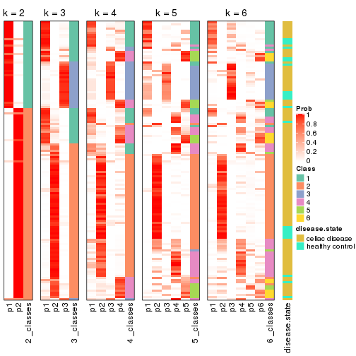


Test correlation between subgroups and known annotations. If the known
annotation is numeric, one-way ANOVA test is applied, and if the known
annotation is discrete, chi-squared contingency table test is applied.

```r
test_to_known_factors(res)
```

```
#>          n disease.state(p) k
#> CV:NMF 129           0.0397 2
#> CV:NMF 125           0.2464 3
#> CV:NMF 113           0.6645 4
#> CV:NMF 102           0.4872 5
#> CV:NMF  91           0.0705 6
```


If matrix rows can be associated to genes, consider to use `GO_Enrichment(res,
...)` to perform function enrichment for the signature genes.


 

---------------------------------------------------


### MAD:hclust


The object with results only for a single top-value method and a single partition method 
can be extracted as:

```r
res = res_list["MAD", "hclust"]
# you can also extract it by
# res = res_list["MAD:hclust"]
```

A summary of `res` and all the functions that can be applied to it:

```r
res
```

```
#> A 'ConsensusPartition' object with k = 2, 3, 4, 5, 6.
#>   On a matrix with 18032 rows and 132 columns.
#>   Top rows (1000, 2000, 3000, 4000, 5000) are extracted by 'MAD' method.
#>   Subgroups are detected by 'hclust' method.
#>   Performed in total 1250 partitions by row resampling.
#>   Best k for subgroups seems to be 3.
#> 
#> Following methods can be applied to this 'ConsensusPartition' object:
#>  [1] "cola_report"             "collect_classes"         "collect_plots"          
#>  [4] "collect_stats"           "colnames"                "compare_signatures"     
#>  [7] "consensus_heatmap"       "dimension_reduction"     "functional_enrichment"  
#> [10] "get_anno_col"            "get_anno"                "get_classes"            
#> [13] "get_consensus"           "get_matrix"              "get_membership"         
#> [16] "get_param"               "get_signatures"          "get_stats"              
#> [19] "is_best_k"               "is_stable_k"             "membership_heatmap"     
#> [22] "ncol"                    "nrow"                    "plot_ecdf"              
#> [25] "rownames"                "select_partition_number" "show"                   
#> [28] "suggest_best_k"          "test_to_known_factors"
```

`collect_plots()` function collects all the plots made from `res` for all `k` (number of partitions)
into one single page to provide an easy and fast comparison between different `k`.

```r
collect_plots(res)
```


The plots are:

- The first row: a plot of the ECDF (Empirical cumulative distribution
  function) curves of the consensus matrix for each `k` and the heatmap of
  predicted classes for each `k`.
- The second row: heatmaps of the consensus matrix for each `k`.
- The third row: heatmaps of the membership matrix for each `k`.
- The fouth row: heatmaps of the signatures for each `k`.

All the plots in panels can be made by individual functions and they are
plotted later in this section.

`select_partition_number()` produces several plots showing different
statistics for choosing "optimized" `k`. There are following statistics:

- ECDF curves of the consensus matrix for each `k`;
- 1-PAC. [The PAC
  score](https://en.wikipedia.org/wiki/Consensus_clustering#Over-interpretation_potential_of_consensus_clustering)
  measures the proportion of the ambiguous subgrouping.
- Mean silhouette score.
- Concordance. The mean probability of fiting the consensus class ids in all
  partitions.
- Area increased. Denote $A_k$ as the area under the ECDF curve for current
  `k`, the area increased is defined as $A_k - A_{k-1}$.
- Rand index. The percent of pairs of samples that are both in a same cluster
  or both are not in a same cluster in the partition of k and k-1.
- Jaccard index. The ratio of pairs of samples are both in a same cluster in
  the partition of k and k-1 and the pairs of samples are both in a same
  cluster in the partition k or k-1.

The detailed explanations of these statistics can be found in [the cola
vignette](http://bioconductor.org/packages/devel/bioc/vignettes/cola/inst/doc/cola.html#toc_13).

Generally speaking, lower PAC score, higher mean silhouette score or higher
concordance corresponds to better partition. Rand index and Jaccard index
measure how similar the current partition is compared to partition with `k-1`.
If they are too similar, we won't accept `k` is better than `k-1`.

```r
select_partition_number(res)
```


The numeric values for all these statistics can be obtained by `get_stats()`.

```r
get_stats(res)
```

```
#>   k 1-PAC mean_silhouette concordance area_increased  Rand Jaccard
#> 2 2 0.655           0.744       0.892          0.315 0.646   0.646
#> 3 3 0.532           0.782       0.871          0.514 0.910   0.862
#> 4 4 0.508           0.786       0.847          0.165 0.905   0.835
#> 5 5 0.488           0.483       0.732          0.240 0.806   0.608
#> 6 6 0.550           0.540       0.667          0.105 0.814   0.477
```

`suggest_best_k()` suggests the best $k$ based on these statistics. The rules are as follows:

- All $k$ with Jaccard index larger than 0.95 are removed because the increase of
  the partition number does not provides enough extra information. If all $k$ are removed,
  the best $k$ is assigned by `NA`.
- For $k$ with 1-PAC larger than 0.9, the maximal $k$ is taken as the "best k". Other $k$ is called "optional k".
- If it does not fit the second rule. The $k$ with the highest vote of highest
  1-PAC, mean silhouette and concordance is taken as the "best k".

```r
suggest_best_k(res)
```

```
#> [1] 3
```


Following shows the table of the partitions (You need to click the **show/hide
code output** link to see it). The membership matrix (columns with name `p*`)
is inferred by
[`clue::cl_consensus()`](https://www.rdocumentation.org/link/cl_consensus?package=clue)
function with the `SE` method. Basically the value in the membership matrix
represents the probability to belong to a certain group. The finall class
label for an item is determined with the group with highest probability it
belongs to.

In `get_classes()` function, the entropy is calculated from the membership
matrix and the silhouette score is calculated from the consensus matrix.


<script>
$( function() {
	$( '#tabs-MAD-hclust-get-classes' ).tabs();
} );
</script>
<div id='tabs-MAD-hclust-get-classes'>
<ul>
<li><a href='#tab-MAD-hclust-get-classes-1'>k = 2</a></li>
<li><a href='#tab-MAD-hclust-get-classes-2'>k = 3</a></li>
<li><a href='#tab-MAD-hclust-get-classes-3'>k = 4</a></li>
<li><a href='#tab-MAD-hclust-get-classes-4'>k = 5</a></li>
<li><a href='#tab-MAD-hclust-get-classes-5'>k = 6</a></li>
</ul>

<div id='tab-MAD-hclust-get-classes-1'>
<p><a id='tab-MAD-hclust-get-classes-1-a' style='color:#0366d6' href='#'>show/hide code output</a></p>
<pre><code class="r">cbind(get_classes(res, k = 2), get_membership(res, k = 2))
</code></pre>

<pre><code>#&gt;           class entropy silhouette    p1    p2
#&gt; GSM289470     1  0.9922     0.5492 0.552 0.448
#&gt; GSM289471     1  0.0000     0.6718 1.000 0.000
#&gt; GSM289472     2  0.0000     0.9135 0.000 1.000
#&gt; GSM289473     2  0.1414     0.9060 0.020 0.980
#&gt; GSM289474     2  0.0376     0.9123 0.004 0.996
#&gt; GSM289475     2  0.0000     0.9135 0.000 1.000
#&gt; GSM289476     1  0.0000     0.6718 1.000 0.000
#&gt; GSM289477     2  0.0000     0.9135 0.000 1.000
#&gt; GSM289478     2  0.0000     0.9135 0.000 1.000
#&gt; GSM289479     2  0.0938     0.9106 0.012 0.988
#&gt; GSM289480     2  0.0000     0.9135 0.000 1.000
#&gt; GSM289481     2  0.0672     0.9119 0.008 0.992
#&gt; GSM289482     2  0.0000     0.9135 0.000 1.000
#&gt; GSM289483     2  0.0000     0.9135 0.000 1.000
#&gt; GSM289484     2  0.0000     0.9135 0.000 1.000
#&gt; GSM289485     2  0.0000     0.9135 0.000 1.000
#&gt; GSM289486     1  0.9896     0.5601 0.560 0.440
#&gt; GSM289487     2  0.0000     0.9135 0.000 1.000
#&gt; GSM289488     2  0.0000     0.9135 0.000 1.000
#&gt; GSM289489     2  0.1184     0.9088 0.016 0.984
#&gt; GSM289490     2  0.1184     0.9081 0.016 0.984
#&gt; GSM289491     2  0.1184     0.9081 0.016 0.984
#&gt; GSM289492     2  0.1184     0.9081 0.016 0.984
#&gt; GSM289493     2  0.0000     0.9135 0.000 1.000
#&gt; GSM289494     1  0.0672     0.6726 0.992 0.008
#&gt; GSM289495     2  0.1414     0.9061 0.020 0.980
#&gt; GSM289496     2  0.0000     0.9135 0.000 1.000
#&gt; GSM289497     2  0.0000     0.9135 0.000 1.000
#&gt; GSM289498     2  0.1184     0.9081 0.016 0.984
#&gt; GSM289499     2  0.0938     0.9096 0.012 0.988
#&gt; GSM289500     1  0.0376     0.6717 0.996 0.004
#&gt; GSM289501     2  0.0000     0.9135 0.000 1.000
#&gt; GSM289502     2  0.0000     0.9135 0.000 1.000
#&gt; GSM289503     2  0.0000     0.9135 0.000 1.000
#&gt; GSM289504     2  0.0376     0.9128 0.004 0.996
#&gt; GSM289505     2  0.0376     0.9128 0.004 0.996
#&gt; GSM289506     2  0.0000     0.9135 0.000 1.000
#&gt; GSM289507     2  0.0000     0.9135 0.000 1.000
#&gt; GSM289508     2  0.3879     0.8453 0.076 0.924
#&gt; GSM289509     1  0.8608     0.6197 0.716 0.284
#&gt; GSM289510     2  0.8713     0.3913 0.292 0.708
#&gt; GSM289511     2  0.0672     0.9119 0.008 0.992
#&gt; GSM289512     1  0.0376     0.6727 0.996 0.004
#&gt; GSM289513     2  0.1184     0.9089 0.016 0.984
#&gt; GSM289514     2  0.8713     0.3913 0.292 0.708
#&gt; GSM289515     2  0.0672     0.9119 0.008 0.992
#&gt; GSM289516     2  0.0672     0.9119 0.008 0.992
#&gt; GSM289517     2  0.0672     0.9119 0.008 0.992
#&gt; GSM289518     2  0.0672     0.9119 0.008 0.992
#&gt; GSM289519     2  0.8713     0.3913 0.292 0.708
#&gt; GSM289520     2  0.0000     0.9135 0.000 1.000
#&gt; GSM289521     2  0.8713     0.3913 0.292 0.708
#&gt; GSM289522     2  0.0672     0.9119 0.008 0.992
#&gt; GSM289523     1  0.0000     0.6718 1.000 0.000
#&gt; GSM289524     2  0.1184     0.9089 0.016 0.984
#&gt; GSM289525     2  0.0672     0.9119 0.008 0.992
#&gt; GSM289526     2  0.1184     0.9089 0.016 0.984
#&gt; GSM289527     2  0.1184     0.9089 0.016 0.984
#&gt; GSM289528     2  0.0000     0.9135 0.000 1.000
#&gt; GSM289529     2  0.3584     0.8529 0.068 0.932
#&gt; GSM289530     2  0.9635    -0.0121 0.388 0.612
#&gt; GSM289531     2  0.1414     0.9060 0.020 0.980
#&gt; GSM289532     2  0.9922    -0.2416 0.448 0.552
#&gt; GSM289533     2  0.0938     0.9111 0.012 0.988
#&gt; GSM289534     1  0.1414     0.6717 0.980 0.020
#&gt; GSM289535     2  0.1184     0.9068 0.016 0.984
#&gt; GSM289536     1  0.0000     0.6718 1.000 0.000
#&gt; GSM289537     2  0.1184     0.9068 0.016 0.984
#&gt; GSM289538     2  0.1184     0.9068 0.016 0.984
#&gt; GSM289539     2  0.0000     0.9135 0.000 1.000
#&gt; GSM289540     2  0.9988    -0.3490 0.480 0.520
#&gt; GSM289541     1  0.9970     0.5124 0.532 0.468
#&gt; GSM289542     2  0.2043     0.8933 0.032 0.968
#&gt; GSM289543     2  0.0938     0.9096 0.012 0.988
#&gt; GSM289544     2  0.9248     0.2209 0.340 0.660
#&gt; GSM289545     2  0.1184     0.9068 0.016 0.984
#&gt; GSM289546     2  0.1184     0.9068 0.016 0.984
#&gt; GSM289547     2  0.0000     0.9135 0.000 1.000
#&gt; GSM289548     1  0.9993     0.4804 0.516 0.484
#&gt; GSM289549     1  0.9922     0.5492 0.552 0.448
#&gt; GSM289550     1  0.9896     0.5601 0.560 0.440
#&gt; GSM289551     1  0.0000     0.6718 1.000 0.000
#&gt; GSM289552     1  0.9993     0.4804 0.516 0.484
#&gt; GSM289553     1  1.0000     0.4535 0.504 0.496
#&gt; GSM289554     2  0.0000     0.9135 0.000 1.000
#&gt; GSM289555     2  0.0000     0.9135 0.000 1.000
#&gt; GSM289556     1  0.9998     0.4646 0.508 0.492
#&gt; GSM289557     2  0.0000     0.9135 0.000 1.000
#&gt; GSM289558     2  0.0000     0.9135 0.000 1.000
#&gt; GSM289559     1  0.9896     0.5601 0.560 0.440
#&gt; GSM289560     2  0.0000     0.9135 0.000 1.000
#&gt; GSM289561     2  0.0000     0.9135 0.000 1.000
#&gt; GSM289562     1  0.9993     0.4804 0.516 0.484
#&gt; GSM289563     1  0.9993     0.4804 0.516 0.484
#&gt; GSM289564     2  0.9608     0.0353 0.384 0.616
#&gt; GSM289565     2  0.9988    -0.3490 0.480 0.520
#&gt; GSM289566     2  0.7453     0.6183 0.212 0.788
#&gt; GSM289567     2  0.2778     0.8782 0.048 0.952
#&gt; GSM289568     2  0.0672     0.9119 0.008 0.992
#&gt; GSM289569     2  0.0672     0.9119 0.008 0.992
#&gt; GSM289570     2  0.2778     0.8782 0.048 0.952
#&gt; GSM289571     2  0.1184     0.9068 0.016 0.984
#&gt; GSM289572     2  0.0376     0.9128 0.004 0.996
#&gt; GSM289573     2  0.0000     0.9135 0.000 1.000
#&gt; GSM289574     2  0.0000     0.9135 0.000 1.000
#&gt; GSM289575     2  0.0000     0.9135 0.000 1.000
#&gt; GSM289576     2  0.0000     0.9135 0.000 1.000
#&gt; GSM289577     2  0.0938     0.9092 0.012 0.988
#&gt; GSM289578     2  0.0000     0.9135 0.000 1.000
#&gt; GSM289579     2  0.0000     0.9135 0.000 1.000
#&gt; GSM289580     1  0.0938     0.6719 0.988 0.012
#&gt; GSM289581     2  0.9635    -0.0121 0.388 0.612
#&gt; GSM289582     2  0.3114     0.8694 0.056 0.944
#&gt; GSM289583     2  0.0000     0.9135 0.000 1.000
#&gt; GSM289584     2  0.0000     0.9135 0.000 1.000
#&gt; GSM289585     2  0.0000     0.9135 0.000 1.000
#&gt; GSM289586     2  0.2043     0.8957 0.032 0.968
#&gt; GSM289587     1  0.9896     0.5601 0.560 0.440
#&gt; GSM289588     1  0.0000     0.6718 1.000 0.000
#&gt; GSM289589     1  0.9896     0.5601 0.560 0.440
#&gt; GSM289590     2  0.9983    -0.3387 0.476 0.524
#&gt; GSM289591     1  0.9896     0.5601 0.560 0.440
#&gt; GSM289592     2  0.0000     0.9135 0.000 1.000
#&gt; GSM289593     1  0.0000     0.6718 1.000 0.000
#&gt; GSM289594     2  0.0000     0.9135 0.000 1.000
#&gt; GSM289595     1  0.8608     0.6197 0.716 0.284
#&gt; GSM289596     2  0.0000     0.9135 0.000 1.000
#&gt; GSM289597     2  0.0672     0.9119 0.008 0.992
#&gt; GSM289598     2  0.3879     0.8453 0.076 0.924
#&gt; GSM289599     2  0.1414     0.9061 0.020 0.980
#&gt; GSM289600     1  1.0000     0.4535 0.504 0.496
#&gt; GSM289601     2  0.9983    -0.3387 0.476 0.524
</code></pre>

<script>
$('#tab-MAD-hclust-get-classes-1-a').parent().next().next().hide();
$('#tab-MAD-hclust-get-classes-1-a').click(function(){
  $('#tab-MAD-hclust-get-classes-1-a').parent().next().next().toggle();
  return(false);
});
</script>
</div>

<div id='tab-MAD-hclust-get-classes-2'>
<p><a id='tab-MAD-hclust-get-classes-2-a' style='color:#0366d6' href='#'>show/hide code output</a></p>
<pre><code class="r">cbind(get_classes(res, k = 3), get_membership(res, k = 3))
</code></pre>

<pre><code>#&gt;           class entropy silhouette    p1    p2    p3
#&gt; GSM289470     1   0.220      0.908 0.940 0.004 0.056
#&gt; GSM289471     3   0.319      0.653 0.112 0.000 0.888
#&gt; GSM289472     2   0.230      0.887 0.020 0.944 0.036
#&gt; GSM289473     2   0.264      0.884 0.048 0.932 0.020
#&gt; GSM289474     2   0.206      0.891 0.044 0.948 0.008
#&gt; GSM289475     2   0.256      0.889 0.028 0.936 0.036
#&gt; GSM289476     3   0.319      0.653 0.112 0.000 0.888
#&gt; GSM289477     2   0.176      0.892 0.040 0.956 0.004
#&gt; GSM289478     2   0.256      0.889 0.028 0.936 0.036
#&gt; GSM289479     2   0.228      0.886 0.052 0.940 0.008
#&gt; GSM289480     2   0.230      0.887 0.020 0.944 0.036
#&gt; GSM289481     2   0.195      0.887 0.040 0.952 0.008
#&gt; GSM289482     2   0.188      0.892 0.032 0.956 0.012
#&gt; GSM289483     2   0.176      0.892 0.040 0.956 0.004
#&gt; GSM289484     2   0.195      0.891 0.040 0.952 0.008
#&gt; GSM289485     2   0.188      0.892 0.032 0.956 0.012
#&gt; GSM289486     1   0.207      0.914 0.940 0.000 0.060
#&gt; GSM289487     2   0.256      0.889 0.028 0.936 0.036
#&gt; GSM289488     2   0.176      0.892 0.040 0.956 0.004
#&gt; GSM289489     2   0.357      0.847 0.120 0.876 0.004
#&gt; GSM289490     2   0.200      0.892 0.036 0.952 0.012
#&gt; GSM289491     2   0.200      0.892 0.036 0.952 0.012
#&gt; GSM289492     2   0.200      0.892 0.036 0.952 0.012
#&gt; GSM289493     2   0.188      0.889 0.012 0.956 0.032
#&gt; GSM289494     3   0.327      0.651 0.116 0.000 0.884
#&gt; GSM289495     2   0.464      0.842 0.084 0.856 0.060
#&gt; GSM289496     2   0.200      0.889 0.012 0.952 0.036
#&gt; GSM289497     2   0.249      0.881 0.016 0.936 0.048
#&gt; GSM289498     2   0.200      0.892 0.036 0.952 0.012
#&gt; GSM289499     2   0.327      0.875 0.044 0.912 0.044
#&gt; GSM289500     3   0.319      0.650 0.112 0.000 0.888
#&gt; GSM289501     2   0.200      0.889 0.012 0.952 0.036
#&gt; GSM289502     2   0.249      0.881 0.016 0.936 0.048
#&gt; GSM289503     2   0.238      0.884 0.016 0.940 0.044
#&gt; GSM289504     2   0.257      0.888 0.032 0.936 0.032
#&gt; GSM289505     2   0.269      0.888 0.032 0.932 0.036
#&gt; GSM289506     2   0.249      0.881 0.016 0.936 0.048
#&gt; GSM289507     2   0.249      0.881 0.016 0.936 0.048
#&gt; GSM289508     2   0.338      0.872 0.092 0.896 0.012
#&gt; GSM289509     3   0.803      0.465 0.168 0.176 0.656
#&gt; GSM289510     2   0.912      0.293 0.236 0.548 0.216
#&gt; GSM289511     2   0.195      0.887 0.040 0.952 0.008
#&gt; GSM289512     3   0.334      0.649 0.120 0.000 0.880
#&gt; GSM289513     2   0.350      0.849 0.116 0.880 0.004
#&gt; GSM289514     2   0.912      0.293 0.236 0.548 0.216
#&gt; GSM289515     2   0.195      0.887 0.040 0.952 0.008
#&gt; GSM289516     2   0.195      0.887 0.040 0.952 0.008
#&gt; GSM289517     2   0.195      0.887 0.040 0.952 0.008
#&gt; GSM289518     2   0.195      0.887 0.040 0.952 0.008
#&gt; GSM289519     2   0.912      0.293 0.236 0.548 0.216
#&gt; GSM289520     2   0.188      0.892 0.032 0.956 0.012
#&gt; GSM289521     2   0.912      0.293 0.236 0.548 0.216
#&gt; GSM289522     2   0.195      0.887 0.040 0.952 0.008
#&gt; GSM289523     3   0.319      0.653 0.112 0.000 0.888
#&gt; GSM289524     2   0.350      0.849 0.116 0.880 0.004
#&gt; GSM289525     2   0.195      0.887 0.040 0.952 0.008
#&gt; GSM289526     2   0.350      0.849 0.116 0.880 0.004
#&gt; GSM289527     2   0.350      0.849 0.116 0.880 0.004
#&gt; GSM289528     2   0.249      0.881 0.016 0.936 0.048
#&gt; GSM289529     2   0.564      0.767 0.180 0.784 0.036
#&gt; GSM289530     2   0.981     -0.158 0.252 0.416 0.332
#&gt; GSM289531     2   0.264      0.884 0.048 0.932 0.020
#&gt; GSM289532     3   0.972      0.294 0.236 0.328 0.436
#&gt; GSM289533     2   0.227      0.890 0.040 0.944 0.016
#&gt; GSM289534     3   0.361      0.644 0.112 0.008 0.880
#&gt; GSM289535     2   0.277      0.884 0.048 0.928 0.024
#&gt; GSM289536     3   0.319      0.653 0.112 0.000 0.888
#&gt; GSM289537     2   0.277      0.886 0.048 0.928 0.024
#&gt; GSM289538     2   0.277      0.886 0.048 0.928 0.024
#&gt; GSM289539     2   0.249      0.881 0.016 0.936 0.048
#&gt; GSM289540     3   0.981      0.308 0.268 0.304 0.428
#&gt; GSM289541     1   0.318      0.892 0.912 0.024 0.064
#&gt; GSM289542     2   0.323      0.878 0.072 0.908 0.020
#&gt; GSM289543     2   0.304      0.880 0.040 0.920 0.040
#&gt; GSM289544     2   0.867      0.221 0.384 0.508 0.108
#&gt; GSM289545     2   0.311      0.880 0.056 0.916 0.028
#&gt; GSM289546     2   0.311      0.880 0.056 0.916 0.028
#&gt; GSM289547     2   0.249      0.881 0.016 0.936 0.048
#&gt; GSM289548     1   0.290      0.891 0.920 0.016 0.064
#&gt; GSM289549     1   0.220      0.908 0.940 0.004 0.056
#&gt; GSM289550     1   0.207      0.914 0.940 0.000 0.060
#&gt; GSM289551     3   0.319      0.653 0.112 0.000 0.888
#&gt; GSM289552     1   0.300      0.892 0.916 0.016 0.068
#&gt; GSM289553     1   0.393      0.856 0.880 0.028 0.092
#&gt; GSM289554     2   0.232      0.891 0.028 0.944 0.028
#&gt; GSM289555     2   0.255      0.882 0.012 0.932 0.056
#&gt; GSM289556     1   0.355      0.872 0.896 0.024 0.080
#&gt; GSM289557     2   0.183      0.888 0.008 0.956 0.036
#&gt; GSM289558     2   0.200      0.889 0.012 0.952 0.036
#&gt; GSM289559     1   0.207      0.914 0.940 0.000 0.060
#&gt; GSM289560     2   0.255      0.882 0.012 0.932 0.056
#&gt; GSM289561     2   0.255      0.882 0.012 0.932 0.056
#&gt; GSM289562     1   0.290      0.891 0.920 0.016 0.064
#&gt; GSM289563     1   0.290      0.891 0.920 0.016 0.064
#&gt; GSM289564     2   0.976     -0.229 0.232 0.412 0.356
#&gt; GSM289565     3   0.981      0.308 0.268 0.304 0.428
#&gt; GSM289566     2   0.779      0.594 0.192 0.672 0.136
#&gt; GSM289567     2   0.480      0.802 0.156 0.824 0.020
#&gt; GSM289568     2   0.195      0.887 0.040 0.952 0.008
#&gt; GSM289569     2   0.195      0.887 0.040 0.952 0.008
#&gt; GSM289570     2   0.480      0.802 0.156 0.824 0.020
#&gt; GSM289571     2   0.277      0.886 0.048 0.928 0.024
#&gt; GSM289572     2   0.269      0.888 0.032 0.932 0.036
#&gt; GSM289573     2   0.195      0.888 0.008 0.952 0.040
#&gt; GSM289574     2   0.249      0.881 0.016 0.936 0.048
#&gt; GSM289575     2   0.200      0.889 0.012 0.952 0.036
#&gt; GSM289576     2   0.212      0.888 0.012 0.948 0.040
#&gt; GSM289577     2   0.256      0.892 0.036 0.936 0.028
#&gt; GSM289578     2   0.200      0.889 0.012 0.952 0.036
#&gt; GSM289579     2   0.200      0.889 0.012 0.952 0.036
#&gt; GSM289580     3   0.335      0.649 0.108 0.004 0.888
#&gt; GSM289581     2   0.981     -0.158 0.252 0.416 0.332
#&gt; GSM289582     2   0.511      0.793 0.168 0.808 0.024
#&gt; GSM289583     2   0.249      0.881 0.016 0.936 0.048
#&gt; GSM289584     2   0.200      0.889 0.012 0.952 0.036
#&gt; GSM289585     2   0.249      0.881 0.016 0.936 0.048
#&gt; GSM289586     2   0.429      0.818 0.152 0.840 0.008
#&gt; GSM289587     1   0.207      0.914 0.940 0.000 0.060
#&gt; GSM289588     3   0.319      0.653 0.112 0.000 0.888
#&gt; GSM289589     1   0.207      0.914 0.940 0.000 0.060
#&gt; GSM289590     3   0.989      0.290 0.288 0.304 0.408
#&gt; GSM289591     1   0.207      0.914 0.940 0.000 0.060
#&gt; GSM289592     2   0.255      0.882 0.012 0.932 0.056
#&gt; GSM289593     3   0.319      0.653 0.112 0.000 0.888
#&gt; GSM289594     2   0.200      0.889 0.012 0.952 0.036
#&gt; GSM289595     3   0.803      0.465 0.168 0.176 0.656
#&gt; GSM289596     2   0.200      0.889 0.012 0.952 0.036
#&gt; GSM289597     2   0.195      0.887 0.040 0.952 0.008
#&gt; GSM289598     2   0.338      0.872 0.092 0.896 0.012
#&gt; GSM289599     2   0.464      0.842 0.084 0.856 0.060
#&gt; GSM289600     1   0.393      0.856 0.880 0.028 0.092
#&gt; GSM289601     3   0.989      0.290 0.288 0.304 0.408
</code></pre>

<script>
$('#tab-MAD-hclust-get-classes-2-a').parent().next().next().hide();
$('#tab-MAD-hclust-get-classes-2-a').click(function(){
  $('#tab-MAD-hclust-get-classes-2-a').parent().next().next().toggle();
  return(false);
});
</script>
</div>

<div id='tab-MAD-hclust-get-classes-3'>
<p><a id='tab-MAD-hclust-get-classes-3-a' style='color:#0366d6' href='#'>show/hide code output</a></p>
<pre><code class="r">cbind(get_classes(res, k = 4), get_membership(res, k = 4))
</code></pre>

<pre><code>#&gt;           class entropy silhouette    p1    p2    p3    p4
#&gt; GSM289470     1  0.0376     0.9048 0.992 0.004 0.000 0.004
#&gt; GSM289471     3  0.0657     0.9196 0.012 0.000 0.984 0.004
#&gt; GSM289472     2  0.2164     0.8490 0.004 0.924 0.004 0.068
#&gt; GSM289473     2  0.3342     0.8138 0.032 0.868 0.000 0.100
#&gt; GSM289474     2  0.2730     0.8503 0.016 0.896 0.000 0.088
#&gt; GSM289475     2  0.2452     0.8532 0.004 0.908 0.004 0.084
#&gt; GSM289476     3  0.0657     0.9196 0.012 0.000 0.984 0.004
#&gt; GSM289477     2  0.2542     0.8515 0.012 0.904 0.000 0.084
#&gt; GSM289478     2  0.2452     0.8532 0.004 0.908 0.004 0.084
#&gt; GSM289479     2  0.2845     0.8414 0.028 0.896 0.000 0.076
#&gt; GSM289480     2  0.2164     0.8490 0.004 0.924 0.004 0.068
#&gt; GSM289481     2  0.2385     0.8433 0.028 0.920 0.000 0.052
#&gt; GSM289482     2  0.2654     0.8450 0.004 0.888 0.000 0.108
#&gt; GSM289483     2  0.2542     0.8515 0.012 0.904 0.000 0.084
#&gt; GSM289484     2  0.2610     0.8508 0.012 0.900 0.000 0.088
#&gt; GSM289485     2  0.2654     0.8450 0.004 0.888 0.000 0.108
#&gt; GSM289486     1  0.0000     0.9097 1.000 0.000 0.000 0.000
#&gt; GSM289487     2  0.2452     0.8532 0.004 0.908 0.004 0.084
#&gt; GSM289488     2  0.2542     0.8515 0.012 0.904 0.000 0.084
#&gt; GSM289489     2  0.5102     0.6377 0.048 0.732 0.000 0.220
#&gt; GSM289490     2  0.2555     0.8569 0.032 0.920 0.008 0.040
#&gt; GSM289491     2  0.2555     0.8569 0.032 0.920 0.008 0.040
#&gt; GSM289492     2  0.2555     0.8569 0.032 0.920 0.008 0.040
#&gt; GSM289493     2  0.2125     0.8535 0.000 0.920 0.004 0.076
#&gt; GSM289494     3  0.1151     0.9132 0.024 0.000 0.968 0.008
#&gt; GSM289495     2  0.4511     0.6619 0.000 0.724 0.008 0.268
#&gt; GSM289496     2  0.2197     0.8525 0.000 0.916 0.004 0.080
#&gt; GSM289497     2  0.2401     0.8396 0.000 0.904 0.004 0.092
#&gt; GSM289498     2  0.2555     0.8569 0.032 0.920 0.008 0.040
#&gt; GSM289499     2  0.3539     0.7902 0.000 0.820 0.004 0.176
#&gt; GSM289500     3  0.1042     0.9146 0.020 0.000 0.972 0.008
#&gt; GSM289501     2  0.2197     0.8525 0.000 0.916 0.004 0.080
#&gt; GSM289502     2  0.2401     0.8396 0.000 0.904 0.004 0.092
#&gt; GSM289503     2  0.2266     0.8433 0.000 0.912 0.004 0.084
#&gt; GSM289504     2  0.2593     0.8415 0.000 0.892 0.004 0.104
#&gt; GSM289505     2  0.2654     0.8416 0.000 0.888 0.004 0.108
#&gt; GSM289506     2  0.2401     0.8396 0.000 0.904 0.004 0.092
#&gt; GSM289507     2  0.2401     0.8396 0.000 0.904 0.004 0.092
#&gt; GSM289508     2  0.3629     0.8368 0.076 0.868 0.008 0.048
#&gt; GSM289509     3  0.6296     0.3571 0.036 0.012 0.532 0.420
#&gt; GSM289510     4  0.7627     0.4995 0.040 0.404 0.084 0.472
#&gt; GSM289511     2  0.2385     0.8433 0.028 0.920 0.000 0.052
#&gt; GSM289512     3  0.0817     0.9148 0.024 0.000 0.976 0.000
#&gt; GSM289513     2  0.4880     0.6695 0.052 0.760 0.000 0.188
#&gt; GSM289514     4  0.7598     0.5387 0.040 0.384 0.084 0.492
#&gt; GSM289515     2  0.2385     0.8433 0.028 0.920 0.000 0.052
#&gt; GSM289516     2  0.2466     0.8417 0.028 0.916 0.000 0.056
#&gt; GSM289517     2  0.2385     0.8433 0.028 0.920 0.000 0.052
#&gt; GSM289518     2  0.2385     0.8433 0.028 0.920 0.000 0.052
#&gt; GSM289519     4  0.7631     0.4901 0.040 0.408 0.084 0.468
#&gt; GSM289520     2  0.2831     0.8391 0.004 0.876 0.000 0.120
#&gt; GSM289521     4  0.7598     0.5387 0.040 0.384 0.084 0.492
#&gt; GSM289522     2  0.2385     0.8433 0.028 0.920 0.000 0.052
#&gt; GSM289523     3  0.0657     0.9196 0.012 0.000 0.984 0.004
#&gt; GSM289524     2  0.4880     0.6695 0.052 0.760 0.000 0.188
#&gt; GSM289525     2  0.2385     0.8433 0.028 0.920 0.000 0.052
#&gt; GSM289526     2  0.4880     0.6695 0.052 0.760 0.000 0.188
#&gt; GSM289527     2  0.4880     0.6695 0.052 0.760 0.000 0.188
#&gt; GSM289528     2  0.2401     0.8396 0.000 0.904 0.004 0.092
#&gt; GSM289529     2  0.5970     0.3335 0.052 0.600 0.000 0.348
#&gt; GSM289530     4  0.6965     0.6470 0.052 0.232 0.072 0.644
#&gt; GSM289531     2  0.3342     0.8138 0.032 0.868 0.000 0.100
#&gt; GSM289532     4  0.3341     0.5157 0.004 0.048 0.068 0.880
#&gt; GSM289533     2  0.3307     0.8277 0.028 0.868 0.000 0.104
#&gt; GSM289534     3  0.1821     0.9006 0.032 0.008 0.948 0.012
#&gt; GSM289535     2  0.3128     0.8264 0.004 0.864 0.004 0.128
#&gt; GSM289536     3  0.0657     0.9196 0.012 0.000 0.984 0.004
#&gt; GSM289537     2  0.3415     0.8294 0.008 0.856 0.008 0.128
#&gt; GSM289538     2  0.3415     0.8294 0.008 0.856 0.008 0.128
#&gt; GSM289539     2  0.2401     0.8396 0.000 0.904 0.004 0.092
#&gt; GSM289540     4  0.3472     0.4874 0.008 0.024 0.100 0.868
#&gt; GSM289541     1  0.1151     0.8925 0.968 0.024 0.000 0.008
#&gt; GSM289542     2  0.3736     0.8199 0.024 0.844 0.004 0.128
#&gt; GSM289543     2  0.3257     0.8135 0.000 0.844 0.004 0.152
#&gt; GSM289544     4  0.8348     0.4833 0.220 0.360 0.024 0.396
#&gt; GSM289545     2  0.3380     0.8203 0.008 0.852 0.004 0.136
#&gt; GSM289546     2  0.3380     0.8203 0.008 0.852 0.004 0.136
#&gt; GSM289547     2  0.2401     0.8396 0.000 0.904 0.004 0.092
#&gt; GSM289548     1  0.3324     0.8810 0.852 0.012 0.000 0.136
#&gt; GSM289549     1  0.0376     0.9048 0.992 0.004 0.000 0.004
#&gt; GSM289550     1  0.0000     0.9097 1.000 0.000 0.000 0.000
#&gt; GSM289551     3  0.0657     0.9196 0.012 0.000 0.984 0.004
#&gt; GSM289552     1  0.3217     0.8840 0.860 0.012 0.000 0.128
#&gt; GSM289553     1  0.4479     0.8435 0.804 0.016 0.024 0.156
#&gt; GSM289554     2  0.2466     0.8474 0.000 0.900 0.004 0.096
#&gt; GSM289555     2  0.2675     0.8414 0.000 0.892 0.008 0.100
#&gt; GSM289556     1  0.4050     0.8607 0.824 0.012 0.016 0.148
#&gt; GSM289557     2  0.1743     0.8544 0.000 0.940 0.004 0.056
#&gt; GSM289558     2  0.2197     0.8525 0.000 0.916 0.004 0.080
#&gt; GSM289559     1  0.0000     0.9097 1.000 0.000 0.000 0.000
#&gt; GSM289560     2  0.2675     0.8414 0.000 0.892 0.008 0.100
#&gt; GSM289561     2  0.2675     0.8414 0.000 0.892 0.008 0.100
#&gt; GSM289562     1  0.3324     0.8810 0.852 0.012 0.000 0.136
#&gt; GSM289563     1  0.3324     0.8810 0.852 0.012 0.000 0.136
#&gt; GSM289564     4  0.3653     0.5466 0.000 0.128 0.028 0.844
#&gt; GSM289565     4  0.3472     0.4874 0.008 0.024 0.100 0.868
#&gt; GSM289566     2  0.8060     0.0626 0.052 0.536 0.140 0.272
#&gt; GSM289567     2  0.5407     0.4901 0.036 0.668 0.000 0.296
#&gt; GSM289568     2  0.2385     0.8433 0.028 0.920 0.000 0.052
#&gt; GSM289569     2  0.2466     0.8417 0.028 0.916 0.000 0.056
#&gt; GSM289570     2  0.5407     0.4901 0.036 0.668 0.000 0.296
#&gt; GSM289571     2  0.3415     0.8294 0.008 0.856 0.008 0.128
#&gt; GSM289572     2  0.2593     0.8424 0.000 0.892 0.004 0.104
#&gt; GSM289573     2  0.1902     0.8532 0.000 0.932 0.004 0.064
#&gt; GSM289574     2  0.2401     0.8396 0.000 0.904 0.004 0.092
#&gt; GSM289575     2  0.2401     0.8534 0.000 0.904 0.004 0.092
#&gt; GSM289576     2  0.2197     0.8537 0.000 0.916 0.004 0.080
#&gt; GSM289577     2  0.2831     0.8453 0.000 0.876 0.004 0.120
#&gt; GSM289578     2  0.2401     0.8534 0.000 0.904 0.004 0.092
#&gt; GSM289579     2  0.2401     0.8534 0.000 0.904 0.004 0.092
#&gt; GSM289580     3  0.1575     0.9076 0.028 0.004 0.956 0.012
#&gt; GSM289581     4  0.6965     0.6470 0.052 0.232 0.072 0.644
#&gt; GSM289582     2  0.5866     0.4085 0.052 0.624 0.000 0.324
#&gt; GSM289583     2  0.2334     0.8407 0.000 0.908 0.004 0.088
#&gt; GSM289584     2  0.2197     0.8525 0.000 0.916 0.004 0.080
#&gt; GSM289585     2  0.2401     0.8396 0.000 0.904 0.004 0.092
#&gt; GSM289586     2  0.5759     0.5019 0.064 0.668 0.000 0.268
#&gt; GSM289587     1  0.0000     0.9097 1.000 0.000 0.000 0.000
#&gt; GSM289588     3  0.0657     0.9196 0.012 0.000 0.984 0.004
#&gt; GSM289589     1  0.0000     0.9097 1.000 0.000 0.000 0.000
#&gt; GSM289590     4  0.3846     0.4956 0.028 0.024 0.088 0.860
#&gt; GSM289591     1  0.0000     0.9097 1.000 0.000 0.000 0.000
#&gt; GSM289592     2  0.2675     0.8414 0.000 0.892 0.008 0.100
#&gt; GSM289593     3  0.0657     0.9196 0.012 0.000 0.984 0.004
#&gt; GSM289594     2  0.2266     0.8513 0.000 0.912 0.004 0.084
#&gt; GSM289595     3  0.6296     0.3571 0.036 0.012 0.532 0.420
#&gt; GSM289596     2  0.2053     0.8545 0.000 0.924 0.004 0.072
#&gt; GSM289597     2  0.2385     0.8433 0.028 0.920 0.000 0.052
#&gt; GSM289598     2  0.3629     0.8368 0.076 0.868 0.008 0.048
#&gt; GSM289599     2  0.4511     0.6619 0.000 0.724 0.008 0.268
#&gt; GSM289600     1  0.4479     0.8435 0.804 0.016 0.024 0.156
#&gt; GSM289601     4  0.3846     0.4956 0.028 0.024 0.088 0.860
</code></pre>

<script>
$('#tab-MAD-hclust-get-classes-3-a').parent().next().next().hide();
$('#tab-MAD-hclust-get-classes-3-a').click(function(){
  $('#tab-MAD-hclust-get-classes-3-a').parent().next().next().toggle();
  return(false);
});
</script>
</div>

<div id='tab-MAD-hclust-get-classes-4'>
<p><a id='tab-MAD-hclust-get-classes-4-a' style='color:#0366d6' href='#'>show/hide code output</a></p>
<pre><code class="r">cbind(get_classes(res, k = 5), get_membership(res, k = 5))
</code></pre>

<pre><code>#&gt;           class entropy silhouette    p1    p2    p3    p4    p5
#&gt; GSM289470     1  0.0510     0.8958 0.984 0.000 0.000 0.016 0.000
#&gt; GSM289471     3  0.0290     0.9867 0.000 0.000 0.992 0.000 0.008
#&gt; GSM289472     2  0.4161     0.1774 0.000 0.608 0.000 0.392 0.000
#&gt; GSM289473     4  0.4723     0.4325 0.000 0.448 0.000 0.536 0.016
#&gt; GSM289474     2  0.4748     0.2994 0.000 0.660 0.000 0.300 0.040
#&gt; GSM289475     2  0.4126     0.1553 0.000 0.620 0.000 0.380 0.000
#&gt; GSM289476     3  0.0290     0.9867 0.000 0.000 0.992 0.000 0.008
#&gt; GSM289477     2  0.4687     0.3331 0.000 0.672 0.000 0.288 0.040
#&gt; GSM289478     2  0.4138     0.1500 0.000 0.616 0.000 0.384 0.000
#&gt; GSM289479     2  0.4307    -0.3869 0.000 0.500 0.000 0.500 0.000
#&gt; GSM289480     2  0.4161     0.1774 0.000 0.608 0.000 0.392 0.000
#&gt; GSM289481     2  0.4307    -0.3745 0.000 0.500 0.000 0.500 0.000
#&gt; GSM289482     2  0.4863     0.3640 0.000 0.672 0.000 0.272 0.056
#&gt; GSM289483     2  0.4687     0.3331 0.000 0.672 0.000 0.288 0.040
#&gt; GSM289484     2  0.4708     0.3254 0.000 0.668 0.000 0.292 0.040
#&gt; GSM289485     2  0.4863     0.3640 0.000 0.672 0.000 0.272 0.056
#&gt; GSM289486     1  0.0000     0.9036 1.000 0.000 0.000 0.000 0.000
#&gt; GSM289487     2  0.4138     0.1500 0.000 0.616 0.000 0.384 0.000
#&gt; GSM289488     2  0.4687     0.3331 0.000 0.672 0.000 0.288 0.040
#&gt; GSM289489     4  0.3612     0.5017 0.000 0.268 0.000 0.732 0.000
#&gt; GSM289490     2  0.4580     0.3647 0.008 0.628 0.008 0.356 0.000
#&gt; GSM289491     2  0.4580     0.3647 0.008 0.628 0.008 0.356 0.000
#&gt; GSM289492     2  0.4580     0.3647 0.008 0.628 0.008 0.356 0.000
#&gt; GSM289493     2  0.0510     0.5289 0.000 0.984 0.000 0.016 0.000
#&gt; GSM289494     3  0.0613     0.9784 0.008 0.004 0.984 0.000 0.004
#&gt; GSM289495     2  0.5764     0.3106 0.000 0.612 0.000 0.152 0.236
#&gt; GSM289496     2  0.0404     0.5292 0.000 0.988 0.000 0.012 0.000
#&gt; GSM289497     2  0.4273     0.2348 0.000 0.552 0.000 0.448 0.000
#&gt; GSM289498     2  0.4580     0.3647 0.008 0.628 0.008 0.356 0.000
#&gt; GSM289499     2  0.5074     0.4000 0.000 0.700 0.000 0.168 0.132
#&gt; GSM289500     3  0.0486     0.9804 0.004 0.004 0.988 0.000 0.004
#&gt; GSM289501     2  0.0404     0.5292 0.000 0.988 0.000 0.012 0.000
#&gt; GSM289502     2  0.4273     0.2348 0.000 0.552 0.000 0.448 0.000
#&gt; GSM289503     2  0.4262     0.2466 0.000 0.560 0.000 0.440 0.000
#&gt; GSM289504     2  0.3780     0.4707 0.000 0.808 0.000 0.132 0.060
#&gt; GSM289505     2  0.3601     0.4765 0.000 0.820 0.000 0.128 0.052
#&gt; GSM289506     2  0.4273     0.2348 0.000 0.552 0.000 0.448 0.000
#&gt; GSM289507     2  0.4273     0.2348 0.000 0.552 0.000 0.448 0.000
#&gt; GSM289508     2  0.6135     0.3214 0.064 0.576 0.008 0.328 0.024
#&gt; GSM289509     5  0.5477     0.0315 0.024 0.004 0.448 0.016 0.508
#&gt; GSM289510     4  0.7050    -0.3716 0.024 0.184 0.000 0.396 0.396
#&gt; GSM289511     4  0.4305     0.3968 0.000 0.488 0.000 0.512 0.000
#&gt; GSM289512     3  0.0290     0.9805 0.008 0.000 0.992 0.000 0.000
#&gt; GSM289513     4  0.3305     0.4857 0.000 0.224 0.000 0.776 0.000
#&gt; GSM289514     5  0.6988     0.3440 0.024 0.172 0.000 0.392 0.412
#&gt; GSM289515     4  0.4305     0.3968 0.000 0.488 0.000 0.512 0.000
#&gt; GSM289516     4  0.4300     0.3995 0.000 0.476 0.000 0.524 0.000
#&gt; GSM289517     4  0.4305     0.3968 0.000 0.488 0.000 0.512 0.000
#&gt; GSM289518     4  0.4305     0.3968 0.000 0.488 0.000 0.512 0.000
#&gt; GSM289519     5  0.7069     0.2856 0.024 0.188 0.000 0.392 0.396
#&gt; GSM289520     2  0.5040     0.3564 0.000 0.660 0.000 0.272 0.068
#&gt; GSM289521     5  0.6988     0.3440 0.024 0.172 0.000 0.392 0.412
#&gt; GSM289522     4  0.4305     0.3968 0.000 0.488 0.000 0.512 0.000
#&gt; GSM289523     3  0.0290     0.9867 0.000 0.000 0.992 0.000 0.008
#&gt; GSM289524     4  0.3274     0.4867 0.000 0.220 0.000 0.780 0.000
#&gt; GSM289525     4  0.4305     0.3968 0.000 0.488 0.000 0.512 0.000
#&gt; GSM289526     4  0.3274     0.4867 0.000 0.220 0.000 0.780 0.000
#&gt; GSM289527     4  0.3274     0.4867 0.000 0.220 0.000 0.780 0.000
#&gt; GSM289528     2  0.4278     0.2111 0.000 0.548 0.000 0.452 0.000
#&gt; GSM289529     4  0.4822     0.4323 0.000 0.220 0.000 0.704 0.076
#&gt; GSM289530     5  0.7005     0.5260 0.020 0.140 0.012 0.352 0.476
#&gt; GSM289531     4  0.4723     0.4325 0.000 0.448 0.000 0.536 0.016
#&gt; GSM289532     5  0.2140     0.6034 0.000 0.024 0.012 0.040 0.924
#&gt; GSM289533     4  0.4713     0.4303 0.000 0.440 0.000 0.544 0.016
#&gt; GSM289534     3  0.1340     0.9610 0.016 0.004 0.960 0.004 0.016
#&gt; GSM289535     2  0.4868     0.4016 0.004 0.720 0.000 0.192 0.084
#&gt; GSM289536     3  0.0290     0.9867 0.000 0.000 0.992 0.000 0.008
#&gt; GSM289537     2  0.4732     0.4085 0.000 0.716 0.000 0.208 0.076
#&gt; GSM289538     2  0.4763     0.4041 0.000 0.712 0.000 0.212 0.076
#&gt; GSM289539     2  0.4273     0.2348 0.000 0.552 0.000 0.448 0.000
#&gt; GSM289540     5  0.0162     0.5964 0.004 0.000 0.000 0.000 0.996
#&gt; GSM289541     1  0.0992     0.8822 0.968 0.024 0.000 0.000 0.008
#&gt; GSM289542     2  0.5398     0.3735 0.020 0.692 0.000 0.200 0.088
#&gt; GSM289543     2  0.5013     0.3902 0.000 0.700 0.000 0.192 0.108
#&gt; GSM289544     4  0.8406    -0.3498 0.204 0.160 0.004 0.384 0.248
#&gt; GSM289545     2  0.4982     0.3733 0.000 0.692 0.000 0.220 0.088
#&gt; GSM289546     2  0.4982     0.3733 0.000 0.692 0.000 0.220 0.088
#&gt; GSM289547     2  0.4268     0.2385 0.000 0.556 0.000 0.444 0.000
#&gt; GSM289548     1  0.2953     0.8704 0.844 0.000 0.000 0.012 0.144
#&gt; GSM289549     1  0.0510     0.8958 0.984 0.000 0.000 0.016 0.000
#&gt; GSM289550     1  0.0000     0.9036 1.000 0.000 0.000 0.000 0.000
#&gt; GSM289551     3  0.0290     0.9867 0.000 0.000 0.992 0.000 0.008
#&gt; GSM289552     1  0.2753     0.8740 0.856 0.000 0.000 0.008 0.136
#&gt; GSM289553     1  0.3439     0.8316 0.800 0.000 0.004 0.008 0.188
#&gt; GSM289554     2  0.3460     0.4796 0.000 0.828 0.000 0.128 0.044
#&gt; GSM289555     2  0.3210     0.4616 0.000 0.788 0.000 0.212 0.000
#&gt; GSM289556     1  0.3132     0.8498 0.820 0.000 0.000 0.008 0.172
#&gt; GSM289557     2  0.2891     0.4844 0.000 0.824 0.000 0.176 0.000
#&gt; GSM289558     2  0.0404     0.5292 0.000 0.988 0.000 0.012 0.000
#&gt; GSM289559     1  0.0000     0.9036 1.000 0.000 0.000 0.000 0.000
#&gt; GSM289560     2  0.3210     0.4616 0.000 0.788 0.000 0.212 0.000
#&gt; GSM289561     2  0.3210     0.4616 0.000 0.788 0.000 0.212 0.000
#&gt; GSM289562     1  0.2953     0.8704 0.844 0.000 0.000 0.012 0.144
#&gt; GSM289563     1  0.2953     0.8704 0.844 0.000 0.000 0.012 0.144
#&gt; GSM289564     5  0.3339     0.5722 0.000 0.112 0.000 0.048 0.840
#&gt; GSM289565     5  0.0162     0.5964 0.004 0.000 0.000 0.000 0.996
#&gt; GSM289566     4  0.7307     0.2171 0.016 0.196 0.152 0.568 0.068
#&gt; GSM289567     4  0.5004     0.4969 0.000 0.256 0.000 0.672 0.072
#&gt; GSM289568     4  0.4305     0.3968 0.000 0.488 0.000 0.512 0.000
#&gt; GSM289569     4  0.4300     0.3995 0.000 0.476 0.000 0.524 0.000
#&gt; GSM289570     4  0.5004     0.4969 0.000 0.256 0.000 0.672 0.072
#&gt; GSM289571     2  0.4763     0.4041 0.000 0.712 0.000 0.212 0.076
#&gt; GSM289572     2  0.3647     0.4747 0.000 0.816 0.000 0.132 0.052
#&gt; GSM289573     2  0.2929     0.4772 0.000 0.820 0.000 0.180 0.000
#&gt; GSM289574     2  0.4273     0.2348 0.000 0.552 0.000 0.448 0.000
#&gt; GSM289575     2  0.0693     0.5293 0.000 0.980 0.000 0.008 0.012
#&gt; GSM289576     2  0.0794     0.5257 0.000 0.972 0.000 0.028 0.000
#&gt; GSM289577     2  0.3921     0.4516 0.000 0.784 0.000 0.172 0.044
#&gt; GSM289578     2  0.0693     0.5293 0.000 0.980 0.000 0.008 0.012
#&gt; GSM289579     2  0.0693     0.5293 0.000 0.980 0.000 0.008 0.012
#&gt; GSM289580     3  0.1074     0.9676 0.012 0.004 0.968 0.000 0.016
#&gt; GSM289581     5  0.7005     0.5260 0.020 0.140 0.012 0.352 0.476
#&gt; GSM289582     4  0.4490     0.4716 0.000 0.224 0.000 0.724 0.052
#&gt; GSM289583     2  0.4268     0.2409 0.000 0.556 0.000 0.444 0.000
#&gt; GSM289584     2  0.0404     0.5292 0.000 0.988 0.000 0.012 0.000
#&gt; GSM289585     2  0.4273     0.2348 0.000 0.552 0.000 0.448 0.000
#&gt; GSM289586     4  0.3366     0.5000 0.004 0.212 0.000 0.784 0.000
#&gt; GSM289587     1  0.0000     0.9036 1.000 0.000 0.000 0.000 0.000
#&gt; GSM289588     3  0.0290     0.9867 0.000 0.000 0.992 0.000 0.008
#&gt; GSM289589     1  0.0000     0.9036 1.000 0.000 0.000 0.000 0.000
#&gt; GSM289590     5  0.1012     0.5943 0.020 0.000 0.000 0.012 0.968
#&gt; GSM289591     1  0.0000     0.9036 1.000 0.000 0.000 0.000 0.000
#&gt; GSM289592     2  0.3210     0.4616 0.000 0.788 0.000 0.212 0.000
#&gt; GSM289593     3  0.0290     0.9867 0.000 0.000 0.992 0.000 0.008
#&gt; GSM289594     2  0.0162     0.5301 0.000 0.996 0.000 0.004 0.000
#&gt; GSM289595     5  0.5477     0.0315 0.024 0.004 0.448 0.016 0.508
#&gt; GSM289596     2  0.0794     0.5276 0.000 0.972 0.000 0.028 0.000
#&gt; GSM289597     4  0.4305     0.3968 0.000 0.488 0.000 0.512 0.000
#&gt; GSM289598     2  0.6135     0.3214 0.064 0.576 0.008 0.328 0.024
#&gt; GSM289599     2  0.5764     0.3106 0.000 0.612 0.000 0.152 0.236
#&gt; GSM289600     1  0.3439     0.8316 0.800 0.000 0.004 0.008 0.188
#&gt; GSM289601     5  0.1012     0.5943 0.020 0.000 0.000 0.012 0.968
</code></pre>

<script>
$('#tab-MAD-hclust-get-classes-4-a').parent().next().next().hide();
$('#tab-MAD-hclust-get-classes-4-a').click(function(){
  $('#tab-MAD-hclust-get-classes-4-a').parent().next().next().toggle();
  return(false);
});
</script>
</div>

<div id='tab-MAD-hclust-get-classes-5'>
<p><a id='tab-MAD-hclust-get-classes-5-a' style='color:#0366d6' href='#'>show/hide code output</a></p>
<pre><code class="r">cbind(get_classes(res, k = 6), get_membership(res, k = 6))
</code></pre>

<pre><code>#&gt;           class entropy silhouette    p1    p2    p3    p4    p5    p6
#&gt; GSM289470     1  0.0665     0.8956 0.980 0.004 0.000 0.008 0.008 0.000
#&gt; GSM289471     3  0.0146     0.8945 0.000 0.004 0.996 0.000 0.000 0.000
#&gt; GSM289472     5  0.2985     0.5837 0.000 0.100 0.000 0.056 0.844 0.000
#&gt; GSM289473     5  0.5788     0.3523 0.000 0.164 0.000 0.348 0.484 0.004
#&gt; GSM289474     2  0.6233    -0.0601 0.000 0.428 0.000 0.164 0.384 0.024
#&gt; GSM289475     5  0.3790     0.5591 0.000 0.156 0.000 0.072 0.772 0.000
#&gt; GSM289476     3  0.0000     0.8945 0.000 0.000 1.000 0.000 0.000 0.000
#&gt; GSM289477     2  0.6193    -0.0338 0.000 0.428 0.000 0.156 0.392 0.024
#&gt; GSM289478     5  0.3825     0.5588 0.000 0.160 0.000 0.072 0.768 0.000
#&gt; GSM289479     5  0.5752     0.4476 0.000 0.184 0.000 0.288 0.524 0.004
#&gt; GSM289480     5  0.2985     0.5837 0.000 0.100 0.000 0.056 0.844 0.000
#&gt; GSM289481     5  0.5609     0.4739 0.000 0.168 0.000 0.276 0.552 0.004
#&gt; GSM289482     2  0.5848     0.2483 0.000 0.540 0.000 0.108 0.320 0.032
#&gt; GSM289483     2  0.6193    -0.0338 0.000 0.428 0.000 0.156 0.392 0.024
#&gt; GSM289484     2  0.6191    -0.0379 0.000 0.432 0.000 0.156 0.388 0.024
#&gt; GSM289485     2  0.5848     0.2483 0.000 0.540 0.000 0.108 0.320 0.032
#&gt; GSM289486     1  0.0000     0.9012 1.000 0.000 0.000 0.000 0.000 0.000
#&gt; GSM289487     5  0.3825     0.5588 0.000 0.160 0.000 0.072 0.768 0.000
#&gt; GSM289488     2  0.6193    -0.0338 0.000 0.428 0.000 0.156 0.392 0.024
#&gt; GSM289489     4  0.5536     0.4997 0.000 0.164 0.000 0.536 0.300 0.000
#&gt; GSM289490     2  0.2994     0.5326 0.000 0.788 0.000 0.208 0.004 0.000
#&gt; GSM289491     2  0.2994     0.5326 0.000 0.788 0.000 0.208 0.004 0.000
#&gt; GSM289492     2  0.2994     0.5326 0.000 0.788 0.000 0.208 0.004 0.000
#&gt; GSM289493     2  0.3727     0.4900 0.000 0.612 0.000 0.000 0.388 0.000
#&gt; GSM289494     3  0.0935     0.8875 0.000 0.004 0.964 0.032 0.000 0.000
#&gt; GSM289495     2  0.3333     0.5432 0.000 0.784 0.000 0.024 0.000 0.192
#&gt; GSM289496     2  0.3737     0.4870 0.000 0.608 0.000 0.000 0.392 0.000
#&gt; GSM289497     5  0.0146     0.5624 0.000 0.000 0.000 0.004 0.996 0.000
#&gt; GSM289498     2  0.2994     0.5326 0.000 0.788 0.000 0.208 0.004 0.000
#&gt; GSM289499     2  0.3464     0.6314 0.000 0.832 0.000 0.028 0.052 0.088
#&gt; GSM289500     3  0.0790     0.8887 0.000 0.000 0.968 0.032 0.000 0.000
#&gt; GSM289501     2  0.3737     0.4873 0.000 0.608 0.000 0.000 0.392 0.000
#&gt; GSM289502     5  0.0146     0.5624 0.000 0.000 0.000 0.004 0.996 0.000
#&gt; GSM289503     5  0.1010     0.5614 0.000 0.036 0.000 0.004 0.960 0.000
#&gt; GSM289504     2  0.3561     0.6378 0.000 0.796 0.000 0.012 0.160 0.032
#&gt; GSM289505     2  0.3679     0.6308 0.000 0.772 0.000 0.012 0.192 0.024
#&gt; GSM289506     5  0.0146     0.5624 0.000 0.000 0.000 0.004 0.996 0.000
#&gt; GSM289507     5  0.0146     0.5624 0.000 0.000 0.000 0.004 0.996 0.000
#&gt; GSM289508     2  0.4624     0.4756 0.060 0.724 0.000 0.188 0.004 0.024
#&gt; GSM289509     3  0.5732    -0.0244 0.004 0.012 0.448 0.100 0.000 0.436
#&gt; GSM289510     4  0.5560     0.3895 0.004 0.128 0.000 0.580 0.008 0.280
#&gt; GSM289511     5  0.5633     0.4655 0.000 0.196 0.000 0.272 0.532 0.000
#&gt; GSM289512     3  0.0777     0.8902 0.000 0.004 0.972 0.024 0.000 0.000
#&gt; GSM289513     4  0.5162     0.4322 0.000 0.088 0.000 0.504 0.408 0.000
#&gt; GSM289514     4  0.5416     0.3720 0.004 0.116 0.000 0.580 0.004 0.296
#&gt; GSM289515     5  0.5633     0.4655 0.000 0.196 0.000 0.272 0.532 0.000
#&gt; GSM289516     5  0.5602     0.4598 0.000 0.188 0.000 0.276 0.536 0.000
#&gt; GSM289517     5  0.5633     0.4655 0.000 0.196 0.000 0.272 0.532 0.000
#&gt; GSM289518     5  0.5633     0.4655 0.000 0.196 0.000 0.272 0.532 0.000
#&gt; GSM289519     4  0.5593     0.3863 0.004 0.132 0.000 0.576 0.008 0.280
#&gt; GSM289520     2  0.5990     0.2572 0.000 0.540 0.000 0.108 0.308 0.044
#&gt; GSM289521     4  0.5416     0.3720 0.004 0.116 0.000 0.580 0.004 0.296
#&gt; GSM289522     5  0.5633     0.4655 0.000 0.196 0.000 0.272 0.532 0.000
#&gt; GSM289523     3  0.0000     0.8945 0.000 0.000 1.000 0.000 0.000 0.000
#&gt; GSM289524     4  0.5112     0.4599 0.000 0.084 0.000 0.516 0.400 0.000
#&gt; GSM289525     5  0.5633     0.4655 0.000 0.196 0.000 0.272 0.532 0.000
#&gt; GSM289526     4  0.5112     0.4599 0.000 0.084 0.000 0.516 0.400 0.000
#&gt; GSM289527     4  0.5112     0.4599 0.000 0.084 0.000 0.516 0.400 0.000
#&gt; GSM289528     5  0.1367     0.5677 0.000 0.012 0.000 0.044 0.944 0.000
#&gt; GSM289529     4  0.5121     0.6070 0.000 0.136 0.000 0.684 0.152 0.028
#&gt; GSM289530     4  0.5443     0.0512 0.004 0.112 0.000 0.520 0.000 0.364
#&gt; GSM289531     5  0.5788     0.3523 0.000 0.164 0.000 0.348 0.484 0.004
#&gt; GSM289532     6  0.2748     0.8229 0.000 0.024 0.000 0.128 0.000 0.848
#&gt; GSM289533     5  0.5667     0.3393 0.000 0.168 0.000 0.340 0.492 0.000
#&gt; GSM289534     3  0.1729     0.8746 0.012 0.004 0.936 0.036 0.000 0.012
#&gt; GSM289535     2  0.3353     0.6404 0.004 0.844 0.000 0.020 0.076 0.056
#&gt; GSM289536     3  0.0000     0.8945 0.000 0.000 1.000 0.000 0.000 0.000
#&gt; GSM289537     2  0.3614     0.6332 0.000 0.812 0.000 0.020 0.120 0.048
#&gt; GSM289538     2  0.3482     0.6350 0.000 0.824 0.000 0.020 0.108 0.048
#&gt; GSM289539     5  0.0146     0.5624 0.000 0.000 0.000 0.004 0.996 0.000
#&gt; GSM289540     6  0.1218     0.8709 0.004 0.028 0.000 0.012 0.000 0.956
#&gt; GSM289541     1  0.0891     0.8780 0.968 0.024 0.000 0.000 0.000 0.008
#&gt; GSM289542     2  0.3391     0.6240 0.020 0.852 0.000 0.020 0.048 0.060
#&gt; GSM289543     2  0.3020     0.6307 0.000 0.864 0.000 0.032 0.040 0.064
#&gt; GSM289544     4  0.6684     0.3024 0.188 0.108 0.000 0.544 0.004 0.156
#&gt; GSM289545     2  0.2985     0.6321 0.000 0.864 0.000 0.020 0.060 0.056
#&gt; GSM289546     2  0.3043     0.6311 0.000 0.860 0.000 0.020 0.064 0.056
#&gt; GSM289547     5  0.0291     0.5603 0.000 0.004 0.000 0.004 0.992 0.000
#&gt; GSM289548     1  0.3488     0.8672 0.820 0.012 0.000 0.108 0.000 0.060
#&gt; GSM289549     1  0.0665     0.8956 0.980 0.004 0.000 0.008 0.008 0.000
#&gt; GSM289550     1  0.0146     0.9006 0.996 0.004 0.000 0.000 0.000 0.000
#&gt; GSM289551     3  0.0146     0.8945 0.000 0.004 0.996 0.000 0.000 0.000
#&gt; GSM289552     1  0.3039     0.8759 0.852 0.008 0.000 0.084 0.000 0.056
#&gt; GSM289553     1  0.3960     0.8329 0.784 0.012 0.000 0.104 0.000 0.100
#&gt; GSM289554     2  0.3194     0.6349 0.000 0.808 0.000 0.004 0.168 0.020
#&gt; GSM289555     5  0.5127    -0.1300 0.000 0.384 0.000 0.088 0.528 0.000
#&gt; GSM289556     1  0.3817     0.8469 0.796 0.012 0.000 0.104 0.000 0.088
#&gt; GSM289557     5  0.5157    -0.1776 0.000 0.404 0.000 0.088 0.508 0.000
#&gt; GSM289558     2  0.3737     0.4870 0.000 0.608 0.000 0.000 0.392 0.000
#&gt; GSM289559     1  0.0000     0.9012 1.000 0.000 0.000 0.000 0.000 0.000
#&gt; GSM289560     5  0.5127    -0.1300 0.000 0.384 0.000 0.088 0.528 0.000
#&gt; GSM289561     5  0.5120    -0.1249 0.000 0.380 0.000 0.088 0.532 0.000
#&gt; GSM289562     1  0.3488     0.8672 0.820 0.012 0.000 0.108 0.000 0.060
#&gt; GSM289563     1  0.3488     0.8672 0.820 0.012 0.000 0.108 0.000 0.060
#&gt; GSM289564     6  0.4126     0.7527 0.000 0.112 0.000 0.116 0.008 0.764
#&gt; GSM289565     6  0.1218     0.8709 0.004 0.028 0.000 0.012 0.000 0.956
#&gt; GSM289566     4  0.7193     0.5778 0.012 0.128 0.128 0.576 0.100 0.056
#&gt; GSM289567     4  0.5954     0.5495 0.000 0.160 0.000 0.596 0.196 0.048
#&gt; GSM289568     5  0.5633     0.4655 0.000 0.196 0.000 0.272 0.532 0.000
#&gt; GSM289569     5  0.5602     0.4598 0.000 0.188 0.000 0.276 0.536 0.000
#&gt; GSM289570     4  0.5954     0.5495 0.000 0.160 0.000 0.596 0.196 0.048
#&gt; GSM289571     2  0.3482     0.6350 0.000 0.824 0.000 0.020 0.108 0.048
#&gt; GSM289572     2  0.3482     0.6364 0.000 0.796 0.000 0.012 0.168 0.024
#&gt; GSM289573     5  0.3652     0.0851 0.000 0.324 0.000 0.004 0.672 0.000
#&gt; GSM289574     5  0.0146     0.5624 0.000 0.000 0.000 0.004 0.996 0.000
#&gt; GSM289575     2  0.3979     0.5102 0.000 0.628 0.000 0.000 0.360 0.012
#&gt; GSM289576     2  0.3782     0.4642 0.000 0.588 0.000 0.000 0.412 0.000
#&gt; GSM289577     2  0.3323     0.6441 0.000 0.824 0.000 0.012 0.128 0.036
#&gt; GSM289578     2  0.3979     0.5102 0.000 0.628 0.000 0.000 0.360 0.012
#&gt; GSM289579     2  0.3992     0.5071 0.000 0.624 0.000 0.000 0.364 0.012
#&gt; GSM289580     3  0.1553     0.8792 0.008 0.004 0.944 0.032 0.000 0.012
#&gt; GSM289581     4  0.5443     0.0512 0.004 0.112 0.000 0.520 0.000 0.364
#&gt; GSM289582     4  0.5167     0.5893 0.000 0.168 0.000 0.656 0.164 0.012
#&gt; GSM289583     5  0.0291     0.5635 0.000 0.004 0.000 0.004 0.992 0.000
#&gt; GSM289584     2  0.3774     0.4665 0.000 0.592 0.000 0.000 0.408 0.000
#&gt; GSM289585     5  0.0146     0.5624 0.000 0.000 0.000 0.004 0.996 0.000
#&gt; GSM289586     4  0.5302     0.5439 0.004 0.172 0.000 0.616 0.208 0.000
#&gt; GSM289587     1  0.0000     0.9012 1.000 0.000 0.000 0.000 0.000 0.000
#&gt; GSM289588     3  0.0146     0.8945 0.000 0.004 0.996 0.000 0.000 0.000
#&gt; GSM289589     1  0.0000     0.9012 1.000 0.000 0.000 0.000 0.000 0.000
#&gt; GSM289590     6  0.2494     0.8254 0.000 0.016 0.000 0.120 0.000 0.864
#&gt; GSM289591     1  0.0000     0.9012 1.000 0.000 0.000 0.000 0.000 0.000
#&gt; GSM289592     5  0.5120    -0.1249 0.000 0.380 0.000 0.088 0.532 0.000
#&gt; GSM289593     3  0.0000     0.8945 0.000 0.000 1.000 0.000 0.000 0.000
#&gt; GSM289594     2  0.3717     0.4953 0.000 0.616 0.000 0.000 0.384 0.000
#&gt; GSM289595     3  0.5732    -0.0244 0.004 0.012 0.448 0.100 0.000 0.436
#&gt; GSM289596     2  0.3907     0.4687 0.000 0.588 0.000 0.004 0.408 0.000
#&gt; GSM289597     5  0.5633     0.4655 0.000 0.196 0.000 0.272 0.532 0.000
#&gt; GSM289598     2  0.4567     0.4758 0.056 0.728 0.000 0.188 0.004 0.024
#&gt; GSM289599     2  0.3333     0.5432 0.000 0.784 0.000 0.024 0.000 0.192
#&gt; GSM289600     1  0.3960     0.8329 0.784 0.012 0.000 0.104 0.000 0.100
#&gt; GSM289601     6  0.2494     0.8254 0.000 0.016 0.000 0.120 0.000 0.864
</code></pre>

<script>
$('#tab-MAD-hclust-get-classes-5-a').parent().next().next().hide();
$('#tab-MAD-hclust-get-classes-5-a').click(function(){
  $('#tab-MAD-hclust-get-classes-5-a').parent().next().next().toggle();
  return(false);
});
</script>
</div>
</div>

Heatmaps for the consensus matrix. It visualizes the probability of two
samples to be in a same group.


<script>
$( function() {
	$( '#tabs-MAD-hclust-consensus-heatmap' ).tabs();
} );
</script>
<div id='tabs-MAD-hclust-consensus-heatmap'>
<ul>
<li><a href='#tab-MAD-hclust-consensus-heatmap-1'>k = 2</a></li>
<li><a href='#tab-MAD-hclust-consensus-heatmap-2'>k = 3</a></li>
<li><a href='#tab-MAD-hclust-consensus-heatmap-3'>k = 4</a></li>
<li><a href='#tab-MAD-hclust-consensus-heatmap-4'>k = 5</a></li>
<li><a href='#tab-MAD-hclust-consensus-heatmap-5'>k = 6</a></li>
</ul>
<div id='tab-MAD-hclust-consensus-heatmap-1'>
<pre><code class="r">consensus_heatmap(res, k = 2)
</code></pre>

<p></p>

</div>
<div id='tab-MAD-hclust-consensus-heatmap-2'>
<pre><code class="r">consensus_heatmap(res, k = 3)
</code></pre>

<p></p>

</div>
<div id='tab-MAD-hclust-consensus-heatmap-3'>
<pre><code class="r">consensus_heatmap(res, k = 4)
</code></pre>

<p>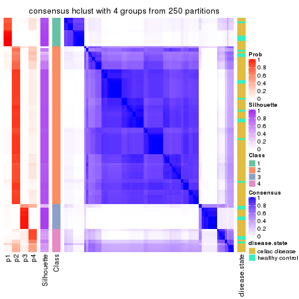</p>

</div>
<div id='tab-MAD-hclust-consensus-heatmap-4'>
<pre><code class="r">consensus_heatmap(res, k = 5)
</code></pre>

<p></p>

</div>
<div id='tab-MAD-hclust-consensus-heatmap-5'>
<pre><code class="r">consensus_heatmap(res, k = 6)
</code></pre>

<p></p>

</div>
</div>

Heatmaps for the membership of samples in all partitions to see how consistent they are:


<script>
$( function() {
	$( '#tabs-MAD-hclust-membership-heatmap' ).tabs();
} );
</script>
<div id='tabs-MAD-hclust-membership-heatmap'>
<ul>
<li><a href='#tab-MAD-hclust-membership-heatmap-1'>k = 2</a></li>
<li><a href='#tab-MAD-hclust-membership-heatmap-2'>k = 3</a></li>
<li><a href='#tab-MAD-hclust-membership-heatmap-3'>k = 4</a></li>
<li><a href='#tab-MAD-hclust-membership-heatmap-4'>k = 5</a></li>
<li><a href='#tab-MAD-hclust-membership-heatmap-5'>k = 6</a></li>
</ul>
<div id='tab-MAD-hclust-membership-heatmap-1'>
<pre><code class="r">membership_heatmap(res, k = 2)
</code></pre>

<p></p>

</div>
<div id='tab-MAD-hclust-membership-heatmap-2'>
<pre><code class="r">membership_heatmap(res, k = 3)
</code></pre>

<p></p>

</div>
<div id='tab-MAD-hclust-membership-heatmap-3'>
<pre><code class="r">membership_heatmap(res, k = 4)
</code></pre>

<p></p>

</div>
<div id='tab-MAD-hclust-membership-heatmap-4'>
<pre><code class="r">membership_heatmap(res, k = 5)
</code></pre>

<p></p>

</div>
<div id='tab-MAD-hclust-membership-heatmap-5'>
<pre><code class="r">membership_heatmap(res, k = 6)
</code></pre>

<p></p>

</div>
</div>

As soon as we have had the classes for columns, we can look for signatures
which are significantly different between classes which can be candidate marks
for certain classes. Following are the heatmaps for signatures.


Signature heatmaps where rows are scaled:


<script>
$( function() {
	$( '#tabs-MAD-hclust-get-signatures' ).tabs();
} );
</script>
<div id='tabs-MAD-hclust-get-signatures'>
<ul>
<li><a href='#tab-MAD-hclust-get-signatures-1'>k = 2</a></li>
<li><a href='#tab-MAD-hclust-get-signatures-2'>k = 3</a></li>
<li><a href='#tab-MAD-hclust-get-signatures-3'>k = 4</a></li>
<li><a href='#tab-MAD-hclust-get-signatures-4'>k = 5</a></li>
<li><a href='#tab-MAD-hclust-get-signatures-5'>k = 6</a></li>
</ul>
<div id='tab-MAD-hclust-get-signatures-1'>
<pre><code class="r">get_signatures(res, k = 2)
</code></pre>

<p></p>

</div>
<div id='tab-MAD-hclust-get-signatures-2'>
<pre><code class="r">get_signatures(res, k = 3)
</code></pre>

<p></p>

</div>
<div id='tab-MAD-hclust-get-signatures-3'>
<pre><code class="r">get_signatures(res, k = 4)
</code></pre>

<p></p>

</div>
<div id='tab-MAD-hclust-get-signatures-4'>
<pre><code class="r">get_signatures(res, k = 5)
</code></pre>

<p></p>

</div>
<div id='tab-MAD-hclust-get-signatures-5'>
<pre><code class="r">get_signatures(res, k = 6)
</code></pre>

<p></p>

</div>
</div>


Signature heatmaps where rows are not scaled:


<script>
$( function() {
	$( '#tabs-MAD-hclust-get-signatures-no-scale' ).tabs();
} );
</script>
<div id='tabs-MAD-hclust-get-signatures-no-scale'>
<ul>
<li><a href='#tab-MAD-hclust-get-signatures-no-scale-1'>k = 2</a></li>
<li><a href='#tab-MAD-hclust-get-signatures-no-scale-2'>k = 3</a></li>
<li><a href='#tab-MAD-hclust-get-signatures-no-scale-3'>k = 4</a></li>
<li><a href='#tab-MAD-hclust-get-signatures-no-scale-4'>k = 5</a></li>
<li><a href='#tab-MAD-hclust-get-signatures-no-scale-5'>k = 6</a></li>
</ul>
<div id='tab-MAD-hclust-get-signatures-no-scale-1'>
<pre><code class="r">get_signatures(res, k = 2, scale_rows = FALSE)
</code></pre>

<p></p>

</div>
<div id='tab-MAD-hclust-get-signatures-no-scale-2'>
<pre><code class="r">get_signatures(res, k = 3, scale_rows = FALSE)
</code></pre>

<p></p>

</div>
<div id='tab-MAD-hclust-get-signatures-no-scale-3'>
<pre><code class="r">get_signatures(res, k = 4, scale_rows = FALSE)
</code></pre>

<p></p>

</div>
<div id='tab-MAD-hclust-get-signatures-no-scale-4'>
<pre><code class="r">get_signatures(res, k = 5, scale_rows = FALSE)
</code></pre>

<p></p>

</div>
<div id='tab-MAD-hclust-get-signatures-no-scale-5'>
<pre><code class="r">get_signatures(res, k = 6, scale_rows = FALSE)
</code></pre>

<p>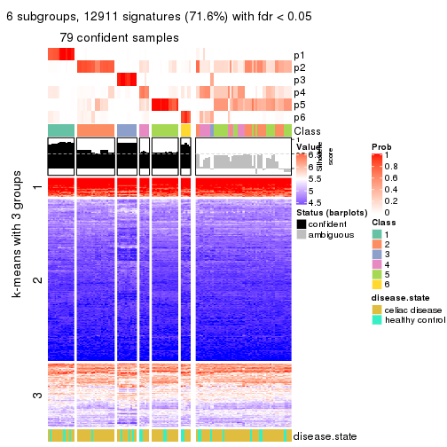</p>

</div>
</div>


Compare the overlap of signatures from different k:

```r
compare_signatures(res)
```


`get_signature()` returns a data frame invisibly. TO get the list of signatures, the function
call should be assigned to a variable explicitly. In following code, if `plot` argument is set
to `FALSE`, no heatmap is plotted while only the differential analysis is performed.

```r
# code only for demonstration
tb = get_signature(res, k = ..., plot = FALSE)
```

An example of the output of `tb` is:

```
#>   which_row         fdr    mean_1    mean_2 scaled_mean_1 scaled_mean_2 km
#> 1        38 0.042760348  8.373488  9.131774    -0.5533452     0.5164555  1
#> 2        40 0.018707592  7.106213  8.469186    -0.6173731     0.5762149  1
#> 3        55 0.019134737 10.221463 11.207825    -0.6159697     0.5749050  1
#> 4        59 0.006059896  5.921854  7.869574    -0.6899429     0.6439467  1
#> 5        60 0.018055526  8.928898 10.211722    -0.6204761     0.5791110  1
#> 6        98 0.009384629 15.714769 14.887706     0.6635654    -0.6193277  2
...
```

The columns in `tb` are:

1. `which_row`: row indices corresponding to the input matrix.
2. `fdr`: FDR for the differential test. 
3. `mean_x`: The mean value in group x.
4. `scaled_mean_x`: The mean value in group x after rows are scaled.
5. `km`: Row groups if k-means clustering is applied to rows.


UMAP plot which shows how samples are separated.


<script>
$( function() {
	$( '#tabs-MAD-hclust-dimension-reduction' ).tabs();
} );
</script>
<div id='tabs-MAD-hclust-dimension-reduction'>
<ul>
<li><a href='#tab-MAD-hclust-dimension-reduction-1'>k = 2</a></li>
<li><a href='#tab-MAD-hclust-dimension-reduction-2'>k = 3</a></li>
<li><a href='#tab-MAD-hclust-dimension-reduction-3'>k = 4</a></li>
<li><a href='#tab-MAD-hclust-dimension-reduction-4'>k = 5</a></li>
<li><a href='#tab-MAD-hclust-dimension-reduction-5'>k = 6</a></li>
</ul>
<div id='tab-MAD-hclust-dimension-reduction-1'>
<pre><code class="r">dimension_reduction(res, k = 2, method = &quot;UMAP&quot;)
</code></pre>

<p></p>

</div>
<div id='tab-MAD-hclust-dimension-reduction-2'>
<pre><code class="r">dimension_reduction(res, k = 3, method = &quot;UMAP&quot;)
</code></pre>

<p></p>

</div>
<div id='tab-MAD-hclust-dimension-reduction-3'>
<pre><code class="r">dimension_reduction(res, k = 4, method = &quot;UMAP&quot;)
</code></pre>

<p></p>

</div>
<div id='tab-MAD-hclust-dimension-reduction-4'>
<pre><code class="r">dimension_reduction(res, k = 5, method = &quot;UMAP&quot;)
</code></pre>

<p></p>

</div>
<div id='tab-MAD-hclust-dimension-reduction-5'>
<pre><code class="r">dimension_reduction(res, k = 6, method = &quot;UMAP&quot;)
</code></pre>

<p></p>

</div>
</div>


Following heatmap shows how subgroups are split when increasing `k`:

```r
collect_classes(res)
```


Test correlation between subgroups and known annotations. If the known
annotation is numeric, one-way ANOVA test is applied, and if the known
annotation is discrete, chi-squared contingency table test is applied.

```r
test_to_known_factors(res)
```

```
#>              n disease.state(p) k
#> MAD:hclust 112           0.0742 2
#> MAD:hclust 117           0.2706 3
#> MAD:hclust 118           0.4242 4
#> MAD:hclust  48           0.9284 5
#> MAD:hclust  79           0.2925 6
```


If matrix rows can be associated to genes, consider to use `GO_Enrichment(res,
...)` to perform function enrichment for the signature genes.


 

---------------------------------------------------


### MAD:kmeans**


The object with results only for a single top-value method and a single partition method 
can be extracted as:

```r
res = res_list["MAD", "kmeans"]
# you can also extract it by
# res = res_list["MAD:kmeans"]
```

A summary of `res` and all the functions that can be applied to it:

```r
res
```

```
#> A 'ConsensusPartition' object with k = 2, 3, 4, 5, 6.
#>   On a matrix with 18032 rows and 132 columns.
#>   Top rows (1000, 2000, 3000, 4000, 5000) are extracted by 'MAD' method.
#>   Subgroups are detected by 'kmeans' method.
#>   Performed in total 1250 partitions by row resampling.
#>   Best k for subgroups seems to be 2.
#> 
#> Following methods can be applied to this 'ConsensusPartition' object:
#>  [1] "cola_report"             "collect_classes"         "collect_plots"          
#>  [4] "collect_stats"           "colnames"                "compare_signatures"     
#>  [7] "consensus_heatmap"       "dimension_reduction"     "functional_enrichment"  
#> [10] "get_anno_col"            "get_anno"                "get_classes"            
#> [13] "get_consensus"           "get_matrix"              "get_membership"         
#> [16] "get_param"               "get_signatures"          "get_stats"              
#> [19] "is_best_k"               "is_stable_k"             "membership_heatmap"     
#> [22] "ncol"                    "nrow"                    "plot_ecdf"              
#> [25] "rownames"                "select_partition_number" "show"                   
#> [28] "suggest_best_k"          "test_to_known_factors"
```

`collect_plots()` function collects all the plots made from `res` for all `k` (number of partitions)
into one single page to provide an easy and fast comparison between different `k`.

```r
collect_plots(res)
```


The plots are:

- The first row: a plot of the ECDF (Empirical cumulative distribution
  function) curves of the consensus matrix for each `k` and the heatmap of
  predicted classes for each `k`.
- The second row: heatmaps of the consensus matrix for each `k`.
- The third row: heatmaps of the membership matrix for each `k`.
- The fouth row: heatmaps of the signatures for each `k`.

All the plots in panels can be made by individual functions and they are
plotted later in this section.

`select_partition_number()` produces several plots showing different
statistics for choosing "optimized" `k`. There are following statistics:

- ECDF curves of the consensus matrix for each `k`;
- 1-PAC. [The PAC
  score](https://en.wikipedia.org/wiki/Consensus_clustering#Over-interpretation_potential_of_consensus_clustering)
  measures the proportion of the ambiguous subgrouping.
- Mean silhouette score.
- Concordance. The mean probability of fiting the consensus class ids in all
  partitions.
- Area increased. Denote $A_k$ as the area under the ECDF curve for current
  `k`, the area increased is defined as $A_k - A_{k-1}$.
- Rand index. The percent of pairs of samples that are both in a same cluster
  or both are not in a same cluster in the partition of k and k-1.
- Jaccard index. The ratio of pairs of samples are both in a same cluster in
  the partition of k and k-1 and the pairs of samples are both in a same
  cluster in the partition k or k-1.

The detailed explanations of these statistics can be found in [the cola
vignette](http://bioconductor.org/packages/devel/bioc/vignettes/cola/inst/doc/cola.html#toc_13).

Generally speaking, lower PAC score, higher mean silhouette score or higher
concordance corresponds to better partition. Rand index and Jaccard index
measure how similar the current partition is compared to partition with `k-1`.
If they are too similar, we won't accept `k` is better than `k-1`.

```r
select_partition_number(res)
```


The numeric values for all these statistics can be obtained by `get_stats()`.

```r
get_stats(res)
```

```
#>   k 1-PAC mean_silhouette concordance area_increased  Rand Jaccard
#> 2 2 1.000           0.977       0.990         0.4472 0.557   0.557
#> 3 3 0.626           0.759       0.800         0.2873 0.930   0.875
#> 4 4 0.581           0.805       0.854         0.2203 0.752   0.522
#> 5 5 0.660           0.569       0.723         0.0982 0.838   0.511
#> 6 6 0.701           0.645       0.791         0.0498 0.896   0.596
```

`suggest_best_k()` suggests the best $k$ based on these statistics. The rules are as follows:

- All $k$ with Jaccard index larger than 0.95 are removed because the increase of
  the partition number does not provides enough extra information. If all $k$ are removed,
  the best $k$ is assigned by `NA`.
- For $k$ with 1-PAC larger than 0.9, the maximal $k$ is taken as the "best k". Other $k$ is called "optional k".
- If it does not fit the second rule. The $k$ with the highest vote of highest
  1-PAC, mean silhouette and concordance is taken as the "best k".

```r
suggest_best_k(res)
```

```
#> [1] 2
```


Following shows the table of the partitions (You need to click the **show/hide
code output** link to see it). The membership matrix (columns with name `p*`)
is inferred by
[`clue::cl_consensus()`](https://www.rdocumentation.org/link/cl_consensus?package=clue)
function with the `SE` method. Basically the value in the membership matrix
represents the probability to belong to a certain group. The finall class
label for an item is determined with the group with highest probability it
belongs to.

In `get_classes()` function, the entropy is calculated from the membership
matrix and the silhouette score is calculated from the consensus matrix.


<script>
$( function() {
	$( '#tabs-MAD-kmeans-get-classes' ).tabs();
} );
</script>
<div id='tabs-MAD-kmeans-get-classes'>
<ul>
<li><a href='#tab-MAD-kmeans-get-classes-1'>k = 2</a></li>
<li><a href='#tab-MAD-kmeans-get-classes-2'>k = 3</a></li>
<li><a href='#tab-MAD-kmeans-get-classes-3'>k = 4</a></li>
<li><a href='#tab-MAD-kmeans-get-classes-4'>k = 5</a></li>
<li><a href='#tab-MAD-kmeans-get-classes-5'>k = 6</a></li>
</ul>

<div id='tab-MAD-kmeans-get-classes-1'>
<p><a id='tab-MAD-kmeans-get-classes-1-a' style='color:#0366d6' href='#'>show/hide code output</a></p>
<pre><code class="r">cbind(get_classes(res, k = 2), get_membership(res, k = 2))
</code></pre>

<pre><code>#&gt;           class entropy silhouette    p1    p2
#&gt; GSM289470     1  0.8081      0.671 0.752 0.248
#&gt; GSM289471     1  0.0000      0.994 1.000 0.000
#&gt; GSM289472     2  0.0000      0.988 0.000 1.000
#&gt; GSM289473     2  0.0000      0.988 0.000 1.000
#&gt; GSM289474     2  0.0000      0.988 0.000 1.000
#&gt; GSM289475     2  0.0000      0.988 0.000 1.000
#&gt; GSM289476     1  0.0000      0.994 1.000 0.000
#&gt; GSM289477     2  0.0000      0.988 0.000 1.000
#&gt; GSM289478     2  0.0000      0.988 0.000 1.000
#&gt; GSM289479     2  0.0000      0.988 0.000 1.000
#&gt; GSM289480     2  0.0000      0.988 0.000 1.000
#&gt; GSM289481     2  0.0000      0.988 0.000 1.000
#&gt; GSM289482     2  0.0000      0.988 0.000 1.000
#&gt; GSM289483     2  0.0000      0.988 0.000 1.000
#&gt; GSM289484     2  0.0000      0.988 0.000 1.000
#&gt; GSM289485     2  0.0000      0.988 0.000 1.000
#&gt; GSM289486     1  0.0000      0.994 1.000 0.000
#&gt; GSM289487     2  0.0000      0.988 0.000 1.000
#&gt; GSM289488     2  0.0000      0.988 0.000 1.000
#&gt; GSM289489     2  0.0000      0.988 0.000 1.000
#&gt; GSM289490     2  0.3114      0.935 0.056 0.944
#&gt; GSM289491     2  0.0000      0.988 0.000 1.000
#&gt; GSM289492     2  0.6148      0.826 0.152 0.848
#&gt; GSM289493     2  0.0000      0.988 0.000 1.000
#&gt; GSM289494     1  0.0000      0.994 1.000 0.000
#&gt; GSM289495     2  0.0000      0.988 0.000 1.000
#&gt; GSM289496     2  0.0000      0.988 0.000 1.000
#&gt; GSM289497     2  0.0000      0.988 0.000 1.000
#&gt; GSM289498     2  0.6247      0.820 0.156 0.844
#&gt; GSM289499     2  0.0000      0.988 0.000 1.000
#&gt; GSM289500     1  0.0000      0.994 1.000 0.000
#&gt; GSM289501     2  0.0000      0.988 0.000 1.000
#&gt; GSM289502     2  0.0000      0.988 0.000 1.000
#&gt; GSM289503     2  0.0000      0.988 0.000 1.000
#&gt; GSM289504     2  0.0000      0.988 0.000 1.000
#&gt; GSM289505     2  0.0000      0.988 0.000 1.000
#&gt; GSM289506     2  0.0000      0.988 0.000 1.000
#&gt; GSM289507     2  0.0000      0.988 0.000 1.000
#&gt; GSM289508     1  0.0000      0.994 1.000 0.000
#&gt; GSM289509     1  0.0000      0.994 1.000 0.000
#&gt; GSM289510     2  0.0000      0.988 0.000 1.000
#&gt; GSM289511     2  0.0000      0.988 0.000 1.000
#&gt; GSM289512     1  0.0000      0.994 1.000 0.000
#&gt; GSM289513     2  0.0000      0.988 0.000 1.000
#&gt; GSM289514     2  0.9732      0.336 0.404 0.596
#&gt; GSM289515     2  0.0000      0.988 0.000 1.000
#&gt; GSM289516     2  0.0000      0.988 0.000 1.000
#&gt; GSM289517     2  0.0000      0.988 0.000 1.000
#&gt; GSM289518     2  0.0000      0.988 0.000 1.000
#&gt; GSM289519     2  0.7219      0.758 0.200 0.800
#&gt; GSM289520     2  0.0000      0.988 0.000 1.000
#&gt; GSM289521     1  0.0000      0.994 1.000 0.000
#&gt; GSM289522     2  0.0000      0.988 0.000 1.000
#&gt; GSM289523     1  0.0000      0.994 1.000 0.000
#&gt; GSM289524     2  0.0000      0.988 0.000 1.000
#&gt; GSM289525     2  0.0000      0.988 0.000 1.000
#&gt; GSM289526     2  0.0376      0.984 0.004 0.996
#&gt; GSM289527     2  0.0000      0.988 0.000 1.000
#&gt; GSM289528     2  0.0000      0.988 0.000 1.000
#&gt; GSM289529     2  0.0000      0.988 0.000 1.000
#&gt; GSM289530     1  0.0000      0.994 1.000 0.000
#&gt; GSM289531     2  0.0000      0.988 0.000 1.000
#&gt; GSM289532     1  0.0000      0.994 1.000 0.000
#&gt; GSM289533     2  0.0000      0.988 0.000 1.000
#&gt; GSM289534     1  0.0000      0.994 1.000 0.000
#&gt; GSM289535     2  0.4298      0.901 0.088 0.912
#&gt; GSM289536     1  0.0000      0.994 1.000 0.000
#&gt; GSM289537     2  0.0000      0.988 0.000 1.000
#&gt; GSM289538     2  0.0000      0.988 0.000 1.000
#&gt; GSM289539     2  0.0000      0.988 0.000 1.000
#&gt; GSM289540     1  0.0000      0.994 1.000 0.000
#&gt; GSM289541     1  0.0000      0.994 1.000 0.000
#&gt; GSM289542     1  0.0376      0.990 0.996 0.004
#&gt; GSM289543     2  0.0000      0.988 0.000 1.000
#&gt; GSM289544     1  0.0000      0.994 1.000 0.000
#&gt; GSM289545     2  0.0000      0.988 0.000 1.000
#&gt; GSM289546     2  0.0000      0.988 0.000 1.000
#&gt; GSM289547     2  0.0000      0.988 0.000 1.000
#&gt; GSM289548     1  0.0000      0.994 1.000 0.000
#&gt; GSM289549     1  0.0000      0.994 1.000 0.000
#&gt; GSM289550     1  0.0000      0.994 1.000 0.000
#&gt; GSM289551     1  0.0000      0.994 1.000 0.000
#&gt; GSM289552     1  0.0000      0.994 1.000 0.000
#&gt; GSM289553     1  0.0000      0.994 1.000 0.000
#&gt; GSM289554     2  0.0000      0.988 0.000 1.000
#&gt; GSM289555     2  0.0000      0.988 0.000 1.000
#&gt; GSM289556     1  0.0000      0.994 1.000 0.000
#&gt; GSM289557     2  0.0000      0.988 0.000 1.000
#&gt; GSM289558     2  0.0000      0.988 0.000 1.000
#&gt; GSM289559     1  0.0000      0.994 1.000 0.000
#&gt; GSM289560     2  0.0000      0.988 0.000 1.000
#&gt; GSM289561     2  0.0000      0.988 0.000 1.000
#&gt; GSM289562     1  0.0000      0.994 1.000 0.000
#&gt; GSM289563     1  0.0000      0.994 1.000 0.000
#&gt; GSM289564     2  0.0000      0.988 0.000 1.000
#&gt; GSM289565     1  0.0000      0.994 1.000 0.000
#&gt; GSM289566     1  0.0000      0.994 1.000 0.000
#&gt; GSM289567     2  0.0000      0.988 0.000 1.000
#&gt; GSM289568     2  0.0000      0.988 0.000 1.000
#&gt; GSM289569     2  0.0000      0.988 0.000 1.000
#&gt; GSM289570     2  0.0000      0.988 0.000 1.000
#&gt; GSM289571     2  0.0000      0.988 0.000 1.000
#&gt; GSM289572     2  0.0000      0.988 0.000 1.000
#&gt; GSM289573     2  0.0000      0.988 0.000 1.000
#&gt; GSM289574     2  0.0000      0.988 0.000 1.000
#&gt; GSM289575     2  0.0000      0.988 0.000 1.000
#&gt; GSM289576     2  0.0000      0.988 0.000 1.000
#&gt; GSM289577     2  0.0000      0.988 0.000 1.000
#&gt; GSM289578     2  0.0000      0.988 0.000 1.000
#&gt; GSM289579     2  0.0000      0.988 0.000 1.000
#&gt; GSM289580     1  0.0000      0.994 1.000 0.000
#&gt; GSM289581     1  0.0000      0.994 1.000 0.000
#&gt; GSM289582     2  0.0000      0.988 0.000 1.000
#&gt; GSM289583     2  0.0000      0.988 0.000 1.000
#&gt; GSM289584     2  0.0000      0.988 0.000 1.000
#&gt; GSM289585     2  0.0000      0.988 0.000 1.000
#&gt; GSM289586     2  0.0000      0.988 0.000 1.000
#&gt; GSM289587     1  0.0000      0.994 1.000 0.000
#&gt; GSM289588     1  0.0000      0.994 1.000 0.000
#&gt; GSM289589     1  0.0000      0.994 1.000 0.000
#&gt; GSM289590     1  0.0000      0.994 1.000 0.000
#&gt; GSM289591     1  0.0000      0.994 1.000 0.000
#&gt; GSM289592     2  0.0000      0.988 0.000 1.000
#&gt; GSM289593     1  0.0000      0.994 1.000 0.000
#&gt; GSM289594     2  0.0000      0.988 0.000 1.000
#&gt; GSM289595     1  0.0000      0.994 1.000 0.000
#&gt; GSM289596     2  0.0000      0.988 0.000 1.000
#&gt; GSM289597     2  0.0000      0.988 0.000 1.000
#&gt; GSM289598     1  0.0000      0.994 1.000 0.000
#&gt; GSM289599     2  0.1414      0.970 0.020 0.980
#&gt; GSM289600     1  0.0000      0.994 1.000 0.000
#&gt; GSM289601     1  0.0000      0.994 1.000 0.000
</code></pre>

<script>
$('#tab-MAD-kmeans-get-classes-1-a').parent().next().next().hide();
$('#tab-MAD-kmeans-get-classes-1-a').click(function(){
  $('#tab-MAD-kmeans-get-classes-1-a').parent().next().next().toggle();
  return(false);
});
</script>
</div>

<div id='tab-MAD-kmeans-get-classes-2'>
<p><a id='tab-MAD-kmeans-get-classes-2-a' style='color:#0366d6' href='#'>show/hide code output</a></p>
<pre><code class="r">cbind(get_classes(res, k = 3), get_membership(res, k = 3))
</code></pre>

<pre><code>#&gt;           class entropy silhouette    p1    p2    p3
#&gt; GSM289470     1  0.8275      0.380 0.596 0.296 0.108
#&gt; GSM289471     3  0.6204      0.999 0.424 0.000 0.576
#&gt; GSM289472     2  0.1163      0.773 0.000 0.972 0.028
#&gt; GSM289473     2  0.3500      0.736 0.004 0.880 0.116
#&gt; GSM289474     2  0.3349      0.737 0.004 0.888 0.108
#&gt; GSM289475     2  0.0747      0.775 0.000 0.984 0.016
#&gt; GSM289476     3  0.6204      0.999 0.424 0.000 0.576
#&gt; GSM289477     2  0.1399      0.775 0.004 0.968 0.028
#&gt; GSM289478     2  0.0747      0.775 0.000 0.984 0.016
#&gt; GSM289479     2  0.4121      0.723 0.024 0.868 0.108
#&gt; GSM289480     2  0.1163      0.773 0.000 0.972 0.028
#&gt; GSM289481     2  0.1529      0.769 0.000 0.960 0.040
#&gt; GSM289482     2  0.2116      0.772 0.012 0.948 0.040
#&gt; GSM289483     2  0.1031      0.775 0.000 0.976 0.024
#&gt; GSM289484     2  0.0000      0.777 0.000 1.000 0.000
#&gt; GSM289485     2  0.3009      0.750 0.052 0.920 0.028
#&gt; GSM289486     1  0.0592      0.779 0.988 0.012 0.000
#&gt; GSM289487     2  0.0747      0.775 0.000 0.984 0.016
#&gt; GSM289488     2  0.1031      0.775 0.000 0.976 0.024
#&gt; GSM289489     2  0.3116      0.742 0.000 0.892 0.108
#&gt; GSM289490     2  0.5956      0.799 0.004 0.672 0.324
#&gt; GSM289491     2  0.5591      0.808 0.000 0.696 0.304
#&gt; GSM289492     2  0.5956      0.799 0.004 0.672 0.324
#&gt; GSM289493     2  0.5465      0.810 0.000 0.712 0.288
#&gt; GSM289494     3  0.6192      0.991 0.420 0.000 0.580
#&gt; GSM289495     2  0.5678      0.804 0.000 0.684 0.316
#&gt; GSM289496     2  0.5465      0.810 0.000 0.712 0.288
#&gt; GSM289497     2  0.5591      0.808 0.000 0.696 0.304
#&gt; GSM289498     2  0.6396      0.796 0.016 0.664 0.320
#&gt; GSM289499     2  0.5678      0.804 0.000 0.684 0.316
#&gt; GSM289500     3  0.6204      0.999 0.424 0.000 0.576
#&gt; GSM289501     2  0.5497      0.809 0.000 0.708 0.292
#&gt; GSM289502     2  0.5497      0.809 0.000 0.708 0.292
#&gt; GSM289503     2  0.5591      0.808 0.000 0.696 0.304
#&gt; GSM289504     2  0.5650      0.806 0.000 0.688 0.312
#&gt; GSM289505     2  0.5497      0.809 0.000 0.708 0.292
#&gt; GSM289506     2  0.5497      0.809 0.000 0.708 0.292
#&gt; GSM289507     2  0.5431      0.810 0.000 0.716 0.284
#&gt; GSM289508     1  0.1031      0.771 0.976 0.000 0.024
#&gt; GSM289509     1  0.5905     -0.369 0.648 0.000 0.352
#&gt; GSM289510     2  0.6662      0.588 0.128 0.752 0.120
#&gt; GSM289511     2  0.3349      0.740 0.004 0.888 0.108
#&gt; GSM289512     3  0.6204      0.999 0.424 0.000 0.576
#&gt; GSM289513     2  0.3349      0.740 0.004 0.888 0.108
#&gt; GSM289514     1  0.8464      0.399 0.592 0.280 0.128
#&gt; GSM289515     2  0.4342      0.722 0.024 0.856 0.120
#&gt; GSM289516     2  0.4712      0.706 0.044 0.848 0.108
#&gt; GSM289517     2  0.4712      0.706 0.044 0.848 0.108
#&gt; GSM289518     2  0.4712      0.706 0.044 0.848 0.108
#&gt; GSM289519     2  0.8920     -0.191 0.408 0.468 0.124
#&gt; GSM289520     2  0.3695      0.732 0.012 0.880 0.108
#&gt; GSM289521     1  0.5657      0.653 0.808 0.088 0.104
#&gt; GSM289522     2  0.4712      0.706 0.044 0.848 0.108
#&gt; GSM289523     3  0.6204      0.999 0.424 0.000 0.576
#&gt; GSM289524     2  0.3349      0.740 0.004 0.888 0.108
#&gt; GSM289525     2  0.4121      0.723 0.024 0.868 0.108
#&gt; GSM289526     2  0.3349      0.740 0.004 0.888 0.108
#&gt; GSM289527     2  0.3349      0.740 0.004 0.888 0.108
#&gt; GSM289528     2  0.1031      0.774 0.000 0.976 0.024
#&gt; GSM289529     2  0.3682      0.734 0.008 0.876 0.116
#&gt; GSM289530     1  0.4945      0.692 0.840 0.056 0.104
#&gt; GSM289531     2  0.3267      0.741 0.000 0.884 0.116
#&gt; GSM289532     1  0.3359      0.742 0.900 0.016 0.084
#&gt; GSM289533     2  0.3116      0.742 0.000 0.892 0.108
#&gt; GSM289534     3  0.6204      0.999 0.424 0.000 0.576
#&gt; GSM289535     2  0.7820      0.754 0.072 0.604 0.324
#&gt; GSM289536     3  0.6204      0.999 0.424 0.000 0.576
#&gt; GSM289537     2  0.5465      0.810 0.000 0.712 0.288
#&gt; GSM289538     2  0.5465      0.810 0.000 0.712 0.288
#&gt; GSM289539     2  0.5431      0.810 0.000 0.716 0.284
#&gt; GSM289540     1  0.2152      0.765 0.948 0.016 0.036
#&gt; GSM289541     1  0.3481      0.730 0.904 0.052 0.044
#&gt; GSM289542     1  0.8075      0.310 0.620 0.104 0.276
#&gt; GSM289543     2  0.5902      0.803 0.004 0.680 0.316
#&gt; GSM289544     1  0.2229      0.772 0.944 0.012 0.044
#&gt; GSM289545     2  0.5465      0.810 0.000 0.712 0.288
#&gt; GSM289546     2  0.5465      0.810 0.000 0.712 0.288
#&gt; GSM289547     2  0.5497      0.809 0.000 0.708 0.292
#&gt; GSM289548     1  0.0000      0.776 1.000 0.000 0.000
#&gt; GSM289549     1  0.4449      0.671 0.860 0.100 0.040
#&gt; GSM289550     1  0.0237      0.774 0.996 0.000 0.004
#&gt; GSM289551     3  0.6204      0.999 0.424 0.000 0.576
#&gt; GSM289552     1  0.0237      0.774 0.996 0.000 0.004
#&gt; GSM289553     1  0.0237      0.774 0.996 0.000 0.004
#&gt; GSM289554     2  0.5650      0.805 0.000 0.688 0.312
#&gt; GSM289555     2  0.5497      0.809 0.000 0.708 0.292
#&gt; GSM289556     1  0.0000      0.776 1.000 0.000 0.000
#&gt; GSM289557     2  0.5465      0.810 0.000 0.712 0.288
#&gt; GSM289558     2  0.5529      0.809 0.000 0.704 0.296
#&gt; GSM289559     1  0.0237      0.774 0.996 0.000 0.004
#&gt; GSM289560     2  0.5497      0.809 0.000 0.708 0.292
#&gt; GSM289561     2  0.5465      0.810 0.000 0.712 0.288
#&gt; GSM289562     1  0.0237      0.774 0.996 0.000 0.004
#&gt; GSM289563     1  0.3973      0.695 0.880 0.088 0.032
#&gt; GSM289564     2  0.5760      0.805 0.000 0.672 0.328
#&gt; GSM289565     1  0.1031      0.772 0.976 0.000 0.024
#&gt; GSM289566     1  0.1182      0.778 0.976 0.012 0.012
#&gt; GSM289567     2  0.4196      0.723 0.024 0.864 0.112
#&gt; GSM289568     2  0.3116      0.742 0.000 0.892 0.108
#&gt; GSM289569     2  0.3755      0.733 0.008 0.872 0.120
#&gt; GSM289570     2  0.4196      0.723 0.024 0.864 0.112
#&gt; GSM289571     2  0.5465      0.810 0.000 0.712 0.288
#&gt; GSM289572     2  0.5497      0.809 0.000 0.708 0.292
#&gt; GSM289573     2  0.5497      0.809 0.000 0.708 0.292
#&gt; GSM289574     2  0.5497      0.809 0.000 0.708 0.292
#&gt; GSM289575     2  0.5497      0.809 0.000 0.708 0.292
#&gt; GSM289576     2  0.5591      0.808 0.000 0.696 0.304
#&gt; GSM289577     2  0.5497      0.809 0.000 0.708 0.292
#&gt; GSM289578     2  0.5650      0.805 0.000 0.688 0.312
#&gt; GSM289579     2  0.5497      0.809 0.000 0.708 0.292
#&gt; GSM289580     3  0.6204      0.999 0.424 0.000 0.576
#&gt; GSM289581     1  0.2959      0.744 0.900 0.000 0.100
#&gt; GSM289582     2  0.3500      0.736 0.004 0.880 0.116
#&gt; GSM289583     2  0.5497      0.809 0.000 0.708 0.292
#&gt; GSM289584     2  0.5591      0.808 0.000 0.696 0.304
#&gt; GSM289585     2  0.5497      0.809 0.000 0.708 0.292
#&gt; GSM289586     1  0.8503      0.369 0.576 0.304 0.120
#&gt; GSM289587     1  0.1015      0.780 0.980 0.012 0.008
#&gt; GSM289588     3  0.6204      0.999 0.424 0.000 0.576
#&gt; GSM289589     1  0.0237      0.774 0.996 0.000 0.004
#&gt; GSM289590     1  0.0892      0.772 0.980 0.000 0.020
#&gt; GSM289591     1  0.0237      0.774 0.996 0.000 0.004
#&gt; GSM289592     2  0.5591      0.808 0.000 0.696 0.304
#&gt; GSM289593     3  0.6204      0.999 0.424 0.000 0.576
#&gt; GSM289594     2  0.5497      0.809 0.000 0.708 0.292
#&gt; GSM289595     1  0.0592      0.769 0.988 0.000 0.012
#&gt; GSM289596     2  0.5465      0.810 0.000 0.712 0.288
#&gt; GSM289597     2  0.3987      0.726 0.020 0.872 0.108
#&gt; GSM289598     1  0.6211      0.240 0.736 0.036 0.228
#&gt; GSM289599     2  0.8679      0.697 0.128 0.556 0.316
#&gt; GSM289600     1  0.0829      0.779 0.984 0.012 0.004
#&gt; GSM289601     1  0.4094      0.725 0.872 0.028 0.100
</code></pre>

<script>
$('#tab-MAD-kmeans-get-classes-2-a').parent().next().next().hide();
$('#tab-MAD-kmeans-get-classes-2-a').click(function(){
  $('#tab-MAD-kmeans-get-classes-2-a').parent().next().next().toggle();
  return(false);
});
</script>
</div>

<div id='tab-MAD-kmeans-get-classes-3'>
<p><a id='tab-MAD-kmeans-get-classes-3-a' style='color:#0366d6' href='#'>show/hide code output</a></p>
<pre><code class="r">cbind(get_classes(res, k = 4), get_membership(res, k = 4))
</code></pre>

<pre><code>#&gt;           class entropy silhouette    p1    p2    p3    p4
#&gt; GSM289470     1  0.4123      0.696 0.772 0.220 0.008 0.000
#&gt; GSM289471     3  0.2647      0.966 0.120 0.000 0.880 0.000
#&gt; GSM289472     2  0.6187      0.634 0.000 0.596 0.068 0.336
#&gt; GSM289473     2  0.3311      0.822 0.000 0.828 0.000 0.172
#&gt; GSM289474     2  0.3123      0.822 0.000 0.844 0.000 0.156
#&gt; GSM289475     2  0.6295      0.613 0.000 0.580 0.072 0.348
#&gt; GSM289476     3  0.2647      0.966 0.120 0.000 0.880 0.000
#&gt; GSM289477     2  0.5203      0.696 0.000 0.636 0.016 0.348
#&gt; GSM289478     2  0.6295      0.613 0.000 0.580 0.072 0.348
#&gt; GSM289479     2  0.3585      0.821 0.004 0.828 0.004 0.164
#&gt; GSM289480     2  0.6170      0.639 0.000 0.600 0.068 0.332
#&gt; GSM289481     2  0.6098      0.659 0.000 0.616 0.068 0.316
#&gt; GSM289482     2  0.4980      0.717 0.000 0.680 0.016 0.304
#&gt; GSM289483     2  0.5269      0.679 0.000 0.620 0.016 0.364
#&gt; GSM289484     2  0.6054      0.669 0.000 0.592 0.056 0.352
#&gt; GSM289485     2  0.5772      0.723 0.024 0.648 0.016 0.312
#&gt; GSM289486     1  0.0672      0.832 0.984 0.008 0.008 0.000
#&gt; GSM289487     2  0.6295      0.613 0.000 0.580 0.072 0.348
#&gt; GSM289488     2  0.5355      0.683 0.000 0.620 0.020 0.360
#&gt; GSM289489     2  0.4336      0.797 0.000 0.812 0.060 0.128
#&gt; GSM289490     4  0.3877      0.835 0.012 0.088 0.044 0.856
#&gt; GSM289491     4  0.3621      0.848 0.000 0.072 0.068 0.860
#&gt; GSM289492     4  0.4837      0.775 0.012 0.144 0.052 0.792
#&gt; GSM289493     4  0.0469      0.897 0.000 0.000 0.012 0.988
#&gt; GSM289494     3  0.2981      0.930 0.092 0.016 0.888 0.004
#&gt; GSM289495     4  0.4437      0.789 0.012 0.132 0.040 0.816
#&gt; GSM289496     4  0.0469      0.898 0.000 0.000 0.012 0.988
#&gt; GSM289497     4  0.3312      0.849 0.000 0.052 0.072 0.876
#&gt; GSM289498     4  0.3726      0.841 0.008 0.068 0.060 0.864
#&gt; GSM289499     4  0.3855      0.826 0.012 0.092 0.040 0.856
#&gt; GSM289500     3  0.2647      0.966 0.120 0.000 0.880 0.000
#&gt; GSM289501     4  0.0469      0.897 0.000 0.000 0.012 0.988
#&gt; GSM289502     4  0.3621      0.837 0.000 0.068 0.072 0.860
#&gt; GSM289503     4  0.3312      0.849 0.000 0.052 0.072 0.876
#&gt; GSM289504     4  0.2099      0.879 0.004 0.020 0.040 0.936
#&gt; GSM289505     4  0.0592      0.897 0.000 0.000 0.016 0.984
#&gt; GSM289506     4  0.3621      0.837 0.000 0.068 0.072 0.860
#&gt; GSM289507     4  0.4155      0.802 0.000 0.100 0.072 0.828
#&gt; GSM289508     1  0.2494      0.802 0.916 0.000 0.036 0.048
#&gt; GSM289509     3  0.6649      0.487 0.340 0.100 0.560 0.000
#&gt; GSM289510     2  0.2669      0.747 0.032 0.912 0.004 0.052
#&gt; GSM289511     2  0.4174      0.810 0.000 0.816 0.044 0.140
#&gt; GSM289512     3  0.2589      0.962 0.116 0.000 0.884 0.000
#&gt; GSM289513     2  0.4257      0.809 0.000 0.812 0.048 0.140
#&gt; GSM289514     2  0.4562      0.500 0.208 0.764 0.000 0.028
#&gt; GSM289515     2  0.2216      0.808 0.000 0.908 0.000 0.092
#&gt; GSM289516     2  0.2973      0.800 0.020 0.884 0.000 0.096
#&gt; GSM289517     2  0.2909      0.797 0.020 0.888 0.000 0.092
#&gt; GSM289518     2  0.2843      0.794 0.020 0.892 0.000 0.088
#&gt; GSM289519     2  0.4425      0.591 0.160 0.800 0.004 0.036
#&gt; GSM289520     2  0.2466      0.808 0.000 0.900 0.004 0.096
#&gt; GSM289521     1  0.5943      0.558 0.576 0.388 0.008 0.028
#&gt; GSM289522     2  0.2843      0.794 0.020 0.892 0.000 0.088
#&gt; GSM289523     3  0.2647      0.966 0.120 0.000 0.880 0.000
#&gt; GSM289524     2  0.4257      0.809 0.000 0.812 0.048 0.140
#&gt; GSM289525     2  0.2741      0.801 0.012 0.892 0.000 0.096
#&gt; GSM289526     2  0.3758      0.801 0.000 0.848 0.048 0.104
#&gt; GSM289527     2  0.4257      0.809 0.000 0.812 0.048 0.140
#&gt; GSM289528     2  0.6324      0.597 0.000 0.572 0.072 0.356
#&gt; GSM289529     2  0.2593      0.805 0.004 0.892 0.000 0.104
#&gt; GSM289530     1  0.6246      0.438 0.516 0.440 0.012 0.032
#&gt; GSM289531     2  0.3569      0.819 0.000 0.804 0.000 0.196
#&gt; GSM289532     1  0.7138      0.572 0.576 0.320 0.056 0.048
#&gt; GSM289533     2  0.4307      0.809 0.000 0.808 0.048 0.144
#&gt; GSM289534     3  0.2647      0.966 0.120 0.000 0.880 0.000
#&gt; GSM289535     4  0.5698      0.734 0.072 0.128 0.040 0.760
#&gt; GSM289536     3  0.2647      0.966 0.120 0.000 0.880 0.000
#&gt; GSM289537     4  0.0469      0.898 0.000 0.000 0.012 0.988
#&gt; GSM289538     4  0.0779      0.897 0.000 0.004 0.016 0.980
#&gt; GSM289539     4  0.4215      0.798 0.000 0.104 0.072 0.824
#&gt; GSM289540     1  0.5799      0.719 0.756 0.116 0.040 0.088
#&gt; GSM289541     1  0.2644      0.793 0.908 0.000 0.032 0.060
#&gt; GSM289542     1  0.5561      0.680 0.756 0.044 0.040 0.160
#&gt; GSM289543     4  0.4042      0.816 0.012 0.104 0.040 0.844
#&gt; GSM289544     1  0.3123      0.788 0.844 0.156 0.000 0.000
#&gt; GSM289545     4  0.1151      0.898 0.000 0.008 0.024 0.968
#&gt; GSM289546     4  0.1004      0.897 0.000 0.004 0.024 0.972
#&gt; GSM289547     4  0.3471      0.844 0.000 0.060 0.072 0.868
#&gt; GSM289548     1  0.0524      0.831 0.988 0.004 0.008 0.000
#&gt; GSM289549     1  0.3653      0.740 0.844 0.128 0.028 0.000
#&gt; GSM289550     1  0.0524      0.831 0.988 0.004 0.008 0.000
#&gt; GSM289551     3  0.2647      0.966 0.120 0.000 0.880 0.000
#&gt; GSM289552     1  0.0469      0.829 0.988 0.000 0.012 0.000
#&gt; GSM289553     1  0.0524      0.831 0.988 0.004 0.008 0.000
#&gt; GSM289554     4  0.1892      0.884 0.004 0.016 0.036 0.944
#&gt; GSM289555     4  0.0707      0.898 0.000 0.000 0.020 0.980
#&gt; GSM289556     1  0.0524      0.831 0.988 0.004 0.008 0.000
#&gt; GSM289557     4  0.0469      0.897 0.000 0.000 0.012 0.988
#&gt; GSM289558     4  0.0927      0.895 0.000 0.008 0.016 0.976
#&gt; GSM289559     1  0.0524      0.831 0.988 0.004 0.008 0.000
#&gt; GSM289560     4  0.0817      0.898 0.000 0.000 0.024 0.976
#&gt; GSM289561     4  0.0592      0.897 0.000 0.000 0.016 0.984
#&gt; GSM289562     1  0.0524      0.831 0.988 0.004 0.008 0.000
#&gt; GSM289563     1  0.1677      0.826 0.948 0.040 0.012 0.000
#&gt; GSM289564     4  0.4784      0.755 0.012 0.168 0.036 0.784
#&gt; GSM289565     1  0.3099      0.794 0.876 0.104 0.020 0.000
#&gt; GSM289566     1  0.3032      0.785 0.868 0.124 0.008 0.000
#&gt; GSM289567     2  0.2741      0.797 0.012 0.892 0.000 0.096
#&gt; GSM289568     2  0.4638      0.802 0.000 0.788 0.060 0.152
#&gt; GSM289569     2  0.2888      0.819 0.000 0.872 0.004 0.124
#&gt; GSM289570     2  0.2610      0.791 0.012 0.900 0.000 0.088
#&gt; GSM289571     4  0.0469      0.898 0.000 0.000 0.012 0.988
#&gt; GSM289572     4  0.1022      0.893 0.000 0.000 0.032 0.968
#&gt; GSM289573     4  0.1356      0.890 0.000 0.032 0.008 0.960
#&gt; GSM289574     4  0.3471      0.844 0.000 0.060 0.072 0.868
#&gt; GSM289575     4  0.0592      0.897 0.000 0.000 0.016 0.984
#&gt; GSM289576     4  0.2675      0.867 0.000 0.044 0.048 0.908
#&gt; GSM289577     4  0.1022      0.893 0.000 0.000 0.032 0.968
#&gt; GSM289578     4  0.2594      0.869 0.004 0.044 0.036 0.916
#&gt; GSM289579     4  0.0817      0.895 0.000 0.000 0.024 0.976
#&gt; GSM289580     3  0.2647      0.966 0.120 0.000 0.880 0.000
#&gt; GSM289581     1  0.5099      0.594 0.612 0.380 0.008 0.000
#&gt; GSM289582     2  0.2081      0.804 0.000 0.916 0.000 0.084
#&gt; GSM289583     4  0.3621      0.837 0.000 0.068 0.072 0.860
#&gt; GSM289584     4  0.2589      0.870 0.000 0.044 0.044 0.912
#&gt; GSM289585     4  0.3621      0.837 0.000 0.068 0.072 0.860
#&gt; GSM289586     2  0.2469      0.699 0.108 0.892 0.000 0.000
#&gt; GSM289587     1  0.0672      0.832 0.984 0.008 0.008 0.000
#&gt; GSM289588     3  0.2647      0.966 0.120 0.000 0.880 0.000
#&gt; GSM289589     1  0.0524      0.831 0.988 0.004 0.008 0.000
#&gt; GSM289590     1  0.2593      0.797 0.892 0.104 0.004 0.000
#&gt; GSM289591     1  0.0469      0.829 0.988 0.000 0.012 0.000
#&gt; GSM289592     4  0.1929      0.882 0.000 0.036 0.024 0.940
#&gt; GSM289593     3  0.2647      0.966 0.120 0.000 0.880 0.000
#&gt; GSM289594     4  0.0817      0.898 0.000 0.000 0.024 0.976
#&gt; GSM289595     1  0.1975      0.819 0.936 0.048 0.016 0.000
#&gt; GSM289596     4  0.0707      0.896 0.000 0.000 0.020 0.980
#&gt; GSM289597     2  0.2737      0.804 0.008 0.888 0.000 0.104
#&gt; GSM289598     4  0.6667      0.596 0.220 0.064 0.048 0.668
#&gt; GSM289599     4  0.5749      0.730 0.072 0.132 0.040 0.756
#&gt; GSM289600     1  0.0672      0.832 0.984 0.008 0.008 0.000
#&gt; GSM289601     1  0.4814      0.659 0.676 0.316 0.008 0.000
</code></pre>

<script>
$('#tab-MAD-kmeans-get-classes-3-a').parent().next().next().hide();
$('#tab-MAD-kmeans-get-classes-3-a').click(function(){
  $('#tab-MAD-kmeans-get-classes-3-a').parent().next().next().toggle();
  return(false);
});
</script>
</div>

<div id='tab-MAD-kmeans-get-classes-4'>
<p><a id='tab-MAD-kmeans-get-classes-4-a' style='color:#0366d6' href='#'>show/hide code output</a></p>
<pre><code class="r">cbind(get_classes(res, k = 5), get_membership(res, k = 5))
</code></pre>

<pre><code>#&gt;           class entropy silhouette    p1    p2    p3    p4    p5
#&gt; GSM289470     1  0.2788     0.7907 0.888 0.000 0.008 0.064 0.040
#&gt; GSM289471     3  0.1197     0.9546 0.048 0.000 0.952 0.000 0.000
#&gt; GSM289472     5  0.2464     0.5094 0.000 0.096 0.000 0.016 0.888
#&gt; GSM289473     4  0.5111     0.6145 0.000 0.040 0.000 0.552 0.408
#&gt; GSM289474     4  0.5131     0.5975 0.000 0.040 0.000 0.540 0.420
#&gt; GSM289475     5  0.3546     0.5088 0.000 0.116 0.004 0.048 0.832
#&gt; GSM289476     3  0.1197     0.9546 0.048 0.000 0.952 0.000 0.000
#&gt; GSM289477     5  0.7098     0.0912 0.000 0.240 0.024 0.272 0.464
#&gt; GSM289478     5  0.3546     0.5088 0.000 0.116 0.004 0.048 0.832
#&gt; GSM289479     4  0.5125     0.6046 0.000 0.040 0.000 0.544 0.416
#&gt; GSM289480     5  0.3146     0.4913 0.000 0.092 0.000 0.052 0.856
#&gt; GSM289481     5  0.2959     0.5037 0.000 0.100 0.000 0.036 0.864
#&gt; GSM289482     5  0.7221    -0.0675 0.000 0.236 0.024 0.332 0.408
#&gt; GSM289483     5  0.7021     0.1332 0.000 0.232 0.024 0.260 0.484
#&gt; GSM289484     5  0.5467     0.3358 0.000 0.116 0.008 0.204 0.672
#&gt; GSM289485     5  0.7147     0.1022 0.004 0.216 0.024 0.276 0.480
#&gt; GSM289486     1  0.0451     0.8607 0.988 0.000 0.000 0.004 0.008
#&gt; GSM289487     5  0.3546     0.5088 0.000 0.116 0.004 0.048 0.832
#&gt; GSM289488     5  0.6662     0.2072 0.000 0.176 0.024 0.252 0.548
#&gt; GSM289489     5  0.3947     0.0939 0.000 0.008 0.008 0.236 0.748
#&gt; GSM289490     2  0.4841     0.6464 0.000 0.732 0.028 0.200 0.040
#&gt; GSM289491     5  0.4829    -0.0590 0.000 0.480 0.000 0.020 0.500
#&gt; GSM289492     2  0.5681     0.5111 0.000 0.576 0.028 0.356 0.040
#&gt; GSM289493     2  0.1430     0.7423 0.000 0.944 0.000 0.004 0.052
#&gt; GSM289494     3  0.2121     0.9111 0.020 0.016 0.932 0.012 0.020
#&gt; GSM289495     2  0.5299     0.5305 0.000 0.588 0.036 0.364 0.012
#&gt; GSM289496     2  0.2230     0.7136 0.000 0.884 0.000 0.000 0.116
#&gt; GSM289497     5  0.4192     0.2742 0.000 0.404 0.000 0.000 0.596
#&gt; GSM289498     2  0.4395     0.6795 0.000 0.784 0.028 0.144 0.044
#&gt; GSM289499     2  0.3920     0.6883 0.000 0.804 0.036 0.148 0.012
#&gt; GSM289500     3  0.1121     0.9514 0.044 0.000 0.956 0.000 0.000
#&gt; GSM289501     2  0.1410     0.7408 0.000 0.940 0.000 0.000 0.060
#&gt; GSM289502     5  0.4182     0.2792 0.000 0.400 0.000 0.000 0.600
#&gt; GSM289503     5  0.4201     0.2639 0.000 0.408 0.000 0.000 0.592
#&gt; GSM289504     2  0.2149     0.7366 0.000 0.924 0.036 0.028 0.012
#&gt; GSM289505     2  0.2171     0.7422 0.000 0.924 0.028 0.016 0.032
#&gt; GSM289506     5  0.4192     0.2734 0.000 0.404 0.000 0.000 0.596
#&gt; GSM289507     5  0.4171     0.2819 0.000 0.396 0.000 0.000 0.604
#&gt; GSM289508     1  0.4539     0.7096 0.792 0.124 0.036 0.040 0.008
#&gt; GSM289509     3  0.6140     0.3809 0.116 0.004 0.492 0.388 0.000
#&gt; GSM289510     4  0.3366     0.6309 0.000 0.000 0.000 0.768 0.232
#&gt; GSM289511     5  0.4970    -0.1206 0.000 0.028 0.008 0.340 0.624
#&gt; GSM289512     3  0.1197     0.9546 0.048 0.000 0.952 0.000 0.000
#&gt; GSM289513     5  0.4970    -0.1206 0.000 0.028 0.008 0.340 0.624
#&gt; GSM289514     4  0.3043     0.5319 0.056 0.000 0.000 0.864 0.080
#&gt; GSM289515     4  0.4859     0.6859 0.000 0.024 0.004 0.608 0.364
#&gt; GSM289516     4  0.4787     0.6860 0.000 0.028 0.000 0.608 0.364
#&gt; GSM289517     4  0.4654     0.6957 0.000 0.024 0.000 0.628 0.348
#&gt; GSM289518     4  0.4639     0.6958 0.000 0.024 0.000 0.632 0.344
#&gt; GSM289519     4  0.3081     0.5262 0.056 0.000 0.004 0.868 0.072
#&gt; GSM289520     4  0.4995     0.6679 0.000 0.028 0.004 0.584 0.384
#&gt; GSM289521     4  0.2020     0.4608 0.100 0.000 0.000 0.900 0.000
#&gt; GSM289522     4  0.4790     0.6955 0.000 0.024 0.004 0.628 0.344
#&gt; GSM289523     3  0.1197     0.9546 0.048 0.000 0.952 0.000 0.000
#&gt; GSM289524     5  0.4970    -0.1206 0.000 0.028 0.008 0.340 0.624
#&gt; GSM289525     4  0.4654     0.6957 0.000 0.024 0.000 0.628 0.348
#&gt; GSM289526     5  0.4803    -0.1763 0.008 0.008 0.008 0.344 0.632
#&gt; GSM289527     5  0.4970    -0.1206 0.000 0.028 0.008 0.340 0.624
#&gt; GSM289528     5  0.2648     0.5307 0.000 0.152 0.000 0.000 0.848
#&gt; GSM289529     4  0.4787     0.6852 0.000 0.028 0.000 0.608 0.364
#&gt; GSM289530     4  0.1942     0.4705 0.068 0.012 0.000 0.920 0.000
#&gt; GSM289531     4  0.5447     0.6083 0.000 0.064 0.000 0.536 0.400
#&gt; GSM289532     4  0.4275     0.3059 0.064 0.136 0.012 0.788 0.000
#&gt; GSM289533     5  0.4984    -0.1322 0.000 0.028 0.008 0.344 0.620
#&gt; GSM289534     3  0.1357     0.9524 0.048 0.004 0.948 0.000 0.000
#&gt; GSM289535     2  0.5095     0.5311 0.000 0.592 0.036 0.368 0.004
#&gt; GSM289536     3  0.1197     0.9546 0.048 0.000 0.952 0.000 0.000
#&gt; GSM289537     2  0.3928     0.6646 0.000 0.788 0.028 0.008 0.176
#&gt; GSM289538     2  0.3928     0.6630 0.000 0.788 0.028 0.008 0.176
#&gt; GSM289539     5  0.4161     0.2868 0.000 0.392 0.000 0.000 0.608
#&gt; GSM289540     4  0.7364    -0.2279 0.232 0.308 0.036 0.424 0.000
#&gt; GSM289541     1  0.1812     0.8369 0.940 0.004 0.036 0.008 0.012
#&gt; GSM289542     2  0.7229     0.3810 0.152 0.496 0.040 0.304 0.008
#&gt; GSM289543     2  0.4808     0.6171 0.000 0.696 0.036 0.256 0.012
#&gt; GSM289544     1  0.4268     0.5314 0.556 0.000 0.000 0.444 0.000
#&gt; GSM289545     2  0.3961     0.6701 0.000 0.792 0.028 0.012 0.168
#&gt; GSM289546     2  0.4000     0.6669 0.000 0.788 0.028 0.012 0.172
#&gt; GSM289547     5  0.4210     0.2662 0.000 0.412 0.000 0.000 0.588
#&gt; GSM289548     1  0.0162     0.8602 0.996 0.000 0.004 0.000 0.000
#&gt; GSM289549     1  0.2409     0.8033 0.908 0.000 0.008 0.056 0.028
#&gt; GSM289550     1  0.0324     0.8610 0.992 0.000 0.004 0.004 0.000
#&gt; GSM289551     3  0.1197     0.9546 0.048 0.000 0.952 0.000 0.000
#&gt; GSM289552     1  0.0324     0.8610 0.992 0.000 0.004 0.004 0.000
#&gt; GSM289553     1  0.0451     0.8605 0.988 0.000 0.004 0.008 0.000
#&gt; GSM289554     2  0.1310     0.7413 0.000 0.956 0.020 0.024 0.000
#&gt; GSM289555     2  0.1928     0.7362 0.004 0.920 0.000 0.004 0.072
#&gt; GSM289556     1  0.0324     0.8610 0.992 0.000 0.004 0.004 0.000
#&gt; GSM289557     2  0.2848     0.6852 0.004 0.840 0.000 0.000 0.156
#&gt; GSM289558     2  0.2929     0.6713 0.000 0.820 0.000 0.000 0.180
#&gt; GSM289559     1  0.0451     0.8599 0.988 0.000 0.004 0.000 0.008
#&gt; GSM289560     2  0.1831     0.7335 0.004 0.920 0.000 0.000 0.076
#&gt; GSM289561     2  0.2629     0.6998 0.004 0.860 0.000 0.000 0.136
#&gt; GSM289562     1  0.0162     0.8602 0.996 0.000 0.004 0.000 0.000
#&gt; GSM289563     1  0.0613     0.8557 0.984 0.000 0.004 0.004 0.008
#&gt; GSM289564     2  0.4213     0.5898 0.000 0.680 0.012 0.308 0.000
#&gt; GSM289565     1  0.5181     0.5378 0.564 0.020 0.016 0.400 0.000
#&gt; GSM289566     1  0.5447     0.4019 0.632 0.004 0.000 0.280 0.084
#&gt; GSM289567     4  0.4624     0.6958 0.000 0.024 0.000 0.636 0.340
#&gt; GSM289568     5  0.4598     0.0822 0.000 0.028 0.008 0.264 0.700
#&gt; GSM289569     4  0.5234     0.5706 0.000 0.036 0.004 0.524 0.436
#&gt; GSM289570     4  0.4624     0.6958 0.000 0.024 0.000 0.636 0.340
#&gt; GSM289571     2  0.3639     0.6651 0.000 0.792 0.024 0.000 0.184
#&gt; GSM289572     2  0.1854     0.7387 0.000 0.936 0.036 0.020 0.008
#&gt; GSM289573     2  0.3109     0.6459 0.000 0.800 0.000 0.000 0.200
#&gt; GSM289574     5  0.4201     0.2719 0.000 0.408 0.000 0.000 0.592
#&gt; GSM289575     2  0.1597     0.7432 0.000 0.940 0.000 0.012 0.048
#&gt; GSM289576     2  0.3983     0.4043 0.000 0.660 0.000 0.000 0.340
#&gt; GSM289577     2  0.1211     0.7417 0.000 0.960 0.016 0.024 0.000
#&gt; GSM289578     2  0.2233     0.7270 0.000 0.904 0.016 0.080 0.000
#&gt; GSM289579     2  0.1626     0.7442 0.000 0.940 0.000 0.016 0.044
#&gt; GSM289580     3  0.1197     0.9546 0.048 0.000 0.952 0.000 0.000
#&gt; GSM289581     4  0.2329     0.4186 0.124 0.000 0.000 0.876 0.000
#&gt; GSM289582     4  0.4763     0.6903 0.000 0.020 0.004 0.616 0.360
#&gt; GSM289583     5  0.4182     0.2792 0.000 0.400 0.000 0.000 0.600
#&gt; GSM289584     2  0.4138     0.2867 0.000 0.616 0.000 0.000 0.384
#&gt; GSM289585     5  0.4182     0.2792 0.000 0.400 0.000 0.000 0.600
#&gt; GSM289586     4  0.5132     0.6758 0.036 0.000 0.008 0.612 0.344
#&gt; GSM289587     1  0.0451     0.8607 0.988 0.000 0.000 0.004 0.008
#&gt; GSM289588     3  0.1197     0.9546 0.048 0.000 0.952 0.000 0.000
#&gt; GSM289589     1  0.0486     0.8607 0.988 0.000 0.004 0.004 0.004
#&gt; GSM289590     1  0.4375     0.5433 0.576 0.000 0.004 0.420 0.000
#&gt; GSM289591     1  0.0486     0.8607 0.988 0.000 0.004 0.004 0.004
#&gt; GSM289592     2  0.3579     0.5845 0.004 0.756 0.000 0.000 0.240
#&gt; GSM289593     3  0.1197     0.9546 0.048 0.000 0.952 0.000 0.000
#&gt; GSM289594     2  0.1831     0.7335 0.004 0.920 0.000 0.000 0.076
#&gt; GSM289595     1  0.4196     0.5963 0.640 0.000 0.004 0.356 0.000
#&gt; GSM289596     2  0.2773     0.6803 0.000 0.836 0.000 0.000 0.164
#&gt; GSM289597     4  0.4774     0.6878 0.000 0.028 0.000 0.612 0.360
#&gt; GSM289598     2  0.5882     0.6219 0.016 0.684 0.056 0.200 0.044
#&gt; GSM289599     2  0.5322     0.5236 0.000 0.580 0.036 0.372 0.012
#&gt; GSM289600     1  0.0290     0.8608 0.992 0.000 0.000 0.008 0.000
#&gt; GSM289601     4  0.3039     0.2865 0.192 0.000 0.000 0.808 0.000
</code></pre>

<script>
$('#tab-MAD-kmeans-get-classes-4-a').parent().next().next().hide();
$('#tab-MAD-kmeans-get-classes-4-a').click(function(){
  $('#tab-MAD-kmeans-get-classes-4-a').parent().next().next().toggle();
  return(false);
});
</script>
</div>

<div id='tab-MAD-kmeans-get-classes-5'>
<p><a id='tab-MAD-kmeans-get-classes-5-a' style='color:#0366d6' href='#'>show/hide code output</a></p>
<pre><code class="r">cbind(get_classes(res, k = 6), get_membership(res, k = 6))
</code></pre>

<pre><code>#&gt;           class entropy silhouette    p1    p2    p3    p4    p5    p6
#&gt; GSM289470     1  0.1995     0.8671 0.924 0.000 0.004 0.036 0.012 0.024
#&gt; GSM289471     3  0.0363     0.9942 0.012 0.000 0.988 0.000 0.000 0.000
#&gt; GSM289472     5  0.4267     0.5096 0.000 0.020 0.004 0.244 0.712 0.020
#&gt; GSM289473     4  0.1515     0.7181 0.000 0.008 0.000 0.944 0.028 0.020
#&gt; GSM289474     4  0.1837     0.7174 0.000 0.012 0.004 0.932 0.020 0.032
#&gt; GSM289475     5  0.5652     0.3149 0.000 0.048 0.004 0.336 0.560 0.052
#&gt; GSM289476     3  0.0363     0.9942 0.012 0.000 0.988 0.000 0.000 0.000
#&gt; GSM289477     4  0.6873     0.3222 0.000 0.188 0.004 0.516 0.180 0.112
#&gt; GSM289478     5  0.5590     0.3610 0.000 0.048 0.004 0.316 0.580 0.052
#&gt; GSM289479     4  0.2556     0.7064 0.000 0.012 0.000 0.888 0.052 0.048
#&gt; GSM289480     5  0.4841     0.3471 0.000 0.020 0.004 0.336 0.612 0.028
#&gt; GSM289481     5  0.4444     0.4868 0.000 0.032 0.000 0.276 0.676 0.016
#&gt; GSM289482     4  0.6881     0.3206 0.000 0.192 0.004 0.516 0.172 0.116
#&gt; GSM289483     4  0.6897     0.3157 0.000 0.188 0.004 0.512 0.184 0.112
#&gt; GSM289484     4  0.6356     0.1544 0.000 0.104 0.004 0.480 0.356 0.056
#&gt; GSM289485     4  0.6940     0.3121 0.000 0.188 0.004 0.508 0.180 0.120
#&gt; GSM289486     1  0.1036     0.9118 0.964 0.000 0.000 0.004 0.024 0.008
#&gt; GSM289487     5  0.5608     0.3119 0.000 0.044 0.004 0.340 0.560 0.052
#&gt; GSM289488     4  0.6862     0.3115 0.000 0.164 0.004 0.516 0.204 0.112
#&gt; GSM289489     4  0.4770     0.1742 0.000 0.000 0.004 0.508 0.448 0.040
#&gt; GSM289490     2  0.4597     0.6042 0.000 0.652 0.000 0.000 0.072 0.276
#&gt; GSM289491     5  0.4544     0.4170 0.000 0.256 0.000 0.000 0.668 0.076
#&gt; GSM289492     2  0.4866     0.5010 0.000 0.568 0.000 0.000 0.068 0.364
#&gt; GSM289493     2  0.1606     0.7200 0.000 0.932 0.000 0.004 0.056 0.008
#&gt; GSM289494     3  0.1806     0.9405 0.008 0.000 0.928 0.000 0.020 0.044
#&gt; GSM289495     2  0.3993     0.5014 0.000 0.592 0.000 0.000 0.008 0.400
#&gt; GSM289496     2  0.2520     0.6810 0.000 0.844 0.000 0.004 0.152 0.000
#&gt; GSM289497     5  0.2454     0.7321 0.000 0.160 0.000 0.000 0.840 0.000
#&gt; GSM289498     2  0.4705     0.6161 0.000 0.652 0.000 0.000 0.088 0.260
#&gt; GSM289499     2  0.2773     0.7074 0.000 0.836 0.000 0.004 0.008 0.152
#&gt; GSM289500     3  0.0405     0.9895 0.008 0.000 0.988 0.000 0.000 0.004
#&gt; GSM289501     2  0.1471     0.7177 0.000 0.932 0.000 0.004 0.064 0.000
#&gt; GSM289502     5  0.2378     0.7368 0.000 0.152 0.000 0.000 0.848 0.000
#&gt; GSM289503     5  0.2730     0.6939 0.000 0.192 0.000 0.000 0.808 0.000
#&gt; GSM289504     2  0.2587     0.7132 0.000 0.868 0.000 0.004 0.020 0.108
#&gt; GSM289505     2  0.2702     0.7137 0.000 0.868 0.000 0.004 0.036 0.092
#&gt; GSM289506     5  0.2340     0.7374 0.000 0.148 0.000 0.000 0.852 0.000
#&gt; GSM289507     5  0.2300     0.7374 0.000 0.144 0.000 0.000 0.856 0.000
#&gt; GSM289508     1  0.5996     0.4637 0.600 0.124 0.000 0.004 0.052 0.220
#&gt; GSM289509     6  0.5083     0.4740 0.068 0.000 0.284 0.020 0.000 0.628
#&gt; GSM289510     4  0.2146     0.6021 0.000 0.000 0.000 0.880 0.004 0.116
#&gt; GSM289511     4  0.3731     0.5974 0.000 0.000 0.008 0.756 0.212 0.024
#&gt; GSM289512     3  0.0363     0.9942 0.012 0.000 0.988 0.000 0.000 0.000
#&gt; GSM289513     4  0.4270     0.4833 0.000 0.000 0.004 0.652 0.316 0.028
#&gt; GSM289514     6  0.4325     0.4839 0.020 0.000 0.000 0.456 0.000 0.524
#&gt; GSM289515     4  0.0665     0.7150 0.000 0.000 0.004 0.980 0.008 0.008
#&gt; GSM289516     4  0.0508     0.7158 0.000 0.012 0.000 0.984 0.000 0.004
#&gt; GSM289517     4  0.0405     0.7145 0.000 0.008 0.000 0.988 0.000 0.004
#&gt; GSM289518     4  0.0260     0.7144 0.000 0.008 0.000 0.992 0.000 0.000
#&gt; GSM289519     4  0.4386    -0.3908 0.016 0.000 0.000 0.516 0.004 0.464
#&gt; GSM289520     4  0.2720     0.6938 0.000 0.016 0.004 0.884 0.040 0.056
#&gt; GSM289521     6  0.4446     0.6716 0.040 0.000 0.000 0.348 0.000 0.612
#&gt; GSM289522     4  0.0862     0.7159 0.000 0.008 0.004 0.972 0.000 0.016
#&gt; GSM289523     3  0.0363     0.9942 0.012 0.000 0.988 0.000 0.000 0.000
#&gt; GSM289524     4  0.4270     0.4833 0.000 0.000 0.004 0.652 0.316 0.028
#&gt; GSM289525     4  0.0551     0.7142 0.000 0.008 0.000 0.984 0.004 0.004
#&gt; GSM289526     4  0.4323     0.4849 0.000 0.000 0.004 0.652 0.312 0.032
#&gt; GSM289527     4  0.4270     0.4833 0.000 0.000 0.004 0.652 0.316 0.028
#&gt; GSM289528     5  0.3264     0.6516 0.000 0.040 0.000 0.136 0.820 0.004
#&gt; GSM289529     4  0.0862     0.7125 0.000 0.008 0.000 0.972 0.004 0.016
#&gt; GSM289530     6  0.4373     0.6706 0.028 0.004 0.000 0.344 0.000 0.624
#&gt; GSM289531     4  0.2252     0.7018 0.000 0.044 0.000 0.908 0.020 0.028
#&gt; GSM289532     6  0.4802     0.6993 0.028 0.048 0.000 0.252 0.000 0.672
#&gt; GSM289533     4  0.4270     0.4833 0.000 0.000 0.004 0.652 0.316 0.028
#&gt; GSM289534     3  0.0363     0.9942 0.012 0.000 0.988 0.000 0.000 0.000
#&gt; GSM289535     2  0.4109     0.4912 0.000 0.576 0.000 0.000 0.012 0.412
#&gt; GSM289536     3  0.0363     0.9942 0.012 0.000 0.988 0.000 0.000 0.000
#&gt; GSM289537     2  0.4777     0.5549 0.000 0.664 0.000 0.004 0.240 0.092
#&gt; GSM289538     2  0.5180     0.5261 0.000 0.616 0.000 0.004 0.256 0.124
#&gt; GSM289539     5  0.2300     0.7374 0.000 0.144 0.000 0.000 0.856 0.000
#&gt; GSM289540     6  0.3754     0.5622 0.076 0.112 0.000 0.012 0.000 0.800
#&gt; GSM289541     1  0.3620     0.7552 0.808 0.024 0.000 0.004 0.024 0.140
#&gt; GSM289542     2  0.5538     0.4661 0.048 0.552 0.000 0.004 0.040 0.356
#&gt; GSM289543     2  0.4018     0.5993 0.000 0.656 0.000 0.000 0.020 0.324
#&gt; GSM289544     6  0.5044     0.5791 0.320 0.000 0.000 0.096 0.000 0.584
#&gt; GSM289545     2  0.5361     0.4885 0.000 0.576 0.000 0.000 0.268 0.156
#&gt; GSM289546     2  0.5349     0.5077 0.000 0.596 0.000 0.004 0.256 0.144
#&gt; GSM289547     5  0.2416     0.7342 0.000 0.156 0.000 0.000 0.844 0.000
#&gt; GSM289548     1  0.0291     0.9158 0.992 0.000 0.000 0.004 0.000 0.004
#&gt; GSM289549     1  0.1938     0.8710 0.928 0.000 0.004 0.028 0.016 0.024
#&gt; GSM289550     1  0.0291     0.9158 0.992 0.000 0.000 0.004 0.000 0.004
#&gt; GSM289551     3  0.0363     0.9942 0.012 0.000 0.988 0.000 0.000 0.000
#&gt; GSM289552     1  0.0291     0.9158 0.992 0.000 0.000 0.004 0.000 0.004
#&gt; GSM289553     1  0.2772     0.6980 0.816 0.000 0.000 0.004 0.000 0.180
#&gt; GSM289554     2  0.0692     0.7255 0.000 0.976 0.000 0.004 0.000 0.020
#&gt; GSM289555     2  0.3012     0.6906 0.000 0.852 0.004 0.004 0.100 0.040
#&gt; GSM289556     1  0.0405     0.9141 0.988 0.000 0.000 0.004 0.000 0.008
#&gt; GSM289557     2  0.3985     0.6339 0.000 0.764 0.004 0.004 0.172 0.056
#&gt; GSM289558     2  0.3023     0.6424 0.000 0.784 0.000 0.004 0.212 0.000
#&gt; GSM289559     1  0.1296     0.9094 0.952 0.000 0.000 0.004 0.032 0.012
#&gt; GSM289560     2  0.3239     0.6784 0.000 0.832 0.004 0.004 0.120 0.040
#&gt; GSM289561     2  0.3632     0.6455 0.000 0.792 0.004 0.004 0.160 0.040
#&gt; GSM289562     1  0.0291     0.9158 0.992 0.000 0.000 0.004 0.000 0.004
#&gt; GSM289563     1  0.0260     0.9149 0.992 0.000 0.000 0.008 0.000 0.000
#&gt; GSM289564     2  0.3081     0.6816 0.000 0.824 0.000 0.012 0.012 0.152
#&gt; GSM289565     6  0.3948     0.5676 0.272 0.012 0.000 0.012 0.000 0.704
#&gt; GSM289566     4  0.4408    -0.0504 0.488 0.000 0.000 0.488 0.000 0.024
#&gt; GSM289567     4  0.0891     0.7096 0.000 0.008 0.000 0.968 0.000 0.024
#&gt; GSM289568     4  0.4290     0.4966 0.000 0.000 0.008 0.668 0.296 0.028
#&gt; GSM289569     4  0.1552     0.7189 0.000 0.000 0.004 0.940 0.036 0.020
#&gt; GSM289570     4  0.0806     0.7105 0.000 0.008 0.000 0.972 0.000 0.020
#&gt; GSM289571     2  0.4728     0.5553 0.000 0.660 0.000 0.004 0.256 0.080
#&gt; GSM289572     2  0.2261     0.7151 0.000 0.884 0.000 0.004 0.008 0.104
#&gt; GSM289573     2  0.3337     0.5769 0.000 0.736 0.000 0.004 0.260 0.000
#&gt; GSM289574     5  0.2378     0.7368 0.000 0.152 0.000 0.000 0.848 0.000
#&gt; GSM289575     2  0.2162     0.7056 0.000 0.896 0.000 0.004 0.088 0.012
#&gt; GSM289576     2  0.3823     0.2026 0.000 0.564 0.000 0.000 0.436 0.000
#&gt; GSM289577     2  0.1564     0.7245 0.000 0.936 0.000 0.000 0.024 0.040
#&gt; GSM289578     2  0.1693     0.7237 0.000 0.932 0.000 0.004 0.020 0.044
#&gt; GSM289579     2  0.1769     0.7155 0.000 0.924 0.000 0.004 0.060 0.012
#&gt; GSM289580     3  0.0363     0.9942 0.012 0.000 0.988 0.000 0.000 0.000
#&gt; GSM289581     6  0.4594     0.6854 0.052 0.000 0.000 0.340 0.000 0.608
#&gt; GSM289582     4  0.0665     0.7155 0.000 0.008 0.004 0.980 0.000 0.008
#&gt; GSM289583     5  0.2454     0.7321 0.000 0.160 0.000 0.000 0.840 0.000
#&gt; GSM289584     5  0.3867     0.0316 0.000 0.488 0.000 0.000 0.512 0.000
#&gt; GSM289585     5  0.2378     0.7368 0.000 0.152 0.000 0.000 0.848 0.000
#&gt; GSM289586     4  0.1261     0.7077 0.008 0.000 0.004 0.956 0.004 0.028
#&gt; GSM289587     1  0.1036     0.9118 0.964 0.000 0.000 0.004 0.024 0.008
#&gt; GSM289588     3  0.0363     0.9942 0.012 0.000 0.988 0.000 0.000 0.000
#&gt; GSM289589     1  0.1036     0.9118 0.964 0.000 0.000 0.004 0.024 0.008
#&gt; GSM289590     6  0.4131     0.5156 0.356 0.000 0.000 0.020 0.000 0.624
#&gt; GSM289591     1  0.1036     0.9118 0.964 0.000 0.000 0.004 0.024 0.008
#&gt; GSM289592     2  0.4520     0.4536 0.000 0.656 0.004 0.004 0.296 0.040
#&gt; GSM289593     3  0.0363     0.9942 0.012 0.000 0.988 0.000 0.000 0.000
#&gt; GSM289594     2  0.3059     0.6881 0.000 0.848 0.004 0.004 0.104 0.040
#&gt; GSM289595     6  0.3890     0.4375 0.400 0.000 0.000 0.004 0.000 0.596
#&gt; GSM289596     2  0.3401     0.6321 0.000 0.776 0.000 0.004 0.204 0.016
#&gt; GSM289597     4  0.0798     0.7158 0.000 0.012 0.004 0.976 0.004 0.004
#&gt; GSM289598     2  0.5352     0.5131 0.004 0.552 0.000 0.004 0.092 0.348
#&gt; GSM289599     2  0.4086     0.4056 0.000 0.528 0.000 0.000 0.008 0.464
#&gt; GSM289600     1  0.0291     0.9158 0.992 0.000 0.000 0.004 0.000 0.004
#&gt; GSM289601     6  0.4813     0.6999 0.076 0.000 0.000 0.316 0.000 0.608
</code></pre>

<script>
$('#tab-MAD-kmeans-get-classes-5-a').parent().next().next().hide();
$('#tab-MAD-kmeans-get-classes-5-a').click(function(){
  $('#tab-MAD-kmeans-get-classes-5-a').parent().next().next().toggle();
  return(false);
});
</script>
</div>
</div>

Heatmaps for the consensus matrix. It visualizes the probability of two
samples to be in a same group.


<script>
$( function() {
	$( '#tabs-MAD-kmeans-consensus-heatmap' ).tabs();
} );
</script>
<div id='tabs-MAD-kmeans-consensus-heatmap'>
<ul>
<li><a href='#tab-MAD-kmeans-consensus-heatmap-1'>k = 2</a></li>
<li><a href='#tab-MAD-kmeans-consensus-heatmap-2'>k = 3</a></li>
<li><a href='#tab-MAD-kmeans-consensus-heatmap-3'>k = 4</a></li>
<li><a href='#tab-MAD-kmeans-consensus-heatmap-4'>k = 5</a></li>
<li><a href='#tab-MAD-kmeans-consensus-heatmap-5'>k = 6</a></li>
</ul>
<div id='tab-MAD-kmeans-consensus-heatmap-1'>
<pre><code class="r">consensus_heatmap(res, k = 2)
</code></pre>

<p></p>

</div>
<div id='tab-MAD-kmeans-consensus-heatmap-2'>
<pre><code class="r">consensus_heatmap(res, k = 3)
</code></pre>

<p></p>

</div>
<div id='tab-MAD-kmeans-consensus-heatmap-3'>
<pre><code class="r">consensus_heatmap(res, k = 4)
</code></pre>

<p>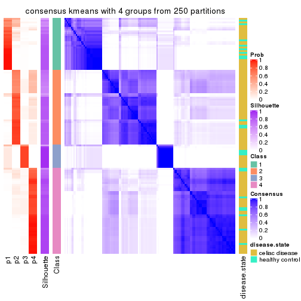</p>

</div>
<div id='tab-MAD-kmeans-consensus-heatmap-4'>
<pre><code class="r">consensus_heatmap(res, k = 5)
</code></pre>

<p></p>

</div>
<div id='tab-MAD-kmeans-consensus-heatmap-5'>
<pre><code class="r">consensus_heatmap(res, k = 6)
</code></pre>

<p></p>

</div>
</div>

Heatmaps for the membership of samples in all partitions to see how consistent they are:


<script>
$( function() {
	$( '#tabs-MAD-kmeans-membership-heatmap' ).tabs();
} );
</script>
<div id='tabs-MAD-kmeans-membership-heatmap'>
<ul>
<li><a href='#tab-MAD-kmeans-membership-heatmap-1'>k = 2</a></li>
<li><a href='#tab-MAD-kmeans-membership-heatmap-2'>k = 3</a></li>
<li><a href='#tab-MAD-kmeans-membership-heatmap-3'>k = 4</a></li>
<li><a href='#tab-MAD-kmeans-membership-heatmap-4'>k = 5</a></li>
<li><a href='#tab-MAD-kmeans-membership-heatmap-5'>k = 6</a></li>
</ul>
<div id='tab-MAD-kmeans-membership-heatmap-1'>
<pre><code class="r">membership_heatmap(res, k = 2)
</code></pre>

<p></p>

</div>
<div id='tab-MAD-kmeans-membership-heatmap-2'>
<pre><code class="r">membership_heatmap(res, k = 3)
</code></pre>

<p></p>

</div>
<div id='tab-MAD-kmeans-membership-heatmap-3'>
<pre><code class="r">membership_heatmap(res, k = 4)
</code></pre>

<p></p>

</div>
<div id='tab-MAD-kmeans-membership-heatmap-4'>
<pre><code class="r">membership_heatmap(res, k = 5)
</code></pre>

<p></p>

</div>
<div id='tab-MAD-kmeans-membership-heatmap-5'>
<pre><code class="r">membership_heatmap(res, k = 6)
</code></pre>

<p></p>

</div>
</div>

As soon as we have had the classes for columns, we can look for signatures
which are significantly different between classes which can be candidate marks
for certain classes. Following are the heatmaps for signatures.


Signature heatmaps where rows are scaled:


<script>
$( function() {
	$( '#tabs-MAD-kmeans-get-signatures' ).tabs();
} );
</script>
<div id='tabs-MAD-kmeans-get-signatures'>
<ul>
<li><a href='#tab-MAD-kmeans-get-signatures-1'>k = 2</a></li>
<li><a href='#tab-MAD-kmeans-get-signatures-2'>k = 3</a></li>
<li><a href='#tab-MAD-kmeans-get-signatures-3'>k = 4</a></li>
<li><a href='#tab-MAD-kmeans-get-signatures-4'>k = 5</a></li>
<li><a href='#tab-MAD-kmeans-get-signatures-5'>k = 6</a></li>
</ul>
<div id='tab-MAD-kmeans-get-signatures-1'>
<pre><code class="r">get_signatures(res, k = 2)
</code></pre>

<p></p>

</div>
<div id='tab-MAD-kmeans-get-signatures-2'>
<pre><code class="r">get_signatures(res, k = 3)
</code></pre>

<p></p>

</div>
<div id='tab-MAD-kmeans-get-signatures-3'>
<pre><code class="r">get_signatures(res, k = 4)
</code></pre>

<p></p>

</div>
<div id='tab-MAD-kmeans-get-signatures-4'>
<pre><code class="r">get_signatures(res, k = 5)
</code></pre>

<p></p>

</div>
<div id='tab-MAD-kmeans-get-signatures-5'>
<pre><code class="r">get_signatures(res, k = 6)
</code></pre>

<p></p>

</div>
</div>


Signature heatmaps where rows are not scaled:


<script>
$( function() {
	$( '#tabs-MAD-kmeans-get-signatures-no-scale' ).tabs();
} );
</script>
<div id='tabs-MAD-kmeans-get-signatures-no-scale'>
<ul>
<li><a href='#tab-MAD-kmeans-get-signatures-no-scale-1'>k = 2</a></li>
<li><a href='#tab-MAD-kmeans-get-signatures-no-scale-2'>k = 3</a></li>
<li><a href='#tab-MAD-kmeans-get-signatures-no-scale-3'>k = 4</a></li>
<li><a href='#tab-MAD-kmeans-get-signatures-no-scale-4'>k = 5</a></li>
<li><a href='#tab-MAD-kmeans-get-signatures-no-scale-5'>k = 6</a></li>
</ul>
<div id='tab-MAD-kmeans-get-signatures-no-scale-1'>
<pre><code class="r">get_signatures(res, k = 2, scale_rows = FALSE)
</code></pre>

<p>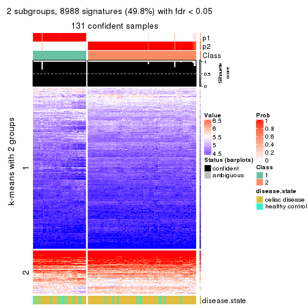</p>

</div>
<div id='tab-MAD-kmeans-get-signatures-no-scale-2'>
<pre><code class="r">get_signatures(res, k = 3, scale_rows = FALSE)
</code></pre>

<p></p>

</div>
<div id='tab-MAD-kmeans-get-signatures-no-scale-3'>
<pre><code class="r">get_signatures(res, k = 4, scale_rows = FALSE)
</code></pre>

<p></p>

</div>
<div id='tab-MAD-kmeans-get-signatures-no-scale-4'>
<pre><code class="r">get_signatures(res, k = 5, scale_rows = FALSE)
</code></pre>

<p></p>

</div>
<div id='tab-MAD-kmeans-get-signatures-no-scale-5'>
<pre><code class="r">get_signatures(res, k = 6, scale_rows = FALSE)
</code></pre>

<p></p>

</div>
</div>


Compare the overlap of signatures from different k:

```r
compare_signatures(res)
```


`get_signature()` returns a data frame invisibly. TO get the list of signatures, the function
call should be assigned to a variable explicitly. In following code, if `plot` argument is set
to `FALSE`, no heatmap is plotted while only the differential analysis is performed.

```r
# code only for demonstration
tb = get_signature(res, k = ..., plot = FALSE)
```

An example of the output of `tb` is:

```
#>   which_row         fdr    mean_1    mean_2 scaled_mean_1 scaled_mean_2 km
#> 1        38 0.042760348  8.373488  9.131774    -0.5533452     0.5164555  1
#> 2        40 0.018707592  7.106213  8.469186    -0.6173731     0.5762149  1
#> 3        55 0.019134737 10.221463 11.207825    -0.6159697     0.5749050  1
#> 4        59 0.006059896  5.921854  7.869574    -0.6899429     0.6439467  1
#> 5        60 0.018055526  8.928898 10.211722    -0.6204761     0.5791110  1
#> 6        98 0.009384629 15.714769 14.887706     0.6635654    -0.6193277  2
...
```

The columns in `tb` are:

1. `which_row`: row indices corresponding to the input matrix.
2. `fdr`: FDR for the differential test. 
3. `mean_x`: The mean value in group x.
4. `scaled_mean_x`: The mean value in group x after rows are scaled.
5. `km`: Row groups if k-means clustering is applied to rows.


UMAP plot which shows how samples are separated.


<script>
$( function() {
	$( '#tabs-MAD-kmeans-dimension-reduction' ).tabs();
} );
</script>
<div id='tabs-MAD-kmeans-dimension-reduction'>
<ul>
<li><a href='#tab-MAD-kmeans-dimension-reduction-1'>k = 2</a></li>
<li><a href='#tab-MAD-kmeans-dimension-reduction-2'>k = 3</a></li>
<li><a href='#tab-MAD-kmeans-dimension-reduction-3'>k = 4</a></li>
<li><a href='#tab-MAD-kmeans-dimension-reduction-4'>k = 5</a></li>
<li><a href='#tab-MAD-kmeans-dimension-reduction-5'>k = 6</a></li>
</ul>
<div id='tab-MAD-kmeans-dimension-reduction-1'>
<pre><code class="r">dimension_reduction(res, k = 2, method = &quot;UMAP&quot;)
</code></pre>

<p></p>

</div>
<div id='tab-MAD-kmeans-dimension-reduction-2'>
<pre><code class="r">dimension_reduction(res, k = 3, method = &quot;UMAP&quot;)
</code></pre>

<p></p>

</div>
<div id='tab-MAD-kmeans-dimension-reduction-3'>
<pre><code class="r">dimension_reduction(res, k = 4, method = &quot;UMAP&quot;)
</code></pre>

<p></p>

</div>
<div id='tab-MAD-kmeans-dimension-reduction-4'>
<pre><code class="r">dimension_reduction(res, k = 5, method = &quot;UMAP&quot;)
</code></pre>

<p></p>

</div>
<div id='tab-MAD-kmeans-dimension-reduction-5'>
<pre><code class="r">dimension_reduction(res, k = 6, method = &quot;UMAP&quot;)
</code></pre>

<p></p>

</div>
</div>


Following heatmap shows how subgroups are split when increasing `k`:

```r
collect_classes(res)
```


Test correlation between subgroups and known annotations. If the known
annotation is numeric, one-way ANOVA test is applied, and if the known
annotation is discrete, chi-squared contingency table test is applied.

```r
test_to_known_factors(res)
```

```
#>              n disease.state(p) k
#> MAD:kmeans 131           0.0332 2
#> MAD:kmeans 125           0.0404 3
#> MAD:kmeans 130           0.1060 4
#> MAD:kmeans  95           0.4273 5
#> MAD:kmeans 100           0.5560 6
```


If matrix rows can be associated to genes, consider to use `GO_Enrichment(res,
...)` to perform function enrichment for the signature genes.


 

---------------------------------------------------


### MAD:skmeans**


The object with results only for a single top-value method and a single partition method 
can be extracted as:

```r
res = res_list["MAD", "skmeans"]
# you can also extract it by
# res = res_list["MAD:skmeans"]
```

A summary of `res` and all the functions that can be applied to it:

```r
res
```

```
#> A 'ConsensusPartition' object with k = 2, 3, 4, 5, 6.
#>   On a matrix with 18032 rows and 132 columns.
#>   Top rows (1000, 2000, 3000, 4000, 5000) are extracted by 'MAD' method.
#>   Subgroups are detected by 'skmeans' method.
#>   Performed in total 1250 partitions by row resampling.
#>   Best k for subgroups seems to be 2.
#> 
#> Following methods can be applied to this 'ConsensusPartition' object:
#>  [1] "cola_report"             "collect_classes"         "collect_plots"          
#>  [4] "collect_stats"           "colnames"                "compare_signatures"     
#>  [7] "consensus_heatmap"       "dimension_reduction"     "functional_enrichment"  
#> [10] "get_anno_col"            "get_anno"                "get_classes"            
#> [13] "get_consensus"           "get_matrix"              "get_membership"         
#> [16] "get_param"               "get_signatures"          "get_stats"              
#> [19] "is_best_k"               "is_stable_k"             "membership_heatmap"     
#> [22] "ncol"                    "nrow"                    "plot_ecdf"              
#> [25] "rownames"                "select_partition_number" "show"                   
#> [28] "suggest_best_k"          "test_to_known_factors"
```

`collect_plots()` function collects all the plots made from `res` for all `k` (number of partitions)
into one single page to provide an easy and fast comparison between different `k`.

```r
collect_plots(res)
```


The plots are:

- The first row: a plot of the ECDF (Empirical cumulative distribution
  function) curves of the consensus matrix for each `k` and the heatmap of
  predicted classes for each `k`.
- The second row: heatmaps of the consensus matrix for each `k`.
- The third row: heatmaps of the membership matrix for each `k`.
- The fouth row: heatmaps of the signatures for each `k`.

All the plots in panels can be made by individual functions and they are
plotted later in this section.

`select_partition_number()` produces several plots showing different
statistics for choosing "optimized" `k`. There are following statistics:

- ECDF curves of the consensus matrix for each `k`;
- 1-PAC. [The PAC
  score](https://en.wikipedia.org/wiki/Consensus_clustering#Over-interpretation_potential_of_consensus_clustering)
  measures the proportion of the ambiguous subgrouping.
- Mean silhouette score.
- Concordance. The mean probability of fiting the consensus class ids in all
  partitions.
- Area increased. Denote $A_k$ as the area under the ECDF curve for current
  `k`, the area increased is defined as $A_k - A_{k-1}$.
- Rand index. The percent of pairs of samples that are both in a same cluster
  or both are not in a same cluster in the partition of k and k-1.
- Jaccard index. The ratio of pairs of samples are both in a same cluster in
  the partition of k and k-1 and the pairs of samples are both in a same
  cluster in the partition k or k-1.

The detailed explanations of these statistics can be found in [the cola
vignette](http://bioconductor.org/packages/devel/bioc/vignettes/cola/inst/doc/cola.html#toc_13).

Generally speaking, lower PAC score, higher mean silhouette score or higher
concordance corresponds to better partition. Rand index and Jaccard index
measure how similar the current partition is compared to partition with `k-1`.
If they are too similar, we won't accept `k` is better than `k-1`.

```r
select_partition_number(res)
```


The numeric values for all these statistics can be obtained by `get_stats()`.

```r
get_stats(res)
```

```
#>   k 1-PAC mean_silhouette concordance area_increased  Rand Jaccard
#> 2 2 1.000           0.985       0.994         0.4894 0.510   0.510
#> 3 3 0.872           0.933       0.968         0.3680 0.704   0.478
#> 4 4 0.745           0.849       0.866         0.1033 0.905   0.724
#> 5 5 0.749           0.690       0.831         0.0782 0.885   0.600
#> 6 6 0.762           0.656       0.798         0.0422 0.910   0.605
```

`suggest_best_k()` suggests the best $k$ based on these statistics. The rules are as follows:

- All $k$ with Jaccard index larger than 0.95 are removed because the increase of
  the partition number does not provides enough extra information. If all $k$ are removed,
  the best $k$ is assigned by `NA`.
- For $k$ with 1-PAC larger than 0.9, the maximal $k$ is taken as the "best k". Other $k$ is called "optional k".
- If it does not fit the second rule. The $k$ with the highest vote of highest
  1-PAC, mean silhouette and concordance is taken as the "best k".

```r
suggest_best_k(res)
```

```
#> [1] 2
```


Following shows the table of the partitions (You need to click the **show/hide
code output** link to see it). The membership matrix (columns with name `p*`)
is inferred by
[`clue::cl_consensus()`](https://www.rdocumentation.org/link/cl_consensus?package=clue)
function with the `SE` method. Basically the value in the membership matrix
represents the probability to belong to a certain group. The finall class
label for an item is determined with the group with highest probability it
belongs to.

In `get_classes()` function, the entropy is calculated from the membership
matrix and the silhouette score is calculated from the consensus matrix.


<script>
$( function() {
	$( '#tabs-MAD-skmeans-get-classes' ).tabs();
} );
</script>
<div id='tabs-MAD-skmeans-get-classes'>
<ul>
<li><a href='#tab-MAD-skmeans-get-classes-1'>k = 2</a></li>
<li><a href='#tab-MAD-skmeans-get-classes-2'>k = 3</a></li>
<li><a href='#tab-MAD-skmeans-get-classes-3'>k = 4</a></li>
<li><a href='#tab-MAD-skmeans-get-classes-4'>k = 5</a></li>
<li><a href='#tab-MAD-skmeans-get-classes-5'>k = 6</a></li>
</ul>

<div id='tab-MAD-skmeans-get-classes-1'>
<p><a id='tab-MAD-skmeans-get-classes-1-a' style='color:#0366d6' href='#'>show/hide code output</a></p>
<pre><code class="r">cbind(get_classes(res, k = 2), get_membership(res, k = 2))
</code></pre>

<pre><code>#&gt;           class entropy silhouette    p1    p2
#&gt; GSM289470     1  0.0000      0.989 1.000 0.000
#&gt; GSM289471     1  0.0000      0.989 1.000 0.000
#&gt; GSM289472     2  0.0000      0.996 0.000 1.000
#&gt; GSM289473     2  0.0000      0.996 0.000 1.000
#&gt; GSM289474     2  0.0000      0.996 0.000 1.000
#&gt; GSM289475     2  0.0000      0.996 0.000 1.000
#&gt; GSM289476     1  0.0000      0.989 1.000 0.000
#&gt; GSM289477     2  0.0000      0.996 0.000 1.000
#&gt; GSM289478     2  0.0000      0.996 0.000 1.000
#&gt; GSM289479     2  0.0938      0.986 0.012 0.988
#&gt; GSM289480     2  0.0000      0.996 0.000 1.000
#&gt; GSM289481     2  0.0000      0.996 0.000 1.000
#&gt; GSM289482     2  0.0000      0.996 0.000 1.000
#&gt; GSM289483     2  0.0000      0.996 0.000 1.000
#&gt; GSM289484     2  0.0000      0.996 0.000 1.000
#&gt; GSM289485     2  0.0000      0.996 0.000 1.000
#&gt; GSM289486     1  0.0000      0.989 1.000 0.000
#&gt; GSM289487     2  0.0000      0.996 0.000 1.000
#&gt; GSM289488     2  0.0000      0.996 0.000 1.000
#&gt; GSM289489     2  0.0000      0.996 0.000 1.000
#&gt; GSM289490     1  0.7219      0.749 0.800 0.200
#&gt; GSM289491     2  0.0000      0.996 0.000 1.000
#&gt; GSM289492     1  0.0000      0.989 1.000 0.000
#&gt; GSM289493     2  0.0000      0.996 0.000 1.000
#&gt; GSM289494     1  0.0000      0.989 1.000 0.000
#&gt; GSM289495     2  0.0000      0.996 0.000 1.000
#&gt; GSM289496     2  0.0000      0.996 0.000 1.000
#&gt; GSM289497     2  0.0000      0.996 0.000 1.000
#&gt; GSM289498     1  0.0000      0.989 1.000 0.000
#&gt; GSM289499     2  0.0000      0.996 0.000 1.000
#&gt; GSM289500     1  0.0000      0.989 1.000 0.000
#&gt; GSM289501     2  0.0000      0.996 0.000 1.000
#&gt; GSM289502     2  0.0000      0.996 0.000 1.000
#&gt; GSM289503     2  0.0000      0.996 0.000 1.000
#&gt; GSM289504     2  0.0000      0.996 0.000 1.000
#&gt; GSM289505     2  0.0000      0.996 0.000 1.000
#&gt; GSM289506     2  0.0000      0.996 0.000 1.000
#&gt; GSM289507     2  0.0000      0.996 0.000 1.000
#&gt; GSM289508     1  0.0000      0.989 1.000 0.000
#&gt; GSM289509     1  0.0000      0.989 1.000 0.000
#&gt; GSM289510     1  0.9170      0.503 0.668 0.332
#&gt; GSM289511     2  0.0000      0.996 0.000 1.000
#&gt; GSM289512     1  0.0000      0.989 1.000 0.000
#&gt; GSM289513     2  0.0000      0.996 0.000 1.000
#&gt; GSM289514     1  0.0000      0.989 1.000 0.000
#&gt; GSM289515     2  0.0000      0.996 0.000 1.000
#&gt; GSM289516     2  0.0938      0.986 0.012 0.988
#&gt; GSM289517     2  0.1633      0.974 0.024 0.976
#&gt; GSM289518     2  0.7056      0.760 0.192 0.808
#&gt; GSM289519     1  0.0000      0.989 1.000 0.000
#&gt; GSM289520     2  0.0000      0.996 0.000 1.000
#&gt; GSM289521     1  0.0000      0.989 1.000 0.000
#&gt; GSM289522     1  0.1843      0.963 0.972 0.028
#&gt; GSM289523     1  0.0000      0.989 1.000 0.000
#&gt; GSM289524     2  0.0000      0.996 0.000 1.000
#&gt; GSM289525     2  0.0000      0.996 0.000 1.000
#&gt; GSM289526     1  0.0000      0.989 1.000 0.000
#&gt; GSM289527     2  0.0000      0.996 0.000 1.000
#&gt; GSM289528     2  0.0000      0.996 0.000 1.000
#&gt; GSM289529     2  0.0000      0.996 0.000 1.000
#&gt; GSM289530     1  0.0000      0.989 1.000 0.000
#&gt; GSM289531     2  0.0000      0.996 0.000 1.000
#&gt; GSM289532     1  0.0000      0.989 1.000 0.000
#&gt; GSM289533     2  0.0000      0.996 0.000 1.000
#&gt; GSM289534     1  0.0000      0.989 1.000 0.000
#&gt; GSM289535     1  0.0000      0.989 1.000 0.000
#&gt; GSM289536     1  0.0000      0.989 1.000 0.000
#&gt; GSM289537     2  0.0000      0.996 0.000 1.000
#&gt; GSM289538     2  0.0000      0.996 0.000 1.000
#&gt; GSM289539     2  0.0000      0.996 0.000 1.000
#&gt; GSM289540     1  0.0000      0.989 1.000 0.000
#&gt; GSM289541     1  0.0000      0.989 1.000 0.000
#&gt; GSM289542     1  0.0000      0.989 1.000 0.000
#&gt; GSM289543     1  0.0938      0.978 0.988 0.012
#&gt; GSM289544     1  0.0000      0.989 1.000 0.000
#&gt; GSM289545     2  0.0000      0.996 0.000 1.000
#&gt; GSM289546     2  0.0000      0.996 0.000 1.000
#&gt; GSM289547     2  0.0000      0.996 0.000 1.000
#&gt; GSM289548     1  0.0000      0.989 1.000 0.000
#&gt; GSM289549     1  0.0000      0.989 1.000 0.000
#&gt; GSM289550     1  0.0000      0.989 1.000 0.000
#&gt; GSM289551     1  0.0000      0.989 1.000 0.000
#&gt; GSM289552     1  0.0000      0.989 1.000 0.000
#&gt; GSM289553     1  0.0000      0.989 1.000 0.000
#&gt; GSM289554     2  0.0000      0.996 0.000 1.000
#&gt; GSM289555     2  0.0000      0.996 0.000 1.000
#&gt; GSM289556     1  0.0000      0.989 1.000 0.000
#&gt; GSM289557     2  0.0000      0.996 0.000 1.000
#&gt; GSM289558     2  0.0000      0.996 0.000 1.000
#&gt; GSM289559     1  0.0000      0.989 1.000 0.000
#&gt; GSM289560     2  0.0000      0.996 0.000 1.000
#&gt; GSM289561     2  0.0000      0.996 0.000 1.000
#&gt; GSM289562     1  0.0000      0.989 1.000 0.000
#&gt; GSM289563     1  0.0000      0.989 1.000 0.000
#&gt; GSM289564     2  0.0000      0.996 0.000 1.000
#&gt; GSM289565     1  0.0000      0.989 1.000 0.000
#&gt; GSM289566     1  0.0000      0.989 1.000 0.000
#&gt; GSM289567     2  0.0938      0.986 0.012 0.988
#&gt; GSM289568     2  0.0000      0.996 0.000 1.000
#&gt; GSM289569     2  0.0000      0.996 0.000 1.000
#&gt; GSM289570     2  0.0938      0.986 0.012 0.988
#&gt; GSM289571     2  0.0000      0.996 0.000 1.000
#&gt; GSM289572     2  0.0000      0.996 0.000 1.000
#&gt; GSM289573     2  0.0000      0.996 0.000 1.000
#&gt; GSM289574     2  0.0000      0.996 0.000 1.000
#&gt; GSM289575     2  0.0000      0.996 0.000 1.000
#&gt; GSM289576     2  0.0000      0.996 0.000 1.000
#&gt; GSM289577     2  0.0000      0.996 0.000 1.000
#&gt; GSM289578     2  0.0000      0.996 0.000 1.000
#&gt; GSM289579     2  0.0000      0.996 0.000 1.000
#&gt; GSM289580     1  0.0000      0.989 1.000 0.000
#&gt; GSM289581     1  0.0000      0.989 1.000 0.000
#&gt; GSM289582     2  0.0000      0.996 0.000 1.000
#&gt; GSM289583     2  0.0000      0.996 0.000 1.000
#&gt; GSM289584     2  0.0000      0.996 0.000 1.000
#&gt; GSM289585     2  0.0000      0.996 0.000 1.000
#&gt; GSM289586     1  0.0000      0.989 1.000 0.000
#&gt; GSM289587     1  0.0000      0.989 1.000 0.000
#&gt; GSM289588     1  0.0000      0.989 1.000 0.000
#&gt; GSM289589     1  0.0000      0.989 1.000 0.000
#&gt; GSM289590     1  0.0000      0.989 1.000 0.000
#&gt; GSM289591     1  0.0000      0.989 1.000 0.000
#&gt; GSM289592     2  0.0000      0.996 0.000 1.000
#&gt; GSM289593     1  0.0000      0.989 1.000 0.000
#&gt; GSM289594     2  0.0000      0.996 0.000 1.000
#&gt; GSM289595     1  0.0000      0.989 1.000 0.000
#&gt; GSM289596     2  0.0000      0.996 0.000 1.000
#&gt; GSM289597     2  0.0000      0.996 0.000 1.000
#&gt; GSM289598     1  0.0000      0.989 1.000 0.000
#&gt; GSM289599     1  0.0376      0.986 0.996 0.004
#&gt; GSM289600     1  0.0000      0.989 1.000 0.000
#&gt; GSM289601     1  0.0000      0.989 1.000 0.000
</code></pre>

<script>
$('#tab-MAD-skmeans-get-classes-1-a').parent().next().next().hide();
$('#tab-MAD-skmeans-get-classes-1-a').click(function(){
  $('#tab-MAD-skmeans-get-classes-1-a').parent().next().next().toggle();
  return(false);
});
</script>
</div>

<div id='tab-MAD-skmeans-get-classes-2'>
<p><a id='tab-MAD-skmeans-get-classes-2-a' style='color:#0366d6' href='#'>show/hide code output</a></p>
<pre><code class="r">cbind(get_classes(res, k = 3), get_membership(res, k = 3))
</code></pre>

<pre><code>#&gt;           class entropy silhouette    p1    p2    p3
#&gt; GSM289470     3  0.6291      0.102 0.468 0.000 0.532
#&gt; GSM289471     1  0.0000      0.993 1.000 0.000 0.000
#&gt; GSM289472     3  0.3116      0.897 0.000 0.108 0.892
#&gt; GSM289473     3  0.0000      0.942 0.000 0.000 1.000
#&gt; GSM289474     3  0.0000      0.942 0.000 0.000 1.000
#&gt; GSM289475     3  0.3267      0.892 0.000 0.116 0.884
#&gt; GSM289476     1  0.0000      0.993 1.000 0.000 0.000
#&gt; GSM289477     3  0.3267      0.892 0.000 0.116 0.884
#&gt; GSM289478     3  0.3267      0.892 0.000 0.116 0.884
#&gt; GSM289479     3  0.0000      0.942 0.000 0.000 1.000
#&gt; GSM289480     3  0.3116      0.897 0.000 0.108 0.892
#&gt; GSM289481     3  0.1411      0.931 0.000 0.036 0.964
#&gt; GSM289482     3  0.3267      0.892 0.000 0.116 0.884
#&gt; GSM289483     3  0.3267      0.892 0.000 0.116 0.884
#&gt; GSM289484     3  0.3267      0.892 0.000 0.116 0.884
#&gt; GSM289485     3  0.3267      0.892 0.000 0.116 0.884
#&gt; GSM289486     1  0.0000      0.993 1.000 0.000 0.000
#&gt; GSM289487     3  0.3267      0.892 0.000 0.116 0.884
#&gt; GSM289488     3  0.3267      0.892 0.000 0.116 0.884
#&gt; GSM289489     3  0.0000      0.942 0.000 0.000 1.000
#&gt; GSM289490     2  0.4178      0.786 0.172 0.828 0.000
#&gt; GSM289491     2  0.0000      0.964 0.000 1.000 0.000
#&gt; GSM289492     2  0.6295      0.161 0.472 0.528 0.000
#&gt; GSM289493     2  0.0000      0.964 0.000 1.000 0.000
#&gt; GSM289494     1  0.0000      0.993 1.000 0.000 0.000
#&gt; GSM289495     2  0.0000      0.964 0.000 1.000 0.000
#&gt; GSM289496     2  0.0000      0.964 0.000 1.000 0.000
#&gt; GSM289497     2  0.0000      0.964 0.000 1.000 0.000
#&gt; GSM289498     2  0.6302      0.134 0.480 0.520 0.000
#&gt; GSM289499     2  0.0000      0.964 0.000 1.000 0.000
#&gt; GSM289500     1  0.0000      0.993 1.000 0.000 0.000
#&gt; GSM289501     2  0.0000      0.964 0.000 1.000 0.000
#&gt; GSM289502     2  0.0000      0.964 0.000 1.000 0.000
#&gt; GSM289503     2  0.0000      0.964 0.000 1.000 0.000
#&gt; GSM289504     2  0.0000      0.964 0.000 1.000 0.000
#&gt; GSM289505     2  0.0000      0.964 0.000 1.000 0.000
#&gt; GSM289506     2  0.0000      0.964 0.000 1.000 0.000
#&gt; GSM289507     2  0.0000      0.964 0.000 1.000 0.000
#&gt; GSM289508     1  0.0000      0.993 1.000 0.000 0.000
#&gt; GSM289509     1  0.0000      0.993 1.000 0.000 0.000
#&gt; GSM289510     3  0.0000      0.942 0.000 0.000 1.000
#&gt; GSM289511     3  0.0000      0.942 0.000 0.000 1.000
#&gt; GSM289512     1  0.0000      0.993 1.000 0.000 0.000
#&gt; GSM289513     3  0.0000      0.942 0.000 0.000 1.000
#&gt; GSM289514     3  0.3619      0.830 0.136 0.000 0.864
#&gt; GSM289515     3  0.0000      0.942 0.000 0.000 1.000
#&gt; GSM289516     3  0.0000      0.942 0.000 0.000 1.000
#&gt; GSM289517     3  0.0000      0.942 0.000 0.000 1.000
#&gt; GSM289518     3  0.0000      0.942 0.000 0.000 1.000
#&gt; GSM289519     3  0.4504      0.764 0.196 0.000 0.804
#&gt; GSM289520     3  0.0000      0.942 0.000 0.000 1.000
#&gt; GSM289521     1  0.0000      0.993 1.000 0.000 0.000
#&gt; GSM289522     3  0.0000      0.942 0.000 0.000 1.000
#&gt; GSM289523     1  0.0000      0.993 1.000 0.000 0.000
#&gt; GSM289524     3  0.0000      0.942 0.000 0.000 1.000
#&gt; GSM289525     3  0.0000      0.942 0.000 0.000 1.000
#&gt; GSM289526     3  0.2625      0.881 0.084 0.000 0.916
#&gt; GSM289527     3  0.0000      0.942 0.000 0.000 1.000
#&gt; GSM289528     3  0.3340      0.889 0.000 0.120 0.880
#&gt; GSM289529     3  0.0000      0.942 0.000 0.000 1.000
#&gt; GSM289530     1  0.0000      0.993 1.000 0.000 0.000
#&gt; GSM289531     3  0.2448      0.900 0.000 0.076 0.924
#&gt; GSM289532     1  0.0000      0.993 1.000 0.000 0.000
#&gt; GSM289533     3  0.0000      0.942 0.000 0.000 1.000
#&gt; GSM289534     1  0.0000      0.993 1.000 0.000 0.000
#&gt; GSM289535     2  0.5138      0.671 0.252 0.748 0.000
#&gt; GSM289536     1  0.0000      0.993 1.000 0.000 0.000
#&gt; GSM289537     2  0.0000      0.964 0.000 1.000 0.000
#&gt; GSM289538     2  0.0000      0.964 0.000 1.000 0.000
#&gt; GSM289539     2  0.0000      0.964 0.000 1.000 0.000
#&gt; GSM289540     1  0.0000      0.993 1.000 0.000 0.000
#&gt; GSM289541     1  0.0000      0.993 1.000 0.000 0.000
#&gt; GSM289542     1  0.0000      0.993 1.000 0.000 0.000
#&gt; GSM289543     2  0.0237      0.961 0.004 0.996 0.000
#&gt; GSM289544     1  0.0000      0.993 1.000 0.000 0.000
#&gt; GSM289545     2  0.0000      0.964 0.000 1.000 0.000
#&gt; GSM289546     2  0.0000      0.964 0.000 1.000 0.000
#&gt; GSM289547     2  0.0000      0.964 0.000 1.000 0.000
#&gt; GSM289548     1  0.0000      0.993 1.000 0.000 0.000
#&gt; GSM289549     1  0.4555      0.753 0.800 0.000 0.200
#&gt; GSM289550     1  0.0000      0.993 1.000 0.000 0.000
#&gt; GSM289551     1  0.0000      0.993 1.000 0.000 0.000
#&gt; GSM289552     1  0.0000      0.993 1.000 0.000 0.000
#&gt; GSM289553     1  0.0000      0.993 1.000 0.000 0.000
#&gt; GSM289554     2  0.0000      0.964 0.000 1.000 0.000
#&gt; GSM289555     2  0.0000      0.964 0.000 1.000 0.000
#&gt; GSM289556     1  0.0000      0.993 1.000 0.000 0.000
#&gt; GSM289557     2  0.0000      0.964 0.000 1.000 0.000
#&gt; GSM289558     2  0.0000      0.964 0.000 1.000 0.000
#&gt; GSM289559     1  0.0000      0.993 1.000 0.000 0.000
#&gt; GSM289560     2  0.0000      0.964 0.000 1.000 0.000
#&gt; GSM289561     2  0.0000      0.964 0.000 1.000 0.000
#&gt; GSM289562     1  0.0000      0.993 1.000 0.000 0.000
#&gt; GSM289563     1  0.2356      0.915 0.928 0.000 0.072
#&gt; GSM289564     2  0.0000      0.964 0.000 1.000 0.000
#&gt; GSM289565     1  0.0000      0.993 1.000 0.000 0.000
#&gt; GSM289566     1  0.0000      0.993 1.000 0.000 0.000
#&gt; GSM289567     3  0.0000      0.942 0.000 0.000 1.000
#&gt; GSM289568     3  0.0000      0.942 0.000 0.000 1.000
#&gt; GSM289569     3  0.0000      0.942 0.000 0.000 1.000
#&gt; GSM289570     3  0.0000      0.942 0.000 0.000 1.000
#&gt; GSM289571     2  0.0000      0.964 0.000 1.000 0.000
#&gt; GSM289572     2  0.0000      0.964 0.000 1.000 0.000
#&gt; GSM289573     2  0.0000      0.964 0.000 1.000 0.000
#&gt; GSM289574     2  0.0000      0.964 0.000 1.000 0.000
#&gt; GSM289575     2  0.0000      0.964 0.000 1.000 0.000
#&gt; GSM289576     2  0.0000      0.964 0.000 1.000 0.000
#&gt; GSM289577     2  0.0000      0.964 0.000 1.000 0.000
#&gt; GSM289578     2  0.0000      0.964 0.000 1.000 0.000
#&gt; GSM289579     2  0.0000      0.964 0.000 1.000 0.000
#&gt; GSM289580     1  0.0000      0.993 1.000 0.000 0.000
#&gt; GSM289581     1  0.0000      0.993 1.000 0.000 0.000
#&gt; GSM289582     3  0.0000      0.942 0.000 0.000 1.000
#&gt; GSM289583     2  0.0000      0.964 0.000 1.000 0.000
#&gt; GSM289584     2  0.0000      0.964 0.000 1.000 0.000
#&gt; GSM289585     2  0.0000      0.964 0.000 1.000 0.000
#&gt; GSM289586     3  0.0000      0.942 0.000 0.000 1.000
#&gt; GSM289587     1  0.0000      0.993 1.000 0.000 0.000
#&gt; GSM289588     1  0.0000      0.993 1.000 0.000 0.000
#&gt; GSM289589     1  0.0000      0.993 1.000 0.000 0.000
#&gt; GSM289590     1  0.0000      0.993 1.000 0.000 0.000
#&gt; GSM289591     1  0.0000      0.993 1.000 0.000 0.000
#&gt; GSM289592     2  0.0000      0.964 0.000 1.000 0.000
#&gt; GSM289593     1  0.0000      0.993 1.000 0.000 0.000
#&gt; GSM289594     2  0.0000      0.964 0.000 1.000 0.000
#&gt; GSM289595     1  0.0000      0.993 1.000 0.000 0.000
#&gt; GSM289596     2  0.0000      0.964 0.000 1.000 0.000
#&gt; GSM289597     3  0.0000      0.942 0.000 0.000 1.000
#&gt; GSM289598     1  0.0000      0.993 1.000 0.000 0.000
#&gt; GSM289599     2  0.3816      0.818 0.148 0.852 0.000
#&gt; GSM289600     1  0.0000      0.993 1.000 0.000 0.000
#&gt; GSM289601     1  0.0000      0.993 1.000 0.000 0.000
</code></pre>

<script>
$('#tab-MAD-skmeans-get-classes-2-a').parent().next().next().hide();
$('#tab-MAD-skmeans-get-classes-2-a').click(function(){
  $('#tab-MAD-skmeans-get-classes-2-a').parent().next().next().toggle();
  return(false);
});
</script>
</div>

<div id='tab-MAD-skmeans-get-classes-3'>
<p><a id='tab-MAD-skmeans-get-classes-3-a' style='color:#0366d6' href='#'>show/hide code output</a></p>
<pre><code class="r">cbind(get_classes(res, k = 4), get_membership(res, k = 4))
</code></pre>

<pre><code>#&gt;           class entropy silhouette    p1    p2    p3    p4
#&gt; GSM289470     1  0.4022      0.817 0.836 0.096 0.068 0.000
#&gt; GSM289471     3  0.0188      0.874 0.004 0.000 0.996 0.000
#&gt; GSM289472     2  0.5512      0.788 0.172 0.728 0.000 0.100
#&gt; GSM289473     2  0.0592      0.884 0.016 0.984 0.000 0.000
#&gt; GSM289474     2  0.0000      0.885 0.000 1.000 0.000 0.000
#&gt; GSM289475     2  0.5512      0.788 0.172 0.728 0.000 0.100
#&gt; GSM289476     3  0.0188      0.874 0.004 0.000 0.996 0.000
#&gt; GSM289477     2  0.5199      0.794 0.144 0.756 0.000 0.100
#&gt; GSM289478     2  0.5512      0.788 0.172 0.728 0.000 0.100
#&gt; GSM289479     2  0.1118      0.881 0.036 0.964 0.000 0.000
#&gt; GSM289480     2  0.5512      0.788 0.172 0.728 0.000 0.100
#&gt; GSM289481     2  0.4638      0.819 0.152 0.788 0.000 0.060
#&gt; GSM289482     2  0.5247      0.795 0.148 0.752 0.000 0.100
#&gt; GSM289483     2  0.5199      0.794 0.144 0.756 0.000 0.100
#&gt; GSM289484     2  0.5512      0.788 0.172 0.728 0.000 0.100
#&gt; GSM289485     2  0.5244      0.503 0.436 0.556 0.000 0.008
#&gt; GSM289486     1  0.3356      0.940 0.824 0.000 0.176 0.000
#&gt; GSM289487     2  0.5512      0.788 0.172 0.728 0.000 0.100
#&gt; GSM289488     2  0.5199      0.794 0.144 0.756 0.000 0.100
#&gt; GSM289489     2  0.0921      0.883 0.028 0.972 0.000 0.000
#&gt; GSM289490     3  0.3311      0.724 0.000 0.000 0.828 0.172
#&gt; GSM289491     4  0.2053      0.910 0.072 0.004 0.000 0.924
#&gt; GSM289492     3  0.3311      0.724 0.000 0.000 0.828 0.172
#&gt; GSM289493     4  0.0000      0.925 0.000 0.000 0.000 1.000
#&gt; GSM289494     3  0.0524      0.870 0.004 0.000 0.988 0.008
#&gt; GSM289495     4  0.0376      0.922 0.004 0.000 0.004 0.992
#&gt; GSM289496     4  0.0000      0.925 0.000 0.000 0.000 1.000
#&gt; GSM289497     4  0.3448      0.876 0.168 0.004 0.000 0.828
#&gt; GSM289498     3  0.2888      0.771 0.004 0.000 0.872 0.124
#&gt; GSM289499     4  0.0376      0.922 0.004 0.000 0.004 0.992
#&gt; GSM289500     3  0.0188      0.874 0.004 0.000 0.996 0.000
#&gt; GSM289501     4  0.0000      0.925 0.000 0.000 0.000 1.000
#&gt; GSM289502     4  0.3448      0.876 0.168 0.004 0.000 0.828
#&gt; GSM289503     4  0.3402      0.878 0.164 0.004 0.000 0.832
#&gt; GSM289504     4  0.0000      0.925 0.000 0.000 0.000 1.000
#&gt; GSM289505     4  0.0000      0.925 0.000 0.000 0.000 1.000
#&gt; GSM289506     4  0.3448      0.876 0.168 0.004 0.000 0.828
#&gt; GSM289507     4  0.3448      0.876 0.168 0.004 0.000 0.828
#&gt; GSM289508     1  0.3726      0.909 0.788 0.000 0.212 0.000
#&gt; GSM289509     3  0.0000      0.872 0.000 0.000 1.000 0.000
#&gt; GSM289510     2  0.0376      0.883 0.004 0.992 0.004 0.000
#&gt; GSM289511     2  0.0817      0.884 0.024 0.976 0.000 0.000
#&gt; GSM289512     3  0.0188      0.874 0.004 0.000 0.996 0.000
#&gt; GSM289513     2  0.0921      0.883 0.028 0.972 0.000 0.000
#&gt; GSM289514     2  0.4661      0.587 0.256 0.728 0.016 0.000
#&gt; GSM289515     2  0.0188      0.884 0.004 0.996 0.000 0.000
#&gt; GSM289516     2  0.0188      0.884 0.004 0.996 0.000 0.000
#&gt; GSM289517     2  0.0188      0.884 0.004 0.996 0.000 0.000
#&gt; GSM289518     2  0.0188      0.884 0.004 0.996 0.000 0.000
#&gt; GSM289519     2  0.5785      0.495 0.272 0.664 0.064 0.000
#&gt; GSM289520     2  0.0817      0.884 0.024 0.976 0.000 0.000
#&gt; GSM289521     1  0.5780      0.344 0.496 0.028 0.476 0.000
#&gt; GSM289522     2  0.0188      0.884 0.004 0.996 0.000 0.000
#&gt; GSM289523     3  0.0188      0.874 0.004 0.000 0.996 0.000
#&gt; GSM289524     2  0.0921      0.883 0.028 0.972 0.000 0.000
#&gt; GSM289525     2  0.0188      0.884 0.004 0.996 0.000 0.000
#&gt; GSM289526     3  0.5712      0.369 0.032 0.384 0.584 0.000
#&gt; GSM289527     2  0.0921      0.883 0.028 0.972 0.000 0.000
#&gt; GSM289528     2  0.5582      0.783 0.168 0.724 0.000 0.108
#&gt; GSM289529     2  0.0188      0.884 0.004 0.996 0.000 0.000
#&gt; GSM289530     3  0.0524      0.868 0.008 0.004 0.988 0.000
#&gt; GSM289531     2  0.2861      0.843 0.016 0.888 0.000 0.096
#&gt; GSM289532     3  0.0376      0.868 0.004 0.004 0.992 0.000
#&gt; GSM289533     2  0.0921      0.883 0.028 0.972 0.000 0.000
#&gt; GSM289534     3  0.0188      0.874 0.004 0.000 0.996 0.000
#&gt; GSM289535     3  0.4250      0.614 0.000 0.000 0.724 0.276
#&gt; GSM289536     3  0.0188      0.874 0.004 0.000 0.996 0.000
#&gt; GSM289537     4  0.2868      0.890 0.136 0.000 0.000 0.864
#&gt; GSM289538     4  0.2973      0.888 0.144 0.000 0.000 0.856
#&gt; GSM289539     4  0.3448      0.876 0.168 0.004 0.000 0.828
#&gt; GSM289540     1  0.4406      0.813 0.700 0.000 0.300 0.000
#&gt; GSM289541     1  0.3356      0.940 0.824 0.000 0.176 0.000
#&gt; GSM289542     1  0.3539      0.935 0.820 0.000 0.176 0.004
#&gt; GSM289543     4  0.2714      0.822 0.004 0.000 0.112 0.884
#&gt; GSM289544     1  0.3356      0.940 0.824 0.000 0.176 0.000
#&gt; GSM289545     4  0.3123      0.884 0.156 0.000 0.000 0.844
#&gt; GSM289546     4  0.2973      0.888 0.144 0.000 0.000 0.856
#&gt; GSM289547     4  0.3448      0.876 0.168 0.004 0.000 0.828
#&gt; GSM289548     1  0.3356      0.940 0.824 0.000 0.176 0.000
#&gt; GSM289549     1  0.4022      0.817 0.836 0.096 0.068 0.000
#&gt; GSM289550     1  0.3356      0.940 0.824 0.000 0.176 0.000
#&gt; GSM289551     3  0.0188      0.874 0.004 0.000 0.996 0.000
#&gt; GSM289552     1  0.3356      0.940 0.824 0.000 0.176 0.000
#&gt; GSM289553     1  0.3356      0.940 0.824 0.000 0.176 0.000
#&gt; GSM289554     4  0.0000      0.925 0.000 0.000 0.000 1.000
#&gt; GSM289555     4  0.0000      0.925 0.000 0.000 0.000 1.000
#&gt; GSM289556     1  0.3356      0.940 0.824 0.000 0.176 0.000
#&gt; GSM289557     4  0.0188      0.925 0.004 0.000 0.000 0.996
#&gt; GSM289558     4  0.0188      0.925 0.004 0.000 0.000 0.996
#&gt; GSM289559     1  0.3356      0.940 0.824 0.000 0.176 0.000
#&gt; GSM289560     4  0.0000      0.925 0.000 0.000 0.000 1.000
#&gt; GSM289561     4  0.0000      0.925 0.000 0.000 0.000 1.000
#&gt; GSM289562     1  0.3356      0.940 0.824 0.000 0.176 0.000
#&gt; GSM289563     1  0.3311      0.936 0.828 0.000 0.172 0.000
#&gt; GSM289564     4  0.1792      0.868 0.000 0.000 0.068 0.932
#&gt; GSM289565     1  0.4406      0.813 0.700 0.000 0.300 0.000
#&gt; GSM289566     3  0.3444      0.660 0.184 0.000 0.816 0.000
#&gt; GSM289567     2  0.0188      0.884 0.004 0.996 0.000 0.000
#&gt; GSM289568     2  0.0921      0.883 0.028 0.972 0.000 0.000
#&gt; GSM289569     2  0.0000      0.885 0.000 1.000 0.000 0.000
#&gt; GSM289570     2  0.0188      0.884 0.004 0.996 0.000 0.000
#&gt; GSM289571     4  0.2868      0.890 0.136 0.000 0.000 0.864
#&gt; GSM289572     4  0.0000      0.925 0.000 0.000 0.000 1.000
#&gt; GSM289573     4  0.0188      0.925 0.004 0.000 0.000 0.996
#&gt; GSM289574     4  0.3448      0.876 0.168 0.004 0.000 0.828
#&gt; GSM289575     4  0.0000      0.925 0.000 0.000 0.000 1.000
#&gt; GSM289576     4  0.0707      0.923 0.020 0.000 0.000 0.980
#&gt; GSM289577     4  0.0000      0.925 0.000 0.000 0.000 1.000
#&gt; GSM289578     4  0.0000      0.925 0.000 0.000 0.000 1.000
#&gt; GSM289579     4  0.0000      0.925 0.000 0.000 0.000 1.000
#&gt; GSM289580     3  0.0188      0.874 0.004 0.000 0.996 0.000
#&gt; GSM289581     3  0.3402      0.685 0.164 0.004 0.832 0.000
#&gt; GSM289582     2  0.0592      0.885 0.016 0.984 0.000 0.000
#&gt; GSM289583     4  0.3448      0.876 0.168 0.004 0.000 0.828
#&gt; GSM289584     4  0.0817      0.921 0.024 0.000 0.000 0.976
#&gt; GSM289585     4  0.3448      0.876 0.168 0.004 0.000 0.828
#&gt; GSM289586     2  0.0188      0.884 0.004 0.996 0.000 0.000
#&gt; GSM289587     1  0.3356      0.940 0.824 0.000 0.176 0.000
#&gt; GSM289588     3  0.0188      0.874 0.004 0.000 0.996 0.000
#&gt; GSM289589     1  0.3356      0.940 0.824 0.000 0.176 0.000
#&gt; GSM289590     3  0.4730      0.125 0.364 0.000 0.636 0.000
#&gt; GSM289591     1  0.3356      0.940 0.824 0.000 0.176 0.000
#&gt; GSM289592     4  0.0188      0.925 0.004 0.000 0.000 0.996
#&gt; GSM289593     3  0.0188      0.874 0.004 0.000 0.996 0.000
#&gt; GSM289594     4  0.0000      0.925 0.000 0.000 0.000 1.000
#&gt; GSM289595     3  0.3726      0.587 0.212 0.000 0.788 0.000
#&gt; GSM289596     4  0.0188      0.925 0.004 0.000 0.000 0.996
#&gt; GSM289597     2  0.0188      0.884 0.004 0.996 0.000 0.000
#&gt; GSM289598     3  0.0188      0.874 0.004 0.000 0.996 0.000
#&gt; GSM289599     4  0.6478      0.445 0.236 0.000 0.132 0.632
#&gt; GSM289600     1  0.3356      0.940 0.824 0.000 0.176 0.000
#&gt; GSM289601     1  0.5022      0.810 0.708 0.028 0.264 0.000
</code></pre>

<script>
$('#tab-MAD-skmeans-get-classes-3-a').parent().next().next().hide();
$('#tab-MAD-skmeans-get-classes-3-a').click(function(){
  $('#tab-MAD-skmeans-get-classes-3-a').parent().next().next().toggle();
  return(false);
});
</script>
</div>

<div id='tab-MAD-skmeans-get-classes-4'>
<p><a id='tab-MAD-skmeans-get-classes-4-a' style='color:#0366d6' href='#'>show/hide code output</a></p>
<pre><code class="r">cbind(get_classes(res, k = 5), get_membership(res, k = 5))
</code></pre>

<pre><code>#&gt;           class entropy silhouette    p1    p2    p3    p4    p5
#&gt; GSM289470     1  0.0566     0.9286 0.984 0.000 0.000 0.012 0.004
#&gt; GSM289471     3  0.0290     0.8795 0.008 0.000 0.992 0.000 0.000
#&gt; GSM289472     5  0.3318     0.6350 0.000 0.008 0.000 0.192 0.800
#&gt; GSM289473     4  0.3424     0.6260 0.000 0.000 0.000 0.760 0.240
#&gt; GSM289474     4  0.2280     0.7222 0.000 0.000 0.000 0.880 0.120
#&gt; GSM289475     5  0.3618     0.6317 0.004 0.012 0.000 0.196 0.788
#&gt; GSM289476     3  0.0290     0.8795 0.008 0.000 0.992 0.000 0.000
#&gt; GSM289477     5  0.5284     0.2918 0.004 0.040 0.000 0.424 0.532
#&gt; GSM289478     5  0.3509     0.6295 0.004 0.008 0.000 0.196 0.792
#&gt; GSM289479     4  0.3837     0.3898 0.000 0.000 0.000 0.692 0.308
#&gt; GSM289480     5  0.3318     0.6350 0.000 0.008 0.000 0.192 0.800
#&gt; GSM289481     5  0.4779     0.6509 0.000 0.084 0.000 0.200 0.716
#&gt; GSM289482     4  0.5600    -0.1673 0.004 0.060 0.000 0.480 0.456
#&gt; GSM289483     5  0.4595     0.3656 0.004 0.008 0.000 0.400 0.588
#&gt; GSM289484     5  0.3934     0.6001 0.004 0.012 0.000 0.236 0.748
#&gt; GSM289485     5  0.6693     0.2183 0.212 0.004 0.000 0.336 0.448
#&gt; GSM289486     1  0.0162     0.9379 0.996 0.000 0.004 0.000 0.000
#&gt; GSM289487     5  0.3544     0.6275 0.004 0.008 0.000 0.200 0.788
#&gt; GSM289488     5  0.4595     0.3656 0.004 0.008 0.000 0.400 0.588
#&gt; GSM289489     5  0.4306    -0.0445 0.000 0.000 0.000 0.492 0.508
#&gt; GSM289490     3  0.4278     0.1443 0.000 0.452 0.548 0.000 0.000
#&gt; GSM289491     5  0.4288     0.4954 0.000 0.384 0.004 0.000 0.612
#&gt; GSM289492     3  0.0162     0.8745 0.000 0.004 0.996 0.000 0.000
#&gt; GSM289493     2  0.0290     0.8440 0.000 0.992 0.000 0.000 0.008
#&gt; GSM289494     3  0.0290     0.8795 0.008 0.000 0.992 0.000 0.000
#&gt; GSM289495     2  0.4039     0.6333 0.004 0.720 0.008 0.000 0.268
#&gt; GSM289496     2  0.0290     0.8440 0.000 0.992 0.000 0.000 0.008
#&gt; GSM289497     5  0.3612     0.6855 0.000 0.268 0.000 0.000 0.732
#&gt; GSM289498     3  0.0324     0.8757 0.000 0.004 0.992 0.000 0.004
#&gt; GSM289499     2  0.2389     0.7710 0.004 0.880 0.000 0.000 0.116
#&gt; GSM289500     3  0.0290     0.8795 0.008 0.000 0.992 0.000 0.000
#&gt; GSM289501     2  0.0290     0.8440 0.000 0.992 0.000 0.000 0.008
#&gt; GSM289502     5  0.3612     0.6855 0.000 0.268 0.000 0.000 0.732
#&gt; GSM289503     5  0.3796     0.6432 0.000 0.300 0.000 0.000 0.700
#&gt; GSM289504     2  0.0510     0.8381 0.000 0.984 0.000 0.000 0.016
#&gt; GSM289505     2  0.0290     0.8408 0.000 0.992 0.000 0.000 0.008
#&gt; GSM289506     5  0.3612     0.6855 0.000 0.268 0.000 0.000 0.732
#&gt; GSM289507     5  0.3612     0.6855 0.000 0.268 0.000 0.000 0.732
#&gt; GSM289508     1  0.1732     0.8699 0.920 0.000 0.080 0.000 0.000
#&gt; GSM289509     3  0.0451     0.8720 0.008 0.000 0.988 0.000 0.004
#&gt; GSM289510     4  0.3160     0.6453 0.000 0.000 0.004 0.808 0.188
#&gt; GSM289511     4  0.3661     0.5892 0.000 0.000 0.000 0.724 0.276
#&gt; GSM289512     3  0.0290     0.8795 0.008 0.000 0.992 0.000 0.000
#&gt; GSM289513     4  0.3752     0.5716 0.000 0.000 0.000 0.708 0.292
#&gt; GSM289514     4  0.4574     0.6047 0.060 0.000 0.008 0.748 0.184
#&gt; GSM289515     4  0.0000     0.7715 0.000 0.000 0.000 1.000 0.000
#&gt; GSM289516     4  0.0000     0.7715 0.000 0.000 0.000 1.000 0.000
#&gt; GSM289517     4  0.0000     0.7715 0.000 0.000 0.000 1.000 0.000
#&gt; GSM289518     4  0.0000     0.7715 0.000 0.000 0.000 1.000 0.000
#&gt; GSM289519     4  0.5877     0.4671 0.176 0.000 0.008 0.632 0.184
#&gt; GSM289520     4  0.1768     0.7351 0.004 0.000 0.000 0.924 0.072
#&gt; GSM289521     4  0.7889     0.0882 0.276 0.000 0.108 0.432 0.184
#&gt; GSM289522     4  0.0000     0.7715 0.000 0.000 0.000 1.000 0.000
#&gt; GSM289523     3  0.0290     0.8795 0.008 0.000 0.992 0.000 0.000
#&gt; GSM289524     4  0.3752     0.5716 0.000 0.000 0.000 0.708 0.292
#&gt; GSM289525     4  0.0162     0.7706 0.000 0.000 0.000 0.996 0.004
#&gt; GSM289526     3  0.5798     0.2602 0.000 0.000 0.556 0.336 0.108
#&gt; GSM289527     4  0.3752     0.5716 0.000 0.000 0.000 0.708 0.292
#&gt; GSM289528     5  0.4666     0.6646 0.000 0.088 0.000 0.180 0.732
#&gt; GSM289529     4  0.0000     0.7715 0.000 0.000 0.000 1.000 0.000
#&gt; GSM289530     3  0.4993     0.7026 0.012 0.000 0.724 0.084 0.180
#&gt; GSM289531     4  0.6211     0.3223 0.000 0.204 0.000 0.548 0.248
#&gt; GSM289532     3  0.4186     0.7345 0.004 0.000 0.768 0.044 0.184
#&gt; GSM289533     4  0.3999     0.4828 0.000 0.000 0.000 0.656 0.344
#&gt; GSM289534     3  0.0290     0.8795 0.008 0.000 0.992 0.000 0.000
#&gt; GSM289535     2  0.5853     0.4830 0.004 0.624 0.188 0.000 0.184
#&gt; GSM289536     3  0.0290     0.8795 0.008 0.000 0.992 0.000 0.000
#&gt; GSM289537     2  0.4227     0.0779 0.000 0.580 0.000 0.000 0.420
#&gt; GSM289538     2  0.4262     0.0174 0.000 0.560 0.000 0.000 0.440
#&gt; GSM289539     5  0.3612     0.6855 0.000 0.268 0.000 0.000 0.732
#&gt; GSM289540     1  0.5125     0.6930 0.708 0.008 0.100 0.000 0.184
#&gt; GSM289541     1  0.0324     0.9362 0.992 0.000 0.004 0.000 0.004
#&gt; GSM289542     1  0.0740     0.9306 0.980 0.008 0.004 0.000 0.008
#&gt; GSM289543     2  0.3754     0.7114 0.008 0.796 0.020 0.000 0.176
#&gt; GSM289544     1  0.2305     0.8702 0.896 0.000 0.012 0.000 0.092
#&gt; GSM289545     5  0.4430     0.1278 0.004 0.456 0.000 0.000 0.540
#&gt; GSM289546     2  0.4452    -0.0398 0.004 0.500 0.000 0.000 0.496
#&gt; GSM289547     5  0.3661     0.6776 0.000 0.276 0.000 0.000 0.724
#&gt; GSM289548     1  0.0162     0.9379 0.996 0.000 0.004 0.000 0.000
#&gt; GSM289549     1  0.0566     0.9286 0.984 0.000 0.000 0.012 0.004
#&gt; GSM289550     1  0.0162     0.9379 0.996 0.000 0.004 0.000 0.000
#&gt; GSM289551     3  0.0290     0.8795 0.008 0.000 0.992 0.000 0.000
#&gt; GSM289552     1  0.0162     0.9379 0.996 0.000 0.004 0.000 0.000
#&gt; GSM289553     1  0.0162     0.9379 0.996 0.000 0.004 0.000 0.000
#&gt; GSM289554     2  0.0290     0.8407 0.000 0.992 0.000 0.000 0.008
#&gt; GSM289555     2  0.0290     0.8440 0.000 0.992 0.000 0.000 0.008
#&gt; GSM289556     1  0.0162     0.9379 0.996 0.000 0.004 0.000 0.000
#&gt; GSM289557     2  0.0290     0.8440 0.000 0.992 0.000 0.000 0.008
#&gt; GSM289558     2  0.1270     0.8155 0.000 0.948 0.000 0.000 0.052
#&gt; GSM289559     1  0.0404     0.9332 0.988 0.000 0.012 0.000 0.000
#&gt; GSM289560     2  0.0290     0.8440 0.000 0.992 0.000 0.000 0.008
#&gt; GSM289561     2  0.0290     0.8440 0.000 0.992 0.000 0.000 0.008
#&gt; GSM289562     1  0.0162     0.9379 0.996 0.000 0.004 0.000 0.000
#&gt; GSM289563     1  0.0000     0.9359 1.000 0.000 0.000 0.000 0.000
#&gt; GSM289564     2  0.2852     0.7176 0.000 0.828 0.000 0.000 0.172
#&gt; GSM289565     1  0.4803     0.7039 0.720 0.000 0.096 0.000 0.184
#&gt; GSM289566     3  0.3109     0.7074 0.200 0.000 0.800 0.000 0.000
#&gt; GSM289567     4  0.0609     0.7650 0.000 0.000 0.000 0.980 0.020
#&gt; GSM289568     4  0.3684     0.5845 0.000 0.000 0.000 0.720 0.280
#&gt; GSM289569     4  0.1341     0.7519 0.000 0.000 0.000 0.944 0.056
#&gt; GSM289570     4  0.0794     0.7612 0.000 0.000 0.000 0.972 0.028
#&gt; GSM289571     2  0.4150     0.1850 0.000 0.612 0.000 0.000 0.388
#&gt; GSM289572     2  0.0404     0.8397 0.000 0.988 0.000 0.000 0.012
#&gt; GSM289573     2  0.0609     0.8382 0.000 0.980 0.000 0.000 0.020
#&gt; GSM289574     5  0.3612     0.6855 0.000 0.268 0.000 0.000 0.732
#&gt; GSM289575     2  0.0290     0.8440 0.000 0.992 0.000 0.000 0.008
#&gt; GSM289576     2  0.2179     0.7593 0.000 0.888 0.000 0.000 0.112
#&gt; GSM289577     2  0.0000     0.8422 0.000 1.000 0.000 0.000 0.000
#&gt; GSM289578     2  0.0609     0.8350 0.000 0.980 0.000 0.000 0.020
#&gt; GSM289579     2  0.0290     0.8440 0.000 0.992 0.000 0.000 0.008
#&gt; GSM289580     3  0.0290     0.8795 0.008 0.000 0.992 0.000 0.000
#&gt; GSM289581     3  0.6041     0.6484 0.056 0.000 0.664 0.100 0.180
#&gt; GSM289582     4  0.1121     0.7613 0.000 0.000 0.000 0.956 0.044
#&gt; GSM289583     5  0.3612     0.6855 0.000 0.268 0.000 0.000 0.732
#&gt; GSM289584     2  0.4015     0.3138 0.000 0.652 0.000 0.000 0.348
#&gt; GSM289585     5  0.3612     0.6855 0.000 0.268 0.000 0.000 0.732
#&gt; GSM289586     4  0.0000     0.7715 0.000 0.000 0.000 1.000 0.000
#&gt; GSM289587     1  0.0162     0.9379 0.996 0.000 0.004 0.000 0.000
#&gt; GSM289588     3  0.0290     0.8795 0.008 0.000 0.992 0.000 0.000
#&gt; GSM289589     1  0.0162     0.9379 0.996 0.000 0.004 0.000 0.000
#&gt; GSM289590     3  0.6348     0.2662 0.324 0.000 0.496 0.000 0.180
#&gt; GSM289591     1  0.0162     0.9379 0.996 0.000 0.004 0.000 0.000
#&gt; GSM289592     2  0.0703     0.8360 0.000 0.976 0.000 0.000 0.024
#&gt; GSM289593     3  0.0290     0.8795 0.008 0.000 0.992 0.000 0.000
#&gt; GSM289594     2  0.0290     0.8440 0.000 0.992 0.000 0.000 0.008
#&gt; GSM289595     3  0.3305     0.6725 0.224 0.000 0.776 0.000 0.000
#&gt; GSM289596     2  0.0290     0.8440 0.000 0.992 0.000 0.000 0.008
#&gt; GSM289597     4  0.0162     0.7706 0.000 0.000 0.000 0.996 0.004
#&gt; GSM289598     3  0.0290     0.8795 0.008 0.000 0.992 0.000 0.000
#&gt; GSM289599     2  0.4363     0.6240 0.016 0.708 0.008 0.000 0.268
#&gt; GSM289600     1  0.0162     0.9379 0.996 0.000 0.004 0.000 0.000
#&gt; GSM289601     1  0.7575     0.3166 0.456 0.000 0.072 0.284 0.188
</code></pre>

<script>
$('#tab-MAD-skmeans-get-classes-4-a').parent().next().next().hide();
$('#tab-MAD-skmeans-get-classes-4-a').click(function(){
  $('#tab-MAD-skmeans-get-classes-4-a').parent().next().next().toggle();
  return(false);
});
</script>
</div>

<div id='tab-MAD-skmeans-get-classes-5'>
<p><a id='tab-MAD-skmeans-get-classes-5-a' style='color:#0366d6' href='#'>show/hide code output</a></p>
<pre><code class="r">cbind(get_classes(res, k = 6), get_membership(res, k = 6))
</code></pre>

<pre><code>#&gt;           class entropy silhouette    p1    p2    p3    p4    p5    p6
#&gt; GSM289470     1  0.0146     0.9584 0.996 0.000 0.000 0.004 0.000 0.000
#&gt; GSM289471     3  0.0000     0.9343 0.000 0.000 1.000 0.000 0.000 0.000
#&gt; GSM289472     5  0.3672     0.5703 0.000 0.008 0.000 0.036 0.780 0.176
#&gt; GSM289473     4  0.3150     0.7356 0.000 0.000 0.000 0.832 0.064 0.104
#&gt; GSM289474     4  0.4453     0.4301 0.000 0.000 0.000 0.592 0.372 0.036
#&gt; GSM289475     5  0.1858     0.5436 0.000 0.000 0.000 0.076 0.912 0.012
#&gt; GSM289476     3  0.0000     0.9343 0.000 0.000 1.000 0.000 0.000 0.000
#&gt; GSM289477     5  0.3254     0.4754 0.000 0.000 0.000 0.136 0.816 0.048
#&gt; GSM289478     5  0.1644     0.5386 0.000 0.000 0.000 0.076 0.920 0.004
#&gt; GSM289479     5  0.4829    -0.0141 0.000 0.000 0.000 0.424 0.520 0.056
#&gt; GSM289480     5  0.3638     0.5701 0.000 0.008 0.000 0.036 0.784 0.172
#&gt; GSM289481     5  0.6368     0.5276 0.000 0.084 0.000 0.100 0.516 0.300
#&gt; GSM289482     5  0.3828     0.4366 0.000 0.000 0.000 0.124 0.776 0.100
#&gt; GSM289483     5  0.3235     0.4801 0.000 0.000 0.000 0.128 0.820 0.052
#&gt; GSM289484     5  0.2218     0.5197 0.000 0.000 0.000 0.104 0.884 0.012
#&gt; GSM289485     5  0.3747     0.4472 0.000 0.000 0.000 0.112 0.784 0.104
#&gt; GSM289486     1  0.0000     0.9612 1.000 0.000 0.000 0.000 0.000 0.000
#&gt; GSM289487     5  0.1812     0.5411 0.000 0.000 0.000 0.080 0.912 0.008
#&gt; GSM289488     5  0.3041     0.4869 0.000 0.000 0.000 0.128 0.832 0.040
#&gt; GSM289489     4  0.6370     0.2329 0.000 0.032 0.000 0.472 0.188 0.308
#&gt; GSM289490     3  0.4088     0.3403 0.000 0.368 0.616 0.000 0.000 0.016
#&gt; GSM289491     2  0.6724    -0.0334 0.000 0.440 0.056 0.000 0.196 0.308
#&gt; GSM289492     3  0.0632     0.9163 0.000 0.000 0.976 0.000 0.000 0.024
#&gt; GSM289493     2  0.0000     0.8189 0.000 1.000 0.000 0.000 0.000 0.000
#&gt; GSM289494     3  0.0000     0.9343 0.000 0.000 1.000 0.000 0.000 0.000
#&gt; GSM289495     6  0.5351     0.4723 0.000 0.236 0.000 0.000 0.176 0.588
#&gt; GSM289496     2  0.0000     0.8189 0.000 1.000 0.000 0.000 0.000 0.000
#&gt; GSM289497     5  0.5930     0.5157 0.000 0.240 0.000 0.000 0.456 0.304
#&gt; GSM289498     3  0.0000     0.9343 0.000 0.000 1.000 0.000 0.000 0.000
#&gt; GSM289499     2  0.4558     0.5583 0.000 0.700 0.000 0.000 0.132 0.168
#&gt; GSM289500     3  0.0000     0.9343 0.000 0.000 1.000 0.000 0.000 0.000
#&gt; GSM289501     2  0.0000     0.8189 0.000 1.000 0.000 0.000 0.000 0.000
#&gt; GSM289502     5  0.5916     0.5187 0.000 0.236 0.000 0.000 0.460 0.304
#&gt; GSM289503     5  0.5953     0.4326 0.000 0.308 0.000 0.000 0.448 0.244
#&gt; GSM289504     2  0.2726     0.7404 0.000 0.856 0.000 0.000 0.032 0.112
#&gt; GSM289505     2  0.2383     0.7588 0.000 0.880 0.000 0.000 0.024 0.096
#&gt; GSM289506     5  0.5944     0.5111 0.000 0.244 0.000 0.000 0.452 0.304
#&gt; GSM289507     5  0.5930     0.5157 0.000 0.240 0.000 0.000 0.456 0.304
#&gt; GSM289508     1  0.1858     0.8601 0.904 0.000 0.092 0.000 0.000 0.004
#&gt; GSM289509     3  0.1588     0.8592 0.004 0.000 0.924 0.000 0.000 0.072
#&gt; GSM289510     4  0.4080    -0.1953 0.000 0.000 0.000 0.536 0.008 0.456
#&gt; GSM289511     4  0.3522     0.7197 0.000 0.000 0.000 0.800 0.072 0.128
#&gt; GSM289512     3  0.0000     0.9343 0.000 0.000 1.000 0.000 0.000 0.000
#&gt; GSM289513     4  0.4200     0.6811 0.000 0.000 0.000 0.740 0.120 0.140
#&gt; GSM289514     6  0.4427     0.3631 0.020 0.000 0.000 0.428 0.004 0.548
#&gt; GSM289515     4  0.0146     0.7581 0.000 0.000 0.000 0.996 0.004 0.000
#&gt; GSM289516     4  0.0909     0.7552 0.000 0.000 0.000 0.968 0.020 0.012
#&gt; GSM289517     4  0.0725     0.7534 0.000 0.000 0.000 0.976 0.012 0.012
#&gt; GSM289518     4  0.0146     0.7581 0.000 0.000 0.000 0.996 0.004 0.000
#&gt; GSM289519     6  0.4995     0.3996 0.040 0.000 0.000 0.408 0.016 0.536
#&gt; GSM289520     4  0.4470     0.4359 0.000 0.000 0.000 0.604 0.356 0.040
#&gt; GSM289521     6  0.5557     0.5253 0.080 0.000 0.032 0.316 0.000 0.572
#&gt; GSM289522     4  0.0291     0.7585 0.000 0.000 0.000 0.992 0.004 0.004
#&gt; GSM289523     3  0.0000     0.9343 0.000 0.000 1.000 0.000 0.000 0.000
#&gt; GSM289524     4  0.4200     0.6811 0.000 0.000 0.000 0.740 0.120 0.140
#&gt; GSM289525     4  0.0820     0.7518 0.000 0.000 0.000 0.972 0.012 0.016
#&gt; GSM289526     4  0.5910     0.1336 0.000 0.000 0.436 0.436 0.032 0.096
#&gt; GSM289527     4  0.4200     0.6811 0.000 0.000 0.000 0.740 0.120 0.140
#&gt; GSM289528     5  0.5020     0.5904 0.000 0.080 0.000 0.008 0.616 0.296
#&gt; GSM289529     4  0.0858     0.7480 0.000 0.000 0.000 0.968 0.004 0.028
#&gt; GSM289530     6  0.5657     0.5215 0.012 0.000 0.300 0.136 0.000 0.552
#&gt; GSM289531     4  0.6182     0.4139 0.000 0.292 0.000 0.536 0.060 0.112
#&gt; GSM289532     6  0.4994     0.4074 0.000 0.000 0.380 0.076 0.000 0.544
#&gt; GSM289533     4  0.5526     0.5071 0.000 0.016 0.000 0.608 0.152 0.224
#&gt; GSM289534     3  0.0000     0.9343 0.000 0.000 1.000 0.000 0.000 0.000
#&gt; GSM289535     6  0.4951     0.4868 0.000 0.280 0.080 0.000 0.008 0.632
#&gt; GSM289536     3  0.0000     0.9343 0.000 0.000 1.000 0.000 0.000 0.000
#&gt; GSM289537     2  0.6047    -0.0837 0.000 0.412 0.000 0.000 0.316 0.272
#&gt; GSM289538     5  0.6111     0.2229 0.000 0.340 0.000 0.000 0.364 0.296
#&gt; GSM289539     5  0.5939     0.5137 0.000 0.240 0.000 0.000 0.452 0.308
#&gt; GSM289540     6  0.4480     0.4587 0.304 0.000 0.044 0.000 0.004 0.648
#&gt; GSM289541     1  0.0632     0.9427 0.976 0.000 0.000 0.000 0.000 0.024
#&gt; GSM289542     1  0.2556     0.8130 0.864 0.008 0.000 0.000 0.008 0.120
#&gt; GSM289543     6  0.6004     0.1098 0.000 0.400 0.008 0.000 0.176 0.416
#&gt; GSM289544     1  0.3309     0.5398 0.720 0.000 0.000 0.000 0.000 0.280
#&gt; GSM289545     5  0.5464     0.4213 0.000 0.204 0.000 0.000 0.572 0.224
#&gt; GSM289546     5  0.5350     0.4069 0.000 0.212 0.000 0.000 0.592 0.196
#&gt; GSM289547     2  0.6100    -0.2676 0.000 0.384 0.000 0.000 0.308 0.308
#&gt; GSM289548     1  0.0000     0.9612 1.000 0.000 0.000 0.000 0.000 0.000
#&gt; GSM289549     1  0.0146     0.9584 0.996 0.000 0.000 0.004 0.000 0.000
#&gt; GSM289550     1  0.0000     0.9612 1.000 0.000 0.000 0.000 0.000 0.000
#&gt; GSM289551     3  0.0000     0.9343 0.000 0.000 1.000 0.000 0.000 0.000
#&gt; GSM289552     1  0.0000     0.9612 1.000 0.000 0.000 0.000 0.000 0.000
#&gt; GSM289553     1  0.0632     0.9417 0.976 0.000 0.000 0.000 0.000 0.024
#&gt; GSM289554     2  0.1500     0.7905 0.000 0.936 0.000 0.000 0.012 0.052
#&gt; GSM289555     2  0.0000     0.8189 0.000 1.000 0.000 0.000 0.000 0.000
#&gt; GSM289556     1  0.0000     0.9612 1.000 0.000 0.000 0.000 0.000 0.000
#&gt; GSM289557     2  0.0000     0.8189 0.000 1.000 0.000 0.000 0.000 0.000
#&gt; GSM289558     2  0.3475     0.6524 0.000 0.800 0.000 0.000 0.060 0.140
#&gt; GSM289559     1  0.0146     0.9584 0.996 0.000 0.004 0.000 0.000 0.000
#&gt; GSM289560     2  0.0000     0.8189 0.000 1.000 0.000 0.000 0.000 0.000
#&gt; GSM289561     2  0.0000     0.8189 0.000 1.000 0.000 0.000 0.000 0.000
#&gt; GSM289562     1  0.0000     0.9612 1.000 0.000 0.000 0.000 0.000 0.000
#&gt; GSM289563     1  0.0000     0.9612 1.000 0.000 0.000 0.000 0.000 0.000
#&gt; GSM289564     2  0.3126     0.5122 0.000 0.752 0.000 0.000 0.000 0.248
#&gt; GSM289565     6  0.4641     0.3202 0.404 0.000 0.044 0.000 0.000 0.552
#&gt; GSM289566     3  0.2854     0.6823 0.208 0.000 0.792 0.000 0.000 0.000
#&gt; GSM289567     4  0.1075     0.7379 0.000 0.000 0.000 0.952 0.000 0.048
#&gt; GSM289568     4  0.3893     0.6992 0.000 0.000 0.000 0.768 0.092 0.140
#&gt; GSM289569     4  0.2003     0.7554 0.000 0.000 0.000 0.912 0.044 0.044
#&gt; GSM289570     4  0.0865     0.7421 0.000 0.000 0.000 0.964 0.000 0.036
#&gt; GSM289571     2  0.5715     0.2554 0.000 0.520 0.000 0.000 0.224 0.256
#&gt; GSM289572     2  0.2039     0.7729 0.000 0.904 0.000 0.000 0.020 0.076
#&gt; GSM289573     2  0.1524     0.7798 0.000 0.932 0.000 0.000 0.008 0.060
#&gt; GSM289574     5  0.5995     0.4880 0.000 0.260 0.000 0.000 0.436 0.304
#&gt; GSM289575     2  0.0000     0.8189 0.000 1.000 0.000 0.000 0.000 0.000
#&gt; GSM289576     2  0.3803     0.6104 0.000 0.760 0.000 0.000 0.056 0.184
#&gt; GSM289577     2  0.1082     0.8007 0.000 0.956 0.000 0.000 0.004 0.040
#&gt; GSM289578     2  0.0937     0.8035 0.000 0.960 0.000 0.000 0.000 0.040
#&gt; GSM289579     2  0.0000     0.8189 0.000 1.000 0.000 0.000 0.000 0.000
#&gt; GSM289580     3  0.0000     0.9343 0.000 0.000 1.000 0.000 0.000 0.000
#&gt; GSM289581     6  0.6082     0.5603 0.040 0.000 0.260 0.148 0.000 0.552
#&gt; GSM289582     4  0.0790     0.7576 0.000 0.000 0.000 0.968 0.000 0.032
#&gt; GSM289583     5  0.5935     0.5127 0.000 0.244 0.000 0.000 0.456 0.300
#&gt; GSM289584     2  0.4599     0.4911 0.000 0.684 0.000 0.000 0.104 0.212
#&gt; GSM289585     5  0.5930     0.5157 0.000 0.240 0.000 0.000 0.456 0.304
#&gt; GSM289586     4  0.0291     0.7585 0.000 0.000 0.000 0.992 0.004 0.004
#&gt; GSM289587     1  0.0000     0.9612 1.000 0.000 0.000 0.000 0.000 0.000
#&gt; GSM289588     3  0.0000     0.9343 0.000 0.000 1.000 0.000 0.000 0.000
#&gt; GSM289589     1  0.0000     0.9612 1.000 0.000 0.000 0.000 0.000 0.000
#&gt; GSM289590     6  0.5640     0.4990 0.200 0.000 0.268 0.000 0.000 0.532
#&gt; GSM289591     1  0.0000     0.9612 1.000 0.000 0.000 0.000 0.000 0.000
#&gt; GSM289592     2  0.0405     0.8138 0.000 0.988 0.000 0.000 0.008 0.004
#&gt; GSM289593     3  0.0000     0.9343 0.000 0.000 1.000 0.000 0.000 0.000
#&gt; GSM289594     2  0.0000     0.8189 0.000 1.000 0.000 0.000 0.000 0.000
#&gt; GSM289595     3  0.3284     0.7032 0.168 0.000 0.800 0.000 0.000 0.032
#&gt; GSM289596     2  0.0000     0.8189 0.000 1.000 0.000 0.000 0.000 0.000
#&gt; GSM289597     4  0.1003     0.7525 0.000 0.000 0.000 0.964 0.020 0.016
#&gt; GSM289598     3  0.0000     0.9343 0.000 0.000 1.000 0.000 0.000 0.000
#&gt; GSM289599     6  0.5117     0.5175 0.000 0.200 0.000 0.000 0.172 0.628
#&gt; GSM289600     1  0.0000     0.9612 1.000 0.000 0.000 0.000 0.000 0.000
#&gt; GSM289601     6  0.5928     0.5875 0.184 0.000 0.028 0.216 0.000 0.572
</code></pre>

<script>
$('#tab-MAD-skmeans-get-classes-5-a').parent().next().next().hide();
$('#tab-MAD-skmeans-get-classes-5-a').click(function(){
  $('#tab-MAD-skmeans-get-classes-5-a').parent().next().next().toggle();
  return(false);
});
</script>
</div>
</div>

Heatmaps for the consensus matrix. It visualizes the probability of two
samples to be in a same group.


<script>
$( function() {
	$( '#tabs-MAD-skmeans-consensus-heatmap' ).tabs();
} );
</script>
<div id='tabs-MAD-skmeans-consensus-heatmap'>
<ul>
<li><a href='#tab-MAD-skmeans-consensus-heatmap-1'>k = 2</a></li>
<li><a href='#tab-MAD-skmeans-consensus-heatmap-2'>k = 3</a></li>
<li><a href='#tab-MAD-skmeans-consensus-heatmap-3'>k = 4</a></li>
<li><a href='#tab-MAD-skmeans-consensus-heatmap-4'>k = 5</a></li>
<li><a href='#tab-MAD-skmeans-consensus-heatmap-5'>k = 6</a></li>
</ul>
<div id='tab-MAD-skmeans-consensus-heatmap-1'>
<pre><code class="r">consensus_heatmap(res, k = 2)
</code></pre>

<p></p>

</div>
<div id='tab-MAD-skmeans-consensus-heatmap-2'>
<pre><code class="r">consensus_heatmap(res, k = 3)
</code></pre>

<p></p>

</div>
<div id='tab-MAD-skmeans-consensus-heatmap-3'>
<pre><code class="r">consensus_heatmap(res, k = 4)
</code></pre>

<p></p>

</div>
<div id='tab-MAD-skmeans-consensus-heatmap-4'>
<pre><code class="r">consensus_heatmap(res, k = 5)
</code></pre>

<p></p>

</div>
<div id='tab-MAD-skmeans-consensus-heatmap-5'>
<pre><code class="r">consensus_heatmap(res, k = 6)
</code></pre>

<p></p>

</div>
</div>

Heatmaps for the membership of samples in all partitions to see how consistent they are:


<script>
$( function() {
	$( '#tabs-MAD-skmeans-membership-heatmap' ).tabs();
} );
</script>
<div id='tabs-MAD-skmeans-membership-heatmap'>
<ul>
<li><a href='#tab-MAD-skmeans-membership-heatmap-1'>k = 2</a></li>
<li><a href='#tab-MAD-skmeans-membership-heatmap-2'>k = 3</a></li>
<li><a href='#tab-MAD-skmeans-membership-heatmap-3'>k = 4</a></li>
<li><a href='#tab-MAD-skmeans-membership-heatmap-4'>k = 5</a></li>
<li><a href='#tab-MAD-skmeans-membership-heatmap-5'>k = 6</a></li>
</ul>
<div id='tab-MAD-skmeans-membership-heatmap-1'>
<pre><code class="r">membership_heatmap(res, k = 2)
</code></pre>

<p></p>

</div>
<div id='tab-MAD-skmeans-membership-heatmap-2'>
<pre><code class="r">membership_heatmap(res, k = 3)
</code></pre>

<p></p>

</div>
<div id='tab-MAD-skmeans-membership-heatmap-3'>
<pre><code class="r">membership_heatmap(res, k = 4)
</code></pre>

<p></p>

</div>
<div id='tab-MAD-skmeans-membership-heatmap-4'>
<pre><code class="r">membership_heatmap(res, k = 5)
</code></pre>

<p></p>

</div>
<div id='tab-MAD-skmeans-membership-heatmap-5'>
<pre><code class="r">membership_heatmap(res, k = 6)
</code></pre>

<p></p>

</div>
</div>

As soon as we have had the classes for columns, we can look for signatures
which are significantly different between classes which can be candidate marks
for certain classes. Following are the heatmaps for signatures.


Signature heatmaps where rows are scaled:


<script>
$( function() {
	$( '#tabs-MAD-skmeans-get-signatures' ).tabs();
} );
</script>
<div id='tabs-MAD-skmeans-get-signatures'>
<ul>
<li><a href='#tab-MAD-skmeans-get-signatures-1'>k = 2</a></li>
<li><a href='#tab-MAD-skmeans-get-signatures-2'>k = 3</a></li>
<li><a href='#tab-MAD-skmeans-get-signatures-3'>k = 4</a></li>
<li><a href='#tab-MAD-skmeans-get-signatures-4'>k = 5</a></li>
<li><a href='#tab-MAD-skmeans-get-signatures-5'>k = 6</a></li>
</ul>
<div id='tab-MAD-skmeans-get-signatures-1'>
<pre><code class="r">get_signatures(res, k = 2)
</code></pre>

<p></p>

</div>
<div id='tab-MAD-skmeans-get-signatures-2'>
<pre><code class="r">get_signatures(res, k = 3)
</code></pre>

<p></p>

</div>
<div id='tab-MAD-skmeans-get-signatures-3'>
<pre><code class="r">get_signatures(res, k = 4)
</code></pre>

<p></p>

</div>
<div id='tab-MAD-skmeans-get-signatures-4'>
<pre><code class="r">get_signatures(res, k = 5)
</code></pre>

<p></p>

</div>
<div id='tab-MAD-skmeans-get-signatures-5'>
<pre><code class="r">get_signatures(res, k = 6)
</code></pre>

<p></p>

</div>
</div>


Signature heatmaps where rows are not scaled:


<script>
$( function() {
	$( '#tabs-MAD-skmeans-get-signatures-no-scale' ).tabs();
} );
</script>
<div id='tabs-MAD-skmeans-get-signatures-no-scale'>
<ul>
<li><a href='#tab-MAD-skmeans-get-signatures-no-scale-1'>k = 2</a></li>
<li><a href='#tab-MAD-skmeans-get-signatures-no-scale-2'>k = 3</a></li>
<li><a href='#tab-MAD-skmeans-get-signatures-no-scale-3'>k = 4</a></li>
<li><a href='#tab-MAD-skmeans-get-signatures-no-scale-4'>k = 5</a></li>
<li><a href='#tab-MAD-skmeans-get-signatures-no-scale-5'>k = 6</a></li>
</ul>
<div id='tab-MAD-skmeans-get-signatures-no-scale-1'>
<pre><code class="r">get_signatures(res, k = 2, scale_rows = FALSE)
</code></pre>

<p></p>

</div>
<div id='tab-MAD-skmeans-get-signatures-no-scale-2'>
<pre><code class="r">get_signatures(res, k = 3, scale_rows = FALSE)
</code></pre>

<p></p>

</div>
<div id='tab-MAD-skmeans-get-signatures-no-scale-3'>
<pre><code class="r">get_signatures(res, k = 4, scale_rows = FALSE)
</code></pre>

<p></p>

</div>
<div id='tab-MAD-skmeans-get-signatures-no-scale-4'>
<pre><code class="r">get_signatures(res, k = 5, scale_rows = FALSE)
</code></pre>

<p></p>

</div>
<div id='tab-MAD-skmeans-get-signatures-no-scale-5'>
<pre><code class="r">get_signatures(res, k = 6, scale_rows = FALSE)
</code></pre>

<p></p>

</div>
</div>


Compare the overlap of signatures from different k:

```r
compare_signatures(res)
```


`get_signature()` returns a data frame invisibly. TO get the list of signatures, the function
call should be assigned to a variable explicitly. In following code, if `plot` argument is set
to `FALSE`, no heatmap is plotted while only the differential analysis is performed.

```r
# code only for demonstration
tb = get_signature(res, k = ..., plot = FALSE)
```

An example of the output of `tb` is:

```
#>   which_row         fdr    mean_1    mean_2 scaled_mean_1 scaled_mean_2 km
#> 1        38 0.042760348  8.373488  9.131774    -0.5533452     0.5164555  1
#> 2        40 0.018707592  7.106213  8.469186    -0.6173731     0.5762149  1
#> 3        55 0.019134737 10.221463 11.207825    -0.6159697     0.5749050  1
#> 4        59 0.006059896  5.921854  7.869574    -0.6899429     0.6439467  1
#> 5        60 0.018055526  8.928898 10.211722    -0.6204761     0.5791110  1
#> 6        98 0.009384629 15.714769 14.887706     0.6635654    -0.6193277  2
...
```

The columns in `tb` are:

1. `which_row`: row indices corresponding to the input matrix.
2. `fdr`: FDR for the differential test. 
3. `mean_x`: The mean value in group x.
4. `scaled_mean_x`: The mean value in group x after rows are scaled.
5. `km`: Row groups if k-means clustering is applied to rows.


UMAP plot which shows how samples are separated.


<script>
$( function() {
	$( '#tabs-MAD-skmeans-dimension-reduction' ).tabs();
} );
</script>
<div id='tabs-MAD-skmeans-dimension-reduction'>
<ul>
<li><a href='#tab-MAD-skmeans-dimension-reduction-1'>k = 2</a></li>
<li><a href='#tab-MAD-skmeans-dimension-reduction-2'>k = 3</a></li>
<li><a href='#tab-MAD-skmeans-dimension-reduction-3'>k = 4</a></li>
<li><a href='#tab-MAD-skmeans-dimension-reduction-4'>k = 5</a></li>
<li><a href='#tab-MAD-skmeans-dimension-reduction-5'>k = 6</a></li>
</ul>
<div id='tab-MAD-skmeans-dimension-reduction-1'>
<pre><code class="r">dimension_reduction(res, k = 2, method = &quot;UMAP&quot;)
</code></pre>

<p></p>

</div>
<div id='tab-MAD-skmeans-dimension-reduction-2'>
<pre><code class="r">dimension_reduction(res, k = 3, method = &quot;UMAP&quot;)
</code></pre>

<p></p>

</div>
<div id='tab-MAD-skmeans-dimension-reduction-3'>
<pre><code class="r">dimension_reduction(res, k = 4, method = &quot;UMAP&quot;)
</code></pre>

<p></p>

</div>
<div id='tab-MAD-skmeans-dimension-reduction-4'>
<pre><code class="r">dimension_reduction(res, k = 5, method = &quot;UMAP&quot;)
</code></pre>

<p></p>

</div>
<div id='tab-MAD-skmeans-dimension-reduction-5'>
<pre><code class="r">dimension_reduction(res, k = 6, method = &quot;UMAP&quot;)
</code></pre>

<p></p>

</div>
</div>


Following heatmap shows how subgroups are split when increasing `k`:

```r
collect_classes(res)
```


Test correlation between subgroups and known annotations. If the known
annotation is numeric, one-way ANOVA test is applied, and if the known
annotation is discrete, chi-squared contingency table test is applied.

```r
test_to_known_factors(res)
```

```
#>               n disease.state(p) k
#> MAD:skmeans 132           0.0401 2
#> MAD:skmeans 129           0.0313 3
#> MAD:skmeans 127           0.1887 4
#> MAD:skmeans 109           0.6037 5
#> MAD:skmeans 100           0.2120 6
```


If matrix rows can be associated to genes, consider to use `GO_Enrichment(res,
...)` to perform function enrichment for the signature genes.


 

---------------------------------------------------


### MAD:pam**


The object with results only for a single top-value method and a single partition method 
can be extracted as:

```r
res = res_list["MAD", "pam"]
# you can also extract it by
# res = res_list["MAD:pam"]
```

A summary of `res` and all the functions that can be applied to it:

```r
res
```

```
#> A 'ConsensusPartition' object with k = 2, 3, 4, 5, 6.
#>   On a matrix with 18032 rows and 132 columns.
#>   Top rows (1000, 2000, 3000, 4000, 5000) are extracted by 'MAD' method.
#>   Subgroups are detected by 'pam' method.
#>   Performed in total 1250 partitions by row resampling.
#>   Best k for subgroups seems to be 2.
#> 
#> Following methods can be applied to this 'ConsensusPartition' object:
#>  [1] "cola_report"             "collect_classes"         "collect_plots"          
#>  [4] "collect_stats"           "colnames"                "compare_signatures"     
#>  [7] "consensus_heatmap"       "dimension_reduction"     "functional_enrichment"  
#> [10] "get_anno_col"            "get_anno"                "get_classes"            
#> [13] "get_consensus"           "get_matrix"              "get_membership"         
#> [16] "get_param"               "get_signatures"          "get_stats"              
#> [19] "is_best_k"               "is_stable_k"             "membership_heatmap"     
#> [22] "ncol"                    "nrow"                    "plot_ecdf"              
#> [25] "rownames"                "select_partition_number" "show"                   
#> [28] "suggest_best_k"          "test_to_known_factors"
```

`collect_plots()` function collects all the plots made from `res` for all `k` (number of partitions)
into one single page to provide an easy and fast comparison between different `k`.

```r
collect_plots(res)
```


The plots are:

- The first row: a plot of the ECDF (Empirical cumulative distribution
  function) curves of the consensus matrix for each `k` and the heatmap of
  predicted classes for each `k`.
- The second row: heatmaps of the consensus matrix for each `k`.
- The third row: heatmaps of the membership matrix for each `k`.
- The fouth row: heatmaps of the signatures for each `k`.

All the plots in panels can be made by individual functions and they are
plotted later in this section.

`select_partition_number()` produces several plots showing different
statistics for choosing "optimized" `k`. There are following statistics:

- ECDF curves of the consensus matrix for each `k`;
- 1-PAC. [The PAC
  score](https://en.wikipedia.org/wiki/Consensus_clustering#Over-interpretation_potential_of_consensus_clustering)
  measures the proportion of the ambiguous subgrouping.
- Mean silhouette score.
- Concordance. The mean probability of fiting the consensus class ids in all
  partitions.
- Area increased. Denote $A_k$ as the area under the ECDF curve for current
  `k`, the area increased is defined as $A_k - A_{k-1}$.
- Rand index. The percent of pairs of samples that are both in a same cluster
  or both are not in a same cluster in the partition of k and k-1.
- Jaccard index. The ratio of pairs of samples are both in a same cluster in
  the partition of k and k-1 and the pairs of samples are both in a same
  cluster in the partition k or k-1.

The detailed explanations of these statistics can be found in [the cola
vignette](http://bioconductor.org/packages/devel/bioc/vignettes/cola/inst/doc/cola.html#toc_13).

Generally speaking, lower PAC score, higher mean silhouette score or higher
concordance corresponds to better partition. Rand index and Jaccard index
measure how similar the current partition is compared to partition with `k-1`.
If they are too similar, we won't accept `k` is better than `k-1`.

```r
select_partition_number(res)
```


The numeric values for all these statistics can be obtained by `get_stats()`.

```r
get_stats(res)
```

```
#>   k 1-PAC mean_silhouette concordance area_increased  Rand Jaccard
#> 2 2 1.000           0.971       0.987         0.4119 0.587   0.587
#> 3 3 0.713           0.847       0.896         0.4951 0.726   0.550
#> 4 4 0.896           0.923       0.968         0.0877 0.972   0.922
#> 5 5 0.771           0.824       0.900         0.1310 0.884   0.666
#> 6 6 0.758           0.738       0.869         0.0729 0.886   0.580
```

`suggest_best_k()` suggests the best $k$ based on these statistics. The rules are as follows:

- All $k$ with Jaccard index larger than 0.95 are removed because the increase of
  the partition number does not provides enough extra information. If all $k$ are removed,
  the best $k$ is assigned by `NA`.
- For $k$ with 1-PAC larger than 0.9, the maximal $k$ is taken as the "best k". Other $k$ is called "optional k".
- If it does not fit the second rule. The $k$ with the highest vote of highest
  1-PAC, mean silhouette and concordance is taken as the "best k".

```r
suggest_best_k(res)
```

```
#> [1] 2
```


Following shows the table of the partitions (You need to click the **show/hide
code output** link to see it). The membership matrix (columns with name `p*`)
is inferred by
[`clue::cl_consensus()`](https://www.rdocumentation.org/link/cl_consensus?package=clue)
function with the `SE` method. Basically the value in the membership matrix
represents the probability to belong to a certain group. The finall class
label for an item is determined with the group with highest probability it
belongs to.

In `get_classes()` function, the entropy is calculated from the membership
matrix and the silhouette score is calculated from the consensus matrix.


<script>
$( function() {
	$( '#tabs-MAD-pam-get-classes' ).tabs();
} );
</script>
<div id='tabs-MAD-pam-get-classes'>
<ul>
<li><a href='#tab-MAD-pam-get-classes-1'>k = 2</a></li>
<li><a href='#tab-MAD-pam-get-classes-2'>k = 3</a></li>
<li><a href='#tab-MAD-pam-get-classes-3'>k = 4</a></li>
<li><a href='#tab-MAD-pam-get-classes-4'>k = 5</a></li>
<li><a href='#tab-MAD-pam-get-classes-5'>k = 6</a></li>
</ul>

<div id='tab-MAD-pam-get-classes-1'>
<p><a id='tab-MAD-pam-get-classes-1-a' style='color:#0366d6' href='#'>show/hide code output</a></p>
<pre><code class="r">cbind(get_classes(res, k = 2), get_membership(res, k = 2))
</code></pre>

<pre><code>#&gt;           class entropy silhouette    p1    p2
#&gt; GSM289470     1  0.0376      0.972 0.996 0.004
#&gt; GSM289471     1  0.0000      0.975 1.000 0.000
#&gt; GSM289472     2  0.0376      0.991 0.004 0.996
#&gt; GSM289473     2  0.0376      0.991 0.004 0.996
#&gt; GSM289474     2  0.0376      0.991 0.004 0.996
#&gt; GSM289475     2  0.0000      0.992 0.000 1.000
#&gt; GSM289476     1  0.0376      0.972 0.996 0.004
#&gt; GSM289477     2  0.0376      0.991 0.004 0.996
#&gt; GSM289478     2  0.0376      0.991 0.004 0.996
#&gt; GSM289479     2  0.0376      0.991 0.004 0.996
#&gt; GSM289480     2  0.0376      0.991 0.004 0.996
#&gt; GSM289481     2  0.0000      0.992 0.000 1.000
#&gt; GSM289482     2  0.0376      0.991 0.004 0.996
#&gt; GSM289483     2  0.0376      0.991 0.004 0.996
#&gt; GSM289484     2  0.0376      0.991 0.004 0.996
#&gt; GSM289485     2  0.0376      0.991 0.004 0.996
#&gt; GSM289486     1  0.0000      0.975 1.000 0.000
#&gt; GSM289487     2  0.0000      0.992 0.000 1.000
#&gt; GSM289488     2  0.0000      0.992 0.000 1.000
#&gt; GSM289489     2  0.0000      0.992 0.000 1.000
#&gt; GSM289490     2  0.0000      0.992 0.000 1.000
#&gt; GSM289491     2  0.0000      0.992 0.000 1.000
#&gt; GSM289492     2  0.0000      0.992 0.000 1.000
#&gt; GSM289493     2  0.0000      0.992 0.000 1.000
#&gt; GSM289494     2  0.0000      0.992 0.000 1.000
#&gt; GSM289495     2  0.0000      0.992 0.000 1.000
#&gt; GSM289496     2  0.0000      0.992 0.000 1.000
#&gt; GSM289497     2  0.0000      0.992 0.000 1.000
#&gt; GSM289498     2  0.0000      0.992 0.000 1.000
#&gt; GSM289499     2  0.0000      0.992 0.000 1.000
#&gt; GSM289500     1  0.2236      0.947 0.964 0.036
#&gt; GSM289501     2  0.0000      0.992 0.000 1.000
#&gt; GSM289502     2  0.0000      0.992 0.000 1.000
#&gt; GSM289503     2  0.0000      0.992 0.000 1.000
#&gt; GSM289504     2  0.0000      0.992 0.000 1.000
#&gt; GSM289505     2  0.0000      0.992 0.000 1.000
#&gt; GSM289506     2  0.0000      0.992 0.000 1.000
#&gt; GSM289507     2  0.0000      0.992 0.000 1.000
#&gt; GSM289508     2  0.0376      0.989 0.004 0.996
#&gt; GSM289509     1  0.0000      0.975 1.000 0.000
#&gt; GSM289510     2  0.0376      0.991 0.004 0.996
#&gt; GSM289511     2  0.0376      0.991 0.004 0.996
#&gt; GSM289512     1  0.0000      0.975 1.000 0.000
#&gt; GSM289513     2  0.0376      0.991 0.004 0.996
#&gt; GSM289514     1  0.9323      0.471 0.652 0.348
#&gt; GSM289515     2  0.0376      0.991 0.004 0.996
#&gt; GSM289516     2  0.0376      0.991 0.004 0.996
#&gt; GSM289517     2  0.0376      0.991 0.004 0.996
#&gt; GSM289518     2  0.0376      0.991 0.004 0.996
#&gt; GSM289519     2  0.3879      0.917 0.076 0.924
#&gt; GSM289520     2  0.0376      0.991 0.004 0.996
#&gt; GSM289521     2  0.9635      0.356 0.388 0.612
#&gt; GSM289522     2  0.0672      0.988 0.008 0.992
#&gt; GSM289523     1  0.0000      0.975 1.000 0.000
#&gt; GSM289524     2  0.0376      0.991 0.004 0.996
#&gt; GSM289525     2  0.0376      0.991 0.004 0.996
#&gt; GSM289526     1  0.9661      0.373 0.608 0.392
#&gt; GSM289527     2  0.0376      0.991 0.004 0.996
#&gt; GSM289528     2  0.0376      0.991 0.004 0.996
#&gt; GSM289529     2  0.0376      0.991 0.004 0.996
#&gt; GSM289530     2  0.0000      0.992 0.000 1.000
#&gt; GSM289531     2  0.0000      0.992 0.000 1.000
#&gt; GSM289532     2  0.0000      0.992 0.000 1.000
#&gt; GSM289533     2  0.0000      0.992 0.000 1.000
#&gt; GSM289534     1  0.0000      0.975 1.000 0.000
#&gt; GSM289535     2  0.0000      0.992 0.000 1.000
#&gt; GSM289536     1  0.0376      0.972 0.996 0.004
#&gt; GSM289537     2  0.0000      0.992 0.000 1.000
#&gt; GSM289538     2  0.0000      0.992 0.000 1.000
#&gt; GSM289539     2  0.0000      0.992 0.000 1.000
#&gt; GSM289540     2  0.3733      0.919 0.072 0.928
#&gt; GSM289541     1  0.3274      0.923 0.940 0.060
#&gt; GSM289542     2  0.0000      0.992 0.000 1.000
#&gt; GSM289543     2  0.0000      0.992 0.000 1.000
#&gt; GSM289544     1  0.0000      0.975 1.000 0.000
#&gt; GSM289545     2  0.0000      0.992 0.000 1.000
#&gt; GSM289546     2  0.0000      0.992 0.000 1.000
#&gt; GSM289547     2  0.0000      0.992 0.000 1.000
#&gt; GSM289548     1  0.0000      0.975 1.000 0.000
#&gt; GSM289549     1  0.0000      0.975 1.000 0.000
#&gt; GSM289550     1  0.0000      0.975 1.000 0.000
#&gt; GSM289551     1  0.0000      0.975 1.000 0.000
#&gt; GSM289552     1  0.0000      0.975 1.000 0.000
#&gt; GSM289553     1  0.0000      0.975 1.000 0.000
#&gt; GSM289554     2  0.0000      0.992 0.000 1.000
#&gt; GSM289555     2  0.0000      0.992 0.000 1.000
#&gt; GSM289556     1  0.0000      0.975 1.000 0.000
#&gt; GSM289557     2  0.0000      0.992 0.000 1.000
#&gt; GSM289558     2  0.0000      0.992 0.000 1.000
#&gt; GSM289559     1  0.0000      0.975 1.000 0.000
#&gt; GSM289560     2  0.0000      0.992 0.000 1.000
#&gt; GSM289561     2  0.0000      0.992 0.000 1.000
#&gt; GSM289562     1  0.0000      0.975 1.000 0.000
#&gt; GSM289563     1  0.0000      0.975 1.000 0.000
#&gt; GSM289564     2  0.0000      0.992 0.000 1.000
#&gt; GSM289565     1  0.0376      0.972 0.996 0.004
#&gt; GSM289566     1  0.0000      0.975 1.000 0.000
#&gt; GSM289567     2  0.0376      0.991 0.004 0.996
#&gt; GSM289568     2  0.0376      0.991 0.004 0.996
#&gt; GSM289569     2  0.0376      0.991 0.004 0.996
#&gt; GSM289570     2  0.0376      0.991 0.004 0.996
#&gt; GSM289571     2  0.0000      0.992 0.000 1.000
#&gt; GSM289572     2  0.0000      0.992 0.000 1.000
#&gt; GSM289573     2  0.0000      0.992 0.000 1.000
#&gt; GSM289574     2  0.0000      0.992 0.000 1.000
#&gt; GSM289575     2  0.0000      0.992 0.000 1.000
#&gt; GSM289576     2  0.0000      0.992 0.000 1.000
#&gt; GSM289577     2  0.0000      0.992 0.000 1.000
#&gt; GSM289578     2  0.0000      0.992 0.000 1.000
#&gt; GSM289579     2  0.0000      0.992 0.000 1.000
#&gt; GSM289580     1  0.0000      0.975 1.000 0.000
#&gt; GSM289581     1  0.0376      0.972 0.996 0.004
#&gt; GSM289582     2  0.0000      0.992 0.000 1.000
#&gt; GSM289583     2  0.0000      0.992 0.000 1.000
#&gt; GSM289584     2  0.0000      0.992 0.000 1.000
#&gt; GSM289585     2  0.0000      0.992 0.000 1.000
#&gt; GSM289586     1  0.3584      0.914 0.932 0.068
#&gt; GSM289587     1  0.0000      0.975 1.000 0.000
#&gt; GSM289588     1  0.0000      0.975 1.000 0.000
#&gt; GSM289589     1  0.0000      0.975 1.000 0.000
#&gt; GSM289590     1  0.0000      0.975 1.000 0.000
#&gt; GSM289591     1  0.0000      0.975 1.000 0.000
#&gt; GSM289592     2  0.0000      0.992 0.000 1.000
#&gt; GSM289593     1  0.0376      0.972 0.996 0.004
#&gt; GSM289594     2  0.0000      0.992 0.000 1.000
#&gt; GSM289595     1  0.0000      0.975 1.000 0.000
#&gt; GSM289596     2  0.0000      0.992 0.000 1.000
#&gt; GSM289597     2  0.0376      0.991 0.004 0.996
#&gt; GSM289598     2  0.3733      0.919 0.072 0.928
#&gt; GSM289599     2  0.0000      0.992 0.000 1.000
#&gt; GSM289600     1  0.0000      0.975 1.000 0.000
#&gt; GSM289601     1  0.0000      0.975 1.000 0.000
</code></pre>

<script>
$('#tab-MAD-pam-get-classes-1-a').parent().next().next().hide();
$('#tab-MAD-pam-get-classes-1-a').click(function(){
  $('#tab-MAD-pam-get-classes-1-a').parent().next().next().toggle();
  return(false);
});
</script>
</div>

<div id='tab-MAD-pam-get-classes-2'>
<p><a id='tab-MAD-pam-get-classes-2-a' style='color:#0366d6' href='#'>show/hide code output</a></p>
<pre><code class="r">cbind(get_classes(res, k = 3), get_membership(res, k = 3))
</code></pre>

<pre><code>#&gt;           class entropy silhouette    p1    p2    p3
#&gt; GSM289470     1  0.6026      0.750 0.624 0.000 0.376
#&gt; GSM289471     1  0.0000      0.777 1.000 0.000 0.000
#&gt; GSM289472     3  0.5098      0.747 0.000 0.248 0.752
#&gt; GSM289473     2  0.6079      0.275 0.000 0.612 0.388
#&gt; GSM289474     3  0.4121      0.833 0.000 0.168 0.832
#&gt; GSM289475     3  0.5785      0.650 0.000 0.332 0.668
#&gt; GSM289476     1  0.0000      0.777 1.000 0.000 0.000
#&gt; GSM289477     3  0.5138      0.750 0.000 0.252 0.748
#&gt; GSM289478     3  0.4702      0.786 0.000 0.212 0.788
#&gt; GSM289479     3  0.2625      0.904 0.000 0.084 0.916
#&gt; GSM289480     2  0.5291      0.568 0.000 0.732 0.268
#&gt; GSM289481     2  0.3340      0.824 0.000 0.880 0.120
#&gt; GSM289482     3  0.3267      0.881 0.000 0.116 0.884
#&gt; GSM289483     3  0.4002      0.847 0.000 0.160 0.840
#&gt; GSM289484     2  0.5397      0.537 0.000 0.720 0.280
#&gt; GSM289485     3  0.2959      0.893 0.000 0.100 0.900
#&gt; GSM289486     1  0.6026      0.750 0.624 0.000 0.376
#&gt; GSM289487     2  0.0592      0.947 0.000 0.988 0.012
#&gt; GSM289488     3  0.5465      0.692 0.000 0.288 0.712
#&gt; GSM289489     2  0.0892      0.941 0.000 0.980 0.020
#&gt; GSM289490     2  0.0000      0.956 0.000 1.000 0.000
#&gt; GSM289491     2  0.0000      0.956 0.000 1.000 0.000
#&gt; GSM289492     2  0.0000      0.956 0.000 1.000 0.000
#&gt; GSM289493     2  0.0000      0.956 0.000 1.000 0.000
#&gt; GSM289494     2  0.4346      0.773 0.184 0.816 0.000
#&gt; GSM289495     2  0.0000      0.956 0.000 1.000 0.000
#&gt; GSM289496     2  0.0000      0.956 0.000 1.000 0.000
#&gt; GSM289497     2  0.0000      0.956 0.000 1.000 0.000
#&gt; GSM289498     2  0.0237      0.953 0.004 0.996 0.000
#&gt; GSM289499     2  0.0000      0.956 0.000 1.000 0.000
#&gt; GSM289500     1  0.4452      0.602 0.808 0.192 0.000
#&gt; GSM289501     2  0.0000      0.956 0.000 1.000 0.000
#&gt; GSM289502     2  0.0000      0.956 0.000 1.000 0.000
#&gt; GSM289503     2  0.0000      0.956 0.000 1.000 0.000
#&gt; GSM289504     2  0.0000      0.956 0.000 1.000 0.000
#&gt; GSM289505     2  0.0000      0.956 0.000 1.000 0.000
#&gt; GSM289506     2  0.0000      0.956 0.000 1.000 0.000
#&gt; GSM289507     2  0.0000      0.956 0.000 1.000 0.000
#&gt; GSM289508     2  0.1015      0.942 0.012 0.980 0.008
#&gt; GSM289509     1  0.2959      0.728 0.900 0.000 0.100
#&gt; GSM289510     3  0.2625      0.904 0.000 0.084 0.916
#&gt; GSM289511     3  0.2625      0.904 0.000 0.084 0.916
#&gt; GSM289512     1  0.3116      0.722 0.892 0.000 0.108
#&gt; GSM289513     3  0.2625      0.904 0.000 0.084 0.916
#&gt; GSM289514     3  0.2625      0.904 0.000 0.084 0.916
#&gt; GSM289515     3  0.2625      0.904 0.000 0.084 0.916
#&gt; GSM289516     3  0.2625      0.904 0.000 0.084 0.916
#&gt; GSM289517     3  0.2625      0.904 0.000 0.084 0.916
#&gt; GSM289518     3  0.2625      0.904 0.000 0.084 0.916
#&gt; GSM289519     3  0.2625      0.904 0.000 0.084 0.916
#&gt; GSM289520     3  0.2625      0.904 0.000 0.084 0.916
#&gt; GSM289521     3  0.2625      0.904 0.000 0.084 0.916
#&gt; GSM289522     3  0.2625      0.904 0.000 0.084 0.916
#&gt; GSM289523     1  0.0000      0.777 1.000 0.000 0.000
#&gt; GSM289524     3  0.2625      0.904 0.000 0.084 0.916
#&gt; GSM289525     3  0.2625      0.904 0.000 0.084 0.916
#&gt; GSM289526     3  0.2448      0.894 0.000 0.076 0.924
#&gt; GSM289527     3  0.2625      0.904 0.000 0.084 0.916
#&gt; GSM289528     2  0.5497      0.511 0.000 0.708 0.292
#&gt; GSM289529     3  0.2625      0.904 0.000 0.084 0.916
#&gt; GSM289530     2  0.6079      0.230 0.000 0.612 0.388
#&gt; GSM289531     2  0.0424      0.950 0.000 0.992 0.008
#&gt; GSM289532     3  0.9113      0.493 0.172 0.300 0.528
#&gt; GSM289533     2  0.2878      0.856 0.000 0.904 0.096
#&gt; GSM289534     1  0.0000      0.777 1.000 0.000 0.000
#&gt; GSM289535     2  0.0000      0.956 0.000 1.000 0.000
#&gt; GSM289536     1  0.0000      0.777 1.000 0.000 0.000
#&gt; GSM289537     2  0.0000      0.956 0.000 1.000 0.000
#&gt; GSM289538     2  0.0000      0.956 0.000 1.000 0.000
#&gt; GSM289539     2  0.0000      0.956 0.000 1.000 0.000
#&gt; GSM289540     2  0.2446      0.905 0.052 0.936 0.012
#&gt; GSM289541     1  0.6416      0.743 0.616 0.008 0.376
#&gt; GSM289542     2  0.0000      0.956 0.000 1.000 0.000
#&gt; GSM289543     2  0.0000      0.956 0.000 1.000 0.000
#&gt; GSM289544     3  0.3816      0.566 0.148 0.000 0.852
#&gt; GSM289545     2  0.0000      0.956 0.000 1.000 0.000
#&gt; GSM289546     2  0.0592      0.946 0.000 0.988 0.012
#&gt; GSM289547     2  0.0000      0.956 0.000 1.000 0.000
#&gt; GSM289548     1  0.6026      0.750 0.624 0.000 0.376
#&gt; GSM289549     1  0.6026      0.750 0.624 0.000 0.376
#&gt; GSM289550     1  0.4796      0.792 0.780 0.000 0.220
#&gt; GSM289551     1  0.0000      0.777 1.000 0.000 0.000
#&gt; GSM289552     1  0.4178      0.794 0.828 0.000 0.172
#&gt; GSM289553     1  0.5905      0.760 0.648 0.000 0.352
#&gt; GSM289554     2  0.0000      0.956 0.000 1.000 0.000
#&gt; GSM289555     2  0.0000      0.956 0.000 1.000 0.000
#&gt; GSM289556     1  0.6026      0.750 0.624 0.000 0.376
#&gt; GSM289557     2  0.0000      0.956 0.000 1.000 0.000
#&gt; GSM289558     2  0.0000      0.956 0.000 1.000 0.000
#&gt; GSM289559     1  0.6008      0.752 0.628 0.000 0.372
#&gt; GSM289560     2  0.0000      0.956 0.000 1.000 0.000
#&gt; GSM289561     2  0.0000      0.956 0.000 1.000 0.000
#&gt; GSM289562     1  0.6026      0.750 0.624 0.000 0.376
#&gt; GSM289563     1  0.6026      0.750 0.624 0.000 0.376
#&gt; GSM289564     2  0.0000      0.956 0.000 1.000 0.000
#&gt; GSM289565     1  0.6349      0.719 0.768 0.140 0.092
#&gt; GSM289566     1  0.6045      0.745 0.620 0.000 0.380
#&gt; GSM289567     3  0.2625      0.904 0.000 0.084 0.916
#&gt; GSM289568     3  0.2625      0.904 0.000 0.084 0.916
#&gt; GSM289569     3  0.2625      0.904 0.000 0.084 0.916
#&gt; GSM289570     3  0.2625      0.904 0.000 0.084 0.916
#&gt; GSM289571     2  0.0000      0.956 0.000 1.000 0.000
#&gt; GSM289572     2  0.0000      0.956 0.000 1.000 0.000
#&gt; GSM289573     2  0.0000      0.956 0.000 1.000 0.000
#&gt; GSM289574     2  0.0000      0.956 0.000 1.000 0.000
#&gt; GSM289575     2  0.0000      0.956 0.000 1.000 0.000
#&gt; GSM289576     2  0.0000      0.956 0.000 1.000 0.000
#&gt; GSM289577     2  0.0000      0.956 0.000 1.000 0.000
#&gt; GSM289578     2  0.0000      0.956 0.000 1.000 0.000
#&gt; GSM289579     2  0.0000      0.956 0.000 1.000 0.000
#&gt; GSM289580     1  0.0000      0.777 1.000 0.000 0.000
#&gt; GSM289581     3  0.4121      0.613 0.168 0.000 0.832
#&gt; GSM289582     3  0.6026      0.525 0.000 0.376 0.624
#&gt; GSM289583     2  0.0000      0.956 0.000 1.000 0.000
#&gt; GSM289584     2  0.0000      0.956 0.000 1.000 0.000
#&gt; GSM289585     2  0.0000      0.956 0.000 1.000 0.000
#&gt; GSM289586     3  0.0000      0.782 0.000 0.000 1.000
#&gt; GSM289587     1  0.6026      0.750 0.624 0.000 0.376
#&gt; GSM289588     1  0.0000      0.777 1.000 0.000 0.000
#&gt; GSM289589     1  0.6026      0.750 0.624 0.000 0.376
#&gt; GSM289590     1  0.4750      0.792 0.784 0.000 0.216
#&gt; GSM289591     1  0.2625      0.782 0.916 0.000 0.084
#&gt; GSM289592     2  0.0000      0.956 0.000 1.000 0.000
#&gt; GSM289593     1  0.0000      0.777 1.000 0.000 0.000
#&gt; GSM289594     2  0.0000      0.956 0.000 1.000 0.000
#&gt; GSM289595     1  0.4605      0.793 0.796 0.000 0.204
#&gt; GSM289596     2  0.0000      0.956 0.000 1.000 0.000
#&gt; GSM289597     3  0.2625      0.904 0.000 0.084 0.916
#&gt; GSM289598     2  0.3192      0.857 0.112 0.888 0.000
#&gt; GSM289599     2  0.0000      0.956 0.000 1.000 0.000
#&gt; GSM289600     1  0.6026      0.750 0.624 0.000 0.376
#&gt; GSM289601     3  0.0424      0.776 0.008 0.000 0.992
</code></pre>

<script>
$('#tab-MAD-pam-get-classes-2-a').parent().next().next().hide();
$('#tab-MAD-pam-get-classes-2-a').click(function(){
  $('#tab-MAD-pam-get-classes-2-a').parent().next().next().toggle();
  return(false);
});
</script>
</div>

<div id='tab-MAD-pam-get-classes-3'>
<p><a id='tab-MAD-pam-get-classes-3-a' style='color:#0366d6' href='#'>show/hide code output</a></p>
<pre><code class="r">cbind(get_classes(res, k = 4), get_membership(res, k = 4))
</code></pre>

<pre><code>#&gt;           class entropy silhouette    p1    p2    p3    p4
#&gt; GSM289470     1  0.0000      0.961 1.000 0.000 0.000 0.000
#&gt; GSM289471     3  0.0000      0.999 0.000 0.000 1.000 0.000
#&gt; GSM289472     4  0.3649      0.713 0.000 0.204 0.000 0.796
#&gt; GSM289473     2  0.4222      0.637 0.000 0.728 0.000 0.272
#&gt; GSM289474     4  0.0707      0.916 0.000 0.020 0.000 0.980
#&gt; GSM289475     4  0.3528      0.744 0.000 0.192 0.000 0.808
#&gt; GSM289476     3  0.0000      0.999 0.000 0.000 1.000 0.000
#&gt; GSM289477     4  0.2973      0.803 0.000 0.144 0.000 0.856
#&gt; GSM289478     4  0.2081      0.864 0.000 0.084 0.000 0.916
#&gt; GSM289479     4  0.0000      0.929 0.000 0.000 0.000 1.000
#&gt; GSM289480     2  0.3873      0.707 0.000 0.772 0.000 0.228
#&gt; GSM289481     2  0.2589      0.853 0.000 0.884 0.000 0.116
#&gt; GSM289482     4  0.1302      0.900 0.000 0.044 0.000 0.956
#&gt; GSM289483     4  0.1211      0.903 0.000 0.040 0.000 0.960
#&gt; GSM289484     2  0.3975      0.685 0.000 0.760 0.000 0.240
#&gt; GSM289485     4  0.0921      0.911 0.000 0.028 0.000 0.972
#&gt; GSM289486     1  0.0000      0.961 1.000 0.000 0.000 0.000
#&gt; GSM289487     2  0.0592      0.956 0.000 0.984 0.000 0.016
#&gt; GSM289488     4  0.3569      0.725 0.000 0.196 0.000 0.804
#&gt; GSM289489     2  0.0921      0.947 0.000 0.972 0.000 0.028
#&gt; GSM289490     2  0.0000      0.970 0.000 1.000 0.000 0.000
#&gt; GSM289491     2  0.0000      0.970 0.000 1.000 0.000 0.000
#&gt; GSM289492     2  0.0000      0.970 0.000 1.000 0.000 0.000
#&gt; GSM289493     2  0.0000      0.970 0.000 1.000 0.000 0.000
#&gt; GSM289494     2  0.0817      0.950 0.000 0.976 0.024 0.000
#&gt; GSM289495     2  0.0000      0.970 0.000 1.000 0.000 0.000
#&gt; GSM289496     2  0.0000      0.970 0.000 1.000 0.000 0.000
#&gt; GSM289497     2  0.0000      0.970 0.000 1.000 0.000 0.000
#&gt; GSM289498     2  0.0000      0.970 0.000 1.000 0.000 0.000
#&gt; GSM289499     2  0.0000      0.970 0.000 1.000 0.000 0.000
#&gt; GSM289500     3  0.0000      0.999 0.000 0.000 1.000 0.000
#&gt; GSM289501     2  0.0000      0.970 0.000 1.000 0.000 0.000
#&gt; GSM289502     2  0.0000      0.970 0.000 1.000 0.000 0.000
#&gt; GSM289503     2  0.0000      0.970 0.000 1.000 0.000 0.000
#&gt; GSM289504     2  0.0000      0.970 0.000 1.000 0.000 0.000
#&gt; GSM289505     2  0.0000      0.970 0.000 1.000 0.000 0.000
#&gt; GSM289506     2  0.0000      0.970 0.000 1.000 0.000 0.000
#&gt; GSM289507     2  0.0000      0.970 0.000 1.000 0.000 0.000
#&gt; GSM289508     2  0.0000      0.970 0.000 1.000 0.000 0.000
#&gt; GSM289509     3  0.0469      0.986 0.000 0.000 0.988 0.012
#&gt; GSM289510     4  0.0000      0.929 0.000 0.000 0.000 1.000
#&gt; GSM289511     4  0.0000      0.929 0.000 0.000 0.000 1.000
#&gt; GSM289512     3  0.0000      0.999 0.000 0.000 1.000 0.000
#&gt; GSM289513     4  0.0000      0.929 0.000 0.000 0.000 1.000
#&gt; GSM289514     4  0.0000      0.929 0.000 0.000 0.000 1.000
#&gt; GSM289515     4  0.0000      0.929 0.000 0.000 0.000 1.000
#&gt; GSM289516     4  0.0000      0.929 0.000 0.000 0.000 1.000
#&gt; GSM289517     4  0.0000      0.929 0.000 0.000 0.000 1.000
#&gt; GSM289518     4  0.0000      0.929 0.000 0.000 0.000 1.000
#&gt; GSM289519     4  0.0000      0.929 0.000 0.000 0.000 1.000
#&gt; GSM289520     4  0.0000      0.929 0.000 0.000 0.000 1.000
#&gt; GSM289521     4  0.0000      0.929 0.000 0.000 0.000 1.000
#&gt; GSM289522     4  0.0000      0.929 0.000 0.000 0.000 1.000
#&gt; GSM289523     3  0.0000      0.999 0.000 0.000 1.000 0.000
#&gt; GSM289524     4  0.0000      0.929 0.000 0.000 0.000 1.000
#&gt; GSM289525     4  0.0000      0.929 0.000 0.000 0.000 1.000
#&gt; GSM289526     4  0.0336      0.925 0.008 0.000 0.000 0.992
#&gt; GSM289527     4  0.0000      0.929 0.000 0.000 0.000 1.000
#&gt; GSM289528     2  0.3975      0.685 0.000 0.760 0.000 0.240
#&gt; GSM289529     4  0.0188      0.927 0.000 0.004 0.000 0.996
#&gt; GSM289530     2  0.4866      0.269 0.000 0.596 0.000 0.404
#&gt; GSM289531     2  0.0469      0.960 0.000 0.988 0.000 0.012
#&gt; GSM289532     4  0.4776      0.433 0.000 0.376 0.000 0.624
#&gt; GSM289533     2  0.0707      0.953 0.000 0.980 0.000 0.020
#&gt; GSM289534     3  0.0000      0.999 0.000 0.000 1.000 0.000
#&gt; GSM289535     2  0.0000      0.970 0.000 1.000 0.000 0.000
#&gt; GSM289536     3  0.0000      0.999 0.000 0.000 1.000 0.000
#&gt; GSM289537     2  0.0000      0.970 0.000 1.000 0.000 0.000
#&gt; GSM289538     2  0.0000      0.970 0.000 1.000 0.000 0.000
#&gt; GSM289539     2  0.0000      0.970 0.000 1.000 0.000 0.000
#&gt; GSM289540     2  0.0707      0.953 0.000 0.980 0.000 0.020
#&gt; GSM289541     1  0.4808      0.648 0.736 0.028 0.000 0.236
#&gt; GSM289542     2  0.0000      0.970 0.000 1.000 0.000 0.000
#&gt; GSM289543     2  0.0000      0.970 0.000 1.000 0.000 0.000
#&gt; GSM289544     4  0.3764      0.701 0.216 0.000 0.000 0.784
#&gt; GSM289545     2  0.0000      0.970 0.000 1.000 0.000 0.000
#&gt; GSM289546     2  0.0000      0.970 0.000 1.000 0.000 0.000
#&gt; GSM289547     2  0.0000      0.970 0.000 1.000 0.000 0.000
#&gt; GSM289548     1  0.0000      0.961 1.000 0.000 0.000 0.000
#&gt; GSM289549     1  0.0000      0.961 1.000 0.000 0.000 0.000
#&gt; GSM289550     1  0.0000      0.961 1.000 0.000 0.000 0.000
#&gt; GSM289551     3  0.0000      0.999 0.000 0.000 1.000 0.000
#&gt; GSM289552     1  0.0000      0.961 1.000 0.000 0.000 0.000
#&gt; GSM289553     1  0.0000      0.961 1.000 0.000 0.000 0.000
#&gt; GSM289554     2  0.0000      0.970 0.000 1.000 0.000 0.000
#&gt; GSM289555     2  0.0000      0.970 0.000 1.000 0.000 0.000
#&gt; GSM289556     1  0.0000      0.961 1.000 0.000 0.000 0.000
#&gt; GSM289557     2  0.0000      0.970 0.000 1.000 0.000 0.000
#&gt; GSM289558     2  0.0000      0.970 0.000 1.000 0.000 0.000
#&gt; GSM289559     1  0.0000      0.961 1.000 0.000 0.000 0.000
#&gt; GSM289560     2  0.0000      0.970 0.000 1.000 0.000 0.000
#&gt; GSM289561     2  0.0000      0.970 0.000 1.000 0.000 0.000
#&gt; GSM289562     1  0.0000      0.961 1.000 0.000 0.000 0.000
#&gt; GSM289563     1  0.0000      0.961 1.000 0.000 0.000 0.000
#&gt; GSM289564     2  0.0000      0.970 0.000 1.000 0.000 0.000
#&gt; GSM289565     1  0.0817      0.931 0.976 0.024 0.000 0.000
#&gt; GSM289566     1  0.4040      0.656 0.752 0.000 0.000 0.248
#&gt; GSM289567     4  0.0000      0.929 0.000 0.000 0.000 1.000
#&gt; GSM289568     4  0.0000      0.929 0.000 0.000 0.000 1.000
#&gt; GSM289569     4  0.0000      0.929 0.000 0.000 0.000 1.000
#&gt; GSM289570     4  0.0000      0.929 0.000 0.000 0.000 1.000
#&gt; GSM289571     2  0.0000      0.970 0.000 1.000 0.000 0.000
#&gt; GSM289572     2  0.0000      0.970 0.000 1.000 0.000 0.000
#&gt; GSM289573     2  0.0000      0.970 0.000 1.000 0.000 0.000
#&gt; GSM289574     2  0.0000      0.970 0.000 1.000 0.000 0.000
#&gt; GSM289575     2  0.0000      0.970 0.000 1.000 0.000 0.000
#&gt; GSM289576     2  0.0000      0.970 0.000 1.000 0.000 0.000
#&gt; GSM289577     2  0.0000      0.970 0.000 1.000 0.000 0.000
#&gt; GSM289578     2  0.0000      0.970 0.000 1.000 0.000 0.000
#&gt; GSM289579     2  0.0000      0.970 0.000 1.000 0.000 0.000
#&gt; GSM289580     3  0.0000      0.999 0.000 0.000 1.000 0.000
#&gt; GSM289581     4  0.3444      0.746 0.184 0.000 0.000 0.816
#&gt; GSM289582     4  0.4072      0.638 0.000 0.252 0.000 0.748
#&gt; GSM289583     2  0.0000      0.970 0.000 1.000 0.000 0.000
#&gt; GSM289584     2  0.0000      0.970 0.000 1.000 0.000 0.000
#&gt; GSM289585     2  0.0000      0.970 0.000 1.000 0.000 0.000
#&gt; GSM289586     4  0.0000      0.929 0.000 0.000 0.000 1.000
#&gt; GSM289587     1  0.0000      0.961 1.000 0.000 0.000 0.000
#&gt; GSM289588     3  0.0000      0.999 0.000 0.000 1.000 0.000
#&gt; GSM289589     1  0.0000      0.961 1.000 0.000 0.000 0.000
#&gt; GSM289590     1  0.0592      0.947 0.984 0.000 0.000 0.016
#&gt; GSM289591     1  0.0000      0.961 1.000 0.000 0.000 0.000
#&gt; GSM289592     2  0.0000      0.970 0.000 1.000 0.000 0.000
#&gt; GSM289593     3  0.0000      0.999 0.000 0.000 1.000 0.000
#&gt; GSM289594     2  0.0000      0.970 0.000 1.000 0.000 0.000
#&gt; GSM289595     1  0.0000      0.961 1.000 0.000 0.000 0.000
#&gt; GSM289596     2  0.0000      0.970 0.000 1.000 0.000 0.000
#&gt; GSM289597     4  0.0000      0.929 0.000 0.000 0.000 1.000
#&gt; GSM289598     2  0.0000      0.970 0.000 1.000 0.000 0.000
#&gt; GSM289599     2  0.0000      0.970 0.000 1.000 0.000 0.000
#&gt; GSM289600     1  0.0000      0.961 1.000 0.000 0.000 0.000
#&gt; GSM289601     4  0.0188      0.927 0.004 0.000 0.000 0.996
</code></pre>

<script>
$('#tab-MAD-pam-get-classes-3-a').parent().next().next().hide();
$('#tab-MAD-pam-get-classes-3-a').click(function(){
  $('#tab-MAD-pam-get-classes-3-a').parent().next().next().toggle();
  return(false);
});
</script>
</div>

<div id='tab-MAD-pam-get-classes-4'>
<p><a id='tab-MAD-pam-get-classes-4-a' style='color:#0366d6' href='#'>show/hide code output</a></p>
<pre><code class="r">cbind(get_classes(res, k = 5), get_membership(res, k = 5))
</code></pre>

<pre><code>#&gt;           class entropy silhouette    p1    p2    p3    p4    p5
#&gt; GSM289470     1  0.0000     0.9579 1.000 0.000 0.000 0.000 0.000
#&gt; GSM289471     3  0.0000     0.9807 0.000 0.000 1.000 0.000 0.000
#&gt; GSM289472     5  0.0290     0.8024 0.000 0.008 0.000 0.000 0.992
#&gt; GSM289473     4  0.2536     0.7767 0.000 0.128 0.000 0.868 0.004
#&gt; GSM289474     5  0.4307     0.0667 0.000 0.000 0.000 0.496 0.504
#&gt; GSM289475     5  0.0290     0.8024 0.000 0.008 0.000 0.000 0.992
#&gt; GSM289476     3  0.0000     0.9807 0.000 0.000 1.000 0.000 0.000
#&gt; GSM289477     5  0.5305     0.6572 0.000 0.196 0.000 0.132 0.672
#&gt; GSM289478     5  0.1364     0.8080 0.000 0.036 0.000 0.012 0.952
#&gt; GSM289479     4  0.4815    -0.0245 0.000 0.020 0.000 0.524 0.456
#&gt; GSM289480     5  0.0566     0.8031 0.000 0.004 0.000 0.012 0.984
#&gt; GSM289481     5  0.6125     0.2531 0.000 0.364 0.000 0.136 0.500
#&gt; GSM289482     5  0.5222     0.6666 0.000 0.124 0.000 0.196 0.680
#&gt; GSM289483     5  0.3437     0.7687 0.000 0.048 0.000 0.120 0.832
#&gt; GSM289484     5  0.2409     0.8033 0.000 0.032 0.000 0.068 0.900
#&gt; GSM289485     5  0.5122     0.6712 0.000 0.112 0.000 0.200 0.688
#&gt; GSM289486     1  0.0000     0.9579 1.000 0.000 0.000 0.000 0.000
#&gt; GSM289487     5  0.0609     0.8053 0.000 0.020 0.000 0.000 0.980
#&gt; GSM289488     5  0.1671     0.7803 0.000 0.000 0.000 0.076 0.924
#&gt; GSM289489     2  0.6039     0.5263 0.000 0.552 0.000 0.148 0.300
#&gt; GSM289490     2  0.0290     0.8474 0.000 0.992 0.000 0.000 0.008
#&gt; GSM289491     2  0.3932     0.7162 0.000 0.672 0.000 0.000 0.328
#&gt; GSM289492     2  0.0000     0.8508 0.000 1.000 0.000 0.000 0.000
#&gt; GSM289493     2  0.1851     0.8599 0.000 0.912 0.000 0.000 0.088
#&gt; GSM289494     2  0.1956     0.8235 0.000 0.916 0.076 0.000 0.008
#&gt; GSM289495     2  0.0880     0.8418 0.000 0.968 0.000 0.000 0.032
#&gt; GSM289496     2  0.2179     0.8567 0.000 0.888 0.000 0.000 0.112
#&gt; GSM289497     5  0.1410     0.7800 0.000 0.060 0.000 0.000 0.940
#&gt; GSM289498     2  0.0510     0.8500 0.000 0.984 0.000 0.000 0.016
#&gt; GSM289499     2  0.0290     0.8535 0.000 0.992 0.000 0.000 0.008
#&gt; GSM289500     3  0.0000     0.9807 0.000 0.000 1.000 0.000 0.000
#&gt; GSM289501     2  0.1851     0.8599 0.000 0.912 0.000 0.000 0.088
#&gt; GSM289502     5  0.0963     0.7959 0.000 0.036 0.000 0.000 0.964
#&gt; GSM289503     2  0.3305     0.8050 0.000 0.776 0.000 0.000 0.224
#&gt; GSM289504     2  0.0290     0.8474 0.000 0.992 0.000 0.000 0.008
#&gt; GSM289505     2  0.1792     0.8605 0.000 0.916 0.000 0.000 0.084
#&gt; GSM289506     2  0.3837     0.7339 0.000 0.692 0.000 0.000 0.308
#&gt; GSM289507     5  0.0963     0.7959 0.000 0.036 0.000 0.000 0.964
#&gt; GSM289508     2  0.1792     0.8011 0.000 0.916 0.000 0.000 0.084
#&gt; GSM289509     3  0.2124     0.8712 0.000 0.000 0.900 0.096 0.004
#&gt; GSM289510     4  0.0000     0.8993 0.000 0.000 0.000 1.000 0.000
#&gt; GSM289511     4  0.0000     0.8993 0.000 0.000 0.000 1.000 0.000
#&gt; GSM289512     3  0.0000     0.9807 0.000 0.000 1.000 0.000 0.000
#&gt; GSM289513     4  0.0000     0.8993 0.000 0.000 0.000 1.000 0.000
#&gt; GSM289514     4  0.0000     0.8993 0.000 0.000 0.000 1.000 0.000
#&gt; GSM289515     4  0.0000     0.8993 0.000 0.000 0.000 1.000 0.000
#&gt; GSM289516     4  0.0000     0.8993 0.000 0.000 0.000 1.000 0.000
#&gt; GSM289517     4  0.0000     0.8993 0.000 0.000 0.000 1.000 0.000
#&gt; GSM289518     4  0.0000     0.8993 0.000 0.000 0.000 1.000 0.000
#&gt; GSM289519     4  0.0865     0.8860 0.000 0.004 0.000 0.972 0.024
#&gt; GSM289520     4  0.0000     0.8993 0.000 0.000 0.000 1.000 0.000
#&gt; GSM289521     4  0.0404     0.8938 0.000 0.012 0.000 0.988 0.000
#&gt; GSM289522     4  0.0000     0.8993 0.000 0.000 0.000 1.000 0.000
#&gt; GSM289523     3  0.0000     0.9807 0.000 0.000 1.000 0.000 0.000
#&gt; GSM289524     4  0.0000     0.8993 0.000 0.000 0.000 1.000 0.000
#&gt; GSM289525     4  0.0000     0.8993 0.000 0.000 0.000 1.000 0.000
#&gt; GSM289526     4  0.0290     0.8957 0.008 0.000 0.000 0.992 0.000
#&gt; GSM289527     4  0.0000     0.8993 0.000 0.000 0.000 1.000 0.000
#&gt; GSM289528     5  0.3184     0.7935 0.000 0.048 0.000 0.100 0.852
#&gt; GSM289529     4  0.0451     0.8933 0.000 0.008 0.000 0.988 0.004
#&gt; GSM289530     4  0.3766     0.6208 0.000 0.268 0.000 0.728 0.004
#&gt; GSM289531     2  0.3132     0.7051 0.000 0.820 0.000 0.172 0.008
#&gt; GSM289532     4  0.4298     0.4783 0.000 0.352 0.000 0.640 0.008
#&gt; GSM289533     4  0.3300     0.6788 0.000 0.204 0.000 0.792 0.004
#&gt; GSM289534     3  0.1830     0.9041 0.000 0.068 0.924 0.000 0.008
#&gt; GSM289535     2  0.0290     0.8474 0.000 0.992 0.000 0.000 0.008
#&gt; GSM289536     3  0.0000     0.9807 0.000 0.000 1.000 0.000 0.000
#&gt; GSM289537     2  0.1792     0.8605 0.000 0.916 0.000 0.000 0.084
#&gt; GSM289538     2  0.1792     0.8605 0.000 0.916 0.000 0.000 0.084
#&gt; GSM289539     2  0.3932     0.7162 0.000 0.672 0.000 0.000 0.328
#&gt; GSM289540     2  0.0451     0.8469 0.000 0.988 0.000 0.004 0.008
#&gt; GSM289541     1  0.6442     0.5424 0.624 0.208 0.000 0.088 0.080
#&gt; GSM289542     2  0.0290     0.8474 0.000 0.992 0.000 0.000 0.008
#&gt; GSM289543     2  0.0162     0.8522 0.000 0.996 0.000 0.000 0.004
#&gt; GSM289544     4  0.5550     0.5103 0.268 0.088 0.000 0.636 0.008
#&gt; GSM289545     2  0.3983     0.7045 0.000 0.660 0.000 0.000 0.340
#&gt; GSM289546     2  0.2852     0.8122 0.000 0.828 0.000 0.000 0.172
#&gt; GSM289547     2  0.3932     0.7162 0.000 0.672 0.000 0.000 0.328
#&gt; GSM289548     1  0.0000     0.9579 1.000 0.000 0.000 0.000 0.000
#&gt; GSM289549     1  0.0000     0.9579 1.000 0.000 0.000 0.000 0.000
#&gt; GSM289550     1  0.0000     0.9579 1.000 0.000 0.000 0.000 0.000
#&gt; GSM289551     3  0.0000     0.9807 0.000 0.000 1.000 0.000 0.000
#&gt; GSM289552     1  0.0000     0.9579 1.000 0.000 0.000 0.000 0.000
#&gt; GSM289553     1  0.0000     0.9579 1.000 0.000 0.000 0.000 0.000
#&gt; GSM289554     2  0.0162     0.8522 0.000 0.996 0.000 0.000 0.004
#&gt; GSM289555     2  0.1792     0.8605 0.000 0.916 0.000 0.000 0.084
#&gt; GSM289556     1  0.0000     0.9579 1.000 0.000 0.000 0.000 0.000
#&gt; GSM289557     2  0.3932     0.7162 0.000 0.672 0.000 0.000 0.328
#&gt; GSM289558     2  0.2773     0.8393 0.000 0.836 0.000 0.000 0.164
#&gt; GSM289559     1  0.0000     0.9579 1.000 0.000 0.000 0.000 0.000
#&gt; GSM289560     2  0.1851     0.8599 0.000 0.912 0.000 0.000 0.088
#&gt; GSM289561     2  0.2561     0.8475 0.000 0.856 0.000 0.000 0.144
#&gt; GSM289562     1  0.0000     0.9579 1.000 0.000 0.000 0.000 0.000
#&gt; GSM289563     1  0.0000     0.9579 1.000 0.000 0.000 0.000 0.000
#&gt; GSM289564     2  0.0290     0.8474 0.000 0.992 0.000 0.000 0.008
#&gt; GSM289565     1  0.3171     0.7637 0.816 0.176 0.000 0.000 0.008
#&gt; GSM289566     1  0.2516     0.8057 0.860 0.000 0.000 0.140 0.000
#&gt; GSM289567     4  0.0000     0.8993 0.000 0.000 0.000 1.000 0.000
#&gt; GSM289568     4  0.3876     0.4334 0.000 0.000 0.000 0.684 0.316
#&gt; GSM289569     4  0.0880     0.8776 0.000 0.000 0.000 0.968 0.032
#&gt; GSM289570     4  0.0000     0.8993 0.000 0.000 0.000 1.000 0.000
#&gt; GSM289571     2  0.1851     0.8599 0.000 0.912 0.000 0.000 0.088
#&gt; GSM289572     2  0.0290     0.8533 0.000 0.992 0.000 0.000 0.008
#&gt; GSM289573     2  0.2648     0.8439 0.000 0.848 0.000 0.000 0.152
#&gt; GSM289574     2  0.3932     0.7162 0.000 0.672 0.000 0.000 0.328
#&gt; GSM289575     2  0.1732     0.8607 0.000 0.920 0.000 0.000 0.080
#&gt; GSM289576     2  0.3932     0.7162 0.000 0.672 0.000 0.000 0.328
#&gt; GSM289577     2  0.0290     0.8474 0.000 0.992 0.000 0.000 0.008
#&gt; GSM289578     2  0.0162     0.8522 0.000 0.996 0.000 0.000 0.004
#&gt; GSM289579     2  0.0162     0.8522 0.000 0.996 0.000 0.000 0.004
#&gt; GSM289580     3  0.0000     0.9807 0.000 0.000 1.000 0.000 0.000
#&gt; GSM289581     4  0.2955     0.8172 0.060 0.060 0.000 0.876 0.004
#&gt; GSM289582     4  0.2020     0.8114 0.000 0.100 0.000 0.900 0.000
#&gt; GSM289583     2  0.4114     0.6494 0.000 0.624 0.000 0.000 0.376
#&gt; GSM289584     2  0.2648     0.8439 0.000 0.848 0.000 0.000 0.152
#&gt; GSM289585     2  0.3932     0.7162 0.000 0.672 0.000 0.000 0.328
#&gt; GSM289586     4  0.0000     0.8993 0.000 0.000 0.000 1.000 0.000
#&gt; GSM289587     1  0.0000     0.9579 1.000 0.000 0.000 0.000 0.000
#&gt; GSM289588     3  0.0000     0.9807 0.000 0.000 1.000 0.000 0.000
#&gt; GSM289589     1  0.0000     0.9579 1.000 0.000 0.000 0.000 0.000
#&gt; GSM289590     1  0.0703     0.9361 0.976 0.000 0.000 0.024 0.000
#&gt; GSM289591     1  0.0000     0.9579 1.000 0.000 0.000 0.000 0.000
#&gt; GSM289592     2  0.3932     0.7162 0.000 0.672 0.000 0.000 0.328
#&gt; GSM289593     3  0.0000     0.9807 0.000 0.000 1.000 0.000 0.000
#&gt; GSM289594     2  0.2648     0.8439 0.000 0.848 0.000 0.000 0.152
#&gt; GSM289595     1  0.0000     0.9579 1.000 0.000 0.000 0.000 0.000
#&gt; GSM289596     2  0.2648     0.8439 0.000 0.848 0.000 0.000 0.152
#&gt; GSM289597     4  0.0000     0.8993 0.000 0.000 0.000 1.000 0.000
#&gt; GSM289598     2  0.1792     0.8464 0.000 0.916 0.000 0.000 0.084
#&gt; GSM289599     2  0.0963     0.8350 0.000 0.964 0.000 0.000 0.036
#&gt; GSM289600     1  0.0000     0.9579 1.000 0.000 0.000 0.000 0.000
#&gt; GSM289601     4  0.2196     0.8468 0.056 0.024 0.000 0.916 0.004
</code></pre>

<script>
$('#tab-MAD-pam-get-classes-4-a').parent().next().next().hide();
$('#tab-MAD-pam-get-classes-4-a').click(function(){
  $('#tab-MAD-pam-get-classes-4-a').parent().next().next().toggle();
  return(false);
});
</script>
</div>

<div id='tab-MAD-pam-get-classes-5'>
<p><a id='tab-MAD-pam-get-classes-5-a' style='color:#0366d6' href='#'>show/hide code output</a></p>
<pre><code class="r">cbind(get_classes(res, k = 6), get_membership(res, k = 6))
</code></pre>

<pre><code>#&gt;           class entropy silhouette    p1    p2    p3    p4    p5    p6
#&gt; GSM289470     1  0.0000     0.9772 1.000 0.000 0.000 0.000 0.000 0.000
#&gt; GSM289471     3  0.0000     0.9187 0.000 0.000 1.000 0.000 0.000 0.000
#&gt; GSM289472     5  0.0146     0.7700 0.000 0.004 0.000 0.000 0.996 0.000
#&gt; GSM289473     4  0.2454     0.7465 0.000 0.160 0.000 0.840 0.000 0.000
#&gt; GSM289474     5  0.3742     0.3737 0.000 0.004 0.000 0.348 0.648 0.000
#&gt; GSM289475     5  0.0000     0.7697 0.000 0.000 0.000 0.000 1.000 0.000
#&gt; GSM289476     3  0.0000     0.9187 0.000 0.000 1.000 0.000 0.000 0.000
#&gt; GSM289477     5  0.3770     0.6480 0.000 0.244 0.000 0.028 0.728 0.000
#&gt; GSM289478     5  0.1528     0.7798 0.000 0.048 0.000 0.016 0.936 0.000
#&gt; GSM289479     4  0.5458     0.0943 0.000 0.000 0.000 0.480 0.396 0.124
#&gt; GSM289480     5  0.0000     0.7697 0.000 0.000 0.000 0.000 1.000 0.000
#&gt; GSM289481     2  0.4695     0.5191 0.000 0.676 0.000 0.116 0.208 0.000
#&gt; GSM289482     5  0.3974     0.6569 0.000 0.224 0.000 0.048 0.728 0.000
#&gt; GSM289483     5  0.2294     0.7687 0.000 0.072 0.000 0.036 0.892 0.000
#&gt; GSM289484     5  0.2046     0.7738 0.000 0.060 0.000 0.032 0.908 0.000
#&gt; GSM289485     5  0.4810     0.6584 0.000 0.144 0.000 0.060 0.728 0.068
#&gt; GSM289486     1  0.0000     0.9772 1.000 0.000 0.000 0.000 0.000 0.000
#&gt; GSM289487     5  0.1556     0.7757 0.000 0.080 0.000 0.000 0.920 0.000
#&gt; GSM289488     5  0.0000     0.7697 0.000 0.000 0.000 0.000 1.000 0.000
#&gt; GSM289489     4  0.5873     0.1018 0.000 0.248 0.000 0.480 0.272 0.000
#&gt; GSM289490     6  0.2941     0.7683 0.000 0.220 0.000 0.000 0.000 0.780
#&gt; GSM289491     2  0.3266     0.6683 0.000 0.728 0.000 0.000 0.272 0.000
#&gt; GSM289492     6  0.3309     0.7298 0.000 0.280 0.000 0.000 0.000 0.720
#&gt; GSM289493     2  0.0000     0.7954 0.000 1.000 0.000 0.000 0.000 0.000
#&gt; GSM289494     6  0.3373     0.7519 0.000 0.248 0.008 0.000 0.000 0.744
#&gt; GSM289495     6  0.4037     0.6104 0.000 0.380 0.000 0.000 0.012 0.608
#&gt; GSM289496     2  0.0000     0.7954 0.000 1.000 0.000 0.000 0.000 0.000
#&gt; GSM289497     5  0.3866    -0.1330 0.000 0.484 0.000 0.000 0.516 0.000
#&gt; GSM289498     6  0.2941     0.7683 0.000 0.220 0.000 0.000 0.000 0.780
#&gt; GSM289499     2  0.2048     0.7033 0.000 0.880 0.000 0.000 0.000 0.120
#&gt; GSM289500     3  0.0000     0.9187 0.000 0.000 1.000 0.000 0.000 0.000
#&gt; GSM289501     2  0.0000     0.7954 0.000 1.000 0.000 0.000 0.000 0.000
#&gt; GSM289502     5  0.2135     0.7181 0.000 0.128 0.000 0.000 0.872 0.000
#&gt; GSM289503     2  0.2178     0.7651 0.000 0.868 0.000 0.000 0.132 0.000
#&gt; GSM289504     6  0.3866     0.2950 0.000 0.484 0.000 0.000 0.000 0.516
#&gt; GSM289505     2  0.0000     0.7954 0.000 1.000 0.000 0.000 0.000 0.000
#&gt; GSM289506     2  0.2793     0.7177 0.000 0.800 0.000 0.000 0.200 0.000
#&gt; GSM289507     5  0.2135     0.7181 0.000 0.128 0.000 0.000 0.872 0.000
#&gt; GSM289508     6  0.3201     0.7682 0.000 0.208 0.000 0.000 0.012 0.780
#&gt; GSM289509     3  0.4543     0.4922 0.000 0.000 0.576 0.040 0.000 0.384
#&gt; GSM289510     4  0.2941     0.7418 0.000 0.000 0.000 0.780 0.000 0.220
#&gt; GSM289511     4  0.0000     0.8916 0.000 0.000 0.000 1.000 0.000 0.000
#&gt; GSM289512     3  0.0000     0.9187 0.000 0.000 1.000 0.000 0.000 0.000
#&gt; GSM289513     4  0.0000     0.8916 0.000 0.000 0.000 1.000 0.000 0.000
#&gt; GSM289514     4  0.2941     0.7418 0.000 0.000 0.000 0.780 0.000 0.220
#&gt; GSM289515     4  0.0000     0.8916 0.000 0.000 0.000 1.000 0.000 0.000
#&gt; GSM289516     4  0.0000     0.8916 0.000 0.000 0.000 1.000 0.000 0.000
#&gt; GSM289517     4  0.0000     0.8916 0.000 0.000 0.000 1.000 0.000 0.000
#&gt; GSM289518     4  0.0000     0.8916 0.000 0.000 0.000 1.000 0.000 0.000
#&gt; GSM289519     4  0.3445     0.6928 0.000 0.000 0.000 0.732 0.008 0.260
#&gt; GSM289520     4  0.0000     0.8916 0.000 0.000 0.000 1.000 0.000 0.000
#&gt; GSM289521     4  0.3499     0.6142 0.000 0.000 0.000 0.680 0.000 0.320
#&gt; GSM289522     4  0.0000     0.8916 0.000 0.000 0.000 1.000 0.000 0.000
#&gt; GSM289523     3  0.0000     0.9187 0.000 0.000 1.000 0.000 0.000 0.000
#&gt; GSM289524     4  0.0000     0.8916 0.000 0.000 0.000 1.000 0.000 0.000
#&gt; GSM289525     4  0.0000     0.8916 0.000 0.000 0.000 1.000 0.000 0.000
#&gt; GSM289526     4  0.0146     0.8897 0.004 0.000 0.000 0.996 0.000 0.000
#&gt; GSM289527     4  0.0000     0.8916 0.000 0.000 0.000 1.000 0.000 0.000
#&gt; GSM289528     5  0.3488     0.7325 0.000 0.184 0.000 0.036 0.780 0.000
#&gt; GSM289529     4  0.0713     0.8748 0.000 0.028 0.000 0.972 0.000 0.000
#&gt; GSM289530     6  0.3126     0.4225 0.000 0.000 0.000 0.248 0.000 0.752
#&gt; GSM289531     2  0.3896     0.5861 0.000 0.748 0.000 0.196 0.000 0.056
#&gt; GSM289532     6  0.0000     0.6444 0.000 0.000 0.000 0.000 0.000 1.000
#&gt; GSM289533     4  0.2793     0.7030 0.000 0.200 0.000 0.800 0.000 0.000
#&gt; GSM289534     3  0.3828     0.2358 0.000 0.000 0.560 0.000 0.000 0.440
#&gt; GSM289535     6  0.2941     0.7683 0.000 0.220 0.000 0.000 0.000 0.780
#&gt; GSM289536     3  0.0000     0.9187 0.000 0.000 1.000 0.000 0.000 0.000
#&gt; GSM289537     2  0.2854     0.5460 0.000 0.792 0.000 0.000 0.000 0.208
#&gt; GSM289538     2  0.3620     0.0979 0.000 0.648 0.000 0.000 0.000 0.352
#&gt; GSM289539     2  0.3371     0.6488 0.000 0.708 0.000 0.000 0.292 0.000
#&gt; GSM289540     6  0.0000     0.6444 0.000 0.000 0.000 0.000 0.000 1.000
#&gt; GSM289541     6  0.4064     0.6387 0.152 0.040 0.000 0.016 0.012 0.780
#&gt; GSM289542     6  0.2941     0.7683 0.000 0.220 0.000 0.000 0.000 0.780
#&gt; GSM289543     6  0.3789     0.5555 0.000 0.416 0.000 0.000 0.000 0.584
#&gt; GSM289544     6  0.0458     0.6389 0.000 0.000 0.000 0.016 0.000 0.984
#&gt; GSM289545     5  0.3810     0.1631 0.000 0.428 0.000 0.000 0.572 0.000
#&gt; GSM289546     2  0.3653     0.3792 0.000 0.692 0.000 0.000 0.300 0.008
#&gt; GSM289547     2  0.3266     0.6683 0.000 0.728 0.000 0.000 0.272 0.000
#&gt; GSM289548     1  0.0000     0.9772 1.000 0.000 0.000 0.000 0.000 0.000
#&gt; GSM289549     1  0.0000     0.9772 1.000 0.000 0.000 0.000 0.000 0.000
#&gt; GSM289550     1  0.0000     0.9772 1.000 0.000 0.000 0.000 0.000 0.000
#&gt; GSM289551     3  0.0000     0.9187 0.000 0.000 1.000 0.000 0.000 0.000
#&gt; GSM289552     1  0.0000     0.9772 1.000 0.000 0.000 0.000 0.000 0.000
#&gt; GSM289553     1  0.0000     0.9772 1.000 0.000 0.000 0.000 0.000 0.000
#&gt; GSM289554     2  0.2048     0.7033 0.000 0.880 0.000 0.000 0.000 0.120
#&gt; GSM289555     2  0.0000     0.7954 0.000 1.000 0.000 0.000 0.000 0.000
#&gt; GSM289556     1  0.0000     0.9772 1.000 0.000 0.000 0.000 0.000 0.000
#&gt; GSM289557     2  0.3266     0.6683 0.000 0.728 0.000 0.000 0.272 0.000
#&gt; GSM289558     2  0.1714     0.7803 0.000 0.908 0.000 0.000 0.092 0.000
#&gt; GSM289559     1  0.0000     0.9772 1.000 0.000 0.000 0.000 0.000 0.000
#&gt; GSM289560     2  0.0260     0.7956 0.000 0.992 0.000 0.000 0.008 0.000
#&gt; GSM289561     2  0.1387     0.7844 0.000 0.932 0.000 0.000 0.068 0.000
#&gt; GSM289562     1  0.0000     0.9772 1.000 0.000 0.000 0.000 0.000 0.000
#&gt; GSM289563     1  0.0000     0.9772 1.000 0.000 0.000 0.000 0.000 0.000
#&gt; GSM289564     6  0.3390     0.7137 0.000 0.296 0.000 0.000 0.000 0.704
#&gt; GSM289565     6  0.0000     0.6444 0.000 0.000 0.000 0.000 0.000 1.000
#&gt; GSM289566     1  0.1387     0.9040 0.932 0.000 0.000 0.068 0.000 0.000
#&gt; GSM289567     4  0.0000     0.8916 0.000 0.000 0.000 1.000 0.000 0.000
#&gt; GSM289568     4  0.2527     0.7378 0.000 0.000 0.000 0.832 0.168 0.000
#&gt; GSM289569     4  0.0547     0.8804 0.000 0.000 0.000 0.980 0.020 0.000
#&gt; GSM289570     4  0.0000     0.8916 0.000 0.000 0.000 1.000 0.000 0.000
#&gt; GSM289571     2  0.0000     0.7954 0.000 1.000 0.000 0.000 0.000 0.000
#&gt; GSM289572     2  0.2003     0.7074 0.000 0.884 0.000 0.000 0.000 0.116
#&gt; GSM289573     2  0.0000     0.7954 0.000 1.000 0.000 0.000 0.000 0.000
#&gt; GSM289574     2  0.3684     0.5315 0.000 0.628 0.000 0.000 0.372 0.000
#&gt; GSM289575     2  0.2135     0.7080 0.000 0.872 0.000 0.000 0.000 0.128
#&gt; GSM289576     2  0.3266     0.6683 0.000 0.728 0.000 0.000 0.272 0.000
#&gt; GSM289577     6  0.2941     0.7683 0.000 0.220 0.000 0.000 0.000 0.780
#&gt; GSM289578     2  0.2597     0.6563 0.000 0.824 0.000 0.000 0.000 0.176
#&gt; GSM289579     2  0.2048     0.7033 0.000 0.880 0.000 0.000 0.000 0.120
#&gt; GSM289580     3  0.0000     0.9187 0.000 0.000 1.000 0.000 0.000 0.000
#&gt; GSM289581     6  0.3717     0.1181 0.000 0.000 0.000 0.384 0.000 0.616
#&gt; GSM289582     4  0.1007     0.8638 0.000 0.044 0.000 0.956 0.000 0.000
#&gt; GSM289583     2  0.3351     0.6496 0.000 0.712 0.000 0.000 0.288 0.000
#&gt; GSM289584     2  0.0000     0.7954 0.000 1.000 0.000 0.000 0.000 0.000
#&gt; GSM289585     2  0.3266     0.6683 0.000 0.728 0.000 0.000 0.272 0.000
#&gt; GSM289586     4  0.0000     0.8916 0.000 0.000 0.000 1.000 0.000 0.000
#&gt; GSM289587     1  0.0000     0.9772 1.000 0.000 0.000 0.000 0.000 0.000
#&gt; GSM289588     3  0.0000     0.9187 0.000 0.000 1.000 0.000 0.000 0.000
#&gt; GSM289589     1  0.0000     0.9772 1.000 0.000 0.000 0.000 0.000 0.000
#&gt; GSM289590     1  0.3582     0.6894 0.732 0.000 0.000 0.016 0.000 0.252
#&gt; GSM289591     1  0.0000     0.9772 1.000 0.000 0.000 0.000 0.000 0.000
#&gt; GSM289592     2  0.3266     0.6683 0.000 0.728 0.000 0.000 0.272 0.000
#&gt; GSM289593     3  0.0000     0.9187 0.000 0.000 1.000 0.000 0.000 0.000
#&gt; GSM289594     2  0.0000     0.7954 0.000 1.000 0.000 0.000 0.000 0.000
#&gt; GSM289595     1  0.0790     0.9517 0.968 0.000 0.000 0.000 0.000 0.032
#&gt; GSM289596     2  0.0000     0.7954 0.000 1.000 0.000 0.000 0.000 0.000
#&gt; GSM289597     4  0.0000     0.8916 0.000 0.000 0.000 1.000 0.000 0.000
#&gt; GSM289598     6  0.3298     0.7578 0.000 0.236 0.000 0.000 0.008 0.756
#&gt; GSM289599     6  0.3230     0.7680 0.000 0.212 0.000 0.000 0.012 0.776
#&gt; GSM289600     1  0.0000     0.9772 1.000 0.000 0.000 0.000 0.000 0.000
#&gt; GSM289601     6  0.3789     0.0298 0.000 0.000 0.000 0.416 0.000 0.584
</code></pre>

<script>
$('#tab-MAD-pam-get-classes-5-a').parent().next().next().hide();
$('#tab-MAD-pam-get-classes-5-a').click(function(){
  $('#tab-MAD-pam-get-classes-5-a').parent().next().next().toggle();
  return(false);
});
</script>
</div>
</div>

Heatmaps for the consensus matrix. It visualizes the probability of two
samples to be in a same group.


<script>
$( function() {
	$( '#tabs-MAD-pam-consensus-heatmap' ).tabs();
} );
</script>
<div id='tabs-MAD-pam-consensus-heatmap'>
<ul>
<li><a href='#tab-MAD-pam-consensus-heatmap-1'>k = 2</a></li>
<li><a href='#tab-MAD-pam-consensus-heatmap-2'>k = 3</a></li>
<li><a href='#tab-MAD-pam-consensus-heatmap-3'>k = 4</a></li>
<li><a href='#tab-MAD-pam-consensus-heatmap-4'>k = 5</a></li>
<li><a href='#tab-MAD-pam-consensus-heatmap-5'>k = 6</a></li>
</ul>
<div id='tab-MAD-pam-consensus-heatmap-1'>
<pre><code class="r">consensus_heatmap(res, k = 2)
</code></pre>

<p></p>

</div>
<div id='tab-MAD-pam-consensus-heatmap-2'>
<pre><code class="r">consensus_heatmap(res, k = 3)
</code></pre>

<p></p>

</div>
<div id='tab-MAD-pam-consensus-heatmap-3'>
<pre><code class="r">consensus_heatmap(res, k = 4)
</code></pre>

<p></p>

</div>
<div id='tab-MAD-pam-consensus-heatmap-4'>
<pre><code class="r">consensus_heatmap(res, k = 5)
</code></pre>

<p></p>

</div>
<div id='tab-MAD-pam-consensus-heatmap-5'>
<pre><code class="r">consensus_heatmap(res, k = 6)
</code></pre>

<p></p>

</div>
</div>

Heatmaps for the membership of samples in all partitions to see how consistent they are:


<script>
$( function() {
	$( '#tabs-MAD-pam-membership-heatmap' ).tabs();
} );
</script>
<div id='tabs-MAD-pam-membership-heatmap'>
<ul>
<li><a href='#tab-MAD-pam-membership-heatmap-1'>k = 2</a></li>
<li><a href='#tab-MAD-pam-membership-heatmap-2'>k = 3</a></li>
<li><a href='#tab-MAD-pam-membership-heatmap-3'>k = 4</a></li>
<li><a href='#tab-MAD-pam-membership-heatmap-4'>k = 5</a></li>
<li><a href='#tab-MAD-pam-membership-heatmap-5'>k = 6</a></li>
</ul>
<div id='tab-MAD-pam-membership-heatmap-1'>
<pre><code class="r">membership_heatmap(res, k = 2)
</code></pre>

<p></p>

</div>
<div id='tab-MAD-pam-membership-heatmap-2'>
<pre><code class="r">membership_heatmap(res, k = 3)
</code></pre>

<p></p>

</div>
<div id='tab-MAD-pam-membership-heatmap-3'>
<pre><code class="r">membership_heatmap(res, k = 4)
</code></pre>

<p></p>

</div>
<div id='tab-MAD-pam-membership-heatmap-4'>
<pre><code class="r">membership_heatmap(res, k = 5)
</code></pre>

<p></p>

</div>
<div id='tab-MAD-pam-membership-heatmap-5'>
<pre><code class="r">membership_heatmap(res, k = 6)
</code></pre>

<p></p>

</div>
</div>

As soon as we have had the classes for columns, we can look for signatures
which are significantly different between classes which can be candidate marks
for certain classes. Following are the heatmaps for signatures.


Signature heatmaps where rows are scaled:


<script>
$( function() {
	$( '#tabs-MAD-pam-get-signatures' ).tabs();
} );
</script>
<div id='tabs-MAD-pam-get-signatures'>
<ul>
<li><a href='#tab-MAD-pam-get-signatures-1'>k = 2</a></li>
<li><a href='#tab-MAD-pam-get-signatures-2'>k = 3</a></li>
<li><a href='#tab-MAD-pam-get-signatures-3'>k = 4</a></li>
<li><a href='#tab-MAD-pam-get-signatures-4'>k = 5</a></li>
<li><a href='#tab-MAD-pam-get-signatures-5'>k = 6</a></li>
</ul>
<div id='tab-MAD-pam-get-signatures-1'>
<pre><code class="r">get_signatures(res, k = 2)
</code></pre>

<p></p>

</div>
<div id='tab-MAD-pam-get-signatures-2'>
<pre><code class="r">get_signatures(res, k = 3)
</code></pre>

<p></p>

</div>
<div id='tab-MAD-pam-get-signatures-3'>
<pre><code class="r">get_signatures(res, k = 4)
</code></pre>

<p></p>

</div>
<div id='tab-MAD-pam-get-signatures-4'>
<pre><code class="r">get_signatures(res, k = 5)
</code></pre>

<p></p>

</div>
<div id='tab-MAD-pam-get-signatures-5'>
<pre><code class="r">get_signatures(res, k = 6)
</code></pre>

<p></p>

</div>
</div>


Signature heatmaps where rows are not scaled:


<script>
$( function() {
	$( '#tabs-MAD-pam-get-signatures-no-scale' ).tabs();
} );
</script>
<div id='tabs-MAD-pam-get-signatures-no-scale'>
<ul>
<li><a href='#tab-MAD-pam-get-signatures-no-scale-1'>k = 2</a></li>
<li><a href='#tab-MAD-pam-get-signatures-no-scale-2'>k = 3</a></li>
<li><a href='#tab-MAD-pam-get-signatures-no-scale-3'>k = 4</a></li>
<li><a href='#tab-MAD-pam-get-signatures-no-scale-4'>k = 5</a></li>
<li><a href='#tab-MAD-pam-get-signatures-no-scale-5'>k = 6</a></li>
</ul>
<div id='tab-MAD-pam-get-signatures-no-scale-1'>
<pre><code class="r">get_signatures(res, k = 2, scale_rows = FALSE)
</code></pre>

<p></p>

</div>
<div id='tab-MAD-pam-get-signatures-no-scale-2'>
<pre><code class="r">get_signatures(res, k = 3, scale_rows = FALSE)
</code></pre>

<p></p>

</div>
<div id='tab-MAD-pam-get-signatures-no-scale-3'>
<pre><code class="r">get_signatures(res, k = 4, scale_rows = FALSE)
</code></pre>

<p></p>

</div>
<div id='tab-MAD-pam-get-signatures-no-scale-4'>
<pre><code class="r">get_signatures(res, k = 5, scale_rows = FALSE)
</code></pre>

<p></p>

</div>
<div id='tab-MAD-pam-get-signatures-no-scale-5'>
<pre><code class="r">get_signatures(res, k = 6, scale_rows = FALSE)
</code></pre>

<p></p>

</div>
</div>


Compare the overlap of signatures from different k:

```r
compare_signatures(res)
```


`get_signature()` returns a data frame invisibly. TO get the list of signatures, the function
call should be assigned to a variable explicitly. In following code, if `plot` argument is set
to `FALSE`, no heatmap is plotted while only the differential analysis is performed.

```r
# code only for demonstration
tb = get_signature(res, k = ..., plot = FALSE)
```

An example of the output of `tb` is:

```
#>   which_row         fdr    mean_1    mean_2 scaled_mean_1 scaled_mean_2 km
#> 1        38 0.042760348  8.373488  9.131774    -0.5533452     0.5164555  1
#> 2        40 0.018707592  7.106213  8.469186    -0.6173731     0.5762149  1
#> 3        55 0.019134737 10.221463 11.207825    -0.6159697     0.5749050  1
#> 4        59 0.006059896  5.921854  7.869574    -0.6899429     0.6439467  1
#> 5        60 0.018055526  8.928898 10.211722    -0.6204761     0.5791110  1
#> 6        98 0.009384629 15.714769 14.887706     0.6635654    -0.6193277  2
...
```

The columns in `tb` are:

1. `which_row`: row indices corresponding to the input matrix.
2. `fdr`: FDR for the differential test. 
3. `mean_x`: The mean value in group x.
4. `scaled_mean_x`: The mean value in group x after rows are scaled.
5. `km`: Row groups if k-means clustering is applied to rows.


UMAP plot which shows how samples are separated.


<script>
$( function() {
	$( '#tabs-MAD-pam-dimension-reduction' ).tabs();
} );
</script>
<div id='tabs-MAD-pam-dimension-reduction'>
<ul>
<li><a href='#tab-MAD-pam-dimension-reduction-1'>k = 2</a></li>
<li><a href='#tab-MAD-pam-dimension-reduction-2'>k = 3</a></li>
<li><a href='#tab-MAD-pam-dimension-reduction-3'>k = 4</a></li>
<li><a href='#tab-MAD-pam-dimension-reduction-4'>k = 5</a></li>
<li><a href='#tab-MAD-pam-dimension-reduction-5'>k = 6</a></li>
</ul>
<div id='tab-MAD-pam-dimension-reduction-1'>
<pre><code class="r">dimension_reduction(res, k = 2, method = &quot;UMAP&quot;)
</code></pre>

<p></p>

</div>
<div id='tab-MAD-pam-dimension-reduction-2'>
<pre><code class="r">dimension_reduction(res, k = 3, method = &quot;UMAP&quot;)
</code></pre>

<p></p>

</div>
<div id='tab-MAD-pam-dimension-reduction-3'>
<pre><code class="r">dimension_reduction(res, k = 4, method = &quot;UMAP&quot;)
</code></pre>

<p></p>

</div>
<div id='tab-MAD-pam-dimension-reduction-4'>
<pre><code class="r">dimension_reduction(res, k = 5, method = &quot;UMAP&quot;)
</code></pre>

<p></p>

</div>
<div id='tab-MAD-pam-dimension-reduction-5'>
<pre><code class="r">dimension_reduction(res, k = 6, method = &quot;UMAP&quot;)
</code></pre>

<p></p>

</div>
</div>


Following heatmap shows how subgroups are split when increasing `k`:

```r
collect_classes(res)
```


Test correlation between subgroups and known annotations. If the known
annotation is numeric, one-way ANOVA test is applied, and if the known
annotation is discrete, chi-squared contingency table test is applied.

```r
test_to_known_factors(res)
```

```
#>           n disease.state(p) k
#> MAD:pam 129          0.00515 2
#> MAD:pam 129          0.15821 3
#> MAD:pam 130          0.26971 4
#> MAD:pam 127          0.20091 5
#> MAD:pam 119          0.12760 6
```


If matrix rows can be associated to genes, consider to use `GO_Enrichment(res,
...)` to perform function enrichment for the signature genes.


 

---------------------------------------------------


### MAD:mclust**


The object with results only for a single top-value method and a single partition method 
can be extracted as:

```r
res = res_list["MAD", "mclust"]
# you can also extract it by
# res = res_list["MAD:mclust"]
```

A summary of `res` and all the functions that can be applied to it:

```r
res
```

```
#> A 'ConsensusPartition' object with k = 2, 3, 4, 5, 6.
#>   On a matrix with 18032 rows and 132 columns.
#>   Top rows (1000, 2000, 3000, 4000, 5000) are extracted by 'MAD' method.
#>   Subgroups are detected by 'mclust' method.
#>   Performed in total 1250 partitions by row resampling.
#>   Best k for subgroups seems to be 3.
#> 
#> Following methods can be applied to this 'ConsensusPartition' object:
#>  [1] "cola_report"             "collect_classes"         "collect_plots"          
#>  [4] "collect_stats"           "colnames"                "compare_signatures"     
#>  [7] "consensus_heatmap"       "dimension_reduction"     "functional_enrichment"  
#> [10] "get_anno_col"            "get_anno"                "get_classes"            
#> [13] "get_consensus"           "get_matrix"              "get_membership"         
#> [16] "get_param"               "get_signatures"          "get_stats"              
#> [19] "is_best_k"               "is_stable_k"             "membership_heatmap"     
#> [22] "ncol"                    "nrow"                    "plot_ecdf"              
#> [25] "rownames"                "select_partition_number" "show"                   
#> [28] "suggest_best_k"          "test_to_known_factors"
```

`collect_plots()` function collects all the plots made from `res` for all `k` (number of partitions)
into one single page to provide an easy and fast comparison between different `k`.

```r
collect_plots(res)
```


The plots are:

- The first row: a plot of the ECDF (Empirical cumulative distribution
  function) curves of the consensus matrix for each `k` and the heatmap of
  predicted classes for each `k`.
- The second row: heatmaps of the consensus matrix for each `k`.
- The third row: heatmaps of the membership matrix for each `k`.
- The fouth row: heatmaps of the signatures for each `k`.

All the plots in panels can be made by individual functions and they are
plotted later in this section.

`select_partition_number()` produces several plots showing different
statistics for choosing "optimized" `k`. There are following statistics:

- ECDF curves of the consensus matrix for each `k`;
- 1-PAC. [The PAC
  score](https://en.wikipedia.org/wiki/Consensus_clustering#Over-interpretation_potential_of_consensus_clustering)
  measures the proportion of the ambiguous subgrouping.
- Mean silhouette score.
- Concordance. The mean probability of fiting the consensus class ids in all
  partitions.
- Area increased. Denote $A_k$ as the area under the ECDF curve for current
  `k`, the area increased is defined as $A_k - A_{k-1}$.
- Rand index. The percent of pairs of samples that are both in a same cluster
  or both are not in a same cluster in the partition of k and k-1.
- Jaccard index. The ratio of pairs of samples are both in a same cluster in
  the partition of k and k-1 and the pairs of samples are both in a same
  cluster in the partition k or k-1.

The detailed explanations of these statistics can be found in [the cola
vignette](http://bioconductor.org/packages/devel/bioc/vignettes/cola/inst/doc/cola.html#toc_13).

Generally speaking, lower PAC score, higher mean silhouette score or higher
concordance corresponds to better partition. Rand index and Jaccard index
measure how similar the current partition is compared to partition with `k-1`.
If they are too similar, we won't accept `k` is better than `k-1`.

```r
select_partition_number(res)
```


The numeric values for all these statistics can be obtained by `get_stats()`.

```r
get_stats(res)
```

```
#>   k 1-PAC mean_silhouette concordance area_increased  Rand Jaccard
#> 2 2 0.632           0.924       0.961          0.238 0.785   0.785
#> 3 3 1.000           0.965       0.983          1.043 0.675   0.600
#> 4 4 0.587           0.678       0.820          0.344 0.782   0.581
#> 5 5 0.626           0.619       0.738          0.119 0.766   0.397
#> 6 6 0.860           0.829       0.911          0.107 0.853   0.480
```

`suggest_best_k()` suggests the best $k$ based on these statistics. The rules are as follows:

- All $k$ with Jaccard index larger than 0.95 are removed because the increase of
  the partition number does not provides enough extra information. If all $k$ are removed,
  the best $k$ is assigned by `NA`.
- For $k$ with 1-PAC larger than 0.9, the maximal $k$ is taken as the "best k". Other $k$ is called "optional k".
- If it does not fit the second rule. The $k$ with the highest vote of highest
  1-PAC, mean silhouette and concordance is taken as the "best k".

```r
suggest_best_k(res)
```

```
#> [1] 3
```


Following shows the table of the partitions (You need to click the **show/hide
code output** link to see it). The membership matrix (columns with name `p*`)
is inferred by
[`clue::cl_consensus()`](https://www.rdocumentation.org/link/cl_consensus?package=clue)
function with the `SE` method. Basically the value in the membership matrix
represents the probability to belong to a certain group. The finall class
label for an item is determined with the group with highest probability it
belongs to.

In `get_classes()` function, the entropy is calculated from the membership
matrix and the silhouette score is calculated from the consensus matrix.


<script>
$( function() {
	$( '#tabs-MAD-mclust-get-classes' ).tabs();
} );
</script>
<div id='tabs-MAD-mclust-get-classes'>
<ul>
<li><a href='#tab-MAD-mclust-get-classes-1'>k = 2</a></li>
<li><a href='#tab-MAD-mclust-get-classes-2'>k = 3</a></li>
<li><a href='#tab-MAD-mclust-get-classes-3'>k = 4</a></li>
<li><a href='#tab-MAD-mclust-get-classes-4'>k = 5</a></li>
<li><a href='#tab-MAD-mclust-get-classes-5'>k = 6</a></li>
</ul>

<div id='tab-MAD-mclust-get-classes-1'>
<p><a id='tab-MAD-mclust-get-classes-1-a' style='color:#0366d6' href='#'>show/hide code output</a></p>
<pre><code class="r">cbind(get_classes(res, k = 2), get_membership(res, k = 2))
</code></pre>

<pre><code>#&gt;           class entropy silhouette    p1    p2
#&gt; GSM289470     2   0.506     0.8956 0.112 0.888
#&gt; GSM289471     1   0.000     0.9301 1.000 0.000
#&gt; GSM289472     2   0.000     0.9591 0.000 1.000
#&gt; GSM289473     2   0.000     0.9591 0.000 1.000
#&gt; GSM289474     2   0.000     0.9591 0.000 1.000
#&gt; GSM289475     2   0.000     0.9591 0.000 1.000
#&gt; GSM289476     1   0.000     0.9301 1.000 0.000
#&gt; GSM289477     2   0.000     0.9591 0.000 1.000
#&gt; GSM289478     2   0.000     0.9591 0.000 1.000
#&gt; GSM289479     2   0.000     0.9591 0.000 1.000
#&gt; GSM289480     2   0.000     0.9591 0.000 1.000
#&gt; GSM289481     2   0.000     0.9591 0.000 1.000
#&gt; GSM289482     2   0.000     0.9591 0.000 1.000
#&gt; GSM289483     2   0.000     0.9591 0.000 1.000
#&gt; GSM289484     2   0.000     0.9591 0.000 1.000
#&gt; GSM289485     2   0.000     0.9591 0.000 1.000
#&gt; GSM289486     2   0.506     0.8956 0.112 0.888
#&gt; GSM289487     2   0.000     0.9591 0.000 1.000
#&gt; GSM289488     2   0.000     0.9591 0.000 1.000
#&gt; GSM289489     2   0.000     0.9591 0.000 1.000
#&gt; GSM289490     2   0.000     0.9591 0.000 1.000
#&gt; GSM289491     2   0.184     0.9384 0.028 0.972
#&gt; GSM289492     2   0.506     0.8956 0.112 0.888
#&gt; GSM289493     2   0.000     0.9591 0.000 1.000
#&gt; GSM289494     1   0.000     0.9301 1.000 0.000
#&gt; GSM289495     2   0.494     0.8981 0.108 0.892
#&gt; GSM289496     2   0.000     0.9591 0.000 1.000
#&gt; GSM289497     2   0.000     0.9591 0.000 1.000
#&gt; GSM289498     1   0.402     0.8724 0.920 0.080
#&gt; GSM289499     2   0.000     0.9591 0.000 1.000
#&gt; GSM289500     1   0.000     0.9301 1.000 0.000
#&gt; GSM289501     2   0.000     0.9591 0.000 1.000
#&gt; GSM289502     2   0.000     0.9591 0.000 1.000
#&gt; GSM289503     2   0.000     0.9591 0.000 1.000
#&gt; GSM289504     2   0.000     0.9591 0.000 1.000
#&gt; GSM289505     2   0.000     0.9591 0.000 1.000
#&gt; GSM289506     2   0.000     0.9591 0.000 1.000
#&gt; GSM289507     2   0.000     0.9591 0.000 1.000
#&gt; GSM289508     2   0.506     0.8956 0.112 0.888
#&gt; GSM289509     1   0.760     0.7115 0.780 0.220
#&gt; GSM289510     2   0.000     0.9591 0.000 1.000
#&gt; GSM289511     2   0.000     0.9591 0.000 1.000
#&gt; GSM289512     1   0.000     0.9301 1.000 0.000
#&gt; GSM289513     2   0.000     0.9591 0.000 1.000
#&gt; GSM289514     2   0.506     0.8956 0.112 0.888
#&gt; GSM289515     2   0.000     0.9591 0.000 1.000
#&gt; GSM289516     2   0.000     0.9591 0.000 1.000
#&gt; GSM289517     2   0.000     0.9591 0.000 1.000
#&gt; GSM289518     2   0.000     0.9591 0.000 1.000
#&gt; GSM289519     2   0.000     0.9591 0.000 1.000
#&gt; GSM289520     2   0.000     0.9591 0.000 1.000
#&gt; GSM289521     2   0.506     0.8956 0.112 0.888
#&gt; GSM289522     2   0.000     0.9591 0.000 1.000
#&gt; GSM289523     1   0.000     0.9301 1.000 0.000
#&gt; GSM289524     2   0.000     0.9591 0.000 1.000
#&gt; GSM289525     2   0.000     0.9591 0.000 1.000
#&gt; GSM289526     2   0.506     0.8956 0.112 0.888
#&gt; GSM289527     2   0.000     0.9591 0.000 1.000
#&gt; GSM289528     2   0.000     0.9591 0.000 1.000
#&gt; GSM289529     2   0.000     0.9591 0.000 1.000
#&gt; GSM289530     2   0.506     0.8956 0.112 0.888
#&gt; GSM289531     2   0.000     0.9591 0.000 1.000
#&gt; GSM289532     2   0.506     0.8956 0.112 0.888
#&gt; GSM289533     2   0.000     0.9591 0.000 1.000
#&gt; GSM289534     1   0.000     0.9301 1.000 0.000
#&gt; GSM289535     2   0.000     0.9591 0.000 1.000
#&gt; GSM289536     1   0.000     0.9301 1.000 0.000
#&gt; GSM289537     2   0.000     0.9591 0.000 1.000
#&gt; GSM289538     2   0.000     0.9591 0.000 1.000
#&gt; GSM289539     2   0.000     0.9591 0.000 1.000
#&gt; GSM289540     2   0.506     0.8956 0.112 0.888
#&gt; GSM289541     2   0.506     0.8956 0.112 0.888
#&gt; GSM289542     2   0.000     0.9591 0.000 1.000
#&gt; GSM289543     2   0.000     0.9591 0.000 1.000
#&gt; GSM289544     2   0.506     0.8956 0.112 0.888
#&gt; GSM289545     2   0.000     0.9591 0.000 1.000
#&gt; GSM289546     2   0.000     0.9591 0.000 1.000
#&gt; GSM289547     2   0.000     0.9591 0.000 1.000
#&gt; GSM289548     2   0.506     0.8956 0.112 0.888
#&gt; GSM289549     2   0.506     0.8956 0.112 0.888
#&gt; GSM289550     2   0.506     0.8956 0.112 0.888
#&gt; GSM289551     1   0.000     0.9301 1.000 0.000
#&gt; GSM289552     2   0.855     0.6576 0.280 0.720
#&gt; GSM289553     2   0.584     0.8682 0.140 0.860
#&gt; GSM289554     2   0.000     0.9591 0.000 1.000
#&gt; GSM289555     2   0.000     0.9591 0.000 1.000
#&gt; GSM289556     2   0.506     0.8956 0.112 0.888
#&gt; GSM289557     2   0.000     0.9591 0.000 1.000
#&gt; GSM289558     2   0.000     0.9591 0.000 1.000
#&gt; GSM289559     2   0.506     0.8956 0.112 0.888
#&gt; GSM289560     2   0.000     0.9591 0.000 1.000
#&gt; GSM289561     2   0.000     0.9591 0.000 1.000
#&gt; GSM289562     2   0.506     0.8956 0.112 0.888
#&gt; GSM289563     2   0.506     0.8956 0.112 0.888
#&gt; GSM289564     2   0.000     0.9591 0.000 1.000
#&gt; GSM289565     2   0.506     0.8956 0.112 0.888
#&gt; GSM289566     2   0.506     0.8956 0.112 0.888
#&gt; GSM289567     2   0.000     0.9591 0.000 1.000
#&gt; GSM289568     2   0.000     0.9591 0.000 1.000
#&gt; GSM289569     2   0.000     0.9591 0.000 1.000
#&gt; GSM289570     2   0.000     0.9591 0.000 1.000
#&gt; GSM289571     2   0.000     0.9591 0.000 1.000
#&gt; GSM289572     2   0.000     0.9591 0.000 1.000
#&gt; GSM289573     2   0.000     0.9591 0.000 1.000
#&gt; GSM289574     2   0.000     0.9591 0.000 1.000
#&gt; GSM289575     2   0.000     0.9591 0.000 1.000
#&gt; GSM289576     2   0.000     0.9591 0.000 1.000
#&gt; GSM289577     2   0.000     0.9591 0.000 1.000
#&gt; GSM289578     2   0.000     0.9591 0.000 1.000
#&gt; GSM289579     2   0.000     0.9591 0.000 1.000
#&gt; GSM289580     1   0.000     0.9301 1.000 0.000
#&gt; GSM289581     2   0.506     0.8956 0.112 0.888
#&gt; GSM289582     2   0.000     0.9591 0.000 1.000
#&gt; GSM289583     2   0.000     0.9591 0.000 1.000
#&gt; GSM289584     2   0.000     0.9591 0.000 1.000
#&gt; GSM289585     2   0.000     0.9591 0.000 1.000
#&gt; GSM289586     2   0.506     0.8956 0.112 0.888
#&gt; GSM289587     2   0.518     0.8921 0.116 0.884
#&gt; GSM289588     1   0.000     0.9301 1.000 0.000
#&gt; GSM289589     2   0.506     0.8956 0.112 0.888
#&gt; GSM289590     2   0.529     0.8884 0.120 0.880
#&gt; GSM289591     1   0.997     0.0644 0.532 0.468
#&gt; GSM289592     2   0.000     0.9591 0.000 1.000
#&gt; GSM289593     1   0.000     0.9301 1.000 0.000
#&gt; GSM289594     2   0.000     0.9591 0.000 1.000
#&gt; GSM289595     2   0.969     0.3821 0.396 0.604
#&gt; GSM289596     2   0.000     0.9591 0.000 1.000
#&gt; GSM289597     2   0.000     0.9591 0.000 1.000
#&gt; GSM289598     1   0.714     0.7478 0.804 0.196
#&gt; GSM289599     2   0.506     0.8956 0.112 0.888
#&gt; GSM289600     2   0.506     0.8956 0.112 0.888
#&gt; GSM289601     2   0.506     0.8956 0.112 0.888
</code></pre>

<script>
$('#tab-MAD-mclust-get-classes-1-a').parent().next().next().hide();
$('#tab-MAD-mclust-get-classes-1-a').click(function(){
  $('#tab-MAD-mclust-get-classes-1-a').parent().next().next().toggle();
  return(false);
});
</script>
</div>

<div id='tab-MAD-mclust-get-classes-2'>
<p><a id='tab-MAD-mclust-get-classes-2-a' style='color:#0366d6' href='#'>show/hide code output</a></p>
<pre><code class="r">cbind(get_classes(res, k = 3), get_membership(res, k = 3))
</code></pre>

<pre><code>#&gt;           class entropy silhouette    p1    p2    p3
#&gt; GSM289470     1  0.1289     0.9518 0.968 0.032 0.000
#&gt; GSM289471     3  0.0000     0.9970 0.000 0.000 1.000
#&gt; GSM289472     2  0.0424     0.9848 0.008 0.992 0.000
#&gt; GSM289473     2  0.0424     0.9848 0.008 0.992 0.000
#&gt; GSM289474     2  0.0424     0.9848 0.008 0.992 0.000
#&gt; GSM289475     2  0.0424     0.9848 0.008 0.992 0.000
#&gt; GSM289476     3  0.0000     0.9970 0.000 0.000 1.000
#&gt; GSM289477     2  0.0592     0.9834 0.012 0.988 0.000
#&gt; GSM289478     2  0.0592     0.9834 0.012 0.988 0.000
#&gt; GSM289479     2  0.0424     0.9848 0.008 0.992 0.000
#&gt; GSM289480     2  0.0424     0.9848 0.008 0.992 0.000
#&gt; GSM289481     2  0.0237     0.9830 0.004 0.996 0.000
#&gt; GSM289482     2  0.0592     0.9834 0.012 0.988 0.000
#&gt; GSM289483     2  0.0592     0.9834 0.012 0.988 0.000
#&gt; GSM289484     2  0.0424     0.9848 0.008 0.992 0.000
#&gt; GSM289485     2  0.0592     0.9834 0.012 0.988 0.000
#&gt; GSM289486     1  0.0424     0.9637 0.992 0.008 0.000
#&gt; GSM289487     2  0.0424     0.9848 0.008 0.992 0.000
#&gt; GSM289488     2  0.0592     0.9834 0.012 0.988 0.000
#&gt; GSM289489     2  0.0424     0.9848 0.008 0.992 0.000
#&gt; GSM289490     2  0.0424     0.9810 0.008 0.992 0.000
#&gt; GSM289491     2  0.0237     0.9830 0.004 0.996 0.000
#&gt; GSM289492     2  0.0424     0.9810 0.008 0.992 0.000
#&gt; GSM289493     2  0.0237     0.9830 0.004 0.996 0.000
#&gt; GSM289494     3  0.0892     0.9666 0.000 0.020 0.980
#&gt; GSM289495     2  0.0424     0.9824 0.008 0.992 0.000
#&gt; GSM289496     2  0.0237     0.9830 0.004 0.996 0.000
#&gt; GSM289497     2  0.0424     0.9848 0.008 0.992 0.000
#&gt; GSM289498     2  0.1163     0.9683 0.000 0.972 0.028
#&gt; GSM289499     2  0.0237     0.9830 0.004 0.996 0.000
#&gt; GSM289500     3  0.0000     0.9970 0.000 0.000 1.000
#&gt; GSM289501     2  0.0237     0.9830 0.004 0.996 0.000
#&gt; GSM289502     2  0.0424     0.9848 0.008 0.992 0.000
#&gt; GSM289503     2  0.0424     0.9848 0.008 0.992 0.000
#&gt; GSM289504     2  0.0237     0.9830 0.004 0.996 0.000
#&gt; GSM289505     2  0.0237     0.9830 0.004 0.996 0.000
#&gt; GSM289506     2  0.0424     0.9848 0.008 0.992 0.000
#&gt; GSM289507     2  0.0424     0.9848 0.008 0.992 0.000
#&gt; GSM289508     1  0.5810     0.4355 0.664 0.336 0.000
#&gt; GSM289509     1  0.0424     0.9611 0.992 0.008 0.000
#&gt; GSM289510     2  0.4842     0.7133 0.224 0.776 0.000
#&gt; GSM289511     2  0.0424     0.9848 0.008 0.992 0.000
#&gt; GSM289512     3  0.0000     0.9970 0.000 0.000 1.000
#&gt; GSM289513     2  0.0424     0.9848 0.008 0.992 0.000
#&gt; GSM289514     1  0.0237     0.9647 0.996 0.004 0.000
#&gt; GSM289515     2  0.0592     0.9834 0.012 0.988 0.000
#&gt; GSM289516     2  0.0592     0.9834 0.012 0.988 0.000
#&gt; GSM289517     2  0.0592     0.9834 0.012 0.988 0.000
#&gt; GSM289518     2  0.0592     0.9834 0.012 0.988 0.000
#&gt; GSM289519     2  0.6299     0.0742 0.476 0.524 0.000
#&gt; GSM289520     2  0.0592     0.9834 0.012 0.988 0.000
#&gt; GSM289521     1  0.0237     0.9647 0.996 0.004 0.000
#&gt; GSM289522     2  0.0592     0.9834 0.012 0.988 0.000
#&gt; GSM289523     3  0.0000     0.9970 0.000 0.000 1.000
#&gt; GSM289524     2  0.0424     0.9848 0.008 0.992 0.000
#&gt; GSM289525     2  0.0592     0.9834 0.012 0.988 0.000
#&gt; GSM289526     2  0.0424     0.9848 0.008 0.992 0.000
#&gt; GSM289527     2  0.0424     0.9848 0.008 0.992 0.000
#&gt; GSM289528     2  0.0424     0.9848 0.008 0.992 0.000
#&gt; GSM289529     2  0.0592     0.9834 0.012 0.988 0.000
#&gt; GSM289530     1  0.2261     0.9041 0.932 0.068 0.000
#&gt; GSM289531     2  0.0237     0.9830 0.004 0.996 0.000
#&gt; GSM289532     1  0.1411     0.9498 0.964 0.036 0.000
#&gt; GSM289533     2  0.0424     0.9848 0.008 0.992 0.000
#&gt; GSM289534     3  0.0000     0.9970 0.000 0.000 1.000
#&gt; GSM289535     2  0.0237     0.9830 0.004 0.996 0.000
#&gt; GSM289536     3  0.0000     0.9970 0.000 0.000 1.000
#&gt; GSM289537     2  0.0424     0.9848 0.008 0.992 0.000
#&gt; GSM289538     2  0.0424     0.9848 0.008 0.992 0.000
#&gt; GSM289539     2  0.0424     0.9848 0.008 0.992 0.000
#&gt; GSM289540     1  0.1289     0.9531 0.968 0.032 0.000
#&gt; GSM289541     1  0.1031     0.9562 0.976 0.024 0.000
#&gt; GSM289542     2  0.0237     0.9830 0.004 0.996 0.000
#&gt; GSM289543     2  0.0424     0.9839 0.008 0.992 0.000
#&gt; GSM289544     1  0.0237     0.9647 0.996 0.004 0.000
#&gt; GSM289545     2  0.0424     0.9848 0.008 0.992 0.000
#&gt; GSM289546     2  0.0592     0.9834 0.012 0.988 0.000
#&gt; GSM289547     2  0.0000     0.9836 0.000 1.000 0.000
#&gt; GSM289548     1  0.0424     0.9637 0.992 0.008 0.000
#&gt; GSM289549     1  0.1163     0.9553 0.972 0.028 0.000
#&gt; GSM289550     1  0.0237     0.9647 0.996 0.004 0.000
#&gt; GSM289551     3  0.0000     0.9970 0.000 0.000 1.000
#&gt; GSM289552     1  0.0237     0.9647 0.996 0.004 0.000
#&gt; GSM289553     1  0.0237     0.9647 0.996 0.004 0.000
#&gt; GSM289554     2  0.0237     0.9830 0.004 0.996 0.000
#&gt; GSM289555     2  0.0237     0.9830 0.004 0.996 0.000
#&gt; GSM289556     1  0.0424     0.9637 0.992 0.008 0.000
#&gt; GSM289557     2  0.0237     0.9830 0.004 0.996 0.000
#&gt; GSM289558     2  0.0237     0.9830 0.004 0.996 0.000
#&gt; GSM289559     1  0.1163     0.9541 0.972 0.028 0.000
#&gt; GSM289560     2  0.0237     0.9830 0.004 0.996 0.000
#&gt; GSM289561     2  0.0237     0.9830 0.004 0.996 0.000
#&gt; GSM289562     1  0.0424     0.9637 0.992 0.008 0.000
#&gt; GSM289563     1  0.1163     0.9553 0.972 0.028 0.000
#&gt; GSM289564     2  0.0424     0.9810 0.008 0.992 0.000
#&gt; GSM289565     1  0.1289     0.9531 0.968 0.032 0.000
#&gt; GSM289566     1  0.1163     0.9541 0.972 0.028 0.000
#&gt; GSM289567     2  0.0592     0.9843 0.012 0.988 0.000
#&gt; GSM289568     2  0.0424     0.9848 0.008 0.992 0.000
#&gt; GSM289569     2  0.0592     0.9834 0.012 0.988 0.000
#&gt; GSM289570     2  0.0592     0.9843 0.012 0.988 0.000
#&gt; GSM289571     2  0.0237     0.9830 0.004 0.996 0.000
#&gt; GSM289572     2  0.0237     0.9830 0.004 0.996 0.000
#&gt; GSM289573     2  0.0237     0.9830 0.004 0.996 0.000
#&gt; GSM289574     2  0.0424     0.9848 0.008 0.992 0.000
#&gt; GSM289575     2  0.0424     0.9810 0.008 0.992 0.000
#&gt; GSM289576     2  0.0237     0.9830 0.004 0.996 0.000
#&gt; GSM289577     2  0.0424     0.9810 0.008 0.992 0.000
#&gt; GSM289578     2  0.0424     0.9810 0.008 0.992 0.000
#&gt; GSM289579     2  0.0424     0.9810 0.008 0.992 0.000
#&gt; GSM289580     3  0.0000     0.9970 0.000 0.000 1.000
#&gt; GSM289581     1  0.0237     0.9647 0.996 0.004 0.000
#&gt; GSM289582     2  0.0424     0.9848 0.008 0.992 0.000
#&gt; GSM289583     2  0.0424     0.9848 0.008 0.992 0.000
#&gt; GSM289584     2  0.0237     0.9830 0.004 0.996 0.000
#&gt; GSM289585     2  0.0424     0.9848 0.008 0.992 0.000
#&gt; GSM289586     1  0.1289     0.9518 0.968 0.032 0.000
#&gt; GSM289587     1  0.0424     0.9637 0.992 0.008 0.000
#&gt; GSM289588     3  0.0000     0.9970 0.000 0.000 1.000
#&gt; GSM289589     1  0.0424     0.9637 0.992 0.008 0.000
#&gt; GSM289590     1  0.0237     0.9647 0.996 0.004 0.000
#&gt; GSM289591     1  0.0237     0.9647 0.996 0.004 0.000
#&gt; GSM289592     2  0.0237     0.9830 0.004 0.996 0.000
#&gt; GSM289593     3  0.0000     0.9970 0.000 0.000 1.000
#&gt; GSM289594     2  0.0424     0.9810 0.008 0.992 0.000
#&gt; GSM289595     1  0.0237     0.9647 0.996 0.004 0.000
#&gt; GSM289596     2  0.0000     0.9836 0.000 1.000 0.000
#&gt; GSM289597     2  0.0592     0.9834 0.012 0.988 0.000
#&gt; GSM289598     2  0.0661     0.9791 0.004 0.988 0.008
#&gt; GSM289599     2  0.1529     0.9536 0.040 0.960 0.000
#&gt; GSM289600     1  0.0424     0.9637 0.992 0.008 0.000
#&gt; GSM289601     1  0.0237     0.9647 0.996 0.004 0.000
</code></pre>

<script>
$('#tab-MAD-mclust-get-classes-2-a').parent().next().next().hide();
$('#tab-MAD-mclust-get-classes-2-a').click(function(){
  $('#tab-MAD-mclust-get-classes-2-a').parent().next().next().toggle();
  return(false);
});
</script>
</div>

<div id='tab-MAD-mclust-get-classes-3'>
<p><a id='tab-MAD-mclust-get-classes-3-a' style='color:#0366d6' href='#'>show/hide code output</a></p>
<pre><code class="r">cbind(get_classes(res, k = 4), get_membership(res, k = 4))
</code></pre>

<pre><code>#&gt;           class entropy silhouette    p1    p2    p3    p4
#&gt; GSM289470     1  0.4941     0.6479 0.564 0.000 0.000 0.436
#&gt; GSM289471     3  0.0000     0.9951 0.000 0.000 1.000 0.000
#&gt; GSM289472     4  0.4040     0.9217 0.000 0.248 0.000 0.752
#&gt; GSM289473     2  0.4999    -0.3717 0.000 0.508 0.000 0.492
#&gt; GSM289474     2  0.4948    -0.1503 0.000 0.560 0.000 0.440
#&gt; GSM289475     4  0.4222     0.9134 0.000 0.272 0.000 0.728
#&gt; GSM289476     3  0.0000     0.9951 0.000 0.000 1.000 0.000
#&gt; GSM289477     2  0.2149     0.7109 0.000 0.912 0.000 0.088
#&gt; GSM289478     4  0.4193     0.9169 0.000 0.268 0.000 0.732
#&gt; GSM289479     4  0.5000     0.3865 0.000 0.496 0.000 0.504
#&gt; GSM289480     4  0.4164     0.9198 0.000 0.264 0.000 0.736
#&gt; GSM289481     4  0.4072     0.9233 0.000 0.252 0.000 0.748
#&gt; GSM289482     2  0.1302     0.7332 0.000 0.956 0.000 0.044
#&gt; GSM289483     2  0.2921     0.6641 0.000 0.860 0.000 0.140
#&gt; GSM289484     2  0.4994    -0.3072 0.000 0.520 0.000 0.480
#&gt; GSM289485     2  0.4746     0.3652 0.008 0.688 0.000 0.304
#&gt; GSM289486     1  0.4008     0.8284 0.756 0.000 0.000 0.244
#&gt; GSM289487     4  0.4164     0.9198 0.000 0.264 0.000 0.736
#&gt; GSM289488     2  0.4605     0.2990 0.000 0.664 0.000 0.336
#&gt; GSM289489     4  0.4164     0.9198 0.000 0.264 0.000 0.736
#&gt; GSM289490     2  0.0000     0.7418 0.000 1.000 0.000 0.000
#&gt; GSM289491     4  0.4985     0.4815 0.000 0.468 0.000 0.532
#&gt; GSM289492     2  0.0592     0.7345 0.016 0.984 0.000 0.000
#&gt; GSM289493     2  0.0469     0.7410 0.000 0.988 0.000 0.012
#&gt; GSM289494     3  0.0592     0.9834 0.016 0.000 0.984 0.000
#&gt; GSM289495     2  0.4040     0.4876 0.248 0.752 0.000 0.000
#&gt; GSM289496     2  0.1302     0.7320 0.000 0.956 0.000 0.044
#&gt; GSM289497     4  0.4103     0.9205 0.000 0.256 0.000 0.744
#&gt; GSM289498     2  0.0592     0.7345 0.016 0.984 0.000 0.000
#&gt; GSM289499     2  0.0000     0.7418 0.000 1.000 0.000 0.000
#&gt; GSM289500     3  0.0000     0.9951 0.000 0.000 1.000 0.000
#&gt; GSM289501     2  0.0469     0.7410 0.000 0.988 0.000 0.012
#&gt; GSM289502     4  0.4008     0.9193 0.000 0.244 0.000 0.756
#&gt; GSM289503     4  0.4543     0.8377 0.000 0.324 0.000 0.676
#&gt; GSM289504     2  0.0000     0.7418 0.000 1.000 0.000 0.000
#&gt; GSM289505     2  0.0336     0.7415 0.000 0.992 0.000 0.008
#&gt; GSM289506     4  0.4040     0.9217 0.000 0.248 0.000 0.752
#&gt; GSM289507     4  0.4008     0.9193 0.000 0.244 0.000 0.756
#&gt; GSM289508     2  0.4382     0.4744 0.296 0.704 0.000 0.000
#&gt; GSM289509     1  0.0000     0.7753 1.000 0.000 0.000 0.000
#&gt; GSM289510     2  0.5150     0.3427 0.396 0.596 0.000 0.008
#&gt; GSM289511     4  0.4103     0.9231 0.000 0.256 0.000 0.744
#&gt; GSM289512     3  0.0000     0.9951 0.000 0.000 1.000 0.000
#&gt; GSM289513     4  0.4103     0.9231 0.000 0.256 0.000 0.744
#&gt; GSM289514     1  0.0592     0.7659 0.984 0.016 0.000 0.000
#&gt; GSM289515     4  0.4522     0.8432 0.000 0.320 0.000 0.680
#&gt; GSM289516     4  0.5161     0.4448 0.004 0.476 0.000 0.520
#&gt; GSM289517     2  0.5497    -0.2754 0.016 0.524 0.000 0.460
#&gt; GSM289518     2  0.5673    -0.2447 0.024 0.528 0.000 0.448
#&gt; GSM289519     2  0.4999     0.0890 0.492 0.508 0.000 0.000
#&gt; GSM289520     2  0.4977    -0.2395 0.000 0.540 0.000 0.460
#&gt; GSM289521     1  0.0188     0.7734 0.996 0.004 0.000 0.000
#&gt; GSM289522     2  0.5288    -0.3064 0.008 0.520 0.000 0.472
#&gt; GSM289523     3  0.0000     0.9951 0.000 0.000 1.000 0.000
#&gt; GSM289524     4  0.4072     0.9233 0.000 0.252 0.000 0.748
#&gt; GSM289525     2  0.4991     0.0680 0.004 0.608 0.000 0.388
#&gt; GSM289526     4  0.4599     0.9127 0.016 0.248 0.000 0.736
#&gt; GSM289527     4  0.4103     0.9231 0.000 0.256 0.000 0.744
#&gt; GSM289528     4  0.4040     0.9217 0.000 0.248 0.000 0.752
#&gt; GSM289529     4  0.4999     0.4025 0.000 0.492 0.000 0.508
#&gt; GSM289530     1  0.4697     0.3566 0.644 0.356 0.000 0.000
#&gt; GSM289531     2  0.1940     0.7198 0.000 0.924 0.000 0.076
#&gt; GSM289532     1  0.4877     0.2490 0.592 0.408 0.000 0.000
#&gt; GSM289533     4  0.4250     0.9089 0.000 0.276 0.000 0.724
#&gt; GSM289534     3  0.0592     0.9834 0.016 0.000 0.984 0.000
#&gt; GSM289535     2  0.0000     0.7418 0.000 1.000 0.000 0.000
#&gt; GSM289536     3  0.0000     0.9951 0.000 0.000 1.000 0.000
#&gt; GSM289537     2  0.2081     0.7173 0.000 0.916 0.000 0.084
#&gt; GSM289538     2  0.4454     0.3861 0.000 0.692 0.000 0.308
#&gt; GSM289539     4  0.4008     0.9193 0.000 0.244 0.000 0.756
#&gt; GSM289540     1  0.4916     0.2064 0.576 0.424 0.000 0.000
#&gt; GSM289541     1  0.3768     0.8205 0.808 0.008 0.000 0.184
#&gt; GSM289542     2  0.0188     0.7407 0.004 0.996 0.000 0.000
#&gt; GSM289543     2  0.0000     0.7418 0.000 1.000 0.000 0.000
#&gt; GSM289544     1  0.0469     0.7794 0.988 0.000 0.000 0.012
#&gt; GSM289545     2  0.3837     0.5535 0.000 0.776 0.000 0.224
#&gt; GSM289546     2  0.2647     0.6849 0.000 0.880 0.000 0.120
#&gt; GSM289547     4  0.4040     0.9187 0.000 0.248 0.000 0.752
#&gt; GSM289548     1  0.4008     0.8284 0.756 0.000 0.000 0.244
#&gt; GSM289549     1  0.4941     0.6483 0.564 0.000 0.000 0.436
#&gt; GSM289550     1  0.4008     0.8284 0.756 0.000 0.000 0.244
#&gt; GSM289551     3  0.0000     0.9951 0.000 0.000 1.000 0.000
#&gt; GSM289552     1  0.4008     0.8284 0.756 0.000 0.000 0.244
#&gt; GSM289553     1  0.4008     0.8284 0.756 0.000 0.000 0.244
#&gt; GSM289554     2  0.0000     0.7418 0.000 1.000 0.000 0.000
#&gt; GSM289555     2  0.0188     0.7407 0.000 0.996 0.000 0.004
#&gt; GSM289556     1  0.4008     0.8284 0.756 0.000 0.000 0.244
#&gt; GSM289557     2  0.1716     0.7214 0.000 0.936 0.000 0.064
#&gt; GSM289558     2  0.3569     0.5993 0.000 0.804 0.000 0.196
#&gt; GSM289559     1  0.4008     0.8284 0.756 0.000 0.000 0.244
#&gt; GSM289560     2  0.0336     0.7407 0.000 0.992 0.000 0.008
#&gt; GSM289561     2  0.1118     0.7339 0.000 0.964 0.000 0.036
#&gt; GSM289562     1  0.4008     0.8284 0.756 0.000 0.000 0.244
#&gt; GSM289563     1  0.4008     0.8284 0.756 0.000 0.000 0.244
#&gt; GSM289564     2  0.0000     0.7418 0.000 1.000 0.000 0.000
#&gt; GSM289565     1  0.0000     0.7753 1.000 0.000 0.000 0.000
#&gt; GSM289566     1  0.4008     0.8284 0.756 0.000 0.000 0.244
#&gt; GSM289567     2  0.3486     0.6037 0.000 0.812 0.000 0.188
#&gt; GSM289568     4  0.4072     0.9233 0.000 0.252 0.000 0.748
#&gt; GSM289569     4  0.4250     0.9089 0.000 0.276 0.000 0.724
#&gt; GSM289570     2  0.2469     0.6941 0.000 0.892 0.000 0.108
#&gt; GSM289571     2  0.2973     0.6620 0.000 0.856 0.000 0.144
#&gt; GSM289572     2  0.0000     0.7418 0.000 1.000 0.000 0.000
#&gt; GSM289573     2  0.2704     0.6765 0.000 0.876 0.000 0.124
#&gt; GSM289574     4  0.4008     0.9193 0.000 0.244 0.000 0.756
#&gt; GSM289575     2  0.0188     0.7407 0.000 0.996 0.000 0.004
#&gt; GSM289576     2  0.4585     0.2965 0.000 0.668 0.000 0.332
#&gt; GSM289577     2  0.0000     0.7418 0.000 1.000 0.000 0.000
#&gt; GSM289578     2  0.0000     0.7418 0.000 1.000 0.000 0.000
#&gt; GSM289579     2  0.0000     0.7418 0.000 1.000 0.000 0.000
#&gt; GSM289580     3  0.0469     0.9869 0.012 0.000 0.988 0.000
#&gt; GSM289581     1  0.0000     0.7753 1.000 0.000 0.000 0.000
#&gt; GSM289582     2  0.4992    -0.3062 0.000 0.524 0.000 0.476
#&gt; GSM289583     4  0.4040     0.9217 0.000 0.248 0.000 0.752
#&gt; GSM289584     2  0.4855     0.0234 0.000 0.600 0.000 0.400
#&gt; GSM289585     4  0.4008     0.9193 0.000 0.244 0.000 0.756
#&gt; GSM289586     1  0.4925     0.6578 0.572 0.000 0.000 0.428
#&gt; GSM289587     1  0.4008     0.8284 0.756 0.000 0.000 0.244
#&gt; GSM289588     3  0.0000     0.9951 0.000 0.000 1.000 0.000
#&gt; GSM289589     1  0.4008     0.8284 0.756 0.000 0.000 0.244
#&gt; GSM289590     1  0.0000     0.7753 1.000 0.000 0.000 0.000
#&gt; GSM289591     1  0.4008     0.8284 0.756 0.000 0.000 0.244
#&gt; GSM289592     2  0.3873     0.5314 0.000 0.772 0.000 0.228
#&gt; GSM289593     3  0.0000     0.9951 0.000 0.000 1.000 0.000
#&gt; GSM289594     2  0.0188     0.7407 0.000 0.996 0.000 0.004
#&gt; GSM289595     1  0.0469     0.7795 0.988 0.000 0.000 0.012
#&gt; GSM289596     2  0.2081     0.7132 0.000 0.916 0.000 0.084
#&gt; GSM289597     2  0.4730     0.1739 0.000 0.636 0.000 0.364
#&gt; GSM289598     2  0.0592     0.7345 0.016 0.984 0.000 0.000
#&gt; GSM289599     2  0.4134     0.4665 0.260 0.740 0.000 0.000
#&gt; GSM289600     1  0.4008     0.8284 0.756 0.000 0.000 0.244
#&gt; GSM289601     1  0.0000     0.7753 1.000 0.000 0.000 0.000
</code></pre>

<script>
$('#tab-MAD-mclust-get-classes-3-a').parent().next().next().hide();
$('#tab-MAD-mclust-get-classes-3-a').click(function(){
  $('#tab-MAD-mclust-get-classes-3-a').parent().next().next().toggle();
  return(false);
});
</script>
</div>

<div id='tab-MAD-mclust-get-classes-4'>
<p><a id='tab-MAD-mclust-get-classes-4-a' style='color:#0366d6' href='#'>show/hide code output</a></p>
<pre><code class="r">cbind(get_classes(res, k = 5), get_membership(res, k = 5))
</code></pre>

<pre><code>#&gt;           class entropy silhouette    p1    p2    p3    p4    p5
#&gt; GSM289470     1  0.4032    0.55145 0.772 0.032 0.000 0.192 0.004
#&gt; GSM289471     3  0.3932    1.00000 0.000 0.328 0.672 0.000 0.000
#&gt; GSM289472     5  0.0510    0.85943 0.000 0.000 0.000 0.016 0.984
#&gt; GSM289473     4  0.3055    0.60663 0.000 0.144 0.000 0.840 0.016
#&gt; GSM289474     4  0.1522    0.67256 0.000 0.044 0.000 0.944 0.012
#&gt; GSM289475     4  0.2690    0.58737 0.000 0.000 0.000 0.844 0.156
#&gt; GSM289476     3  0.3932    1.00000 0.000 0.328 0.672 0.000 0.000
#&gt; GSM289477     4  0.2773    0.56744 0.000 0.164 0.000 0.836 0.000
#&gt; GSM289478     4  0.4161    0.11393 0.000 0.000 0.000 0.608 0.392
#&gt; GSM289479     4  0.1914    0.66903 0.000 0.060 0.000 0.924 0.016
#&gt; GSM289480     5  0.3242    0.74813 0.000 0.000 0.000 0.216 0.784
#&gt; GSM289481     5  0.0703    0.85650 0.000 0.000 0.000 0.024 0.976
#&gt; GSM289482     1  0.6373   -0.02711 0.424 0.164 0.000 0.412 0.000
#&gt; GSM289483     4  0.2806    0.58580 0.000 0.152 0.000 0.844 0.004
#&gt; GSM289484     4  0.2813    0.63892 0.000 0.108 0.000 0.868 0.024
#&gt; GSM289485     4  0.5223    0.27196 0.332 0.044 0.000 0.616 0.008
#&gt; GSM289486     1  0.0000    0.64023 1.000 0.000 0.000 0.000 0.000
#&gt; GSM289487     5  0.4235    0.20116 0.000 0.000 0.000 0.424 0.576
#&gt; GSM289488     4  0.2660    0.62164 0.000 0.128 0.000 0.864 0.008
#&gt; GSM289489     5  0.1043    0.84941 0.000 0.000 0.000 0.040 0.960
#&gt; GSM289490     4  0.6796   -0.12977 0.352 0.288 0.000 0.360 0.000
#&gt; GSM289491     5  0.3716    0.66372 0.172 0.008 0.000 0.020 0.800
#&gt; GSM289492     1  0.6602    0.02584 0.424 0.216 0.000 0.360 0.000
#&gt; GSM289493     2  0.4101    0.93601 0.000 0.628 0.000 0.372 0.000
#&gt; GSM289494     1  0.6681    0.00595 0.424 0.328 0.248 0.000 0.000
#&gt; GSM289495     1  0.6602    0.02584 0.424 0.216 0.000 0.360 0.000
#&gt; GSM289496     2  0.4088    0.94055 0.000 0.632 0.000 0.368 0.000
#&gt; GSM289497     5  0.0510    0.85943 0.000 0.000 0.000 0.016 0.984
#&gt; GSM289498     1  0.6602    0.02584 0.424 0.216 0.000 0.360 0.000
#&gt; GSM289499     2  0.4060    0.94032 0.000 0.640 0.000 0.360 0.000
#&gt; GSM289500     3  0.3932    1.00000 0.000 0.328 0.672 0.000 0.000
#&gt; GSM289501     2  0.4088    0.94055 0.000 0.632 0.000 0.368 0.000
#&gt; GSM289502     5  0.0510    0.85943 0.000 0.000 0.000 0.016 0.984
#&gt; GSM289503     5  0.0963    0.85002 0.000 0.000 0.000 0.036 0.964
#&gt; GSM289504     2  0.4088    0.94055 0.000 0.632 0.000 0.368 0.000
#&gt; GSM289505     2  0.4088    0.94055 0.000 0.632 0.000 0.368 0.000
#&gt; GSM289506     5  0.0510    0.85943 0.000 0.000 0.000 0.016 0.984
#&gt; GSM289507     5  0.0510    0.85943 0.000 0.000 0.000 0.016 0.984
#&gt; GSM289508     1  0.6752    0.05535 0.444 0.188 0.004 0.360 0.004
#&gt; GSM289509     1  0.4306    0.60301 0.660 0.000 0.328 0.000 0.012
#&gt; GSM289510     4  0.4450   -0.16408 0.488 0.004 0.000 0.508 0.000
#&gt; GSM289511     5  0.3003    0.76998 0.000 0.000 0.000 0.188 0.812
#&gt; GSM289512     3  0.3932    1.00000 0.000 0.328 0.672 0.000 0.000
#&gt; GSM289513     5  0.3427    0.75559 0.000 0.012 0.000 0.192 0.796
#&gt; GSM289514     1  0.5688    0.59398 0.660 0.000 0.192 0.136 0.012
#&gt; GSM289515     4  0.1012    0.65695 0.000 0.012 0.000 0.968 0.020
#&gt; GSM289516     4  0.0798    0.66682 0.000 0.008 0.000 0.976 0.016
#&gt; GSM289517     4  0.0404    0.66965 0.000 0.000 0.000 0.988 0.012
#&gt; GSM289518     4  0.0671    0.66608 0.000 0.004 0.000 0.980 0.016
#&gt; GSM289519     1  0.4604    0.38856 0.656 0.004 0.008 0.324 0.008
#&gt; GSM289520     4  0.0510    0.67032 0.000 0.000 0.000 0.984 0.016
#&gt; GSM289521     1  0.4306    0.60301 0.660 0.000 0.328 0.000 0.012
#&gt; GSM289522     4  0.5219   -0.05741 0.420 0.020 0.000 0.544 0.016
#&gt; GSM289523     3  0.3932    1.00000 0.000 0.328 0.672 0.000 0.000
#&gt; GSM289524     5  0.2773    0.78377 0.000 0.000 0.000 0.164 0.836
#&gt; GSM289525     4  0.0404    0.67102 0.000 0.000 0.000 0.988 0.012
#&gt; GSM289526     1  0.7270    0.32038 0.424 0.028 0.000 0.304 0.244
#&gt; GSM289527     5  0.3550    0.75436 0.000 0.020 0.000 0.184 0.796
#&gt; GSM289528     5  0.0510    0.85943 0.000 0.000 0.000 0.016 0.984
#&gt; GSM289529     4  0.1701    0.67308 0.000 0.048 0.000 0.936 0.016
#&gt; GSM289530     1  0.4774    0.60418 0.644 0.000 0.328 0.016 0.012
#&gt; GSM289531     2  0.6206    0.64491 0.052 0.472 0.000 0.436 0.040
#&gt; GSM289532     1  0.4574    0.60171 0.652 0.008 0.328 0.000 0.012
#&gt; GSM289533     5  0.5344   -0.03426 0.052 0.000 0.000 0.448 0.500
#&gt; GSM289534     1  0.6681    0.00595 0.424 0.328 0.248 0.000 0.000
#&gt; GSM289535     1  0.6602    0.02584 0.424 0.216 0.000 0.360 0.000
#&gt; GSM289536     3  0.3932    1.00000 0.000 0.328 0.672 0.000 0.000
#&gt; GSM289537     4  0.3969    0.15263 0.000 0.304 0.000 0.692 0.004
#&gt; GSM289538     4  0.3280    0.54824 0.000 0.176 0.000 0.812 0.012
#&gt; GSM289539     5  0.0510    0.85943 0.000 0.000 0.000 0.016 0.984
#&gt; GSM289540     1  0.4457    0.60249 0.656 0.004 0.328 0.000 0.012
#&gt; GSM289541     1  0.3129    0.60165 0.832 0.000 0.008 0.156 0.004
#&gt; GSM289542     1  0.6726    0.02896 0.424 0.212 0.000 0.360 0.004
#&gt; GSM289543     1  0.6602    0.02584 0.424 0.216 0.000 0.360 0.000
#&gt; GSM289544     1  0.4152    0.61010 0.692 0.000 0.296 0.000 0.012
#&gt; GSM289545     4  0.3093    0.55808 0.000 0.168 0.000 0.824 0.008
#&gt; GSM289546     4  0.3010    0.54967 0.000 0.172 0.000 0.824 0.004
#&gt; GSM289547     5  0.0510    0.85943 0.000 0.000 0.000 0.016 0.984
#&gt; GSM289548     1  0.0510    0.63687 0.984 0.016 0.000 0.000 0.000
#&gt; GSM289549     1  0.3997    0.55370 0.776 0.032 0.000 0.188 0.004
#&gt; GSM289550     1  0.0000    0.64023 1.000 0.000 0.000 0.000 0.000
#&gt; GSM289551     3  0.3932    1.00000 0.000 0.328 0.672 0.000 0.000
#&gt; GSM289552     1  0.0000    0.64023 1.000 0.000 0.000 0.000 0.000
#&gt; GSM289553     1  0.0000    0.64023 1.000 0.000 0.000 0.000 0.000
#&gt; GSM289554     2  0.4060    0.94032 0.000 0.640 0.000 0.360 0.000
#&gt; GSM289555     2  0.4060    0.94032 0.000 0.640 0.000 0.360 0.000
#&gt; GSM289556     1  0.0000    0.64023 1.000 0.000 0.000 0.000 0.000
#&gt; GSM289557     2  0.4088    0.94055 0.000 0.632 0.000 0.368 0.000
#&gt; GSM289558     2  0.4482    0.91436 0.000 0.612 0.000 0.376 0.012
#&gt; GSM289559     1  0.2193    0.61766 0.912 0.028 0.000 0.060 0.000
#&gt; GSM289560     2  0.4074    0.94079 0.000 0.636 0.000 0.364 0.000
#&gt; GSM289561     2  0.4088    0.94055 0.000 0.632 0.000 0.368 0.000
#&gt; GSM289562     1  0.0162    0.63939 0.996 0.004 0.000 0.000 0.000
#&gt; GSM289563     1  0.3773    0.56638 0.800 0.032 0.000 0.164 0.004
#&gt; GSM289564     2  0.4060    0.94032 0.000 0.640 0.000 0.360 0.000
#&gt; GSM289565     1  0.4306    0.60301 0.660 0.000 0.328 0.000 0.012
#&gt; GSM289566     1  0.1211    0.63202 0.960 0.016 0.000 0.024 0.000
#&gt; GSM289567     4  0.2561    0.60266 0.000 0.144 0.000 0.856 0.000
#&gt; GSM289568     5  0.0510    0.85943 0.000 0.000 0.000 0.016 0.984
#&gt; GSM289569     4  0.0794    0.66405 0.000 0.000 0.000 0.972 0.028
#&gt; GSM289570     4  0.4891    0.43669 0.112 0.172 0.000 0.716 0.000
#&gt; GSM289571     2  0.4264    0.92411 0.000 0.620 0.000 0.376 0.004
#&gt; GSM289572     2  0.4060    0.94032 0.000 0.640 0.000 0.360 0.000
#&gt; GSM289573     2  0.4367    0.92637 0.000 0.620 0.000 0.372 0.008
#&gt; GSM289574     5  0.0510    0.85943 0.000 0.000 0.000 0.016 0.984
#&gt; GSM289575     2  0.4060    0.94032 0.000 0.640 0.000 0.360 0.000
#&gt; GSM289576     5  0.5966    0.06171 0.000 0.432 0.000 0.108 0.460
#&gt; GSM289577     2  0.4060    0.94032 0.000 0.640 0.000 0.360 0.000
#&gt; GSM289578     2  0.4060    0.94032 0.000 0.640 0.000 0.360 0.000
#&gt; GSM289579     2  0.4060    0.94032 0.000 0.640 0.000 0.360 0.000
#&gt; GSM289580     1  0.6694   -0.00881 0.420 0.328 0.252 0.000 0.000
#&gt; GSM289581     1  0.4306    0.60301 0.660 0.000 0.328 0.000 0.012
#&gt; GSM289582     4  0.3986    0.61738 0.044 0.036 0.000 0.824 0.096
#&gt; GSM289583     5  0.0510    0.85943 0.000 0.000 0.000 0.016 0.984
#&gt; GSM289584     4  0.6804   -0.26342 0.000 0.304 0.000 0.372 0.324
#&gt; GSM289585     5  0.0510    0.85943 0.000 0.000 0.000 0.016 0.984
#&gt; GSM289586     1  0.4032    0.55145 0.772 0.032 0.000 0.192 0.004
#&gt; GSM289587     1  0.0000    0.64023 1.000 0.000 0.000 0.000 0.000
#&gt; GSM289588     3  0.3932    1.00000 0.000 0.328 0.672 0.000 0.000
#&gt; GSM289589     1  0.0000    0.64023 1.000 0.000 0.000 0.000 0.000
#&gt; GSM289590     1  0.4306    0.60301 0.660 0.000 0.328 0.000 0.012
#&gt; GSM289591     1  0.0000    0.64023 1.000 0.000 0.000 0.000 0.000
#&gt; GSM289592     2  0.6317    0.29787 0.000 0.496 0.000 0.172 0.332
#&gt; GSM289593     3  0.3932    1.00000 0.000 0.328 0.672 0.000 0.000
#&gt; GSM289594     2  0.4060    0.94032 0.000 0.640 0.000 0.360 0.000
#&gt; GSM289595     1  0.4288    0.60413 0.664 0.000 0.324 0.000 0.012
#&gt; GSM289596     2  0.4251    0.93057 0.000 0.624 0.000 0.372 0.004
#&gt; GSM289597     4  0.0898    0.67339 0.000 0.020 0.000 0.972 0.008
#&gt; GSM289598     1  0.6602    0.02584 0.424 0.216 0.000 0.360 0.000
#&gt; GSM289599     1  0.6947    0.04496 0.428 0.208 0.004 0.352 0.008
#&gt; GSM289600     1  0.0000    0.64023 1.000 0.000 0.000 0.000 0.000
#&gt; GSM289601     1  0.4306    0.60301 0.660 0.000 0.328 0.000 0.012
</code></pre>

<script>
$('#tab-MAD-mclust-get-classes-4-a').parent().next().next().hide();
$('#tab-MAD-mclust-get-classes-4-a').click(function(){
  $('#tab-MAD-mclust-get-classes-4-a').parent().next().next().toggle();
  return(false);
});
</script>
</div>

<div id='tab-MAD-mclust-get-classes-5'>
<p><a id='tab-MAD-mclust-get-classes-5-a' style='color:#0366d6' href='#'>show/hide code output</a></p>
<pre><code class="r">cbind(get_classes(res, k = 6), get_membership(res, k = 6))
</code></pre>

<pre><code>#&gt;           class entropy silhouette    p1    p2 p3    p4    p5    p6
#&gt; GSM289470     1  0.0858     0.6865 0.968 0.000  0 0.028 0.004 0.000
#&gt; GSM289471     3  0.0000     1.0000 0.000 0.000  1 0.000 0.000 0.000
#&gt; GSM289472     5  0.0146     0.9209 0.000 0.000  0 0.004 0.996 0.000
#&gt; GSM289473     4  0.0363     0.9140 0.000 0.012  0 0.988 0.000 0.000
#&gt; GSM289474     4  0.0260     0.9140 0.000 0.008  0 0.992 0.000 0.000
#&gt; GSM289475     4  0.0000     0.9163 0.000 0.000  0 1.000 0.000 0.000
#&gt; GSM289476     3  0.0000     1.0000 0.000 0.000  1 0.000 0.000 0.000
#&gt; GSM289477     4  0.0458     0.9110 0.000 0.016  0 0.984 0.000 0.000
#&gt; GSM289478     4  0.0146     0.9154 0.000 0.000  0 0.996 0.004 0.000
#&gt; GSM289479     4  0.0000     0.9163 0.000 0.000  0 1.000 0.000 0.000
#&gt; GSM289480     5  0.3634     0.5003 0.000 0.000  0 0.356 0.644 0.000
#&gt; GSM289481     5  0.0291     0.9192 0.000 0.004  0 0.004 0.992 0.000
#&gt; GSM289482     4  0.0260     0.9148 0.000 0.008  0 0.992 0.000 0.000
#&gt; GSM289483     4  0.0146     0.9160 0.000 0.004  0 0.996 0.000 0.000
#&gt; GSM289484     4  0.0146     0.9160 0.000 0.004  0 0.996 0.000 0.000
#&gt; GSM289485     4  0.0146     0.9146 0.004 0.000  0 0.996 0.000 0.000
#&gt; GSM289486     1  0.3717     0.6470 0.616 0.000  0 0.000 0.000 0.384
#&gt; GSM289487     4  0.2854     0.7242 0.000 0.000  0 0.792 0.208 0.000
#&gt; GSM289488     4  0.0146     0.9160 0.000 0.004  0 0.996 0.000 0.000
#&gt; GSM289489     5  0.0632     0.9123 0.000 0.000  0 0.024 0.976 0.000
#&gt; GSM289490     2  0.0146     0.9241 0.004 0.996  0 0.000 0.000 0.000
#&gt; GSM289491     5  0.2996     0.6911 0.000 0.228  0 0.000 0.772 0.000
#&gt; GSM289492     2  0.0603     0.9175 0.004 0.980  0 0.000 0.000 0.016
#&gt; GSM289493     2  0.0000     0.9255 0.000 1.000  0 0.000 0.000 0.000
#&gt; GSM289494     3  0.0000     1.0000 0.000 0.000  1 0.000 0.000 0.000
#&gt; GSM289495     2  0.2034     0.8807 0.004 0.912  0 0.024 0.000 0.060
#&gt; GSM289496     2  0.0000     0.9255 0.000 1.000  0 0.000 0.000 0.000
#&gt; GSM289497     5  0.0146     0.9209 0.000 0.000  0 0.004 0.996 0.000
#&gt; GSM289498     2  0.0146     0.9241 0.004 0.996  0 0.000 0.000 0.000
#&gt; GSM289499     2  0.0000     0.9255 0.000 1.000  0 0.000 0.000 0.000
#&gt; GSM289500     3  0.0000     1.0000 0.000 0.000  1 0.000 0.000 0.000
#&gt; GSM289501     2  0.0000     0.9255 0.000 1.000  0 0.000 0.000 0.000
#&gt; GSM289502     5  0.0146     0.9209 0.000 0.000  0 0.004 0.996 0.000
#&gt; GSM289503     5  0.0603     0.9130 0.000 0.016  0 0.004 0.980 0.000
#&gt; GSM289504     2  0.3843     0.1624 0.000 0.548  0 0.452 0.000 0.000
#&gt; GSM289505     2  0.2135     0.8203 0.000 0.872  0 0.128 0.000 0.000
#&gt; GSM289506     5  0.0146     0.9209 0.000 0.000  0 0.004 0.996 0.000
#&gt; GSM289507     5  0.0146     0.9209 0.000 0.000  0 0.004 0.996 0.000
#&gt; GSM289508     4  0.6114    -0.0064 0.012 0.184  0 0.428 0.000 0.376
#&gt; GSM289509     6  0.1007     0.8337 0.044 0.000  0 0.000 0.000 0.956
#&gt; GSM289510     4  0.0146     0.9146 0.004 0.000  0 0.996 0.000 0.000
#&gt; GSM289511     5  0.2178     0.8288 0.000 0.000  0 0.132 0.868 0.000
#&gt; GSM289512     3  0.0000     1.0000 0.000 0.000  1 0.000 0.000 0.000
#&gt; GSM289513     5  0.2771     0.8466 0.116 0.000  0 0.032 0.852 0.000
#&gt; GSM289514     6  0.2842     0.7087 0.044 0.000  0 0.104 0.000 0.852
#&gt; GSM289515     4  0.0000     0.9163 0.000 0.000  0 1.000 0.000 0.000
#&gt; GSM289516     4  0.0000     0.9163 0.000 0.000  0 1.000 0.000 0.000
#&gt; GSM289517     4  0.0000     0.9163 0.000 0.000  0 1.000 0.000 0.000
#&gt; GSM289518     4  0.0000     0.9163 0.000 0.000  0 1.000 0.000 0.000
#&gt; GSM289519     4  0.3745     0.5804 0.028 0.000  0 0.732 0.000 0.240
#&gt; GSM289520     4  0.0000     0.9163 0.000 0.000  0 1.000 0.000 0.000
#&gt; GSM289521     6  0.1007     0.8337 0.044 0.000  0 0.000 0.000 0.956
#&gt; GSM289522     4  0.0000     0.9163 0.000 0.000  0 1.000 0.000 0.000
#&gt; GSM289523     3  0.0000     1.0000 0.000 0.000  1 0.000 0.000 0.000
#&gt; GSM289524     5  0.2030     0.8803 0.064 0.000  0 0.028 0.908 0.000
#&gt; GSM289525     4  0.0000     0.9163 0.000 0.000  0 1.000 0.000 0.000
#&gt; GSM289526     5  0.3865     0.7225 0.248 0.000  0 0.032 0.720 0.000
#&gt; GSM289527     5  0.2988     0.8276 0.144 0.000  0 0.028 0.828 0.000
#&gt; GSM289528     5  0.0146     0.9209 0.000 0.000  0 0.004 0.996 0.000
#&gt; GSM289529     4  0.0000     0.9163 0.000 0.000  0 1.000 0.000 0.000
#&gt; GSM289530     6  0.0777     0.8297 0.024 0.004  0 0.000 0.000 0.972
#&gt; GSM289531     2  0.3198     0.6350 0.000 0.740  0 0.260 0.000 0.000
#&gt; GSM289532     6  0.0146     0.8175 0.004 0.000  0 0.000 0.000 0.996
#&gt; GSM289533     5  0.3542     0.7599 0.000 0.160  0 0.052 0.788 0.000
#&gt; GSM289534     3  0.0000     1.0000 0.000 0.000  1 0.000 0.000 0.000
#&gt; GSM289535     2  0.0748     0.9172 0.004 0.976  0 0.004 0.000 0.016
#&gt; GSM289536     3  0.0000     1.0000 0.000 0.000  1 0.000 0.000 0.000
#&gt; GSM289537     4  0.2697     0.7531 0.000 0.188  0 0.812 0.000 0.000
#&gt; GSM289538     4  0.0713     0.9021 0.000 0.028  0 0.972 0.000 0.000
#&gt; GSM289539     5  0.0146     0.9209 0.000 0.000  0 0.004 0.996 0.000
#&gt; GSM289540     6  0.0146     0.8175 0.004 0.000  0 0.000 0.000 0.996
#&gt; GSM289541     6  0.4690     0.2501 0.048 0.000  0 0.400 0.000 0.552
#&gt; GSM289542     4  0.5114     0.5366 0.004 0.224  0 0.636 0.000 0.136
#&gt; GSM289543     4  0.3508     0.5857 0.000 0.292  0 0.704 0.000 0.004
#&gt; GSM289544     6  0.1327     0.8145 0.064 0.000  0 0.000 0.000 0.936
#&gt; GSM289545     4  0.0363     0.9131 0.000 0.012  0 0.988 0.000 0.000
#&gt; GSM289546     4  0.0458     0.9110 0.000 0.016  0 0.984 0.000 0.000
#&gt; GSM289547     5  0.0146     0.9209 0.000 0.000  0 0.004 0.996 0.000
#&gt; GSM289548     1  0.1863     0.7485 0.896 0.000  0 0.000 0.000 0.104
#&gt; GSM289549     1  0.0858     0.6865 0.968 0.000  0 0.028 0.004 0.000
#&gt; GSM289550     1  0.2762     0.7439 0.804 0.000  0 0.000 0.000 0.196
#&gt; GSM289551     3  0.0000     1.0000 0.000 0.000  1 0.000 0.000 0.000
#&gt; GSM289552     1  0.3810     0.6115 0.572 0.000  0 0.000 0.000 0.428
#&gt; GSM289553     1  0.3810     0.6115 0.572 0.000  0 0.000 0.000 0.428
#&gt; GSM289554     2  0.0000     0.9255 0.000 1.000  0 0.000 0.000 0.000
#&gt; GSM289555     2  0.0000     0.9255 0.000 1.000  0 0.000 0.000 0.000
#&gt; GSM289556     1  0.3810     0.6115 0.572 0.000  0 0.000 0.000 0.428
#&gt; GSM289557     2  0.0000     0.9255 0.000 1.000  0 0.000 0.000 0.000
#&gt; GSM289558     2  0.1471     0.8824 0.000 0.932  0 0.064 0.004 0.000
#&gt; GSM289559     1  0.1556     0.7407 0.920 0.000  0 0.000 0.000 0.080
#&gt; GSM289560     2  0.0000     0.9255 0.000 1.000  0 0.000 0.000 0.000
#&gt; GSM289561     2  0.0000     0.9255 0.000 1.000  0 0.000 0.000 0.000
#&gt; GSM289562     1  0.2260     0.7502 0.860 0.000  0 0.000 0.000 0.140
#&gt; GSM289563     1  0.0964     0.7013 0.968 0.000  0 0.016 0.004 0.012
#&gt; GSM289564     2  0.0146     0.9241 0.004 0.996  0 0.000 0.000 0.000
#&gt; GSM289565     6  0.0000     0.8200 0.000 0.000  0 0.000 0.000 1.000
#&gt; GSM289566     1  0.1910     0.7493 0.892 0.000  0 0.000 0.000 0.108
#&gt; GSM289567     4  0.0713     0.9021 0.000 0.028  0 0.972 0.000 0.000
#&gt; GSM289568     5  0.0146     0.9209 0.000 0.000  0 0.004 0.996 0.000
#&gt; GSM289569     4  0.0000     0.9163 0.000 0.000  0 1.000 0.000 0.000
#&gt; GSM289570     4  0.3151     0.6620 0.000 0.252  0 0.748 0.000 0.000
#&gt; GSM289571     2  0.3151     0.6578 0.000 0.748  0 0.252 0.000 0.000
#&gt; GSM289572     2  0.0000     0.9255 0.000 1.000  0 0.000 0.000 0.000
#&gt; GSM289573     2  0.0547     0.9151 0.000 0.980  0 0.000 0.020 0.000
#&gt; GSM289574     5  0.0146     0.9209 0.000 0.000  0 0.004 0.996 0.000
#&gt; GSM289575     2  0.0000     0.9255 0.000 1.000  0 0.000 0.000 0.000
#&gt; GSM289576     2  0.2854     0.7322 0.000 0.792  0 0.000 0.208 0.000
#&gt; GSM289577     2  0.0000     0.9255 0.000 1.000  0 0.000 0.000 0.000
#&gt; GSM289578     2  0.0000     0.9255 0.000 1.000  0 0.000 0.000 0.000
#&gt; GSM289579     2  0.0000     0.9255 0.000 1.000  0 0.000 0.000 0.000
#&gt; GSM289580     3  0.0000     1.0000 0.000 0.000  1 0.000 0.000 0.000
#&gt; GSM289581     6  0.1007     0.8337 0.044 0.000  0 0.000 0.000 0.956
#&gt; GSM289582     4  0.2558     0.7772 0.000 0.156  0 0.840 0.004 0.000
#&gt; GSM289583     5  0.0146     0.9209 0.000 0.000  0 0.004 0.996 0.000
#&gt; GSM289584     2  0.2883     0.7305 0.000 0.788  0 0.000 0.212 0.000
#&gt; GSM289585     5  0.0146     0.9209 0.000 0.000  0 0.004 0.996 0.000
#&gt; GSM289586     1  0.0935     0.6832 0.964 0.000  0 0.032 0.004 0.000
#&gt; GSM289587     1  0.3810     0.6115 0.572 0.000  0 0.000 0.000 0.428
#&gt; GSM289588     3  0.0000     1.0000 0.000 0.000  1 0.000 0.000 0.000
#&gt; GSM289589     1  0.3810     0.6115 0.572 0.000  0 0.000 0.000 0.428
#&gt; GSM289590     6  0.1007     0.8337 0.044 0.000  0 0.000 0.000 0.956
#&gt; GSM289591     1  0.3810     0.6115 0.572 0.000  0 0.000 0.000 0.428
#&gt; GSM289592     2  0.2416     0.8012 0.000 0.844  0 0.000 0.156 0.000
#&gt; GSM289593     3  0.0000     1.0000 0.000 0.000  1 0.000 0.000 0.000
#&gt; GSM289594     2  0.0000     0.9255 0.000 1.000  0 0.000 0.000 0.000
#&gt; GSM289595     6  0.1267     0.8200 0.060 0.000  0 0.000 0.000 0.940
#&gt; GSM289596     2  0.1219     0.8957 0.000 0.948  0 0.048 0.004 0.000
#&gt; GSM289597     4  0.0000     0.9163 0.000 0.000  0 1.000 0.000 0.000
#&gt; GSM289598     2  0.0777     0.9135 0.004 0.972  0 0.000 0.000 0.024
#&gt; GSM289599     6  0.3937     0.0770 0.004 0.424  0 0.000 0.000 0.572
#&gt; GSM289600     1  0.2793     0.7427 0.800 0.000  0 0.000 0.000 0.200
#&gt; GSM289601     6  0.1007     0.8337 0.044 0.000  0 0.000 0.000 0.956
</code></pre>

<script>
$('#tab-MAD-mclust-get-classes-5-a').parent().next().next().hide();
$('#tab-MAD-mclust-get-classes-5-a').click(function(){
  $('#tab-MAD-mclust-get-classes-5-a').parent().next().next().toggle();
  return(false);
});
</script>
</div>
</div>

Heatmaps for the consensus matrix. It visualizes the probability of two
samples to be in a same group.


<script>
$( function() {
	$( '#tabs-MAD-mclust-consensus-heatmap' ).tabs();
} );
</script>
<div id='tabs-MAD-mclust-consensus-heatmap'>
<ul>
<li><a href='#tab-MAD-mclust-consensus-heatmap-1'>k = 2</a></li>
<li><a href='#tab-MAD-mclust-consensus-heatmap-2'>k = 3</a></li>
<li><a href='#tab-MAD-mclust-consensus-heatmap-3'>k = 4</a></li>
<li><a href='#tab-MAD-mclust-consensus-heatmap-4'>k = 5</a></li>
<li><a href='#tab-MAD-mclust-consensus-heatmap-5'>k = 6</a></li>
</ul>
<div id='tab-MAD-mclust-consensus-heatmap-1'>
<pre><code class="r">consensus_heatmap(res, k = 2)
</code></pre>

<p></p>

</div>
<div id='tab-MAD-mclust-consensus-heatmap-2'>
<pre><code class="r">consensus_heatmap(res, k = 3)
</code></pre>

<p></p>

</div>
<div id='tab-MAD-mclust-consensus-heatmap-3'>
<pre><code class="r">consensus_heatmap(res, k = 4)
</code></pre>

<p></p>

</div>
<div id='tab-MAD-mclust-consensus-heatmap-4'>
<pre><code class="r">consensus_heatmap(res, k = 5)
</code></pre>

<p></p>

</div>
<div id='tab-MAD-mclust-consensus-heatmap-5'>
<pre><code class="r">consensus_heatmap(res, k = 6)
</code></pre>

<p></p>

</div>
</div>

Heatmaps for the membership of samples in all partitions to see how consistent they are:


<script>
$( function() {
	$( '#tabs-MAD-mclust-membership-heatmap' ).tabs();
} );
</script>
<div id='tabs-MAD-mclust-membership-heatmap'>
<ul>
<li><a href='#tab-MAD-mclust-membership-heatmap-1'>k = 2</a></li>
<li><a href='#tab-MAD-mclust-membership-heatmap-2'>k = 3</a></li>
<li><a href='#tab-MAD-mclust-membership-heatmap-3'>k = 4</a></li>
<li><a href='#tab-MAD-mclust-membership-heatmap-4'>k = 5</a></li>
<li><a href='#tab-MAD-mclust-membership-heatmap-5'>k = 6</a></li>
</ul>
<div id='tab-MAD-mclust-membership-heatmap-1'>
<pre><code class="r">membership_heatmap(res, k = 2)
</code></pre>

<p></p>

</div>
<div id='tab-MAD-mclust-membership-heatmap-2'>
<pre><code class="r">membership_heatmap(res, k = 3)
</code></pre>

<p></p>

</div>
<div id='tab-MAD-mclust-membership-heatmap-3'>
<pre><code class="r">membership_heatmap(res, k = 4)
</code></pre>

<p></p>

</div>
<div id='tab-MAD-mclust-membership-heatmap-4'>
<pre><code class="r">membership_heatmap(res, k = 5)
</code></pre>

<p></p>

</div>
<div id='tab-MAD-mclust-membership-heatmap-5'>
<pre><code class="r">membership_heatmap(res, k = 6)
</code></pre>

<p></p>

</div>
</div>

As soon as we have had the classes for columns, we can look for signatures
which are significantly different between classes which can be candidate marks
for certain classes. Following are the heatmaps for signatures.


Signature heatmaps where rows are scaled:


<script>
$( function() {
	$( '#tabs-MAD-mclust-get-signatures' ).tabs();
} );
</script>
<div id='tabs-MAD-mclust-get-signatures'>
<ul>
<li><a href='#tab-MAD-mclust-get-signatures-1'>k = 2</a></li>
<li><a href='#tab-MAD-mclust-get-signatures-2'>k = 3</a></li>
<li><a href='#tab-MAD-mclust-get-signatures-3'>k = 4</a></li>
<li><a href='#tab-MAD-mclust-get-signatures-4'>k = 5</a></li>
<li><a href='#tab-MAD-mclust-get-signatures-5'>k = 6</a></li>
</ul>
<div id='tab-MAD-mclust-get-signatures-1'>
<pre><code class="r">get_signatures(res, k = 2)
</code></pre>

<p></p>

</div>
<div id='tab-MAD-mclust-get-signatures-2'>
<pre><code class="r">get_signatures(res, k = 3)
</code></pre>

<p></p>

</div>
<div id='tab-MAD-mclust-get-signatures-3'>
<pre><code class="r">get_signatures(res, k = 4)
</code></pre>

<p></p>

</div>
<div id='tab-MAD-mclust-get-signatures-4'>
<pre><code class="r">get_signatures(res, k = 5)
</code></pre>

<p></p>

</div>
<div id='tab-MAD-mclust-get-signatures-5'>
<pre><code class="r">get_signatures(res, k = 6)
</code></pre>

<p></p>

</div>
</div>


Signature heatmaps where rows are not scaled:


<script>
$( function() {
	$( '#tabs-MAD-mclust-get-signatures-no-scale' ).tabs();
} );
</script>
<div id='tabs-MAD-mclust-get-signatures-no-scale'>
<ul>
<li><a href='#tab-MAD-mclust-get-signatures-no-scale-1'>k = 2</a></li>
<li><a href='#tab-MAD-mclust-get-signatures-no-scale-2'>k = 3</a></li>
<li><a href='#tab-MAD-mclust-get-signatures-no-scale-3'>k = 4</a></li>
<li><a href='#tab-MAD-mclust-get-signatures-no-scale-4'>k = 5</a></li>
<li><a href='#tab-MAD-mclust-get-signatures-no-scale-5'>k = 6</a></li>
</ul>
<div id='tab-MAD-mclust-get-signatures-no-scale-1'>
<pre><code class="r">get_signatures(res, k = 2, scale_rows = FALSE)
</code></pre>

<p></p>

</div>
<div id='tab-MAD-mclust-get-signatures-no-scale-2'>
<pre><code class="r">get_signatures(res, k = 3, scale_rows = FALSE)
</code></pre>

<p></p>

</div>
<div id='tab-MAD-mclust-get-signatures-no-scale-3'>
<pre><code class="r">get_signatures(res, k = 4, scale_rows = FALSE)
</code></pre>

<p></p>

</div>
<div id='tab-MAD-mclust-get-signatures-no-scale-4'>
<pre><code class="r">get_signatures(res, k = 5, scale_rows = FALSE)
</code></pre>

<p>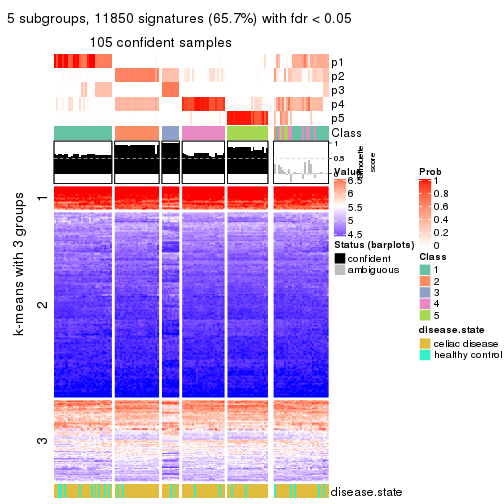</p>

</div>
<div id='tab-MAD-mclust-get-signatures-no-scale-5'>
<pre><code class="r">get_signatures(res, k = 6, scale_rows = FALSE)
</code></pre>

<p></p>

</div>
</div>


Compare the overlap of signatures from different k:

```r
compare_signatures(res)
```


`get_signature()` returns a data frame invisibly. TO get the list of signatures, the function
call should be assigned to a variable explicitly. In following code, if `plot` argument is set
to `FALSE`, no heatmap is plotted while only the differential analysis is performed.

```r
# code only for demonstration
tb = get_signature(res, k = ..., plot = FALSE)
```

An example of the output of `tb` is:

```
#>   which_row         fdr    mean_1    mean_2 scaled_mean_1 scaled_mean_2 km
#> 1        38 0.042760348  8.373488  9.131774    -0.5533452     0.5164555  1
#> 2        40 0.018707592  7.106213  8.469186    -0.6173731     0.5762149  1
#> 3        55 0.019134737 10.221463 11.207825    -0.6159697     0.5749050  1
#> 4        59 0.006059896  5.921854  7.869574    -0.6899429     0.6439467  1
#> 5        60 0.018055526  8.928898 10.211722    -0.6204761     0.5791110  1
#> 6        98 0.009384629 15.714769 14.887706     0.6635654    -0.6193277  2
...
```

The columns in `tb` are:

1. `which_row`: row indices corresponding to the input matrix.
2. `fdr`: FDR for the differential test. 
3. `mean_x`: The mean value in group x.
4. `scaled_mean_x`: The mean value in group x after rows are scaled.
5. `km`: Row groups if k-means clustering is applied to rows.


UMAP plot which shows how samples are separated.


<script>
$( function() {
	$( '#tabs-MAD-mclust-dimension-reduction' ).tabs();
} );
</script>
<div id='tabs-MAD-mclust-dimension-reduction'>
<ul>
<li><a href='#tab-MAD-mclust-dimension-reduction-1'>k = 2</a></li>
<li><a href='#tab-MAD-mclust-dimension-reduction-2'>k = 3</a></li>
<li><a href='#tab-MAD-mclust-dimension-reduction-3'>k = 4</a></li>
<li><a href='#tab-MAD-mclust-dimension-reduction-4'>k = 5</a></li>
<li><a href='#tab-MAD-mclust-dimension-reduction-5'>k = 6</a></li>
</ul>
<div id='tab-MAD-mclust-dimension-reduction-1'>
<pre><code class="r">dimension_reduction(res, k = 2, method = &quot;UMAP&quot;)
</code></pre>

<p></p>

</div>
<div id='tab-MAD-mclust-dimension-reduction-2'>
<pre><code class="r">dimension_reduction(res, k = 3, method = &quot;UMAP&quot;)
</code></pre>

<p></p>

</div>
<div id='tab-MAD-mclust-dimension-reduction-3'>
<pre><code class="r">dimension_reduction(res, k = 4, method = &quot;UMAP&quot;)
</code></pre>

<p></p>

</div>
<div id='tab-MAD-mclust-dimension-reduction-4'>
<pre><code class="r">dimension_reduction(res, k = 5, method = &quot;UMAP&quot;)
</code></pre>

<p></p>

</div>
<div id='tab-MAD-mclust-dimension-reduction-5'>
<pre><code class="r">dimension_reduction(res, k = 6, method = &quot;UMAP&quot;)
</code></pre>

<p></p>

</div>
</div>


Following heatmap shows how subgroups are split when increasing `k`:

```r
collect_classes(res)
```


Test correlation between subgroups and known annotations. If the known
annotation is numeric, one-way ANOVA test is applied, and if the known
annotation is discrete, chi-squared contingency table test is applied.

```r
test_to_known_factors(res)
```

```
#>              n disease.state(p) k
#> MAD:mclust 130           0.3643 2
#> MAD:mclust 130           0.0464 3
#> MAD:mclust 105           0.0350 4
#> MAD:mclust 105           0.1405 5
#> MAD:mclust 128           0.1163 6
```


If matrix rows can be associated to genes, consider to use `GO_Enrichment(res,
...)` to perform function enrichment for the signature genes.


 

---------------------------------------------------


### MAD:NMF*


The object with results only for a single top-value method and a single partition method 
can be extracted as:

```r
res = res_list["MAD", "NMF"]
# you can also extract it by
# res = res_list["MAD:NMF"]
```

A summary of `res` and all the functions that can be applied to it:

```r
res
```

```
#> A 'ConsensusPartition' object with k = 2, 3, 4, 5, 6.
#>   On a matrix with 18032 rows and 132 columns.
#>   Top rows (1000, 2000, 3000, 4000, 5000) are extracted by 'MAD' method.
#>   Subgroups are detected by 'NMF' method.
#>   Performed in total 1250 partitions by row resampling.
#>   Best k for subgroups seems to be 2.
#> 
#> Following methods can be applied to this 'ConsensusPartition' object:
#>  [1] "cola_report"             "collect_classes"         "collect_plots"          
#>  [4] "collect_stats"           "colnames"                "compare_signatures"     
#>  [7] "consensus_heatmap"       "dimension_reduction"     "functional_enrichment"  
#> [10] "get_anno_col"            "get_anno"                "get_classes"            
#> [13] "get_consensus"           "get_matrix"              "get_membership"         
#> [16] "get_param"               "get_signatures"          "get_stats"              
#> [19] "is_best_k"               "is_stable_k"             "membership_heatmap"     
#> [22] "ncol"                    "nrow"                    "plot_ecdf"              
#> [25] "rownames"                "select_partition_number" "show"                   
#> [28] "suggest_best_k"          "test_to_known_factors"
```

`collect_plots()` function collects all the plots made from `res` for all `k` (number of partitions)
into one single page to provide an easy and fast comparison between different `k`.

```r
collect_plots(res)
```


The plots are:

- The first row: a plot of the ECDF (Empirical cumulative distribution
  function) curves of the consensus matrix for each `k` and the heatmap of
  predicted classes for each `k`.
- The second row: heatmaps of the consensus matrix for each `k`.
- The third row: heatmaps of the membership matrix for each `k`.
- The fouth row: heatmaps of the signatures for each `k`.

All the plots in panels can be made by individual functions and they are
plotted later in this section.

`select_partition_number()` produces several plots showing different
statistics for choosing "optimized" `k`. There are following statistics:

- ECDF curves of the consensus matrix for each `k`;
- 1-PAC. [The PAC
  score](https://en.wikipedia.org/wiki/Consensus_clustering#Over-interpretation_potential_of_consensus_clustering)
  measures the proportion of the ambiguous subgrouping.
- Mean silhouette score.
- Concordance. The mean probability of fiting the consensus class ids in all
  partitions.
- Area increased. Denote $A_k$ as the area under the ECDF curve for current
  `k`, the area increased is defined as $A_k - A_{k-1}$.
- Rand index. The percent of pairs of samples that are both in a same cluster
  or both are not in a same cluster in the partition of k and k-1.
- Jaccard index. The ratio of pairs of samples are both in a same cluster in
  the partition of k and k-1 and the pairs of samples are both in a same
  cluster in the partition k or k-1.

The detailed explanations of these statistics can be found in [the cola
vignette](http://bioconductor.org/packages/devel/bioc/vignettes/cola/inst/doc/cola.html#toc_13).

Generally speaking, lower PAC score, higher mean silhouette score or higher
concordance corresponds to better partition. Rand index and Jaccard index
measure how similar the current partition is compared to partition with `k-1`.
If they are too similar, we won't accept `k` is better than `k-1`.

```r
select_partition_number(res)
```


The numeric values for all these statistics can be obtained by `get_stats()`.

```r
get_stats(res)
```

```
#>   k 1-PAC mean_silhouette concordance area_increased  Rand Jaccard
#> 2 2 0.922           0.951       0.979         0.4404 0.563   0.563
#> 3 3 0.776           0.838       0.927         0.4080 0.705   0.525
#> 4 4 0.646           0.716       0.857         0.1696 0.788   0.513
#> 5 5 0.675           0.669       0.799         0.0674 0.827   0.487
#> 6 6 0.625           0.563       0.747         0.0390 0.941   0.753
```

`suggest_best_k()` suggests the best $k$ based on these statistics. The rules are as follows:

- All $k$ with Jaccard index larger than 0.95 are removed because the increase of
  the partition number does not provides enough extra information. If all $k$ are removed,
  the best $k$ is assigned by `NA`.
- For $k$ with 1-PAC larger than 0.9, the maximal $k$ is taken as the "best k". Other $k$ is called "optional k".
- If it does not fit the second rule. The $k$ with the highest vote of highest
  1-PAC, mean silhouette and concordance is taken as the "best k".

```r
suggest_best_k(res)
```

```
#> [1] 2
```


Following shows the table of the partitions (You need to click the **show/hide
code output** link to see it). The membership matrix (columns with name `p*`)
is inferred by
[`clue::cl_consensus()`](https://www.rdocumentation.org/link/cl_consensus?package=clue)
function with the `SE` method. Basically the value in the membership matrix
represents the probability to belong to a certain group. The finall class
label for an item is determined with the group with highest probability it
belongs to.

In `get_classes()` function, the entropy is calculated from the membership
matrix and the silhouette score is calculated from the consensus matrix.


<script>
$( function() {
	$( '#tabs-MAD-NMF-get-classes' ).tabs();
} );
</script>
<div id='tabs-MAD-NMF-get-classes'>
<ul>
<li><a href='#tab-MAD-NMF-get-classes-1'>k = 2</a></li>
<li><a href='#tab-MAD-NMF-get-classes-2'>k = 3</a></li>
<li><a href='#tab-MAD-NMF-get-classes-3'>k = 4</a></li>
<li><a href='#tab-MAD-NMF-get-classes-4'>k = 5</a></li>
<li><a href='#tab-MAD-NMF-get-classes-5'>k = 6</a></li>
</ul>

<div id='tab-MAD-NMF-get-classes-1'>
<p><a id='tab-MAD-NMF-get-classes-1-a' style='color:#0366d6' href='#'>show/hide code output</a></p>
<pre><code class="r">cbind(get_classes(res, k = 2), get_membership(res, k = 2))
</code></pre>

<pre><code>#&gt;           class entropy silhouette    p1    p2
#&gt; GSM289470     2  0.1633      0.959 0.024 0.976
#&gt; GSM289471     1  0.0000      0.974 1.000 0.000
#&gt; GSM289472     2  0.0000      0.979 0.000 1.000
#&gt; GSM289473     2  0.0000      0.979 0.000 1.000
#&gt; GSM289474     2  0.0000      0.979 0.000 1.000
#&gt; GSM289475     2  0.0000      0.979 0.000 1.000
#&gt; GSM289476     1  0.0000      0.974 1.000 0.000
#&gt; GSM289477     2  0.0000      0.979 0.000 1.000
#&gt; GSM289478     2  0.0000      0.979 0.000 1.000
#&gt; GSM289479     2  0.0000      0.979 0.000 1.000
#&gt; GSM289480     2  0.0000      0.979 0.000 1.000
#&gt; GSM289481     2  0.0000      0.979 0.000 1.000
#&gt; GSM289482     2  0.0000      0.979 0.000 1.000
#&gt; GSM289483     2  0.0000      0.979 0.000 1.000
#&gt; GSM289484     2  0.0000      0.979 0.000 1.000
#&gt; GSM289485     2  0.0000      0.979 0.000 1.000
#&gt; GSM289486     1  0.0000      0.974 1.000 0.000
#&gt; GSM289487     2  0.0000      0.979 0.000 1.000
#&gt; GSM289488     2  0.0000      0.979 0.000 1.000
#&gt; GSM289489     2  0.0000      0.979 0.000 1.000
#&gt; GSM289490     2  0.7056      0.763 0.192 0.808
#&gt; GSM289491     2  0.0000      0.979 0.000 1.000
#&gt; GSM289492     1  0.2043      0.948 0.968 0.032
#&gt; GSM289493     2  0.0000      0.979 0.000 1.000
#&gt; GSM289494     1  0.0000      0.974 1.000 0.000
#&gt; GSM289495     2  0.0000      0.979 0.000 1.000
#&gt; GSM289496     2  0.0000      0.979 0.000 1.000
#&gt; GSM289497     2  0.0000      0.979 0.000 1.000
#&gt; GSM289498     1  0.8608      0.606 0.716 0.284
#&gt; GSM289499     2  0.0000      0.979 0.000 1.000
#&gt; GSM289500     1  0.0000      0.974 1.000 0.000
#&gt; GSM289501     2  0.0000      0.979 0.000 1.000
#&gt; GSM289502     2  0.0000      0.979 0.000 1.000
#&gt; GSM289503     2  0.0000      0.979 0.000 1.000
#&gt; GSM289504     2  0.0000      0.979 0.000 1.000
#&gt; GSM289505     2  0.0000      0.979 0.000 1.000
#&gt; GSM289506     2  0.0000      0.979 0.000 1.000
#&gt; GSM289507     2  0.0000      0.979 0.000 1.000
#&gt; GSM289508     1  0.1633      0.955 0.976 0.024
#&gt; GSM289509     1  0.0000      0.974 1.000 0.000
#&gt; GSM289510     2  0.0938      0.970 0.012 0.988
#&gt; GSM289511     2  0.0000      0.979 0.000 1.000
#&gt; GSM289512     1  0.0000      0.974 1.000 0.000
#&gt; GSM289513     2  0.0000      0.979 0.000 1.000
#&gt; GSM289514     2  0.9754      0.312 0.408 0.592
#&gt; GSM289515     2  0.0000      0.979 0.000 1.000
#&gt; GSM289516     2  0.0000      0.979 0.000 1.000
#&gt; GSM289517     2  0.0000      0.979 0.000 1.000
#&gt; GSM289518     2  0.0376      0.976 0.004 0.996
#&gt; GSM289519     2  0.7139      0.757 0.196 0.804
#&gt; GSM289520     2  0.0000      0.979 0.000 1.000
#&gt; GSM289521     1  0.0938      0.965 0.988 0.012
#&gt; GSM289522     2  0.0376      0.976 0.004 0.996
#&gt; GSM289523     1  0.0000      0.974 1.000 0.000
#&gt; GSM289524     2  0.0000      0.979 0.000 1.000
#&gt; GSM289525     2  0.0000      0.979 0.000 1.000
#&gt; GSM289526     2  0.5946      0.827 0.144 0.856
#&gt; GSM289527     2  0.0000      0.979 0.000 1.000
#&gt; GSM289528     2  0.0000      0.979 0.000 1.000
#&gt; GSM289529     2  0.0000      0.979 0.000 1.000
#&gt; GSM289530     1  0.0376      0.971 0.996 0.004
#&gt; GSM289531     2  0.0000      0.979 0.000 1.000
#&gt; GSM289532     1  0.0000      0.974 1.000 0.000
#&gt; GSM289533     2  0.0000      0.979 0.000 1.000
#&gt; GSM289534     1  0.0000      0.974 1.000 0.000
#&gt; GSM289535     2  0.7056      0.763 0.192 0.808
#&gt; GSM289536     1  0.0000      0.974 1.000 0.000
#&gt; GSM289537     2  0.0000      0.979 0.000 1.000
#&gt; GSM289538     2  0.0000      0.979 0.000 1.000
#&gt; GSM289539     2  0.0000      0.979 0.000 1.000
#&gt; GSM289540     1  0.0000      0.974 1.000 0.000
#&gt; GSM289541     2  0.9358      0.460 0.352 0.648
#&gt; GSM289542     2  0.7139      0.758 0.196 0.804
#&gt; GSM289543     2  0.0000      0.979 0.000 1.000
#&gt; GSM289544     1  0.0000      0.974 1.000 0.000
#&gt; GSM289545     2  0.0000      0.979 0.000 1.000
#&gt; GSM289546     2  0.0000      0.979 0.000 1.000
#&gt; GSM289547     2  0.0000      0.979 0.000 1.000
#&gt; GSM289548     1  0.0000      0.974 1.000 0.000
#&gt; GSM289549     1  0.6438      0.803 0.836 0.164
#&gt; GSM289550     1  0.0000      0.974 1.000 0.000
#&gt; GSM289551     1  0.0000      0.974 1.000 0.000
#&gt; GSM289552     1  0.0000      0.974 1.000 0.000
#&gt; GSM289553     1  0.0000      0.974 1.000 0.000
#&gt; GSM289554     2  0.0000      0.979 0.000 1.000
#&gt; GSM289555     2  0.0000      0.979 0.000 1.000
#&gt; GSM289556     1  0.0000      0.974 1.000 0.000
#&gt; GSM289557     2  0.0000      0.979 0.000 1.000
#&gt; GSM289558     2  0.0000      0.979 0.000 1.000
#&gt; GSM289559     1  0.0000      0.974 1.000 0.000
#&gt; GSM289560     2  0.0000      0.979 0.000 1.000
#&gt; GSM289561     2  0.0000      0.979 0.000 1.000
#&gt; GSM289562     1  0.0000      0.974 1.000 0.000
#&gt; GSM289563     1  0.9248      0.489 0.660 0.340
#&gt; GSM289564     2  0.0000      0.979 0.000 1.000
#&gt; GSM289565     1  0.0000      0.974 1.000 0.000
#&gt; GSM289566     1  0.0000      0.974 1.000 0.000
#&gt; GSM289567     2  0.0376      0.976 0.004 0.996
#&gt; GSM289568     2  0.0000      0.979 0.000 1.000
#&gt; GSM289569     2  0.0000      0.979 0.000 1.000
#&gt; GSM289570     2  0.0672      0.973 0.008 0.992
#&gt; GSM289571     2  0.0000      0.979 0.000 1.000
#&gt; GSM289572     2  0.0000      0.979 0.000 1.000
#&gt; GSM289573     2  0.0000      0.979 0.000 1.000
#&gt; GSM289574     2  0.0000      0.979 0.000 1.000
#&gt; GSM289575     2  0.0000      0.979 0.000 1.000
#&gt; GSM289576     2  0.0000      0.979 0.000 1.000
#&gt; GSM289577     2  0.0000      0.979 0.000 1.000
#&gt; GSM289578     2  0.0000      0.979 0.000 1.000
#&gt; GSM289579     2  0.0000      0.979 0.000 1.000
#&gt; GSM289580     1  0.0000      0.974 1.000 0.000
#&gt; GSM289581     1  0.0000      0.974 1.000 0.000
#&gt; GSM289582     2  0.0000      0.979 0.000 1.000
#&gt; GSM289583     2  0.0000      0.979 0.000 1.000
#&gt; GSM289584     2  0.0000      0.979 0.000 1.000
#&gt; GSM289585     2  0.0000      0.979 0.000 1.000
#&gt; GSM289586     2  0.1843      0.955 0.028 0.972
#&gt; GSM289587     1  0.6801      0.780 0.820 0.180
#&gt; GSM289588     1  0.0000      0.974 1.000 0.000
#&gt; GSM289589     1  0.0000      0.974 1.000 0.000
#&gt; GSM289590     1  0.0000      0.974 1.000 0.000
#&gt; GSM289591     1  0.0000      0.974 1.000 0.000
#&gt; GSM289592     2  0.0000      0.979 0.000 1.000
#&gt; GSM289593     1  0.0000      0.974 1.000 0.000
#&gt; GSM289594     2  0.0000      0.979 0.000 1.000
#&gt; GSM289595     1  0.0000      0.974 1.000 0.000
#&gt; GSM289596     2  0.0000      0.979 0.000 1.000
#&gt; GSM289597     2  0.0000      0.979 0.000 1.000
#&gt; GSM289598     1  0.0000      0.974 1.000 0.000
#&gt; GSM289599     2  0.0376      0.976 0.004 0.996
#&gt; GSM289600     1  0.0000      0.974 1.000 0.000
#&gt; GSM289601     1  0.0000      0.974 1.000 0.000
</code></pre>

<script>
$('#tab-MAD-NMF-get-classes-1-a').parent().next().next().hide();
$('#tab-MAD-NMF-get-classes-1-a').click(function(){
  $('#tab-MAD-NMF-get-classes-1-a').parent().next().next().toggle();
  return(false);
});
</script>
</div>

<div id='tab-MAD-NMF-get-classes-2'>
<p><a id='tab-MAD-NMF-get-classes-2-a' style='color:#0366d6' href='#'>show/hide code output</a></p>
<pre><code class="r">cbind(get_classes(res, k = 3), get_membership(res, k = 3))
</code></pre>

<pre><code>#&gt;           class entropy silhouette    p1    p2    p3
#&gt; GSM289470     1  0.0000     0.8655 1.000 0.000 0.000
#&gt; GSM289471     3  0.0237     0.9464 0.004 0.000 0.996
#&gt; GSM289472     2  0.1411     0.9309 0.036 0.964 0.000
#&gt; GSM289473     2  0.1163     0.9345 0.028 0.972 0.000
#&gt; GSM289474     2  0.1163     0.9347 0.028 0.972 0.000
#&gt; GSM289475     2  0.5016     0.7024 0.240 0.760 0.000
#&gt; GSM289476     3  0.0000     0.9479 0.000 0.000 1.000
#&gt; GSM289477     1  0.5706     0.5094 0.680 0.320 0.000
#&gt; GSM289478     2  0.5397     0.6387 0.280 0.720 0.000
#&gt; GSM289479     1  0.7578     0.0964 0.500 0.460 0.040
#&gt; GSM289480     2  0.1753     0.9239 0.048 0.952 0.000
#&gt; GSM289481     2  0.0424     0.9400 0.008 0.992 0.000
#&gt; GSM289482     1  0.0237     0.8651 0.996 0.004 0.000
#&gt; GSM289483     1  0.6274     0.1110 0.544 0.456 0.000
#&gt; GSM289484     2  0.1529     0.9281 0.040 0.960 0.000
#&gt; GSM289485     1  0.0237     0.8651 0.996 0.004 0.000
#&gt; GSM289486     1  0.0592     0.8642 0.988 0.000 0.012
#&gt; GSM289487     2  0.2261     0.9090 0.068 0.932 0.000
#&gt; GSM289488     2  0.6126     0.3639 0.400 0.600 0.000
#&gt; GSM289489     2  0.0592     0.9394 0.012 0.988 0.000
#&gt; GSM289490     2  0.5431     0.6064 0.000 0.716 0.284
#&gt; GSM289491     2  0.0237     0.9375 0.000 0.996 0.004
#&gt; GSM289492     3  0.2066     0.9009 0.000 0.060 0.940
#&gt; GSM289493     2  0.0000     0.9391 0.000 1.000 0.000
#&gt; GSM289494     3  0.0747     0.9386 0.000 0.016 0.984
#&gt; GSM289495     2  0.1163     0.9350 0.028 0.972 0.000
#&gt; GSM289496     2  0.0000     0.9391 0.000 1.000 0.000
#&gt; GSM289497     2  0.0424     0.9400 0.008 0.992 0.000
#&gt; GSM289498     3  0.3619     0.8159 0.000 0.136 0.864
#&gt; GSM289499     2  0.0237     0.9398 0.004 0.996 0.000
#&gt; GSM289500     3  0.0424     0.9441 0.000 0.008 0.992
#&gt; GSM289501     2  0.0000     0.9391 0.000 1.000 0.000
#&gt; GSM289502     2  0.0424     0.9400 0.008 0.992 0.000
#&gt; GSM289503     2  0.0424     0.9400 0.008 0.992 0.000
#&gt; GSM289504     2  0.1031     0.9361 0.024 0.976 0.000
#&gt; GSM289505     2  0.0424     0.9400 0.008 0.992 0.000
#&gt; GSM289506     2  0.0424     0.9400 0.008 0.992 0.000
#&gt; GSM289507     2  0.0892     0.9373 0.020 0.980 0.000
#&gt; GSM289508     3  0.3941     0.7953 0.156 0.000 0.844
#&gt; GSM289509     3  0.0237     0.9464 0.004 0.000 0.996
#&gt; GSM289510     1  0.0000     0.8655 1.000 0.000 0.000
#&gt; GSM289511     2  0.3941     0.8240 0.156 0.844 0.000
#&gt; GSM289512     3  0.0000     0.9479 0.000 0.000 1.000
#&gt; GSM289513     1  0.6252     0.1431 0.556 0.444 0.000
#&gt; GSM289514     1  0.0424     0.8657 0.992 0.000 0.008
#&gt; GSM289515     1  0.3267     0.7739 0.884 0.116 0.000
#&gt; GSM289516     1  0.0237     0.8651 0.996 0.004 0.000
#&gt; GSM289517     1  0.0237     0.8651 0.996 0.004 0.000
#&gt; GSM289518     1  0.1031     0.8558 0.976 0.024 0.000
#&gt; GSM289519     1  0.0237     0.8660 0.996 0.000 0.004
#&gt; GSM289520     1  0.0424     0.8639 0.992 0.008 0.000
#&gt; GSM289521     1  0.1289     0.8580 0.968 0.000 0.032
#&gt; GSM289522     1  0.0424     0.8641 0.992 0.008 0.000
#&gt; GSM289523     3  0.0000     0.9479 0.000 0.000 1.000
#&gt; GSM289524     2  0.3038     0.8784 0.104 0.896 0.000
#&gt; GSM289525     1  0.0892     0.8582 0.980 0.020 0.000
#&gt; GSM289526     3  0.7916     0.5132 0.264 0.100 0.636
#&gt; GSM289527     2  0.6260     0.2311 0.448 0.552 0.000
#&gt; GSM289528     2  0.1860     0.9207 0.052 0.948 0.000
#&gt; GSM289529     1  0.2878     0.7984 0.904 0.096 0.000
#&gt; GSM289530     3  0.0237     0.9464 0.004 0.000 0.996
#&gt; GSM289531     2  0.0424     0.9400 0.008 0.992 0.000
#&gt; GSM289532     3  0.0000     0.9479 0.000 0.000 1.000
#&gt; GSM289533     2  0.0000     0.9391 0.000 1.000 0.000
#&gt; GSM289534     3  0.0000     0.9479 0.000 0.000 1.000
#&gt; GSM289535     2  0.5138     0.6640 0.000 0.748 0.252
#&gt; GSM289536     3  0.0000     0.9479 0.000 0.000 1.000
#&gt; GSM289537     2  0.0747     0.9385 0.016 0.984 0.000
#&gt; GSM289538     2  0.1163     0.9344 0.028 0.972 0.000
#&gt; GSM289539     2  0.0424     0.9400 0.008 0.992 0.000
#&gt; GSM289540     3  0.2711     0.8784 0.088 0.000 0.912
#&gt; GSM289541     1  0.0237     0.8660 0.996 0.000 0.004
#&gt; GSM289542     1  0.8311     0.4318 0.596 0.112 0.292
#&gt; GSM289543     2  0.2165     0.9110 0.064 0.936 0.000
#&gt; GSM289544     1  0.1289     0.8580 0.968 0.000 0.032
#&gt; GSM289545     2  0.1163     0.9344 0.028 0.972 0.000
#&gt; GSM289546     2  0.6295     0.1248 0.472 0.528 0.000
#&gt; GSM289547     2  0.0000     0.9391 0.000 1.000 0.000
#&gt; GSM289548     1  0.1031     0.8607 0.976 0.000 0.024
#&gt; GSM289549     1  0.0237     0.8656 0.996 0.000 0.004
#&gt; GSM289550     1  0.1643     0.8513 0.956 0.000 0.044
#&gt; GSM289551     3  0.0000     0.9479 0.000 0.000 1.000
#&gt; GSM289552     1  0.3116     0.8056 0.892 0.000 0.108
#&gt; GSM289553     1  0.1753     0.8489 0.952 0.000 0.048
#&gt; GSM289554     2  0.0000     0.9391 0.000 1.000 0.000
#&gt; GSM289555     2  0.0000     0.9391 0.000 1.000 0.000
#&gt; GSM289556     1  0.0892     0.8621 0.980 0.000 0.020
#&gt; GSM289557     2  0.0237     0.9398 0.004 0.996 0.000
#&gt; GSM289558     2  0.0237     0.9398 0.004 0.996 0.000
#&gt; GSM289559     1  0.2878     0.8169 0.904 0.000 0.096
#&gt; GSM289560     2  0.0000     0.9391 0.000 1.000 0.000
#&gt; GSM289561     2  0.0000     0.9391 0.000 1.000 0.000
#&gt; GSM289562     1  0.1411     0.8552 0.964 0.000 0.036
#&gt; GSM289563     1  0.0237     0.8656 0.996 0.000 0.004
#&gt; GSM289564     2  0.0237     0.9375 0.000 0.996 0.004
#&gt; GSM289565     1  0.6225     0.2641 0.568 0.000 0.432
#&gt; GSM289566     1  0.6045     0.4082 0.620 0.000 0.380
#&gt; GSM289567     2  0.4172     0.8573 0.028 0.868 0.104
#&gt; GSM289568     2  0.1031     0.9364 0.024 0.976 0.000
#&gt; GSM289569     1  0.1031     0.8560 0.976 0.024 0.000
#&gt; GSM289570     2  0.4045     0.8559 0.024 0.872 0.104
#&gt; GSM289571     2  0.0424     0.9400 0.008 0.992 0.000
#&gt; GSM289572     2  0.0000     0.9391 0.000 1.000 0.000
#&gt; GSM289573     2  0.0000     0.9391 0.000 1.000 0.000
#&gt; GSM289574     2  0.0424     0.9400 0.008 0.992 0.000
#&gt; GSM289575     2  0.0237     0.9375 0.000 0.996 0.004
#&gt; GSM289576     2  0.0000     0.9391 0.000 1.000 0.000
#&gt; GSM289577     2  0.0237     0.9375 0.000 0.996 0.004
#&gt; GSM289578     2  0.0237     0.9375 0.000 0.996 0.004
#&gt; GSM289579     2  0.0237     0.9375 0.000 0.996 0.004
#&gt; GSM289580     3  0.0000     0.9479 0.000 0.000 1.000
#&gt; GSM289581     1  0.5678     0.5534 0.684 0.000 0.316
#&gt; GSM289582     2  0.0747     0.9386 0.016 0.984 0.000
#&gt; GSM289583     2  0.0747     0.9385 0.016 0.984 0.000
#&gt; GSM289584     2  0.0000     0.9391 0.000 1.000 0.000
#&gt; GSM289585     2  0.0592     0.9395 0.012 0.988 0.000
#&gt; GSM289586     1  0.0000     0.8655 1.000 0.000 0.000
#&gt; GSM289587     1  0.0237     0.8656 0.996 0.000 0.004
#&gt; GSM289588     3  0.0000     0.9479 0.000 0.000 1.000
#&gt; GSM289589     1  0.0892     0.8621 0.980 0.000 0.020
#&gt; GSM289590     1  0.3752     0.7738 0.856 0.000 0.144
#&gt; GSM289591     1  0.5216     0.6257 0.740 0.000 0.260
#&gt; GSM289592     2  0.0000     0.9391 0.000 1.000 0.000
#&gt; GSM289593     3  0.0000     0.9479 0.000 0.000 1.000
#&gt; GSM289594     2  0.0000     0.9391 0.000 1.000 0.000
#&gt; GSM289595     3  0.3879     0.7976 0.152 0.000 0.848
#&gt; GSM289596     2  0.0424     0.9400 0.008 0.992 0.000
#&gt; GSM289597     1  0.5178     0.6136 0.744 0.256 0.000
#&gt; GSM289598     3  0.0424     0.9441 0.000 0.008 0.992
#&gt; GSM289599     2  0.5325     0.6872 0.248 0.748 0.004
#&gt; GSM289600     1  0.0747     0.8632 0.984 0.000 0.016
#&gt; GSM289601     1  0.0892     0.8626 0.980 0.000 0.020
</code></pre>

<script>
$('#tab-MAD-NMF-get-classes-2-a').parent().next().next().hide();
$('#tab-MAD-NMF-get-classes-2-a').click(function(){
  $('#tab-MAD-NMF-get-classes-2-a').parent().next().next().toggle();
  return(false);
});
</script>
</div>

<div id='tab-MAD-NMF-get-classes-3'>
<p><a id='tab-MAD-NMF-get-classes-3-a' style='color:#0366d6' href='#'>show/hide code output</a></p>
<pre><code class="r">cbind(get_classes(res, k = 4), get_membership(res, k = 4))
</code></pre>

<pre><code>#&gt;           class entropy silhouette    p1    p2    p3    p4
#&gt; GSM289470     1  0.2021     0.7544 0.932 0.000 0.012 0.056
#&gt; GSM289471     3  0.0524     0.8907 0.004 0.000 0.988 0.008
#&gt; GSM289472     1  0.4500     0.4702 0.684 0.316 0.000 0.000
#&gt; GSM289473     2  0.2868     0.8212 0.136 0.864 0.000 0.000
#&gt; GSM289474     2  0.3942     0.7172 0.236 0.764 0.000 0.000
#&gt; GSM289475     1  0.3311     0.7079 0.828 0.172 0.000 0.000
#&gt; GSM289476     3  0.0188     0.8922 0.004 0.000 0.996 0.000
#&gt; GSM289477     4  0.2999     0.7236 0.004 0.132 0.000 0.864
#&gt; GSM289478     1  0.2973     0.7260 0.856 0.144 0.000 0.000
#&gt; GSM289479     1  0.4737     0.7098 0.800 0.052 0.136 0.012
#&gt; GSM289480     1  0.4008     0.6220 0.756 0.244 0.000 0.000
#&gt; GSM289481     2  0.3157     0.8099 0.144 0.852 0.004 0.000
#&gt; GSM289482     4  0.0524     0.7732 0.004 0.008 0.000 0.988
#&gt; GSM289483     4  0.5138     0.3218 0.008 0.392 0.000 0.600
#&gt; GSM289484     2  0.1284     0.8787 0.024 0.964 0.000 0.012
#&gt; GSM289485     4  0.4920     0.3958 0.368 0.004 0.000 0.628
#&gt; GSM289486     1  0.5636     0.1622 0.552 0.000 0.024 0.424
#&gt; GSM289487     2  0.4477     0.6038 0.312 0.688 0.000 0.000
#&gt; GSM289488     2  0.6052     0.4761 0.076 0.640 0.000 0.284
#&gt; GSM289489     1  0.4967     0.0588 0.548 0.452 0.000 0.000
#&gt; GSM289490     2  0.2593     0.8326 0.016 0.904 0.080 0.000
#&gt; GSM289491     2  0.1520     0.8749 0.024 0.956 0.020 0.000
#&gt; GSM289492     3  0.5658     0.3737 0.016 0.388 0.588 0.008
#&gt; GSM289493     2  0.0000     0.8790 0.000 1.000 0.000 0.000
#&gt; GSM289494     3  0.1247     0.8815 0.016 0.012 0.968 0.004
#&gt; GSM289495     4  0.2469     0.7368 0.000 0.108 0.000 0.892
#&gt; GSM289496     2  0.0188     0.8784 0.000 0.996 0.004 0.000
#&gt; GSM289497     2  0.0921     0.8776 0.028 0.972 0.000 0.000
#&gt; GSM289498     3  0.2741     0.8130 0.012 0.096 0.892 0.000
#&gt; GSM289499     2  0.4103     0.6301 0.000 0.744 0.000 0.256
#&gt; GSM289500     3  0.0927     0.8843 0.016 0.008 0.976 0.000
#&gt; GSM289501     2  0.0376     0.8775 0.004 0.992 0.004 0.000
#&gt; GSM289502     2  0.2647     0.8324 0.120 0.880 0.000 0.000
#&gt; GSM289503     2  0.1022     0.8777 0.032 0.968 0.000 0.000
#&gt; GSM289504     4  0.4500     0.5315 0.000 0.316 0.000 0.684
#&gt; GSM289505     2  0.0921     0.8734 0.000 0.972 0.000 0.028
#&gt; GSM289506     2  0.2530     0.8374 0.112 0.888 0.000 0.000
#&gt; GSM289507     2  0.4164     0.6764 0.264 0.736 0.000 0.000
#&gt; GSM289508     3  0.2528     0.8461 0.004 0.008 0.908 0.080
#&gt; GSM289509     3  0.1798     0.8769 0.016 0.000 0.944 0.040
#&gt; GSM289510     4  0.1022     0.7707 0.032 0.000 0.000 0.968
#&gt; GSM289511     1  0.3356     0.6941 0.824 0.176 0.000 0.000
#&gt; GSM289512     3  0.0376     0.8921 0.004 0.000 0.992 0.004
#&gt; GSM289513     1  0.1302     0.7644 0.956 0.044 0.000 0.000
#&gt; GSM289514     4  0.1022     0.7707 0.032 0.000 0.000 0.968
#&gt; GSM289515     1  0.1042     0.7671 0.972 0.020 0.000 0.008
#&gt; GSM289516     1  0.2011     0.7452 0.920 0.000 0.000 0.080
#&gt; GSM289517     1  0.3873     0.6219 0.772 0.000 0.000 0.228
#&gt; GSM289518     1  0.2334     0.7445 0.908 0.000 0.004 0.088
#&gt; GSM289519     4  0.0707     0.7721 0.020 0.000 0.000 0.980
#&gt; GSM289520     4  0.5220     0.2415 0.424 0.008 0.000 0.568
#&gt; GSM289521     4  0.0592     0.7722 0.016 0.000 0.000 0.984
#&gt; GSM289522     1  0.1396     0.7629 0.960 0.004 0.004 0.032
#&gt; GSM289523     3  0.0376     0.8921 0.004 0.000 0.992 0.004
#&gt; GSM289524     1  0.2921     0.7226 0.860 0.140 0.000 0.000
#&gt; GSM289525     4  0.4072     0.5921 0.252 0.000 0.000 0.748
#&gt; GSM289526     1  0.5360     0.4769 0.668 0.024 0.304 0.004
#&gt; GSM289527     1  0.1118     0.7658 0.964 0.036 0.000 0.000
#&gt; GSM289528     1  0.3172     0.7143 0.840 0.160 0.000 0.000
#&gt; GSM289529     1  0.2131     0.7683 0.932 0.036 0.000 0.032
#&gt; GSM289530     4  0.4176     0.6538 0.008 0.012 0.180 0.800
#&gt; GSM289531     2  0.1484     0.8778 0.016 0.960 0.020 0.004
#&gt; GSM289532     4  0.5066     0.5919 0.016 0.020 0.224 0.740
#&gt; GSM289533     2  0.4600     0.6935 0.240 0.744 0.012 0.004
#&gt; GSM289534     3  0.0188     0.8922 0.004 0.000 0.996 0.000
#&gt; GSM289535     4  0.5180     0.5328 0.016 0.308 0.004 0.672
#&gt; GSM289536     3  0.0000     0.8918 0.000 0.000 1.000 0.000
#&gt; GSM289537     2  0.0376     0.8797 0.004 0.992 0.000 0.004
#&gt; GSM289538     2  0.1211     0.8764 0.040 0.960 0.000 0.000
#&gt; GSM289539     2  0.4543     0.5755 0.324 0.676 0.000 0.000
#&gt; GSM289540     4  0.0895     0.7712 0.000 0.020 0.004 0.976
#&gt; GSM289541     4  0.4122     0.5997 0.236 0.000 0.004 0.760
#&gt; GSM289542     4  0.2246     0.7662 0.004 0.052 0.016 0.928
#&gt; GSM289543     2  0.4134     0.6344 0.000 0.740 0.000 0.260
#&gt; GSM289544     4  0.1576     0.7603 0.048 0.000 0.004 0.948
#&gt; GSM289545     2  0.1545     0.8755 0.040 0.952 0.000 0.008
#&gt; GSM289546     2  0.5671     0.2409 0.028 0.572 0.000 0.400
#&gt; GSM289547     2  0.1557     0.8686 0.056 0.944 0.000 0.000
#&gt; GSM289548     1  0.4452     0.6636 0.796 0.000 0.048 0.156
#&gt; GSM289549     1  0.1520     0.7622 0.956 0.000 0.020 0.024
#&gt; GSM289550     1  0.6646     0.4696 0.620 0.000 0.156 0.224
#&gt; GSM289551     3  0.0188     0.8922 0.004 0.000 0.996 0.000
#&gt; GSM289552     3  0.6390     0.5571 0.132 0.000 0.644 0.224
#&gt; GSM289553     4  0.3842     0.6974 0.128 0.000 0.036 0.836
#&gt; GSM289554     2  0.2328     0.8423 0.016 0.924 0.004 0.056
#&gt; GSM289555     2  0.0844     0.8740 0.004 0.980 0.004 0.012
#&gt; GSM289556     4  0.4955     0.4324 0.344 0.000 0.008 0.648
#&gt; GSM289557     2  0.0524     0.8793 0.004 0.988 0.000 0.008
#&gt; GSM289558     2  0.0707     0.8788 0.020 0.980 0.000 0.000
#&gt; GSM289559     1  0.6726     0.2709 0.536 0.000 0.364 0.100
#&gt; GSM289560     2  0.0712     0.8754 0.004 0.984 0.004 0.008
#&gt; GSM289561     2  0.0188     0.8786 0.000 0.996 0.000 0.004
#&gt; GSM289562     1  0.4776     0.6472 0.776 0.000 0.060 0.164
#&gt; GSM289563     1  0.3895     0.6568 0.804 0.000 0.012 0.184
#&gt; GSM289564     2  0.5549     0.2438 0.016 0.584 0.004 0.396
#&gt; GSM289565     4  0.0376     0.7720 0.000 0.004 0.004 0.992
#&gt; GSM289566     3  0.4164     0.6157 0.264 0.000 0.736 0.000
#&gt; GSM289567     4  0.8474     0.3564 0.060 0.308 0.156 0.476
#&gt; GSM289568     2  0.4916     0.3593 0.424 0.576 0.000 0.000
#&gt; GSM289569     1  0.1042     0.7673 0.972 0.020 0.000 0.008
#&gt; GSM289570     2  0.8369     0.1546 0.052 0.484 0.160 0.304
#&gt; GSM289571     2  0.0469     0.8795 0.012 0.988 0.000 0.000
#&gt; GSM289572     2  0.0921     0.8726 0.000 0.972 0.000 0.028
#&gt; GSM289573     2  0.0336     0.8797 0.008 0.992 0.000 0.000
#&gt; GSM289574     2  0.1637     0.8669 0.060 0.940 0.000 0.000
#&gt; GSM289575     2  0.0564     0.8764 0.004 0.988 0.004 0.004
#&gt; GSM289576     2  0.0592     0.8794 0.016 0.984 0.000 0.000
#&gt; GSM289577     2  0.0564     0.8764 0.004 0.988 0.004 0.004
#&gt; GSM289578     2  0.1484     0.8644 0.016 0.960 0.004 0.020
#&gt; GSM289579     2  0.0564     0.8764 0.004 0.988 0.004 0.004
#&gt; GSM289580     3  0.0469     0.8892 0.012 0.000 0.988 0.000
#&gt; GSM289581     4  0.2450     0.7510 0.016 0.000 0.072 0.912
#&gt; GSM289582     2  0.4220     0.6947 0.248 0.748 0.000 0.004
#&gt; GSM289583     2  0.1389     0.8730 0.048 0.952 0.000 0.000
#&gt; GSM289584     2  0.1004     0.8785 0.024 0.972 0.004 0.000
#&gt; GSM289585     2  0.2149     0.8527 0.088 0.912 0.000 0.000
#&gt; GSM289586     1  0.1452     0.7605 0.956 0.000 0.008 0.036
#&gt; GSM289587     4  0.5050     0.3012 0.408 0.000 0.004 0.588
#&gt; GSM289588     3  0.0376     0.8921 0.004 0.000 0.992 0.004
#&gt; GSM289589     4  0.5735     0.2954 0.392 0.000 0.032 0.576
#&gt; GSM289590     4  0.0376     0.7711 0.004 0.000 0.004 0.992
#&gt; GSM289591     3  0.5809     0.6226 0.092 0.000 0.692 0.216
#&gt; GSM289592     2  0.0336     0.8796 0.008 0.992 0.000 0.000
#&gt; GSM289593     3  0.0376     0.8917 0.004 0.000 0.992 0.004
#&gt; GSM289594     2  0.0376     0.8775 0.004 0.992 0.004 0.000
#&gt; GSM289595     3  0.4098     0.7117 0.012 0.000 0.784 0.204
#&gt; GSM289596     2  0.0376     0.8797 0.004 0.992 0.000 0.004
#&gt; GSM289597     4  0.4464     0.6451 0.208 0.024 0.000 0.768
#&gt; GSM289598     3  0.1489     0.8706 0.004 0.044 0.952 0.000
#&gt; GSM289599     4  0.1557     0.7633 0.000 0.056 0.000 0.944
#&gt; GSM289600     1  0.4711     0.5827 0.740 0.000 0.024 0.236
#&gt; GSM289601     4  0.0336     0.7713 0.008 0.000 0.000 0.992
</code></pre>

<script>
$('#tab-MAD-NMF-get-classes-3-a').parent().next().next().hide();
$('#tab-MAD-NMF-get-classes-3-a').click(function(){
  $('#tab-MAD-NMF-get-classes-3-a').parent().next().next().toggle();
  return(false);
});
</script>
</div>

<div id='tab-MAD-NMF-get-classes-4'>
<p><a id='tab-MAD-NMF-get-classes-4-a' style='color:#0366d6' href='#'>show/hide code output</a></p>
<pre><code class="r">cbind(get_classes(res, k = 5), get_membership(res, k = 5))
</code></pre>

<pre><code>#&gt;           class entropy silhouette    p1    p2    p3    p4    p5
#&gt; GSM289470     4  0.4557    -0.0617 0.476 0.000 0.000 0.516 0.008
#&gt; GSM289471     3  0.4171     0.6892 0.396 0.000 0.604 0.000 0.000
#&gt; GSM289472     4  0.2616     0.6889 0.020 0.100 0.000 0.880 0.000
#&gt; GSM289473     4  0.4066     0.6669 0.000 0.000 0.044 0.768 0.188
#&gt; GSM289474     4  0.2877     0.7012 0.000 0.004 0.004 0.848 0.144
#&gt; GSM289475     4  0.4682     0.4267 0.024 0.356 0.000 0.620 0.000
#&gt; GSM289476     3  0.4171     0.6892 0.396 0.000 0.604 0.000 0.000
#&gt; GSM289477     5  0.3960     0.6483 0.044 0.148 0.008 0.000 0.800
#&gt; GSM289478     4  0.4668     0.4436 0.024 0.352 0.000 0.624 0.000
#&gt; GSM289479     4  0.4303     0.6880 0.016 0.000 0.124 0.792 0.068
#&gt; GSM289480     4  0.3284     0.6617 0.024 0.148 0.000 0.828 0.000
#&gt; GSM289481     4  0.5252     0.3770 0.000 0.364 0.056 0.580 0.000
#&gt; GSM289482     5  0.3495     0.7080 0.120 0.036 0.008 0.000 0.836
#&gt; GSM289483     2  0.5775     0.1695 0.068 0.512 0.008 0.000 0.412
#&gt; GSM289484     2  0.4162     0.7175 0.000 0.768 0.000 0.176 0.056
#&gt; GSM289485     1  0.5498     0.4143 0.588 0.028 0.008 0.016 0.360
#&gt; GSM289486     1  0.0404     0.7199 0.988 0.000 0.000 0.000 0.012
#&gt; GSM289487     4  0.4182     0.4658 0.004 0.352 0.000 0.644 0.000
#&gt; GSM289488     2  0.5641     0.5539 0.012 0.652 0.004 0.084 0.248
#&gt; GSM289489     4  0.1364     0.7150 0.012 0.036 0.000 0.952 0.000
#&gt; GSM289490     2  0.3395     0.7203 0.000 0.764 0.236 0.000 0.000
#&gt; GSM289491     2  0.2278     0.8708 0.000 0.908 0.060 0.032 0.000
#&gt; GSM289492     3  0.5158     0.2972 0.004 0.392 0.568 0.000 0.036
#&gt; GSM289493     2  0.0324     0.8992 0.000 0.992 0.004 0.000 0.004
#&gt; GSM289494     3  0.0693     0.6046 0.012 0.008 0.980 0.000 0.000
#&gt; GSM289495     5  0.3635     0.7044 0.068 0.088 0.008 0.000 0.836
#&gt; GSM289496     2  0.0162     0.8991 0.000 0.996 0.004 0.000 0.000
#&gt; GSM289497     2  0.0794     0.8956 0.000 0.972 0.000 0.028 0.000
#&gt; GSM289498     3  0.3809     0.4924 0.008 0.256 0.736 0.000 0.000
#&gt; GSM289499     2  0.2358     0.8410 0.000 0.888 0.008 0.000 0.104
#&gt; GSM289500     3  0.2929     0.6864 0.180 0.000 0.820 0.000 0.000
#&gt; GSM289501     2  0.0162     0.8991 0.000 0.996 0.004 0.000 0.000
#&gt; GSM289502     2  0.2124     0.8599 0.004 0.900 0.000 0.096 0.000
#&gt; GSM289503     2  0.0609     0.8977 0.000 0.980 0.000 0.020 0.000
#&gt; GSM289504     2  0.4579     0.5488 0.016 0.668 0.008 0.000 0.308
#&gt; GSM289505     2  0.0579     0.8972 0.000 0.984 0.008 0.000 0.008
#&gt; GSM289506     2  0.2280     0.8415 0.000 0.880 0.000 0.120 0.000
#&gt; GSM289507     2  0.4533     0.1648 0.008 0.544 0.000 0.448 0.000
#&gt; GSM289508     1  0.2570     0.6518 0.888 0.028 0.084 0.000 0.000
#&gt; GSM289509     3  0.4489     0.5668 0.080 0.000 0.760 0.004 0.156
#&gt; GSM289510     5  0.2127     0.7412 0.000 0.000 0.000 0.108 0.892
#&gt; GSM289511     4  0.1197     0.7247 0.000 0.000 0.000 0.952 0.048
#&gt; GSM289512     3  0.1121     0.6208 0.044 0.000 0.956 0.000 0.000
#&gt; GSM289513     4  0.0451     0.7237 0.004 0.000 0.000 0.988 0.008
#&gt; GSM289514     5  0.2077     0.7516 0.000 0.000 0.008 0.084 0.908
#&gt; GSM289515     4  0.2605     0.6979 0.000 0.000 0.000 0.852 0.148
#&gt; GSM289516     4  0.2471     0.6997 0.000 0.000 0.000 0.864 0.136
#&gt; GSM289517     4  0.3816     0.5513 0.000 0.000 0.000 0.696 0.304
#&gt; GSM289518     4  0.3491     0.6418 0.000 0.000 0.004 0.768 0.228
#&gt; GSM289519     5  0.0992     0.7687 0.008 0.000 0.000 0.024 0.968
#&gt; GSM289520     4  0.4658     0.0787 0.012 0.000 0.000 0.504 0.484
#&gt; GSM289521     5  0.1202     0.7681 0.004 0.000 0.004 0.032 0.960
#&gt; GSM289522     4  0.2848     0.6933 0.000 0.000 0.004 0.840 0.156
#&gt; GSM289523     3  0.3586     0.7032 0.264 0.000 0.736 0.000 0.000
#&gt; GSM289524     4  0.0290     0.7241 0.000 0.000 0.000 0.992 0.008
#&gt; GSM289525     5  0.4446    -0.0997 0.000 0.000 0.004 0.476 0.520
#&gt; GSM289526     4  0.0912     0.7249 0.000 0.000 0.016 0.972 0.012
#&gt; GSM289527     4  0.0451     0.7235 0.004 0.000 0.000 0.988 0.008
#&gt; GSM289528     4  0.3449     0.6504 0.024 0.164 0.000 0.812 0.000
#&gt; GSM289529     4  0.3835     0.6119 0.000 0.000 0.008 0.732 0.260
#&gt; GSM289530     5  0.3060     0.7411 0.000 0.000 0.128 0.024 0.848
#&gt; GSM289531     3  0.8002    -0.0937 0.000 0.348 0.364 0.172 0.116
#&gt; GSM289532     5  0.3890     0.6770 0.000 0.000 0.252 0.012 0.736
#&gt; GSM289533     4  0.3997     0.6831 0.000 0.064 0.112 0.812 0.012
#&gt; GSM289534     3  0.4114     0.6976 0.376 0.000 0.624 0.000 0.000
#&gt; GSM289535     2  0.4994     0.3414 0.012 0.576 0.016 0.000 0.396
#&gt; GSM289536     3  0.4138     0.6951 0.384 0.000 0.616 0.000 0.000
#&gt; GSM289537     2  0.0290     0.8989 0.000 0.992 0.008 0.000 0.000
#&gt; GSM289538     2  0.0451     0.8994 0.004 0.988 0.000 0.008 0.000
#&gt; GSM289539     4  0.4622     0.1735 0.012 0.440 0.000 0.548 0.000
#&gt; GSM289540     5  0.3294     0.7085 0.124 0.024 0.008 0.000 0.844
#&gt; GSM289541     1  0.4476     0.6576 0.744 0.044 0.008 0.000 0.204
#&gt; GSM289542     1  0.4893     0.4851 0.684 0.264 0.008 0.000 0.044
#&gt; GSM289543     2  0.2673     0.8520 0.072 0.892 0.008 0.000 0.028
#&gt; GSM289544     5  0.2798     0.7135 0.140 0.000 0.000 0.008 0.852
#&gt; GSM289545     2  0.2727     0.8241 0.116 0.868 0.000 0.016 0.000
#&gt; GSM289546     2  0.2995     0.8348 0.088 0.872 0.008 0.000 0.032
#&gt; GSM289547     2  0.2130     0.8679 0.000 0.908 0.012 0.080 0.000
#&gt; GSM289548     1  0.2513     0.6802 0.876 0.000 0.008 0.116 0.000
#&gt; GSM289549     4  0.4262     0.0573 0.440 0.000 0.000 0.560 0.000
#&gt; GSM289550     1  0.1082     0.7026 0.964 0.000 0.028 0.008 0.000
#&gt; GSM289551     3  0.4171     0.6892 0.396 0.000 0.604 0.000 0.000
#&gt; GSM289552     1  0.1197     0.6889 0.952 0.000 0.048 0.000 0.000
#&gt; GSM289553     1  0.3612     0.6315 0.732 0.000 0.000 0.000 0.268
#&gt; GSM289554     2  0.2358     0.8406 0.000 0.888 0.008 0.000 0.104
#&gt; GSM289555     2  0.0404     0.8981 0.000 0.988 0.000 0.000 0.012
#&gt; GSM289556     1  0.3766     0.6232 0.728 0.000 0.004 0.000 0.268
#&gt; GSM289557     2  0.0451     0.8980 0.000 0.988 0.004 0.000 0.008
#&gt; GSM289558     2  0.0510     0.8982 0.000 0.984 0.000 0.016 0.000
#&gt; GSM289559     1  0.1668     0.6916 0.940 0.000 0.028 0.032 0.000
#&gt; GSM289560     2  0.0404     0.8981 0.000 0.988 0.000 0.000 0.012
#&gt; GSM289561     2  0.0000     0.8991 0.000 1.000 0.000 0.000 0.000
#&gt; GSM289562     1  0.1485     0.7030 0.948 0.000 0.020 0.032 0.000
#&gt; GSM289563     1  0.4655     0.4319 0.644 0.000 0.000 0.328 0.028
#&gt; GSM289564     5  0.5687     0.5955 0.000 0.112 0.264 0.004 0.620
#&gt; GSM289565     5  0.3320     0.6889 0.152 0.012 0.008 0.000 0.828
#&gt; GSM289566     4  0.5209     0.3231 0.036 0.000 0.368 0.588 0.008
#&gt; GSM289567     5  0.5923     0.5128 0.000 0.000 0.288 0.140 0.572
#&gt; GSM289568     4  0.1043     0.7260 0.000 0.000 0.000 0.960 0.040
#&gt; GSM289569     4  0.1892     0.7194 0.004 0.000 0.000 0.916 0.080
#&gt; GSM289570     5  0.6100     0.4764 0.000 0.000 0.308 0.152 0.540
#&gt; GSM289571     2  0.0324     0.8992 0.000 0.992 0.004 0.004 0.000
#&gt; GSM289572     2  0.0579     0.8972 0.000 0.984 0.008 0.000 0.008
#&gt; GSM289573     2  0.0693     0.8978 0.000 0.980 0.012 0.008 0.000
#&gt; GSM289574     2  0.1831     0.8731 0.000 0.920 0.004 0.076 0.000
#&gt; GSM289575     2  0.0880     0.8947 0.000 0.968 0.032 0.000 0.000
#&gt; GSM289576     2  0.0912     0.8966 0.000 0.972 0.016 0.012 0.000
#&gt; GSM289577     2  0.0404     0.8986 0.000 0.988 0.012 0.000 0.000
#&gt; GSM289578     2  0.2871     0.8411 0.000 0.872 0.088 0.000 0.040
#&gt; GSM289579     2  0.0880     0.8947 0.000 0.968 0.032 0.000 0.000
#&gt; GSM289580     3  0.3177     0.6951 0.208 0.000 0.792 0.000 0.000
#&gt; GSM289581     5  0.2230     0.7625 0.000 0.000 0.044 0.044 0.912
#&gt; GSM289582     4  0.5638     0.5220 0.000 0.000 0.152 0.632 0.216
#&gt; GSM289583     2  0.0880     0.8943 0.000 0.968 0.000 0.032 0.000
#&gt; GSM289584     2  0.0992     0.8957 0.000 0.968 0.008 0.024 0.000
#&gt; GSM289585     2  0.1965     0.8615 0.000 0.904 0.000 0.096 0.000
#&gt; GSM289586     4  0.1908     0.7150 0.000 0.000 0.000 0.908 0.092
#&gt; GSM289587     1  0.4632     0.6407 0.724 0.016 0.008 0.016 0.236
#&gt; GSM289588     3  0.3796     0.7055 0.300 0.000 0.700 0.000 0.000
#&gt; GSM289589     1  0.0880     0.7185 0.968 0.000 0.000 0.000 0.032
#&gt; GSM289590     5  0.2230     0.7292 0.116 0.000 0.000 0.000 0.884
#&gt; GSM289591     1  0.1197     0.6889 0.952 0.000 0.048 0.000 0.000
#&gt; GSM289592     2  0.0451     0.8988 0.000 0.988 0.004 0.008 0.000
#&gt; GSM289593     3  0.4171     0.6892 0.396 0.000 0.604 0.000 0.000
#&gt; GSM289594     2  0.0404     0.8987 0.000 0.988 0.012 0.000 0.000
#&gt; GSM289595     3  0.4306     0.5466 0.492 0.000 0.508 0.000 0.000
#&gt; GSM289596     2  0.0451     0.8980 0.000 0.988 0.004 0.000 0.008
#&gt; GSM289597     4  0.4305     0.1465 0.000 0.000 0.000 0.512 0.488
#&gt; GSM289598     3  0.5014     0.6811 0.368 0.040 0.592 0.000 0.000
#&gt; GSM289599     5  0.4072     0.6669 0.152 0.048 0.008 0.000 0.792
#&gt; GSM289600     1  0.4830     0.5504 0.684 0.000 0.000 0.256 0.060
#&gt; GSM289601     5  0.0579     0.7674 0.008 0.000 0.000 0.008 0.984
</code></pre>

<script>
$('#tab-MAD-NMF-get-classes-4-a').parent().next().next().hide();
$('#tab-MAD-NMF-get-classes-4-a').click(function(){
  $('#tab-MAD-NMF-get-classes-4-a').parent().next().next().toggle();
  return(false);
});
</script>
</div>

<div id='tab-MAD-NMF-get-classes-5'>
<p><a id='tab-MAD-NMF-get-classes-5-a' style='color:#0366d6' href='#'>show/hide code output</a></p>
<pre><code class="r">cbind(get_classes(res, k = 6), get_membership(res, k = 6))
</code></pre>

<pre><code>#&gt;           class entropy silhouette    p1    p2    p3    p4    p5    p6
#&gt; GSM289470     1  0.5543     0.2627 0.456 0.004 0.000 0.444 0.008 0.088
#&gt; GSM289471     3  0.4218     0.7639 0.360 0.000 0.616 0.000 0.000 0.024
#&gt; GSM289472     4  0.2673     0.5765 0.004 0.128 0.000 0.856 0.004 0.008
#&gt; GSM289473     4  0.4912     0.2053 0.004 0.044 0.000 0.540 0.004 0.408
#&gt; GSM289474     4  0.4484     0.3495 0.000 0.004 0.012 0.560 0.416 0.008
#&gt; GSM289475     4  0.5189     0.2338 0.012 0.404 0.000 0.536 0.032 0.016
#&gt; GSM289476     3  0.3912     0.7748 0.340 0.000 0.648 0.000 0.000 0.012
#&gt; GSM289477     5  0.4378     0.4408 0.016 0.140 0.000 0.008 0.760 0.076
#&gt; GSM289478     4  0.5985     0.3924 0.012 0.264 0.000 0.592 0.076 0.056
#&gt; GSM289479     6  0.5536     0.3232 0.044 0.044 0.008 0.244 0.012 0.648
#&gt; GSM289480     4  0.3627     0.5262 0.012 0.200 0.000 0.772 0.004 0.012
#&gt; GSM289481     4  0.5548     0.3329 0.004 0.252 0.028 0.632 0.008 0.076
#&gt; GSM289482     5  0.5088     0.3024 0.100 0.032 0.000 0.000 0.684 0.184
#&gt; GSM289483     5  0.4842     0.3288 0.024 0.268 0.000 0.016 0.668 0.024
#&gt; GSM289484     2  0.5898     0.3028 0.000 0.524 0.000 0.228 0.240 0.008
#&gt; GSM289485     1  0.5789     0.4796 0.540 0.000 0.000 0.008 0.188 0.264
#&gt; GSM289486     1  0.3502     0.7206 0.788 0.000 0.004 0.012 0.012 0.184
#&gt; GSM289487     4  0.6029     0.3064 0.000 0.280 0.000 0.488 0.224 0.008
#&gt; GSM289488     5  0.5392     0.2683 0.012 0.324 0.000 0.044 0.592 0.028
#&gt; GSM289489     4  0.1477     0.5898 0.000 0.048 0.000 0.940 0.004 0.008
#&gt; GSM289490     2  0.3160     0.7731 0.004 0.836 0.128 0.000 0.012 0.020
#&gt; GSM289491     2  0.3577     0.7788 0.008 0.828 0.100 0.044 0.000 0.020
#&gt; GSM289492     3  0.4949     0.3337 0.008 0.312 0.624 0.000 0.044 0.012
#&gt; GSM289493     2  0.0551     0.8435 0.000 0.984 0.004 0.004 0.000 0.008
#&gt; GSM289494     3  0.2703     0.6243 0.028 0.016 0.876 0.000 0.000 0.080
#&gt; GSM289495     5  0.5388     0.2506 0.028 0.228 0.000 0.000 0.636 0.108
#&gt; GSM289496     2  0.0363     0.8438 0.000 0.988 0.000 0.000 0.000 0.012
#&gt; GSM289497     2  0.1173     0.8443 0.000 0.960 0.000 0.016 0.016 0.008
#&gt; GSM289498     3  0.3745     0.3977 0.000 0.240 0.732 0.000 0.000 0.028
#&gt; GSM289499     2  0.4245     0.3938 0.004 0.604 0.000 0.000 0.376 0.016
#&gt; GSM289500     3  0.2613     0.7488 0.140 0.000 0.848 0.000 0.000 0.012
#&gt; GSM289501     2  0.0405     0.8430 0.000 0.988 0.000 0.004 0.000 0.008
#&gt; GSM289502     2  0.2386     0.8073 0.004 0.876 0.000 0.112 0.004 0.004
#&gt; GSM289503     2  0.1480     0.8377 0.000 0.940 0.000 0.040 0.000 0.020
#&gt; GSM289504     2  0.5991     0.2378 0.024 0.528 0.000 0.000 0.152 0.296
#&gt; GSM289505     2  0.1464     0.8394 0.004 0.944 0.000 0.000 0.036 0.016
#&gt; GSM289506     2  0.4450     0.5183 0.000 0.632 0.000 0.328 0.004 0.036
#&gt; GSM289507     4  0.4864     0.2044 0.004 0.364 0.000 0.584 0.008 0.040
#&gt; GSM289508     1  0.4317     0.6936 0.744 0.052 0.016 0.004 0.000 0.184
#&gt; GSM289509     3  0.4751     0.4674 0.060 0.000 0.620 0.004 0.316 0.000
#&gt; GSM289510     5  0.1957     0.5581 0.000 0.000 0.000 0.112 0.888 0.000
#&gt; GSM289511     4  0.3023     0.5496 0.000 0.000 0.000 0.768 0.232 0.000
#&gt; GSM289512     3  0.2078     0.6659 0.044 0.000 0.912 0.000 0.004 0.040
#&gt; GSM289513     4  0.1387     0.5986 0.000 0.000 0.000 0.932 0.068 0.000
#&gt; GSM289514     5  0.3916     0.5117 0.000 0.000 0.000 0.064 0.752 0.184
#&gt; GSM289515     4  0.3714     0.4651 0.000 0.000 0.000 0.656 0.340 0.004
#&gt; GSM289516     4  0.3309     0.5628 0.004 0.000 0.000 0.800 0.172 0.024
#&gt; GSM289517     4  0.4093     0.2548 0.000 0.000 0.000 0.516 0.476 0.008
#&gt; GSM289518     4  0.4072     0.3156 0.000 0.000 0.000 0.544 0.448 0.008
#&gt; GSM289519     5  0.3310     0.5387 0.016 0.000 0.000 0.040 0.832 0.112
#&gt; GSM289520     5  0.3314     0.3878 0.004 0.000 0.000 0.256 0.740 0.000
#&gt; GSM289521     5  0.3315     0.4911 0.000 0.000 0.000 0.020 0.780 0.200
#&gt; GSM289522     4  0.4300     0.3302 0.000 0.000 0.020 0.548 0.432 0.000
#&gt; GSM289523     3  0.3354     0.7549 0.168 0.000 0.796 0.000 0.000 0.036
#&gt; GSM289524     4  0.1531     0.5993 0.000 0.004 0.000 0.928 0.068 0.000
#&gt; GSM289525     5  0.3899     0.0116 0.000 0.000 0.000 0.404 0.592 0.004
#&gt; GSM289526     4  0.4998     0.4944 0.000 0.000 0.224 0.656 0.112 0.008
#&gt; GSM289527     4  0.1285     0.5990 0.000 0.004 0.000 0.944 0.052 0.000
#&gt; GSM289528     4  0.4775     0.4429 0.028 0.152 0.000 0.732 0.008 0.080
#&gt; GSM289529     4  0.5415     0.4390 0.008 0.000 0.000 0.612 0.192 0.188
#&gt; GSM289530     5  0.3336     0.5134 0.000 0.000 0.016 0.016 0.808 0.160
#&gt; GSM289531     6  0.7305     0.3911 0.000 0.240 0.232 0.096 0.008 0.424
#&gt; GSM289532     6  0.4817     0.4227 0.004 0.000 0.184 0.000 0.132 0.680
#&gt; GSM289533     4  0.5564     0.5267 0.000 0.048 0.200 0.660 0.080 0.012
#&gt; GSM289534     3  0.3284     0.7525 0.168 0.000 0.800 0.000 0.000 0.032
#&gt; GSM289535     6  0.5789     0.1831 0.020 0.388 0.000 0.000 0.108 0.484
#&gt; GSM289536     3  0.3852     0.7807 0.324 0.000 0.664 0.000 0.000 0.012
#&gt; GSM289537     2  0.4076     0.6404 0.016 0.724 0.000 0.024 0.000 0.236
#&gt; GSM289538     2  0.5721     0.5414 0.052 0.644 0.000 0.128 0.004 0.172
#&gt; GSM289539     4  0.4667     0.3214 0.008 0.296 0.000 0.652 0.008 0.036
#&gt; GSM289540     6  0.5889     0.2491 0.140 0.016 0.000 0.000 0.344 0.500
#&gt; GSM289541     1  0.4857     0.6516 0.680 0.012 0.000 0.004 0.076 0.228
#&gt; GSM289542     1  0.5604     0.5584 0.620 0.092 0.000 0.000 0.048 0.240
#&gt; GSM289543     2  0.5626     0.4450 0.040 0.608 0.040 0.000 0.288 0.024
#&gt; GSM289544     6  0.5738     0.0779 0.312 0.000 0.000 0.000 0.192 0.496
#&gt; GSM289545     2  0.2917     0.8021 0.076 0.868 0.000 0.004 0.040 0.012
#&gt; GSM289546     2  0.5774     0.5628 0.088 0.656 0.000 0.004 0.124 0.128
#&gt; GSM289547     2  0.3792     0.6752 0.000 0.744 0.004 0.228 0.004 0.020
#&gt; GSM289548     1  0.1829     0.6746 0.920 0.000 0.056 0.024 0.000 0.000
#&gt; GSM289549     4  0.4721    -0.1006 0.420 0.000 0.000 0.540 0.008 0.032
#&gt; GSM289550     1  0.2407     0.7126 0.892 0.000 0.048 0.004 0.000 0.056
#&gt; GSM289551     3  0.3887     0.7666 0.360 0.000 0.632 0.000 0.000 0.008
#&gt; GSM289552     1  0.1686     0.6608 0.924 0.000 0.064 0.000 0.000 0.012
#&gt; GSM289553     1  0.4569     0.6575 0.700 0.000 0.004 0.000 0.096 0.200
#&gt; GSM289554     2  0.2586     0.7954 0.000 0.868 0.000 0.000 0.100 0.032
#&gt; GSM289555     2  0.1320     0.8388 0.000 0.948 0.000 0.000 0.036 0.016
#&gt; GSM289556     1  0.4637     0.6495 0.712 0.000 0.008 0.000 0.136 0.144
#&gt; GSM289557     2  0.1320     0.8381 0.000 0.948 0.000 0.000 0.036 0.016
#&gt; GSM289558     2  0.0622     0.8440 0.000 0.980 0.000 0.008 0.000 0.012
#&gt; GSM289559     1  0.1836     0.6810 0.928 0.000 0.048 0.008 0.004 0.012
#&gt; GSM289560     2  0.0909     0.8444 0.000 0.968 0.000 0.000 0.012 0.020
#&gt; GSM289561     2  0.0993     0.8418 0.000 0.964 0.000 0.000 0.024 0.012
#&gt; GSM289562     1  0.1820     0.6700 0.924 0.000 0.056 0.008 0.000 0.012
#&gt; GSM289563     1  0.3914     0.6557 0.792 0.000 0.016 0.148 0.024 0.020
#&gt; GSM289564     6  0.5991     0.4568 0.000 0.132 0.212 0.000 0.060 0.596
#&gt; GSM289565     6  0.6026     0.1668 0.204 0.004 0.000 0.000 0.384 0.408
#&gt; GSM289566     4  0.5479     0.3941 0.056 0.000 0.280 0.608 0.000 0.056
#&gt; GSM289567     6  0.5751     0.3908 0.000 0.004 0.208 0.056 0.100 0.632
#&gt; GSM289568     4  0.3380     0.5421 0.000 0.004 0.000 0.748 0.244 0.004
#&gt; GSM289569     4  0.2203     0.5928 0.004 0.000 0.000 0.896 0.084 0.016
#&gt; GSM289570     5  0.7057     0.1960 0.000 0.004 0.084 0.204 0.448 0.260
#&gt; GSM289571     2  0.2258     0.8213 0.000 0.896 0.000 0.044 0.000 0.060
#&gt; GSM289572     2  0.1477     0.8341 0.004 0.940 0.000 0.000 0.048 0.008
#&gt; GSM289573     2  0.0964     0.8421 0.000 0.968 0.004 0.012 0.000 0.016
#&gt; GSM289574     2  0.3122     0.7556 0.000 0.816 0.004 0.160 0.000 0.020
#&gt; GSM289575     2  0.1124     0.8415 0.000 0.956 0.008 0.000 0.000 0.036
#&gt; GSM289576     2  0.1396     0.8440 0.000 0.952 0.024 0.008 0.012 0.004
#&gt; GSM289577     2  0.1753     0.8248 0.000 0.912 0.000 0.004 0.000 0.084
#&gt; GSM289578     2  0.3891     0.6824 0.000 0.768 0.036 0.000 0.016 0.180
#&gt; GSM289579     2  0.0922     0.8439 0.000 0.968 0.024 0.000 0.004 0.004
#&gt; GSM289580     3  0.3126     0.7831 0.248 0.000 0.752 0.000 0.000 0.000
#&gt; GSM289581     5  0.3191     0.5519 0.000 0.000 0.028 0.048 0.852 0.072
#&gt; GSM289582     4  0.5045     0.2859 0.000 0.000 0.036 0.508 0.436 0.020
#&gt; GSM289583     2  0.2249     0.8240 0.000 0.900 0.000 0.064 0.004 0.032
#&gt; GSM289584     2  0.1168     0.8388 0.000 0.956 0.000 0.028 0.000 0.016
#&gt; GSM289585     2  0.3372     0.7441 0.000 0.796 0.000 0.176 0.008 0.020
#&gt; GSM289586     4  0.3852     0.4130 0.000 0.000 0.000 0.612 0.384 0.004
#&gt; GSM289587     1  0.4311     0.6763 0.708 0.000 0.000 0.004 0.060 0.228
#&gt; GSM289588     3  0.3789     0.7785 0.332 0.000 0.660 0.000 0.000 0.008
#&gt; GSM289589     1  0.2443     0.7303 0.880 0.000 0.004 0.000 0.020 0.096
#&gt; GSM289590     5  0.2880     0.5179 0.096 0.000 0.012 0.004 0.864 0.024
#&gt; GSM289591     1  0.1584     0.6633 0.928 0.000 0.064 0.000 0.000 0.008
#&gt; GSM289592     2  0.0914     0.8430 0.000 0.968 0.000 0.000 0.016 0.016
#&gt; GSM289593     3  0.3782     0.7666 0.360 0.000 0.636 0.000 0.000 0.004
#&gt; GSM289594     2  0.1364     0.8424 0.000 0.952 0.020 0.000 0.016 0.012
#&gt; GSM289595     3  0.3899     0.7203 0.404 0.000 0.592 0.000 0.004 0.000
#&gt; GSM289596     2  0.1297     0.8397 0.000 0.948 0.000 0.000 0.040 0.012
#&gt; GSM289597     5  0.4116    -0.0452 0.000 0.000 0.000 0.416 0.572 0.012
#&gt; GSM289598     3  0.4832     0.7538 0.324 0.056 0.612 0.000 0.000 0.008
#&gt; GSM289599     5  0.5988     0.2274 0.144 0.112 0.000 0.000 0.624 0.120
#&gt; GSM289600     1  0.5131     0.6320 0.664 0.000 0.008 0.140 0.004 0.184
#&gt; GSM289601     5  0.3104     0.4812 0.016 0.000 0.000 0.000 0.800 0.184
</code></pre>

<script>
$('#tab-MAD-NMF-get-classes-5-a').parent().next().next().hide();
$('#tab-MAD-NMF-get-classes-5-a').click(function(){
  $('#tab-MAD-NMF-get-classes-5-a').parent().next().next().toggle();
  return(false);
});
</script>
</div>
</div>

Heatmaps for the consensus matrix. It visualizes the probability of two
samples to be in a same group.


<script>
$( function() {
	$( '#tabs-MAD-NMF-consensus-heatmap' ).tabs();
} );
</script>
<div id='tabs-MAD-NMF-consensus-heatmap'>
<ul>
<li><a href='#tab-MAD-NMF-consensus-heatmap-1'>k = 2</a></li>
<li><a href='#tab-MAD-NMF-consensus-heatmap-2'>k = 3</a></li>
<li><a href='#tab-MAD-NMF-consensus-heatmap-3'>k = 4</a></li>
<li><a href='#tab-MAD-NMF-consensus-heatmap-4'>k = 5</a></li>
<li><a href='#tab-MAD-NMF-consensus-heatmap-5'>k = 6</a></li>
</ul>
<div id='tab-MAD-NMF-consensus-heatmap-1'>
<pre><code class="r">consensus_heatmap(res, k = 2)
</code></pre>

<p></p>

</div>
<div id='tab-MAD-NMF-consensus-heatmap-2'>
<pre><code class="r">consensus_heatmap(res, k = 3)
</code></pre>

<p></p>

</div>
<div id='tab-MAD-NMF-consensus-heatmap-3'>
<pre><code class="r">consensus_heatmap(res, k = 4)
</code></pre>

<p></p>

</div>
<div id='tab-MAD-NMF-consensus-heatmap-4'>
<pre><code class="r">consensus_heatmap(res, k = 5)
</code></pre>

<p></p>

</div>
<div id='tab-MAD-NMF-consensus-heatmap-5'>
<pre><code class="r">consensus_heatmap(res, k = 6)
</code></pre>

<p></p>

</div>
</div>

Heatmaps for the membership of samples in all partitions to see how consistent they are:


<script>
$( function() {
	$( '#tabs-MAD-NMF-membership-heatmap' ).tabs();
} );
</script>
<div id='tabs-MAD-NMF-membership-heatmap'>
<ul>
<li><a href='#tab-MAD-NMF-membership-heatmap-1'>k = 2</a></li>
<li><a href='#tab-MAD-NMF-membership-heatmap-2'>k = 3</a></li>
<li><a href='#tab-MAD-NMF-membership-heatmap-3'>k = 4</a></li>
<li><a href='#tab-MAD-NMF-membership-heatmap-4'>k = 5</a></li>
<li><a href='#tab-MAD-NMF-membership-heatmap-5'>k = 6</a></li>
</ul>
<div id='tab-MAD-NMF-membership-heatmap-1'>
<pre><code class="r">membership_heatmap(res, k = 2)
</code></pre>

<p></p>

</div>
<div id='tab-MAD-NMF-membership-heatmap-2'>
<pre><code class="r">membership_heatmap(res, k = 3)
</code></pre>

<p></p>

</div>
<div id='tab-MAD-NMF-membership-heatmap-3'>
<pre><code class="r">membership_heatmap(res, k = 4)
</code></pre>

<p></p>

</div>
<div id='tab-MAD-NMF-membership-heatmap-4'>
<pre><code class="r">membership_heatmap(res, k = 5)
</code></pre>

<p></p>

</div>
<div id='tab-MAD-NMF-membership-heatmap-5'>
<pre><code class="r">membership_heatmap(res, k = 6)
</code></pre>

<p></p>

</div>
</div>

As soon as we have had the classes for columns, we can look for signatures
which are significantly different between classes which can be candidate marks
for certain classes. Following are the heatmaps for signatures.


Signature heatmaps where rows are scaled:


<script>
$( function() {
	$( '#tabs-MAD-NMF-get-signatures' ).tabs();
} );
</script>
<div id='tabs-MAD-NMF-get-signatures'>
<ul>
<li><a href='#tab-MAD-NMF-get-signatures-1'>k = 2</a></li>
<li><a href='#tab-MAD-NMF-get-signatures-2'>k = 3</a></li>
<li><a href='#tab-MAD-NMF-get-signatures-3'>k = 4</a></li>
<li><a href='#tab-MAD-NMF-get-signatures-4'>k = 5</a></li>
<li><a href='#tab-MAD-NMF-get-signatures-5'>k = 6</a></li>
</ul>
<div id='tab-MAD-NMF-get-signatures-1'>
<pre><code class="r">get_signatures(res, k = 2)
</code></pre>

<p></p>

</div>
<div id='tab-MAD-NMF-get-signatures-2'>
<pre><code class="r">get_signatures(res, k = 3)
</code></pre>

<p></p>

</div>
<div id='tab-MAD-NMF-get-signatures-3'>
<pre><code class="r">get_signatures(res, k = 4)
</code></pre>

<p></p>

</div>
<div id='tab-MAD-NMF-get-signatures-4'>
<pre><code class="r">get_signatures(res, k = 5)
</code></pre>

<p></p>

</div>
<div id='tab-MAD-NMF-get-signatures-5'>
<pre><code class="r">get_signatures(res, k = 6)
</code></pre>

<p></p>

</div>
</div>


Signature heatmaps where rows are not scaled:


<script>
$( function() {
	$( '#tabs-MAD-NMF-get-signatures-no-scale' ).tabs();
} );
</script>
<div id='tabs-MAD-NMF-get-signatures-no-scale'>
<ul>
<li><a href='#tab-MAD-NMF-get-signatures-no-scale-1'>k = 2</a></li>
<li><a href='#tab-MAD-NMF-get-signatures-no-scale-2'>k = 3</a></li>
<li><a href='#tab-MAD-NMF-get-signatures-no-scale-3'>k = 4</a></li>
<li><a href='#tab-MAD-NMF-get-signatures-no-scale-4'>k = 5</a></li>
<li><a href='#tab-MAD-NMF-get-signatures-no-scale-5'>k = 6</a></li>
</ul>
<div id='tab-MAD-NMF-get-signatures-no-scale-1'>
<pre><code class="r">get_signatures(res, k = 2, scale_rows = FALSE)
</code></pre>

<p></p>

</div>
<div id='tab-MAD-NMF-get-signatures-no-scale-2'>
<pre><code class="r">get_signatures(res, k = 3, scale_rows = FALSE)
</code></pre>

<p></p>

</div>
<div id='tab-MAD-NMF-get-signatures-no-scale-3'>
<pre><code class="r">get_signatures(res, k = 4, scale_rows = FALSE)
</code></pre>

<p></p>

</div>
<div id='tab-MAD-NMF-get-signatures-no-scale-4'>
<pre><code class="r">get_signatures(res, k = 5, scale_rows = FALSE)
</code></pre>

<p></p>

</div>
<div id='tab-MAD-NMF-get-signatures-no-scale-5'>
<pre><code class="r">get_signatures(res, k = 6, scale_rows = FALSE)
</code></pre>

<p></p>

</div>
</div>


Compare the overlap of signatures from different k:

```r
compare_signatures(res)
```


`get_signature()` returns a data frame invisibly. TO get the list of signatures, the function
call should be assigned to a variable explicitly. In following code, if `plot` argument is set
to `FALSE`, no heatmap is plotted while only the differential analysis is performed.

```r
# code only for demonstration
tb = get_signature(res, k = ..., plot = FALSE)
```

An example of the output of `tb` is:

```
#>   which_row         fdr    mean_1    mean_2 scaled_mean_1 scaled_mean_2 km
#> 1        38 0.042760348  8.373488  9.131774    -0.5533452     0.5164555  1
#> 2        40 0.018707592  7.106213  8.469186    -0.6173731     0.5762149  1
#> 3        55 0.019134737 10.221463 11.207825    -0.6159697     0.5749050  1
#> 4        59 0.006059896  5.921854  7.869574    -0.6899429     0.6439467  1
#> 5        60 0.018055526  8.928898 10.211722    -0.6204761     0.5791110  1
#> 6        98 0.009384629 15.714769 14.887706     0.6635654    -0.6193277  2
...
```

The columns in `tb` are:

1. `which_row`: row indices corresponding to the input matrix.
2. `fdr`: FDR for the differential test. 
3. `mean_x`: The mean value in group x.
4. `scaled_mean_x`: The mean value in group x after rows are scaled.
5. `km`: Row groups if k-means clustering is applied to rows.


UMAP plot which shows how samples are separated.


<script>
$( function() {
	$( '#tabs-MAD-NMF-dimension-reduction' ).tabs();
} );
</script>
<div id='tabs-MAD-NMF-dimension-reduction'>
<ul>
<li><a href='#tab-MAD-NMF-dimension-reduction-1'>k = 2</a></li>
<li><a href='#tab-MAD-NMF-dimension-reduction-2'>k = 3</a></li>
<li><a href='#tab-MAD-NMF-dimension-reduction-3'>k = 4</a></li>
<li><a href='#tab-MAD-NMF-dimension-reduction-4'>k = 5</a></li>
<li><a href='#tab-MAD-NMF-dimension-reduction-5'>k = 6</a></li>
</ul>
<div id='tab-MAD-NMF-dimension-reduction-1'>
<pre><code class="r">dimension_reduction(res, k = 2, method = &quot;UMAP&quot;)
</code></pre>

<p>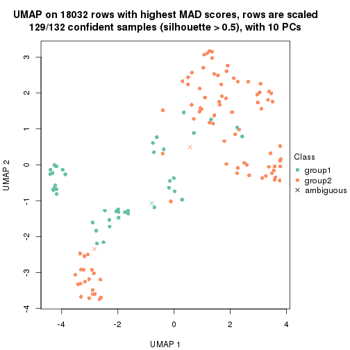</p>

</div>
<div id='tab-MAD-NMF-dimension-reduction-2'>
<pre><code class="r">dimension_reduction(res, k = 3, method = &quot;UMAP&quot;)
</code></pre>

<p></p>

</div>
<div id='tab-MAD-NMF-dimension-reduction-3'>
<pre><code class="r">dimension_reduction(res, k = 4, method = &quot;UMAP&quot;)
</code></pre>

<p></p>

</div>
<div id='tab-MAD-NMF-dimension-reduction-4'>
<pre><code class="r">dimension_reduction(res, k = 5, method = &quot;UMAP&quot;)
</code></pre>

<p></p>

</div>
<div id='tab-MAD-NMF-dimension-reduction-5'>
<pre><code class="r">dimension_reduction(res, k = 6, method = &quot;UMAP&quot;)
</code></pre>

<p></p>

</div>
</div>


Following heatmap shows how subgroups are split when increasing `k`:

```r
collect_classes(res)
```

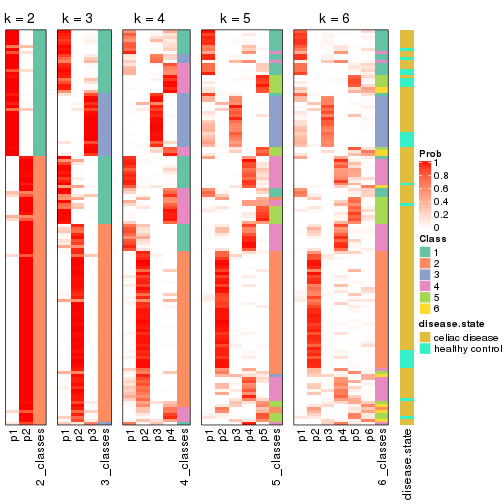


Test correlation between subgroups and known annotations. If the known
annotation is numeric, one-way ANOVA test is applied, and if the known
annotation is discrete, chi-squared contingency table test is applied.

```r
test_to_known_factors(res)
```

```
#>           n disease.state(p) k
#> MAD:NMF 129           0.0234 2
#> MAD:NMF 123           0.3049 3
#> MAD:NMF 113           0.2759 4
#> MAD:NMF 111           0.2804 5
#> MAD:NMF  83           0.2023 6
```


If matrix rows can be associated to genes, consider to use `GO_Enrichment(res,
...)` to perform function enrichment for the signature genes.


 

---------------------------------------------------


### ATC:hclust


The object with results only for a single top-value method and a single partition method 
can be extracted as:

```r
res = res_list["ATC", "hclust"]
# you can also extract it by
# res = res_list["ATC:hclust"]
```

A summary of `res` and all the functions that can be applied to it:

```r
res
```

```
#> A 'ConsensusPartition' object with k = 2, 3, 4, 5, 6.
#>   On a matrix with 18032 rows and 132 columns.
#>   Top rows (1000, 2000, 3000, 4000, 5000) are extracted by 'ATC' method.
#>   Subgroups are detected by 'hclust' method.
#>   Performed in total 1250 partitions by row resampling.
#>   Best k for subgroups seems to be 2.
#> 
#> Following methods can be applied to this 'ConsensusPartition' object:
#>  [1] "cola_report"             "collect_classes"         "collect_plots"          
#>  [4] "collect_stats"           "colnames"                "compare_signatures"     
#>  [7] "consensus_heatmap"       "dimension_reduction"     "functional_enrichment"  
#> [10] "get_anno_col"            "get_anno"                "get_classes"            
#> [13] "get_consensus"           "get_matrix"              "get_membership"         
#> [16] "get_param"               "get_signatures"          "get_stats"              
#> [19] "is_best_k"               "is_stable_k"             "membership_heatmap"     
#> [22] "ncol"                    "nrow"                    "plot_ecdf"              
#> [25] "rownames"                "select_partition_number" "show"                   
#> [28] "suggest_best_k"          "test_to_known_factors"
```

`collect_plots()` function collects all the plots made from `res` for all `k` (number of partitions)
into one single page to provide an easy and fast comparison between different `k`.

```r
collect_plots(res)
```


The plots are:

- The first row: a plot of the ECDF (Empirical cumulative distribution
  function) curves of the consensus matrix for each `k` and the heatmap of
  predicted classes for each `k`.
- The second row: heatmaps of the consensus matrix for each `k`.
- The third row: heatmaps of the membership matrix for each `k`.
- The fouth row: heatmaps of the signatures for each `k`.

All the plots in panels can be made by individual functions and they are
plotted later in this section.

`select_partition_number()` produces several plots showing different
statistics for choosing "optimized" `k`. There are following statistics:

- ECDF curves of the consensus matrix for each `k`;
- 1-PAC. [The PAC
  score](https://en.wikipedia.org/wiki/Consensus_clustering#Over-interpretation_potential_of_consensus_clustering)
  measures the proportion of the ambiguous subgrouping.
- Mean silhouette score.
- Concordance. The mean probability of fiting the consensus class ids in all
  partitions.
- Area increased. Denote $A_k$ as the area under the ECDF curve for current
  `k`, the area increased is defined as $A_k - A_{k-1}$.
- Rand index. The percent of pairs of samples that are both in a same cluster
  or both are not in a same cluster in the partition of k and k-1.
- Jaccard index. The ratio of pairs of samples are both in a same cluster in
  the partition of k and k-1 and the pairs of samples are both in a same
  cluster in the partition k or k-1.

The detailed explanations of these statistics can be found in [the cola
vignette](http://bioconductor.org/packages/devel/bioc/vignettes/cola/inst/doc/cola.html#toc_13).

Generally speaking, lower PAC score, higher mean silhouette score or higher
concordance corresponds to better partition. Rand index and Jaccard index
measure how similar the current partition is compared to partition with `k-1`.
If they are too similar, we won't accept `k` is better than `k-1`.

```r
select_partition_number(res)
```


The numeric values for all these statistics can be obtained by `get_stats()`.

```r
get_stats(res)
```

```
#>   k 1-PAC mean_silhouette concordance area_increased  Rand Jaccard
#> 2 2 0.689           0.831       0.931          0.346 0.672   0.672
#> 3 3 0.477           0.713       0.851          0.266 0.952   0.929
#> 4 4 0.462           0.528       0.768          0.351 0.716   0.565
#> 5 5 0.518           0.679       0.747          0.162 0.751   0.449
#> 6 6 0.617           0.647       0.777          0.091 0.963   0.864
```

`suggest_best_k()` suggests the best $k$ based on these statistics. The rules are as follows:

- All $k$ with Jaccard index larger than 0.95 are removed because the increase of
  the partition number does not provides enough extra information. If all $k$ are removed,
  the best $k$ is assigned by `NA`.
- For $k$ with 1-PAC larger than 0.9, the maximal $k$ is taken as the "best k". Other $k$ is called "optional k".
- If it does not fit the second rule. The $k$ with the highest vote of highest
  1-PAC, mean silhouette and concordance is taken as the "best k".

```r
suggest_best_k(res)
```

```
#> [1] 2
```


Following shows the table of the partitions (You need to click the **show/hide
code output** link to see it). The membership matrix (columns with name `p*`)
is inferred by
[`clue::cl_consensus()`](https://www.rdocumentation.org/link/cl_consensus?package=clue)
function with the `SE` method. Basically the value in the membership matrix
represents the probability to belong to a certain group. The finall class
label for an item is determined with the group with highest probability it
belongs to.

In `get_classes()` function, the entropy is calculated from the membership
matrix and the silhouette score is calculated from the consensus matrix.


<script>
$( function() {
	$( '#tabs-ATC-hclust-get-classes' ).tabs();
} );
</script>
<div id='tabs-ATC-hclust-get-classes'>
<ul>
<li><a href='#tab-ATC-hclust-get-classes-1'>k = 2</a></li>
<li><a href='#tab-ATC-hclust-get-classes-2'>k = 3</a></li>
<li><a href='#tab-ATC-hclust-get-classes-3'>k = 4</a></li>
<li><a href='#tab-ATC-hclust-get-classes-4'>k = 5</a></li>
<li><a href='#tab-ATC-hclust-get-classes-5'>k = 6</a></li>
</ul>

<div id='tab-ATC-hclust-get-classes-1'>
<p><a id='tab-ATC-hclust-get-classes-1-a' style='color:#0366d6' href='#'>show/hide code output</a></p>
<pre><code class="r">cbind(get_classes(res, k = 2), get_membership(res, k = 2))
</code></pre>

<pre><code>#&gt;           class entropy silhouette    p1    p2
#&gt; GSM289470     2  0.0000     0.9326 0.000 1.000
#&gt; GSM289471     1  0.0000     0.8701 1.000 0.000
#&gt; GSM289472     2  0.0000     0.9326 0.000 1.000
#&gt; GSM289473     2  0.0000     0.9326 0.000 1.000
#&gt; GSM289474     2  0.0000     0.9326 0.000 1.000
#&gt; GSM289475     2  0.0000     0.9326 0.000 1.000
#&gt; GSM289476     1  0.0000     0.8701 1.000 0.000
#&gt; GSM289477     2  0.0000     0.9326 0.000 1.000
#&gt; GSM289478     2  0.0000     0.9326 0.000 1.000
#&gt; GSM289479     2  0.0000     0.9326 0.000 1.000
#&gt; GSM289480     2  0.0000     0.9326 0.000 1.000
#&gt; GSM289481     2  0.0000     0.9326 0.000 1.000
#&gt; GSM289482     2  0.0000     0.9326 0.000 1.000
#&gt; GSM289483     2  0.0000     0.9326 0.000 1.000
#&gt; GSM289484     2  0.0000     0.9326 0.000 1.000
#&gt; GSM289485     2  0.0000     0.9326 0.000 1.000
#&gt; GSM289486     2  0.0000     0.9326 0.000 1.000
#&gt; GSM289487     2  0.0000     0.9326 0.000 1.000
#&gt; GSM289488     2  0.0000     0.9326 0.000 1.000
#&gt; GSM289489     2  0.0000     0.9326 0.000 1.000
#&gt; GSM289490     2  0.6438     0.7789 0.164 0.836
#&gt; GSM289491     2  0.0000     0.9326 0.000 1.000
#&gt; GSM289492     2  0.6531     0.7735 0.168 0.832
#&gt; GSM289493     2  0.0000     0.9326 0.000 1.000
#&gt; GSM289494     1  0.0000     0.8701 1.000 0.000
#&gt; GSM289495     2  0.0376     0.9306 0.004 0.996
#&gt; GSM289496     2  0.0000     0.9326 0.000 1.000
#&gt; GSM289497     2  0.0000     0.9326 0.000 1.000
#&gt; GSM289498     2  0.6531     0.7735 0.168 0.832
#&gt; GSM289499     2  0.0376     0.9306 0.004 0.996
#&gt; GSM289500     1  0.0000     0.8701 1.000 0.000
#&gt; GSM289501     2  0.0000     0.9326 0.000 1.000
#&gt; GSM289502     2  0.0000     0.9326 0.000 1.000
#&gt; GSM289503     2  0.0000     0.9326 0.000 1.000
#&gt; GSM289504     2  0.0000     0.9326 0.000 1.000
#&gt; GSM289505     2  0.0000     0.9326 0.000 1.000
#&gt; GSM289506     2  0.0000     0.9326 0.000 1.000
#&gt; GSM289507     2  0.0000     0.9326 0.000 1.000
#&gt; GSM289508     2  0.7139     0.7386 0.196 0.804
#&gt; GSM289509     1  0.4298     0.8382 0.912 0.088
#&gt; GSM289510     2  0.1414     0.9210 0.020 0.980
#&gt; GSM289511     2  0.0000     0.9326 0.000 1.000
#&gt; GSM289512     1  0.0000     0.8701 1.000 0.000
#&gt; GSM289513     2  0.0000     0.9326 0.000 1.000
#&gt; GSM289514     2  0.9909     0.1408 0.444 0.556
#&gt; GSM289515     2  0.0376     0.9306 0.004 0.996
#&gt; GSM289516     2  0.0000     0.9326 0.000 1.000
#&gt; GSM289517     2  0.0376     0.9306 0.004 0.996
#&gt; GSM289518     2  0.0376     0.9306 0.004 0.996
#&gt; GSM289519     2  0.7219     0.7165 0.200 0.800
#&gt; GSM289520     2  0.0000     0.9326 0.000 1.000
#&gt; GSM289521     1  0.9963     0.1744 0.536 0.464
#&gt; GSM289522     2  0.4815     0.8458 0.104 0.896
#&gt; GSM289523     1  0.0000     0.8701 1.000 0.000
#&gt; GSM289524     2  0.0000     0.9326 0.000 1.000
#&gt; GSM289525     2  0.0376     0.9306 0.004 0.996
#&gt; GSM289526     2  0.8386     0.6239 0.268 0.732
#&gt; GSM289527     2  0.0000     0.9326 0.000 1.000
#&gt; GSM289528     2  0.0000     0.9326 0.000 1.000
#&gt; GSM289529     2  0.0000     0.9326 0.000 1.000
#&gt; GSM289530     1  0.4298     0.8363 0.912 0.088
#&gt; GSM289531     2  0.0000     0.9326 0.000 1.000
#&gt; GSM289532     1  0.0000     0.8701 1.000 0.000
#&gt; GSM289533     2  0.0000     0.9326 0.000 1.000
#&gt; GSM289534     1  0.1414     0.8677 0.980 0.020
#&gt; GSM289535     2  0.3431     0.8881 0.064 0.936
#&gt; GSM289536     1  0.0000     0.8701 1.000 0.000
#&gt; GSM289537     2  0.0000     0.9326 0.000 1.000
#&gt; GSM289538     2  0.0000     0.9326 0.000 1.000
#&gt; GSM289539     2  0.0000     0.9326 0.000 1.000
#&gt; GSM289540     1  0.6887     0.7430 0.816 0.184
#&gt; GSM289541     2  0.4815     0.8473 0.104 0.896
#&gt; GSM289542     2  0.4815     0.8473 0.104 0.896
#&gt; GSM289543     2  0.0376     0.9306 0.004 0.996
#&gt; GSM289544     1  0.9944     0.2013 0.544 0.456
#&gt; GSM289545     2  0.0000     0.9326 0.000 1.000
#&gt; GSM289546     2  0.0000     0.9326 0.000 1.000
#&gt; GSM289547     2  0.0000     0.9326 0.000 1.000
#&gt; GSM289548     2  0.9248     0.4690 0.340 0.660
#&gt; GSM289549     2  0.0000     0.9326 0.000 1.000
#&gt; GSM289550     2  0.8443     0.6141 0.272 0.728
#&gt; GSM289551     1  0.0000     0.8701 1.000 0.000
#&gt; GSM289552     2  0.9996    -0.0287 0.488 0.512
#&gt; GSM289553     1  1.0000     0.0509 0.504 0.496
#&gt; GSM289554     2  0.0376     0.9306 0.004 0.996
#&gt; GSM289555     2  0.0000     0.9326 0.000 1.000
#&gt; GSM289556     2  0.9248     0.4690 0.340 0.660
#&gt; GSM289557     2  0.0000     0.9326 0.000 1.000
#&gt; GSM289558     2  0.0000     0.9326 0.000 1.000
#&gt; GSM289559     2  0.1414     0.9201 0.020 0.980
#&gt; GSM289560     2  0.0000     0.9326 0.000 1.000
#&gt; GSM289561     2  0.0000     0.9326 0.000 1.000
#&gt; GSM289562     2  0.9323     0.4490 0.348 0.652
#&gt; GSM289563     2  0.0000     0.9326 0.000 1.000
#&gt; GSM289564     1  0.0938     0.8694 0.988 0.012
#&gt; GSM289565     1  0.0938     0.8694 0.988 0.012
#&gt; GSM289566     1  0.9977     0.1469 0.528 0.472
#&gt; GSM289567     2  0.9635     0.3209 0.388 0.612
#&gt; GSM289568     2  0.0000     0.9326 0.000 1.000
#&gt; GSM289569     2  0.0000     0.9326 0.000 1.000
#&gt; GSM289570     2  0.9635     0.3209 0.388 0.612
#&gt; GSM289571     2  0.0000     0.9326 0.000 1.000
#&gt; GSM289572     2  0.0376     0.9306 0.004 0.996
#&gt; GSM289573     2  0.0000     0.9326 0.000 1.000
#&gt; GSM289574     2  0.0000     0.9326 0.000 1.000
#&gt; GSM289575     2  0.4562     0.8585 0.096 0.904
#&gt; GSM289576     2  0.0000     0.9326 0.000 1.000
#&gt; GSM289577     2  0.4562     0.8585 0.096 0.904
#&gt; GSM289578     2  0.4562     0.8585 0.096 0.904
#&gt; GSM289579     2  0.4562     0.8585 0.096 0.904
#&gt; GSM289580     1  0.0000     0.8701 1.000 0.000
#&gt; GSM289581     1  0.3431     0.8507 0.936 0.064
#&gt; GSM289582     1  0.9815     0.3415 0.580 0.420
#&gt; GSM289583     2  0.0000     0.9326 0.000 1.000
#&gt; GSM289584     2  0.0000     0.9326 0.000 1.000
#&gt; GSM289585     2  0.0000     0.9326 0.000 1.000
#&gt; GSM289586     2  0.2423     0.9071 0.040 0.960
#&gt; GSM289587     2  0.0000     0.9326 0.000 1.000
#&gt; GSM289588     1  0.0000     0.8701 1.000 0.000
#&gt; GSM289589     2  0.1414     0.9201 0.020 0.980
#&gt; GSM289590     1  0.4298     0.8382 0.912 0.088
#&gt; GSM289591     2  0.9580     0.3614 0.380 0.620
#&gt; GSM289592     2  0.0000     0.9326 0.000 1.000
#&gt; GSM289593     1  0.0000     0.8701 1.000 0.000
#&gt; GSM289594     2  0.0000     0.9326 0.000 1.000
#&gt; GSM289595     1  0.5842     0.7947 0.860 0.140
#&gt; GSM289596     2  0.0000     0.9326 0.000 1.000
#&gt; GSM289597     2  0.0376     0.9306 0.004 0.996
#&gt; GSM289598     2  0.8016     0.6637 0.244 0.756
#&gt; GSM289599     2  0.0376     0.9306 0.004 0.996
#&gt; GSM289600     2  0.9552     0.3735 0.376 0.624
#&gt; GSM289601     1  0.1843     0.8653 0.972 0.028
</code></pre>

<script>
$('#tab-ATC-hclust-get-classes-1-a').parent().next().next().hide();
$('#tab-ATC-hclust-get-classes-1-a').click(function(){
  $('#tab-ATC-hclust-get-classes-1-a').parent().next().next().toggle();
  return(false);
});
</script>
</div>

<div id='tab-ATC-hclust-get-classes-2'>
<p><a id='tab-ATC-hclust-get-classes-2-a' style='color:#0366d6' href='#'>show/hide code output</a></p>
<pre><code class="r">cbind(get_classes(res, k = 3), get_membership(res, k = 3))
</code></pre>

<pre><code>#&gt;           class entropy silhouette    p1    p2    p3
#&gt; GSM289470     2  0.2537     0.8189 0.080 0.920 0.000
#&gt; GSM289471     3  0.0000     0.9209 0.000 0.000 1.000
#&gt; GSM289472     2  0.3412     0.8287 0.124 0.876 0.000
#&gt; GSM289473     2  0.0424     0.8397 0.008 0.992 0.000
#&gt; GSM289474     2  0.0424     0.8397 0.008 0.992 0.000
#&gt; GSM289475     2  0.3482     0.8271 0.128 0.872 0.000
#&gt; GSM289476     3  0.0000     0.9209 0.000 0.000 1.000
#&gt; GSM289477     2  0.3412     0.8287 0.124 0.876 0.000
#&gt; GSM289478     2  0.3482     0.8271 0.128 0.872 0.000
#&gt; GSM289479     2  0.0000     0.8414 0.000 1.000 0.000
#&gt; GSM289480     2  0.3412     0.8287 0.124 0.876 0.000
#&gt; GSM289481     2  0.0000     0.8414 0.000 1.000 0.000
#&gt; GSM289482     2  0.3412     0.8287 0.124 0.876 0.000
#&gt; GSM289483     2  0.3412     0.8287 0.124 0.876 0.000
#&gt; GSM289484     2  0.3412     0.8287 0.124 0.876 0.000
#&gt; GSM289485     2  0.3412     0.8287 0.124 0.876 0.000
#&gt; GSM289486     2  0.2537     0.8189 0.080 0.920 0.000
#&gt; GSM289487     2  0.3482     0.8271 0.128 0.872 0.000
#&gt; GSM289488     2  0.3412     0.8287 0.124 0.876 0.000
#&gt; GSM289489     2  0.1529     0.8341 0.040 0.960 0.000
#&gt; GSM289490     2  0.4974     0.6138 0.236 0.764 0.000
#&gt; GSM289491     2  0.1860     0.8288 0.052 0.948 0.000
#&gt; GSM289492     2  0.5016     0.6062 0.240 0.760 0.000
#&gt; GSM289493     2  0.2878     0.8365 0.096 0.904 0.000
#&gt; GSM289494     3  0.6307     0.1788 0.488 0.000 0.512
#&gt; GSM289495     2  0.1411     0.8324 0.036 0.964 0.000
#&gt; GSM289496     2  0.2959     0.8370 0.100 0.900 0.000
#&gt; GSM289497     2  0.3482     0.8271 0.128 0.872 0.000
#&gt; GSM289498     2  0.5016     0.6062 0.240 0.760 0.000
#&gt; GSM289499     2  0.1163     0.8357 0.028 0.972 0.000
#&gt; GSM289500     3  0.0000     0.9209 0.000 0.000 1.000
#&gt; GSM289501     2  0.2537     0.8420 0.080 0.920 0.000
#&gt; GSM289502     2  0.3482     0.8271 0.128 0.872 0.000
#&gt; GSM289503     2  0.3482     0.8271 0.128 0.872 0.000
#&gt; GSM289504     2  0.3192     0.8323 0.112 0.888 0.000
#&gt; GSM289505     2  0.3267     0.8313 0.116 0.884 0.000
#&gt; GSM289506     2  0.3482     0.8271 0.128 0.872 0.000
#&gt; GSM289507     2  0.3482     0.8271 0.128 0.872 0.000
#&gt; GSM289508     2  0.5529     0.5042 0.296 0.704 0.000
#&gt; GSM289509     1  0.5677     0.5062 0.792 0.048 0.160
#&gt; GSM289510     2  0.1753     0.8289 0.048 0.952 0.000
#&gt; GSM289511     2  0.0237     0.8421 0.004 0.996 0.000
#&gt; GSM289512     3  0.0000     0.9209 0.000 0.000 1.000
#&gt; GSM289513     2  0.0237     0.8421 0.004 0.996 0.000
#&gt; GSM289514     1  0.6825     0.2509 0.500 0.488 0.012
#&gt; GSM289515     2  0.0892     0.8373 0.020 0.980 0.000
#&gt; GSM289516     2  0.0237     0.8421 0.004 0.996 0.000
#&gt; GSM289517     2  0.0892     0.8373 0.020 0.980 0.000
#&gt; GSM289518     2  0.0892     0.8373 0.020 0.980 0.000
#&gt; GSM289519     2  0.5420     0.5802 0.240 0.752 0.008
#&gt; GSM289520     2  0.0237     0.8421 0.004 0.996 0.000
#&gt; GSM289521     1  0.6896     0.5080 0.588 0.392 0.020
#&gt; GSM289522     2  0.3551     0.7520 0.132 0.868 0.000
#&gt; GSM289523     3  0.0000     0.9209 0.000 0.000 1.000
#&gt; GSM289524     2  0.0592     0.8392 0.012 0.988 0.000
#&gt; GSM289525     2  0.0892     0.8373 0.020 0.980 0.000
#&gt; GSM289526     2  0.6126     0.3426 0.352 0.644 0.004
#&gt; GSM289527     2  0.0592     0.8392 0.012 0.988 0.000
#&gt; GSM289528     2  0.3482     0.8271 0.128 0.872 0.000
#&gt; GSM289529     2  0.0000     0.8414 0.000 1.000 0.000
#&gt; GSM289530     1  0.5355     0.5097 0.804 0.036 0.160
#&gt; GSM289531     2  0.0424     0.8397 0.008 0.992 0.000
#&gt; GSM289532     1  0.4931     0.3854 0.768 0.000 0.232
#&gt; GSM289533     2  0.0424     0.8397 0.008 0.992 0.000
#&gt; GSM289534     3  0.5919     0.5784 0.276 0.012 0.712
#&gt; GSM289535     2  0.3192     0.7839 0.112 0.888 0.000
#&gt; GSM289536     3  0.0000     0.9209 0.000 0.000 1.000
#&gt; GSM289537     2  0.3192     0.8323 0.112 0.888 0.000
#&gt; GSM289538     2  0.3267     0.8313 0.116 0.884 0.000
#&gt; GSM289539     2  0.3482     0.8271 0.128 0.872 0.000
#&gt; GSM289540     1  0.6144     0.5463 0.780 0.132 0.088
#&gt; GSM289541     2  0.4452     0.6898 0.192 0.808 0.000
#&gt; GSM289542     2  0.4452     0.6898 0.192 0.808 0.000
#&gt; GSM289543     2  0.1163     0.8357 0.028 0.972 0.000
#&gt; GSM289544     1  0.6865     0.5223 0.596 0.384 0.020
#&gt; GSM289545     2  0.3340     0.8301 0.120 0.880 0.000
#&gt; GSM289546     2  0.3340     0.8301 0.120 0.880 0.000
#&gt; GSM289547     2  0.3482     0.8271 0.128 0.872 0.000
#&gt; GSM289548     2  0.6432     0.0649 0.428 0.568 0.004
#&gt; GSM289549     2  0.2537     0.8189 0.080 0.920 0.000
#&gt; GSM289550     2  0.6008     0.3003 0.372 0.628 0.000
#&gt; GSM289551     3  0.0000     0.9209 0.000 0.000 1.000
#&gt; GSM289552     1  0.6994     0.4165 0.556 0.424 0.020
#&gt; GSM289553     1  0.7080     0.4481 0.564 0.412 0.024
#&gt; GSM289554     2  0.1411     0.8324 0.036 0.964 0.000
#&gt; GSM289555     2  0.3482     0.8271 0.128 0.872 0.000
#&gt; GSM289556     2  0.6432     0.0649 0.428 0.568 0.004
#&gt; GSM289557     2  0.3482     0.8271 0.128 0.872 0.000
#&gt; GSM289558     2  0.2066     0.8438 0.060 0.940 0.000
#&gt; GSM289559     2  0.2959     0.8056 0.100 0.900 0.000
#&gt; GSM289560     2  0.3482     0.8271 0.128 0.872 0.000
#&gt; GSM289561     2  0.3482     0.8271 0.128 0.872 0.000
#&gt; GSM289562     2  0.6451     0.0291 0.436 0.560 0.004
#&gt; GSM289563     2  0.2537     0.8189 0.080 0.920 0.000
#&gt; GSM289564     1  0.4750     0.4107 0.784 0.000 0.216
#&gt; GSM289565     1  0.4750     0.4081 0.784 0.000 0.216
#&gt; GSM289566     1  0.6783     0.4994 0.588 0.396 0.016
#&gt; GSM289567     2  0.6984    -0.0139 0.420 0.560 0.020
#&gt; GSM289568     2  0.0237     0.8421 0.004 0.996 0.000
#&gt; GSM289569     2  0.0237     0.8421 0.004 0.996 0.000
#&gt; GSM289570     2  0.6984    -0.0139 0.420 0.560 0.020
#&gt; GSM289571     2  0.3267     0.8313 0.116 0.884 0.000
#&gt; GSM289572     2  0.1529     0.8380 0.040 0.960 0.000
#&gt; GSM289573     2  0.2625     0.8399 0.084 0.916 0.000
#&gt; GSM289574     2  0.3482     0.8271 0.128 0.872 0.000
#&gt; GSM289575     2  0.3941     0.7411 0.156 0.844 0.000
#&gt; GSM289576     2  0.2537     0.8404 0.080 0.920 0.000
#&gt; GSM289577     2  0.3941     0.7411 0.156 0.844 0.000
#&gt; GSM289578     2  0.3941     0.7411 0.156 0.844 0.000
#&gt; GSM289579     2  0.3941     0.7411 0.156 0.844 0.000
#&gt; GSM289580     3  0.1031     0.9021 0.024 0.000 0.976
#&gt; GSM289581     1  0.4782     0.4828 0.820 0.016 0.164
#&gt; GSM289582     1  0.8196     0.4657 0.560 0.356 0.084
#&gt; GSM289583     2  0.3482     0.8271 0.128 0.872 0.000
#&gt; GSM289584     2  0.2448     0.8424 0.076 0.924 0.000
#&gt; GSM289585     2  0.3482     0.8271 0.128 0.872 0.000
#&gt; GSM289586     2  0.2711     0.8059 0.088 0.912 0.000
#&gt; GSM289587     2  0.2537     0.8189 0.080 0.920 0.000
#&gt; GSM289588     3  0.0000     0.9209 0.000 0.000 1.000
#&gt; GSM289589     2  0.2959     0.8056 0.100 0.900 0.000
#&gt; GSM289590     1  0.5677     0.5062 0.792 0.048 0.160
#&gt; GSM289591     2  0.6302    -0.1293 0.480 0.520 0.000
#&gt; GSM289592     2  0.3482     0.8271 0.128 0.872 0.000
#&gt; GSM289593     3  0.0000     0.9209 0.000 0.000 1.000
#&gt; GSM289594     2  0.1753     0.8431 0.048 0.952 0.000
#&gt; GSM289595     1  0.6425     0.5340 0.764 0.096 0.140
#&gt; GSM289596     2  0.3482     0.8271 0.128 0.872 0.000
#&gt; GSM289597     2  0.0892     0.8373 0.020 0.980 0.000
#&gt; GSM289598     2  0.5859     0.3831 0.344 0.656 0.000
#&gt; GSM289599     2  0.1411     0.8324 0.036 0.964 0.000
#&gt; GSM289600     2  0.6654    -0.0845 0.456 0.536 0.008
#&gt; GSM289601     1  0.5269     0.4441 0.784 0.016 0.200
</code></pre>

<script>
$('#tab-ATC-hclust-get-classes-2-a').parent().next().next().hide();
$('#tab-ATC-hclust-get-classes-2-a').click(function(){
  $('#tab-ATC-hclust-get-classes-2-a').parent().next().next().toggle();
  return(false);
});
</script>
</div>

<div id='tab-ATC-hclust-get-classes-3'>
<p><a id='tab-ATC-hclust-get-classes-3-a' style='color:#0366d6' href='#'>show/hide code output</a></p>
<pre><code class="r">cbind(get_classes(res, k = 4), get_membership(res, k = 4))
</code></pre>

<pre><code>#&gt;           class entropy silhouette    p1    p2    p3    p4
#&gt; GSM289470     1  0.3933     0.5494 0.792 0.200 0.000 0.008
#&gt; GSM289471     3  0.0000     0.9583 0.000 0.000 1.000 0.000
#&gt; GSM289472     2  0.0336     0.6922 0.008 0.992 0.000 0.000
#&gt; GSM289473     2  0.4941     0.4036 0.436 0.564 0.000 0.000
#&gt; GSM289474     2  0.4941     0.4036 0.436 0.564 0.000 0.000
#&gt; GSM289475     2  0.0000     0.6897 0.000 1.000 0.000 0.000
#&gt; GSM289476     3  0.0000     0.9583 0.000 0.000 1.000 0.000
#&gt; GSM289477     2  0.0336     0.6922 0.008 0.992 0.000 0.000
#&gt; GSM289478     2  0.0469     0.6849 0.012 0.988 0.000 0.000
#&gt; GSM289479     2  0.4888     0.4388 0.412 0.588 0.000 0.000
#&gt; GSM289480     2  0.0336     0.6922 0.008 0.992 0.000 0.000
#&gt; GSM289481     2  0.4888     0.4388 0.412 0.588 0.000 0.000
#&gt; GSM289482     2  0.0336     0.6922 0.008 0.992 0.000 0.000
#&gt; GSM289483     2  0.0336     0.6922 0.008 0.992 0.000 0.000
#&gt; GSM289484     2  0.0336     0.6922 0.008 0.992 0.000 0.000
#&gt; GSM289485     2  0.0336     0.6922 0.008 0.992 0.000 0.000
#&gt; GSM289486     1  0.3852     0.5548 0.800 0.192 0.000 0.008
#&gt; GSM289487     2  0.0000     0.6897 0.000 1.000 0.000 0.000
#&gt; GSM289488     2  0.0336     0.6922 0.008 0.992 0.000 0.000
#&gt; GSM289489     2  0.4977     0.3351 0.460 0.540 0.000 0.000
#&gt; GSM289490     1  0.6954     0.2487 0.500 0.384 0.000 0.116
#&gt; GSM289491     2  0.4996     0.2684 0.484 0.516 0.000 0.000
#&gt; GSM289492     1  0.6995     0.2523 0.496 0.384 0.000 0.120
#&gt; GSM289493     2  0.2408     0.6703 0.104 0.896 0.000 0.000
#&gt; GSM289494     4  0.4933     0.1699 0.000 0.000 0.432 0.568
#&gt; GSM289495     2  0.5132     0.3661 0.448 0.548 0.000 0.004
#&gt; GSM289496     2  0.1637     0.6827 0.060 0.940 0.000 0.000
#&gt; GSM289497     2  0.0469     0.6849 0.012 0.988 0.000 0.000
#&gt; GSM289498     1  0.6995     0.2523 0.496 0.384 0.000 0.120
#&gt; GSM289499     2  0.5112     0.3918 0.436 0.560 0.000 0.004
#&gt; GSM289500     3  0.0000     0.9583 0.000 0.000 1.000 0.000
#&gt; GSM289501     2  0.3172     0.6425 0.160 0.840 0.000 0.000
#&gt; GSM289502     2  0.0469     0.6849 0.012 0.988 0.000 0.000
#&gt; GSM289503     2  0.0469     0.6849 0.012 0.988 0.000 0.000
#&gt; GSM289504     2  0.1716     0.6832 0.064 0.936 0.000 0.000
#&gt; GSM289505     2  0.0817     0.6921 0.024 0.976 0.000 0.000
#&gt; GSM289506     2  0.0469     0.6849 0.012 0.988 0.000 0.000
#&gt; GSM289507     2  0.0469     0.6849 0.012 0.988 0.000 0.000
#&gt; GSM289508     1  0.2610     0.4317 0.900 0.012 0.000 0.088
#&gt; GSM289509     4  0.3495     0.8052 0.140 0.000 0.016 0.844
#&gt; GSM289510     2  0.5500     0.3005 0.464 0.520 0.000 0.016
#&gt; GSM289511     2  0.4776     0.4779 0.376 0.624 0.000 0.000
#&gt; GSM289512     3  0.0000     0.9583 0.000 0.000 1.000 0.000
#&gt; GSM289513     2  0.4776     0.4779 0.376 0.624 0.000 0.000
#&gt; GSM289514     1  0.7313     0.3748 0.464 0.156 0.000 0.380
#&gt; GSM289515     2  0.4967     0.3751 0.452 0.548 0.000 0.000
#&gt; GSM289516     2  0.4776     0.4779 0.376 0.624 0.000 0.000
#&gt; GSM289517     2  0.4967     0.3751 0.452 0.548 0.000 0.000
#&gt; GSM289518     2  0.4967     0.3751 0.452 0.548 0.000 0.000
#&gt; GSM289519     1  0.7456     0.3375 0.488 0.316 0.000 0.196
#&gt; GSM289520     2  0.4776     0.4779 0.376 0.624 0.000 0.000
#&gt; GSM289521     1  0.6966     0.1978 0.452 0.096 0.004 0.448
#&gt; GSM289522     2  0.6743     0.1920 0.392 0.512 0.000 0.096
#&gt; GSM289523     3  0.0000     0.9583 0.000 0.000 1.000 0.000
#&gt; GSM289524     2  0.4941     0.4030 0.436 0.564 0.000 0.000
#&gt; GSM289525     2  0.4967     0.3751 0.452 0.548 0.000 0.000
#&gt; GSM289526     1  0.7229     0.4690 0.536 0.280 0.000 0.184
#&gt; GSM289527     2  0.4941     0.4030 0.436 0.564 0.000 0.000
#&gt; GSM289528     2  0.0469     0.6849 0.012 0.988 0.000 0.000
#&gt; GSM289529     2  0.4898     0.4337 0.416 0.584 0.000 0.000
#&gt; GSM289530     4  0.2530     0.8067 0.112 0.000 0.000 0.888
#&gt; GSM289531     2  0.4941     0.4036 0.436 0.564 0.000 0.000
#&gt; GSM289532     4  0.0592     0.7782 0.000 0.000 0.016 0.984
#&gt; GSM289533     2  0.4941     0.4036 0.436 0.564 0.000 0.000
#&gt; GSM289534     3  0.5228     0.4388 0.024 0.000 0.664 0.312
#&gt; GSM289535     1  0.6005    -0.1222 0.500 0.460 0.000 0.040
#&gt; GSM289536     3  0.0000     0.9583 0.000 0.000 1.000 0.000
#&gt; GSM289537     2  0.0817     0.6920 0.024 0.976 0.000 0.000
#&gt; GSM289538     2  0.0707     0.6925 0.020 0.980 0.000 0.000
#&gt; GSM289539     2  0.0469     0.6849 0.012 0.988 0.000 0.000
#&gt; GSM289540     4  0.4567     0.6288 0.276 0.000 0.008 0.716
#&gt; GSM289541     1  0.2048     0.5201 0.928 0.064 0.000 0.008
#&gt; GSM289542     1  0.2048     0.5201 0.928 0.064 0.000 0.008
#&gt; GSM289543     2  0.5112     0.3918 0.436 0.560 0.000 0.004
#&gt; GSM289544     1  0.6826     0.1681 0.456 0.084 0.004 0.456
#&gt; GSM289545     2  0.0592     0.6927 0.016 0.984 0.000 0.000
#&gt; GSM289546     2  0.0592     0.6927 0.016 0.984 0.000 0.000
#&gt; GSM289547     2  0.0188     0.6882 0.004 0.996 0.000 0.000
#&gt; GSM289548     1  0.4088     0.3251 0.764 0.004 0.000 0.232
#&gt; GSM289549     1  0.3852     0.5548 0.800 0.192 0.000 0.008
#&gt; GSM289550     1  0.3266     0.3174 0.832 0.000 0.000 0.168
#&gt; GSM289551     3  0.0000     0.9583 0.000 0.000 1.000 0.000
#&gt; GSM289552     1  0.5099    -0.0868 0.612 0.000 0.008 0.380
#&gt; GSM289553     1  0.5150    -0.1072 0.596 0.000 0.008 0.396
#&gt; GSM289554     2  0.5132     0.3661 0.448 0.548 0.000 0.004
#&gt; GSM289555     2  0.0469     0.6849 0.012 0.988 0.000 0.000
#&gt; GSM289556     1  0.4088     0.3251 0.764 0.004 0.000 0.232
#&gt; GSM289557     2  0.0469     0.6849 0.012 0.988 0.000 0.000
#&gt; GSM289558     2  0.4008     0.5866 0.244 0.756 0.000 0.000
#&gt; GSM289559     1  0.3545     0.5673 0.828 0.164 0.000 0.008
#&gt; GSM289560     2  0.0469     0.6849 0.012 0.988 0.000 0.000
#&gt; GSM289561     2  0.0469     0.6849 0.012 0.988 0.000 0.000
#&gt; GSM289562     1  0.4155     0.3187 0.756 0.004 0.000 0.240
#&gt; GSM289563     1  0.3852     0.5548 0.800 0.192 0.000 0.008
#&gt; GSM289564     4  0.0336     0.7861 0.008 0.000 0.000 0.992
#&gt; GSM289565     4  0.0927     0.7907 0.016 0.000 0.008 0.976
#&gt; GSM289566     1  0.6965     0.2078 0.460 0.096 0.004 0.440
#&gt; GSM289567     1  0.7319     0.4049 0.460 0.156 0.000 0.384
#&gt; GSM289568     2  0.4776     0.4779 0.376 0.624 0.000 0.000
#&gt; GSM289569     2  0.4776     0.4779 0.376 0.624 0.000 0.000
#&gt; GSM289570     1  0.7319     0.4049 0.460 0.156 0.000 0.384
#&gt; GSM289571     2  0.0707     0.6925 0.020 0.980 0.000 0.000
#&gt; GSM289572     2  0.5112     0.3912 0.436 0.560 0.000 0.004
#&gt; GSM289573     2  0.2704     0.6613 0.124 0.876 0.000 0.000
#&gt; GSM289574     2  0.0469     0.6849 0.012 0.988 0.000 0.000
#&gt; GSM289575     1  0.6607     0.1107 0.516 0.400 0.000 0.084
#&gt; GSM289576     2  0.3024     0.6506 0.148 0.852 0.000 0.000
#&gt; GSM289577     1  0.6607     0.1107 0.516 0.400 0.000 0.084
#&gt; GSM289578     1  0.6607     0.1107 0.516 0.400 0.000 0.084
#&gt; GSM289579     1  0.6607     0.1107 0.516 0.400 0.000 0.084
#&gt; GSM289580     3  0.1118     0.9288 0.000 0.000 0.964 0.036
#&gt; GSM289581     4  0.2149     0.8112 0.088 0.000 0.000 0.912
#&gt; GSM289582     4  0.6443     0.0924 0.376 0.076 0.000 0.548
#&gt; GSM289583     2  0.0469     0.6849 0.012 0.988 0.000 0.000
#&gt; GSM289584     2  0.3219     0.6405 0.164 0.836 0.000 0.000
#&gt; GSM289585     2  0.0469     0.6849 0.012 0.988 0.000 0.000
#&gt; GSM289586     1  0.5774    -0.1407 0.508 0.464 0.000 0.028
#&gt; GSM289587     1  0.3852     0.5548 0.800 0.192 0.000 0.008
#&gt; GSM289588     3  0.0000     0.9583 0.000 0.000 1.000 0.000
#&gt; GSM289589     1  0.3545     0.5673 0.828 0.164 0.000 0.008
#&gt; GSM289590     4  0.3495     0.8052 0.140 0.000 0.016 0.844
#&gt; GSM289591     1  0.4277     0.0535 0.720 0.000 0.000 0.280
#&gt; GSM289592     2  0.0469     0.6849 0.012 0.988 0.000 0.000
#&gt; GSM289593     3  0.0000     0.9583 0.000 0.000 1.000 0.000
#&gt; GSM289594     2  0.4790     0.4714 0.380 0.620 0.000 0.000
#&gt; GSM289595     4  0.4019     0.7653 0.196 0.000 0.012 0.792
#&gt; GSM289596     2  0.0336     0.6898 0.008 0.992 0.000 0.000
#&gt; GSM289597     2  0.4967     0.3751 0.452 0.548 0.000 0.000
#&gt; GSM289598     1  0.3495     0.3848 0.844 0.016 0.000 0.140
#&gt; GSM289599     2  0.5132     0.3661 0.448 0.548 0.000 0.004
#&gt; GSM289600     1  0.4372     0.2734 0.728 0.004 0.000 0.268
#&gt; GSM289601     4  0.1452     0.8043 0.036 0.000 0.008 0.956
</code></pre>

<script>
$('#tab-ATC-hclust-get-classes-3-a').parent().next().next().hide();
$('#tab-ATC-hclust-get-classes-3-a').click(function(){
  $('#tab-ATC-hclust-get-classes-3-a').parent().next().next().toggle();
  return(false);
});
</script>
</div>

<div id='tab-ATC-hclust-get-classes-4'>
<p><a id='tab-ATC-hclust-get-classes-4-a' style='color:#0366d6' href='#'>show/hide code output</a></p>
<pre><code class="r">cbind(get_classes(res, k = 5), get_membership(res, k = 5))
</code></pre>

<pre><code>#&gt;           class entropy silhouette    p1    p2    p3    p4    p5
#&gt; GSM289470     1  0.5501     0.5336 0.492 0.000 0.000 0.444 0.064
#&gt; GSM289471     3  0.0000     0.9607 0.000 0.000 1.000 0.000 0.000
#&gt; GSM289472     5  0.1043     0.8904 0.000 0.000 0.000 0.040 0.960
#&gt; GSM289473     4  0.3452     0.7755 0.000 0.000 0.000 0.756 0.244
#&gt; GSM289474     4  0.3452     0.7755 0.000 0.000 0.000 0.756 0.244
#&gt; GSM289475     5  0.0880     0.8915 0.000 0.000 0.000 0.032 0.968
#&gt; GSM289476     3  0.0000     0.9607 0.000 0.000 1.000 0.000 0.000
#&gt; GSM289477     5  0.1043     0.8904 0.000 0.000 0.000 0.040 0.960
#&gt; GSM289478     5  0.0000     0.8901 0.000 0.000 0.000 0.000 1.000
#&gt; GSM289479     4  0.3661     0.7641 0.000 0.000 0.000 0.724 0.276
#&gt; GSM289480     5  0.1043     0.8904 0.000 0.000 0.000 0.040 0.960
#&gt; GSM289481     4  0.3661     0.7641 0.000 0.000 0.000 0.724 0.276
#&gt; GSM289482     5  0.1043     0.8904 0.000 0.000 0.000 0.040 0.960
#&gt; GSM289483     5  0.1043     0.8904 0.000 0.000 0.000 0.040 0.960
#&gt; GSM289484     5  0.1043     0.8904 0.000 0.000 0.000 0.040 0.960
#&gt; GSM289485     5  0.1043     0.8904 0.000 0.000 0.000 0.040 0.960
#&gt; GSM289486     1  0.5401     0.5357 0.492 0.000 0.000 0.452 0.056
#&gt; GSM289487     5  0.0880     0.8915 0.000 0.000 0.000 0.032 0.968
#&gt; GSM289488     5  0.1043     0.8904 0.000 0.000 0.000 0.040 0.960
#&gt; GSM289489     4  0.3596     0.7650 0.016 0.000 0.000 0.784 0.200
#&gt; GSM289490     4  0.5823     0.4793 0.252 0.004 0.000 0.612 0.132
#&gt; GSM289491     4  0.3639     0.7530 0.024 0.000 0.000 0.792 0.184
#&gt; GSM289492     4  0.5845     0.4730 0.256 0.004 0.000 0.608 0.132
#&gt; GSM289493     5  0.3274     0.6962 0.000 0.000 0.000 0.220 0.780
#&gt; GSM289494     2  0.6071    -0.0318 0.016 0.484 0.424 0.076 0.000
#&gt; GSM289495     4  0.3750     0.7737 0.012 0.000 0.000 0.756 0.232
#&gt; GSM289496     5  0.3242     0.6895 0.000 0.000 0.000 0.216 0.784
#&gt; GSM289497     5  0.0000     0.8901 0.000 0.000 0.000 0.000 1.000
#&gt; GSM289498     4  0.5845     0.4730 0.256 0.004 0.000 0.608 0.132
#&gt; GSM289499     4  0.3700     0.7749 0.008 0.000 0.000 0.752 0.240
#&gt; GSM289500     3  0.0000     0.9607 0.000 0.000 1.000 0.000 0.000
#&gt; GSM289501     5  0.4225     0.3210 0.004 0.000 0.000 0.364 0.632
#&gt; GSM289502     5  0.0000     0.8901 0.000 0.000 0.000 0.000 1.000
#&gt; GSM289503     5  0.0000     0.8901 0.000 0.000 0.000 0.000 1.000
#&gt; GSM289504     5  0.2813     0.7747 0.000 0.000 0.000 0.168 0.832
#&gt; GSM289505     5  0.2280     0.8347 0.000 0.000 0.000 0.120 0.880
#&gt; GSM289506     5  0.0000     0.8901 0.000 0.000 0.000 0.000 1.000
#&gt; GSM289507     5  0.0000     0.8901 0.000 0.000 0.000 0.000 1.000
#&gt; GSM289508     1  0.3884     0.5966 0.708 0.000 0.000 0.288 0.004
#&gt; GSM289509     2  0.5582     0.6075 0.368 0.564 0.008 0.060 0.000
#&gt; GSM289510     4  0.3317     0.7644 0.004 0.004 0.000 0.804 0.188
#&gt; GSM289511     4  0.3796     0.7492 0.000 0.000 0.000 0.700 0.300
#&gt; GSM289512     3  0.0000     0.9607 0.000 0.000 1.000 0.000 0.000
#&gt; GSM289513     4  0.3796     0.7492 0.000 0.000 0.000 0.700 0.300
#&gt; GSM289514     4  0.6105     0.0540 0.164 0.232 0.000 0.596 0.008
#&gt; GSM289515     4  0.3242     0.7770 0.000 0.000 0.000 0.784 0.216
#&gt; GSM289516     4  0.3796     0.7492 0.000 0.000 0.000 0.700 0.300
#&gt; GSM289517     4  0.3242     0.7770 0.000 0.000 0.000 0.784 0.216
#&gt; GSM289518     4  0.3242     0.7770 0.000 0.000 0.000 0.784 0.216
#&gt; GSM289519     4  0.3867     0.5145 0.004 0.144 0.000 0.804 0.048
#&gt; GSM289520     4  0.3796     0.7492 0.000 0.000 0.000 0.700 0.300
#&gt; GSM289521     4  0.6541    -0.1529 0.260 0.260 0.000 0.480 0.000
#&gt; GSM289522     4  0.5365     0.6886 0.132 0.000 0.000 0.664 0.204
#&gt; GSM289523     3  0.0000     0.9607 0.000 0.000 1.000 0.000 0.000
#&gt; GSM289524     4  0.3366     0.7790 0.000 0.000 0.000 0.768 0.232
#&gt; GSM289525     4  0.3242     0.7770 0.000 0.000 0.000 0.784 0.216
#&gt; GSM289526     4  0.6383     0.1915 0.312 0.036 0.000 0.560 0.092
#&gt; GSM289527     4  0.3366     0.7790 0.000 0.000 0.000 0.768 0.232
#&gt; GSM289528     5  0.0000     0.8901 0.000 0.000 0.000 0.000 1.000
#&gt; GSM289529     4  0.3612     0.7679 0.000 0.000 0.000 0.732 0.268
#&gt; GSM289530     2  0.3389     0.7003 0.048 0.836 0.000 0.116 0.000
#&gt; GSM289531     4  0.3452     0.7755 0.000 0.000 0.000 0.756 0.244
#&gt; GSM289532     2  0.2193     0.6419 0.000 0.900 0.008 0.092 0.000
#&gt; GSM289533     4  0.3452     0.7755 0.000 0.000 0.000 0.756 0.244
#&gt; GSM289534     3  0.5480     0.5300 0.176 0.168 0.656 0.000 0.000
#&gt; GSM289535     4  0.5132     0.7070 0.092 0.012 0.000 0.712 0.184
#&gt; GSM289536     3  0.0000     0.9607 0.000 0.000 1.000 0.000 0.000
#&gt; GSM289537     5  0.2179     0.8428 0.000 0.000 0.000 0.112 0.888
#&gt; GSM289538     5  0.2020     0.8538 0.000 0.000 0.000 0.100 0.900
#&gt; GSM289539     5  0.0000     0.8901 0.000 0.000 0.000 0.000 1.000
#&gt; GSM289540     2  0.6034     0.4579 0.428 0.456 0.000 0.116 0.000
#&gt; GSM289541     1  0.4874     0.6197 0.600 0.000 0.000 0.368 0.032
#&gt; GSM289542     1  0.4874     0.6197 0.600 0.000 0.000 0.368 0.032
#&gt; GSM289543     4  0.3700     0.7749 0.008 0.000 0.000 0.752 0.240
#&gt; GSM289544     4  0.6585    -0.1748 0.264 0.268 0.000 0.468 0.000
#&gt; GSM289545     5  0.1908     0.8603 0.000 0.000 0.000 0.092 0.908
#&gt; GSM289546     5  0.1908     0.8603 0.000 0.000 0.000 0.092 0.908
#&gt; GSM289547     5  0.0404     0.8916 0.000 0.000 0.000 0.012 0.988
#&gt; GSM289548     1  0.4701     0.5228 0.720 0.076 0.000 0.204 0.000
#&gt; GSM289549     1  0.5401     0.5357 0.492 0.000 0.000 0.452 0.056
#&gt; GSM289550     1  0.2471     0.5306 0.864 0.000 0.000 0.136 0.000
#&gt; GSM289551     3  0.0000     0.9607 0.000 0.000 1.000 0.000 0.000
#&gt; GSM289552     1  0.2828     0.2571 0.872 0.104 0.004 0.020 0.000
#&gt; GSM289553     1  0.3273     0.2353 0.848 0.112 0.004 0.036 0.000
#&gt; GSM289554     4  0.3750     0.7737 0.012 0.000 0.000 0.756 0.232
#&gt; GSM289555     5  0.0000     0.8901 0.000 0.000 0.000 0.000 1.000
#&gt; GSM289556     1  0.4701     0.5228 0.720 0.076 0.000 0.204 0.000
#&gt; GSM289557     5  0.0000     0.8901 0.000 0.000 0.000 0.000 1.000
#&gt; GSM289558     5  0.4559    -0.2263 0.008 0.000 0.000 0.480 0.512
#&gt; GSM289559     1  0.5376     0.5680 0.520 0.000 0.000 0.424 0.056
#&gt; GSM289560     5  0.0000     0.8901 0.000 0.000 0.000 0.000 1.000
#&gt; GSM289561     5  0.0000     0.8901 0.000 0.000 0.000 0.000 1.000
#&gt; GSM289562     1  0.4810     0.5151 0.712 0.084 0.000 0.204 0.000
#&gt; GSM289563     1  0.5401     0.5357 0.492 0.000 0.000 0.452 0.056
#&gt; GSM289564     2  0.2074     0.6490 0.000 0.896 0.000 0.104 0.000
#&gt; GSM289565     2  0.1469     0.6991 0.036 0.948 0.000 0.016 0.000
#&gt; GSM289566     4  0.6791    -0.1554 0.272 0.248 0.000 0.472 0.008
#&gt; GSM289567     4  0.4491     0.2064 0.004 0.336 0.000 0.648 0.012
#&gt; GSM289568     4  0.3796     0.7492 0.000 0.000 0.000 0.700 0.300
#&gt; GSM289569     4  0.3796     0.7492 0.000 0.000 0.000 0.700 0.300
#&gt; GSM289570     4  0.4491     0.2064 0.004 0.336 0.000 0.648 0.012
#&gt; GSM289571     5  0.2020     0.8538 0.000 0.000 0.000 0.100 0.900
#&gt; GSM289572     4  0.3728     0.7727 0.008 0.000 0.000 0.748 0.244
#&gt; GSM289573     5  0.3752     0.5291 0.000 0.000 0.000 0.292 0.708
#&gt; GSM289574     5  0.0000     0.8901 0.000 0.000 0.000 0.000 1.000
#&gt; GSM289575     4  0.3946     0.6626 0.020 0.052 0.000 0.820 0.108
#&gt; GSM289576     5  0.3876     0.4654 0.000 0.000 0.000 0.316 0.684
#&gt; GSM289577     4  0.3946     0.6626 0.020 0.052 0.000 0.820 0.108
#&gt; GSM289578     4  0.3946     0.6626 0.020 0.052 0.000 0.820 0.108
#&gt; GSM289579     4  0.3946     0.6626 0.020 0.052 0.000 0.820 0.108
#&gt; GSM289580     3  0.1121     0.9239 0.000 0.044 0.956 0.000 0.000
#&gt; GSM289581     2  0.3075     0.7104 0.048 0.860 0.000 0.092 0.000
#&gt; GSM289582     2  0.5178     0.1427 0.032 0.516 0.000 0.448 0.004
#&gt; GSM289583     5  0.0000     0.8901 0.000 0.000 0.000 0.000 1.000
#&gt; GSM289584     5  0.4238     0.3068 0.004 0.000 0.000 0.368 0.628
#&gt; GSM289585     5  0.0000     0.8901 0.000 0.000 0.000 0.000 1.000
#&gt; GSM289586     4  0.3732     0.7239 0.024 0.016 0.000 0.816 0.144
#&gt; GSM289587     1  0.5401     0.5357 0.492 0.000 0.000 0.452 0.056
#&gt; GSM289588     3  0.0000     0.9607 0.000 0.000 1.000 0.000 0.000
#&gt; GSM289589     1  0.5376     0.5680 0.520 0.000 0.000 0.424 0.056
#&gt; GSM289590     2  0.5582     0.6075 0.368 0.564 0.008 0.060 0.000
#&gt; GSM289591     1  0.0671     0.3628 0.980 0.004 0.000 0.016 0.000
#&gt; GSM289592     5  0.0000     0.8901 0.000 0.000 0.000 0.000 1.000
#&gt; GSM289593     3  0.0000     0.9607 0.000 0.000 1.000 0.000 0.000
#&gt; GSM289594     4  0.4235     0.6886 0.008 0.000 0.000 0.656 0.336
#&gt; GSM289595     2  0.5691     0.5489 0.428 0.504 0.008 0.060 0.000
#&gt; GSM289596     5  0.0510     0.8918 0.000 0.000 0.000 0.016 0.984
#&gt; GSM289597     4  0.3242     0.7770 0.000 0.000 0.000 0.784 0.216
#&gt; GSM289598     1  0.3579     0.5717 0.756 0.000 0.000 0.240 0.004
#&gt; GSM289599     4  0.3750     0.7737 0.012 0.000 0.000 0.756 0.232
#&gt; GSM289600     1  0.4752     0.4842 0.724 0.092 0.000 0.184 0.000
#&gt; GSM289601     2  0.1915     0.7071 0.032 0.928 0.000 0.040 0.000
</code></pre>

<script>
$('#tab-ATC-hclust-get-classes-4-a').parent().next().next().hide();
$('#tab-ATC-hclust-get-classes-4-a').click(function(){
  $('#tab-ATC-hclust-get-classes-4-a').parent().next().next().toggle();
  return(false);
});
</script>
</div>

<div id='tab-ATC-hclust-get-classes-5'>
<p><a id='tab-ATC-hclust-get-classes-5-a' style='color:#0366d6' href='#'>show/hide code output</a></p>
<pre><code class="r">cbind(get_classes(res, k = 6), get_membership(res, k = 6))
</code></pre>

<pre><code>#&gt;           class entropy silhouette    p1    p2    p3    p4    p5    p6
#&gt; GSM289470     1  0.3161    0.62062 0.776 0.000 0.000 0.216 0.008 0.000
#&gt; GSM289471     3  0.0000    0.95642 0.000 0.000 1.000 0.000 0.000 0.000
#&gt; GSM289472     5  0.1633    0.88159 0.024 0.000 0.000 0.044 0.932 0.000
#&gt; GSM289473     4  0.2274    0.77732 0.008 0.012 0.000 0.892 0.088 0.000
#&gt; GSM289474     4  0.2274    0.77732 0.008 0.012 0.000 0.892 0.088 0.000
#&gt; GSM289475     5  0.1408    0.88255 0.020 0.000 0.000 0.036 0.944 0.000
#&gt; GSM289476     3  0.0000    0.95642 0.000 0.000 1.000 0.000 0.000 0.000
#&gt; GSM289477     5  0.1633    0.88159 0.024 0.000 0.000 0.044 0.932 0.000
#&gt; GSM289478     5  0.0000    0.87854 0.000 0.000 0.000 0.000 1.000 0.000
#&gt; GSM289479     4  0.2979    0.76762 0.044 0.000 0.000 0.840 0.116 0.000
#&gt; GSM289480     5  0.1633    0.88159 0.024 0.000 0.000 0.044 0.932 0.000
#&gt; GSM289481     4  0.2979    0.76762 0.044 0.000 0.000 0.840 0.116 0.000
#&gt; GSM289482     5  0.1633    0.88159 0.024 0.000 0.000 0.044 0.932 0.000
#&gt; GSM289483     5  0.1633    0.88159 0.024 0.000 0.000 0.044 0.932 0.000
#&gt; GSM289484     5  0.1633    0.88159 0.024 0.000 0.000 0.044 0.932 0.000
#&gt; GSM289485     5  0.1633    0.88159 0.024 0.000 0.000 0.044 0.932 0.000
#&gt; GSM289486     1  0.2912    0.62701 0.784 0.000 0.000 0.216 0.000 0.000
#&gt; GSM289487     5  0.1408    0.88255 0.020 0.000 0.000 0.036 0.944 0.000
#&gt; GSM289488     5  0.1633    0.88159 0.024 0.000 0.000 0.044 0.932 0.000
#&gt; GSM289489     4  0.3338    0.75211 0.060 0.064 0.000 0.844 0.032 0.000
#&gt; GSM289490     4  0.4873    0.47196 0.100 0.268 0.000 0.632 0.000 0.000
#&gt; GSM289491     4  0.3629    0.73606 0.080 0.076 0.000 0.820 0.024 0.000
#&gt; GSM289492     4  0.4892    0.46532 0.100 0.272 0.000 0.628 0.000 0.000
#&gt; GSM289493     5  0.4013    0.69974 0.040 0.004 0.000 0.228 0.728 0.000
#&gt; GSM289494     6  0.4487    0.00327 0.004 0.024 0.420 0.000 0.000 0.552
#&gt; GSM289495     4  0.4739    0.73258 0.080 0.096 0.000 0.744 0.080 0.000
#&gt; GSM289496     5  0.4074    0.57424 0.024 0.004 0.000 0.288 0.684 0.000
#&gt; GSM289497     5  0.0000    0.87854 0.000 0.000 0.000 0.000 1.000 0.000
#&gt; GSM289498     4  0.4892    0.46532 0.100 0.272 0.000 0.628 0.000 0.000
#&gt; GSM289499     4  0.4790    0.73613 0.080 0.092 0.000 0.740 0.088 0.000
#&gt; GSM289500     3  0.0000    0.95642 0.000 0.000 1.000 0.000 0.000 0.000
#&gt; GSM289501     5  0.4928    0.09326 0.028 0.020 0.000 0.444 0.508 0.000
#&gt; GSM289502     5  0.0000    0.87854 0.000 0.000 0.000 0.000 1.000 0.000
#&gt; GSM289503     5  0.0000    0.87854 0.000 0.000 0.000 0.000 1.000 0.000
#&gt; GSM289504     5  0.3525    0.77247 0.032 0.004 0.000 0.180 0.784 0.000
#&gt; GSM289505     5  0.3013    0.82288 0.024 0.004 0.000 0.140 0.832 0.000
#&gt; GSM289506     5  0.0000    0.87854 0.000 0.000 0.000 0.000 1.000 0.000
#&gt; GSM289507     5  0.0000    0.87854 0.000 0.000 0.000 0.000 1.000 0.000
#&gt; GSM289508     1  0.4718    0.52994 0.632 0.292 0.000 0.076 0.000 0.000
#&gt; GSM289509     2  0.3528   -0.00339 0.004 0.700 0.000 0.000 0.000 0.296
#&gt; GSM289510     4  0.2583    0.75418 0.044 0.016 0.000 0.888 0.052 0.000
#&gt; GSM289511     4  0.3054    0.75821 0.036 0.000 0.000 0.828 0.136 0.000
#&gt; GSM289512     3  0.0000    0.95642 0.000 0.000 1.000 0.000 0.000 0.000
#&gt; GSM289513     4  0.3054    0.75821 0.036 0.000 0.000 0.828 0.136 0.000
#&gt; GSM289514     4  0.6258   -0.18443 0.068 0.356 0.000 0.484 0.000 0.092
#&gt; GSM289515     4  0.2009    0.76954 0.024 0.000 0.000 0.908 0.068 0.000
#&gt; GSM289516     4  0.3054    0.75821 0.036 0.000 0.000 0.828 0.136 0.000
#&gt; GSM289517     4  0.2009    0.76954 0.024 0.000 0.000 0.908 0.068 0.000
#&gt; GSM289518     4  0.2164    0.76780 0.032 0.000 0.000 0.900 0.068 0.000
#&gt; GSM289519     4  0.4534    0.52705 0.044 0.144 0.000 0.756 0.008 0.048
#&gt; GSM289520     4  0.3054    0.75821 0.036 0.000 0.000 0.828 0.136 0.000
#&gt; GSM289521     2  0.6251    0.35346 0.056 0.468 0.000 0.372 0.000 0.104
#&gt; GSM289522     4  0.4634    0.69094 0.068 0.120 0.000 0.748 0.064 0.000
#&gt; GSM289523     3  0.0000    0.95642 0.000 0.000 1.000 0.000 0.000 0.000
#&gt; GSM289524     4  0.2176    0.77320 0.024 0.000 0.000 0.896 0.080 0.000
#&gt; GSM289525     4  0.2009    0.76954 0.024 0.000 0.000 0.908 0.068 0.000
#&gt; GSM289526     4  0.6108   -0.07785 0.184 0.368 0.000 0.436 0.000 0.012
#&gt; GSM289527     4  0.2176    0.77320 0.024 0.000 0.000 0.896 0.080 0.000
#&gt; GSM289528     5  0.0000    0.87854 0.000 0.000 0.000 0.000 1.000 0.000
#&gt; GSM289529     4  0.2889    0.77049 0.044 0.000 0.000 0.848 0.108 0.000
#&gt; GSM289530     6  0.4315    0.58344 0.000 0.328 0.000 0.036 0.000 0.636
#&gt; GSM289531     4  0.2274    0.77732 0.008 0.012 0.000 0.892 0.088 0.000
#&gt; GSM289532     6  0.1026    0.62671 0.004 0.008 0.008 0.012 0.000 0.968
#&gt; GSM289533     4  0.2274    0.77732 0.008 0.012 0.000 0.892 0.088 0.000
#&gt; GSM289534     3  0.5078    0.47847 0.004 0.192 0.648 0.000 0.000 0.156
#&gt; GSM289535     4  0.5483    0.66093 0.112 0.164 0.000 0.664 0.060 0.000
#&gt; GSM289536     3  0.0000    0.95642 0.000 0.000 1.000 0.000 0.000 0.000
#&gt; GSM289537     5  0.2932    0.83066 0.024 0.004 0.000 0.132 0.840 0.000
#&gt; GSM289538     5  0.2804    0.84125 0.024 0.004 0.000 0.120 0.852 0.000
#&gt; GSM289539     5  0.0000    0.87854 0.000 0.000 0.000 0.000 1.000 0.000
#&gt; GSM289540     2  0.4671    0.15204 0.072 0.688 0.000 0.012 0.000 0.228
#&gt; GSM289541     1  0.5352    0.57937 0.620 0.204 0.000 0.168 0.008 0.000
#&gt; GSM289542     1  0.5352    0.57937 0.620 0.204 0.000 0.168 0.008 0.000
#&gt; GSM289543     4  0.4790    0.73613 0.080 0.092 0.000 0.740 0.088 0.000
#&gt; GSM289544     2  0.6274    0.36009 0.060 0.480 0.000 0.356 0.000 0.104
#&gt; GSM289545     5  0.2715    0.84722 0.024 0.004 0.000 0.112 0.860 0.000
#&gt; GSM289546     5  0.2715    0.84722 0.024 0.004 0.000 0.112 0.860 0.000
#&gt; GSM289547     5  0.0622    0.88120 0.012 0.000 0.000 0.008 0.980 0.000
#&gt; GSM289548     1  0.4715    0.38971 0.536 0.416 0.000 0.048 0.000 0.000
#&gt; GSM289549     1  0.2912    0.62701 0.784 0.000 0.000 0.216 0.000 0.000
#&gt; GSM289550     1  0.3898    0.47476 0.652 0.336 0.000 0.012 0.000 0.000
#&gt; GSM289551     3  0.0000    0.95642 0.000 0.000 1.000 0.000 0.000 0.000
#&gt; GSM289552     2  0.4168   -0.22355 0.400 0.584 0.000 0.000 0.000 0.016
#&gt; GSM289553     2  0.4199   -0.18622 0.380 0.600 0.000 0.000 0.000 0.020
#&gt; GSM289554     4  0.4739    0.73258 0.080 0.096 0.000 0.744 0.080 0.000
#&gt; GSM289555     5  0.0000    0.87854 0.000 0.000 0.000 0.000 1.000 0.000
#&gt; GSM289556     1  0.4715    0.38971 0.536 0.416 0.000 0.048 0.000 0.000
#&gt; GSM289557     5  0.0000    0.87854 0.000 0.000 0.000 0.000 1.000 0.000
#&gt; GSM289558     4  0.5233    0.34880 0.032 0.040 0.000 0.544 0.384 0.000
#&gt; GSM289559     1  0.3012    0.63408 0.796 0.008 0.000 0.196 0.000 0.000
#&gt; GSM289560     5  0.0000    0.87854 0.000 0.000 0.000 0.000 1.000 0.000
#&gt; GSM289561     5  0.0000    0.87854 0.000 0.000 0.000 0.000 1.000 0.000
#&gt; GSM289562     1  0.4726    0.37745 0.528 0.424 0.000 0.048 0.000 0.000
#&gt; GSM289563     1  0.2912    0.62701 0.784 0.000 0.000 0.216 0.000 0.000
#&gt; GSM289564     6  0.1364    0.62391 0.016 0.020 0.000 0.012 0.000 0.952
#&gt; GSM289565     6  0.3371    0.64396 0.000 0.292 0.000 0.000 0.000 0.708
#&gt; GSM289566     2  0.6264    0.36106 0.068 0.480 0.000 0.360 0.000 0.092
#&gt; GSM289567     4  0.6820   -0.03756 0.116 0.196 0.000 0.508 0.000 0.180
#&gt; GSM289568     4  0.3054    0.75821 0.036 0.000 0.000 0.828 0.136 0.000
#&gt; GSM289569     4  0.3054    0.75821 0.036 0.000 0.000 0.828 0.136 0.000
#&gt; GSM289570     4  0.6820   -0.03756 0.116 0.196 0.000 0.508 0.000 0.180
#&gt; GSM289571     5  0.2804    0.84125 0.024 0.004 0.000 0.120 0.852 0.000
#&gt; GSM289572     4  0.4740    0.73207 0.076 0.088 0.000 0.744 0.092 0.000
#&gt; GSM289573     5  0.4551    0.58312 0.036 0.020 0.000 0.268 0.676 0.000
#&gt; GSM289574     5  0.0000    0.87854 0.000 0.000 0.000 0.000 1.000 0.000
#&gt; GSM289575     4  0.4868    0.56526 0.136 0.124 0.000 0.712 0.000 0.028
#&gt; GSM289576     5  0.4702    0.52155 0.036 0.020 0.000 0.300 0.644 0.000
#&gt; GSM289577     4  0.4904    0.56637 0.140 0.124 0.000 0.708 0.000 0.028
#&gt; GSM289578     4  0.4868    0.56526 0.136 0.124 0.000 0.712 0.000 0.028
#&gt; GSM289579     4  0.4868    0.56526 0.136 0.124 0.000 0.712 0.000 0.028
#&gt; GSM289580     3  0.1320    0.91189 0.000 0.016 0.948 0.000 0.000 0.036
#&gt; GSM289581     6  0.3998    0.61130 0.000 0.340 0.000 0.016 0.000 0.644
#&gt; GSM289582     2  0.7351   -0.03599 0.104 0.312 0.000 0.280 0.000 0.304
#&gt; GSM289583     5  0.0000    0.87854 0.000 0.000 0.000 0.000 1.000 0.000
#&gt; GSM289584     5  0.4930    0.07532 0.028 0.020 0.000 0.448 0.504 0.000
#&gt; GSM289585     5  0.0000    0.87854 0.000 0.000 0.000 0.000 1.000 0.000
#&gt; GSM289586     4  0.3096    0.69179 0.076 0.044 0.000 0.860 0.008 0.012
#&gt; GSM289587     1  0.2912    0.62701 0.784 0.000 0.000 0.216 0.000 0.000
#&gt; GSM289588     3  0.0000    0.95642 0.000 0.000 1.000 0.000 0.000 0.000
#&gt; GSM289589     1  0.3012    0.63408 0.796 0.008 0.000 0.196 0.000 0.000
#&gt; GSM289590     2  0.3528   -0.00339 0.004 0.700 0.000 0.000 0.000 0.296
#&gt; GSM289591     1  0.3857    0.35608 0.532 0.468 0.000 0.000 0.000 0.000
#&gt; GSM289592     5  0.0000    0.87854 0.000 0.000 0.000 0.000 1.000 0.000
#&gt; GSM289593     3  0.0000    0.95642 0.000 0.000 1.000 0.000 0.000 0.000
#&gt; GSM289594     4  0.5147    0.65639 0.076 0.044 0.000 0.676 0.204 0.000
#&gt; GSM289595     2  0.4239    0.08285 0.056 0.696 0.000 0.000 0.000 0.248
#&gt; GSM289596     5  0.0725    0.88163 0.012 0.000 0.000 0.012 0.976 0.000
#&gt; GSM289597     4  0.2009    0.76954 0.024 0.000 0.000 0.908 0.068 0.000
#&gt; GSM289598     1  0.4724    0.48422 0.592 0.348 0.000 0.060 0.000 0.000
#&gt; GSM289599     4  0.4739    0.73258 0.080 0.096 0.000 0.744 0.080 0.000
#&gt; GSM289600     1  0.4709    0.34432 0.516 0.444 0.000 0.036 0.000 0.004
#&gt; GSM289601     6  0.3499    0.64054 0.000 0.320 0.000 0.000 0.000 0.680
</code></pre>

<script>
$('#tab-ATC-hclust-get-classes-5-a').parent().next().next().hide();
$('#tab-ATC-hclust-get-classes-5-a').click(function(){
  $('#tab-ATC-hclust-get-classes-5-a').parent().next().next().toggle();
  return(false);
});
</script>
</div>
</div>

Heatmaps for the consensus matrix. It visualizes the probability of two
samples to be in a same group.


<script>
$( function() {
	$( '#tabs-ATC-hclust-consensus-heatmap' ).tabs();
} );
</script>
<div id='tabs-ATC-hclust-consensus-heatmap'>
<ul>
<li><a href='#tab-ATC-hclust-consensus-heatmap-1'>k = 2</a></li>
<li><a href='#tab-ATC-hclust-consensus-heatmap-2'>k = 3</a></li>
<li><a href='#tab-ATC-hclust-consensus-heatmap-3'>k = 4</a></li>
<li><a href='#tab-ATC-hclust-consensus-heatmap-4'>k = 5</a></li>
<li><a href='#tab-ATC-hclust-consensus-heatmap-5'>k = 6</a></li>
</ul>
<div id='tab-ATC-hclust-consensus-heatmap-1'>
<pre><code class="r">consensus_heatmap(res, k = 2)
</code></pre>

<p></p>

</div>
<div id='tab-ATC-hclust-consensus-heatmap-2'>
<pre><code class="r">consensus_heatmap(res, k = 3)
</code></pre>

<p></p>

</div>
<div id='tab-ATC-hclust-consensus-heatmap-3'>
<pre><code class="r">consensus_heatmap(res, k = 4)
</code></pre>

<p></p>

</div>
<div id='tab-ATC-hclust-consensus-heatmap-4'>
<pre><code class="r">consensus_heatmap(res, k = 5)
</code></pre>

<p></p>

</div>
<div id='tab-ATC-hclust-consensus-heatmap-5'>
<pre><code class="r">consensus_heatmap(res, k = 6)
</code></pre>

<p></p>

</div>
</div>

Heatmaps for the membership of samples in all partitions to see how consistent they are:


<script>
$( function() {
	$( '#tabs-ATC-hclust-membership-heatmap' ).tabs();
} );
</script>
<div id='tabs-ATC-hclust-membership-heatmap'>
<ul>
<li><a href='#tab-ATC-hclust-membership-heatmap-1'>k = 2</a></li>
<li><a href='#tab-ATC-hclust-membership-heatmap-2'>k = 3</a></li>
<li><a href='#tab-ATC-hclust-membership-heatmap-3'>k = 4</a></li>
<li><a href='#tab-ATC-hclust-membership-heatmap-4'>k = 5</a></li>
<li><a href='#tab-ATC-hclust-membership-heatmap-5'>k = 6</a></li>
</ul>
<div id='tab-ATC-hclust-membership-heatmap-1'>
<pre><code class="r">membership_heatmap(res, k = 2)
</code></pre>

<p></p>

</div>
<div id='tab-ATC-hclust-membership-heatmap-2'>
<pre><code class="r">membership_heatmap(res, k = 3)
</code></pre>

<p></p>

</div>
<div id='tab-ATC-hclust-membership-heatmap-3'>
<pre><code class="r">membership_heatmap(res, k = 4)
</code></pre>

<p></p>

</div>
<div id='tab-ATC-hclust-membership-heatmap-4'>
<pre><code class="r">membership_heatmap(res, k = 5)
</code></pre>

<p></p>

</div>
<div id='tab-ATC-hclust-membership-heatmap-5'>
<pre><code class="r">membership_heatmap(res, k = 6)
</code></pre>

<p></p>

</div>
</div>

As soon as we have had the classes for columns, we can look for signatures
which are significantly different between classes which can be candidate marks
for certain classes. Following are the heatmaps for signatures.


Signature heatmaps where rows are scaled:


<script>
$( function() {
	$( '#tabs-ATC-hclust-get-signatures' ).tabs();
} );
</script>
<div id='tabs-ATC-hclust-get-signatures'>
<ul>
<li><a href='#tab-ATC-hclust-get-signatures-1'>k = 2</a></li>
<li><a href='#tab-ATC-hclust-get-signatures-2'>k = 3</a></li>
<li><a href='#tab-ATC-hclust-get-signatures-3'>k = 4</a></li>
<li><a href='#tab-ATC-hclust-get-signatures-4'>k = 5</a></li>
<li><a href='#tab-ATC-hclust-get-signatures-5'>k = 6</a></li>
</ul>
<div id='tab-ATC-hclust-get-signatures-1'>
<pre><code class="r">get_signatures(res, k = 2)
</code></pre>

<p></p>

</div>
<div id='tab-ATC-hclust-get-signatures-2'>
<pre><code class="r">get_signatures(res, k = 3)
</code></pre>

<p>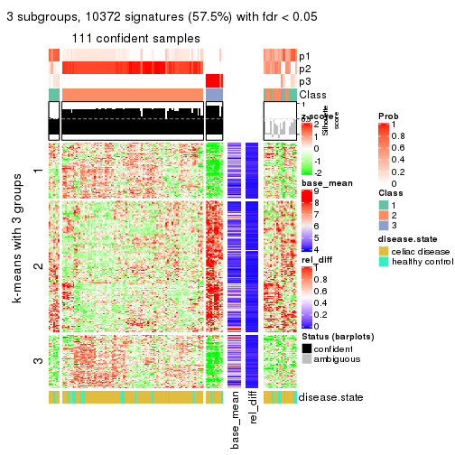</p>

</div>
<div id='tab-ATC-hclust-get-signatures-3'>
<pre><code class="r">get_signatures(res, k = 4)
</code></pre>

<p></p>

</div>
<div id='tab-ATC-hclust-get-signatures-4'>
<pre><code class="r">get_signatures(res, k = 5)
</code></pre>

<p></p>

</div>
<div id='tab-ATC-hclust-get-signatures-5'>
<pre><code class="r">get_signatures(res, k = 6)
</code></pre>

<p></p>

</div>
</div>


Signature heatmaps where rows are not scaled:


<script>
$( function() {
	$( '#tabs-ATC-hclust-get-signatures-no-scale' ).tabs();
} );
</script>
<div id='tabs-ATC-hclust-get-signatures-no-scale'>
<ul>
<li><a href='#tab-ATC-hclust-get-signatures-no-scale-1'>k = 2</a></li>
<li><a href='#tab-ATC-hclust-get-signatures-no-scale-2'>k = 3</a></li>
<li><a href='#tab-ATC-hclust-get-signatures-no-scale-3'>k = 4</a></li>
<li><a href='#tab-ATC-hclust-get-signatures-no-scale-4'>k = 5</a></li>
<li><a href='#tab-ATC-hclust-get-signatures-no-scale-5'>k = 6</a></li>
</ul>
<div id='tab-ATC-hclust-get-signatures-no-scale-1'>
<pre><code class="r">get_signatures(res, k = 2, scale_rows = FALSE)
</code></pre>

<p></p>

</div>
<div id='tab-ATC-hclust-get-signatures-no-scale-2'>
<pre><code class="r">get_signatures(res, k = 3, scale_rows = FALSE)
</code></pre>

<p></p>

</div>
<div id='tab-ATC-hclust-get-signatures-no-scale-3'>
<pre><code class="r">get_signatures(res, k = 4, scale_rows = FALSE)
</code></pre>

<p></p>

</div>
<div id='tab-ATC-hclust-get-signatures-no-scale-4'>
<pre><code class="r">get_signatures(res, k = 5, scale_rows = FALSE)
</code></pre>

<p></p>

</div>
<div id='tab-ATC-hclust-get-signatures-no-scale-5'>
<pre><code class="r">get_signatures(res, k = 6, scale_rows = FALSE)
</code></pre>

<p></p>

</div>
</div>


Compare the overlap of signatures from different k:

```r
compare_signatures(res)
```

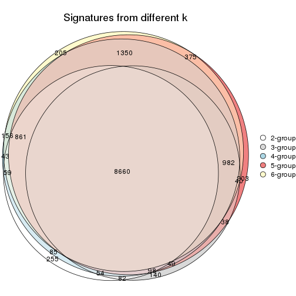

`get_signature()` returns a data frame invisibly. TO get the list of signatures, the function
call should be assigned to a variable explicitly. In following code, if `plot` argument is set
to `FALSE`, no heatmap is plotted while only the differential analysis is performed.

```r
# code only for demonstration
tb = get_signature(res, k = ..., plot = FALSE)
```

An example of the output of `tb` is:

```
#>   which_row         fdr    mean_1    mean_2 scaled_mean_1 scaled_mean_2 km
#> 1        38 0.042760348  8.373488  9.131774    -0.5533452     0.5164555  1
#> 2        40 0.018707592  7.106213  8.469186    -0.6173731     0.5762149  1
#> 3        55 0.019134737 10.221463 11.207825    -0.6159697     0.5749050  1
#> 4        59 0.006059896  5.921854  7.869574    -0.6899429     0.6439467  1
#> 5        60 0.018055526  8.928898 10.211722    -0.6204761     0.5791110  1
#> 6        98 0.009384629 15.714769 14.887706     0.6635654    -0.6193277  2
...
```

The columns in `tb` are:

1. `which_row`: row indices corresponding to the input matrix.
2. `fdr`: FDR for the differential test. 
3. `mean_x`: The mean value in group x.
4. `scaled_mean_x`: The mean value in group x after rows are scaled.
5. `km`: Row groups if k-means clustering is applied to rows.


UMAP plot which shows how samples are separated.


<script>
$( function() {
	$( '#tabs-ATC-hclust-dimension-reduction' ).tabs();
} );
</script>
<div id='tabs-ATC-hclust-dimension-reduction'>
<ul>
<li><a href='#tab-ATC-hclust-dimension-reduction-1'>k = 2</a></li>
<li><a href='#tab-ATC-hclust-dimension-reduction-2'>k = 3</a></li>
<li><a href='#tab-ATC-hclust-dimension-reduction-3'>k = 4</a></li>
<li><a href='#tab-ATC-hclust-dimension-reduction-4'>k = 5</a></li>
<li><a href='#tab-ATC-hclust-dimension-reduction-5'>k = 6</a></li>
</ul>
<div id='tab-ATC-hclust-dimension-reduction-1'>
<pre><code class="r">dimension_reduction(res, k = 2, method = &quot;UMAP&quot;)
</code></pre>

<p></p>

</div>
<div id='tab-ATC-hclust-dimension-reduction-2'>
<pre><code class="r">dimension_reduction(res, k = 3, method = &quot;UMAP&quot;)
</code></pre>

<p></p>

</div>
<div id='tab-ATC-hclust-dimension-reduction-3'>
<pre><code class="r">dimension_reduction(res, k = 4, method = &quot;UMAP&quot;)
</code></pre>

<p></p>

</div>
<div id='tab-ATC-hclust-dimension-reduction-4'>
<pre><code class="r">dimension_reduction(res, k = 5, method = &quot;UMAP&quot;)
</code></pre>

<p></p>

</div>
<div id='tab-ATC-hclust-dimension-reduction-5'>
<pre><code class="r">dimension_reduction(res, k = 6, method = &quot;UMAP&quot;)
</code></pre>

<p></p>

</div>
</div>


Following heatmap shows how subgroups are split when increasing `k`:

```r
collect_classes(res)
```


Test correlation between subgroups and known annotations. If the known
annotation is numeric, one-way ANOVA test is applied, and if the known
annotation is discrete, chi-squared contingency table test is applied.

```r
test_to_known_factors(res)
```

```
#>              n disease.state(p) k
#> ATC:hclust 118           0.0572 2
#> ATC:hclust 111           0.2106 3
#> ATC:hclust  71           0.1776 4
#> ATC:hclust 111           0.0833 5
#> ATC:hclust 103           0.2945 6
```


If matrix rows can be associated to genes, consider to use `GO_Enrichment(res,
...)` to perform function enrichment for the signature genes.


 

---------------------------------------------------


### ATC:kmeans*


The object with results only for a single top-value method and a single partition method 
can be extracted as:

```r
res = res_list["ATC", "kmeans"]
# you can also extract it by
# res = res_list["ATC:kmeans"]
```

A summary of `res` and all the functions that can be applied to it:

```r
res
```

```
#> A 'ConsensusPartition' object with k = 2, 3, 4, 5, 6.
#>   On a matrix with 18032 rows and 132 columns.
#>   Top rows (1000, 2000, 3000, 4000, 5000) are extracted by 'ATC' method.
#>   Subgroups are detected by 'kmeans' method.
#>   Performed in total 1250 partitions by row resampling.
#>   Best k for subgroups seems to be 2.
#> 
#> Following methods can be applied to this 'ConsensusPartition' object:
#>  [1] "cola_report"             "collect_classes"         "collect_plots"          
#>  [4] "collect_stats"           "colnames"                "compare_signatures"     
#>  [7] "consensus_heatmap"       "dimension_reduction"     "functional_enrichment"  
#> [10] "get_anno_col"            "get_anno"                "get_classes"            
#> [13] "get_consensus"           "get_matrix"              "get_membership"         
#> [16] "get_param"               "get_signatures"          "get_stats"              
#> [19] "is_best_k"               "is_stable_k"             "membership_heatmap"     
#> [22] "ncol"                    "nrow"                    "plot_ecdf"              
#> [25] "rownames"                "select_partition_number" "show"                   
#> [28] "suggest_best_k"          "test_to_known_factors"
```

`collect_plots()` function collects all the plots made from `res` for all `k` (number of partitions)
into one single page to provide an easy and fast comparison between different `k`.

```r
collect_plots(res)
```


The plots are:

- The first row: a plot of the ECDF (Empirical cumulative distribution
  function) curves of the consensus matrix for each `k` and the heatmap of
  predicted classes for each `k`.
- The second row: heatmaps of the consensus matrix for each `k`.
- The third row: heatmaps of the membership matrix for each `k`.
- The fouth row: heatmaps of the signatures for each `k`.

All the plots in panels can be made by individual functions and they are
plotted later in this section.

`select_partition_number()` produces several plots showing different
statistics for choosing "optimized" `k`. There are following statistics:

- ECDF curves of the consensus matrix for each `k`;
- 1-PAC. [The PAC
  score](https://en.wikipedia.org/wiki/Consensus_clustering#Over-interpretation_potential_of_consensus_clustering)
  measures the proportion of the ambiguous subgrouping.
- Mean silhouette score.
- Concordance. The mean probability of fiting the consensus class ids in all
  partitions.
- Area increased. Denote $A_k$ as the area under the ECDF curve for current
  `k`, the area increased is defined as $A_k - A_{k-1}$.
- Rand index. The percent of pairs of samples that are both in a same cluster
  or both are not in a same cluster in the partition of k and k-1.
- Jaccard index. The ratio of pairs of samples are both in a same cluster in
  the partition of k and k-1 and the pairs of samples are both in a same
  cluster in the partition k or k-1.

The detailed explanations of these statistics can be found in [the cola
vignette](http://bioconductor.org/packages/devel/bioc/vignettes/cola/inst/doc/cola.html#toc_13).

Generally speaking, lower PAC score, higher mean silhouette score or higher
concordance corresponds to better partition. Rand index and Jaccard index
measure how similar the current partition is compared to partition with `k-1`.
If they are too similar, we won't accept `k` is better than `k-1`.

```r
select_partition_number(res)
```


The numeric values for all these statistics can be obtained by `get_stats()`.

```r
get_stats(res)
```

```
#>   k 1-PAC mean_silhouette concordance area_increased  Rand Jaccard
#> 2 2 0.907           0.928       0.971         0.3701 0.646   0.646
#> 3 3 0.866           0.843       0.941         0.5864 0.656   0.512
#> 4 4 0.611           0.756       0.867         0.1863 0.766   0.502
#> 5 5 0.643           0.525       0.731         0.0958 0.897   0.671
#> 6 6 0.750           0.722       0.840         0.0601 0.851   0.477
```

`suggest_best_k()` suggests the best $k$ based on these statistics. The rules are as follows:

- All $k$ with Jaccard index larger than 0.95 are removed because the increase of
  the partition number does not provides enough extra information. If all $k$ are removed,
  the best $k$ is assigned by `NA`.
- For $k$ with 1-PAC larger than 0.9, the maximal $k$ is taken as the "best k". Other $k$ is called "optional k".
- If it does not fit the second rule. The $k$ with the highest vote of highest
  1-PAC, mean silhouette and concordance is taken as the "best k".

```r
suggest_best_k(res)
```

```
#> [1] 2
```


Following shows the table of the partitions (You need to click the **show/hide
code output** link to see it). The membership matrix (columns with name `p*`)
is inferred by
[`clue::cl_consensus()`](https://www.rdocumentation.org/link/cl_consensus?package=clue)
function with the `SE` method. Basically the value in the membership matrix
represents the probability to belong to a certain group. The finall class
label for an item is determined with the group with highest probability it
belongs to.

In `get_classes()` function, the entropy is calculated from the membership
matrix and the silhouette score is calculated from the consensus matrix.


<script>
$( function() {
	$( '#tabs-ATC-kmeans-get-classes' ).tabs();
} );
</script>
<div id='tabs-ATC-kmeans-get-classes'>
<ul>
<li><a href='#tab-ATC-kmeans-get-classes-1'>k = 2</a></li>
<li><a href='#tab-ATC-kmeans-get-classes-2'>k = 3</a></li>
<li><a href='#tab-ATC-kmeans-get-classes-3'>k = 4</a></li>
<li><a href='#tab-ATC-kmeans-get-classes-4'>k = 5</a></li>
<li><a href='#tab-ATC-kmeans-get-classes-5'>k = 6</a></li>
</ul>

<div id='tab-ATC-kmeans-get-classes-1'>
<p><a id='tab-ATC-kmeans-get-classes-1-a' style='color:#0366d6' href='#'>show/hide code output</a></p>
<pre><code class="r">cbind(get_classes(res, k = 2), get_membership(res, k = 2))
</code></pre>

<pre><code>#&gt;           class entropy silhouette    p1    p2
#&gt; GSM289470     2  0.0000      0.969 0.000 1.000
#&gt; GSM289471     1  0.0000      0.971 1.000 0.000
#&gt; GSM289472     2  0.0000      0.969 0.000 1.000
#&gt; GSM289473     2  0.0000      0.969 0.000 1.000
#&gt; GSM289474     2  0.0000      0.969 0.000 1.000
#&gt; GSM289475     2  0.0000      0.969 0.000 1.000
#&gt; GSM289476     1  0.0000      0.971 1.000 0.000
#&gt; GSM289477     2  0.0000      0.969 0.000 1.000
#&gt; GSM289478     2  0.0000      0.969 0.000 1.000
#&gt; GSM289479     2  0.0000      0.969 0.000 1.000
#&gt; GSM289480     2  0.0000      0.969 0.000 1.000
#&gt; GSM289481     2  0.0000      0.969 0.000 1.000
#&gt; GSM289482     2  0.0000      0.969 0.000 1.000
#&gt; GSM289483     2  0.0000      0.969 0.000 1.000
#&gt; GSM289484     2  0.0000      0.969 0.000 1.000
#&gt; GSM289485     2  0.0000      0.969 0.000 1.000
#&gt; GSM289486     2  0.0000      0.969 0.000 1.000
#&gt; GSM289487     2  0.0000      0.969 0.000 1.000
#&gt; GSM289488     2  0.0000      0.969 0.000 1.000
#&gt; GSM289489     2  0.0000      0.969 0.000 1.000
#&gt; GSM289490     2  0.0000      0.969 0.000 1.000
#&gt; GSM289491     2  0.0000      0.969 0.000 1.000
#&gt; GSM289492     2  0.9815      0.291 0.420 0.580
#&gt; GSM289493     2  0.0000      0.969 0.000 1.000
#&gt; GSM289494     1  0.0000      0.971 1.000 0.000
#&gt; GSM289495     2  0.0000      0.969 0.000 1.000
#&gt; GSM289496     2  0.0000      0.969 0.000 1.000
#&gt; GSM289497     2  0.0000      0.969 0.000 1.000
#&gt; GSM289498     2  0.9248      0.487 0.340 0.660
#&gt; GSM289499     2  0.0000      0.969 0.000 1.000
#&gt; GSM289500     1  0.0000      0.971 1.000 0.000
#&gt; GSM289501     2  0.0000      0.969 0.000 1.000
#&gt; GSM289502     2  0.0000      0.969 0.000 1.000
#&gt; GSM289503     2  0.0000      0.969 0.000 1.000
#&gt; GSM289504     2  0.0000      0.969 0.000 1.000
#&gt; GSM289505     2  0.0000      0.969 0.000 1.000
#&gt; GSM289506     2  0.0000      0.969 0.000 1.000
#&gt; GSM289507     2  0.0000      0.969 0.000 1.000
#&gt; GSM289508     2  0.1843      0.945 0.028 0.972
#&gt; GSM289509     1  0.0000      0.971 1.000 0.000
#&gt; GSM289510     2  0.0000      0.969 0.000 1.000
#&gt; GSM289511     2  0.0000      0.969 0.000 1.000
#&gt; GSM289512     1  0.0000      0.971 1.000 0.000
#&gt; GSM289513     2  0.0000      0.969 0.000 1.000
#&gt; GSM289514     2  0.1414      0.952 0.020 0.980
#&gt; GSM289515     2  0.0000      0.969 0.000 1.000
#&gt; GSM289516     2  0.0000      0.969 0.000 1.000
#&gt; GSM289517     2  0.0000      0.969 0.000 1.000
#&gt; GSM289518     2  0.0000      0.969 0.000 1.000
#&gt; GSM289519     2  0.0000      0.969 0.000 1.000
#&gt; GSM289520     2  0.0000      0.969 0.000 1.000
#&gt; GSM289521     1  0.0000      0.971 1.000 0.000
#&gt; GSM289522     2  0.0000      0.969 0.000 1.000
#&gt; GSM289523     1  0.0000      0.971 1.000 0.000
#&gt; GSM289524     2  0.0000      0.969 0.000 1.000
#&gt; GSM289525     2  0.0000      0.969 0.000 1.000
#&gt; GSM289526     2  0.6801      0.772 0.180 0.820
#&gt; GSM289527     2  0.0000      0.969 0.000 1.000
#&gt; GSM289528     2  0.0000      0.969 0.000 1.000
#&gt; GSM289529     2  0.0000      0.969 0.000 1.000
#&gt; GSM289530     1  0.0000      0.971 1.000 0.000
#&gt; GSM289531     2  0.0000      0.969 0.000 1.000
#&gt; GSM289532     1  0.0000      0.971 1.000 0.000
#&gt; GSM289533     2  0.0000      0.969 0.000 1.000
#&gt; GSM289534     1  0.0000      0.971 1.000 0.000
#&gt; GSM289535     2  0.0000      0.969 0.000 1.000
#&gt; GSM289536     1  0.0000      0.971 1.000 0.000
#&gt; GSM289537     2  0.0000      0.969 0.000 1.000
#&gt; GSM289538     2  0.0000      0.969 0.000 1.000
#&gt; GSM289539     2  0.0000      0.969 0.000 1.000
#&gt; GSM289540     1  0.0000      0.971 1.000 0.000
#&gt; GSM289541     2  0.0000      0.969 0.000 1.000
#&gt; GSM289542     2  0.0000      0.969 0.000 1.000
#&gt; GSM289543     2  0.0000      0.969 0.000 1.000
#&gt; GSM289544     1  0.7056      0.758 0.808 0.192
#&gt; GSM289545     2  0.0000      0.969 0.000 1.000
#&gt; GSM289546     2  0.0000      0.969 0.000 1.000
#&gt; GSM289547     2  0.0000      0.969 0.000 1.000
#&gt; GSM289548     2  0.9795      0.303 0.416 0.584
#&gt; GSM289549     2  0.0000      0.969 0.000 1.000
#&gt; GSM289550     1  0.5294      0.856 0.880 0.120
#&gt; GSM289551     1  0.0000      0.971 1.000 0.000
#&gt; GSM289552     1  0.0000      0.971 1.000 0.000
#&gt; GSM289553     1  0.0000      0.971 1.000 0.000
#&gt; GSM289554     2  0.0000      0.969 0.000 1.000
#&gt; GSM289555     2  0.0000      0.969 0.000 1.000
#&gt; GSM289556     2  0.9815      0.291 0.420 0.580
#&gt; GSM289557     2  0.0000      0.969 0.000 1.000
#&gt; GSM289558     2  0.0000      0.969 0.000 1.000
#&gt; GSM289559     2  0.0672      0.962 0.008 0.992
#&gt; GSM289560     2  0.0000      0.969 0.000 1.000
#&gt; GSM289561     2  0.0000      0.969 0.000 1.000
#&gt; GSM289562     1  0.5294      0.856 0.880 0.120
#&gt; GSM289563     2  0.0000      0.969 0.000 1.000
#&gt; GSM289564     1  0.0000      0.971 1.000 0.000
#&gt; GSM289565     1  0.0000      0.971 1.000 0.000
#&gt; GSM289566     1  0.9427      0.422 0.640 0.360
#&gt; GSM289567     2  0.0938      0.959 0.012 0.988
#&gt; GSM289568     2  0.0000      0.969 0.000 1.000
#&gt; GSM289569     2  0.0000      0.969 0.000 1.000
#&gt; GSM289570     2  0.6801      0.771 0.180 0.820
#&gt; GSM289571     2  0.0000      0.969 0.000 1.000
#&gt; GSM289572     2  0.0000      0.969 0.000 1.000
#&gt; GSM289573     2  0.0000      0.969 0.000 1.000
#&gt; GSM289574     2  0.0000      0.969 0.000 1.000
#&gt; GSM289575     2  0.0000      0.969 0.000 1.000
#&gt; GSM289576     2  0.0000      0.969 0.000 1.000
#&gt; GSM289577     2  0.0000      0.969 0.000 1.000
#&gt; GSM289578     2  0.4815      0.866 0.104 0.896
#&gt; GSM289579     2  0.0000      0.969 0.000 1.000
#&gt; GSM289580     1  0.0000      0.971 1.000 0.000
#&gt; GSM289581     1  0.0000      0.971 1.000 0.000
#&gt; GSM289582     2  0.1414      0.952 0.020 0.980
#&gt; GSM289583     2  0.0000      0.969 0.000 1.000
#&gt; GSM289584     2  0.0000      0.969 0.000 1.000
#&gt; GSM289585     2  0.0000      0.969 0.000 1.000
#&gt; GSM289586     2  0.0000      0.969 0.000 1.000
#&gt; GSM289587     2  0.0000      0.969 0.000 1.000
#&gt; GSM289588     1  0.0000      0.971 1.000 0.000
#&gt; GSM289589     2  0.1843      0.945 0.028 0.972
#&gt; GSM289590     1  0.0000      0.971 1.000 0.000
#&gt; GSM289591     1  0.0000      0.971 1.000 0.000
#&gt; GSM289592     2  0.0000      0.969 0.000 1.000
#&gt; GSM289593     1  0.0000      0.971 1.000 0.000
#&gt; GSM289594     2  0.0000      0.969 0.000 1.000
#&gt; GSM289595     1  0.0000      0.971 1.000 0.000
#&gt; GSM289596     2  0.0000      0.969 0.000 1.000
#&gt; GSM289597     2  0.0000      0.969 0.000 1.000
#&gt; GSM289598     2  0.9815      0.291 0.420 0.580
#&gt; GSM289599     2  0.0000      0.969 0.000 1.000
#&gt; GSM289600     2  0.9795      0.303 0.416 0.584
#&gt; GSM289601     1  0.0000      0.971 1.000 0.000
</code></pre>

<script>
$('#tab-ATC-kmeans-get-classes-1-a').parent().next().next().hide();
$('#tab-ATC-kmeans-get-classes-1-a').click(function(){
  $('#tab-ATC-kmeans-get-classes-1-a').parent().next().next().toggle();
  return(false);
});
</script>
</div>

<div id='tab-ATC-kmeans-get-classes-2'>
<p><a id='tab-ATC-kmeans-get-classes-2-a' style='color:#0366d6' href='#'>show/hide code output</a></p>
<pre><code class="r">cbind(get_classes(res, k = 3), get_membership(res, k = 3))
</code></pre>

<pre><code>#&gt;           class entropy silhouette    p1    p2    p3
#&gt; GSM289470     2  0.0000     0.9295 0.000 1.000 0.000
#&gt; GSM289471     3  0.0000     0.9669 0.000 0.000 1.000
#&gt; GSM289472     2  0.0000     0.9295 0.000 1.000 0.000
#&gt; GSM289473     2  0.6168     0.3672 0.412 0.588 0.000
#&gt; GSM289474     2  0.1411     0.9093 0.036 0.964 0.000
#&gt; GSM289475     2  0.0000     0.9295 0.000 1.000 0.000
#&gt; GSM289476     3  0.0000     0.9669 0.000 0.000 1.000
#&gt; GSM289477     2  0.0000     0.9295 0.000 1.000 0.000
#&gt; GSM289478     2  0.0000     0.9295 0.000 1.000 0.000
#&gt; GSM289479     2  0.1964     0.8938 0.056 0.944 0.000
#&gt; GSM289480     2  0.0000     0.9295 0.000 1.000 0.000
#&gt; GSM289481     2  0.0000     0.9295 0.000 1.000 0.000
#&gt; GSM289482     2  0.0000     0.9295 0.000 1.000 0.000
#&gt; GSM289483     2  0.0000     0.9295 0.000 1.000 0.000
#&gt; GSM289484     2  0.0000     0.9295 0.000 1.000 0.000
#&gt; GSM289485     2  0.0000     0.9295 0.000 1.000 0.000
#&gt; GSM289486     1  0.0000     0.9119 1.000 0.000 0.000
#&gt; GSM289487     2  0.0000     0.9295 0.000 1.000 0.000
#&gt; GSM289488     2  0.0000     0.9295 0.000 1.000 0.000
#&gt; GSM289489     2  0.1411     0.9093 0.036 0.964 0.000
#&gt; GSM289490     1  0.0000     0.9119 1.000 0.000 0.000
#&gt; GSM289491     2  0.1411     0.9093 0.036 0.964 0.000
#&gt; GSM289492     1  0.0000     0.9119 1.000 0.000 0.000
#&gt; GSM289493     2  0.0000     0.9295 0.000 1.000 0.000
#&gt; GSM289494     3  0.0000     0.9669 0.000 0.000 1.000
#&gt; GSM289495     2  0.1163     0.9140 0.028 0.972 0.000
#&gt; GSM289496     2  0.0000     0.9295 0.000 1.000 0.000
#&gt; GSM289497     2  0.0000     0.9295 0.000 1.000 0.000
#&gt; GSM289498     1  0.0000     0.9119 1.000 0.000 0.000
#&gt; GSM289499     2  0.1411     0.9093 0.036 0.964 0.000
#&gt; GSM289500     3  0.0000     0.9669 0.000 0.000 1.000
#&gt; GSM289501     2  0.0000     0.9295 0.000 1.000 0.000
#&gt; GSM289502     2  0.0000     0.9295 0.000 1.000 0.000
#&gt; GSM289503     2  0.0000     0.9295 0.000 1.000 0.000
#&gt; GSM289504     2  0.0000     0.9295 0.000 1.000 0.000
#&gt; GSM289505     2  0.0000     0.9295 0.000 1.000 0.000
#&gt; GSM289506     2  0.0000     0.9295 0.000 1.000 0.000
#&gt; GSM289507     2  0.0000     0.9295 0.000 1.000 0.000
#&gt; GSM289508     1  0.0000     0.9119 1.000 0.000 0.000
#&gt; GSM289509     3  0.6008     0.3887 0.372 0.000 0.628
#&gt; GSM289510     1  0.0000     0.9119 1.000 0.000 0.000
#&gt; GSM289511     2  0.0000     0.9295 0.000 1.000 0.000
#&gt; GSM289512     3  0.0000     0.9669 0.000 0.000 1.000
#&gt; GSM289513     2  0.0000     0.9295 0.000 1.000 0.000
#&gt; GSM289514     1  0.0000     0.9119 1.000 0.000 0.000
#&gt; GSM289515     2  0.6180     0.3571 0.416 0.584 0.000
#&gt; GSM289516     2  0.1411     0.9093 0.036 0.964 0.000
#&gt; GSM289517     2  0.6154     0.3771 0.408 0.592 0.000
#&gt; GSM289518     1  0.0000     0.9119 1.000 0.000 0.000
#&gt; GSM289519     1  0.0000     0.9119 1.000 0.000 0.000
#&gt; GSM289520     2  0.0000     0.9295 0.000 1.000 0.000
#&gt; GSM289521     1  0.0000     0.9119 1.000 0.000 0.000
#&gt; GSM289522     1  0.0000     0.9119 1.000 0.000 0.000
#&gt; GSM289523     3  0.0000     0.9669 0.000 0.000 1.000
#&gt; GSM289524     2  0.6045     0.4411 0.380 0.620 0.000
#&gt; GSM289525     2  0.5948     0.4820 0.360 0.640 0.000
#&gt; GSM289526     1  0.0000     0.9119 1.000 0.000 0.000
#&gt; GSM289527     2  0.1411     0.9093 0.036 0.964 0.000
#&gt; GSM289528     2  0.0000     0.9295 0.000 1.000 0.000
#&gt; GSM289529     2  0.1860     0.8972 0.052 0.948 0.000
#&gt; GSM289530     1  0.0000     0.9119 1.000 0.000 0.000
#&gt; GSM289531     2  0.6140     0.3868 0.404 0.596 0.000
#&gt; GSM289532     3  0.0000     0.9669 0.000 0.000 1.000
#&gt; GSM289533     1  0.6295    -0.0174 0.528 0.472 0.000
#&gt; GSM289534     3  0.1289     0.9391 0.032 0.000 0.968
#&gt; GSM289535     1  0.0000     0.9119 1.000 0.000 0.000
#&gt; GSM289536     3  0.0000     0.9669 0.000 0.000 1.000
#&gt; GSM289537     2  0.0000     0.9295 0.000 1.000 0.000
#&gt; GSM289538     2  0.0000     0.9295 0.000 1.000 0.000
#&gt; GSM289539     2  0.0000     0.9295 0.000 1.000 0.000
#&gt; GSM289540     1  0.0000     0.9119 1.000 0.000 0.000
#&gt; GSM289541     1  0.6286     0.1007 0.536 0.464 0.000
#&gt; GSM289542     1  0.0000     0.9119 1.000 0.000 0.000
#&gt; GSM289543     2  0.6305     0.1502 0.484 0.516 0.000
#&gt; GSM289544     1  0.0000     0.9119 1.000 0.000 0.000
#&gt; GSM289545     2  0.0000     0.9295 0.000 1.000 0.000
#&gt; GSM289546     2  0.0000     0.9295 0.000 1.000 0.000
#&gt; GSM289547     2  0.0000     0.9295 0.000 1.000 0.000
#&gt; GSM289548     1  0.0000     0.9119 1.000 0.000 0.000
#&gt; GSM289549     1  0.2448     0.8346 0.924 0.076 0.000
#&gt; GSM289550     1  0.0000     0.9119 1.000 0.000 0.000
#&gt; GSM289551     3  0.0000     0.9669 0.000 0.000 1.000
#&gt; GSM289552     1  0.1411     0.8835 0.964 0.000 0.036
#&gt; GSM289553     1  0.1411     0.8835 0.964 0.000 0.036
#&gt; GSM289554     2  0.2066     0.8902 0.060 0.940 0.000
#&gt; GSM289555     2  0.0000     0.9295 0.000 1.000 0.000
#&gt; GSM289556     1  0.0000     0.9119 1.000 0.000 0.000
#&gt; GSM289557     2  0.0000     0.9295 0.000 1.000 0.000
#&gt; GSM289558     2  0.0000     0.9295 0.000 1.000 0.000
#&gt; GSM289559     1  0.0000     0.9119 1.000 0.000 0.000
#&gt; GSM289560     2  0.0000     0.9295 0.000 1.000 0.000
#&gt; GSM289561     2  0.0000     0.9295 0.000 1.000 0.000
#&gt; GSM289562     1  0.0000     0.9119 1.000 0.000 0.000
#&gt; GSM289563     1  0.4931     0.6299 0.768 0.232 0.000
#&gt; GSM289564     1  0.0000     0.9119 1.000 0.000 0.000
#&gt; GSM289565     1  0.6274     0.0882 0.544 0.000 0.456
#&gt; GSM289566     1  0.0000     0.9119 1.000 0.000 0.000
#&gt; GSM289567     1  0.0000     0.9119 1.000 0.000 0.000
#&gt; GSM289568     2  0.0000     0.9295 0.000 1.000 0.000
#&gt; GSM289569     2  0.0000     0.9295 0.000 1.000 0.000
#&gt; GSM289570     1  0.0000     0.9119 1.000 0.000 0.000
#&gt; GSM289571     2  0.0000     0.9295 0.000 1.000 0.000
#&gt; GSM289572     2  0.1411     0.9093 0.036 0.964 0.000
#&gt; GSM289573     2  0.0000     0.9295 0.000 1.000 0.000
#&gt; GSM289574     2  0.0000     0.9295 0.000 1.000 0.000
#&gt; GSM289575     2  0.6204     0.3369 0.424 0.576 0.000
#&gt; GSM289576     2  0.0000     0.9295 0.000 1.000 0.000
#&gt; GSM289577     1  0.2711     0.8176 0.912 0.088 0.000
#&gt; GSM289578     1  0.0000     0.9119 1.000 0.000 0.000
#&gt; GSM289579     1  0.5016     0.6060 0.760 0.240 0.000
#&gt; GSM289580     3  0.0000     0.9669 0.000 0.000 1.000
#&gt; GSM289581     1  0.6274     0.0882 0.544 0.000 0.456
#&gt; GSM289582     1  0.0000     0.9119 1.000 0.000 0.000
#&gt; GSM289583     2  0.0000     0.9295 0.000 1.000 0.000
#&gt; GSM289584     2  0.0000     0.9295 0.000 1.000 0.000
#&gt; GSM289585     2  0.0000     0.9295 0.000 1.000 0.000
#&gt; GSM289586     1  0.0000     0.9119 1.000 0.000 0.000
#&gt; GSM289587     1  0.2448     0.8346 0.924 0.076 0.000
#&gt; GSM289588     3  0.0000     0.9669 0.000 0.000 1.000
#&gt; GSM289589     1  0.0000     0.9119 1.000 0.000 0.000
#&gt; GSM289590     1  0.6274     0.0882 0.544 0.000 0.456
#&gt; GSM289591     1  0.1411     0.8835 0.964 0.000 0.036
#&gt; GSM289592     2  0.0000     0.9295 0.000 1.000 0.000
#&gt; GSM289593     3  0.0000     0.9669 0.000 0.000 1.000
#&gt; GSM289594     2  0.1411     0.9093 0.036 0.964 0.000
#&gt; GSM289595     1  0.1411     0.8835 0.964 0.000 0.036
#&gt; GSM289596     2  0.0000     0.9295 0.000 1.000 0.000
#&gt; GSM289597     2  0.6045     0.4411 0.380 0.620 0.000
#&gt; GSM289598     1  0.0000     0.9119 1.000 0.000 0.000
#&gt; GSM289599     1  0.0237     0.9086 0.996 0.004 0.000
#&gt; GSM289600     1  0.0000     0.9119 1.000 0.000 0.000
#&gt; GSM289601     1  0.1411     0.8835 0.964 0.000 0.036
</code></pre>

<script>
$('#tab-ATC-kmeans-get-classes-2-a').parent().next().next().hide();
$('#tab-ATC-kmeans-get-classes-2-a').click(function(){
  $('#tab-ATC-kmeans-get-classes-2-a').parent().next().next().toggle();
  return(false);
});
</script>
</div>

<div id='tab-ATC-kmeans-get-classes-3'>
<p><a id='tab-ATC-kmeans-get-classes-3-a' style='color:#0366d6' href='#'>show/hide code output</a></p>
<pre><code class="r">cbind(get_classes(res, k = 4), get_membership(res, k = 4))
</code></pre>

<pre><code>#&gt;           class entropy silhouette    p1    p2    p3    p4
#&gt; GSM289470     2  0.5394     0.6066 0.228 0.712 0.000 0.060
#&gt; GSM289471     3  0.0000     0.9205 0.000 0.000 1.000 0.000
#&gt; GSM289472     2  0.0000     0.9609 0.000 1.000 0.000 0.000
#&gt; GSM289473     4  0.2868     0.7974 0.000 0.136 0.000 0.864
#&gt; GSM289474     4  0.3356     0.7750 0.000 0.176 0.000 0.824
#&gt; GSM289475     2  0.0000     0.9609 0.000 1.000 0.000 0.000
#&gt; GSM289476     3  0.0000     0.9205 0.000 0.000 1.000 0.000
#&gt; GSM289477     2  0.0000     0.9609 0.000 1.000 0.000 0.000
#&gt; GSM289478     2  0.0000     0.9609 0.000 1.000 0.000 0.000
#&gt; GSM289479     4  0.3400     0.7720 0.000 0.180 0.000 0.820
#&gt; GSM289480     2  0.0000     0.9609 0.000 1.000 0.000 0.000
#&gt; GSM289481     2  0.0921     0.9490 0.000 0.972 0.000 0.028
#&gt; GSM289482     2  0.0000     0.9609 0.000 1.000 0.000 0.000
#&gt; GSM289483     2  0.0000     0.9609 0.000 1.000 0.000 0.000
#&gt; GSM289484     2  0.0000     0.9609 0.000 1.000 0.000 0.000
#&gt; GSM289485     2  0.0000     0.9609 0.000 1.000 0.000 0.000
#&gt; GSM289486     1  0.4643     0.5469 0.656 0.000 0.000 0.344
#&gt; GSM289487     2  0.0000     0.9609 0.000 1.000 0.000 0.000
#&gt; GSM289488     2  0.0000     0.9609 0.000 1.000 0.000 0.000
#&gt; GSM289489     4  0.3172     0.7855 0.000 0.160 0.000 0.840
#&gt; GSM289490     4  0.2011     0.7312 0.080 0.000 0.000 0.920
#&gt; GSM289491     4  0.3726     0.7376 0.000 0.212 0.000 0.788
#&gt; GSM289492     4  0.4948    -0.1466 0.440 0.000 0.000 0.560
#&gt; GSM289493     2  0.2814     0.8337 0.000 0.868 0.000 0.132
#&gt; GSM289494     3  0.4139     0.7695 0.176 0.000 0.800 0.024
#&gt; GSM289495     4  0.4008     0.7033 0.000 0.244 0.000 0.756
#&gt; GSM289496     2  0.0921     0.9490 0.000 0.972 0.000 0.028
#&gt; GSM289497     2  0.0000     0.9609 0.000 1.000 0.000 0.000
#&gt; GSM289498     4  0.3942     0.4937 0.236 0.000 0.000 0.764
#&gt; GSM289499     4  0.3975     0.7075 0.000 0.240 0.000 0.760
#&gt; GSM289500     3  0.0000     0.9205 0.000 0.000 1.000 0.000
#&gt; GSM289501     2  0.3764     0.7030 0.000 0.784 0.000 0.216
#&gt; GSM289502     2  0.0000     0.9609 0.000 1.000 0.000 0.000
#&gt; GSM289503     2  0.0000     0.9609 0.000 1.000 0.000 0.000
#&gt; GSM289504     2  0.1022     0.9470 0.000 0.968 0.000 0.032
#&gt; GSM289505     2  0.0000     0.9609 0.000 1.000 0.000 0.000
#&gt; GSM289506     2  0.0000     0.9609 0.000 1.000 0.000 0.000
#&gt; GSM289507     2  0.0000     0.9609 0.000 1.000 0.000 0.000
#&gt; GSM289508     1  0.4382     0.6070 0.704 0.000 0.000 0.296
#&gt; GSM289509     1  0.6602     0.0972 0.552 0.000 0.356 0.092
#&gt; GSM289510     4  0.1867     0.7404 0.072 0.000 0.000 0.928
#&gt; GSM289511     2  0.1867     0.9132 0.000 0.928 0.000 0.072
#&gt; GSM289512     3  0.0000     0.9205 0.000 0.000 1.000 0.000
#&gt; GSM289513     2  0.3123     0.8033 0.000 0.844 0.000 0.156
#&gt; GSM289514     4  0.3266     0.6101 0.168 0.000 0.000 0.832
#&gt; GSM289515     4  0.2714     0.7989 0.004 0.112 0.000 0.884
#&gt; GSM289516     4  0.3486     0.7664 0.000 0.188 0.000 0.812
#&gt; GSM289517     4  0.2773     0.7993 0.004 0.116 0.000 0.880
#&gt; GSM289518     4  0.1867     0.7404 0.072 0.000 0.000 0.928
#&gt; GSM289519     4  0.1867     0.7404 0.072 0.000 0.000 0.928
#&gt; GSM289520     2  0.1118     0.9407 0.000 0.964 0.000 0.036
#&gt; GSM289521     1  0.4817     0.4223 0.612 0.000 0.000 0.388
#&gt; GSM289522     4  0.1867     0.7404 0.072 0.000 0.000 0.928
#&gt; GSM289523     3  0.0000     0.9205 0.000 0.000 1.000 0.000
#&gt; GSM289524     4  0.3052     0.7974 0.004 0.136 0.000 0.860
#&gt; GSM289525     4  0.2831     0.7994 0.004 0.120 0.000 0.876
#&gt; GSM289526     1  0.4996     0.3355 0.516 0.000 0.000 0.484
#&gt; GSM289527     4  0.3356     0.7759 0.000 0.176 0.000 0.824
#&gt; GSM289528     2  0.0000     0.9609 0.000 1.000 0.000 0.000
#&gt; GSM289529     4  0.2921     0.7965 0.000 0.140 0.000 0.860
#&gt; GSM289530     1  0.4907     0.3560 0.580 0.000 0.000 0.420
#&gt; GSM289531     4  0.2868     0.7974 0.000 0.136 0.000 0.864
#&gt; GSM289532     3  0.5334     0.7061 0.172 0.000 0.740 0.088
#&gt; GSM289533     4  0.2714     0.7988 0.004 0.112 0.000 0.884
#&gt; GSM289534     3  0.5657     0.3124 0.436 0.000 0.540 0.024
#&gt; GSM289535     4  0.2011     0.7312 0.080 0.000 0.000 0.920
#&gt; GSM289536     3  0.0000     0.9205 0.000 0.000 1.000 0.000
#&gt; GSM289537     2  0.0921     0.9490 0.000 0.972 0.000 0.028
#&gt; GSM289538     2  0.0000     0.9609 0.000 1.000 0.000 0.000
#&gt; GSM289539     2  0.0000     0.9609 0.000 1.000 0.000 0.000
#&gt; GSM289540     1  0.4543     0.5525 0.676 0.000 0.000 0.324
#&gt; GSM289541     1  0.6605     0.2918 0.480 0.080 0.000 0.440
#&gt; GSM289542     1  0.4898     0.4508 0.584 0.000 0.000 0.416
#&gt; GSM289543     4  0.4581     0.7365 0.080 0.120 0.000 0.800
#&gt; GSM289544     1  0.3074     0.6307 0.848 0.000 0.000 0.152
#&gt; GSM289545     2  0.0000     0.9609 0.000 1.000 0.000 0.000
#&gt; GSM289546     2  0.0000     0.9609 0.000 1.000 0.000 0.000
#&gt; GSM289547     2  0.0000     0.9609 0.000 1.000 0.000 0.000
#&gt; GSM289548     1  0.3123     0.6851 0.844 0.000 0.000 0.156
#&gt; GSM289549     1  0.4817     0.4848 0.612 0.000 0.000 0.388
#&gt; GSM289550     1  0.2216     0.6722 0.908 0.000 0.000 0.092
#&gt; GSM289551     3  0.0000     0.9205 0.000 0.000 1.000 0.000
#&gt; GSM289552     1  0.0000     0.6160 1.000 0.000 0.000 0.000
#&gt; GSM289553     1  0.2149     0.6024 0.912 0.000 0.000 0.088
#&gt; GSM289554     4  0.3726     0.7388 0.000 0.212 0.000 0.788
#&gt; GSM289555     2  0.1118     0.9450 0.000 0.964 0.000 0.036
#&gt; GSM289556     1  0.3123     0.6851 0.844 0.000 0.000 0.156
#&gt; GSM289557     2  0.0000     0.9609 0.000 1.000 0.000 0.000
#&gt; GSM289558     2  0.4776     0.3067 0.000 0.624 0.000 0.376
#&gt; GSM289559     1  0.4356     0.6060 0.708 0.000 0.000 0.292
#&gt; GSM289560     2  0.1022     0.9470 0.000 0.968 0.000 0.032
#&gt; GSM289561     2  0.0921     0.9490 0.000 0.972 0.000 0.028
#&gt; GSM289562     1  0.2530     0.6746 0.888 0.000 0.000 0.112
#&gt; GSM289563     1  0.5244     0.4760 0.600 0.012 0.000 0.388
#&gt; GSM289564     4  0.4697     0.2286 0.356 0.000 0.000 0.644
#&gt; GSM289565     1  0.6630     0.3191 0.612 0.000 0.252 0.136
#&gt; GSM289566     1  0.3801     0.6634 0.780 0.000 0.000 0.220
#&gt; GSM289567     4  0.2408     0.6993 0.104 0.000 0.000 0.896
#&gt; GSM289568     2  0.0592     0.9541 0.000 0.984 0.000 0.016
#&gt; GSM289569     2  0.1302     0.9360 0.000 0.956 0.000 0.044
#&gt; GSM289570     4  0.3873     0.5243 0.228 0.000 0.000 0.772
#&gt; GSM289571     2  0.0000     0.9609 0.000 1.000 0.000 0.000
#&gt; GSM289572     4  0.4304     0.6473 0.000 0.284 0.000 0.716
#&gt; GSM289573     2  0.1022     0.9470 0.000 0.968 0.000 0.032
#&gt; GSM289574     2  0.0000     0.9609 0.000 1.000 0.000 0.000
#&gt; GSM289575     4  0.2216     0.7907 0.000 0.092 0.000 0.908
#&gt; GSM289576     2  0.1211     0.9422 0.000 0.960 0.000 0.040
#&gt; GSM289577     4  0.2131     0.7697 0.032 0.036 0.000 0.932
#&gt; GSM289578     4  0.3356     0.5858 0.176 0.000 0.000 0.824
#&gt; GSM289579     4  0.2111     0.7741 0.024 0.044 0.000 0.932
#&gt; GSM289580     3  0.0000     0.9205 0.000 0.000 1.000 0.000
#&gt; GSM289581     1  0.7074     0.3181 0.568 0.000 0.240 0.192
#&gt; GSM289582     4  0.3219     0.6271 0.164 0.000 0.000 0.836
#&gt; GSM289583     2  0.0000     0.9609 0.000 1.000 0.000 0.000
#&gt; GSM289584     2  0.1022     0.9467 0.000 0.968 0.000 0.032
#&gt; GSM289585     2  0.0000     0.9609 0.000 1.000 0.000 0.000
#&gt; GSM289586     4  0.2149     0.7282 0.088 0.000 0.000 0.912
#&gt; GSM289587     1  0.4817     0.4848 0.612 0.000 0.000 0.388
#&gt; GSM289588     3  0.0000     0.9205 0.000 0.000 1.000 0.000
#&gt; GSM289589     1  0.4331     0.6097 0.712 0.000 0.000 0.288
#&gt; GSM289590     1  0.6534     0.3340 0.624 0.000 0.244 0.132
#&gt; GSM289591     1  0.1211     0.6341 0.960 0.000 0.000 0.040
#&gt; GSM289592     2  0.0188     0.9596 0.000 0.996 0.000 0.004
#&gt; GSM289593     3  0.0000     0.9205 0.000 0.000 1.000 0.000
#&gt; GSM289594     4  0.4072     0.7003 0.000 0.252 0.000 0.748
#&gt; GSM289595     1  0.1389     0.6225 0.952 0.000 0.000 0.048
#&gt; GSM289596     2  0.0188     0.9596 0.000 0.996 0.000 0.004
#&gt; GSM289597     4  0.3052     0.7974 0.004 0.136 0.000 0.860
#&gt; GSM289598     1  0.3486     0.6790 0.812 0.000 0.000 0.188
#&gt; GSM289599     4  0.1743     0.7419 0.056 0.004 0.000 0.940
#&gt; GSM289600     1  0.2973     0.6842 0.856 0.000 0.000 0.144
#&gt; GSM289601     1  0.4817     0.4223 0.612 0.000 0.000 0.388
</code></pre>

<script>
$('#tab-ATC-kmeans-get-classes-3-a').parent().next().next().hide();
$('#tab-ATC-kmeans-get-classes-3-a').click(function(){
  $('#tab-ATC-kmeans-get-classes-3-a').parent().next().next().toggle();
  return(false);
});
</script>
</div>

<div id='tab-ATC-kmeans-get-classes-4'>
<p><a id='tab-ATC-kmeans-get-classes-4-a' style='color:#0366d6' href='#'>show/hide code output</a></p>
<pre><code class="r">cbind(get_classes(res, k = 5), get_membership(res, k = 5))
</code></pre>

<pre><code>#&gt;           class entropy silhouette    p1    p2    p3    p4    p5
#&gt; GSM289470     5  0.5979     0.3263 0.352 0.096 0.000 0.008 0.544
#&gt; GSM289471     3  0.0162     0.9468 0.000 0.004 0.996 0.000 0.000
#&gt; GSM289472     5  0.0324     0.8674 0.000 0.004 0.000 0.004 0.992
#&gt; GSM289473     2  0.5380     0.4514 0.016 0.532 0.000 0.424 0.028
#&gt; GSM289474     2  0.5546     0.4637 0.016 0.544 0.000 0.400 0.040
#&gt; GSM289475     5  0.0324     0.8674 0.000 0.004 0.000 0.004 0.992
#&gt; GSM289476     3  0.0000     0.9471 0.000 0.000 1.000 0.000 0.000
#&gt; GSM289477     5  0.1892     0.8453 0.000 0.080 0.000 0.004 0.916
#&gt; GSM289478     5  0.0324     0.8675 0.000 0.004 0.000 0.004 0.992
#&gt; GSM289479     2  0.5617     0.4635 0.016 0.536 0.000 0.404 0.044
#&gt; GSM289480     5  0.1831     0.8471 0.000 0.076 0.000 0.004 0.920
#&gt; GSM289481     5  0.4666     0.5933 0.000 0.284 0.000 0.040 0.676
#&gt; GSM289482     5  0.0324     0.8674 0.000 0.004 0.000 0.004 0.992
#&gt; GSM289483     5  0.1768     0.8490 0.000 0.072 0.000 0.004 0.924
#&gt; GSM289484     5  0.0324     0.8674 0.000 0.004 0.000 0.004 0.992
#&gt; GSM289485     5  0.0324     0.8674 0.000 0.004 0.000 0.004 0.992
#&gt; GSM289486     1  0.3692     0.6624 0.812 0.136 0.000 0.052 0.000
#&gt; GSM289487     5  0.0451     0.8668 0.000 0.004 0.000 0.008 0.988
#&gt; GSM289488     5  0.0324     0.8674 0.000 0.004 0.000 0.004 0.992
#&gt; GSM289489     2  0.5374     0.4502 0.016 0.536 0.000 0.420 0.028
#&gt; GSM289490     2  0.4058     0.4421 0.064 0.784 0.000 0.152 0.000
#&gt; GSM289491     2  0.2464     0.4964 0.004 0.892 0.000 0.012 0.092
#&gt; GSM289492     2  0.5932    -0.0856 0.356 0.528 0.000 0.116 0.000
#&gt; GSM289493     5  0.4249     0.4484 0.000 0.432 0.000 0.000 0.568
#&gt; GSM289494     3  0.5178     0.2454 0.032 0.004 0.516 0.448 0.000
#&gt; GSM289495     2  0.2719     0.4901 0.004 0.852 0.000 0.000 0.144
#&gt; GSM289496     5  0.3452     0.7375 0.000 0.244 0.000 0.000 0.756
#&gt; GSM289497     5  0.0162     0.8683 0.000 0.000 0.000 0.004 0.996
#&gt; GSM289498     2  0.6038     0.1667 0.240 0.576 0.000 0.184 0.000
#&gt; GSM289499     2  0.2719     0.4901 0.004 0.852 0.000 0.000 0.144
#&gt; GSM289500     3  0.0000     0.9471 0.000 0.000 1.000 0.000 0.000
#&gt; GSM289501     2  0.4273    -0.1377 0.000 0.552 0.000 0.000 0.448
#&gt; GSM289502     5  0.0162     0.8683 0.000 0.000 0.000 0.004 0.996
#&gt; GSM289503     5  0.0162     0.8683 0.000 0.000 0.000 0.004 0.996
#&gt; GSM289504     5  0.3816     0.6751 0.000 0.304 0.000 0.000 0.696
#&gt; GSM289505     5  0.1410     0.8529 0.000 0.060 0.000 0.000 0.940
#&gt; GSM289506     5  0.0162     0.8683 0.000 0.000 0.000 0.004 0.996
#&gt; GSM289507     5  0.0162     0.8683 0.000 0.000 0.000 0.004 0.996
#&gt; GSM289508     1  0.4744     0.5983 0.692 0.252 0.000 0.056 0.000
#&gt; GSM289509     4  0.6435     0.1866 0.332 0.004 0.168 0.496 0.000
#&gt; GSM289510     4  0.5238    -0.3999 0.044 0.476 0.000 0.480 0.000
#&gt; GSM289511     2  0.6872     0.3433 0.004 0.408 0.000 0.316 0.272
#&gt; GSM289512     3  0.0000     0.9471 0.000 0.000 1.000 0.000 0.000
#&gt; GSM289513     2  0.7061     0.3331 0.012 0.408 0.000 0.280 0.300
#&gt; GSM289514     4  0.4756    -0.0538 0.044 0.288 0.000 0.668 0.000
#&gt; GSM289515     2  0.5643     0.3960 0.032 0.480 0.000 0.464 0.024
#&gt; GSM289516     2  0.6141     0.4454 0.032 0.552 0.000 0.348 0.068
#&gt; GSM289517     2  0.5714     0.4050 0.032 0.484 0.000 0.456 0.028
#&gt; GSM289518     4  0.5350    -0.3820 0.052 0.460 0.000 0.488 0.000
#&gt; GSM289519     4  0.5403    -0.3776 0.056 0.456 0.000 0.488 0.000
#&gt; GSM289520     5  0.5902     0.4478 0.004 0.240 0.000 0.148 0.608
#&gt; GSM289521     4  0.4524     0.2524 0.336 0.020 0.000 0.644 0.000
#&gt; GSM289522     4  0.5403    -0.3776 0.056 0.456 0.000 0.488 0.000
#&gt; GSM289523     3  0.0162     0.9468 0.000 0.004 0.996 0.000 0.000
#&gt; GSM289524     2  0.5777     0.4216 0.032 0.492 0.000 0.444 0.032
#&gt; GSM289525     2  0.5781     0.4115 0.032 0.484 0.000 0.452 0.032
#&gt; GSM289526     1  0.6612    -0.0507 0.460 0.268 0.000 0.272 0.000
#&gt; GSM289527     2  0.6128     0.4378 0.032 0.520 0.000 0.388 0.060
#&gt; GSM289528     5  0.0324     0.8675 0.000 0.004 0.000 0.004 0.992
#&gt; GSM289529     2  0.5524     0.4490 0.016 0.520 0.000 0.428 0.036
#&gt; GSM289530     4  0.4655     0.2572 0.328 0.028 0.000 0.644 0.000
#&gt; GSM289531     2  0.5201     0.4576 0.012 0.548 0.000 0.416 0.024
#&gt; GSM289532     4  0.5175    -0.2421 0.040 0.000 0.464 0.496 0.000
#&gt; GSM289533     2  0.5292     0.4469 0.024 0.544 0.000 0.416 0.016
#&gt; GSM289534     4  0.6765     0.1759 0.284 0.004 0.260 0.452 0.000
#&gt; GSM289535     2  0.4075     0.4494 0.060 0.780 0.000 0.160 0.000
#&gt; GSM289536     3  0.0000     0.9471 0.000 0.000 1.000 0.000 0.000
#&gt; GSM289537     5  0.3305     0.7575 0.000 0.224 0.000 0.000 0.776
#&gt; GSM289538     5  0.1608     0.8479 0.000 0.072 0.000 0.000 0.928
#&gt; GSM289539     5  0.0162     0.8683 0.000 0.000 0.000 0.004 0.996
#&gt; GSM289540     4  0.5856     0.0674 0.396 0.100 0.000 0.504 0.000
#&gt; GSM289541     1  0.4594     0.5364 0.624 0.360 0.000 0.008 0.008
#&gt; GSM289542     1  0.4390     0.4774 0.568 0.428 0.000 0.004 0.000
#&gt; GSM289543     2  0.4347     0.4226 0.112 0.784 0.000 0.008 0.096
#&gt; GSM289544     1  0.4291     0.0441 0.536 0.000 0.000 0.464 0.000
#&gt; GSM289545     5  0.3123     0.7835 0.000 0.184 0.000 0.004 0.812
#&gt; GSM289546     5  0.0000     0.8682 0.000 0.000 0.000 0.000 1.000
#&gt; GSM289547     5  0.0162     0.8683 0.000 0.000 0.000 0.004 0.996
#&gt; GSM289548     1  0.0566     0.6688 0.984 0.004 0.000 0.012 0.000
#&gt; GSM289549     1  0.4916     0.5646 0.716 0.124 0.000 0.160 0.000
#&gt; GSM289550     1  0.0451     0.6680 0.988 0.004 0.000 0.008 0.000
#&gt; GSM289551     3  0.0162     0.9468 0.000 0.004 0.996 0.000 0.000
#&gt; GSM289552     1  0.2338     0.5929 0.884 0.004 0.000 0.112 0.000
#&gt; GSM289553     1  0.4452    -0.0233 0.500 0.004 0.000 0.496 0.000
#&gt; GSM289554     2  0.3022     0.4904 0.004 0.848 0.000 0.012 0.136
#&gt; GSM289555     5  0.3928     0.6823 0.000 0.296 0.000 0.004 0.700
#&gt; GSM289556     1  0.0566     0.6688 0.984 0.004 0.000 0.012 0.000
#&gt; GSM289557     5  0.0162     0.8683 0.000 0.000 0.000 0.004 0.996
#&gt; GSM289558     2  0.3816     0.3069 0.000 0.696 0.000 0.000 0.304
#&gt; GSM289559     1  0.3409     0.6658 0.816 0.160 0.000 0.024 0.000
#&gt; GSM289560     5  0.3455     0.7545 0.000 0.208 0.000 0.008 0.784
#&gt; GSM289561     5  0.2249     0.8263 0.000 0.096 0.000 0.008 0.896
#&gt; GSM289562     1  0.0451     0.6675 0.988 0.004 0.000 0.008 0.000
#&gt; GSM289563     1  0.5090     0.5847 0.708 0.172 0.000 0.116 0.004
#&gt; GSM289564     4  0.5169     0.2854 0.184 0.128 0.000 0.688 0.000
#&gt; GSM289565     4  0.6078     0.1824 0.356 0.004 0.116 0.524 0.000
#&gt; GSM289566     1  0.5115     0.3216 0.676 0.092 0.000 0.232 0.000
#&gt; GSM289567     4  0.4302     0.0268 0.032 0.248 0.000 0.720 0.000
#&gt; GSM289568     5  0.2797     0.7809 0.000 0.060 0.000 0.060 0.880
#&gt; GSM289569     5  0.6757    -0.0872 0.004 0.344 0.000 0.224 0.428
#&gt; GSM289570     4  0.4536     0.0604 0.048 0.240 0.000 0.712 0.000
#&gt; GSM289571     5  0.1197     0.8573 0.000 0.048 0.000 0.000 0.952
#&gt; GSM289572     2  0.2719     0.4901 0.004 0.852 0.000 0.000 0.144
#&gt; GSM289573     5  0.3534     0.7268 0.000 0.256 0.000 0.000 0.744
#&gt; GSM289574     5  0.0162     0.8683 0.000 0.000 0.000 0.004 0.996
#&gt; GSM289575     2  0.3421     0.4857 0.004 0.816 0.000 0.164 0.016
#&gt; GSM289576     5  0.4242     0.4655 0.000 0.428 0.000 0.000 0.572
#&gt; GSM289577     2  0.3767     0.4684 0.024 0.800 0.000 0.168 0.008
#&gt; GSM289578     2  0.5246     0.1493 0.052 0.564 0.000 0.384 0.000
#&gt; GSM289579     2  0.3806     0.4684 0.024 0.796 0.000 0.172 0.008
#&gt; GSM289580     3  0.0162     0.9452 0.000 0.004 0.996 0.000 0.000
#&gt; GSM289581     4  0.5879     0.2270 0.328 0.004 0.104 0.564 0.000
#&gt; GSM289582     4  0.4475    -0.0308 0.032 0.276 0.000 0.692 0.000
#&gt; GSM289583     5  0.0162     0.8683 0.000 0.000 0.000 0.004 0.996
#&gt; GSM289584     5  0.3999     0.6171 0.000 0.344 0.000 0.000 0.656
#&gt; GSM289585     5  0.0162     0.8683 0.000 0.000 0.000 0.004 0.996
#&gt; GSM289586     2  0.5297     0.3485 0.048 0.476 0.000 0.476 0.000
#&gt; GSM289587     1  0.4757     0.6063 0.716 0.204 0.000 0.080 0.000
#&gt; GSM289588     3  0.0162     0.9468 0.000 0.004 0.996 0.000 0.000
#&gt; GSM289589     1  0.2921     0.6734 0.856 0.124 0.000 0.020 0.000
#&gt; GSM289590     4  0.6038     0.1649 0.372 0.004 0.108 0.516 0.000
#&gt; GSM289591     1  0.0992     0.6586 0.968 0.008 0.000 0.024 0.000
#&gt; GSM289592     5  0.1697     0.8467 0.000 0.060 0.000 0.008 0.932
#&gt; GSM289593     3  0.0000     0.9471 0.000 0.000 1.000 0.000 0.000
#&gt; GSM289594     2  0.2953     0.4916 0.000 0.844 0.000 0.012 0.144
#&gt; GSM289595     1  0.4415     0.0973 0.552 0.004 0.000 0.444 0.000
#&gt; GSM289596     5  0.0162     0.8683 0.000 0.000 0.000 0.004 0.996
#&gt; GSM289597     2  0.5777     0.4216 0.032 0.492 0.000 0.444 0.032
#&gt; GSM289598     1  0.3424     0.6268 0.760 0.240 0.000 0.000 0.000
#&gt; GSM289599     2  0.2791     0.4866 0.036 0.892 0.000 0.056 0.016
#&gt; GSM289600     1  0.0566     0.6688 0.984 0.004 0.000 0.012 0.000
#&gt; GSM289601     4  0.4508     0.2544 0.332 0.020 0.000 0.648 0.000
</code></pre>

<script>
$('#tab-ATC-kmeans-get-classes-4-a').parent().next().next().hide();
$('#tab-ATC-kmeans-get-classes-4-a').click(function(){
  $('#tab-ATC-kmeans-get-classes-4-a').parent().next().next().toggle();
  return(false);
});
</script>
</div>

<div id='tab-ATC-kmeans-get-classes-5'>
<p><a id='tab-ATC-kmeans-get-classes-5-a' style='color:#0366d6' href='#'>show/hide code output</a></p>
<pre><code class="r">cbind(get_classes(res, k = 6), get_membership(res, k = 6))
</code></pre>

<pre><code>#&gt;           class entropy silhouette    p1    p2    p3    p4    p5    p6
#&gt; GSM289470     5  0.5714     0.0136 0.436 0.064 0.000 0.040 0.460 0.000
#&gt; GSM289471     3  0.0000     0.9977 0.000 0.000 1.000 0.000 0.000 0.000
#&gt; GSM289472     5  0.0547     0.8500 0.020 0.000 0.000 0.000 0.980 0.000
#&gt; GSM289473     4  0.1364     0.8800 0.004 0.048 0.000 0.944 0.004 0.000
#&gt; GSM289474     4  0.1555     0.8807 0.008 0.040 0.000 0.940 0.012 0.000
#&gt; GSM289475     5  0.0363     0.8513 0.012 0.000 0.000 0.000 0.988 0.000
#&gt; GSM289476     3  0.0000     0.9977 0.000 0.000 1.000 0.000 0.000 0.000
#&gt; GSM289477     5  0.3166     0.7599 0.024 0.156 0.000 0.004 0.816 0.000
#&gt; GSM289478     5  0.0146     0.8527 0.000 0.000 0.000 0.000 0.996 0.004
#&gt; GSM289479     4  0.1726     0.8796 0.012 0.044 0.000 0.932 0.012 0.000
#&gt; GSM289480     5  0.2766     0.7854 0.020 0.124 0.000 0.004 0.852 0.000
#&gt; GSM289481     5  0.6274     0.2612 0.020 0.220 0.000 0.288 0.472 0.000
#&gt; GSM289482     5  0.0993     0.8466 0.024 0.012 0.000 0.000 0.964 0.000
#&gt; GSM289483     5  0.2890     0.7809 0.024 0.128 0.000 0.004 0.844 0.000
#&gt; GSM289484     5  0.0632     0.8497 0.024 0.000 0.000 0.000 0.976 0.000
#&gt; GSM289485     5  0.0632     0.8497 0.024 0.000 0.000 0.000 0.976 0.000
#&gt; GSM289486     1  0.2307     0.8006 0.904 0.048 0.000 0.032 0.000 0.016
#&gt; GSM289487     5  0.0146     0.8527 0.000 0.000 0.000 0.000 0.996 0.004
#&gt; GSM289488     5  0.0632     0.8497 0.024 0.000 0.000 0.000 0.976 0.000
#&gt; GSM289489     4  0.1692     0.8795 0.000 0.048 0.000 0.932 0.008 0.012
#&gt; GSM289490     2  0.5220     0.5550 0.120 0.700 0.000 0.076 0.000 0.104
#&gt; GSM289491     2  0.3097     0.6805 0.000 0.852 0.000 0.064 0.012 0.072
#&gt; GSM289492     2  0.5862     0.2080 0.260 0.540 0.000 0.012 0.000 0.188
#&gt; GSM289493     2  0.4884     0.4017 0.008 0.608 0.000 0.060 0.324 0.000
#&gt; GSM289494     6  0.3650     0.6429 0.000 0.008 0.272 0.004 0.000 0.716
#&gt; GSM289495     2  0.2267     0.6950 0.008 0.904 0.000 0.064 0.020 0.004
#&gt; GSM289496     2  0.4308     0.0556 0.008 0.532 0.000 0.008 0.452 0.000
#&gt; GSM289497     5  0.0146     0.8527 0.000 0.000 0.000 0.000 0.996 0.004
#&gt; GSM289498     2  0.6052     0.2552 0.252 0.544 0.000 0.028 0.000 0.176
#&gt; GSM289499     2  0.2267     0.6950 0.008 0.904 0.000 0.064 0.020 0.004
#&gt; GSM289500     3  0.0291     0.9947 0.000 0.004 0.992 0.004 0.000 0.000
#&gt; GSM289501     2  0.3469     0.6749 0.004 0.812 0.000 0.064 0.120 0.000
#&gt; GSM289502     5  0.0146     0.8527 0.000 0.000 0.000 0.000 0.996 0.004
#&gt; GSM289503     5  0.0146     0.8527 0.000 0.000 0.000 0.000 0.996 0.004
#&gt; GSM289504     2  0.4404     0.2324 0.008 0.576 0.000 0.016 0.400 0.000
#&gt; GSM289505     5  0.3261     0.7266 0.016 0.204 0.000 0.000 0.780 0.000
#&gt; GSM289506     5  0.0146     0.8527 0.000 0.000 0.000 0.000 0.996 0.004
#&gt; GSM289507     5  0.0146     0.8527 0.000 0.000 0.000 0.000 0.996 0.004
#&gt; GSM289508     1  0.5197     0.4573 0.560 0.332 0.000 0.000 0.000 0.108
#&gt; GSM289509     6  0.3994     0.8292 0.116 0.008 0.072 0.012 0.000 0.792
#&gt; GSM289510     4  0.0436     0.8852 0.004 0.004 0.000 0.988 0.000 0.004
#&gt; GSM289511     4  0.3190     0.8009 0.012 0.088 0.000 0.844 0.056 0.000
#&gt; GSM289512     3  0.0291     0.9947 0.000 0.004 0.992 0.004 0.000 0.000
#&gt; GSM289513     4  0.3809     0.7521 0.020 0.116 0.000 0.800 0.064 0.000
#&gt; GSM289514     4  0.2239     0.8344 0.008 0.020 0.000 0.900 0.000 0.072
#&gt; GSM289515     4  0.0436     0.8877 0.000 0.004 0.000 0.988 0.004 0.004
#&gt; GSM289516     4  0.1970     0.8654 0.008 0.044 0.000 0.920 0.028 0.000
#&gt; GSM289517     4  0.0436     0.8877 0.000 0.004 0.000 0.988 0.004 0.004
#&gt; GSM289518     4  0.0436     0.8852 0.004 0.004 0.000 0.988 0.000 0.004
#&gt; GSM289519     4  0.0551     0.8847 0.008 0.004 0.000 0.984 0.000 0.004
#&gt; GSM289520     4  0.5658     0.3843 0.024 0.112 0.000 0.572 0.292 0.000
#&gt; GSM289521     6  0.3645     0.8307 0.092 0.020 0.000 0.072 0.000 0.816
#&gt; GSM289522     4  0.0653     0.8834 0.012 0.004 0.000 0.980 0.000 0.004
#&gt; GSM289523     3  0.0000     0.9977 0.000 0.000 1.000 0.000 0.000 0.000
#&gt; GSM289524     4  0.0665     0.8883 0.000 0.008 0.000 0.980 0.008 0.004
#&gt; GSM289525     4  0.0436     0.8877 0.000 0.004 0.000 0.988 0.004 0.004
#&gt; GSM289526     4  0.5043     0.2577 0.364 0.012 0.000 0.568 0.000 0.056
#&gt; GSM289527     4  0.1434     0.8808 0.008 0.020 0.000 0.948 0.024 0.000
#&gt; GSM289528     5  0.0146     0.8527 0.000 0.000 0.000 0.000 0.996 0.004
#&gt; GSM289529     4  0.1194     0.8864 0.004 0.032 0.000 0.956 0.008 0.000
#&gt; GSM289530     6  0.2889     0.8264 0.048 0.016 0.000 0.068 0.000 0.868
#&gt; GSM289531     4  0.1429     0.8782 0.004 0.052 0.000 0.940 0.004 0.000
#&gt; GSM289532     6  0.3192     0.7106 0.000 0.004 0.216 0.004 0.000 0.776
#&gt; GSM289533     4  0.1219     0.8810 0.000 0.048 0.000 0.948 0.004 0.000
#&gt; GSM289534     6  0.4307     0.7972 0.088 0.008 0.148 0.004 0.000 0.752
#&gt; GSM289535     2  0.5297     0.5758 0.080 0.692 0.000 0.132 0.000 0.096
#&gt; GSM289536     3  0.0000     0.9977 0.000 0.000 1.000 0.000 0.000 0.000
#&gt; GSM289537     5  0.4491     0.0935 0.016 0.476 0.000 0.008 0.500 0.000
#&gt; GSM289538     5  0.3371     0.7247 0.016 0.200 0.000 0.004 0.780 0.000
#&gt; GSM289539     5  0.0146     0.8527 0.000 0.000 0.000 0.000 0.996 0.004
#&gt; GSM289540     6  0.3016     0.7633 0.048 0.092 0.000 0.008 0.000 0.852
#&gt; GSM289541     1  0.4652     0.4450 0.600 0.352 0.000 0.004 0.000 0.044
#&gt; GSM289542     2  0.4637     0.2694 0.308 0.628 0.000 0.000 0.000 0.064
#&gt; GSM289543     2  0.4266     0.6282 0.108 0.788 0.000 0.048 0.012 0.044
#&gt; GSM289544     6  0.4810     0.6017 0.316 0.016 0.000 0.044 0.000 0.624
#&gt; GSM289545     5  0.3812     0.6332 0.016 0.268 0.000 0.004 0.712 0.000
#&gt; GSM289546     5  0.0603     0.8509 0.016 0.004 0.000 0.000 0.980 0.000
#&gt; GSM289547     5  0.1080     0.8396 0.000 0.032 0.000 0.004 0.960 0.004
#&gt; GSM289548     1  0.2169     0.7936 0.900 0.008 0.000 0.012 0.000 0.080
#&gt; GSM289549     1  0.2433     0.7779 0.884 0.044 0.000 0.072 0.000 0.000
#&gt; GSM289550     1  0.1949     0.7882 0.904 0.004 0.000 0.004 0.000 0.088
#&gt; GSM289551     3  0.0000     0.9977 0.000 0.000 1.000 0.000 0.000 0.000
#&gt; GSM289552     1  0.3421     0.5575 0.736 0.008 0.000 0.000 0.000 0.256
#&gt; GSM289553     6  0.3398     0.7768 0.216 0.004 0.000 0.012 0.000 0.768
#&gt; GSM289554     2  0.2267     0.6948 0.004 0.904 0.000 0.064 0.020 0.008
#&gt; GSM289555     2  0.4676     0.4436 0.012 0.656 0.000 0.008 0.292 0.032
#&gt; GSM289556     1  0.2169     0.7936 0.900 0.008 0.000 0.012 0.000 0.080
#&gt; GSM289557     5  0.0146     0.8527 0.000 0.000 0.000 0.000 0.996 0.004
#&gt; GSM289558     2  0.2941     0.6902 0.004 0.856 0.000 0.064 0.076 0.000
#&gt; GSM289559     1  0.2156     0.8027 0.912 0.048 0.000 0.020 0.000 0.020
#&gt; GSM289560     2  0.5009     0.1359 0.008 0.532 0.000 0.008 0.416 0.036
#&gt; GSM289561     5  0.4675     0.4370 0.008 0.324 0.000 0.004 0.628 0.036
#&gt; GSM289562     1  0.2122     0.7913 0.900 0.008 0.000 0.008 0.000 0.084
#&gt; GSM289563     1  0.2506     0.7781 0.880 0.052 0.000 0.068 0.000 0.000
#&gt; GSM289564     6  0.3107     0.7512 0.004 0.080 0.000 0.072 0.000 0.844
#&gt; GSM289565     6  0.3028     0.8431 0.076 0.008 0.040 0.012 0.000 0.864
#&gt; GSM289566     1  0.5376     0.4840 0.632 0.016 0.000 0.204 0.000 0.148
#&gt; GSM289567     4  0.3499     0.7532 0.008 0.032 0.000 0.796 0.000 0.164
#&gt; GSM289568     5  0.4767     0.5573 0.020 0.056 0.000 0.252 0.672 0.000
#&gt; GSM289569     4  0.5051     0.5779 0.020 0.112 0.000 0.676 0.192 0.000
#&gt; GSM289570     4  0.3635     0.7344 0.008 0.032 0.000 0.780 0.000 0.180
#&gt; GSM289571     5  0.3320     0.7183 0.016 0.212 0.000 0.000 0.772 0.000
#&gt; GSM289572     2  0.1926     0.6949 0.000 0.912 0.000 0.068 0.020 0.000
#&gt; GSM289573     2  0.4151     0.1994 0.004 0.576 0.000 0.008 0.412 0.000
#&gt; GSM289574     5  0.0146     0.8527 0.000 0.000 0.000 0.000 0.996 0.004
#&gt; GSM289575     2  0.4226     0.6156 0.004 0.740 0.000 0.188 0.004 0.064
#&gt; GSM289576     2  0.3275     0.6569 0.004 0.816 0.000 0.036 0.144 0.000
#&gt; GSM289577     2  0.4353     0.6102 0.004 0.732 0.000 0.184 0.004 0.076
#&gt; GSM289578     2  0.5301     0.4817 0.008 0.628 0.000 0.168 0.000 0.196
#&gt; GSM289579     2  0.4249     0.6137 0.004 0.740 0.000 0.184 0.004 0.068
#&gt; GSM289580     3  0.0291     0.9947 0.000 0.004 0.992 0.004 0.000 0.000
#&gt; GSM289581     6  0.3261     0.8430 0.068 0.008 0.036 0.032 0.000 0.856
#&gt; GSM289582     4  0.3499     0.7528 0.008 0.032 0.000 0.796 0.000 0.164
#&gt; GSM289583     5  0.0146     0.8527 0.000 0.000 0.000 0.000 0.996 0.004
#&gt; GSM289584     2  0.4587     0.3029 0.004 0.588 0.000 0.036 0.372 0.000
#&gt; GSM289585     5  0.0146     0.8527 0.000 0.000 0.000 0.000 0.996 0.004
#&gt; GSM289586     4  0.0551     0.8833 0.008 0.004 0.000 0.984 0.000 0.004
#&gt; GSM289587     1  0.2451     0.7794 0.884 0.056 0.000 0.060 0.000 0.000
#&gt; GSM289588     3  0.0000     0.9977 0.000 0.000 1.000 0.000 0.000 0.000
#&gt; GSM289589     1  0.2156     0.8027 0.912 0.048 0.000 0.020 0.000 0.020
#&gt; GSM289590     6  0.3715     0.8284 0.140 0.008 0.032 0.016 0.000 0.804
#&gt; GSM289591     1  0.1895     0.7955 0.912 0.016 0.000 0.000 0.000 0.072
#&gt; GSM289592     5  0.4339     0.5890 0.008 0.252 0.000 0.004 0.700 0.036
#&gt; GSM289593     3  0.0000     0.9977 0.000 0.000 1.000 0.000 0.000 0.000
#&gt; GSM289594     2  0.2745     0.6937 0.004 0.880 0.000 0.072 0.024 0.020
#&gt; GSM289595     6  0.3764     0.7261 0.256 0.012 0.000 0.008 0.000 0.724
#&gt; GSM289596     5  0.2809     0.7545 0.000 0.168 0.000 0.004 0.824 0.004
#&gt; GSM289597     4  0.0665     0.8883 0.000 0.008 0.000 0.980 0.008 0.004
#&gt; GSM289598     1  0.4792     0.5690 0.644 0.260 0.000 0.000 0.000 0.096
#&gt; GSM289599     2  0.3895     0.6559 0.040 0.812 0.000 0.080 0.004 0.064
#&gt; GSM289600     1  0.2169     0.7936 0.900 0.008 0.000 0.012 0.000 0.080
#&gt; GSM289601     6  0.2999     0.8321 0.068 0.008 0.000 0.068 0.000 0.856
</code></pre>

<script>
$('#tab-ATC-kmeans-get-classes-5-a').parent().next().next().hide();
$('#tab-ATC-kmeans-get-classes-5-a').click(function(){
  $('#tab-ATC-kmeans-get-classes-5-a').parent().next().next().toggle();
  return(false);
});
</script>
</div>
</div>

Heatmaps for the consensus matrix. It visualizes the probability of two
samples to be in a same group.


<script>
$( function() {
	$( '#tabs-ATC-kmeans-consensus-heatmap' ).tabs();
} );
</script>
<div id='tabs-ATC-kmeans-consensus-heatmap'>
<ul>
<li><a href='#tab-ATC-kmeans-consensus-heatmap-1'>k = 2</a></li>
<li><a href='#tab-ATC-kmeans-consensus-heatmap-2'>k = 3</a></li>
<li><a href='#tab-ATC-kmeans-consensus-heatmap-3'>k = 4</a></li>
<li><a href='#tab-ATC-kmeans-consensus-heatmap-4'>k = 5</a></li>
<li><a href='#tab-ATC-kmeans-consensus-heatmap-5'>k = 6</a></li>
</ul>
<div id='tab-ATC-kmeans-consensus-heatmap-1'>
<pre><code class="r">consensus_heatmap(res, k = 2)
</code></pre>

<p></p>

</div>
<div id='tab-ATC-kmeans-consensus-heatmap-2'>
<pre><code class="r">consensus_heatmap(res, k = 3)
</code></pre>

<p></p>

</div>
<div id='tab-ATC-kmeans-consensus-heatmap-3'>
<pre><code class="r">consensus_heatmap(res, k = 4)
</code></pre>

<p></p>

</div>
<div id='tab-ATC-kmeans-consensus-heatmap-4'>
<pre><code class="r">consensus_heatmap(res, k = 5)
</code></pre>

<p></p>

</div>
<div id='tab-ATC-kmeans-consensus-heatmap-5'>
<pre><code class="r">consensus_heatmap(res, k = 6)
</code></pre>

<p></p>

</div>
</div>

Heatmaps for the membership of samples in all partitions to see how consistent they are:


<script>
$( function() {
	$( '#tabs-ATC-kmeans-membership-heatmap' ).tabs();
} );
</script>
<div id='tabs-ATC-kmeans-membership-heatmap'>
<ul>
<li><a href='#tab-ATC-kmeans-membership-heatmap-1'>k = 2</a></li>
<li><a href='#tab-ATC-kmeans-membership-heatmap-2'>k = 3</a></li>
<li><a href='#tab-ATC-kmeans-membership-heatmap-3'>k = 4</a></li>
<li><a href='#tab-ATC-kmeans-membership-heatmap-4'>k = 5</a></li>
<li><a href='#tab-ATC-kmeans-membership-heatmap-5'>k = 6</a></li>
</ul>
<div id='tab-ATC-kmeans-membership-heatmap-1'>
<pre><code class="r">membership_heatmap(res, k = 2)
</code></pre>

<p></p>

</div>
<div id='tab-ATC-kmeans-membership-heatmap-2'>
<pre><code class="r">membership_heatmap(res, k = 3)
</code></pre>

<p></p>

</div>
<div id='tab-ATC-kmeans-membership-heatmap-3'>
<pre><code class="r">membership_heatmap(res, k = 4)
</code></pre>

<p></p>

</div>
<div id='tab-ATC-kmeans-membership-heatmap-4'>
<pre><code class="r">membership_heatmap(res, k = 5)
</code></pre>

<p></p>

</div>
<div id='tab-ATC-kmeans-membership-heatmap-5'>
<pre><code class="r">membership_heatmap(res, k = 6)
</code></pre>

<p></p>

</div>
</div>

As soon as we have had the classes for columns, we can look for signatures
which are significantly different between classes which can be candidate marks
for certain classes. Following are the heatmaps for signatures.


Signature heatmaps where rows are scaled:


<script>
$( function() {
	$( '#tabs-ATC-kmeans-get-signatures' ).tabs();
} );
</script>
<div id='tabs-ATC-kmeans-get-signatures'>
<ul>
<li><a href='#tab-ATC-kmeans-get-signatures-1'>k = 2</a></li>
<li><a href='#tab-ATC-kmeans-get-signatures-2'>k = 3</a></li>
<li><a href='#tab-ATC-kmeans-get-signatures-3'>k = 4</a></li>
<li><a href='#tab-ATC-kmeans-get-signatures-4'>k = 5</a></li>
<li><a href='#tab-ATC-kmeans-get-signatures-5'>k = 6</a></li>
</ul>
<div id='tab-ATC-kmeans-get-signatures-1'>
<pre><code class="r">get_signatures(res, k = 2)
</code></pre>

<p>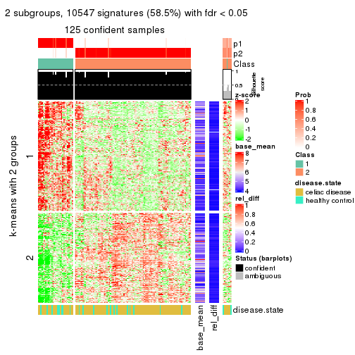</p>

</div>
<div id='tab-ATC-kmeans-get-signatures-2'>
<pre><code class="r">get_signatures(res, k = 3)
</code></pre>

<p></p>

</div>
<div id='tab-ATC-kmeans-get-signatures-3'>
<pre><code class="r">get_signatures(res, k = 4)
</code></pre>

<p></p>

</div>
<div id='tab-ATC-kmeans-get-signatures-4'>
<pre><code class="r">get_signatures(res, k = 5)
</code></pre>

<p></p>

</div>
<div id='tab-ATC-kmeans-get-signatures-5'>
<pre><code class="r">get_signatures(res, k = 6)
</code></pre>

<p></p>

</div>
</div>


Signature heatmaps where rows are not scaled:


<script>
$( function() {
	$( '#tabs-ATC-kmeans-get-signatures-no-scale' ).tabs();
} );
</script>
<div id='tabs-ATC-kmeans-get-signatures-no-scale'>
<ul>
<li><a href='#tab-ATC-kmeans-get-signatures-no-scale-1'>k = 2</a></li>
<li><a href='#tab-ATC-kmeans-get-signatures-no-scale-2'>k = 3</a></li>
<li><a href='#tab-ATC-kmeans-get-signatures-no-scale-3'>k = 4</a></li>
<li><a href='#tab-ATC-kmeans-get-signatures-no-scale-4'>k = 5</a></li>
<li><a href='#tab-ATC-kmeans-get-signatures-no-scale-5'>k = 6</a></li>
</ul>
<div id='tab-ATC-kmeans-get-signatures-no-scale-1'>
<pre><code class="r">get_signatures(res, k = 2, scale_rows = FALSE)
</code></pre>

<p></p>

</div>
<div id='tab-ATC-kmeans-get-signatures-no-scale-2'>
<pre><code class="r">get_signatures(res, k = 3, scale_rows = FALSE)
</code></pre>

<p></p>

</div>
<div id='tab-ATC-kmeans-get-signatures-no-scale-3'>
<pre><code class="r">get_signatures(res, k = 4, scale_rows = FALSE)
</code></pre>

<p></p>

</div>
<div id='tab-ATC-kmeans-get-signatures-no-scale-4'>
<pre><code class="r">get_signatures(res, k = 5, scale_rows = FALSE)
</code></pre>

<p></p>

</div>
<div id='tab-ATC-kmeans-get-signatures-no-scale-5'>
<pre><code class="r">get_signatures(res, k = 6, scale_rows = FALSE)
</code></pre>

<p></p>

</div>
</div>


Compare the overlap of signatures from different k:

```r
compare_signatures(res)
```


`get_signature()` returns a data frame invisibly. TO get the list of signatures, the function
call should be assigned to a variable explicitly. In following code, if `plot` argument is set
to `FALSE`, no heatmap is plotted while only the differential analysis is performed.

```r
# code only for demonstration
tb = get_signature(res, k = ..., plot = FALSE)
```

An example of the output of `tb` is:

```
#>   which_row         fdr    mean_1    mean_2 scaled_mean_1 scaled_mean_2 km
#> 1        38 0.042760348  8.373488  9.131774    -0.5533452     0.5164555  1
#> 2        40 0.018707592  7.106213  8.469186    -0.6173731     0.5762149  1
#> 3        55 0.019134737 10.221463 11.207825    -0.6159697     0.5749050  1
#> 4        59 0.006059896  5.921854  7.869574    -0.6899429     0.6439467  1
#> 5        60 0.018055526  8.928898 10.211722    -0.6204761     0.5791110  1
#> 6        98 0.009384629 15.714769 14.887706     0.6635654    -0.6193277  2
...
```

The columns in `tb` are:

1. `which_row`: row indices corresponding to the input matrix.
2. `fdr`: FDR for the differential test. 
3. `mean_x`: The mean value in group x.
4. `scaled_mean_x`: The mean value in group x after rows are scaled.
5. `km`: Row groups if k-means clustering is applied to rows.


UMAP plot which shows how samples are separated.


<script>
$( function() {
	$( '#tabs-ATC-kmeans-dimension-reduction' ).tabs();
} );
</script>
<div id='tabs-ATC-kmeans-dimension-reduction'>
<ul>
<li><a href='#tab-ATC-kmeans-dimension-reduction-1'>k = 2</a></li>
<li><a href='#tab-ATC-kmeans-dimension-reduction-2'>k = 3</a></li>
<li><a href='#tab-ATC-kmeans-dimension-reduction-3'>k = 4</a></li>
<li><a href='#tab-ATC-kmeans-dimension-reduction-4'>k = 5</a></li>
<li><a href='#tab-ATC-kmeans-dimension-reduction-5'>k = 6</a></li>
</ul>
<div id='tab-ATC-kmeans-dimension-reduction-1'>
<pre><code class="r">dimension_reduction(res, k = 2, method = &quot;UMAP&quot;)
</code></pre>

<p></p>

</div>
<div id='tab-ATC-kmeans-dimension-reduction-2'>
<pre><code class="r">dimension_reduction(res, k = 3, method = &quot;UMAP&quot;)
</code></pre>

<p></p>

</div>
<div id='tab-ATC-kmeans-dimension-reduction-3'>
<pre><code class="r">dimension_reduction(res, k = 4, method = &quot;UMAP&quot;)
</code></pre>

<p></p>

</div>
<div id='tab-ATC-kmeans-dimension-reduction-4'>
<pre><code class="r">dimension_reduction(res, k = 5, method = &quot;UMAP&quot;)
</code></pre>

<p></p>

</div>
<div id='tab-ATC-kmeans-dimension-reduction-5'>
<pre><code class="r">dimension_reduction(res, k = 6, method = &quot;UMAP&quot;)
</code></pre>

<p></p>

</div>
</div>


Following heatmap shows how subgroups are split when increasing `k`:

```r
collect_classes(res)
```


Test correlation between subgroups and known annotations. If the known
annotation is numeric, one-way ANOVA test is applied, and if the known
annotation is discrete, chi-squared contingency table test is applied.

```r
test_to_known_factors(res)
```

```
#>              n disease.state(p) k
#> ATC:kmeans 125           0.0983 2
#> ATC:kmeans 117           0.1465 3
#> ATC:kmeans 114           0.2285 4
#> ATC:kmeans  66           0.1891 5
#> ATC:kmeans 112           0.2979 6
```


If matrix rows can be associated to genes, consider to use `GO_Enrichment(res,
...)` to perform function enrichment for the signature genes.


 

---------------------------------------------------


### ATC:skmeans**


The object with results only for a single top-value method and a single partition method 
can be extracted as:

```r
res = res_list["ATC", "skmeans"]
# you can also extract it by
# res = res_list["ATC:skmeans"]
```

A summary of `res` and all the functions that can be applied to it:

```r
res
```

```
#> A 'ConsensusPartition' object with k = 2, 3, 4, 5, 6.
#>   On a matrix with 18032 rows and 132 columns.
#>   Top rows (1000, 2000, 3000, 4000, 5000) are extracted by 'ATC' method.
#>   Subgroups are detected by 'skmeans' method.
#>   Performed in total 1250 partitions by row resampling.
#>   Best k for subgroups seems to be 2.
#> 
#> Following methods can be applied to this 'ConsensusPartition' object:
#>  [1] "cola_report"             "collect_classes"         "collect_plots"          
#>  [4] "collect_stats"           "colnames"                "compare_signatures"     
#>  [7] "consensus_heatmap"       "dimension_reduction"     "functional_enrichment"  
#> [10] "get_anno_col"            "get_anno"                "get_classes"            
#> [13] "get_consensus"           "get_matrix"              "get_membership"         
#> [16] "get_param"               "get_signatures"          "get_stats"              
#> [19] "is_best_k"               "is_stable_k"             "membership_heatmap"     
#> [22] "ncol"                    "nrow"                    "plot_ecdf"              
#> [25] "rownames"                "select_partition_number" "show"                   
#> [28] "suggest_best_k"          "test_to_known_factors"
```

`collect_plots()` function collects all the plots made from `res` for all `k` (number of partitions)
into one single page to provide an easy and fast comparison between different `k`.

```r
collect_plots(res)
```


The plots are:

- The first row: a plot of the ECDF (Empirical cumulative distribution
  function) curves of the consensus matrix for each `k` and the heatmap of
  predicted classes for each `k`.
- The second row: heatmaps of the consensus matrix for each `k`.
- The third row: heatmaps of the membership matrix for each `k`.
- The fouth row: heatmaps of the signatures for each `k`.

All the plots in panels can be made by individual functions and they are
plotted later in this section.

`select_partition_number()` produces several plots showing different
statistics for choosing "optimized" `k`. There are following statistics:

- ECDF curves of the consensus matrix for each `k`;
- 1-PAC. [The PAC
  score](https://en.wikipedia.org/wiki/Consensus_clustering#Over-interpretation_potential_of_consensus_clustering)
  measures the proportion of the ambiguous subgrouping.
- Mean silhouette score.
- Concordance. The mean probability of fiting the consensus class ids in all
  partitions.
- Area increased. Denote $A_k$ as the area under the ECDF curve for current
  `k`, the area increased is defined as $A_k - A_{k-1}$.
- Rand index. The percent of pairs of samples that are both in a same cluster
  or both are not in a same cluster in the partition of k and k-1.
- Jaccard index. The ratio of pairs of samples are both in a same cluster in
  the partition of k and k-1 and the pairs of samples are both in a same
  cluster in the partition k or k-1.

The detailed explanations of these statistics can be found in [the cola
vignette](http://bioconductor.org/packages/devel/bioc/vignettes/cola/inst/doc/cola.html#toc_13).

Generally speaking, lower PAC score, higher mean silhouette score or higher
concordance corresponds to better partition. Rand index and Jaccard index
measure how similar the current partition is compared to partition with `k-1`.
If they are too similar, we won't accept `k` is better than `k-1`.

```r
select_partition_number(res)
```


The numeric values for all these statistics can be obtained by `get_stats()`.

```r
get_stats(res)
```

```
#>   k 1-PAC mean_silhouette concordance area_increased  Rand Jaccard
#> 2 2 1.000           0.988       0.995         0.4865 0.513   0.513
#> 3 3 0.735           0.883       0.932         0.2964 0.805   0.635
#> 4 4 0.808           0.868       0.926         0.1164 0.881   0.694
#> 5 5 0.789           0.752       0.884         0.0831 0.888   0.641
#> 6 6 0.709           0.479       0.720         0.0392 0.886   0.563
```

`suggest_best_k()` suggests the best $k$ based on these statistics. The rules are as follows:

- All $k$ with Jaccard index larger than 0.95 are removed because the increase of
  the partition number does not provides enough extra information. If all $k$ are removed,
  the best $k$ is assigned by `NA`.
- For $k$ with 1-PAC larger than 0.9, the maximal $k$ is taken as the "best k". Other $k$ is called "optional k".
- If it does not fit the second rule. The $k$ with the highest vote of highest
  1-PAC, mean silhouette and concordance is taken as the "best k".

```r
suggest_best_k(res)
```

```
#> [1] 2
```


Following shows the table of the partitions (You need to click the **show/hide
code output** link to see it). The membership matrix (columns with name `p*`)
is inferred by
[`clue::cl_consensus()`](https://www.rdocumentation.org/link/cl_consensus?package=clue)
function with the `SE` method. Basically the value in the membership matrix
represents the probability to belong to a certain group. The finall class
label for an item is determined with the group with highest probability it
belongs to.

In `get_classes()` function, the entropy is calculated from the membership
matrix and the silhouette score is calculated from the consensus matrix.


<script>
$( function() {
	$( '#tabs-ATC-skmeans-get-classes' ).tabs();
} );
</script>
<div id='tabs-ATC-skmeans-get-classes'>
<ul>
<li><a href='#tab-ATC-skmeans-get-classes-1'>k = 2</a></li>
<li><a href='#tab-ATC-skmeans-get-classes-2'>k = 3</a></li>
<li><a href='#tab-ATC-skmeans-get-classes-3'>k = 4</a></li>
<li><a href='#tab-ATC-skmeans-get-classes-4'>k = 5</a></li>
<li><a href='#tab-ATC-skmeans-get-classes-5'>k = 6</a></li>
</ul>

<div id='tab-ATC-skmeans-get-classes-1'>
<p><a id='tab-ATC-skmeans-get-classes-1-a' style='color:#0366d6' href='#'>show/hide code output</a></p>
<pre><code class="r">cbind(get_classes(res, k = 2), get_membership(res, k = 2))
</code></pre>

<pre><code>#&gt;           class entropy silhouette    p1    p2
#&gt; GSM289470     2  0.0000      0.998 0.000 1.000
#&gt; GSM289471     1  0.0000      0.990 1.000 0.000
#&gt; GSM289472     2  0.0000      0.998 0.000 1.000
#&gt; GSM289473     2  0.0000      0.998 0.000 1.000
#&gt; GSM289474     2  0.0000      0.998 0.000 1.000
#&gt; GSM289475     2  0.0000      0.998 0.000 1.000
#&gt; GSM289476     1  0.0000      0.990 1.000 0.000
#&gt; GSM289477     2  0.0000      0.998 0.000 1.000
#&gt; GSM289478     2  0.0000      0.998 0.000 1.000
#&gt; GSM289479     2  0.0000      0.998 0.000 1.000
#&gt; GSM289480     2  0.0000      0.998 0.000 1.000
#&gt; GSM289481     2  0.0000      0.998 0.000 1.000
#&gt; GSM289482     2  0.0000      0.998 0.000 1.000
#&gt; GSM289483     2  0.0000      0.998 0.000 1.000
#&gt; GSM289484     2  0.0000      0.998 0.000 1.000
#&gt; GSM289485     2  0.0000      0.998 0.000 1.000
#&gt; GSM289486     1  0.0000      0.990 1.000 0.000
#&gt; GSM289487     2  0.0000      0.998 0.000 1.000
#&gt; GSM289488     2  0.0000      0.998 0.000 1.000
#&gt; GSM289489     2  0.0000      0.998 0.000 1.000
#&gt; GSM289490     1  0.0000      0.990 1.000 0.000
#&gt; GSM289491     2  0.0000      0.998 0.000 1.000
#&gt; GSM289492     1  0.0000      0.990 1.000 0.000
#&gt; GSM289493     2  0.0000      0.998 0.000 1.000
#&gt; GSM289494     1  0.0000      0.990 1.000 0.000
#&gt; GSM289495     2  0.0000      0.998 0.000 1.000
#&gt; GSM289496     2  0.0000      0.998 0.000 1.000
#&gt; GSM289497     2  0.0000      0.998 0.000 1.000
#&gt; GSM289498     1  0.0000      0.990 1.000 0.000
#&gt; GSM289499     2  0.0000      0.998 0.000 1.000
#&gt; GSM289500     1  0.0000      0.990 1.000 0.000
#&gt; GSM289501     2  0.0000      0.998 0.000 1.000
#&gt; GSM289502     2  0.0000      0.998 0.000 1.000
#&gt; GSM289503     2  0.0000      0.998 0.000 1.000
#&gt; GSM289504     2  0.0000      0.998 0.000 1.000
#&gt; GSM289505     2  0.0000      0.998 0.000 1.000
#&gt; GSM289506     2  0.0000      0.998 0.000 1.000
#&gt; GSM289507     2  0.0000      0.998 0.000 1.000
#&gt; GSM289508     1  0.0000      0.990 1.000 0.000
#&gt; GSM289509     1  0.0000      0.990 1.000 0.000
#&gt; GSM289510     2  0.1184      0.982 0.016 0.984
#&gt; GSM289511     2  0.0000      0.998 0.000 1.000
#&gt; GSM289512     1  0.0000      0.990 1.000 0.000
#&gt; GSM289513     2  0.0000      0.998 0.000 1.000
#&gt; GSM289514     1  0.0000      0.990 1.000 0.000
#&gt; GSM289515     2  0.0000      0.998 0.000 1.000
#&gt; GSM289516     2  0.0000      0.998 0.000 1.000
#&gt; GSM289517     2  0.0000      0.998 0.000 1.000
#&gt; GSM289518     1  0.7139      0.759 0.804 0.196
#&gt; GSM289519     1  0.0000      0.990 1.000 0.000
#&gt; GSM289520     2  0.0000      0.998 0.000 1.000
#&gt; GSM289521     1  0.0000      0.990 1.000 0.000
#&gt; GSM289522     1  0.0000      0.990 1.000 0.000
#&gt; GSM289523     1  0.0000      0.990 1.000 0.000
#&gt; GSM289524     2  0.0000      0.998 0.000 1.000
#&gt; GSM289525     2  0.0000      0.998 0.000 1.000
#&gt; GSM289526     1  0.0000      0.990 1.000 0.000
#&gt; GSM289527     2  0.0000      0.998 0.000 1.000
#&gt; GSM289528     2  0.0000      0.998 0.000 1.000
#&gt; GSM289529     2  0.0000      0.998 0.000 1.000
#&gt; GSM289530     1  0.0000      0.990 1.000 0.000
#&gt; GSM289531     2  0.0000      0.998 0.000 1.000
#&gt; GSM289532     1  0.0000      0.990 1.000 0.000
#&gt; GSM289533     2  0.0000      0.998 0.000 1.000
#&gt; GSM289534     1  0.0000      0.990 1.000 0.000
#&gt; GSM289535     1  0.0000      0.990 1.000 0.000
#&gt; GSM289536     1  0.0000      0.990 1.000 0.000
#&gt; GSM289537     2  0.0000      0.998 0.000 1.000
#&gt; GSM289538     2  0.0000      0.998 0.000 1.000
#&gt; GSM289539     2  0.0000      0.998 0.000 1.000
#&gt; GSM289540     1  0.0000      0.990 1.000 0.000
#&gt; GSM289541     2  0.0000      0.998 0.000 1.000
#&gt; GSM289542     1  0.8144      0.667 0.748 0.252
#&gt; GSM289543     2  0.0000      0.998 0.000 1.000
#&gt; GSM289544     1  0.0000      0.990 1.000 0.000
#&gt; GSM289545     2  0.0000      0.998 0.000 1.000
#&gt; GSM289546     2  0.0000      0.998 0.000 1.000
#&gt; GSM289547     2  0.0000      0.998 0.000 1.000
#&gt; GSM289548     1  0.0000      0.990 1.000 0.000
#&gt; GSM289549     2  0.0000      0.998 0.000 1.000
#&gt; GSM289550     1  0.0000      0.990 1.000 0.000
#&gt; GSM289551     1  0.0000      0.990 1.000 0.000
#&gt; GSM289552     1  0.0000      0.990 1.000 0.000
#&gt; GSM289553     1  0.0000      0.990 1.000 0.000
#&gt; GSM289554     2  0.0000      0.998 0.000 1.000
#&gt; GSM289555     2  0.0000      0.998 0.000 1.000
#&gt; GSM289556     1  0.0000      0.990 1.000 0.000
#&gt; GSM289557     2  0.0000      0.998 0.000 1.000
#&gt; GSM289558     2  0.0000      0.998 0.000 1.000
#&gt; GSM289559     1  0.0000      0.990 1.000 0.000
#&gt; GSM289560     2  0.0000      0.998 0.000 1.000
#&gt; GSM289561     2  0.0000      0.998 0.000 1.000
#&gt; GSM289562     1  0.0000      0.990 1.000 0.000
#&gt; GSM289563     2  0.0000      0.998 0.000 1.000
#&gt; GSM289564     1  0.0000      0.990 1.000 0.000
#&gt; GSM289565     1  0.0000      0.990 1.000 0.000
#&gt; GSM289566     1  0.0000      0.990 1.000 0.000
#&gt; GSM289567     1  0.0000      0.990 1.000 0.000
#&gt; GSM289568     2  0.0000      0.998 0.000 1.000
#&gt; GSM289569     2  0.0000      0.998 0.000 1.000
#&gt; GSM289570     1  0.0000      0.990 1.000 0.000
#&gt; GSM289571     2  0.0000      0.998 0.000 1.000
#&gt; GSM289572     2  0.0000      0.998 0.000 1.000
#&gt; GSM289573     2  0.0000      0.998 0.000 1.000
#&gt; GSM289574     2  0.0000      0.998 0.000 1.000
#&gt; GSM289575     2  0.0000      0.998 0.000 1.000
#&gt; GSM289576     2  0.0000      0.998 0.000 1.000
#&gt; GSM289577     1  0.0000      0.990 1.000 0.000
#&gt; GSM289578     1  0.0000      0.990 1.000 0.000
#&gt; GSM289579     1  0.4562      0.892 0.904 0.096
#&gt; GSM289580     1  0.0000      0.990 1.000 0.000
#&gt; GSM289581     1  0.0000      0.990 1.000 0.000
#&gt; GSM289582     1  0.0000      0.990 1.000 0.000
#&gt; GSM289583     2  0.0000      0.998 0.000 1.000
#&gt; GSM289584     2  0.0000      0.998 0.000 1.000
#&gt; GSM289585     2  0.0000      0.998 0.000 1.000
#&gt; GSM289586     2  0.5408      0.857 0.124 0.876
#&gt; GSM289587     2  0.0000      0.998 0.000 1.000
#&gt; GSM289588     1  0.0000      0.990 1.000 0.000
#&gt; GSM289589     1  0.0000      0.990 1.000 0.000
#&gt; GSM289590     1  0.0000      0.990 1.000 0.000
#&gt; GSM289591     1  0.0000      0.990 1.000 0.000
#&gt; GSM289592     2  0.0000      0.998 0.000 1.000
#&gt; GSM289593     1  0.0000      0.990 1.000 0.000
#&gt; GSM289594     2  0.0000      0.998 0.000 1.000
#&gt; GSM289595     1  0.0000      0.990 1.000 0.000
#&gt; GSM289596     2  0.0000      0.998 0.000 1.000
#&gt; GSM289597     2  0.0000      0.998 0.000 1.000
#&gt; GSM289598     1  0.0000      0.990 1.000 0.000
#&gt; GSM289599     2  0.0376      0.994 0.004 0.996
#&gt; GSM289600     1  0.0000      0.990 1.000 0.000
#&gt; GSM289601     1  0.0000      0.990 1.000 0.000
</code></pre>

<script>
$('#tab-ATC-skmeans-get-classes-1-a').parent().next().next().hide();
$('#tab-ATC-skmeans-get-classes-1-a').click(function(){
  $('#tab-ATC-skmeans-get-classes-1-a').parent().next().next().toggle();
  return(false);
});
</script>
</div>

<div id='tab-ATC-skmeans-get-classes-2'>
<p><a id='tab-ATC-skmeans-get-classes-2-a' style='color:#0366d6' href='#'>show/hide code output</a></p>
<pre><code class="r">cbind(get_classes(res, k = 3), get_membership(res, k = 3))
</code></pre>

<pre><code>#&gt;           class entropy silhouette    p1    p2    p3
#&gt; GSM289470     2   0.216      0.896 0.000 0.936 0.064
#&gt; GSM289471     1   0.000      0.941 1.000 0.000 0.000
#&gt; GSM289472     2   0.000      0.957 0.000 1.000 0.000
#&gt; GSM289473     3   0.327      0.878 0.000 0.116 0.884
#&gt; GSM289474     2   0.613      0.188 0.000 0.600 0.400
#&gt; GSM289475     2   0.000      0.957 0.000 1.000 0.000
#&gt; GSM289476     1   0.000      0.941 1.000 0.000 0.000
#&gt; GSM289477     2   0.000      0.957 0.000 1.000 0.000
#&gt; GSM289478     2   0.000      0.957 0.000 1.000 0.000
#&gt; GSM289479     2   0.518      0.601 0.000 0.744 0.256
#&gt; GSM289480     2   0.000      0.957 0.000 1.000 0.000
#&gt; GSM289481     2   0.000      0.957 0.000 1.000 0.000
#&gt; GSM289482     2   0.000      0.957 0.000 1.000 0.000
#&gt; GSM289483     2   0.000      0.957 0.000 1.000 0.000
#&gt; GSM289484     2   0.000      0.957 0.000 1.000 0.000
#&gt; GSM289485     2   0.000      0.957 0.000 1.000 0.000
#&gt; GSM289486     1   0.327      0.888 0.884 0.000 0.116
#&gt; GSM289487     2   0.000      0.957 0.000 1.000 0.000
#&gt; GSM289488     2   0.000      0.957 0.000 1.000 0.000
#&gt; GSM289489     3   0.412      0.852 0.000 0.168 0.832
#&gt; GSM289490     1   0.000      0.941 1.000 0.000 0.000
#&gt; GSM289491     2   0.000      0.957 0.000 1.000 0.000
#&gt; GSM289492     1   0.000      0.941 1.000 0.000 0.000
#&gt; GSM289493     2   0.000      0.957 0.000 1.000 0.000
#&gt; GSM289494     1   0.000      0.941 1.000 0.000 0.000
#&gt; GSM289495     2   0.000      0.957 0.000 1.000 0.000
#&gt; GSM289496     2   0.000      0.957 0.000 1.000 0.000
#&gt; GSM289497     2   0.000      0.957 0.000 1.000 0.000
#&gt; GSM289498     1   0.000      0.941 1.000 0.000 0.000
#&gt; GSM289499     2   0.000      0.957 0.000 1.000 0.000
#&gt; GSM289500     1   0.000      0.941 1.000 0.000 0.000
#&gt; GSM289501     2   0.000      0.957 0.000 1.000 0.000
#&gt; GSM289502     2   0.000      0.957 0.000 1.000 0.000
#&gt; GSM289503     2   0.000      0.957 0.000 1.000 0.000
#&gt; GSM289504     2   0.000      0.957 0.000 1.000 0.000
#&gt; GSM289505     2   0.000      0.957 0.000 1.000 0.000
#&gt; GSM289506     2   0.000      0.957 0.000 1.000 0.000
#&gt; GSM289507     2   0.000      0.957 0.000 1.000 0.000
#&gt; GSM289508     1   0.327      0.888 0.884 0.000 0.116
#&gt; GSM289509     1   0.000      0.941 1.000 0.000 0.000
#&gt; GSM289510     3   0.343      0.877 0.004 0.112 0.884
#&gt; GSM289511     3   0.327      0.878 0.000 0.116 0.884
#&gt; GSM289512     1   0.000      0.941 1.000 0.000 0.000
#&gt; GSM289513     3   0.493      0.797 0.000 0.232 0.768
#&gt; GSM289514     3   0.424      0.760 0.176 0.000 0.824
#&gt; GSM289515     3   0.327      0.878 0.000 0.116 0.884
#&gt; GSM289516     3   0.341      0.875 0.000 0.124 0.876
#&gt; GSM289517     3   0.327      0.878 0.000 0.116 0.884
#&gt; GSM289518     3   0.327      0.806 0.116 0.000 0.884
#&gt; GSM289519     3   0.327      0.806 0.116 0.000 0.884
#&gt; GSM289520     3   0.590      0.635 0.000 0.352 0.648
#&gt; GSM289521     1   0.000      0.941 1.000 0.000 0.000
#&gt; GSM289522     3   0.375      0.787 0.144 0.000 0.856
#&gt; GSM289523     1   0.000      0.941 1.000 0.000 0.000
#&gt; GSM289524     3   0.327      0.878 0.000 0.116 0.884
#&gt; GSM289525     3   0.327      0.878 0.000 0.116 0.884
#&gt; GSM289526     1   0.435      0.727 0.816 0.000 0.184
#&gt; GSM289527     3   0.327      0.878 0.000 0.116 0.884
#&gt; GSM289528     2   0.000      0.957 0.000 1.000 0.000
#&gt; GSM289529     3   0.480      0.808 0.000 0.220 0.780
#&gt; GSM289530     1   0.000      0.941 1.000 0.000 0.000
#&gt; GSM289531     2   0.470      0.685 0.000 0.788 0.212
#&gt; GSM289532     1   0.000      0.941 1.000 0.000 0.000
#&gt; GSM289533     3   0.470      0.817 0.000 0.212 0.788
#&gt; GSM289534     1   0.000      0.941 1.000 0.000 0.000
#&gt; GSM289535     1   0.000      0.941 1.000 0.000 0.000
#&gt; GSM289536     1   0.000      0.941 1.000 0.000 0.000
#&gt; GSM289537     2   0.000      0.957 0.000 1.000 0.000
#&gt; GSM289538     2   0.000      0.957 0.000 1.000 0.000
#&gt; GSM289539     2   0.000      0.957 0.000 1.000 0.000
#&gt; GSM289540     1   0.000      0.941 1.000 0.000 0.000
#&gt; GSM289541     2   0.327      0.841 0.000 0.884 0.116
#&gt; GSM289542     1   0.870      0.334 0.524 0.360 0.116
#&gt; GSM289543     2   0.327      0.841 0.000 0.884 0.116
#&gt; GSM289544     1   0.000      0.941 1.000 0.000 0.000
#&gt; GSM289545     2   0.000      0.957 0.000 1.000 0.000
#&gt; GSM289546     2   0.000      0.957 0.000 1.000 0.000
#&gt; GSM289547     2   0.000      0.957 0.000 1.000 0.000
#&gt; GSM289548     1   0.327      0.888 0.884 0.000 0.116
#&gt; GSM289549     3   0.327      0.802 0.000 0.116 0.884
#&gt; GSM289550     1   0.319      0.891 0.888 0.000 0.112
#&gt; GSM289551     1   0.000      0.941 1.000 0.000 0.000
#&gt; GSM289552     1   0.319      0.891 0.888 0.000 0.112
#&gt; GSM289553     1   0.000      0.941 1.000 0.000 0.000
#&gt; GSM289554     2   0.000      0.957 0.000 1.000 0.000
#&gt; GSM289555     2   0.000      0.957 0.000 1.000 0.000
#&gt; GSM289556     1   0.327      0.888 0.884 0.000 0.116
#&gt; GSM289557     2   0.000      0.957 0.000 1.000 0.000
#&gt; GSM289558     2   0.000      0.957 0.000 1.000 0.000
#&gt; GSM289559     1   0.327      0.888 0.884 0.000 0.116
#&gt; GSM289560     2   0.000      0.957 0.000 1.000 0.000
#&gt; GSM289561     2   0.000      0.957 0.000 1.000 0.000
#&gt; GSM289562     1   0.319      0.891 0.888 0.000 0.112
#&gt; GSM289563     2   0.559      0.580 0.000 0.696 0.304
#&gt; GSM289564     1   0.000      0.941 1.000 0.000 0.000
#&gt; GSM289565     1   0.000      0.941 1.000 0.000 0.000
#&gt; GSM289566     1   0.000      0.941 1.000 0.000 0.000
#&gt; GSM289567     3   0.327      0.806 0.116 0.000 0.884
#&gt; GSM289568     3   0.610      0.557 0.000 0.392 0.608
#&gt; GSM289569     3   0.593      0.628 0.000 0.356 0.644
#&gt; GSM289570     3   0.546      0.621 0.288 0.000 0.712
#&gt; GSM289571     2   0.000      0.957 0.000 1.000 0.000
#&gt; GSM289572     2   0.000      0.957 0.000 1.000 0.000
#&gt; GSM289573     2   0.000      0.957 0.000 1.000 0.000
#&gt; GSM289574     2   0.000      0.957 0.000 1.000 0.000
#&gt; GSM289575     2   0.196      0.901 0.000 0.944 0.056
#&gt; GSM289576     2   0.000      0.957 0.000 1.000 0.000
#&gt; GSM289577     1   0.603      0.381 0.624 0.376 0.000
#&gt; GSM289578     1   0.000      0.941 1.000 0.000 0.000
#&gt; GSM289579     2   0.630      0.363 0.388 0.608 0.004
#&gt; GSM289580     1   0.000      0.941 1.000 0.000 0.000
#&gt; GSM289581     1   0.000      0.941 1.000 0.000 0.000
#&gt; GSM289582     3   0.536      0.641 0.276 0.000 0.724
#&gt; GSM289583     2   0.000      0.957 0.000 1.000 0.000
#&gt; GSM289584     2   0.000      0.957 0.000 1.000 0.000
#&gt; GSM289585     2   0.000      0.957 0.000 1.000 0.000
#&gt; GSM289586     3   0.175      0.844 0.000 0.048 0.952
#&gt; GSM289587     2   0.327      0.841 0.000 0.884 0.116
#&gt; GSM289588     1   0.000      0.941 1.000 0.000 0.000
#&gt; GSM289589     1   0.327      0.888 0.884 0.000 0.116
#&gt; GSM289590     1   0.000      0.941 1.000 0.000 0.000
#&gt; GSM289591     1   0.327      0.888 0.884 0.000 0.116
#&gt; GSM289592     2   0.000      0.957 0.000 1.000 0.000
#&gt; GSM289593     1   0.000      0.941 1.000 0.000 0.000
#&gt; GSM289594     2   0.000      0.957 0.000 1.000 0.000
#&gt; GSM289595     1   0.000      0.941 1.000 0.000 0.000
#&gt; GSM289596     2   0.000      0.957 0.000 1.000 0.000
#&gt; GSM289597     3   0.327      0.878 0.000 0.116 0.884
#&gt; GSM289598     1   0.327      0.888 0.884 0.000 0.116
#&gt; GSM289599     2   0.245      0.884 0.000 0.924 0.076
#&gt; GSM289600     1   0.319      0.891 0.888 0.000 0.112
#&gt; GSM289601     1   0.000      0.941 1.000 0.000 0.000
</code></pre>

<script>
$('#tab-ATC-skmeans-get-classes-2-a').parent().next().next().hide();
$('#tab-ATC-skmeans-get-classes-2-a').click(function(){
  $('#tab-ATC-skmeans-get-classes-2-a').parent().next().next().toggle();
  return(false);
});
</script>
</div>

<div id='tab-ATC-skmeans-get-classes-3'>
<p><a id='tab-ATC-skmeans-get-classes-3-a' style='color:#0366d6' href='#'>show/hide code output</a></p>
<pre><code class="r">cbind(get_classes(res, k = 4), get_membership(res, k = 4))
</code></pre>

<pre><code>#&gt;           class entropy silhouette    p1    p2    p3    p4
#&gt; GSM289470     1  0.5488      0.185 0.532 0.452 0.000 0.016
#&gt; GSM289471     3  0.0469      0.960 0.012 0.000 0.988 0.000
#&gt; GSM289472     2  0.1389      0.916 0.000 0.952 0.000 0.048
#&gt; GSM289473     4  0.0336      0.872 0.008 0.000 0.000 0.992
#&gt; GSM289474     2  0.4072      0.667 0.000 0.748 0.000 0.252
#&gt; GSM289475     2  0.1389      0.916 0.000 0.952 0.000 0.048
#&gt; GSM289476     3  0.0469      0.960 0.012 0.000 0.988 0.000
#&gt; GSM289477     2  0.1389      0.916 0.000 0.952 0.000 0.048
#&gt; GSM289478     2  0.1389      0.916 0.000 0.952 0.000 0.048
#&gt; GSM289479     2  0.3636      0.785 0.008 0.820 0.000 0.172
#&gt; GSM289480     2  0.1389      0.916 0.000 0.952 0.000 0.048
#&gt; GSM289481     2  0.1389      0.916 0.000 0.952 0.000 0.048
#&gt; GSM289482     2  0.1389      0.916 0.000 0.952 0.000 0.048
#&gt; GSM289483     2  0.1389      0.916 0.000 0.952 0.000 0.048
#&gt; GSM289484     2  0.1389      0.916 0.000 0.952 0.000 0.048
#&gt; GSM289485     2  0.1389      0.916 0.000 0.952 0.000 0.048
#&gt; GSM289486     1  0.2281      0.864 0.904 0.000 0.096 0.000
#&gt; GSM289487     2  0.1389      0.916 0.000 0.952 0.000 0.048
#&gt; GSM289488     2  0.1389      0.916 0.000 0.952 0.000 0.048
#&gt; GSM289489     4  0.3764      0.703 0.000 0.216 0.000 0.784
#&gt; GSM289490     3  0.2593      0.890 0.104 0.004 0.892 0.000
#&gt; GSM289491     2  0.1637      0.918 0.060 0.940 0.000 0.000
#&gt; GSM289492     3  0.0592      0.959 0.016 0.000 0.984 0.000
#&gt; GSM289493     2  0.0188      0.931 0.004 0.996 0.000 0.000
#&gt; GSM289494     3  0.0000      0.958 0.000 0.000 1.000 0.000
#&gt; GSM289495     2  0.1867      0.912 0.072 0.928 0.000 0.000
#&gt; GSM289496     2  0.1637      0.918 0.060 0.940 0.000 0.000
#&gt; GSM289497     2  0.0000      0.931 0.000 1.000 0.000 0.000
#&gt; GSM289498     3  0.0592      0.959 0.016 0.000 0.984 0.000
#&gt; GSM289499     2  0.1792      0.914 0.068 0.932 0.000 0.000
#&gt; GSM289500     3  0.0469      0.960 0.012 0.000 0.988 0.000
#&gt; GSM289501     2  0.1637      0.918 0.060 0.940 0.000 0.000
#&gt; GSM289502     2  0.0188      0.931 0.000 0.996 0.000 0.004
#&gt; GSM289503     2  0.0000      0.931 0.000 1.000 0.000 0.000
#&gt; GSM289504     2  0.1211      0.924 0.040 0.960 0.000 0.000
#&gt; GSM289505     2  0.0000      0.931 0.000 1.000 0.000 0.000
#&gt; GSM289506     2  0.0188      0.931 0.000 0.996 0.000 0.004
#&gt; GSM289507     2  0.0188      0.931 0.000 0.996 0.000 0.004
#&gt; GSM289508     1  0.2921      0.846 0.860 0.000 0.140 0.000
#&gt; GSM289509     3  0.0469      0.960 0.012 0.000 0.988 0.000
#&gt; GSM289510     4  0.0000      0.874 0.000 0.000 0.000 1.000
#&gt; GSM289511     4  0.0336      0.872 0.000 0.008 0.000 0.992
#&gt; GSM289512     3  0.0469      0.960 0.012 0.000 0.988 0.000
#&gt; GSM289513     4  0.1474      0.847 0.000 0.052 0.000 0.948
#&gt; GSM289514     4  0.3649      0.685 0.000 0.000 0.204 0.796
#&gt; GSM289515     4  0.0000      0.874 0.000 0.000 0.000 1.000
#&gt; GSM289516     4  0.0188      0.873 0.000 0.004 0.000 0.996
#&gt; GSM289517     4  0.0000      0.874 0.000 0.000 0.000 1.000
#&gt; GSM289518     4  0.0000      0.874 0.000 0.000 0.000 1.000
#&gt; GSM289519     4  0.1716      0.825 0.000 0.000 0.064 0.936
#&gt; GSM289520     4  0.3444      0.738 0.000 0.184 0.000 0.816
#&gt; GSM289521     3  0.0000      0.958 0.000 0.000 1.000 0.000
#&gt; GSM289522     4  0.1389      0.843 0.000 0.000 0.048 0.952
#&gt; GSM289523     3  0.0469      0.960 0.012 0.000 0.988 0.000
#&gt; GSM289524     4  0.0000      0.874 0.000 0.000 0.000 1.000
#&gt; GSM289525     4  0.0000      0.874 0.000 0.000 0.000 1.000
#&gt; GSM289526     3  0.3377      0.816 0.012 0.000 0.848 0.140
#&gt; GSM289527     4  0.0000      0.874 0.000 0.000 0.000 1.000
#&gt; GSM289528     2  0.1389      0.916 0.000 0.952 0.000 0.048
#&gt; GSM289529     4  0.4697      0.606 0.008 0.296 0.000 0.696
#&gt; GSM289530     3  0.0000      0.958 0.000 0.000 1.000 0.000
#&gt; GSM289531     2  0.3495      0.820 0.016 0.844 0.000 0.140
#&gt; GSM289532     3  0.0000      0.958 0.000 0.000 1.000 0.000
#&gt; GSM289533     2  0.5080      0.264 0.004 0.576 0.000 0.420
#&gt; GSM289534     3  0.0469      0.960 0.012 0.000 0.988 0.000
#&gt; GSM289535     3  0.1940      0.906 0.076 0.000 0.924 0.000
#&gt; GSM289536     3  0.0469      0.960 0.012 0.000 0.988 0.000
#&gt; GSM289537     2  0.0188      0.931 0.004 0.996 0.000 0.000
#&gt; GSM289538     2  0.0000      0.931 0.000 1.000 0.000 0.000
#&gt; GSM289539     2  0.0188      0.931 0.000 0.996 0.000 0.004
#&gt; GSM289540     3  0.0336      0.954 0.008 0.000 0.992 0.000
#&gt; GSM289541     1  0.2760      0.775 0.872 0.128 0.000 0.000
#&gt; GSM289542     1  0.1938      0.845 0.936 0.012 0.052 0.000
#&gt; GSM289543     2  0.4955      0.155 0.444 0.556 0.000 0.000
#&gt; GSM289544     3  0.0469      0.960 0.012 0.000 0.988 0.000
#&gt; GSM289545     2  0.0000      0.931 0.000 1.000 0.000 0.000
#&gt; GSM289546     2  0.0000      0.931 0.000 1.000 0.000 0.000
#&gt; GSM289547     2  0.0188      0.931 0.004 0.996 0.000 0.000
#&gt; GSM289548     1  0.2281      0.864 0.904 0.000 0.096 0.000
#&gt; GSM289549     1  0.2958      0.802 0.896 0.072 0.004 0.028
#&gt; GSM289550     1  0.3873      0.783 0.772 0.000 0.228 0.000
#&gt; GSM289551     3  0.0469      0.960 0.012 0.000 0.988 0.000
#&gt; GSM289552     1  0.4817      0.506 0.612 0.000 0.388 0.000
#&gt; GSM289553     3  0.0469      0.960 0.012 0.000 0.988 0.000
#&gt; GSM289554     2  0.2149      0.903 0.088 0.912 0.000 0.000
#&gt; GSM289555     2  0.1637      0.918 0.060 0.940 0.000 0.000
#&gt; GSM289556     1  0.2281      0.864 0.904 0.000 0.096 0.000
#&gt; GSM289557     2  0.0000      0.931 0.000 1.000 0.000 0.000
#&gt; GSM289558     2  0.1637      0.918 0.060 0.940 0.000 0.000
#&gt; GSM289559     1  0.2281      0.864 0.904 0.000 0.096 0.000
#&gt; GSM289560     2  0.1637      0.918 0.060 0.940 0.000 0.000
#&gt; GSM289561     2  0.1637      0.918 0.060 0.940 0.000 0.000
#&gt; GSM289562     1  0.3837      0.787 0.776 0.000 0.224 0.000
#&gt; GSM289563     1  0.2675      0.794 0.892 0.100 0.000 0.008
#&gt; GSM289564     3  0.1637      0.919 0.060 0.000 0.940 0.000
#&gt; GSM289565     3  0.0000      0.958 0.000 0.000 1.000 0.000
#&gt; GSM289566     3  0.0469      0.960 0.012 0.000 0.988 0.000
#&gt; GSM289567     4  0.3946      0.716 0.020 0.000 0.168 0.812
#&gt; GSM289568     4  0.4585      0.546 0.000 0.332 0.000 0.668
#&gt; GSM289569     4  0.4304      0.631 0.000 0.284 0.000 0.716
#&gt; GSM289570     3  0.3219      0.848 0.020 0.000 0.868 0.112
#&gt; GSM289571     2  0.0188      0.931 0.004 0.996 0.000 0.000
#&gt; GSM289572     2  0.1867      0.912 0.072 0.928 0.000 0.000
#&gt; GSM289573     2  0.1637      0.918 0.060 0.940 0.000 0.000
#&gt; GSM289574     2  0.0000      0.931 0.000 1.000 0.000 0.000
#&gt; GSM289575     2  0.2741      0.889 0.096 0.892 0.012 0.000
#&gt; GSM289576     2  0.1637      0.918 0.060 0.940 0.000 0.000
#&gt; GSM289577     3  0.3634      0.838 0.096 0.048 0.856 0.000
#&gt; GSM289578     3  0.2216      0.892 0.092 0.000 0.908 0.000
#&gt; GSM289579     3  0.3948      0.817 0.096 0.064 0.840 0.000
#&gt; GSM289580     3  0.0469      0.960 0.012 0.000 0.988 0.000
#&gt; GSM289581     3  0.0000      0.958 0.000 0.000 1.000 0.000
#&gt; GSM289582     3  0.3447      0.830 0.020 0.000 0.852 0.128
#&gt; GSM289583     2  0.0188      0.931 0.000 0.996 0.000 0.004
#&gt; GSM289584     2  0.0188      0.931 0.004 0.996 0.000 0.000
#&gt; GSM289585     2  0.0188      0.931 0.000 0.996 0.000 0.004
#&gt; GSM289586     4  0.0000      0.874 0.000 0.000 0.000 1.000
#&gt; GSM289587     1  0.2469      0.791 0.892 0.108 0.000 0.000
#&gt; GSM289588     3  0.0469      0.960 0.012 0.000 0.988 0.000
#&gt; GSM289589     1  0.2281      0.864 0.904 0.000 0.096 0.000
#&gt; GSM289590     3  0.0469      0.960 0.012 0.000 0.988 0.000
#&gt; GSM289591     1  0.2281      0.864 0.904 0.000 0.096 0.000
#&gt; GSM289592     2  0.1637      0.918 0.060 0.940 0.000 0.000
#&gt; GSM289593     3  0.0469      0.960 0.012 0.000 0.988 0.000
#&gt; GSM289594     2  0.2081      0.905 0.084 0.916 0.000 0.000
#&gt; GSM289595     3  0.0469      0.960 0.012 0.000 0.988 0.000
#&gt; GSM289596     2  0.1389      0.922 0.048 0.952 0.000 0.000
#&gt; GSM289597     4  0.0000      0.874 0.000 0.000 0.000 1.000
#&gt; GSM289598     1  0.2469      0.861 0.892 0.000 0.108 0.000
#&gt; GSM289599     2  0.4500      0.607 0.316 0.684 0.000 0.000
#&gt; GSM289600     1  0.4008      0.763 0.756 0.000 0.244 0.000
#&gt; GSM289601     3  0.0000      0.958 0.000 0.000 1.000 0.000
</code></pre>

<script>
$('#tab-ATC-skmeans-get-classes-3-a').parent().next().next().hide();
$('#tab-ATC-skmeans-get-classes-3-a').click(function(){
  $('#tab-ATC-skmeans-get-classes-3-a').parent().next().next().toggle();
  return(false);
});
</script>
</div>

<div id='tab-ATC-skmeans-get-classes-4'>
<p><a id='tab-ATC-skmeans-get-classes-4-a' style='color:#0366d6' href='#'>show/hide code output</a></p>
<pre><code class="r">cbind(get_classes(res, k = 5), get_membership(res, k = 5))
</code></pre>

<pre><code>#&gt;           class entropy silhouette    p1    p2    p3    p4    p5
#&gt; GSM289470     1  0.4300     0.0743 0.524 0.000 0.000 0.000 0.476
#&gt; GSM289471     3  0.0000     0.9296 0.000 0.000 1.000 0.000 0.000
#&gt; GSM289472     5  0.0000     0.9095 0.000 0.000 0.000 0.000 1.000
#&gt; GSM289473     4  0.3927     0.7288 0.004 0.164 0.000 0.792 0.040
#&gt; GSM289474     5  0.1341     0.8490 0.000 0.000 0.000 0.056 0.944
#&gt; GSM289475     5  0.0000     0.9095 0.000 0.000 0.000 0.000 1.000
#&gt; GSM289476     3  0.0000     0.9296 0.000 0.000 1.000 0.000 0.000
#&gt; GSM289477     5  0.0000     0.9095 0.000 0.000 0.000 0.000 1.000
#&gt; GSM289478     5  0.0000     0.9095 0.000 0.000 0.000 0.000 1.000
#&gt; GSM289479     5  0.3477     0.6905 0.000 0.136 0.000 0.040 0.824
#&gt; GSM289480     5  0.0000     0.9095 0.000 0.000 0.000 0.000 1.000
#&gt; GSM289481     5  0.0290     0.9044 0.000 0.008 0.000 0.000 0.992
#&gt; GSM289482     5  0.0000     0.9095 0.000 0.000 0.000 0.000 1.000
#&gt; GSM289483     5  0.0000     0.9095 0.000 0.000 0.000 0.000 1.000
#&gt; GSM289484     5  0.0000     0.9095 0.000 0.000 0.000 0.000 1.000
#&gt; GSM289485     5  0.0000     0.9095 0.000 0.000 0.000 0.000 1.000
#&gt; GSM289486     1  0.0290     0.8308 0.992 0.000 0.008 0.000 0.000
#&gt; GSM289487     5  0.0000     0.9095 0.000 0.000 0.000 0.000 1.000
#&gt; GSM289488     5  0.0000     0.9095 0.000 0.000 0.000 0.000 1.000
#&gt; GSM289489     4  0.4440     0.1955 0.000 0.004 0.000 0.528 0.468
#&gt; GSM289490     2  0.3890     0.3883 0.012 0.736 0.252 0.000 0.000
#&gt; GSM289491     2  0.4440     0.5252 0.004 0.528 0.000 0.000 0.468
#&gt; GSM289492     3  0.0955     0.9096 0.004 0.028 0.968 0.000 0.000
#&gt; GSM289493     5  0.0703     0.8933 0.000 0.024 0.000 0.000 0.976
#&gt; GSM289494     3  0.0000     0.9296 0.000 0.000 1.000 0.000 0.000
#&gt; GSM289495     2  0.3612     0.7091 0.000 0.732 0.000 0.000 0.268
#&gt; GSM289496     5  0.4273    -0.3206 0.000 0.448 0.000 0.000 0.552
#&gt; GSM289497     5  0.0000     0.9095 0.000 0.000 0.000 0.000 1.000
#&gt; GSM289498     3  0.1430     0.8930 0.004 0.052 0.944 0.000 0.000
#&gt; GSM289499     2  0.3876     0.6928 0.000 0.684 0.000 0.000 0.316
#&gt; GSM289500     3  0.0000     0.9296 0.000 0.000 1.000 0.000 0.000
#&gt; GSM289501     5  0.4297    -0.4010 0.000 0.472 0.000 0.000 0.528
#&gt; GSM289502     5  0.0000     0.9095 0.000 0.000 0.000 0.000 1.000
#&gt; GSM289503     5  0.0000     0.9095 0.000 0.000 0.000 0.000 1.000
#&gt; GSM289504     5  0.2280     0.7615 0.000 0.120 0.000 0.000 0.880
#&gt; GSM289505     5  0.0510     0.8995 0.000 0.016 0.000 0.000 0.984
#&gt; GSM289506     5  0.0000     0.9095 0.000 0.000 0.000 0.000 1.000
#&gt; GSM289507     5  0.0000     0.9095 0.000 0.000 0.000 0.000 1.000
#&gt; GSM289508     1  0.3012     0.8207 0.860 0.036 0.104 0.000 0.000
#&gt; GSM289509     3  0.0000     0.9296 0.000 0.000 1.000 0.000 0.000
#&gt; GSM289510     4  0.0000     0.8382 0.000 0.000 0.000 1.000 0.000
#&gt; GSM289511     4  0.0703     0.8307 0.000 0.000 0.000 0.976 0.024
#&gt; GSM289512     3  0.0000     0.9296 0.000 0.000 1.000 0.000 0.000
#&gt; GSM289513     4  0.1608     0.8013 0.000 0.000 0.000 0.928 0.072
#&gt; GSM289514     4  0.2920     0.7185 0.000 0.016 0.132 0.852 0.000
#&gt; GSM289515     4  0.0000     0.8382 0.000 0.000 0.000 1.000 0.000
#&gt; GSM289516     4  0.0609     0.8325 0.000 0.000 0.000 0.980 0.020
#&gt; GSM289517     4  0.0000     0.8382 0.000 0.000 0.000 1.000 0.000
#&gt; GSM289518     4  0.0000     0.8382 0.000 0.000 0.000 1.000 0.000
#&gt; GSM289519     4  0.0693     0.8294 0.000 0.008 0.012 0.980 0.000
#&gt; GSM289520     4  0.4015     0.4783 0.000 0.000 0.000 0.652 0.348
#&gt; GSM289521     3  0.0162     0.9287 0.000 0.004 0.996 0.000 0.000
#&gt; GSM289522     4  0.0794     0.8206 0.000 0.000 0.028 0.972 0.000
#&gt; GSM289523     3  0.0000     0.9296 0.000 0.000 1.000 0.000 0.000
#&gt; GSM289524     4  0.0000     0.8382 0.000 0.000 0.000 1.000 0.000
#&gt; GSM289525     4  0.0000     0.8382 0.000 0.000 0.000 1.000 0.000
#&gt; GSM289526     3  0.0955     0.9078 0.000 0.004 0.968 0.028 0.000
#&gt; GSM289527     4  0.0000     0.8382 0.000 0.000 0.000 1.000 0.000
#&gt; GSM289528     5  0.0000     0.9095 0.000 0.000 0.000 0.000 1.000
#&gt; GSM289529     5  0.6274    -0.2313 0.000 0.148 0.000 0.424 0.428
#&gt; GSM289530     3  0.0162     0.9287 0.000 0.004 0.996 0.000 0.000
#&gt; GSM289531     5  0.3850     0.6480 0.004 0.172 0.000 0.032 0.792
#&gt; GSM289532     3  0.0162     0.9287 0.000 0.004 0.996 0.000 0.000
#&gt; GSM289533     5  0.4664     0.5834 0.004 0.152 0.000 0.096 0.748
#&gt; GSM289534     3  0.0000     0.9296 0.000 0.000 1.000 0.000 0.000
#&gt; GSM289535     3  0.4528     0.3470 0.008 0.444 0.548 0.000 0.000
#&gt; GSM289536     3  0.0000     0.9296 0.000 0.000 1.000 0.000 0.000
#&gt; GSM289537     5  0.0703     0.8933 0.000 0.024 0.000 0.000 0.976
#&gt; GSM289538     5  0.0000     0.9095 0.000 0.000 0.000 0.000 1.000
#&gt; GSM289539     5  0.0000     0.9095 0.000 0.000 0.000 0.000 1.000
#&gt; GSM289540     3  0.0671     0.9203 0.004 0.016 0.980 0.000 0.000
#&gt; GSM289541     1  0.0609     0.8222 0.980 0.000 0.000 0.000 0.020
#&gt; GSM289542     1  0.0703     0.8219 0.976 0.024 0.000 0.000 0.000
#&gt; GSM289543     1  0.4840     0.4721 0.676 0.056 0.000 0.000 0.268
#&gt; GSM289544     3  0.0162     0.9282 0.000 0.004 0.996 0.000 0.000
#&gt; GSM289545     5  0.0000     0.9095 0.000 0.000 0.000 0.000 1.000
#&gt; GSM289546     5  0.0000     0.9095 0.000 0.000 0.000 0.000 1.000
#&gt; GSM289547     5  0.0703     0.8947 0.000 0.024 0.000 0.000 0.976
#&gt; GSM289548     1  0.2970     0.8145 0.828 0.004 0.168 0.000 0.000
#&gt; GSM289549     1  0.0290     0.8280 0.992 0.000 0.000 0.000 0.008
#&gt; GSM289550     1  0.3461     0.7664 0.772 0.004 0.224 0.000 0.000
#&gt; GSM289551     3  0.0000     0.9296 0.000 0.000 1.000 0.000 0.000
#&gt; GSM289552     3  0.4449    -0.1416 0.484 0.004 0.512 0.000 0.000
#&gt; GSM289553     3  0.0162     0.9282 0.000 0.004 0.996 0.000 0.000
#&gt; GSM289554     2  0.3074     0.6989 0.000 0.804 0.000 0.000 0.196
#&gt; GSM289555     2  0.3999     0.6759 0.000 0.656 0.000 0.000 0.344
#&gt; GSM289556     1  0.2970     0.8145 0.828 0.004 0.168 0.000 0.000
#&gt; GSM289557     5  0.0290     0.9048 0.000 0.008 0.000 0.000 0.992
#&gt; GSM289558     2  0.4294     0.5259 0.000 0.532 0.000 0.000 0.468
#&gt; GSM289559     1  0.0290     0.8308 0.992 0.000 0.008 0.000 0.000
#&gt; GSM289560     2  0.4171     0.6321 0.000 0.604 0.000 0.000 0.396
#&gt; GSM289561     2  0.4210     0.6142 0.000 0.588 0.000 0.000 0.412
#&gt; GSM289562     1  0.3398     0.7745 0.780 0.004 0.216 0.000 0.000
#&gt; GSM289563     1  0.0290     0.8280 0.992 0.000 0.000 0.000 0.008
#&gt; GSM289564     3  0.3700     0.7046 0.008 0.240 0.752 0.000 0.000
#&gt; GSM289565     3  0.0162     0.9287 0.000 0.004 0.996 0.000 0.000
#&gt; GSM289566     3  0.0162     0.9282 0.000 0.004 0.996 0.000 0.000
#&gt; GSM289567     4  0.4288     0.6848 0.004 0.224 0.032 0.740 0.000
#&gt; GSM289568     4  0.4307     0.1086 0.000 0.000 0.000 0.504 0.496
#&gt; GSM289569     4  0.4287     0.2276 0.000 0.000 0.000 0.540 0.460
#&gt; GSM289570     3  0.6005     0.5165 0.004 0.224 0.600 0.172 0.000
#&gt; GSM289571     5  0.0703     0.8933 0.000 0.024 0.000 0.000 0.976
#&gt; GSM289572     2  0.3534     0.7111 0.000 0.744 0.000 0.000 0.256
#&gt; GSM289573     2  0.4300     0.5082 0.000 0.524 0.000 0.000 0.476
#&gt; GSM289574     5  0.0290     0.9048 0.000 0.008 0.000 0.000 0.992
#&gt; GSM289575     2  0.0451     0.5424 0.008 0.988 0.000 0.000 0.004
#&gt; GSM289576     2  0.4273     0.5628 0.000 0.552 0.000 0.000 0.448
#&gt; GSM289577     2  0.0451     0.5385 0.008 0.988 0.004 0.000 0.000
#&gt; GSM289578     2  0.4354    -0.0128 0.008 0.624 0.368 0.000 0.000
#&gt; GSM289579     2  0.0451     0.5385 0.008 0.988 0.004 0.000 0.000
#&gt; GSM289580     3  0.0000     0.9296 0.000 0.000 1.000 0.000 0.000
#&gt; GSM289581     3  0.0162     0.9287 0.000 0.004 0.996 0.000 0.000
#&gt; GSM289582     3  0.5548     0.5982 0.004 0.220 0.652 0.124 0.000
#&gt; GSM289583     5  0.0000     0.9095 0.000 0.000 0.000 0.000 1.000
#&gt; GSM289584     5  0.0703     0.8933 0.000 0.024 0.000 0.000 0.976
#&gt; GSM289585     5  0.0000     0.9095 0.000 0.000 0.000 0.000 1.000
#&gt; GSM289586     4  0.0000     0.8382 0.000 0.000 0.000 1.000 0.000
#&gt; GSM289587     1  0.0290     0.8280 0.992 0.000 0.000 0.000 0.008
#&gt; GSM289588     3  0.0000     0.9296 0.000 0.000 1.000 0.000 0.000
#&gt; GSM289589     1  0.0290     0.8308 0.992 0.000 0.008 0.000 0.000
#&gt; GSM289590     3  0.0162     0.9282 0.000 0.004 0.996 0.000 0.000
#&gt; GSM289591     1  0.2891     0.8106 0.824 0.000 0.176 0.000 0.000
#&gt; GSM289592     2  0.4304     0.4876 0.000 0.516 0.000 0.000 0.484
#&gt; GSM289593     3  0.0000     0.9296 0.000 0.000 1.000 0.000 0.000
#&gt; GSM289594     2  0.3561     0.7109 0.000 0.740 0.000 0.000 0.260
#&gt; GSM289595     3  0.0162     0.9282 0.000 0.004 0.996 0.000 0.000
#&gt; GSM289596     5  0.1608     0.8385 0.000 0.072 0.000 0.000 0.928
#&gt; GSM289597     4  0.0000     0.8382 0.000 0.000 0.000 1.000 0.000
#&gt; GSM289598     1  0.3621     0.7938 0.788 0.020 0.192 0.000 0.000
#&gt; GSM289599     2  0.4028     0.5082 0.192 0.768 0.000 0.000 0.040
#&gt; GSM289600     1  0.3398     0.7745 0.780 0.004 0.216 0.000 0.000
#&gt; GSM289601     3  0.0162     0.9287 0.000 0.004 0.996 0.000 0.000
</code></pre>

<script>
$('#tab-ATC-skmeans-get-classes-4-a').parent().next().next().hide();
$('#tab-ATC-skmeans-get-classes-4-a').click(function(){
  $('#tab-ATC-skmeans-get-classes-4-a').parent().next().next().toggle();
  return(false);
});
</script>
</div>

<div id='tab-ATC-skmeans-get-classes-5'>
<p><a id='tab-ATC-skmeans-get-classes-5-a' style='color:#0366d6' href='#'>show/hide code output</a></p>
<pre><code class="r">cbind(get_classes(res, k = 6), get_membership(res, k = 6))
</code></pre>

<pre><code>#&gt;           class entropy silhouette    p1    p2    p3    p4    p5    p6
#&gt; GSM289470     1  0.5126    0.28229 0.624 0.216 0.000 0.000 0.160 0.000
#&gt; GSM289471     3  0.0000    0.84705 0.000 0.000 1.000 0.000 0.000 0.000
#&gt; GSM289472     5  0.3838    0.28579 0.000 0.448 0.000 0.000 0.552 0.000
#&gt; GSM289473     5  0.5484   -0.38981 0.000 0.004 0.000 0.368 0.512 0.116
#&gt; GSM289474     5  0.5471    0.30710 0.000 0.236 0.000 0.060 0.636 0.068
#&gt; GSM289475     5  0.3838    0.28579 0.000 0.448 0.000 0.000 0.552 0.000
#&gt; GSM289476     3  0.0000    0.84705 0.000 0.000 1.000 0.000 0.000 0.000
#&gt; GSM289477     5  0.3838    0.28579 0.000 0.448 0.000 0.000 0.552 0.000
#&gt; GSM289478     5  0.3838    0.28579 0.000 0.448 0.000 0.000 0.552 0.000
#&gt; GSM289479     5  0.4328    0.30622 0.000 0.132 0.000 0.036 0.764 0.068
#&gt; GSM289480     5  0.3838    0.28579 0.000 0.448 0.000 0.000 0.552 0.000
#&gt; GSM289481     5  0.4720    0.29212 0.000 0.284 0.000 0.004 0.644 0.068
#&gt; GSM289482     5  0.3838    0.28579 0.000 0.448 0.000 0.000 0.552 0.000
#&gt; GSM289483     5  0.3838    0.28579 0.000 0.448 0.000 0.000 0.552 0.000
#&gt; GSM289484     5  0.3838    0.28579 0.000 0.448 0.000 0.000 0.552 0.000
#&gt; GSM289485     5  0.3838    0.28579 0.000 0.448 0.000 0.000 0.552 0.000
#&gt; GSM289486     1  0.0000    0.79174 1.000 0.000 0.000 0.000 0.000 0.000
#&gt; GSM289487     5  0.3838    0.28579 0.000 0.448 0.000 0.000 0.552 0.000
#&gt; GSM289488     5  0.3838    0.28579 0.000 0.448 0.000 0.000 0.552 0.000
#&gt; GSM289489     4  0.6968    0.21830 0.000 0.196 0.000 0.432 0.288 0.084
#&gt; GSM289490     6  0.5060    0.51382 0.004 0.116 0.180 0.000 0.016 0.684
#&gt; GSM289491     2  0.4247    0.29204 0.000 0.700 0.000 0.000 0.060 0.240
#&gt; GSM289492     3  0.3758    0.48637 0.000 0.000 0.668 0.000 0.008 0.324
#&gt; GSM289493     2  0.3782    0.25213 0.000 0.588 0.000 0.000 0.412 0.000
#&gt; GSM289494     3  0.0000    0.84705 0.000 0.000 1.000 0.000 0.000 0.000
#&gt; GSM289495     2  0.4101   -0.19322 0.000 0.664 0.000 0.000 0.028 0.308
#&gt; GSM289496     2  0.1007    0.41829 0.000 0.956 0.000 0.000 0.044 0.000
#&gt; GSM289497     2  0.3817    0.23412 0.000 0.568 0.000 0.000 0.432 0.000
#&gt; GSM289498     3  0.3672    0.52199 0.000 0.000 0.688 0.000 0.008 0.304
#&gt; GSM289499     2  0.3345    0.13428 0.000 0.788 0.000 0.000 0.028 0.184
#&gt; GSM289500     3  0.0000    0.84705 0.000 0.000 1.000 0.000 0.000 0.000
#&gt; GSM289501     2  0.0790    0.42062 0.000 0.968 0.000 0.000 0.032 0.000
#&gt; GSM289502     2  0.3817    0.23412 0.000 0.568 0.000 0.000 0.432 0.000
#&gt; GSM289503     2  0.3817    0.23412 0.000 0.568 0.000 0.000 0.432 0.000
#&gt; GSM289504     2  0.3050    0.34430 0.000 0.764 0.000 0.000 0.236 0.000
#&gt; GSM289505     2  0.3804    0.24093 0.000 0.576 0.000 0.000 0.424 0.000
#&gt; GSM289506     2  0.3817    0.23412 0.000 0.568 0.000 0.000 0.432 0.000
#&gt; GSM289507     2  0.3817    0.23412 0.000 0.568 0.000 0.000 0.432 0.000
#&gt; GSM289508     1  0.5651    0.43021 0.532 0.000 0.208 0.000 0.000 0.260
#&gt; GSM289509     3  0.0000    0.84705 0.000 0.000 1.000 0.000 0.000 0.000
#&gt; GSM289510     4  0.0363    0.80106 0.000 0.000 0.000 0.988 0.012 0.000
#&gt; GSM289511     4  0.0777    0.79836 0.000 0.000 0.000 0.972 0.024 0.004
#&gt; GSM289512     3  0.0000    0.84705 0.000 0.000 1.000 0.000 0.000 0.000
#&gt; GSM289513     4  0.2056    0.76195 0.000 0.012 0.000 0.904 0.080 0.004
#&gt; GSM289514     4  0.5336    0.50617 0.000 0.000 0.100 0.676 0.056 0.168
#&gt; GSM289515     4  0.0000    0.80410 0.000 0.000 0.000 1.000 0.000 0.000
#&gt; GSM289516     4  0.1285    0.78431 0.000 0.000 0.000 0.944 0.052 0.004
#&gt; GSM289517     4  0.0000    0.80410 0.000 0.000 0.000 1.000 0.000 0.000
#&gt; GSM289518     4  0.0508    0.79947 0.000 0.000 0.000 0.984 0.012 0.004
#&gt; GSM289519     4  0.2432    0.73302 0.000 0.000 0.008 0.888 0.024 0.080
#&gt; GSM289520     4  0.4440    0.58178 0.000 0.116 0.000 0.724 0.156 0.004
#&gt; GSM289521     3  0.3344    0.74843 0.000 0.000 0.804 0.000 0.044 0.152
#&gt; GSM289522     4  0.1448    0.78115 0.000 0.000 0.024 0.948 0.012 0.016
#&gt; GSM289523     3  0.0000    0.84705 0.000 0.000 1.000 0.000 0.000 0.000
#&gt; GSM289524     4  0.0291    0.80307 0.000 0.000 0.000 0.992 0.004 0.004
#&gt; GSM289525     4  0.0000    0.80410 0.000 0.000 0.000 1.000 0.000 0.000
#&gt; GSM289526     3  0.1657    0.80762 0.000 0.000 0.928 0.056 0.000 0.016
#&gt; GSM289527     4  0.0603    0.80050 0.000 0.000 0.000 0.980 0.016 0.004
#&gt; GSM289528     5  0.3838    0.28579 0.000 0.448 0.000 0.000 0.552 0.000
#&gt; GSM289529     5  0.6009   -0.00427 0.000 0.088 0.000 0.240 0.588 0.084
#&gt; GSM289530     3  0.3240    0.75337 0.000 0.000 0.812 0.000 0.040 0.148
#&gt; GSM289531     5  0.4087    0.26599 0.000 0.072 0.000 0.036 0.788 0.104
#&gt; GSM289532     3  0.3268    0.75288 0.000 0.000 0.812 0.000 0.044 0.144
#&gt; GSM289533     5  0.5056    0.20895 0.000 0.064 0.000 0.128 0.712 0.096
#&gt; GSM289534     3  0.0000    0.84705 0.000 0.000 1.000 0.000 0.000 0.000
#&gt; GSM289535     6  0.4295    0.42950 0.000 0.036 0.224 0.000 0.020 0.720
#&gt; GSM289536     3  0.0000    0.84705 0.000 0.000 1.000 0.000 0.000 0.000
#&gt; GSM289537     2  0.3797    0.24749 0.000 0.580 0.000 0.000 0.420 0.000
#&gt; GSM289538     2  0.3817    0.23412 0.000 0.568 0.000 0.000 0.432 0.000
#&gt; GSM289539     2  0.3817    0.23412 0.000 0.568 0.000 0.000 0.432 0.000
#&gt; GSM289540     3  0.3202    0.75025 0.000 0.000 0.800 0.000 0.024 0.176
#&gt; GSM289541     1  0.2095    0.74626 0.916 0.028 0.000 0.000 0.016 0.040
#&gt; GSM289542     1  0.3953    0.50572 0.656 0.000 0.000 0.000 0.016 0.328
#&gt; GSM289543     6  0.7631    0.10330 0.248 0.212 0.000 0.000 0.208 0.332
#&gt; GSM289544     3  0.1625    0.82435 0.000 0.000 0.928 0.000 0.012 0.060
#&gt; GSM289545     2  0.3833    0.21596 0.000 0.556 0.000 0.000 0.444 0.000
#&gt; GSM289546     2  0.3823    0.22246 0.000 0.564 0.000 0.000 0.436 0.000
#&gt; GSM289547     2  0.3774    0.24709 0.000 0.592 0.000 0.000 0.408 0.000
#&gt; GSM289548     1  0.2783    0.77496 0.836 0.000 0.148 0.000 0.000 0.016
#&gt; GSM289549     1  0.0000    0.79174 1.000 0.000 0.000 0.000 0.000 0.000
#&gt; GSM289550     1  0.3431    0.70124 0.756 0.000 0.228 0.000 0.000 0.016
#&gt; GSM289551     3  0.0000    0.84705 0.000 0.000 1.000 0.000 0.000 0.000
#&gt; GSM289552     3  0.3802    0.41934 0.312 0.000 0.676 0.000 0.000 0.012
#&gt; GSM289553     3  0.0458    0.84267 0.000 0.000 0.984 0.000 0.000 0.016
#&gt; GSM289554     2  0.4361   -0.48369 0.000 0.552 0.000 0.000 0.024 0.424
#&gt; GSM289555     2  0.1806    0.36407 0.000 0.908 0.000 0.000 0.004 0.088
#&gt; GSM289556     1  0.2783    0.77496 0.836 0.000 0.148 0.000 0.000 0.016
#&gt; GSM289557     2  0.3817    0.23412 0.000 0.568 0.000 0.000 0.432 0.000
#&gt; GSM289558     2  0.0820    0.42149 0.000 0.972 0.000 0.000 0.012 0.016
#&gt; GSM289559     1  0.0000    0.79174 1.000 0.000 0.000 0.000 0.000 0.000
#&gt; GSM289560     2  0.1219    0.40679 0.000 0.948 0.000 0.000 0.004 0.048
#&gt; GSM289561     2  0.1082    0.41010 0.000 0.956 0.000 0.000 0.004 0.040
#&gt; GSM289562     1  0.2932    0.76540 0.820 0.000 0.164 0.000 0.000 0.016
#&gt; GSM289563     1  0.0000    0.79174 1.000 0.000 0.000 0.000 0.000 0.000
#&gt; GSM289564     3  0.5993   -0.00553 0.000 0.000 0.392 0.000 0.232 0.376
#&gt; GSM289565     3  0.2536    0.78633 0.000 0.000 0.864 0.000 0.020 0.116
#&gt; GSM289566     3  0.0260    0.84440 0.000 0.000 0.992 0.000 0.000 0.008
#&gt; GSM289567     4  0.6224    0.05262 0.000 0.000 0.004 0.380 0.312 0.304
#&gt; GSM289568     4  0.5661    0.20741 0.000 0.276 0.000 0.544 0.176 0.004
#&gt; GSM289569     4  0.5470    0.31886 0.000 0.244 0.000 0.584 0.168 0.004
#&gt; GSM289570     3  0.7224   -0.04433 0.000 0.000 0.360 0.092 0.248 0.300
#&gt; GSM289571     2  0.3804    0.24332 0.000 0.576 0.000 0.000 0.424 0.000
#&gt; GSM289572     2  0.3483   -0.01567 0.000 0.748 0.000 0.000 0.016 0.236
#&gt; GSM289573     2  0.0508    0.42256 0.000 0.984 0.000 0.000 0.004 0.012
#&gt; GSM289574     2  0.3817    0.23412 0.000 0.568 0.000 0.000 0.432 0.000
#&gt; GSM289575     6  0.5890    0.63581 0.000 0.368 0.000 0.000 0.204 0.428
#&gt; GSM289576     2  0.0458    0.42097 0.000 0.984 0.000 0.000 0.000 0.016
#&gt; GSM289577     6  0.5870    0.63657 0.000 0.364 0.000 0.000 0.200 0.436
#&gt; GSM289578     6  0.6377    0.44593 0.000 0.064 0.160 0.000 0.236 0.540
#&gt; GSM289579     6  0.5890    0.63581 0.000 0.368 0.000 0.000 0.204 0.428
#&gt; GSM289580     3  0.0000    0.84705 0.000 0.000 1.000 0.000 0.000 0.000
#&gt; GSM289581     3  0.3202    0.75575 0.000 0.000 0.816 0.000 0.040 0.144
#&gt; GSM289582     5  0.7036   -0.47621 0.000 0.000 0.244 0.068 0.356 0.332
#&gt; GSM289583     2  0.3817    0.23412 0.000 0.568 0.000 0.000 0.432 0.000
#&gt; GSM289584     2  0.3774    0.25271 0.000 0.592 0.000 0.000 0.408 0.000
#&gt; GSM289585     2  0.3817    0.23412 0.000 0.568 0.000 0.000 0.432 0.000
#&gt; GSM289586     4  0.0260    0.80230 0.000 0.000 0.000 0.992 0.008 0.000
#&gt; GSM289587     1  0.0000    0.79174 1.000 0.000 0.000 0.000 0.000 0.000
#&gt; GSM289588     3  0.0000    0.84705 0.000 0.000 1.000 0.000 0.000 0.000
#&gt; GSM289589     1  0.0000    0.79174 1.000 0.000 0.000 0.000 0.000 0.000
#&gt; GSM289590     3  0.0146    0.84623 0.000 0.000 0.996 0.000 0.000 0.004
#&gt; GSM289591     1  0.2706    0.77112 0.832 0.000 0.160 0.000 0.000 0.008
#&gt; GSM289592     2  0.0520    0.42193 0.000 0.984 0.000 0.000 0.008 0.008
#&gt; GSM289593     3  0.0000    0.84705 0.000 0.000 1.000 0.000 0.000 0.000
#&gt; GSM289594     2  0.3161    0.06744 0.000 0.776 0.000 0.000 0.008 0.216
#&gt; GSM289595     3  0.0146    0.84558 0.000 0.000 0.996 0.000 0.000 0.004
#&gt; GSM289596     2  0.2730    0.36400 0.000 0.808 0.000 0.000 0.192 0.000
#&gt; GSM289597     4  0.0000    0.80410 0.000 0.000 0.000 1.000 0.000 0.000
#&gt; GSM289598     3  0.5986   -0.21654 0.360 0.000 0.408 0.000 0.000 0.232
#&gt; GSM289599     6  0.5262    0.52399 0.060 0.340 0.000 0.000 0.024 0.576
#&gt; GSM289600     1  0.3003    0.75844 0.812 0.000 0.172 0.000 0.000 0.016
#&gt; GSM289601     3  0.3344    0.74843 0.000 0.000 0.804 0.000 0.044 0.152
</code></pre>

<script>
$('#tab-ATC-skmeans-get-classes-5-a').parent().next().next().hide();
$('#tab-ATC-skmeans-get-classes-5-a').click(function(){
  $('#tab-ATC-skmeans-get-classes-5-a').parent().next().next().toggle();
  return(false);
});
</script>
</div>
</div>

Heatmaps for the consensus matrix. It visualizes the probability of two
samples to be in a same group.


<script>
$( function() {
	$( '#tabs-ATC-skmeans-consensus-heatmap' ).tabs();
} );
</script>
<div id='tabs-ATC-skmeans-consensus-heatmap'>
<ul>
<li><a href='#tab-ATC-skmeans-consensus-heatmap-1'>k = 2</a></li>
<li><a href='#tab-ATC-skmeans-consensus-heatmap-2'>k = 3</a></li>
<li><a href='#tab-ATC-skmeans-consensus-heatmap-3'>k = 4</a></li>
<li><a href='#tab-ATC-skmeans-consensus-heatmap-4'>k = 5</a></li>
<li><a href='#tab-ATC-skmeans-consensus-heatmap-5'>k = 6</a></li>
</ul>
<div id='tab-ATC-skmeans-consensus-heatmap-1'>
<pre><code class="r">consensus_heatmap(res, k = 2)
</code></pre>

<p></p>

</div>
<div id='tab-ATC-skmeans-consensus-heatmap-2'>
<pre><code class="r">consensus_heatmap(res, k = 3)
</code></pre>

<p></p>

</div>
<div id='tab-ATC-skmeans-consensus-heatmap-3'>
<pre><code class="r">consensus_heatmap(res, k = 4)
</code></pre>

<p></p>

</div>
<div id='tab-ATC-skmeans-consensus-heatmap-4'>
<pre><code class="r">consensus_heatmap(res, k = 5)
</code></pre>

<p></p>

</div>
<div id='tab-ATC-skmeans-consensus-heatmap-5'>
<pre><code class="r">consensus_heatmap(res, k = 6)
</code></pre>

<p></p>

</div>
</div>

Heatmaps for the membership of samples in all partitions to see how consistent they are:


<script>
$( function() {
	$( '#tabs-ATC-skmeans-membership-heatmap' ).tabs();
} );
</script>
<div id='tabs-ATC-skmeans-membership-heatmap'>
<ul>
<li><a href='#tab-ATC-skmeans-membership-heatmap-1'>k = 2</a></li>
<li><a href='#tab-ATC-skmeans-membership-heatmap-2'>k = 3</a></li>
<li><a href='#tab-ATC-skmeans-membership-heatmap-3'>k = 4</a></li>
<li><a href='#tab-ATC-skmeans-membership-heatmap-4'>k = 5</a></li>
<li><a href='#tab-ATC-skmeans-membership-heatmap-5'>k = 6</a></li>
</ul>
<div id='tab-ATC-skmeans-membership-heatmap-1'>
<pre><code class="r">membership_heatmap(res, k = 2)
</code></pre>

<p></p>

</div>
<div id='tab-ATC-skmeans-membership-heatmap-2'>
<pre><code class="r">membership_heatmap(res, k = 3)
</code></pre>

<p></p>

</div>
<div id='tab-ATC-skmeans-membership-heatmap-3'>
<pre><code class="r">membership_heatmap(res, k = 4)
</code></pre>

<p></p>

</div>
<div id='tab-ATC-skmeans-membership-heatmap-4'>
<pre><code class="r">membership_heatmap(res, k = 5)
</code></pre>

<p></p>

</div>
<div id='tab-ATC-skmeans-membership-heatmap-5'>
<pre><code class="r">membership_heatmap(res, k = 6)
</code></pre>

<p></p>

</div>
</div>

As soon as we have had the classes for columns, we can look for signatures
which are significantly different between classes which can be candidate marks
for certain classes. Following are the heatmaps for signatures.


Signature heatmaps where rows are scaled:


<script>
$( function() {
	$( '#tabs-ATC-skmeans-get-signatures' ).tabs();
} );
</script>
<div id='tabs-ATC-skmeans-get-signatures'>
<ul>
<li><a href='#tab-ATC-skmeans-get-signatures-1'>k = 2</a></li>
<li><a href='#tab-ATC-skmeans-get-signatures-2'>k = 3</a></li>
<li><a href='#tab-ATC-skmeans-get-signatures-3'>k = 4</a></li>
<li><a href='#tab-ATC-skmeans-get-signatures-4'>k = 5</a></li>
<li><a href='#tab-ATC-skmeans-get-signatures-5'>k = 6</a></li>
</ul>
<div id='tab-ATC-skmeans-get-signatures-1'>
<pre><code class="r">get_signatures(res, k = 2)
</code></pre>

<p></p>

</div>
<div id='tab-ATC-skmeans-get-signatures-2'>
<pre><code class="r">get_signatures(res, k = 3)
</code></pre>

<p></p>

</div>
<div id='tab-ATC-skmeans-get-signatures-3'>
<pre><code class="r">get_signatures(res, k = 4)
</code></pre>

<p>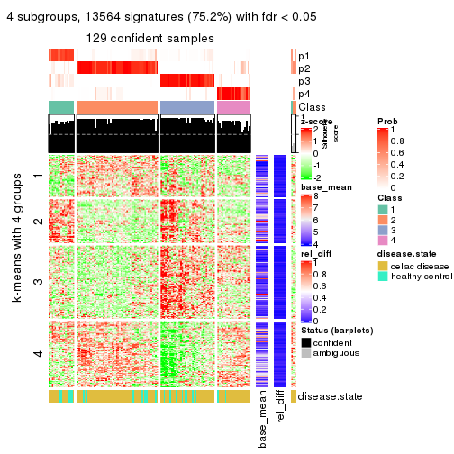</p>

</div>
<div id='tab-ATC-skmeans-get-signatures-4'>
<pre><code class="r">get_signatures(res, k = 5)
</code></pre>

<p></p>

</div>
<div id='tab-ATC-skmeans-get-signatures-5'>
<pre><code class="r">get_signatures(res, k = 6)
</code></pre>

<p></p>

</div>
</div>


Signature heatmaps where rows are not scaled:


<script>
$( function() {
	$( '#tabs-ATC-skmeans-get-signatures-no-scale' ).tabs();
} );
</script>
<div id='tabs-ATC-skmeans-get-signatures-no-scale'>
<ul>
<li><a href='#tab-ATC-skmeans-get-signatures-no-scale-1'>k = 2</a></li>
<li><a href='#tab-ATC-skmeans-get-signatures-no-scale-2'>k = 3</a></li>
<li><a href='#tab-ATC-skmeans-get-signatures-no-scale-3'>k = 4</a></li>
<li><a href='#tab-ATC-skmeans-get-signatures-no-scale-4'>k = 5</a></li>
<li><a href='#tab-ATC-skmeans-get-signatures-no-scale-5'>k = 6</a></li>
</ul>
<div id='tab-ATC-skmeans-get-signatures-no-scale-1'>
<pre><code class="r">get_signatures(res, k = 2, scale_rows = FALSE)
</code></pre>

<p></p>

</div>
<div id='tab-ATC-skmeans-get-signatures-no-scale-2'>
<pre><code class="r">get_signatures(res, k = 3, scale_rows = FALSE)
</code></pre>

<p></p>

</div>
<div id='tab-ATC-skmeans-get-signatures-no-scale-3'>
<pre><code class="r">get_signatures(res, k = 4, scale_rows = FALSE)
</code></pre>

<p></p>

</div>
<div id='tab-ATC-skmeans-get-signatures-no-scale-4'>
<pre><code class="r">get_signatures(res, k = 5, scale_rows = FALSE)
</code></pre>

<p></p>

</div>
<div id='tab-ATC-skmeans-get-signatures-no-scale-5'>
<pre><code class="r">get_signatures(res, k = 6, scale_rows = FALSE)
</code></pre>

<p></p>

</div>
</div>


Compare the overlap of signatures from different k:

```r
compare_signatures(res)
```


`get_signature()` returns a data frame invisibly. TO get the list of signatures, the function
call should be assigned to a variable explicitly. In following code, if `plot` argument is set
to `FALSE`, no heatmap is plotted while only the differential analysis is performed.

```r
# code only for demonstration
tb = get_signature(res, k = ..., plot = FALSE)
```

An example of the output of `tb` is:

```
#>   which_row         fdr    mean_1    mean_2 scaled_mean_1 scaled_mean_2 km
#> 1        38 0.042760348  8.373488  9.131774    -0.5533452     0.5164555  1
#> 2        40 0.018707592  7.106213  8.469186    -0.6173731     0.5762149  1
#> 3        55 0.019134737 10.221463 11.207825    -0.6159697     0.5749050  1
#> 4        59 0.006059896  5.921854  7.869574    -0.6899429     0.6439467  1
#> 5        60 0.018055526  8.928898 10.211722    -0.6204761     0.5791110  1
#> 6        98 0.009384629 15.714769 14.887706     0.6635654    -0.6193277  2
...
```

The columns in `tb` are:

1. `which_row`: row indices corresponding to the input matrix.
2. `fdr`: FDR for the differential test. 
3. `mean_x`: The mean value in group x.
4. `scaled_mean_x`: The mean value in group x after rows are scaled.
5. `km`: Row groups if k-means clustering is applied to rows.


UMAP plot which shows how samples are separated.


<script>
$( function() {
	$( '#tabs-ATC-skmeans-dimension-reduction' ).tabs();
} );
</script>
<div id='tabs-ATC-skmeans-dimension-reduction'>
<ul>
<li><a href='#tab-ATC-skmeans-dimension-reduction-1'>k = 2</a></li>
<li><a href='#tab-ATC-skmeans-dimension-reduction-2'>k = 3</a></li>
<li><a href='#tab-ATC-skmeans-dimension-reduction-3'>k = 4</a></li>
<li><a href='#tab-ATC-skmeans-dimension-reduction-4'>k = 5</a></li>
<li><a href='#tab-ATC-skmeans-dimension-reduction-5'>k = 6</a></li>
</ul>
<div id='tab-ATC-skmeans-dimension-reduction-1'>
<pre><code class="r">dimension_reduction(res, k = 2, method = &quot;UMAP&quot;)
</code></pre>

<p></p>

</div>
<div id='tab-ATC-skmeans-dimension-reduction-2'>
<pre><code class="r">dimension_reduction(res, k = 3, method = &quot;UMAP&quot;)
</code></pre>

<p></p>

</div>
<div id='tab-ATC-skmeans-dimension-reduction-3'>
<pre><code class="r">dimension_reduction(res, k = 4, method = &quot;UMAP&quot;)
</code></pre>

<p></p>

</div>
<div id='tab-ATC-skmeans-dimension-reduction-4'>
<pre><code class="r">dimension_reduction(res, k = 5, method = &quot;UMAP&quot;)
</code></pre>

<p></p>

</div>
<div id='tab-ATC-skmeans-dimension-reduction-5'>
<pre><code class="r">dimension_reduction(res, k = 6, method = &quot;UMAP&quot;)
</code></pre>

<p></p>

</div>
</div>


Following heatmap shows how subgroups are split when increasing `k`:

```r
collect_classes(res)
```


Test correlation between subgroups and known annotations. If the known
annotation is numeric, one-way ANOVA test is applied, and if the known
annotation is discrete, chi-squared contingency table test is applied.

```r
test_to_known_factors(res)
```

```
#>               n disease.state(p) k
#> ATC:skmeans 132            0.235 2
#> ATC:skmeans 128            0.230 3
#> ATC:skmeans 129            0.247 4
#> ATC:skmeans 118            0.245 5
#> ATC:skmeans  62            0.703 6
```


If matrix rows can be associated to genes, consider to use `GO_Enrichment(res,
...)` to perform function enrichment for the signature genes.


 

---------------------------------------------------


### ATC:pam**


The object with results only for a single top-value method and a single partition method 
can be extracted as:

```r
res = res_list["ATC", "pam"]
# you can also extract it by
# res = res_list["ATC:pam"]
```

A summary of `res` and all the functions that can be applied to it:

```r
res
```

```
#> A 'ConsensusPartition' object with k = 2, 3, 4, 5, 6.
#>   On a matrix with 18032 rows and 132 columns.
#>   Top rows (1000, 2000, 3000, 4000, 5000) are extracted by 'ATC' method.
#>   Subgroups are detected by 'pam' method.
#>   Performed in total 1250 partitions by row resampling.
#>   Best k for subgroups seems to be 2.
#> 
#> Following methods can be applied to this 'ConsensusPartition' object:
#>  [1] "cola_report"             "collect_classes"         "collect_plots"          
#>  [4] "collect_stats"           "colnames"                "compare_signatures"     
#>  [7] "consensus_heatmap"       "dimension_reduction"     "functional_enrichment"  
#> [10] "get_anno_col"            "get_anno"                "get_classes"            
#> [13] "get_consensus"           "get_matrix"              "get_membership"         
#> [16] "get_param"               "get_signatures"          "get_stats"              
#> [19] "is_best_k"               "is_stable_k"             "membership_heatmap"     
#> [22] "ncol"                    "nrow"                    "plot_ecdf"              
#> [25] "rownames"                "select_partition_number" "show"                   
#> [28] "suggest_best_k"          "test_to_known_factors"
```

`collect_plots()` function collects all the plots made from `res` for all `k` (number of partitions)
into one single page to provide an easy and fast comparison between different `k`.

```r
collect_plots(res)
```


The plots are:

- The first row: a plot of the ECDF (Empirical cumulative distribution
  function) curves of the consensus matrix for each `k` and the heatmap of
  predicted classes for each `k`.
- The second row: heatmaps of the consensus matrix for each `k`.
- The third row: heatmaps of the membership matrix for each `k`.
- The fouth row: heatmaps of the signatures for each `k`.

All the plots in panels can be made by individual functions and they are
plotted later in this section.

`select_partition_number()` produces several plots showing different
statistics for choosing "optimized" `k`. There are following statistics:

- ECDF curves of the consensus matrix for each `k`;
- 1-PAC. [The PAC
  score](https://en.wikipedia.org/wiki/Consensus_clustering#Over-interpretation_potential_of_consensus_clustering)
  measures the proportion of the ambiguous subgrouping.
- Mean silhouette score.
- Concordance. The mean probability of fiting the consensus class ids in all
  partitions.
- Area increased. Denote $A_k$ as the area under the ECDF curve for current
  `k`, the area increased is defined as $A_k - A_{k-1}$.
- Rand index. The percent of pairs of samples that are both in a same cluster
  or both are not in a same cluster in the partition of k and k-1.
- Jaccard index. The ratio of pairs of samples are both in a same cluster in
  the partition of k and k-1 and the pairs of samples are both in a same
  cluster in the partition k or k-1.

The detailed explanations of these statistics can be found in [the cola
vignette](http://bioconductor.org/packages/devel/bioc/vignettes/cola/inst/doc/cola.html#toc_13).

Generally speaking, lower PAC score, higher mean silhouette score or higher
concordance corresponds to better partition. Rand index and Jaccard index
measure how similar the current partition is compared to partition with `k-1`.
If they are too similar, we won't accept `k` is better than `k-1`.

```r
select_partition_number(res)
```


The numeric values for all these statistics can be obtained by `get_stats()`.

```r
get_stats(res)
```

```
#>   k 1-PAC mean_silhouette concordance area_increased  Rand Jaccard
#> 2 2 0.984           0.957       0.981         0.4018 0.607   0.607
#> 3 3 0.482           0.715       0.839         0.4403 0.670   0.516
#> 4 4 0.723           0.737       0.884         0.2230 0.723   0.444
#> 5 5 0.832           0.829       0.925         0.0991 0.885   0.636
#> 6 6 0.875           0.839       0.925         0.0332 0.937   0.742
```

`suggest_best_k()` suggests the best $k$ based on these statistics. The rules are as follows:

- All $k$ with Jaccard index larger than 0.95 are removed because the increase of
  the partition number does not provides enough extra information. If all $k$ are removed,
  the best $k$ is assigned by `NA`.
- For $k$ with 1-PAC larger than 0.9, the maximal $k$ is taken as the "best k". Other $k$ is called "optional k".
- If it does not fit the second rule. The $k$ with the highest vote of highest
  1-PAC, mean silhouette and concordance is taken as the "best k".

```r
suggest_best_k(res)
```

```
#> [1] 2
```


Following shows the table of the partitions (You need to click the **show/hide
code output** link to see it). The membership matrix (columns with name `p*`)
is inferred by
[`clue::cl_consensus()`](https://www.rdocumentation.org/link/cl_consensus?package=clue)
function with the `SE` method. Basically the value in the membership matrix
represents the probability to belong to a certain group. The finall class
label for an item is determined with the group with highest probability it
belongs to.

In `get_classes()` function, the entropy is calculated from the membership
matrix and the silhouette score is calculated from the consensus matrix.


<script>
$( function() {
	$( '#tabs-ATC-pam-get-classes' ).tabs();
} );
</script>
<div id='tabs-ATC-pam-get-classes'>
<ul>
<li><a href='#tab-ATC-pam-get-classes-1'>k = 2</a></li>
<li><a href='#tab-ATC-pam-get-classes-2'>k = 3</a></li>
<li><a href='#tab-ATC-pam-get-classes-3'>k = 4</a></li>
<li><a href='#tab-ATC-pam-get-classes-4'>k = 5</a></li>
<li><a href='#tab-ATC-pam-get-classes-5'>k = 6</a></li>
</ul>

<div id='tab-ATC-pam-get-classes-1'>
<p><a id='tab-ATC-pam-get-classes-1-a' style='color:#0366d6' href='#'>show/hide code output</a></p>
<pre><code class="r">cbind(get_classes(res, k = 2), get_membership(res, k = 2))
</code></pre>

<pre><code>#&gt;           class entropy silhouette    p1    p2
#&gt; GSM289470     2   0.000      0.979 0.000 1.000
#&gt; GSM289471     1   0.000      0.982 1.000 0.000
#&gt; GSM289472     2   0.000      0.979 0.000 1.000
#&gt; GSM289473     2   0.000      0.979 0.000 1.000
#&gt; GSM289474     2   0.000      0.979 0.000 1.000
#&gt; GSM289475     2   0.000      0.979 0.000 1.000
#&gt; GSM289476     1   0.000      0.982 1.000 0.000
#&gt; GSM289477     2   0.000      0.979 0.000 1.000
#&gt; GSM289478     2   0.000      0.979 0.000 1.000
#&gt; GSM289479     2   0.000      0.979 0.000 1.000
#&gt; GSM289480     2   0.000      0.979 0.000 1.000
#&gt; GSM289481     2   0.000      0.979 0.000 1.000
#&gt; GSM289482     2   0.000      0.979 0.000 1.000
#&gt; GSM289483     2   0.000      0.979 0.000 1.000
#&gt; GSM289484     2   0.000      0.979 0.000 1.000
#&gt; GSM289485     2   0.000      0.979 0.000 1.000
#&gt; GSM289486     2   0.000      0.979 0.000 1.000
#&gt; GSM289487     2   0.000      0.979 0.000 1.000
#&gt; GSM289488     2   0.000      0.979 0.000 1.000
#&gt; GSM289489     2   0.000      0.979 0.000 1.000
#&gt; GSM289490     2   0.000      0.979 0.000 1.000
#&gt; GSM289491     2   0.000      0.979 0.000 1.000
#&gt; GSM289492     1   0.118      0.976 0.984 0.016
#&gt; GSM289493     2   0.000      0.979 0.000 1.000
#&gt; GSM289494     1   0.000      0.982 1.000 0.000
#&gt; GSM289495     2   0.000      0.979 0.000 1.000
#&gt; GSM289496     2   0.000      0.979 0.000 1.000
#&gt; GSM289497     2   0.000      0.979 0.000 1.000
#&gt; GSM289498     2   0.963      0.386 0.388 0.612
#&gt; GSM289499     2   0.000      0.979 0.000 1.000
#&gt; GSM289500     1   0.000      0.982 1.000 0.000
#&gt; GSM289501     2   0.000      0.979 0.000 1.000
#&gt; GSM289502     2   0.000      0.979 0.000 1.000
#&gt; GSM289503     2   0.000      0.979 0.000 1.000
#&gt; GSM289504     2   0.000      0.979 0.000 1.000
#&gt; GSM289505     2   0.000      0.979 0.000 1.000
#&gt; GSM289506     2   0.000      0.979 0.000 1.000
#&gt; GSM289507     2   0.000      0.979 0.000 1.000
#&gt; GSM289508     2   0.278      0.937 0.048 0.952
#&gt; GSM289509     1   0.000      0.982 1.000 0.000
#&gt; GSM289510     2   0.000      0.979 0.000 1.000
#&gt; GSM289511     2   0.000      0.979 0.000 1.000
#&gt; GSM289512     1   0.000      0.982 1.000 0.000
#&gt; GSM289513     2   0.000      0.979 0.000 1.000
#&gt; GSM289514     2   0.311      0.928 0.056 0.944
#&gt; GSM289515     2   0.000      0.979 0.000 1.000
#&gt; GSM289516     2   0.000      0.979 0.000 1.000
#&gt; GSM289517     2   0.000      0.979 0.000 1.000
#&gt; GSM289518     2   0.000      0.979 0.000 1.000
#&gt; GSM289519     2   0.000      0.979 0.000 1.000
#&gt; GSM289520     2   0.000      0.979 0.000 1.000
#&gt; GSM289521     1   0.118      0.976 0.984 0.016
#&gt; GSM289522     2   0.311      0.928 0.056 0.944
#&gt; GSM289523     1   0.000      0.982 1.000 0.000
#&gt; GSM289524     2   0.000      0.979 0.000 1.000
#&gt; GSM289525     2   0.000      0.979 0.000 1.000
#&gt; GSM289526     1   0.295      0.943 0.948 0.052
#&gt; GSM289527     2   0.000      0.979 0.000 1.000
#&gt; GSM289528     2   0.000      0.979 0.000 1.000
#&gt; GSM289529     2   0.000      0.979 0.000 1.000
#&gt; GSM289530     1   0.000      0.982 1.000 0.000
#&gt; GSM289531     2   0.000      0.979 0.000 1.000
#&gt; GSM289532     1   0.000      0.982 1.000 0.000
#&gt; GSM289533     2   0.000      0.979 0.000 1.000
#&gt; GSM289534     1   0.000      0.982 1.000 0.000
#&gt; GSM289535     2   0.000      0.979 0.000 1.000
#&gt; GSM289536     1   0.000      0.982 1.000 0.000
#&gt; GSM289537     2   0.000      0.979 0.000 1.000
#&gt; GSM289538     2   0.000      0.979 0.000 1.000
#&gt; GSM289539     2   0.000      0.979 0.000 1.000
#&gt; GSM289540     1   0.118      0.976 0.984 0.016
#&gt; GSM289541     2   0.000      0.979 0.000 1.000
#&gt; GSM289542     2   0.000      0.979 0.000 1.000
#&gt; GSM289543     2   0.000      0.979 0.000 1.000
#&gt; GSM289544     1   0.118      0.976 0.984 0.016
#&gt; GSM289545     2   0.000      0.979 0.000 1.000
#&gt; GSM289546     2   0.000      0.979 0.000 1.000
#&gt; GSM289547     2   0.000      0.979 0.000 1.000
#&gt; GSM289548     1   0.781      0.706 0.768 0.232
#&gt; GSM289549     2   0.000      0.979 0.000 1.000
#&gt; GSM289550     1   0.118      0.976 0.984 0.016
#&gt; GSM289551     1   0.000      0.982 1.000 0.000
#&gt; GSM289552     1   0.000      0.982 1.000 0.000
#&gt; GSM289553     1   0.000      0.982 1.000 0.000
#&gt; GSM289554     2   0.000      0.979 0.000 1.000
#&gt; GSM289555     2   0.000      0.979 0.000 1.000
#&gt; GSM289556     1   0.644      0.810 0.836 0.164
#&gt; GSM289557     2   0.000      0.979 0.000 1.000
#&gt; GSM289558     2   0.000      0.979 0.000 1.000
#&gt; GSM289559     2   0.584      0.830 0.140 0.860
#&gt; GSM289560     2   0.000      0.979 0.000 1.000
#&gt; GSM289561     2   0.000      0.979 0.000 1.000
#&gt; GSM289562     1   0.118      0.976 0.984 0.016
#&gt; GSM289563     2   0.000      0.979 0.000 1.000
#&gt; GSM289564     1   0.118      0.976 0.984 0.016
#&gt; GSM289565     1   0.000      0.982 1.000 0.000
#&gt; GSM289566     1   0.118      0.976 0.984 0.016
#&gt; GSM289567     2   0.141      0.962 0.020 0.980
#&gt; GSM289568     2   0.000      0.979 0.000 1.000
#&gt; GSM289569     2   0.000      0.979 0.000 1.000
#&gt; GSM289570     2   0.939      0.463 0.356 0.644
#&gt; GSM289571     2   0.000      0.979 0.000 1.000
#&gt; GSM289572     2   0.000      0.979 0.000 1.000
#&gt; GSM289573     2   0.000      0.979 0.000 1.000
#&gt; GSM289574     2   0.000      0.979 0.000 1.000
#&gt; GSM289575     2   0.000      0.979 0.000 1.000
#&gt; GSM289576     2   0.000      0.979 0.000 1.000
#&gt; GSM289577     2   0.000      0.979 0.000 1.000
#&gt; GSM289578     2   0.814      0.670 0.252 0.748
#&gt; GSM289579     2   0.000      0.979 0.000 1.000
#&gt; GSM289580     1   0.000      0.982 1.000 0.000
#&gt; GSM289581     1   0.000      0.982 1.000 0.000
#&gt; GSM289582     2   0.141      0.962 0.020 0.980
#&gt; GSM289583     2   0.000      0.979 0.000 1.000
#&gt; GSM289584     2   0.000      0.979 0.000 1.000
#&gt; GSM289585     2   0.000      0.979 0.000 1.000
#&gt; GSM289586     2   0.000      0.979 0.000 1.000
#&gt; GSM289587     2   0.000      0.979 0.000 1.000
#&gt; GSM289588     1   0.000      0.982 1.000 0.000
#&gt; GSM289589     2   0.753      0.724 0.216 0.784
#&gt; GSM289590     1   0.000      0.982 1.000 0.000
#&gt; GSM289591     1   0.000      0.982 1.000 0.000
#&gt; GSM289592     2   0.000      0.979 0.000 1.000
#&gt; GSM289593     1   0.000      0.982 1.000 0.000
#&gt; GSM289594     2   0.000      0.979 0.000 1.000
#&gt; GSM289595     1   0.000      0.982 1.000 0.000
#&gt; GSM289596     2   0.000      0.979 0.000 1.000
#&gt; GSM289597     2   0.000      0.979 0.000 1.000
#&gt; GSM289598     1   0.118      0.976 0.984 0.016
#&gt; GSM289599     2   0.000      0.979 0.000 1.000
#&gt; GSM289600     2   0.958      0.404 0.380 0.620
#&gt; GSM289601     1   0.000      0.982 1.000 0.000
</code></pre>

<script>
$('#tab-ATC-pam-get-classes-1-a').parent().next().next().hide();
$('#tab-ATC-pam-get-classes-1-a').click(function(){
  $('#tab-ATC-pam-get-classes-1-a').parent().next().next().toggle();
  return(false);
});
</script>
</div>

<div id='tab-ATC-pam-get-classes-2'>
<p><a id='tab-ATC-pam-get-classes-2-a' style='color:#0366d6' href='#'>show/hide code output</a></p>
<pre><code class="r">cbind(get_classes(res, k = 3), get_membership(res, k = 3))
</code></pre>

<pre><code>#&gt;           class entropy silhouette    p1    p2    p3
#&gt; GSM289470     2  0.0000     0.8304 0.000 1.000 0.000
#&gt; GSM289471     3  0.0000     0.9892 0.000 0.000 1.000
#&gt; GSM289472     2  0.0000     0.8304 0.000 1.000 0.000
#&gt; GSM289473     1  0.6140     0.0577 0.596 0.404 0.000
#&gt; GSM289474     2  0.4931     0.5690 0.232 0.768 0.000
#&gt; GSM289475     2  0.0000     0.8304 0.000 1.000 0.000
#&gt; GSM289476     3  0.0000     0.9892 0.000 0.000 1.000
#&gt; GSM289477     2  0.0000     0.8304 0.000 1.000 0.000
#&gt; GSM289478     2  0.0000     0.8304 0.000 1.000 0.000
#&gt; GSM289479     2  0.1753     0.8317 0.048 0.952 0.000
#&gt; GSM289480     2  0.0000     0.8304 0.000 1.000 0.000
#&gt; GSM289481     2  0.4002     0.8292 0.160 0.840 0.000
#&gt; GSM289482     2  0.0000     0.8304 0.000 1.000 0.000
#&gt; GSM289483     2  0.0000     0.8304 0.000 1.000 0.000
#&gt; GSM289484     2  0.0000     0.8304 0.000 1.000 0.000
#&gt; GSM289485     2  0.0000     0.8304 0.000 1.000 0.000
#&gt; GSM289486     1  0.5254     0.6023 0.736 0.264 0.000
#&gt; GSM289487     2  0.0000     0.8304 0.000 1.000 0.000
#&gt; GSM289488     2  0.0000     0.8304 0.000 1.000 0.000
#&gt; GSM289489     1  0.6045     0.1495 0.620 0.380 0.000
#&gt; GSM289490     2  0.6215     0.4727 0.428 0.572 0.000
#&gt; GSM289491     2  0.4842     0.7935 0.224 0.776 0.000
#&gt; GSM289492     1  0.1643     0.7371 0.956 0.000 0.044
#&gt; GSM289493     2  0.4291     0.8266 0.180 0.820 0.000
#&gt; GSM289494     3  0.2711     0.8965 0.088 0.000 0.912
#&gt; GSM289495     2  0.4346     0.8242 0.184 0.816 0.000
#&gt; GSM289496     2  0.4291     0.8266 0.180 0.820 0.000
#&gt; GSM289497     2  0.0000     0.8304 0.000 1.000 0.000
#&gt; GSM289498     1  0.0000     0.7356 1.000 0.000 0.000
#&gt; GSM289499     2  0.4452     0.8194 0.192 0.808 0.000
#&gt; GSM289500     3  0.0000     0.9892 0.000 0.000 1.000
#&gt; GSM289501     2  0.4291     0.8266 0.180 0.820 0.000
#&gt; GSM289502     2  0.0000     0.8304 0.000 1.000 0.000
#&gt; GSM289503     2  0.0000     0.8304 0.000 1.000 0.000
#&gt; GSM289504     2  0.4291     0.8266 0.180 0.820 0.000
#&gt; GSM289505     2  0.4235     0.8273 0.176 0.824 0.000
#&gt; GSM289506     2  0.0592     0.8314 0.012 0.988 0.000
#&gt; GSM289507     2  0.0000     0.8304 0.000 1.000 0.000
#&gt; GSM289508     1  0.2625     0.6886 0.916 0.084 0.000
#&gt; GSM289509     1  0.4399     0.6894 0.812 0.000 0.188
#&gt; GSM289510     1  0.4555     0.5695 0.800 0.200 0.000
#&gt; GSM289511     2  0.5988     0.2585 0.368 0.632 0.000
#&gt; GSM289512     3  0.0000     0.9892 0.000 0.000 1.000
#&gt; GSM289513     2  0.6045     0.2207 0.380 0.620 0.000
#&gt; GSM289514     1  0.0000     0.7356 1.000 0.000 0.000
#&gt; GSM289515     1  0.5926     0.2313 0.644 0.356 0.000
#&gt; GSM289516     2  0.6180     0.0999 0.416 0.584 0.000
#&gt; GSM289517     1  0.5926     0.2313 0.644 0.356 0.000
#&gt; GSM289518     1  0.0592     0.7317 0.988 0.012 0.000
#&gt; GSM289519     1  0.0000     0.7356 1.000 0.000 0.000
#&gt; GSM289520     2  0.0000     0.8304 0.000 1.000 0.000
#&gt; GSM289521     1  0.4291     0.6971 0.820 0.000 0.180
#&gt; GSM289522     1  0.0000     0.7356 1.000 0.000 0.000
#&gt; GSM289523     3  0.0000     0.9892 0.000 0.000 1.000
#&gt; GSM289524     1  0.5926     0.2313 0.644 0.356 0.000
#&gt; GSM289525     1  0.5926     0.2313 0.644 0.356 0.000
#&gt; GSM289526     1  0.4291     0.6971 0.820 0.000 0.180
#&gt; GSM289527     1  0.6026     0.2167 0.624 0.376 0.000
#&gt; GSM289528     2  0.0000     0.8304 0.000 1.000 0.000
#&gt; GSM289529     2  0.6062     0.5764 0.384 0.616 0.000
#&gt; GSM289530     1  0.4291     0.6971 0.820 0.000 0.180
#&gt; GSM289531     2  0.4887     0.7904 0.228 0.772 0.000
#&gt; GSM289532     3  0.0892     0.9727 0.020 0.000 0.980
#&gt; GSM289533     1  0.5948     0.2190 0.640 0.360 0.000
#&gt; GSM289534     1  0.6295     0.1153 0.528 0.000 0.472
#&gt; GSM289535     1  0.4702     0.5529 0.788 0.212 0.000
#&gt; GSM289536     3  0.0000     0.9892 0.000 0.000 1.000
#&gt; GSM289537     2  0.4291     0.8266 0.180 0.820 0.000
#&gt; GSM289538     2  0.4291     0.8266 0.180 0.820 0.000
#&gt; GSM289539     2  0.0000     0.8304 0.000 1.000 0.000
#&gt; GSM289540     1  0.1411     0.7373 0.964 0.000 0.036
#&gt; GSM289541     2  0.4291     0.8266 0.180 0.820 0.000
#&gt; GSM289542     2  0.5948     0.6091 0.360 0.640 0.000
#&gt; GSM289543     2  0.6026     0.5799 0.376 0.624 0.000
#&gt; GSM289544     1  0.4291     0.6971 0.820 0.000 0.180
#&gt; GSM289545     2  0.0237     0.8308 0.004 0.996 0.000
#&gt; GSM289546     2  0.0000     0.8304 0.000 1.000 0.000
#&gt; GSM289547     2  0.4291     0.8266 0.180 0.820 0.000
#&gt; GSM289548     1  0.4291     0.6971 0.820 0.000 0.180
#&gt; GSM289549     1  0.5327     0.6133 0.728 0.272 0.000
#&gt; GSM289550     1  0.4291     0.6971 0.820 0.000 0.180
#&gt; GSM289551     3  0.0000     0.9892 0.000 0.000 1.000
#&gt; GSM289552     1  0.4291     0.6971 0.820 0.000 0.180
#&gt; GSM289553     1  0.4291     0.6971 0.820 0.000 0.180
#&gt; GSM289554     2  0.4504     0.8167 0.196 0.804 0.000
#&gt; GSM289555     2  0.4291     0.8266 0.180 0.820 0.000
#&gt; GSM289556     1  0.4291     0.6971 0.820 0.000 0.180
#&gt; GSM289557     2  0.0000     0.8304 0.000 1.000 0.000
#&gt; GSM289558     2  0.4291     0.8266 0.180 0.820 0.000
#&gt; GSM289559     1  0.5042     0.7072 0.836 0.104 0.060
#&gt; GSM289560     2  0.4291     0.8266 0.180 0.820 0.000
#&gt; GSM289561     2  0.4291     0.8266 0.180 0.820 0.000
#&gt; GSM289562     1  0.4291     0.6971 0.820 0.000 0.180
#&gt; GSM289563     2  0.5138     0.5349 0.252 0.748 0.000
#&gt; GSM289564     1  0.0000     0.7356 1.000 0.000 0.000
#&gt; GSM289565     1  0.4291     0.6971 0.820 0.000 0.180
#&gt; GSM289566     1  0.4291     0.6971 0.820 0.000 0.180
#&gt; GSM289567     1  0.0000     0.7356 1.000 0.000 0.000
#&gt; GSM289568     2  0.3192     0.7439 0.112 0.888 0.000
#&gt; GSM289569     2  0.3412     0.7303 0.124 0.876 0.000
#&gt; GSM289570     1  0.0000     0.7356 1.000 0.000 0.000
#&gt; GSM289571     2  0.4291     0.8266 0.180 0.820 0.000
#&gt; GSM289572     2  0.4291     0.8266 0.180 0.820 0.000
#&gt; GSM289573     2  0.4291     0.8266 0.180 0.820 0.000
#&gt; GSM289574     2  0.0000     0.8304 0.000 1.000 0.000
#&gt; GSM289575     2  0.6079     0.5569 0.388 0.612 0.000
#&gt; GSM289576     2  0.4291     0.8266 0.180 0.820 0.000
#&gt; GSM289577     1  0.5431     0.4129 0.716 0.284 0.000
#&gt; GSM289578     1  0.0000     0.7356 1.000 0.000 0.000
#&gt; GSM289579     2  0.6280     0.3892 0.460 0.540 0.000
#&gt; GSM289580     3  0.0000     0.9892 0.000 0.000 1.000
#&gt; GSM289581     1  0.4291     0.6971 0.820 0.000 0.180
#&gt; GSM289582     1  0.0000     0.7356 1.000 0.000 0.000
#&gt; GSM289583     2  0.0000     0.8304 0.000 1.000 0.000
#&gt; GSM289584     2  0.4291     0.8266 0.180 0.820 0.000
#&gt; GSM289585     2  0.0000     0.8304 0.000 1.000 0.000
#&gt; GSM289586     1  0.5058     0.6289 0.756 0.244 0.000
#&gt; GSM289587     2  0.0000     0.8304 0.000 1.000 0.000
#&gt; GSM289588     3  0.0000     0.9892 0.000 0.000 1.000
#&gt; GSM289589     1  0.2066     0.7357 0.940 0.000 0.060
#&gt; GSM289590     1  0.4291     0.6971 0.820 0.000 0.180
#&gt; GSM289591     1  0.4291     0.6971 0.820 0.000 0.180
#&gt; GSM289592     2  0.4291     0.8266 0.180 0.820 0.000
#&gt; GSM289593     3  0.0000     0.9892 0.000 0.000 1.000
#&gt; GSM289594     2  0.4399     0.8219 0.188 0.812 0.000
#&gt; GSM289595     1  0.4291     0.6971 0.820 0.000 0.180
#&gt; GSM289596     2  0.4291     0.8266 0.180 0.820 0.000
#&gt; GSM289597     1  0.5926     0.2313 0.644 0.356 0.000
#&gt; GSM289598     1  0.2066     0.7357 0.940 0.000 0.060
#&gt; GSM289599     2  0.5988     0.5951 0.368 0.632 0.000
#&gt; GSM289600     1  0.2066     0.7357 0.940 0.000 0.060
#&gt; GSM289601     1  0.4291     0.6971 0.820 0.000 0.180
</code></pre>

<script>
$('#tab-ATC-pam-get-classes-2-a').parent().next().next().hide();
$('#tab-ATC-pam-get-classes-2-a').click(function(){
  $('#tab-ATC-pam-get-classes-2-a').parent().next().next().toggle();
  return(false);
});
</script>
</div>

<div id='tab-ATC-pam-get-classes-3'>
<p><a id='tab-ATC-pam-get-classes-3-a' style='color:#0366d6' href='#'>show/hide code output</a></p>
<pre><code class="r">cbind(get_classes(res, k = 4), get_membership(res, k = 4))
</code></pre>

<pre><code>#&gt;           class entropy silhouette    p1    p2    p3    p4
#&gt; GSM289470     4  0.0000     0.9041 0.000 0.000 0.000 1.000
#&gt; GSM289471     3  0.0000     0.9996 0.000 0.000 1.000 0.000
#&gt; GSM289472     4  0.0000     0.9041 0.000 0.000 0.000 1.000
#&gt; GSM289473     2  0.0188     0.8172 0.000 0.996 0.000 0.004
#&gt; GSM289474     2  0.4994     0.0241 0.000 0.520 0.000 0.480
#&gt; GSM289475     4  0.0000     0.9041 0.000 0.000 0.000 1.000
#&gt; GSM289476     3  0.0000     0.9996 0.000 0.000 1.000 0.000
#&gt; GSM289477     4  0.1302     0.8717 0.000 0.044 0.000 0.956
#&gt; GSM289478     4  0.0000     0.9041 0.000 0.000 0.000 1.000
#&gt; GSM289479     2  0.4585     0.4866 0.000 0.668 0.000 0.332
#&gt; GSM289480     4  0.1211     0.8748 0.000 0.040 0.000 0.960
#&gt; GSM289481     2  0.2469     0.8041 0.000 0.892 0.000 0.108
#&gt; GSM289482     4  0.0000     0.9041 0.000 0.000 0.000 1.000
#&gt; GSM289483     4  0.0000     0.9041 0.000 0.000 0.000 1.000
#&gt; GSM289484     4  0.0000     0.9041 0.000 0.000 0.000 1.000
#&gt; GSM289485     4  0.0000     0.9041 0.000 0.000 0.000 1.000
#&gt; GSM289486     1  0.4428     0.5063 0.720 0.004 0.000 0.276
#&gt; GSM289487     4  0.0000     0.9041 0.000 0.000 0.000 1.000
#&gt; GSM289488     4  0.0000     0.9041 0.000 0.000 0.000 1.000
#&gt; GSM289489     2  0.0376     0.8174 0.004 0.992 0.000 0.004
#&gt; GSM289490     2  0.0817     0.8287 0.000 0.976 0.000 0.024
#&gt; GSM289491     2  0.1389     0.8351 0.000 0.952 0.000 0.048
#&gt; GSM289492     1  0.5597     0.0705 0.516 0.464 0.000 0.020
#&gt; GSM289493     2  0.1389     0.8351 0.000 0.952 0.000 0.048
#&gt; GSM289494     3  0.0000     0.9996 0.000 0.000 1.000 0.000
#&gt; GSM289495     2  0.1389     0.8351 0.000 0.952 0.000 0.048
#&gt; GSM289496     2  0.1389     0.8351 0.000 0.952 0.000 0.048
#&gt; GSM289497     4  0.0000     0.9041 0.000 0.000 0.000 1.000
#&gt; GSM289498     2  0.4072     0.5552 0.252 0.748 0.000 0.000
#&gt; GSM289499     2  0.1389     0.8351 0.000 0.952 0.000 0.048
#&gt; GSM289500     3  0.0000     0.9996 0.000 0.000 1.000 0.000
#&gt; GSM289501     2  0.1389     0.8351 0.000 0.952 0.000 0.048
#&gt; GSM289502     4  0.0000     0.9041 0.000 0.000 0.000 1.000
#&gt; GSM289503     4  0.0000     0.9041 0.000 0.000 0.000 1.000
#&gt; GSM289504     2  0.1389     0.8351 0.000 0.952 0.000 0.048
#&gt; GSM289505     2  0.3356     0.7454 0.000 0.824 0.000 0.176
#&gt; GSM289506     4  0.0707     0.8885 0.000 0.020 0.000 0.980
#&gt; GSM289507     4  0.0000     0.9041 0.000 0.000 0.000 1.000
#&gt; GSM289508     2  0.4313     0.5590 0.260 0.736 0.000 0.004
#&gt; GSM289509     1  0.0000     0.8254 1.000 0.000 0.000 0.000
#&gt; GSM289510     1  0.5000     0.0588 0.504 0.496 0.000 0.000
#&gt; GSM289511     4  0.6690     0.2543 0.352 0.100 0.000 0.548
#&gt; GSM289512     3  0.0000     0.9996 0.000 0.000 1.000 0.000
#&gt; GSM289513     4  0.7619     0.0952 0.356 0.208 0.000 0.436
#&gt; GSM289514     1  0.1474     0.8146 0.948 0.052 0.000 0.000
#&gt; GSM289515     2  0.4697     0.3645 0.356 0.644 0.000 0.000
#&gt; GSM289516     2  0.7332     0.1128 0.356 0.480 0.000 0.164
#&gt; GSM289517     2  0.4697     0.3645 0.356 0.644 0.000 0.000
#&gt; GSM289518     1  0.4967     0.2056 0.548 0.452 0.000 0.000
#&gt; GSM289519     1  0.4643     0.4782 0.656 0.344 0.000 0.000
#&gt; GSM289520     4  0.1389     0.8728 0.000 0.048 0.000 0.952
#&gt; GSM289521     1  0.1302     0.8174 0.956 0.044 0.000 0.000
#&gt; GSM289522     1  0.3688     0.6864 0.792 0.208 0.000 0.000
#&gt; GSM289523     3  0.0000     0.9996 0.000 0.000 1.000 0.000
#&gt; GSM289524     2  0.4697     0.3645 0.356 0.644 0.000 0.000
#&gt; GSM289525     2  0.4697     0.3645 0.356 0.644 0.000 0.000
#&gt; GSM289526     1  0.1118     0.8199 0.964 0.036 0.000 0.000
#&gt; GSM289527     2  0.4697     0.3645 0.356 0.644 0.000 0.000
#&gt; GSM289528     4  0.0000     0.9041 0.000 0.000 0.000 1.000
#&gt; GSM289529     2  0.0336     0.8197 0.000 0.992 0.000 0.008
#&gt; GSM289530     1  0.1302     0.8174 0.956 0.044 0.000 0.000
#&gt; GSM289531     2  0.0921     0.8296 0.000 0.972 0.000 0.028
#&gt; GSM289532     3  0.0188     0.9959 0.000 0.004 0.996 0.000
#&gt; GSM289533     2  0.4872     0.3691 0.356 0.640 0.000 0.004
#&gt; GSM289534     1  0.4428     0.4865 0.720 0.004 0.276 0.000
#&gt; GSM289535     2  0.0707     0.8270 0.000 0.980 0.000 0.020
#&gt; GSM289536     3  0.0000     0.9996 0.000 0.000 1.000 0.000
#&gt; GSM289537     2  0.1389     0.8351 0.000 0.952 0.000 0.048
#&gt; GSM289538     2  0.1389     0.8351 0.000 0.952 0.000 0.048
#&gt; GSM289539     4  0.0000     0.9041 0.000 0.000 0.000 1.000
#&gt; GSM289540     2  0.4776     0.2700 0.376 0.624 0.000 0.000
#&gt; GSM289541     2  0.1302     0.8348 0.000 0.956 0.000 0.044
#&gt; GSM289542     2  0.1302     0.8348 0.000 0.956 0.000 0.044
#&gt; GSM289543     2  0.1302     0.8348 0.000 0.956 0.000 0.044
#&gt; GSM289544     1  0.0921     0.8228 0.972 0.028 0.000 0.000
#&gt; GSM289545     4  0.4585     0.4570 0.000 0.332 0.000 0.668
#&gt; GSM289546     4  0.0000     0.9041 0.000 0.000 0.000 1.000
#&gt; GSM289547     2  0.4804     0.4158 0.000 0.616 0.000 0.384
#&gt; GSM289548     1  0.0000     0.8254 1.000 0.000 0.000 0.000
#&gt; GSM289549     1  0.0000     0.8254 1.000 0.000 0.000 0.000
#&gt; GSM289550     1  0.0000     0.8254 1.000 0.000 0.000 0.000
#&gt; GSM289551     3  0.0000     0.9996 0.000 0.000 1.000 0.000
#&gt; GSM289552     1  0.0188     0.8244 0.996 0.004 0.000 0.000
#&gt; GSM289553     1  0.0000     0.8254 1.000 0.000 0.000 0.000
#&gt; GSM289554     2  0.1302     0.8348 0.000 0.956 0.000 0.044
#&gt; GSM289555     2  0.1389     0.8351 0.000 0.952 0.000 0.048
#&gt; GSM289556     1  0.0000     0.8254 1.000 0.000 0.000 0.000
#&gt; GSM289557     4  0.0000     0.9041 0.000 0.000 0.000 1.000
#&gt; GSM289558     2  0.1302     0.8348 0.000 0.956 0.000 0.044
#&gt; GSM289559     1  0.3306     0.6836 0.840 0.004 0.000 0.156
#&gt; GSM289560     2  0.1389     0.8351 0.000 0.952 0.000 0.048
#&gt; GSM289561     2  0.3444     0.7378 0.000 0.816 0.000 0.184
#&gt; GSM289562     1  0.0000     0.8254 1.000 0.000 0.000 0.000
#&gt; GSM289563     1  0.4713     0.3259 0.640 0.000 0.000 0.360
#&gt; GSM289564     2  0.4222     0.5101 0.272 0.728 0.000 0.000
#&gt; GSM289565     1  0.0188     0.8244 0.996 0.004 0.000 0.000
#&gt; GSM289566     1  0.0188     0.8253 0.996 0.004 0.000 0.000
#&gt; GSM289567     1  0.4643     0.4782 0.656 0.344 0.000 0.000
#&gt; GSM289568     4  0.0707     0.8842 0.000 0.020 0.000 0.980
#&gt; GSM289569     4  0.3726     0.7043 0.000 0.212 0.000 0.788
#&gt; GSM289570     1  0.4643     0.4782 0.656 0.344 0.000 0.000
#&gt; GSM289571     2  0.4907     0.3242 0.000 0.580 0.000 0.420
#&gt; GSM289572     2  0.1302     0.8348 0.000 0.956 0.000 0.044
#&gt; GSM289573     2  0.1389     0.8351 0.000 0.952 0.000 0.048
#&gt; GSM289574     4  0.0000     0.9041 0.000 0.000 0.000 1.000
#&gt; GSM289575     2  0.0592     0.8251 0.000 0.984 0.000 0.016
#&gt; GSM289576     2  0.1389     0.8351 0.000 0.952 0.000 0.048
#&gt; GSM289577     2  0.0707     0.8270 0.000 0.980 0.000 0.020
#&gt; GSM289578     2  0.2469     0.7364 0.108 0.892 0.000 0.000
#&gt; GSM289579     2  0.0469     0.8230 0.000 0.988 0.000 0.012
#&gt; GSM289580     3  0.0000     0.9996 0.000 0.000 1.000 0.000
#&gt; GSM289581     1  0.0817     0.8223 0.976 0.024 0.000 0.000
#&gt; GSM289582     1  0.4877     0.3294 0.592 0.408 0.000 0.000
#&gt; GSM289583     4  0.0000     0.9041 0.000 0.000 0.000 1.000
#&gt; GSM289584     2  0.1389     0.8351 0.000 0.952 0.000 0.048
#&gt; GSM289585     4  0.0000     0.9041 0.000 0.000 0.000 1.000
#&gt; GSM289586     1  0.1302     0.8174 0.956 0.044 0.000 0.000
#&gt; GSM289587     4  0.5732     0.5443 0.264 0.064 0.000 0.672
#&gt; GSM289588     3  0.0000     0.9996 0.000 0.000 1.000 0.000
#&gt; GSM289589     1  0.0188     0.8244 0.996 0.004 0.000 0.000
#&gt; GSM289590     1  0.0000     0.8254 1.000 0.000 0.000 0.000
#&gt; GSM289591     1  0.0188     0.8244 0.996 0.004 0.000 0.000
#&gt; GSM289592     4  0.4776     0.3112 0.000 0.376 0.000 0.624
#&gt; GSM289593     3  0.0000     0.9996 0.000 0.000 1.000 0.000
#&gt; GSM289594     2  0.1302     0.8348 0.000 0.956 0.000 0.044
#&gt; GSM289595     1  0.0000     0.8254 1.000 0.000 0.000 0.000
#&gt; GSM289596     2  0.3975     0.6733 0.000 0.760 0.000 0.240
#&gt; GSM289597     2  0.4697     0.3645 0.356 0.644 0.000 0.000
#&gt; GSM289598     1  0.4382     0.5127 0.704 0.296 0.000 0.000
#&gt; GSM289599     2  0.1211     0.8340 0.000 0.960 0.000 0.040
#&gt; GSM289600     1  0.0000     0.8254 1.000 0.000 0.000 0.000
#&gt; GSM289601     1  0.1118     0.8199 0.964 0.036 0.000 0.000
</code></pre>

<script>
$('#tab-ATC-pam-get-classes-3-a').parent().next().next().hide();
$('#tab-ATC-pam-get-classes-3-a').click(function(){
  $('#tab-ATC-pam-get-classes-3-a').parent().next().next().toggle();
  return(false);
});
</script>
</div>

<div id='tab-ATC-pam-get-classes-4'>
<p><a id='tab-ATC-pam-get-classes-4-a' style='color:#0366d6' href='#'>show/hide code output</a></p>
<pre><code class="r">cbind(get_classes(res, k = 5), get_membership(res, k = 5))
</code></pre>

<pre><code>#&gt;           class entropy silhouette    p1    p2 p3    p4    p5
#&gt; GSM289470     5  0.0290      0.911 0.000 0.008  0 0.000 0.992
#&gt; GSM289471     3  0.0000      1.000 0.000 0.000  1 0.000 0.000
#&gt; GSM289472     5  0.0162      0.911 0.000 0.004  0 0.000 0.996
#&gt; GSM289473     2  0.4060      0.527 0.000 0.640  0 0.360 0.000
#&gt; GSM289474     5  0.6647      0.259 0.000 0.288  0 0.264 0.448
#&gt; GSM289475     5  0.0162      0.911 0.000 0.004  0 0.000 0.996
#&gt; GSM289476     3  0.0000      1.000 0.000 0.000  1 0.000 0.000
#&gt; GSM289477     5  0.1410      0.873 0.000 0.060  0 0.000 0.940
#&gt; GSM289478     5  0.0000      0.911 0.000 0.000  0 0.000 1.000
#&gt; GSM289479     2  0.6687      0.128 0.000 0.432  0 0.304 0.264
#&gt; GSM289480     5  0.1341      0.876 0.000 0.056  0 0.000 0.944
#&gt; GSM289481     2  0.1608      0.836 0.000 0.928  0 0.000 0.072
#&gt; GSM289482     5  0.0290      0.911 0.000 0.008  0 0.000 0.992
#&gt; GSM289483     5  0.0290      0.911 0.000 0.008  0 0.000 0.992
#&gt; GSM289484     5  0.0290      0.911 0.000 0.008  0 0.000 0.992
#&gt; GSM289485     5  0.0162      0.911 0.000 0.004  0 0.000 0.996
#&gt; GSM289486     1  0.0000      0.940 1.000 0.000  0 0.000 0.000
#&gt; GSM289487     5  0.0000      0.911 0.000 0.000  0 0.000 1.000
#&gt; GSM289488     5  0.0290      0.911 0.000 0.008  0 0.000 0.992
#&gt; GSM289489     2  0.0963      0.868 0.000 0.964  0 0.036 0.000
#&gt; GSM289490     2  0.0162      0.881 0.000 0.996  0 0.004 0.000
#&gt; GSM289491     2  0.0000      0.883 0.000 1.000  0 0.000 0.000
#&gt; GSM289492     2  0.4757      0.381 0.380 0.596  0 0.024 0.000
#&gt; GSM289493     2  0.0000      0.883 0.000 1.000  0 0.000 0.000
#&gt; GSM289494     3  0.0000      1.000 0.000 0.000  1 0.000 0.000
#&gt; GSM289495     2  0.0000      0.883 0.000 1.000  0 0.000 0.000
#&gt; GSM289496     2  0.0000      0.883 0.000 1.000  0 0.000 0.000
#&gt; GSM289497     5  0.0000      0.911 0.000 0.000  0 0.000 1.000
#&gt; GSM289498     2  0.3492      0.727 0.188 0.796  0 0.016 0.000
#&gt; GSM289499     2  0.0000      0.883 0.000 1.000  0 0.000 0.000
#&gt; GSM289500     3  0.0000      1.000 0.000 0.000  1 0.000 0.000
#&gt; GSM289501     2  0.0000      0.883 0.000 1.000  0 0.000 0.000
#&gt; GSM289502     5  0.0000      0.911 0.000 0.000  0 0.000 1.000
#&gt; GSM289503     5  0.0000      0.911 0.000 0.000  0 0.000 1.000
#&gt; GSM289504     2  0.0000      0.883 0.000 1.000  0 0.000 0.000
#&gt; GSM289505     2  0.2516      0.796 0.000 0.860  0 0.000 0.140
#&gt; GSM289506     5  0.0609      0.898 0.000 0.020  0 0.000 0.980
#&gt; GSM289507     5  0.0000      0.911 0.000 0.000  0 0.000 1.000
#&gt; GSM289508     2  0.2915      0.806 0.024 0.860  0 0.116 0.000
#&gt; GSM289509     1  0.0000      0.940 1.000 0.000  0 0.000 0.000
#&gt; GSM289510     4  0.0000      0.907 0.000 0.000  0 1.000 0.000
#&gt; GSM289511     4  0.0671      0.892 0.000 0.004  0 0.980 0.016
#&gt; GSM289512     3  0.0000      1.000 0.000 0.000  1 0.000 0.000
#&gt; GSM289513     4  0.6049      0.348 0.000 0.164  0 0.564 0.272
#&gt; GSM289514     4  0.0000      0.907 0.000 0.000  0 1.000 0.000
#&gt; GSM289515     4  0.0000      0.907 0.000 0.000  0 1.000 0.000
#&gt; GSM289516     4  0.0290      0.901 0.000 0.008  0 0.992 0.000
#&gt; GSM289517     4  0.0000      0.907 0.000 0.000  0 1.000 0.000
#&gt; GSM289518     4  0.0000      0.907 0.000 0.000  0 1.000 0.000
#&gt; GSM289519     4  0.0000      0.907 0.000 0.000  0 1.000 0.000
#&gt; GSM289520     5  0.3477      0.778 0.000 0.040  0 0.136 0.824
#&gt; GSM289521     4  0.2074      0.822 0.104 0.000  0 0.896 0.000
#&gt; GSM289522     4  0.0000      0.907 0.000 0.000  0 1.000 0.000
#&gt; GSM289523     3  0.0000      1.000 0.000 0.000  1 0.000 0.000
#&gt; GSM289524     4  0.0000      0.907 0.000 0.000  0 1.000 0.000
#&gt; GSM289525     4  0.0000      0.907 0.000 0.000  0 1.000 0.000
#&gt; GSM289526     4  0.4287      0.116 0.460 0.000  0 0.540 0.000
#&gt; GSM289527     4  0.0000      0.907 0.000 0.000  0 1.000 0.000
#&gt; GSM289528     5  0.0000      0.911 0.000 0.000  0 0.000 1.000
#&gt; GSM289529     2  0.3774      0.573 0.000 0.704  0 0.296 0.000
#&gt; GSM289530     4  0.3039      0.717 0.192 0.000  0 0.808 0.000
#&gt; GSM289531     2  0.0000      0.883 0.000 1.000  0 0.000 0.000
#&gt; GSM289532     3  0.0000      1.000 0.000 0.000  1 0.000 0.000
#&gt; GSM289533     2  0.4210      0.388 0.000 0.588  0 0.412 0.000
#&gt; GSM289534     1  0.0000      0.940 1.000 0.000  0 0.000 0.000
#&gt; GSM289535     2  0.2179      0.821 0.000 0.888  0 0.112 0.000
#&gt; GSM289536     3  0.0000      1.000 0.000 0.000  1 0.000 0.000
#&gt; GSM289537     2  0.0162      0.882 0.000 0.996  0 0.000 0.004
#&gt; GSM289538     2  0.0162      0.882 0.000 0.996  0 0.000 0.004
#&gt; GSM289539     5  0.0000      0.911 0.000 0.000  0 0.000 1.000
#&gt; GSM289540     2  0.5345      0.314 0.056 0.540  0 0.404 0.000
#&gt; GSM289541     2  0.0000      0.883 0.000 1.000  0 0.000 0.000
#&gt; GSM289542     2  0.0000      0.883 0.000 1.000  0 0.000 0.000
#&gt; GSM289543     2  0.0000      0.883 0.000 1.000  0 0.000 0.000
#&gt; GSM289544     1  0.4171      0.327 0.604 0.000  0 0.396 0.000
#&gt; GSM289545     5  0.3999      0.522 0.000 0.344  0 0.000 0.656
#&gt; GSM289546     5  0.0000      0.911 0.000 0.000  0 0.000 1.000
#&gt; GSM289547     2  0.4045      0.495 0.000 0.644  0 0.000 0.356
#&gt; GSM289548     1  0.0000      0.940 1.000 0.000  0 0.000 0.000
#&gt; GSM289549     1  0.0000      0.940 1.000 0.000  0 0.000 0.000
#&gt; GSM289550     1  0.0000      0.940 1.000 0.000  0 0.000 0.000
#&gt; GSM289551     3  0.0000      1.000 0.000 0.000  1 0.000 0.000
#&gt; GSM289552     1  0.0000      0.940 1.000 0.000  0 0.000 0.000
#&gt; GSM289553     1  0.0000      0.940 1.000 0.000  0 0.000 0.000
#&gt; GSM289554     2  0.0000      0.883 0.000 1.000  0 0.000 0.000
#&gt; GSM289555     2  0.0000      0.883 0.000 1.000  0 0.000 0.000
#&gt; GSM289556     1  0.0000      0.940 1.000 0.000  0 0.000 0.000
#&gt; GSM289557     5  0.0000      0.911 0.000 0.000  0 0.000 1.000
#&gt; GSM289558     2  0.0000      0.883 0.000 1.000  0 0.000 0.000
#&gt; GSM289559     1  0.0000      0.940 1.000 0.000  0 0.000 0.000
#&gt; GSM289560     2  0.0162      0.882 0.000 0.996  0 0.000 0.004
#&gt; GSM289561     2  0.2605      0.790 0.000 0.852  0 0.000 0.148
#&gt; GSM289562     1  0.0000      0.940 1.000 0.000  0 0.000 0.000
#&gt; GSM289563     1  0.1413      0.905 0.956 0.012  0 0.020 0.012
#&gt; GSM289564     4  0.2813      0.715 0.000 0.168  0 0.832 0.000
#&gt; GSM289565     1  0.0000      0.940 1.000 0.000  0 0.000 0.000
#&gt; GSM289566     1  0.2020      0.853 0.900 0.000  0 0.100 0.000
#&gt; GSM289567     4  0.0000      0.907 0.000 0.000  0 1.000 0.000
#&gt; GSM289568     5  0.0290      0.911 0.000 0.008  0 0.000 0.992
#&gt; GSM289569     5  0.6144      0.412 0.000 0.172  0 0.280 0.548
#&gt; GSM289570     4  0.0000      0.907 0.000 0.000  0 1.000 0.000
#&gt; GSM289571     2  0.4161      0.408 0.000 0.608  0 0.000 0.392
#&gt; GSM289572     2  0.0000      0.883 0.000 1.000  0 0.000 0.000
#&gt; GSM289573     2  0.0000      0.883 0.000 1.000  0 0.000 0.000
#&gt; GSM289574     5  0.0000      0.911 0.000 0.000  0 0.000 1.000
#&gt; GSM289575     2  0.0290      0.880 0.000 0.992  0 0.008 0.000
#&gt; GSM289576     2  0.0000      0.883 0.000 1.000  0 0.000 0.000
#&gt; GSM289577     2  0.1544      0.852 0.000 0.932  0 0.068 0.000
#&gt; GSM289578     2  0.3932      0.571 0.000 0.672  0 0.328 0.000
#&gt; GSM289579     2  0.0609      0.876 0.000 0.980  0 0.020 0.000
#&gt; GSM289580     3  0.0000      1.000 0.000 0.000  1 0.000 0.000
#&gt; GSM289581     1  0.3452      0.658 0.756 0.000  0 0.244 0.000
#&gt; GSM289582     4  0.0000      0.907 0.000 0.000  0 1.000 0.000
#&gt; GSM289583     5  0.0000      0.911 0.000 0.000  0 0.000 1.000
#&gt; GSM289584     2  0.0000      0.883 0.000 1.000  0 0.000 0.000
#&gt; GSM289585     5  0.0000      0.911 0.000 0.000  0 0.000 1.000
#&gt; GSM289586     4  0.0000      0.907 0.000 0.000  0 1.000 0.000
#&gt; GSM289587     5  0.3630      0.716 0.016 0.204  0 0.000 0.780
#&gt; GSM289588     3  0.0000      1.000 0.000 0.000  1 0.000 0.000
#&gt; GSM289589     1  0.0000      0.940 1.000 0.000  0 0.000 0.000
#&gt; GSM289590     1  0.0000      0.940 1.000 0.000  0 0.000 0.000
#&gt; GSM289591     1  0.0000      0.940 1.000 0.000  0 0.000 0.000
#&gt; GSM289592     5  0.4192      0.216 0.000 0.404  0 0.000 0.596
#&gt; GSM289593     3  0.0000      1.000 0.000 0.000  1 0.000 0.000
#&gt; GSM289594     2  0.0000      0.883 0.000 1.000  0 0.000 0.000
#&gt; GSM289595     1  0.0000      0.940 1.000 0.000  0 0.000 0.000
#&gt; GSM289596     2  0.3143      0.731 0.000 0.796  0 0.000 0.204
#&gt; GSM289597     4  0.0000      0.907 0.000 0.000  0 1.000 0.000
#&gt; GSM289598     1  0.4106      0.600 0.724 0.256  0 0.020 0.000
#&gt; GSM289599     2  0.0000      0.883 0.000 1.000  0 0.000 0.000
#&gt; GSM289600     1  0.0000      0.940 1.000 0.000  0 0.000 0.000
#&gt; GSM289601     4  0.3999      0.445 0.344 0.000  0 0.656 0.000
</code></pre>

<script>
$('#tab-ATC-pam-get-classes-4-a').parent().next().next().hide();
$('#tab-ATC-pam-get-classes-4-a').click(function(){
  $('#tab-ATC-pam-get-classes-4-a').parent().next().next().toggle();
  return(false);
});
</script>
</div>

<div id='tab-ATC-pam-get-classes-5'>
<p><a id='tab-ATC-pam-get-classes-5-a' style='color:#0366d6' href='#'>show/hide code output</a></p>
<pre><code class="r">cbind(get_classes(res, k = 6), get_membership(res, k = 6))
</code></pre>

<pre><code>#&gt;           class entropy silhouette    p1    p2    p3    p4    p5    p6
#&gt; GSM289470     5  0.1152      0.905 0.044 0.004 0.000 0.000 0.952 0.000
#&gt; GSM289471     3  0.0000      0.997 0.000 0.000 1.000 0.000 0.000 0.000
#&gt; GSM289472     5  0.0146      0.934 0.000 0.004 0.000 0.000 0.996 0.000
#&gt; GSM289473     2  0.3717      0.438 0.000 0.616 0.000 0.384 0.000 0.000
#&gt; GSM289474     4  0.4371      0.365 0.000 0.028 0.000 0.580 0.392 0.000
#&gt; GSM289475     5  0.0146      0.934 0.000 0.004 0.000 0.000 0.996 0.000
#&gt; GSM289476     3  0.0000      0.997 0.000 0.000 1.000 0.000 0.000 0.000
#&gt; GSM289477     5  0.1814      0.845 0.000 0.100 0.000 0.000 0.900 0.000
#&gt; GSM289478     5  0.0260      0.934 0.000 0.000 0.000 0.000 0.992 0.008
#&gt; GSM289479     4  0.2981      0.728 0.000 0.020 0.000 0.820 0.160 0.000
#&gt; GSM289480     5  0.1765      0.849 0.000 0.096 0.000 0.000 0.904 0.000
#&gt; GSM289481     2  0.1387      0.861 0.000 0.932 0.000 0.000 0.068 0.000
#&gt; GSM289482     5  0.0146      0.934 0.000 0.004 0.000 0.000 0.996 0.000
#&gt; GSM289483     5  0.0260      0.932 0.000 0.008 0.000 0.000 0.992 0.000
#&gt; GSM289484     5  0.0146      0.934 0.000 0.004 0.000 0.000 0.996 0.000
#&gt; GSM289485     5  0.0146      0.934 0.000 0.004 0.000 0.000 0.996 0.000
#&gt; GSM289486     1  0.0146      0.877 0.996 0.000 0.000 0.000 0.004 0.000
#&gt; GSM289487     5  0.0000      0.934 0.000 0.000 0.000 0.000 1.000 0.000
#&gt; GSM289488     5  0.0146      0.934 0.000 0.004 0.000 0.000 0.996 0.000
#&gt; GSM289489     2  0.2597      0.760 0.000 0.824 0.000 0.176 0.000 0.000
#&gt; GSM289490     2  0.0146      0.908 0.000 0.996 0.000 0.000 0.000 0.004
#&gt; GSM289491     2  0.0000      0.909 0.000 1.000 0.000 0.000 0.000 0.000
#&gt; GSM289492     2  0.4766      0.450 0.316 0.612 0.000 0.000 0.000 0.072
#&gt; GSM289493     2  0.0000      0.909 0.000 1.000 0.000 0.000 0.000 0.000
#&gt; GSM289494     6  0.2912      0.648 0.000 0.000 0.216 0.000 0.000 0.784
#&gt; GSM289495     2  0.0260      0.906 0.000 0.992 0.000 0.000 0.008 0.000
#&gt; GSM289496     2  0.0000      0.909 0.000 1.000 0.000 0.000 0.000 0.000
#&gt; GSM289497     5  0.0260      0.934 0.000 0.000 0.000 0.000 0.992 0.008
#&gt; GSM289498     2  0.2902      0.742 0.196 0.800 0.000 0.000 0.000 0.004
#&gt; GSM289499     2  0.0000      0.909 0.000 1.000 0.000 0.000 0.000 0.000
#&gt; GSM289500     3  0.0000      0.997 0.000 0.000 1.000 0.000 0.000 0.000
#&gt; GSM289501     2  0.0000      0.909 0.000 1.000 0.000 0.000 0.000 0.000
#&gt; GSM289502     5  0.0260      0.934 0.000 0.000 0.000 0.000 0.992 0.008
#&gt; GSM289503     5  0.0260      0.934 0.000 0.000 0.000 0.000 0.992 0.008
#&gt; GSM289504     2  0.0000      0.909 0.000 1.000 0.000 0.000 0.000 0.000
#&gt; GSM289505     2  0.2631      0.768 0.000 0.820 0.000 0.000 0.180 0.000
#&gt; GSM289506     5  0.0806      0.920 0.000 0.020 0.000 0.000 0.972 0.008
#&gt; GSM289507     5  0.0260      0.934 0.000 0.000 0.000 0.000 0.992 0.008
#&gt; GSM289508     2  0.2633      0.829 0.112 0.864 0.000 0.020 0.000 0.004
#&gt; GSM289509     1  0.3515      0.666 0.676 0.000 0.000 0.000 0.000 0.324
#&gt; GSM289510     4  0.0000      0.896 0.000 0.000 0.000 1.000 0.000 0.000
#&gt; GSM289511     4  0.0000      0.896 0.000 0.000 0.000 1.000 0.000 0.000
#&gt; GSM289512     3  0.0000      0.997 0.000 0.000 1.000 0.000 0.000 0.000
#&gt; GSM289513     4  0.0777      0.877 0.000 0.024 0.000 0.972 0.004 0.000
#&gt; GSM289514     4  0.0790      0.871 0.000 0.000 0.000 0.968 0.000 0.032
#&gt; GSM289515     4  0.0000      0.896 0.000 0.000 0.000 1.000 0.000 0.000
#&gt; GSM289516     4  0.0146      0.893 0.000 0.004 0.000 0.996 0.000 0.000
#&gt; GSM289517     4  0.0000      0.896 0.000 0.000 0.000 1.000 0.000 0.000
#&gt; GSM289518     4  0.0000      0.896 0.000 0.000 0.000 1.000 0.000 0.000
#&gt; GSM289519     4  0.0000      0.896 0.000 0.000 0.000 1.000 0.000 0.000
#&gt; GSM289520     4  0.4072      0.202 0.000 0.008 0.000 0.544 0.448 0.000
#&gt; GSM289521     6  0.5400      0.278 0.116 0.000 0.000 0.400 0.000 0.484
#&gt; GSM289522     4  0.0000      0.896 0.000 0.000 0.000 1.000 0.000 0.000
#&gt; GSM289523     3  0.0000      0.997 0.000 0.000 1.000 0.000 0.000 0.000
#&gt; GSM289524     4  0.0000      0.896 0.000 0.000 0.000 1.000 0.000 0.000
#&gt; GSM289525     4  0.0000      0.896 0.000 0.000 0.000 1.000 0.000 0.000
#&gt; GSM289526     1  0.1957      0.832 0.888 0.000 0.000 0.112 0.000 0.000
#&gt; GSM289527     4  0.0000      0.896 0.000 0.000 0.000 1.000 0.000 0.000
#&gt; GSM289528     5  0.0260      0.934 0.000 0.000 0.000 0.000 0.992 0.008
#&gt; GSM289529     4  0.1610      0.813 0.000 0.084 0.000 0.916 0.000 0.000
#&gt; GSM289530     6  0.0790      0.850 0.000 0.000 0.000 0.032 0.000 0.968
#&gt; GSM289531     2  0.0000      0.909 0.000 1.000 0.000 0.000 0.000 0.000
#&gt; GSM289532     6  0.0363      0.847 0.000 0.000 0.012 0.000 0.000 0.988
#&gt; GSM289533     2  0.1387      0.870 0.000 0.932 0.000 0.068 0.000 0.000
#&gt; GSM289534     6  0.0547      0.844 0.020 0.000 0.000 0.000 0.000 0.980
#&gt; GSM289535     2  0.0603      0.901 0.000 0.980 0.000 0.016 0.000 0.004
#&gt; GSM289536     3  0.0000      0.997 0.000 0.000 1.000 0.000 0.000 0.000
#&gt; GSM289537     2  0.0146      0.908 0.000 0.996 0.000 0.000 0.004 0.000
#&gt; GSM289538     2  0.0146      0.908 0.000 0.996 0.000 0.000 0.004 0.000
#&gt; GSM289539     5  0.0260      0.934 0.000 0.000 0.000 0.000 0.992 0.008
#&gt; GSM289540     6  0.1267      0.813 0.000 0.060 0.000 0.000 0.000 0.940
#&gt; GSM289541     2  0.1701      0.859 0.072 0.920 0.000 0.000 0.008 0.000
#&gt; GSM289542     2  0.0146      0.908 0.000 0.996 0.000 0.000 0.000 0.004
#&gt; GSM289543     2  0.0146      0.908 0.000 0.996 0.000 0.000 0.000 0.004
#&gt; GSM289544     1  0.4020      0.694 0.692 0.000 0.000 0.032 0.000 0.276
#&gt; GSM289545     5  0.3592      0.512 0.000 0.344 0.000 0.000 0.656 0.000
#&gt; GSM289546     5  0.0000      0.934 0.000 0.000 0.000 0.000 1.000 0.000
#&gt; GSM289547     2  0.3874      0.491 0.000 0.636 0.000 0.000 0.356 0.008
#&gt; GSM289548     1  0.1531      0.892 0.928 0.000 0.000 0.004 0.000 0.068
#&gt; GSM289549     1  0.0000      0.879 1.000 0.000 0.000 0.000 0.000 0.000
#&gt; GSM289550     1  0.1387      0.891 0.932 0.000 0.000 0.000 0.000 0.068
#&gt; GSM289551     3  0.0000      0.997 0.000 0.000 1.000 0.000 0.000 0.000
#&gt; GSM289552     1  0.1387      0.891 0.932 0.000 0.000 0.000 0.000 0.068
#&gt; GSM289553     1  0.1501      0.889 0.924 0.000 0.000 0.000 0.000 0.076
#&gt; GSM289554     2  0.0146      0.908 0.000 0.996 0.000 0.000 0.000 0.004
#&gt; GSM289555     2  0.0000      0.909 0.000 1.000 0.000 0.000 0.000 0.000
#&gt; GSM289556     1  0.1531      0.892 0.928 0.000 0.000 0.004 0.000 0.068
#&gt; GSM289557     5  0.0000      0.934 0.000 0.000 0.000 0.000 1.000 0.000
#&gt; GSM289558     2  0.0000      0.909 0.000 1.000 0.000 0.000 0.000 0.000
#&gt; GSM289559     1  0.0000      0.879 1.000 0.000 0.000 0.000 0.000 0.000
#&gt; GSM289560     2  0.0146      0.908 0.000 0.996 0.000 0.000 0.004 0.000
#&gt; GSM289561     2  0.2527      0.781 0.000 0.832 0.000 0.000 0.168 0.000
#&gt; GSM289562     1  0.1531      0.892 0.928 0.000 0.000 0.004 0.000 0.068
#&gt; GSM289563     1  0.2163      0.795 0.892 0.004 0.000 0.096 0.008 0.000
#&gt; GSM289564     6  0.2201      0.814 0.000 0.048 0.000 0.052 0.000 0.900
#&gt; GSM289565     6  0.0260      0.848 0.008 0.000 0.000 0.000 0.000 0.992
#&gt; GSM289566     1  0.3376      0.804 0.816 0.000 0.000 0.092 0.000 0.092
#&gt; GSM289567     4  0.0146      0.894 0.000 0.000 0.000 0.996 0.000 0.004
#&gt; GSM289568     5  0.0146      0.934 0.000 0.004 0.000 0.000 0.996 0.000
#&gt; GSM289569     4  0.1970      0.830 0.000 0.028 0.000 0.912 0.060 0.000
#&gt; GSM289570     4  0.3647      0.312 0.000 0.000 0.000 0.640 0.000 0.360
#&gt; GSM289571     2  0.3765      0.385 0.000 0.596 0.000 0.000 0.404 0.000
#&gt; GSM289572     2  0.0000      0.909 0.000 1.000 0.000 0.000 0.000 0.000
#&gt; GSM289573     2  0.0000      0.909 0.000 1.000 0.000 0.000 0.000 0.000
#&gt; GSM289574     5  0.0260      0.934 0.000 0.000 0.000 0.000 0.992 0.008
#&gt; GSM289575     2  0.0146      0.908 0.000 0.996 0.000 0.000 0.000 0.004
#&gt; GSM289576     2  0.0000      0.909 0.000 1.000 0.000 0.000 0.000 0.000
#&gt; GSM289577     2  0.0405      0.905 0.000 0.988 0.000 0.008 0.000 0.004
#&gt; GSM289578     2  0.4273      0.399 0.000 0.596 0.000 0.024 0.000 0.380
#&gt; GSM289579     2  0.0291      0.907 0.000 0.992 0.000 0.004 0.000 0.004
#&gt; GSM289580     3  0.0632      0.976 0.000 0.000 0.976 0.000 0.000 0.024
#&gt; GSM289581     6  0.0405      0.851 0.004 0.000 0.000 0.008 0.000 0.988
#&gt; GSM289582     6  0.3547      0.535 0.000 0.000 0.000 0.332 0.000 0.668
#&gt; GSM289583     5  0.0260      0.934 0.000 0.000 0.000 0.000 0.992 0.008
#&gt; GSM289584     2  0.0000      0.909 0.000 1.000 0.000 0.000 0.000 0.000
#&gt; GSM289585     5  0.0260      0.934 0.000 0.000 0.000 0.000 0.992 0.008
#&gt; GSM289586     4  0.0000      0.896 0.000 0.000 0.000 1.000 0.000 0.000
#&gt; GSM289587     5  0.4368      0.640 0.088 0.204 0.000 0.000 0.708 0.000
#&gt; GSM289588     3  0.0000      0.997 0.000 0.000 1.000 0.000 0.000 0.000
#&gt; GSM289589     1  0.0000      0.879 1.000 0.000 0.000 0.000 0.000 0.000
#&gt; GSM289590     1  0.3499      0.672 0.680 0.000 0.000 0.000 0.000 0.320
#&gt; GSM289591     1  0.0000      0.879 1.000 0.000 0.000 0.000 0.000 0.000
#&gt; GSM289592     5  0.3984      0.253 0.000 0.396 0.000 0.000 0.596 0.008
#&gt; GSM289593     3  0.0000      0.997 0.000 0.000 1.000 0.000 0.000 0.000
#&gt; GSM289594     2  0.0000      0.909 0.000 1.000 0.000 0.000 0.000 0.000
#&gt; GSM289595     1  0.1814      0.882 0.900 0.000 0.000 0.000 0.000 0.100
#&gt; GSM289596     2  0.2854      0.739 0.000 0.792 0.000 0.000 0.208 0.000
#&gt; GSM289597     4  0.0000      0.896 0.000 0.000 0.000 1.000 0.000 0.000
#&gt; GSM289598     1  0.3056      0.650 0.804 0.184 0.000 0.000 0.008 0.004
#&gt; GSM289599     2  0.0405      0.906 0.000 0.988 0.000 0.000 0.008 0.004
#&gt; GSM289600     1  0.1531      0.892 0.928 0.000 0.000 0.004 0.000 0.068
#&gt; GSM289601     6  0.0865      0.849 0.000 0.000 0.000 0.036 0.000 0.964
</code></pre>

<script>
$('#tab-ATC-pam-get-classes-5-a').parent().next().next().hide();
$('#tab-ATC-pam-get-classes-5-a').click(function(){
  $('#tab-ATC-pam-get-classes-5-a').parent().next().next().toggle();
  return(false);
});
</script>
</div>
</div>

Heatmaps for the consensus matrix. It visualizes the probability of two
samples to be in a same group.


<script>
$( function() {
	$( '#tabs-ATC-pam-consensus-heatmap' ).tabs();
} );
</script>
<div id='tabs-ATC-pam-consensus-heatmap'>
<ul>
<li><a href='#tab-ATC-pam-consensus-heatmap-1'>k = 2</a></li>
<li><a href='#tab-ATC-pam-consensus-heatmap-2'>k = 3</a></li>
<li><a href='#tab-ATC-pam-consensus-heatmap-3'>k = 4</a></li>
<li><a href='#tab-ATC-pam-consensus-heatmap-4'>k = 5</a></li>
<li><a href='#tab-ATC-pam-consensus-heatmap-5'>k = 6</a></li>
</ul>
<div id='tab-ATC-pam-consensus-heatmap-1'>
<pre><code class="r">consensus_heatmap(res, k = 2)
</code></pre>

<p></p>

</div>
<div id='tab-ATC-pam-consensus-heatmap-2'>
<pre><code class="r">consensus_heatmap(res, k = 3)
</code></pre>

<p></p>

</div>
<div id='tab-ATC-pam-consensus-heatmap-3'>
<pre><code class="r">consensus_heatmap(res, k = 4)
</code></pre>

<p></p>

</div>
<div id='tab-ATC-pam-consensus-heatmap-4'>
<pre><code class="r">consensus_heatmap(res, k = 5)
</code></pre>

<p></p>

</div>
<div id='tab-ATC-pam-consensus-heatmap-5'>
<pre><code class="r">consensus_heatmap(res, k = 6)
</code></pre>

<p></p>

</div>
</div>

Heatmaps for the membership of samples in all partitions to see how consistent they are:


<script>
$( function() {
	$( '#tabs-ATC-pam-membership-heatmap' ).tabs();
} );
</script>
<div id='tabs-ATC-pam-membership-heatmap'>
<ul>
<li><a href='#tab-ATC-pam-membership-heatmap-1'>k = 2</a></li>
<li><a href='#tab-ATC-pam-membership-heatmap-2'>k = 3</a></li>
<li><a href='#tab-ATC-pam-membership-heatmap-3'>k = 4</a></li>
<li><a href='#tab-ATC-pam-membership-heatmap-4'>k = 5</a></li>
<li><a href='#tab-ATC-pam-membership-heatmap-5'>k = 6</a></li>
</ul>
<div id='tab-ATC-pam-membership-heatmap-1'>
<pre><code class="r">membership_heatmap(res, k = 2)
</code></pre>

<p></p>

</div>
<div id='tab-ATC-pam-membership-heatmap-2'>
<pre><code class="r">membership_heatmap(res, k = 3)
</code></pre>

<p></p>

</div>
<div id='tab-ATC-pam-membership-heatmap-3'>
<pre><code class="r">membership_heatmap(res, k = 4)
</code></pre>

<p></p>

</div>
<div id='tab-ATC-pam-membership-heatmap-4'>
<pre><code class="r">membership_heatmap(res, k = 5)
</code></pre>

<p></p>

</div>
<div id='tab-ATC-pam-membership-heatmap-5'>
<pre><code class="r">membership_heatmap(res, k = 6)
</code></pre>

<p></p>

</div>
</div>

As soon as we have had the classes for columns, we can look for signatures
which are significantly different between classes which can be candidate marks
for certain classes. Following are the heatmaps for signatures.


Signature heatmaps where rows are scaled:


<script>
$( function() {
	$( '#tabs-ATC-pam-get-signatures' ).tabs();
} );
</script>
<div id='tabs-ATC-pam-get-signatures'>
<ul>
<li><a href='#tab-ATC-pam-get-signatures-1'>k = 2</a></li>
<li><a href='#tab-ATC-pam-get-signatures-2'>k = 3</a></li>
<li><a href='#tab-ATC-pam-get-signatures-3'>k = 4</a></li>
<li><a href='#tab-ATC-pam-get-signatures-4'>k = 5</a></li>
<li><a href='#tab-ATC-pam-get-signatures-5'>k = 6</a></li>
</ul>
<div id='tab-ATC-pam-get-signatures-1'>
<pre><code class="r">get_signatures(res, k = 2)
</code></pre>

<p></p>

</div>
<div id='tab-ATC-pam-get-signatures-2'>
<pre><code class="r">get_signatures(res, k = 3)
</code></pre>

<p></p>

</div>
<div id='tab-ATC-pam-get-signatures-3'>
<pre><code class="r">get_signatures(res, k = 4)
</code></pre>

<p></p>

</div>
<div id='tab-ATC-pam-get-signatures-4'>
<pre><code class="r">get_signatures(res, k = 5)
</code></pre>

<p></p>

</div>
<div id='tab-ATC-pam-get-signatures-5'>
<pre><code class="r">get_signatures(res, k = 6)
</code></pre>

<p></p>

</div>
</div>


Signature heatmaps where rows are not scaled:


<script>
$( function() {
	$( '#tabs-ATC-pam-get-signatures-no-scale' ).tabs();
} );
</script>
<div id='tabs-ATC-pam-get-signatures-no-scale'>
<ul>
<li><a href='#tab-ATC-pam-get-signatures-no-scale-1'>k = 2</a></li>
<li><a href='#tab-ATC-pam-get-signatures-no-scale-2'>k = 3</a></li>
<li><a href='#tab-ATC-pam-get-signatures-no-scale-3'>k = 4</a></li>
<li><a href='#tab-ATC-pam-get-signatures-no-scale-4'>k = 5</a></li>
<li><a href='#tab-ATC-pam-get-signatures-no-scale-5'>k = 6</a></li>
</ul>
<div id='tab-ATC-pam-get-signatures-no-scale-1'>
<pre><code class="r">get_signatures(res, k = 2, scale_rows = FALSE)
</code></pre>

<p></p>

</div>
<div id='tab-ATC-pam-get-signatures-no-scale-2'>
<pre><code class="r">get_signatures(res, k = 3, scale_rows = FALSE)
</code></pre>

<p></p>

</div>
<div id='tab-ATC-pam-get-signatures-no-scale-3'>
<pre><code class="r">get_signatures(res, k = 4, scale_rows = FALSE)
</code></pre>

<p></p>

</div>
<div id='tab-ATC-pam-get-signatures-no-scale-4'>
<pre><code class="r">get_signatures(res, k = 5, scale_rows = FALSE)
</code></pre>

<p></p>

</div>
<div id='tab-ATC-pam-get-signatures-no-scale-5'>
<pre><code class="r">get_signatures(res, k = 6, scale_rows = FALSE)
</code></pre>

<p></p>

</div>
</div>


Compare the overlap of signatures from different k:

```r
compare_signatures(res)
```


`get_signature()` returns a data frame invisibly. TO get the list of signatures, the function
call should be assigned to a variable explicitly. In following code, if `plot` argument is set
to `FALSE`, no heatmap is plotted while only the differential analysis is performed.

```r
# code only for demonstration
tb = get_signature(res, k = ..., plot = FALSE)
```

An example of the output of `tb` is:

```
#>   which_row         fdr    mean_1    mean_2 scaled_mean_1 scaled_mean_2 km
#> 1        38 0.042760348  8.373488  9.131774    -0.5533452     0.5164555  1
#> 2        40 0.018707592  7.106213  8.469186    -0.6173731     0.5762149  1
#> 3        55 0.019134737 10.221463 11.207825    -0.6159697     0.5749050  1
#> 4        59 0.006059896  5.921854  7.869574    -0.6899429     0.6439467  1
#> 5        60 0.018055526  8.928898 10.211722    -0.6204761     0.5791110  1
#> 6        98 0.009384629 15.714769 14.887706     0.6635654    -0.6193277  2
...
```

The columns in `tb` are:

1. `which_row`: row indices corresponding to the input matrix.
2. `fdr`: FDR for the differential test. 
3. `mean_x`: The mean value in group x.
4. `scaled_mean_x`: The mean value in group x after rows are scaled.
5. `km`: Row groups if k-means clustering is applied to rows.


UMAP plot which shows how samples are separated.


<script>
$( function() {
	$( '#tabs-ATC-pam-dimension-reduction' ).tabs();
} );
</script>
<div id='tabs-ATC-pam-dimension-reduction'>
<ul>
<li><a href='#tab-ATC-pam-dimension-reduction-1'>k = 2</a></li>
<li><a href='#tab-ATC-pam-dimension-reduction-2'>k = 3</a></li>
<li><a href='#tab-ATC-pam-dimension-reduction-3'>k = 4</a></li>
<li><a href='#tab-ATC-pam-dimension-reduction-4'>k = 5</a></li>
<li><a href='#tab-ATC-pam-dimension-reduction-5'>k = 6</a></li>
</ul>
<div id='tab-ATC-pam-dimension-reduction-1'>
<pre><code class="r">dimension_reduction(res, k = 2, method = &quot;UMAP&quot;)
</code></pre>

<p></p>

</div>
<div id='tab-ATC-pam-dimension-reduction-2'>
<pre><code class="r">dimension_reduction(res, k = 3, method = &quot;UMAP&quot;)
</code></pre>

<p></p>

</div>
<div id='tab-ATC-pam-dimension-reduction-3'>
<pre><code class="r">dimension_reduction(res, k = 4, method = &quot;UMAP&quot;)
</code></pre>

<p></p>

</div>
<div id='tab-ATC-pam-dimension-reduction-4'>
<pre><code class="r">dimension_reduction(res, k = 5, method = &quot;UMAP&quot;)
</code></pre>

<p></p>

</div>
<div id='tab-ATC-pam-dimension-reduction-5'>
<pre><code class="r">dimension_reduction(res, k = 6, method = &quot;UMAP&quot;)
</code></pre>

<p></p>

</div>
</div>


Following heatmap shows how subgroups are split when increasing `k`:

```r
collect_classes(res)
```


Test correlation between subgroups and known annotations. If the known
annotation is numeric, one-way ANOVA test is applied, and if the known
annotation is discrete, chi-squared contingency table test is applied.

```r
test_to_known_factors(res)
```

```
#>           n disease.state(p) k
#> ATC:pam 129           0.1328 2
#> ATC:pam 116           0.2205 3
#> ATC:pam 106           0.0625 4
#> ATC:pam 119           0.1623 5
#> ATC:pam 122           0.2335 6
```


If matrix rows can be associated to genes, consider to use `GO_Enrichment(res,
...)` to perform function enrichment for the signature genes.


 

---------------------------------------------------


### ATC:mclust**


The object with results only for a single top-value method and a single partition method 
can be extracted as:

```r
res = res_list["ATC", "mclust"]
# you can also extract it by
# res = res_list["ATC:mclust"]
```

A summary of `res` and all the functions that can be applied to it:

```r
res
```

```
#> A 'ConsensusPartition' object with k = 2, 3, 4, 5, 6.
#>   On a matrix with 18032 rows and 132 columns.
#>   Top rows (1000, 2000, 3000, 4000, 5000) are extracted by 'ATC' method.
#>   Subgroups are detected by 'mclust' method.
#>   Performed in total 1250 partitions by row resampling.
#>   Best k for subgroups seems to be 2.
#> 
#> Following methods can be applied to this 'ConsensusPartition' object:
#>  [1] "cola_report"             "collect_classes"         "collect_plots"          
#>  [4] "collect_stats"           "colnames"                "compare_signatures"     
#>  [7] "consensus_heatmap"       "dimension_reduction"     "functional_enrichment"  
#> [10] "get_anno_col"            "get_anno"                "get_classes"            
#> [13] "get_consensus"           "get_matrix"              "get_membership"         
#> [16] "get_param"               "get_signatures"          "get_stats"              
#> [19] "is_best_k"               "is_stable_k"             "membership_heatmap"     
#> [22] "ncol"                    "nrow"                    "plot_ecdf"              
#> [25] "rownames"                "select_partition_number" "show"                   
#> [28] "suggest_best_k"          "test_to_known_factors"
```

`collect_plots()` function collects all the plots made from `res` for all `k` (number of partitions)
into one single page to provide an easy and fast comparison between different `k`.

```r
collect_plots(res)
```


The plots are:

- The first row: a plot of the ECDF (Empirical cumulative distribution
  function) curves of the consensus matrix for each `k` and the heatmap of
  predicted classes for each `k`.
- The second row: heatmaps of the consensus matrix for each `k`.
- The third row: heatmaps of the membership matrix for each `k`.
- The fouth row: heatmaps of the signatures for each `k`.

All the plots in panels can be made by individual functions and they are
plotted later in this section.

`select_partition_number()` produces several plots showing different
statistics for choosing "optimized" `k`. There are following statistics:

- ECDF curves of the consensus matrix for each `k`;
- 1-PAC. [The PAC
  score](https://en.wikipedia.org/wiki/Consensus_clustering#Over-interpretation_potential_of_consensus_clustering)
  measures the proportion of the ambiguous subgrouping.
- Mean silhouette score.
- Concordance. The mean probability of fiting the consensus class ids in all
  partitions.
- Area increased. Denote $A_k$ as the area under the ECDF curve for current
  `k`, the area increased is defined as $A_k - A_{k-1}$.
- Rand index. The percent of pairs of samples that are both in a same cluster
  or both are not in a same cluster in the partition of k and k-1.
- Jaccard index. The ratio of pairs of samples are both in a same cluster in
  the partition of k and k-1 and the pairs of samples are both in a same
  cluster in the partition k or k-1.

The detailed explanations of these statistics can be found in [the cola
vignette](http://bioconductor.org/packages/devel/bioc/vignettes/cola/inst/doc/cola.html#toc_13).

Generally speaking, lower PAC score, higher mean silhouette score or higher
concordance corresponds to better partition. Rand index and Jaccard index
measure how similar the current partition is compared to partition with `k-1`.
If they are too similar, we won't accept `k` is better than `k-1`.

```r
select_partition_number(res)
```


The numeric values for all these statistics can be obtained by `get_stats()`.

```r
get_stats(res)
```

```
#>   k 1-PAC mean_silhouette concordance area_increased  Rand Jaccard
#> 2 2 1.000           0.962       0.986         0.5034 0.497   0.497
#> 3 3 0.841           0.886       0.938         0.2074 0.833   0.685
#> 4 4 0.804           0.880       0.922         0.1457 0.779   0.522
#> 5 5 0.842           0.843       0.922         0.1079 0.873   0.616
#> 6 6 0.852           0.802       0.909         0.0376 0.909   0.649
```

`suggest_best_k()` suggests the best $k$ based on these statistics. The rules are as follows:

- All $k$ with Jaccard index larger than 0.95 are removed because the increase of
  the partition number does not provides enough extra information. If all $k$ are removed,
  the best $k$ is assigned by `NA`.
- For $k$ with 1-PAC larger than 0.9, the maximal $k$ is taken as the "best k". Other $k$ is called "optional k".
- If it does not fit the second rule. The $k$ with the highest vote of highest
  1-PAC, mean silhouette and concordance is taken as the "best k".

```r
suggest_best_k(res)
```

```
#> [1] 2
```


Following shows the table of the partitions (You need to click the **show/hide
code output** link to see it). The membership matrix (columns with name `p*`)
is inferred by
[`clue::cl_consensus()`](https://www.rdocumentation.org/link/cl_consensus?package=clue)
function with the `SE` method. Basically the value in the membership matrix
represents the probability to belong to a certain group. The finall class
label for an item is determined with the group with highest probability it
belongs to.

In `get_classes()` function, the entropy is calculated from the membership
matrix and the silhouette score is calculated from the consensus matrix.


<script>
$( function() {
	$( '#tabs-ATC-mclust-get-classes' ).tabs();
} );
</script>
<div id='tabs-ATC-mclust-get-classes'>
<ul>
<li><a href='#tab-ATC-mclust-get-classes-1'>k = 2</a></li>
<li><a href='#tab-ATC-mclust-get-classes-2'>k = 3</a></li>
<li><a href='#tab-ATC-mclust-get-classes-3'>k = 4</a></li>
<li><a href='#tab-ATC-mclust-get-classes-4'>k = 5</a></li>
<li><a href='#tab-ATC-mclust-get-classes-5'>k = 6</a></li>
</ul>

<div id='tab-ATC-mclust-get-classes-1'>
<p><a id='tab-ATC-mclust-get-classes-1-a' style='color:#0366d6' href='#'>show/hide code output</a></p>
<pre><code class="r">cbind(get_classes(res, k = 2), get_membership(res, k = 2))
</code></pre>

<pre><code>#&gt;           class entropy silhouette    p1    p2
#&gt; GSM289470     1  0.0000     0.9848 1.000 0.000
#&gt; GSM289471     1  0.0000     0.9848 1.000 0.000
#&gt; GSM289472     2  0.0000     0.9851 0.000 1.000
#&gt; GSM289473     1  0.0000     0.9848 1.000 0.000
#&gt; GSM289474     1  0.1184     0.9698 0.984 0.016
#&gt; GSM289475     2  0.0000     0.9851 0.000 1.000
#&gt; GSM289476     1  0.0000     0.9848 1.000 0.000
#&gt; GSM289477     2  0.0000     0.9851 0.000 1.000
#&gt; GSM289478     2  0.0000     0.9851 0.000 1.000
#&gt; GSM289479     1  0.8016     0.6736 0.756 0.244
#&gt; GSM289480     2  0.0000     0.9851 0.000 1.000
#&gt; GSM289481     2  0.4161     0.8972 0.084 0.916
#&gt; GSM289482     2  0.0000     0.9851 0.000 1.000
#&gt; GSM289483     2  0.0000     0.9851 0.000 1.000
#&gt; GSM289484     2  0.0000     0.9851 0.000 1.000
#&gt; GSM289485     2  0.0000     0.9851 0.000 1.000
#&gt; GSM289486     1  0.0000     0.9848 1.000 0.000
#&gt; GSM289487     2  0.0000     0.9851 0.000 1.000
#&gt; GSM289488     2  0.0000     0.9851 0.000 1.000
#&gt; GSM289489     1  0.0672     0.9775 0.992 0.008
#&gt; GSM289490     2  0.0000     0.9851 0.000 1.000
#&gt; GSM289491     2  0.0000     0.9851 0.000 1.000
#&gt; GSM289492     2  0.0376     0.9820 0.004 0.996
#&gt; GSM289493     2  0.0000     0.9851 0.000 1.000
#&gt; GSM289494     1  0.0000     0.9848 1.000 0.000
#&gt; GSM289495     2  0.0000     0.9851 0.000 1.000
#&gt; GSM289496     2  0.0000     0.9851 0.000 1.000
#&gt; GSM289497     2  0.0000     0.9851 0.000 1.000
#&gt; GSM289498     2  0.0000     0.9851 0.000 1.000
#&gt; GSM289499     2  0.0000     0.9851 0.000 1.000
#&gt; GSM289500     1  0.0000     0.9848 1.000 0.000
#&gt; GSM289501     2  0.0000     0.9851 0.000 1.000
#&gt; GSM289502     2  0.0000     0.9851 0.000 1.000
#&gt; GSM289503     2  0.0000     0.9851 0.000 1.000
#&gt; GSM289504     2  0.0000     0.9851 0.000 1.000
#&gt; GSM289505     2  0.0000     0.9851 0.000 1.000
#&gt; GSM289506     2  0.0000     0.9851 0.000 1.000
#&gt; GSM289507     2  0.0000     0.9851 0.000 1.000
#&gt; GSM289508     2  0.0376     0.9820 0.004 0.996
#&gt; GSM289509     1  0.0000     0.9848 1.000 0.000
#&gt; GSM289510     1  0.0000     0.9848 1.000 0.000
#&gt; GSM289511     1  0.0000     0.9848 1.000 0.000
#&gt; GSM289512     1  0.0000     0.9848 1.000 0.000
#&gt; GSM289513     1  0.0000     0.9848 1.000 0.000
#&gt; GSM289514     1  0.0000     0.9848 1.000 0.000
#&gt; GSM289515     1  0.0000     0.9848 1.000 0.000
#&gt; GSM289516     1  0.0000     0.9848 1.000 0.000
#&gt; GSM289517     1  0.0000     0.9848 1.000 0.000
#&gt; GSM289518     1  0.0000     0.9848 1.000 0.000
#&gt; GSM289519     1  0.0000     0.9848 1.000 0.000
#&gt; GSM289520     1  0.0000     0.9848 1.000 0.000
#&gt; GSM289521     1  0.0000     0.9848 1.000 0.000
#&gt; GSM289522     1  0.0000     0.9848 1.000 0.000
#&gt; GSM289523     1  0.0000     0.9848 1.000 0.000
#&gt; GSM289524     1  0.0000     0.9848 1.000 0.000
#&gt; GSM289525     1  0.0000     0.9848 1.000 0.000
#&gt; GSM289526     1  0.0000     0.9848 1.000 0.000
#&gt; GSM289527     1  0.0000     0.9848 1.000 0.000
#&gt; GSM289528     2  0.0000     0.9851 0.000 1.000
#&gt; GSM289529     1  0.0000     0.9848 1.000 0.000
#&gt; GSM289530     1  0.0000     0.9848 1.000 0.000
#&gt; GSM289531     2  0.9850     0.2433 0.428 0.572
#&gt; GSM289532     1  0.0000     0.9848 1.000 0.000
#&gt; GSM289533     1  0.7674     0.7072 0.776 0.224
#&gt; GSM289534     1  0.0000     0.9848 1.000 0.000
#&gt; GSM289535     2  0.0000     0.9851 0.000 1.000
#&gt; GSM289536     1  0.0000     0.9848 1.000 0.000
#&gt; GSM289537     2  0.0000     0.9851 0.000 1.000
#&gt; GSM289538     2  0.0000     0.9851 0.000 1.000
#&gt; GSM289539     2  0.0000     0.9851 0.000 1.000
#&gt; GSM289540     1  1.0000    -0.0212 0.500 0.500
#&gt; GSM289541     2  0.0376     0.9820 0.004 0.996
#&gt; GSM289542     2  0.0376     0.9820 0.004 0.996
#&gt; GSM289543     2  0.0376     0.9820 0.004 0.996
#&gt; GSM289544     1  0.0000     0.9848 1.000 0.000
#&gt; GSM289545     2  0.0000     0.9851 0.000 1.000
#&gt; GSM289546     2  0.0000     0.9851 0.000 1.000
#&gt; GSM289547     2  0.0000     0.9851 0.000 1.000
#&gt; GSM289548     1  0.0000     0.9848 1.000 0.000
#&gt; GSM289549     1  0.0000     0.9848 1.000 0.000
#&gt; GSM289550     1  0.0000     0.9848 1.000 0.000
#&gt; GSM289551     1  0.0000     0.9848 1.000 0.000
#&gt; GSM289552     1  0.0000     0.9848 1.000 0.000
#&gt; GSM289553     1  0.0000     0.9848 1.000 0.000
#&gt; GSM289554     2  0.0000     0.9851 0.000 1.000
#&gt; GSM289555     2  0.0000     0.9851 0.000 1.000
#&gt; GSM289556     1  0.0000     0.9848 1.000 0.000
#&gt; GSM289557     2  0.0000     0.9851 0.000 1.000
#&gt; GSM289558     2  0.0000     0.9851 0.000 1.000
#&gt; GSM289559     1  0.0000     0.9848 1.000 0.000
#&gt; GSM289560     2  0.0000     0.9851 0.000 1.000
#&gt; GSM289561     2  0.0000     0.9851 0.000 1.000
#&gt; GSM289562     1  0.0000     0.9848 1.000 0.000
#&gt; GSM289563     1  0.0000     0.9848 1.000 0.000
#&gt; GSM289564     1  0.0000     0.9848 1.000 0.000
#&gt; GSM289565     1  0.0000     0.9848 1.000 0.000
#&gt; GSM289566     1  0.0000     0.9848 1.000 0.000
#&gt; GSM289567     1  0.0000     0.9848 1.000 0.000
#&gt; GSM289568     1  0.0000     0.9848 1.000 0.000
#&gt; GSM289569     1  0.0000     0.9848 1.000 0.000
#&gt; GSM289570     1  0.0000     0.9848 1.000 0.000
#&gt; GSM289571     2  0.0000     0.9851 0.000 1.000
#&gt; GSM289572     2  0.0000     0.9851 0.000 1.000
#&gt; GSM289573     2  0.0000     0.9851 0.000 1.000
#&gt; GSM289574     2  0.0000     0.9851 0.000 1.000
#&gt; GSM289575     2  0.0000     0.9851 0.000 1.000
#&gt; GSM289576     2  0.0000     0.9851 0.000 1.000
#&gt; GSM289577     2  0.0000     0.9851 0.000 1.000
#&gt; GSM289578     2  0.9552     0.3902 0.376 0.624
#&gt; GSM289579     2  0.0000     0.9851 0.000 1.000
#&gt; GSM289580     1  0.0000     0.9848 1.000 0.000
#&gt; GSM289581     1  0.0000     0.9848 1.000 0.000
#&gt; GSM289582     1  0.0000     0.9848 1.000 0.000
#&gt; GSM289583     2  0.0000     0.9851 0.000 1.000
#&gt; GSM289584     2  0.0000     0.9851 0.000 1.000
#&gt; GSM289585     2  0.0000     0.9851 0.000 1.000
#&gt; GSM289586     1  0.0000     0.9848 1.000 0.000
#&gt; GSM289587     1  0.0000     0.9848 1.000 0.000
#&gt; GSM289588     1  0.0000     0.9848 1.000 0.000
#&gt; GSM289589     1  0.0000     0.9848 1.000 0.000
#&gt; GSM289590     1  0.0000     0.9848 1.000 0.000
#&gt; GSM289591     1  0.0000     0.9848 1.000 0.000
#&gt; GSM289592     2  0.0000     0.9851 0.000 1.000
#&gt; GSM289593     1  0.0000     0.9848 1.000 0.000
#&gt; GSM289594     2  0.0000     0.9851 0.000 1.000
#&gt; GSM289595     1  0.0000     0.9848 1.000 0.000
#&gt; GSM289596     2  0.0000     0.9851 0.000 1.000
#&gt; GSM289597     1  0.0000     0.9848 1.000 0.000
#&gt; GSM289598     2  0.0376     0.9820 0.004 0.996
#&gt; GSM289599     2  0.0000     0.9851 0.000 1.000
#&gt; GSM289600     1  0.0000     0.9848 1.000 0.000
#&gt; GSM289601     1  0.0000     0.9848 1.000 0.000
</code></pre>

<script>
$('#tab-ATC-mclust-get-classes-1-a').parent().next().next().hide();
$('#tab-ATC-mclust-get-classes-1-a').click(function(){
  $('#tab-ATC-mclust-get-classes-1-a').parent().next().next().toggle();
  return(false);
});
</script>
</div>

<div id='tab-ATC-mclust-get-classes-2'>
<p><a id='tab-ATC-mclust-get-classes-2-a' style='color:#0366d6' href='#'>show/hide code output</a></p>
<pre><code class="r">cbind(get_classes(res, k = 3), get_membership(res, k = 3))
</code></pre>

<pre><code>#&gt;           class entropy silhouette    p1    p2    p3
#&gt; GSM289470     1  0.1163      0.948 0.972 0.000 0.028
#&gt; GSM289471     1  0.0000      0.943 1.000 0.000 0.000
#&gt; GSM289472     2  0.1753      0.914 0.000 0.952 0.048
#&gt; GSM289473     3  0.9829      0.263 0.248 0.352 0.400
#&gt; GSM289474     2  0.8181      0.349 0.092 0.584 0.324
#&gt; GSM289475     2  0.1753      0.914 0.000 0.952 0.048
#&gt; GSM289476     1  0.0000      0.943 1.000 0.000 0.000
#&gt; GSM289477     2  0.1753      0.914 0.000 0.952 0.048
#&gt; GSM289478     2  0.1753      0.914 0.000 0.952 0.048
#&gt; GSM289479     2  0.7671      0.285 0.052 0.568 0.380
#&gt; GSM289480     2  0.1753      0.914 0.000 0.952 0.048
#&gt; GSM289481     2  0.0237      0.930 0.004 0.996 0.000
#&gt; GSM289482     2  0.1753      0.914 0.000 0.952 0.048
#&gt; GSM289483     2  0.1753      0.914 0.000 0.952 0.048
#&gt; GSM289484     2  0.1753      0.914 0.000 0.952 0.048
#&gt; GSM289485     2  0.1753      0.914 0.000 0.952 0.048
#&gt; GSM289486     1  0.1267      0.947 0.972 0.004 0.024
#&gt; GSM289487     2  0.1753      0.914 0.000 0.952 0.048
#&gt; GSM289488     2  0.1753      0.914 0.000 0.952 0.048
#&gt; GSM289489     2  0.8721      0.111 0.112 0.504 0.384
#&gt; GSM289490     2  0.0000      0.932 0.000 1.000 0.000
#&gt; GSM289491     2  0.0000      0.932 0.000 1.000 0.000
#&gt; GSM289492     2  0.5497      0.615 0.292 0.708 0.000
#&gt; GSM289493     2  0.0000      0.932 0.000 1.000 0.000
#&gt; GSM289494     1  0.0000      0.943 1.000 0.000 0.000
#&gt; GSM289495     2  0.0000      0.932 0.000 1.000 0.000
#&gt; GSM289496     2  0.0000      0.932 0.000 1.000 0.000
#&gt; GSM289497     2  0.0237      0.931 0.000 0.996 0.004
#&gt; GSM289498     2  0.1964      0.893 0.056 0.944 0.000
#&gt; GSM289499     2  0.0000      0.932 0.000 1.000 0.000
#&gt; GSM289500     1  0.0000      0.943 1.000 0.000 0.000
#&gt; GSM289501     2  0.0000      0.932 0.000 1.000 0.000
#&gt; GSM289502     2  0.0237      0.931 0.000 0.996 0.004
#&gt; GSM289503     2  0.0237      0.931 0.000 0.996 0.004
#&gt; GSM289504     2  0.0000      0.932 0.000 1.000 0.000
#&gt; GSM289505     2  0.0000      0.932 0.000 1.000 0.000
#&gt; GSM289506     2  0.0237      0.931 0.000 0.996 0.004
#&gt; GSM289507     2  0.0237      0.931 0.000 0.996 0.004
#&gt; GSM289508     2  0.6062      0.419 0.384 0.616 0.000
#&gt; GSM289509     1  0.1031      0.948 0.976 0.000 0.024
#&gt; GSM289510     3  0.1753      0.946 0.048 0.000 0.952
#&gt; GSM289511     3  0.1753      0.946 0.048 0.000 0.952
#&gt; GSM289512     1  0.0000      0.943 1.000 0.000 0.000
#&gt; GSM289513     3  0.2165      0.932 0.064 0.000 0.936
#&gt; GSM289514     1  0.3686      0.873 0.860 0.000 0.140
#&gt; GSM289515     3  0.1753      0.946 0.048 0.000 0.952
#&gt; GSM289516     3  0.1753      0.946 0.048 0.000 0.952
#&gt; GSM289517     3  0.1753      0.946 0.048 0.000 0.952
#&gt; GSM289518     3  0.1753      0.946 0.048 0.000 0.952
#&gt; GSM289519     3  0.1753      0.946 0.048 0.000 0.952
#&gt; GSM289520     3  0.1753      0.946 0.048 0.000 0.952
#&gt; GSM289521     1  0.3686      0.873 0.860 0.000 0.140
#&gt; GSM289522     3  0.4605      0.759 0.204 0.000 0.796
#&gt; GSM289523     1  0.0000      0.943 1.000 0.000 0.000
#&gt; GSM289524     3  0.1753      0.946 0.048 0.000 0.952
#&gt; GSM289525     3  0.1753      0.946 0.048 0.000 0.952
#&gt; GSM289526     1  0.1163      0.948 0.972 0.000 0.028
#&gt; GSM289527     3  0.1753      0.946 0.048 0.000 0.952
#&gt; GSM289528     2  0.1643      0.916 0.000 0.956 0.044
#&gt; GSM289529     3  0.1753      0.946 0.048 0.000 0.952
#&gt; GSM289530     1  0.3482      0.884 0.872 0.000 0.128
#&gt; GSM289531     2  0.4504      0.733 0.196 0.804 0.000
#&gt; GSM289532     1  0.2959      0.888 0.900 0.000 0.100
#&gt; GSM289533     2  0.5327      0.627 0.272 0.728 0.000
#&gt; GSM289534     1  0.0000      0.943 1.000 0.000 0.000
#&gt; GSM289535     2  0.0000      0.932 0.000 1.000 0.000
#&gt; GSM289536     1  0.0000      0.943 1.000 0.000 0.000
#&gt; GSM289537     2  0.0000      0.932 0.000 1.000 0.000
#&gt; GSM289538     2  0.0237      0.931 0.000 0.996 0.004
#&gt; GSM289539     2  0.0424      0.930 0.000 0.992 0.008
#&gt; GSM289540     1  0.4399      0.703 0.812 0.188 0.000
#&gt; GSM289541     2  0.6095      0.397 0.392 0.608 0.000
#&gt; GSM289542     2  0.4002      0.788 0.160 0.840 0.000
#&gt; GSM289543     2  0.2878      0.856 0.096 0.904 0.000
#&gt; GSM289544     1  0.2878      0.908 0.904 0.000 0.096
#&gt; GSM289545     2  0.0237      0.930 0.004 0.996 0.000
#&gt; GSM289546     2  0.0237      0.931 0.000 0.996 0.004
#&gt; GSM289547     2  0.0000      0.932 0.000 1.000 0.000
#&gt; GSM289548     1  0.1163      0.948 0.972 0.000 0.028
#&gt; GSM289549     1  0.1163      0.948 0.972 0.000 0.028
#&gt; GSM289550     1  0.1163      0.948 0.972 0.000 0.028
#&gt; GSM289551     1  0.0000      0.943 1.000 0.000 0.000
#&gt; GSM289552     1  0.1163      0.948 0.972 0.000 0.028
#&gt; GSM289553     1  0.1163      0.948 0.972 0.000 0.028
#&gt; GSM289554     2  0.0000      0.932 0.000 1.000 0.000
#&gt; GSM289555     2  0.0000      0.932 0.000 1.000 0.000
#&gt; GSM289556     1  0.1163      0.948 0.972 0.000 0.028
#&gt; GSM289557     2  0.0000      0.932 0.000 1.000 0.000
#&gt; GSM289558     2  0.0000      0.932 0.000 1.000 0.000
#&gt; GSM289559     1  0.1163      0.930 0.972 0.028 0.000
#&gt; GSM289560     2  0.0000      0.932 0.000 1.000 0.000
#&gt; GSM289561     2  0.0000      0.932 0.000 1.000 0.000
#&gt; GSM289562     1  0.1163      0.948 0.972 0.000 0.028
#&gt; GSM289563     1  0.1163      0.948 0.972 0.000 0.028
#&gt; GSM289564     1  0.4094      0.881 0.872 0.028 0.100
#&gt; GSM289565     1  0.0000      0.943 1.000 0.000 0.000
#&gt; GSM289566     1  0.1163      0.948 0.972 0.000 0.028
#&gt; GSM289567     1  0.3686      0.873 0.860 0.000 0.140
#&gt; GSM289568     3  0.4291      0.801 0.180 0.000 0.820
#&gt; GSM289569     3  0.1753      0.946 0.048 0.000 0.952
#&gt; GSM289570     1  0.3686      0.873 0.860 0.000 0.140
#&gt; GSM289571     2  0.0000      0.932 0.000 1.000 0.000
#&gt; GSM289572     2  0.0000      0.932 0.000 1.000 0.000
#&gt; GSM289573     2  0.0000      0.932 0.000 1.000 0.000
#&gt; GSM289574     2  0.0000      0.932 0.000 1.000 0.000
#&gt; GSM289575     2  0.0592      0.926 0.012 0.988 0.000
#&gt; GSM289576     2  0.0000      0.932 0.000 1.000 0.000
#&gt; GSM289577     2  0.0424      0.928 0.008 0.992 0.000
#&gt; GSM289578     2  0.5529      0.587 0.296 0.704 0.000
#&gt; GSM289579     2  0.0424      0.928 0.008 0.992 0.000
#&gt; GSM289580     1  0.0000      0.943 1.000 0.000 0.000
#&gt; GSM289581     1  0.3482      0.884 0.872 0.000 0.128
#&gt; GSM289582     1  0.3686      0.873 0.860 0.000 0.140
#&gt; GSM289583     2  0.0237      0.931 0.000 0.996 0.004
#&gt; GSM289584     2  0.0000      0.932 0.000 1.000 0.000
#&gt; GSM289585     2  0.0237      0.931 0.000 0.996 0.004
#&gt; GSM289586     1  0.3686      0.873 0.860 0.000 0.140
#&gt; GSM289587     1  0.1267      0.947 0.972 0.004 0.024
#&gt; GSM289588     1  0.0000      0.943 1.000 0.000 0.000
#&gt; GSM289589     1  0.1267      0.947 0.972 0.004 0.024
#&gt; GSM289590     1  0.1163      0.948 0.972 0.000 0.028
#&gt; GSM289591     1  0.1315      0.937 0.972 0.020 0.008
#&gt; GSM289592     2  0.0000      0.932 0.000 1.000 0.000
#&gt; GSM289593     1  0.0000      0.943 1.000 0.000 0.000
#&gt; GSM289594     2  0.0000      0.932 0.000 1.000 0.000
#&gt; GSM289595     1  0.1163      0.948 0.972 0.000 0.028
#&gt; GSM289596     2  0.0000      0.932 0.000 1.000 0.000
#&gt; GSM289597     3  0.1753      0.946 0.048 0.000 0.952
#&gt; GSM289598     1  0.2356      0.877 0.928 0.072 0.000
#&gt; GSM289599     2  0.0000      0.932 0.000 1.000 0.000
#&gt; GSM289600     1  0.1163      0.948 0.972 0.000 0.028
#&gt; GSM289601     1  0.3482      0.884 0.872 0.000 0.128
</code></pre>

<script>
$('#tab-ATC-mclust-get-classes-2-a').parent().next().next().hide();
$('#tab-ATC-mclust-get-classes-2-a').click(function(){
  $('#tab-ATC-mclust-get-classes-2-a').parent().next().next().toggle();
  return(false);
});
</script>
</div>

<div id='tab-ATC-mclust-get-classes-3'>
<p><a id='tab-ATC-mclust-get-classes-3-a' style='color:#0366d6' href='#'>show/hide code output</a></p>
<pre><code class="r">cbind(get_classes(res, k = 4), get_membership(res, k = 4))
</code></pre>

<pre><code>#&gt;           class entropy silhouette    p1    p2    p3    p4
#&gt; GSM289470     1  0.2443      0.897 0.916 0.000 0.060 0.024
#&gt; GSM289471     1  0.0921      0.903 0.972 0.000 0.028 0.000
#&gt; GSM289472     3  0.2149      0.969 0.000 0.088 0.912 0.000
#&gt; GSM289473     1  0.5785      0.632 0.664 0.064 0.000 0.272
#&gt; GSM289474     1  0.7758      0.170 0.432 0.260 0.000 0.308
#&gt; GSM289475     3  0.2266      0.968 0.000 0.084 0.912 0.004
#&gt; GSM289476     1  0.0921      0.903 0.972 0.000 0.028 0.000
#&gt; GSM289477     3  0.2266      0.968 0.000 0.084 0.912 0.004
#&gt; GSM289478     3  0.2149      0.969 0.000 0.088 0.912 0.000
#&gt; GSM289479     4  0.7860      0.135 0.276 0.340 0.000 0.384
#&gt; GSM289480     3  0.2149      0.969 0.000 0.088 0.912 0.000
#&gt; GSM289481     2  0.2859      0.809 0.112 0.880 0.000 0.008
#&gt; GSM289482     3  0.2266      0.968 0.000 0.084 0.912 0.004
#&gt; GSM289483     3  0.2149      0.969 0.000 0.088 0.912 0.000
#&gt; GSM289484     3  0.2266      0.968 0.000 0.084 0.912 0.004
#&gt; GSM289485     3  0.2266      0.968 0.000 0.084 0.912 0.004
#&gt; GSM289486     1  0.2443      0.897 0.916 0.000 0.060 0.024
#&gt; GSM289487     3  0.2266      0.968 0.000 0.084 0.912 0.004
#&gt; GSM289488     3  0.2266      0.968 0.000 0.084 0.912 0.004
#&gt; GSM289489     1  0.7576      0.242 0.464 0.212 0.000 0.324
#&gt; GSM289490     2  0.0000      0.949 0.000 1.000 0.000 0.000
#&gt; GSM289491     2  0.0000      0.949 0.000 1.000 0.000 0.000
#&gt; GSM289492     1  0.2647      0.851 0.880 0.120 0.000 0.000
#&gt; GSM289493     2  0.0000      0.949 0.000 1.000 0.000 0.000
#&gt; GSM289494     1  0.0921      0.903 0.972 0.000 0.028 0.000
#&gt; GSM289495     2  0.0000      0.949 0.000 1.000 0.000 0.000
#&gt; GSM289496     2  0.0000      0.949 0.000 1.000 0.000 0.000
#&gt; GSM289497     2  0.4454      0.484 0.000 0.692 0.308 0.000
#&gt; GSM289498     1  0.4916      0.370 0.576 0.424 0.000 0.000
#&gt; GSM289499     2  0.0000      0.949 0.000 1.000 0.000 0.000
#&gt; GSM289500     1  0.0921      0.903 0.972 0.000 0.028 0.000
#&gt; GSM289501     2  0.0000      0.949 0.000 1.000 0.000 0.000
#&gt; GSM289502     3  0.2647      0.950 0.000 0.120 0.880 0.000
#&gt; GSM289503     3  0.4830      0.481 0.000 0.392 0.608 0.000
#&gt; GSM289504     2  0.0000      0.949 0.000 1.000 0.000 0.000
#&gt; GSM289505     2  0.0000      0.949 0.000 1.000 0.000 0.000
#&gt; GSM289506     3  0.2408      0.963 0.000 0.104 0.896 0.000
#&gt; GSM289507     3  0.2408      0.963 0.000 0.104 0.896 0.000
#&gt; GSM289508     1  0.3172      0.817 0.840 0.160 0.000 0.000
#&gt; GSM289509     1  0.0672      0.906 0.984 0.000 0.008 0.008
#&gt; GSM289510     4  0.0000      0.959 0.000 0.000 0.000 1.000
#&gt; GSM289511     4  0.0000      0.959 0.000 0.000 0.000 1.000
#&gt; GSM289512     1  0.0921      0.903 0.972 0.000 0.028 0.000
#&gt; GSM289513     4  0.0000      0.959 0.000 0.000 0.000 1.000
#&gt; GSM289514     1  0.3024      0.846 0.852 0.000 0.000 0.148
#&gt; GSM289515     4  0.0000      0.959 0.000 0.000 0.000 1.000
#&gt; GSM289516     4  0.0000      0.959 0.000 0.000 0.000 1.000
#&gt; GSM289517     4  0.0000      0.959 0.000 0.000 0.000 1.000
#&gt; GSM289518     4  0.0000      0.959 0.000 0.000 0.000 1.000
#&gt; GSM289519     4  0.0000      0.959 0.000 0.000 0.000 1.000
#&gt; GSM289520     4  0.0000      0.959 0.000 0.000 0.000 1.000
#&gt; GSM289521     1  0.2216      0.889 0.908 0.000 0.000 0.092
#&gt; GSM289522     4  0.0000      0.959 0.000 0.000 0.000 1.000
#&gt; GSM289523     1  0.0921      0.903 0.972 0.000 0.028 0.000
#&gt; GSM289524     4  0.0000      0.959 0.000 0.000 0.000 1.000
#&gt; GSM289525     4  0.0000      0.959 0.000 0.000 0.000 1.000
#&gt; GSM289526     1  0.1798      0.905 0.944 0.000 0.016 0.040
#&gt; GSM289527     4  0.0000      0.959 0.000 0.000 0.000 1.000
#&gt; GSM289528     3  0.2149      0.969 0.000 0.088 0.912 0.000
#&gt; GSM289529     4  0.0336      0.951 0.008 0.000 0.000 0.992
#&gt; GSM289530     1  0.1474      0.903 0.948 0.000 0.000 0.052
#&gt; GSM289531     2  0.4468      0.632 0.232 0.752 0.000 0.016
#&gt; GSM289532     1  0.1004      0.905 0.972 0.000 0.004 0.024
#&gt; GSM289533     1  0.5517      0.348 0.568 0.412 0.000 0.020
#&gt; GSM289534     1  0.0921      0.903 0.972 0.000 0.028 0.000
#&gt; GSM289535     2  0.0000      0.949 0.000 1.000 0.000 0.000
#&gt; GSM289536     1  0.0921      0.903 0.972 0.000 0.028 0.000
#&gt; GSM289537     2  0.0336      0.942 0.000 0.992 0.008 0.000
#&gt; GSM289538     2  0.4898      0.162 0.000 0.584 0.416 0.000
#&gt; GSM289539     3  0.2216      0.968 0.000 0.092 0.908 0.000
#&gt; GSM289540     1  0.2345      0.865 0.900 0.100 0.000 0.000
#&gt; GSM289541     1  0.2589      0.854 0.884 0.116 0.000 0.000
#&gt; GSM289542     1  0.2589      0.854 0.884 0.116 0.000 0.000
#&gt; GSM289543     1  0.3975      0.725 0.760 0.240 0.000 0.000
#&gt; GSM289544     1  0.2334      0.890 0.908 0.000 0.004 0.088
#&gt; GSM289545     2  0.4072      0.603 0.252 0.748 0.000 0.000
#&gt; GSM289546     3  0.2647      0.950 0.000 0.120 0.880 0.000
#&gt; GSM289547     2  0.0000      0.949 0.000 1.000 0.000 0.000
#&gt; GSM289548     1  0.2443      0.897 0.916 0.000 0.060 0.024
#&gt; GSM289549     1  0.2443      0.897 0.916 0.000 0.060 0.024
#&gt; GSM289550     1  0.2197      0.900 0.928 0.000 0.048 0.024
#&gt; GSM289551     1  0.0921      0.903 0.972 0.000 0.028 0.000
#&gt; GSM289552     1  0.1833      0.904 0.944 0.000 0.032 0.024
#&gt; GSM289553     1  0.1743      0.902 0.940 0.000 0.004 0.056
#&gt; GSM289554     2  0.0000      0.949 0.000 1.000 0.000 0.000
#&gt; GSM289555     2  0.0000      0.949 0.000 1.000 0.000 0.000
#&gt; GSM289556     1  0.2443      0.897 0.916 0.000 0.060 0.024
#&gt; GSM289557     2  0.0000      0.949 0.000 1.000 0.000 0.000
#&gt; GSM289558     2  0.0000      0.949 0.000 1.000 0.000 0.000
#&gt; GSM289559     1  0.2197      0.900 0.928 0.000 0.048 0.024
#&gt; GSM289560     2  0.0000      0.949 0.000 1.000 0.000 0.000
#&gt; GSM289561     2  0.0000      0.949 0.000 1.000 0.000 0.000
#&gt; GSM289562     1  0.1733      0.905 0.948 0.000 0.028 0.024
#&gt; GSM289563     1  0.2443      0.897 0.916 0.000 0.060 0.024
#&gt; GSM289564     1  0.1114      0.906 0.972 0.008 0.004 0.016
#&gt; GSM289565     1  0.0921      0.903 0.972 0.000 0.028 0.000
#&gt; GSM289566     1  0.1576      0.904 0.948 0.000 0.004 0.048
#&gt; GSM289567     1  0.2281      0.887 0.904 0.000 0.000 0.096
#&gt; GSM289568     4  0.1059      0.931 0.012 0.016 0.000 0.972
#&gt; GSM289569     4  0.0000      0.959 0.000 0.000 0.000 1.000
#&gt; GSM289570     1  0.2281      0.887 0.904 0.000 0.000 0.096
#&gt; GSM289571     2  0.0000      0.949 0.000 1.000 0.000 0.000
#&gt; GSM289572     2  0.0000      0.949 0.000 1.000 0.000 0.000
#&gt; GSM289573     2  0.0000      0.949 0.000 1.000 0.000 0.000
#&gt; GSM289574     2  0.0000      0.949 0.000 1.000 0.000 0.000
#&gt; GSM289575     2  0.1302      0.901 0.044 0.956 0.000 0.000
#&gt; GSM289576     2  0.0000      0.949 0.000 1.000 0.000 0.000
#&gt; GSM289577     2  0.0000      0.949 0.000 1.000 0.000 0.000
#&gt; GSM289578     1  0.2530      0.857 0.888 0.112 0.000 0.000
#&gt; GSM289579     2  0.0000      0.949 0.000 1.000 0.000 0.000
#&gt; GSM289580     1  0.0921      0.903 0.972 0.000 0.028 0.000
#&gt; GSM289581     1  0.1867      0.897 0.928 0.000 0.000 0.072
#&gt; GSM289582     1  0.2281      0.887 0.904 0.000 0.000 0.096
#&gt; GSM289583     3  0.2408      0.963 0.000 0.104 0.896 0.000
#&gt; GSM289584     2  0.0000      0.949 0.000 1.000 0.000 0.000
#&gt; GSM289585     3  0.2408      0.963 0.000 0.104 0.896 0.000
#&gt; GSM289586     1  0.2281      0.887 0.904 0.000 0.000 0.096
#&gt; GSM289587     1  0.2443      0.897 0.916 0.000 0.060 0.024
#&gt; GSM289588     1  0.0921      0.903 0.972 0.000 0.028 0.000
#&gt; GSM289589     1  0.2282      0.899 0.924 0.000 0.052 0.024
#&gt; GSM289590     1  0.0817      0.906 0.976 0.000 0.000 0.024
#&gt; GSM289591     1  0.1576      0.899 0.948 0.000 0.048 0.004
#&gt; GSM289592     2  0.0000      0.949 0.000 1.000 0.000 0.000
#&gt; GSM289593     1  0.0921      0.903 0.972 0.000 0.028 0.000
#&gt; GSM289594     2  0.0000      0.949 0.000 1.000 0.000 0.000
#&gt; GSM289595     1  0.1151      0.906 0.968 0.000 0.008 0.024
#&gt; GSM289596     2  0.0000      0.949 0.000 1.000 0.000 0.000
#&gt; GSM289597     4  0.0000      0.959 0.000 0.000 0.000 1.000
#&gt; GSM289598     1  0.2530      0.856 0.888 0.112 0.000 0.000
#&gt; GSM289599     2  0.0000      0.949 0.000 1.000 0.000 0.000
#&gt; GSM289600     1  0.2053      0.897 0.924 0.000 0.004 0.072
#&gt; GSM289601     1  0.2149      0.891 0.912 0.000 0.000 0.088
</code></pre>

<script>
$('#tab-ATC-mclust-get-classes-3-a').parent().next().next().hide();
$('#tab-ATC-mclust-get-classes-3-a').click(function(){
  $('#tab-ATC-mclust-get-classes-3-a').parent().next().next().toggle();
  return(false);
});
</script>
</div>

<div id='tab-ATC-mclust-get-classes-4'>
<p><a id='tab-ATC-mclust-get-classes-4-a' style='color:#0366d6' href='#'>show/hide code output</a></p>
<pre><code class="r">cbind(get_classes(res, k = 5), get_membership(res, k = 5))
</code></pre>

<pre><code>#&gt;           class entropy silhouette    p1    p2    p3    p4    p5
#&gt; GSM289470     1  0.0290     0.9273 0.992 0.000 0.008 0.000 0.000
#&gt; GSM289471     3  0.0162     0.8356 0.004 0.000 0.996 0.000 0.000
#&gt; GSM289472     5  0.0000     0.9623 0.000 0.000 0.000 0.000 1.000
#&gt; GSM289473     2  0.5960     0.0133 0.000 0.460 0.092 0.444 0.004
#&gt; GSM289474     2  0.4871     0.2354 0.000 0.548 0.008 0.432 0.012
#&gt; GSM289475     5  0.0000     0.9623 0.000 0.000 0.000 0.000 1.000
#&gt; GSM289476     3  0.0162     0.8356 0.004 0.000 0.996 0.000 0.000
#&gt; GSM289477     5  0.0000     0.9623 0.000 0.000 0.000 0.000 1.000
#&gt; GSM289478     5  0.0000     0.9623 0.000 0.000 0.000 0.000 1.000
#&gt; GSM289479     2  0.4538     0.2632 0.000 0.564 0.004 0.428 0.004
#&gt; GSM289480     5  0.0000     0.9623 0.000 0.000 0.000 0.000 1.000
#&gt; GSM289481     2  0.1106     0.8947 0.000 0.964 0.000 0.024 0.012
#&gt; GSM289482     5  0.0000     0.9623 0.000 0.000 0.000 0.000 1.000
#&gt; GSM289483     5  0.0000     0.9623 0.000 0.000 0.000 0.000 1.000
#&gt; GSM289484     5  0.0000     0.9623 0.000 0.000 0.000 0.000 1.000
#&gt; GSM289485     5  0.0000     0.9623 0.000 0.000 0.000 0.000 1.000
#&gt; GSM289486     1  0.0290     0.9273 0.992 0.000 0.008 0.000 0.000
#&gt; GSM289487     5  0.0000     0.9623 0.000 0.000 0.000 0.000 1.000
#&gt; GSM289488     5  0.0000     0.9623 0.000 0.000 0.000 0.000 1.000
#&gt; GSM289489     2  0.4698     0.1395 0.000 0.520 0.004 0.468 0.008
#&gt; GSM289490     2  0.0000     0.9129 0.000 1.000 0.000 0.000 0.000
#&gt; GSM289491     2  0.0000     0.9129 0.000 1.000 0.000 0.000 0.000
#&gt; GSM289492     3  0.3003     0.7338 0.000 0.188 0.812 0.000 0.000
#&gt; GSM289493     2  0.0290     0.9118 0.000 0.992 0.000 0.000 0.008
#&gt; GSM289494     3  0.0000     0.8357 0.000 0.000 1.000 0.000 0.000
#&gt; GSM289495     2  0.0162     0.9129 0.000 0.996 0.000 0.000 0.004
#&gt; GSM289496     2  0.0162     0.9129 0.000 0.996 0.000 0.000 0.004
#&gt; GSM289497     2  0.3876     0.5232 0.000 0.684 0.000 0.000 0.316
#&gt; GSM289498     2  0.3752     0.5028 0.000 0.708 0.292 0.000 0.000
#&gt; GSM289499     2  0.0290     0.9118 0.000 0.992 0.000 0.000 0.008
#&gt; GSM289500     3  0.0162     0.8356 0.004 0.000 0.996 0.000 0.000
#&gt; GSM289501     2  0.0162     0.9129 0.000 0.996 0.000 0.000 0.004
#&gt; GSM289502     5  0.1043     0.9279 0.000 0.040 0.000 0.000 0.960
#&gt; GSM289503     5  0.3274     0.6952 0.000 0.220 0.000 0.000 0.780
#&gt; GSM289504     2  0.0290     0.9118 0.000 0.992 0.000 0.000 0.008
#&gt; GSM289505     2  0.0703     0.9019 0.000 0.976 0.000 0.000 0.024
#&gt; GSM289506     5  0.0290     0.9570 0.000 0.008 0.000 0.000 0.992
#&gt; GSM289507     5  0.0000     0.9623 0.000 0.000 0.000 0.000 1.000
#&gt; GSM289508     3  0.3707     0.6251 0.000 0.284 0.716 0.000 0.000
#&gt; GSM289509     3  0.0609     0.8317 0.020 0.000 0.980 0.000 0.000
#&gt; GSM289510     4  0.0000     0.9996 0.000 0.000 0.000 1.000 0.000
#&gt; GSM289511     4  0.0000     0.9996 0.000 0.000 0.000 1.000 0.000
#&gt; GSM289512     3  0.0162     0.8356 0.004 0.000 0.996 0.000 0.000
#&gt; GSM289513     4  0.0000     0.9996 0.000 0.000 0.000 1.000 0.000
#&gt; GSM289514     3  0.4251     0.5822 0.004 0.000 0.624 0.372 0.000
#&gt; GSM289515     4  0.0000     0.9996 0.000 0.000 0.000 1.000 0.000
#&gt; GSM289516     4  0.0000     0.9996 0.000 0.000 0.000 1.000 0.000
#&gt; GSM289517     4  0.0000     0.9996 0.000 0.000 0.000 1.000 0.000
#&gt; GSM289518     4  0.0000     0.9996 0.000 0.000 0.000 1.000 0.000
#&gt; GSM289519     4  0.0000     0.9996 0.000 0.000 0.000 1.000 0.000
#&gt; GSM289520     4  0.0000     0.9996 0.000 0.000 0.000 1.000 0.000
#&gt; GSM289521     3  0.4084     0.6547 0.004 0.000 0.668 0.328 0.000
#&gt; GSM289522     4  0.0162     0.9941 0.000 0.000 0.004 0.996 0.000
#&gt; GSM289523     3  0.0162     0.8356 0.004 0.000 0.996 0.000 0.000
#&gt; GSM289524     4  0.0000     0.9996 0.000 0.000 0.000 1.000 0.000
#&gt; GSM289525     4  0.0000     0.9996 0.000 0.000 0.000 1.000 0.000
#&gt; GSM289526     3  0.5258     0.6663 0.232 0.000 0.664 0.104 0.000
#&gt; GSM289527     4  0.0000     0.9996 0.000 0.000 0.000 1.000 0.000
#&gt; GSM289528     5  0.0000     0.9623 0.000 0.000 0.000 0.000 1.000
#&gt; GSM289529     4  0.0000     0.9996 0.000 0.000 0.000 1.000 0.000
#&gt; GSM289530     3  0.2852     0.8013 0.000 0.000 0.828 0.172 0.000
#&gt; GSM289531     2  0.1356     0.8895 0.000 0.956 0.004 0.028 0.012
#&gt; GSM289532     3  0.0162     0.8363 0.000 0.000 0.996 0.004 0.000
#&gt; GSM289533     2  0.3079     0.8071 0.000 0.868 0.092 0.028 0.012
#&gt; GSM289534     3  0.0000     0.8357 0.000 0.000 1.000 0.000 0.000
#&gt; GSM289535     2  0.0162     0.9109 0.000 0.996 0.004 0.000 0.000
#&gt; GSM289536     3  0.0162     0.8356 0.004 0.000 0.996 0.000 0.000
#&gt; GSM289537     2  0.0290     0.9118 0.000 0.992 0.000 0.000 0.008
#&gt; GSM289538     5  0.3508     0.6538 0.000 0.252 0.000 0.000 0.748
#&gt; GSM289539     5  0.0000     0.9623 0.000 0.000 0.000 0.000 1.000
#&gt; GSM289540     3  0.2648     0.7623 0.000 0.152 0.848 0.000 0.000
#&gt; GSM289541     1  0.7023     0.0318 0.364 0.280 0.348 0.000 0.008
#&gt; GSM289542     3  0.3949     0.6077 0.004 0.300 0.696 0.000 0.000
#&gt; GSM289543     3  0.4670     0.2729 0.004 0.440 0.548 0.000 0.008
#&gt; GSM289544     3  0.4101     0.6481 0.004 0.000 0.664 0.332 0.000
#&gt; GSM289545     2  0.4240     0.6378 0.000 0.736 0.036 0.000 0.228
#&gt; GSM289546     5  0.0963     0.9312 0.000 0.036 0.000 0.000 0.964
#&gt; GSM289547     2  0.0000     0.9129 0.000 1.000 0.000 0.000 0.000
#&gt; GSM289548     1  0.0290     0.9273 0.992 0.000 0.008 0.000 0.000
#&gt; GSM289549     1  0.0290     0.9273 0.992 0.000 0.008 0.000 0.000
#&gt; GSM289550     1  0.0609     0.9214 0.980 0.000 0.020 0.000 0.000
#&gt; GSM289551     3  0.0162     0.8356 0.004 0.000 0.996 0.000 0.000
#&gt; GSM289552     1  0.0290     0.9273 0.992 0.000 0.008 0.000 0.000
#&gt; GSM289553     3  0.3231     0.7882 0.004 0.000 0.800 0.196 0.000
#&gt; GSM289554     2  0.0000     0.9129 0.000 1.000 0.000 0.000 0.000
#&gt; GSM289555     2  0.0000     0.9129 0.000 1.000 0.000 0.000 0.000
#&gt; GSM289556     1  0.0290     0.9273 0.992 0.000 0.008 0.000 0.000
#&gt; GSM289557     2  0.0162     0.9129 0.000 0.996 0.000 0.000 0.004
#&gt; GSM289558     2  0.0000     0.9129 0.000 1.000 0.000 0.000 0.000
#&gt; GSM289559     1  0.1043     0.9076 0.960 0.000 0.040 0.000 0.000
#&gt; GSM289560     2  0.0000     0.9129 0.000 1.000 0.000 0.000 0.000
#&gt; GSM289561     2  0.0000     0.9129 0.000 1.000 0.000 0.000 0.000
#&gt; GSM289562     1  0.0290     0.9273 0.992 0.000 0.008 0.000 0.000
#&gt; GSM289563     1  0.0290     0.9273 0.992 0.000 0.008 0.000 0.000
#&gt; GSM289564     3  0.0451     0.8361 0.000 0.008 0.988 0.004 0.000
#&gt; GSM289565     3  0.0000     0.8357 0.000 0.000 1.000 0.000 0.000
#&gt; GSM289566     3  0.3928     0.6957 0.004 0.000 0.700 0.296 0.000
#&gt; GSM289567     3  0.3266     0.7862 0.004 0.000 0.796 0.200 0.000
#&gt; GSM289568     4  0.0000     0.9996 0.000 0.000 0.000 1.000 0.000
#&gt; GSM289569     4  0.0000     0.9996 0.000 0.000 0.000 1.000 0.000
#&gt; GSM289570     3  0.3266     0.7862 0.004 0.000 0.796 0.200 0.000
#&gt; GSM289571     2  0.0290     0.9118 0.000 0.992 0.000 0.000 0.008
#&gt; GSM289572     2  0.0000     0.9129 0.000 1.000 0.000 0.000 0.000
#&gt; GSM289573     2  0.0000     0.9129 0.000 1.000 0.000 0.000 0.000
#&gt; GSM289574     2  0.0290     0.9118 0.000 0.992 0.000 0.000 0.008
#&gt; GSM289575     2  0.0162     0.9112 0.000 0.996 0.004 0.000 0.000
#&gt; GSM289576     2  0.0000     0.9129 0.000 1.000 0.000 0.000 0.000
#&gt; GSM289577     2  0.0000     0.9129 0.000 1.000 0.000 0.000 0.000
#&gt; GSM289578     3  0.1410     0.8193 0.000 0.060 0.940 0.000 0.000
#&gt; GSM289579     2  0.0000     0.9129 0.000 1.000 0.000 0.000 0.000
#&gt; GSM289580     3  0.0162     0.8356 0.004 0.000 0.996 0.000 0.000
#&gt; GSM289581     3  0.3266     0.7862 0.004 0.000 0.796 0.200 0.000
#&gt; GSM289582     3  0.3461     0.7678 0.004 0.000 0.772 0.224 0.000
#&gt; GSM289583     5  0.0290     0.9571 0.000 0.008 0.000 0.000 0.992
#&gt; GSM289584     2  0.0290     0.9118 0.000 0.992 0.000 0.000 0.008
#&gt; GSM289585     5  0.0000     0.9623 0.000 0.000 0.000 0.000 1.000
#&gt; GSM289586     3  0.3990     0.6816 0.004 0.000 0.688 0.308 0.000
#&gt; GSM289587     1  0.0290     0.9273 0.992 0.000 0.008 0.000 0.000
#&gt; GSM289588     3  0.0162     0.8356 0.004 0.000 0.996 0.000 0.000
#&gt; GSM289589     1  0.0404     0.9253 0.988 0.000 0.012 0.000 0.000
#&gt; GSM289590     3  0.2654     0.8190 0.064 0.000 0.888 0.048 0.000
#&gt; GSM289591     1  0.3395     0.7101 0.764 0.000 0.236 0.000 0.000
#&gt; GSM289592     2  0.0162     0.9129 0.000 0.996 0.000 0.000 0.004
#&gt; GSM289593     3  0.0162     0.8356 0.004 0.000 0.996 0.000 0.000
#&gt; GSM289594     2  0.0000     0.9129 0.000 1.000 0.000 0.000 0.000
#&gt; GSM289595     3  0.2773     0.7627 0.164 0.000 0.836 0.000 0.000
#&gt; GSM289596     2  0.0290     0.9118 0.000 0.992 0.000 0.000 0.008
#&gt; GSM289597     4  0.0000     0.9996 0.000 0.000 0.000 1.000 0.000
#&gt; GSM289598     3  0.0771     0.8327 0.004 0.020 0.976 0.000 0.000
#&gt; GSM289599     2  0.0162     0.9129 0.000 0.996 0.000 0.000 0.004
#&gt; GSM289600     3  0.4623     0.6669 0.032 0.000 0.664 0.304 0.000
#&gt; GSM289601     3  0.3266     0.7862 0.004 0.000 0.796 0.200 0.000
</code></pre>

<script>
$('#tab-ATC-mclust-get-classes-4-a').parent().next().next().hide();
$('#tab-ATC-mclust-get-classes-4-a').click(function(){
  $('#tab-ATC-mclust-get-classes-4-a').parent().next().next().toggle();
  return(false);
});
</script>
</div>

<div id='tab-ATC-mclust-get-classes-5'>
<p><a id='tab-ATC-mclust-get-classes-5-a' style='color:#0366d6' href='#'>show/hide code output</a></p>
<pre><code class="r">cbind(get_classes(res, k = 6), get_membership(res, k = 6))
</code></pre>

<pre><code>#&gt;           class entropy silhouette    p1    p2    p3    p4    p5    p6
#&gt; GSM289470     1  0.0000     0.8448 1.000 0.000 0.000 0.000 0.000 0.000
#&gt; GSM289471     3  0.0632     0.9350 0.000 0.000 0.976 0.000 0.000 0.024
#&gt; GSM289472     5  0.0000     0.9486 0.000 0.000 0.000 0.000 1.000 0.000
#&gt; GSM289473     2  0.5118     0.2747 0.000 0.512 0.000 0.404 0.000 0.084
#&gt; GSM289474     2  0.4199     0.4607 0.000 0.600 0.000 0.380 0.020 0.000
#&gt; GSM289475     5  0.0000     0.9486 0.000 0.000 0.000 0.000 1.000 0.000
#&gt; GSM289476     3  0.0632     0.9350 0.000 0.000 0.976 0.000 0.000 0.024
#&gt; GSM289477     5  0.0260     0.9407 0.000 0.008 0.000 0.000 0.992 0.000
#&gt; GSM289478     5  0.0000     0.9486 0.000 0.000 0.000 0.000 1.000 0.000
#&gt; GSM289479     2  0.3756     0.4343 0.000 0.600 0.000 0.400 0.000 0.000
#&gt; GSM289480     5  0.0000     0.9486 0.000 0.000 0.000 0.000 1.000 0.000
#&gt; GSM289481     2  0.1285     0.8705 0.000 0.944 0.000 0.004 0.052 0.000
#&gt; GSM289482     5  0.0000     0.9486 0.000 0.000 0.000 0.000 1.000 0.000
#&gt; GSM289483     5  0.0000     0.9486 0.000 0.000 0.000 0.000 1.000 0.000
#&gt; GSM289484     5  0.0000     0.9486 0.000 0.000 0.000 0.000 1.000 0.000
#&gt; GSM289485     5  0.0000     0.9486 0.000 0.000 0.000 0.000 1.000 0.000
#&gt; GSM289486     1  0.0000     0.8448 1.000 0.000 0.000 0.000 0.000 0.000
#&gt; GSM289487     5  0.0000     0.9486 0.000 0.000 0.000 0.000 1.000 0.000
#&gt; GSM289488     5  0.0000     0.9486 0.000 0.000 0.000 0.000 1.000 0.000
#&gt; GSM289489     2  0.4408     0.3610 0.000 0.560 0.000 0.416 0.004 0.020
#&gt; GSM289490     2  0.0260     0.8871 0.000 0.992 0.000 0.000 0.000 0.008
#&gt; GSM289491     2  0.0000     0.8895 0.000 1.000 0.000 0.000 0.000 0.000
#&gt; GSM289492     2  0.4876     0.5341 0.248 0.668 0.024 0.000 0.000 0.060
#&gt; GSM289493     2  0.1141     0.8710 0.000 0.948 0.000 0.000 0.052 0.000
#&gt; GSM289494     6  0.3695     0.1628 0.000 0.000 0.376 0.000 0.000 0.624
#&gt; GSM289495     2  0.0146     0.8895 0.000 0.996 0.000 0.000 0.004 0.000
#&gt; GSM289496     2  0.0000     0.8895 0.000 1.000 0.000 0.000 0.000 0.000
#&gt; GSM289497     5  0.2941     0.6559 0.000 0.220 0.000 0.000 0.780 0.000
#&gt; GSM289498     2  0.0993     0.8740 0.012 0.964 0.000 0.000 0.000 0.024
#&gt; GSM289499     2  0.0146     0.8895 0.000 0.996 0.000 0.000 0.004 0.000
#&gt; GSM289500     3  0.0632     0.9350 0.000 0.000 0.976 0.000 0.000 0.024
#&gt; GSM289501     2  0.0000     0.8895 0.000 1.000 0.000 0.000 0.000 0.000
#&gt; GSM289502     5  0.0000     0.9486 0.000 0.000 0.000 0.000 1.000 0.000
#&gt; GSM289503     5  0.1444     0.8628 0.000 0.072 0.000 0.000 0.928 0.000
#&gt; GSM289504     2  0.0713     0.8826 0.000 0.972 0.000 0.000 0.028 0.000
#&gt; GSM289505     2  0.2219     0.8105 0.000 0.864 0.000 0.000 0.136 0.000
#&gt; GSM289506     5  0.0000     0.9486 0.000 0.000 0.000 0.000 1.000 0.000
#&gt; GSM289507     5  0.0000     0.9486 0.000 0.000 0.000 0.000 1.000 0.000
#&gt; GSM289508     2  0.5150     0.2752 0.364 0.564 0.020 0.000 0.000 0.052
#&gt; GSM289509     6  0.4098     0.5687 0.292 0.000 0.032 0.000 0.000 0.676
#&gt; GSM289510     4  0.0000     0.9955 0.000 0.000 0.000 1.000 0.000 0.000
#&gt; GSM289511     4  0.0000     0.9955 0.000 0.000 0.000 1.000 0.000 0.000
#&gt; GSM289512     3  0.2793     0.7369 0.000 0.000 0.800 0.000 0.000 0.200
#&gt; GSM289513     4  0.0790     0.9560 0.032 0.000 0.000 0.968 0.000 0.000
#&gt; GSM289514     6  0.2597     0.7476 0.000 0.000 0.000 0.176 0.000 0.824
#&gt; GSM289515     4  0.0000     0.9955 0.000 0.000 0.000 1.000 0.000 0.000
#&gt; GSM289516     4  0.0000     0.9955 0.000 0.000 0.000 1.000 0.000 0.000
#&gt; GSM289517     4  0.0000     0.9955 0.000 0.000 0.000 1.000 0.000 0.000
#&gt; GSM289518     4  0.0000     0.9955 0.000 0.000 0.000 1.000 0.000 0.000
#&gt; GSM289519     4  0.0260     0.9870 0.000 0.000 0.000 0.992 0.000 0.008
#&gt; GSM289520     4  0.0000     0.9955 0.000 0.000 0.000 1.000 0.000 0.000
#&gt; GSM289521     6  0.2312     0.7848 0.012 0.000 0.000 0.112 0.000 0.876
#&gt; GSM289522     4  0.0405     0.9835 0.004 0.000 0.000 0.988 0.000 0.008
#&gt; GSM289523     3  0.0632     0.9350 0.000 0.000 0.976 0.000 0.000 0.024
#&gt; GSM289524     4  0.0000     0.9955 0.000 0.000 0.000 1.000 0.000 0.000
#&gt; GSM289525     4  0.0000     0.9955 0.000 0.000 0.000 1.000 0.000 0.000
#&gt; GSM289526     1  0.4123     0.1294 0.568 0.000 0.000 0.012 0.000 0.420
#&gt; GSM289527     4  0.0000     0.9955 0.000 0.000 0.000 1.000 0.000 0.000
#&gt; GSM289528     5  0.0000     0.9486 0.000 0.000 0.000 0.000 1.000 0.000
#&gt; GSM289529     4  0.0000     0.9955 0.000 0.000 0.000 1.000 0.000 0.000
#&gt; GSM289530     6  0.1387     0.7913 0.000 0.000 0.000 0.068 0.000 0.932
#&gt; GSM289531     2  0.1765     0.8636 0.000 0.924 0.000 0.024 0.052 0.000
#&gt; GSM289532     6  0.0790     0.7525 0.000 0.000 0.032 0.000 0.000 0.968
#&gt; GSM289533     2  0.2587     0.8477 0.036 0.892 0.000 0.016 0.052 0.004
#&gt; GSM289534     3  0.5461     0.3632 0.184 0.000 0.568 0.000 0.000 0.248
#&gt; GSM289535     2  0.0260     0.8871 0.000 0.992 0.000 0.000 0.000 0.008
#&gt; GSM289536     3  0.0632     0.9350 0.000 0.000 0.976 0.000 0.000 0.024
#&gt; GSM289537     2  0.1204     0.8693 0.000 0.944 0.000 0.000 0.056 0.000
#&gt; GSM289538     5  0.3823     0.1135 0.000 0.436 0.000 0.000 0.564 0.000
#&gt; GSM289539     5  0.0000     0.9486 0.000 0.000 0.000 0.000 1.000 0.000
#&gt; GSM289540     2  0.5944     0.3105 0.140 0.544 0.028 0.000 0.000 0.288
#&gt; GSM289541     1  0.4215     0.6838 0.796 0.100 0.024 0.000 0.052 0.028
#&gt; GSM289542     1  0.5290     0.0196 0.468 0.460 0.024 0.000 0.000 0.048
#&gt; GSM289543     2  0.5176     0.3012 0.368 0.568 0.024 0.000 0.008 0.032
#&gt; GSM289544     6  0.4602     0.7039 0.160 0.000 0.000 0.144 0.000 0.696
#&gt; GSM289545     2  0.4795     0.6791 0.172 0.728 0.020 0.000 0.060 0.020
#&gt; GSM289546     5  0.0000     0.9486 0.000 0.000 0.000 0.000 1.000 0.000
#&gt; GSM289547     2  0.0146     0.8895 0.000 0.996 0.000 0.000 0.004 0.000
#&gt; GSM289548     1  0.0260     0.8445 0.992 0.000 0.000 0.000 0.000 0.008
#&gt; GSM289549     1  0.0000     0.8448 1.000 0.000 0.000 0.000 0.000 0.000
#&gt; GSM289550     1  0.0260     0.8445 0.992 0.000 0.000 0.000 0.000 0.008
#&gt; GSM289551     3  0.0632     0.9350 0.000 0.000 0.976 0.000 0.000 0.024
#&gt; GSM289552     1  0.0260     0.8445 0.992 0.000 0.000 0.000 0.000 0.008
#&gt; GSM289553     6  0.4244     0.6921 0.200 0.000 0.000 0.080 0.000 0.720
#&gt; GSM289554     2  0.0000     0.8895 0.000 1.000 0.000 0.000 0.000 0.000
#&gt; GSM289555     2  0.0000     0.8895 0.000 1.000 0.000 0.000 0.000 0.000
#&gt; GSM289556     1  0.0260     0.8445 0.992 0.000 0.000 0.000 0.000 0.008
#&gt; GSM289557     2  0.0547     0.8866 0.000 0.980 0.000 0.000 0.020 0.000
#&gt; GSM289558     2  0.0000     0.8895 0.000 1.000 0.000 0.000 0.000 0.000
#&gt; GSM289559     1  0.0000     0.8448 1.000 0.000 0.000 0.000 0.000 0.000
#&gt; GSM289560     2  0.0000     0.8895 0.000 1.000 0.000 0.000 0.000 0.000
#&gt; GSM289561     2  0.0146     0.8895 0.000 0.996 0.000 0.000 0.004 0.000
#&gt; GSM289562     1  0.0260     0.8445 0.992 0.000 0.000 0.000 0.000 0.008
#&gt; GSM289563     1  0.0000     0.8448 1.000 0.000 0.000 0.000 0.000 0.000
#&gt; GSM289564     6  0.0790     0.7525 0.000 0.000 0.032 0.000 0.000 0.968
#&gt; GSM289565     6  0.1141     0.7479 0.000 0.000 0.052 0.000 0.000 0.948
#&gt; GSM289566     6  0.4853     0.6203 0.248 0.000 0.000 0.108 0.000 0.644
#&gt; GSM289567     6  0.1556     0.7946 0.000 0.000 0.000 0.080 0.000 0.920
#&gt; GSM289568     4  0.0000     0.9955 0.000 0.000 0.000 1.000 0.000 0.000
#&gt; GSM289569     4  0.0000     0.9955 0.000 0.000 0.000 1.000 0.000 0.000
#&gt; GSM289570     6  0.1556     0.7946 0.000 0.000 0.000 0.080 0.000 0.920
#&gt; GSM289571     2  0.0790     0.8809 0.000 0.968 0.000 0.000 0.032 0.000
#&gt; GSM289572     2  0.0000     0.8895 0.000 1.000 0.000 0.000 0.000 0.000
#&gt; GSM289573     2  0.0000     0.8895 0.000 1.000 0.000 0.000 0.000 0.000
#&gt; GSM289574     2  0.2300     0.8061 0.000 0.856 0.000 0.000 0.144 0.000
#&gt; GSM289575     2  0.0000     0.8895 0.000 1.000 0.000 0.000 0.000 0.000
#&gt; GSM289576     2  0.0000     0.8895 0.000 1.000 0.000 0.000 0.000 0.000
#&gt; GSM289577     2  0.0260     0.8871 0.000 0.992 0.000 0.000 0.000 0.008
#&gt; GSM289578     6  0.4331    -0.1072 0.000 0.464 0.020 0.000 0.000 0.516
#&gt; GSM289579     2  0.0260     0.8871 0.000 0.992 0.000 0.000 0.000 0.008
#&gt; GSM289580     3  0.0632     0.9350 0.000 0.000 0.976 0.000 0.000 0.024
#&gt; GSM289581     6  0.1556     0.7946 0.000 0.000 0.000 0.080 0.000 0.920
#&gt; GSM289582     6  0.1610     0.7937 0.000 0.000 0.000 0.084 0.000 0.916
#&gt; GSM289583     5  0.0000     0.9486 0.000 0.000 0.000 0.000 1.000 0.000
#&gt; GSM289584     2  0.0790     0.8811 0.000 0.968 0.000 0.000 0.032 0.000
#&gt; GSM289585     5  0.0000     0.9486 0.000 0.000 0.000 0.000 1.000 0.000
#&gt; GSM289586     6  0.4414     0.7221 0.108 0.000 0.000 0.180 0.000 0.712
#&gt; GSM289587     1  0.0000     0.8448 1.000 0.000 0.000 0.000 0.000 0.000
#&gt; GSM289588     3  0.0632     0.9350 0.000 0.000 0.976 0.000 0.000 0.024
#&gt; GSM289589     1  0.0000     0.8448 1.000 0.000 0.000 0.000 0.000 0.000
#&gt; GSM289590     6  0.3885     0.5675 0.300 0.000 0.012 0.004 0.000 0.684
#&gt; GSM289591     1  0.0935     0.8250 0.964 0.000 0.004 0.000 0.000 0.032
#&gt; GSM289592     2  0.0146     0.8895 0.000 0.996 0.000 0.000 0.004 0.000
#&gt; GSM289593     3  0.0632     0.9350 0.000 0.000 0.976 0.000 0.000 0.024
#&gt; GSM289594     2  0.0000     0.8895 0.000 1.000 0.000 0.000 0.000 0.000
#&gt; GSM289595     1  0.0713     0.8316 0.972 0.000 0.000 0.000 0.000 0.028
#&gt; GSM289596     2  0.1141     0.8710 0.000 0.948 0.000 0.000 0.052 0.000
#&gt; GSM289597     4  0.0000     0.9955 0.000 0.000 0.000 1.000 0.000 0.000
#&gt; GSM289598     1  0.5329     0.1739 0.508 0.416 0.028 0.000 0.000 0.048
#&gt; GSM289599     2  0.0146     0.8892 0.000 0.996 0.000 0.000 0.000 0.004
#&gt; GSM289600     1  0.5160     0.1837 0.564 0.000 0.000 0.104 0.000 0.332
#&gt; GSM289601     6  0.1556     0.7946 0.000 0.000 0.000 0.080 0.000 0.920
</code></pre>

<script>
$('#tab-ATC-mclust-get-classes-5-a').parent().next().next().hide();
$('#tab-ATC-mclust-get-classes-5-a').click(function(){
  $('#tab-ATC-mclust-get-classes-5-a').parent().next().next().toggle();
  return(false);
});
</script>
</div>
</div>

Heatmaps for the consensus matrix. It visualizes the probability of two
samples to be in a same group.


<script>
$( function() {
	$( '#tabs-ATC-mclust-consensus-heatmap' ).tabs();
} );
</script>
<div id='tabs-ATC-mclust-consensus-heatmap'>
<ul>
<li><a href='#tab-ATC-mclust-consensus-heatmap-1'>k = 2</a></li>
<li><a href='#tab-ATC-mclust-consensus-heatmap-2'>k = 3</a></li>
<li><a href='#tab-ATC-mclust-consensus-heatmap-3'>k = 4</a></li>
<li><a href='#tab-ATC-mclust-consensus-heatmap-4'>k = 5</a></li>
<li><a href='#tab-ATC-mclust-consensus-heatmap-5'>k = 6</a></li>
</ul>
<div id='tab-ATC-mclust-consensus-heatmap-1'>
<pre><code class="r">consensus_heatmap(res, k = 2)
</code></pre>

<p></p>

</div>
<div id='tab-ATC-mclust-consensus-heatmap-2'>
<pre><code class="r">consensus_heatmap(res, k = 3)
</code></pre>

<p></p>

</div>
<div id='tab-ATC-mclust-consensus-heatmap-3'>
<pre><code class="r">consensus_heatmap(res, k = 4)
</code></pre>

<p></p>

</div>
<div id='tab-ATC-mclust-consensus-heatmap-4'>
<pre><code class="r">consensus_heatmap(res, k = 5)
</code></pre>

<p></p>

</div>
<div id='tab-ATC-mclust-consensus-heatmap-5'>
<pre><code class="r">consensus_heatmap(res, k = 6)
</code></pre>

<p></p>

</div>
</div>

Heatmaps for the membership of samples in all partitions to see how consistent they are:


<script>
$( function() {
	$( '#tabs-ATC-mclust-membership-heatmap' ).tabs();
} );
</script>
<div id='tabs-ATC-mclust-membership-heatmap'>
<ul>
<li><a href='#tab-ATC-mclust-membership-heatmap-1'>k = 2</a></li>
<li><a href='#tab-ATC-mclust-membership-heatmap-2'>k = 3</a></li>
<li><a href='#tab-ATC-mclust-membership-heatmap-3'>k = 4</a></li>
<li><a href='#tab-ATC-mclust-membership-heatmap-4'>k = 5</a></li>
<li><a href='#tab-ATC-mclust-membership-heatmap-5'>k = 6</a></li>
</ul>
<div id='tab-ATC-mclust-membership-heatmap-1'>
<pre><code class="r">membership_heatmap(res, k = 2)
</code></pre>

<p></p>

</div>
<div id='tab-ATC-mclust-membership-heatmap-2'>
<pre><code class="r">membership_heatmap(res, k = 3)
</code></pre>

<p></p>

</div>
<div id='tab-ATC-mclust-membership-heatmap-3'>
<pre><code class="r">membership_heatmap(res, k = 4)
</code></pre>

<p></p>

</div>
<div id='tab-ATC-mclust-membership-heatmap-4'>
<pre><code class="r">membership_heatmap(res, k = 5)
</code></pre>

<p></p>

</div>
<div id='tab-ATC-mclust-membership-heatmap-5'>
<pre><code class="r">membership_heatmap(res, k = 6)
</code></pre>

<p></p>

</div>
</div>

As soon as we have had the classes for columns, we can look for signatures
which are significantly different between classes which can be candidate marks
for certain classes. Following are the heatmaps for signatures.


Signature heatmaps where rows are scaled:


<script>
$( function() {
	$( '#tabs-ATC-mclust-get-signatures' ).tabs();
} );
</script>
<div id='tabs-ATC-mclust-get-signatures'>
<ul>
<li><a href='#tab-ATC-mclust-get-signatures-1'>k = 2</a></li>
<li><a href='#tab-ATC-mclust-get-signatures-2'>k = 3</a></li>
<li><a href='#tab-ATC-mclust-get-signatures-3'>k = 4</a></li>
<li><a href='#tab-ATC-mclust-get-signatures-4'>k = 5</a></li>
<li><a href='#tab-ATC-mclust-get-signatures-5'>k = 6</a></li>
</ul>
<div id='tab-ATC-mclust-get-signatures-1'>
<pre><code class="r">get_signatures(res, k = 2)
</code></pre>

<p></p>

</div>
<div id='tab-ATC-mclust-get-signatures-2'>
<pre><code class="r">get_signatures(res, k = 3)
</code></pre>

<p></p>

</div>
<div id='tab-ATC-mclust-get-signatures-3'>
<pre><code class="r">get_signatures(res, k = 4)
</code></pre>

<p></p>

</div>
<div id='tab-ATC-mclust-get-signatures-4'>
<pre><code class="r">get_signatures(res, k = 5)
</code></pre>

<p></p>

</div>
<div id='tab-ATC-mclust-get-signatures-5'>
<pre><code class="r">get_signatures(res, k = 6)
</code></pre>

<p></p>

</div>
</div>


Signature heatmaps where rows are not scaled:


<script>
$( function() {
	$( '#tabs-ATC-mclust-get-signatures-no-scale' ).tabs();
} );
</script>
<div id='tabs-ATC-mclust-get-signatures-no-scale'>
<ul>
<li><a href='#tab-ATC-mclust-get-signatures-no-scale-1'>k = 2</a></li>
<li><a href='#tab-ATC-mclust-get-signatures-no-scale-2'>k = 3</a></li>
<li><a href='#tab-ATC-mclust-get-signatures-no-scale-3'>k = 4</a></li>
<li><a href='#tab-ATC-mclust-get-signatures-no-scale-4'>k = 5</a></li>
<li><a href='#tab-ATC-mclust-get-signatures-no-scale-5'>k = 6</a></li>
</ul>
<div id='tab-ATC-mclust-get-signatures-no-scale-1'>
<pre><code class="r">get_signatures(res, k = 2, scale_rows = FALSE)
</code></pre>

<p></p>

</div>
<div id='tab-ATC-mclust-get-signatures-no-scale-2'>
<pre><code class="r">get_signatures(res, k = 3, scale_rows = FALSE)
</code></pre>

<p></p>

</div>
<div id='tab-ATC-mclust-get-signatures-no-scale-3'>
<pre><code class="r">get_signatures(res, k = 4, scale_rows = FALSE)
</code></pre>

<p></p>

</div>
<div id='tab-ATC-mclust-get-signatures-no-scale-4'>
<pre><code class="r">get_signatures(res, k = 5, scale_rows = FALSE)
</code></pre>

<p></p>

</div>
<div id='tab-ATC-mclust-get-signatures-no-scale-5'>
<pre><code class="r">get_signatures(res, k = 6, scale_rows = FALSE)
</code></pre>

<p></p>

</div>
</div>


Compare the overlap of signatures from different k:

```r
compare_signatures(res)
```


`get_signature()` returns a data frame invisibly. TO get the list of signatures, the function
call should be assigned to a variable explicitly. In following code, if `plot` argument is set
to `FALSE`, no heatmap is plotted while only the differential analysis is performed.

```r
# code only for demonstration
tb = get_signature(res, k = ..., plot = FALSE)
```

An example of the output of `tb` is:

```
#>   which_row         fdr    mean_1    mean_2 scaled_mean_1 scaled_mean_2 km
#> 1        38 0.042760348  8.373488  9.131774    -0.5533452     0.5164555  1
#> 2        40 0.018707592  7.106213  8.469186    -0.6173731     0.5762149  1
#> 3        55 0.019134737 10.221463 11.207825    -0.6159697     0.5749050  1
#> 4        59 0.006059896  5.921854  7.869574    -0.6899429     0.6439467  1
#> 5        60 0.018055526  8.928898 10.211722    -0.6204761     0.5791110  1
#> 6        98 0.009384629 15.714769 14.887706     0.6635654    -0.6193277  2
...
```

The columns in `tb` are:

1. `which_row`: row indices corresponding to the input matrix.
2. `fdr`: FDR for the differential test. 
3. `mean_x`: The mean value in group x.
4. `scaled_mean_x`: The mean value in group x after rows are scaled.
5. `km`: Row groups if k-means clustering is applied to rows.


UMAP plot which shows how samples are separated.


<script>
$( function() {
	$( '#tabs-ATC-mclust-dimension-reduction' ).tabs();
} );
</script>
<div id='tabs-ATC-mclust-dimension-reduction'>
<ul>
<li><a href='#tab-ATC-mclust-dimension-reduction-1'>k = 2</a></li>
<li><a href='#tab-ATC-mclust-dimension-reduction-2'>k = 3</a></li>
<li><a href='#tab-ATC-mclust-dimension-reduction-3'>k = 4</a></li>
<li><a href='#tab-ATC-mclust-dimension-reduction-4'>k = 5</a></li>
<li><a href='#tab-ATC-mclust-dimension-reduction-5'>k = 6</a></li>
</ul>
<div id='tab-ATC-mclust-dimension-reduction-1'>
<pre><code class="r">dimension_reduction(res, k = 2, method = &quot;UMAP&quot;)
</code></pre>

<p></p>

</div>
<div id='tab-ATC-mclust-dimension-reduction-2'>
<pre><code class="r">dimension_reduction(res, k = 3, method = &quot;UMAP&quot;)
</code></pre>

<p></p>

</div>
<div id='tab-ATC-mclust-dimension-reduction-3'>
<pre><code class="r">dimension_reduction(res, k = 4, method = &quot;UMAP&quot;)
</code></pre>

<p></p>

</div>
<div id='tab-ATC-mclust-dimension-reduction-4'>
<pre><code class="r">dimension_reduction(res, k = 5, method = &quot;UMAP&quot;)
</code></pre>

<p></p>

</div>
<div id='tab-ATC-mclust-dimension-reduction-5'>
<pre><code class="r">dimension_reduction(res, k = 6, method = &quot;UMAP&quot;)
</code></pre>

<p></p>

</div>
</div>


Following heatmap shows how subgroups are split when increasing `k`:

```r
collect_classes(res)
```


Test correlation between subgroups and known annotations. If the known
annotation is numeric, one-way ANOVA test is applied, and if the known
annotation is discrete, chi-squared contingency table test is applied.

```r
test_to_known_factors(res)
```

```
#>              n disease.state(p) k
#> ATC:mclust 129           0.3313 2
#> ATC:mclust 126           0.0168 3
#> ATC:mclust 124           0.1711 4
#> ATC:mclust 126           0.1548 5
#> ATC:mclust 117           0.2474 6
```


If matrix rows can be associated to genes, consider to use `GO_Enrichment(res,
...)` to perform function enrichment for the signature genes.


 

---------------------------------------------------


### ATC:NMF**


The object with results only for a single top-value method and a single partition method 
can be extracted as:

```r
res = res_list["ATC", "NMF"]
# you can also extract it by
# res = res_list["ATC:NMF"]
```

A summary of `res` and all the functions that can be applied to it:

```r
res
```

```
#> A 'ConsensusPartition' object with k = 2, 3, 4, 5, 6.
#>   On a matrix with 18032 rows and 132 columns.
#>   Top rows (1000, 2000, 3000, 4000, 5000) are extracted by 'ATC' method.
#>   Subgroups are detected by 'NMF' method.
#>   Performed in total 1250 partitions by row resampling.
#>   Best k for subgroups seems to be 2.
#> 
#> Following methods can be applied to this 'ConsensusPartition' object:
#>  [1] "cola_report"             "collect_classes"         "collect_plots"          
#>  [4] "collect_stats"           "colnames"                "compare_signatures"     
#>  [7] "consensus_heatmap"       "dimension_reduction"     "functional_enrichment"  
#> [10] "get_anno_col"            "get_anno"                "get_classes"            
#> [13] "get_consensus"           "get_matrix"              "get_membership"         
#> [16] "get_param"               "get_signatures"          "get_stats"              
#> [19] "is_best_k"               "is_stable_k"             "membership_heatmap"     
#> [22] "ncol"                    "nrow"                    "plot_ecdf"              
#> [25] "rownames"                "select_partition_number" "show"                   
#> [28] "suggest_best_k"          "test_to_known_factors"
```

`collect_plots()` function collects all the plots made from `res` for all `k` (number of partitions)
into one single page to provide an easy and fast comparison between different `k`.

```r
collect_plots(res)
```


The plots are:

- The first row: a plot of the ECDF (Empirical cumulative distribution
  function) curves of the consensus matrix for each `k` and the heatmap of
  predicted classes for each `k`.
- The second row: heatmaps of the consensus matrix for each `k`.
- The third row: heatmaps of the membership matrix for each `k`.
- The fouth row: heatmaps of the signatures for each `k`.

All the plots in panels can be made by individual functions and they are
plotted later in this section.

`select_partition_number()` produces several plots showing different
statistics for choosing "optimized" `k`. There are following statistics:

- ECDF curves of the consensus matrix for each `k`;
- 1-PAC. [The PAC
  score](https://en.wikipedia.org/wiki/Consensus_clustering#Over-interpretation_potential_of_consensus_clustering)
  measures the proportion of the ambiguous subgrouping.
- Mean silhouette score.
- Concordance. The mean probability of fiting the consensus class ids in all
  partitions.
- Area increased. Denote $A_k$ as the area under the ECDF curve for current
  `k`, the area increased is defined as $A_k - A_{k-1}$.
- Rand index. The percent of pairs of samples that are both in a same cluster
  or both are not in a same cluster in the partition of k and k-1.
- Jaccard index. The ratio of pairs of samples are both in a same cluster in
  the partition of k and k-1 and the pairs of samples are both in a same
  cluster in the partition k or k-1.

The detailed explanations of these statistics can be found in [the cola
vignette](http://bioconductor.org/packages/devel/bioc/vignettes/cola/inst/doc/cola.html#toc_13).

Generally speaking, lower PAC score, higher mean silhouette score or higher
concordance corresponds to better partition. Rand index and Jaccard index
measure how similar the current partition is compared to partition with `k-1`.
If they are too similar, we won't accept `k` is better than `k-1`.

```r
select_partition_number(res)
```


The numeric values for all these statistics can be obtained by `get_stats()`.

```r
get_stats(res)
```

```
#>   k 1-PAC mean_silhouette concordance area_increased  Rand Jaccard
#> 2 2 0.984           0.971       0.986         0.3535 0.646   0.646
#> 3 3 0.570           0.703       0.850         0.5272 0.802   0.702
#> 4 4 0.716           0.767       0.885         0.2386 0.711   0.477
#> 5 5 0.656           0.722       0.848         0.0975 0.857   0.613
#> 6 6 0.611           0.521       0.750         0.0532 0.923   0.742
```

`suggest_best_k()` suggests the best $k$ based on these statistics. The rules are as follows:

- All $k$ with Jaccard index larger than 0.95 are removed because the increase of
  the partition number does not provides enough extra information. If all $k$ are removed,
  the best $k$ is assigned by `NA`.
- For $k$ with 1-PAC larger than 0.9, the maximal $k$ is taken as the "best k". Other $k$ is called "optional k".
- If it does not fit the second rule. The $k$ with the highest vote of highest
  1-PAC, mean silhouette and concordance is taken as the "best k".

```r
suggest_best_k(res)
```

```
#> [1] 2
```


Following shows the table of the partitions (You need to click the **show/hide
code output** link to see it). The membership matrix (columns with name `p*`)
is inferred by
[`clue::cl_consensus()`](https://www.rdocumentation.org/link/cl_consensus?package=clue)
function with the `SE` method. Basically the value in the membership matrix
represents the probability to belong to a certain group. The finall class
label for an item is determined with the group with highest probability it
belongs to.

In `get_classes()` function, the entropy is calculated from the membership
matrix and the silhouette score is calculated from the consensus matrix.


<script>
$( function() {
	$( '#tabs-ATC-NMF-get-classes' ).tabs();
} );
</script>
<div id='tabs-ATC-NMF-get-classes'>
<ul>
<li><a href='#tab-ATC-NMF-get-classes-1'>k = 2</a></li>
<li><a href='#tab-ATC-NMF-get-classes-2'>k = 3</a></li>
<li><a href='#tab-ATC-NMF-get-classes-3'>k = 4</a></li>
<li><a href='#tab-ATC-NMF-get-classes-4'>k = 5</a></li>
<li><a href='#tab-ATC-NMF-get-classes-5'>k = 6</a></li>
</ul>

<div id='tab-ATC-NMF-get-classes-1'>
<p><a id='tab-ATC-NMF-get-classes-1-a' style='color:#0366d6' href='#'>show/hide code output</a></p>
<pre><code class="r">cbind(get_classes(res, k = 2), get_membership(res, k = 2))
</code></pre>

<pre><code>#&gt;           class entropy silhouette    p1    p2
#&gt; GSM289470     2  0.0000      0.991 0.000 1.000
#&gt; GSM289471     1  0.0000      0.968 1.000 0.000
#&gt; GSM289472     2  0.0000      0.991 0.000 1.000
#&gt; GSM289473     2  0.0000      0.991 0.000 1.000
#&gt; GSM289474     2  0.0000      0.991 0.000 1.000
#&gt; GSM289475     2  0.0000      0.991 0.000 1.000
#&gt; GSM289476     1  0.0000      0.968 1.000 0.000
#&gt; GSM289477     2  0.0000      0.991 0.000 1.000
#&gt; GSM289478     2  0.0000      0.991 0.000 1.000
#&gt; GSM289479     2  0.0000      0.991 0.000 1.000
#&gt; GSM289480     2  0.0000      0.991 0.000 1.000
#&gt; GSM289481     2  0.0000      0.991 0.000 1.000
#&gt; GSM289482     2  0.0000      0.991 0.000 1.000
#&gt; GSM289483     2  0.0000      0.991 0.000 1.000
#&gt; GSM289484     2  0.0000      0.991 0.000 1.000
#&gt; GSM289485     2  0.0000      0.991 0.000 1.000
#&gt; GSM289486     2  0.0000      0.991 0.000 1.000
#&gt; GSM289487     2  0.0000      0.991 0.000 1.000
#&gt; GSM289488     2  0.0000      0.991 0.000 1.000
#&gt; GSM289489     2  0.0000      0.991 0.000 1.000
#&gt; GSM289490     2  0.0000      0.991 0.000 1.000
#&gt; GSM289491     2  0.0000      0.991 0.000 1.000
#&gt; GSM289492     2  0.3733      0.918 0.072 0.928
#&gt; GSM289493     2  0.0000      0.991 0.000 1.000
#&gt; GSM289494     1  0.0000      0.968 1.000 0.000
#&gt; GSM289495     2  0.0000      0.991 0.000 1.000
#&gt; GSM289496     2  0.0000      0.991 0.000 1.000
#&gt; GSM289497     2  0.0000      0.991 0.000 1.000
#&gt; GSM289498     2  0.6973      0.768 0.188 0.812
#&gt; GSM289499     2  0.0000      0.991 0.000 1.000
#&gt; GSM289500     1  0.0000      0.968 1.000 0.000
#&gt; GSM289501     2  0.0000      0.991 0.000 1.000
#&gt; GSM289502     2  0.0000      0.991 0.000 1.000
#&gt; GSM289503     2  0.0000      0.991 0.000 1.000
#&gt; GSM289504     2  0.0000      0.991 0.000 1.000
#&gt; GSM289505     2  0.0000      0.991 0.000 1.000
#&gt; GSM289506     2  0.0000      0.991 0.000 1.000
#&gt; GSM289507     2  0.0000      0.991 0.000 1.000
#&gt; GSM289508     2  0.0672      0.984 0.008 0.992
#&gt; GSM289509     1  0.0000      0.968 1.000 0.000
#&gt; GSM289510     2  0.0000      0.991 0.000 1.000
#&gt; GSM289511     2  0.0000      0.991 0.000 1.000
#&gt; GSM289512     1  0.0000      0.968 1.000 0.000
#&gt; GSM289513     2  0.0000      0.991 0.000 1.000
#&gt; GSM289514     2  0.0000      0.991 0.000 1.000
#&gt; GSM289515     2  0.0000      0.991 0.000 1.000
#&gt; GSM289516     2  0.0000      0.991 0.000 1.000
#&gt; GSM289517     2  0.0000      0.991 0.000 1.000
#&gt; GSM289518     2  0.0000      0.991 0.000 1.000
#&gt; GSM289519     2  0.0000      0.991 0.000 1.000
#&gt; GSM289520     2  0.0000      0.991 0.000 1.000
#&gt; GSM289521     1  0.0376      0.965 0.996 0.004
#&gt; GSM289522     2  0.0000      0.991 0.000 1.000
#&gt; GSM289523     1  0.0000      0.968 1.000 0.000
#&gt; GSM289524     2  0.0000      0.991 0.000 1.000
#&gt; GSM289525     2  0.0000      0.991 0.000 1.000
#&gt; GSM289526     2  0.0000      0.991 0.000 1.000
#&gt; GSM289527     2  0.0000      0.991 0.000 1.000
#&gt; GSM289528     2  0.0000      0.991 0.000 1.000
#&gt; GSM289529     2  0.0000      0.991 0.000 1.000
#&gt; GSM289530     1  0.0000      0.968 1.000 0.000
#&gt; GSM289531     2  0.0000      0.991 0.000 1.000
#&gt; GSM289532     1  0.0000      0.968 1.000 0.000
#&gt; GSM289533     2  0.0000      0.991 0.000 1.000
#&gt; GSM289534     1  0.0000      0.968 1.000 0.000
#&gt; GSM289535     2  0.0000      0.991 0.000 1.000
#&gt; GSM289536     1  0.0000      0.968 1.000 0.000
#&gt; GSM289537     2  0.0000      0.991 0.000 1.000
#&gt; GSM289538     2  0.0000      0.991 0.000 1.000
#&gt; GSM289539     2  0.0000      0.991 0.000 1.000
#&gt; GSM289540     1  0.3879      0.907 0.924 0.076
#&gt; GSM289541     2  0.0000      0.991 0.000 1.000
#&gt; GSM289542     2  0.0000      0.991 0.000 1.000
#&gt; GSM289543     2  0.0000      0.991 0.000 1.000
#&gt; GSM289544     1  0.6048      0.835 0.852 0.148
#&gt; GSM289545     2  0.0000      0.991 0.000 1.000
#&gt; GSM289546     2  0.0000      0.991 0.000 1.000
#&gt; GSM289547     2  0.0000      0.991 0.000 1.000
#&gt; GSM289548     2  0.7602      0.717 0.220 0.780
#&gt; GSM289549     2  0.0000      0.991 0.000 1.000
#&gt; GSM289550     1  0.6801      0.795 0.820 0.180
#&gt; GSM289551     1  0.0000      0.968 1.000 0.000
#&gt; GSM289552     1  0.0000      0.968 1.000 0.000
#&gt; GSM289553     1  0.0000      0.968 1.000 0.000
#&gt; GSM289554     2  0.0000      0.991 0.000 1.000
#&gt; GSM289555     2  0.0000      0.991 0.000 1.000
#&gt; GSM289556     2  0.0376      0.987 0.004 0.996
#&gt; GSM289557     2  0.0000      0.991 0.000 1.000
#&gt; GSM289558     2  0.0000      0.991 0.000 1.000
#&gt; GSM289559     2  0.0000      0.991 0.000 1.000
#&gt; GSM289560     2  0.0000      0.991 0.000 1.000
#&gt; GSM289561     2  0.0000      0.991 0.000 1.000
#&gt; GSM289562     1  0.7674      0.733 0.776 0.224
#&gt; GSM289563     2  0.0000      0.991 0.000 1.000
#&gt; GSM289564     1  0.0000      0.968 1.000 0.000
#&gt; GSM289565     1  0.0000      0.968 1.000 0.000
#&gt; GSM289566     1  0.8499      0.644 0.724 0.276
#&gt; GSM289567     2  0.0000      0.991 0.000 1.000
#&gt; GSM289568     2  0.0000      0.991 0.000 1.000
#&gt; GSM289569     2  0.0000      0.991 0.000 1.000
#&gt; GSM289570     2  0.5519      0.853 0.128 0.872
#&gt; GSM289571     2  0.0000      0.991 0.000 1.000
#&gt; GSM289572     2  0.0000      0.991 0.000 1.000
#&gt; GSM289573     2  0.0000      0.991 0.000 1.000
#&gt; GSM289574     2  0.0000      0.991 0.000 1.000
#&gt; GSM289575     2  0.0000      0.991 0.000 1.000
#&gt; GSM289576     2  0.0000      0.991 0.000 1.000
#&gt; GSM289577     2  0.0000      0.991 0.000 1.000
#&gt; GSM289578     2  0.0938      0.980 0.012 0.988
#&gt; GSM289579     2  0.0000      0.991 0.000 1.000
#&gt; GSM289580     1  0.0000      0.968 1.000 0.000
#&gt; GSM289581     1  0.0000      0.968 1.000 0.000
#&gt; GSM289582     2  0.0000      0.991 0.000 1.000
#&gt; GSM289583     2  0.0000      0.991 0.000 1.000
#&gt; GSM289584     2  0.0000      0.991 0.000 1.000
#&gt; GSM289585     2  0.0000      0.991 0.000 1.000
#&gt; GSM289586     2  0.0000      0.991 0.000 1.000
#&gt; GSM289587     2  0.0000      0.991 0.000 1.000
#&gt; GSM289588     1  0.0000      0.968 1.000 0.000
#&gt; GSM289589     2  0.0000      0.991 0.000 1.000
#&gt; GSM289590     1  0.0000      0.968 1.000 0.000
#&gt; GSM289591     1  0.0000      0.968 1.000 0.000
#&gt; GSM289592     2  0.0000      0.991 0.000 1.000
#&gt; GSM289593     1  0.0000      0.968 1.000 0.000
#&gt; GSM289594     2  0.0000      0.991 0.000 1.000
#&gt; GSM289595     1  0.0000      0.968 1.000 0.000
#&gt; GSM289596     2  0.0000      0.991 0.000 1.000
#&gt; GSM289597     2  0.0000      0.991 0.000 1.000
#&gt; GSM289598     2  0.4431      0.896 0.092 0.908
#&gt; GSM289599     2  0.0000      0.991 0.000 1.000
#&gt; GSM289600     2  0.6343      0.809 0.160 0.840
#&gt; GSM289601     1  0.0000      0.968 1.000 0.000
</code></pre>

<script>
$('#tab-ATC-NMF-get-classes-1-a').parent().next().next().hide();
$('#tab-ATC-NMF-get-classes-1-a').click(function(){
  $('#tab-ATC-NMF-get-classes-1-a').parent().next().next().toggle();
  return(false);
});
</script>
</div>

<div id='tab-ATC-NMF-get-classes-2'>
<p><a id='tab-ATC-NMF-get-classes-2-a' style='color:#0366d6' href='#'>show/hide code output</a></p>
<pre><code class="r">cbind(get_classes(res, k = 3), get_membership(res, k = 3))
</code></pre>

<pre><code>#&gt;           class entropy silhouette    p1    p2    p3
#&gt; GSM289470     1  0.6062    0.65964 0.616 0.384 0.000
#&gt; GSM289471     3  0.6026    0.78360 0.376 0.000 0.624
#&gt; GSM289472     2  0.2356    0.80209 0.072 0.928 0.000
#&gt; GSM289473     2  0.5327    0.62311 0.000 0.728 0.272
#&gt; GSM289474     2  0.0000    0.85608 0.000 1.000 0.000
#&gt; GSM289475     2  0.4002    0.69173 0.160 0.840 0.000
#&gt; GSM289476     3  0.6062    0.78083 0.384 0.000 0.616
#&gt; GSM289477     2  0.0424    0.85238 0.008 0.992 0.000
#&gt; GSM289478     2  0.1753    0.82385 0.048 0.952 0.000
#&gt; GSM289479     2  0.0892    0.84882 0.000 0.980 0.020
#&gt; GSM289480     2  0.5178    0.50283 0.256 0.744 0.000
#&gt; GSM289481     2  0.0237    0.85543 0.000 0.996 0.004
#&gt; GSM289482     2  0.3619    0.72729 0.136 0.864 0.000
#&gt; GSM289483     2  0.5497    0.40906 0.292 0.708 0.000
#&gt; GSM289484     2  0.0000    0.85608 0.000 1.000 0.000
#&gt; GSM289485     2  0.6126    0.00935 0.400 0.600 0.000
#&gt; GSM289486     1  0.6008    0.67282 0.628 0.372 0.000
#&gt; GSM289487     2  0.1529    0.83045 0.040 0.960 0.000
#&gt; GSM289488     2  0.2261    0.80599 0.068 0.932 0.000
#&gt; GSM289489     2  0.0237    0.85543 0.000 0.996 0.004
#&gt; GSM289490     2  0.0237    0.85543 0.000 0.996 0.004
#&gt; GSM289491     2  0.0000    0.85608 0.000 1.000 0.000
#&gt; GSM289492     2  0.8714    0.20493 0.156 0.580 0.264
#&gt; GSM289493     2  0.0000    0.85608 0.000 1.000 0.000
#&gt; GSM289494     3  0.0424    0.74365 0.008 0.000 0.992
#&gt; GSM289495     2  0.0000    0.85608 0.000 1.000 0.000
#&gt; GSM289496     2  0.0237    0.85543 0.000 0.996 0.004
#&gt; GSM289497     2  0.0000    0.85608 0.000 1.000 0.000
#&gt; GSM289498     2  0.7606    0.42232 0.092 0.664 0.244
#&gt; GSM289499     2  0.0000    0.85608 0.000 1.000 0.000
#&gt; GSM289500     3  0.6045    0.78256 0.380 0.000 0.620
#&gt; GSM289501     2  0.0237    0.85543 0.000 0.996 0.004
#&gt; GSM289502     2  0.0000    0.85608 0.000 1.000 0.000
#&gt; GSM289503     2  0.0000    0.85608 0.000 1.000 0.000
#&gt; GSM289504     2  0.0000    0.85608 0.000 1.000 0.000
#&gt; GSM289505     2  0.0000    0.85608 0.000 1.000 0.000
#&gt; GSM289506     2  0.0000    0.85608 0.000 1.000 0.000
#&gt; GSM289507     2  0.0000    0.85608 0.000 1.000 0.000
#&gt; GSM289508     1  0.6168    0.56429 0.588 0.412 0.000
#&gt; GSM289509     3  0.6291    0.68404 0.468 0.000 0.532
#&gt; GSM289510     2  0.3845    0.75884 0.116 0.872 0.012
#&gt; GSM289511     2  0.0237    0.85543 0.000 0.996 0.004
#&gt; GSM289512     3  0.6026    0.78360 0.376 0.000 0.624
#&gt; GSM289513     2  0.3879    0.70522 0.152 0.848 0.000
#&gt; GSM289514     2  0.6825    0.29024 0.012 0.496 0.492
#&gt; GSM289515     2  0.5098    0.65086 0.000 0.752 0.248
#&gt; GSM289516     2  0.2959    0.77355 0.100 0.900 0.000
#&gt; GSM289517     2  0.2878    0.79751 0.000 0.904 0.096
#&gt; GSM289518     2  0.5560    0.59005 0.000 0.700 0.300
#&gt; GSM289519     2  0.4784    0.69898 0.004 0.796 0.200
#&gt; GSM289520     2  0.0424    0.85239 0.008 0.992 0.000
#&gt; GSM289521     3  0.0592    0.73705 0.012 0.000 0.988
#&gt; GSM289522     2  0.4324    0.76028 0.112 0.860 0.028
#&gt; GSM289523     3  0.6026    0.78360 0.376 0.000 0.624
#&gt; GSM289524     2  0.0000    0.85608 0.000 1.000 0.000
#&gt; GSM289525     2  0.5098    0.65087 0.000 0.752 0.248
#&gt; GSM289526     1  0.6062    0.65755 0.616 0.384 0.000
#&gt; GSM289527     2  0.1411    0.83362 0.036 0.964 0.000
#&gt; GSM289528     2  0.1031    0.84216 0.024 0.976 0.000
#&gt; GSM289529     2  0.4654    0.69268 0.000 0.792 0.208
#&gt; GSM289530     3  0.0000    0.74189 0.000 0.000 1.000
#&gt; GSM289531     2  0.0237    0.85543 0.000 0.996 0.004
#&gt; GSM289532     3  0.0000    0.74189 0.000 0.000 1.000
#&gt; GSM289533     2  0.0000    0.85608 0.000 1.000 0.000
#&gt; GSM289534     3  0.6062    0.78083 0.384 0.000 0.616
#&gt; GSM289535     2  0.0424    0.85426 0.000 0.992 0.008
#&gt; GSM289536     3  0.6062    0.78083 0.384 0.000 0.616
#&gt; GSM289537     2  0.0000    0.85608 0.000 1.000 0.000
#&gt; GSM289538     2  0.0000    0.85608 0.000 1.000 0.000
#&gt; GSM289539     2  0.0000    0.85608 0.000 1.000 0.000
#&gt; GSM289540     3  0.0000    0.74189 0.000 0.000 1.000
#&gt; GSM289541     1  0.6062    0.65964 0.616 0.384 0.000
#&gt; GSM289542     1  0.6079    0.65387 0.612 0.388 0.000
#&gt; GSM289543     1  0.6111    0.63827 0.604 0.396 0.000
#&gt; GSM289544     1  0.3797    0.55102 0.892 0.052 0.056
#&gt; GSM289545     2  0.6111    0.02785 0.396 0.604 0.000
#&gt; GSM289546     2  0.5431    0.43122 0.284 0.716 0.000
#&gt; GSM289547     2  0.0000    0.85608 0.000 1.000 0.000
#&gt; GSM289548     1  0.3116    0.61698 0.892 0.108 0.000
#&gt; GSM289549     1  0.6026    0.66902 0.624 0.376 0.000
#&gt; GSM289550     1  0.0424    0.49858 0.992 0.008 0.000
#&gt; GSM289551     3  0.6045    0.78256 0.380 0.000 0.620
#&gt; GSM289552     1  0.0000    0.48486 1.000 0.000 0.000
#&gt; GSM289553     1  0.0000    0.48486 1.000 0.000 0.000
#&gt; GSM289554     2  0.1163    0.84515 0.000 0.972 0.028
#&gt; GSM289555     2  0.0424    0.85426 0.000 0.992 0.008
#&gt; GSM289556     1  0.4654    0.68520 0.792 0.208 0.000
#&gt; GSM289557     2  0.0000    0.85608 0.000 1.000 0.000
#&gt; GSM289558     2  0.0000    0.85608 0.000 1.000 0.000
#&gt; GSM289559     1  0.5968    0.67892 0.636 0.364 0.000
#&gt; GSM289560     2  0.1964    0.82830 0.000 0.944 0.056
#&gt; GSM289561     2  0.1964    0.82830 0.000 0.944 0.056
#&gt; GSM289562     1  0.1031    0.52228 0.976 0.024 0.000
#&gt; GSM289563     1  0.6045    0.66495 0.620 0.380 0.000
#&gt; GSM289564     3  0.1860    0.68626 0.000 0.052 0.948
#&gt; GSM289565     3  0.0000    0.74189 0.000 0.000 1.000
#&gt; GSM289566     1  0.7884    0.17984 0.640 0.100 0.260
#&gt; GSM289567     2  0.6062    0.48449 0.000 0.616 0.384
#&gt; GSM289568     2  0.0000    0.85608 0.000 1.000 0.000
#&gt; GSM289569     2  0.0000    0.85608 0.000 1.000 0.000
#&gt; GSM289570     2  0.6252    0.39048 0.000 0.556 0.444
#&gt; GSM289571     2  0.0000    0.85608 0.000 1.000 0.000
#&gt; GSM289572     2  0.0000    0.85608 0.000 1.000 0.000
#&gt; GSM289573     2  0.0237    0.85543 0.000 0.996 0.004
#&gt; GSM289574     2  0.0000    0.85608 0.000 1.000 0.000
#&gt; GSM289575     2  0.6026    0.49509 0.000 0.624 0.376
#&gt; GSM289576     2  0.0000    0.85608 0.000 1.000 0.000
#&gt; GSM289577     2  0.5968    0.51011 0.000 0.636 0.364
#&gt; GSM289578     2  0.6079    0.47901 0.000 0.612 0.388
#&gt; GSM289579     2  0.6026    0.49509 0.000 0.624 0.376
#&gt; GSM289580     3  0.6062    0.78083 0.384 0.000 0.616
#&gt; GSM289581     3  0.0000    0.74189 0.000 0.000 1.000
#&gt; GSM289582     2  0.6062    0.48449 0.000 0.616 0.384
#&gt; GSM289583     2  0.0000    0.85608 0.000 1.000 0.000
#&gt; GSM289584     2  0.0000    0.85608 0.000 1.000 0.000
#&gt; GSM289585     2  0.0000    0.85608 0.000 1.000 0.000
#&gt; GSM289586     2  0.6309   -0.38851 0.500 0.500 0.000
#&gt; GSM289587     1  0.6045    0.66495 0.620 0.380 0.000
#&gt; GSM289588     3  0.6026    0.78360 0.376 0.000 0.624
#&gt; GSM289589     1  0.5397    0.70490 0.720 0.280 0.000
#&gt; GSM289590     1  0.4931   -0.06381 0.768 0.000 0.232
#&gt; GSM289591     1  0.0000    0.48486 1.000 0.000 0.000
#&gt; GSM289592     2  0.0747    0.85110 0.000 0.984 0.016
#&gt; GSM289593     3  0.6062    0.78083 0.384 0.000 0.616
#&gt; GSM289594     2  0.2066    0.82561 0.000 0.940 0.060
#&gt; GSM289595     1  0.1860    0.40289 0.948 0.000 0.052
#&gt; GSM289596     2  0.0592    0.85268 0.000 0.988 0.012
#&gt; GSM289597     2  0.1964    0.82794 0.000 0.944 0.056
#&gt; GSM289598     1  0.3879    0.65081 0.848 0.152 0.000
#&gt; GSM289599     2  0.0424    0.85266 0.008 0.992 0.000
#&gt; GSM289600     1  0.4750    0.68818 0.784 0.216 0.000
#&gt; GSM289601     3  0.0237    0.74054 0.004 0.000 0.996
</code></pre>

<script>
$('#tab-ATC-NMF-get-classes-2-a').parent().next().next().hide();
$('#tab-ATC-NMF-get-classes-2-a').click(function(){
  $('#tab-ATC-NMF-get-classes-2-a').parent().next().next().toggle();
  return(false);
});
</script>
</div>

<div id='tab-ATC-NMF-get-classes-3'>
<p><a id='tab-ATC-NMF-get-classes-3-a' style='color:#0366d6' href='#'>show/hide code output</a></p>
<pre><code class="r">cbind(get_classes(res, k = 4), get_membership(res, k = 4))
</code></pre>

<pre><code>#&gt;           class entropy silhouette    p1    p2    p3    p4
#&gt; GSM289470     1  0.0927     0.7903 0.976 0.008 0.000 0.016
#&gt; GSM289471     3  0.2345     0.8101 0.000 0.000 0.900 0.100
#&gt; GSM289472     2  0.1388     0.9262 0.028 0.960 0.000 0.012
#&gt; GSM289473     4  0.4716     0.5801 0.040 0.196 0.000 0.764
#&gt; GSM289474     2  0.3910     0.8025 0.156 0.820 0.000 0.024
#&gt; GSM289475     2  0.3808     0.7936 0.176 0.812 0.000 0.012
#&gt; GSM289476     3  0.0469     0.8184 0.000 0.000 0.988 0.012
#&gt; GSM289477     2  0.3105     0.8563 0.120 0.868 0.000 0.012
#&gt; GSM289478     2  0.2610     0.8832 0.088 0.900 0.000 0.012
#&gt; GSM289479     2  0.3958     0.8112 0.032 0.824 0.000 0.144
#&gt; GSM289480     2  0.3764     0.8017 0.172 0.816 0.000 0.012
#&gt; GSM289481     2  0.0469     0.9354 0.000 0.988 0.000 0.012
#&gt; GSM289482     2  0.4844     0.5892 0.300 0.688 0.000 0.012
#&gt; GSM289483     2  0.2542     0.8907 0.084 0.904 0.000 0.012
#&gt; GSM289484     2  0.1297     0.9279 0.020 0.964 0.000 0.016
#&gt; GSM289485     1  0.5407    -0.0280 0.504 0.484 0.000 0.012
#&gt; GSM289486     1  0.2708     0.7300 0.904 0.004 0.076 0.016
#&gt; GSM289487     2  0.2329     0.8963 0.072 0.916 0.000 0.012
#&gt; GSM289488     2  0.2542     0.8896 0.084 0.904 0.000 0.012
#&gt; GSM289489     2  0.3810     0.8412 0.060 0.848 0.000 0.092
#&gt; GSM289490     2  0.0376     0.9354 0.004 0.992 0.000 0.004
#&gt; GSM289491     2  0.0376     0.9354 0.004 0.992 0.000 0.004
#&gt; GSM289492     2  0.4401     0.6200 0.000 0.724 0.272 0.004
#&gt; GSM289493     2  0.0000     0.9361 0.000 1.000 0.000 0.000
#&gt; GSM289494     3  0.3074     0.7811 0.000 0.000 0.848 0.152
#&gt; GSM289495     2  0.0376     0.9354 0.004 0.992 0.000 0.004
#&gt; GSM289496     2  0.0376     0.9354 0.004 0.992 0.000 0.004
#&gt; GSM289497     2  0.0524     0.9355 0.004 0.988 0.000 0.008
#&gt; GSM289498     2  0.3765     0.7660 0.004 0.812 0.180 0.004
#&gt; GSM289499     2  0.0188     0.9358 0.000 0.996 0.000 0.004
#&gt; GSM289500     3  0.0817     0.8267 0.000 0.000 0.976 0.024
#&gt; GSM289501     2  0.0376     0.9354 0.004 0.992 0.000 0.004
#&gt; GSM289502     2  0.0804     0.9336 0.008 0.980 0.000 0.012
#&gt; GSM289503     2  0.0657     0.9347 0.004 0.984 0.000 0.012
#&gt; GSM289504     2  0.0188     0.9358 0.000 0.996 0.000 0.004
#&gt; GSM289505     2  0.0524     0.9355 0.004 0.988 0.000 0.008
#&gt; GSM289506     2  0.0657     0.9347 0.004 0.984 0.000 0.012
#&gt; GSM289507     2  0.0937     0.9322 0.012 0.976 0.000 0.012
#&gt; GSM289508     2  0.5614     0.2838 0.012 0.568 0.412 0.008
#&gt; GSM289509     3  0.3107     0.8103 0.036 0.000 0.884 0.080
#&gt; GSM289510     1  0.3105     0.7499 0.856 0.004 0.000 0.140
#&gt; GSM289511     1  0.6461     0.4536 0.632 0.240 0.000 0.128
#&gt; GSM289512     3  0.2921     0.7893 0.000 0.000 0.860 0.140
#&gt; GSM289513     1  0.3245     0.7633 0.880 0.056 0.000 0.064
#&gt; GSM289514     4  0.4053     0.6328 0.228 0.004 0.000 0.768
#&gt; GSM289515     4  0.5158     0.1514 0.472 0.004 0.000 0.524
#&gt; GSM289516     1  0.2542     0.7837 0.904 0.012 0.000 0.084
#&gt; GSM289517     1  0.4699     0.4714 0.676 0.004 0.000 0.320
#&gt; GSM289518     4  0.5151     0.1805 0.464 0.004 0.000 0.532
#&gt; GSM289519     1  0.5161    -0.0519 0.520 0.004 0.000 0.476
#&gt; GSM289520     1  0.5279     0.5817 0.736 0.192 0.000 0.072
#&gt; GSM289521     4  0.4095     0.6755 0.192 0.000 0.016 0.792
#&gt; GSM289522     1  0.3402     0.7280 0.832 0.004 0.000 0.164
#&gt; GSM289523     3  0.2921     0.7893 0.000 0.000 0.860 0.140
#&gt; GSM289524     1  0.3668     0.7013 0.808 0.004 0.000 0.188
#&gt; GSM289525     4  0.4978     0.3859 0.384 0.004 0.000 0.612
#&gt; GSM289526     1  0.1970     0.7900 0.932 0.008 0.000 0.060
#&gt; GSM289527     1  0.2799     0.7730 0.884 0.008 0.000 0.108
#&gt; GSM289528     2  0.1284     0.9269 0.024 0.964 0.000 0.012
#&gt; GSM289529     4  0.4139     0.6952 0.144 0.040 0.000 0.816
#&gt; GSM289530     4  0.1867     0.6996 0.000 0.000 0.072 0.928
#&gt; GSM289531     2  0.0657     0.9347 0.004 0.984 0.000 0.012
#&gt; GSM289532     4  0.2011     0.6917 0.000 0.000 0.080 0.920
#&gt; GSM289533     2  0.2021     0.9118 0.040 0.936 0.000 0.024
#&gt; GSM289534     3  0.0817     0.8267 0.000 0.000 0.976 0.024
#&gt; GSM289535     2  0.0376     0.9354 0.004 0.992 0.000 0.004
#&gt; GSM289536     3  0.0707     0.8263 0.000 0.000 0.980 0.020
#&gt; GSM289537     2  0.0188     0.9358 0.000 0.996 0.000 0.004
#&gt; GSM289538     2  0.0376     0.9359 0.004 0.992 0.000 0.004
#&gt; GSM289539     2  0.0804     0.9336 0.008 0.980 0.000 0.012
#&gt; GSM289540     3  0.4182     0.6410 0.000 0.180 0.796 0.024
#&gt; GSM289541     2  0.5993     0.4555 0.344 0.612 0.032 0.012
#&gt; GSM289542     2  0.2310     0.8999 0.068 0.920 0.008 0.004
#&gt; GSM289543     2  0.2053     0.9028 0.072 0.924 0.000 0.004
#&gt; GSM289544     1  0.2662     0.7773 0.900 0.000 0.016 0.084
#&gt; GSM289545     2  0.0779     0.9344 0.016 0.980 0.000 0.004
#&gt; GSM289546     2  0.0804     0.9336 0.008 0.980 0.000 0.012
#&gt; GSM289547     2  0.0524     0.9359 0.004 0.988 0.000 0.008
#&gt; GSM289548     1  0.0188     0.7873 0.996 0.000 0.004 0.000
#&gt; GSM289549     1  0.0376     0.7866 0.992 0.004 0.004 0.000
#&gt; GSM289550     3  0.4661     0.6491 0.256 0.000 0.728 0.016
#&gt; GSM289551     3  0.1389     0.8246 0.000 0.000 0.952 0.048
#&gt; GSM289552     3  0.5466     0.3134 0.436 0.000 0.548 0.016
#&gt; GSM289553     1  0.2335     0.7843 0.920 0.000 0.020 0.060
#&gt; GSM289554     2  0.0376     0.9354 0.004 0.992 0.000 0.004
#&gt; GSM289555     2  0.0376     0.9354 0.004 0.992 0.000 0.004
#&gt; GSM289556     1  0.0376     0.7866 0.992 0.004 0.004 0.000
#&gt; GSM289557     2  0.0524     0.9355 0.004 0.988 0.000 0.008
#&gt; GSM289558     2  0.0376     0.9354 0.004 0.992 0.000 0.004
#&gt; GSM289559     1  0.3679     0.6685 0.840 0.004 0.140 0.016
#&gt; GSM289560     2  0.0376     0.9354 0.004 0.992 0.000 0.004
#&gt; GSM289561     2  0.0376     0.9354 0.004 0.992 0.000 0.004
#&gt; GSM289562     1  0.0469     0.7842 0.988 0.000 0.012 0.000
#&gt; GSM289563     1  0.0376     0.7867 0.992 0.004 0.000 0.004
#&gt; GSM289564     4  0.1854     0.7087 0.000 0.012 0.048 0.940
#&gt; GSM289565     4  0.4220     0.4767 0.000 0.004 0.248 0.748
#&gt; GSM289566     1  0.2256     0.7878 0.924 0.000 0.020 0.056
#&gt; GSM289567     4  0.1369     0.7364 0.016 0.004 0.016 0.964
#&gt; GSM289568     2  0.5705     0.5540 0.260 0.676 0.000 0.064
#&gt; GSM289569     1  0.5266     0.6340 0.752 0.140 0.000 0.108
#&gt; GSM289570     4  0.1406     0.7355 0.016 0.000 0.024 0.960
#&gt; GSM289571     2  0.0188     0.9361 0.004 0.996 0.000 0.000
#&gt; GSM289572     2  0.0376     0.9354 0.004 0.992 0.000 0.004
#&gt; GSM289573     2  0.0376     0.9354 0.004 0.992 0.000 0.004
#&gt; GSM289574     2  0.0524     0.9355 0.004 0.988 0.000 0.008
#&gt; GSM289575     2  0.0895     0.9293 0.004 0.976 0.000 0.020
#&gt; GSM289576     2  0.0376     0.9354 0.004 0.992 0.000 0.004
#&gt; GSM289577     2  0.0376     0.9354 0.004 0.992 0.000 0.004
#&gt; GSM289578     4  0.4153     0.5663 0.004 0.204 0.008 0.784
#&gt; GSM289579     2  0.0376     0.9354 0.004 0.992 0.000 0.004
#&gt; GSM289580     3  0.0921     0.8267 0.000 0.000 0.972 0.028
#&gt; GSM289581     4  0.1576     0.7204 0.004 0.000 0.048 0.948
#&gt; GSM289582     4  0.1488     0.7413 0.032 0.000 0.012 0.956
#&gt; GSM289583     2  0.0657     0.9347 0.004 0.984 0.000 0.012
#&gt; GSM289584     2  0.0188     0.9361 0.000 0.996 0.000 0.004
#&gt; GSM289585     2  0.0657     0.9347 0.004 0.984 0.000 0.012
#&gt; GSM289586     1  0.2714     0.7707 0.884 0.004 0.000 0.112
#&gt; GSM289587     1  0.1593     0.7678 0.956 0.004 0.024 0.016
#&gt; GSM289588     3  0.2081     0.8159 0.000 0.000 0.916 0.084
#&gt; GSM289589     1  0.3626     0.6730 0.844 0.004 0.136 0.016
#&gt; GSM289590     3  0.7084     0.4419 0.284 0.000 0.552 0.164
#&gt; GSM289591     1  0.5339     0.1751 0.600 0.000 0.384 0.016
#&gt; GSM289592     2  0.0376     0.9354 0.004 0.992 0.000 0.004
#&gt; GSM289593     3  0.0592     0.8253 0.000 0.000 0.984 0.016
#&gt; GSM289594     2  0.0376     0.9354 0.004 0.992 0.000 0.004
#&gt; GSM289595     3  0.4883     0.6110 0.288 0.000 0.696 0.016
#&gt; GSM289596     2  0.0376     0.9361 0.004 0.992 0.000 0.004
#&gt; GSM289597     4  0.5167     0.0751 0.488 0.004 0.000 0.508
#&gt; GSM289598     3  0.6391     0.4818 0.076 0.252 0.656 0.016
#&gt; GSM289599     2  0.0188     0.9358 0.000 0.996 0.000 0.004
#&gt; GSM289600     1  0.1452     0.7925 0.956 0.008 0.000 0.036
#&gt; GSM289601     4  0.2089     0.7405 0.048 0.000 0.020 0.932
</code></pre>

<script>
$('#tab-ATC-NMF-get-classes-3-a').parent().next().next().hide();
$('#tab-ATC-NMF-get-classes-3-a').click(function(){
  $('#tab-ATC-NMF-get-classes-3-a').parent().next().next().toggle();
  return(false);
});
</script>
</div>

<div id='tab-ATC-NMF-get-classes-4'>
<p><a id='tab-ATC-NMF-get-classes-4-a' style='color:#0366d6' href='#'>show/hide code output</a></p>
<pre><code class="r">cbind(get_classes(res, k = 5), get_membership(res, k = 5))
</code></pre>

<pre><code>#&gt;           class entropy silhouette    p1    p2    p3    p4    p5
#&gt; GSM289470     1  0.4638     0.4540 0.648 0.028 0.000 0.324 0.000
#&gt; GSM289471     3  0.1251     0.8241 0.008 0.000 0.956 0.000 0.036
#&gt; GSM289472     2  0.3957     0.6854 0.008 0.712 0.000 0.280 0.000
#&gt; GSM289473     5  0.5257     0.5404 0.004 0.076 0.000 0.264 0.656
#&gt; GSM289474     4  0.4562     0.0566 0.004 0.444 0.000 0.548 0.004
#&gt; GSM289475     2  0.3246     0.8123 0.008 0.808 0.000 0.184 0.000
#&gt; GSM289476     3  0.0162     0.8311 0.004 0.000 0.996 0.000 0.000
#&gt; GSM289477     2  0.2370     0.8853 0.040 0.904 0.000 0.056 0.000
#&gt; GSM289478     2  0.3756     0.7367 0.008 0.744 0.000 0.248 0.000
#&gt; GSM289479     5  0.4693     0.6270 0.024 0.176 0.000 0.048 0.752
#&gt; GSM289480     2  0.4276     0.4882 0.004 0.616 0.000 0.380 0.000
#&gt; GSM289481     2  0.3280     0.8162 0.012 0.812 0.000 0.176 0.000
#&gt; GSM289482     2  0.3684     0.7885 0.172 0.800 0.000 0.024 0.004
#&gt; GSM289483     2  0.2824     0.8572 0.096 0.872 0.000 0.032 0.000
#&gt; GSM289484     2  0.2304     0.8745 0.008 0.892 0.000 0.100 0.000
#&gt; GSM289485     2  0.5602     0.4857 0.292 0.612 0.000 0.092 0.004
#&gt; GSM289486     1  0.1913     0.6811 0.932 0.008 0.044 0.016 0.000
#&gt; GSM289487     2  0.3421     0.7918 0.008 0.788 0.000 0.204 0.000
#&gt; GSM289488     2  0.2067     0.8890 0.032 0.920 0.000 0.048 0.000
#&gt; GSM289489     4  0.4088     0.3284 0.000 0.368 0.000 0.632 0.000
#&gt; GSM289490     2  0.1386     0.8777 0.016 0.952 0.000 0.032 0.000
#&gt; GSM289491     2  0.1894     0.8861 0.008 0.920 0.000 0.072 0.000
#&gt; GSM289492     3  0.4817     0.2637 0.004 0.440 0.544 0.008 0.004
#&gt; GSM289493     2  0.0579     0.8920 0.008 0.984 0.000 0.008 0.000
#&gt; GSM289494     3  0.3106     0.7702 0.024 0.000 0.844 0.000 0.132
#&gt; GSM289495     2  0.4434     0.7364 0.140 0.784 0.000 0.044 0.032
#&gt; GSM289496     2  0.0579     0.8903 0.008 0.984 0.000 0.008 0.000
#&gt; GSM289497     2  0.1571     0.8879 0.004 0.936 0.000 0.060 0.000
#&gt; GSM289498     3  0.4015     0.4947 0.004 0.284 0.708 0.004 0.000
#&gt; GSM289499     2  0.1405     0.8803 0.016 0.956 0.000 0.020 0.008
#&gt; GSM289500     3  0.0000     0.8316 0.000 0.000 1.000 0.000 0.000
#&gt; GSM289501     2  0.0324     0.8890 0.004 0.992 0.000 0.004 0.000
#&gt; GSM289502     2  0.2230     0.8649 0.000 0.884 0.000 0.116 0.000
#&gt; GSM289503     2  0.1430     0.8898 0.004 0.944 0.000 0.052 0.000
#&gt; GSM289504     2  0.1560     0.8759 0.020 0.948 0.000 0.028 0.004
#&gt; GSM289505     2  0.0671     0.8897 0.016 0.980 0.000 0.004 0.000
#&gt; GSM289506     2  0.2280     0.8627 0.000 0.880 0.000 0.120 0.000
#&gt; GSM289507     2  0.2891     0.8195 0.000 0.824 0.000 0.176 0.000
#&gt; GSM289508     1  0.6253     0.4102 0.548 0.360 0.032 0.048 0.012
#&gt; GSM289509     3  0.1179     0.8210 0.004 0.000 0.964 0.016 0.016
#&gt; GSM289510     4  0.3346     0.7298 0.064 0.000 0.000 0.844 0.092
#&gt; GSM289511     4  0.1704     0.7719 0.000 0.068 0.000 0.928 0.004
#&gt; GSM289512     3  0.2873     0.7790 0.020 0.000 0.860 0.000 0.120
#&gt; GSM289513     4  0.1942     0.7673 0.012 0.068 0.000 0.920 0.000
#&gt; GSM289514     5  0.5316     0.4412 0.064 0.000 0.000 0.348 0.588
#&gt; GSM289515     4  0.2068     0.7608 0.004 0.000 0.000 0.904 0.092
#&gt; GSM289516     4  0.2409     0.7780 0.028 0.056 0.000 0.908 0.008
#&gt; GSM289517     4  0.2522     0.7676 0.024 0.004 0.000 0.896 0.076
#&gt; GSM289518     4  0.2513     0.7403 0.008 0.000 0.000 0.876 0.116
#&gt; GSM289519     4  0.5408     0.0629 0.060 0.000 0.000 0.532 0.408
#&gt; GSM289520     4  0.2868     0.7728 0.032 0.072 0.000 0.884 0.012
#&gt; GSM289521     5  0.4696     0.7355 0.108 0.000 0.000 0.156 0.736
#&gt; GSM289522     4  0.2172     0.7673 0.016 0.000 0.000 0.908 0.076
#&gt; GSM289523     3  0.2921     0.7771 0.020 0.000 0.856 0.000 0.124
#&gt; GSM289524     4  0.1740     0.7775 0.000 0.056 0.000 0.932 0.012
#&gt; GSM289525     4  0.2824     0.7411 0.020 0.000 0.000 0.864 0.116
#&gt; GSM289526     4  0.1934     0.7745 0.020 0.040 0.008 0.932 0.000
#&gt; GSM289527     4  0.1798     0.7737 0.004 0.064 0.000 0.928 0.004
#&gt; GSM289528     2  0.3462     0.7981 0.012 0.792 0.000 0.196 0.000
#&gt; GSM289529     5  0.4391     0.7270 0.028 0.024 0.000 0.184 0.764
#&gt; GSM289530     5  0.1117     0.8160 0.016 0.000 0.000 0.020 0.964
#&gt; GSM289531     2  0.2069     0.8839 0.000 0.912 0.000 0.076 0.012
#&gt; GSM289532     5  0.0798     0.8026 0.008 0.000 0.016 0.000 0.976
#&gt; GSM289533     2  0.4150     0.4715 0.000 0.612 0.000 0.388 0.000
#&gt; GSM289534     3  0.0000     0.8316 0.000 0.000 1.000 0.000 0.000
#&gt; GSM289535     2  0.4876     0.7056 0.076 0.768 0.000 0.048 0.108
#&gt; GSM289536     3  0.0162     0.8311 0.004 0.000 0.996 0.000 0.000
#&gt; GSM289537     2  0.0865     0.8934 0.004 0.972 0.000 0.024 0.000
#&gt; GSM289538     2  0.1012     0.8931 0.012 0.968 0.000 0.020 0.000
#&gt; GSM289539     2  0.3790     0.7010 0.004 0.724 0.000 0.272 0.000
#&gt; GSM289540     5  0.6635     0.3143 0.364 0.072 0.004 0.048 0.512
#&gt; GSM289541     1  0.3648     0.5963 0.792 0.188 0.000 0.016 0.004
#&gt; GSM289542     1  0.5271     0.3823 0.568 0.384 0.000 0.044 0.004
#&gt; GSM289543     2  0.2077     0.8705 0.084 0.908 0.000 0.008 0.000
#&gt; GSM289544     1  0.4734     0.5787 0.724 0.000 0.000 0.188 0.088
#&gt; GSM289545     2  0.1018     0.8929 0.016 0.968 0.000 0.016 0.000
#&gt; GSM289546     2  0.1403     0.8921 0.024 0.952 0.000 0.024 0.000
#&gt; GSM289547     2  0.1357     0.8913 0.004 0.948 0.000 0.048 0.000
#&gt; GSM289548     4  0.4460     0.2522 0.392 0.000 0.004 0.600 0.004
#&gt; GSM289549     4  0.4288     0.2750 0.384 0.004 0.000 0.612 0.000
#&gt; GSM289550     3  0.2864     0.7112 0.136 0.000 0.852 0.012 0.000
#&gt; GSM289551     3  0.0162     0.8316 0.000 0.000 0.996 0.000 0.004
#&gt; GSM289552     1  0.3242     0.6422 0.816 0.000 0.172 0.012 0.000
#&gt; GSM289553     1  0.3733     0.6380 0.808 0.000 0.008 0.156 0.028
#&gt; GSM289554     2  0.2011     0.8628 0.020 0.928 0.000 0.044 0.008
#&gt; GSM289555     2  0.1442     0.8757 0.012 0.952 0.000 0.032 0.004
#&gt; GSM289556     1  0.3300     0.6176 0.792 0.000 0.000 0.204 0.004
#&gt; GSM289557     2  0.0807     0.8923 0.012 0.976 0.000 0.012 0.000
#&gt; GSM289558     2  0.1364     0.8764 0.012 0.952 0.000 0.036 0.000
#&gt; GSM289559     1  0.3294     0.6748 0.844 0.008 0.124 0.024 0.000
#&gt; GSM289560     2  0.1329     0.8767 0.008 0.956 0.000 0.032 0.004
#&gt; GSM289561     2  0.0290     0.8899 0.008 0.992 0.000 0.000 0.000
#&gt; GSM289562     4  0.5047    -0.0608 0.472 0.000 0.032 0.496 0.000
#&gt; GSM289563     1  0.3366     0.6187 0.784 0.004 0.000 0.212 0.000
#&gt; GSM289564     5  0.0968     0.8070 0.012 0.000 0.004 0.012 0.972
#&gt; GSM289565     5  0.3203     0.7822 0.124 0.000 0.008 0.020 0.848
#&gt; GSM289566     4  0.2990     0.7248 0.024 0.008 0.100 0.868 0.000
#&gt; GSM289567     5  0.1195     0.8148 0.012 0.000 0.000 0.028 0.960
#&gt; GSM289568     4  0.2233     0.7370 0.004 0.104 0.000 0.892 0.000
#&gt; GSM289569     4  0.1864     0.7695 0.004 0.068 0.000 0.924 0.004
#&gt; GSM289570     5  0.1557     0.8165 0.008 0.000 0.000 0.052 0.940
#&gt; GSM289571     2  0.0451     0.8894 0.008 0.988 0.000 0.004 0.000
#&gt; GSM289572     2  0.1710     0.8699 0.016 0.940 0.000 0.040 0.004
#&gt; GSM289573     2  0.0451     0.8888 0.008 0.988 0.000 0.004 0.000
#&gt; GSM289574     2  0.2011     0.8802 0.004 0.908 0.000 0.088 0.000
#&gt; GSM289575     2  0.2551     0.8484 0.012 0.904 0.000 0.040 0.044
#&gt; GSM289576     2  0.0898     0.8930 0.008 0.972 0.000 0.020 0.000
#&gt; GSM289577     2  0.2464     0.8489 0.012 0.908 0.000 0.048 0.032
#&gt; GSM289578     5  0.3115     0.7268 0.012 0.120 0.004 0.008 0.856
#&gt; GSM289579     2  0.2228     0.8589 0.012 0.920 0.000 0.040 0.028
#&gt; GSM289580     3  0.0324     0.8315 0.004 0.000 0.992 0.000 0.004
#&gt; GSM289581     5  0.1915     0.8177 0.032 0.000 0.000 0.040 0.928
#&gt; GSM289582     5  0.2017     0.8096 0.008 0.000 0.000 0.080 0.912
#&gt; GSM289583     2  0.1544     0.8860 0.000 0.932 0.000 0.068 0.000
#&gt; GSM289584     2  0.1357     0.8902 0.004 0.948 0.000 0.048 0.000
#&gt; GSM289585     2  0.2377     0.8575 0.000 0.872 0.000 0.128 0.000
#&gt; GSM289586     4  0.2661     0.7563 0.056 0.000 0.000 0.888 0.056
#&gt; GSM289587     1  0.1682     0.6771 0.940 0.012 0.000 0.044 0.004
#&gt; GSM289588     3  0.0865     0.8283 0.004 0.000 0.972 0.000 0.024
#&gt; GSM289589     1  0.2729     0.6773 0.876 0.004 0.108 0.008 0.004
#&gt; GSM289590     1  0.6602     0.0327 0.464 0.000 0.396 0.024 0.116
#&gt; GSM289591     1  0.2848     0.6519 0.840 0.000 0.156 0.004 0.000
#&gt; GSM289592     2  0.0898     0.8930 0.008 0.972 0.000 0.020 0.000
#&gt; GSM289593     3  0.0162     0.8311 0.004 0.000 0.996 0.000 0.000
#&gt; GSM289594     2  0.1082     0.8802 0.008 0.964 0.000 0.028 0.000
#&gt; GSM289595     3  0.3171     0.6687 0.176 0.000 0.816 0.008 0.000
#&gt; GSM289596     2  0.1168     0.8932 0.008 0.960 0.000 0.032 0.000
#&gt; GSM289597     4  0.3077     0.7677 0.020 0.024 0.000 0.872 0.084
#&gt; GSM289598     3  0.7371     0.0340 0.232 0.312 0.420 0.036 0.000
#&gt; GSM289599     1  0.5228     0.4904 0.672 0.260 0.000 0.048 0.020
#&gt; GSM289600     1  0.4591     0.0360 0.516 0.004 0.000 0.476 0.004
#&gt; GSM289601     5  0.3216     0.7976 0.108 0.000 0.000 0.044 0.848
</code></pre>

<script>
$('#tab-ATC-NMF-get-classes-4-a').parent().next().next().hide();
$('#tab-ATC-NMF-get-classes-4-a').click(function(){
  $('#tab-ATC-NMF-get-classes-4-a').parent().next().next().toggle();
  return(false);
});
</script>
</div>

<div id='tab-ATC-NMF-get-classes-5'>
<p><a id='tab-ATC-NMF-get-classes-5-a' style='color:#0366d6' href='#'>show/hide code output</a></p>
<pre><code class="r">cbind(get_classes(res, k = 6), get_membership(res, k = 6))
</code></pre>

<pre><code>#&gt;           class entropy silhouette    p1    p2    p3    p4    p5    p6
#&gt; GSM289470     1  0.5555     0.4171 0.564 0.060 0.000 0.332 0.044 0.000
#&gt; GSM289471     3  0.2805     0.7838 0.000 0.000 0.828 0.000 0.160 0.012
#&gt; GSM289472     2  0.4979     0.1843 0.016 0.500 0.000 0.448 0.036 0.000
#&gt; GSM289473     4  0.7446    -0.1497 0.008 0.128 0.000 0.412 0.260 0.192
#&gt; GSM289474     4  0.5470     0.2130 0.000 0.320 0.000 0.580 0.048 0.052
#&gt; GSM289475     2  0.5240     0.4907 0.052 0.636 0.000 0.264 0.048 0.000
#&gt; GSM289476     3  0.0790     0.8240 0.000 0.000 0.968 0.000 0.032 0.000
#&gt; GSM289477     2  0.5108     0.5715 0.136 0.704 0.000 0.104 0.056 0.000
#&gt; GSM289478     2  0.4584     0.5699 0.020 0.692 0.000 0.240 0.048 0.000
#&gt; GSM289479     5  0.8508     0.2254 0.224 0.116 0.000 0.140 0.356 0.164
#&gt; GSM289480     4  0.5042    -0.1057 0.016 0.460 0.000 0.484 0.040 0.000
#&gt; GSM289481     4  0.5275     0.0418 0.008 0.412 0.000 0.504 0.076 0.000
#&gt; GSM289482     2  0.5694     0.4114 0.248 0.616 0.000 0.048 0.084 0.004
#&gt; GSM289483     2  0.5003     0.5694 0.160 0.708 0.000 0.064 0.068 0.000
#&gt; GSM289484     2  0.3613     0.6919 0.016 0.808 0.000 0.128 0.048 0.000
#&gt; GSM289485     2  0.6512     0.1446 0.300 0.500 0.000 0.112 0.088 0.000
#&gt; GSM289486     1  0.1578     0.6474 0.944 0.012 0.000 0.012 0.028 0.004
#&gt; GSM289487     2  0.3555     0.6535 0.000 0.776 0.000 0.184 0.040 0.000
#&gt; GSM289488     2  0.5241     0.5493 0.148 0.688 0.000 0.112 0.052 0.000
#&gt; GSM289489     4  0.4593     0.2203 0.000 0.352 0.000 0.604 0.040 0.004
#&gt; GSM289490     2  0.2584     0.7056 0.004 0.848 0.004 0.000 0.144 0.000
#&gt; GSM289491     2  0.3458     0.7201 0.000 0.808 0.000 0.080 0.112 0.000
#&gt; GSM289492     2  0.5488     0.0800 0.000 0.492 0.392 0.000 0.112 0.004
#&gt; GSM289493     2  0.1148     0.7479 0.004 0.960 0.000 0.016 0.020 0.000
#&gt; GSM289494     3  0.4177     0.7087 0.004 0.000 0.720 0.004 0.232 0.040
#&gt; GSM289495     2  0.6293     0.2352 0.068 0.580 0.000 0.004 0.192 0.156
#&gt; GSM289496     2  0.1082     0.7487 0.000 0.956 0.000 0.004 0.040 0.000
#&gt; GSM289497     2  0.1265     0.7471 0.000 0.948 0.000 0.044 0.008 0.000
#&gt; GSM289498     3  0.5503     0.0423 0.004 0.384 0.508 0.004 0.100 0.000
#&gt; GSM289499     2  0.2100     0.7294 0.000 0.884 0.000 0.000 0.112 0.004
#&gt; GSM289500     3  0.0260     0.8277 0.000 0.000 0.992 0.000 0.008 0.000
#&gt; GSM289501     2  0.1471     0.7424 0.000 0.932 0.000 0.004 0.064 0.000
#&gt; GSM289502     2  0.2673     0.7117 0.004 0.852 0.000 0.132 0.012 0.000
#&gt; GSM289503     2  0.2015     0.7427 0.012 0.916 0.000 0.056 0.016 0.000
#&gt; GSM289504     2  0.2255     0.7386 0.028 0.892 0.000 0.000 0.080 0.000
#&gt; GSM289505     2  0.1155     0.7496 0.004 0.956 0.000 0.004 0.036 0.000
#&gt; GSM289506     2  0.2445     0.7279 0.000 0.872 0.000 0.108 0.020 0.000
#&gt; GSM289507     2  0.3376     0.6706 0.004 0.792 0.000 0.180 0.024 0.000
#&gt; GSM289508     1  0.4089     0.5168 0.768 0.068 0.008 0.000 0.152 0.004
#&gt; GSM289509     3  0.2562     0.7829 0.008 0.000 0.892 0.012 0.024 0.064
#&gt; GSM289510     6  0.4404     0.3258 0.008 0.000 0.000 0.400 0.016 0.576
#&gt; GSM289511     4  0.2074     0.5905 0.000 0.036 0.000 0.912 0.004 0.048
#&gt; GSM289512     3  0.2859     0.7846 0.000 0.000 0.828 0.000 0.156 0.016
#&gt; GSM289513     4  0.1965     0.5951 0.004 0.040 0.000 0.924 0.008 0.024
#&gt; GSM289514     6  0.3646     0.5104 0.004 0.000 0.000 0.292 0.004 0.700
#&gt; GSM289515     4  0.2912     0.4612 0.000 0.000 0.000 0.784 0.000 0.216
#&gt; GSM289516     4  0.2973     0.5864 0.012 0.040 0.000 0.868 0.008 0.072
#&gt; GSM289517     4  0.3314     0.4169 0.000 0.000 0.000 0.740 0.004 0.256
#&gt; GSM289518     4  0.3699     0.2900 0.000 0.000 0.000 0.660 0.004 0.336
#&gt; GSM289519     6  0.3942     0.3961 0.004 0.000 0.000 0.368 0.004 0.624
#&gt; GSM289520     4  0.5501     0.3001 0.004 0.076 0.000 0.564 0.020 0.336
#&gt; GSM289521     6  0.3613     0.5859 0.008 0.000 0.000 0.196 0.024 0.772
#&gt; GSM289522     4  0.3757     0.3844 0.008 0.000 0.000 0.712 0.008 0.272
#&gt; GSM289523     3  0.3543     0.7444 0.004 0.000 0.764 0.000 0.212 0.020
#&gt; GSM289524     4  0.1836     0.5811 0.004 0.012 0.000 0.928 0.008 0.048
#&gt; GSM289525     6  0.3997     0.1299 0.000 0.000 0.000 0.488 0.004 0.508
#&gt; GSM289526     4  0.1792     0.5750 0.016 0.004 0.004 0.936 0.008 0.032
#&gt; GSM289527     4  0.1293     0.5884 0.004 0.016 0.000 0.956 0.004 0.020
#&gt; GSM289528     2  0.5271     0.3444 0.020 0.548 0.000 0.372 0.060 0.000
#&gt; GSM289529     4  0.7755    -0.1597 0.024 0.136 0.000 0.372 0.168 0.300
#&gt; GSM289530     6  0.2860     0.4830 0.000 0.000 0.048 0.000 0.100 0.852
#&gt; GSM289531     2  0.6883     0.0723 0.008 0.508 0.000 0.184 0.216 0.084
#&gt; GSM289532     6  0.4732     0.0257 0.004 0.000 0.028 0.004 0.480 0.484
#&gt; GSM289533     2  0.4386     0.4182 0.000 0.600 0.004 0.372 0.024 0.000
#&gt; GSM289534     3  0.0937     0.8286 0.000 0.000 0.960 0.000 0.040 0.000
#&gt; GSM289535     2  0.7173    -0.2816 0.208 0.400 0.000 0.004 0.304 0.084
#&gt; GSM289536     3  0.0713     0.8250 0.000 0.000 0.972 0.000 0.028 0.000
#&gt; GSM289537     2  0.1789     0.7525 0.000 0.924 0.000 0.032 0.044 0.000
#&gt; GSM289538     2  0.2515     0.7383 0.040 0.892 0.000 0.016 0.052 0.000
#&gt; GSM289539     2  0.4716     0.3920 0.004 0.576 0.000 0.376 0.044 0.000
#&gt; GSM289540     1  0.6498    -0.0407 0.440 0.016 0.008 0.004 0.352 0.180
#&gt; GSM289541     1  0.1418     0.6351 0.944 0.024 0.000 0.000 0.032 0.000
#&gt; GSM289542     1  0.3746     0.4532 0.780 0.140 0.000 0.000 0.080 0.000
#&gt; GSM289543     2  0.3837     0.6607 0.140 0.784 0.000 0.008 0.068 0.000
#&gt; GSM289544     1  0.5354     0.5313 0.664 0.000 0.000 0.136 0.036 0.164
#&gt; GSM289545     2  0.1972     0.7462 0.056 0.916 0.000 0.004 0.024 0.000
#&gt; GSM289546     2  0.2793     0.7269 0.044 0.876 0.000 0.020 0.060 0.000
#&gt; GSM289547     2  0.2680     0.7410 0.000 0.868 0.000 0.076 0.056 0.000
#&gt; GSM289548     1  0.6365     0.4171 0.480 0.000 0.080 0.376 0.040 0.024
#&gt; GSM289549     1  0.4574     0.3974 0.524 0.000 0.000 0.440 0.036 0.000
#&gt; GSM289550     1  0.5696     0.3610 0.528 0.000 0.360 0.076 0.036 0.000
#&gt; GSM289551     3  0.0260     0.8285 0.000 0.000 0.992 0.000 0.000 0.008
#&gt; GSM289552     1  0.3125     0.6259 0.828 0.000 0.136 0.004 0.032 0.000
#&gt; GSM289553     1  0.6250     0.3032 0.548 0.000 0.044 0.124 0.008 0.276
#&gt; GSM289554     2  0.2973     0.6903 0.004 0.836 0.000 0.000 0.136 0.024
#&gt; GSM289555     2  0.2092     0.7157 0.000 0.876 0.000 0.000 0.124 0.000
#&gt; GSM289556     1  0.4239     0.6356 0.768 0.000 0.004 0.152 0.036 0.040
#&gt; GSM289557     2  0.0909     0.7488 0.000 0.968 0.000 0.012 0.020 0.000
#&gt; GSM289558     2  0.2149     0.7326 0.000 0.888 0.000 0.004 0.104 0.004
#&gt; GSM289559     1  0.2050     0.6575 0.920 0.004 0.008 0.036 0.032 0.000
#&gt; GSM289560     2  0.1863     0.7270 0.000 0.896 0.000 0.000 0.104 0.000
#&gt; GSM289561     2  0.1588     0.7406 0.000 0.924 0.000 0.000 0.072 0.004
#&gt; GSM289562     1  0.6489     0.5043 0.512 0.000 0.152 0.284 0.044 0.008
#&gt; GSM289563     1  0.3529     0.6364 0.788 0.000 0.000 0.172 0.036 0.004
#&gt; GSM289564     6  0.4304     0.0744 0.000 0.000 0.008 0.008 0.448 0.536
#&gt; GSM289565     6  0.6271     0.1972 0.144 0.000 0.048 0.008 0.232 0.568
#&gt; GSM289566     4  0.4272     0.4738 0.104 0.008 0.084 0.780 0.024 0.000
#&gt; GSM289567     6  0.4687     0.3083 0.000 0.000 0.000 0.060 0.336 0.604
#&gt; GSM289568     4  0.3050     0.5815 0.000 0.092 0.000 0.852 0.012 0.044
#&gt; GSM289569     4  0.2044     0.5847 0.004 0.076 0.000 0.908 0.004 0.008
#&gt; GSM289570     6  0.5046     0.5050 0.000 0.000 0.000 0.144 0.224 0.632
#&gt; GSM289571     2  0.1141     0.7488 0.000 0.948 0.000 0.000 0.052 0.000
#&gt; GSM289572     2  0.2100     0.7248 0.000 0.884 0.000 0.000 0.112 0.004
#&gt; GSM289573     2  0.1501     0.7391 0.000 0.924 0.000 0.000 0.076 0.000
#&gt; GSM289574     2  0.2255     0.7419 0.000 0.892 0.000 0.080 0.028 0.000
#&gt; GSM289575     2  0.4176     0.5630 0.000 0.720 0.000 0.000 0.212 0.068
#&gt; GSM289576     2  0.2350     0.7319 0.000 0.880 0.000 0.020 0.100 0.000
#&gt; GSM289577     2  0.4399     0.5156 0.000 0.688 0.000 0.004 0.252 0.056
#&gt; GSM289578     5  0.6394     0.2759 0.000 0.268 0.008 0.004 0.396 0.324
#&gt; GSM289579     2  0.3712     0.6279 0.000 0.768 0.000 0.000 0.180 0.052
#&gt; GSM289580     3  0.1584     0.8247 0.000 0.000 0.928 0.000 0.064 0.008
#&gt; GSM289581     6  0.2177     0.5722 0.000 0.000 0.032 0.052 0.008 0.908
#&gt; GSM289582     6  0.4602     0.5603 0.000 0.000 0.004 0.148 0.140 0.708
#&gt; GSM289583     2  0.2126     0.7380 0.004 0.904 0.000 0.072 0.020 0.000
#&gt; GSM289584     2  0.1265     0.7472 0.000 0.948 0.000 0.044 0.008 0.000
#&gt; GSM289585     2  0.2350     0.7296 0.000 0.880 0.000 0.100 0.020 0.000
#&gt; GSM289586     4  0.4345     0.2113 0.020 0.000 0.000 0.624 0.008 0.348
#&gt; GSM289587     1  0.1180     0.6514 0.960 0.004 0.000 0.008 0.024 0.004
#&gt; GSM289588     3  0.0909     0.8282 0.000 0.000 0.968 0.000 0.020 0.012
#&gt; GSM289589     1  0.0551     0.6526 0.984 0.004 0.000 0.004 0.008 0.000
#&gt; GSM289590     6  0.6752     0.4233 0.136 0.000 0.196 0.076 0.028 0.564
#&gt; GSM289591     1  0.2189     0.6500 0.904 0.000 0.060 0.004 0.032 0.000
#&gt; GSM289592     2  0.1461     0.7497 0.000 0.940 0.000 0.016 0.044 0.000
#&gt; GSM289593     3  0.0713     0.8250 0.000 0.000 0.972 0.000 0.028 0.000
#&gt; GSM289594     2  0.2146     0.7187 0.000 0.880 0.000 0.000 0.116 0.004
#&gt; GSM289595     3  0.3282     0.7202 0.116 0.000 0.836 0.016 0.028 0.004
#&gt; GSM289596     2  0.1010     0.7494 0.000 0.960 0.000 0.004 0.036 0.000
#&gt; GSM289597     4  0.3850     0.2924 0.000 0.004 0.000 0.652 0.004 0.340
#&gt; GSM289598     3  0.7193    -0.0410 0.320 0.184 0.384 0.000 0.112 0.000
#&gt; GSM289599     2  0.7589    -0.3599 0.324 0.324 0.000 0.004 0.188 0.160
#&gt; GSM289600     1  0.4831     0.4997 0.572 0.000 0.000 0.380 0.028 0.020
#&gt; GSM289601     6  0.2803     0.5797 0.004 0.000 0.000 0.084 0.048 0.864
</code></pre>

<script>
$('#tab-ATC-NMF-get-classes-5-a').parent().next().next().hide();
$('#tab-ATC-NMF-get-classes-5-a').click(function(){
  $('#tab-ATC-NMF-get-classes-5-a').parent().next().next().toggle();
  return(false);
});
</script>
</div>
</div>

Heatmaps for the consensus matrix. It visualizes the probability of two
samples to be in a same group.


<script>
$( function() {
	$( '#tabs-ATC-NMF-consensus-heatmap' ).tabs();
} );
</script>
<div id='tabs-ATC-NMF-consensus-heatmap'>
<ul>
<li><a href='#tab-ATC-NMF-consensus-heatmap-1'>k = 2</a></li>
<li><a href='#tab-ATC-NMF-consensus-heatmap-2'>k = 3</a></li>
<li><a href='#tab-ATC-NMF-consensus-heatmap-3'>k = 4</a></li>
<li><a href='#tab-ATC-NMF-consensus-heatmap-4'>k = 5</a></li>
<li><a href='#tab-ATC-NMF-consensus-heatmap-5'>k = 6</a></li>
</ul>
<div id='tab-ATC-NMF-consensus-heatmap-1'>
<pre><code class="r">consensus_heatmap(res, k = 2)
</code></pre>

<p></p>

</div>
<div id='tab-ATC-NMF-consensus-heatmap-2'>
<pre><code class="r">consensus_heatmap(res, k = 3)
</code></pre>

<p></p>

</div>
<div id='tab-ATC-NMF-consensus-heatmap-3'>
<pre><code class="r">consensus_heatmap(res, k = 4)
</code></pre>

<p></p>

</div>
<div id='tab-ATC-NMF-consensus-heatmap-4'>
<pre><code class="r">consensus_heatmap(res, k = 5)
</code></pre>

<p></p>

</div>
<div id='tab-ATC-NMF-consensus-heatmap-5'>
<pre><code class="r">consensus_heatmap(res, k = 6)
</code></pre>

<p></p>

</div>
</div>

Heatmaps for the membership of samples in all partitions to see how consistent they are:


<script>
$( function() {
	$( '#tabs-ATC-NMF-membership-heatmap' ).tabs();
} );
</script>
<div id='tabs-ATC-NMF-membership-heatmap'>
<ul>
<li><a href='#tab-ATC-NMF-membership-heatmap-1'>k = 2</a></li>
<li><a href='#tab-ATC-NMF-membership-heatmap-2'>k = 3</a></li>
<li><a href='#tab-ATC-NMF-membership-heatmap-3'>k = 4</a></li>
<li><a href='#tab-ATC-NMF-membership-heatmap-4'>k = 5</a></li>
<li><a href='#tab-ATC-NMF-membership-heatmap-5'>k = 6</a></li>
</ul>
<div id='tab-ATC-NMF-membership-heatmap-1'>
<pre><code class="r">membership_heatmap(res, k = 2)
</code></pre>

<p></p>

</div>
<div id='tab-ATC-NMF-membership-heatmap-2'>
<pre><code class="r">membership_heatmap(res, k = 3)
</code></pre>

<p></p>

</div>
<div id='tab-ATC-NMF-membership-heatmap-3'>
<pre><code class="r">membership_heatmap(res, k = 4)
</code></pre>

<p></p>

</div>
<div id='tab-ATC-NMF-membership-heatmap-4'>
<pre><code class="r">membership_heatmap(res, k = 5)
</code></pre>

<p></p>

</div>
<div id='tab-ATC-NMF-membership-heatmap-5'>
<pre><code class="r">membership_heatmap(res, k = 6)
</code></pre>

<p></p>

</div>
</div>

As soon as we have had the classes for columns, we can look for signatures
which are significantly different between classes which can be candidate marks
for certain classes. Following are the heatmaps for signatures.


Signature heatmaps where rows are scaled:


<script>
$( function() {
	$( '#tabs-ATC-NMF-get-signatures' ).tabs();
} );
</script>
<div id='tabs-ATC-NMF-get-signatures'>
<ul>
<li><a href='#tab-ATC-NMF-get-signatures-1'>k = 2</a></li>
<li><a href='#tab-ATC-NMF-get-signatures-2'>k = 3</a></li>
<li><a href='#tab-ATC-NMF-get-signatures-3'>k = 4</a></li>
<li><a href='#tab-ATC-NMF-get-signatures-4'>k = 5</a></li>
<li><a href='#tab-ATC-NMF-get-signatures-5'>k = 6</a></li>
</ul>
<div id='tab-ATC-NMF-get-signatures-1'>
<pre><code class="r">get_signatures(res, k = 2)
</code></pre>

<p></p>

</div>
<div id='tab-ATC-NMF-get-signatures-2'>
<pre><code class="r">get_signatures(res, k = 3)
</code></pre>

<p></p>

</div>
<div id='tab-ATC-NMF-get-signatures-3'>
<pre><code class="r">get_signatures(res, k = 4)
</code></pre>

<p></p>

</div>
<div id='tab-ATC-NMF-get-signatures-4'>
<pre><code class="r">get_signatures(res, k = 5)
</code></pre>

<p></p>

</div>
<div id='tab-ATC-NMF-get-signatures-5'>
<pre><code class="r">get_signatures(res, k = 6)
</code></pre>

<p></p>

</div>
</div>


Signature heatmaps where rows are not scaled:


<script>
$( function() {
	$( '#tabs-ATC-NMF-get-signatures-no-scale' ).tabs();
} );
</script>
<div id='tabs-ATC-NMF-get-signatures-no-scale'>
<ul>
<li><a href='#tab-ATC-NMF-get-signatures-no-scale-1'>k = 2</a></li>
<li><a href='#tab-ATC-NMF-get-signatures-no-scale-2'>k = 3</a></li>
<li><a href='#tab-ATC-NMF-get-signatures-no-scale-3'>k = 4</a></li>
<li><a href='#tab-ATC-NMF-get-signatures-no-scale-4'>k = 5</a></li>
<li><a href='#tab-ATC-NMF-get-signatures-no-scale-5'>k = 6</a></li>
</ul>
<div id='tab-ATC-NMF-get-signatures-no-scale-1'>
<pre><code class="r">get_signatures(res, k = 2, scale_rows = FALSE)
</code></pre>

<p>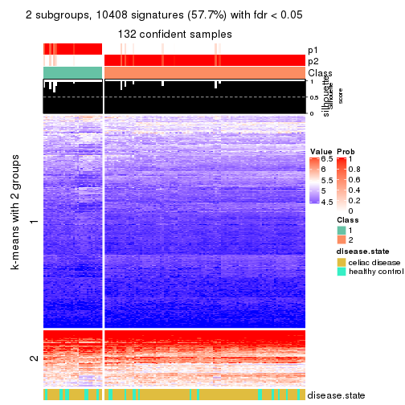</p>

</div>
<div id='tab-ATC-NMF-get-signatures-no-scale-2'>
<pre><code class="r">get_signatures(res, k = 3, scale_rows = FALSE)
</code></pre>

<p></p>

</div>
<div id='tab-ATC-NMF-get-signatures-no-scale-3'>
<pre><code class="r">get_signatures(res, k = 4, scale_rows = FALSE)
</code></pre>

<p></p>

</div>
<div id='tab-ATC-NMF-get-signatures-no-scale-4'>
<pre><code class="r">get_signatures(res, k = 5, scale_rows = FALSE)
</code></pre>

<p></p>

</div>
<div id='tab-ATC-NMF-get-signatures-no-scale-5'>
<pre><code class="r">get_signatures(res, k = 6, scale_rows = FALSE)
</code></pre>

<p></p>

</div>
</div>


Compare the overlap of signatures from different k:

```r
compare_signatures(res)
```


`get_signature()` returns a data frame invisibly. TO get the list of signatures, the function
call should be assigned to a variable explicitly. In following code, if `plot` argument is set
to `FALSE`, no heatmap is plotted while only the differential analysis is performed.

```r
# code only for demonstration
tb = get_signature(res, k = ..., plot = FALSE)
```

An example of the output of `tb` is:

```
#>   which_row         fdr    mean_1    mean_2 scaled_mean_1 scaled_mean_2 km
#> 1        38 0.042760348  8.373488  9.131774    -0.5533452     0.5164555  1
#> 2        40 0.018707592  7.106213  8.469186    -0.6173731     0.5762149  1
#> 3        55 0.019134737 10.221463 11.207825    -0.6159697     0.5749050  1
#> 4        59 0.006059896  5.921854  7.869574    -0.6899429     0.6439467  1
#> 5        60 0.018055526  8.928898 10.211722    -0.6204761     0.5791110  1
#> 6        98 0.009384629 15.714769 14.887706     0.6635654    -0.6193277  2
...
```

The columns in `tb` are:

1. `which_row`: row indices corresponding to the input matrix.
2. `fdr`: FDR for the differential test. 
3. `mean_x`: The mean value in group x.
4. `scaled_mean_x`: The mean value in group x after rows are scaled.
5. `km`: Row groups if k-means clustering is applied to rows.


UMAP plot which shows how samples are separated.


<script>
$( function() {
	$( '#tabs-ATC-NMF-dimension-reduction' ).tabs();
} );
</script>
<div id='tabs-ATC-NMF-dimension-reduction'>
<ul>
<li><a href='#tab-ATC-NMF-dimension-reduction-1'>k = 2</a></li>
<li><a href='#tab-ATC-NMF-dimension-reduction-2'>k = 3</a></li>
<li><a href='#tab-ATC-NMF-dimension-reduction-3'>k = 4</a></li>
<li><a href='#tab-ATC-NMF-dimension-reduction-4'>k = 5</a></li>
<li><a href='#tab-ATC-NMF-dimension-reduction-5'>k = 6</a></li>
</ul>
<div id='tab-ATC-NMF-dimension-reduction-1'>
<pre><code class="r">dimension_reduction(res, k = 2, method = &quot;UMAP&quot;)
</code></pre>

<p></p>

</div>
<div id='tab-ATC-NMF-dimension-reduction-2'>
<pre><code class="r">dimension_reduction(res, k = 3, method = &quot;UMAP&quot;)
</code></pre>

<p></p>

</div>
<div id='tab-ATC-NMF-dimension-reduction-3'>
<pre><code class="r">dimension_reduction(res, k = 4, method = &quot;UMAP&quot;)
</code></pre>

<p></p>

</div>
<div id='tab-ATC-NMF-dimension-reduction-4'>
<pre><code class="r">dimension_reduction(res, k = 5, method = &quot;UMAP&quot;)
</code></pre>

<p></p>

</div>
<div id='tab-ATC-NMF-dimension-reduction-5'>
<pre><code class="r">dimension_reduction(res, k = 6, method = &quot;UMAP&quot;)
</code></pre>

<p></p>

</div>
</div>


Following heatmap shows how subgroups are split when increasing `k`:

```r
collect_classes(res)
```


Test correlation between subgroups and known annotations. If the known
annotation is numeric, one-way ANOVA test is applied, and if the known
annotation is discrete, chi-squared contingency table test is applied.

```r
test_to_known_factors(res)
```

```
#>           n disease.state(p) k
#> ATC:NMF 132            0.164 2
#> ATC:NMF 111            0.245 3
#> ATC:NMF 117            0.435 4
#> ATC:NMF 112            0.422 5
#> ATC:NMF  85            0.102 6
```


If matrix rows can be associated to genes, consider to use `GO_Enrichment(res,
...)` to perform function enrichment for the signature genes.


 

## Session info


```r
sessionInfo()
```

```
#> R version 3.6.0 (2019-04-26)
#> Platform: x86_64-pc-linux-gnu (64-bit)
#> Running under: CentOS Linux 7 (Core)
#> 
#> Matrix products: default
#> BLAS:   /usr/lib64/libblas.so.3.4.2
#> LAPACK: /usr/lib64/liblapack.so.3.4.2
#> 
#> locale:
#>  [1] LC_CTYPE=en_GB.UTF-8       LC_NUMERIC=C               LC_TIME=en_GB.UTF-8       
#>  [4] LC_COLLATE=en_GB.UTF-8     LC_MONETARY=en_GB.UTF-8    LC_MESSAGES=en_GB.UTF-8   
#>  [7] LC_PAPER=en_GB.UTF-8       LC_NAME=C                  LC_ADDRESS=C              
#> [10] LC_TELEPHONE=C             LC_MEASUREMENT=en_GB.UTF-8 LC_IDENTIFICATION=C       
#> 
#> attached base packages:
#> [1] grid      parallel  stats     graphics  grDevices utils     datasets  methods   base     
#> 
#> other attached packages:
#>  [1] genefilter_1.66.0     ComplexHeatmap_2.1.1  markdown_1.1          knitr_1.26           
#>  [5] preprocessCore_1.46.0 cola_1.3.2            GEOquery_2.52.0       Biobase_2.44.0       
#>  [9] BiocGenerics_0.30.0   GetoptLong_0.1.7     
#> 
#> loaded via a namespace (and not attached):
#>  [1] bitops_1.0-6         matrixStats_0.55.0   bit64_0.9-7          doParallel_1.0.15   
#>  [5] RColorBrewer_1.1-2   httr_1.4.1           tools_3.6.0          backports_1.1.5     
#>  [9] R6_2.4.1             DBI_1.0.0            lazyeval_0.2.2       colorspace_1.4-1    
#> [13] withr_2.1.2          tidyselect_0.2.5     gridExtra_2.3        bit_1.1-14          
#> [17] compiler_3.6.0       xml2_1.2.2           microbenchmark_1.4-7 pkgmaker_0.28       
#> [21] slam_0.1-46          scales_1.1.0         readr_1.3.1          NMF_0.23.6          
#> [25] stringr_1.4.0        digest_0.6.23        pkgconfig_2.0.3      bibtex_0.4.2        
#> [29] highr_0.8            limma_3.40.6         rlang_0.4.2          GlobalOptions_0.1.1 
#> [33] RSQLite_2.1.2        impute_1.58.0        shape_1.4.4          mclust_5.4.5        
#> [37] dendextend_1.12.0    dplyr_0.8.3          RCurl_1.95-4.12      magrittr_1.5        
#> [41] Matrix_1.2-17        Rcpp_1.0.3           munsell_0.5.0        S4Vectors_0.22.1    
#> [45] viridis_0.5.1        lifecycle_0.1.0      stringi_1.4.3        plyr_1.8.4          
#> [49] blob_1.2.0           crayon_1.3.4         lattice_0.20-38      splines_3.6.0       
#> [53] annotate_1.62.0      circlize_0.4.9       hms_0.5.2            zeallot_0.1.0       
#> [57] pillar_1.4.2         rjson_0.2.20         rngtools_1.4         reshape2_1.4.3      
#> [61] codetools_0.2-16     stats4_3.6.0         XML_3.98-1.20        glue_1.3.1          
#> [65] evaluate_0.14        png_0.1-7            vctrs_0.2.0          foreach_1.4.7       
#> [69] polyclip_1.10-0      gtable_0.3.0         purrr_0.3.3          tidyr_1.0.0         
#> [73] clue_0.3-57          assertthat_0.2.1     ggplot2_3.2.1        xfun_0.11           
#> [77] gridBase_0.4-7       eulerr_6.0.0         xtable_1.8-4         skmeans_0.2-11      
#> [81] survival_2.44-1.1    viridisLite_0.3.0    tibble_2.1.3         iterators_1.0.12    
#> [85] AnnotationDbi_1.46.1 registry_0.5-1       memoise_1.1.0        IRanges_2.18.3      
#> [89] cluster_2.1.0        brew_1.0-6
```


